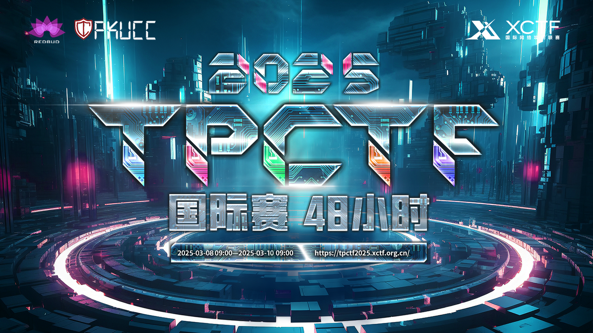
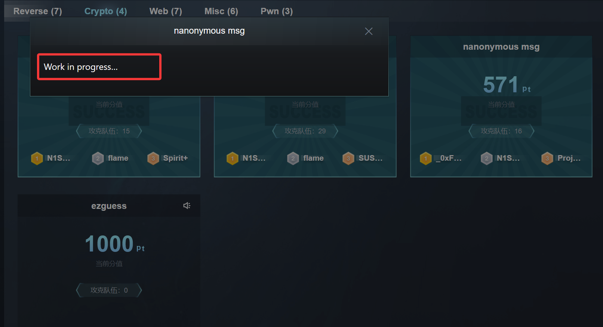
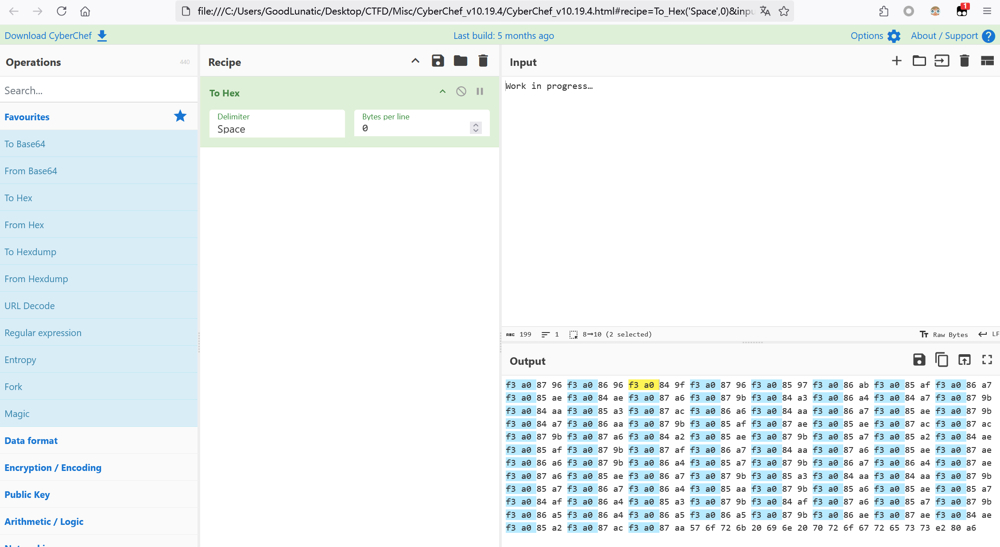

**经典脑王系列，周末抽空上去看了看题**
<!--more-->

|  |
| :-----------------------------------: |
|                 题目附件：                 |
## 题目名称 raenil

签到，用`qrazybox`手动修复二维码并扫码即可

## 题目名称 nanonymous spam

题面信息如下：

> Due to the influx of spam messages, the administrator has temporarily closed the anonymous message board.
> 
> Can you identify the sender behind the spam messages?

发现用户的ID是根据用户的IP地址生成的，然后IP检测的是`X-Real-IP`字段

写脚本爆破生成用户名的表，然后根据题目给的用户名去查表得到最后的IP即可

## 题目名称 nanonymous msg

> 这道题虽然放在密码栏目中，但是其实是一道Misc题

题目就只给了题面中的信息



直接复制题面中的字符串放到CyberChef中`To Hex`可以发现字符串中藏了一些东西



直接把隐藏的字符的十六进制值复制出来

```python
f3 a0 87 96 
f3 a0 86 96 
f3 a0 84 9f 
f3 a0 87 96 
f3 a0 85 97 
f3 a0 86 ab 
f3 a0 85 af 
f3 a0 86 a7 
f3 a0 85 ae 
f3 a0 84 ae 
f3 a0 87 a6 
f3 a0 87 9b 
f3 a0 84 a3 
f3 a0 86 a4 
f3 a0 84 a7 
f3 a0 87 9b 
f3 a0 84 aa 
f3 a0 85 a3 
f3 a0 87 ac 
f3 a0 86 a6 
f3 a0 84 aa 
f3 a0 86 a7 
f3 a0 85 ae 
f3 a0 87 9b 
f3 a0 84 a7 
f3 a0 86 aa 
f3 a0 87 9b 
f3 a0 85 af 
f3 a0 87 ae 
f3 a0 85 ae 
f3 a0 87 ac 
f3 a0 87 ac 
f3 a0 87 9b 
f3 a0 87 a6 
f3 a0 84 a2 
f3 a0 85 ae 
f3 a0 87 9b 
f3 a0 85 a7 
f3 a0 85 a2 
f3 a0 84 ae 
f3 a0 85 af 
f3 a0 87 9b 
f3 a0 87 af 
f3 a0 86 a7 
f3 a0 84 aa 
f3 a0 87 a6 
f3 a0 85 ae 
f3 a0 87 ae 
f3 a0 86 a6 
f3 a0 87 9b 
f3 a0 86 a4 
f3 a0 85 a7 
f3 a0 87 9b 
f3 a0 86 a7 
f3 a0 86 a4 
f3 a0 87 ae 
f3 a0 87 a6 
f3 a0 85 ae 
f3 a0 86 a7 
f3 a0 87 9b 
f3 a0 85 a3 
f3 a0 84 aa 
f3 a0 84 aa 
f3 a0 87 9b 
f3 a0 85 a7 
f3 a0 86 a7 
f3 a0 86 a4 
f3 a0 85 aa 
f3 a0 87 9b 
f3 a0 85 a6 
f3 a0 85 ae 
f3 a0 85 a7 
f3 a0 84 af 
f3 a0 86 a4 
f3 a0 85 a3 
f3 a0 87 9b 
f3 a0 84 af 
f3 a0 87 a6 
f3 a0 85 a7 
f3 a0 87 9b 
f3 a0 86 a5 
f3 a0 86 a4 
f3 a0 86 a5 
f3 a0 86 a5 
f3 a0 87 9b 
f3 a0 86 ae 
f3 a0 87 ae 
f3 a0 84 ae 
f3 a0 85 a2 
f3 a0 87 ac 
f3 a0 87 aa 
```

去Google上搜上面的十六进制，可以搜到下面这个网站：

https://www.utf8-chartable.de/unicode-utf8-table.pl?start=917760