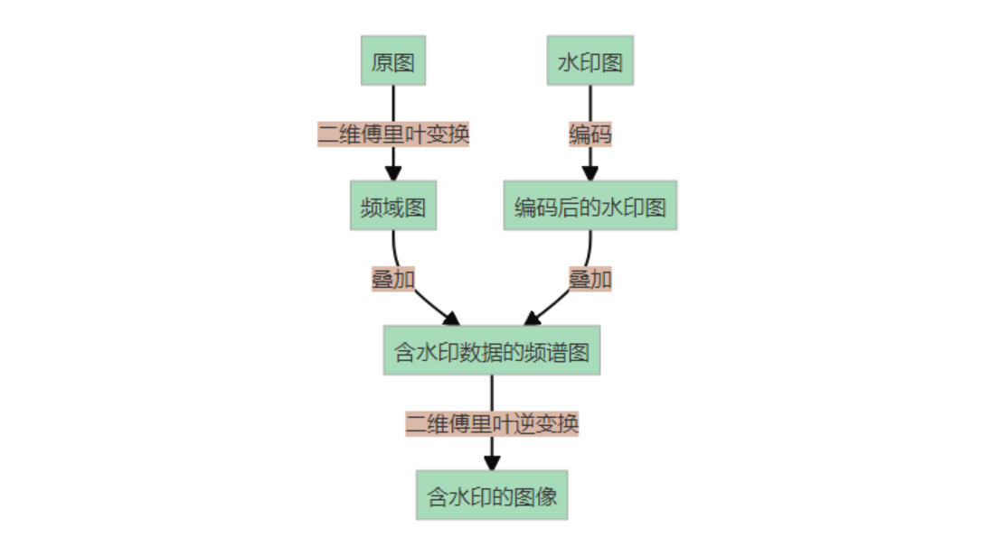

最近做 Misc 题的时候经常碰到盲水印的题目，虽然可以使用B神的 Puzzle Solver 一把梭
但是还是打算深入学习一下
<!--more-->
本文的参考链接如下：
https://hasegawaazusa.github.io/blind-water-mark-note.html
https://github.com/guofei9987/blind_watermark
https://github.com/chishaxie/BlindWaterMark


## 一张图片的盲水印


## 两张图片的盲水印

图片加盲水印的流程大致如下所示：


### 频域盲水印

频域盲水印的流程大致如下所示：



####  [开源项目1](https://github.com/chishaxie/BlindWaterMark)
TIps：该项目需要提供原图才能提取盲水印
使用流程如下
```bash
# 添加盲水印
python bwmforpy3.py encode lena.png wm.png lena_with_wm.png
# 提取盲水印
python bwmforpy3.py decode lena.png wm.png lena_with_wm.png
```