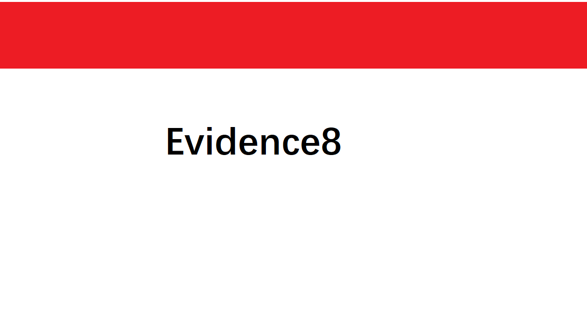

# 2020 B01lers Misc Image_adjustments 赛题详解

**在群里偶然看到了这道题，当初刷题的时候没有刷到过，感觉挺有意思的，就打算深入分析一下。**

<!--more-->

这个题目在 [BUUOJ](https://buuoj.cn/challenges) 上可以搜到

[题目来源](https://github.com/b01lers/b01lers-ctf-2020/tree/master/misc/image_adjustments)

题目附件首先是给了这样一张杂乱的图片，比较明显的是有大量的红色和黑色的像素


用PS打开仔细查看一下，可以发现每一列都有且仅有一段长度相同的红色像素段


于是猜想要从红色的像素段入手解题，把每一列的像素都根据红色像素段平移，直到对齐所有的红色像素段

脚本的思路就是：爆破偏移量，然后判断四个像素值即可，其中两个是白色，其中两个是红色，简单来说就是判断红色和白色相接的位置

解题脚本如下

```python
from PIL import Image
from random import randint

f = './attachment.png'

img = Image.open(f)

print('Width: {}\n'.format(img.size[0]))
print('Height: {}\n'.format(img.size[1]))

pixels = img.load()
for r in range(img.size[0]):
    backup_row = []
    # 将每一列的像素都拷贝到新的列表中
    for c in range(img.size[1]):
        backup_row += [pixels[r, c]]
    done = False
    # 爆破每列的偏移量
    for i in range(0, img.size[1]):
        if done:
            break
        # 根据偏移量重新排列每列的像素
        for c in range(img.size[1]):
            pixels[r, (c + i) % img.size[1]] = backup_row[c]
            # 判断红色像素段是否对齐
            if (pixels[r, 2] == (255, 0, 0, 255) and pixels[r, 12] == (255, 0, 0, 255) and pixels[r, 1] == (255, 255, 255, 255) and pixels[r, 50] == (255, 255, 255, 255)):
                done = True
                print("Done: {}".format(r))

img.show()
```

脚本运行完即可得到下面这张图片,flag就在里面


然后群里看到的题目是这张图片，原理还是一样的，就红色像素段的长度和像素值稍微改了一下


这里就直接给出解题脚本了，其实就是上面那个脚本稍微改了一下

```python
from PIL import Image


f = './file.png'

img = Image.open(f)

print('Width: {}\n'.format(img.size[0]))
print('Height: {}\n'.format(img.size[1]))

pixels = img.load()

# for r in range(img.size[0]):
#     for c in range(img.size[1]):
#         print(pixels[r, c])

for r in range(img.size[0]):
    backup_row = []
    # 将每一列的像素都拷贝到新的列表中
    for c in range(img.size[1]):
        backup_row += [pixels[r, c]]
    done = False
    # 爆破每列的偏移量
    for i in range(0, img.size[1]):
        if done:
            break
        # 根据偏量重新排列每列的像素移
        for c in range(img.size[1]):
            pixels[r, (c + i) % img.size[1]] = backup_row[c]
            # 判断红色像素段是否对齐
            if (pixels[r, 4] == (237, 28, 36, 255) and pixels[r, 141] == (237, 28, 36, 255) and pixels[r, 3] == (255, 255, 255, 255) and pixels[r, 142] == (255, 255, 255, 255)):
                done = True
                print("Done: {}".format(r))

img.save("solved.png")
img.show()
```

运行脚本后即可得到这张图片



附：出题脚本

```python
from PIL import Image
from random import randint
import sys

f = './image_original.png'

img = Image.open(f)

print('Width: {}\n'.format(img.size[0]))
print('Height: {}\n'.format(img.size[1]))

pixels = img.load()

for r in range(img.size[0]):
    # for c in range(img.size[1]):
    #     print('{}: {}'.format(c, pixels[r, c]))
    backup_row = []
    for c in range(img.size[1]):
        backup_row += [pixels[r, c]]

    start = randint(0, img.size[1])
    for c in range(img.size[1]):
        pixels[r, (c + start) % img.size[1]] = backup_row[c]

img.save('./image_edited.png')
img.show()
```


---

> 作者: [Lunatic](https://goodlunatic.github.io)  
> URL: https://goodlunatic.github.io/posts/00658ee/  

