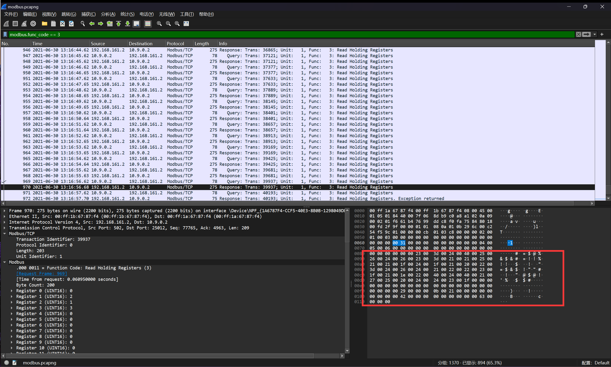
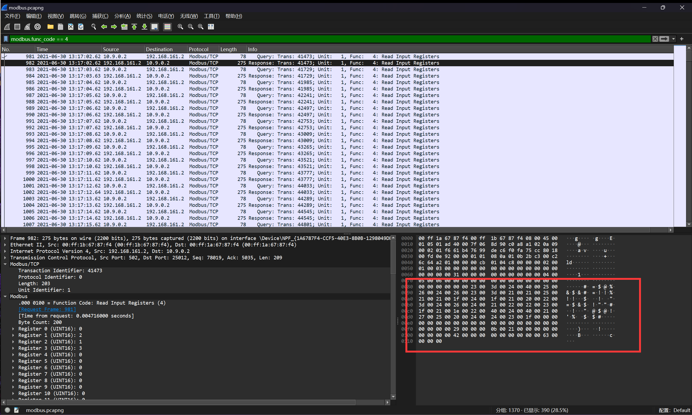
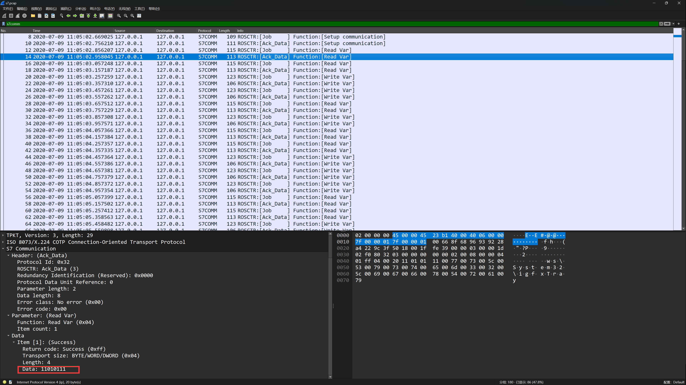
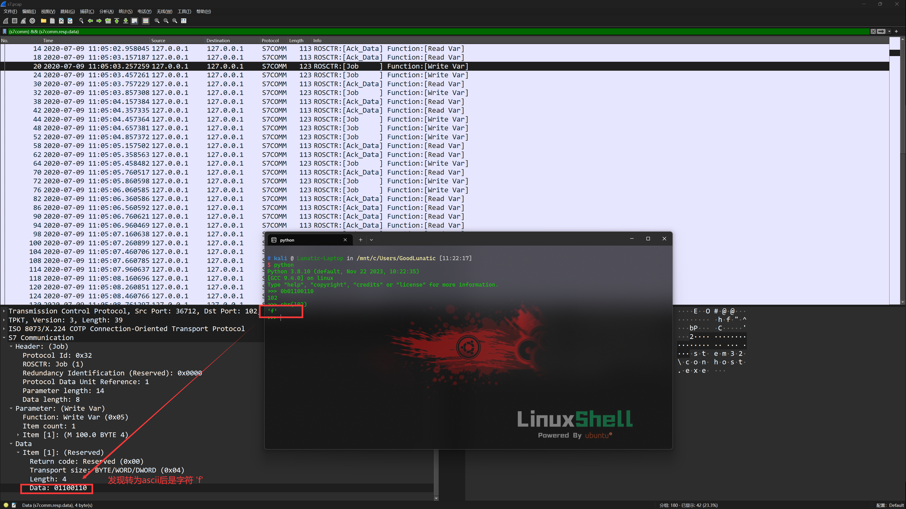
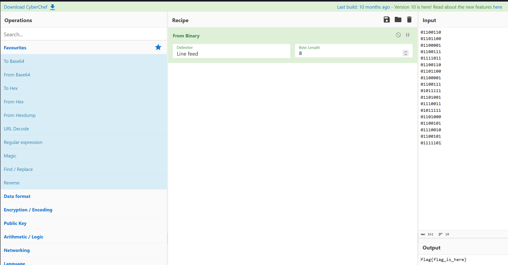

# CTF-ICS Learning Record

越来越多的比赛中出现工控相关的赛题，因此打算借这个机会学习一下。
&lt;!--more--&gt;

# 工控协议分析

## 工控流量分析

参考连接：https://blog.csdn.net/song123sh/article/details/128387982

将流量按长度降序排列，然后在各层寻找线索，

显示分组字节，从base64后开始，然后解码看文件类型，最后显示成该类型

### Modbus 协议分析

Modbus 流量主要有三类：Modbus/RTU、Modbus/ASCII、Modbus/TCP

**Modbus/RTU**
&gt;从机地址1B&#43;功能码1B&#43;数据字段xB&#43;CRC值2B
&gt;最大长度256B，所以数据字段最大长度252B

**Modbus/ASCII**
&gt;由Modbus/RTU衍生，采用0123456789ABCDEF 表示原本的从机地址、功能码、数据字段，并添加开始结束标记，所以长度翻倍
开始标记:（0x3A）1B&#43;从机地址2B&#43;功能码2B&#43;数据字段xB&#43;LRC值2B&#43;结束标记\r\n2B
最大长度513B，因为数据字段在RTU中是最大252B，所以在ASCII中最大504B

**Modbus/TCP**
&gt;不再需要从机地址，改用UnitID；不再需要CRC/LRC，因为TCP自带校验
传输标识符2B&#43;协议标识符2B&#43;长度2B&#43;从机ID 1B&#43;功能码1B&#43;数据字段xB

一般题目考察 Modbus/TCP 比较多，然后主要考察的就是下面这种功能码（这里只列了部分）
因此解题的时候配合过滤器一个个功能码看过去就行
&gt;1：读线圈
2：读离散输入
3：读保持
4：读输入
5：写单个线圈
6：写单个保持
15：写多个线圈
16：写多个保持

如果题目考察的是查找异常流量，那么我们只要依次查看每个 func_code，然后根据字段排除正常流量

因为大部分的流量都是正常，异常的流量肯定是小部分

例如 

先查看 (modbus) &amp;&amp; (modbus.func_code == 17)，发现有很多 modbus.data == 06:00:00 的流量

因此过滤 modbus.data == 06:00:00 的流量：((modbus) &amp;&amp; (modbus.func_code == 17)) &amp;&amp; !(modbus.data == 06:00:00)

就是依次过滤正常流量，最后剩下来的就是异常流量了
#### 例题1 HNGK-Modbus流量分析
使用下面这个过滤器命令即可得到 flag
```
(((_ws.col.protocol == &#34;Modbus/TCP&#34;) ) &amp;&amp; (modbus.byte_cnt)) &amp;&amp; (modbus.func_code == 16)
```

flag{TheModbusProtocolIsFunny!}

#### 例题1 HNGK-Modbus协议分析

题目附件给了一个流量包，稍微翻一下，发现 modbus.func_code 只有四种情况：2、3、4、16

2和16的情况中没有发现什么异常，但是3和4的流量包中寄存器的值存在异常

modbus.func_code == 3 的情况中寄存器的值一直在增加，直到变成下图中的内容



而 modbus.func_code == 4 的情况则是一直在读寄存器的内容，寄存器中的内容和上面是一样的



因此猜测题目逻辑大概就是，3先写入寄存器的值，然后由4读取并发送

接下来我们就重点分析这段数据的内容，因为有不可见字符，所以我们复制为 Hex 格式


(((modbus) &amp;&amp; (modbus.func_code == 3)) &amp;&amp; (ip.src == 192.168.161.2)) &amp;&amp; (modbus.byte_cnt)


### S7comm 协议分析
&gt; 西门子设备的工控协议，基于 COTP 实现，是COTP的上层协议
&gt; 主要有三种类型：Job(1)、Ack_Data(3)/Ack(2)、Userdata(7)
&gt; Job：下发任务/指令
&gt; Ack_Data：带有返回数据
&gt; Ack：单纯确认，含有数据
&gt; Userdata：用户自定义数据区，也包含功能指令

#### 例题1 2020ICSC湖州站—工控协议数据分析

首先过滤出S7协议的数据包，发现在一些Ack_Data的数据包中传输了二进制数据

因此，我们将所有带有二进制数据的数据包都过滤出来，发现一些Job的数据包中也有二进制数据

然后我们尝试将所有带有二进制数据的Job数据包都过滤出来并导出特定分组，过滤器代码如下
```bash
((s7comm) &amp;&amp; (s7comm.resp.data)) &amp;&amp; (s7comm.param.func == 0x05)
```


然后使用 tshark 提取数据
```tshark
tshark -r 1.pcap -T fields -e s7comm.resp.data | uniq
```


最后 CyberChef 解码二进制即可得到 flag

#### 例题2 2020ICSC济南站—被篡改的数据
翻看流量包，发现很多 S7COMM 数据包，使用过滤器过滤，发现 s7comm.resp.data 字段传了很多 66 数据
使用过滤器过滤出传了 s7comm.resp.data 字段数据但数据不是 66 的 S7 数据包
发现了疑似 flag 的数据，为了防止 flag 中含有 f 字符而被过滤
因此我们使用下面这个过滤命令进行过滤，然后导出特定分组
```
(((frame.number &gt;= 19987 &amp;&amp; frame.number &lt;=20032) &amp;&amp; (_ws.col.protocol == &#34;S7COMM&#34;)) &amp;&amp; (s7comm.param.func == 0x05)) &amp;&amp; (s7comm.resp.data)
```
最后 tshark 提取出数据，然后十六进制解码即可得到 flag：flag{93137ad4a}

#### 例题3 枢网智盾2021—异常流分析
打开流量包，发现很多 S7comm 流量，然后稍微过滤一下，发现是写入数据的流量
然后写入的数据几乎都是 ffff 开头的，因此我们直接查看不是 ffff 开头的数据
```
((_ws.col.protocol == &#34;S7COMM&#34;) &amp;&amp; (s7comm.param.func == 0x05)) &amp;&amp; (s7comm.resp.data[0:2] != ff:ff)
```
即可得到 flag：flag{ffad28a0ce69db34751f}
#### 例题4 枢网智盾2021—工控协议分析
```
(_ws.col.protocol == &#34;S7COMM&#34;) &amp;&amp; (frame.number == 418)
```

然后直接把明文传输的数据 base64 解码即可

flag{hncome66!}

## 工控编程与组态分析

需要用到的软件：
1. McgsPro
2. 组态王
3. 西门子-博图软件
4. STEP7 MicroWIN V4.0 SP9

TODO

---

> Author: [Lunatic](https://goodlunatic.github.io)  
> URL: http://localhost:1313/posts/01ebd40/  

