# Review of Software-Testing

学校里的《软件质量保证与测试》课程
<!--more-->
## 2.5单元测试

### 单元的定义

一个函数  
类或类的成员函数  
几个函数的集合

### 单元测试的定义

单元测试是对软件基本组成单元进行测试，主要是为了发现单元内部可能存在的各种错误和不足  
主要工作分为两个步骤：人工静态检查和动态执行跟踪  
一般由开发组在开发组长监督下进行

### 单元测试的主要任务

在单元测试时，测试者需要依据详细设计说明书和源程序清单，了解该模块的I/O条件和模块的逻辑结构，主要采用白盒测试方法，辅之以黑盒测试方法设计测试用例，使之对任何合理的和不合理的输入，都能鉴别和响应。   
模块接口测试  
局部数据结构测试  
路径测试  
错误处理测试  
边界测试

### 单元测试环境

1、详细设计说明书  
2、源程序清单  
3、驱动模块  
4、桩模块

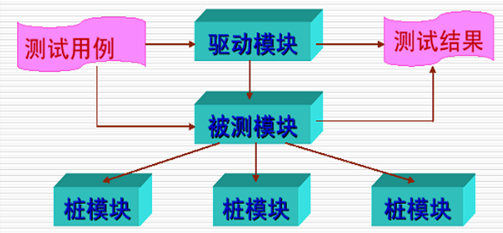

### 设计测试用例的思路

为系统运行设计测试用例  
为正向测试设计用例  
为逆向测试设计用例  
为满足特殊需求设计测试用例  
为代码覆盖设计用例

### 优势

 单元测试体现了尽早测试原则  
 单元测试有助于提高代码质量  
 单元测试也可以理解为一种编写文档的行为

### 驱动模块和桩模块

驱动模块是用来模拟被测试模块的上一级模块，相当于被测模块的主程序。它接收数据，将相关数据传送给被测模块，启用被测模块，并打印出相应的结果。  
简单说就是你负责测试的模块没有main()方法入口，所以需要写一个带main的方法来调用你的模块或方法。这个就是驱动测试

桩程序（Stub），也称桩模块，是指模拟被测试的模块所调用的模块，而不是软件产品的组成的部分，用以模拟被测模块工作过程中所调用的下层模块。  
桩是指用来代替关联代码或者未实现的代码。如果函数B用B1来代替，那么，B称为原函数，B1称为桩函数。打桩就是编写或生成桩代码。

## 2.6集成测试

### 四种集成测试方法的名称

1.大爆炸集成  
2.自顶向下集成  
3.自底向上集成  
4.三明治集成

### 给程序架构图、指定集成策略、按顺序画出集成策略的步骤图

大爆炸集成

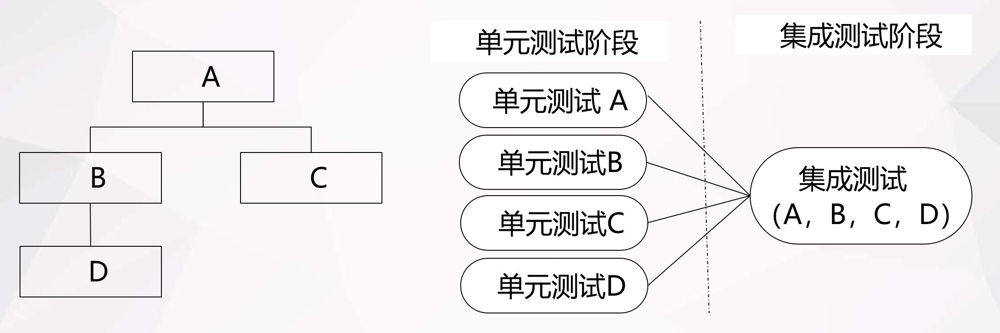

自顶向下集成

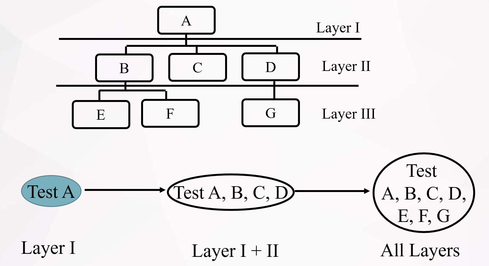

自底向上集成


三明治集成

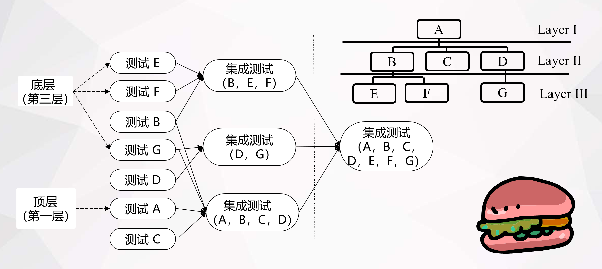

## 3.1黑盒测试方法概述

## 3.2黑盒测试——边界值分析法

### 一般性测试时输入变量取：

最小值(min)  
略高于最小值(min+)  
正常值(nom)  
略低于最大值(max-)  
最大值(max)

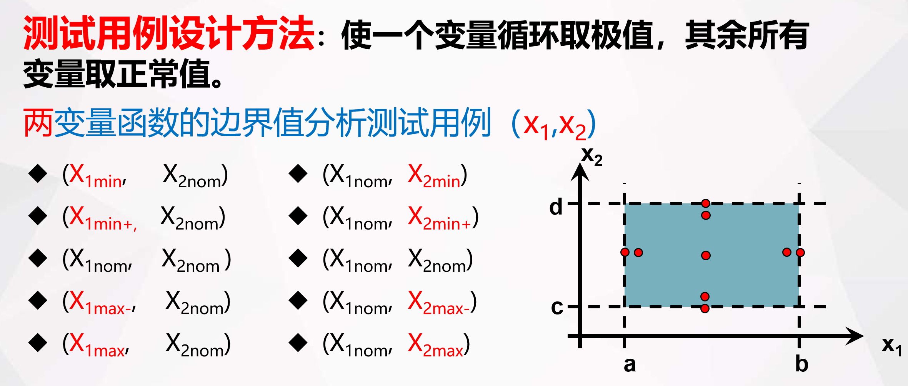

结论：对于一个n变量函数，测试用例数为4n+1个

### 健壮性测试时输入变量取：

最小值(min)  
略高于最小值(min+)  
正常值(nom)  
略低于最大值(max-)  
最大值(max)  
略超过最大值(max+)  
略低于最小值(min-)

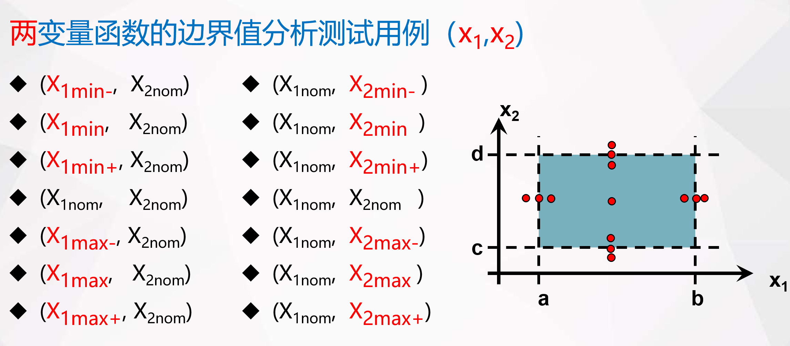

结论：对于一个n变量函数，测试用例数为6n+1个

### 最坏情况测试

最坏情况测试用例：  
    所有变量均可取最小值(min)、略高于最小值(min+)、正常值(nom)、略低于最大值(max-)、最大值(max) 这五个值中的任何一个  
    结论：测试用例为五个集合的笛卡儿乘积，n变量的最坏情况测试会产生5^n个测试用例  
健壮最坏情况测试用例：  
    所有变量均可取略低于最小值(min-)，最小值(min)、略高于最小值(min+)、正常值(nom)、略低于最大值(max-)、最大值(max) ，略超过最大值(max+)这七个值中的任何一个。  
    结论：n变量的健壮最坏情况测试会产生7^n个测试用例

### 边界值测试不同情况下的用例数

边界值测试用例数：4n+1  
边界值健壮测试用例数：6n+1  
最坏情况下边界值一般性测试用例数：5^n  
最坏情况下边界值健壮性测试用例数：7^n

## 3.3黑盒测试——等价类测试

等价划分法是一种不需要考虑程序的内部结构，只需要考虑程序输入数据的黑盒测试方法，它将不能穷举的测试过程进行合理分类，从而保证设计出来的测试用例具有完整性和代表性。  
​  
需要把用户所有可能输入的数据划分成若干份（若干个子集），然后从每一个子集中选取少数并且具有代表性的数据作为测试用例的数据，这种方法被称为等价类划分法。  
​  
在有限的测试资源的情况下，用少量且有代表性的数据进行测试会得到比较好的测试效果。

### 1.等价类划分

等价类划分的基本思想是把可能用到的数据划分为不同的类别，然后再从每一类别里面挑选有代表性的数据。这样挑选出来的数据就可以代表这一类里面的全部数据。通过这种方式，可以减少测试用例的数量。

### 2.等价类分类

等价类可以等同于有效等价类和无效等价类的组合

（1）有效等价类：指符合范围文档描述，输入合理的数据集合。  
（2）无效等价类：指不符合需求文档描述，输入不合理的数据集合。

### 等价类测试的用例数

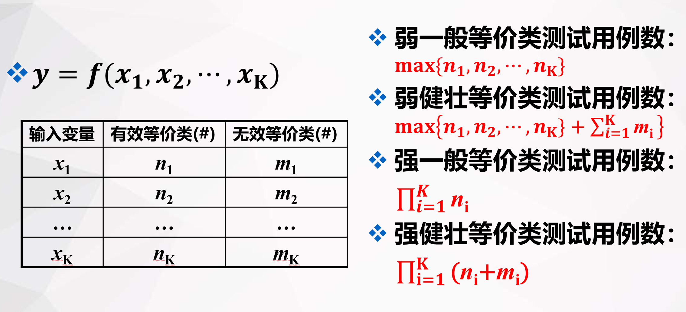

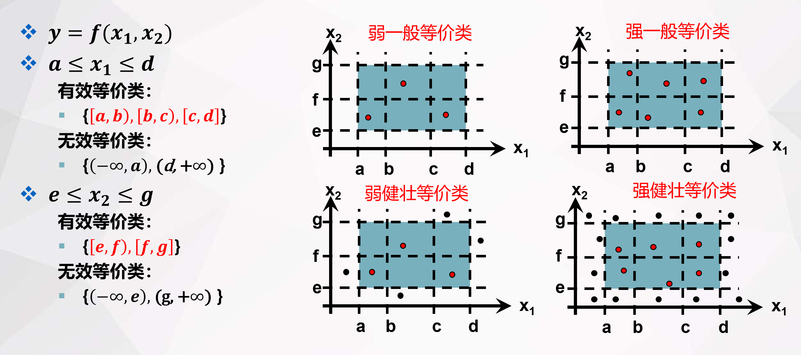

### 等价类测试用例设计步骤：

为每一个等价类规定一个唯一的编号；  
设计一个新的测试用例,使其尽可能多地覆盖尚未被覆盖的有效等价类, 重复这一步，直到所有的有效等价类都被覆盖为止；  
设计一个新的测试用例,使其仅覆盖一个尚未被覆盖的无效等价类, 重复这一步，直到所有的无效等价类都被覆盖为止。

### 等价类测试法的原则和指导方针

弱等价类测试（一般或弱健壮）不如对应的强形式的测试全面。  
强类型程序设计语言不需要健壮性测试。  
如果错误条件非常重要，适合采用健壮性测试。  
如果输入数据以离散值区间和集合定义，则等价类测试是合适的。  
同边界值测试方法相结合，可以大大增加等价类测试方法的测试能力。  
如果程序的函数很复杂，则适合采用等价类测试。  
强等价类测试会导致测试用例冗余性问题。  
在发现“合适”的等价关系之前，可能需要进行多次尝试。

## 3.4黑盒测试——决策表测试

### 组成

| 桩   | 条目   |
| --- | ---- |
| 条件桩 | 条件条目 |
| 行动桩 | 行动条目 |

条件桩：列出了问题的所有条件，通常认为列出的条件的次序无关紧要。  
动作桩：列出了问题规定可能采取的操作，这些操作的排列顺序没有约束。  
条件项：列出针对它左列条件的取值，在所有可能情况下的真假值。  
动作项：列出在条件项的各种取值情况下应该采取的动作。  
规则：任何一个条件组合的特定取值及其相应要执行的操作称为规则。 

有限条目决策表：所有条件都是二值条件（真/假）

扩展条目决策表：条件可能有多个值

### 决策表建立的步骤

1.列出所有的条件桩和行动桩  
2.确定规则的个数  
3.填入条件项  
4.填入动作项  
5.合并相似规则

### 决策表测试法原则与指导方针

每种测试方法都有使用的范围，基于决策表测试方法通常适用于要产生大量决策的情况。一般来说，决策表测试方法用于具有如下特征的应用程序：  
    if-then-else逻辑关系突出；  
    输入变量之间存在逻辑关系；  
    计算过程涉及对输入变量子集的处理；  
    输入与输出之间存在着因果关系；  
    圈复杂度较高的应用  
在建立决策表的过程中不容易一步到位，采用迭代的方法逐步优化；  
决策表规模的增长方式不佳，有n个条件的有限项决策表有2n条规则，在实际应用中，可以采取扩展决策表、使用代数方法简化决策表。

## 3.5黑盒测试——因果图测试

### 因果图适用场景

等价类划分法和边界值分析法都是着重考虑输入条件，但没有考虑输入条件的组合以及制约关系。如果在测试时必须考虑输入条件的各种组合，那组合的数目可能是天文数字，所以必须考虑采用一种合适的方法对条件组合进行分析，简化。最终目的是用最少的测试用例覆盖最全面的场景。

### 因果图中的基本符号

原因与结果之间的关系

1.恒等：若原因出现，则结果出现；若原因不出现，则结果也不出现。恒等关系“—”来表示。  
2.非：若原因出现，则结果不出现；若原因不出现，则结果出现。非的关系用 “ ~ ” 表示。  
3.或：有多个原因，若几个原因中有一个成立，则结果出现；若几个原因都不成立，则结果不出现。或的关系用 “ V ” 来表示。  
4.与：有多个原因，只有几个原因都成立，结果才出现；若其中一个原因不成立，则结果不出现。与的关系用 “ ^ ” 来表示。

### 因果图中的约束条件

原因与原因之间的约束关系

1.互斥 E：a、b、c 只能有一个成立，但是可以都不成立。<=1  
2.包含 I：a、b、c 中至少有一个成立。可以多选但不能不选。>=1  
3.唯一 O：a、b、c 中有且只有一个成立。=1  
4.要求 R：当C1出现时，C2必须出现；C1不出现时，C2不做要求。

结果与结果之间的约束关系

强制屏蔽 M：当E1是1时，E2必须是0；E1为0时，E2的值不确定。

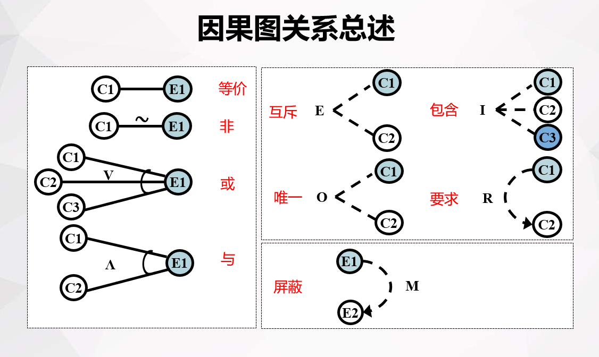

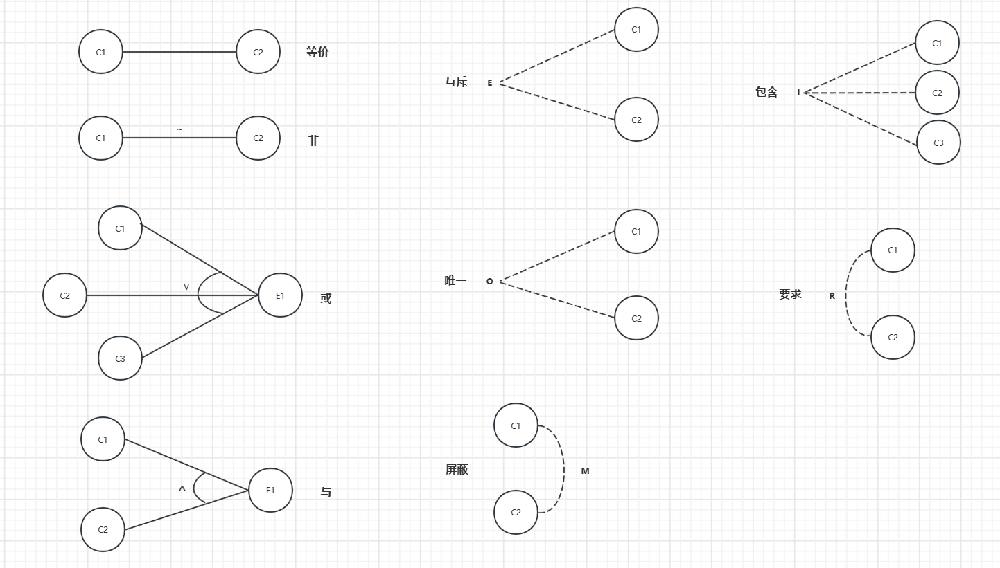

### 因果图法基本步骤

1.找出所有的原因，原因即输入条件或输入条件的等价类。  
2.找出所有的结果，结果即输出条件。  
3.明确所有输入条件之间的制约关系以及组合关系，判断条件是否可以组合。  
4.明确所有输出条件之间的制约关系以及组合关系，判断结果是否可以同时输出。  
5.找出不同输入条件组合会产生哪些输出结果。  
6.将因果图转换成判定表或决策树。  
7.判定表或决策表中每一列表示的情况设计测试用例

### 示例

交通一卡通自动充值软件系统。系统只接收 50 或 100 元纸币，一次只能使用一张纸币，一次的充值金额只能为 50 或 100 元。  
明确输入的条件为：  
1.选择投币 50 元  
2.选择投币 100 元  
3.选择充值 50 元  
4.选择充值 100 元  
​  
明确输出的结果为：  
a. 完成充值、退卡  
b. 提示充值成功  
c. 找零  
d. 提示错误

分析输入条件
1、不能组合的条件   
    条件 1 和 2 不能同时成立；  
    条件 3 和 4 不能同时成立。  
2、可以组合的条件   
    条件 1 和 3 可以同时成立；      
    条件 1 和 4 可以同时成立；  
    条件 2 和 3 可以同时成立；  
    条件 2 和 4 可以同时成立；  
    条件 1 2 3 4 可以单独出现。

分析输入条件
1、不能组合的输出结果（互斥关系）   
    输入 a 和 d 不能同时出现；  
    输出 b 和 d 不能同时出现。  
2、可以组合的输出结果（要求）   
    输出 a 和 b 一定会同时出现（要求）；  
    输出 a、b、c可以同时出现；  
    输出 c、d可以同时出现；  
    输出 d 单独存在。

这里只给出其中一种情况的图示（其余同理）

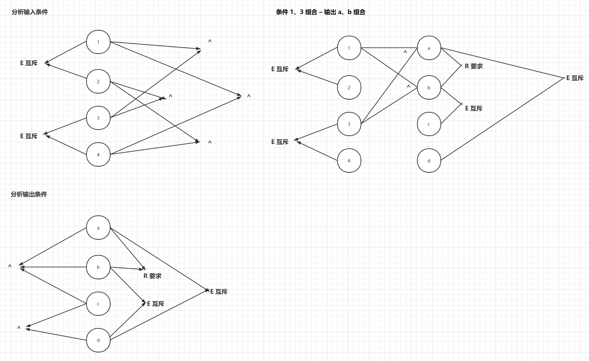

由图转化为表格

|输入|1|2|3|4|5|6|7|8|
|---|---|---|---|---|---|---|---|---|
|1.投入50元|1|1|||1||||
|2.投入100元|||1|1||1|||
|3.充值50元|1||1||||1||
|4.充值100元||1||1||||1|
|输出|||||||||
|a.完成充值，退卡|1||1|1|||||
|b.提示充值成功|1||1|1|||||
|c.找零||1|1||1|1|||
|d.错误提示||1|||1|1|1|1|

### 优缺点

优点  
1.考虑了输入情况的各种组合以及各个输入情况之间的相互制约关系。  
2.能够帮助测试人员按照一定的步骤，高效率的开发测试用例。  
3.因果图法是将自然语言规格说明转化成形式语言规格说明的一种严格的方法，可以指出规格说明存在的不完整性和二义性。  
缺点  
1.作为输入条件的原因与输出结果之间的因果关系，有时很难从软件需求规格说明中得到。  
2.通常因果关系非常庞大，以至于基于因果图而得到的测试用例太多，给软件测试，特别是手工测试带来沉重的负担。

## 3.6黑盒测试——场景法

### 定义

场景法一般包含基本流和备用流，从一个流程开始，通过描述经过的路径来确定的过程，经过遍历所有的基本流和备用流来完成整个场景。

### 基本流与备选流

## 4.1白盒测试——概述

## 4.2白盒测试——逻辑覆盖

### 定义

逻辑覆盖是以程序的内部逻辑结构为基础的测试用例设计技术，  
-语句覆盖   -条件组合覆盖  
-判定覆盖   -路径覆盖  
-条件覆盖   -点覆盖  
-判定条件覆盖    -边覆盖

### 语句覆盖

设计足够的测试用例，使得程序中的每个语句至少执行一次。

### 判定覆盖（分支覆盖）

设计足够的测试用例，使得在语句覆盖的基础上，程序中每个判定的取“真”分支和取“假”分支至少都执行一次，判定覆盖又称分支覆盖。

### 条件覆盖

设计足够的测试用例，在语句覆盖的基础上使得程序判定中的每个条件都能获得各种可能的结果。

条件覆盖不包含判定覆盖，判定覆盖也不包含条件覆盖

### 判定/条件覆盖

设计足够的测试用例，使得判定中的每个条件都取到各种可能的值，而且每个判定表达式也都取到各种可能的结果。

### 条件组合覆盖

设计足够的测试用例，使得每个判定中的条件的各种可能组合都至少出现一次。

条件组合覆盖不包含路径覆盖

### 路径覆盖

设计足够多的测试数据，使得程序中的每一条可行路径都至少执行一次。

路径覆盖不包含条件组合覆盖

点覆盖

点覆盖定义：如果连通图Ｇ的子图Ｇ’是连通的，而且包含Ｇ的所有结点，则称Ｇ’是Ｇ的点覆盖。  
由于流程图的每个结点与程序中的一条或多条语句相对应，因此，点覆盖和语句覆盖标准是一致的。

边覆盖

边覆盖定义：如果连通图Ｇ的子图Ｇ”是连通的，而且包含Ｇ的所有边，则称Ｇ”是Ｇ的边覆盖。  
边覆盖和判定覆盖标准是一致的。

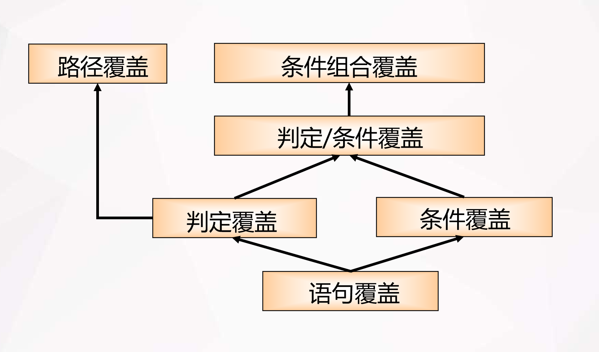

## 4.3白盒测试——基于N-S图的测试

估算最少测试用例数的方法  
不断拆分，上下相乘，左右相加即可

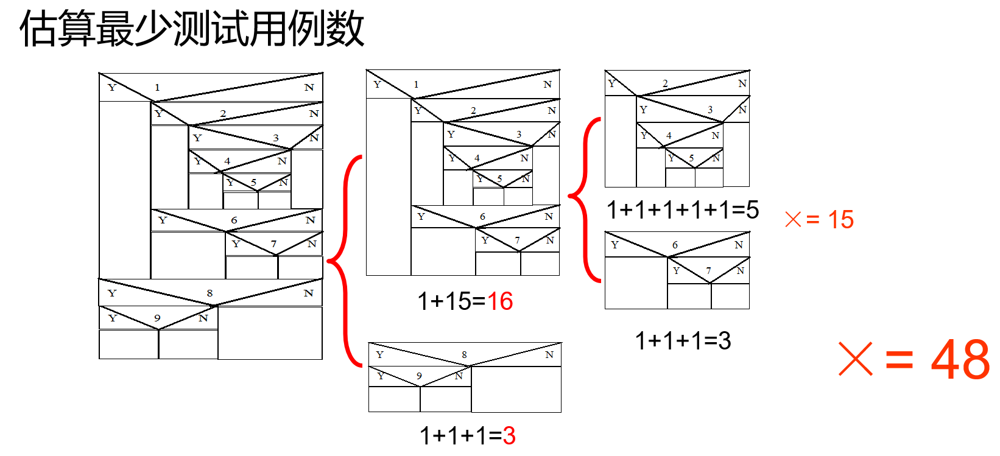

## 4.4白盒测试——控制流图

### 流程图转化为流图注意事项：

1.结点合并原则：若一个结点序列没有分支，则可以把这一系列结点合并为一个结点。  
2.结点增加原则：一条边一定要终止于一个结点，即使该结点不代表任何语句。  
3.原子原则：对复合判断语句，应将其分解为单判断语句。

## 4.5白盒测试——独立路径测试

### 定义

路径：由结点序列或弧表示的程序通路。  
独立路径：指程序中至少引入一个新的处理语句集合或一个新条件的程序通路，它必须至少包含一条在本次定义路径之前不曾用过的边。

### 独立路径测试步骤：

根据设计或代码导出程序流程图的拓扑结构-控制流图G；  
计算流图G的圈（环路）复杂度 V(G)；  
确定只包含独立路径的基本路径集；  
设计测试用例使得集合中每一条独立路径均被执行一次。

### 计算圈复杂度（环路复杂度）独立路径的条数

#### 强连通图或者完全图（任意两个节点之间都能找到通路）

V（G）=e-n+1  
e:图G中的边数  
n:图G中的结点数。

#### 非强连通图

方法一：V（G）=e-n+2  
方法二：判定节点数+1	（判定节点：出度为2的节点，出度为3的节点可以当作两个判定节点）  
方法三：V(G)=R	(R代表平面被控制流图分割成的区域数)

# 学校期末考试的范围

考试时间90分钟

都是设计类题目

## 第一题：10分

### 部署单元测试的环境、课件上有图（5分）

部署单元测试的环境

1、详细设计说明书  
2、源程序清单  
3、驱动模块  
4、桩模块


### 给题目中的代码设计一个驱动模块或者桩模块（5分）

```java
    //驱动测试  
    public static void main(String[] args) {  
        Attendance a=new Attendance();  
        a.query();  
    }  
   
    //待测试的方法  
    public void query(){  
        int value=this.Stub1()+this.Stub2();  
        System.out.println("我方法的值是："+value);  
    }  
   
    //桩1  
    public int Stub1(){  
        int output=3;  
        System.out.println("Stub1的值是"+output);  
        return output;  
    }  
   
    //桩2  
    public int Stub2(){  
        int output=4;  
        System.out.println("Stub2的值是"+output);  
        return output;  
    }

```

## 第二题：10分

### 集成测试（四种集成测试方法的名称）

1.大爆炸集成  
2.自顶向下集成  
3.自底向上集成  
4.三明治集成

### 给程序架构图、指定集成策略、按顺序画出集成策略的步骤图

大爆炸集成


自顶向下集成


自底向上集成

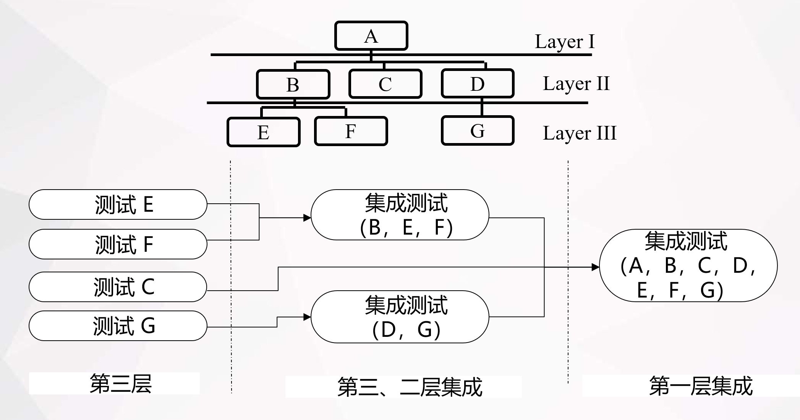

三明治集成


## 第三题：8分（看实验报告）

黑盒测试的边界值测试方法

### 给定题目，按要求设计出测试用例（4n+1、6n+1）二选一

一般测试用例、健壮性测试用例（注意二选一）

[4n+1]一般性测试时输入变量取：

最小值(min)  
略高于最小值(min+)  
正常值(nom)  
略低于最大值(max-)  
最大值(max)

### [6n+1]健壮性测试时输入变量取：

最小值(min)  
略高于最小值(min+)  
正常值(nom)  
略低于最大值(max-)  
最大值(max)  
略超过最大值(max+)  
略低于最小值(min-)

## 第四题：8分

等价类测试

### 给定题目，写出有效等价类和无效等价类

三角形问题

三角形问题接收三个整数a，b，c 作为输入，代表三角形的三条边。a，b，c必须满足以下条件：  
    C1.1<=a<=200  
    C2.1<=b<=200  
    C3.1<=c<=200  
    C4.a<b+c  
    C5.b<a+c  
    C6.c<a+b  
程序的输出是由这三条边确定的三角形类型：  
    等边三角形  
    等腰三角形  
    不等边三角形  
    非三角形

| 输入  | 有效等价类     | 无效等价类     |
| --- | --------- | --------- |
| a   | 1<=a<=200 | a<1,a>200 |
| b   | 1<=b<=200 | b<1,b>200 |
| c   | 1<=c<=200 | c<1,c>200 |

NextDate问题

NextDate是一个有三个变量（月份、日期和年）的函数, 函数返回输入日期后面的那个日期。  
变量月份、日期和年都为整数，且满足以下条件：  
    C1.1<=月份<=12  
    C2.1<=日期<=31  
    C3.1912<=年<=2050

|输入|有效等价类|无效等价类|
|---|---|---|
|年份|1912<=年<=2012|年< 1912，年>2012|
|月份|1<=月份<=12|月份<1，月份>12|
|日期|1<=日期<=31|日期<1，日期>31|

## 第五题：16分（因果图（Cn,En）的几种约束关系，决策表（Cn,An）的优化）

决策表和因果图

### 给定题目、通过分析列出问题的原因和结果，画出因果图（8分）

例题一

当输入第一个字符是‘#’ 或者是‘’，第二个输入字符是数字时，文档将被修改；如果第一个输入字符不是‘#’ 或 ‘’ ，则输出消息N，如果第二个输入字符不是数字，则输出消息M。  
问题：  
罗列该问题的因和果；  
找出原因和结果、原因和原因，结果和结果之间的关系，画出因果图；  
将因果图转换成决策表，并设计测试用例。

测试用例：

| 用例编号 | 输入  | 预期输出    |
| ---- | --- | ------- |
| 1    | #3  | 修改文档    |
| 2    | \#A | 输出消息M   |
| 3    | 6   | 修改文档    |
| 4    | B   | 输出消息M   |
| 5    | A1  | 输出消息N   |
| 6    | GT  | 输出消息M和N |

### 设计决策表、测试用例（8分）

三角形问题

三角形问题接收三个整数a，b，c 作为输入，代表三角形的三条边。a，b，c必须满足以下条件：  
    C1.1<=a<=200  
    C2.1<=b<=200  
    C3.1<=c<=200  
    C4.a<b+c  
    C5.b<a+c  
    C6.c<a+b  
程序的输出是由这三条边确定的三角形类型：  
    等边三角形  
    等腰三角形  
    不等边三角形  
    非三角形

决策表：

测试用例：

|用例ID|a|b|c|预期输出|
|---|---|---|---|---|
|DT1|4|1|2|非三角形|
|DT2|1|4|2|非三角形|
|DT3|1|2|4|非三角形|
|DT4|5|5|5|等边三角形|
|DT5|?|?|?|不可能|
|DT6|?|?|?|不可能|
|DT7|2|2|3|等腰三角形|
|DT8|?|?|?|不可能|
|DT9|2|3|2|等腰三角形|
|DT10|3|2|2|等腰三角形|
|DT11|3|4|5|不等边三角形|

Nextdate函数问题

|条件|1|2|3|4|5|6|7|8|9|10|11|12|13|14|15|16|17|18|19|20|21|22|
|---|---|---|---|---|---|---|---|---|---|---|---|---|---|---|---|---|---|---|---|---|---|---|
|C1:月份在|M1|M1|M1|M1|M1|M2|M2|M2|M2|M2|M3|M3|M3|M3|M3|M4|M4|M4|M4|M4|M4|M4|
|C2:日在|D1|D2|D3|D4|D5|D1|D2|D3|D4|D5|D1|D2|D3|D4|D5|D1|D2|D2|D3|D3|D4|D5|
|C3:年在|-|-|-|-|-|-|-|-|-|-|-|-|-|-|-|-|Y1|Y2|Y1|Y2|-|-|
|A1:不可能|||||√|||||||||||||||√|√|√|
|A2:日增1|√|√|√|||√|√|√|√||√|√|√|√||√|√||||||
|A3:日复位||||√||||||√|||||√|||√|√||||
|A4:月增1||||√||||||√||||||||√|√||||
|A5:月复位|||||||||||||||√||||||||
|A6:年增1|||||||||||||||√||||||||

进一步化简后的表格：

|条件|1-3|4|5|6-9|10|11-14|15|16|17|18|19|20|21-22|
|---|---|---|---|---|---|---|---|---|---|---|---|---|---|
|C1:月份在|M1|M1|M1|M2|M2|M3|M3|M4|M4|M4|M4|M4|M4|
|C2:日在|D1,D2,D3|D4|D5|D1,D2,D3,D4|D5|D1,D2,D3,D4|D5|D1|D2|D2|D3|D3|D4,D5|
|C3:年在|-|-|-|-|-|-|-|-|Y1|Y2|Y1|Y2|-|
|A1:不可能|||√|||||||||√|√|
|A2:日增1|√|||√||√||√|√|||||
|A3:日复位||√|||√||√|||√|√|||
|A4:月增1||√|||√|||||√|√|||
|A5:月复位|||||||√|||||||
|A6:年增1|||||||√|||||||

测试用例：

|用例D|月份|日期|年|预期输出|
|---|---|---|---|---|
|1--3|4|12|2001|2001年4月13日|
|4|4|30|2001|2001年5月1日|
|5|4|31|2001|不可能|
|6--9|1|15|2001|2001年1月16日|
|10|1|31|2001|2001年2月1日|
|11-14|12|15|2001|2001年12月16日|
|15|12|31|2001|2002年1月1日|
|16|2|15|2001|2001年2月16日|
|17|2|28|2004|2004年2月29日|
|18|2|28|2001|2001年3月1日|
|19|2|29|2004|2005年3月1日|
|20|2|29|2001|不可能|
|21,22|2|30|2001|不可能|

## 第六题：16分（背诵并默写定义）

### 给定代码，六种逻辑覆盖的方法（考四种，一种四分）需要写出定义并根据题目设计测试用例（定义和测试用例分数占比1：3）

逻辑覆盖是以程序内部逻辑结构为基础的测试用例设计技术  
- 语句覆盖：设计足够的测试用例，使程序中的每个语句至少执行一次。  
- 判定覆盖：设计足够的测试用例，在语句覆盖的基础上，使程序中的每个判定表达式取真分支和取假分支至少都执行一次。  
- 条件覆盖：设计足够的测试用例，在语句覆盖的基础上，使得程序中的每个条件都能获得各种可能的结果。  
- 判定条件覆盖：设计足够的测试用例，使得判定中的每个条件都取到各种可能的值，且每个判定表达式也都取到各种可能的结果。  
- 条件组合覆盖：设计足够的测试用例，使得每个判定中的条件的各种可能组合都至少出现一次。  
- 路径覆盖：设计足够的测试用例，使得程序中的每一条可行路径都至少执行一次。

## 第七题：12分（大概率考折半查找）

### 考察独立路径，读C语言程序，画控制流图（4分）

### 计算流图的圈复杂图，画出独立路径（4分）

### 基于独立路径设计测试用例（4分）

## 第八题：20分

三道论述题分值占比：7分、7分、6分

### ！！！ 1.叙述软件测试的定义。

软件测试是为了尽快尽早地发现在软件产品中所存在的各种软件缺陷而展开的贯穿整个软件开发生命周期、对软件产品(包括阶段性产品)进行验证和确认的活动过程。

### 2.简单叙述软件缺陷的主要类型有几种?

1. 软件未达到产品说明书中已经标明的功能;   
2. 软件出现了产品说明书中指明不会出现的错误;   
3. 软件未达到产品说明书中虽未指出但应当达到的目标;   
4. 软件功能超出了产品说明书中指出的范围;   
5. 软件测试人员认为软件难以理解、不易使用,或者最终用户认为该软件使用效果不良。

### 3.软件测试设计的关键问题包括那几个方面?

谁：开发人员、测试人员  
如何：计划、策略、方法、管理  
对象：需求、设计、实现、程序、文档、环境等  
停止：预定时间、测试用例数、覆盖率、缺陷总数、单位时间、缺陷数  
时机：与开发并行、尽早开始

### 4.简单叙述软件测试停止的标准有那些?

第一类标准:测试超过了预定的时间,停止测试   
第二类标准:执行了所有测试用例但没有发现故障,停止测试.   
第三类标准:使用特定的测试用例设计方法作为判断测试停止的基础   
第四类标准:正面指出测试停止的要求,比如发现并修改了70个软件故障   
第五类标准:根据单位时间内查出故障的数量决定是否停止测试。

### ！！！5.请论述优秀的软件测试人员应具备那些素质。

(1) 探索精神(喜欢新软件)   
(2) 故障排除能手(善于发现问题、喜欢猜谜)  
(3) 不懈努力(不停测试,尽一切努力)   
(4) 创造性(寻找新方法,有创意,超常手段)   
(5) 追求完美(力求完美但不是苛求)   
(6) 判断准确(要判断问题是不是真正的缺陷)   
(7) 老练稳重(不害怕坏消息,冷静)   
(8) 说服力(善于表达说明缺陷)

### 6.为什么要在一个团队中开展软件测试工作?

软件测试工作是保证软件质量的最后一道关口。

### 7.什么是软件缺陷?它的表现形式有哪些?

从产品内部看,软件缺陷是软件产品开发或维护过程中所存在的错误、毛病等各种问题;  
从外部看,软件缺陷是系统所需实现的某种功能的失效或违背。   
它的表现形式主要有以下几种:  
(1)软件未达到产品说明书中已经标明的功能;  
(2)软件出现了产品说明书中指明不会出现的错误;  
(3)软件未达到产品说明书中虽未指出但应当达到的目标;  
(4)软件功能超出了产品说明书中指出的范围;  
(5)软件测试人员认为软件难以理解、不易使用,或者最终用户认为该软件使用效果不良。

### 8.简述测试的原则。

测试过程中应注意和遵循的原则:  
(1)测试不是为了证明程序的正确性,而是为了证明程序不能工作。  
(2)测试应当有重点。  
(3)事先定义好产品的质量标准。  
(4)软件项目一启动,软件测试也就开始,而不是等到程序写完才开始进行测试。  
(5)穷举测试是不可能的。  
(6)第三方进行测试会更客观,更有效。  
(7)软件测试计划是做好软件测试工作的前提。  
(8)测试用例是设计出来的,不是写出来的。  
(9)对发现错误较多的程序段,应进行更深入的测试。  
(10)重视文档,妥善保存一切测试过程文档。

### 9.什么是测试用例。

测试用例(Test Case)通俗一点来讲就是编写(编制)一组前提条件、输入、执行条件、预期结果以完成对某个特定需求或目标测试的数据,体现测试方案、方法、技术和策略的文档。

### 10.简单分析软件缺陷产生的原因,其中那个阶段引入的缺陷最多,修复成本又最低?

软件缺陷产生的主要原因有:  
需求规格说明错误;  
设计错误;  
程序代码有误;  
其他;  
其中在需求分析阶段引入的缺陷最多,修复的成本又最低。

### 11.请详细叙述黑盒测试的基本概念。

黑盒测试(Black-Box Testing)又称为数据驱动测试或基于规格说明的测试。  
黑盒测试就是把程序看作一个不能打开的黑盒子,不考虑程序内部逻辑结构和内部特性的情况下,测试程序的功能,测试者要在软件的接口处进行,它只检查程序功能是否按照规格说明书的规定正常使用,程序是否能接收输入数据而产生正确的输出信息,以及性能是否满足用户的需求,并且保持数据库或外部信息的完整性。通过测试来检测每个功能是否都能正常运行,因此黑盒测试又可称为从用户观点和需求进行出发的测试。

### 12.黑盒测试都有哪些优点?请说明。

黑盒测试的优点:  
- 从产品功能角度测试可以最大程度满足用户的需求。  
- 相同动作可重复执行,最枯燥的部分可由机器完成。  
- 依据测试用例针对性地找寻问题,定位更为准确,容易生成测试数据。  
- 将测试直接和程序/系统要完成的操作相关联。

### 13.黑盒测试都有哪些缺点?请说明。

黑盒测试的缺点:  
- 代码得不到测试。  
- 如果规格说明设计有误,很难发现。  
- 测试不能充分的进行。  
- 结果取决于测试用例的设计。

### 14.请详细说明黑盒测试的方法。

因为黑盒测试是一种基于证明功能需求和用户最终需求的测试方法,所以在选择测试,设计测试方法方面有如下几种。   
- 等价类划分法;   
- 边界值分析法;   
- 因果图法;   
- 判定表驱动测试;   
- 场景法;   
- 功能图法;   
- 错误推测法;   
- 正交试验设计法。   
在实际测试工作中,往往是综合使用各种方法才能有效提高地提高测试效率和测试覆盖率,这就需要认真掌握这些方法的原理,积累更多的测试经验,以有效地提高测试水平和测试的效率。

### 15.功能测试的基本概念是什么?请简述之。

功能测试就是对产品的各功能进行验证,根据功能测试用例,逐项测试,检查产品是否达到用户要求的功能。   
功能测试一般须在完成单元测试后集成测试前进行,而且是针对应用系统进行各功能测试。一般应用系统有多个功能(子系统),功能测试是基于产品功能说明书,是在已知产品所应具有的功能,从用户角度来进行功能验证,以确认每个功能是否都能正常使用、是否实现了产品规格说明书的要求、是否能适当地接收输入数锯而产生正确的输出结果等。功能测试,包括用户界面测试、各种操作的测试、不同的数据输入、逻辑思路、数据输出和存储等的测试。对于功能测试,针对不同的应用系统,其测试内容的差异很大,但一般都可归为界面、数据、操作、逻辑、接口等几个方面。

### 16.请试着比较一下黑盒测试、白盒测试、单元测试、集成测试、系统测试、验收测试的区别与联系。

区别  
(1)黑盒/白盒:主要区别在是否了解系统或程序的内部结构和代码   
(2)单元测试:关注某一个单元,函数,模块的正确性,一般需要编写相关测试代码。   
(3)集成测试:模块或模块直接的集成接口测试,单个模块测试   
(4)系统测试:一个完整功能的完全测试。   
(5)验收测试通常由用户参与,分为阿尔法(α)和贝塔测试(β)两种。α测试是由一个用户在开发环境下进行的测试,也可以是公司内部的用户在模拟实际操作环境下进行的受控测试。β测试是软件的多个用户在一个或多个用户的实际使用环境下进行的测试。开发者通常不在测试现场。   
联系  
1. 以上测试类型都是软件测试的重要组成部分，每个测试类型都有其独特的目的和方法，但它们之间也有一定的联系。  
2. 单元测试是各个测试类型的基础，其他测试类型都是在单元测试的基础上进行的。  
3. 集成测试、系统测试和验收测试都需要基于功能需求和用户期望进行测试，而黑盒测试和白盒测试则是测试人员根据需求文档和代码实现细节来设计测试用例。  
4. 集成测试和系统测试有一定的重叠，都需要验证系统各个组件之间的交互和整体功能是否正确。  
5. 验收测试是最终的用户验证，需要验证系统是否符合用户需求和期望，也可以视为系统测试的一种补充。  
6. 黑盒测试和白盒测试可以相互补充，黑盒测试可以验证软件的功能是否符合需求和用户期望，白盒测试可以验证软件的内部实现是否正确和稳定，两者结合可以提高测试的覆盖率和效果。  
7. 在实际测试中，各种测试类型通常会交替进行，例如先进行单元测试和白盒测试，然后进行集成测试和系统测试，最后进行验收测试。

### 17.验收测试是由谁完成的?通常包含哪些过程?

验收测试是以用户为主的测试,软件开发人员和QA(质量保证)人员也应参加。通常包含α测试和β测试过程。

### 18.集成测试有哪些不同的集成方法?简述不同方法的特点。

集成测试通常有一次性集成、自顶向下集成、自底向上集成和混合集成4种集成方法。   
一次性集成方法需要的测试用例数目少,测试方法简单、易行。  
但是由于不可避免存在模块间接口、全局数据结构等方面的问题,所以一次运行成功的可能性不大;  
如果一次集成的模块数量多,集成测试后可能会出现大量的错误,给程序的错误定位与修改带来很大的麻烦;  
即使集成测试通过,也会遗漏很多错误进入系统测试。   
​  
自顶向下集成在测试的过程中,可以较早地验证主要的控制和判断点;  
一般不需要驱动程序,减少了测试驱动程序开发和维护的费用;  
可以和开发设计工作一起并行执行集成测试,能够灵活的适应目标环境;  
容易进行故障隔离和错误定位。但是在测试时需要为每个模块的下层模块提供桩模块,桩模块的开发和维护费用大;  
桩模块不能反映真实情况,重要数据不能及时回送到上层模块,导致测试不充分;  
涉及复杂算法和真正I/O的底层模块最易出问题,在后期才遇到导致过多的回归测试。   
​  
自底向上集成可以尽早的验证底层模块的行为;  
提高了测试效率;  
一般不需要桩模块;  
容易对错误进行定位。  
但是直到最后一个模块加进去之后才能看到整个系统的框架;  
驱动模块的设计工作量大;  
不能及时发现高层模块设计上的错误。   
混合集成具有自顶向下和自底向上两种集成策略的优点,但是在被集成之前,中间层不能尽早得到充分的测试。

### 19.简述单元测试的主要任务。

单元测试的主要任务是:模块接口测试;局部数据结构测试;路径测试;错误处理测试;边界测试。

### 20.什么是回归测试?什么时候进行回归测试?

## 第二年期末考试的复习范围

应用题（70分）、论述题（30分）

### 1、 软件测试专家说的话，软件测试的原则，并谈谈理解：能用例证最好用例证：

> 软件测试的原则：
> 测试过程中应注意和遵循的原则:  
> (1)测试不是为了证明程序的正确性,而是为了证明程序不能工作。  
> (2)测试应当有重点。  
> (3)事先定义好产品的质量标准。  
> (4)软件项目一启动,软件测试也就开始,而不是等到程序写完才开始进行测试。  
> (5)穷举测试是不可能的。  
> (6)第三方进行测试会更客观,更有效。  
> (7)软件测试计划是做好软件测试工作的前提。  
> (8)测试用例是设计出来的,不是写出来的。  
> (9)对发现错误较多的程序段,应进行更深入的测试。  
> (10)重视文档,妥善保存一切测试过程文档。
### 2、 单元测试的环境，要素，能根据给定的一段代码，进行单元测试设计；

>单元测试的环境：1.详细设计说明书；2.源程序清单；3.驱动模块；4.桩模块
>单元测试的任务：1.模块接口测试；2.局部数据结构测试；3.路径测试；4.错误处理测试；5.边界测试


### 3、 集成测试的策略，能根据给定的模板关系图，根据指定的集成策略，画出集成过程图

> j集成测试的四种策略：1.大爆炸集成；2.自顶向下集成；3.自底向上集成；4.三明治集成

大爆炸集成：


自顶向下集成：


自底向上集成


三明治集成：


### 4、 边界值分析： 根据跟定的问题，采用四种策略之一设计测试用例;

边界值测试（4N+1）：normal、min、min+、max、max-
健壮性测试（6N+1）：normal、min-、min、min+、max-、max、max+
最坏情况（5^N）
最坏情况健壮性（7^N）

### 5、 等价类划分:  根据文字说明，采用四种策略之一设计测试用例：

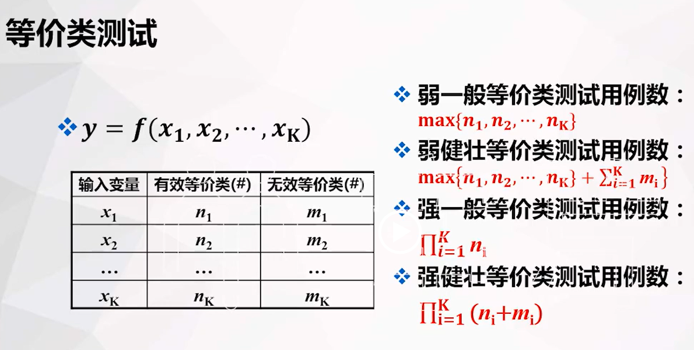
三角形问题
三角形问题接收三个整数a，b，c 作为输入，代表三角形的三条边。a，b，c必须满足以下条件：  
    C1.1<=a<=200  
    C2.1<=b<=200  
    C3.1<=c<=200  
    C4.a<b+c  
    C5.b<a+c  
    C6.c<a+b  
程序的输出是由这三条边确定的三角形类型：  
    等边三角形  
    等腰三角形  
    不等边三角形  
    非三角形

| 输入  | 有效等价类     | 无效等价类     |
| --- | --------- | --------- |
| a   | 1<=a<=200 | a<1,a>200 |
| b   | 1<=b<=200 | b<1,b>200 |
| c   | 1<=c<=200 | c<1,c>200 |

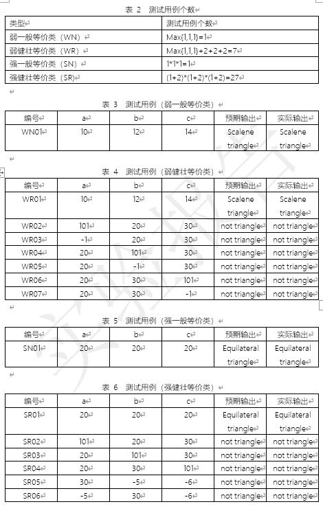

### 6、 决策覆盖： 了解DC方法整个过程，根据给定题目，按顺序完成每一步工作：
### 7、 循环覆盖:  根据给定的代码，采用7种LC方法的几种设计测试用例：
### 8、 IDP： 根据给定的代码，会画CFG, 并计算圈复杂度，写出独立路径：
### 9、 了解软件测试的整个过程，并了解常用的测试工具；

---

> 作者: [Lunatic](https://goodlunatic.github.io)  
> URL: https://goodlunatic.github.io/posts/0434e3f/  

