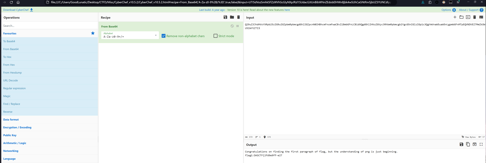
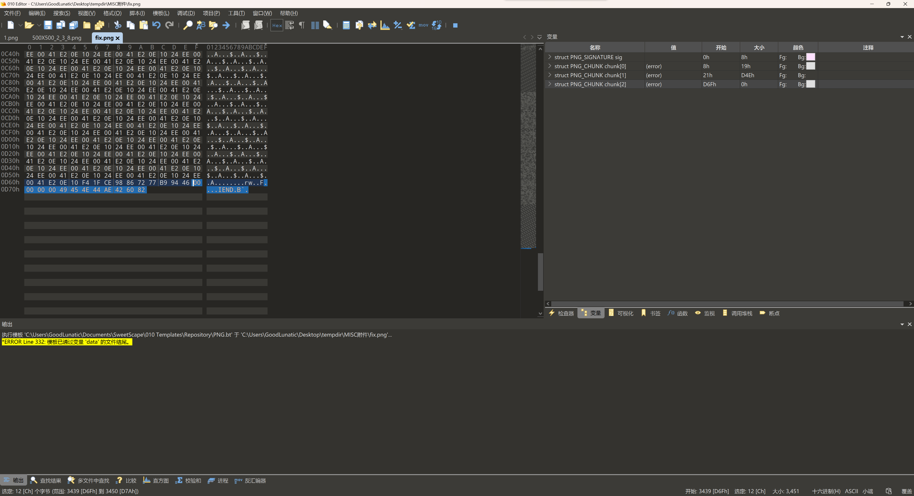
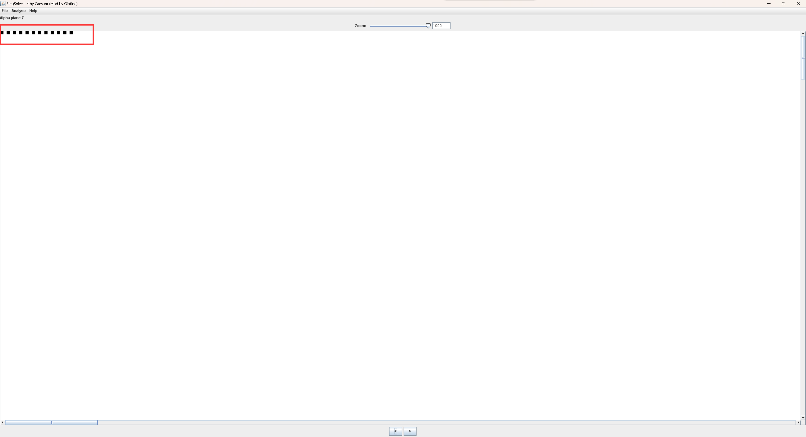

# 2024 DASCTF 暑期挑战赛 Misc Writeup

这场比赛开始的时候去成都线下打国赛决赛了

现在才有时间回来复现，发现这场比赛的Misc题出的都挺好的
<!--more-->


## png_master

010打开图片，发现文件末尾有一串base64编码后的字符串




> Congratulations on finding the first paragraph of flag, but the understanding of png is just beginning.
> 
> flag1:DASCTF{2fd9e9ff-e27

使用 pngcheck -v 检查图片，发现最后两个IDAT块不正常


经过尝试，发现是长度为3394的IDAT块的问题




提取出来，加上文件头尾并爆破CRC可以得到下图中的最后一段flag：a19131f86126}

Tips：其实这里不补文件尾，只补文件头也是可以的


删除有问题的IDAT块和末尾多余的base64字符串后，把图片拉入 stegsolve 查看

发现 alpha 0-7 通道中有LSB隐写的痕迹



直接提取出来即可得到flag的中间部分：d-5405c5f5-


这里LSB隐写的提取也可以使用以下Python脚本提取

```python
from PIL import Image

img = Image.open('1.png')
width, height = img.size
# print(width, height)
alpha_pixels = []
for y in range(height):
    for x in range(width):
        pixel = img.getpixel((x, y))
        # print(pixel)
        # 只需要提取alpha通道的像素值即可
        alpha_pixels.append(pixel[3])
for num in alpha_pixels:
    if num >= 32 and num <= 126:
        print(chr(num), end='')
        # d-5405-c5f5-
```

DASCTF{2fd9e9ff-e27d-5405c5f5-a19131f86126}

## EZ_zip

附件给了一个zip压缩包，解压提示文件已损坏以及CRC校验错误


于是010打开查看，发现源数据区和目录区的文件名长度被改了


用010将文件名长度修改为7即可解决010模板报错的问题

然后发现目录区的压缩方法也被改了，使用010改回DEFLATE即可解决CRC校验错误的问题


解压压缩包，在320.zip中发现一个提示，解压密码是一个字节的数据


因此我们编写爆破脚本进行解压，解压出来后得到 AES-ECB.txt ，内容如下

> 64ZpNmbv2Hg4Jj9bH8Kv6D3OBliD9hgyI3vZWfMDJs2TcEwVnBmH/zkBtPBE3g8e
> 
> the key may be on your journey？

提示我们AES解密的密钥藏在之前每个压缩包的解压密码中

最后的爆破脚本如下

```python
from Crypto.Util.number import *
import pyzipper
import os

key = []
for i in range(320, 0, -1):
    filename = f"{i}.zip"
    for pwd in range(0, 256):
        pwd_bytes = long_to_bytes(pwd)
        # print(long_to_bytes(pwd))
        zipfile = pyzipper.AESZipFile(filename, 'r', compression=pyzipper.ZIP_LZMA, encryption=pyzipper.WZ_AES)
        try:
            zipfile.setpassword(pwd_bytes)
            zipfile.extractall()
            zipfile.close()
            # 因为后面解密AES的时候需要用Hex格式，所以这里hex转换一下先
            key.append(hex(pwd)[2:].zfill(2))
            print(f"第{i}个压缩包解压成功--------------->")
            os.remove(filename)
            break
        except:
            pass
print(key)
# ['11', 'bb', '99', '58', '0c', '61', '3a', '87', 'c5', '4e', '12', '48', '0a', 'a7', 'ff', '8c', '79', '8f', '71', 'ad', '28', '0f', '6b', 'a6', '9d', '4a', '44', '25', '22', '5e', '4e', 'c6', '11', 'bb', '99', '58', '0c', '61', '3a', '87', 'c5', '4e', '12', '48', '0a', 'a7', 'ff', '8c', '79', '8f', '71', 'ad', '28', '0f', '6b', 'a6', '9d', '4a', '44', '25', '22', '5e', '4e', 'c6', '11', 'bb', '99', '58', '0c', '61', '3a', '87', 'c5', '4e', '12', '48', '0a', 'a7', 'ff', '8c', '79', '8f', '71', 'ad', '28', '0f', '6b', 'a6', '9d', '4a', '44', '25', '22', '5e', '4e', 'c6', '11', 'bb', '99', '58', '0c', '61', '3a', '87', 'c5', '4e', '12', '48', '0a', 'a7', 'ff', '8c', '79', '8f', '71', 'ad', '28', '0f', '6b', 'a6', '9d', '4a', '44', '25', '22', '5e', '4e', 'c6', '11', 'bb', '99', '58', '0c', '61', '3a', '87', 'c5', '4e', '12', '48', '0a', 'a7', 'ff', '8c', '79', '8f', '71', 'ad', '28', '0f', '6b', 'a6', '9d', '4a', '44', '25', '22', '5e', '4e', 'c6', '11', 'bb', '99', '58', '0c', '61', '3a', '87', 'c5', '4e', '12', '48', '0a', 'a7', 'ff', '8c', '79', '8f', '71', 'ad', '28', '0f', '6b', 'a6', '9d', '4a', '44', '25', '22', '5e', '4e', 'c6', '11', 'bb', '99', '58', '0c', '61', '3a', '87', 'c5', '4e', '12', '48', '0a', 'a7', 'ff', '8c', '79', '8f', '71', 'ad', '28', '0f', '6b', 'a6', '9d', '4a', '44', '25', '22', '5e', '4e', 'c6', '11', 'bb', '99', '58', '0c', '61', '3a', '87', 'c5', '4e', '12', '48', '0a', 'a7', 'ff', '8c', '79', '8f', '71', 'ad', '28', '0f', '6b', 'a6', '9d', '4a', '44', '25', '22', '5e', '4e', 'c6', '11', 'bb', '99', '58', '0c', '61', '3a', '87', 'c5', '4e', '12', '48', '0a', 'a7', 'ff', '8c', '79', '8f', '71', 'ad', '28', '0f', '6b', 'a6', '9d', '4a', '44', '25', '22', '5e', '4e', 'c6', '11', 'bb', '99', '58', '0c', '61', '3a', '87', 'c5', '4e', '12', '48', '0a', 'a7', 'ff', '8c', '79', '8f', '71', 'ad', '28', '0f', '6b', 'a6', '9d', '4a', '44', '25', '22', '5e', '4e', 'c6']
# 因为压缩包的编号是逆序的，所以这里需要把密钥也逆序一下
print(''.join(key[::-1]))
# c64e5e2225444a9da66b0f28ad718f798cffa70a48124ec5873a610c5899bb11c64e5e2225444a9da66b0f28ad718f798cffa70a48124ec5873a610c5899bb11c64e5e2225444a9da66b0f28ad718f798cffa70a48124ec5873a610c5899bb11c64e5e2225444a9da66b0f28ad718f798cffa70a48124ec5873a610c5899bb11c64e5e2225444a9da66b0f28ad718f798cffa70a48124ec5873a610c5899bb11c64e5e2225444a9da66b0f28ad718f798cffa70a48124ec5873a610c5899bb11c64e5e2225444a9da66b0f28ad718f798cffa70a48124ec5873a610c5899bb11c64e5e2225444a9da66b0f28ad718f798cffa70a48124ec5873a610c5899bb11c64e5e2225444a9da66b0f28ad718f798cffa70a48124ec5873a610c5899bb11c64e5e2225444a9da66b0f28ad718f798cffa70a48124ec5873a610c5899bb11
```

发现密钥是长度为64的字符串：`c64e5e2225444a9da66b0f28ad718f798cffa70a48124ec5873a610c5899bb11`

最后使用得到的密钥，CyberChef解密AES即可

Tips：这里需要先解一层base64编码，再进行AES-ECB解密


DASCTF{514755c6-8280-463c-8378-a29702fc88df}

## ServerMeM

题面信息如下：

> 公司的服务器遭受了黑客的攻击，经过勘察黑客为维持权限留下了后门，我们获取到了服务器的内存文件，请你分析黑客留下的痕迹

下载附件并解压得到：out.lime、System.map

在WSL中用以下命令搜索一下得到Linux内核的版本号，因此很明显就是Linux内存取证了

> strings mem | grep -i 'Linux version' | uniq


本题提供两种解法，第一种是常规的通过制作Linux的符号文件来进行取证，另一种就是直接分析内存中的可疑文件

### 解法一（常规解）

Linux内核版本信息如下：

> Linux version 5.4.27 (root@localhost.localdomain) (gcc version 4.8.5 20150623 (Red Hat 4.8.5-44) (GCC)) #1 SMP Sun May 26 03:37:06 EDT 2024

然后根据内核版本制作符号文件Profile即可

TODO...
### 解法二（非预期）

直接在strings的结果中搜索 ”.tar.gz” 后缀的文件，发现有一个S3rCr3t.tar.gz


知道了文件名后直接在010中搜索，得到了openssl AES加密后的密文（以Salted开头）

还有openssl的具体版本：1.0.2k


用CyberChef提取出来，注意后面的注释不要一起提取出来


继续往下查看，可以找到 openssl 加密的密钥：P@ssW0rdddd


然后只要安装openssl-1.0.2-k，使用得到的密钥解密即可

具体安装步骤如下，编译完成后openssl可执行文件在apps目录下

> wget [https://www.openssl.org/source/old/1.0.2/openssl-1.0.2k.tar.gz](https://www.openssl.org/source/old/1.0.2/openssl-1.0.2k.tar.gz)
> 
> tar -xzvf openssl-1.0.2k.tar.gz
> 
> cd openssl-1.0.2k.tar.gz
> 
> ./config --prefix=/usr/
> 
> make

使用以下命令解密即可得到flag：DASCTF{c086cd55-b86a-4ee6-8933-c8bee578148a}

> ./openssl-1.0.2k/apps/openssl enc -d -aes256 -in download.bin -out flag.tar.gz -k P@ssW0rdddd


---

> Author: [Lunatic](https://goodlunatic.github.io)  
> URL: https://goodlunatic.github.io/posts/067cfbd/  

