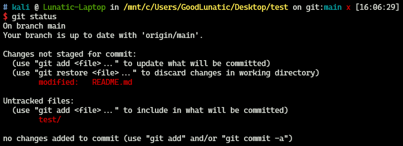
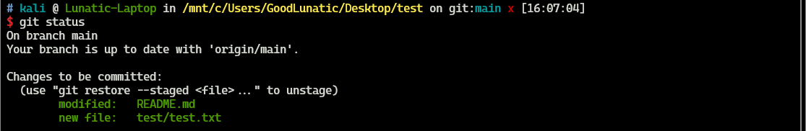
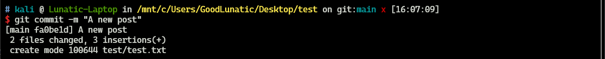
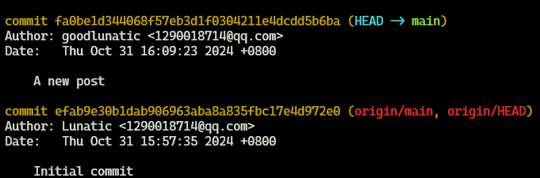
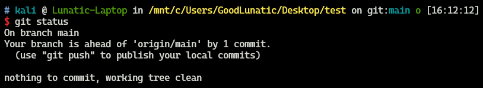
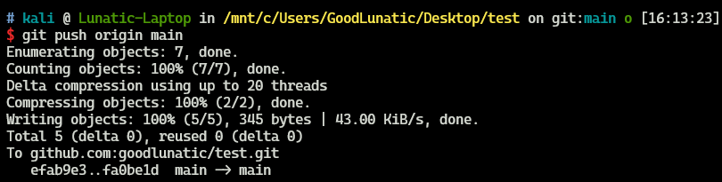
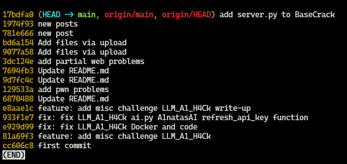
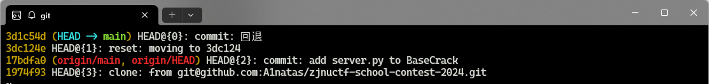

# 从零开始，快速入门Git

**对程序员来说Git是一个不得不用的东西，因此打算好好学习一下**
<!--more-->
## 使用 SSH 密钥登录 Github
本地生成 SSH 密钥
```bash
ssh-keygen -t rsa -b 4096 -C "Your_Email"
```
将公钥添加到 Github
> 1. 打开 `~/.ssh/id_rsa.pub` 文件并复制公钥内容
> 
> 2. 登录 GitHub，进入 **Settings** > **SSH and GPG keys**，点击 **New SSH key**
> 
> 3. 将公钥粘贴进去，点击 **Add SSH key**

测试链接
```bash
ssh -T git@github.com
```

如果显示 “Hi XXX! You've successfully authenticated…” 则表示 SSH 配置成功

然后就可以用SSH链接来克隆仓库了

```bash
git clone git@github.com:username/example_repo.git
```

## 修改本地仓库并推送到远程仓库
先将远程的仓库克隆到本地，然后进行修改，修改完后使用`git status`查看仓库状态



然后可以使用`git add -A`命令将改动添加到暂存区



> `git add` 和 `git add -A` 的区别:
> 
> git add -A：添加所有类型的改动（新增、修改和删除）
> 
> git add .：仅添加当前目录下的新增和修改，不包括删除

将修改的文件都放到暂存区后，我们就可以使用`git commit`命令提交更改

提交后会再git的历史纪录中新添加一个版本，可以使用 `git log` 命令查看







然后我们就可以用 `git push origin main` 命令把本地的内容提交到远程的`main`分支上了


## 不同版本之间的切换
使用`git log --oneline`查看之前的版本



然后可以使用 `git reset --hard 版本对应的Hash值` 来回退到之前的版本

然后修改文件，之后的步骤和上面是一样的

```bash
git add -A
git commit -m "change"
```

> 这里回退了之后如果要回到原来的版本，需要使用`git reflog`命令查看原来版本的hash值



然后使用 `git reset --hard 版本对应的Hash值` 来切换版本即可

---

> Author: [Lunatic](https://goodlunatic.github.io)  
> URL: https://goodlunatic.github.io/posts/0d2a7eb/  

