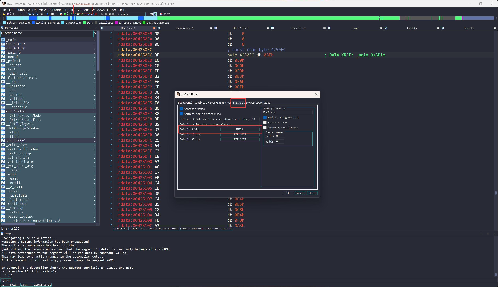
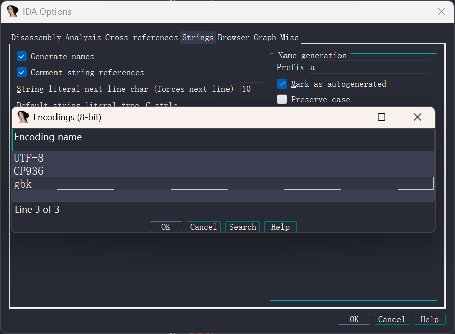
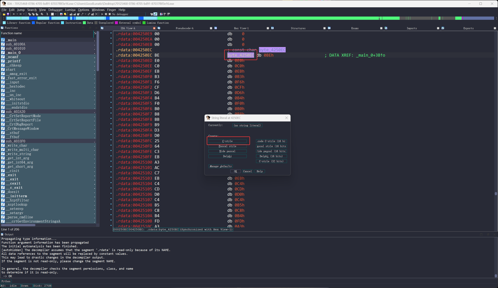
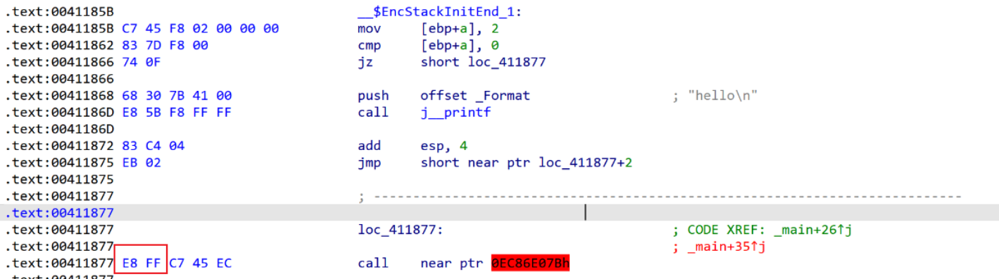
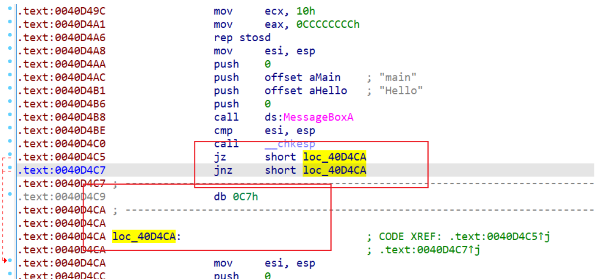
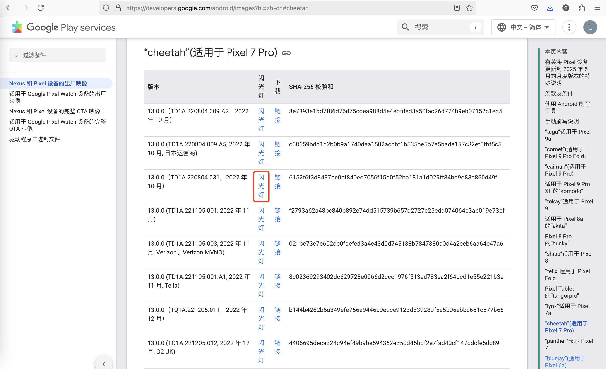
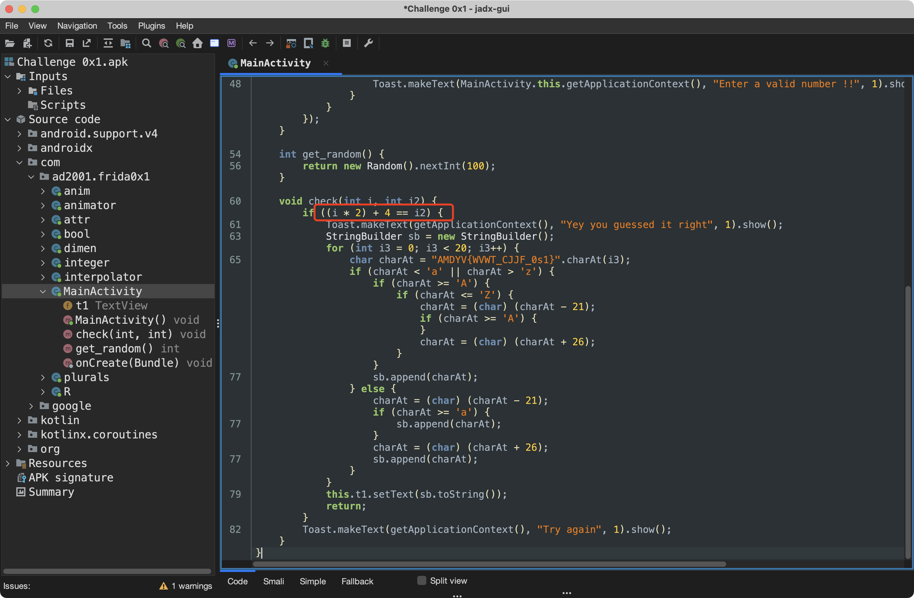

# CTF-逆向工程

**未来的研究方向里有好多要用到逆向工程的地方**

**感觉是绕不开逆向了，因此打算猛猛突击一下**
<!--more-->

## IDA使用基础

### IDA相关配置

1、修改为老版本的快捷键

options -> shortcuts，取消勾选 use new shortcuts 即可

2、修改 opcode byte 的数量

options -> general -> Number of opcode bytes，输入10即可


### 常用快捷键

参考链接：

https://eps1l0h.github.io/2022/11/02/idapro%E5%BF%AB%E6%8D%B7%E9%94%AE/

|    快捷键    |         功能         |
| :-------: | :----------------: |
| Shift+F12 |      打开字符串窗口       |
|    F2     |        添加断点        |
|    F4     |        开始运行        |
|    F5     |      反编译成伪代码       |
|    F7     |        进入函数        |
|    F8     |        单步调试        |
|    F9     |      运行到下一个断点      |
|   Space   | 切换反汇编窗口(列表视图&图形视图) |
|    Tab    |       返回栈视图        |
|    ESC    |     跳转到返回前的地址      |
|     /     |        添加注释        |
|     N     |       修改变量名        |
|     D     |      代码解析成数据       |
|     C     |   数据解析成代码(重新定义)    |
|     G     |     跳转到指定地址查看      |
|     A     |       转化为字符串       |
|     B     |      转换为二进制数       |
|     H     |      转换为十进制数       |
|     Q     |      转换为十六进制数      |
|    \*     |       转换为数组        |
|     P     |        创建函数        |
|     R     |       转换为字符        |
|     U     |        取消定义        |
|     X     |     查看函数的交叉引用      |
|     Y     |     指定当前函数的命名      |
| Shift+F12 |      打开字符串窗口       |
|  Shift+E  | 批量复制数据为字符串或者c数组格式  |
### 正常显示中文字符串

Options → Strings → Default 8-bit



点击UTF-8然后右键新插入一个gbk，然后选中并保存



最后点击字符串，然后按键盘上的ALT+A，选中C-style即可

如果修改后中文没有正常显示，可以尝试点击反编译后的变量按F5重新反编译



### ida-python的使用

1、修改变量的值

下断点，动调到要修改变量的地方，获取变量的地址

然后参考以下脚本修改一下地址以及要修改的值


```python
import ida_bytes
import ida_dbg

INPUT_ADDR = 0x7FF6500A1040

CIPHERTEXT = bytes([
    0x57, 0xC6, 0x50, 0x75, 0x24, 0x8C, 0x55, 0x37,
    0x23, 0xE1, 0x7F, 0x71, 0xE2, 0x17, 0x49, 0xA7,
    0x3F, 0xD5, 0x1B, 0x68, 0xE2, 0xBA, 0xF3, 0xD1,
    0xC6, 0xF4, 0x2D, 0x48, 0x0B, 0xFD, 0xC0, 0x90,
    0xC4, 0xEA, 0xF3, 0xBD, 0xC7, 0x57, 0x5C, 0xEA
])

def patch_input():
    ok = ida_bytes.put_bytes(INPUT_ADDR, CIPHERTEXT)

patch_input()

```

写好脚本后，IDA左上角 -> File -> Script command 粘贴进去，选择 Python 然后 run 即可

1、多次循环修改变量的值

比如逆序 DES加密 中每一次的keys

下断点到 keys 所在的那一行，然后这里要注意 `在程序运行到这一行之前就要布置好脚本`

否则，第一次就会被跳过，可能导致 DES 解密出来的第一块是错的

右键断点 -> Edit breakpoint -> Condition右侧的三个点 -> 粘贴脚本 -> 选择Python后点击OK即可

```python
import ida_bytes
import ida_dbg

KEYS_BASE = 0x00007FF6500A10C0
ROUNDS = 16
STRIDE = 8  

def reverse_keys():
    size = ROUNDS * STRIDE
    buf = ida_bytes.get_bytes(KEYS_BASE, size)
    blocks = [buf[i*STRIDE:(i+1)*STRIDE] for i in range(ROUNDS)]
    blocks.reverse()
    newbuf = b"".join(blocks)
    ok = ida_bytes.put_bytes(KEYS_BASE, newbuf)

reverse_keys()
```


例题-BUU-内涵的软件

## 逆向中常见的数据类型

|                  数据类型                   |  位数  |
| :-------------------------------------: | :--: |
|             1 byte = 8 bit              | 8 位  |
|             1 word = 2 byte             | 16 位 |
| 1 dword(Double Word) = 2 word = 4 byte  | 32 位 |
| 1 qword(Quadra Word) = 2 dword = 8 byte | 64 位 |
|                                         |      |
|                uint32_t                 | 32 位 |
|                uint64_t                 | 64 位 |
|             char （-127-128）             | 8 位  |
|          unsigned char （0-255）          | 8 位  |
|                                         |      |
|                  float                  | 32位  |
|                 double                  | 64 位 |

## 汇编基础

|   汇编指令   |           示例            |                  含义                  |              说明               |
| :------: | :---------------------: | :----------------------------------: | :---------------------------: |
|   MOV    |      MOV EAX, ECX       |              EAX = ECX               |          将ECX的值赋给EAX          |
|   ADD    |      ADD EAX, ECX       |              EAX += ECX              |         将EAX的值加上ECX的值         |
|   SUB    |      SUB EAX, ECX       |              EAX -= ECX              |         将EAX的值减去ECX的值         |
|   INC    |         INC EAX         |                EAX++                 |           将EAX的值+1            |
|   DEC    |         DEX EAX         |                EAX--                 |           将EAX的值-1            |
|   LEA    |      LEA EAX, ECX       |             EAX = ECX的地址             |         将ECX的地址存入EAX          |
|   AND    |      AND EAX, ECX       |           EAX = EAX & ECX            |         EAX与ECX进行与运算          |
|    OR    |       OR EAX, ECX       |           EAX = EAX \| ECX           |         EAX与ECX进行或运算          |
|   XOR    |      XOR EAX, ECX       |           EAX = EAX ^ ECX            |         EAX与ECX进行异或运算         |
|   NOT    |         NOT EAX         |              EAX = ~EAX              |           将EAX的值取反            |
|   SHL    |       SHL EAX, 3        |            EAX = EAX << 3            |          将EAX的值左移三位           |
|   SHR    |       SHR EAX, 3        |            EAX = EAX >> 3            |          将EAX的值右移三位           |
|   CMP    |      CMP EAX, ECX       | if(EAX == ECX) ZF = 1<br>else ZF = 0 | 对EAX和ECX的值进行比较并根据比较结果设置ZF标志的值 |
|   TEST   |      TEST EAX, EAX      |  if(EAX == 0) ZF = 1<br>else ZF = 0  |  将EAX的值与0进行比较并根据比较结果设置ZF标志的值  |
|  JE[JZ]  |       JZ 04001000       |     if(ZF == 1)<br>GOTO 04001000     |      若ZF为1则跳转至 04001000       |
| JNE[JNZ] |      JNZ 04001000       |     if(ZF == 0)<br>GOTO 04001000     |      若ZF为0则跳转至 04001000       |
|   JMP    |      JMP 04001000       |            GOTO 04001000             |        直接跳转至 04001000         |
|   CALL   | CALL printf<br>CALL $+5 |                                      |    调用函数printf<br>跳转到下一条指令     |
|   PUSH   |        PUSH EAX         |                                      |          将EAX的值压入栈顶           |
|   POP    |         POP EAX         |                                      |          将栈顶的值弹给EAX           |

一些常用的寄存器：

| 16位   | **32位 (x86)** | **64位 (x64)** | **用途**                           |
| ----- | ------------- | ------------- | -------------------------------- |
| AX    | **EAX**       | **RAX**       | 累加器（Accumulator），算术运算、函数返回值      |
| BX    | **EBX**       | **RBX**       | 基址寄存器（Base），常用于存储指针              |
| CX    | **ECX**       | **RCX**       | 计数器（Counter），LOOP指令、字符串操作        |
| DX    | **EDX**       | **RDX**       | 数据寄存器（Data），辅助EAX（如MUL/DIV）      |
| SI    | **ESI**       | **RSI**       | 源索引（Source Index），字符串/内存操作       |
| DI    | **EDI**       | **RDI**       | 目标索引（Destination Index），字符串/内存操作 |
| SP    | **ESP**       | **RSP**       | 栈指针（Stack Pointer），指向当前栈顶        |
| BE    | **EBP**       | **RBP**       | 基址指针（Base Pointer），函数栈帧          |
|       |               |               |                                  |
| IP    | **EIP**       | **RIP**       | 存储下一条要执行的指令地址                    |
| FLAGS | **EFLAGS**    | **RFLAGS**    | 存储 CPU 状态标志（如 ZF, CF, SF 等）      |

## 常见的编码与加密

### base64

```c++
char base64_table[] = "ABCDEFGHIJKLMNOPQRSTUVWXYZabcdefghijklmnopqrstuvwxyz0123456789+/"
int __fastcall base64_encode(char *Str2, char *Str)
{
  int v3; // [rsp+24h] [rbp-1Ch]
  int v4; // [rsp+34h] [rbp-Ch]
  int v5; // [rsp+38h] [rbp-8h]
  int v6; // [rsp+3Ch] [rbp-4h]

  v3 = strlen(Str);
  if ( v3 % 3 )
    v6 = 4 * (v3 / 3 + 1);
  else
    v6 = 4 * (v3 / 3);
  Str2[v6] = 0;
  v5 = 0;
  v4 = 0;
  while ( v6 - 2 > v5 )
  {
    Str2[v5] = base64_table[(unsigned __int8)Str[v4] >> 2]; // 右移2位，获得第一个字符前6位的数据
    Str2[v5 + 1] = base64_table[(16 * (Str[v4] & 3)) | ((unsigned __int8)Str[v4 + 1] >> 4)]; // 获取第二个6位
    Str2[v5 + 2] = base64_table[(4 * (Str[v4 + 1] & 0xF)) | ((unsigned __int8)Str[v4 + 2] >> 6)]; // 获得第三个6位
    Str2[v5 + 3] = base64_table[Str[v4 + 2] & 0x3F]; // 获得第四个6位
    v4 += 3;
    v5 += 4;
  }
  if ( v3 % 3 == 1 )
  {
    Str2[v5 - 2] = "=";
    Str2[v5 - 1] = "=";
  }
  else if ( v3 % 3 == 2 )
  {
    Str2[v5 - 1] = "=";
  }
  return putchar("\n");
}
```


### RC4加密算法

RC4因为是同步流密码，加密和解密的逻辑和过程是一样的

因此往往可以提取密文后，动调Patch到输入里直接用源程序解密

##### Python版

```python
key = list('RC4_1s_4w3s0m3')
content = [0xA7, 0x1A, 0x68, 0xEC, 0xD8, 0x27, 0x11, 0xCC, 0x8C, 0x9B, 0x16, 0x15, 0x5C, 0xD2, 0x67, 0x3E, 0x82, 0xAD,
           0xCE, 0x75, 0xD4, 0xBC, 0x57, 0x56, 0xC2, 0x8A, 0x52, 0xB8, 0x6B, 0xD6, 0xCC, 0xF8, 0xA4, 0xBA, 0x72, 0x2F,
           0xE0, 0x57, 0x15, 0xB9, 0x24, 0x11]
rc4number = 256
s = [0] * rc4number
flag = ''

def rc4_init(s, key, rc4number):
    for i in range(rc4number):
        s[i] = i
    j = 0
    for i in range(rc4number):
        j = (j + s[i] + ord(key[i % len(key)])) % rc4number
        s[i],s[j] = s[j],s[i]

def rc4_endecode(s, content, rc4number):
    i = 0
    j = 0
    for k in range(len(content)):
        i = (i + 1) % rc4number
        j = (j + s[i]) % rc4number
        s[i],s[j] = s[j],s[i]
        t = (s[i] + s[j]) % rc4number
        content[k] = chr(content[k] ^ s[t])
    content = ''.join(content)
    print(content)

rc4_init(s, key, rc4number)
rc4_endecode(s, content, rc4number)
```

##### C++版

```c++
#include <stdio.h>
#include <string.h>

#define SBOX_LEN 256

void rc4_init(unsigned char *s, const unsigned char *key, size_t keylen)
{
    int i, j = 0;
    unsigned char k[SBOX_LEN];

    for (i = 0; i < SBOX_LEN; ++i)
    {
        s[i] = i;
        k[i] = key[i % keylen];
    }
    for (i = 0; i < SBOX_LEN; ++i)
    {
        j = (k[i] + s[i] + j) % SBOX_LEN;
        unsigned char tmp = s[i];
        s[i] = s[j];
        s[j] = tmp;
    }
}

// RC4 伪随机生成算法 (PRGA)
void rc4_crypt(unsigned char *s, unsigned char *data, size_t datalen)
{
    int i=0, j=0, t;
    size_t k;
    for (k = 0; k < datalen; ++k)
    {
        i = (i + 1) % SBOX_LEN;
        j = (s[i] + j) % SBOX_LEN;

        unsigned char tmp = s[i];
        s[i] = s[j];
        s[j] = tmp;

        t = (s[i] + s[j]) % SBOX_LEN;
        data[k] = (unsigned char)(data[k] ^ s[t] ^ (unsigned char)k);
    }
}

int main()
{
    unsigned char s[SBOX_LEN];
    unsigned char key[] = "ohhhRC4";
    unsigned char data[28]; // 明文
    unsigned char cipher[] = {
        0xf7, 0x5f, 0x7a, 0xc1, 0x5d, 0x34, 0xdb, 0xd6,
        0x2f, 0xd8, 0x75, 0x2d, 0xde, 0xe1, 0xda, 0x68,
        0xe0, 0x57, 0x9b, 0x4a, 0xce, 0xea, 0x07, 0xf9,
        0x5e, 0x79, 0x5e}; // 密文
    size_t datalen = 27;

    for (int i = 0; i < 27; i++)
    {
        data[i] = cipher[i];
    }

    rc4_init(s, key, strlen((char *)key));
    rc4_crypt(s, data, datalen);
    for (int i = 0; i < datalen; i++) {   
        printf("%c", data[i]);   
    }
    return 0;
}
// flag{S0NNE_Rc4_l$_c13@nged}
```


### TEA系列加密算法

#### TEA 

加密和解密的示例代码

```c++
void encrypt(unsigned int* v, unsigned int* key) {
  unsigned int l = v[0], r = v[1], sum = 0, delta = 0x9e3779b9;
  for (int i = 0; i < 32; i++) {
    sum += delta;
    l += ((r << 4) + key[0]) ^ (r + sum) ^ ((r >> 5) + key[1]);
    r += ((l << 4) + key[2]) ^ (l + sum) ^ ((l >> 5) + key[3]);
  }
  v[0] = l;
  v[1] = r;
}
 
void decrypt(unsigned int* v, unsigned int* key) {
  unsigned int l = v[0], r = v[1], sum = 0, delta = 0x9e3779b9;
  sum = delta *32;
  for (int i = 0; i < 32; i++) {
    r -= ((l << 4) + key[2]) ^ (l + sum) ^ ((l >> 5) + key[3]);
    l -= ((r << 4) + key[0]) ^ (r + sum) ^ ((r >> 5) + key[1]);
    sum -= delta;
  }
  v[0] = l;
  v[1] = r;
}
```

解密脚本

**C语言版**

```c++
#include <stdio.h>
int main()
{
    int n;                  // pw的个数
    unsigned int pw[] = {}; // 可改
    unsigned int v0;
    unsigned int v1;
    unsigned int sum;
    unsigned int key[4] = {1, 2, 3, 4}; // 可改
    for (int i = 0; i < n / 2; i++)
    {
        v0 = pw[2 * i];
        v1 = pw[2 * i + 1];
        sum = -32 * 0x61C88647;
        for (int i = 0; i < 32; i++)
        {
            v1 -= ((v0 >> 5) + key[3]) ^ (16 * v0 + key[2]) ^ (sum + v0); // 容易魔改
            v0 -= ((v1 >> 5) + key[1]) ^ (16 * v1 + key[0]) ^ (sum + v1);
            sum += 0x61C88647; // 容易魔改
        }
        for (int j = 0; j <= 3; j++)
        {
            printf("%c", (v0 >> (j * 8)) & 0xFF);
        }
        for (int j = 0; j <= 3; j++)
        {
            printf("%c", (v1 >> (j * 8)) & 0xFF);
        }
    }
}
```

```c++
#include <stdio.h>
#include <string.h>
#include <stdint.h>

int main()
{
    uint32_t A, B, sum;
    uint32_t key[] = {0x12345678, 0xABCDEF01, 0x11451419, 0x19198101};
    uint32_t enc[] = {0xF05D46E8, 0x4785FFEF, 0xF401BF82, 0xE5FCC60A, 0xBE70045D, 0x20788733, 0x933BA369};
    int chunk_num = (sizeof(enc) + 3) >> 2;
    for (int i = chunk_num - 2; i >= 0; i--)
    {
        A = enc[i];
        B = enc[i + 1];
        sum = 0 - 32 * 0x61C88647;
        for (int j = 0; j < 32; j++)
        {
            sum += 0x61C88647;
            B += ((A << 6) + key[2]) ^ (sum + A + 20) ^ ((A >> 9) + key[3]);
            A += ((B << 6) + key[0]) ^ (sum + B + 11) ^ ((B >> 9) + key[1]);
        }
        enc[i] = A;
        enc[i + 1] = B;
    }
    for (int i = 0; i < 7; i++)
    {
        for (int j = 0; j < 4; j++)
        {
            printf("%c", enc[i] >> (j * 8) & 0xFF);
        }
    }
}
// flag{OH_I_L0VE_D3inK_Te4!!!}
```

**Python版**

```python
ans = [
    94, 49, 141, 165, 142, 18, 244, 41, 247, 57, 51, 48, 210, 166, 164, 221, 1, 184, 186, 224, 188, 181, 172, 167
]

def get_tea_key(key):
    for i in range(len(ans)):
        ans[i] ^= ord(key[i % len(key)])

    # 准备 TEA 密钥，需要128位（16字节）的密钥
    key_bytes = [ord(c) for c in key]
    key_bytes = (key_bytes*16)[:16] # 扩展到 16 字节
    # print(key_bytes)

    key_array = []
    # 16字节的密钥数组转换为4个32位整数
    for i in range(4):
        key_array.append((key_bytes[i*4] << 24) | (key_bytes[i*4+1] << 16) | (key_bytes[i*4+2] << 8) | key_bytes[i*4+3])
    # print([hex(item) for item in key_array])
    return key_array

def tea_decrypt(v0, v1, k):
    delta = 0x9E3779B9
    sum = (delta * 32) & 0xFFFFFFFF
    
    for _ in range(32):
        v1 = (v1 - (((v0 << 4) + k[2]) ^ (v0 + sum) ^ ((v0 >> 5) + k[3]))) & 0xFFFFFFFF
        v0 = (v0 - (((v1 << 4) + k[0]) ^ (v1 + sum) ^ ((v1 >> 5) + k[1]))) & 0xFFFFFFFF
        sum = (sum - delta) & 0xFFFFFFFF
    
    return v0, v1

if __name__ == "__main__":
    key = "K0meji_K0ishi"
    key_array = get_tea_key(key)
    # print(key_array)

    flag = []
    for i in range(0,len(ans),8):
        # 大端序读取，每次读取8个字节（64位）
        v0 = (ans[i] << 24) | (ans[i+1] << 16) | (ans[i+2] << 8) | ans[i+3]
        v1 = (ans[i+4] << 24) | (ans[i+5] << 16) | (ans[i+6] << 8) | ans[i+7]
        v0, v1 = tea_decrypt(v0, v1, key_array)
        # 大端序写回
        flag.extend([
            (v0 >> 24) & 0xFF,
            (v0 >> 16) & 0xFF,
            (v0 >> 8) & 0xFF,
            v0 & 0xFF,
            (v1 >> 24) & 0xFF,
            (v1 >> 16) & 0xFF,
            (v1 >> 8) & 0xFF,
            v1 & 0xFF,
        ])

    flag[0] ^= 0x12
    flag[1] ^= 0x34
    flag[2] ^= 0x56
    flag[3] ^= 0x78
    print(bytes(flag))
    # b'flag{JS_l5_verY_dyn@mIC}'
```


##### 比赛中用到的一些代码

处理原始字节数据版本

```python
#include <iostream>
#include <cstdint>

void tea_decrypt(uint32_t* v, uint32_t* key) {
    uint32_t l = v[0];
    uint32_t r = v[1];
    uint32_t sum = 32 * 0x414554; // 加密的总delta和
    
    for (int i = 0; i < 32; ++i) {
        r -= ((l << 4) + key[2]) ^ (l + sum) ^ ((l >> 5) + key[3]);
        l -= ((r << 4) + key[0]) ^ (r + sum) ^ ((r >> 5) + key[1]);
        sum -= 0x414554;
    }
    
    v[0] = l;
    v[1] = r;
}

int main() {
    // 加密后的数据（小端序）
    uint8_t encrypted[] = {
        0xE4, 0x6E, 0x00, 0xF0, 
        0x91, 0x73, 0x9A, 0xBE,
        0xCA, 0xF1, 0x2A, 0x60, 
        0x0E, 0x8F, 0x74, 0x83, 
        0xE0, 0x8E, 0x6C, 0x34, 
        0xD7, 0x99, 0xDE, 0x36, 
        0x8B, 0x86, 0xC4, 0x90, 
        0xC2, 0x0B, 0xC4, 0x59
    };
    
    // 密钥（小端序）
    uint8_t key_bytes[] = {
        0xEF, 0xBE, 0xAD, 0xDE, 
        0x0D, 0xF0, 0xAD, 0xBA, 
        0xDE, 0xC0, 0xAD, 0xDE, 
        0xCC, 0x10, 0xAD, 0xDE
    };
    
    // 将字节数组转换为4个32位整数（注意小端序）
    uint32_t key[4];
    for (int i = 0; i < 4; i++) {
        key[i] = (key_bytes[4*i+3] << 24) | (key_bytes[4*i+2] << 16) | 
                 (key_bytes[4*i+1] << 8) | key_bytes[4*i];
    }
    // 0xDEADBEEF 0xBAADF00D 0xDEADC0DE 0xDEAD10CC

    int num_blocks = sizeof(encrypted) / 8; // 8个32位整数
    
    for (int i = 0; i < num_blocks; i++) {
        // 将加密数据转换为32位整数（小端序）
        uint32_t v[2];
        v[0] = (encrypted[8*i+3] << 24) | (encrypted[8*i+2] << 16) | 
               (encrypted[8*i+1] << 8) | encrypted[8*i];
        v[1] = (encrypted[8*i+7] << 24) | (encrypted[8*i+6] << 16) | 
               (encrypted[8*i+5] << 8) | encrypted[8*i+4];
        
        // 一次解密两个32位整数
        tea_decrypt(v, key);
        
        // 输出解密结果（转换为字节）
        for (int j = 0; j < 4; j++) {
            printf("%c", (v[0] >> (j * 8)) & 0xFF);
        }
        for (int j = 0; j < 4; j++) {
            printf("%c", (v[1] >> (j * 8)) & 0xFF);
        }
    }
    return 0;
}
```


#### XTEA 

加密和解密的示例代码

```c++
void xtea_encrypt(uint32_t* v, uint32_t* key) {
    uint32_t v0 = v[0];
    uint32_t v1 = v[1];
    uint32_t sum = 0;
    uint32_t delta = 0x9E3779B9; //0x9E3779B9=-0x61C88647
    
    for (int i = 0; i < 32; i++) {
        v0 += (((v1 << 4) ^ (v1 >> 5)) + v1) ^ (sum + key[sum & 3]);
        sum += delta; // 如果 delta=0x61C88647, 这里就是 sum -= delta
        v1 += (((v0 << 4) ^ (v0 >> 5)) + v0) ^ (sum + key[(sum >> 11) & 3]);
    }
    
    v[0] = v0;
    v[1] = v1;
}

void xtea_decrypt(uint32_t* v, uint32_t* key) {
    uint32_t v0 = v[0];
    uint32_t v1 = v[1];
    uint32_t sum = 32 * 0x9E3779B9; // 加密的总和
    uint32_t delta = 0x9E3779B9;
    
    for (int i = 0; i < 32; i++) {
        v1 -= (((v0 << 4) ^ (v0 >> 5)) + v0) ^ (sum + key[(sum >> 11) & 3]);
        sum -= delta;
        v0 -= (((v1 << 4) ^ (v1 >> 5)) + v1) ^ (sum + key[sum & 3]);
    }
    
    v[0] = v0;
    v[1] = v1;
}
```

比赛中用到的一些脚本

处理原始字节数据版本
```c++
#include <iostream>
#include <cstdint>

void xtea_decrypt(uint32_t* v, uint32_t* key) {
    uint32_t l = v[0];
    uint32_t r = v[1];
    uint32_t sum = 32 * 0x9E3779B9; // XTEA的总delta和（32轮）
    uint32_t delta = 0x9E3779B9;
    
    for (int i = 0; i < 32; ++i) {
        r -= (((l << 4) ^ (l >> 5)) + l) ^ (key[(sum >> 11) & 3] + sum);
        sum -= delta;
        l -= (((r << 4) ^ (r >> 5)) + r) ^ (key[sum & 3] + sum);
    }
    
    v[0] = l;
    v[1] = r;
}

int main() {
    // 加密后的数据（小端序）
    uint8_t encrypted[] = {
        0xD1, 0x36, 0x0D, 0x59, 
        0xE2, 0xB5, 0xA9, 0x6F, 
        0xAD, 0x90, 0x71, 0xDA, 
        0xA0, 0x0A, 0x4B, 0xC5, 
        0x54, 0xED, 0xA5, 0xAD,
        0x84, 0x7F, 0xD0, 0x4A, 
        0xC0, 0xF3, 0x4C, 0x8A, 
        0x2F, 0xB2, 0xEF, 0x7F
    };
    
    // 密钥（小端序）
    uint8_t key_bytes[] = {
        0x0D, 0x00, 0x00, 0x00, 
        0x00, 0x00, 0x00, 0x00, 
        0x07, 0x00, 0x00, 0x00, 
        0x21, 0x00, 0x00, 0x00
    };
    
    // 将字节数组转换为4个32位整数（小端序）
    uint32_t key[4];
    for (int i = 0; i < 4; i++) {
        key[i] = (key_bytes[4*i+3] << 24) | (key_bytes[4*i+2] << 16) | 
                 (key_bytes[4*i+1] << 8) | key_bytes[4*i];
    }
    
    int num_blocks = sizeof(encrypted) / 8; // 每个块8字节
    
    for (int i = 0; i < num_blocks; i++) {
        // 将加密数据转换为32位整数（小端序）
        uint32_t v[2]; // 数组元素每个为4字节
        v[0] = (encrypted[8*i+3] << 24) | (encrypted[8*i+2] << 16) | 
               (encrypted[8*i+1] << 8) | encrypted[8*i];
        v[1] = (encrypted[8*i+7] << 24) | (encrypted[8*i+6] << 16) | 
               (encrypted[8*i+5] << 8) | encrypted[8*i+4];
        
        // XTEA解密
        xtea_decrypt(v, key);
        
        // 输出解密结果（转换为字节，小端序）
        for (int j = 0; j < 4; j++) {
            printf("%c", (v[0] >> (j * 8)) & 0xFF);
        }
        for (int j = 0; j < 4; j++) {
            printf("%c", (v[1] >> (j * 8)) & 0xFF);
        }
    }
    return 0;
}
```

处理32位整数版本
```c++
#include <iostream>

void xtea_decrypt(uint32_t *v, uint32_t *key)
{
  uint32_t l = v[0];
  uint32_t r = v[1];
  uint32_t sum = 32 * 0x9E3779B9; // XTEA的总delta和（32轮）
  uint32_t delta = 0x9E3779B9;

  for (int i = 0; i < 32; ++i)
  {
    r -= (((l << 4) ^ (l >> 5)) + l) ^ (key[(sum >> 11) & 3] + sum);
    sum -= delta;
    l -= (((r << 4) ^ (r >> 5)) + r) ^ (key[sum & 3] + sum);
  }

  v[0] = l;
  v[1] = r;
}

int main()
{
  uint32_t enc[8] = 
  {// 4x8=32字节
    0x590D36D1, 0x6FA9B5E2, 0xDA7190AD, 0xC54B0AA0,
    0xADA5ED54, 0x4AD07F84, 0x8A4CF3C0, 0x7FEFB22F
  };
  uint32_t key[4] = {0x0000000D, 0x00000000, 0x00000007, 0x00000021};

  int num_blocks = sizeof(enc) / 8; // 每个块8字节, 所以这里的结果是4

  for (int i = 0; i < num_blocks; i++)
  {
    uint32_t v[2];
    v[0] = enc[2 * i];
    v[1] = enc[2 * i + 1];

    xtea_decrypt(v, key);

    // 输出解密结果（转换为字节，小端序）
    for (int j = 0; j < 4; j++)
    {
      printf("%c", (v[0] >> (j * 8)) & 0xFF);
    }
    for (int j = 0; j < 4; j++)
    {
      printf("%c", (v[1] >> (j * 8)) & 0xFF);
    } 
  }
  return 0;
}
```


#### XXTEA

加密和解密的示例代码

```c++
void xxtea_encrypt(uint32_t* v, int n, uint32_t key[4]) {
    uint32_t y, z, sum;
    uint32_t delta = 0x9E3779B9;
    uint32_t p, rounds, e;
    
    rounds = 6 + 52 / n;
    sum = 0;
    z = v[n - 1];
    
    do {
        sum += delta;
        e = (sum >> 2) & 3;
        
        for (p = 0; p < n - 1; p++) {
            y = v[p + 1];
            v[p] += ((z >> 5 ^ y << 2) + (z << 3 ^ y >> 4)) ^ ((sum ^ y) + (key[(p & 3) ^ e] ^ z));
            z = v[p];
        }
        
        y = v[0];
        v[n - 1] += ((z >> 5 ^ y << 2) + (z << 3 ^ y >> 4)) ^ ((sum ^ y) + (key[(p & 3) ^ e] ^ z));
        z = v[n - 1];
    } while (--rounds);
}

void xxtea_decrypt(uint32_t* v, int n, uint32_t key[4]) {
    uint32_t y, z, sum;
    uint32_t delta = 0x9E3779B9;
    uint32_t p, rounds, e;
    
    rounds = 6 + 52 / n;
    sum = rounds * delta;
    y = v[0];
    
    do {
        e = (sum >> 2) & 3;
        
        for (p = n - 1; p > 0; p--) {
            z = v[p - 1];
            v[p] -= ((z >> 5 ^ y << 2) + (z << 3 ^ y >> 4)) ^ ((sum ^ y) + (key[(p & 3) ^ e] ^ z));
            y = v[p];
        }
        
        z = v[n - 1];
        v[0] -= ((z >> 5 ^ y << 2) + (z << 3 ^ y >> 4)) ^ ((sum ^ y) + (key[(p & 3) ^ e] ^ z));
        y = v[0];
        sum -= delta;
    } while (--rounds);
}
```

解密脚本
```c++
#include <stdio.h>
#include <stdlib.h>
#define delta 0x9e3779b9
 
int main()
{
    unsigned int v[8] = {0x10BD3B47, 0x6155E0F9, 0x6AF7EBC5, 0x8D23435F, 0x1A091605, 0xD43D40EF, 0xB4B16A67, 0x6B3578A9};//可改
    unsigned int key[4] = {0x00001234, 0x00002345, 0x00004567, 0x00006789};//可改
    unsigned int sum = 0;
    unsigned int y,z,p,rounds,e;
    int n = 8;//v的个数
    int i = 0;
    rounds = 6 + 52/n;//容易魔改
    y = v[0];
    sum = rounds*delta;
     do
     {
        e = sum >> 2 & 3;
        for(p=n-1;p>0;p--)
        {
            z = v[p-1];
            v[p] -= ((((z>>5)^(y<<2))+((y>>3)^(z<<4))) ^ ((key[(p&3)^e]^z)+(y ^ sum)));//容易魔改
            y = v[p];
        }
        z = v[n-1];
        v[0] -= (((key[(p^e)&3]^z)+(y ^ sum)) ^ (((y<<2)^(z>>5))+((z<<4)^(y>>3))));//容易魔改
        y = v[0];
        sum = sum-delta;
     }while(--rounds);
    for(i=0;i<n;i++)
    {
        printf("%c%c%c%c",*((char*)&v[i]+0),*((char*)&v[i]+1),*((char*)&v[i]+2),*((char*)&v[i]+3));
        //printf("%c%c%c%c",*((char*)&v[i]+3),*((char*)&v[i]+2),*((char*)&v[i]+1),*((char*)&v[i]+0));
    }
    return 0;
}
```


### MD5摘要算法

```c++
void md5(const uint8_t *msg, uint64_t len, uint8_t out[16]) {
    uint32_t A = 0x67452301; // 特征：初始常量
    uint32_t B = 0xEFCDAB89;
    uint32_t C = 0x98BADCFE;
    uint32_t D = 0x10325476;

    // padding
    padded = pad_message_md5(msg, len);

    for each 64-byte block M:
        a = A; b = B; c = C; d = D;

        for i in 0..63:
            if i < 16:
                f = (b & c) | (~b & d);
                g = i;
            else if i < 32:
                f = (d & b) | (~d & c);
                g = (5*i + 1) % 16;
            else if i < 48:
                f = b ^ c ^ d;
                g = (3*i + 5) % 16;
            else:
                f = c ^ (b | ~d);
                g = (7*i) % 16;

            temp = d;
            d = c;
            c = b;
            b = b + rol(a + f + K[i] + M[g], s[i]);
            a = temp;

        A += a;
        B += b;
        C += c;
        D += d;

    write_le32(out + 0,  A);
    write_le32(out + 4,  B);
    write_le32(out + 8,  C);
    write_le32(out + 12, D);
}
```

### AES加密算法


### SMC

> SMC，即Self Modifying Code，动态代码加密技术，指通过修改代码或数据，阻止别人直接静态分析，然后在动态运行程序时对代码进行解密，达到程序正常运行的效果。
> 
> SMC一般有俩种破解方法，第一种是找到对代码或数据加密的函数后通过idapython写解密脚本。第二种是动态调试到SMC解密结束的地方dump出来。


## 常见的混淆

		### 花指令

#### 永恒跳转

构造代码如下

```
__asm {
    _emit 0xE8
    _emit 0xFF
   //_emit 立即数：代表在这个位置插入一个数据，这里插入的是0xe8
}
```

插入这些代码后，IDA反汇编就会得到如下内容



对于这种，我们只要将0xE8该成0x90(NOP指令)即可

#### jnz和jz互补跳转

构造代码如下

```
 __asm {
        jz Label;
		jnz Label;
		_emit 0xC7;
Label:
```

插入这些代码后，IDA反汇编就会得到如下内容



去除花指令的方法：

在准备去除花指令之前，我们需要先调整操作码显示的字节数


1、点到跳转的那一行，按键盘上的u键，将其解析为数据，然后在E8上右键选择NOP，再按键盘上的c键重新解析为代码，最后在函数名(main)上按一下p键然后F5重新反汇编即可

2、点到跳转的那一行，按键盘上的u键，将其解析为数据，然后点击菜单栏 Edit → Patch Program → Change byte，将0xE8改成0x90，再按键盘上的c键重新解析为代码，最后在函数名(main)上按一下p键然后F5重新反汇编即可

例题1-[HNCTF 2022 WEEK2]e@sy_flower

例题2-[NSSRound#3 Team]jump_by_jump_revenge

例题3-[MoeCTF 2022]chicken_soup


### 控制流平坦化

#### OLLVM


## 常见的壳

可以先把待逆向的文件拖入 [DIE(Detect-It-Easy)](https://github.com/horsicq/Detect-It-Easy) 中查看是用的什么壳

### upx

#### 常规的UPX

一种压缩壳，可以尝试直接用upx脱壳

```bash
# 下载
upx: https://github.com/upx/upx
# 使用方法
upx -d re.exe
```

#### 魔改UPX

1、010修复特征码后再用upx脱壳（可以对照着正常加壳的exe看）

2、用XVolkolak脱壳

3、x64dbg手动脱壳


## Python逆向

有部分exe是由 pyinstaller 打包的，通常可以直接根据文件的图标看出来

针对这种exe的逆向，我可以按照如下步骤：

1、使用 pyinstxtractor 先进行解包

> pyinstxtractor: https://github.com/extremecoders-re/pyinstxtractor

```bash
# 可以用如下命令进行解包
[+] Usage: pyinstxtractor.py <filename>
python ~/CTF/Reverse/pyinstxtractor/pyinstxtractor.py pyc.exe
# 这里要注意，如果本地版本和出题人打包用的版本不同，某些依赖可能无法正常解包
```

2、反编译解包后得到的 pyc 文件

第一种方法是用如下的在线网站反编译：

```
https://tool.lu/pyc/
https://www.lddgo.net/string/pyc-compile-decompile
https://www.toolkk.com/tools/pyc-decomplie
https://pylingual.io/
```

第二中方法就是用本地工具进行反编译，这里有以下三个常用的反编译工具：

uncompyle6: https://github.com/rocky/python-uncompyle6

```bash
# 直接 pip 安装即可
pip3 install uncompyle6
# 然后将 Script 目录添加到环境变量中
C:\Users\XXX\AppData\Local\Programs\Python\Python38\Scripts
# 之后就可以直接在终端中使用了
uncompyle6 filename.pyc > decompile.py
```

pyinstxtractor: https://github.com/extremecoders-re/pyinstxtractor

```bash
python pyinstxtractor.py reverse_1_PyHaHa.pyc
```

pycdc: https://github.com/zrax/pycdc

```bash
# 下载并编译
git clone https://github.com/zrax/pycdc.git
mkdir build && cd build
cmake ..
make -j$(nproc)

# 使用方法
Usage:  ./pycdc [options] input.pyc
~/CTF/Reverse/pycdc/build/pycdc main.pyc

Options:
  -o <filename>  Write output to <filename> (default: stdout)
  -c             Specify loading a compiled code object. Requires the version to be set
  -v <x.y>       Specify a Python version for loading a compiled code object
  --help         Show this help text and then exit
```

> Tips: 有时候会遇到pyc文件魔术头被修改的情况，可以复制解包后的struct.pyc到要反编译的pyc文件中（就是文件前16个字节）

## 游戏逆向

### Unity引擎逆向

参考文章：https://forum.butian.net/share/1294

Unity 游戏的主逻辑一般都保存在 dll 文件中，因此我们需要下个 dnspy 来反编译

然后我们需要打开并反编译 `data/Managed/Assembly-CSarp.dll` 这个文件

我们可以在 dnspy 的编辑器中右键编辑类或者方法，编辑完后编译

然后左上角-文件-全部保存即可保存我们的修改

> 一般就是修改分数或者判断逻辑等参数，从而获得 flag


### 虚幻引擎逆向


## 安卓逆向

参考链接：

https://eps1l0h.github.io/2025/03/22/%E5%AE%89%E5%8D%93%E9%80%86%E5%90%91%E5%88%9D%E6%8E%A2/

### adb相关

```bash
# 查看当前连接的设备
adb devices
# 获取shell
adb shell
# 启用adb无线远程调试
# 首先手机上打开无线调试
# 然后电脑输入以下命令即可
adb pair <IP>:<Port>
adb connect <IP>:<Port>
```

### Frida相关

#### 系统环境配置

##### 安卓服务端配置

安卓设备：Pixel7 Pro（Rooted）

> 原来的版本是安卓14，但是好像安卓14在使用Frida的时候会显示Timeout
> 
> 询问了队友后，发现可能是安卓版本的问题，于是把版本降低到了安卓13

Pixel的系统降级非常方便，Google官网提供了一个flash安装系统的界面，完全是傻瓜式操作



启用USB调试并安装好ADB后，直接跟着指示无脑安装及通即可

安装好系统后需要安装Magisk来获取Root权限

Root的教程可以参考这篇文章：https://zhuanlan.zhihu.com/p/647937696

> 这里安装Magisk的时候要注意安装新版的，要不然后面安装别的模块会显示 `unzip error`
> 
> 新版Magisk仓库：https://github.com/topjohnwu/Magisk

##### Windows客户端配置

```bash
pip install frida-tools
frida --version
# 把相同版本的 frida-server 传到手机
adb push .\frida-server-16.7.19-android-arm64 /data/local/tmp/
adb shell
cd /data/local/tmp/ && chmod 777 *
# 端口转发
adb forward tcp:27042 tcp:27042
frida-ps -Uai
```

##### 安卓设备启动Frida

```bash
adb shell
su
./data/local/tmp/frida-server 2>&1 > /data/local/tmp/frida.log &
tail -f /data/local/tmp/frida.log
```

配置完环境后，就可以开始学习Frida了，我这里主要参考的是Github上的[Frida-Labs](https://github.com/DERE-ad2001/Frida-Labs/)

#### Frida使用教程

我这里使用的Frida版本如下：

> frida-tools: 12.3.0
> 
> frida: 16.7.19
> 
> 推荐使用16的版本，因为17很多API都变了而且有很多BUG，不太好用


```powershell
PS C:\Users\User01> frida -h
usage: frida [options] target

positional arguments:
  args                  extra arguments and/or target

options:
  -h, --help            show this help message and exit
  -D ID, --device ID    connect to device with the given ID
  -U, --usb             connect to USB device
  -R, --remote          connect to remote frida-server
  -H HOST, --host HOST  connect to remote frida-server on HOST
  --certificate CERTIFICATE
                        speak TLS with HOST, expecting CERTIFICATE
  --origin ORIGIN       connect to remote server with “Origin” header set to ORIGIN
  --token TOKEN         authenticate with HOST using TOKEN
  --keepalive-interval INTERVAL
                        set keepalive interval in seconds, or 0 to disable (defaults to -1 to auto-select based on
                        transport)
  --p2p                 establish a peer-to-peer connection with target
  --stun-server ADDRESS
                        set STUN server ADDRESS to use with --p2p
  --relay address,username,password,turn-{udp,tcp,tls}
                        add relay to use with --p2p
  -f TARGET, --file TARGET
                        spawn FILE
  -F, --attach-frontmost
                        attach to frontmost application
  -n NAME, --attach-name NAME
                        attach to NAME
  -N IDENTIFIER, --attach-identifier IDENTIFIER
                        attach to IDENTIFIER
  -p PID, --attach-pid PID
                        attach to PID
  -W PATTERN, --await PATTERN
                        await spawn matching PATTERN
  --stdio {inherit,pipe}
                        stdio behavior when spawning (defaults to “inherit”)
  --aux option          set aux option when spawning, such as “uid=(int)42” (supported types are: string, bool, int)
  --realm {native,emulated}
                        realm to attach in
  --runtime {qjs,v8}    script runtime to use
  --debug               enable the Node.js compatible script debugger
  --squelch-crash       if enabled, will not dump crash report to console
  -O FILE, --options-file FILE
                        text file containing additional command line options
  --version             show program's version number and exit
  -l SCRIPT, --load SCRIPT
                        load SCRIPT
  -P PARAMETERS_JSON, --parameters PARAMETERS_JSON
                        parameters as JSON, same as Gadget
  -C USER_CMODULE, --cmodule USER_CMODULE
                        load CMODULE
  --toolchain {any,internal,external}
                        CModule toolchain to use when compiling from source code
  -c CODESHARE_URI, --codeshare CODESHARE_URI
                        load CODESHARE_URI
  -e CODE, --eval CODE  evaluate CODE
  -q                    quiet mode (no prompt) and quit after -l and -e
  -t TIMEOUT, --timeout TIMEOUT
                        seconds to wait before terminating in quiet mode (or 'inf' to run forever)
  --pause               leave main thread paused after spawning program
  -o LOGFILE, --output LOGFILE
                        output to log file
  --eternalize          eternalize the script before exit
  --exit-on-error       exit with code 1 after encountering any exception in the SCRIPT
  --kill-on-exit        kill the spawned program when Frida exits
  --auto-perform        wrap entered code with Java.perform
  --auto-reload         Enable auto reload of provided scripts and c module (on by default, will be required in the
                        future)
  --no-auto-reload      Disable auto reload of provided scripts and c modul
  
-f # spawn，启动时就注入
```

##### 两种启动模式

Spawn模式

> 将启动App的权利交由Frida来控制，即使目标App已经启动，在使用Frida注入程序时还是会重新启动App

```bash
frida -U -f 进程名 -l hook.js
```

attach模式

> 模式	在目标App已经启动的情况下，Frida通过ptrace注入程序从而执行Hook的操作

```bash
frida -U 进程名 -l hook.js
```

##### Frida的基础语法

|                API                |                       功能                       |
| :-------------------------------: | :--------------------------------------------: |
|        setImmediate(main)         |            确保脚本注入完成后再执行 main，避免时序问题            |
|        Java.use(className)        |         获取指定的Java类并使其在JavaScript代码中可用          |
|      Java.perform(callback)       |     确保回调函数在Java的主线程上执行，需要等待 JS runtime 准备好     |
|     Java.performNow(callback)     | 在 Java runtime 上下文中立即执行代码，不需要等待 JS runtime 准备好 |
| Java.choose(className, callbacks) |                   枚举指定类的所有实例                   |

```js
// Hook基础框架
function main() {
    Java.perform(function() {
        hookTest1();
    });
}
setImmediate(main);
```


##### Hook的三种常见写法

```js
// 1. 观察型（最常用）—— 只看数据，不改行为
method.implementation = function(x) {
    var res = this.method(x); // 调用原方法
    console.log(x, res);
    return res;               // 原样返回
}

// 2. 篡改入参 —— 修改传入的参数
method.implementation = function(x) {
    return this.method(999);  // 强制传入 999
}

// 3. 篡改返回值 —— 不管原方法结果，强制返回指定值
method.implementation = function(x) {
    this.method(x);           // 可以调用也可以不调用
    return true;              // 强制返回 true
}
// 方法有重载时，需要用 .overload() 指定参数类型：
// 如果 VVVV 有多个重载版本，需要明确指定参数类型
VVVVV.VVVV.overload("int", "int").implementation = function(x, y) {
    return this.VVVV(x, y);
}
```

##### Hook脚本递归死循环的问题

> 问题出在是否使用 this 上

```js
// 正确的写法：不会递归死循环
var App = Java.use("com.example.App");

App.checkLogin.implementation = function(x) {
    var res = this.checkLogin(x);  // this.method = 原始方法，直接走 native
    console.log(res);
    return res;
};

// 错误的写法：会造成递归死循环
var App = Java.use("com.example.App");

App.checkLogin.implementation = function(x) {
    var res = App.checkLogin(x);  // ← 调用的还是被 hook 的方法！
    console.log(res);
    return res;
};
```


#### Frida+Objection实现动态分析

```bash
# PC安装Objection
pip install objection
# 手机开启监听
./frida-server -l 0.0.0.0:8888 # -l 监听所有网卡的 8888 端口（默认是 127.0.0.1:27042）
# PC连接目标app
# -h: 手机的IP
# -p: 手机的端口
# -g：目标app的包名
# explore: 进入交互式命令行界面
objection -N -h 192.168.1.103 -p 8888 -g com.kanxue.pediy1 explore
# Hook指定方法
# android hooking watch class_method: Hook 一个 Java 方法
# com.kanxue.pediy1.VVVVV.VVVV: 完整方法路径：包名.类名.方法名
# --dump-args: 打印方法的入参
# --dump-backtrace: 打印调用堆栈
# --dump-return: 打印方法的返回值
android hooking watch class_method com.kanxue.pediy1.VVVVV.VVVV --dump-args --dump-backtrace --dump-return
```


#### 实战练习

##### 看雪上的三道例题

参考链接：https://bbs.kanxue.com/thread-260550.htm

###### pediy1

```js
function main(){
    // Java.perform()：等 Android Java 虚拟机准备好之后，再执行里面的逻辑
    Java.perform(function(){
        // Java.use("完整类名") —— 获取指定 Java 类的"包装对象"
        // 通过这个包装对象可以：
        // 1. Hook 实例方法 / 静态方法
        // 2. 调用静态方法
        // 3. 访问静态字段
        var VVVVV = Java.use("com.kanxue.pediy1.VVVVV");
        // 访问类中的方法 VVVV
        // .implementation 是 Frida 的关键字，表示"替换这个方法的具体实现"
        // 赋值之后，每次 App 调用 VVVVV.VVVV(x, y) 时，都会执行我们写的函数，而不是原来的逻辑
        VVVVV.VVVV.implementation = function(x,y){
            // 此处的 this 指向调用该方法的 Java 对象实例（即 VVVVV 的某个实例）
            // this.VVVV(x, y) —— 调用原始方法，获取原本的返回值
            // 如果不调用这行，原方法的逻辑就被完全跳过了（相当于直接替换）
            // 这里先拿到结果，再打印，最后原样返回，属于"观察型 Hook"，不影响原有逻辑
            var res = this.VVVV(x,y);
            console.log("x,y,res",x,y,res);
            // 必须 return，否则原方法的调用方会收到 undefined
            // 这里原样返回 res，保持 App 行为不变
            return res;
        }
    })
}

// setImmediate(main) 会在 Frida 脚本加载完成后，立即异步执行 main 函数
// 相当于 "等脚本环境初始化好了，马上跑 main"
// 比直接调用 main() 更安全，避免环境未就绪时报错
setImmediate(main)
```

```js
function main(){
    Java.perform(function(){
        var VVVVV_Class = Java.use('com.kanxue.pediy1.VVVVV');
        console.log("VVVVV_Class:",VVVVV_Class);
        VVVVV_Class.eeeee.implementation = function(x){
            var res = this.eeeee(x);
            console.log("eeeee Hooked! x,res:",x,res);
            return res;
        }
        var ByteString = Java.use("com.android.okhttp.okio.ByteString");
        console.log(ByteString);
        var pSign = Java.use("java.lang.String").$new("6f452303f18605510aac694b0f5736beebf110bf").getBytes();
        console.log(ByteString)
    })

}

setImmediate(main)
```

##### Frida-Labs

###### Frida-0x1

这里主要就是学习一下 Frida Hook 脚本的编写

脚本的基本格式如下：

```javascript
Java.perform(function() {
  var <class_reference> = Java.use("<package_name>.<class>");
  <class_reference>.<method_to_hook>.implementation = function(<args>) {
    /*
      OUR OWN IMPLEMENTATION OF THE METHOD
    */
  }
})
```

程序的包名可以连上ADB后用`frida-ps -Uai`获取


jadx反编译一下apk，程序的逻辑很简单，就是比较用户的输入和随机生成的值



这里有两种Hook方式，分别是Hook`get_random()`和`check()`这两个函数

```javascript
function hook_1() {
    var utils = Java.use('com.ad2001.frida0x1.MainActivity');
    utils.get_random.implementation = function () {
        console.log("get_random() is hooked");
        var res = this.get_random();
        console.log("The return value is " + res);
        console.log("The value to bypass the check " + (res * 2 + 4));
        return res;
    }
}

function hook_2() {
    var utils = Java.use("com.ad2001.frida0x1.MainActivity");
    utils.check.overload('int', 'int').implementation = function (a, b) {
        console.log("check() is hooked");
        this.check(4, 12);
    }
}

function main() {
    Java.perform(function () {
        // hook_1();
        hook_2();
    });
}
setImmediate(main);
```

###### Frida-0x2

发现代码里写了 `get_flag()`，但是没有调用，因此我们主动调用一下即可

就是这里要注意，使用frida运行hook代码后，可能会hook不到

**我们修改一下hook脚本再保存即可，加个空格或者不修改直接 `Ctrl+S`**

```js
function hook_2() {
    var utils = Java.use('com.ad2001.frida0x2.MainActivity');
    utils.get_flag(4919);
}
```

###### Frida-0x3

修改 Checker类 的 code变量 的值为512即可

```js
function hook_3() {
    console.log("hook_3() is called");
    var Checker = Java.use('com.ad2001.frida0x3.Checker');
    Checker.code.value = 512;
}
```

###### Frida-0x4

主动调用从dex中动态加载的方法，使用`$new()`创建一个实例即可

```js
function hook_4() {
    console.log("hook_4() is called");
    var Check = Java.use('com.ad2001.frida0x4.Check');
    var check_obj = Check.$new();
    var res = check_obj.get_flag(1337);
    console.log(res);
}
```
###### Frida-0x5

> 直接使用 Frida 创建 `MainActivity` 或任何 Android 组件的实例可能会很棘手，这是由于 Android 的生命周期和线程规则所导致的。Android 组件（如 `Activity` 的子类）依赖应用程序的 context 才能正常运行，而在 Frida 中你可能缺少必要的 context。
> 
> Android UI 组件通常需要在一个关联了 `Looper` 的特定线程上运行。如果你在处理 UI 相关的任务，请确保你在一个已激活 `Looper` 的 main thread 上操作。
> 
> `Activity` 是 Android 应用程序更大的 lifecycle 的一部分。创建 `MainActivity` 的实例可能需要 app 处于特定状态，而通过 Frida 来管理整个 lifecycle 并不是一件简单的事。
> 
> 总之，直接为 `MainActivity` 创建实例并不是一个好主意。

> 那么解决方案是什么呢？
> 
> 当一个 Android 应用启动时，系统会自动创建一个 `MainActivity` 的实例（或者是在 `AndroidManifest.xml` 文件中指定的 launcher activity）。`MainActivity` 实例的创建是 Android 应用 lifecycle 的一部分。因此我们可以直接使用 Frida 来获取 `MainActivity` 已有的实例，然后调用 `flag()` 方法来获取我们想要的 flag。

在 Frida 中，对一个已有实例调用方法是很容易实现的。为此我们将使用两个 API：

- `Java.performNow`：用于在 Java runtime 上下文中执行代码的函数。
- `Java.choose`：在运行时枚举指定 Java 类（作为第一个参数传入）的所有实例。

```js
function hook_5() {
    // 使用 Java.choose 在运行时查找 MainActivity 的已有实例
    Java.choose('com.ad2001.frida0x5.MainActivity', {
        
        // 每找到一个实例就会触发一次 onMatch
        onMatch: function (instance) {
            console.log("Instance found"); // 打印找到实例的提示
            instance.flag(1337);           // 用找到的实例直接调用 flag() 方法，传入参数 1337
        },
        
        // 枚举完成后触发，这里不需要做任何处理，留空即可
        onComplete: function () { }
    });
}

function main() {
    // 使用 Java.performNow 在 Java runtime 上下文中立即执行代码
    // 与 Java.perform 的区别是：performNow 不需要等待 JS runtime 准备好
    Java.performNow(function () {
        hook_5();
    });
}

// 确保脚本注入完成后再执行 main，避免时序问题
setImmediate(main);
```

- **hook 方法**（等别人来调用）→ 用 `Java.perform`
- **主动调用实例方法**（我去找实例来执行）→ 用 `Java.performNow`

###### Frida-0x6

和之前一样，需要主动调用 `MainActivity` 中的 `get_flag` 方法

但是这里还需要传入一个Checker，并给里面的两个参数还需要等于指定值

因此我们使用 `Java.choose` 找到 `MainActivity` 的实例，并新建一个 `Checker` 实例并赋值

最后调用 `MainActivity.get_flag` 传入 `Checker` 实例即可

```js
function hook_6() {
    Java.choose("com.ad2001.frida0x6.MainActivity", {
        onMatch:function(instance) {
            var Checker = Java.use("com.ad2001.frida0x6.Checker");
            var Checker_obj = Checker.$new();
            Checker_obj.num1.value = 1234;
            Checker_obj.num2.value = 4321;
            instance.get_flag(Checker_obj);
        },
        onComplete:function() {
        }
    });
}

function main() {
    Java.performNow(function () {
        hook_6();
    });
}
setImmediate(main);
```

###### Frida-0x7

Checker类自己写好了构造器，直接传入参数新建实例即可

```js
function hook_7() {
    Java.choose("com.ad2001.frida0x7.MainActivity", {
        onMatch:function(instance) {
            var Checker = Java.use("com.ad2001.frida0x7.Checker");
            var Checker_obj = Checker.$new(513,513);
            instance.flag(Checker_obj);
        },
        onComplete:function() {
        }
    });
}
```
###### Frida-0x8

```java
package com.ad2001.frida0x8;

import android.os.Bundle;
import android.view.View;
import android.widget.Button;
import android.widget.EditText;
import android.widget.Toast;
import androidx.appcompat.app.AppCompatActivity;
import com.ad2001.frida0x8.databinding.ActivityMainBinding;

/* loaded from: classes4.dex */
public class MainActivity extends AppCompatActivity {
    private ActivityMainBinding binding;
    Button btn;
    EditText edt;

    public native int cmpstr(String str);

    static {
        System.loadLibrary("frida0x8");
    }

    @Override // androidx.fragment.app.FragmentActivity, androidx.activity.ComponentActivity, androidx.core.app.ComponentActivity, android.app.Activity
    protected void onCreate(Bundle savedInstanceState) {
        super.onCreate(savedInstanceState);
        ActivityMainBinding inflate = ActivityMainBinding.inflate(getLayoutInflater());
        this.binding = inflate;
        setContentView(inflate.getRoot());
        this.edt = (EditText) findViewById(R.id.editTextText);
        Button button = (Button) findViewById(R.id.button);
        this.btn = button;
        button.setOnClickListener(new View.OnClickListener() { // from class: com.ad2001.frida0x8.MainActivity.1
            @Override // android.view.View.OnClickListener
            public void onClick(View v) {
                String ip = MainActivity.this.edt.getText().toString();
                int res = MainActivity.this.cmpstr(ip);
                if (res == 1) {
                    Toast.makeText(MainActivity.this, "YEY YOU GOT THE FLAG " + ip, 1).show();
                } else {
                    Toast.makeText(MainActivity.this, "TRY AGAIN", 1).show();
                }
            }
        });
    }
}
```

加密函数 `cmpstr()`在so里，解压apk后，拿IDA打开so

```c++
bool __fastcall Java_com_ad2001_frida0x8_MainActivity_cmpstr(__int64 a1, __int64 a2, __int64 a3)
{
  int v4; // [xsp+20h] [xbp-C0h]
  int i; // [xsp+24h] [xbp-BCh]
  char *s1; // [xsp+30h] [xbp-B0h]
  char s2[100]; // [xsp+74h] [xbp-6Ch] BYREF
  __int64 v10; // [xsp+D8h] [xbp-8h]

  v10 = *(_QWORD *)(_ReadStatusReg(TPIDR_EL0) + 40);
  s1 = (char *)_JNIEnv::GetStringUTFChars();
  for ( i = 0; i < __strlen_chk("GSJEB|OBUJWF`MBOE~", 0xFFFFFFFFFFFFFFFFLL); ++i )
    s2[i] = aGsjebObujwfMbo[i] - 1;
  s2[__strlen_chk("GSJEB|OBUJWF`MBOE~", 0xFFFFFFFFFFFFFFFFLL)] = 0;
  v4 = strcmp(s1, s2);
  __android_log_print(3, "input ", "%s", s1);
  __android_log_print(3, "Password", "%s", s2);
  _JNIEnv::ReleaseStringUTFChars(a1, a3, (__int64)s1);
  _ReadStatusReg(TPIDR_EL0);
  return v4 == 0;
}
```


###### Frida-0x9

###### Frida-0xA

###### Frida-0xB


## 常用的一些逆向工具

### Z3 约束求解器

> Z3-solver是微软开发的自动定理证明器和约束求解器，能够将复杂问题转化为数学约束条件，然后自动寻找满足所有条件的解。它特别擅长处理包含布尔逻辑、算术运算、位运算等多种约束的复杂问题，广泛应用于程序验证、网络安全、人工智能等领域。Z3通过先进的符号推理和约束求解技术，能够解决传统方法难以处理的非线性约束和复杂逻辑关系，是一个强大的数学问题求解工具。

安装方法: `pip3 install z3-solver`

基本用法如下，更多用法可以参考[官方文档](https://z3prover.github.io/api/html/index.html)

```python
from z3 import *

# 1. 创建变量
x = Int('x')      # 整型变量
y = Int('y')      # 整型变量
p = Bool('p')     # 布尔变量p
q = Bool('q')     # 布尔变量q
r = Bool('r')     # 布尔变量r

# 2. 创建求解器
s = Solver()

# 3. 添加约束条件
# 数值约束
s.add(x > 0)                    # x必须大于0
s.add(y > 0)                    # y必须大于0
s.add(x + y == 10)              # x+y等于10
s.add(Implies(p, x > y))        # 如果p为真，则x>y

# 逻辑约束
s.add(Implies(p, q))            # p → q (如果p为真，则q为真)
s.add(r == Not(q))              # r = ¬q (r等于q的否定)
s.add(Or(Not(p), r))            # ¬p ∨ r (p的否定或r为真)

# 4. 检查约束是否可满足
if s.check() == sat:
    # 5. 获取解
    m = s.model()
    print(f"找到解：x = {m[x]}, y = {m[y]}")
    print(f"逻辑变量：p = {m[p]}, q = {m[q]}, r = {m[r]}")
else:
    print("约束不可满足")
```

示例代码：

```python
from z3 import *

enc = [0x0000B1B0, 0x00005678, 0x00007FF2, 0x0000A332, 0x0000A0E8, 0x0000364C, 0x00002BD4, 0x0000C8FE, 0x00004A7C, 0x00000018, 0x00002BE4, 0x00004144, 0x00003BA6, 0x0000BE8C, 0x00008F7E, 0x000035F8, 0x000061AA, 0x00002B4A, 0x00006828, 0x0000B39E, 0x0000B542, 0x000033EC, 0x0000C7D8, 0x0000448C, 0x00009310, 0x00008808, 0x0000ADD4, 0x00003CC2, 0x00000796, 0x0000C940, 0x00004E32, 0x00004E2E, 0x0000924A, 0x00005B5C]

s = Solver()

input = [BitVec(f"input{i}", 8) for i in range(34)] # input0-input33 都是 0-255
var = [BitVec(f"var{i}",32) for i in range(34)] # var0-var31 都是 0-4294967295

# 模拟加密算法
for i in range(34):
    var[i] = 47806 * (ZeroExt(24, input[i]) + i) # 高位补零，将8位扩展至32位
    if i:
        var[i] ^= var[i-1] ^ 0x114514
    var[i] %= 51966

# 添加约束条件
for i in range(34):
    s.add(var[i] == enc[i])

while True:
    if s.check() == sat: # 找到解
        m = s.model()
        ascii_list = [m[input[i]].as_long() for i in range(34)] # 将Z3的符号值转换为Python的普通整数
        flag = "moectf{"  + "".join(chr(ascii_list[i]) for i in range(34)) + "}"
        print(flag)

        # 添加阻塞条件，寻找下一个解
        block = []
        for i in range(34):
            block.append(input[i] != m[input[i]])
        s.add(Or(block)) # 至少有一个变量与当前解不同
    else:
        break
```

```python
from z3 import *

def solve():
    a = [Int('a%d' % i) for i in range(10)]
    s = Solver()
    s.add(2 * a[7] + 8 * a[6] + 8 * a[5] + 2 * a[4] + 4 * a[3] + 5 * a[1] + 2 * a[0] + 6 * a[2] + a[8] + 5 * a[9] == 3976)
    s.add(a[5] + 9 * a[3] + 7 * a[2] + 5 * a[1] + 3 * a[0] + 7 * a[4] + 4 * a[6] + 6 * a[7] + 8 * a[8] + 5 * a[9] == 5265)
    s.add(7 * a[8] + 2 * a[6] + 6 * a[4] + 7 * a[3] + 7 * a[2] + 3 * a[1] + 8 * a[0] + 5 * a[5] + 4 * a[7] + 9 * a[9] == 5284)
    s.add(7 * a[6] + 5 * a[5] + 6 * a[4] + 3 * a[3] + 9 * a[0] + 6 * a[1] + 4 * a[2] + 9 * a[7] + 8 * a[8] + 7 * a[9] == 5925)
    s.add(7 * a[8] + 8 * a[6] + 6 * a[4] + a[2] + 4 * a[1] + 3 * a[0] + 2 * a[3] + 5 * a[5] + 2 * a[7] + 3 * a[9] == 4048)
    s.add(3 * a[8] + 9 * a[7] + 7 * a[6] + 4 * a[4] + 4 * a[3] + 5 * a[0] + 8 * a[1] + 6 * a[2] + 4 * a[5] + 7 * a[9] == 5072)
    s.add(5 * a[7] + 2 * a[3] + 2 * (a[0] + a[1]) + 3 * a[2] + a[4] + 7 * a[5] + 2 * a[6] + 3 * a[8] + 2 * a[9] == 2813)
    s.add(3 * a[8] + 5 * a[7] + 7 * a[6] + 3 * a[5] + 7 * a[4] + 7 * a[1] + a[0] + 7 * a[2] + 8 * a[3] + 6 * a[9] == 5004)
    s.add(2 * a[8] + 5 * a[6] + 5 * a[5] + 5 * a[4] + 9 * a[3] + 5 * a[0] + 9 * a[1] + a[2] + 5 * a[7] + a[9] == 4490)
    s.add(6 * a[8] + 7 * a[7] + 5 * a[6] + 6 * a[3] + 4 * a[1] + 6 * a[0] + 8 * a[2] + 6 * a[4] + 8 * a[5] + 7 * a[9] == 5936)
    
    for i in range(10):
        s.add(a[i] >= 32)
        s.add(a[i] <= 126)
    if s.check() == sat:
        model = s.model()
        solution = [model.eval(a[i]).as_long() for i in range(10)]
        print(solution)
    for item in solution:
        print(chr(item),end='')
    

if __name__ == "__main__":
    solve()
```

## 固件逆向

参考链接：

https://eps1l0h.github.io/2024/04/18/%E8%B7%AF%E7%94%B1%E5%99%A8%E6%BC%8F%E6%B4%9E%E6%8C%96%E6%8E%98%E5%88%9D%E6%8E%A2/

### Squashfs文件系统

直接用binwalk提取

```bash
binwalk -Me firmware.bin
```

### Android OTA 包

改后缀为.zip后解压 OTA 包，拿到 system.new.dat.br、system.transfer.list

用 bandizip 解压 system.new.dat.br 得到 system.new.dat

用 [sdat2img](https://github.com/xpirt/sdat2img/blob/master/sdat2img.py) 把 system.new.dat + transfer.list 还原成 system.img

```bash
python sdat2img.py system.transfer.list system.new.dat system.img
```

解压 system.img 并提取出需要的apk

```bash
mkdir extract && cd extract && 7z x ../system.img
```

用 jadx 反编译提取得到的apk


---

> 作者: [Lunatic](https://goodlunatic.github.io)  
> URL: https://goodlunatic.github.io/posts/0f92e23/  

