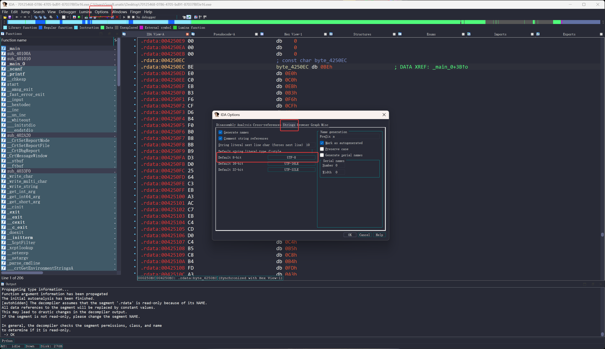
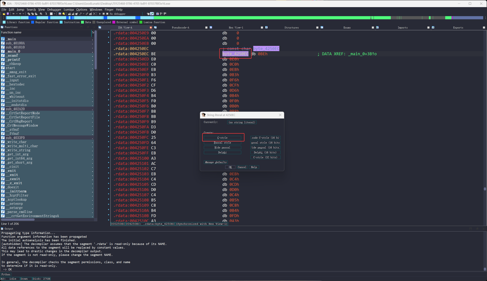

# CTF-逆向工程

**未来的研究方向里有好多要用到逆向工程的地方**

**感觉是绕不开逆向了，因此打算猛猛突击一下**
<!--more-->

## IDA使用基础

### 常用快捷键

|    快捷键    |         功能         |
| :-------: | :----------------: |
|    F2     |        添加断点        |
|    F4     |        开始运行        |
|    F5     |      反编译成伪代码       |
|    F7     |        进入函数        |
|    F8     |        单步调试        |
|    F9     |      运行到下一个断点      |
|   Space   | 切换反汇编窗口(列表视图&图形视图) |
|    Tab    |       返回栈视图        |
|    ESC    |     跳转到返回前的地址      |
|     /     |        添加注释        |
|     N     |       修改变量名        |
|     D     |      代码解析成数据       |
|     C     |      数据解析成代码       |
|     G     |     跳转到指定地址查看      |
|     H     |      转换为十进制数       |
|     Q     |      转换为十六进制数      |
|     R     |       转换为字符        |
|     X     |     查看函数的交叉引用      |
|     Y     |     指定当前函数的命名      |
| Shift+F12 |      打开字符串窗口       |
|  Shift+E  | 批量复制数据为字符串或者c数组格式  |
### 正常显示中文字符串

Options → Strings → Default 8-bit



点击UTF-8然后右键新插入一个gbk，然后选中并保存


最后点击字符串，然后按键盘上的ALT+A，选中C-style即可

如果修改后中文没有正常显示，可以尝试点击反编译后的变量按F5重新反编译



例题-BUU-内涵的软件

## 逆向中常见的数据类型

|                  数据类型                   |  位数  |
| :-------------------------------------: | :--: |
|             1 byte = 8 bit              | 8 位  |
|             1 word = 2 byte             | 16 位 |
| 1 dword(Double Word) = 2 word = 4 byte  | 32 位 |
| 1 qword(Quadra Word) = 2 dword = 8 byte | 64 位 |
|                                         |      |
|                uint32_t                 | 32 位 |
|                uint64_t                 | 64 位 |
|             char （-127-128）             | 8 位  |
|          unsigned char （0-255）          | 8 位  |
|                                         |      |
|                  float                  | 32位  |
|                 double                  | 64 位 |

## 汇编基础

|   汇编指令   |           示例            |                  含义                  |              说明               |
| :------: | :---------------------: | :----------------------------------: | :---------------------------: |
|   MOV    |      MOV EAX, ECX       |              EAX = ECX               |          将ECX的值赋给EAX          |
|   ADD    |      ADD EAX, ECX       |              EAX += ECX              |         将EAX的值加上ECX的值         |
|   SUB    |      SUB EAX, ECX       |              EAX -= ECX              |         将EAX的值减去ECX的值         |
|   INC    |         INC EAX         |                EAX++                 |           将EAX的值+1            |
|   DEC    |         DEX EAX         |                EAX--                 |           将EAX的值-1            |
|   LEA    |      LEA EAX, ECX       |             EAX = ECX的地址             |         将ECX的地址存入EAX          |
|   AND    |      AND EAX, ECX       |           EAX = EAX & ECX            |         EAX与ECX进行与运算          |
|    OR    |       OR EAX, ECX       |           EAX = EAX \| ECX           |         EAX与ECX进行或运算          |
|   XOR    |      XOR EAX, ECX       |           EAX = EAX ^ ECX            |         EAX与ECX进行异或运算         |
|   NOT    |         NOT EAX         |              EAX = ~EAX              |           将EAX的值取反            |
|   SHL    |       SHL EAX, 3        |            EAX = EAX << 3            |          将EAX的值左移三位           |
|   SHR    |       SHR EAX, 3        |            EAX = EAX >> 3            |          将EAX的值右移三位           |
|   CMP    |      CMP EAX, ECX       | if(EAX == ECX) ZF = 1<br>else ZF = 0 | 对EAX和ECX的值进行比较并根据比较结果设置ZF标志的值 |
|   TEST   |      TEST EAX, EAX      |  if(EAX == 0) ZF = 1<br>else ZF = 0  |  将EAX的值与0进行比较并根据比较结果设置ZF标志的值  |
|  JE[JZ]  |       JZ 04001000       |     if(ZF == 1)<br>GOTO 04001000     |      若ZF为1则跳转至 04001000       |
| JNE[JNZ] |      JNZ 04001000       |     if(ZF == 0)<br>GOTO 04001000     |      若ZF为0则跳转至 04001000       |
|   JMP    |      JMP 04001000       |            GOTO 04001000             |        直接跳转至 04001000         |
|   CALL   | CALL printf<br>CALL $+5 |                                      |    调用函数printf<br>跳转到下一条指令     |
|   PUSH   |        PUSH EAX         |                                      |          将EAX的值压入栈顶           |
|   POP    |         POP EAX         |                                      |          将栈顶的值弹给EAX           |

一些常用的寄存器：

| **32位 (x86)** | **64位 (x64)** | **用途**                           |
| ------------- | ------------- | -------------------------------- |
| **EAX**       | **RAX**       | 累加器（Accumulator），算术运算、函数返回值      |
| **EBX**       | **RBX**       | 基址寄存器（Base），常用于存储指针              |
| **ECX**       | **RCX**       | 计数器（Counter），LOOP指令、字符串操作        |
| **EDX**       | **RDX**       | 数据寄存器（Data），辅助EAX（如MUL/DIV）      |
| **ESI**       | **RSI**       | 源索引（Source Index），字符串/内存操作       |
| **EDI**       | **RDI**       | 目标索引（Destination Index），字符串/内存操作 |
| **ESP**       | **RSP**       | 栈指针（Stack Pointer），指向当前栈顶        |
| **EBP**       | **RBP**       | 基址指针（Base Pointer），函数栈帧          |
|               |               |                                  |
| **EIP**       | **RIP**       | 存储下一条要执行的指令地址                    |
| **EFLAGS**    | **RFLAGS**    | 存储 CPU 状态标志（如 ZF, CF, SF 等）      |

## 常见的编码与加密

### base64

```c++
char base64_table[] = "ABCDEFGHIJKLMNOPQRSTUVWXYZabcdefghijklmnopqrstuvwxyz0123456789+/"
int __fastcall base64_encode(char *Str2, char *Str)
{
  int v3; // [rsp+24h] [rbp-1Ch]
  int v4; // [rsp+34h] [rbp-Ch]
  int v5; // [rsp+38h] [rbp-8h]
  int v6; // [rsp+3Ch] [rbp-4h]

  v3 = strlen(Str);
  if ( v3 % 3 )
    v6 = 4 * (v3 / 3 + 1);
  else
    v6 = 4 * (v3 / 3);
  Str2[v6] = 0;
  v5 = 0;
  v4 = 0;
  while ( v6 - 2 > v5 )
  {
    Str2[v5] = base64_table[(unsigned __int8)Str[v4] >> 2]; // 右移2位，获得第一个字符前6位的数据
    Str2[v5 + 1] = base64_table[(16 * (Str[v4] & 3)) | ((unsigned __int8)Str[v4 + 1] >> 4)]; // 获取第二个6位
    Str2[v5 + 2] = base64_table[(4 * (Str[v4 + 1] & 0xF)) | ((unsigned __int8)Str[v4 + 2] >> 6)]; // 获得第三个6位
    Str2[v5 + 3] = base64_table[Str[v4 + 2] & 0x3F]; // 获得第四个6位
    v4 += 3;
    v5 += 4;
  }
  if ( v3 % 3 == 1 )
  {
    Str2[v5 - 2] = "=";
    Str2[v5 - 1] = "=";
  }
  else if ( v3 % 3 == 2 )
  {
    Str2[v5 - 1] = "=";
  }
  return putchar("\n");
}
```


### RC4加密算法

### TEA系列加密算法

#### TEA 

加密和解密的示例代码

```c++
void encrypt(unsigned int* v, unsigned int* key) {
  unsigned int l = v[0], r = v[1], sum = 0, delta = 0x9e3779b9;
  for (int i = 0; i < 32; i++) {
    sum += delta;
    l += ((r << 4) + key[0]) ^ (r + sum) ^ ((r >> 5) + key[1]);
    r += ((l << 4) + key[2]) ^ (l + sum) ^ ((l >> 5) + key[3]);
  }
  v[0] = l;
  v[1] = r;
}
 
void decrypt(unsigned int* v, unsigned int* key) {
  unsigned int l = v[0], r = v[1], sum = 0, delta = 0x9e3779b9;
  sum = delta *32;
  for (int i = 0; i < 32; i++) {
    r -= ((l << 4) + key[2]) ^ (l + sum) ^ ((l >> 5) + key[3]);
    l -= ((r << 4) + key[0]) ^ (r + sum) ^ ((r >> 5) + key[1]);
    sum -= delta;
  }
  v[0] = l;
  v[1] = r;
}
```

解密脚本

```c++
#include<stdio.h>
int main(){
    int n;//pw的个数
	unsigned int pw[]={};//可改
	unsigned int v0;
	unsigned int v1;
	unsigned int sum;
    unsigned int key[4]={1,2,3,4};//可改
	for(int i=0;i<n/2;i++)
	{
		v0=pw[2*i];
		v1=pw[2*i+1];
		sum=-32*0x61C88647;
		for(int i=0;i<32;i++)
		{
			v1 -= ((v0 >> 5) + key[3] )^ (16 * v0 + key[2]) ^ (sum + v0);//容易魔改	
			v0 -= ((v1 >> 5) + key[1]) ^ (16 * v1 + key[0]) ^ (sum + v1);
			sum += 0x61C88647;//容易魔改
		}
		for (int j = 0; j<=3; j++)
		{
			printf("%c", (v0 >> (j * 8)) & 0xFF);
		}
		for (int j = 0; j<=3; j++)
		{
			printf("%c", (v1 >> (j * 8)) & 0xFF);
		}
	}
}
```

比赛中用到的一些代码

处理原始字节数据版本

```python
#include <iostream>
#include <cstdint>

void tea_decrypt(uint32_t* v, uint32_t* key) {
    uint32_t l = v[0];
    uint32_t r = v[1];
    uint32_t sum = 32 * 0x414554; // 加密的总delta和
    
    for (int i = 0; i < 32; ++i) {
        r -= ((l << 4) + key[2]) ^ (l + sum) ^ ((l >> 5) + key[3]);
        l -= ((r << 4) + key[0]) ^ (r + sum) ^ ((r >> 5) + key[1]);
        sum -= 0x414554;
    }
    
    v[0] = l;
    v[1] = r;
}

int main() {
    // 加密后的数据（小端序）
    uint8_t encrypted[] = {
        0xE4, 0x6E, 0x00, 0xF0, 
        0x91, 0x73, 0x9A, 0xBE,
        0xCA, 0xF1, 0x2A, 0x60, 
        0x0E, 0x8F, 0x74, 0x83, 
        0xE0, 0x8E, 0x6C, 0x34, 
        0xD7, 0x99, 0xDE, 0x36, 
        0x8B, 0x86, 0xC4, 0x90, 
        0xC2, 0x0B, 0xC4, 0x59
    };
    
    // 密钥（小端序）
    uint8_t key_bytes[] = {
        0xEF, 0xBE, 0xAD, 0xDE, 
        0x0D, 0xF0, 0xAD, 0xBA, 
        0xDE, 0xC0, 0xAD, 0xDE, 
        0xCC, 0x10, 0xAD, 0xDE
    };
    
    // 将字节数组转换为4个32位整数（注意小端序）
    uint32_t key[4];
    for (int i = 0; i < 4; i++) {
        key[i] = (key_bytes[4*i+3] << 24) | (key_bytes[4*i+2] << 16) | 
                 (key_bytes[4*i+1] << 8) | key_bytes[4*i];
    }
    // 0xDEADBEEF 0xBAADF00D 0xDEADC0DE 0xDEAD10CC

    int num_blocks = sizeof(encrypted) / 8; // 8个32位整数
    
    for (int i = 0; i < num_blocks; i++) {
        // 将加密数据转换为32位整数（小端序）
        uint32_t v[2];
        v[0] = (encrypted[8*i+3] << 24) | (encrypted[8*i+2] << 16) | 
               (encrypted[8*i+1] << 8) | encrypted[8*i];
        v[1] = (encrypted[8*i+7] << 24) | (encrypted[8*i+6] << 16) | 
               (encrypted[8*i+5] << 8) | encrypted[8*i+4];
        
        // 一次解密两个32位整数
        tea_decrypt(v, key);
        
        // 输出解密结果（转换为字节）
        for (int j = 0; j < 4; j++) {
            printf("%c", (v[0] >> (j * 8)) & 0xFF);
        }
        for (int j = 0; j < 4; j++) {
            printf("%c", (v[1] >> (j * 8)) & 0xFF);
        }
    }
    return 0;
}
```


#### XTEA 

加密和解密的示例代码

```c++
void xtea_encrypt(uint32_t* v, uint32_t* key) {
    uint32_t v0 = v[0];
    uint32_t v1 = v[1];
    uint32_t sum = 0;
    uint32_t delta = 0x9E3779B9; //0x9E3779B9=-0x61C88647
    
    for (int i = 0; i < 32; i++) {
        v0 += (((v1 << 4) ^ (v1 >> 5)) + v1) ^ (sum + key[sum & 3]);
        sum += delta; // 如果 delta=0x61C88647, 这里就是 sum -= delta
        v1 += (((v0 << 4) ^ (v0 >> 5)) + v0) ^ (sum + key[(sum >> 11) & 3]);
    }
    
    v[0] = v0;
    v[1] = v1;
}

void xtea_decrypt(uint32_t* v, uint32_t* key) {
    uint32_t v0 = v[0];
    uint32_t v1 = v[1];
    uint32_t sum = 32 * 0x9E3779B9; // 加密的总和
    uint32_t delta = 0x9E3779B9;
    
    for (int i = 0; i < 32; i++) {
        v1 -= (((v0 << 4) ^ (v0 >> 5)) + v0) ^ (sum + key[(sum >> 11) & 3]);
        sum -= delta;
        v0 -= (((v1 << 4) ^ (v1 >> 5)) + v1) ^ (sum + key[sum & 3]);
    }
    
    v[0] = v0;
    v[1] = v1;
}
```

比赛中用到的一些脚本

处理原始字节数据版本
```c++
#include <iostream>
#include <cstdint>

void xtea_decrypt(uint32_t* v, uint32_t* key) {
    uint32_t l = v[0];
    uint32_t r = v[1];
    uint32_t sum = 32 * 0x9E3779B9; // XTEA的总delta和（32轮）
    uint32_t delta = 0x9E3779B9;
    
    for (int i = 0; i < 32; ++i) {
        r -= (((l << 4) ^ (l >> 5)) + l) ^ (key[(sum >> 11) & 3] + sum);
        sum -= delta;
        l -= (((r << 4) ^ (r >> 5)) + r) ^ (key[sum & 3] + sum);
    }
    
    v[0] = l;
    v[1] = r;
}

int main() {
    // 加密后的数据（小端序）
    uint8_t encrypted[] = {
        0xD1, 0x36, 0x0D, 0x59, 
        0xE2, 0xB5, 0xA9, 0x6F, 
        0xAD, 0x90, 0x71, 0xDA, 
        0xA0, 0x0A, 0x4B, 0xC5, 
        0x54, 0xED, 0xA5, 0xAD,
        0x84, 0x7F, 0xD0, 0x4A, 
        0xC0, 0xF3, 0x4C, 0x8A, 
        0x2F, 0xB2, 0xEF, 0x7F
    };
    
    // 密钥（小端序）
    uint8_t key_bytes[] = {
        0x0D, 0x00, 0x00, 0x00, 
        0x00, 0x00, 0x00, 0x00, 
        0x07, 0x00, 0x00, 0x00, 
        0x21, 0x00, 0x00, 0x00
    };
    
    // 将字节数组转换为4个32位整数（小端序）
    uint32_t key[4];
    for (int i = 0; i < 4; i++) {
        key[i] = (key_bytes[4*i+3] << 24) | (key_bytes[4*i+2] << 16) | 
                 (key_bytes[4*i+1] << 8) | key_bytes[4*i];
    }
    
    int num_blocks = sizeof(encrypted) / 8; // 每个块8字节
    
    for (int i = 0; i < num_blocks; i++) {
        // 将加密数据转换为32位整数（小端序）
        uint32_t v[2]; // 数组元素每个为4字节
        v[0] = (encrypted[8*i+3] << 24) | (encrypted[8*i+2] << 16) | 
               (encrypted[8*i+1] << 8) | encrypted[8*i];
        v[1] = (encrypted[8*i+7] << 24) | (encrypted[8*i+6] << 16) | 
               (encrypted[8*i+5] << 8) | encrypted[8*i+4];
        
        // XTEA解密
        xtea_decrypt(v, key);
        
        // 输出解密结果（转换为字节，小端序）
        for (int j = 0; j < 4; j++) {
            printf("%c", (v[0] >> (j * 8)) & 0xFF);
        }
        for (int j = 0; j < 4; j++) {
            printf("%c", (v[1] >> (j * 8)) & 0xFF);
        }
    }
    return 0;
}
```

处理32位整数版本
```c++
#include <iostream>

void xtea_decrypt(uint32_t *v, uint32_t *key)
{
  uint32_t l = v[0];
  uint32_t r = v[1];
  uint32_t sum = 32 * 0x9E3779B9; // XTEA的总delta和（32轮）
  uint32_t delta = 0x9E3779B9;

  for (int i = 0; i < 32; ++i)
  {
    r -= (((l << 4) ^ (l >> 5)) + l) ^ (key[(sum >> 11) & 3] + sum);
    sum -= delta;
    l -= (((r << 4) ^ (r >> 5)) + r) ^ (key[sum & 3] + sum);
  }

  v[0] = l;
  v[1] = r;
}

int main()
{
  uint32_t enc[8] = 
  {// 4x8=32字节
    0x590D36D1, 0x6FA9B5E2, 0xDA7190AD, 0xC54B0AA0,
    0xADA5ED54, 0x4AD07F84, 0x8A4CF3C0, 0x7FEFB22F
  };
  uint32_t key[4] = {0x0000000D, 0x00000000, 0x00000007, 0x00000021};

  int num_blocks = sizeof(enc) / 8; // 每个块8字节, 所以这里的结果是4

  for (int i = 0; i < num_blocks; i++)
  {
    uint32_t v[2];
    v[0] = enc[2 * i];
    v[1] = enc[2 * i + 1];

    xtea_decrypt(v, key);

    // 输出解密结果（转换为字节，小端序）
    for (int j = 0; j < 4; j++)
    {
      printf("%c", (v[0] >> (j * 8)) & 0xFF);
    }
    for (int j = 0; j < 4; j++)
    {
      printf("%c", (v[1] >> (j * 8)) & 0xFF);
    } 
  }
  return 0;
}
```


#### XXTEA

加密和解密的示例代码

```c++
void xxtea_encrypt(uint32_t* v, int n, uint32_t key[4]) {
    uint32_t y, z, sum;
    uint32_t delta = 0x9E3779B9;
    uint32_t p, rounds, e;
    
    rounds = 6 + 52 / n;
    sum = 0;
    z = v[n - 1];
    
    do {
        sum += delta;
        e = (sum >> 2) & 3;
        
        for (p = 0; p < n - 1; p++) {
            y = v[p + 1];
            v[p] += ((z >> 5 ^ y << 2) + (z << 3 ^ y >> 4)) ^ ((sum ^ y) + (key[(p & 3) ^ e] ^ z));
            z = v[p];
        }
        
        y = v[0];
        v[n - 1] += ((z >> 5 ^ y << 2) + (z << 3 ^ y >> 4)) ^ ((sum ^ y) + (key[(p & 3) ^ e] ^ z));
        z = v[n - 1];
    } while (--rounds);
}

void xxtea_decrypt(uint32_t* v, int n, uint32_t key[4]) {
    uint32_t y, z, sum;
    uint32_t delta = 0x9E3779B9;
    uint32_t p, rounds, e;
    
    rounds = 6 + 52 / n;
    sum = rounds * delta;
    y = v[0];
    
    do {
        e = (sum >> 2) & 3;
        
        for (p = n - 1; p > 0; p--) {
            z = v[p - 1];
            v[p] -= ((z >> 5 ^ y << 2) + (z << 3 ^ y >> 4)) ^ ((sum ^ y) + (key[(p & 3) ^ e] ^ z));
            y = v[p];
        }
        
        z = v[n - 1];
        v[0] -= ((z >> 5 ^ y << 2) + (z << 3 ^ y >> 4)) ^ ((sum ^ y) + (key[(p & 3) ^ e] ^ z));
        y = v[0];
        sum -= delta;
    } while (--rounds);
}
```

解密脚本
```c++
#include <stdio.h>
#include <stdlib.h>
#define delta 0x9e3779b9
 
int main()
{
    unsigned int v[8] = {0x10BD3B47, 0x6155E0F9, 0x6AF7EBC5, 0x8D23435F, 0x1A091605, 0xD43D40EF, 0xB4B16A67, 0x6B3578A9};//可改
    unsigned int key[4] = {0x00001234, 0x00002345, 0x00004567, 0x00006789};//可改
    unsigned int sum = 0;
    unsigned int y,z,p,rounds,e;
    int n = 8;//v的个数
    int i = 0;
    rounds = 6 + 52/n;//容易魔改
    y = v[0];
    sum = rounds*delta;
     do
     {
        e = sum >> 2 & 3;
        for(p=n-1;p>0;p--)
        {
            z = v[p-1];
            v[p] -= ((((z>>5)^(y<<2))+((y>>3)^(z<<4))) ^ ((key[(p&3)^e]^z)+(y ^ sum)));//容易魔改
            y = v[p];
        }
        z = v[n-1];
        v[0] -= (((key[(p^e)&3]^z)+(y ^ sum)) ^ (((y<<2)^(z>>5))+((z<<4)^(y>>3))));//容易魔改
        y = v[0];
        sum = sum-delta;
     }while(--rounds);
    for(i=0;i<n;i++)
    {
        printf("%c%c%c%c",*((char*)&v[i]+0),*((char*)&v[i]+1),*((char*)&v[i]+2),*((char*)&v[i]+3));
        //printf("%c%c%c%c",*((char*)&v[i]+3),*((char*)&v[i]+2),*((char*)&v[i]+1),*((char*)&v[i]+0));
    }
    return 0;
}
```


### MD5

### SMC

> SMC，即Self Modifying Code，动态代码加密技术，指通过修改代码或数据，阻止别人直接静态分析，然后在动态运行程序时对代码进行解密，达到程序正常运行的效果。
> 
> SMC一般有俩种破解方法，第一种是找到对代码或数据加密的函数后通过idapython写解密脚本。第二种是动态调试到SMC解密结束的地方dump出来。


## 常见的混淆

### 花指令

#### 永恒跳转

构造代码如下

```
__asm {
    _emit 0xE8
    _emit 0xFF
   //_emit 立即数：代表在这个位置插入一个数据，这里插入的是0xe8
}
```

插入这些代码后，IDA反汇编就会得到如下内容


对于这种，我们只要将0xE8该成0x90(NOP指令)即可

#### jnz和jz互补跳转

构造代码如下

```
 __asm {
        jz Label;
		jnz Label;
		_emit 0xC7;
Label:
```

插入这些代码后，IDA反汇编就会得到如下内容


去除花指令的方法：

在准备去除花指令之前，我们需要先调整操作码显示的字节数


1、点到跳转的那一行，按键盘上的u键，将其解析为数据，然后在E8上右键选择NOP，再按键盘上的c键重新解析为代码，最后在函数名(main)上按一下p键然后F5重新反汇编即可

2、点到跳转的那一行，按键盘上的u键，将其解析为数据，然后点击菜单栏 Edit → Patch Program → Change byte，将0xE8改成0x90，再按键盘上的c键重新解析为代码，最后在函数名(main)上按一下p键然后F5重新反汇编即可

例题1-[HNCTF 2022 WEEK2]e@sy_flower

例题2-[NSSRound#3 Team]jump_by_jump_revenge

例题3-[MoeCTF 2022]chicken_soup


### 控制流平坦化

#### OLLVM


## 常见的壳

可以先把待逆向的文件拖入 [DIE(Detect-It-Easy)](https://github.com/horsicq/Detect-It-Easy) 中查看是用的什么壳

### upx

一种压缩壳，可以尝试直接用upx脱壳

```bash
# 下载
upx: https://github.com/upx/upx
# 使用方法
upx -d re.exe
```

也可以尝试手动脱upx

## Python逆向

有部分exe是由 pyinstaller 打包的，通常可以直接根据文件的图标看出来

针对这种exe的逆向，我可以按照如下步骤：

1、使用 pyinstxtractor 先进行解包

> pyinstxtractor: https://github.com/extremecoders-re/pyinstxtractor

```bash
# 可以用如下命令进行解包
[+] Usage: pyinstxtractor.py <filename>
python ~/CTF/Reverse/pyinstxtractor/pyinstxtractor.py pyc.exe
# 这里要注意，如果本地版本和出题人打包用的版本不同，某些依赖可能无法正常解包
```

2、反编译解包后得到的 pyc 文件

第一种方法是用如下的在线网站反编译：

```
https://tool.lu/pyc/
https://www.lddgo.net/string/pyc-compile-decompile
https://www.toolkk.com/tools/pyc-decomplie
```

第二中方法就是用本地工具进行反编译，这里有以下三个常用的反编译工具：

uncompyle6: https://github.com/rocky/python-uncompyle6

```bash
# 直接 pip 安装即可
pip3 install uncompyle6
# 然后将 Script 目录添加到环境变量中
C:\Users\XXX\AppData\Local\Programs\Python\Python38\Scripts
# 之后就可以直接在终端中使用了
uncompyle6 filename.pyc > decompile.py
```

pyinstxtractor: https://github.com/extremecoders-re/pyinstxtractor

```bash
python pyinstxtractor.py reverse_1_PyHaHa.pyc
```

pycdc: https://github.com/zrax/pycdc

```bash
# 下载并编译
git clone https://github.com/zrax/pycdc.git
mkdir build && cd build
cmake ..
make -j$(nproc)

# 使用方法
Usage:  ./pycdc [options] input.pyc
~/CTF/Reverse/pycdc/build/pycdc main.pyc

Options:
  -o <filename>  Write output to <filename> (default: stdout)
  -c             Specify loading a compiled code object. Requires the version to be set
  -v <x.y>       Specify a Python version for loading a compiled code object
  --help         Show this help text and then exit
```

> Tips: 有时候会遇到pyc文件魔术头被修改的情况，可以复制解包后的struct.pyc到要反编译的pyc文件中（就是文件前16个字节）

## Unity游戏逆向

参考文章：https://forum.butian.net/share/1294

Unity 游戏的主逻辑一般都保存在 dll 文件中，因此我们需要下个 dnspy 来反编译

然后我们需要打开并反编译 `data/Managed/Assembly-CSarp.dll` 这个文件

我们可以在 dnspy 的编辑器中右键编辑类或者方法，编辑完后编译

然后左上角-文件-全部保存即可保存我们的修改

> 一般就是修改分数或者判断逻辑等参数，从而获得 flag

## 常用的一些逆向工具

### Z3 约束求解器

> Z3-solver是微软开发的自动定理证明器和约束求解器，能够将复杂问题转化为数学约束条件，然后自动寻找满足所有条件的解。它特别擅长处理包含布尔逻辑、算术运算、位运算等多种约束的复杂问题，广泛应用于程序验证、网络安全、人工智能等领域。Z3通过先进的符号推理和约束求解技术，能够解决传统方法难以处理的非线性约束和复杂逻辑关系，是一个强大的数学问题求解工具。

安装方法: `pip3 install z3-solver`

基本用法如下，更多用法可以参考[官方文档](https://z3prover.github.io/api/html/index.html)

```python
from z3 import *

# 1. 创建变量
x = Int('x')      # 整型变量
y = Int('y')      # 整型变量
p = Bool('p')     # 布尔变量p
q = Bool('q')     # 布尔变量q
r = Bool('r')     # 布尔变量r

# 2. 创建求解器
s = Solver()

# 3. 添加约束条件
# 数值约束
s.add(x > 0)                    # x必须大于0
s.add(y > 0)                    # y必须大于0
s.add(x + y == 10)              # x+y等于10
s.add(Implies(p, x > y))        # 如果p为真，则x>y

# 逻辑约束
s.add(Implies(p, q))            # p → q (如果p为真，则q为真)
s.add(r == Not(q))              # r = ¬q (r等于q的否定)
s.add(Or(Not(p), r))            # ¬p ∨ r (p的否定或r为真)

# 4. 检查约束是否可满足
if s.check() == sat:
    # 5. 获取解
    m = s.model()
    print(f"找到解：x = {m[x]}, y = {m[y]}")
    print(f"逻辑变量：p = {m[p]}, q = {m[q]}, r = {m[r]}")
else:
    print("约束不可满足")
```

示例代码：

```python
from z3 import *

enc = [0x0000B1B0, 0x00005678, 0x00007FF2, 0x0000A332, 0x0000A0E8, 0x0000364C, 0x00002BD4, 0x0000C8FE, 0x00004A7C, 0x00000018, 0x00002BE4, 0x00004144, 0x00003BA6, 0x0000BE8C, 0x00008F7E, 0x000035F8, 0x000061AA, 0x00002B4A, 0x00006828, 0x0000B39E, 0x0000B542, 0x000033EC, 0x0000C7D8, 0x0000448C, 0x00009310, 0x00008808, 0x0000ADD4, 0x00003CC2, 0x00000796, 0x0000C940, 0x00004E32, 0x00004E2E, 0x0000924A, 0x00005B5C]

s = Solver()

input = [BitVec(f"input{i}", 8) for i in range(34)] # input0-input33 都是 0-255
var = [BitVec(f"var{i}",32) for i in range(34)] # var0-var31 都是 0-4294967295

# 模拟加密算法
for i in range(34):
    var[i] = 47806 * (ZeroExt(24, input[i]) + i) # 高位补零，将8位扩展至32位
    if i:
        var[i] ^= var[i-1] ^ 0x114514
    var[i] %= 51966

# 添加约束条件
for i in range(34):
    s.add(var[i] == enc[i])

while True:
    if s.check() == sat: # 找到解
        m = s.model()
        ascii_list = [m[input[i]].as_long() for i in range(34)] # 将Z3的符号值转换为Python的普通整数
        flag = "moectf{"  + "".join(chr(ascii_list[i]) for i in range(34)) + "}"
        print(flag)

        # 添加阻塞条件，寻找下一个解
        block = []
        for i in range(34):
            block.append(input[i] != m[input[i]])
        s.add(Or(block)) # 至少有一个变量与当前解不同
    else:
        break
```

```python
from z3 import *

def solve():
    a = [Int('a%d' % i) for i in range(10)]
    s = Solver()
    s.add(2 * a[7] + 8 * a[6] + 8 * a[5] + 2 * a[4] + 4 * a[3] + 5 * a[1] + 2 * a[0] + 6 * a[2] + a[8] + 5 * a[9] == 3976)
    s.add(a[5] + 9 * a[3] + 7 * a[2] + 5 * a[1] + 3 * a[0] + 7 * a[4] + 4 * a[6] + 6 * a[7] + 8 * a[8] + 5 * a[9] == 5265)
    s.add(7 * a[8] + 2 * a[6] + 6 * a[4] + 7 * a[3] + 7 * a[2] + 3 * a[1] + 8 * a[0] + 5 * a[5] + 4 * a[7] + 9 * a[9] == 5284)
    s.add(7 * a[6] + 5 * a[5] + 6 * a[4] + 3 * a[3] + 9 * a[0] + 6 * a[1] + 4 * a[2] + 9 * a[7] + 8 * a[8] + 7 * a[9] == 5925)
    s.add(7 * a[8] + 8 * a[6] + 6 * a[4] + a[2] + 4 * a[1] + 3 * a[0] + 2 * a[3] + 5 * a[5] + 2 * a[7] + 3 * a[9] == 4048)
    s.add(3 * a[8] + 9 * a[7] + 7 * a[6] + 4 * a[4] + 4 * a[3] + 5 * a[0] + 8 * a[1] + 6 * a[2] + 4 * a[5] + 7 * a[9] == 5072)
    s.add(5 * a[7] + 2 * a[3] + 2 * (a[0] + a[1]) + 3 * a[2] + a[4] + 7 * a[5] + 2 * a[6] + 3 * a[8] + 2 * a[9] == 2813)
    s.add(3 * a[8] + 5 * a[7] + 7 * a[6] + 3 * a[5] + 7 * a[4] + 7 * a[1] + a[0] + 7 * a[2] + 8 * a[3] + 6 * a[9] == 5004)
    s.add(2 * a[8] + 5 * a[6] + 5 * a[5] + 5 * a[4] + 9 * a[3] + 5 * a[0] + 9 * a[1] + a[2] + 5 * a[7] + a[9] == 4490)
    s.add(6 * a[8] + 7 * a[7] + 5 * a[6] + 6 * a[3] + 4 * a[1] + 6 * a[0] + 8 * a[2] + 6 * a[4] + 8 * a[5] + 7 * a[9] == 5936)
    
    for i in range(10):
        s.add(a[i] >= 32)
        s.add(a[i] <= 126)
    if s.check() == sat:
        model = s.model()
        solution = [model.eval(a[i]).as_long() for i in range(10)]
        print(solution)
    for item in solution:
        print(chr(item),end='')
    

if __name__ == "__main__":
    solve()
```

---

> 作者: [Lunatic](https://goodlunatic.github.io)  
> URL: https://goodlunatic.github.io/posts/0f92e23/  

