# 2024 XCTF国际网络攻防联赛-DubheCTF分站赛 Misc Writeup

**这两天打了 2024 DubheCTF 后突然感觉自己之前学的东西只不过是皮毛中的皮毛**

**感觉还得是靠打这些难度比较高的比赛来督促自己学习新东西**
<!--more-->
## 题目名称 Cipher

**从这道题入手，由浅入深学习一下Windows自带的 Cipher 加密（EFS加密算法）**

**用磁盘精灵打开vhd文件，在public目录下看到一个加密的flag.jpg**

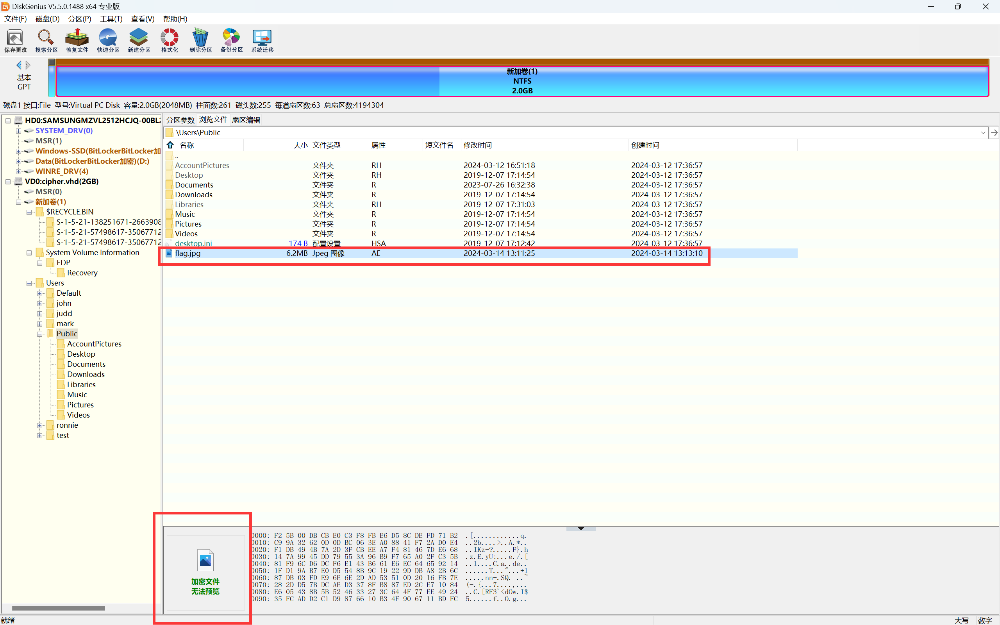

**直接装载到本地，可以发现还是加密的，根据题目名字 cipher 得知应该是用windows自带的 cipher 加密了**

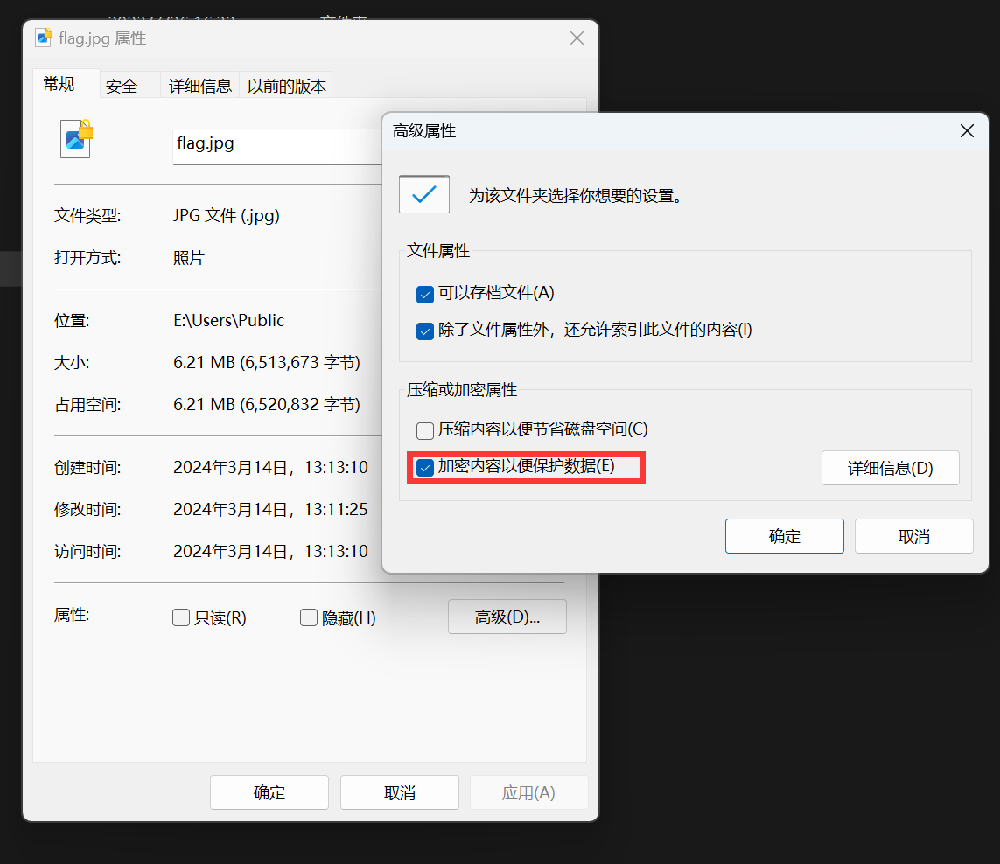

**赛后根据参考链接：**

[https://support.microsoft.com/zh-cn/topic/cipher-exe-%E5%AE%89%E5%85%A8%E5%B7%A5%E5%85%B7-%E7%94%A8%E4%BA%8E%E5%8A%A0%E5%AF%86%E6%96%87%E4%BB%B6%E7%B3%BB%E7%BB%9F-56c85edd-85cf-ac07-f2f7-ca2d35dab7e4](https://support.microsoft.com/zh-cn/topic/cipher-exe-安全工具-用于加密文件系统-56c85edd-85cf-ac07-f2f7-ca2d35dab7e4)

**得知cipher用的是EFS加密**

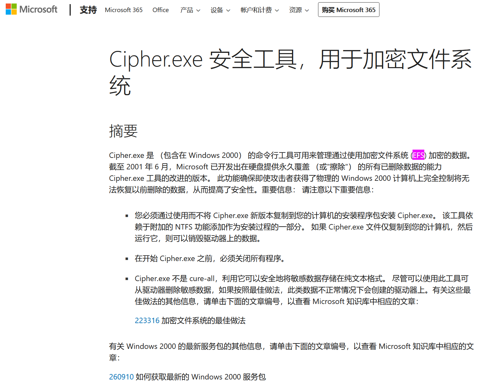

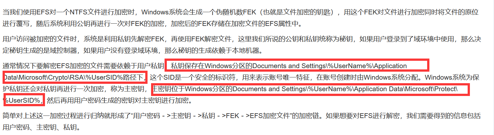

**根据参考链接：**

https://cloud.tencent.com/developer/article/1549305

我们现在很容易可以知道，题目的考点就是要我们找私钥和主密钥了

从详细信息中可以知道该文件的所有者是mark，所以之后的步骤就需要把目光聚焦到用户mark的目录下了

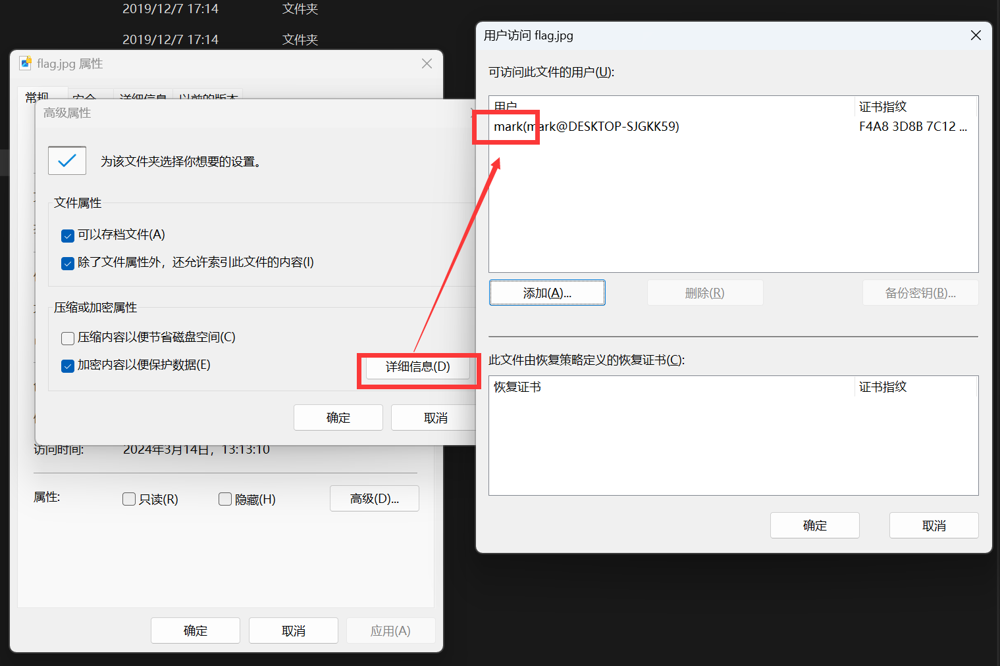

**对照着参考链接：**
https://blog.csdn.net/shuaicenglou3032/article/details/131184510

**在 E:\Users\mark\AppData\Roaming\Microsoft 路径下成功找到这两个密钥**

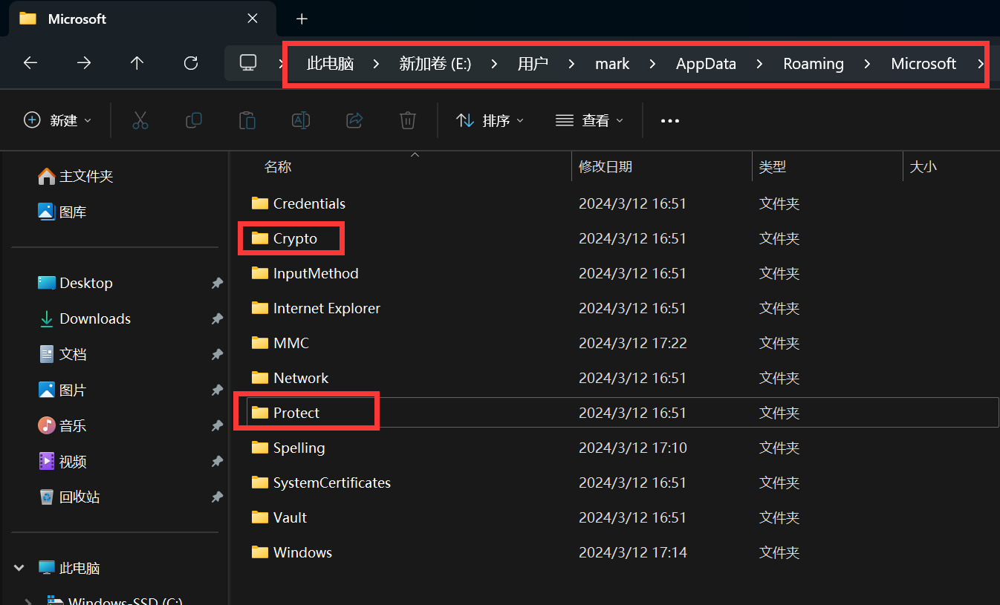

**赛后看了别的师傅的writeup，知道了用户的powershell历史记录会在这个路径下**

**\Users\test\AppData\Roaming\Microsoft\Windows\PowerShell\PSReadLine\ConsoleHost_history.txt**

**在test用户的目录中找到了各个用户的密码，知道mark用户的密码是superman**

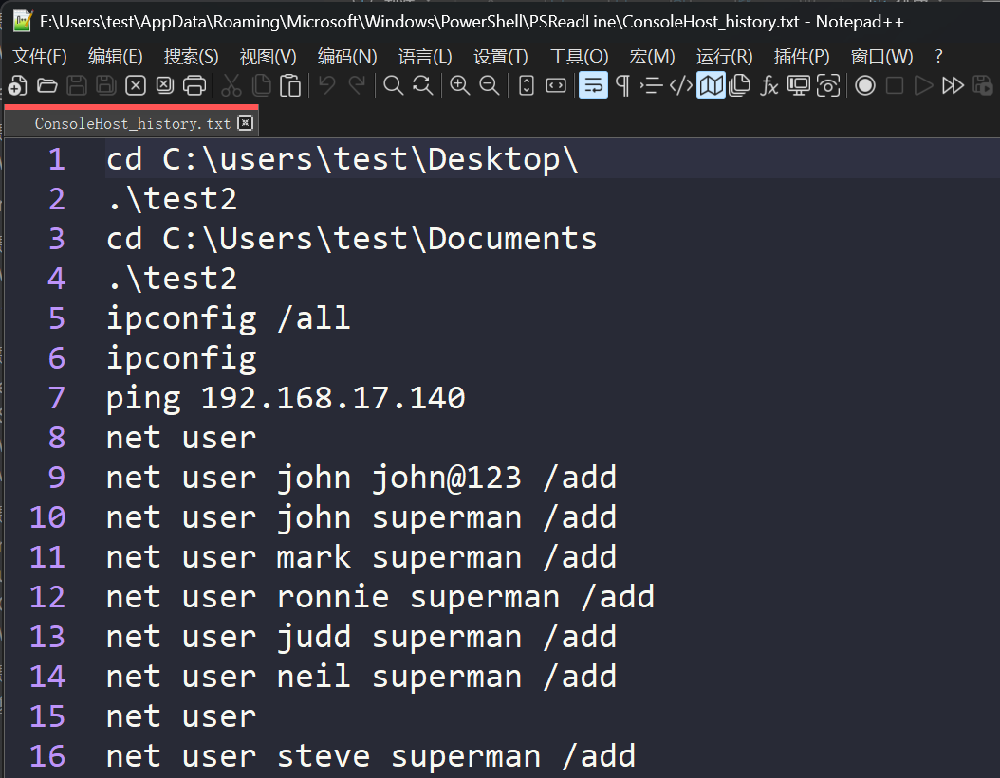

**如果有 Advanced efs data recovery 这个工具的破解版的话，这道题到这里就结束了**

**直接用这个工具扫描磁盘获取两个密钥和加密文件，然后输入mark用户的密码 superman 即可解密得到flag**

**这里贴一张山海关的大佬成功解密的图片**

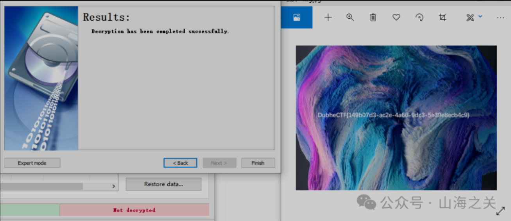

**然而因为这个软件我全网都没有找到能用的破解版，官网的试用版只能解密部分内容**

**因此接下来我要深入分析一下手搓解密EFS的方法**
**参考链接如下(只能说Lilac的Misc手太强了。。。)：**

https://lilachit.notion.site/Lilac-2024DubheCTF-wp-caa603fa40ba4699982a13ddf062906a#1b970b22b5e04cb98a5e02cb2f688a4a

**首先，假设我们之前不知道test用户的powershell历史记录中有各个用户的密码**
**因此这里我们就需要先用 DPAPImk2john.py+John the Ripper 去爆破出mark用户的密码**

DPAPI是Windows操作系统中的一种加密功能，用于保护用户敏感数据，例如用户的登录密码、浏览器保存的密码等。DPAPImk2john.py脚本可以提取这些被DPAPI加密的凭据，并将其转换为John the Ripper密码破解工具所支持的格式，以便进行密码破解或分析操作。

**先用DPAPImk2john.py脚本获取DPAPI的Hash值**

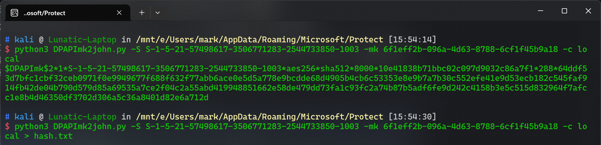

**然后将hash.txt拉到 kali 或者直接在 Windows 中用 john 根据 rockyou.txt 字典进行爆破**

**爆破完即可得到密码是 superman**

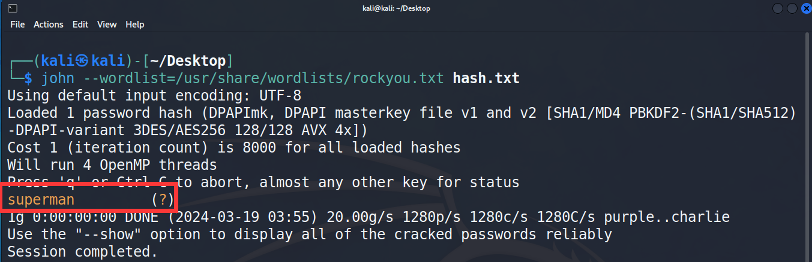

**得到 mark 的密码后，就可以使用 Mimikatz 爆破 Masterkeys 了**

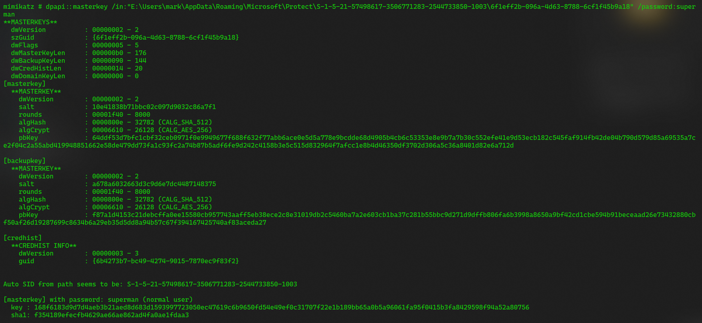

\[masterkey\] with password: superman (normal user)

  key : 168f6183d9d7d4aeb3b21aed8d683d1593997723050ec47619c6b9650fd54e49ef0c31707f22e1b189bb65a0b5a96061fa95f0415b3fa8429598f94a52a80756

  sha1: f354189efecfb4629ae66ae862ad4fa0ae1fdaa3

**本人目前水平有限，这里就先贴一份Lilac大佬写的脚本吧，脚本解密完即可得到flag**

```python
from cryptography.hazmat.primitives import serialization
from cryptography.hazmat.primitives.asymmetric import padding
from cryptography.hazmat.primitives.ciphers import Cipher, algorithms, modes

with open('private.pem', 'rb') as key_file:
    private_key = serialization.load_pem_private_key(key_file.read(), password=None)
with open('$EFS', 'rb') as EFS_file:
    efs = EFS_file.read()

'''
typedef struct
{
	DWORD		AttributeLength;
	DWORD		State;
	DWORD		Version;
	DWORD		CryptoAPIVersion;
	BYTE		Checksum[16];
	BYTE		ChecksumDDF[16];
	BYTE		ChecksumDRF[16];
	DWORD		OffsetToDDF;
	DWORD		OffsetToDRF;
} MFT_RECORD_ATTRIBUTE_EFS_HEADER, * PMFT_RECORD_ATTRIBUTE_EFS_HEADER;
'''
OffsetToDDF = int.from_bytes(efs[0x40:0x44], byteorder='little')
print(f'OffsetToDDF: {hex(OffsetToDDF)}')

'''
typedef struct {
	DWORD		Count;
} MFT_RECORD_ATTRIBUTE_EFS_ARRAY_HEADER, * PMFT_RECORD_ATTRIBUTE_EFS_ARRAY_HEADER;
'''

Count = int.from_bytes(efs[OffsetToDDF:OffsetToDDF+4], byteorder='little')
print(f'Count: {Count}')
assert Count == 1, 'Count != 1 unsupported for now'

'''
typedef struct {
	DWORD		Length;
	DWORD		CredentialHeaderOffset;
	DWORD		FEKSize;
	DWORD		FEKOffset;
} MFT_RECORD_ATTRIBUTE_EFS_DATA_DECRYPTION_ENTRY_HEADER, * PMFT_RECORD_ATTRIBUTE_EFS_DATA_DECRYPTION_ENTRY_HEADER;
'''
entry_header = efs[OffsetToDDF+4:OffsetToDDF+4+16]
Length = int.from_bytes(entry_header[0:4], byteorder='little')
print(f'Length: {hex(Length)}')
CredentialHeaderOffset = int.from_bytes(entry_header[4:8], byteorder='little')
print(f'CredentialHeaderOffset: {hex(CredentialHeaderOffset)}')
FEKSize = int.from_bytes(entry_header[8:12], byteorder='little')
print(f'FEKSize: {FEKSize}')
FEKOffset = int.from_bytes(entry_header[12:16], byteorder='little') + OffsetToDDF + 4
print(f'FEKOffset: {hex(FEKOffset)}')

encrypted_fek = efs[FEKOffset:FEKOffset+FEKSize][::-1]
decrypted_fek = private_key.decrypt(encrypted_fek, padding=padding.PKCS1v15())
'''
typedef struct {
	DWORD	KeyLength;
	DWORD	Entropy;
	ALG_ID	Algorithm;
	DWORD	Reserved;
	BYTE	Key[1];
} EFS_FEK, * PEFS_FEK;
'''
KeyLength = int.from_bytes(decrypted_fek[0:4], byteorder='little')
print(f'KeyLength: {KeyLength}')
Algorithm = int.from_bytes(decrypted_fek[8:12], byteorder='little')
print(f'Algorithm: {hex(Algorithm)}')
key = decrypted_fek[16:16+KeyLength]
assert 16 + KeyLength == len(decrypted_fek)

def decrypt_block(data_block, fek_key, index, cluster_size):
    iv = bytearray(b'\0' * 16)
    offset = index * cluster_size
    iv[0:8] = (int.from_bytes(iv[0:8], byteorder='big') + offset).to_bytes(8, byteorder='big')
    iv[8:16] = (int.from_bytes(iv[8:16], byteorder='big') + offset).to_bytes(8, byteorder='big')
    cipher = Cipher(algorithms.AES(fek_key), modes.CBC(bytes(iv)))
    decryptor = cipher.decryptor()
    return decryptor.update(data_block) + decryptor.finalize()

def decrypt_file(input_file_path, output_file_path, fek_key, cluster_size=4096):
    with open(input_file_path, 'rb') as input_file, open(output_file_path, 'wb') as output_file:
        index_block = 0
        while True:
            data_block = input_file.read(cluster_size)
            if not data_block:
                break
            decrypted_data = decrypt_block(data_block, fek_key, index_block, cluster_size)
            output_file.write(decrypted_data)
            index_block += 1

decrypt_file('flag.jpg.enc', 'flag.jpg', key)
```

**终于找到能用的盗版软件了！附上最后成功得到 flag 的截图**

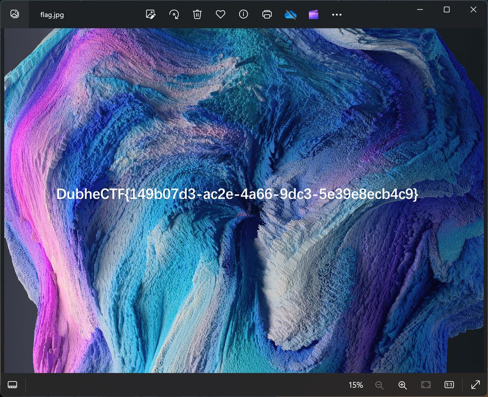

贴一个破解版软件的下载链接：https://www.anxz.com/down/69148.html

## 题目名称 authenticated mess & unauthenticated less
从这道题来浅浅学一下 VMessAEAD 的加密方式

题目给了一个 pcapng 的流量包文件，一开始以为是和 2022强网杯-谍影重重一样的 VMessMD5 加密的流量分析，需要爆破时间戳

赛后看了题解才发现不是，这道题是 VMessAEAD 的加密方式（也是现在版本的 v2ray-core 强制的加密方式）

用wireshark翻流量可以得到一个 v2ray 的 json 配置文件，也是从这里确定了是VMess流量分析

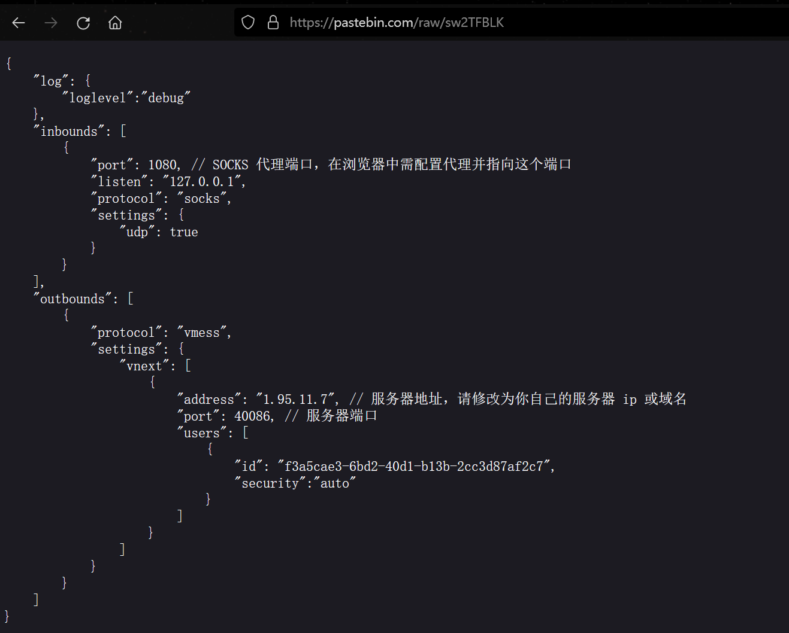

赛后看了出题人的题解后，发现出题人已经写了一个专门用来解析 VMessAEAD 的 Python 库

Python 库的开源地址：https://github.com/mnixry/vmess-aead-python

这里就直接用出题人写好的库进行解析了

Tips：调用这个库需要使用 Python3.10 以上的版本

```python
import uuid

from vmess_aead.encoding import VMessBodyEncoder
from vmess_aead.headers.request import VMessAEADRequestPacketHeader
from vmess_aead.utils.reader import BytesReader

data = "a49502ee07ffdd20f11597e961f7768b41be7bc32030107fc81f235f72ff1b294d074ade94281242412b4c19123b15250ac3d5ad9524df9acd0ee5f6dcca7b0c2849b2f4df20190dd084c01c3f6e2834dd87cb8e97fa178b2ec454755f89d9b735ae6dab9c7989cf4154f7eae53774d9d6cdb55d0a76fdaf21e08bae26e49cbb3c56d11a3fe540454bfbae06305460301caca4109df3335b0c3646b6e2d856a927f9298b87da3a7cf3cffcca6c27259fc055faa9f3155cc95f698bb37436008783b6cd03d38a8e109f78a48c860b600fcbe825cd6c6a5be2c95fce121df574c70fe62e4f24e28de5983db6c3c0192d72ec785b6d58c4b8301c4f70eab683"
data = bytes.fromhex(data)

reader = BytesReader(data)
user_id = uuid.UUID("f3a5cae3-6bd2-40d1-b13b-2cc3d87af2c7")


header = VMessAEADRequestPacketHeader.from_packet(reader, user_id)
print(header)

encoder = VMessBodyEncoder(
    header.payload.body_key,
    header.payload.body_iv,
    header.payload.options,
    header.payload.security,
    header.payload.command,
)
body = encoder.decode_once(reader)
print(body)
```

解析了流量中的数据后可以得到一个图片的地址：

https://p.sda1.dev/16/11c111ee40a928d5d751dd5869414093/__p0.png

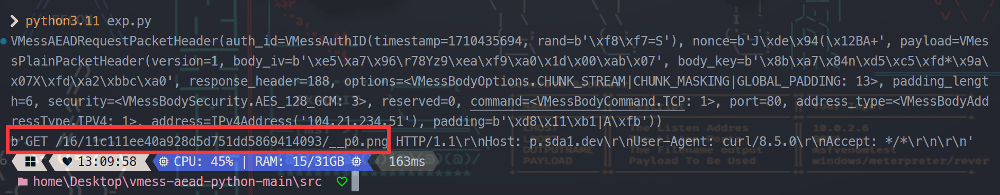

用 zsteg 一扫发现图片末尾有一个压缩包，用 foremost 提取出来后发现需要密码


这里可以去 saucenao 搜这个图片得到密码 116921220

Tips：这个纯数字密码因为是9位，所以用弱密码爆破的可行性不高，需要爆破好久

之前某个比赛也遇到过这种，解密的密钥需要去 pixiv 上获取【可恶的二次元】

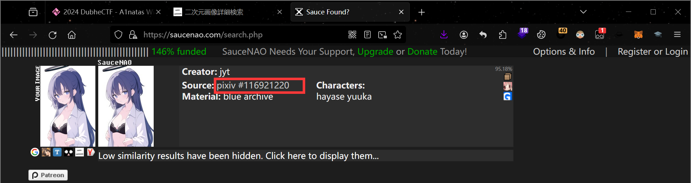

解压压缩包后得到一个项目的源码

后面的考点就主要是 Web 方向的了—— EdTunnel，Wrangler 和 SSRF

先查看 docker-compose.yml 发现存在一个 edtunnel 服务

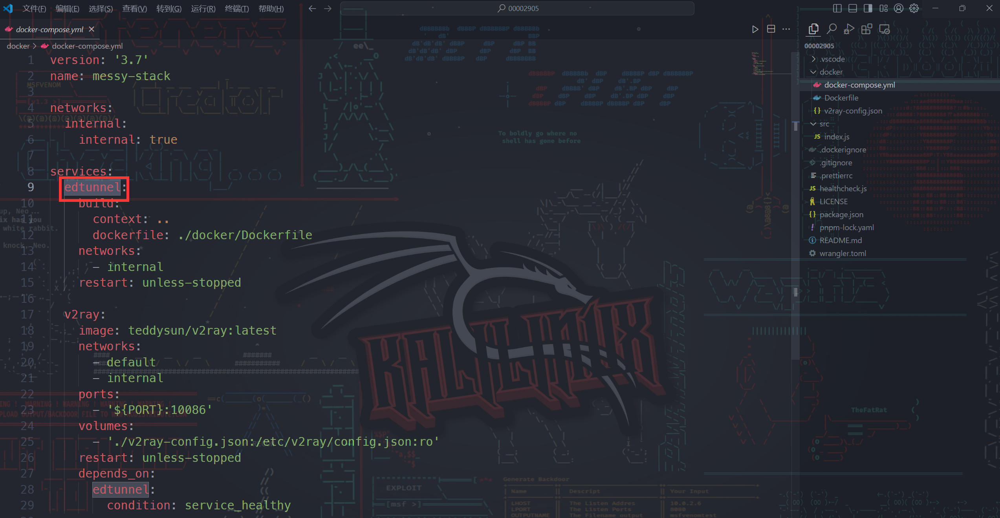

这个服务的相关内容来自：https://github.com/3Kmfi6HP/EDtunnel

出题人只对 UUID 和默认路由进行了更改

edtunnel 是一个开源的轻量级反向隧道工具，用于穿越防火墙和网络限制，建立安全的网络连接。

它提供了一种简单的方式，允许用户在两个网络之间建立加密的隧道连接。

赛后看了参考的wp知道了 EdTunnel 是通过 Wrangler 本地的开发模式部署的

然后 Wrangler 有一个 SSRF 的漏洞 CVE-2023-7080

后续就是用 v2ray 使用 exp-config.json 将端口暴露到本地

然后用浏览器连接到这个端口，在 内存快照 中可以打出堆快照，flag就藏在这里

**参考链接：**
- https://github.com/mix-archive/MessyStack?tab=readme-ov-file

---

> 作者: [Lunatic](https://goodlunatic.github.io)  
> URL: https://goodlunatic.github.io/posts/10f4f96/  

