# 2024 DubheCTF-Cipher 赛题详解

**从这道题入手，由浅入深学习一下Windows自带的 Cipher 加密（EFS加密算法）**

&lt;!--more--&gt;

**用磁盘精灵打开vhd文件，在public目录下看到一个加密的flag.jpg**

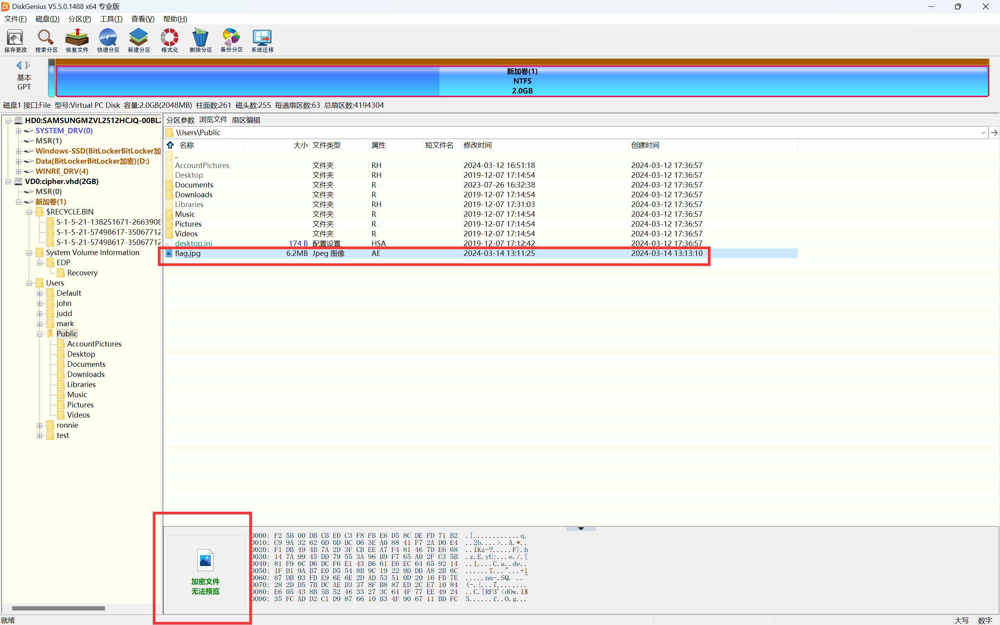

**直接装载到本地，可以发现还是加密的，根据题目名字 cipher 得知应该是用windows自带的 cipher 加密了**

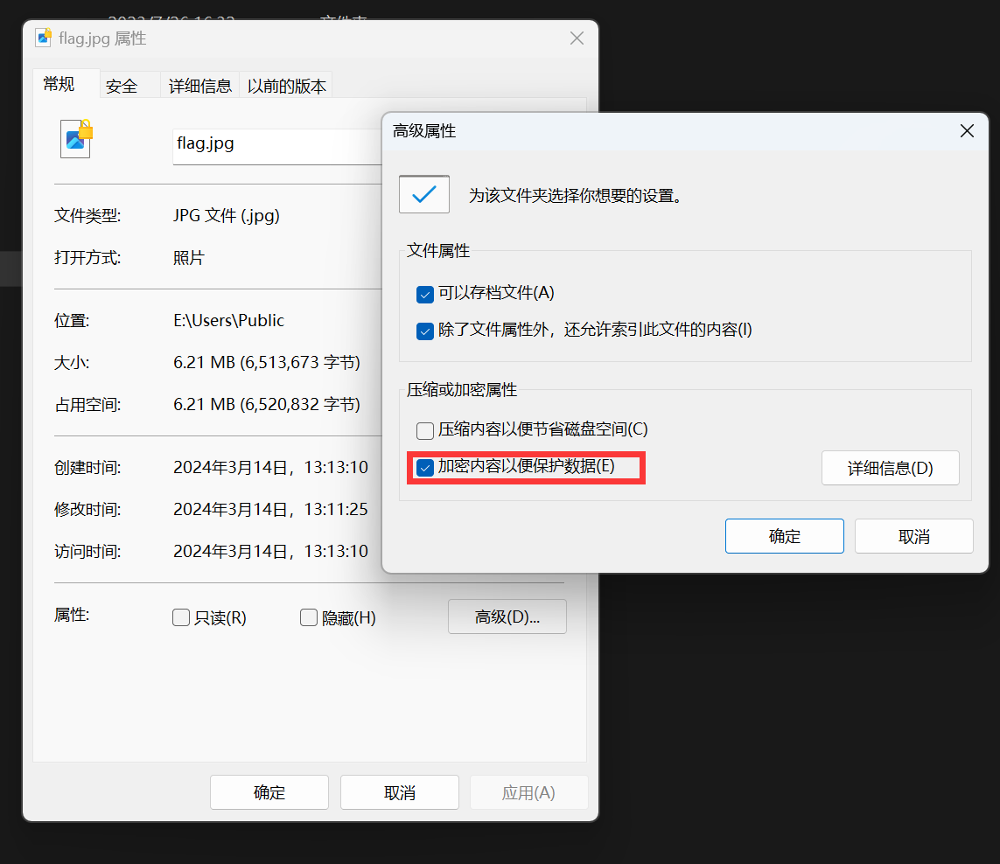

**赛后根据参考链接：**

[https://support.microsoft.com/zh-cn/topic/cipher-exe-%E5%AE%89%E5%85%A8%E5%B7%A5%E5%85%B7-%E7%94%A8%E4%BA%8E%E5%8A%A0%E5%AF%86%E6%96%87%E4%BB%B6%E7%B3%BB%E7%BB%9F-56c85edd-85cf-ac07-f2f7-ca2d35dab7e4](https://support.microsoft.com/zh-cn/topic/cipher-exe-安全工具-用于加密文件系统-56c85edd-85cf-ac07-f2f7-ca2d35dab7e4)

**得知cipher用的是EFS加密**

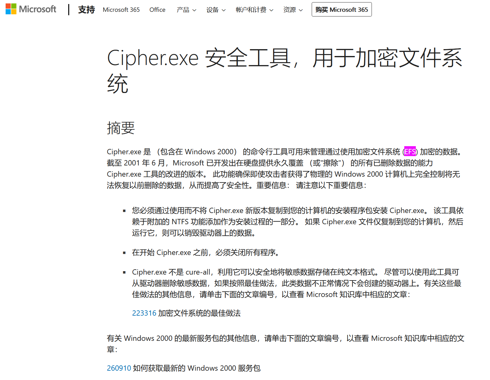

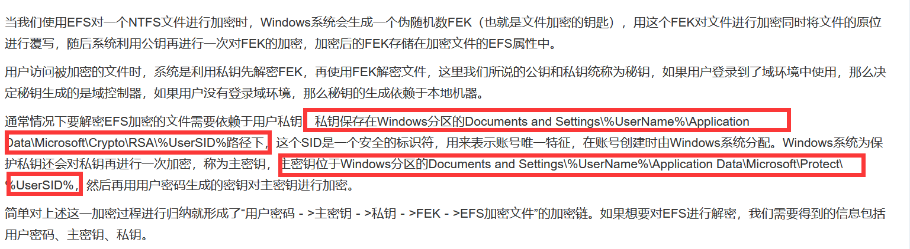

**根据参考链接：**

https://cloud.tencent.com/developer/article/1549305

我们现在很容易可以知道，题目的考点就是要我们找私钥和主密钥了

从详细信息中可以知道该文件的所有者是mark，所以之后的步骤就需要把目光聚焦到用户mark的目录下了

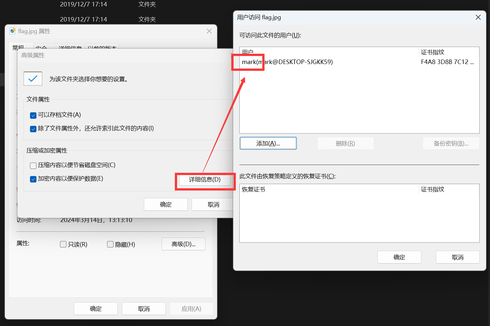

**对照着参考链接：**
https://blog.csdn.net/shuaicenglou3032/article/details/131184510

**在 E:\Users\mark\AppData\Roaming\Microsoft 路径下成功找到这两个密钥**

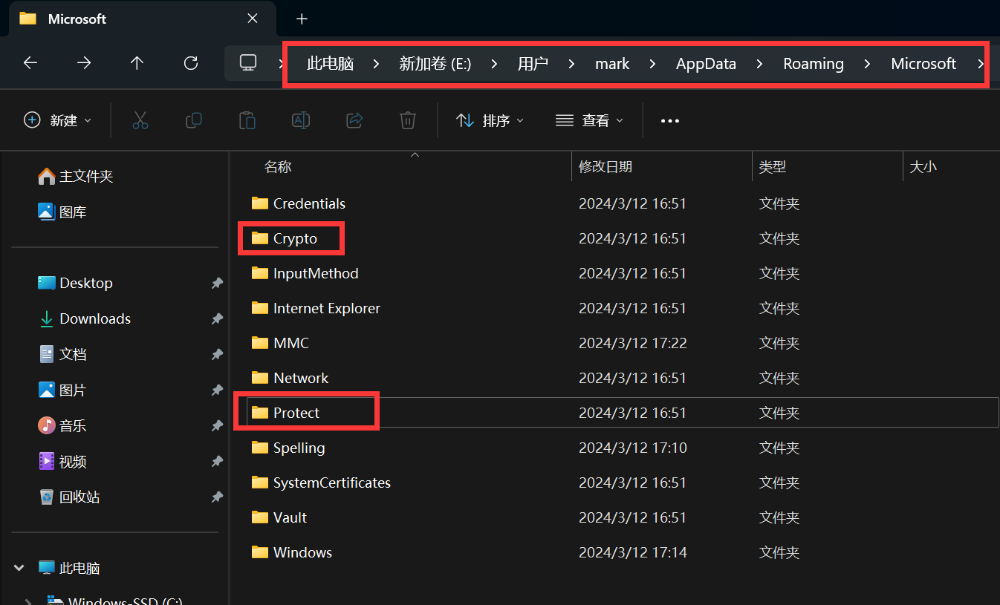

**赛后看了别的师傅的writeup，知道了用户的powershell历史记录会在这个路径下**

**\Users\test\AppData\Roaming\Microsoft\Windows\PowerShell\PSReadLine\ConsoleHost_history.txt**

**在test用户的目录中找到了各个用户的密码，知道mark用户的密码是superman**

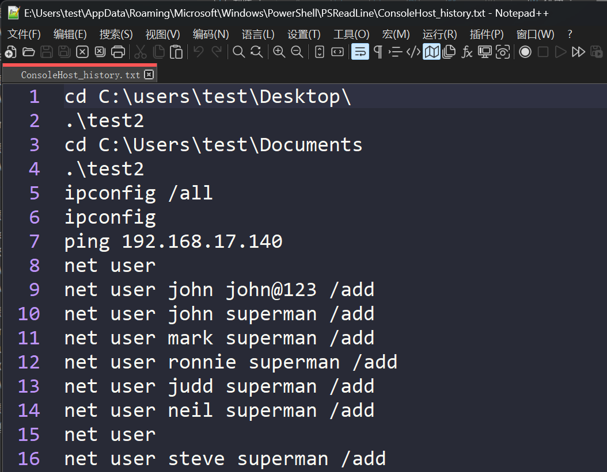

**如果有 Advanced efs data recovery 这个工具的破解版的话，这道题到这里就结束了**

**直接用这个工具扫描磁盘获取两个密钥和加密文件，然后输入mark用户的密码 superman 即可解密得到flag**

**这里贴一张山海关的大佬成功解密的图片**

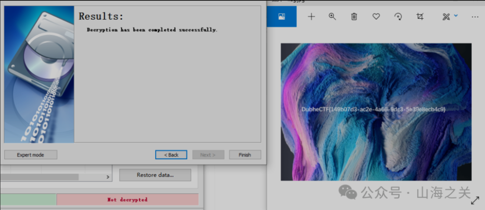

**然而因为这个软件我全网都没有找到能用的破解版，官网的试用版只能解密部分内容**

**因此接下来我要深入分析一下手搓解密EFS的方法**
**参考链接如下(只能说Lilac的Misc手太强了。。。)：**

https://lilachit.notion.site/Lilac-2024DubheCTF-wp-caa603fa40ba4699982a13ddf062906a#1b970b22b5e04cb98a5e02cb2f688a4a

**首先，假设我们之前不知道test用户的powershell历史记录中有各个用户的密码**
**因此这里我们就需要先用 DPAPImk2john.py&#43;John the Ripper 去爆破出mark用户的密码**

DPAPI是Windows操作系统中的一种加密功能，用于保护用户敏感数据，例如用户的登录密码、浏览器保存的密码等。DPAPImk2john.py脚本可以提取这些被DPAPI加密的凭据，并将其转换为John the Ripper密码破解工具所支持的格式，以便进行密码破解或分析操作。

**先用DPAPImk2john.py脚本获取DPAPI的Hash值**

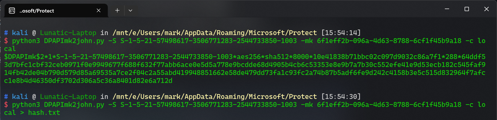

**然后将hash.txt拉到 kali 或者直接在 Windows 中用 john 根据 rockyou.txt 字典进行爆破**

**爆破完即可得到密码是 superman**

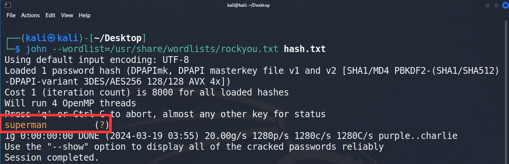

**得到 mark 的密码后，就可以使用 Mimikatz 爆破 Masterkeys 了**

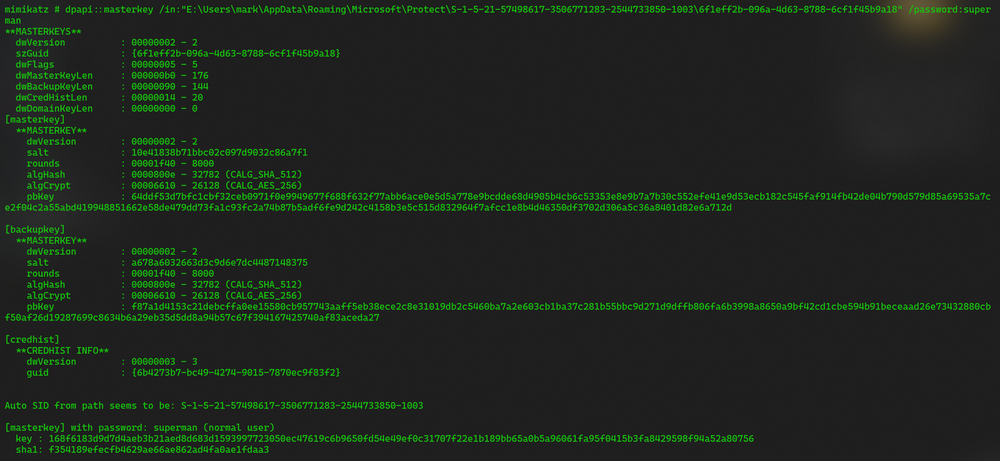

\[masterkey\] with password: superman (normal user)

  key : 168f6183d9d7d4aeb3b21aed8d683d1593997723050ec47619c6b9650fd54e49ef0c31707f22e1b189bb65a0b5a96061fa95f0415b3fa8429598f94a52a80756

  sha1: f354189efecfb4629ae66ae862ad4fa0ae1fdaa3

**本人目前水平有限，这里就先贴一份Lilac大佬写的脚本吧，脚本解密完即可得到flag**

```python
from cryptography.hazmat.primitives import serialization
from cryptography.hazmat.primitives.asymmetric import padding
from cryptography.hazmat.primitives.ciphers import Cipher, algorithms, modes

with open(&#39;private.pem&#39;, &#39;rb&#39;) as key_file:
    private_key = serialization.load_pem_private_key(key_file.read(), password=None)
with open(&#39;$EFS&#39;, &#39;rb&#39;) as EFS_file:
    efs = EFS_file.read()

&#39;&#39;&#39;
typedef struct
{
	DWORD		AttributeLength;
	DWORD		State;
	DWORD		Version;
	DWORD		CryptoAPIVersion;
	BYTE		Checksum[16];
	BYTE		ChecksumDDF[16];
	BYTE		ChecksumDRF[16];
	DWORD		OffsetToDDF;
	DWORD		OffsetToDRF;
} MFT_RECORD_ATTRIBUTE_EFS_HEADER, * PMFT_RECORD_ATTRIBUTE_EFS_HEADER;
&#39;&#39;&#39;
OffsetToDDF = int.from_bytes(efs[0x40:0x44], byteorder=&#39;little&#39;)
print(f&#39;OffsetToDDF: {hex(OffsetToDDF)}&#39;)

&#39;&#39;&#39;
typedef struct {
	DWORD		Count;
} MFT_RECORD_ATTRIBUTE_EFS_ARRAY_HEADER, * PMFT_RECORD_ATTRIBUTE_EFS_ARRAY_HEADER;
&#39;&#39;&#39;

Count = int.from_bytes(efs[OffsetToDDF:OffsetToDDF&#43;4], byteorder=&#39;little&#39;)
print(f&#39;Count: {Count}&#39;)
assert Count == 1, &#39;Count != 1 unsupported for now&#39;

&#39;&#39;&#39;
typedef struct {
	DWORD		Length;
	DWORD		CredentialHeaderOffset;
	DWORD		FEKSize;
	DWORD		FEKOffset;
} MFT_RECORD_ATTRIBUTE_EFS_DATA_DECRYPTION_ENTRY_HEADER, * PMFT_RECORD_ATTRIBUTE_EFS_DATA_DECRYPTION_ENTRY_HEADER;
&#39;&#39;&#39;
entry_header = efs[OffsetToDDF&#43;4:OffsetToDDF&#43;4&#43;16]
Length = int.from_bytes(entry_header[0:4], byteorder=&#39;little&#39;)
print(f&#39;Length: {hex(Length)}&#39;)
CredentialHeaderOffset = int.from_bytes(entry_header[4:8], byteorder=&#39;little&#39;)
print(f&#39;CredentialHeaderOffset: {hex(CredentialHeaderOffset)}&#39;)
FEKSize = int.from_bytes(entry_header[8:12], byteorder=&#39;little&#39;)
print(f&#39;FEKSize: {FEKSize}&#39;)
FEKOffset = int.from_bytes(entry_header[12:16], byteorder=&#39;little&#39;) &#43; OffsetToDDF &#43; 4
print(f&#39;FEKOffset: {hex(FEKOffset)}&#39;)

encrypted_fek = efs[FEKOffset:FEKOffset&#43;FEKSize][::-1]
decrypted_fek = private_key.decrypt(encrypted_fek, padding=padding.PKCS1v15())
&#39;&#39;&#39;
typedef struct {
	DWORD	KeyLength;
	DWORD	Entropy;
	ALG_ID	Algorithm;
	DWORD	Reserved;
	BYTE	Key[1];
} EFS_FEK, * PEFS_FEK;
&#39;&#39;&#39;
KeyLength = int.from_bytes(decrypted_fek[0:4], byteorder=&#39;little&#39;)
print(f&#39;KeyLength: {KeyLength}&#39;)
Algorithm = int.from_bytes(decrypted_fek[8:12], byteorder=&#39;little&#39;)
print(f&#39;Algorithm: {hex(Algorithm)}&#39;)
key = decrypted_fek[16:16&#43;KeyLength]
assert 16 &#43; KeyLength == len(decrypted_fek)

def decrypt_block(data_block, fek_key, index, cluster_size):
    iv = bytearray(b&#39;\0&#39; * 16)
    offset = index * cluster_size
    iv[0:8] = (int.from_bytes(iv[0:8], byteorder=&#39;big&#39;) &#43; offset).to_bytes(8, byteorder=&#39;big&#39;)
    iv[8:16] = (int.from_bytes(iv[8:16], byteorder=&#39;big&#39;) &#43; offset).to_bytes(8, byteorder=&#39;big&#39;)
    cipher = Cipher(algorithms.AES(fek_key), modes.CBC(bytes(iv)))
    decryptor = cipher.decryptor()
    return decryptor.update(data_block) &#43; decryptor.finalize()

def decrypt_file(input_file_path, output_file_path, fek_key, cluster_size=4096):
    with open(input_file_path, &#39;rb&#39;) as input_file, open(output_file_path, &#39;wb&#39;) as output_file:
        index_block = 0
        while True:
            data_block = input_file.read(cluster_size)
            if not data_block:
                break
            decrypted_data = decrypt_block(data_block, fek_key, index_block, cluster_size)
            output_file.write(decrypted_data)
            index_block &#43;= 1

decrypt_file(&#39;flag.jpg.enc&#39;, &#39;flag.jpg&#39;, key)
```

**终于找到能用的盗版软件了！附上最后成功得到 flag 的截图**

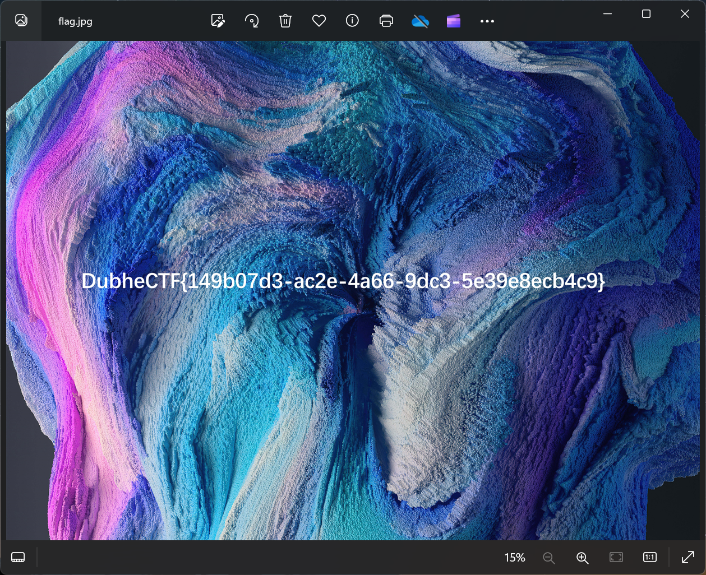

贴一个破解版软件的下载链接：https://www.anxz.com/down/69148.html


---

> Author: [Lunatic](https://goodlunatic.github.io)  
> URL: http://localhost:1313/posts/10f4f96/  

