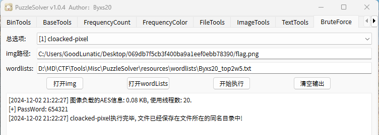

# 2024 古剑山全国大学生网络攻防大赛 Misc Writeup

**2024 古剑山全国大学生网络攻防大赛 Misc Writeup**
<!--more-->


> 本文中涉及的具体题目附件可以进我的[知识星球](https://t.zsxq.com/an6p6)获取

## 题目名称 CS

题目附件就给了以下内容：

> 截获了一段密文字符串jhjnjcjikmkfjjjkkejkkekdjgjcjnjhjnjcjiko,明文就在其中，请你把它找出来？

仔细观察上面的密文，可以看到有很多的j和k，然后j和k后面都跟了一个字符，因此我们可以把上述字符串分成以下两部分

```python
str1 = "jjjjkkjjkjkkjjjjjjjk"
str2 = "hncimfjkekedgcnhncio"
```

然后就是有点脑洞，就是根据把j和k后面的字符ASCII分别-2和+14

j后面的字符直接-2是可以肉眼观察出来的，但是k后面的字符+14可以通过爆破

```python
str1 = "jjjjkkjjkjkkjjjjjjjk"
str2 = "hncimfjkekedgcnhncio"

res = []

for key in range(-100,100):
    flag = ""
    for i in range(len(str1)):
        if str1[i] == "j":
            flag += chr(ord(str2[i]) - 2) 
        else:
            flag += chr(ord(str2[i]) + key)
    print(f"flag:{flag.encode()}  key:{key}")
    # flag:b'flag{thisisrealflag}'  key:14
```

然后就可以得到最后的flag：`flag{thisisrealflag}`

## 题目名称 蓝书包

解压附件压缩包，得到128个压缩包，然后每个压缩包里只有一个文件


尝试使用工具弱密码爆破压缩包，发现第一个压缩包的密码是`10001`，第二个是`10002`，以此类推


解压第一个压缩包发现有PNG的文件头，因此猜测把所有压缩包中的数据连起来是一张PNG图片

编写以下脚本提取一下数据然后保存为图片

```python
import zipfile
import os

def decompress_zip(archive_file,passwd):
    if not os.path.exists("tmp"):
        os.mkdir("tmp")
    with zipfile.ZipFile(archive_file, 'r') as zip_ref:
        zip_ref.extractall(path="tmp/", pwd=passwd.encode())
        print(f"{archive_file}用{passwd}成功解压缩 ===>")
    
def extract_data():
    files = os.listdir("./tmp")
    # print(files)
    for file in files:
        filepath = "./tmp/"+file
        with open(filepath,'rb') as f:
            data = f.read()
    os.system("rm tmp/*")
    return data

if __name__ == "__main__":
    png_data = b''
    for i in range(1,183):
        filename = f"{i}.zip"
        passwd = str(10000+i)
        decompress_zip(filename,passwd)
        png_data += extract_data()
        
    # print(png_data)
    with open("flag.png","wb") as f:
        f.write(png_data)
```

运行以上脚本后可以得到下面这张图片


最后使用B神的PuzzleSolver爆破cloacked-pixel即可得到flag：`flag{8719e663c0507cecbff2db103a7f7cd7}`



## 题目名称 jpg
感觉这道题的整体出题思路参考自：2023 铁三决赛-baby-jpg

解压附件压缩包，可以得到一张att.jpg图片，010打开发现末尾藏了一个压缩包

用010手动把压缩包提取出来，压缩包中有以下几个文件


尝试去除压缩包的伪加密，发现只有flag.pdf是伪加密

然后结合flag.txt的store压缩方法，猜测需要明文攻击

用exiftool查看一下flag.pdf的元数据，发现有WPS和PS相关字样


尝试使用WPS打开这个PDF，没有发现有用的信息，但是当我们用PS打开这个PDF

发现有好几个图层，然后其中一个图层有一张二维码


直接扫码可能会扫不出来，我们可以导出为PNG，然后颜色反转一下再扫码


扫码后可以得到如下内容

> 67f480eff11781617044bd47fb9535cfb0e4b6a09e51daff2107c536e9d4eebb3d517cfea6e3f176d4e0d37a9f3658845f3d1917cfce30a4f44ffa2e0af58485

把以上内容保存到sha512.txt中

经过尝试，发现用7z的标准压缩方法，把文件压缩为sha512.zip后可以正常进行明文攻击


最后使用密码123解压压缩包即可得到flag：`flag{10e23151aa0da35221a81dff81a53b4e}`

## 题目名称 one

题目附件给了一个`cnc.txt`，内容是10000行每行114个字符的十六进制数据

部分内容如下：

```
dd1bbd60cff3095f188b70af36a4ea2644f5241a425469a3b2b7c92fabd639ad55dfc8dd4393e4c572af31dbc4dab5173cc0bcb768331fb51d
a3f4057ce7fee14d7a79a28f9b51fb0e64063e41e09a0102b9024ed8da62c79a7e02155b23e9f2f66d8962260a04a6a92a4336aca932cc7431
be509b0be9e225cf2d639bbfb6e9595eb8111deb74b2b236265359a0bf5f2cdae1825a9072ce751f9fa40ea1bef650b5137506282ee02674c7
e8041edfc9dd08a5e74e4c4abe8c9dbca089572974798180fd5c11a15dad2a10968803c191592084600ce534cd9361194010759e97d30dfa15
9ab9a7966725e87fe0c92b4fdc95e7ae833aa180db6f295340cbcf294c7d08834e91dfdfafa98c7cc03404dbdf502bdc2e7e4c046ebd62fb23
c8725bb8060e13fead44e9a5ffb6f331383a717e9ec8498112a33ca8940a75947a8b191c68ac68e8459f7a6eb5737413a6484ff0b91004ec1a
cc385111badde9d78f2f5aee756eb34a09b86a4284a18902eee1bbbfadf1915bf8d19a03a7dc6b9bad117530dc505a76e6d5fc9f3897e89034
b318450ba8c7c8cd618ea3c4d396a2e99c3d99fe150218f2ff484003ed13e205ebe61b6108970ff530635f8fbc57e61e476618b3566de76ef2
95cda1e94b9d59843069fb8f2c4415404f31be077ebc1f83a61f08cd62d75e3d6379ca0b69e375372fd0f206d1009ebf397683c927da0ab63d
bc3cf1722bf8f617acc85ba7169649ecd70c7e9575c05ef04cde5bd8eb79120a756e1a7755acb17da63fe76286759b68f646178c8a01fac142
```

---

> 作者: [Lunatic](https://goodlunatic.github.io)  
> URL: https://goodlunatic.github.io/posts/1618f6c/  

