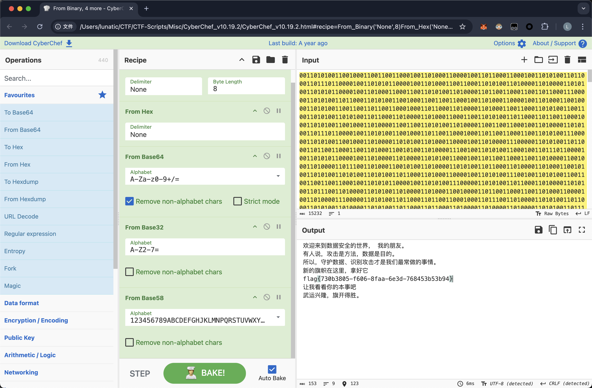
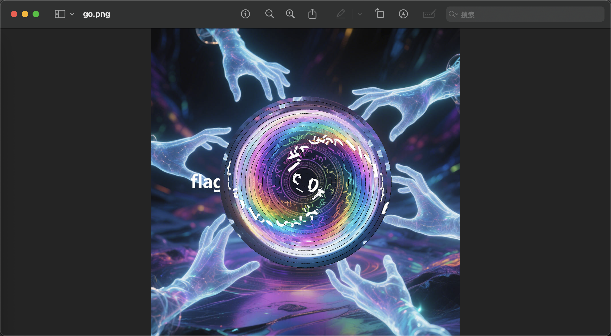
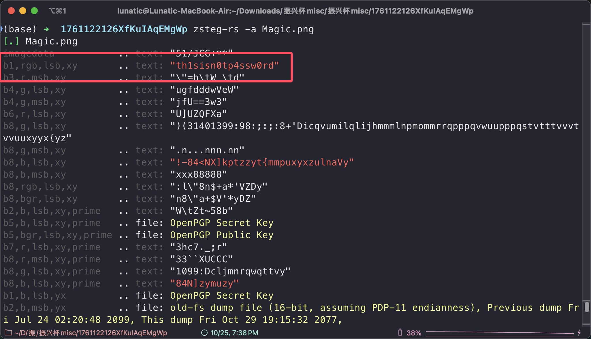
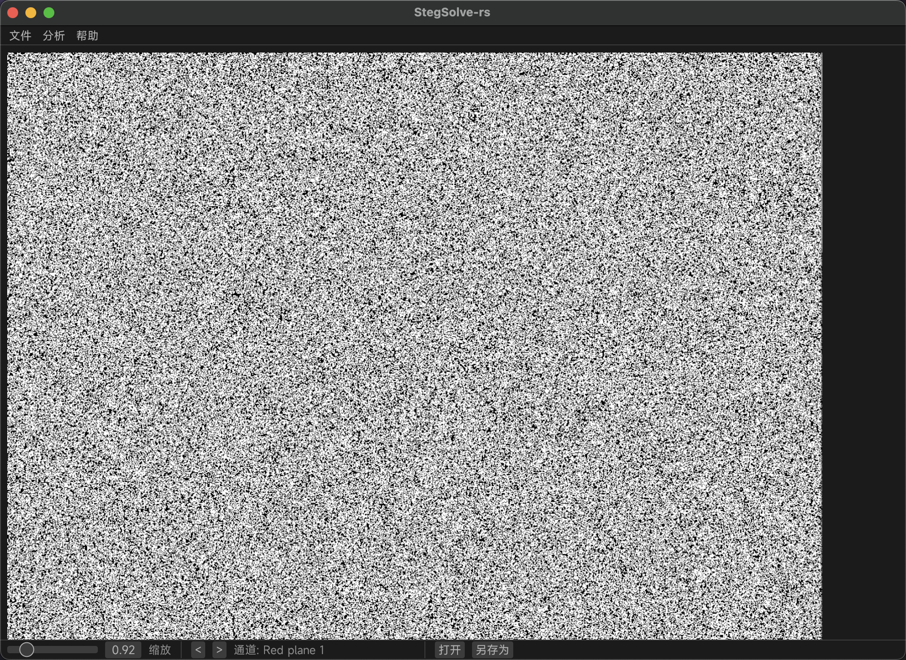
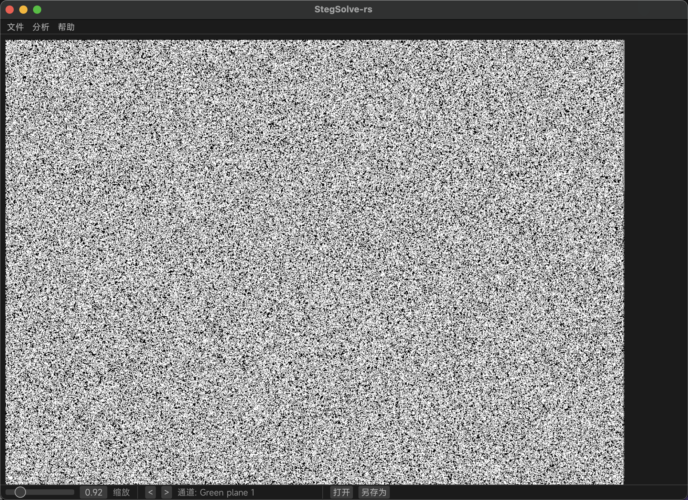
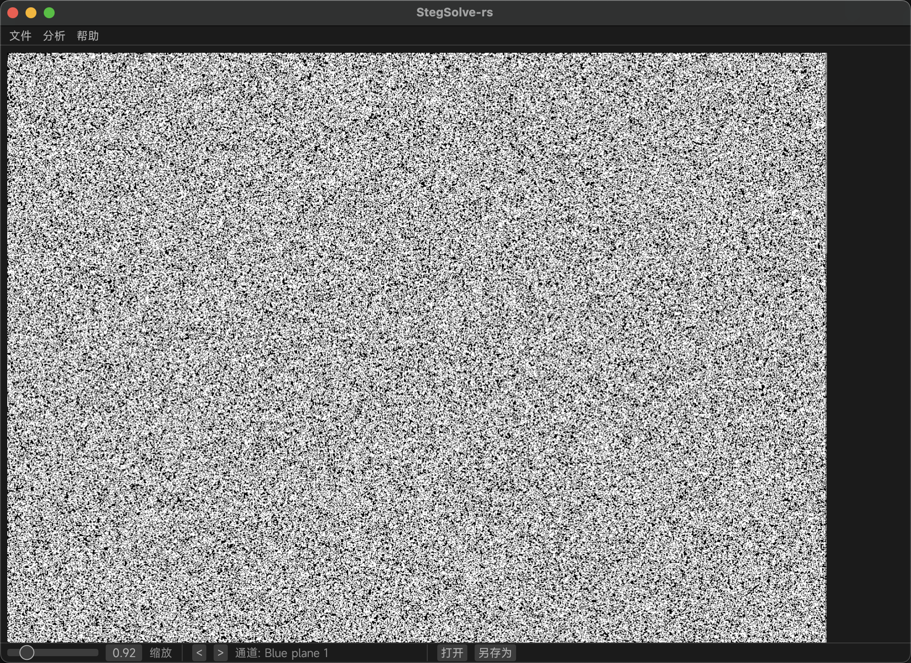
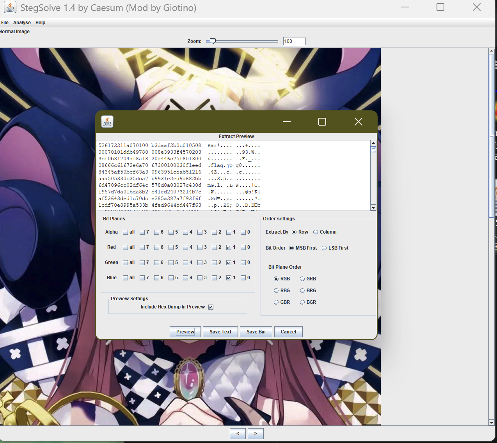
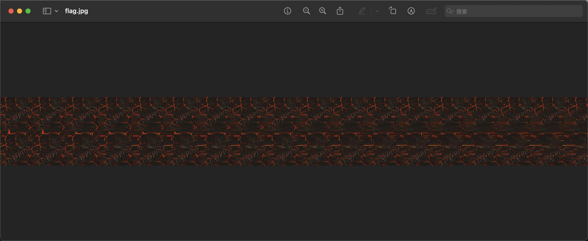
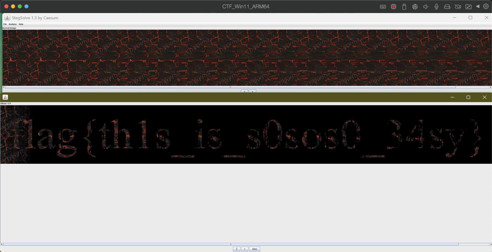

# 2025 振兴杯江西省网络安全大赛 Misc Writeup

**2025 振兴杯网络安全大赛 Misc Writeup**
<!--more-->

## 题目名称 checkin

附件给了一个 txt 文件，里面都是二进制字符串，CyberChef 一把梭了

`flag{730b3805-f606-8faa-6e3d-768453b53b94}`

## 题目名称 go

附件给了下面这张图片，发现 flag 若隐若现的就在图里，但是经过了某种变换

感觉是考察选手 PS 的功底，我 PS 水平一般，就只能一圈一圈的画圆然后手搓旋转的角度了

`flag{M@g1c_0f_Code}`

> 如果有 PS 大佬知道更快速的做法，也欢迎分享一下，每个同心圆的间距是一样的，因此猜测 PS 肯定有更便捷的做法

## 题目名称 Magic

附件给了下面这张 PNG 图片

zsteg 扫一下可以得到：`th1sisn0tp4ssw0rd`

stegsolve 中翻看了一下发现 RGB 的 Plane1 有明显的隐写痕迹

|  |    |    |
| :-----------------------------------: | :-------------------------------------------: | :-------------------------------------------: |

用 stegsolve 提取可以得到一个加密的 rar 压缩包，解压密码就是之前得到的：`th1sisn0tp4ssw0rd`

解压 rar 压缩包后可以得到下面这张 JPG 图片

本人以前也没遇到过这种，和别的师傅交流后知道了是`Stereogram(立体图)`

在 stegsolve 里用`Stereogram Solver(立体视图)`查看，发现偏移量为 171 时可以得到 flag

`flag{th1s_is_s0sos0_34sy}`

---

> 作者: <no value>  
> URL: https://goodlunatic.github.io/posts/16c4937/  

