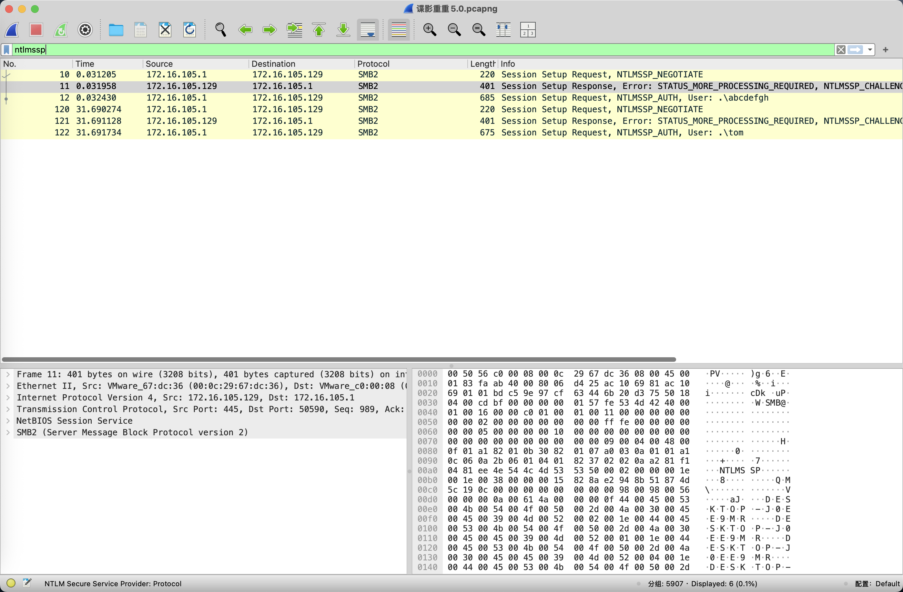
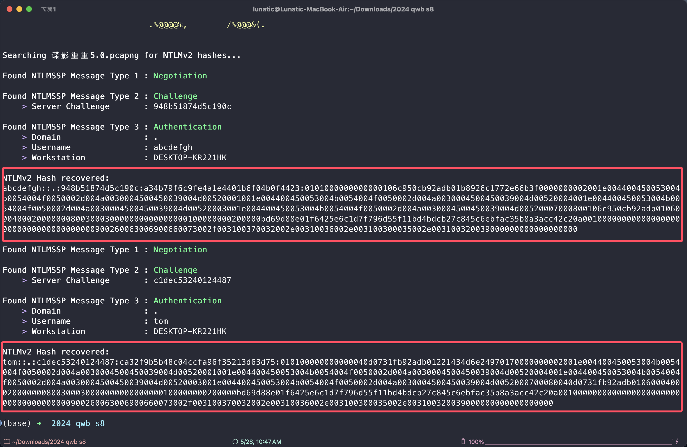
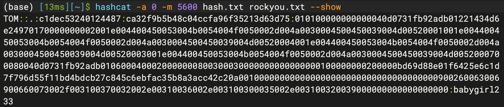
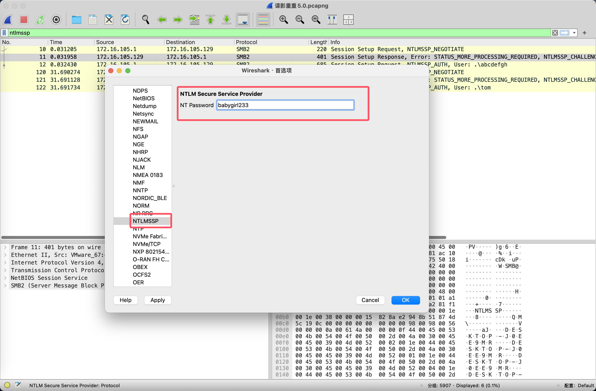
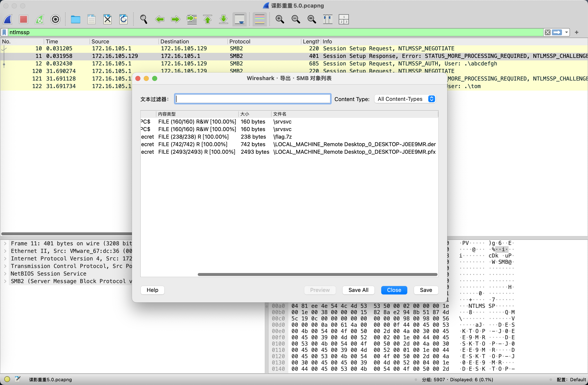

# 强网杯-谍影重重系列赛题详解

**一直觉得每年强网杯的谍影重重这个系列挺有意思的**

**因此就打算详细复盘一下历年谍影重重系列的赛题**

**这里手动艾特一下出题人@1cePeak，感谢冰峰师傅出的题**

<!--more-->


> 本文涉及的题目附件： https://pan.baidu.com/s/159nlGf_pcgCC-iePnLeqVg?pwd=uxsy 提取码: uxsy

## 2023 强网杯

### 碟影重重2.0

下载附件得到一个只有TCP流量的流量包

题目需要我们分析流量包找到飞机的飞机速度和飞机的 ICAO CODE

问了GPT得知飞机常见的协议中有ADS-B，然后在网上找到pyModeS这个模块

在 [参考链接](https://gitee.com/wangmin-gf/ads-b) 看到了与tcp.payload中相似的数据

使用 tshark 提取出流量包中的数据，然后使用这个脚本批量解密找speed最快的即可

tshark -r attach.pcapng -T fields -e "tcp.payload" | sed '/^\s*$/d' > tshark.txt

```python
import pyModeS
with open("tshark.txt") as f:
    data = f.readlines()
    for item in data:
        # print(item.strip())
        if len(item.strip()) != 46:
            continue
        res = pyModeS.tell(item.strip()[18:46])
        print("===========================================================================")
```

Tips：这里的 ICAO CODE 需要大写：79A05E

然后MD5加密一下即可得到：flag{4cf6729b9bc05686a79c1620b0b1967b}


## 2024 强网杯

### 谍影重重5.0

> 我国安全部门已经连续三年对间谍张纪星进行秘密监控，最近其网络流量突然出现大量的神秘数据，为防止其向境外传送我国机密数据，我们已将其流量保存，请你协助我们分析其传输的秘密信息。

> 参考文章：
> 
> https://www.cnblogs.com/WTT001/p/18550311
> 
> https://blog.csdn.net/2301_79200709/article/details/143518195
> 
> https://www.haxor.no/en/article/analyzing-captured-rdp-sessions
> 
> https://scofield.top/2024qwbs8_dycc5.0/
> 
> https://cn-sec.com/archives/3364589.html
> 

题目附件给了一个pcapng流量包文件，翻看一下发现有NTLMv2的流量

并且还是走的SMB2协议，因此猜测是认证后传了什么文件



直接拿这个[开源项目](https://github.com/mlgualtieri/NTLMRawUnHide/blob/master/NTLMRawUnHide.py)提取一下hash，然后尝试用hashcat爆破



经过尝试，发现第二个用户名是`Tom`的hash是可以爆破出来的



爆破得到密码：`babygirl233`，然后我们找到Wireshark首选项中的NTLMSSP

输入爆破得到的密码进行解密



加密后我们尝试导出SMB传输的文件



发现有一个压缩包，和两个证书文件


---

> 作者: [Lunatic](https://goodlunatic.github.io)  
> URL: https://goodlunatic.github.io/posts/1a152f0/  

