# 2024 网鼎杯网络安全大赛青龙组 Misc Writeup

**2024 网鼎杯网络安全大赛青龙组 Misc Writeup**
<!--more-->


> 本文中涉及的具体题目附件可以进我的交流群获取，进群详见 [About](https://goodlunatic.github.io/about/)

## 题目名称 Misc01

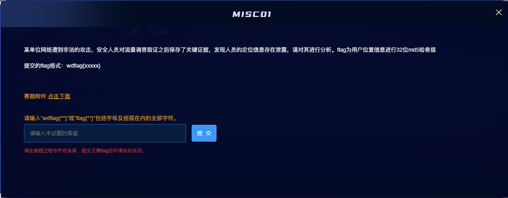

题目附件给了一个`MME.cap`流量包，wireshark打开查看

> 附件名字中的`MME（Mobility Management Entity）`表示`移动性管理实体`

发现流量包中的协议主要有：`DIAMETER`、`S1AP/NAS-EPS`、`GTPv2`、`S1AP`

问一问GPT，发现 `DIAMETER`、`GTPv2` 是比较可能的方向

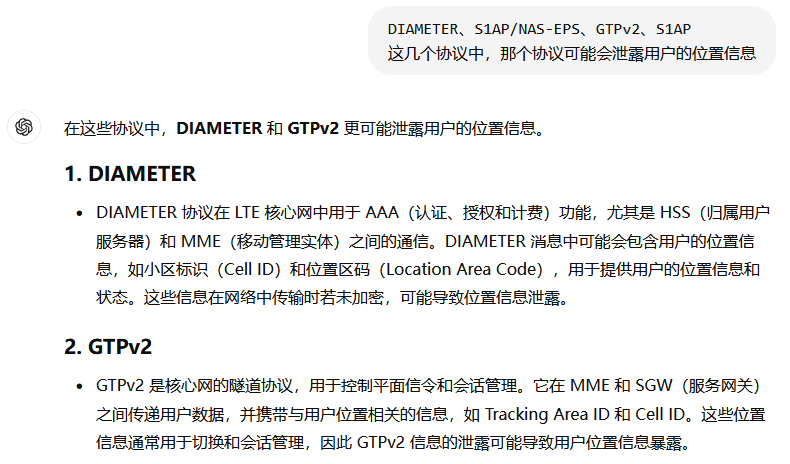

因此我们配合过滤器一个个查看流量包，最终在`DIAMETER`协议中发现关键信息`MME-Location-Information`


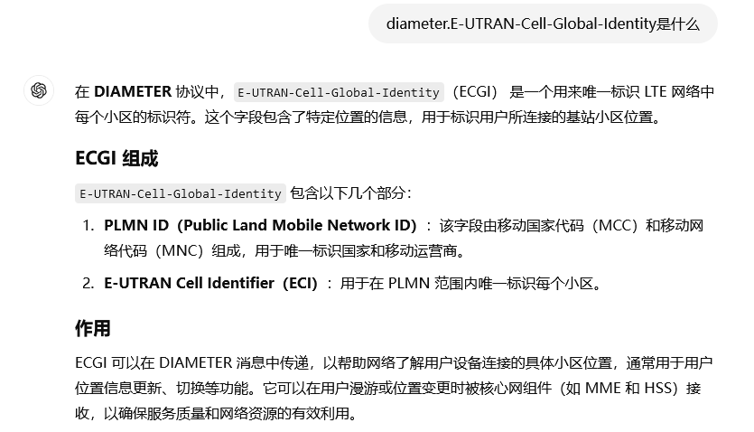

最后把该字段中的值`MD5`加密一下即可得到flag：`wdflag{1f717538aeec1322f446a754d0bcf220}`

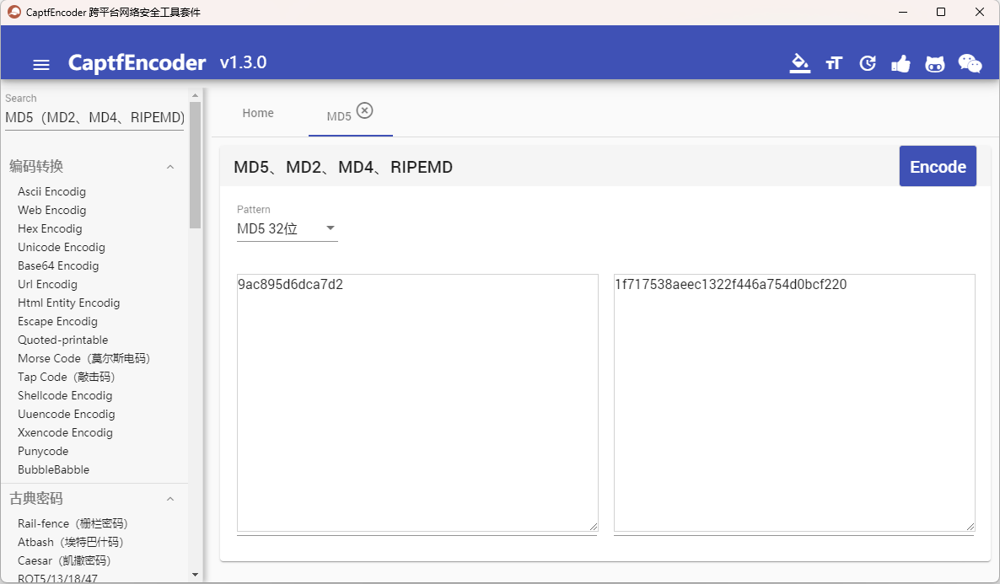

## 题目名称 Misc02(赛后复现)
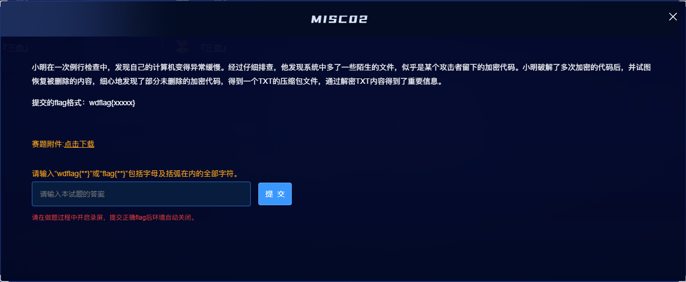


题目附件给了一个未知后缀的flag文件，strings 查看一下发现是Ubuntu22.04的内存镜像

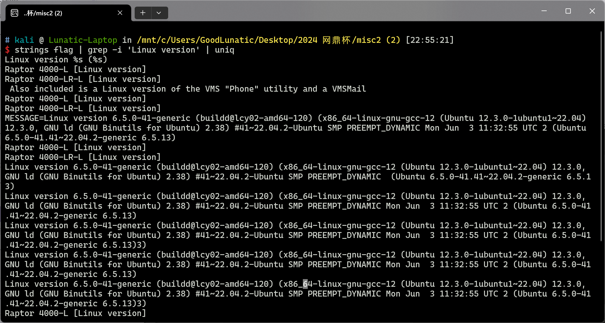

这里我先尝试了制作vol3的symbols，但是做完后发现也扫不出东西

如何制作vol3的符号文件可以参考[我的这篇博客](https://goodlunatic.github.io/posts/761da51/#%E5%88%B6%E4%BD%9C--symbolsvol3--%E7%9A%84%E8%AF%A6%E7%BB%86%E8%BF%87%E7%A8%8B)以及[这个项目](https://github.com/goodlunatic/Docker-SymbolsMaker-vol3)

我这里还是写了一个Dockerfile来制作符号文件

> 把 linux-image-unsigned-6.5.0-41-generic-dbgsym_6.5.0-41.41~22.04.2_amd64.ddeb 和 dwarf2json-linux-amd64 放 src 目录中即可
> 
> ddeb的下载链接：http://launchpadlibrarian.net/733303944/linux-image-unsigned-6.5.0-41-generic-dbgsym_6.5.0-41.41~22.04.2_amd64.ddeb

```Dockerfile
FROM ubuntu:22.04

# 将环境设置为非交互环境
ENV DEBIAN_FRONTEND=noninteractive

COPY ./src/ /src/

RUN sed -i 's/archive.ubuntu.com/mirrors.ustc.edu.cn/g' /etc/apt/sources.list \
    && sed -i 's/security.ubuntu.com/mirrors.ustc.edu.cn/g' /etc/apt/sources.list \
	&& apt update --no-install-recommends\
    && apt install -y openssh-server gcc-10 dwarfdump build-essential unzip kmod linux-base linux-image-6.5.0-41-generic\
    && mkdir /app \
    && sed -i 's/\#PermitRootLogin prohibit-password/PermitRootLogin yes/g' /etc/ssh/sshd_config \
    && sed -i 's/\#PasswordAuthentication yes/PasswordAuthentication yes/g' /etc/ssh/sshd_config \
    && echo 'root:root' | chpasswd \
    && systemctl enable ssh \
    && service ssh start

WORKDIR /src

# 这里的文件名需要根据系统版本进行修改
COPY ./src/linux-image-unsigned-6.5.0-41-generic-dbgsym_6.5.0-41.41~22.04.2_amd64.ddeb linux-image-unsigned-6.5.0-41-generic-dbgsym_6.5.0-41.41~22.04.2_amd64.ddeb

RUN dpkg -i linux-image-unsigned-6.5.0-41-generic-dbgsym_6.5.0-41.41~22.04.2_amd64.ddeb \
    && chmod +x dwarf2json-linux-amd64 \
    # 下面这里的文件名需要根据系统版本进行修改
    && ./dwarf2json-linux-amd64 linux --elf /usr/lib/debug/boot/vmlinux-6.5.0-41-generic > linux-image-6.5.0-41-generic.json
	

CMD ["/bin/bash"]

```

符号文件在Docker中制作好后直接SSH连上容器下载到本地

然后放到 volatility3/volatility3/framework/symbols/linux/ 目录下即可

```bash
docker build --tag symbols .
docker run -p 2022:22 -it symbols /bin/sh
service ssh start
```

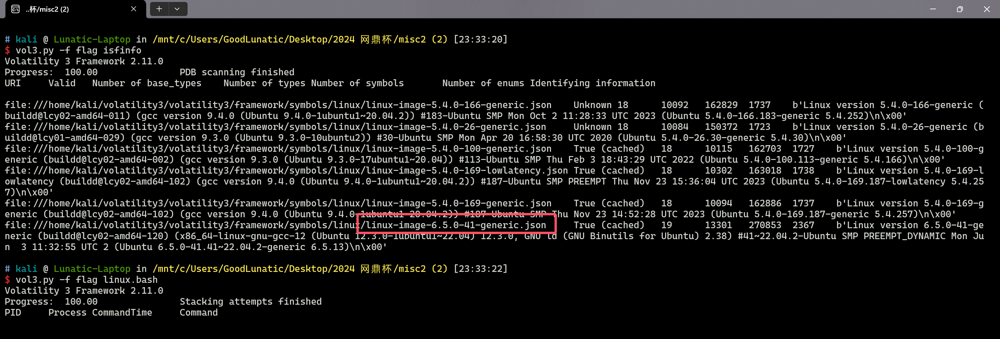

做完符号文件后发现也扫不出东西，因此这道题我这里就直接打算用010手动提取了

首先，我们先用`strings`看看用户桌面上有什么东西，当然这里也可以直接在`010`中搜字符串

```bash
strings flag | grep Desktop
```

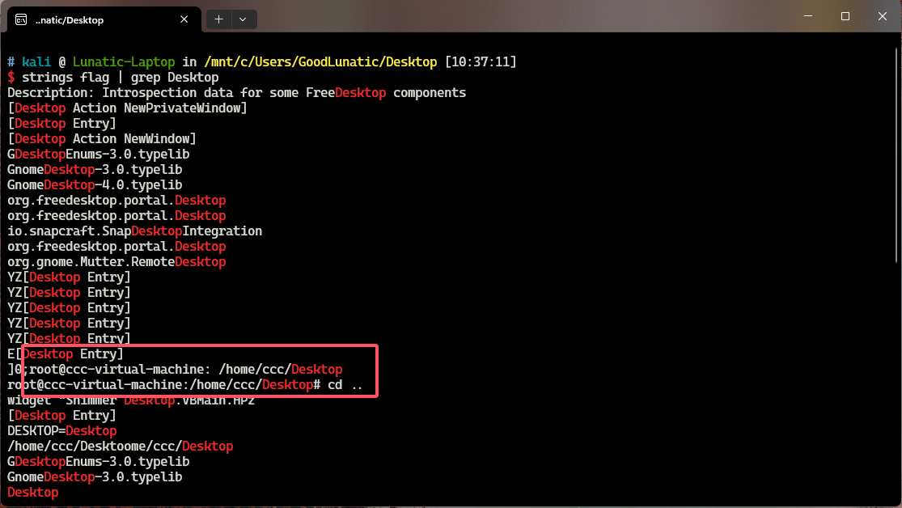

我们确定了用户名以及桌面的路径，便于我们缩小范围，过滤掉无效的干扰数据

```bash
strings flag | grep /home/ccc/Desktop/
```

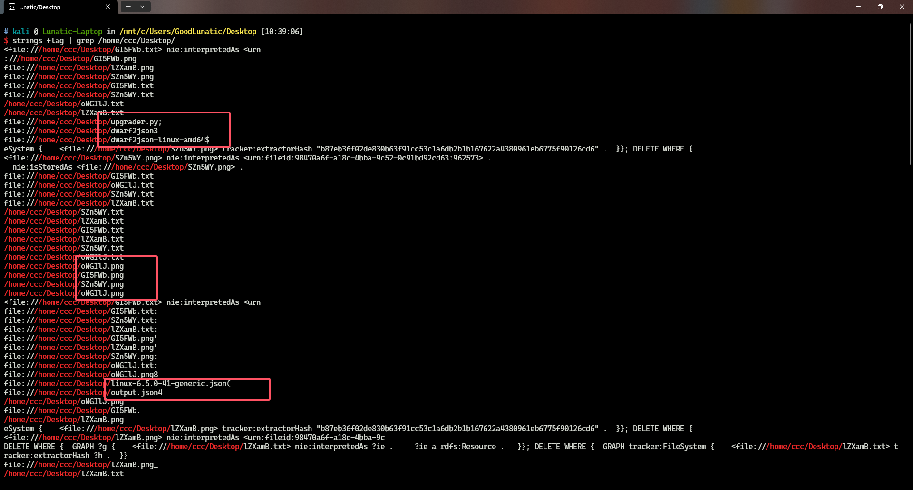

可以看到扫出来了很多非常关键的信息，桌面上有很多张PNG图片，然后还有同名的TXT文件

甚至还有内存镜像的vol3符号文件以及制作符号文件的工具（所以我猜测出题人是故意让我们没办法用vol3进行取证）

然后我们到`010`中搜索那几张图片的文件名

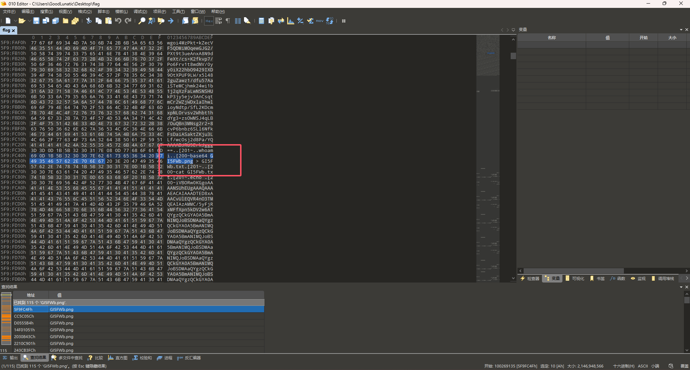

发现用了`base64 xxx.png > xxx.txt`这个命令，把图片数据以base64编码的格式保存到同名txt文件中

猜测另外几个文件也是同理，因此我们根据PNG的文件头base64编码后的值：`iVBORw0KGgo`

在010中可以定位到12个位置

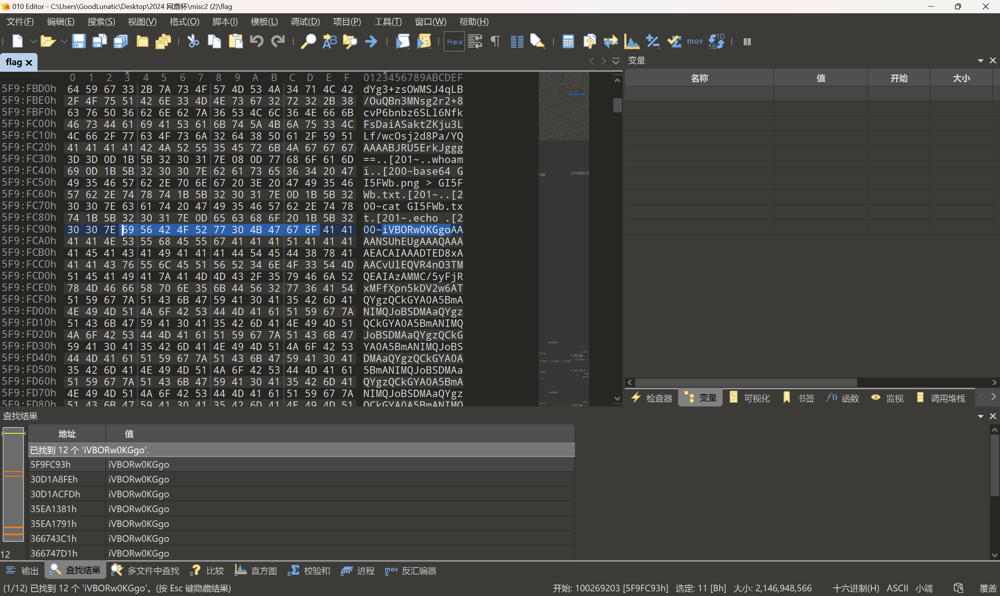

依次查看，发现里面有好多个位置表示的都是同一张图片

手动提取出Hex数据，注意这里建议提取Hex数据，直接提取右边的字符串可能会有问题（可能有不可打印字符）

```
69 56 42 4F 52 77 30 4B 47 67 6F 41 41 41 41 4E 53 55 68 45 55 67 41 41 41 51 41 41 41 41 45 41 43 41 49 41 41 41 44 54 45 44 38 78 41 41 41 43 76 55 6C 45 51 56 52 34 6E 4F 33 54 4D 51 45 41 49 41 7A 41 4D 4D 43 2F 35 79 46 6A 52 78 4D 46 66 58 70 6E 35 6B 44 56 32 77 36 41 54 51 59 67 7A 51 43 6B 47 59 41 30 41 35 42 6D 41 4E 49 4D 51 4A 6F 42 53 44 4D 41 61 51 59 67 7A 51 43 6B 47 59 41 30 41 35 42 6D 41 4E 49 4D 51 4A 6F 42 53 44 4D 41 61 51 59 67 7A 51 43 6B 47 59 41 30 41 35 42 6D 41 4E 49 4D 51 4A 6F 42 53 44 4D 41 61 51 59 67 7A 51 43 6B 47 59 41 30 41 35 42 6D 41 4E 49 4D 51 4A 6F 42 53 44 4D 41 61 51 59 67 7A 51 43 6B 47 59 41 30 41 35 42 6D 41 4E 49 4D 51 4A 6F 42 53 44 4D 41 61 51 59 67 7A 51 43 6B 47 59 41 30 41 35 42 6D 41 4E 49 4D 51 4A 6F 42 53 44 4D 41 61 51 59 67 7A 51 43 6B 47 59 41 30 41 35 42 6D 41 4E 49 4D 51 4A 6F 42 53 44 4D 41 61 51 59 67 7A 51 43 6B 47 59 41 30 41 35 42 6D 41 4E 49 4D 51 4A 6F 42 53 44 4D 41 61 51 59 67 7A 51 43 6B 47 59 41 30 41 35 42 6D 41 4E 49 4D 51 4A 6F 42 53 44 4D 41 61 51 59 67 7A 51 43 6B 47 59 41 30 41 35 42 6D 41 4E 49 4D 51 4A 6F 42 53 44 4D 41 61 51 59 67 7A 51 43 6B 47 59 41 30 41 35 42 6D 41 4E 49 4D 51 4A 6F 42 53 44 4D 41 61 51 59 67 7A 51 43 6B 47 59 41 30 41 35 42 6D 41 4E 49 4D 51 4A 6F 42 53 44 4D 41 61 51 59 67 7A 51 43 6B 47 59 41 30 41 35 42 6D 41 4E 49 4D 51 4A 6F 42 53 44 4D 41 61 51 59 67 7A 51 43 6B 47 59 41 30 41 35 42 6D 41 4E 49 4D 51 4A 6F 42 53 44 4D 41 61 51 59 67 7A 51 43 6B 47 59 41 30 41 35 42 6D 41 4E 49 4D 51 4A 6F 42 53 44 4D 41 61 51 59 67 7A 51 43 6B 47 59 41 30 41 35 42 6D 41 4E 49 4D 51 4A 6F 42 53 44 4D 41 61 51 59 67 7A 51 43 6B 47 59 41 30 41 35 42 6D 41 4E 49 4D 51 4A 6F 42 53 44 4D 41 61 51 59 67 7A 51 43 6B 47 59 41 30 41 35 42 6D 41 4E 49 4D 51 4A 6F 42 53 44 4D 41 61 51 59 67 7A 51 43 6B 47 59 41 30 41 35 42 6D 41 4E 49 4D 51 4A 6F 42 53 44 4D 41 61 51 59 67 7A 51 43 6B 47 59 41 30 41 35 42 6D 41 4E 49 4D 51 4A 6F 42 53 44 4D 41 61 51 59 67 7A 51 43 6B 47 59 41 30 41 35 42 6D 41 4E 49 4D 51 4A 6F 42 53 44 4D 41 61 51 59 67 7A 51 43 6B 47 59 41 30 41 35 42 6D 41 4E 49 4D 51 4A 6F 42 53 44 4D 41 61 51 59 67 7A 51 43 6B 47 59 41 30 41 35 42 6D 41 4E 49 4D 51 4A 6F 42 53 44 4D 41 61 51 59 67 7A 51 43 6B 47 59 41 30 41 35 42 6D 41 4E 49 4D 51 4A 6F 42 53 44 4D 41 61 51 59 67 7A 51 43 6B 47 59 41 30 41 35 42 6D 41 4E 49 4D 51 4A 6F 42 53 44 4D 41 61 51 59 67 7A 51 43 6B 47 59 41 30 41 35 42 6D 41 4E 49 4D 51 4A 6F 42 53 44 4D 41 61 51 59 67 7A 51 43 6B 47 59 41 30 41 35 42 6D 41 4E 49 4D 51 4A 6F 42 53 44 4D 41 61 51 59 67 7A 51 43 6B 47 59 41 30 41 35 42 6D 41 4E 49 4D 51 4A 6F 42 53 44 4D 41 61 51 59 67 7A 51 43 6B 47 59 41 30 41 35 42 6D 41 4E 49 4D 51 4A 6F 42 53 44 4D 41 61 51 59 67 7A 51 43 6B 47 59 41 30 41 35 42 6D 41 4E 49 4D 51 4A 6F 42 53 44 4D 41 61 51 59 67 7A 51 43 6B 47 59 41 30 41 35 42 6D 41 4E 49 4D 51 4A 6F 42 53 44 4D 41 61 51 59 67 7A 51 43 6B 47 59 41 30 41 35 42 6D 41 4E 49 4D 51 4E 6F 48 71 2B 67 45 2F 51 50 4E 4D 47 49 41 41 41 41 41 53 55 56 4F 52 4B 35 43 59 49 49 3D 
```

```
iVBORw0KGgoAAAANSUhEUgAAAQAAAAEACAIAAADTED8xAAACvUlEQVR4nO3TMQEAIAzAMMC/5yFjRxMFfXpn5kDV2w6ATQYgzQCkGYA0A5BmANIMQJoBSDMAaQYgzQCkGYA0A5BmANIMQJoBSDMAaQYgzQCkGYA0A5BmANIMQJoBSDMAaQYgzQCkGYA0A5BmANIMQJoBSDMAaQYgzQCkGYA0A5BmANIMQJoBSDMAaQYgzQCkGYA0A5BmANIMQJoBSDMAaQYgzQCkGYA0A5BmANIMQJoBSDMAaQYgzQCkGYA0A5BmANIMQJoBSDMAaQYgzQCkGYA0A5BmANIMQJoBSDMAaQYgzQCkGYA0A5BmANIMQJoBSDMAaQYgzQCkGYA0A5BmANIMQJoBSDMAaQYgzQCkGYA0A5BmANIMQJoBSDMAaQYgzQCkGYA0A5BmANIMQJoBSDMAaQYgzQCkGYA0A5BmANIMQJoBSDMAaQYgzQCkGYA0A5BmANIMQJoBSDMAaQYgzQCkGYA0A5BmANIMQJoBSDMAaQYgzQCkGYA0A5BmANIMQJoBSDMAaQYgzQCkGYA0A5BmANIMQJoBSDMAaQYgzQCkGYA0A5BmANIMQJoBSDMAaQYgzQCkGYA0A5BmANIMQJoBSDMAaQYgzQCkGYA0A5BmANIMQJoBSDMAaQYgzQCkGYA0A5BmANIMQJoBSDMAaQYgzQCkGYA0A5BmANIMQJoBSDMAaQYgzQCkGYA0A5BmANIMQJoBSDMAaQYgzQCkGYA0A5BmANIMQJoBSDMAaQYgzQCkGYA0A5BmANIMQJoBSDMAaQYgzQCkGYA0A5BmANIMQJoBSDMAaQYgzQCkGYA0A5BmANIMQJoBSDMAaQYgzQCkGYA0A5BmANIMQJoBSDMAaQYgzQCkGYA0A5BmANIMQJoBSDMAaQYgzQCkGYA0A5BmANIMQJoBSDMAaQYgzQCkGYA0A5BmANIMQNoHq+gE/QPNMGIAAAAASUVORK5CYII=
```

base64解码后可以得到下面这张空白图片，数据很短，也没什么用


然后我们在010中继续往下看，可以把与上面这个图片有重合部分的base64的数据都删掉方便查看

然后在下图这个位置发现了另一张图片，我尝试给它提取出来
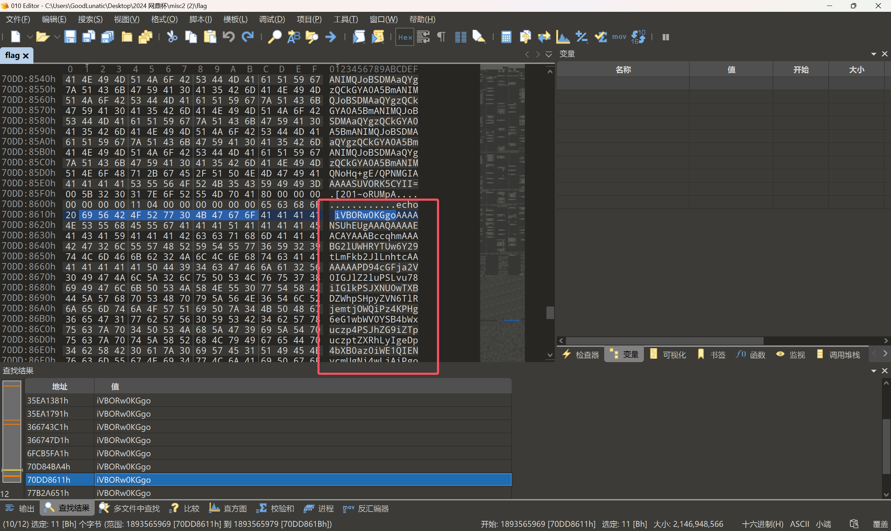

```
69 56 42 4F 52 77 30 4B 47 67 6F 41 41 41 41 4E 53 55 68 45 55 67 41 41 41 51 41 41 41 41 45 41 43 41 59 41 41 41 42 63 63 71 68 6D 41 41 41 42 47 32 6C 55 57 48 52 59 54 55 77 36 59 32 39 74 4C 6D 46 6B 62 32 4A 6C 4C 6E 68 74 63 41 41 41 41 41 41 41 50 44 39 34 63 47 46 6A 61 32 56 30 49 47 4A 6C 5A 32 6C 75 50 53 4C 76 75 37 38 69 49 47 6C 6B 50 53 4A 58 4E 55 30 77 54 58 42 44 5A 57 68 70 53 48 70 79 5A 56 4E 36 54 6C 52 6A 65 6D 74 6A 4F 57 51 69 50 7A 34 4B 50 48 67 36 65 47 31 77 62 57 56 30 59 53 42 34 62 57 78 75 63 7A 70 34 50 53 4A 68 5A 47 39 69 5A 54 70 75 63 7A 70 74 5A 58 52 68 4C 79 49 67 65 44 70 34 62 58 42 30 61 7A 30 69 57 45 31 51 49 45 4E 76 63 6D 55 67 4E 69 34 77 4C 6A 41 69 50 67 6F 67 50 48 4A 6B 5A 6A 70 53 52 45 59 67 65 47 31 73 62 6E 4D 36 63 6D 52 6D 50 53 4A 6F 64 48 52 77 4F 69 38 76 64 33 64 33 4C 6E 63 7A 4C 6D 39 79 5A 79 38 78 4F 54 6B 35 4C 7A 41 79 4C 7A 49 79 4C 58 4A 6B 5A 69 31 7A 65 57 35 30 59 58 67 74 62 6E 4D 6A 49 6A 34 4B 49 43 41 38 63 6D 52 6D 4F 6B 52 6C 63 32 4E 79 61 58 42 30 61 57 39 75 49 48 4A 6B 5A 6A 70 68 59 6D 39 31 64 44 30 69 49 69 38 2B 43 69 41 38 4C 33 4A 6B 5A 6A 70 53 52 45 59 2B 43 6A 77 76 65 44 70 34 62 58 42 74 5A 58 52 68 50 67 6F 38 50 33 68 77 59 57 4E 72 5A 58 51 67 5A 57 35 6B 50 53 4A 79 49 6A 38 2B 6C 31 76 70 43 67 41 41 49 37 4A 4A 52 45 46 55 65 4A 7A 74 58 55 32 53 56 54 65 79 31 72 56 66 6D 48 67 52 4A 70 36 66 43 63 38 38 4B 67 2F 65 46 75 77 6C 65 41 31 73 6A 2B 6F 6C 77 42 4A 67 45 31 55 39 67 42 46 51 51 4C 67 59 41 42 33 30 65 51 4F 6A 61 6C 32 56 66 76 49 2F 55 2B 66 65 4C 36 4B 6A 38 61 31 7A 70 46 52 4B 79 70 50 4B 50 78 33 2B 76 66 31 37 4F 32 77 70 62 65 6D 51 55 6B 6F 70 48 56 4A 4B 32 37 61 6C 51 7A 6F 63 30 69 46 74 61 64 73 4F 32 2B 47 77 48 64 4B 57 30 6E 5A 49 32 37 64 66 44 79 6B 64 30 69 46 74 57 30 6F 70 62 53 6B 64 44 69 6C 74 4B 61 58 44 64 76 66 37 34 5A 43 6D 2F 33 2F 47 47 57 66 34 34 62 74 44 4F 71 52 30 4F 4B 54 44 33 2F 2B 58 44 69 6D 6C 66 2F 7A 7A 33 65 48 77 54 53 42 38 6B 77 50 35 71 62 38 33 37 64 2F 2F 2B 76 76 76 68 35 51 4F 33 35 34 2B 66 42 4D 4B 2B 66 65 55 55 76 72 48 50 32 2B 4F 2F 72 76 2B 2F 31 50 45 35 66 57 4E 4E 77 6C 6F 63 47 6A 32 47 75 2B 7A 56 78 39 63 2B 75 58 67 78 5A 75 50 64 2F 2B 32 34 4E 74 33 72 52 38 66 58 7A 77 69 4E 58 5A 39 2B 35 6E 64 6C 75 53 67 53 32 5A 53 2B 74 52 61 51 46 7A 2B 65 6D 79 6F 47 63 30 6A 6D 68 35 66 50 41 4C 50 68 53 54 2B 2F 50 55 6E 38 7A 34 68 79 4C 78 71 38 65 7A 33 58 33 35 4D 4B 63 48 57 58 75 75 5A 47 5A 2F 76 39 62 6C 4E 38 50 7A 31 37 65 77 52 4D 4A 35 63 76 52 56 72 61 32 55 61 4B 4B 44 51 76 63 70 59 5A 33 53 57 66 38 65 4F 4B 54 2B 2F 43 69 38 34 6F 50 42 6D 4B 67 41 77 65 50 72 79 76 57 52 7A 5A 68 67 78 54 6C 49 41 72 6F 49 65 50 35 35 63 76 54 58 64 53 43 4D 36 52 72 2F 56 66 2B 38 4A 67 57 68 7A 57 39 4A 48 32 55 75 55 75 53 45 4C 41 4D 6E 4E 50 70 76 51 31 58 44 31 31 79 66 55 38 39 67 46 33 66 75 4E 30 35 38 6E 50 4F 6D 4A 7A 67 75 4D 64 6B 54 42 59 64 76 2B 74 75 4E 37 34 66 4C 36 68 6E 77 6D 50 75 4F 4D 45 73 39 65 66 62 67 
```

```
iVBORw0KGgoAAAANSUhEUgAAAQAAAAEACAYAAABccqhmAAABG2lUWHRYTUw6Y29tLmFkb2JlLnhtcAAAAAAAPD94cGFja2V0IGJlZ2luPSLvu78iIGlkPSJXNU0wTXBDZWhpSHpyZVN6TlRjemtjOWQiPz4KPHg6eG1wbWV0YSB4bWxuczp4PSJhZG9iZTpuczptZXRhLyIgeDp4bXB0az0iWE1QIENvcmUgNi4wLjAiPgogPHJkZjpSREYgeG1sbnM6cmRmPSJodHRwOi8vd3d3LnczLm9yZy8xOTk5LzAyLzIyLXJkZi1zeW50YXgtbnMjIj4KICA8cmRmOkRlc2NyaXB0aW9uIHJkZjphYm91dD0iIi8+CiA8L3JkZjpSREY+CjwveDp4bXBtZXRhPgo8P3hwYWNrZXQgZW5kPSJyIj8+l1vpCgAAI7JJREFUeJztXU2SVTey1rVfmHgRJp6fCc88Kg/eFuwleA1sj+olwBJgE1U9gBFQQLgYAB30eQOjal2VfvI/U+feL6Kj8a1zpFRKypPKPx3+vf17O2wpbemQUkopHVJK27alQzoc0iFtadsO2+GwHdKW0nZI27dfDykd0iFtW0opbSkdDiltKaXDdvf74ZCm/3/GGWf44btDOqR0OKTD3/+XDimlf/zz3eHwTSB8kwP5qb837d//+vvvh5QO354+fBMK+feUUvrHP2+O/rv+/1PE5fWNNwlocGj2Gu+zVx9c+uXgxZuPd/+24Nt3rR8fXzwiNXZ9+5ndluSgS2ZS+tRaQFz+emyoGc0jmh5fPALPhST+/PUn8z4hyLxq8ez3X35MKcHWXuuZGZ/v9blN8Pz17ewRMJ5cvRVra2UaKKDQvcpYZ3SWf8eOKT+/Ci84oPBmKgAwePryvWRzZhgxTlIAroIeP55cvTXdSCM6Rr/Vf+8JgWhzW9JH2UuUuSELAMnNPpvQ1XD11yfU89gF3fuN058nPOmJzguMdkTBYdv+tuN74fL6hnwmPuOMEs9efbg
```

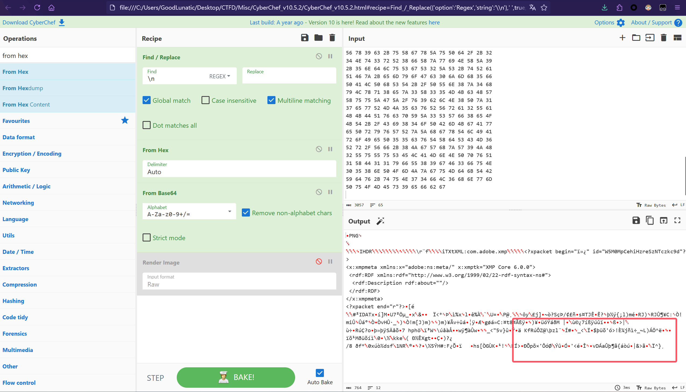

base64解码后很明显可以发现图片尾部是不完整的，但是从刚才第一张图片的尝试中

我们发现图片在内存中是分段存储的，因此我们可以尝试在010中搜索上面base64的尾部数据 `tuN74fL6hnwmPuOMEs9efbg`

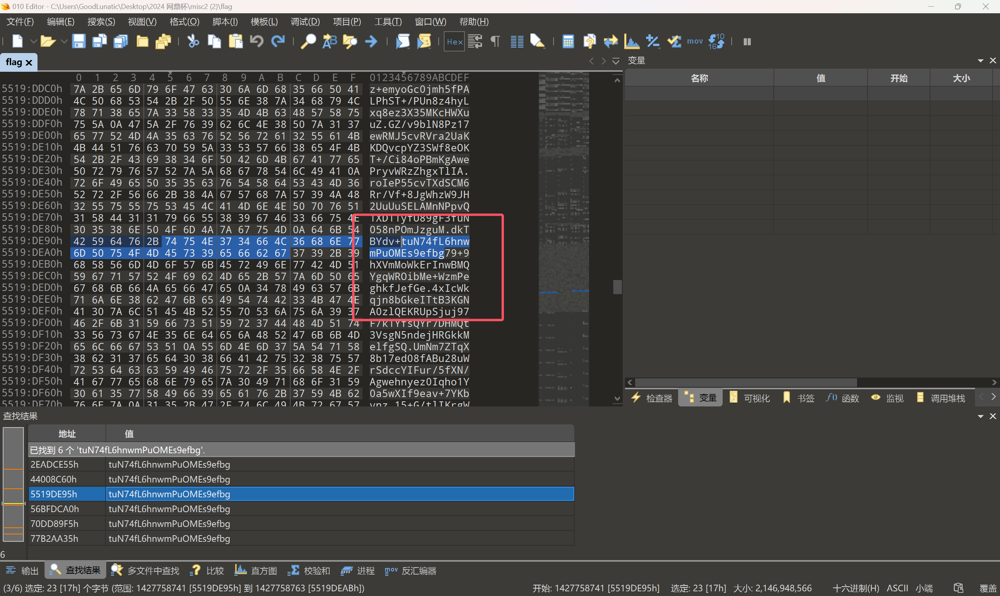

尝试后发现是可以找到后面的数据的，因此我们以此类推，每次拼接后都搜索尾部的数据

最后将所有的Hex数据都提取出来并解码可以得到

```
iVBORw0KGgoAAAANSUhEUgAAAQAAAAEACAYAAABccqhmAAABG2lUWHRYTUw6Y29tLmFkb2JlLnhtcAAAAAAAPD94cGFja2V0IGJlZ2luPSLvu78iIGlkPSJXNU0wTXBDZWhpSHpyZVN6TlRjemtjOWQiPz4KPHg6eG1wbWV0YSB4bWxuczp4PSJhZG9iZTpuczptZXRhLyIgeDp4bXB0az0iWE1QIENvcmUgNi4wLjAiPgogPHJkZjpSREYgeG1sbnM6cmRmPSJodHRwOi8vd3d3LnczLm9yZy8xOTk5LzAyLzIyLXJkZi1zeW50YXgtbnMjIj4KICA8cmRmOkRlc2NyaXB0aW9uIHJkZjphYm91dD0iIi8+CiA8L3JkZjpSREY+CjwveDp4bXBtZXRhPgo8P3hwYWNrZXQgZW5kPSJyIj8+l1vpCgAAI7JJREFUeJztXU2SVTey1rVfmHgRJp6fCc88Kg/eFuwleA1sj+olwBJgE1U9gBFQQLgYAB30eQOjal2VfvI/U+feL6Kj8a1zpFRKypPKPx3+vf17O2wpbemQUkopHVJK27alQzoc0iFtadsO2+GwHdKW0nZI27dfDykd0iFtW0opbSkdDiltKaXDdvf74ZCm/3/GGWf44btDOqR0OKTD3/+XDimlf/zz3eHwTSB8kwP5qb837d//+vvvh5QO354+fBMK+feUUvrHP2+O/rv+/1PE5fWNNwlocGj2Gu+zVx9c+uXgxZuPd/+24Nt3rR8fXzwiNXZ9+5ndluSgS2ZS+tRaQFz+emyoGc0jmh5fPALPhST+/PUn8z4hyLxq8ez3X35MKcHWXuuZGZ/v9blN8Pz17ewRMJ5cvRVra2UaKKDQvcpYZ3SWf8eOKT+/Ci84oPBmKgAwePryvWRzZhgxTlIAroIeP55cvTXdSCM6Rr/Vf+8JgWhzW9JH2UuUuSELAMnNPpvQ1XD11yfU89gF3fuN058nPOmJzguMdkTBYdv+tuN74fL6hnwmPuOMEs9efbg79+9hXVmMoWkErInwBMQYgqWROibMe+WzmPeghkfJefGe4xIcWkqjn8bGkeITtB3KGNA0zlQEKRUpSjuj97F/k1YfsQYr7DHMQt3VsgN5ndejHRGkkMelfgSQUmNm7ZTqX8b17ed08fABu28uWrSdccYIFur/5fXN/Agwehnyez0Iqho1Y0a5wXIf9eav+7YKbvnz15+G/tlIKrgWqGPkxj54xB/MADkeztY7JQag2cdIPdgTuGPKqi21nVo11jjKRJi3rKpTjwLWrmQJnpU0Y9vDeIw05neZI0CNF28+3kVNrYRo1mnK8STK0QoCLL9n/Njbce7uCNAK4y2hpbpTIb35Z+OXQskPKE8ljy4pHavVraPTDHnzWx1dOP1g199sc2M3P5dH2jx2jwM4Aw5J7UFaE4G2Vz5nqcVF07w80OIB2Qg4g1QijdWXeQVILmCPzV/3a3mE+03wyDL7KlNjQLTRmiOUAMAcEzjnpLKd8qxJDcTRRqRJloRmwIo0ZrRKCpvZeMu/e/EGvCap1sOZtRYbDy+BURx1BAu5FCBj0RrvnviYYTUmTj9cL1QPotmAK2CPCxgCTHQh9FlqVGXuB/IbtX0suJGGHh+8bevzAcpLMwEASe30YiIU3Jx87cwuKVA2g6Q/WzrsNwpfpZE3OWffuGkA1rnlZb9UaAWpRBd8PWjmZcyet1w7WvNjMYZZenEq/7DqQtSE5iRpJUjt9YtXY6VxetI6+nClbetLOI1wU+8qLJywzdUwEwxW4/eecwnsQePYtoEG4AVIKScoWoxbqUzZ3gWSFPbOJ0kBMOMVKg5Aw9898plifait+PT/+5//phHWgUZgUuZrBH/6DBFiMUZ8sioOw8WoX608i2a2oKSEiSKZpTO8IH09f33rZtiswXHP9d7RHhf0mBBxvWmDOk7IeyAB0GO6hL/YEr1FdupBM5ob/OnL90sdwyRA5WW5Pq3WjrgNIPKirwWApnFKqm6ABiQ0hFUMe5Dx9HgeRXBp7inxgiCYhbFaHIBkG9w+W/UDOXRZWp613lkZWuOdzetRHAAFUpV2sND+AklL/yhFUTXatY6lj2JrmWEFGsXqAXDzrVfM17aqjLMib1ZCaZFfhc9ia8JS2uSvNtff33u+1b7WFUsa0n2FL4YXPHmzZ8+DqQCIwrwodOwJq/IUYxCdfUywPIhgZFSrCNRCFPXq5x++N+/z8vrGJejEqix2a26tg3Io75d010Fe9ZjqIjezEvgz+kIUF21JhegGq21bxw3VgnUWHeS96Jb6VTWM6EgUNcQya1DKPiCFVXL6zzij5SquEaoqsGW9eet7BWb9rZQPMALUOm19t8De6vljMFp7oQTA6ji769bCakKBur567z179QFeFbhnTOoZt6zu3YsCThl07dLnmZ9SpdopfVPeub79rFpiu978nvcItsZW01NvYui66QmNd1++2t4NaOX2mMUBUOIQIrhsIsPa9nG2tcAxSoK7pwE8e/UBdaMv5utSStxaemGk+0zylfRDVDyIWrWSqugB66MPpT8PDQiLch9Ab5SejWtke7onAP789SeUfzP/7d2Xr0MiUjoeUH2/HGZCMcYjjGCxXiCjK9Yp6ihH3dbso4UerzWPf6sJ8dHGfXzx6I5X1HEdXQ/Oye3Pv2mF3a4KyPEjOjwq10YFJvZklTgV17Lg1sDGL3BzAmbvjwSmBH96i3CVxZmBDcldBVLxNJC10uvLzA2o7SJbzY9O4Yem24rql/dwfa7mbo1Ebz3PZrkA2gx4fPFI9OrsESTcdhRaR5t/RvPMvtHb/LN28zigZ/ce7zA8lcrlkLY3jHgsYZ+RoPfePIvoIMaYqTwzFVf6+GFdqEKrtiHmfUiYaWREDme3pIF9BKCE1FqH4VJQ0ghR4SJEldV0RlI9oYh2lFuRhxiw7wWgbOTff/lRRJ3RjKArx7VKnAD3XgUJYFyprShSaZq560yCnpEqn//di3iE0k8ep6kewkRkVUoDFGu9FX3at9d41ai0hvdVdV0BoFUGabUJGiHiZarRXGRWxUZ7zz59+R5km8nPtOa03gtRypNJPDvNBYi+YaPTtwpafKw1EO3aDKPnRxtzpTwErRgMakGXIwEwIi5/WfZ2ccQI5aLzvk+g9+5KwroHywKrEK1N8kgSHUMbQGvQEdVeDVgIsFKdpKjuPRo9L/mw/sLNfr/66xN680b/eEnS524EXFGyYtKJz/5yXjuaNg3vS1YyT6Q1TQzuCQBI/DqHSGsjlefGw4zV23iHPeJZoXeXRO9ZCv3evPcE+giQ0VJDvBYPVj1cBV4XlJzhB45Nh6JlkaoCS1h3r/76ZH7Win62k8Cp+M81YHkkoFSl0kBazag3o9fSogx5LtrGmvm5IaCOUysHA/oMVdWHfpVX20v33IAcRDHWRNtwq8B68UoaR63nXPqKMCwk208eG+ZUNmm0M7xldR+NvsqN19qEVkKs7nuV9dw6Aru7AUeoGQuJTHty9dZFG9nT2Zvi5oQ8qwlJOrDGby1Y8DK0AJhhNhlSkxVlkdfQDs3dA3oaCUaoUfrjQEKLgr7rKgCspHbGSDOAqo8SCydS8VRqNhrlWY6RNKoHR6Kuo6fA6QoAaYZz1XKM4QXalxTjZ+2c4pc3IjSFiGUw0ZOrt92xQOgo1+PSRwANeBpFIX1nTUVK1ZQUXmdBpw/O/JOMgKccJikF75hzC1UU0kZ0ARHNazPqX8r+I6IBWC6wSNAM/LEImjmF+ciIakPAQnrOSAIAmpiBxWqRVCNgJPVIy7JKS7YG5Pgh0QflbxLPl/MmWcV59g5WYx8KAC/13yNkdK/QDMzRhDa9VMEagY9Y2kfxNORswBm0hUc0bWF1FdOD/qj2Je4G0wLWwg/5O+tmoFEpYqky2b0+oNdYad42W+KqUaLcqm8IZrR43NOAvekIck39bJyQOSl5MStz/uzVB5Py6y/efDziV28cNS2z8aIuBpG4JKFsI8KlC7078TRpizDuM9aG1BrqagAtyYGVLi2UbTy+eJRevPlIbmsGyBfj4uGDOxpKYJh7eX3TbKNHC/Y+PQ4wfWhetLIq6nnFrFdNfop9QKBnByqevnzPOq9HSS6hPLO6XSCDOgfR7DQ9UPIFeufxCEZCDEhGQO1BRjUOURCpDrxkf9qbO7fPvZvgjDGmRkDIUUAaLeMQ5H41KUi2RzWutWgo1VHIHJQGLIxRDTLnUCPsCCM+5/Zr/p1tJ8IopUEk6Qr5ckZUsaOFk3rM6Sqq/wjWV8zPoNXfORkICK0wU26k4J6gVb9BGpE+lBlYm0TmNSoO4Pr2853ahrkGGtN+jZZ1XdNjgPU/pzRX80fWYIhnxfvqcUl+j9rKsRQaV3pLjiHCMaTeF3/++hPquH63ZiWkTyR1iFtsI0tGaPkxTr8a0IgvPyMepOYZHQlIMQpKf7FH/f3vg/9C95nbu779fCcZIcan8rd3X76C+9P0/1O+Tr13IkUy9rACjRRojKs5z1RpApUwlGe4kDQOrvJ19C5VbQVKht9exq6B3RoBPW7O3ba1FlvEDRONf9HoqYG5KKc1lqYAoA4aEkkV0XVnjagpuhw7xp4CdiBrVMrmg6ktiX2uRG9MagVBLBDR3xzFGAgB9pow7SIaVm3tCZQ9QC4KGlFlnAET332GHTjzoiH4uYJ71XU19QLU/v6WTzuCX7QHCG3cMONRTISnlRqSjVbSjs1e4+Te1/OCmadRGPIsK7OHP3/96Y4Xl9c3qDDplOz3AGRdlc90+bJtupVcV64SywE3eUayXHcEQC4gaZ1TqefiFcOtqSXYoXY1sBGQShSlrZbqRWVE1DpyGVD6oKWfKEeySIJDkxaJtq145Rm8FepqsNWA+ZJJts9539JI+fTl+/DxCRbViXv9er6fYaoBQEEJKPJeSJkGq+IZkpqP5Cbw9BS0YOUpKnmo6c7LkPrIuGkAUlGDezsrrwTs/Kw8F1brzEJDK/tQEQArT/QIXsLGi5/Qfq2qA5Xw0lik+2/BshYBqyBIrTpG3fhUK2n0uAdJqzkF0nyQOop4netXhEggEBcWk0VRraQviKCM8+nL99336r9pFV/dy2aCrAGJYp8RhWsPotmAUHhYya1zEHJ/FK2KupFXrL7cA+cs7D0W7/4xGGoAKyXulIsfowJ6nOtHbUbMb6BAahwtXmlvMI8+vaB2N6AkNM6a0YERviuMRwtS3qQaz1/fhuKr1sf4KBcAGrdufYOMdJy1xA1HKenyAVNOfMQf6tg0aj5KoXXLUol6Xijrh1rOncI3yDr6/ZcfddablCTxTIPVMrpc/fUp1FfAEhKBVqfKOwtI7TdwTcCZ9LGsXFtX8J190alfwYuHD9SzvKjZa1zMst3yuPMXjcKHPwBfUelsyRk/vfgdFUe3A1vdWruX23H3Mo4zThdHGoDVYpY6g1vC44o0LkZ3HZyBQ3knxgyjegI13DWS8kyxJ8tzdPpK9JJIJDLpIrsVvcunSfAmekrzDPeMgBaGr2gGJWwWF7Q9LURJN9Zsd9SGhOCQzFqM8rGhjKnrBZg1FvnLEgmW6aicv3Ph/TVfAdA5kAhHhuK72rrfs6zXkLgeuodsedbwe3LOZpSz9OtP/yK9h31nNl8YewWm7/wsxgukEWOgYeeAnM8xdhZIzEJKfV5i5hDM41Ia5K/VSNL01E9ttZ6i9kbP5jsDB4l589ZUJDVCCX6oFwThqDMr5SJsm//i4oJyzqXMUbR5hWxKTuFNyN8ofW0bbs2V7WZawPUA9vDVtBjDaDFFW/hcRF0TEutYwwbmza9W/7u9GzACIBPOdfX1CrJoZzF6eTpmmXoeng2q5mftQmz9dhQJCIVFBNz17WcxQ6MWvdh26+ehBtcVIM3j3vyfoy9lMcwF6FnhLSYAu/lHFtvHF4/QN71A0OID5DaccuP//MP33echNxSN+rOMAJytCSwtzzvzGSWK9MWbj+J9u2RgqukgRtA6V2sY9LzPgGfQYKmqSxhbIfaJphFQAxrXKO8dpxxkBXFFawLb72iuZm2N9oZpTUAtaHgVVvPta4cX782zYI1I64YiTKAf2N779wTA3jemJD2Wfn8JjwL3PYty2ytV1KVA+pJYar9iRwBvVY0reLQCkjB8keSh9iaNvLn2DI0gom0DagCnfCbVRiRjI/RWYk9YV2ke/d2bF1i0hMORG7Dn9tNM/Dl1vPvyFfTcs1cfpskpdVxBqzRa+b96vusklFERFGjZtd7vGJeXtqtv5sLsuWq94xFGPGzt5avGb6BAoFZQxh4CMjTGgG3z2asPavUUL69v0m8PH9xN/M8/fH8kcH7+4fvups/PRptjyQCxHvawtltojeu78o89tBg+YlDkktIcQMYVbeH8/suP6fHFo/T44lH689ef7v6d/zujLmNVaybSX2FMea0Ss80vQad0UFMUtDSZOwHQGzSlZpnWF01CbZzVlB+9W28YCcyOALkfTG0ECm2lYLAApB9IJKQHtHl0eX1zt+8o4+6tlea+tDRCzKKeJC33JTSMmFI30miNmfN+Lgu3ovFX0jDnXTPQgv/gewEkUEvO2X9D2+khawzYMyOlusuKVYN7yPzSOmtTKz1Rq+5QITF+Dj0WxndTAcAFVh2mHkUok0ad6FZ2YInSsi+pBs94qCm8Lh4+IB9TSkSwNWFKgkU6xtxBXcdQREu9OofG3ofURZejHHPqcY7ar8a73JiMaNWuIRATAJYD8WYaBVyaZ+fBWWJJ632rTWs1XxLCf4VQZ8n+l9AAvL/qVoY6LVCMplHHMoN3aDr09yhwtwFAznHlVc3Yc5+FX3j23IiG+iwuXQqdMv5cjKPH65ZruPdsq3/MszPM3tG8wn3mUtYOKJJY26SSYJaQZCKmrb1clPrizcd0dfuZfC9ANE/GjF/QSMG9RvthwdYAvOO0Ibi8vknPXn1ABZ+M3HzaY5Zs//dffgRd010jj7/82kewYktdWLPy5h9pwbM5uue1gJ4Vop9laqxizPEItsln/Py/2oCYbS5YI6FmWfnV1p8nMLxqCoBVNk8UrG4k3Lb7QmFUV0C6aAwHFmXARx4NCo8iXSBzJwD2XkSC8/Vq3ahiDetKORqeAG9vzl6Bnafy+akGYD1p2jX0LMGZGC3UX/YIfMJCak1GdHdyL4rBQjwOIJqUrxc8lT6M2uaxqCxsCaVtwDvyD6J6z8rGQfryEOL1GtVcT1MBEE1C9uB9rvLoX8voZjXnGkLjVEraSfGuGwfw4s3HowAcLiwquVgg4jik54oCrl9dszISFpw5hvIhwpylNIgDmBGHregiuWk40V1cX7bEOKT86bmdCAuJ61fX3vwYnuc5hr5Txkr0+FD77r3m7N7eEdEjBOB51FjlmKMF7Th2D/7uaU5bY5E6coYPBV4VWcWTUm25NxFjUNK8Wsis9RFtNf7UAIUCQ0pAe4eJzvqn1DbkIKt4UqotdvP/9q3oxos3H9FHppJmTL8SPOauo96twlpYcfMfFYAV0SO+IYrahaGjfpaqWkUZuxYgLjVsW6PfIkUbSvZFKVCi6cUIYwPoYUWXlGab22br1sL2ZeUO7fE202vtll31A6AWCKQZKIKB1cam5gOMApNWECDRAr+gaAkIDaOnJK811oOrBqAdkrqC9Xn2JZNGr7+nL98f/a33BR2Nr6Q5SvDNql9mDbTmtJkMFIFpGumjEbP2JPvCfI17/Up+0bXPyJrtjrIhZ+1G2D8t1ALgydXbtgZgpdZFZVQP1hl5kdqPNFeYTRcxIavuy1NbuucGvLy+QUcpUV03HD81FlgXVcv12aJXs+YcBdJuqcxrSlUhLWDGiL3nj8o/zj0HrqHlPcmwqnEnY9Uv7Qirz4kXOF9YTZ5rz+fI0Jn7do8DgBTbkKquwvUtjwxoVEQ6J2sDeq7mAJPjL2n1nwmZqHMWPg6gBcmCEBj0audlaG1m7Vh9LrTcXhRI5/dz+9N+n4t7AuDJ1f0ikVaQYgZFQOxVvfZcYD2eQtbXk6u3bnOCFWLemxiKVgxKMxegF79ONfYdxR4PUF6AyYkJp6RaQt7RynfQvORS0iiIHX+Pp5D8iMcXj0jzmNcaJy8Ba5TDGhqpkF5/V7efU5I8B1mrqpZlqFaR8qcIb1989LXRi87dtuoIIHmWi84UbczUXO8jR/QQVW5/VP7ODL51u97ziMEwEnBvkKqXR90op5ZVaJFfEJk3kWkbzc2RDQB7xhg9j7kQE/OuBDDn4vI8iKGLWgdgxfzylO6fmzVsOBF507tKDvpuj0+Se6CemyP7yEhyRJZq26ZX+ZZTT0Ab0eekRHRaW5pG9DoE0q7mJY4APRUG4rLUNBRGX+ArYqSuepd+HyHaWoAaRk1rAkYq/bw31LkKq9eqwyDaWGfrHErv6Llc9o1dXbiWDBJSNoqk1swaOxV4R/bV6GlhFvOHKeYi2Q/0b5T2wxwBuG6b/O+9bGQtQQUVztE2fg9R5xtDl0QdB2qbIAHQ6pRayirqhNWgVMSxhIY9gmMAswqfjeJ3j7IOuEDbAKKdtzwRlRdR6aKCOx7puwI0+Os1Z6B7AUqMiOT4LiX9oVZ3FDy+eDSMaWjR0Yv7z89i8gJ648QsJM08hBEwc4QZT2s+MJsfmrMy6o8CyBjLuZKK2Tk8uXq7rWQ9lpTm0ceqjevbz+n1p3+J31Mn7e3BtHf2NOEg5gaMspmi0AHBs1cf0rsvX+/+++cfvkct3izVa3dQlJtnz2gD+xGr13R+X2See8YByUIHWLfgqgaWPE7PSylW5R0V0cYrmV1rgTBuQCwomyxaNZhThEetRo95kuxTwyWb6VMTAFGCgTKg9HjXBeCWsa7dZJ7zwHH11ReVaOBU8jjC5QJIJlzM/OGcApFRviZeaAkXS4EieQzFtrVKIBQXKgIg0iaJKHUt27BsP1qYtbawirDOuQFh4gIAIjk1pSs3lXf2flleyXMBeH+hvAvHYnlvdeVZhEjFmSAu1w7JDch1tVHf5xRfoPRD6SuqG7Km6xRdhbO5iTp3mpgKgFNkChZaPIrAeykapMNxS0TgExTRaJ2GAlsRu2LJ7QxsqCp0rBwtqeyjdc8hFJkG7vxobH5JjVBi/ZWltnrlvriaszh6ZwaO9dwCmDMo9+ourKFFumxTiUjuVUlasBmn3jYQLCLYBlpAGQEjW6W51tAIFt0WotKlCU46uUeRjpUxtAHs2VBkeRbTPP+ecbrIa5izvoY2gNbm555DrFJ1Zxht/pHdgGJTgE4OlTfXt5/Ztg7JeeGkyEZZH1bgjDev4dn6GvVx2LZt87RMavYNbfucQhobluuT01c0Cz8E36WkV+QDAirDel+Z8ndo29Kbn3OJ6orA0A3RDur2LDcVpy/NDxnn2eFv2/Yfi+rTl+9NrataF3tI9yXZhjSo3gNtYxp1HWnwWPqiFw6NGl4czlxNvQDR4ruxiEhnPWFRaIxChyZWHKNm6XNUIBA1RDa/l9W/nkpDMWTN1KNoZzKuZ2V07z3XECjJK2itROtjD3SMJV11gI81Ms0qa1lcpCgDq+5ApSfE92yVANRKY7X6cpX99GoLaBRjif5ljk4fFWgBEC0CayYQMBMnMTaPhSJxqcroN0tYrS/vcWoDOj4xDSAaQ6PREwk1b6iGKUjBjZ7xUTM0tjceqHDRvtgmUljwPQHQGmDJUKoKDsXz17fqcfFSsfpe2lDu17rGocTC5RxpJI9g3NBxyXY0PlZQr89QA9ir64yLPY5JEtjEHqk+euj1Lenyk14TkI+LRJ/sIwB2YmdfbcykRNiIml9h76o7Gu1QBIFEvIj2lznCWqQglBcgEhOp6qaUKolB+bXQtrZf/fWp+XXSDODZS2ZnxkgItoS+5nhCCQAOpM500nRIvRd9UWPtISuWK/cG1UYzMtYeCQCoZF+VgSPUC3K2QCGqrDWfrI2C0tBaa3tcrxBAxq2qAUQKedU810q+FymGHgtr95Z33oBHe5j23QWAFrxcLRE2WQs9bSVS+TBrcIUR5n1JdzBXs4TEZpRAlQX3yneW6pdTjlxj3Ne3n9PzNx/D5SvsAStUYSrXlUb1rXz79HB9UaQMBdG+ntHo0UAeI0YTkHC5YdGjr2cT0C5GGgESdEH4lFZRE/fmCtKA5ZgjfiC857wnnCB0WUeVZpqWtAGsBmvfrkb73PZKHoxiLGbxF/nvvQ0jES7sLUhqGqjeEbYRMMpXV8JHjjWOeCAqXSUienIkQ3q1MPrCe9JGuhvQGnso2pmLdaw+Dg2sVEyTesdiNAP0Hd3WEsdbEmvAw3Bm1Q9H++JmjkaJ7oRAkjbLHIQUKbGmBW+6vLLBtMENIGkhikF5DwZFCZBsANEHDqEvykKkIBL/n1y9DVW8QgO1cZIDKK88U6NrLGEDaIF6NvK87myls64UWmNeIUhnbyjnofx3syow92KL3vujirZYUDeS1uaHjA1D86zC7yqXiLTGjN38rbFyrh/j9l0CUomZMleX1zci+6V1hfrRnEirFHsEhB+eqvKMvuyCWkmdHxkAVz7ilaAa+yRTx0legJUW0gwSab8z9IJTogvaWXQa1UrvFS+CAScyT0NASY2tHhdYAFBLOdWEewsPaet3Ho+3KzC6MGlh1XHndR2J59R1vctQ4ChfAg606w5wgdVoIm2WGlEiXj0QQgCMvqLSG3C1GPyo8NDkoLyVdO1pIQpd5gJA24BjEfOvHakVgW6J9yBoCfiVjHxeG5lzyUn5m6gAiHZtGOWcJjWhFgsD8hW++utTmK8NR2vQyvCLwhtt9MaZIAyQ3EQSRjMrWNK4Aj+4kHRfQSGZiu2R1q0NsgbgPXBpweU9HklwVX1vT8226SQCSRwteryJwLNtw/MtTCjwqim/EqHFmjUHzyG3fP7uiY81L5qhwNgGJQDZ/JTQSO2QWczm79GilR9QL1rL8OFIocpc/mpufms+1by4EwBUQiDMhbRdP9OK9Z5ttsvrm3vtSG0uidjzGS3UmHGp/iX79aoe7Q0IDeWHzDs5LMwRYASMCieh7j3/NkF1O9hjilQVmFE7I5r2pLqeoYMwAqC1yOvFfYrptFaA8tbzboiUZL6Y5/sYCujYItsWSGlL+wqx5NLtWwbJcC3bETwrUvyKsnZngT3YQDi3UGAtBvR+G8UfUKP1MLHvlAjF/Bx3EUfYiJKwGM+K6ccUvhwdAVZWsa1px/a3Mm8hyOOzGufe+WmFIzegJEOfvfpg6razXgyQ/krPAZa+GR80LN4jT8doLsvNyJ0H6LjK8lbUNiTooL4XwWORUjq2AUjGamPVXO2qO7N3pZN29qZ2Z2iPSzOfxCMUmdPX7JgpsV9DewEs35dqL7+nVXyUolV5FUHVgNY8R1t/mL5GY+jRdfc7RFpAjSAa8dCnnMWlOca98c/rck2t57XbyQCFAr/78hUkmSy/NKdgAKJqIJS2R+9BKt9qAHNO5gY8Yc/k2LmRWq/S656dC9CDlJEDO2DJ0uOWkCpz3eMXJ3TXI0lLUqWGrMWsQluj7NNF0EqrF16qTrRiJBHAMWxCj311HxLzEPF4AqXJ8hgsgaEAsCiv5Q3JIA9vHnH7f/761n0MNaQ21EqFPy2jU48EgGXEGXaQ1EpCXCHmtRAiuaygiEhTdJQCzoN/Ym7AnHkGObtpF/84R4mtAYzb6gwaZvwUMwJmK+wfAE+AtlEJG6XXg5f1eyVwDGetedIyxo3apPQXxdjMrcswFADYsMbL65tl8s9bdNaXm1pav7mLXiMkVnrTQCGtAYy+gj0tpET+WJS/Y13ekpeZlnS0UuhHH6578zY6H8zCdDXOLFbBL6W9I0pBxxLRwlJL1PyilF/XRjR6tMAdZ4I2wl0kWujRFWmDR1mM2UXnFWEYhQ8c9NZSFoLPX98ukz68bd8EgPcGmWE1TYPav1UBDu7YPRe4dtKYFGY8osZLSK9bdkEQbWZ7b1RNaGhes/c1A6b2eHHGSqDMbZhswDN0EaVQx6xQKYbOVe+SSIk2H5QM0xmPwG7AMAUMOmi5ZbSKRVBR911aayWsxKOxWfnWZ/3Um78eN6bMfF7YEkU4rN16lBLxo83fWz+tzX80VoiaYFmDTTofQSqcOaKlGwOpWogWiHyUiEKHFNSyAbGQKinVa7f+N1YT+O3hg5ARar1x1F+0XtBNRLz78hVEPxQ9HmHXQMQoxXIMJO3WWwLtAZ6ZYiNolGWr4XHlt6S2CKFlpUSiGjPDoJoRUMpAs7KhJyq0ypWlZHuLk1WbUdGLYvzt4QP4/HqngEr33cqushxfPr9a166n/N0aXBuMVtunDNIR4BSZvcqYJQqpRA5DjhAUloX8ShF/GfV8J8wgoi4MzPkt+kZecVF5QDMiMOqewGJG2/PXt9t3ueAnxA8N9dFeXt/cs+K2fkvp7/Po6Frv1t8wdNV/0yy0iX22hbO9429IXD9OtXPUF9LW/x5l482guZawz1/dfu57AaiSTeMCjhmk24wi1b1j2qXzFaLwNSNSHUkP3jy5ejv3AnCsqtmCr2WZjWDxlaIhwlioyNdtp/SfL2KOcmxpNLOrvsv2Whbt1hdYg3+zsOWMSJ4qLB/OuQBn3MNsg2r2+8cvP6bnbz6SLl6NfkFsDaiASaktZKju3LLf/wcOsj2d8Pa/YQAAAABJRU5ErkJggg==
```

base64解码后即可得到下面这张图片

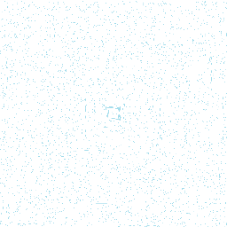

> 赛后和别的师傅交流的过程中发现有的师傅说这里直接 `foremost` 也可以得到这张图片
> 
> 虽然是不完整的，但是 `zsteg` 一下也可以得到下面的 Hint
> 
> 感觉这里也算是非预期吧，出题人如果隐写的内容不放在开头，可能就要把图片完整提取出来才行了
> 
> 之前睿抗也遇到过这样的情况，也算是给自己提了个醒，以后出题别把隐写的内容放在图片头部(坏笑)

zsteg一下，发现有一个Hint：`Y3p_Ke9_1s_?????`
``
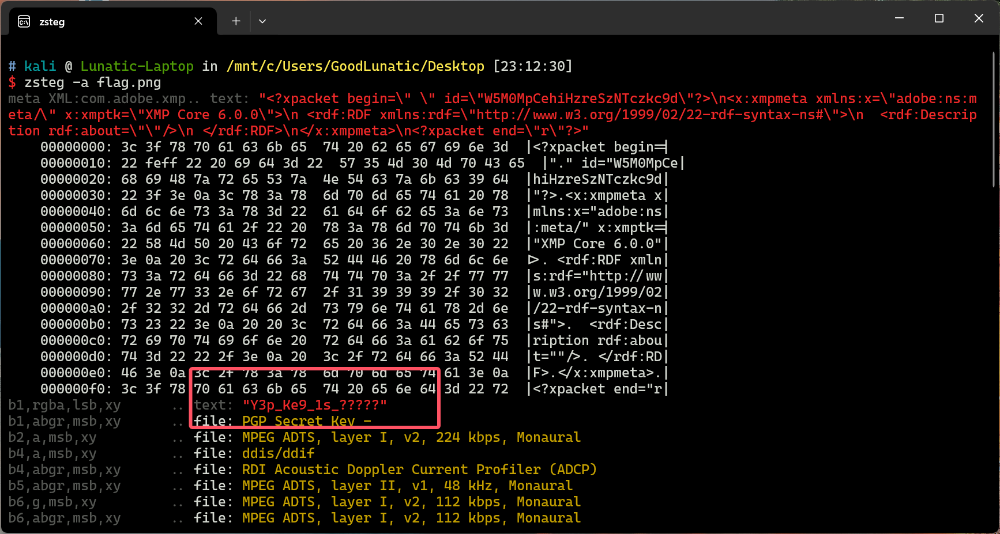

然后我们在回头查看那个内存镜像，尝试一下常用的文件头，看看有没有别的文件

发现存在 7z 的文件头 `37 7A BC AF 27 1C` ，内存镜像的末尾藏了一个7z压缩包

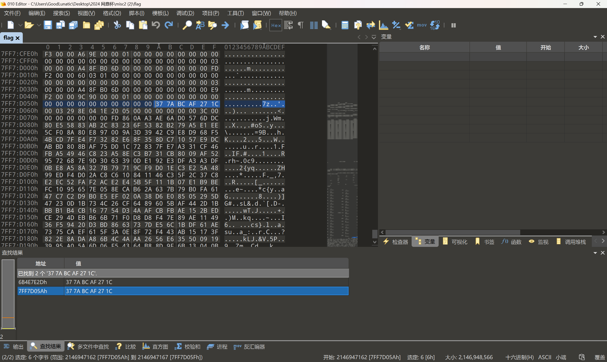

因此我们手动提取出来，然后结合刚才的提示 `Y3p_Ke9_1s_?????`，猜测是压缩包掩码爆破

因此我们使用 ARCHPR 爆破上面提取得到的 7z 压缩包

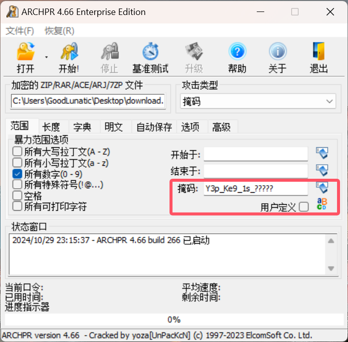

爆破后得到压缩包解压密码：`Y3p_Ke9_1s_29343`

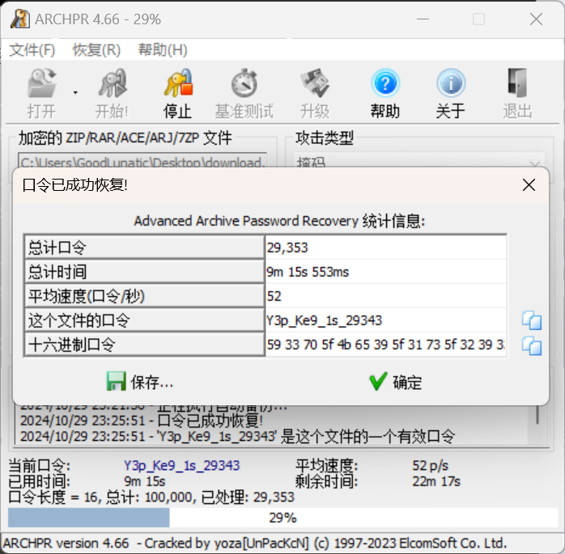

解压压缩包后得到 `flag.txt` ，内容如下：

```
 31         226 PUSH_NULL
            228 LOAD_NAME                8 (key_encode)
            230 LOAD_NAME                7 (key)
            232 PRECALL                  1
            236 CALL                     1
            246 STORE_NAME               7 (key)

 32         248 PUSH_NULL
            250 LOAD_NAME               10 (len)
            252 LOAD_NAME                7 (key)
            254 PRECALL                  1
            258 CALL                     1
            268 LOAD_CONST               7 (16)
            270 COMPARE_OP               2 (==)
            276 POP_JUMP_FORWARD_IF_FALSE    43 (to 364)

 33         278 PUSH_NULL
            280 LOAD_NAME                9 (sm4_encode)
            282 LOAD_NAME                7 (key)
            284 LOAD_NAME                5 (flag)
            286 PRECALL                  2
            290 CALL                     2
            300 LOAD_METHOD             11 (hex)
            322 PRECALL                  0
            326 CALL                     0
            336 STORE_NAME              12 (encrypted_data)

 34         338 PUSH_NULL
            340 LOAD_NAME                6 (print)
            342 LOAD_NAME               12 (encrypted_data)
            344 PRECALL                  1
            348 CALL                     1
            358 POP_TOP
            360 LOAD_CONST               2 (None)
            362 RETURN_VALUE

 32     >>  364 LOAD_CONST               2 (None)
            366 RETURN_VALUE

Disassembly of <code object key_encode at 0x14e048a00, file "make.py", line 10>:
 10           0 RESUME                   0

 11           2 LOAD_GLOBAL              1 (NULL + list)
             14 LOAD_FAST                0 (key)
             16 PRECALL                  1
             20 CALL                     1
             30 STORE_FAST               1 (magic_key)

 12          32 LOAD_GLOBAL              3 (NULL + range)
             44 LOAD_CONST               1 (1)
             46 LOAD_GLOBAL              5 (NULL + len)
             58 LOAD_FAST                1 (magic_key)
             60 PRECALL                  1
             64 CALL                     1
             74 PRECALL                  2
             78 CALL                     2
             88 GET_ITER
        >>   90 FOR_ITER               105 (to 302)
             92 STORE_FAST               2 (i)

 13          94 LOAD_GLOBAL              7 (NULL + str)
            106 LOAD_GLOBAL              9 (NULL + hex)
            118 LOAD_GLOBAL             11 (NULL + int)
            130 LOAD_CONST               2 ('0x')
            132 LOAD_FAST                1 (magic_key)
            134 LOAD_FAST                2 (i)
            136 BINARY_SUBSCR
            146 BINARY_OP                0 (+)
            150 LOAD_CONST               3 (16)
            152 PRECALL                  2
            156 CALL                     2
            166 LOAD_GLOBAL             11 (NULL + int)
            178 LOAD_CONST               2 ('0x')
            180 LOAD_FAST                1 (magic_key)
            182 LOAD_FAST                2 (i)
            184 LOAD_CONST               1 (1)
            186 BINARY_OP               10 (-)
            190 BINARY_SUBSCR
            200 BINARY_OP                0 (+)
            204 LOAD_CONST               3 (16)
            206 PRECALL                  2
            210 CALL                     2
            220 BINARY_OP               12 (^)
            224 PRECALL                  1
            228 CALL                     1
            238 PRECALL                  1
            242 CALL                     1
            252 LOAD_METHOD              6 (replace)
            274 LOAD_CONST               2 ('0x')
            276 LOAD_CONST               4 ('')
            278 PRECALL                  2
            282 CALL                     2
            292 LOAD_FAST                1 (magic_key)
            294 LOAD_FAST                2 (i)
            296 STORE_SUBSCR
            300 JUMP_BACKWARD          106 (to 90)

 15     >>  302 LOAD_GLOBAL              3 (NULL + range)
            314 LOAD_CONST               5 (0)
            316 LOAD_GLOBAL              5 (NULL + len)
            328 LOAD_FAST                0 (key)
            330 PRECALL                  1
            334 CALL                     1
            344 LOAD_CONST               6 (2)
            346 PRECALL                  3
            350 CALL                     3
            360 GET_ITER
        >>  362 FOR_ITER               105 (to 574)
            364 STORE_FAST               2 (i)

 16         366 LOAD_GLOBAL              7 (NULL + str)
            378 LOAD_GLOBAL              9 (NULL + hex)
            390 LOAD_GLOBAL             11 (NULL + int)
            402 LOAD_CONST               2 ('0x')
            404 LOAD_FAST                1 (magic_key)
            406 LOAD_FAST                2 (i)
            408 BINARY_SUBSCR
            418 BINARY_OP                0 (+)
            422 LOAD_CONST               3 (16)
            424 PRECALL                  2
            428 CALL                     2
            438 LOAD_GLOBAL             11 (NULL + int)
            450 LOAD_CONST               2 ('0x')
            452 LOAD_FAST                1 (magic_key)
            454 LOAD_FAST                2 (i)
            456 LOAD_CONST               1 (1)
            458 BINARY_OP                0 (+)
            462 BINARY_SUBSCR
            472 BINARY_OP                0 (+)
            476 LOAD_CONST               3 (16)
            478 PRECALL                  2
            482 CALL                     2
            492 BINARY_OP               12 (^)
            496 PRECALL                  1
            500 CALL                     1
            510 PRECALL                  1
            514 CALL                     1
            524 LOAD_METHOD              6 (replace)
            546 LOAD_CONST               2 ('0x')
            548 LOAD_CONST               4 ('')
            550 PRECALL                  2
            554 CALL                     2
            564 LOAD_FAST                1 (magic_key)
            566 LOAD_FAST                2 (i)
            568 STORE_SUBSCR
            572 JUMP_BACKWARD          106 (to 362)

 18     >>  574 LOAD_CONST               4 ('')
            576 LOAD_METHOD              7 (join)
            598 LOAD_FAST                1 (magic_key)
            600 PRECALL                  1
            604 CALL                     1
            614 STORE_FAST               1 (magic_key)

 19         616 LOAD_GLOBAL             17 (NULL + print)
            628 LOAD_FAST                1 (magic_key)
            630 PRECALL                  1
            634 CALL                     1
            644 POP_TOP

 20         646 LOAD_GLOBAL              7 (NULL + str)
            658 LOAD_GLOBAL              9 (NULL + hex)
            670 LOAD_GLOBAL             11 (NULL + int)
            682 LOAD_CONST               2 ('0x')
            684 LOAD_FAST                1 (magic_key)
            686 BINARY_OP                0 (+)
            690 LOAD_CONST               3 (16)
            692 PRECALL                  2
            696 CALL                     2
            706 LOAD_GLOBAL             11 (NULL + int)
            718 LOAD_CONST               2 ('0x')
            720 LOAD_FAST                0 (key)
            722 BINARY_OP                0 (+)
            726 LOAD_CONST               3 (16)
            728 PRECALL                  2
            732 CALL                     2
            742 BINARY_OP               12 (^)
            746 PRECALL                  1
            750 CALL                     1
            760 PRECALL                  1
            764 CALL                     1
            774 LOAD_METHOD              6 (replace)
            796 LOAD_CONST               2 ('0x')
            798 LOAD_CONST               4 ('')
            800 PRECALL                  2
            804 CALL                     2
            814 STORE_FAST               3 (wdb_key)

 21         816 LOAD_GLOBAL             17 (NULL + print)
            828 LOAD_FAST                3 (wdb_key)
            830 PRECALL                  1
            834 CALL                     1
            844 POP_TOP

 22         846 LOAD_FAST                3 (wdb_key)
            848 RETURN_VALUE

magic_key:7a107ecf29325423
encrypted_data:f2c85bd042247896b43345e589e3ad025fba1770e4ac0d274c1f7c2a670830379195aa5547d78bcee7ae649bc3b914da
```

发现是python的字节码，内容是加密了密钥然后用SM4算法加密了flag，手搓一个脚本逆向一下密钥
```python
def restore(mk):
    magic_key = [_ for _ in mk]
    for i in range(0, len(mk), 2):
        magic_key[i] = hex(int("0x" + magic_key[i], 16) ^ int("0x" + magic_key[i + 1], 16)).replace("0x", "")
    
    for i in range(len(mk) - 1, 0, -1):
        magic_key[i] = hex(int("0x" + magic_key[i], 16) ^ int("0x" + magic_key[i - 1], 16)).replace("0x", "")

    return "".join(magic_key)

def encode_key(key):
    magic_key = [_ for _ in key]
    for i in range(1, len(key)):
        magic_key[i] = hex(int("0x" + magic_key[i], 16) ^ int("0x" + magic_key[i - 1], 16)).replace("0x", "")

    for i in range(0, len(key), 2):
        magic_key[i] = hex(int("0x" + magic_key[i], 16) ^ int("0x" + magic_key[i + 1], 16)).replace("0x", "")
        
    magic_key = "".join(magic_key)

    wdb_key = hex(int("0x" + magic_key, 16) ^ int("0x" + key, 16)).replace("0x", "")
    return wdb_key

print(encode_key(restore("7a107ecf29325423")))
```
得到SM4的密钥为：`ada1e9136bb16171`

最后CyberChef解一个SM4即可得到flag：`wdflag{815ad4647b0b181b994eb4b731efa8a0}`

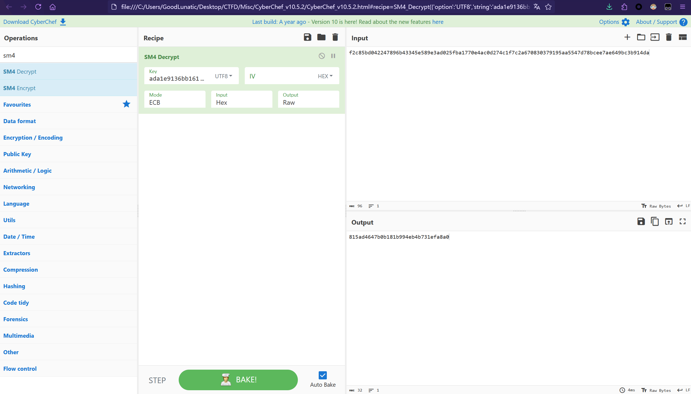

## 题目名称 Misc03
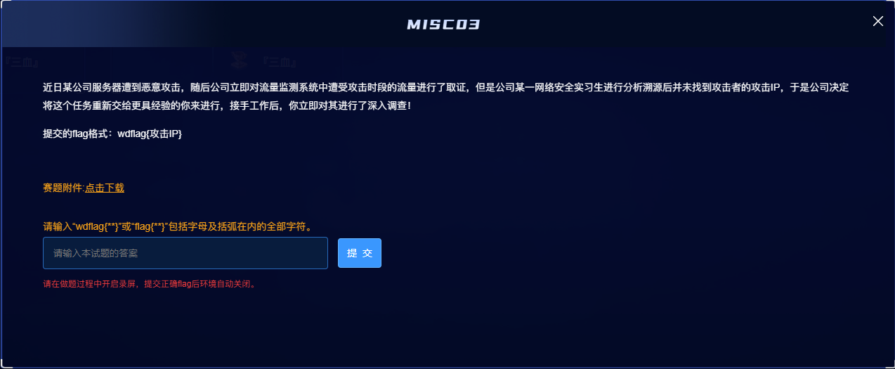

题目附件给了一个流量包，翻看流量包发现有`upload.php`的路由

并且发现都上传了一句话木马，因此过滤器过滤一下`upload.php`，然后试一下这几个ip

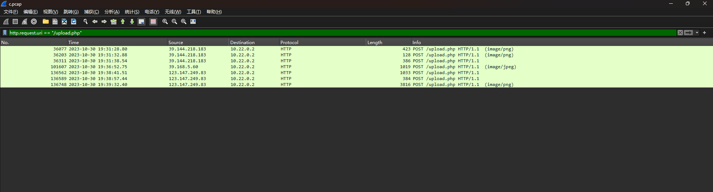

最后发现 `wdflag{39.168.5.60}` 是正确的flag

## 题目名称 Misc04
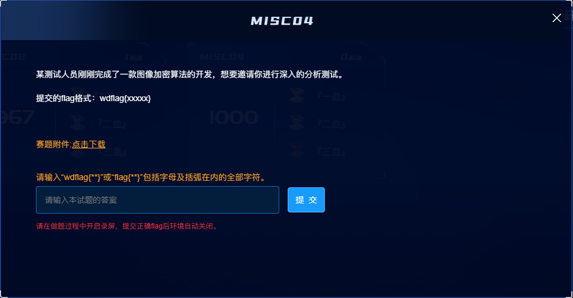

题目附件给了下面这张图片：

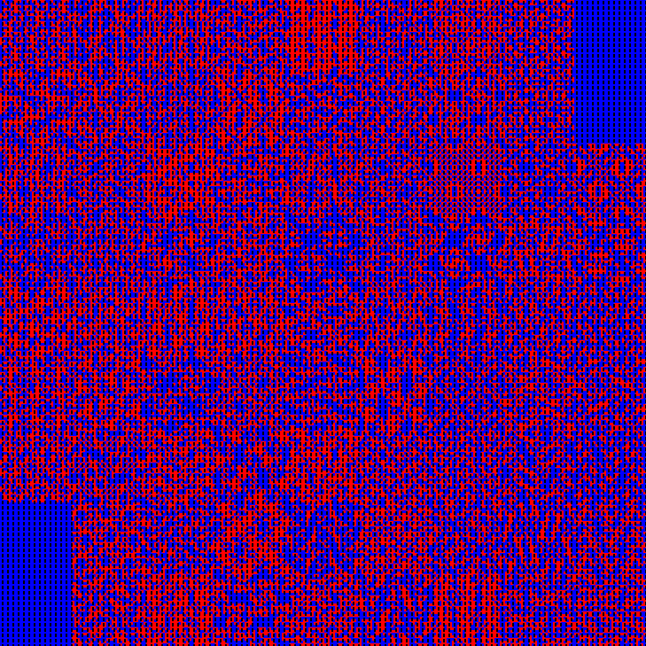

之前在某个群里好像有看到过类似的，感觉是希尔伯特-皮亚诺曲线

根据[参考链接](https://almostgph.github.io/2024/01/08/IrisCTF2024/)中的脚本复原一下图片

```python
from PIL import Image
from tqdm import tqdm

def peano(n):
    if n == 0:
        return [[0,0]]
    else:
        in_lst = peano(n - 1)
        lst = in_lst.copy()
        px,py = lst[-1]
        lst.extend([px - i[0], py + 1 + i[1]] for i in in_lst)
        px,py = lst[-1]
        lst.extend([px + i[0], py + 1 + i[1]] for i in in_lst)
        px,py = lst[-1]
        lst.extend([px + 1 + i[0], py - i[1]] for i in in_lst)
        px,py = lst[-1]
        lst.extend([px - i[0], py - 1 - i[1]] for i in in_lst)
        px,py = lst[-1]
        lst.extend([px + i[0], py - 1 - i[1]] for i in in_lst)
        px,py = lst[-1]
        lst.extend([px + 1 + i[0], py + i[1]] for i in in_lst)
        px,py = lst[-1]
        lst.extend([px - i[0], py + 1 + i[1]] for i in in_lst)
        px,py = lst[-1]
        lst.extend([px + i[0], py + 1 + i[1]] for i in in_lst)
        return lst

order = peano(6)

img = Image.open(r"C:\Users\ASUSROG\Desktop\chal.png")

width, height = img.size

block_width = width # // 3
block_height = height # // 3

new_image = Image.new("RGB", (width, height))

for i, (x, y) in tqdm(enumerate(order)):
    # 根据列表顺序获取新的坐标
    new_x, new_y = i % width, i // width
    # 获取原图像素
    pixel = img.getpixel((x, height - 1 - y))
    # 在新图像中放置像素
    new_image.putpixel((new_x, new_y), pixel)

new_image.save("rearranged_image.jpg") 
```

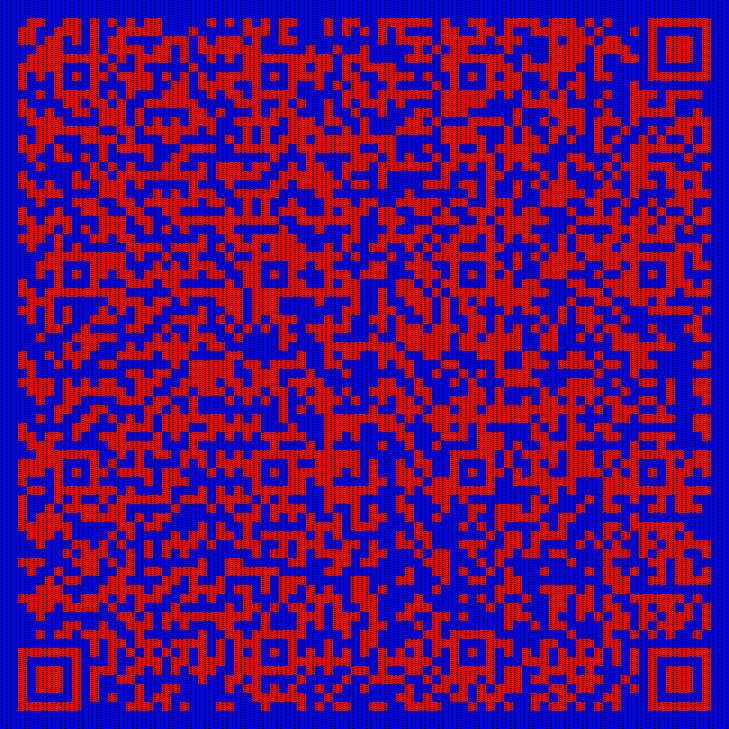


复原后可以得到一个二维码，彩色的可能不好识别，分离一下通道，扫码即可得到flag：

`wdflag{4940e8dc-5542-4eee-9243-202ae675d77f}`

最后，有兴趣的师傅也可以尝试复原一下下面这张图片(感觉比上面的简单)

但是感觉可以帮助大家理解原理

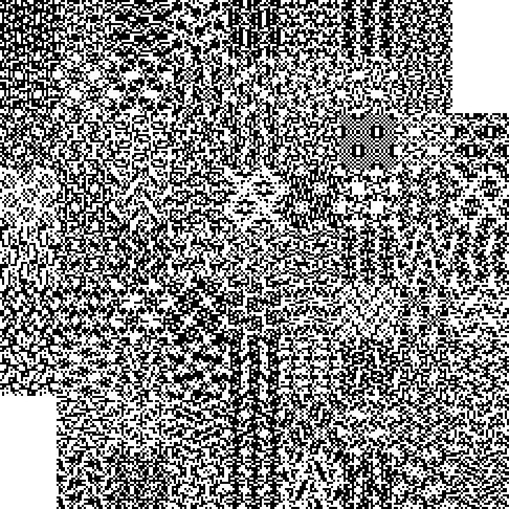

参考链接：
https://zhuanlan.zhihu.com/p/305623626

https://almostgph.github.io/2024/01/08/IrisCTF2024/


---

> 作者: [Lunatic](https://goodlunatic.github.io)  
> URL: https://goodlunatic.github.io/posts/1a285be/  

