# CTF-Misc Guide


**This is a simple Guide for CTF in Misc Area.**

&lt;!--more--&gt;

{{&lt; admonition type=success title=&#34;Misc Guide&#34; open=true &gt;}}

**最开始接触CTF时，学的最多的就是Misc，各种编码各种加密还有各种软件的使用...**

**但无奈MIsc涉及的范围实在太广了，于是就萌生了一边学习一边记录的想法，甚至还想为此写一本指南。**
{{&lt; /admonition &gt;}}

## 一些奇奇怪怪的经历：

1、一段字符串，用base64异或脚本跑，找正常的字符串

2、rockstar 编程语言，在github上面可以找到，然后在本地用pip安装库，把rock文件转换为py文件，运行即可得到flag

3、给你一个.exe安装包文件，flag藏在安装之前的一大串协议中

4、实在做不出来的时候，可以把flag的格式转其他的编码和题目中的信息比对找规律

5、给你一个gpx文件，在线网站https://www.gpsvisualizer.com/map_input解密，然后地名的首字母连起来就是flag

## CTF中的常用关键词

```python
# 要搜索的字符列表
search_items = [
    &#34;key&#34;, &#34;password&#34;, &#34;dasctf&#34;, &#34;k3y&#34;, &#34;p@ssword&#34;, &#34;passw0rd&#34;,
    &#34;p@ssw0rd&#34;, &#34;secret&#34;, &#34;s3cret&#34;, &#34;s3cr3t&#34;, &#34;s3cre4&#34;,&#34;F14ggg&#34;,
    &#34;Ic4unq1U&#34;, &#34;ISCC&#34;
    # 遇到⼀个加⼀个，CTFer的好习惯
]
```

查找的Python代码：

```python
import re

# 要搜索的字符列表
search_items = [
    b&#34;key&#34;, b&#34;password&#34;, b&#34;dasctf&#34;, b&#34;k3y&#34;, b&#34;p@ssword&#34;, b&#34;passw0rd&#34;,
    b&#34;p@ssw0rd&#34;, b&#34;secret&#34;, b&#34;s3cret&#34;, b&#34;s3cr3t&#34;, b&#34;s3cre4&#34;,b&#34;F14ggg&#34;
    # 遇到⼀个加⼀个，CTFer的好习惯
]

file_path = &#34;test.txt&#34;

with open(file_path,&#39;rb&#39;) as f:
    data = f.read()
    
for item in search_items:
    # re.escape(item) 用于转义 item 中的特殊字符, 确保它们被当作普通字符处理
    # re.IGNORECASE 标志使得匹配不区分大小写。
    regex = re.compile(re.escape(item) &#43; b&#39;.*&#39;, re.IGNORECASE)
    for match in regex.finditer(data): # finditer 返回一个迭代器，每次迭代返回一个匹配对象
        matched_text = match.group() # 返回匹配到的完整文本
        # 若匹配到，则显示前50个字节
        print(f&#34;[&#43;] Found {item.decode()} match: {matched_text[:50]}...&#34;)
```

```python
# 各种常用关键字的bash64编码
flag                          Zmxh
F14g                          RjE0
DASCTF                        REFTQ1RGe
s3cr3t                        czNjcjN0
secret                        c2VjcmV0
password                      cGFzc3dvc
PNG文件头                      iVBORw0KGgo
ZIP文件头                      UEsDBA
```


## 各种文件头/尾：

这里要注意，出题人可能会把文件头的小写字母偷偷改成大写，例如：Rar -&gt; RAR

```python
zip 文件头：50 4B 03 04 14 00 08 00
rar 文件头：52 61 72 21 (Rar!)               文件尾：C4 3D 7B 00 40 07 00
7z  文件头：37 7A BC AF 27 1C
gz 文件头：1F 8B 08 00

png 文件头：89504E47 0D0A1A0A 0000000D 49484452   文件尾：00000000 49454E44 AE426082
jpg 文件头：FF D8 FF E0 00 10 4A 46 49 46 00 01
gif 文件头：47 49 46 38 39 61（GIF89A）或 47 49 46 38 37 61（GIF87A）    文件尾：00 3B
bmp 文件头：42 4D
psd 文件头：38 42 50 53
TIFF 文件头：49 49 2A 00

mp3 文件头：49 44 33 03 00 00 00 00
wav 文件头：57 41 56 45 或 52 49 46 46
mid 文件头：4D 54 68 64
avi 文件头：41 56 49 20
mov 文件头：00 00 00 20 66 74 79 70 71 74 20 20 20 05 03 00
swf 文件头：46 57 53 08 AC 43 00 00

pyc 文件头：03 F3 0D 0A
MS-Office2003 文件头：D0 CF 11 E0
xml 文件头：3C 3F 78 6D 6C
html 文件头：68 74 6D 6C 3E
CAD (dwg)，文件头：41433130
Rich Text Format (rtf)，文件头：7B5C727466
Email [thorough only] (eml)，文件头：44656C69766572792D646174653A
Outlook Express (dbx)，文件头：CFAD12FEC5FD746F
Outlook (pst)，文件头：2142444E
MS Access (mdb)，文件头：5374616E64617264204A
WordPerfect (wpd)，文件头：FF575043
Postscript (eps.or.ps)，文件头：252150532D41646F6265
Adobe Acrobat (pdf)，文件头：255044462D312E
Quicken (qdf)，文件头：AC9EBD8F
Windows Password (pwl)，文件头：E3828596
Real Audio (ram)，文件头：2E7261FD
Real Media (rm)，文件头：2E524D46
MPEG (mpg)，文件头：000001BA 或 000001B3
Quicktime (mov)，文件头：6D6F6F76
Windows Media (asf)，文件头：3026B2758E66CF11
M4a，文件头：00000018667479704D3441
```

## 各种加密/编码：

### base家族

详细请看：https://www.cnblogs.com/0yst3r-2046/p/11962942.html

```
1、base16                       flag         666C6167
2、base32[A-Z2-7]               flag         MZWGCZY=
3、base36                       flag         727432
4、base58                       flag         3cr9Ae
5、base64                       flag         Zmxh
6、base85                       flag         Ao(mg
7、base91                       flag         @iH&lt;Z
8、base92                       flag         F#S&lt;I
9、base100                      flag         👝👣👘👞
10、base1024                    flag
11、base2048                    flag         ڥڊװ
12、base65535                   flag         ꍦ鱡
```

base64还可以换表(表中的字符要求不重复)编码，例如

```
sQ&#43;3ja02RchXLUFmNSZoYPlr8e/HVqxwfWtd7pnTADK15Evi9kGOMgbuIzyB64CJ
SjaoNgS0xgagUTpwe3QwHn4MrbkD/OUwqOQG/bpveg6Mqa4WH0k46
第一行是表，第二行是编码后的密文
cyberchef解密即可得到flag
```

Tips：base64可以与其他文件格式互相转换（比如图片[会有很多行的base64]），使用在线网站或者随波逐流转换即可
如果出现了很多层乱七八糟的base编码，连CyberChef都识别不出来的话，可以试试用BaseCrack这个开源工具
输入 python basecrack.py -m 运行即可

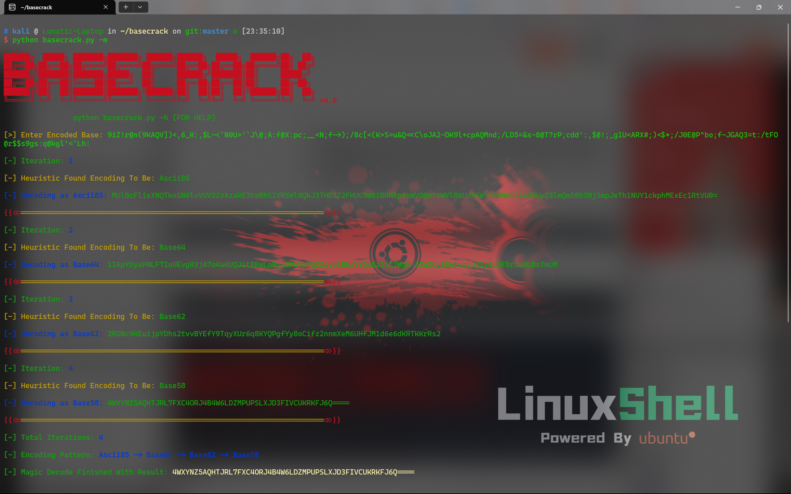

### base64隐写：

可以使用以下脚本解密
```python
# base64隐写解密脚本1
import base64
b64chars = &#39;ABCDEFGHIJKLMNOPQRSTUVWXYZabcdefghijklmnopqrstuvwxyz0123456789&#43;/&#39;
with open(&#39;stego.txt&#39;, &#39;rb&#39;) as f:
    bin_str = &#39;&#39;
    for line in f.readlines():
        stegb64 = str(line, &#34;utf-8&#34;).strip(&#34;\n&#34;)
        rowb64 = str(base64.b64encode(base64.b64decode(stegb64)), &#34;utf-8&#34;).strip(&#34;\n&#34;)
        offset = abs(b64chars.index(stegb64.replace(&#39;=&#39;, &#39;&#39;)[-1]) - b64chars.index(rowb64.replace(&#39;=&#39;, &#39;&#39;)[-1]))
        equalnum = stegb64.count(&#39;=&#39;)  # no equalnum no offset
        if equalnum:
            bin_str &#43;= bin(offset)[2:].zfill(equalnum * 2)
        print(&#39;&#39;.join([chr(int(bin_str[i:i &#43; 8], 2)) for i in range(0, len(bin_str), 8)]))  # 8 位一组
```

```python
# base64隐写解密脚本2
file = open(&#39;./base64.txt&#39;,&#39;r&#39;)
a = &#34;ABCDEFGHIJKLMNOPQRSTUVWXYZabcdefghijklmnopqrstuvwxyz0123456789&#43;/&#34;
aaa = &#39;&#39;
while True:
    text = file.readline()  # 只读取一行内容
    # 判断是否读取到内容
    text = text.replace(&#34;\n&#34;, &#34;&#34;)
    if not text:
        break
    if text.count(&#39;=&#39;) == 1:
        aaa = aaa &#43; \
            str(&#39;{:02b}&#39;.format((a.find(text[len(text)-2])) % 4))
    if text.count(&#39;=&#39;) == 2:
        aaa = aaa &#43; \
            str(&#39;{:04b}&#39;.format((a.find(text[len(text)-3])) % 16))
file.close()
t = &#34;&#34;
ttt = len(aaa)
ttt = ttt//8*8
for i in range(0,ttt,8):
    t = t &#43; chr(int( aaa[i:i&#43;8],2))
print(t)
```

或者直接使用PuzzleSolver解密

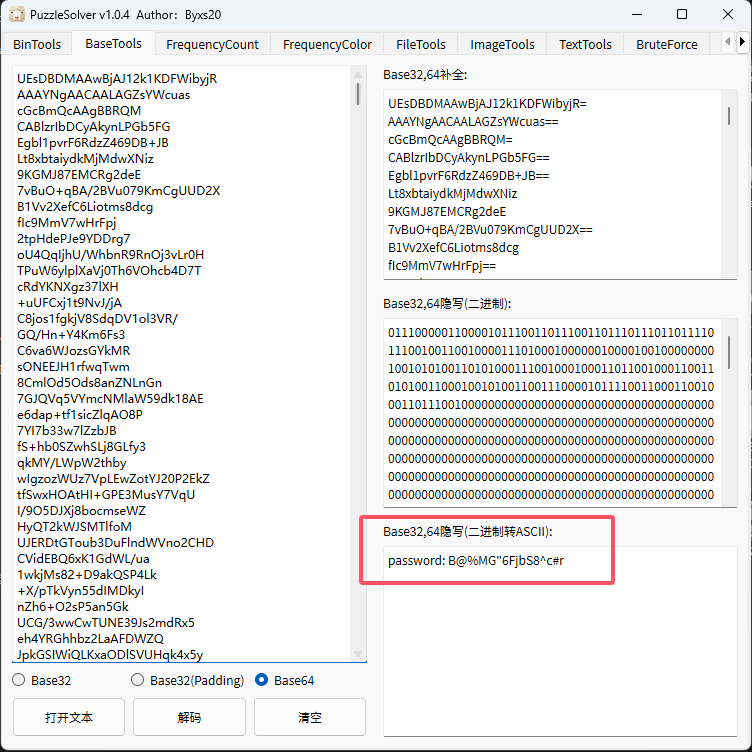

&gt; 这里要注意多行base64编码可能会出现需要我们自己补全=的情况（例题-攻防世界 MISC - tunnel）
&gt; 
&gt; 可以使用下面的脚本补全，也可以直接用上面那个工具补全

```python
import re
with open(&#39;./result.txt&#39;,&#39;r&#39;) as f:
    content = f.readlines()
    for i in content:
        result = re.findall(&#39;(.*?).evil.im&#39;,i)
        result = result[0] &#43; (4 - len(result[0])%4) * &#39;=&#39;
        with open(&#39;./base64.txt&#39;,&#39;a&#43;&#39;) as f1:
            f1.write(result&#43;&#39;\n&#39;)
```

### MD5加密

```
明文：admin
32位小写21232f297a57a5a743894a0e4a801fc3 
32位大写21232F297A57A5A743894A0E4A801FC3 
16位小写7a57a5a743894a0e 
16位大写7A57A5A743894A0E 
Tips：十六位其实就是取32位的8-24位
```

MD5 加密后的密文应该是 纯数字&#43;纯字符

有些 MD5 的 HASH 值可以直接在 somd5 或者 cmd5 上查

### python中str类型和byte类型：

```bash
\&gt;&gt;&gt; a = &#39;寒鸦小站&#39;
\&gt;&gt;&gt; type(a)
&lt;class &#39;str&#39;&gt;
\&gt;&gt;&gt; b = a.encode()
\&gt;&gt;&gt; b
b&#39;\xe5\xaf\x92\xe9\xb8\xa6\xe5\xb0\x8f\xe7\xab\x99&#39;
\&gt;&gt;&gt; type(b)
&lt;class &#39;bytes&#39;&gt;
```

### emoji-aes加密：

密文由一大串emoji表情组成，解密需要密钥，例如

已知key：th1sisKey，直接使用在线网站解密即可，在线网站源码也可以下载到本地

```
🙃💵🌿🎤🚪🌏🐎🥋🚫😆😍🔬👣🖐🌏😇🥋😇😊🍎🏹👌🌊☃🦓🌏🐅🥋🚨📮🐍🎈📮📂✅🐍⏩⌨🎈😍🌊😇🐍☺💧🥋🍌🎤🍍😇👁🦓😇🍍📮📂🎅😡🍵✖✉🏹⌨🍵🎤😆🍵🚹🏹🍎🚨ℹ☃👑🎤🚪💵😎😀😎🔬💵🦓🏹👉🦓✖😀🐘🔪⌨🎈🥋👌🍌🚹😂✉🍎🍌🏎👌🏹💵👌👁🎃🗒
```

https://aghorler.github.io/emoji-aes/

### 词频分析：

一堆文字，看着什么编码都不像的，可能是词频分析，用在线网站跑https://quipqiup.com/

### 字频分析：

用随波逐流直接分析

### 摩斯电码：

```bash
#第一种情况，只有.-或者只有01
```

```bash
#第二种情况，加入/或者空格来替换换行符
.--/./.-../-.-./---/--/./-/---/-./-.-/-.-./-/..-./--..--/-/...././.--./.-/.../.../.--/---/.-./-../../.../.----/-..../-.../-.--/-/./.../.-./.-/-./-../---/--/.-../-.--/--././-././.-./.-/-/./-../--..-
```

### vigenere(维吉尼亚)密码：

1.给了密文和Key

直接拉到cyberchef中解密即可

2.给了密文，没给密钥，但是知道目标明文的格式

先用B神的脚本爆破出Key，然后再把这个Key放到cyberchef中解密

3.根据对照表，手搓密钥的前几位

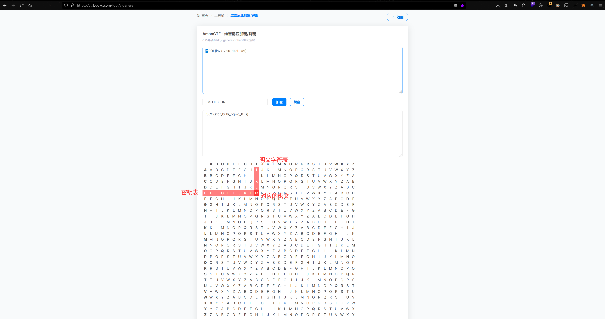
4.Python代码解密/爆破维吉尼亚加密
```python
from pycipher import Vigenere


cipher = &#34;rla xymijgpf ppsoto wq u nncwel ff tfqlgnxwzz sgnlwduzmy vcyg ib bhfbe u tnaxua ff satzmpibf vszqen eyvlatq cnzhk dk hfy mnciuzj ou s yygusfp bl dq e okcvpa hmsz vi wdimyfqqjqubzc hmpmbgxifbgi qs lciyaktb jf clntkspy drywuz wucfm&#34;

with open(&#34;keys.txt&#34;,&#34;r&#34;) as f:
    lines = f.readlines()

for line in lines:
    key = line.strip()
    res = Vigenere(key).decipher(cipher)
    if &#34;PASSWORD&#34; in res:
        print(f&#34;[&#43;] key: {key}&#34;)
        print(f&#34;[&#43;] res: {res.lower()}&#34;)
```

### 希尔密码：

解密网站:http://www.metools.info/code/hillcipher243.html

已知密文和密钥，并且密钥(key)是一个网址，如http://www.verymuch.net

已知密文和密钥，并且密钥是四个数字

```
密文：ymyvzjtxswwktetpyvpfmvcdgywktetpyvpfuedfnzdjsiujvpwktetpyvnzdjpfkjssvacdgywktetpyvnzdjqtincduedfpfkjssne
密钥：3 4 19 11
```

### Rabbit密码：

已知密文和密钥，密文有点像base64编码的(可能有&#43;号)

### 云隐密码：

特征是：密文只由01248组成

用随波逐流或者CTFD中的脚本直接跑

### 曼彻斯特与差分曼彻斯特编码:


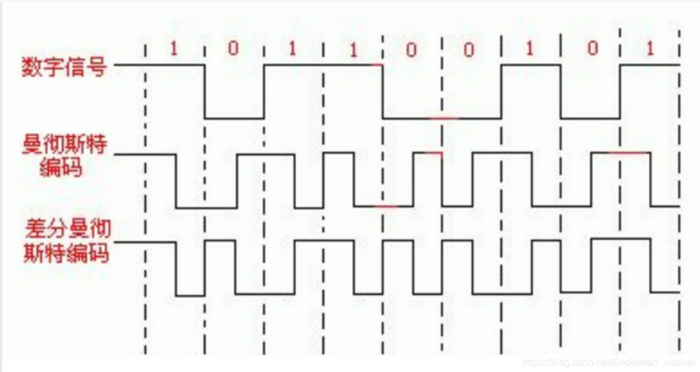

&gt; 1. 曼彻斯特码：从高到低表示 1，从低到高表示 0
&gt; 2. 差分曼彻斯特码：在每个时钟周期的起始处（虚线处）有跳变表示 0；无跳变则表示1。

可以直接使用 曼彻斯特编码 转换工具转换

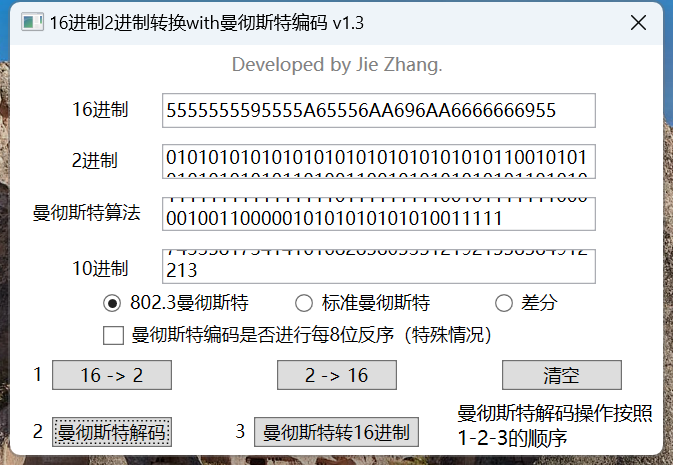

例题1 2016CISCN-传感器1

&gt; 5555555595555A65556AA696AA6666666955
&gt; 
&gt; 这是某压力传感器无线数据包解调后但未解码的报文(hex)
&gt; 
&gt; 已知其ID为0xFED31F，请继续将报文完整解码，提交hex。
&gt; 
&gt; 提示1：曼联

```python
enc = &#34;5555555595555A65556AA696AA6666666955&#34;
res = &#39;&#39;
flag = &#39;&#39;
flag_final = &#39;&#39;
for item in enc:
    # tmp = bin(int(item, 16))[2:].rjust(4, &#39;0&#39;)
    # print(tmp, end=&#39; &#39;)
    res &#43;= str(bin(int(item, 16))[2:].rjust(4, &#39;0&#39;))
# print(res)
for i in range(0, len(res), 2):
    if res[i:i&#43;2] == &#39;01&#39;:
        flag &#43;= &#39;1&#39;
    elif res[i:i&#43;2] == &#39;10&#39;:
        flag &#43;= &#39;0&#39;
# print(flag)
# 这里需要每8位进行一次反转，要不然无法得到校验ID:0xFED31F
for i in range(0, len(flag), 8):
    flag_final &#43;= hex(int(flag[i:i&#43;8][::-1], 2))[2:]

print(flag_final.upper())
# FFFFFED31F645055F9
```

例题2 2016CISCN-传感器2

&gt; 现有某ID为0xFED31F的压力传感器，已知测得  
&gt; 压力为45psi时的未解码报文为：5555555595555A65556A5A96AA666666A955  
&gt; 压力为30psi时的未解码报文为：5555555595555A65556A9AA6AA6666665665  
&gt; 请给出ID为0xFEB757的传感器在压力为25psi时的解码后报文

和上面那题的思路一样，就是最后多了一步压力位算法和校验位算法猜测

压力位算法：压力每增加5psi压力值增加11

校验位算法：校验值为从ID开始每字节相加的和模256的十六进制值即为校验值

例题3 2017CISCN-传感器1

&gt; 已知ID为0x8893CA58的温度传感器的未解码报文为：3EAAAAA56A69AA55A95995A569AA95565556  
&gt; 此时有另一个相同型号的传感器，其未解码报文为：3EAAAAA56A69AA556A965A5999596AA95656  
&gt; 请解出其ID，提交flag{不含0x的hex值}

开头的3E提示了差分曼彻斯特编码，就是根据上图中的跳变位置解码

```python
# enc = &#34;3EAAAAA56A69AA55A95995A569AA95565556&#34;
enc = &#34;3EAAAAA56A69AA556A965A5999596AA95656&#34;
res = &#39;&#39;
flag = &#39;&#39;
flag_final = &#39;&#39;
for item in enc:
    # tmp = bin(int(item, 16))[2:].rjust(4, &#39;0&#39;)
    # print(tmp, end=&#39; &#39;)
    res &#43;= str(bin(int(item, 16))[2:].rjust(4, &#39;0&#39;))
print(res)
for i in range(8, len(res), 2):
    if res[i:i&#43;2][0] != res[i-1]:
        flag &#43;= &#39;0&#39;
    else:
        flag &#43;= &#39;1&#39;
print(hex(int(flag, 2))[2:].upper())
# 24D8845ABF34119
# 8845ABF3
```

例题4 2017CISCN-传感器2

&gt; 已知ID为0x8893CA58的温度传感器未解码报文为：3EAAAAA56A69AA55A95995A569AA95565556  
&gt; 为伪造该类型传感器的报文ID（其他报文内容不变），请给出ID为0xDEADBEEF的传感器1的报文校验位（解码后hex）
&gt; 
&gt; 以及ID为0xBAADA555的传感器2的报文校验位（解码后hex），并组合作为flag提交。  
&gt; 例如，若传感器1的校验位为0x123456，传感器2的校验位为0xABCDEF，则flag为flag{123456ABCDEF}。

解码步骤和上题一样，就是多考察了一个校验位算法（CRC8）

在最后的结果前面补一个0，然后再计算 CRC8 即可

### 社会主义核心价值观密码：

解密网址：http://www.hiencode.com/cvencode.html

公正民主公正文明公正和谐：abc

### outguess解密图片：

在kali中下载outguess：outguess -k &#39;abc&#39; -r mmm.jpg -t flag.txt 

outguess -k &#39;key&#39; -r 加密后的图片.jpg -t 明文.txt 

### 盲文：

使用https://www.qqxiuzi.cn/bianma/wenbenjiami.php?s=mangwen在线翻译

### 文本加密为音乐符号：

Tips：这里要注意，加密的密文一定是以=结尾的，有时候需要自己把=加上

eg：♭♯♪‖¶♬♭♭♪♭‖‖♭♭♬‖♫♪‖♩♬‖♬♬♭♭♫‖♩♫‖♬♪♭♭♭‖¶∮‖‖‖‖♩♬‖♬♪‖♩♫♭♭♭♭♭§‖♩♩♭♭♫♭♭♭‖♬♭‖¶§♭♭♯‖♫∮‖♬¶‖¶∮‖♬♫‖♫♬‖♫♫§=

直接用在线网站解密：https://www.qqxiuzi.cn/bianma/wenbenjiami.php?s=yinyue

敲击码：

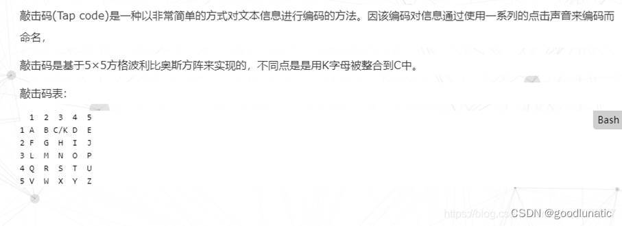

..... ../... ./... ./... ../ 
5,2   3,1  3,1  3,2 
W    L   L   M

### Polybius密码(详见CTFwiki)

类似于11，22，11，24这样的

去逗号改成空格，拉入随波逐流直接解密

### DES加密算法

例子：
```
密文：AK5O3BaZi&#43;p1ci0JxythDZWToTXkFj4dexQ3cOAmYfUwtUVyJahFOcNroC8nAsHyCnmiuOOpJYyOWBV5npW3pg==
密钥：hristina
```

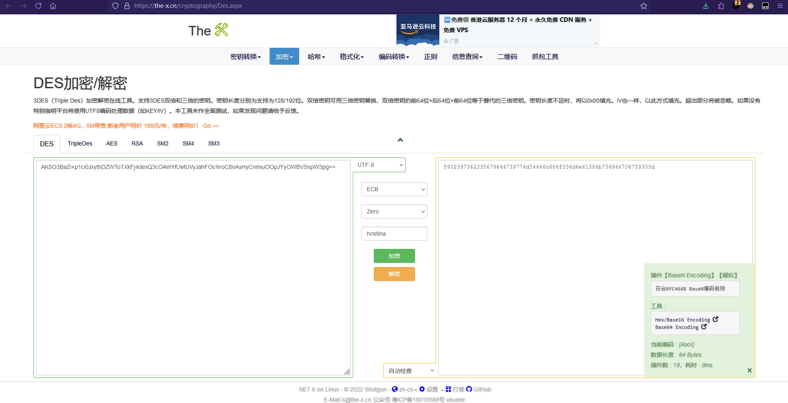

### AES加密算法

在线网站解密：
1. https://tool.lmeee.com/jiami/aes
2. https://www.sojson.com/encrypt_aes.html

#### AES-ECB(不需要IV)

CyberChef解密AES-ECB时需要将IV设置为`\x00\x00\x00\x00\x00\x00\x00\x00\x00\x00\x00\x00\x00\x00\x00\x00`

如果 `key` 不足16字节可以尝试在后面补0

#### AES-CBC(需要填写IV)

&gt; Tips: CBC模式下key的长度必须是16bytes的整数倍，但是IV不一定

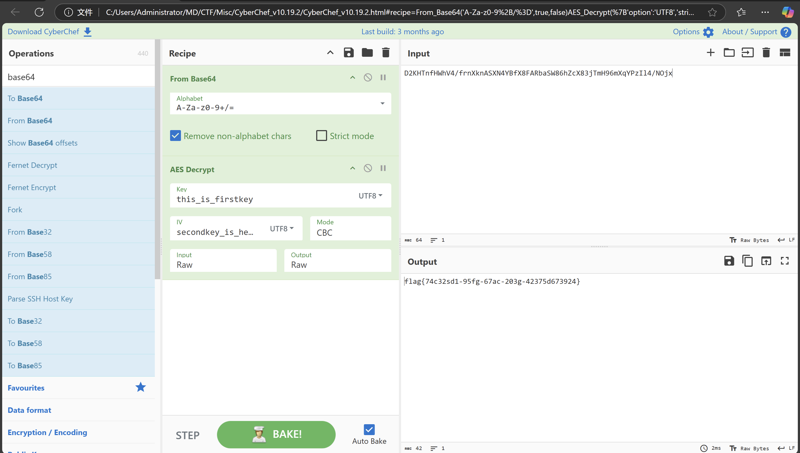

密钥不足16字节时需要padding补齐16字节

可以使用能自动补齐的在线网站解密 https://www.sojson.com/encrypt_aes.html

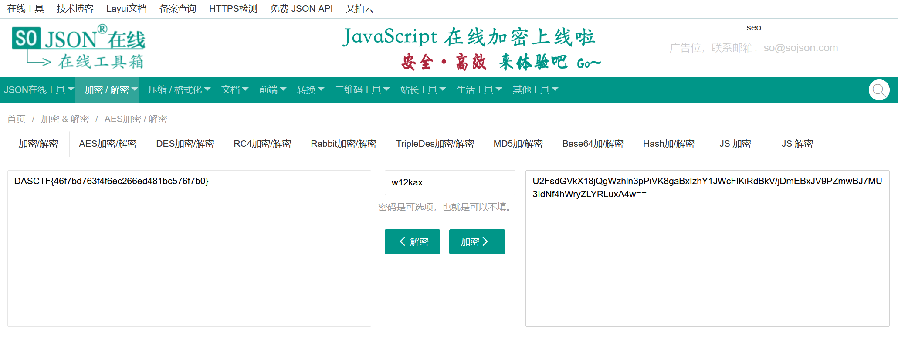

可以将密文和key拉入`CaptfEncoder-win-x64-1.3.0`解密

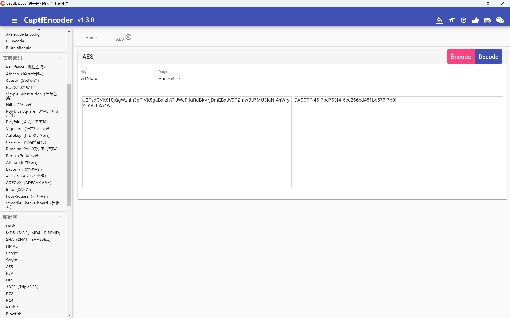

### 使用openssl进行加解密
```bash
# 加密
tar -czvf - flag | openssl des3 -salt -k th1sisKey -out ./flag.tar.gz
# 解密
openssl des3 -d -salt -k th1sisKey -in ./flag.tar.gz -out decrypted_file
```

### 埃特巴什码(Atbash)

类似于：(&#43;w)v&amp;LdG_FhgKhdFfhgahJfKcgcKdc_eeIJ_gFN

拉入厨子直接解密

```
flag{ ==&gt; Atbash加密 ==&gt; UOZT{
```

### DNA编码

```
AATTCAACAACATGCTGC
```

1、使用CTFD中的DNAcode脚本解密

https://github.com/omemishra/DNA-Genetic-Python-Scripts-CTF

2、网上找的脚本（红明谷杯2023——hacker）

```python
table = &#39;ACGT&#39;
dic = {&#39;AAA&#39;: &#39;a&#39;, &#39;AAC&#39;: &#39;b&#39;, &#39;AAG&#39;: &#39;c&#39;,
       &#39;AAT&#39;: &#39;d&#39;, &#39;ACA&#39;: &#39;e&#39;, &#39;ACC&#39;: &#39;f&#39;, &#39;ACG&#39;: &#39;g&#39;, &#39;ACT&#39;: &#39;h&#39;, &#39;AGA&#39;: &#39;i&#39;, &#39;AGC&#39;: &#39;j&#39;, &#39;AGG&#39;: &#39;k&#39;, &#39;AGT&#39;: &#39;l&#39;, &#39;ATA&#39;: &#39;m&#39;, &#39;ATC&#39;: &#39;n&#39;, &#39;ATG&#39;: &#39;o&#39;, &#39;ATT&#39;: &#39;p&#39;, &#39;CAA&#39;: &#39;q&#39;, &#39;CAC&#39;: &#39;r&#39;, &#39;CAG&#39;: &#39;s&#39;, &#39;CAT&#39;: &#39;t&#39;, &#39;CCA&#39;: &#39;u&#39;, &#39;CCC&#39;: &#39;v&#39;, &#39;CCG&#39;: &#39;w&#39;, &#39;CCT&#39;: &#39;x&#39;, &#39;CGA&#39;: &#39;y&#39;, &#39;CGC&#39;: &#39;z&#39;, &#39;CGG&#39;: &#39;A&#39;, &#39;CGT&#39;: &#39;B&#39;, &#39;CTA&#39;: &#39;C&#39;, &#39;CTC&#39;: &#39;D&#39;, &#39;CTG&#39;: &#39;E&#39;, &#39;CTT&#39;: &#39;F&#39;, &#39;GAA&#39;: &#39;G&#39;, &#39;GAC&#39;: &#39;H&#39;, &#39;GAG&#39;: &#39;I&#39;, &#39;GAT&#39;: &#39;J&#39;, &#39;GCA&#39;: &#39;K&#39;, &#39;GCC&#39;: &#39;L&#39;, &#39;GCG&#39;: &#39;M&#39;, &#39;GCT&#39;: &#39;N&#39;, &#39;GGA&#39;: &#39;O&#39;, &#39;GGC&#39;: &#39;P&#39;, &#39;GGG&#39;: &#39;Q&#39;, &#39;GGT&#39;: &#39;R&#39;, &#39;GTA&#39;: &#39;S&#39;, &#39;GTC&#39;: &#39;T&#39;, &#39;GTG&#39;: &#39;U&#39;, &#39;GTT&#39;: &#39;V&#39;, &#39;TAA&#39;: &#39;W&#39;, &#39;TAC&#39;: &#39;X&#39;, &#39;TAG&#39;: &#39;Y&#39;, &#39;TAT&#39;: &#39;Z&#39;, &#39;TCA&#39;: &#39;1&#39;, &#39;TCC&#39;: &#39;2&#39;, &#39;TCG&#39;: &#39;3&#39;, &#39;TCT&#39;: &#39;4&#39;, &#39;TGA&#39;: &#39;5&#39;, &#39;TGC&#39;: &#39;6&#39;, &#39;TGG&#39;: &#39;7&#39;, &#39;TGT&#39;: &#39;8&#39;, &#39;TTA&#39;: &#39;9&#39;, &#39;TTC&#39;: &#39;0&#39;, &#39;TTG&#39;: &#39; &#39;}
cipher = &#39;TCATCAACAAAT&#39;
plain = &#39;&#39;
for i in range(0, len(cipher), 3):
    plain &#43;= dic[cipher[i:i&#43;3]]
print(plain)
```

3、使用在线网站解密（例题-BUGKU-粉色的猫）

DNA编码在线解密：https://earthsciweb.org/js/bio/dna-writer/

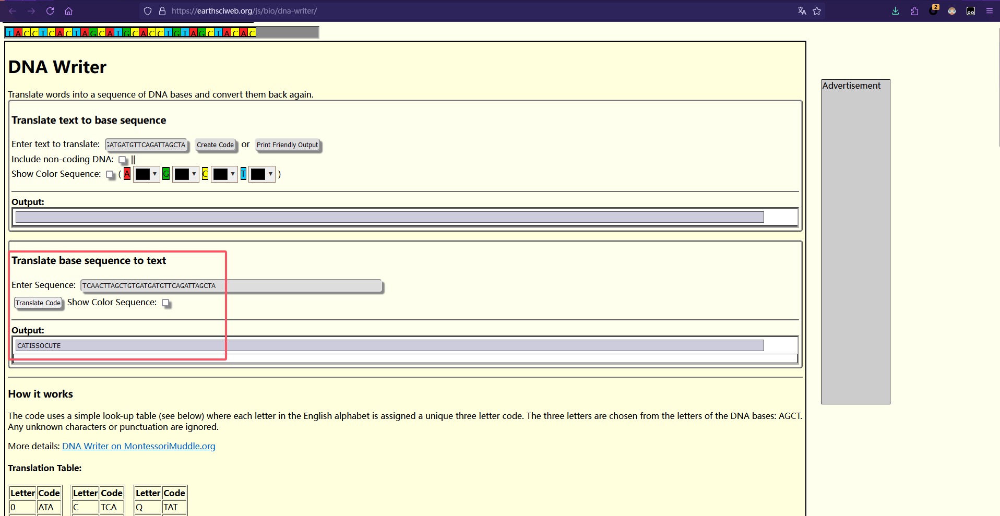

### 金笛短信PDU编码

直接使用在线网站解码：http://www.sendsms.cn/pdu/ （特别注意：需要一行一行地解码）

形如下面这串数字

```
0001000D91683106019196F4000872003800390035003000340045003400370030004400300041003100410030004100300030003000300030003000300044003400390034003800340034003500320030003000300030003000300034003700300030003000300030003000300038003000380030003200300030003000300030
0001000D91683106019196F4000872003000320034004400430037003500460031003000300030003000300030004200430034003900340034003400310035003400370038003500450044004400390032003400310031003200380035003300300030003800340033004200390031003900460037003300460031003500390046
0001000D91683106019196F400087000380034004600410038003700310032003100370036004500370034003500310032003600450033004400340041003600320044003700390035003500420033003800380032003100310037003900390042004200320045004100420039003500410036004200330042004200450037
0001000D91683106019196F400086E0042003600300039003900330045004500360033004600320036004600440044003100420043004400410042003300300033003300310046004500350045003600440039003300370035004200300036003500360036004100320031003000410033004100420037003100440038
0001000D91683106019196F400087000450033004400370032003100300031004400420034003900310036003900360038003000310033003200340046003800450046003200380034004500420033003500430030004600420036003400450046003100300030004100310042004100300043003200300044004400450042
0001000D91683106019196F400086E0038003400410032004200440038004200350038004200330039004500410043003600450030004100420031003000380044003600440036004600340034004300460044003800310044003000330042003600390034004200430039003400430032003300310033004400340046
0001000D91683106019196F400087000360038003900390031003600440036003200360041003700390035003800460035004300440039003500390042004500320038004300340034003300410045003700360043003100300035003800380030003200380035003900320039003600310042004600430044003400300044
0001000D91683106019196F4000872003100350037004600310033003400310033003800390043004600410042003600410045003500460032003300300038003700370035004500380031004500420032003000330030004300300035003000340037003500310044003900460041003400450045004600320032004600440030
0001000D91683106019196F400085200300037004400450044003500420036003800410033003100350046004400310031003000300030003000300030003000300034003900340035003400450034003400410045003400320036003000380032
```

一行一行解码后可以得到

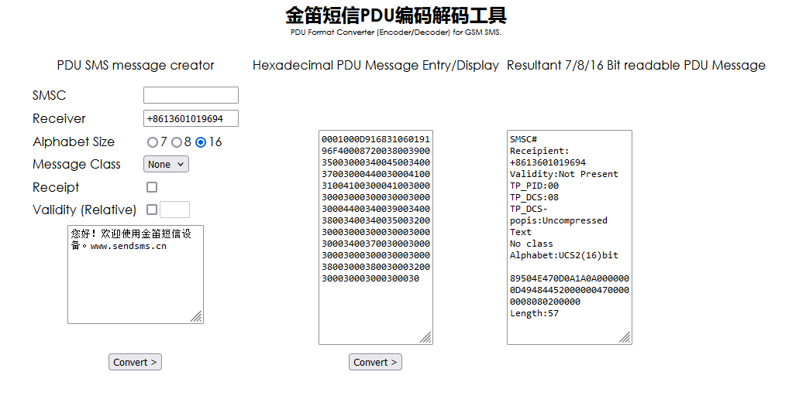

```
89504E470D0A1A0A0000000D494844520000004700000008080200000024DC75F1000000BC49444154785EDD92411285300843B919F73F159F84FA8712176E745126E3D4A62D7955B388211799BB2EAB95A6B3BBE7B60993EE63F26FDD1BCDAB30331FE5E6D9375B06566A210A3AB71D8E3D72101DB491696801324F8EF284EB35C0FB64EF100A1BA0C20DDEB84A2BD8B58B39EAC6E0AB108D6D6F44CFD81D03B694BC94C2313D4F689916D626A7958F5CD959BE28C443AE76C10588028592961BFCD40D157F1341389CFAB6AE5F2308775E81EB2030C0504751D9FA4EEF22FD007DED5B68A315FD110000000049454E44AE426082
```

例题-BUGKU-粉色的猫

### Text Encoding Brute Force

如果赛博厨子转完两次Hex后依然是乱码，可以用Text Encoding Brute Force爆破试试看

例子：红明谷杯2023——阿尼亚

### Decabit编码

正常的 Decabit编码 是十个字符一组的，如果不是十个一组，就很可能不是 Decabit编码

&#43;-&#43;-&#43;&#43;--&#43;- &#43;&#43;---&#43;-&#43;&#43;- -&#43;--&#43;&#43;-&#43;&#43;- &#43;--&#43;&#43;-&#43;&#43;-- --&#43;&#43;&#43;&#43;&#43;--- &#43;&#43;-&#43;&#43;---&#43;- &#43;&#43;&#43;-&#43;-&#43;--- &#43;-&#43;-&#43;---&#43;&#43; ---&#43;&#43;&#43;-&#43;&#43;- -&#43;--&#43;&#43;-&#43;&#43;- -&#43;--&#43;&#43;&#43;-&#43;- -&#43;--&#43;&#43;-&#43;&#43;- -&#43;--&#43;&#43;-&#43;&#43;- &#43;&#43;-&#43;-&#43;-&#43;-- -&#43;--&#43;&#43;&#43;-&#43;- &#43;&#43;-&#43;&#43;---&#43;- -&#43;&#43;&#43;&#43;---&#43;- -&#43;--&#43;&#43;-&#43;&#43;- &#43;&#43;-&#43;-&#43;-&#43;-- &#43;-&#43;&#43;&#43;---&#43;- &#43;&#43;&#43;-&#43;&#43;---- ---&#43;&#43;&#43;-&#43;&#43;- &#43;-&#43;-&#43;---&#43;&#43; &#43;&#43;-&#43;-&#43;-&#43;-- &#43;-&#43;-&#43;--&#43;&#43;- &#43;&#43;--&#43;--&#43;&#43;- -&#43;&#43;&#43;&#43;---&#43;- &#43;---&#43;&#43;&#43;-&#43;- &#43;&#43;-&#43;-&#43;-&#43;-- -&#43;&#43;&#43;&#43;---&#43;- -&#43;--&#43;&#43;&#43;-&#43;- &#43;--&#43;-&#43;-&#43;&#43;- &#43;&#43;&#43;-&#43;-&#43;--- &#43;-&#43;&#43;&#43;---&#43;- -&#43;--&#43;-&#43;&#43;&#43;- -&#43;--&#43;&#43;-&#43;&#43;- ---&#43;&#43;&#43;-&#43;&#43;- &#43;&#43;&#43;&#43;----&#43;- -&#43;&#43;&#43;&#43;---&#43;- -&#43;--&#43;&#43;&#43;-&#43;- -&#43;--&#43;&#43;-&#43;&#43;- ----&#43;&#43;&#43;&#43;&#43;-

直接使用 [在线网站](https://www.dcode.fr/decabit-code) 解密即可

如果不是Decabit编码，可以试试看把&#43;-分别用01替换 [2023 楚慧杯-Easy_zip]

### 仿射密码

有两个key，key-a为必须是(1,3,5,7,9,11,15,17,19,21,23,25)中的一个,key-b是0~25的数字

可以使用在线网站[CTF在线工具-在线仿射密码加密|在线仿射密码解密|仿射密码算法|Affine Cipher (hiencode.com)](http://www.hiencode.com/affine.html)或者随波逐流解密

```
gezx{j13p5oznp_1t_z_900y_k3z771h_k001}
key-a=17	key-b=77
flag{w13e5hake_1s_a_900d_t3a771c_t001}
```

### BrainFuck编码

可以直接使用在线网站解码，但是flag可能会藏在内存中然后被删去导致无法输出flag，因此可以用下面这个代码输出之前放在内存中的flag

```c
#define  _CRT_SECURE_NO_WARNINGS
#include &lt;stdio.h&gt;
#include &lt;stdlib.h&gt;
char s[30000]={0};
char code[2000];
int len = 0;
int stack[10000];
int stack_len=0;
int main()
{
    char c;
    int i=0,j,k,x=0;
    FILE* f;
    char* p=s&#43;10000;
    f=fopen(&#34;./bf.txt&#34;,&#34;r&#34;);
    while(fread(&amp;code[len],1,1,f)==1)
	{
        len&#43;&#43;;
    }
    setbuf(stdout,NULL);
    while(i&lt;len) {
        switch(code[i]) {
            case &#39;&#43;&#39;:
                (*p)&#43;&#43;;
                break;
            case &#39;-&#39;:
                (*p)--;
                break;
            case &#39;&gt;&#39;:
                p&#43;&#43;;
                break;
            case &#39;&lt;&#39;:
                p--;
                break;
            case &#39;.&#39;:
                putchar((int)(*p));
                break;
            case &#39;,&#39;:
                *p=getchar();
                break;
            case &#39;[&#39;:
                if(*p) {
                    stack[stack_len&#43;&#43;]=i;
                } else {
                    for(k=i,j=0;k&lt;len;k&#43;&#43;) {
                        code[k]==&#39;[&#39;&amp;&amp;j&#43;&#43;;
                        code[k]==&#39;]&#39;&amp;&amp;j--;
                        if(j==0)break;
                    }
                    if(j==0)
                        i=k;
                    else {
                        fprintf(stderr,&#34;%s:%dn&#34;,__FILE__,__LINE__);
                        return 3;
                    }
                }
                break;
            case &#39;]&#39;:
                i=stack[stack_len-- - 1]-1;
                break;
            default:
                break;
        }
        i&#43;&#43;;
        x&#43;&#43;;
    }
    for(int i = 0; i &lt; stack_len; i&#43;&#43;) {
		printf(&#34;%c&#34;, stack[i]);
	}
    printf(&#34;\n&#34;);
    for(int i = 0; i &lt; 30000; i&#43;&#43;) {
		printf(&#34;%c&#34;, s[i]);
	}
    return 0;
}
```

### Gronsfeld密码

可以直接使用这个在线网站解密&amp;爆破：https://www.boxentriq.com/code-breaking/gronsfeld-cipher

```python
# 解密脚本
from pycipher import Gronsfeld

cipher = &#39;TGLBOMSJNSRAJAZDEZXGHSJNZWHG&#39;
key = [1,50,61,8,9,20,63,41]
secret = Gronsfeld(key).decipher(cipher)

print(secret)
```

### UUencode编码

看起来有点像base85，直接使用在线网站解密即可

```
=8S4U,3DR8SDY,C`S-F5F-C(S,S&lt;R-C`Q9F8S87T`
# c55192c992036ef623372601ff3a}
```

### AAencode编码

### XXencode编码

随波逐流直接解密即可 [2023 浙江省赛决赛]

### 无字天书(whitespace)或者snow隐写

一个文件打开都是空白字符

可以使用在线网站解密：https://vii5ard.github.io/whitespace/ 复制进去直接run即可

snow隐写，到snowdos32工具目录下运行 SNOW.EXE -C -p password flag.txt 命令即可

### 零宽字符隐写

这个建议直接用B神的 PuzzleSolver 一把梭了


### 中文电报（中文电码）

类似于下面这种四位数一组的编码，直接在线网站解码即可

5337 5337 2448 2448 0001 2448 0001 2161 1721 1869 6671 0008 3296 4430 0001 3945 0260 3945 1869 4574 5337 0344 2448 0037 5337 5337 0260 0668 5337 6671 0008 3296 1869 6671 0008 3296 1869 2161 1721 

### Quote-Printable编码

类似于下面这样的编码，直接使用 [在线网站](https://try8.cn/tool/code/qp) 解密即可

flag{ichunqiu_=E6=8A=80=E6=9C=AF=E6=9C=89=E6=B8=A9=E5=BA=A6}

flag{ichunqiu_技术有温度}

### Unicode编码

这个编码有很多种格式，比如`&#43;U、\u、\x、&amp;#`啥的

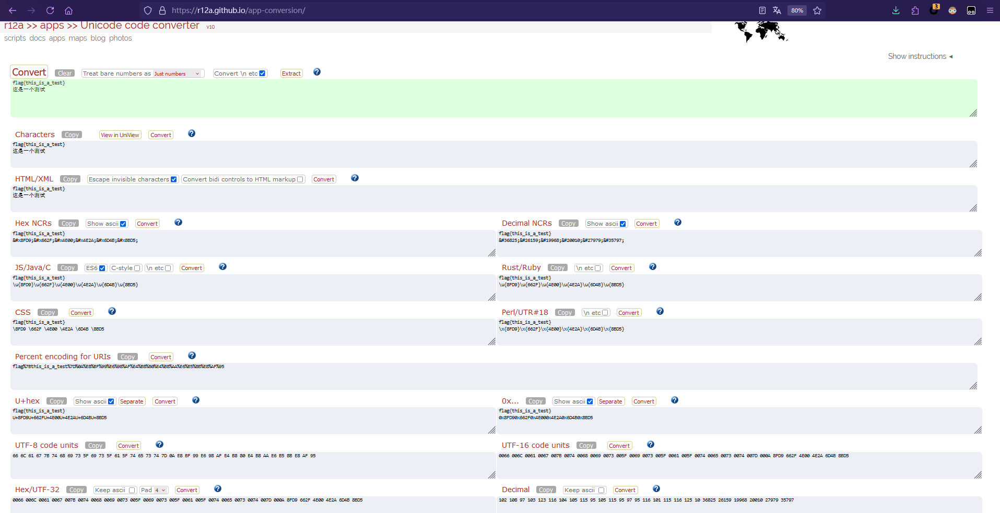

可以使用这个在线网站解码：https://r12a.github.io/app-conversion/

### 中文ascii码

```
27880 30693 25915 21892 38450 23454 39564 23460 21457 36865 112 108 98 99 116 102 33719 21462 21069 27573 102 108 97 103 20851 27880 79 110 101 45 70 111 120 23433 20840 22242 38431 22238 22797 112 108 98 99 116 102 33719 21462 21518 27573 102 108 97 103
```

加上&amp;#和分号，直接 CyberChef 或者 [在线网站](https://www.xuhuhu.com/beautify/ascii/) 解密即可

```
&amp;#27880;&amp;#30693;&amp;#25915;&amp;#21892;&amp;#38450;&amp;#23454;&amp;#39564;&amp;#23460;&amp;#21457;&amp;#36865;&amp;#112;&amp;#108;&amp;#98;&amp;#99;&amp;#116;&amp;#102;&amp;#33719;&amp;#21462;&amp;#21069;&amp;#27573;&amp;#102;&amp;#108;&amp;#97;&amp;#103;&amp;#20851;&amp;#27880;&amp;#79;&amp;#110;&amp;#101;&amp;#45;&amp;#70;&amp;#111;&amp;#120;&amp;#23433;&amp;#20840;&amp;#22242;&amp;#38431;&amp;#22238;&amp;#22797;&amp;#112;&amp;#108;&amp;#98;&amp;#99;&amp;#116;&amp;#102;&amp;#33719;&amp;#21462;&amp;#21518;&amp;#27573;&amp;#102;&amp;#108;&amp;#97;&amp;#103;
```

### 培根密码

由 a、b 或者 A、B 或者 0、1 组成的密文，密文中只有两种字符，可以直接使用 随波逐流 解密

Tips：CyberChef 的培根密码解密可能会有点问题，这里建议用随波逐流解密

### 锟斤拷

这个东西的成因是  Unicode 的替换字符（Replacement Character，�）于 UTF-8 编码下的结果 EF BF BD 重复，在 GBK 编码中被解释为汉字 “锟斤拷”（EF BF BD EF BF BD）

```python
import os

a = input(&#39;请选择你的功能（1、加密 2、解密）：&#39;)
if a == &#34;1&#34;:
    s = input(&#39;请输入你要加密的话：&#39;)
    utf = s.encode(&#39;utf&#39;)
    gbk = s.encode(&#39;utf&#39;).decode(&#39;gbk&#39;, errors=&#39;ignore&#39;)
    if len(s)%2 == 1:
        gbk = gbk &#43; &#34;�&#34;
    print(gbk)
    os.system(&#34;pause&#34;)
if a == &#34;2&#34;:
    s = input(&#39;请输入你要解密的话：&#39;)
    gbk = s.encode(&#39;gbk&#39;)
    utf = s.encode(&#39;gbk&#39;).decode(&#39;utf-8&#39;, errors=&#39;ignore&#39;)
    print(utf)
    os.system(&#34;pause&#34;)
```

### 电脑键盘坐标密码

```
  1 2 3 4 5 6 7 8 9 0
1 Q W E R T Y U I O P
2 A S D F G H J K L
3 Z X C V B N M
```

例题-i春秋-misc3

```
flag{11 21 31 18 27 33 34}
flag{QAZIJCV}
```

### 电脑键盘QWE加密


```
密文：tewatnolzsarffuykjydyayd
明文：ecbkeyistlkdnngfrqfmfkfm
```

### 手机九宫格键盘密码
#### 第一种手机键盘密码

参考链接：[https://blog.csdn.net/qq_55011640/article/details/123626280](https://blog.csdn.net/qq_55011640/article/details/123626280)

对照表如下：

| 密码  | 明文  | 密码  | 明文  |
| :-: | :-: | :-: | :-: |
| 11  |  :  | 61  |  m  |
| 12  | \_  | 62  |  n  |
| 13  |  -  | 63  |  o  |
| 21  |  a  | 71  |  p  |
| 22  |  b  | 72  |  q  |
| 23  |  c  | 73  |  r  |
| 31  |  d  | 74  |  s  |
| 32  |  e  | 81  |  t  |
| 33  |  f  | 82  |  u  |
| 41  |  g  | 83  |  v  |
| 42  |  h  | 91  |  w  |
| 43  |  i  | 92  |  x  |
| 51  |  j  | 93  |  y  |
| 52  |  k  | 94  |  z  |
| 53  |  l  |     |     |

下面举个栗子就理解了：
82  73  42  31  22  31  33  41  32
U     R    H   D    B     D   F    G    E

#### 第二种键盘密码

仔细看看就会发现其实和上面那种是一样的，就是这种情况下是用数字出现的次数表示方格中的位置

| 密码  | 明文  |  密码  | 明文  |
| :-: | :-: | :--: | :-: |
| 111 |  :  | 666  |  m  |
| 11  | \_  |  66  |  n  |
|  1  |  -  |  6   |  o  |
| 222 |  a  | 7777 |  p  |
| 22  |  b  | 777  |  q  |
|  2  |  c  |  77  |  r  |
| 333 |  d  |  7   |  s  |
| 33  |  e  | 888  |  t  |
|  3  |  f  |  88  |  u  |
| 444 |  g  |  8   |  v  |
| 44  |  h  | 9999 |  w  |
|  4  |  i  | 999  |  x  |
| 555 |  j  |  99  |  y  |
| 55  |  k  |  9   |  z  |
|  5  |  l  |      |     |

### 不同键盘布局的编码

#### Qwerty


#### Qwertz

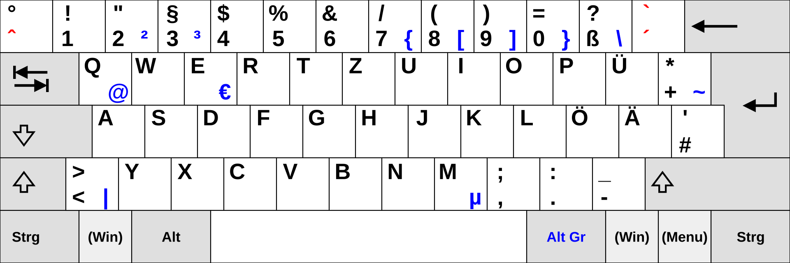

#### Azerty

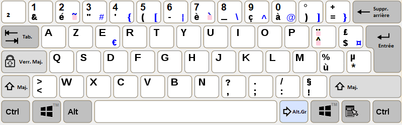

#### Dvorak(德沃夏克键盘)

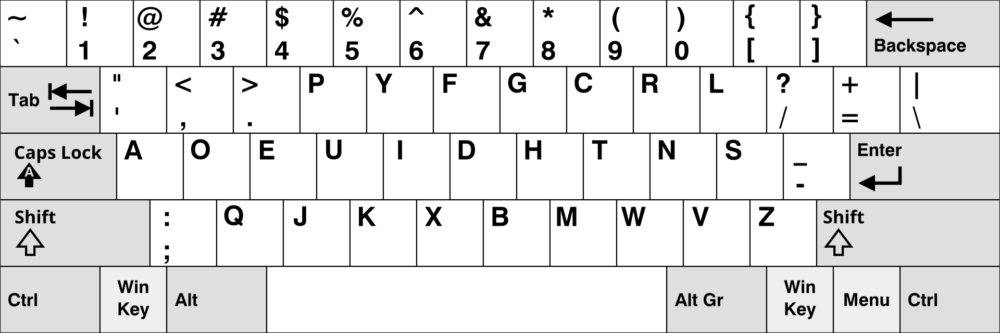


#### Colemak


例题-2023台州市赛初赛 Black Mamba

### 棋盘密码((ADFGVX,ADFGX,Polybius)

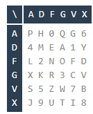

直接使用CaptfEncoder或者随波逐流等工具输入密文和密钥解密即可
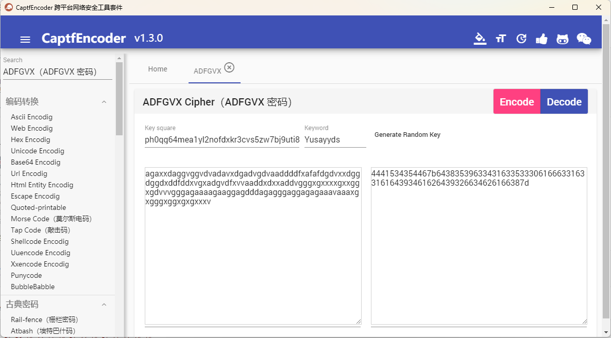

ADFGVX密码 默认棋盘：ph0qg64mea1yl2nofdxkr3cvs5zw7bj9uti8 默认密钥：german
ADFGX密码 默认棋盘：phqgmeaynofdxkrcvszwbutil 默认密钥：german
波利比奥斯方阵密码 密钥：随机 默认密文字符：ABCDE

### 福尔摩斯密码

```
·-· ·-· ·-· ·-· ·-· ·-· ·
```

直接网上查找福尔摩斯密码对照表即可
 flag{RRRRRRE}

### 利用编程代码画图

1. LOGO编程语言【例题-\[RCTF2019\]draw 】
	在线编译器：https://www.calormen.com/jslogo/
2. CFRS编程语言【例题-2024宁波市赛初赛 Misc2】
	在线画图网站：https://susam.net/cfrs.html

### 通过拼音和声调进行编码

例题-惠州学院红帽协会CTF招新赛-Crypto-xuanxue

```
哷哸哹哻哼哽咤娻屇庎忈咤煈炼呶呵呷呸
```

```python
import pypinyin
from pypinyin import pinyin, lazy_pinyin


# 利用拼音库将每个汉字的拼音的字母转成ascii码相加,然后再与音调相加,最后取余128得到最后的字母
def decrypt(s):
    result = 0
    pin = lazy_pinyin(s)[0]
    k = pinyin(s, style=pypinyin.Style.TONE3, heteronym=True)[0][0]
    for i in pin:
        result &#43;= ord(i)
    result &#43;= ord(k[len(k) - 1])
    return chr(result % 128)


if __name__ == &#39;__main__&#39;:
    r = &#39;&#39;
    s = &#34;哷哸哹哻哼哽咤娻屇庎忈咤煈炼呶呵呷呸&#34;
    for i in s:
        r &#43;= decrypt(i)
    print(r)
```

### 当铺密码

&gt; 当铺密码就是一种将中文和数字进行转化的密码：
&gt; 
&gt; 当前汉字有多少笔画出头，就是转化成数字几

```
王夫 井工 夫口 由中人 井中 夫夫 由中大
67   84   70   123   82   77   125
```

### 简/繁体汉字笔画编码

```python
table = {&#34;许&#34;:11,&#34;史&#34;:5,&#34;李&#34;:7,&#34;赵&#34;:9,&#34;周&#34;:8,&#34;秦&#34;:10,&#34;吕&#34;:6,&#34;乙&#34;:1,&#34;王&#34;:4,&#34;丁&#34;:2,&#34;温&#34;:12,&#34;万&#34;:3}
text = &#34;李李 王周 史乙 吕李 史丁 周王 温万 吕李 秦王 秦史 李周 秦乙 许史 秦乙 赵史 赵赵 许李 秦周 许吕 许李 许王 秦乙 赵史 秦史 许史 赵史 许周 赵李 许史 许吕 赵史 赵李 李周 吕周 赵史 许丁 许王 许乙 秦丁 许乙 许李 李周 吕周 温史&#34;.split()

tmp = &#34;&#34;
for item in text:
    for char in item:
        tmp &#43;= str(table[char])
    tmp &#43;= &#39; &#39;
tmp = tmp.split()

for item in tmp:
    print(chr(int(item)),end=&#34;&#34;)
    
# M03C4T{ChiNese_culture_is_vast_aND_profouND}
```

### PGP词汇表加密
密文格式大致如下:

例题1
&gt; endow gremlin indulge bison flatfoot fallout goldfish bison hockey fracture fracture bison goggles jawbone bison flatfoot gremlin glucose glucose fracture flatfoot indoors gazelle gremlin goldfish bison guidance indulge keyboard keyboard glucose fracture hockey bison gazelle goldfish bison cement frighten gazelle goldfish indoors buzzard highchair fallout highchair bison fallout goldfish flytrap bison fallout goldfish gremlin indoors frighten fracture highchair bison cement fracture goldfish flatfoot gremlin flytrap fracture buzzard guidance goldfish freedom buzzard allow crowfoot jawbone bison indoors frighten fracture bison involve fallout jawbone Burbank indoors frighten fracture bison guidance gazelle flatfoot indoors indulge highchair fracture bison hockey frighten gremlin indulge flytrap bison flagpole fracture bison indulge hockey fracture flytrap bison allow blockade endow indulge hockey fallout blockade bison gazelle hockey bison inverse fracture highchair jawbone bison gazelle goggles guidance gremlin highchair indoors fallout goldfish indoors bison gazelle goldfish bison indoors frighten gazelle hockey bison flatfoot frighten fallout glucose glucose fracture goldfish freedom fracture blackjack blackjack

例题2-2024国城杯-Tr4ffIc_w1th_Ste90

&gt; I randomly found a word list to encrypt the flag. I only remember that Wikipedia said this word list is similar to the NATO phonetic alphabet.
&gt; 
&gt; crumpled chairlift freedom chisel island dashboard crucial kickoff crucial chairlift drifter classroom highchair cranky clamshell edict drainage fallout clamshell chatter chairlift goldfish chopper eyetooth endow chairlift edict eyetooth deadbolt fallout egghead chisel eyetooth cranky crucial deadbolt chatter chisel egghead chisel crumpled eyetooth clamshell deadbolt chatter chopper eyetooth classroom chairlift fallout drainage klaxon

解密脚本：
```python
aaa = [[&#39;00&#39;, &#39;aardvark&#39;, &#39;adroitness&#39;], [&#39;01&#39;, &#39;absurd&#39;, &#39;adviser&#39;], [&#39;02&#39;, &#39;accrue&#39;, &#39;aftermath&#39;], [&#39;03&#39;, &#39;acme&#39;, &#39;aggregate&#39;], [&#39;04&#39;, &#39;adrift&#39;, &#39;alkali&#39;], [&#39;05&#39;, &#39;adult&#39;, &#39;almighty&#39;], [&#39;06&#39;, &#39;afflict&#39;, &#39;amulet&#39;], [&#39;07&#39;, &#39;ahead&#39;, &#39;amusement&#39;], [&#39;08&#39;, &#39;aimless&#39;, &#39;antenna&#39;], [&#39;09&#39;, &#39;Algol&#39;, &#39;applicant&#39;], [&#39;0A&#39;, &#39;allow&#39;, &#39;Apollo&#39;], [&#39;0B&#39;, &#39;alone&#39;, &#39;armistice&#39;], [&#39;0C&#39;, &#39;ammo&#39;, &#39;article&#39;], [&#39;0D&#39;, &#39;ancient&#39;, &#39;asteroid&#39;], [&#39;0E&#39;, &#39;apple&#39;, &#39;Atlantic&#39;], [&#39;0F&#39;, &#39;artist&#39;, &#39;atmosphere&#39;], [&#39;10&#39;, &#39;assume&#39;, &#39;autopsy&#39;], [&#39;11&#39;, &#39;Athens&#39;, &#39;Babylon&#39;], [&#39;12&#39;, &#39;atlas&#39;, &#39;backwater&#39;], [&#39;13&#39;, &#39;Aztec&#39;, &#39;barbecue&#39;], [&#39;14&#39;, &#39;baboon&#39;, &#39;belowground&#39;], [&#39;15&#39;, &#39;backfield&#39;, &#39;bifocals&#39;], [&#39;16&#39;, &#39;backward&#39;, &#39;bodyguard&#39;], [&#39;17&#39;, &#39;banjo&#39;, &#39;bookseller&#39;], [&#39;18&#39;, &#39;beaming&#39;, &#39;borderline&#39;], [&#39;19&#39;, &#39;bedlamp&#39;, &#39;bottomless&#39;], [&#39;1A&#39;, &#39;beehive&#39;, &#39;Bradbury&#39;], [&#39;1B&#39;, &#39;beeswax&#39;, &#39;bravado&#39;], [&#39;1C&#39;, &#39;befriend&#39;, &#39;Brazilian&#39;], [&#39;1D&#39;, &#39;Belfast&#39;, &#39;breakaway&#39;], [&#39;1E&#39;, &#39;berserk&#39;, &#39;Burlington&#39;], [&#39;1F&#39;, &#39;billiard&#39;, &#39;businessman&#39;], [&#39;20&#39;, &#39;bison&#39;, &#39;butterfat&#39;], [&#39;21&#39;, &#39;blackjack&#39;, &#39;Camelot&#39;], [&#39;22&#39;, &#39;blockade&#39;, &#39;candidate&#39;], [&#39;23&#39;, &#39;blowtorch&#39;, &#39;cannonball&#39;], [&#39;24&#39;, &#39;bluebird&#39;, &#39;Capricorn&#39;], [&#39;25&#39;, &#39;bombast&#39;, &#39;caravan&#39;], [&#39;26&#39;, &#39;bookshelf&#39;, &#39;caretaker&#39;], [&#39;27&#39;, &#39;brackish&#39;, &#39;celebrate&#39;], [&#39;28&#39;, &#39;breadline&#39;, &#39;cellulose&#39;], [&#39;29&#39;, &#39;breakup&#39;, &#39;certify&#39;], [&#39;2A&#39;, &#39;brickyard&#39;, &#39;chambermaid&#39;], [&#39;2B&#39;, &#39;briefcase&#39;, &#39;Cherokee&#39;], [&#39;2C&#39;, &#39;Burbank&#39;, &#39;Chicago&#39;], [&#39;2D&#39;, &#39;button&#39;, &#39;clergyman&#39;], [&#39;2E&#39;, &#39;buzzard&#39;, &#39;coherence&#39;], [&#39;2F&#39;, &#39;cement&#39;, &#39;combustion&#39;], [&#39;30&#39;, &#39;chairlift&#39;, &#39;commando&#39;], [&#39;31&#39;, &#39;chatter&#39;, &#39;company&#39;], [&#39;32&#39;, &#39;checkup&#39;, &#39;component&#39;], [&#39;33&#39;, &#39;chisel&#39;, &#39;concurrent&#39;], [&#39;34&#39;, &#39;choking&#39;, &#39;confidence&#39;], [&#39;35&#39;, &#39;chopper&#39;, &#39;conformist&#39;], [&#39;36&#39;, &#39;Christmas&#39;, &#39;congregate&#39;], [&#39;37&#39;, &#39;clamshell&#39;, &#39;consensus&#39;], [&#39;38&#39;, &#39;classic&#39;, &#39;consulting&#39;], [&#39;39&#39;, &#39;classroom&#39;, &#39;corporate&#39;], [&#39;3A&#39;, &#39;cleanup&#39;, &#39;corrosion&#39;], [&#39;3B&#39;, &#39;clockwork&#39;, &#39;councilman&#39;], [&#39;3C&#39;, &#39;cobra&#39;, &#39;crossover&#39;], [&#39;3D&#39;, &#39;commence&#39;, &#39;crucifix&#39;], [&#39;3E&#39;, &#39;concert&#39;, &#39;cumbersome&#39;], [&#39;3F&#39;, &#39;cowbell&#39;, &#39;customer&#39;], [&#39;40&#39;, &#39;crackdown&#39;, &#39;Dakota&#39;], [&#39;41&#39;, &#39;cranky&#39;, &#39;decadence&#39;], [&#39;42&#39;, &#39;crowfoot&#39;, &#39;December&#39;], [&#39;43&#39;, &#39;crucial&#39;, &#39;decimal&#39;], [&#39;44&#39;, &#39;crumpled&#39;, &#39;designing&#39;], [&#39;45&#39;, &#39;crusade&#39;, &#39;detector&#39;], [&#39;46&#39;, &#39;cubic&#39;, &#39;detergent&#39;], [&#39;47&#39;, &#39;dashboard&#39;, &#39;determine&#39;], [&#39;48&#39;, &#39;deadbolt&#39;, &#39;dictator&#39;], [&#39;49&#39;, &#39;deckhand&#39;, &#39;dinosaur&#39;], [&#39;4A&#39;, &#39;dogsled&#39;, &#39;direction&#39;], [&#39;4B&#39;, &#39;dragnet&#39;, &#39;disable&#39;], [&#39;4C&#39;, &#39;drainage&#39;, &#39;disbelief&#39;], [&#39;4D&#39;, &#39;dreadful&#39;, &#39;disruptive&#39;], [&#39;4E&#39;, &#39;drifter&#39;, &#39;distortion&#39;], [&#39;4F&#39;, &#39;dropper&#39;, &#39;document&#39;], [&#39;50&#39;, &#39;drumbeat&#39;, &#39;embezzle&#39;], [&#39;51&#39;, &#39;drunken&#39;, &#39;enchanting&#39;], [&#39;52&#39;, &#39;Dupont&#39;, &#39;enrollment&#39;], [&#39;53&#39;, &#39;dwelling&#39;, &#39;enterprise&#39;], [&#39;54&#39;, &#39;eating&#39;, &#39;equation&#39;], [&#39;55&#39;, &#39;edict&#39;, &#39;equipment&#39;], [&#39;56&#39;, &#39;egghead&#39;, &#39;escapade&#39;], [&#39;57&#39;, &#39;eightball&#39;, &#39;Eskimo&#39;], [&#39;58&#39;, &#39;endorse&#39;, &#39;everyday&#39;], [&#39;59&#39;, &#39;endow&#39;, &#39;examine&#39;], [&#39;5A&#39;, &#39;enlist&#39;, &#39;existence&#39;], [&#39;5B&#39;, &#39;erase&#39;, &#39;exodus&#39;], [&#39;5C&#39;, &#39;escape&#39;, &#39;fascinate&#39;], [&#39;5D&#39;, &#39;exceed&#39;, &#39;filament&#39;], [&#39;5E&#39;, &#39;eyeglass&#39;, &#39;finicky&#39;], [&#39;5F&#39;, &#39;eyetooth&#39;, &#39;forever&#39;], [&#39;60&#39;, &#39;facial&#39;, &#39;fortitude&#39;], [&#39;61&#39;, &#39;fallout&#39;, &#39;frequency&#39;], [&#39;62&#39;, &#39;flagpole&#39;, &#39;gadgetry&#39;], [&#39;63&#39;, &#39;flatfoot&#39;, &#39;Galveston&#39;], [&#39;64&#39;, &#39;flytrap&#39;, &#39;getaway&#39;], [&#39;65&#39;, &#39;fracture&#39;, &#39;glossary&#39;], [&#39;66&#39;, &#39;framework&#39;, &#39;gossamer&#39;], [&#39;67&#39;, &#39;freedom&#39;, &#39;graduate&#39;], [&#39;68&#39;, &#39;frighten&#39;, &#39;gravity&#39;], [&#39;69&#39;, &#39;gazelle&#39;, &#39;guitarist&#39;], [&#39;6A&#39;, &#39;Geiger&#39;, &#39;hamburger&#39;], [&#39;6B&#39;, &#39;glitter&#39;, &#39;Hamilton&#39;], [&#39;6C&#39;, &#39;glucose&#39;, &#39;handiwork&#39;], [&#39;6D&#39;, &#39;goggles&#39;, &#39;hazardous&#39;], [&#39;6E&#39;, &#39;goldfish&#39;, &#39;headwaters&#39;], [&#39;6F&#39;, &#39;gremlin&#39;, &#39;hemisphere&#39;], [&#39;70&#39;, &#39;guidance&#39;, &#39;hesitate&#39;], [&#39;71&#39;, &#39;hamlet&#39;, &#39;hideaway&#39;], [&#39;72&#39;, &#39;highchair&#39;, &#39;holiness&#39;], [&#39;73&#39;, &#39;hockey&#39;, &#39;hurricane&#39;], [&#39;74&#39;, &#39;indoors&#39;, &#39;hydraulic&#39;], [&#39;75&#39;, &#39;indulge&#39;, &#39;impartial&#39;], [&#39;76&#39;, &#39;inverse&#39;, &#39;impetus&#39;], [&#39;77&#39;, &#39;involve&#39;, &#39;inception&#39;], [&#39;78&#39;, &#39;island&#39;, &#39;indigo&#39;], [&#39;79&#39;, &#39;jawbone&#39;, &#39;inertia&#39;], [&#39;7A&#39;, &#39;keyboard&#39;, &#39;infancy&#39;], [&#39;7B&#39;, &#39;kickoff&#39;, &#39;inferno&#39;], [&#39;7C&#39;, &#39;kiwi&#39;, &#39;informant&#39;], [&#39;7D&#39;, &#39;klaxon&#39;, &#39;insincere&#39;], [&#39;7E&#39;, &#39;locale&#39;, &#39;insurgent&#39;], [&#39;7F&#39;, &#39;lockup&#39;, &#39;integrate&#39;], [&#39;80&#39;, &#39;merit&#39;, &#39;intention&#39;], [&#39;81&#39;, &#39;minnow&#39;, &#39;inventive&#39;], [&#39;82&#39;, &#39;miser&#39;, &#39;Istanbul&#39;], [&#39;83&#39;, &#39;Mohawk&#39;, &#39;Jamaica&#39;], [&#39;84&#39;, &#39;mural&#39;, &#39;Jupiter&#39;], [&#39;85&#39;, &#39;music&#39;, &#39;leprosy&#39;], [&#39;86&#39;, &#39;necklace&#39;, &#39;letterhead&#39;], [&#39;87&#39;, &#39;Neptune&#39;, &#39;liberty&#39;], [&#39;88&#39;, &#39;newborn&#39;, &#39;maritime&#39;], [&#39;89&#39;, &#39;nightbird&#39;, &#39;matchmaker&#39;], [&#39;8A&#39;, &#39;Oakland&#39;, &#39;maverick&#39;], [&#39;8B&#39;, &#39;obtuse&#39;, &#39;Medusa&#39;], [&#39;8C&#39;, &#39;offload&#39;, &#39;megaton&#39;], [&#39;8D&#39;, &#39;optic&#39;, &#39;microscope&#39;], [&#39;8E&#39;, &#39;orca&#39;, &#39;microwave&#39;], [&#39;8F&#39;, &#39;payday&#39;, &#39;midsummer&#39;], [&#39;90&#39;, &#39;peachy&#39;, &#39;millionaire&#39;], [&#39;91&#39;, &#39;pheasant&#39;, &#39;miracle&#39;], [&#39;92&#39;, &#39;physique&#39;, &#39;misnomer&#39;], [&#39;93&#39;, &#39;playhouse&#39;, &#39;molasses&#39;], [&#39;94&#39;, &#39;Pluto&#39;, &#39;molecule&#39;], [&#39;95&#39;, &#39;preclude&#39;, &#39;Montana&#39;], [&#39;96&#39;, &#39;prefer&#39;, &#39;monument&#39;], [&#39;97&#39;, &#39;preshrunk&#39;, &#39;mosquito&#39;], [&#39;98&#39;, &#39;printer&#39;, &#39;narrative&#39;], [&#39;99&#39;, &#39;prowler&#39;, &#39;nebula&#39;], [&#39;9A&#39;, &#39;pupil&#39;, &#39;newsletter&#39;], [&#39;9B&#39;, &#39;puppy&#39;, &#39;Norwegian&#39;], [&#39;9C&#39;, &#39;python&#39;, &#39;October&#39;], [&#39;9D&#39;, &#39;quadrant&#39;, &#39;Ohio&#39;], [&#39;9E&#39;, &#39;quiver&#39;, &#39;onlooker&#39;], [&#39;9F&#39;, &#39;quota&#39;, &#39;opulent&#39;], [&#39;A0&#39;, &#39;ragtime&#39;, &#39;Orlando&#39;], [&#39;A1&#39;, &#39;ratchet&#39;, &#39;outfielder&#39;], [&#39;A2&#39;, &#39;rebirth&#39;, &#39;Pacific&#39;], [&#39;A3&#39;, &#39;reform&#39;, &#39;pandemic&#39;], [&#39;A4&#39;, &#39;regain&#39;, &#39;Pandora&#39;], [&#39;A5&#39;, &#39;reindeer&#39;, &#39;paperweight&#39;], [&#39;A6&#39;, &#39;rematch&#39;, &#39;paragon&#39;], [&#39;A7&#39;, &#39;repay&#39;, &#39;paragraph&#39;], [&#39;A8&#39;, &#39;retouch&#39;, &#39;paramount&#39;], [&#39;A9&#39;, &#39;revenge&#39;, &#39;passenger&#39;], [&#39;AA&#39;, &#39;reward&#39;, &#39;pedigree&#39;], [&#39;AB&#39;, &#39;rhythm&#39;, &#39;Pegasus&#39;], [&#39;AC&#39;, &#39;ribcage&#39;, &#39;penetrate&#39;], [&#39;AD&#39;, &#39;ringbolt&#39;, &#39;perceptive&#39;], [&#39;AE&#39;, &#39;robust&#39;, &#39;performance&#39;], [&#39;AF&#39;, &#39;rocker&#39;, &#39;pharmacy&#39;], [&#39;B0&#39;, &#39;ruffled&#39;, &#39;phonetic&#39;], [&#39;B1&#39;, &#39;sailboat&#39;, &#39;photograph&#39;], [&#39;B2&#39;, &#39;sawdust&#39;, &#39;pioneer&#39;], [&#39;B3&#39;, &#39;scallion&#39;, &#39;pocketful&#39;], [&#39;B4&#39;, &#39;scenic&#39;, &#39;politeness&#39;], [&#39;B5&#39;, &#39;scorecard&#39;, &#39;positive&#39;], [&#39;B6&#39;, &#39;Scotland&#39;, &#39;potato&#39;], [&#39;B7&#39;, &#39;seabird&#39;, &#39;processor&#39;], [&#39;B8&#39;, &#39;select&#39;, &#39;provincial&#39;], [&#39;B9&#39;, &#39;sentence&#39;, &#39;proximate&#39;], [&#39;BA&#39;, &#39;shadow&#39;, &#39;puberty&#39;], [&#39;BB&#39;, &#39;shamrock&#39;, &#39;publisher&#39;], [&#39;BC&#39;, &#39;showgirl&#39;, &#39;pyramid&#39;], [&#39;BD&#39;, &#39;skullcap&#39;, &#39;quantity&#39;], [&#39;BE&#39;, &#39;skydive&#39;, &#39;racketeer&#39;], [&#39;BF&#39;, &#39;slingshot&#39;, &#39;rebellion&#39;], [&#39;C0&#39;, &#39;slowdown&#39;, &#39;recipe&#39;], [&#39;C1&#39;, &#39;snapline&#39;, &#39;recover&#39;], [&#39;C2&#39;, &#39;snapshot&#39;, &#39;repellent&#39;], [&#39;C3&#39;, &#39;snowcap&#39;, &#39;replica&#39;], [&#39;C4&#39;, &#39;snowslide&#39;, &#39;reproduce&#39;], [&#39;C5&#39;, &#39;solo&#39;, &#39;resistor&#39;], [&#39;C6&#39;, &#39;southward&#39;, &#39;responsive&#39;], [&#39;C7&#39;, &#39;soybean&#39;, &#39;retraction&#39;], [&#39;C8&#39;, &#39;spaniel&#39;, &#39;retrieval&#39;], [&#39;C9&#39;, &#39;spearhead&#39;, &#39;retrospect&#39;], [&#39;CA&#39;, &#39;spellbind&#39;, &#39;revenue&#39;], [&#39;CB&#39;, &#39;spheroid&#39;, &#39;revival&#39;], [&#39;CC&#39;, &#39;spigot&#39;, &#39;revolver&#39;], [&#39;CD&#39;, &#39;spindle&#39;, &#39;sandalwood&#39;], [&#39;CE&#39;, &#39;spyglass&#39;, &#39;sardonic&#39;], [&#39;CF&#39;, &#39;stagehand&#39;, &#39;Saturday&#39;], [&#39;D0&#39;, &#39;stagnate&#39;, &#39;savagery&#39;], [&#39;D1&#39;, &#39;stairway&#39;, &#39;scavenger&#39;], [&#39;D2&#39;, &#39;standard&#39;, &#39;sensation&#39;], [&#39;D3&#39;, &#39;stapler&#39;, &#39;sociable&#39;], [&#39;D4&#39;, &#39;steamship&#39;, &#39;souvenir&#39;], [&#39;D5&#39;, &#39;sterling&#39;, &#39;specialist&#39;], [&#39;D6&#39;, &#39;stockman&#39;, &#39;speculate&#39;], [&#39;D7&#39;, &#39;stopwatch&#39;, &#39;stethoscope&#39;], [&#39;D8&#39;, &#39;stormy&#39;, &#39;stupendous&#39;], [&#39;D9&#39;, &#39;sugar&#39;, &#39;supportive&#39;], [&#39;DA&#39;, &#39;surmount&#39;, &#39;surrender&#39;], [&#39;DB&#39;, &#39;suspense&#39;, &#39;suspicious&#39;], [&#39;DC&#39;, &#39;sweatband&#39;, &#39;sympathy&#39;], [&#39;DD&#39;, &#39;swelter&#39;, &#39;tambourine&#39;], [&#39;DE&#39;, &#39;tactics&#39;, &#39;telephone&#39;], [&#39;DF&#39;, &#39;talon&#39;, &#39;therapist&#39;], [&#39;E0&#39;, &#39;tapeworm&#39;, &#39;tobacco&#39;], [&#39;E1&#39;, &#39;tempest&#39;, &#39;tolerance&#39;], [&#39;E2&#39;, &#39;tiger&#39;, &#39;tomorrow&#39;], [&#39;E3&#39;, &#39;tissue&#39;, &#39;torpedo&#39;], [&#39;E4&#39;, &#39;tonic&#39;, &#39;tradition&#39;], [&#39;E5&#39;, &#39;topmost&#39;, &#39;travesty&#39;], [&#39;E6&#39;, &#39;tracker&#39;, &#39;trombonist&#39;], [&#39;E7&#39;, &#39;transit&#39;, &#39;truncated&#39;], [&#39;E8&#39;, &#39;trauma&#39;, &#39;typewriter&#39;], [&#39;E9&#39;, &#39;treadmill&#39;, &#39;ultimate&#39;], [&#39;EA&#39;, &#39;Trojan&#39;, &#39;undaunted&#39;], [&#39;EB&#39;, &#39;trouble&#39;, &#39;underfoot&#39;], [&#39;EC&#39;, &#39;tumor&#39;, &#39;unicorn&#39;], [&#39;ED&#39;, &#39;tunnel&#39;, &#39;unify&#39;], [&#39;EE&#39;, &#39;tycoon&#39;, &#39;universe&#39;], [&#39;EF&#39;, &#39;uncut&#39;, &#39;unravel&#39;], [&#39;F0&#39;, &#39;unearth&#39;, &#39;upcoming&#39;], [&#39;F1&#39;, &#39;unwind&#39;, &#39;vacancy&#39;], [&#39;F2&#39;, &#39;uproot&#39;, &#39;vagabond&#39;], [&#39;F3&#39;, &#39;upset&#39;, &#39;vertigo&#39;], [&#39;F4&#39;, &#39;upshot&#39;, &#39;Virginia&#39;], [&#39;F5&#39;, &#39;vapor&#39;, &#39;visitor&#39;], [&#39;F6&#39;, &#39;village&#39;, &#39;vocalist&#39;], [&#39;F7&#39;, &#39;virus&#39;, &#39;voyager&#39;], [&#39;F8&#39;, &#39;Vulcan&#39;, &#39;warranty&#39;], [&#39;F9&#39;, &#39;waffle&#39;, &#39;Waterloo&#39;], [&#39;FA&#39;, &#39;wallet&#39;, &#39;whimsical&#39;], [&#39;FB&#39;, &#39;watchword&#39;, &#39;Wichita&#39;], [&#39;FC&#39;, &#39;wayside&#39;, &#39;Wilmington&#39;], [&#39;FD&#39;, &#39;willow&#39;, &#39;Wyoming&#39;], [&#39;FE&#39;, &#39;woodlark&#39;, &#39;yesteryear&#39;], [&#39;FF&#39;, &#39;Zulu&#39;, &#39;Yucatan&#39;]]

_string = &#34;crumpled chairlift freedom chisel island dashboard crucial kickoff crucial chairlift drifter classroom highchair cranky clamshell edict drainage fallout clamshell chatter chairlift goldfish chopper eyetooth endow chairlift edict eyetooth deadbolt fallout egghead chisel eyetooth cranky crucial deadbolt chatter chisel egghead chisel crumpled eyetooth clamshell deadbolt chatter chopper eyetooth classroom chairlift fallout drainage klaxon&#34;

def tihuan(s):
    for i in aaa:
        s = s.replace(i[1],i[0])
        s = s.replace(i[2],i[0])
    return s

bbb = tihuan(_string)
print(bbb)
ccc = bbb.split(&#34; &#34;)
ddd = &#34;&#34;
for i in ccc:
    ddd&#43;=chr(int(i,16))

print(ddd)
```

### VBS加密

例题1-2024国城杯-Just_F0r3n51Cs

`enc.vbe`内容如下
```
#@~^HAAAAA==W^lLyPb/P@#@&amp;4*.2{W!!x[mFC&amp;|0AcAAA==^#~@
```

直接使用[在线网站](https://master.ayra.ch/vbs/vbs.aspx)解密为vbs即可

### 日历密码

例题1-QHCTF For Year 2025

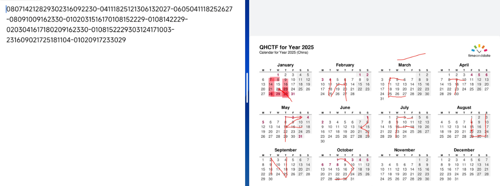

### Twitter Secret Messages

特点就是密文中有很多Unicode字符，直接用在线网站解密即可：https://holloway.nz/steg/

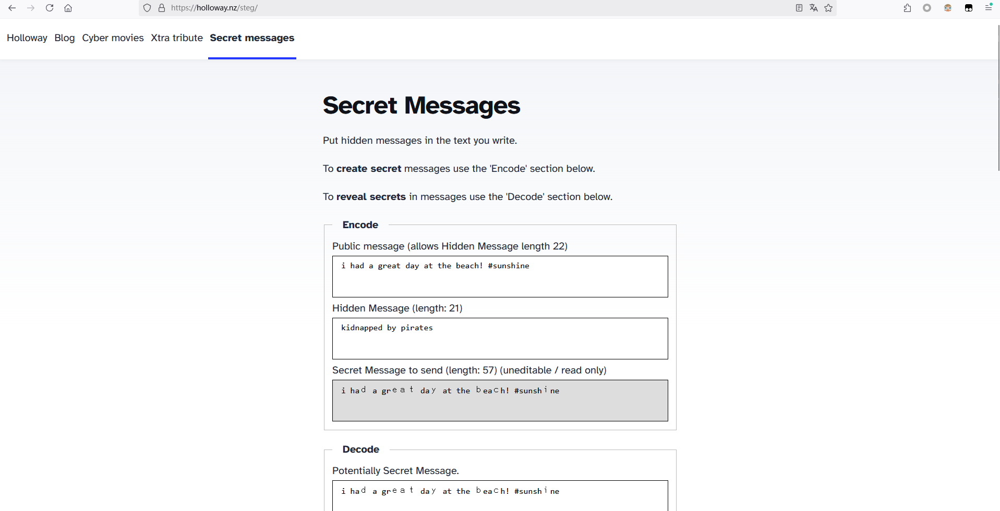


### 盲文

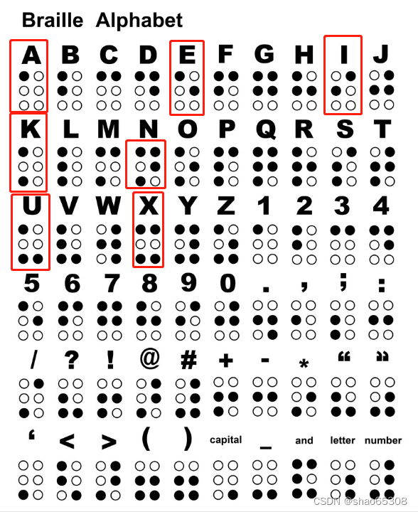


### 瓦坎达文字对照表

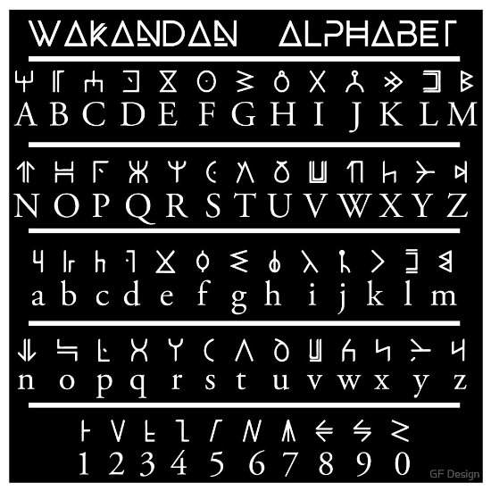

## Misc——流量分析

详见作者博客中的 **[Network Traffic Analysis](https://goodlunatic.github.io/posts/5422d65/)** 这篇文章

## MIsc——图片题思路：

&gt; Tips：
&gt; 
&gt; 1.各种隐写可以先拉入一键梭哈网站解析一下:https://aperisolve.fr/
&gt; 
&gt; 2.各种乱七八糟的隐写可以先看看这个UP主的视频：https://space.bilibili.com/39665558
&gt; 

### 通用思路

#### 1、查看图片属性的详细信息(可能关键信息就在里面)

#### 2、拉入010，查看文件头尾，可能会有不同类型文件文件头混用

#### 3、foremost 或者 binwalk

如果 foremost 没有提取出东西，可以用 binwalk 试一下，可能 binwalk可以提取出东西

例题 - i春秋 CTF Misc class10

#### 4、盲水印隐写(可能是一张图片或者两张图片)

**一张图片的情况**

可以使用 隐形水印工具V1.2 或者 WaterMark 来提取水印

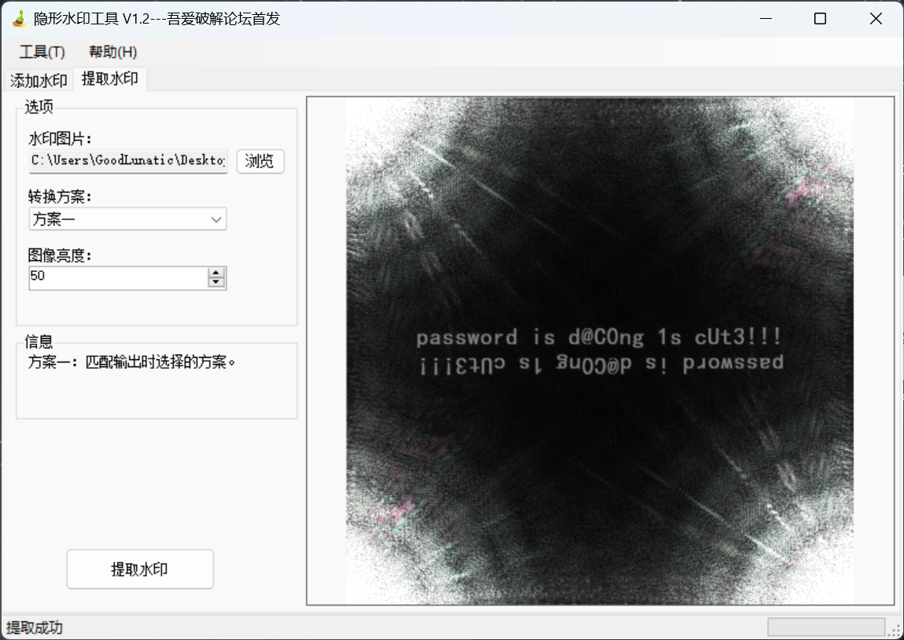

**两张图片的情况**

```
先把要处理的图片拉入BlindWaterMark-master文件夹，然后使用如下命令
py bwmforpy3.py decode day1.png day2.png flag.png --oldseed
Tips:这里还会出现FFT（傅里叶盲水印）:直接运行CTFD中的FFT.py
```

#### 5、图片的分离和拼接

(1)可以用kali的convert分离和montage拼接命令

```
分解GIF的命令：convert glance.gif flag.png
水平镜像翻转图片：convert -flop reverse.jpg reversed.jpg
垂直镜像翻转图片：convert -flip reverse.jpg reversed.jpg
合成图片的命令：montage flag*.png -tile x1 -geometry &#43;0&#43;0 flag.png
-tile是拼接时每行和每列的图片数，这里用x1，就是只一行
-geometry是首选每个图和边框尺寸，我们边框为0，图照原始尺寸即可
```

(2)使用在线网站分解：https://tu.sioe.cn/gj/fenjie/

(3)用py脚本跑

```python
import os
from PIL import Image
im = Image.new(&#39;RGB&#39;, (2*201, 600))  # new(mode,size) size is long and width
PATH = &#39;E:/ctf/glance.gif&#39;
FILE_NAME = [i for i in os.listdir(PATH)]
width = 0
for i in FILE_NAME:
    im.paste(Image.open(PATH&#43;i), (width, 0, width&#43;2, 600))  # box is 左，上，右,下
    width &#43;= 2
im.show()
```

#### 6、像素点合成

注：Linux wc命令用于计算字数。

-l或–lines 显示行数。

-w或–words 只显示字数。

-c或–bytes或–chars 只显示Bytes数。

可以改个标题后用在线网站将txt转换为ppm文件

#### 7、Image conbiner(两张图片)

 两张图片可能有部分残缺（可以互补）

 给了两张图片时，用Stegsolve.jar，打开其中一张，

 然后再Analyze-Image conbiner打开另一张图片

还有可能是给了两张二维码，需要两个二维码每个像素亦或，直接用CTFD中的像素亦或脚本即可

#### 8、OurSecret隐写(可以无密码)

拉入OurSecret，输入密码(也可以无密码)解密，得到隐藏文件

&gt; OurSecret隐写的特征非常明显，如下图中标蓝的那40字节

```
9E 97 BA 2A 00 80 88 C9 A3 70 97 5B A2 E4 99 B8
C1 78 72 0F 88 DD DC 34 2B 4E 7D 31 7F B5 E8 70
39 A8 B8 42 75 68 71 91
```

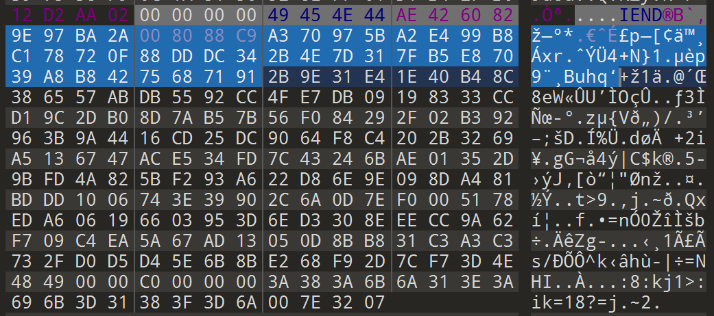

#### 9、拼图题

**碎图片合成一张图片**

```bash
#在Windows中使用imagemagick处理
magick.exe montage *.png -tile 18x10 -geometry 125x125&#43;0&#43;0 flag.jpg
magick montage *.png -tile 40x22 -geometry &#43;0&#43;0 flag-0.png
```

```bash
#在kali中处理
拉入kali里处理，如果是碎的图片，
先使用 montage *.PNG -tile 12x12 -geometry &#43;0&#43;0 out.png合成一张图片
*.png表示匹配所有图片
-tile表示图片的张数
-geometry &#43;0&#43;0表示每张图片的间距为0
合成后要先查看图片的宽高（宽高要相等，不相等要用PS调整）
```

**然后把上面合成好的图片使用 Puzzle-Merak 工具进行智能拼图**

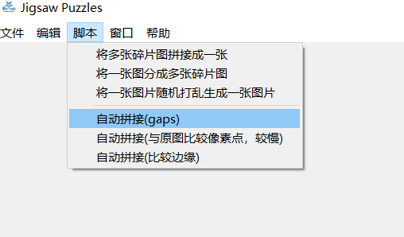

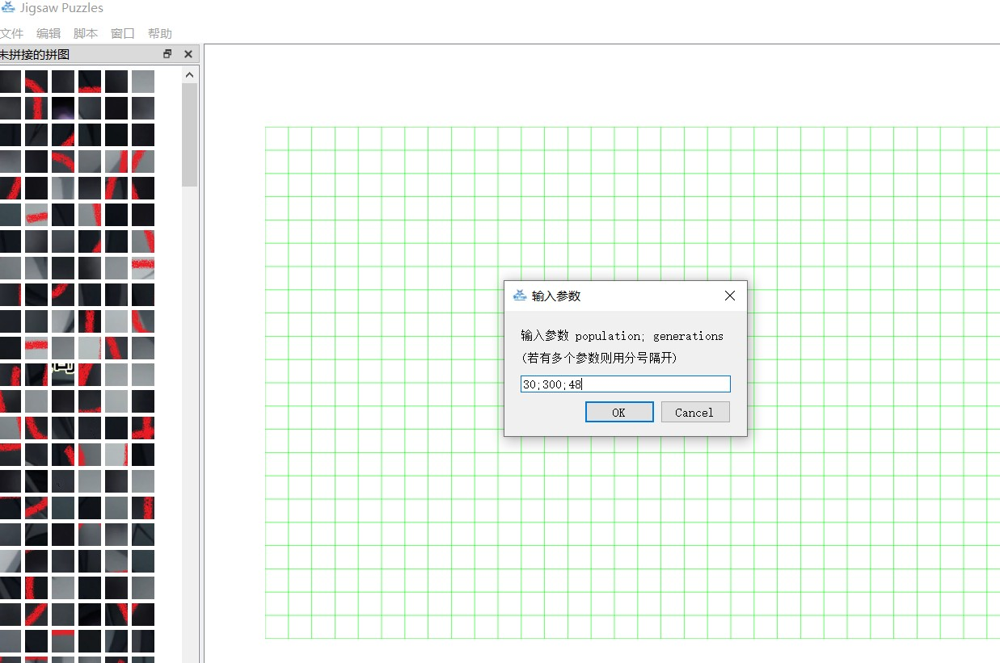

**这里只需要输入 generation、population、size 并用分号分开即可开始自动拼图**

**也可以使用gaps智能拼图(在kali和wsl里使用都可以)**

```bash
gaps --image=out.png --generation=30 --population=144 --size=30 --save 

--image 指向拼图的路径
--size 拼图块的像素尺寸
--generations 遗传算法的代的数量
--population 个体数量
--verbose 每一代训练结束后展示最佳结果
--save 将拼图还原为图像
```

```bash
gaps --image=flag.jpg --generations=50 --population=180 --size=125 --verbose

-generations 你要迭代多少次
-population 你有多少个小拼图
--size 每张小图，也就是拼图小块的大小
--verbose 实时显示
```

#### 10、提取图中等距像素点/近邻法缩放图片
参考链接：

https://www.bilibili.com/video/BV1Lf4y1r7dZ/?spm_id_from=333.999.0.0

https://github.com/Byxs20

例题-2024浙江省赛决赛-天命人

拿下面这张图片举个栗子


方法一：直接在PS中将宽高都缩小为原来的十分之一，并选择邻近硬边缘即可直接得到隐藏的图片

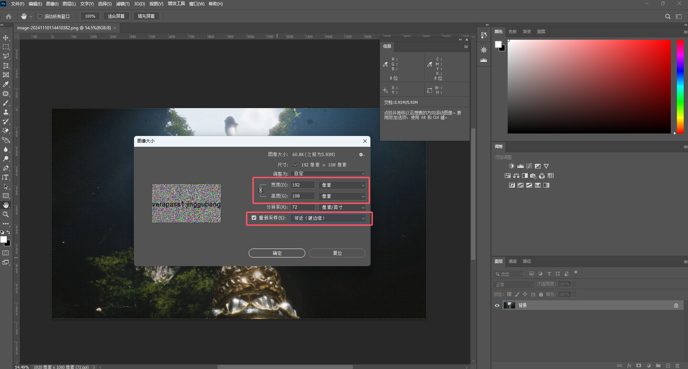

方法二：在windows的终端中运行CTFD中的Get_Pixels.py（注意所有路径中都不要出现中文）

```bash
py main.py -f arcaea.png -p 0x0&#43;3828x2148 -n 12x12
py main.py -f 要解密的图片 -p 第一个像素点的XY坐标&#43;最后一个像素点的XY坐标 -n 两个等距像素点的XY距离的差值
如果是等距离提取整张图片中所有像素点，要注意右下角那个点的位置XY都要减去一倍的距离
Tips:在PS中按F8就可以看到每个像素点的具体坐标了
```

&gt; 这里有时候运行会报错，需要把main.py脚本拉到桌面上运行或者检查一下图片的CRC对不对

一样可以得到隐藏的图片

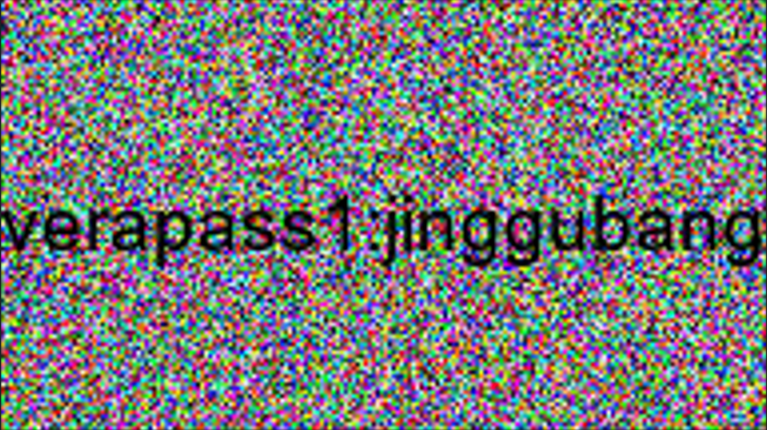

#### 11、pixeljihad（有密码）

直接使用在线网站解密即可：[PixelJihad (sekao.net)](https://sekao.net/pixeljihad/)

#### 12、隐写文本可能藏在原图片和隐写文件的中间

直接在010中搜索IEND，然后查看后面有没有额外内容即可

#### 13、silenteye隐写

特征：放大图像后会有行列不对齐的小灰块

直接用 silenteye 打开输入密钥decode即可，默认密钥是 silenteye

#### 14、图片报错改宽高后图片无变化，可以再 foremost 一下

#### 15、DeEgger Embedder隐写

可以直接使用 DeEgger Embedder 工具 extract files

#### 16、flag可能藏在 exif 中

直接在 WSL 中输入以下命令查看即可，如果偷懒也可以直接使用 破空 flag 查找工具 进行查找

```
exiftool 3.jpg
```

#### 17、给了两张图片，flag藏在每行不同像素的个数中

例题1-2023羊城杯初赛-两支老虎

```python
from PIL import Image, ImageChops

img1 = Image.open(&#34;1.png&#34;)
width1,heigth1 = img1.size # 1134,720
img2 = Image.open(&#34;2.png&#34;) 
width2,heigth2 = img2.size # 1144,720
img2 = img2.crop((0,0,1134,720))
width2,heigth2 = img2.size
# img2.save(&#34;3.png&#34;)

diff_dit = {}
# 返回差异图像，表示 img1 和 img2 之间的像素差异。
diff = ImageChops.difference(img1,img2)
width3,heigth3 = diff.size
for x in range(width3):
    for y in range(heigth3):
        pixel3 = str(diff.getpixel((x,y)))
        # 统计一下差异像素
        if pixel3 not in diff_dit: 
            diff_dit[pixel3] = 0
        else:
            diff_dit[pixel3] &#43;= 1
print(diff_dit) 
# {&#39;(0, 0, 0)&#39;: 813891, &#39;(1, 1, 1)&#39;: 2533, &#39;(1, 1, 0)&#39;: 53}

for y in range(heigth1):
    cnt = 0
    for x in range(width1):
        pixel1 = img1.getpixel((x,y))
        pixel2 = img2.getpixel((x,y))
        if pixel1 != pixel2:
            cnt &#43;= 1
    if cnt != 0:
        print(chr(cnt),end=&#39;&#39;)
# DASCTF{tWo_t1gers_rUn_f@st}
```

#### 18、两张图片，用StegSolve中的Image Conbiner合成为一张bmp

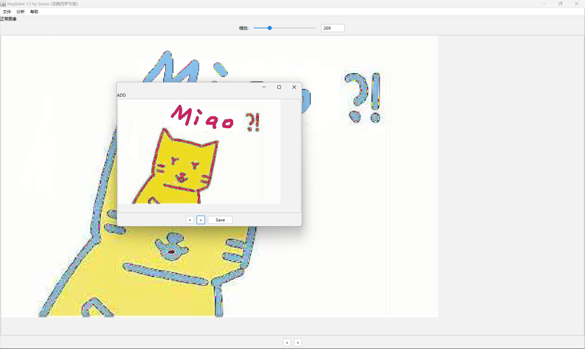

合成一张bmp后，再使用zsteg扫描

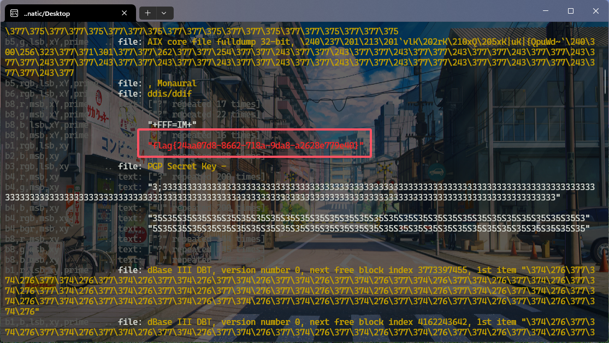

#### 19、图片多个通道存在LSB隐写，StegSolve中把背景颜色相同的勾选上

#### 20、把小说藏进图片

参考链接：https://www.bilibili.com/video/BV1Ai4y1V7rg/?spm_id_from=333.999.0.0&amp;vd_source=31399c09aa0c93655468bde7b13fcc03

```python
# 脚本一
from PIL import Image

img = Image.open(&#34;1.bmp&#34;)
width,height = img.size # 1326 1326

res = &#34;&#34;
for y in range(height):
    for x in range(width):
        r,g,b = img.getpixel((x,y))
        data = (r &lt;&lt; 8) &#43; b
        res &#43;= chr(data)
    
with open(&#34;decode.txt&#34;,&#34;w&#34;) as f:
    f.write(res)
```

```python
# 脚本二
from PIL import Image
from numpy import array
res = bytes(array(Image.open(&#39;1.bmp&#39;))[:, :, ::2].flatten()).rstrip(b&#39;\0&#39;).decode(&#39;utf-16-be&#39;)
print(res)
```

#### 21、Arnold猫脸变换

参考链接：https://1cepeak.cn/post/arnold/

如果已经得到了`shuffle_times`、`a`和`b`，然后直接使用下面这个脚本恢复即可

```python
import matplotlib.pyplot as plt
import cv2
import numpy as np
from PIL import Image

img = cv2.imread(&#39;flag.png&#39;)

def arnold_encode(image, shuffle_times, a, b):
    arnold_image = np.zeros(shape=image.shape)
    h, w = image.shape[0], image.shape[1]
    N = h   # 或N=w

    for time in range(shuffle_times):
        for ori_x in range(h):
            for ori_y in range(w):
                new_x = (1*ori_x &#43; b*ori_y)% N
                new_y = (a*ori_x &#43; (a*b&#43;1)*ori_y) % N
                arnold_image[new_x, new_y, :] = image[ori_x, ori_y, :]

        image = np.copy(arnold_image)

    cv2.imwrite(&#39;flag_arnold_encode.png&#39;, arnold_image, [int(cv2.IMWRITE_PNG_COMPRESSION), 0])
    return arnold_image

def arnold_decode(image, shuffle_times, a, b):
    decode_image = np.zeros(shape=image.shape)
    h, w = image.shape[0], image.shape[1]
    N = h  # 或N=w

    for time in range(shuffle_times):
        for ori_x in range(h):
            for ori_y in range(w):
                new_x = ((a * b &#43; 1) * ori_x &#43; (-b) * ori_y) % N
                new_y = ((-a) * ori_x &#43; ori_y) % N
                decode_image[new_x, new_y, :] = image[ori_x, ori_y, :]

    cv2.imwrite(&#39;flag.png&#39;, decode_image, [int(cv2.IMWRITE_PNG_COMPRESSION), 0])
    return decode_image

# arnold_encode(img, 1, 2, 3)
arnold_decode(img, 1, 29294, 7302244)
```

如果题目没有给我们上面的三个参数，我可以尝试爆破一下

例题-cat(技能兴鲁)

```python
import matplotlib.pyplot as plt
import cv2
import numpy as np

def arnold_decode(image, shuffle_times, a, b):
    decode_image = np.zeros(shape=image.shape)
    h, w = image.shape[0], image.shape[1]
    N = h  # 或N=w
    for time in range(shuffle_times):
        for ori_x in range(h):
            for ori_y in range(w):
                # 按照公式坐标变换
                new_x = ((a * b &#43; 1) * ori_x &#43; (-b) * ori_y) % N
                new_y = ((-a) * ori_x &#43; ori_y) % N
                decode_image[new_x, new_y, :] = image[ori_x, ori_y, :]
        image = np.copy(decode_image)
        
    return image

def arnold_brute(image,shuffle_times_range,a_range,b_range):
    for c in range(shuffle_times_range[0],shuffle_times_range[1]):
        for a in range(a_range[0],a_range[1]):
            for b in range(b_range[0],b_range[1]):
                print(f&#34;[&#43;] Trying shuffle_times={c} a={a} b={b}&#34;)
                decoded_img = arnold_decode(image,c,a,b)
                output_filename = f&#34;flag_decodedc{c}_a{a}_b{b}.png&#34;
                cv2.imwrite(output_filename, decoded_img, [int(cv2.IMWRITE_PNG_COMPRESSION), 0])
                
if __name__ == &#34;__main__&#34;:
    img = cv2.imread(&#34;cat.png&#34;)
    arnold_brute(img, (1,6), (1,11), (1,11))
```

**正常来说猫脸变换的图像长和宽都是相等的，如果遇到抽象的长宽不相等的图像，脚本中的N需要改一下**

```python
import cv2
import numpy as np

def arnold_decode(image, shuffle_times, a, b):
    decode_image = np.zeros(shape=image.shape)
    h, w = image.shape[0], image.shape[1]
    for time in range(shuffle_times):
        for ori_x in range(h):
            for ori_y in range(w):
                new_x = ((a * b &#43; 1) * ori_x &#43; (-b) * ori_y) % h
                new_y = ((-a) * ori_x &#43; ori_y) % w
                decode_image[new_x, new_y, :] = image[ori_x, ori_y, :]
        image = np.copy(decode_image)
    return image

if __name__ == &#34;__main__&#34;:
    img = cv2.imread(&#34;fla@.bmp&#34;)
    decode_img = arnold_decode(img, 12, 0, 9)
    cv2.imwrite(&#39;flag.png&#39;,decode_img)
```

#### 22、二进制数据转图片

```python
import os
import math
from PIL import Image

bin_data = &#34;010000001010101101110001000010001110010110101100111010011101001010111011111101111111110110100100011001001100011001000001010111100001101000001010001011101111000100001010110110101101100111010000010000110101100001100110010100010011100011100011010100100000111101111111010010111101100010001100100010111111111001011101011101000000110111011000001001010011001001110101111111010110011011001000101010010110101011011111001010100011100001100001011010011&#34;

data_len = len(bin_data)
sqrt_len = int(math.sqrt(data_len))
os.makedirs(&#34;pic_out&#34;,exist_ok=True)
for i in range(sqrt_len, 0, -1):
    if data_len % i == 0:
        width, height = i, data_len // i
        print(f&#34;尝试图像尺寸: {width} x {height}&#34;)
        img = Image.new(&#34;L&#34;, (width, height), 255)          # 原始图像
        inverted_img = Image.new(&#34;L&#34;, (width, height), 0)   # 反色图像
        for idx, item in enumerate(bin_data):
            y, x = idx // width, idx % width
            color = 0 if item == &#39;1&#39; else 255
            img.putpixel((x, y), color)
            inverted_img.putpixel((x, y), 255 - color)  # 反色

        img.save(f&#34;pic_out/{width}x{height}.png&#34;)
        inverted_img.save(f&#34;pic_out/{width}x{height}_inverted.png&#34;)
```

#### 23、 脚本提取LSB数据并分析

```python
def extract_lsb():
    data = np.array(Image.open(&#34;flag.png&#34;))
    r_lsb = (data[:,:,0] &amp; 1).flatten().astype(str)
    g_lsb = (data[:,:,1] &amp; 1).flatten().astype(str)
    b_lsb = (data[:,:,2] &amp; 1).flatten().astype(str)
    # lsb_data = libnum.b2s(&#34;&#34;.join(r_lsb))
    print(lsb_data)
```

#### 23、像素点RGB值转图片

题目提供了类似如下的数据：

```python
(255,255,255)
(255,255,255)
(255,255,255)
(255,255,255)
(255,255,255)
(255,255,255)
(255,255,255)
(255,255,255)
(255,255,255)
(255,255,255)
(255,255,255)
(255,255,255)
(255,255,255)
(255,255,255)
(255,255,255)
```

直接写一个Python脚本爆破宽高并还原图像即可

```python
import numpy as np
import math
from PIL import Image

with open(&#39;basic.txt&#39;, &#39;r&#39;) as file:
    lines = file.readlines()

# 将每行数据转换为元组，并存储在列表中
data = [eval(line.strip()) for line in lines]

# 将列表转换为NumPy数组，形状为 (N, 3)
data = np.array(data, dtype=np.uint8)

data_length = len(data)
sqrt_length = int(math.sqrt(data_length))
for i in range(sqrt_length, 0, -1):
    if data_length % i == 0:  # 如果长度可以整除
        rows = i
        cols = data_length // i
        print(f&#34;尝试重塑为 {rows} 行, {cols} 列&#34;)
        try:
            reshaped_data = data.reshape(rows, cols, 3)
            image = Image.fromarray(reshaped_data, &#39;RGB&#39;)
            image.save(f&#34;{rows}x{cols}.png&#34;)
        except Exception as e:
            print(f&#34;无法重塑为 {rows} 行, {cols} 列: {e}&#34;)
```

#### 24、图片套娃

图片的每个像素的RGB值其实都是另一张图片的字节数据

例题1-2025软件系统安全赛

附件给了下面这张图片


```python
def func2():
    with open(&#34;flag.png&#34;,&#34;rb&#34;) as f:
        data = f.read()
    data = np.array(Image.open(io.BytesIO(data))).flatten()
    for i in data[:20]:
        print((i,hex(i)[2:]),end=&#34; &#34;)
```

用以上脚本把像素的每个RGB值都转为hex，就可以在图片头几个像素发现PNG文件头

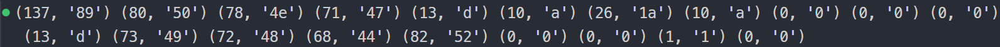

```python
import io
import numpy as np
from PIL import Image

def func1():
    cnt = 1
    img_file = &#34;flag.png&#34;
    while True:
        out = []
        img = Image.open(img_file)
        w,h = img.size
        for y in range(h):
            for x in range(w):
                r,g,b = img.getpixel((x,y))
                out.append(r)
                out.append(g)
                out.append(b)
        outfile = f&#34;{cnt}.png&#34;
        with open(outfile,&#39;wb&#39;) as f:
            f.write(bytes(out))
        print(f&#34;[&#43;] {cnt}.png 处理完毕&#34;)
        img_file = f&#34;{cnt}.png&#34;
        cnt &#43;= 1

# 在利用io.BytesIO内存中处理文件数据：避免频繁读写磁盘，提高性能。
def func2():
    with open(&#34;flag.png&#34;,&#34;rb&#34;) as f:
        data = f.read()
    cnt = 1
    while True:
        try:
            data = bytes(np.array(Image.open(io.BytesIO(data))).flatten()).rstrip(b&#39;\xff&#39;)
            Image.open(io.BytesIO(data)).save(f&#34;{cnt}.png&#34;)
            print(f&#34;[&#43;] {cnt}.png 处理完毕&#34;)
        except:
            break
        cnt &#43;= 1

if __name__ == &#34;__main__&#34;:
    # func1()
    func2()
```

运行以上脚本循环485次后即可得到flag

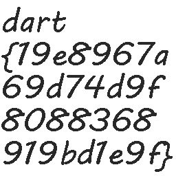
#### 25、Java-BlindWatermark

1、直接用`Byxs20`写的`PuzzleSolver`一把梭

2、Github上的开源项目：https://github.com/ww23/BlindWatermark

```bash
java -jar .\BlindWatermark-v0.0.3-windows-x86_64.jar decode -c .\password.png output.png
```

#### 26、在线网站一把梭

&gt; 这种情况常常发生在某些Misc出题人水平不够，图片隐写道行不够的情况

```bash
# 在线网站：
https://www.a.tools/Tool.php?Id=100
```

### PNG思路

####  1、CRC错误(不能乱改)，改宽高，17~20是宽，21~24是高(可用Pictools脚本快速爆破)

#### 2、LSB(最低有效位)隐写:

**没有密钥的情况**

```bash
# 用zsteg快速查看
zsteg -a (文件名)  #查看各个通道的lsb
-b的位数是从1开始的 zsteg zlib.bmp -b 1 -o xy -v
提取文件并导出 zsteg -e b1,r,lsb,xy 3.png &gt; 123.jpg
```

信息藏在图片中有时候会看不出来，所以还是要用stegsolve.jar过一遍

 **有密钥的情况（cloacked-pixel）**

lsb隐写的可能是加密后的数据，i春秋最喜欢的**cloacked-pixel**

拉到kali/WSL里用cloacked-pixel命令解密出数据

```bash
python2 cloacked-pixel-master/lsb.py extract 0.png out.data f78dcd383f1b574b
```

0.png是隐写后的图片；out.data是隐写内容保存的位置；f78dcd383f1b574b是密钥

#### 3、LSB低位隐写

用CTFD中的脚本跑出隐藏的图片

#### 4、IDAT块隐写

**(1) 解压zlib获得原始数据**

然后用010提取数据扔进zlib脚本解压获得原始数据

将异常的IDAT数据块斩头去尾之后使用脚本解压，在python2代码如下：

```python
import zlib
import binascii
IDAT = &#34;789C5D91011280400802BF04FFFF5C75294B5537738A21A27D1E49CFD17DB3937A92E7E603880A6D485100901FB0410153350DE83112EA2D51C54CE2E585B15A2FC78E8872F51C6FC1881882F93D372DEF78E665B0C36C529622A0A45588138833A170A2071DDCD18219DB8C0D465D8B6989719645ED9C11C36AE3ABDAEFCFC0ACF023E77C17C7897667&#34;.decode(&#39;hex&#39;)
result = binascii.hexlify(zlib.decompress(IDAT))
print (result.decode(&#39;hex&#39;))
print (len(result.decode(&#39;hex&#39;)))
```

**(2) 加上文件头爆破宽高得到新的图片**

一般出问题的 IDAT Chunk 大小都是比正常的小的，很可能在图片末尾

如果不确定是哪一个有问题，可以尝试都提取出来，一个一个分析

可以使用 tweakpng 辅助分析，但是一般用 010 的模板提取分析就够了

我们可用 WSL 中的 pngcheck -v 0.png 检查 IDAT

如下图，最后一个和倒数第二个IDAT明显有问题，因此可以对这两部分进行尝试

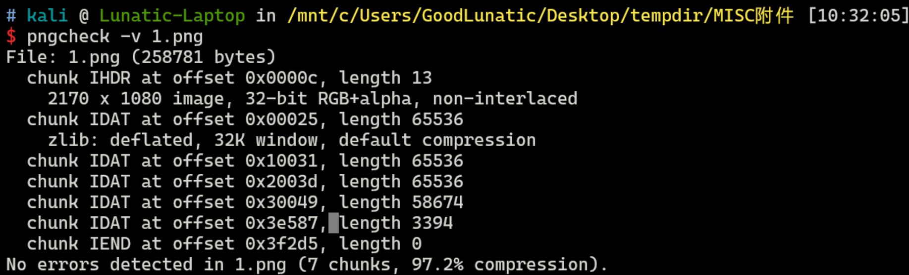

借助 010 的模板功能把IDAT块提取出来，加上文件头尾并爆破宽高即可得到另一张图片

```
# 图片头(其中后面部分的数据可以不一样，但是数据长度要一样)
89 50 4E 47 0D 0A 1A 0A 00 00 00 0D 49 48 44 52
00 00 04 E0 00 00 03 0C 08 06 00 00 00 FA 9A D8
07
#图片尾
00 00 00 00 49 45 4E 44 AE 42 60 82
```

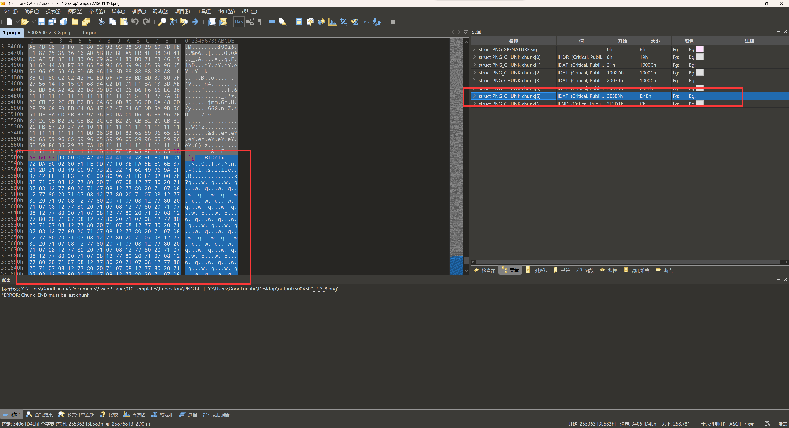

Tips：这里有时候也可以不用补文件尾

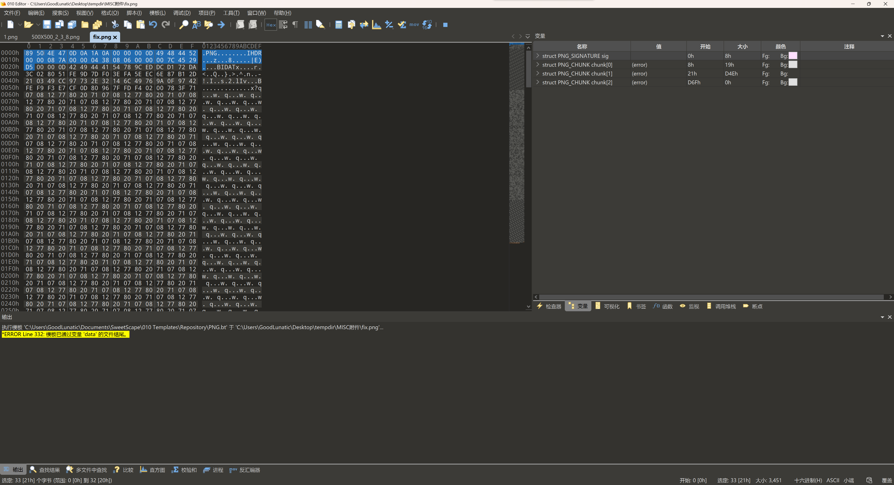

把文件头尾补完整后直接爆破一下宽高即可

例题1-2023安洵杯-dacongのsecret

例题2-DASCTF2024 暑期挑战赛-png_master

#### 5、png数据末尾藏zip

补上压缩包的文件头，然后提取出来，解压(可用stegpy得到解压密码)。

或者直接foremost提取

#### 6、apngdis_gui

一张png图片还可能是apng，直接用apngdis_gui跑一下，可以分出两张相似的png

#### 7、CVE-2023-28303 截图工具漏洞
一张图片如果有两个`IEND`块：`AE 42 60 82` 

就很有可能考察的是这个漏洞

可以使用[Github上大佬写好的工具](https://github.com/frankthetank-music/Acropalypse-Multi-Tool)一把梭，前提是需要知道原图的分辨率

#### 8、stegpy隐写

[ stegpy 开源地址](https://github.com/izcoser/stegpy) 下载好后直接用WSL输入以下命令并输入密码解密即可

也可以直接用 pip 安装： pip3 install stegpy

```bash
stegpy 1.png -p
```

#### 9、npiet编程语言

**白底**&#43;很多彩色的小像素点组成的图片，形如下图


方法一：直接使用在线网站：https://www.bertnase.de/npiet/npiet-execute.php 运行即可

方法二：下载源代码`npiet-1.3a-win32`到本地，然后使用以下命令运行

```bash
.\npiet.exe -tpic solved.png
```


#### 10、Image Steganography隐写

直接使用`Image Steganography`工具解密即可，如果需要密码，就勾选上`Decrypt`选项

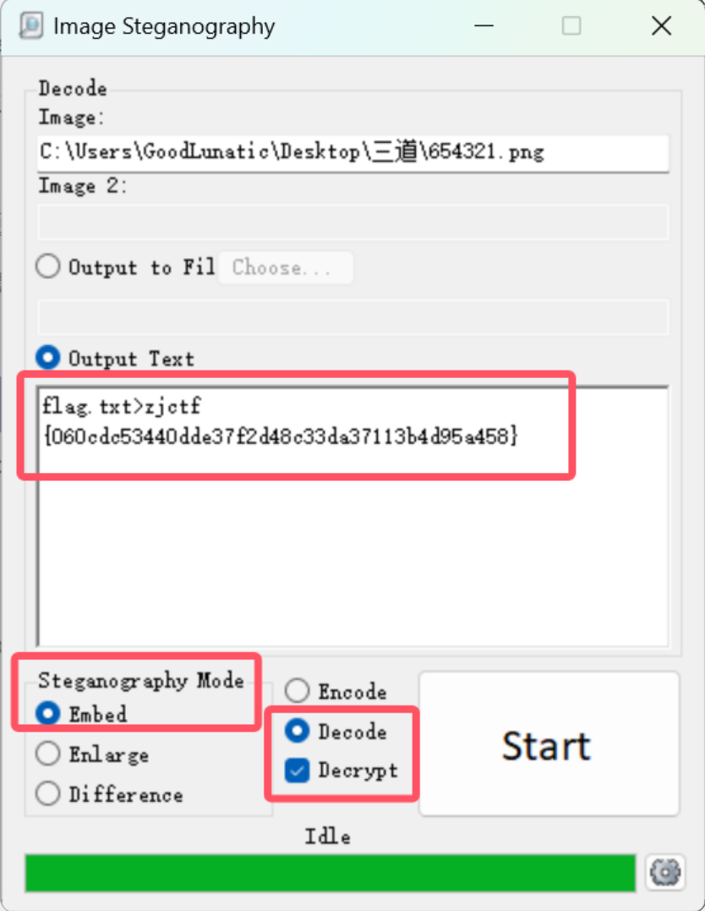


### JPG思路

#### 1、可以试试用stegdectet看看是什么加密：

.\stegdetect.exe -t jopi -s 10.0 .\0.jpg

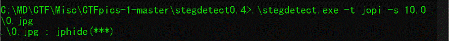

出现三颗星不一定就代表一定是这种加密方式

#### 2、JPHS隐写

有可能会有密码

导出步骤 Select File --&gt; seek --&gt; demo.txt --&gt; Save the file

#### 3、steghide隐写(可以无密码)

```bash
#如果密码已经知道了
steghide extract -sf filename -p passwd
```

在WSL或者kali里用Stegseek跑（字典在wordlist里）

```bash
#如果密码未知
可以用下面这个脚本爆破
#bruteStegHide.sh
#!/bin/bash

for line in `cat $2`;do
    steghide extract -sf $1 -p $line &gt; /dev/null 2&gt;&amp;1
    if [[ $? -eq 0 ]];then
        echo &#39;password is: &#39;$line
        exit
    fi
done
```

```bash
#或者在WSL或者kali里用Stegseek跑（字典在wordlist里）
stegseek filename rockyou.txt
```

#### 4、outguess隐写

```bash
outguess -k &#34;abc&#34; -r mmm.jpg flag.txt
#-k 后面跟的是解密的密钥
#flag.txt是解密后数据保存的位置
```

#### 5、F5-steganography-master

把要解密的图片拉到F5文件夹中

```bash
#有密码的情况
java Extract beautiful.jpg -p passwd
#无密码的情况
java Extract beautiful.jpg
#解密出来的数据会放到F5文件夹下的output.txt中
```

#### 6、JPG宽高隐写
010打开JPG图片，找到 struct SOF 块数据，手动调整宽高即可

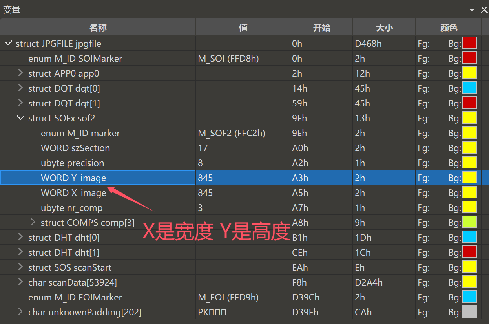

### BMP思路

#### 1、bmp宽高爆破：

删除文件头，并保存为文件名.data，然后用GIMP打开修改宽高（这个比较方便）

或者直接用bmp爆破脚本跑 python script.py -f filename.bmp

```bash
#用这个脚本要注意对图片一个个使用
```

```python
import os
import time
import math
import argparse


parser = argparse.ArgumentParser()
parser.add_argument(&#34;-f&#34;, type=str, default=None, required=True,
                    help=&#34;输入同级目录下图片的名称&#34;)
args = parser.parse_args()

SAVE_DIR = os.getcwd()


def save_img(data, width=None, height=None, sqrt_num=None):
    with open(os.path.join(SAVE_DIR, &#34;fix_width.bmp&#34;), &#34;wb&#34;) as f:
        f.write(data[:0x12] &#43; width.to_bytes(4,
                byteorder=&#34;little&#34;, signed=False) &#43; data[0x16:])

    with open(os.path.join(SAVE_DIR, &#34;fix_height.bmp&#34;), &#34;wb&#34;) as f:
        f.write(data[:0x16] &#43; height.to_bytes(4,
                byteorder=&#34;little&#34;, signed=False) &#43; data[0x1a:])

    with open(os.path.join(SAVE_DIR, &#34;fix_sqrt.bmp&#34;), &#34;wb&#34;) as f:
        f.write(data[:0x12] &#43; sqrt_num.to_bytes(4,
                byteorder=&#34;little&#34;, signed=False) * 2 &#43; data[0x1a:])


def get_pixels_size(data):
    bfSize = int.from_bytes(data[0x2:0x2&#43;4], byteorder=&#34;little&#34;, signed=False)
    bfOffBits = int.from_bytes(
        data[0xa:0xa&#43;4], byteorder=&#34;little&#34;, signed=False)
    biBitCount = int.from_bytes(
        data[0x1c:0x1c&#43;2], byteorder=&#34;little&#34;, signed=False)
    channel = biBitCount // 8
    # 由于宽高都会被修改，所以我计算出来的Padding_size也不是正确的，没有意义
    # padding_size = (4 - col * channel % 4) * row if col * channel % 4 != 0 else 0
    # pixels_size = (bfSize - bfOffBits - padding_size) // channel
    return (bfSize - bfOffBits) // channel


if __name__ == &#39;__main__&#39;:
    file_path = os.path.abspath(args.f)
    if os.path.splitext(args.f)[-1] != &#34;.bmp&#34;:
        print(&#34;您的文件后缀名不为BMP!&#34;)
        time.sleep(1)
        exit(-1)

    with open(file_path, &#34;rb&#34;) as f:
        data = f.read()
    col = abs(int.from_bytes(data[0x12:0x12&#43;4],
              byteorder=&#34;little&#34;, signed=True))
    row = abs(int.from_bytes(data[0x16:0x16&#43;4],
              byteorder=&#34;little&#34;, signed=True))
    pixels_size = get_pixels_size(data)

    width, height = pixels_size // row, pixels_size // col
    sqrt_num = int(math.sqrt((pixels_size)))
    save_img(data, width=width, height=height, sqrt_num=sqrt_num)

    print(&#34;温馨提示：由于填充字节的问题，所以可能会偏差几个像素!&#34;)
    print(f&#34;1.修复宽度: {width}&#34;)
    print(f&#34;2.修复高度: {height}&#34;)
    print(f&#34;3.修复宽度高度为: {sqrt_num}&#34;)
    time.sleep(1)
```

#### 2、wbStego4open隐写

用wbStego4open直接decode
#### 3、silenteye隐写

直接拉入 silenteye 解密即可

### GIF思路

做GIF图像的相关的隐写题之前，我们首先需要对GIF图像大概的参数又一定的了解

下图我用Linux下的`identify`工具提取了一张GIF图像的一些参数

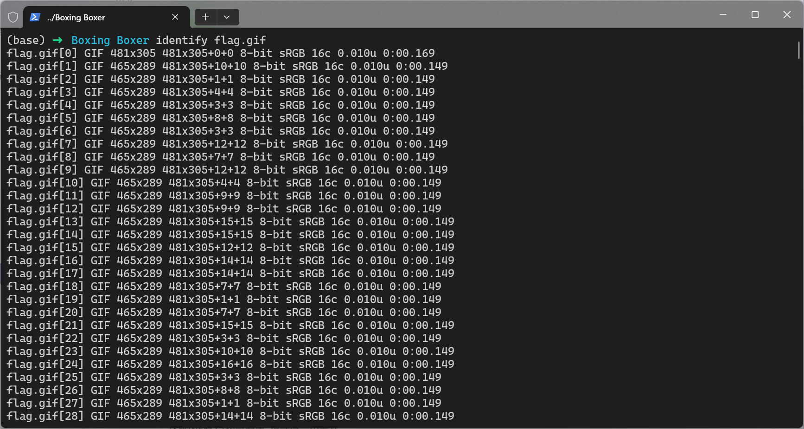

这里简要介绍一下每一行中的参数
```
 flag.gif[195]     GIF      465x294      481x305&#43;8&#43;11          8-bit            sRGB 
图像名称及对应帧数  图像格式  帧的实际尺寸  画布尺寸及xy的偏移量  图像使用 8 位色深  颜色空间为标准 RGB

      16c                   0.010u                         0:00.080
使用了 16 种颜色  处理该图像消耗的 CPU 用户时间，单位是秒  处理该图像所用的总时间，单位是秒

```

#### 1、GIF分帧(在线网站或者工具)

**[推荐] Linux下使用`convert`提取**

```bash
convert flag.gif flag.png
```

使用`ffmpeg`提取（如果帧间隔不同，提取出来会有问题）
```bash
# 在Windows或者WSL中执行以下命令进行分离
ffmpeg -i filename.gif frame%04d.png
```

使用`PuzzleSolver`提取，是按照帧来进行提取

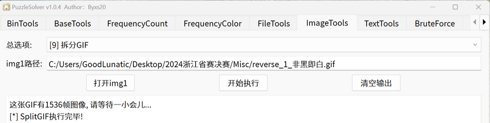

#### 2、帧间隔隐写

**[推荐] 方法一：直接使用`PuzzleSolver`提取帧间隔**

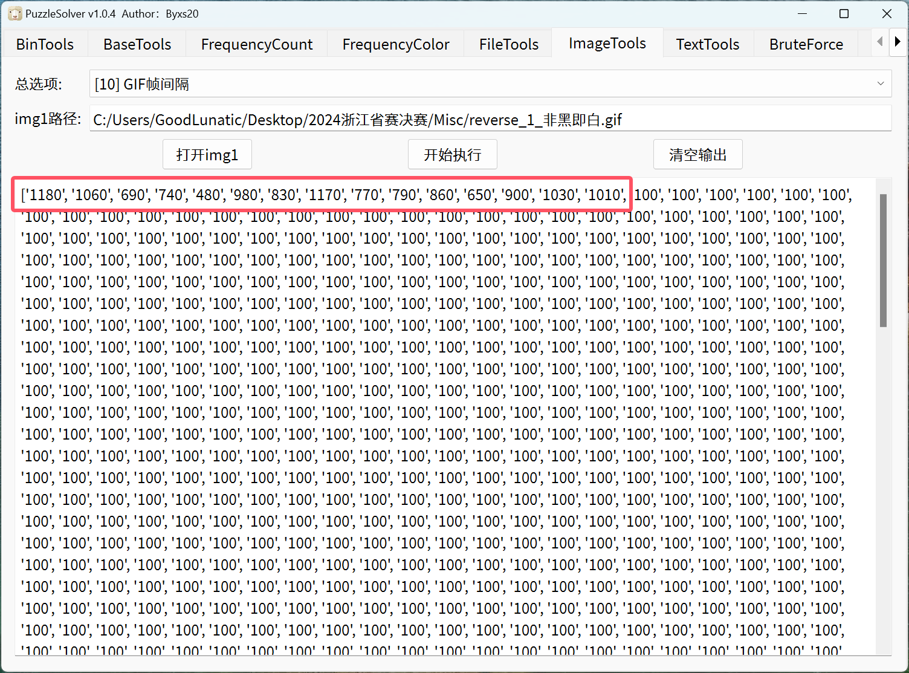

方法二：使用`identify`提取

```bash
identify -format &#34;%s %T \n&#34; flag.gif  #格式：帧序号 时间间隔（单位是1/100秒）
```

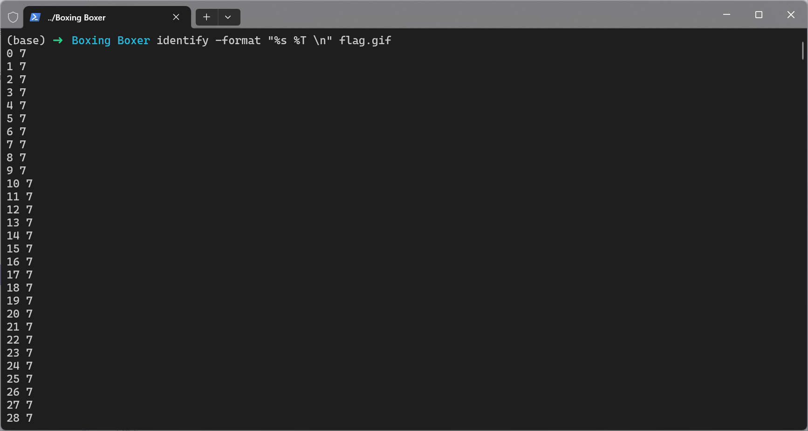

例题1-2024羊城杯初赛-checkin

例题2-2024浙江省赛决赛-非黑即白

#### GIF图像每帧的XY偏移量隐写

使用`identify`提取出偏移量然后再分析

```bash
identify flag.gif
```

例题1-Boxing Boxer

```python
import subprocess
from PIL import Image
from datetime import datetime

time_space = [...]

def get_pos(gif_file):
    offset_x = []
    offset_y = []
    pic_width = []
    pic_height = []
    cmd = f&#39;identify {gif_file}&#39;
    res = subprocess.run(cmd,shell=True,stdout=subprocess.PIPE,stderr=subprocess.PIPE,text=True)
    output = res.stdout
    lines = output.strip().split(&#39;\n&#39;)
    
    for line in lines:
        tmp_lst = line.split(&#39; &#39;)
        frame_size,tmp_x,tmp_y = tmp_lst[3].split(&#39;&#43;&#39;)
        offset_x.append(int(tmp_x))
        offset_y.append(int(tmp_y))
        tmp_x,tmp_y = tmp_lst[2].split(&#39;x&#39;)
        pic_width.append(int(tmp_x))
        pic_height.append(int(tmp_y))
        
    return offset_x,offset_y,pic_width,pic_height

def draw2pic(offset_x,offset_y,pic_width,pic_height):
    img = Image.new(&#34;RGB&#34;,(500,500),(255,255,255)) # 新建一张尺寸为500x500的RGB图像
    for idx,item in enumerate(time_space):
        if item == &#39;70&#39;:
            continue
        elif item == &#39;50&#39;:
            img.putpixel((offset_x[idx],offset_y[idx]),(255,255,255))
            img.putpixel((offset_x[idx]&#43;pic_width[idx],offset_y[idx]&#43;pic_height[idx]),(255,255,255))
        elif item == &#39;60&#39;:
            img.putpixel((offset_x[idx],offset_y[idx]),(0,0,0))
            img.putpixel((offset_x[idx]&#43;pic_width[idx],offset_y[idx]&#43;pic_height[idx]),(0,0,0))
            
    timestamp = datetime.now().strftime(&#34;%Y%m%d%H%M%S&#34;)
    print(timestamp)
    img.save(f&#34;{timestamp}.png&#34;)

if __name__ == &#34;__main__&#34;:
    gif_file = &#34;flag.gif&#34;
    offset_x,offset_y,pic_width,pic_height = get_pos(gif_file)
    draw2pic(offset_x,offset_y,pic_width,pic_height)
```

#### GIF图像每帧的实际尺寸隐写

例题1-Boxing Boxer

### Webp思路

webp文件用电脑自带的图片看可能会有点问题，建议用浏览器打开这种文件

webp可能是动图，可以用下面这个脚本分离webp中的每帧图片

```python
from PIL import Image

img = Image.open(&#39;killer.webp&#39;)
n_frame = img.n_frames
for i in range(n_frame):
    img.seek(i)
    img.save(f&#39;img/{i}.png&#39;)
```

### BPG图像文件

使用`bpg-0.9.8-win64`转换为PNG图片即可

```bash
.\bpgdec.exe .\flag.bpg
```

### RAW、ARW文件思路

#### 1、RAW的LSB隐写

ARW文件是 Sony 相机的原始数据格式

可以使用 rawpy 模块读取图片的像素数据，查看是否存在LSB隐写【例：2024 L3HCTF RAWatermark】

示例脚本如下：

```python
import rawpy
import numpy as np
import libnum

with rawpy.imread(&#39;image.ARW&#39;) as raw:
    # 从 raw 对象中获取可见的 Bayer 格式图像数据
    bayer_visible = raw.raw_image_visible
    # print(bayer_visible)
    # 用 bitwise_and() 函数将 bayer_visible 中的每个像素值与 1 进行按位与操作，以提取每个像素的最低有效位（LSB）
    lsb_array = np.bitwise_and(bayer_visible, 1)
    # print(lsb_array)
    # 使用 NumPy 数组的 flatten() 方法将 lsb_array 数组展平成一维数组
    lsb_array_flat = lsb_array.flatten()
    # print(lsb_array_flat)
    hidden_message = &#39;&#39;.join(map(str, lsb_array_flat))
    # 将隐写的数据转为十六进制，便于查看文件头
    hex_data = hex(int(hidden_message, 2))
    # print(hex_data[:10]) # 0x504b0304
    # 将二进制数据转换为byte类型数据
    data = libnum.b2s(hidden_message)

with open(&#39;flag.zip&#39;, &#39;wb&#39;) as f:
    f.write(data)
```

#### 2、直接改后缀为.data，然后拖入Gimp即可

### 二维码思路

#### 1、bmp转二维码

#### 2、16进制转pyc

#### 3、字符串制作二维码

```
直接右键使用B神的脚本制作二维码，制作前注意要把字符串的长度手动修正为平方数
1.0 1制作二维码
2.00 11制作二维码
```

#### 4、四个TTL值转换一个字节的二进制数

#### 5、Aztec code、DataMatrix、GridMatrix、汉信码、PDF417code等

我们平常见的最多的二维码就是QRcode，但是实际上还有很多不同类型的二维码，这里就简单举几个例子：


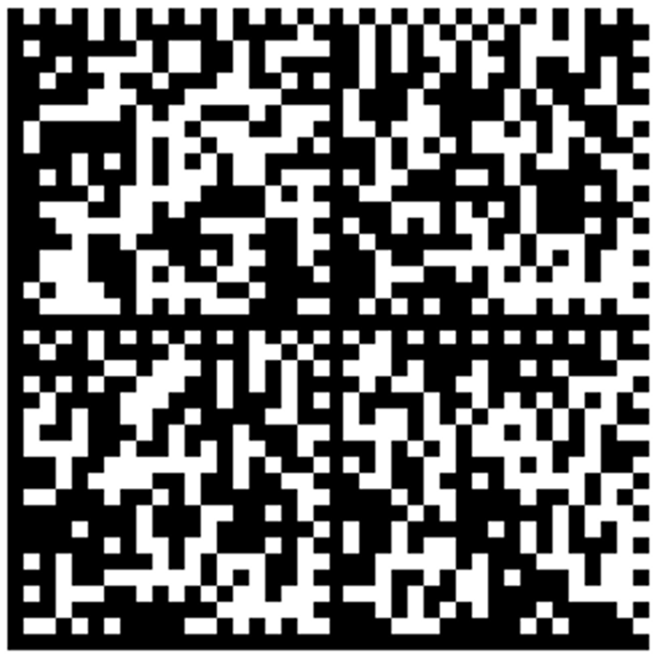

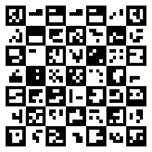


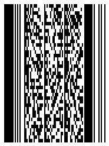

这里要注意的是，出题人可能会把图片反相导致无法直接扫描，因此我们可以先将图片拉入 PS 先进行反相处理

#### QRcode 二维码的一些考点

详见我博客里的[这篇文章](https://goodlunatic.github.io/posts/1e26f78/)

## Misc——PDF题思路：

1、直接binwalk或者foremost解出隐藏文件

2、可能是wbStego4open隐写，用wbStego4open直接decode

3、PDF中可能携带了什么文件，可以在Firefox或者别的PDF软件中打开并提取

4、PDF中可能有透明的文字，直接全选复制然后粘贴到记事本中查看即可

5、DeEgger Embedder隐写

可以直接使用 DeEgger Embedder 工具 extract files

6、使用PS打开，里面可能有多个图层(例题1-2024古剑山-jpg)

7、若PDF加密，可以尝试使用`pdfcrack`爆破一下密码（Ubuntu下可以直接apt install）

```bash
pdfcrack -f enc.pdf -w rockyou.txt
```

## Misc——MS-Office题思路

有时候会遇到不知道是MS-Office中具体什么类型的情况，如下图

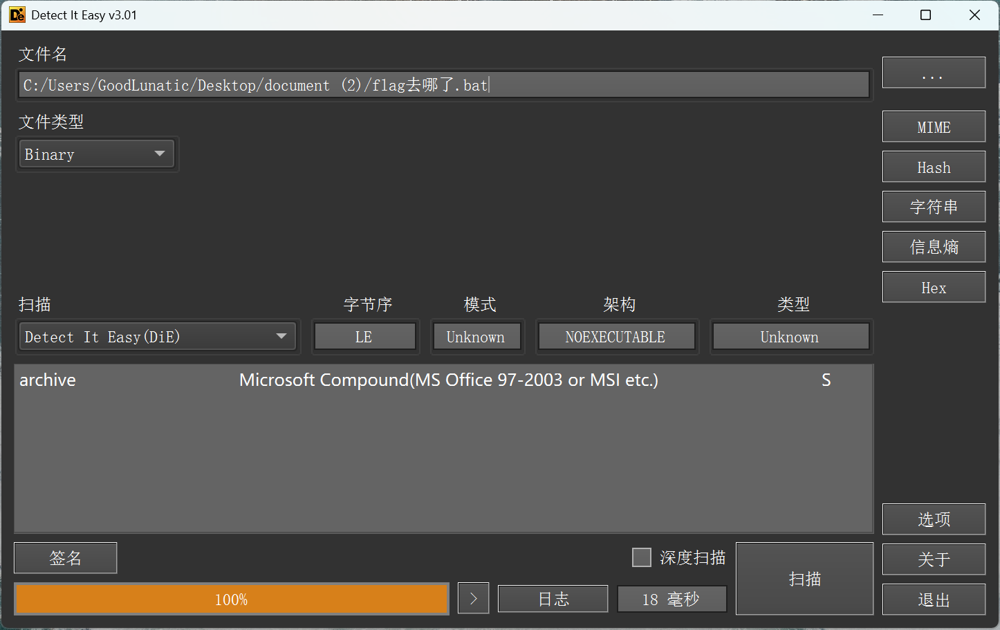

并且这个文件还是加密的，我们可以尝试把后缀改成`docx`或者`pptx`，然后用`PasswareKit`先爆破出密码

再用`msoffcrypto-tool`输入密码解密一下：https://github.com/nolze/msoffcrypto-tool

```bash
pip install msoffcrypto-tool
msoffcrypto-tool encrypted.docx decrypted.docx -p Passw0rd
```

解密完成后010打开就能判断出准确的文件类型了

### Excel文件：.xls .xlsx

1、拉入010或者记事本，查找flag
2、取消隐藏先前隐藏的行和列
3、条件格式里设置突出显示某些单元格(黑白后可能会有图案)
4、要先将数据按照行列排序后再进行处理

### Word文件：.doc .docx

#### 1、直接foremost出隐藏文件

#### 2、与宏有关系的各种攻击与隐写

分析word中的宏需要用到这样一个工具：oletools

这个工具直接在pip中安装即可使用: pip3 install oletools

#### doc格式可以不需要文档密码直接提取其中的vba宏代码

安装好oletools后直接运行以下代码提取即可，可能加密文档的加密算法就在期中

```
olevba .\attachment.doc &gt; test.txt
```

#### 3、利用行距来隐写（例：ISCC2023-汤姆历险记）

word中可能有一段是1倍行距，可能又有一段是1.5倍行距，需要根据不同行距敲出摩斯电码（单倍转为.多倍转为-空行转为空格或者分隔符）

#### 4、docx中有emf和oleobject

可以直接双击word中那个emf图标，激活相关内容(如音频文件)然后再进一步分析

## Misc——txt题思路：

### 1、 有可能是ntfs，直接用NtfsStreamsEditor2扫描所在文件夹，然后导出可疑文件【如果是压缩包，一定要用winrar解压】

### 2、可能是wbStego4open隐写，用wbStego4open直接decode(可能有密钥)

### 3、如果是那种文件夹套文件夹的题目，可以直接把路径粘贴到everything中，让everything一把梭

### 4、无字天书(whitespace)&amp;snow隐写

一个文件打开都是空白字符

可以使用在线网站解密：https://vii5ard.github.io/whitespace/ 复制进去直接run即可

snow隐写，到snowdos32工具目录下运行 SNOW.EXE -C -p password flag.txt 命令即可

### 5、垃圾邮件隐写(spammimic)

例题1-2024强网拟态初赛-PvZ

直接使用以下在线网站解密即可：

https://www.spammimic.com/

### 6、Cloakify隐写

例题1-群友发的题

附件下载链接：https://pan.baidu.com/s/1EMAMOeot_aKXIs5pckTQfQ?pwd=93np 提取码：93np

解密需要用到[Cloakify](https://github.com/TryCatchHCF/Cloakify)这个项目

拿到密文和字典后，直接Python运行解密即可

```bash
python2 decloakify.py cipher.txt passwd.txt
```

&gt; Tips：如果碰到解密失败的情况，可以试试看在windows下重新复制文本，并在末尾加一个换行符

## Misc——html题思路：

1、可能是wbStego4open隐写，用wbStego4open直接decode

## Misc——压缩包思路：

Tips：压缩包的密码可以是中英文字符和符号

​没有思路时可以直接纯数字/字母暴力爆破一下

### zip文件结构

三部分：压缩文件源数据区 &#43; 压缩源文件目录区 &#43; 压缩源文件目录结束标志

**文件源数据区**


|        字段名称        |              字段描述              |
| :----------------: | :----------------------------: |
|    frSignature     |       ZIP文件头，固定值504B0304       |
|     frVersion      |        解压所需的 pkware 版本         |
|      frFLags       | 全局方式位标记，最低位的1bit是1表示加密，是0表示未加密 |
|   frCompression    |    压缩方法（具体值如Store、Deflate等）    |
|     frFileTime     |          被压缩文件的最后修改时间          |
|     frFileDate     |          被压缩文件的最后修改日期          |
|       frCrc        |        文件压缩前 CRC-32 的值         |
|  frCompressedSize  |          被压缩文件压缩后的大小           |
| frUncompressedSize |          被压缩文件压缩前的大小           |
|  frFileNameLength  |          被压缩文件的文件名长度           |
| frExtraFieldLength |         扩展字段长度（具体值如0等）         |
|     frFileName     |           被压缩文件的文件名            |
|       frData       |          被压缩文件压缩后的数据           |

**文件目录区**

|         字段名称         |                              字段描述                               |
| :------------------: | :-------------------------------------------------------------: |
|     deSignature      |                         签名，通常是504B0102                          |
|   deVersionMadeBy    |                         制作于哪个 pkware 版本                         |
|  deVersionToExtract  |                  解析该目录需要的版本号，与数据区frVersion的值一致                  |
|       deFLags        |                      一般标志位，与数据区frFlags的值一致                      |
|    deCompression     |                   压缩方法，与数据区frCompression的值一致                    |
|      deFileTime      |                   被压缩文件的最后修改时间，与数据区中对应字段的值一致                    |
|      deFileDate      |                   被压缩文件的最后修改日期，与数据区中对应字段的值一致                    |
|        deCrc         |                         文件压缩前 CRC-32 的值                         |
|   deCompressedSize   |                           被压缩文件压缩后的大小                           |
|  deUncompressedSize  |                           被压缩文件压缩前的大小                           |
|   deFileNameLength   |                           被压缩文件的文件名长度                           |
|  deExtraFieldLength  |                      扩展字段长度（与数据区的对应值可能不一致）                      |
| deFileCommentLength  |                             文件备注长度                              |
|  deDiskNumberStart   |               文件起始位置所在的磁盘编号（早期磁盘很小的情况下，压缩包可能跨磁盘）                |
| deInternalAttributes |                             内部文件属性                              |
| deExternalAttributes |                             外部文件属性                              |
| uint deHeaderOffset  | 本目录指向的entry相对于第一个entry的起始位置，单位byte，这也就限制了ZIP文件最大也就是4G了，再大就无法定位了 |
|      deFileName      |                            被压缩文件的文件名                            |
|     deExtraField     |                              扩展字段                               |

**文件目录结束**

|         字段名称         |         字段描述         |
| :------------------: | :------------------: |
|     elSignature      |    签名，通常是504B0506    |
|     elDiskNumber     |        当前磁盘编号        |
|  elStartDiskNumber   |      中央目录起始磁盘编号      |
|   elEntriesOnDisk    |    当前磁盘上的中央目录记录数     |
| elEntriesInDirectory |       中央目录总条目数       |
|   elDirectorySize    |       中央目录的总大小       |
|  elDirectoryOffset   | 中央目录相对于第一个entry的起始位置 |
|   elCommentLength    |         注释长度         |
|    char elComment    |        压缩包注释         |

#### 常见报错及对应解决方法（借助010的模板功能）

1. 该文件已损坏-源数据区和目录区的文件名长度被修改了

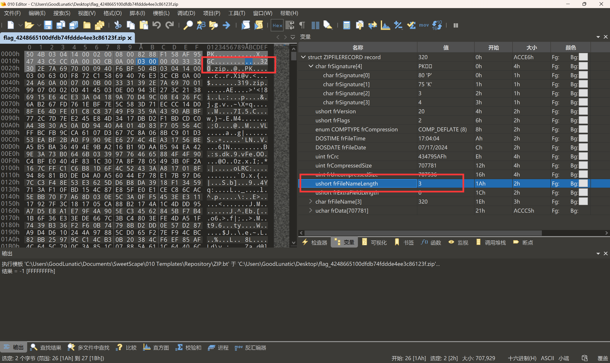

2. CRC校验错误-源数据区或目录区的压缩方法被修改了

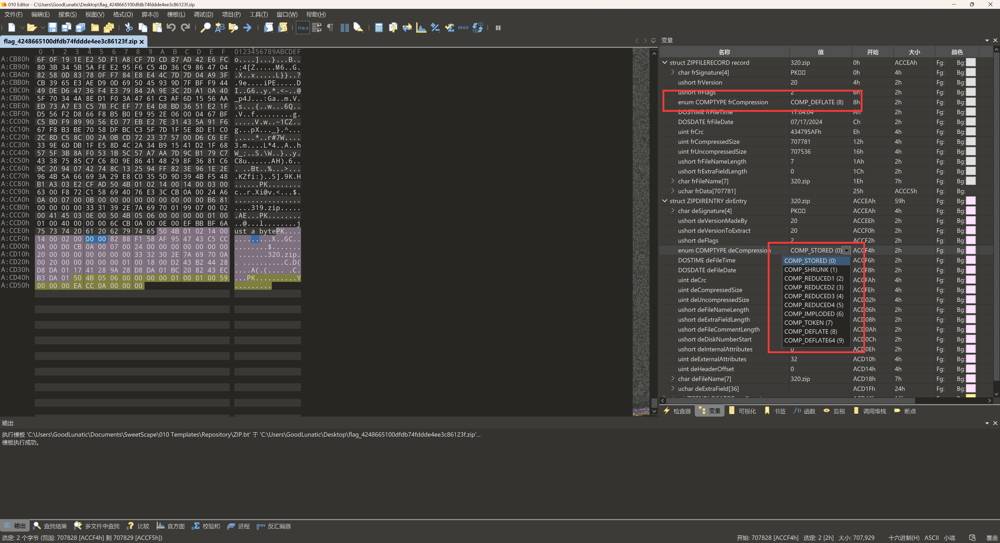

### rar文件结构

| HEX 数据             | 描述                        | 010Editor 模板数据 |
| -------------------- | --------------------------- | ------------------ |
| 52 61 72 21 1A 07 00 | rar 文件头标记，文本为 Rar! |                    |

**Main block**

| HEX 数据    | 描述              | 010Editor 模板数据      |
| ----------- | ----------------- | ----------------------- |
| 33 92 B5 E5 | 全部块的 CRC32 值 | uint32 HEAD_CRC         |
| 0A          | 块大小            | struct uleb128 HeadSize |
| 01          | 块类型            | struct uleb128 HeadType |
| 05          | 阻止标志          | struct uleb128 HeadFlag |

**File Header**

| HEX 数据    | 描述              | 010Editor 模板数据      |
| ----------- | ----------------- | ----------------------- |
| 43 06 35 17 | 单独块的 CRC32 值 | uint32 HEAD_CRC         |
| 55          | 块大小            | struct uleb128 HeadSize |
| 02          | 块类型            | struct uleb128 HeadType |
| 03          | 阻止标志          | struct uleb128 HeadFlag |

**Terminator**

| HEX 数据    | 描述            | 010Editor 模板数据      |
| ----------- | --------------- | ----------------------- |
| 1D 77 56 51 | 固定的 CRC32 值 | uint32 HEAD_CRC         |
| 03          | 块大小          | struct uleb128 HeadSize |
| 05          | 块类型          | struct uleb128 HeadType |
| 04 00       | 阻止标志        | struct uleb128 HeadFlag |

### 1、压缩包伪加密

&gt; 感觉网上很多讲压缩包伪加密的博客都是有问题的，因此打算这里详细总结一下
&gt; 
&gt; 首先，frFlags 只是用于告诉压缩软件这个压缩包是否被加密，**没有任何一个标志可以直接表示压缩包是否是伪加密**。我们只能通过frFlags这个标志位判断出压缩包当前是否是加密状态，如果是加密状态，我们再进一步尝试判断是否是伪加密。

#### zip文件：

Bandizip判断压缩包是否加密的方式：压缩源文件数据区的 `frFlags`

7zip判断压缩包是否加密的方式：压缩源文件目录区的 `frFlags`

因此，出题的时候需要把这两个位置都改了，要不然换个软件可能就直接非预期了

**去除伪加密的方法：直接用`010editor`打开，将压缩源文件数据区第8字节和压缩源文件目录区第10字节改为00即可**

#### rar文件：
rar文件的伪加密是非常明显的，打开就会显示报错

`010editor`打开，第24个字节尾数为4表示加密，0表示无加密，将尾数改为0即可去除伪加密

### 2、CRC爆破

适用于压缩包中文件比较小，比如只有几字节的时候

可以直接用网上的脚本爆破，但是要注意有些脚本只能提取zip压缩包的CRC32：

https://github.com/AabyssZG/CRC32-Tools

https://github.com/theonlypwner/crc32

```bash
python3 crc32.py reverse 0x7c2df918
```

发现网上大部分的脚本只能爆破可打印字符的结果，因此这里我自己写了一个包含不可打印字符的脚本

```python
import binascii

class CRC32Reverse:
    def __init__(self, crc32, length, tbl=bytes(range(256)), poly=0xEDB88320, accum=0):
        self.char_set = set(tbl)  # 支持所有字节
        self.crc32 = crc32
        self.length = length
        self.poly = poly
        self.accum = accum
        self.table = []
        self.table_reverse = []

    def init_tables(self, poly, reverse=True):
        &#34;&#34;&#34;构建 CRC32 表及其反向查找表&#34;&#34;&#34;
        # CRC32 表构建
        for i in range(256):
            for j in range(8):
                if i &amp; 1:
                    i &gt;&gt;= 1
                    i ^= poly
                else:
                    i &gt;&gt;= 1
            self.table.append(i)

        assert len(self.table) == 256, &#34;CRC32 表的大小错误&#34;

        # 构建反向查找表
        if reverse:
            for i in range(256):
                found = [j for j in range(256) if self.table[j] &gt;&gt; 24 == i]
                self.table_reverse.append(tuple(found))
            
            assert len(self.table_reverse) == 256, &#34;反向查找表的大小错误&#34;

    def calc(self, data, accum=0):
        &#34;&#34;&#34;计算 CRC32 校验值&#34;&#34;&#34;
        accum = ~accum
        for b in data:
            accum = self.table[(accum ^ b) &amp; 0xFF] ^ ((accum &gt;&gt; 8) &amp; 0x00FFFFFF)
        accum = ~accum
        return accum &amp; 0xFFFFFFFF

    def find_reverse(self, desired, accum):
        &#34;&#34;&#34;查找反向字节序列&#34;&#34;&#34;
        solutions = set()
        accum = ~accum
        stack = [(~desired,)]
        
        while stack:
            node = stack.pop()
            for j in self.table_reverse[(node[0] &gt;&gt; 24) &amp; 0xFF]:
                if len(node) == 4:
                    a = accum
                    data = []
                    node = node[1:] &#43; (j,)
                    for i in range(3, -1, -1):
                        data.append((a ^ node[i]) &amp; 0xFF)
                        a &gt;&gt;= 8
                        a ^= self.table[node[i]]
                    solutions.add(tuple(data))
                else:
                    stack.append(((node[0] ^ self.table[j]) &lt;&lt; 8,) &#43; node[1:] &#43; (j,))
        
        return solutions

    def dfs(self, length, outlist=[b&#39;&#39;]):
        &#34;&#34;&#34;深度优先搜索生成字节序列&#34;&#34;&#34;
        if length == 0:
            return outlist
        tmp_list = [item &#43; bytes([x]) for item in outlist for x in self.char_set]
        return self.dfs(length - 1, tmp_list)

    def run_reverse(self):
        &#34;&#34;&#34;执行 CRC32 反向查找&#34;&#34;&#34;
        self.init_tables(self.poly)

        desired = self.crc32
        accum = self.accum
        result_list = []

        # 处理至少为 4 字节的情况
        if self.length &gt;= 4:
            patches = self.find_reverse(desired, accum)
            for patch in patches:
                checksum = self.calc(patch, accum)
                # print(f&#34;verification checksum: 0x{checksum:08x} ({&#39;OK&#39; if checksum == desired else &#39;ERROR&#39;})&#34;)
            for item in self.dfs(self.length - 4):
                patch = list(item)
                patches = self.find_reverse(desired, self.calc(patch, accum))
                for last_4_bytes in patches:
                    patch.extend(last_4_bytes)
                    checksum = self.calc(patch, accum)
                    if checksum == desired:
                        result_list.append(bytes(patch))  # 添加符合条件的字节序列
        else:
            for item in self.dfs(self.length):
                if self.calc(item) == desired:
                    result_list.append(bytes(item))  # 添加符合条件的字节序列
        return result_list

def crc32_reverse(crc32, length, char_set=bytes(range(256)), poly=0xEDB88320, accum=0):
    obj = CRC32Reverse(crc32, length, char_set, poly, accum)
    return obj.run_reverse()  # 返回所有结果

def crc32(s):
    return binascii.crc32(s) &amp; 0xFFFFFFFF

if __name__ == &#34;__main__&#34;:
    crc_values = [0xf72c104b, 0x39004188]
    for item in crc_values:
        print(crc32_reverse(item, 5))
```

例题1-BugKu MISC 就五层你能解开吗?

参考文章：https://blog.csdn.net/mochu7777777/article/details/110206427

### 3、暴力破解压缩包密码

可以使用的工具：`Advanced Archive Password Recovery(ARCHPR)`、`Passware Kit Forensic`、`Hashcat` 

爆破效率:`Advanced Archive Password Recovery(ARCHPR)` &lt; `Passware Kit Forensic`&lt; `Hashcat`

爆破的类型主要可以分为`限制字符集及长度的爆破`、`掩码爆破`、`字典爆破`这三种

&gt; Tips：
&gt; 1. 掩码爆破这里，`ARCHPR`是用`?`表示占位符、而`Passware Kit Forensic`是用例如`?d`等正则表达式表示占位符
&gt; 
&gt; 2. 字典爆破推荐使用`rockyou.txt`这个字典，`kali`系统中自带了，在`/usr/share/wordlists`目录下

**Hashcat爆破压缩包密码的步骤**

1. 生成待爆破的Hash值

```
联网的情况下可以使用在线网站生成：https://hashes.com/en/johntheripper
断网的情况下可以使用johntheripper生成 .\zip2john.exe .\layer3.zip
```

2.找到对应的Hash类型：https://hashcat.net/wiki/doku.php?id=example_hashes

3.使用Hashcat进行爆破
```bash
.\hashcat.exe -a 3 -m 17200 hash1.txt --increment --increment-min 1 --increment-max 8 ?d?d?d?d?d?d?d?d --force
.\hashcat.exe -a 3 -m 17200 -1 ?d hash2.txt Y3p_P@ssW0rd_1s_?1?1?1?1?1?1 --force
.\hashcat.exe -a 0 -m 17200 hash3.txt rockyou.txt --force
.\hashcat.exe -a 3 -m 11600 -1 ?d hash4.txt Y3p_Ke9_1s_?1?1?1?1?1 --force
```

&gt; 参数含义：
&gt; 
&gt; -a 后跟使用的攻击类型 3表示掩码攻击 0表示字典攻击
&gt; 
&gt; -m 后跟待爆破的Hash类型，具体类型参考上面的链接
&gt; 
&gt; --increment --increment-min 1 --increment-max 6 表示限制长度1-6位
&gt; 
&gt; -1 表示自定义字符集 ?d代表数字  ?l代表小写字母  ?u代表大写字母  ?s代表特殊符号
&gt; 
&gt; --force 代表忽略破解过程中的警告信息
&gt; 
&gt; --show 输出已爆破出的Hash值及对应明文，爆破成功的Hash会保存在hashcat.potfile文件中

### 4、压缩包套娃解套

压缩包套娃可能会包含多种类型的压缩混合套娃，但是流程都差不多，这里就贴一下我写的脚本吧

```python
import zipfile
import rarfile
import py7zr
import os

def decompress_7z(archive_file):
    with py7zr.SevenZipFile(archive_file, &#39;r&#39;) as archive:
        file_list = archive.list()
        new_archive_file = file_list[0].filename
    with py7zr.SevenZipFile(archive_file, mode=&#39;r&#39;) as archive:
        archive.extractall(&#34;tmp/&#34;)
    print(f&#34;[&#43;] {archive_file} 解压成功 ==&gt;&#34;)
    os.remove(archive_file)
    os.system(&#34;mv tmp/* .&#34;)
    os.rmdir(&#34;tmp&#34;)
    return new_archive_file

def decompress_zip(archive_file):
    with zipfile.ZipFile(archive_file, &#39;r&#39;) as zip_ref:
        file_list = zip_ref.namelist()
        new_archive_file = file_list[0]
    os.mkdir(&#34;tmp&#34;)
    with zipfile.ZipFile(archive_file, &#39;r&#39;) as zip_ref:
        zip_ref.extractall(path=&#34;tmp/&#34;)
    print(f&#34;[&#43;] {archive_file} 解压成功 ==&gt;&#34;)
    os.remove(archive_file)
    os.system(&#34;mv tmp/* .&#34;)
    os.rmdir(&#34;tmp&#34;)
    return new_archive_file

def decompress_rar(archive_file):
    with rarfile.RarFile(archive_file) as rar_ref:
        file_list = rar_ref.namelist()
        new_archive_file = file_list[0]
    os.mkdir(&#34;tmp&#34;)
    with rarfile.RarFile(archive_file) as rar_ref:
        rar_ref.extractall(path=&#34;tmp/&#34;)
    print(f&#34;[&#43;] {archive_file} 解压成功 ==&gt;&#34;)
    os.remove(archive_file)
    os.system(&#34;mv tmp/* .&#34;)
    os.rmdir(&#34;tmp&#34;)
    return new_archive_file

if __name__ == &#34;__main__&#34;:
    archive_file = &#34;flag.zip&#34;
    while True:
        if &#34;7z&#34; in archive_file:
            archive_file = decompress_7z(archive_file)
        elif &#34;rar&#34; in archive_file:
            archive_file = decompress_rar(archive_file)
        elif &#34;zip&#34; in archive_file:
            archive_file = decompress_zip(archive_file)
        else:
            break
```

```python
import os
import subprocess
import py7zr

input_file = &#39;shell9999.tar.gz&#39;  # 更改为你的文件路径

def get_compressed_type(filepath: str) -&gt; str:
    cmd = [&#39;file&#39;, filepath]
    file_cmd_output = subprocess.run(cmd, stdout=subprocess.PIPE).stdout.decode().strip()

    if &#39;gzip compressed data&#39; in file_cmd_output:
        return &#39;tar.gz&#39;
    if &#39;Zip archive data&#39; in file_cmd_output:
        return &#39;zip&#39;
    if &#39;7-zip archive data&#39; in file_cmd_output:
        return &#39;7z&#39;
    if &#39;gzip compressed data&#39; in file_cmd_output:
        return &#39;gzip&#39;
    if &#39;XZ compressed data&#39; in file_cmd_output:
        return &#39;xz&#39;
    if &#39;bzip2 compressed data&#39; in file_cmd_output:
        return &#39;bzip2&#39;
    if &#39;LZMA compressed data&#39; in file_cmd_output:
        return &#39;lzma&#39;
    if &#39;Zstandard compressed data&#39; in file_cmd_output:
        return &#39;zstd&#39;
    return &#39;&#39;

while True:
    ctype = get_compressed_type(input_file)
    if ctype == &#34;tar.gz&#34;:
        cmd = [&#39;tar&#39;, &#39;-xzf&#39;, input_file]
        subprocess.run(cmd)
    elif ctype == &#34;zip&#34;:
        cmd = [&#39;unzip&#39;, input_file]
        subprocess.run(cmd)
    elif ctype == &#34;7z&#34;:
        with py7zr.SevenZipFile(input_file, mode=&#39;r&#39;) as z:
            z.extractall()
    elif ctype == &#34;gzip&#34;:
        tmp_file = input_file &#43; &#34;.gz&#34;
        cmd = &#34;mv {} {}; gunzip {}&#34;.format(input_file, tmp_file, tmp_file)
    elif ctype == &#34;xz&#34;:
        tmp_file = input_file &#43; &#34;.xz&#34;
        cmd = &#34;mv {} {}; unxz {}&#34;.format(input_file, tmp_file, tmp_file)
    elif ctype == &#34;bzip2&#34;:
        tmp_file = input_file &#43; &#34;.bz2&#34;
        cmd = &#34;mv {} {}; bunzip2 {}&#34;.format(input_file, tmp_file, tmp_file)
    elif ctype == &#34;lzma&#34;:
        tmp_file = input_file &#43; &#34;.lzma&#34;
        cmd = &#34;mv {} {}; unlzma {}&#34;.format(input_file, tmp_file, tmp_file)
    elif ctype == &#34;zstd&#34;:
        tmp_file = input_file &#43; &#34;.zst&#34;
        cmd = &#34;mv {} {}; unzstd --force {}&#34;.format(input_file, tmp_file, tmp_file)
    else:
        print(&#34;Unsupported file type or done extracting!&#34;)
        break

    # 删除已解压的文件并更新input_file为新解压的文件
    os.remove(input_file)
    files = [f for f in os.listdir() if os.path.isfile(f) and f != &#34;test.py&#34;]
    if len(files) == 1:
        input_file = files[0]
    else:
        print(&#34;Unexpected number of files in directory!&#34;)
        break

```

&gt; Tips：ZIP压缩包套娃建议用`pyzipper`模块写脚本解套，不要用`zipfile`了，这个模块有点过时了

### 5、分卷压缩包合并

使用以下命令合并或者直接`Bandizip`打开
```bash
copy /B topic.zip.001 &#43; topic.zip.002&#43;topic.zip.003&#43;topic.zip.004&#43;topic.zip.005&#43;topic.zip.006 topic.zip
```


### 6、压缩包炸弹

很小的压缩文件，解压出来会占据巨大的空间，甚至撑爆磁盘

处理方法：010中直接编辑压缩包文件，看看是否藏有另一个压缩包

### 7、根据010中的模板修改了某些参数

有些题目可能会修改源数据中压缩包文件中被压缩文件的文件名的长度

源数据中被压缩文件名字的长度对不上也会导致解压后文件无法打开

所以...010的模板功能真的非常非常的好用！

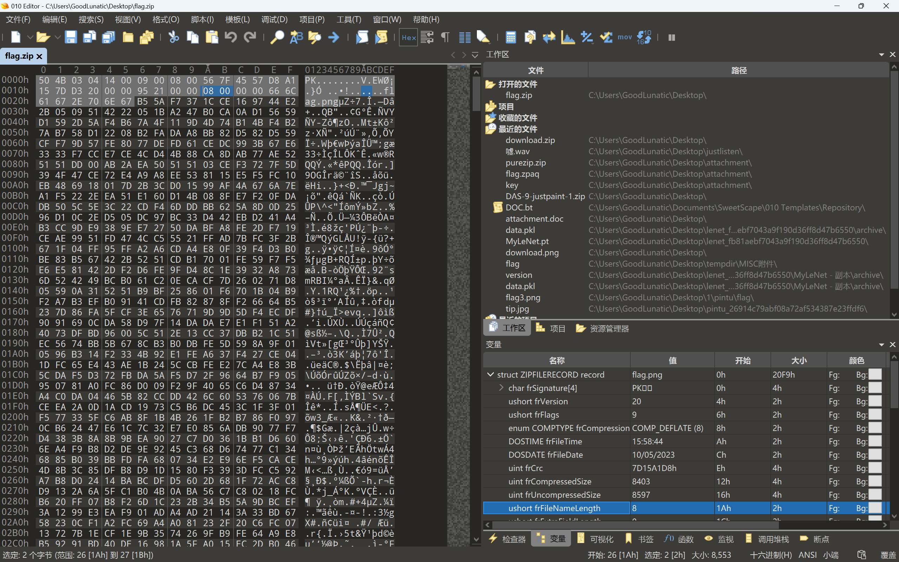

### 8、压缩包密码是不可见字符

#### 字节数很短的情况

直接写个Python脚本爆破即可

```python
import zipfile
import libnum

def solve():
    # 在ASCII编码中，一个字符占用8位（1字节）
    for i in range(256):
        for j in range(256):
            fz = zipfile.ZipFile(&#39;secret key.zip&#39;, &#39;r&#39;)
            password = libnum.n2s(i) &#43; libnum.n2s(j)
            print(f&#34;[&#43;]正在尝试密码{password}&#34;)
            try:
                fz.extractall(pwd=password)
                fz.close()
                return password
            except:
                fz.close()
                continue
    return None

if __name__ == &#34;__main__&#34;:
    password = solve()
    if password:
        print(f&#34;[&#43;]压缩包解压成功,密码是{password}&#34;)
    else:
        print(f&#34;[&#43;]在该范围内找不到压缩包密码，压缩包解压失败&#34;)
```

#### 字节数较长的情况

需要先把密码base64编码一下，然后再base64解码成byte类型作为密码

```python
import base64
import pyzipper

target_zip = &#39;1.zip&#39;
outfile = &#39;./solved&#39;

pwd = base64.b64decode(b&#39;aEXigItjVOKAjEbigI8=&#39;)
# b&#39;hE\xe2\x80\x8bcT\xe2\x80\x8cF\xe2\x80\x8f&#39;
with pyzipper.AESZipFile(target_zip, &#39;r&#39;) as f:
    f.pwd = pwd
    f.extractall(outfile)
```

### 9、明文攻击

#### 已知所有的明文或三段密钥

方法一、直接使用Advanced Archive Password Recovery破解

&gt; 有和压缩包中的一样(CRC值一样)的文件时，压缩然后用上面那个软件进行明文攻击,这个攻击的过程可能需要几分钟
&gt; 
&gt; 有了完整的三段密钥也可以使用这个工具破解密码

方法二、使用 bkcrack破解(推荐)

&gt; 把相同文件按照对应的压缩方法，压缩成压缩包，然后使用bkcrack破解即可

例题1-2023古剑山-幸运饼干

  ```bash
  $ bkcrack -C flag.zip -c hint.jpg -p hint.jpg -P hint.zip
  bkcrack 1.5.0 - 2023-03-08
  [14:37:27] Z reduction using 25761 bytes of known plaintext
  100.0 % (25761 / 25761)
  [14:37:29] Attack on 289 Z values at index 21821
  Keys: afb9fee3 f8795353 f6de1d4e
  100.0 % (289 / 289)
  [14:37:29] Keys
  afb9fee3 f8795353 f6de1d4e
  ```

例题2-2023铁三决赛-baby_jpg

&gt; 先从部分伪加密的压缩包中分离出`serect.pdf`，然后从PDF中 foremost 出了加密压缩包中的`sha512.txt`
&gt; 
&gt; 将`sha512.txt`压缩成`sha512.zip`，然后使用下面的命令进行明文攻击即可：

```bash
$ bkcrack -C 00000218.zip -c &#39;sha512.txt&#39; -P sha512.zip -p sha512.txt
bkcrack 1.5.0 - 2023-03-08
[16:14:25] Z reduction using 78 bytes of known plaintext
100.0 % (78 / 78)
[16:14:25] Attack on 104916 Z values at index 6
Keys: ed3fb6a9 1c4a7211 c07461ed
59.9 % (62867 / 104916)
[16:14:52] Keys
ed3fb6a9 1c4a7211 c07461ed

$ bkcrack -C 00000218.zip -k ed3fb6a9 1c4a7211 c07461ed -U out.zip 111
bkcrack 1.5.0 - 2023-03-08
[16:15:44] Writing unlocked archive out.zip with password &#34;111&#34;
100.0 % (3 / 3)
Wrote unlocked archive.
```

&gt; 参数含义：
&gt; 
&gt; -C 后跟待破解的压缩包，
&gt; 
&gt; -c 后跟压缩包中我们要攻击的明文文件
&gt; 
&gt; -P 后跟我们压缩好的压缩包
&gt; 
&gt; -p 后跟我们已得的明文文件
&gt; 
&gt; -U 参数用于修改压缩包密码并导出

#### 已知部分明文

**利用bkcrack进行攻击**

&gt; 参考资料:
&gt; 
&gt; https://www.freebuf.com/articles/network/255145.html
&gt; 
&gt; https://byxs20.github.io/posts/30731.html#%E6%80%BB%E7%BB%93

该利用方法的具体要求如下：

&gt; 1. 至少已知明文的12个字节及偏移，其中至少8字节需要连续
&gt; 
&gt; 2. 明文对应的**加密算法**需要是：`ZipCrypto`（Tips：**压缩算法**不一定要是`Store`，有时候`Deflate`也可以）
&gt; 
&gt; 1. 需要知道出题人用的压缩工具

如何判断压缩工具（参考自Byxs20的博客）

|     压缩工具     | VersionMadeBy(压缩所用版本) |
| :----------: | :-------------------: |
| Bandzip 7.06 |          20           |
|  Windows自带   |          20           |
| WinRAR 4.20  |          31           |
| WinRAR 5.70  |          31           |
|    7-Zip     |          63           |

**bkcrack常用参数**

```bash
-c 要解密的文件
-P 已知明文所在的压缩包
-p 已知的明文部分
-x 压缩包内目标文件的偏移地址  部分已知明文值
-C 加密压缩包
-o offset  -p参数指定的明文在压缩包内目标文件的偏移量
-k 后面加破解出的三段密钥
-d 后面加解密后数据的保存位置
-U 修改压缩包密码并导出	bkcrack -C flag.zip -c hint.jpg -k afb9fee3 f8795353 f6de1d4e -U out.zip 114514
```

##### 1)利用明文文本破解

```
已知 flag{16e371fa-0555-47fc-b343-74f6754f6c01} 字符串中的flag{16e*********************74f6********
```

```bash
echo -n &#34;lag{16e3&#34; &gt; plain1.txt   #连续的8明文
echo -n &#34;74f6&#34; | xxd             #额外明文的十六进制格式，37346636
bkcrack -C 7-2.zip -c flag.txt -p plain1.txt -o 0 -x 29 37346636
bkcrack -C 7-2.zip -c flag.txt -p plain1.txt -o 0 -x 29 37346636
bkcrack -C 7-2.zip -c flag.txt -k b21e5df4 ab9a9430 8c336475 -U out.zip 123

# -o 和 -x 后需要已知明文在文件中的偏移量
# -o 指定的明文不需要转为十六进制
# -x 指定的明文需要转成十六进制
```

##### 2)利用PNG图片文件头破解

```bash
echo 89504E470D0A1A0A0000000D49484452 | xxd -r -ps &gt; png_header
bkcrack -C png4.zip -c 2.png -p png_header -o 0
bkcrack -C png4.zip -c flag.txt -k e0be8d5d 70bb3140 7e983fff -U out.zip 123
```

##### 3)利用压缩包格式破解

&gt; 将一个名为flag.txt的文件打包成ZIP压缩包后，发现文件名称会出现在压缩包文件头中，且偏移固定为30
&gt; 
&gt; 且默认情况下，flag.zip也会作为该压缩包的名称
&gt; 
&gt; 已知的明文片段有：
&gt; 
&gt; “flag.txt”  8个字节，偏移30
&gt; 
&gt; ZIP本身文件头：50 4B 03 04 ，4字节
&gt; 
&gt; 满足12字节的要求

```bash
echo -n &#34;flag.txt&#34; &gt; plain1.txt # -n参数避免换行，不然文件中会出现换行符，导致攻击失效
bkcrack -C 7-4.zip -c flag.zip -p plain1.txt -o 30  -x 0 504B0304
bkcrack -C 7-4.zip -c flag.zip -k b21e5df4 ab9a9430 8c336475  -U out.zip 123
```

&gt; Tips：如果这里用 `XXXXX.txt`作为明文无法破解成功，可以试试直接去掉后缀`.txt`

例题1-NKCTF2023——五年Misc，三年模拟

```bash
#echo -n &#34;handsome.txt&#34; &gt; plain1.txt 破解失败
echo -n &#34;handsome&#34; &gt; plain1.txt
bkcrack -C test5.zip -c handsome.zip -p plain1.txt -o 30  -x 0 504B0304
```

##### 4)利用EXE文件格式破解

&gt; EXE文件默认加密情况下，不太会以store方式被加密，但它文件格式中的的明文及其明显，长度足够。
&gt; 
&gt; 如果加密ZIP压缩包出现以store算法存储的EXE格式文件，很容易进行破解。
&gt; 
&gt; 大部分exe中都有这相同一段，且偏移固定为64：


```bash
echo -n &#34;0E1FBA0E00B409CD21B8014CCD21546869732070726F6772616D2063616E6E6F742062652072756E20696E20444F53206D6F64652E0D0D0A2400000000000000&#34; | xxd -r -ps &gt; mingwen # 需要在Linux下使用，Windows下可以用010或者CyberChef
bkcrack -C 7-5.zip -c nc64.exe -p mingwen -o 64
bkcrack -C 7-5.zip -c nc64.exe -k b21e5df4 ab9a9430 8c336475  -U out.zip 123
```

##### 5)利用pcapng格式破解

```bash
echo -n &#34;00004D3C2B1A01000000FFFFFFFFFFFFFFFF&#34; | xxd -r -ps &gt; pcap_plain # 需要在Linux下使用，Windows下可以用010或者CyberChef
bkcrack -C 7-6.zip -c capture.pcapng -p pcap_plain -o 6
bkcrack -C 7-6.zip -c capture.pcapng  -k 2c795462 fe9163bf 53086712  -U out.zip 123
```

##### 6)利用XML文件格式破解

```
robots.txt的文件开头内容通常是User-agent: * 
html文件开头通常是 &lt;!DOCTYPE html&gt;
xml文件开头通常是&lt;?xml version=&#34;1.0&#34; encoding=&#34;UTF-8&#34;?&gt;
```

```bash
echo -n &#39;&lt;?xml version=&#34;1.0&#34; encoding=&#34;UTF-8&#34;?&gt;&#39; &gt; xml_plain
bkcrack -C 7-7.zip -c 123/web.xml -p xml_plain -o 0 # 注意相对路径
bkcrack -C 7-7.zip -c 123/web.xml  -k e0be8d5d 70bb3140 7e983fff  -U out.zip 123
```

##### 7)利用SVG文件格式破解

```bash
#SVG是一种基于XML的图像文件格式
echo -n &#39;&lt;?xml version=&#34;1.0&#34; &#39; &gt; plain.txt
bkcrack -C 7-8.zip -c spiral.svg -p plain.txt -o 0
bkcrack -C 7-8.zip -c advice.jpg -k c4038591 d5ff449d d3b0c696 -U out.zip 123
```

##### 8)利用VMDK文件格式破解

```bash
echo -n &#34;4B444D560100000003000000&#34; | xxd -r -ps &gt; plain
bkcrack -C 7-9.zip -c flag.vmdk -p plain -o 0
bkcrack -C 7-9.zip -c flag.vmdk -k e6a73d9f 21ccfdbc f3e0c61c -U out.zip 123
```

**有时候直接给你部分明文的情况（2023 DASCTFxCBCTF）**

直接在bkcrack中使用以下命令即可，key是题目给的压缩包中被压缩文件的部分明文

```bash
bkcrack -C purezip.zip -c &#39;secret key.zip&#39; -p key
```

#### 得到密钥后使用bkcrack修改压缩包密码

破解出压缩包的三段密钥后，可以用 -U 参数修改压缩包密码并导出

```bash
$ bkcrack -C 00000218.zip -k ed3fb6a9 1c4a7211 c07461ed -U out.zip 111
bkcrack 1.5.0 - 2023-03-08
[16:15:44] Writing unlocked archive out.zip with password &#34;111&#34;
100.0 % (3 / 3)
Wrote unlocked archive.
```

#### 得到密钥后反向爆破压缩包密码

```bash
bkcrack -k e48d3828 5b7223cc 71851fb0 -r 3 \?b

bkcrack 1.5.0 - 2023-03-08
[17:47:50] Recovering password
length 0-6...
[17:47:50] Password
as bytes: 8b e7 dc
as text: ���
```

#### 在比赛中的使用记录

**2022 西湖论剑zipeasy**

```
bkcrack -C zipeasy.zip -c dasflow.zip -x 30 646173666c6f772e706361706e67 -x 0 504B0304
```

**2023 DASCTFxCBCTF**

利用bkcrack反向爆破密钥

```bash
bkcrack -k e48d3828 5b7223cc 71851fb0 -r 3 \?b

bkcrack 1.5.0 - 2023-03-08
[17:47:50] Recovering password
length 0-6...
[17:47:50] Password
as bytes: 8b e7 dc
as text: ���
```

然后如果要对得到的密钥进行MD5加密，可以使用CyberChef（From Hex &#43; MD5）

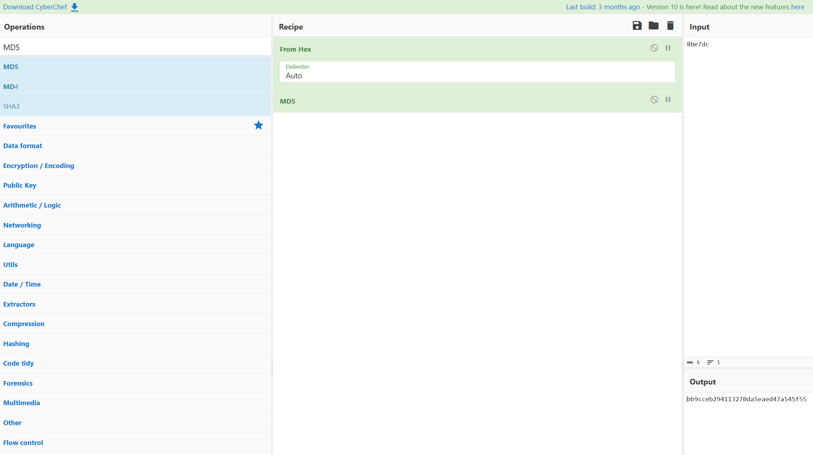

&gt; Tips：
&gt; 1. 明文攻击失败可以尝试多换几个压缩软件：Bandizip、Winrar、7zip、360压缩、2345压缩、kali自带的压缩软件等
&gt; 
&gt; 2. 这里`echo -n xxx &gt; 1.txt`要注意在Windows下使用默认是`utf-16LE`编码，Linux下使用才是`utf-8`，这个原因也会导致攻击失败
&gt; 
&gt; 3. 这里密钥爆破成功后推荐使用-U改密码导出压缩包，不推荐使用-d直接解出对应文件，因为如果文件是`deflate`压缩的直接解出来会乱码

### 10、直接补上Zlib头解压

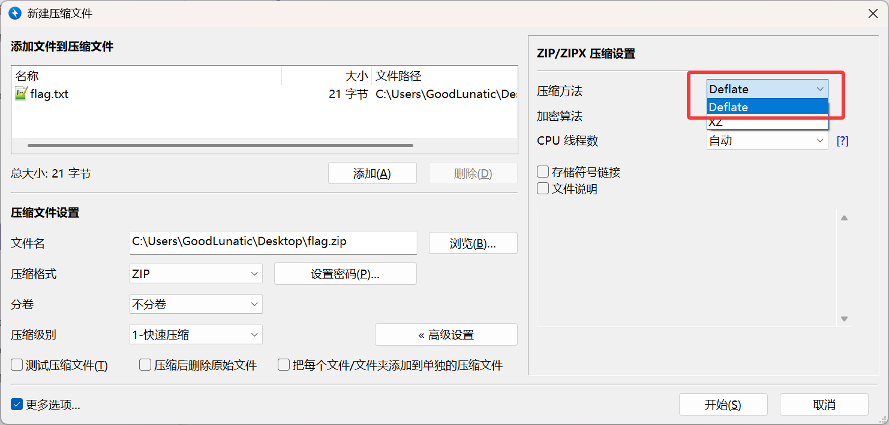

假如压缩包在压缩时选择的是无加密并且压缩方法是`Deflate`

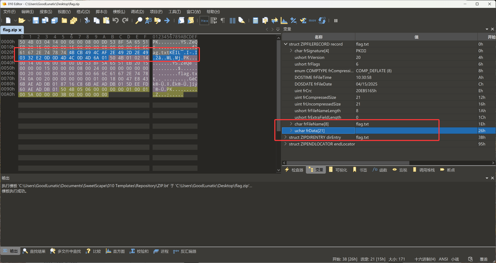

我们可以直接在010中把`frData`的数据提取出来，前面加上`78 9C`然后`Zlib Inflate`解压即可

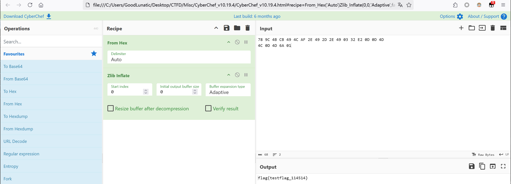

例题1-2025TGCTF-ez_zip

11、把加密的压缩包篡改成伪加密的情况

解决方案：将加密位修改回来即可

&gt; 以下内容参考自八神：
&gt; 
&gt; frFlags和deFlags这两字节其实就叫Flags，010模板里写fr和de是为了区分数据存储区还是中央目录区
&gt; 
&gt; 然后这两字节一共16bit,只有最低位是记录加密与否的，倒数第二三两个bit记录压缩选项，大部分情况下改了没事
&gt; 
&gt; 但这两字节改成09的话就动了倒数第四个bt,记录数据描述符，这个bit是1的话，标头里的CRC32和文件大小是未知的
&gt; 
&gt; 实际数据会以额外的12或16字节结构出现在压缩数据后面，把一个实际上没有数据描述符的压缩包的flags倒数第四bit改成1
&gt; 
&gt; 会导致软件被指示去读取一个不存在的描述符片段，从而导致后续的数据读取全部错乱

## Misc——视频题思路：

1、可能有音频隐写，用mkvtool分离出音频，再拉入Au看频谱图

2、可能是视频中的每一帧图片都有LSB隐写（2023 WMCTF）

3、循环读取视频每一帧图像中指定列的指定像素（2023 极客大挑战）

```python
import cv2
from PIL import Image

# 创建一个视频读取对象，读取名为&#39;kira.mp4&#39;的视频文件。
video = cv2.VideoCapture(&#39;kira.mp4&#39;)  # type: ignore

# # 设置要提取的帧数，如现在指定的是第100帧
# video.set(cv2.CAP_PROP_POS_FRAMES, 100)
# # 读取视频的指定帧
# ret, frame = video.read()
# # 保存提取的帧为图像文件
# cv2.imwrite(&#39;1.png&#39;, frame)
# # 释放视频对象
# video.release()

# 定义视频的尺寸为1920x1080
video_size = [1920, 1080]
# 设置起始像素为5
start_pixel = 5
# 设置每个像素块的大小为10
size = 10
# 创建一个新的图像对象，大小为视频尺寸除以像素块大小，即原视频的帧的抽样结果
out = Image.new(&#39;RGB&#39;, (video_size[0] // size, video_size[1]//size))
# 初始化帧率计数为0
fps_count = 0
# 循环读取每一帧图像中指定列的指定像素
while True:
    print(f&#34;[&#43;] 当前正在读取视频的第{fps_count}帧&#34;)
    # 从视频文件中读取一帧，success为是否成功读取帧的结果，frame为读取的帧
    success, frame = video.read()
    # 如果读取失败，跳出循环
    if not success:
        print(f&#34;[X] 视频的第{fps_count}帧读取失败&#34;)
        break
    # 对每一行像素进行遍历，从视频的高度减去起始像素并除以像素块大小，得到需要遍历的行数
    for y in range((video_size[1]-start_pixel)//size):
        try:
            # 从当前行中获取一个像素，使用getpixel方法获取指定坐标处的像素，并将其转换为PIL图像格式
            pixel = Image.fromarray(frame).getpixel(
                (start_pixel&#43;fps_count*size, start_pixel&#43;y*size))
            # 将获取的像素值设置为抽样图像的对应像素位置的值
            out.putpixel((fps_count, y), pixel)
        except:
            pass
    # 帧率计数加1，准备下一帧的处理
    fps_count &#43;= 1

# 将抽样图像保存为&#39;out.png&#39;文件
out.save(&#39;out.png&#39;)
out.show()
```

4、DeEgger Embedder隐写

可以直接使用 DeEgger Embedder 工具 extract files

例题-攻防世界 PyHaHa

## Misc——音频题思路：

### 1、波形图分析：摩斯电码

### 2、频谱图分析(有时要调高最高频率)：

### 3、Silenteye隐写

wav音频文件可能是 silenteye 隐写，可以拿默认密码 silenteye 解密试试看

### 4、Deepsound隐写

先用 deepsound 打开试一下，如果需要密码说明就是 deepsound 隐写，有密钥直接填入密钥解密即可

如果是 deepsound 隐写并且没有密钥，就先用`deepsound2john`脚本获取wav文件的哈希值(注释里有使用方法)，

然后拉入kali用john爆破hash(如果编码有误，可以先用notepad另存为一下)

执行：john 1.txt

### 5、SSTV慢扫描电视：

**SSTV识别可以直接用这个项目里的脚本：https://github.com/colaclanth/sstv**

```bash
# 安装步骤：
sudo python3 setup.py install 
# 注意python版本如果低于python3.9，需要将setup.py中的numpy那一行注释
# 使用命令如下，图片会自动命名为result.png
sstv -d flag.wav
```

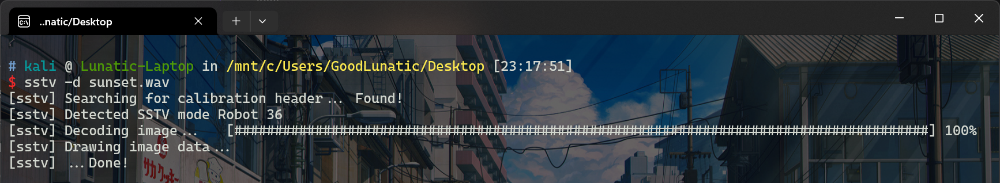

#### Windows中使用RX-SSTV

使用前还要安装虚拟声卡 Virtual Audio Cable

```bash
#使用步骤:
1.点击Setup-Sound Control and Devices将默认输入设备和输出设备都设置为虚拟声卡line1
2.用VLC播放音频（最好不要用Au播放）
3.如果扫描出来的图片有错位，可以点击slant手动修改
4.退出RX-SSTV前要注意把默认的输入/输出设备改回原来的参数
```

#### 拉入kali用qsstv（有时候要用到反向和反相）

### 6、电话音分析(DTMF)

用在线网站解码:http://www.dialabc.com/sound/detect/

或者在Windows下使用[ribt/dtmf-decoder](https://github.com/ribt/dtmf-decoder)这个开源项目解密

上面工具的识别可能有误差，如果想要更加精确，可以尝试按照下面这个对照表用肉眼去看

&gt; 参考链接：https://blog.csdn.net/qawsedrf123lala/article/details/132084646

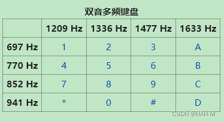

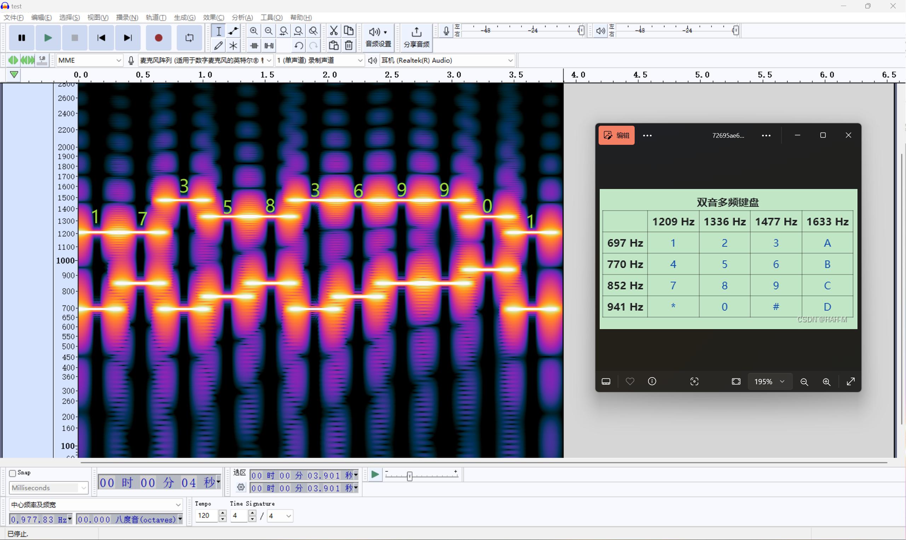

&gt; Tips：如果音频中看不出来可以尝试在Au中把音频增幅，要求能看到两条白线

### 7、wav可能是业余无线电文件：

先用sox把wav转为raw：

sox -t wav latlong.wav -esigned-integer -b16 -r 22050 -t raw latlong.raw

再用multimon-ng分析:

multimon-ng -t raw -a AFSK1200 latlong.raw 

### 8、WAV可能是steghide隐写(可以无密码)

```bash
#如果密码已经知道了
steghide extract -sf filename -p passwd
```

在WSL或者kali里用Stegseek跑（字典在wordlist里）

```bash
#如果密码未知
可以用下面这个脚本爆破
#bruteStegHide.sh
#!/bin/bash

for line in `cat $2`;do
    steghide extract -sf $1 -p $line &gt; /dev/null 2&gt;&amp;1
    if [[ $? -eq 0 ]];then
        echo &#39;password is: &#39;$line
        exit
    fi
done
```

```bash
#或者在WSL或者kali里用Stegseek跑（字典在wordlist里）
stegseek filename rockyou.txt
```

### 9、MP3可能是mp3stego隐写(可以无密码)

使用前需要先把要处理的文件放到 mp3stego 目录下

```bash
# Encode
encode -E data.txt -P pass sound.wav sound.mp3    
data.txt里面放要隐写的txt信息 pass是解密时需要的密码
# Decode
decode -X -P pass sound.mp3   
-X 是提取出隐写的文件
pass是解密时需要的密码 
sound.mp3是待处理的MP3文件
# mp3stego可以使用无密码进行隐写
# 如果需要密码解密，但是没有密码，可以试试看音频中歌曲的名字（比如Canon）
```

### 10、WAV还可能是OpenPuff隐写（有密码）

直接用OpenPuff.exe解密即可

### 11、stegpy隐写

[ stegpy 开源地址](https://github.com/izcoser/stegpy) 下载好后直接用WSL输入以下命令并输入密码解密即可

也可以直接用 pip 安装： pip3 install stegpy

```bash
stegpy 1.wav -p
```

### 12、DeEgger Embedder隐写

可以直接使用 DeEgger Embedder 工具 extract files

### 13、分析左右声道的差值

```python
# 导入模块wavfile
import scipy.io.wavfile as wavfile
# 读取音频文件的采样率和数据
sample_rate, data = wavfile.read(&#34;1.wav&#34;)
# print(sample_rate, data)
# 创建两个列表来存储左右两声道的数据
left = []
right = []

for item in data:
    # print(item)
    # 第一列的数据是左声道，第二列是右声道
    left.append(item[0])
    right.append(item[1])

diff = [str(left-right) for left, right in zip(left, right)]
res = &#39;&#39;
for item in diff:
    if item == &#39;2&#39;:
        res &#43;= &#39;1&#39;
    elif item == &#39;1&#39;:
        res &#43;= &#39;0&#39;
    else:
        continue
with open(&#39;res.txt&#39;, &#39;w&#39;) as f:
    f.write(res)
```

### 14、使用脚本提取数据进行分析

```python
# 2023 DASCTFxCBCTF
import numpy as np
import wave
import scipy.fftpack as fftpack

SAMPLE_RATE = 44100 # 表示采样率，即每秒钟有多少采样点
SAMPLE_TIME = 0.1 # 表示一个样本的时间，即0.1秒
SAMPLE_NUM = int(SAMPLE_RATE * SAMPLE_TIME) # 计算在SAMPLE_TIME时间内的采样点数
LIST = [800, 900, 1000, 1100, 1200, 1300, 1400, 1500, 1600, 1700]   


def get_len():
    with wave.open(&#39;1.wav&#39;,&#39;rb&#39;) as f:
        # 使用numpy从音频文件中读取所有的帧并将其转换为int16数据类型的数组
        wav_data = np.frombuffer(f.readframes(-1),dtype=np.int16)
        N = len(wav_data)
        print(N)
    #这实际上计算了wav文件的总时长（以0.1秒为单位）
    a = (N/(44100*0.1)) / 189
    print(a)

# 傅立叶变换函数。给定时域数据，该函数返回其频域形式的前半部分
def fft(data):
    N = len(data)                                   #获取数据长度
    fft_data = fftpack.fft(data)                    #得到频域信号                      
    abs_fft = np.abs(fft_data)                      #计算幅值    
    abs_fft = abs_fft/(N/2)                             
    half_fft = abs_fft[range(N//2)]                 #取频域信号的前半部分

    return half_fft

# 此函数旨在解码100ms的音频数据。它首先对音频数据进行FFT变换，然后检查LIST中的每个频率，以确定哪些频率具有明显的活动（幅值大于0.8）  
def dec_100ms(wave_data_100_ms):
    fft_ret = fft(wave_data_100_ms)
    for index, freq in enumerate(LIST):
        if np.max(fft_ret[int(freq*SAMPLE_TIME) - 2 : int(freq*SAMPLE_TIME) &#43; 2]) &gt; 0.8:
            print(freq, &#39;Hz有值&#39;,end=&#34; &#34;)
            return index

# 解码整个音频文件中的句子。它首先确定音频中有多少个100ms的段，然后每次解码两个段来生成一个两位数的索引，该索引用于查找与之对应的字符
def dec_sentence(wav_data):
    _100ms_count = len(wav_data) // SAMPLE_NUM    
    # print(_100ms_count) 
    print(&#39;待解码音频包含&#39;, _100ms_count // 2, &#39;个字&#39;)    
    ret = &#39;&#39;
    for i in range(0, _100ms_count, 2):              
        index = 0
        for k in range(2):
            index = index*10 &#43; dec_100ms(wav_data[i*SAMPLE_NUM &#43; k*SAMPLE_NUM : i*SAMPLE_NUM &#43; (k&#43;1)*SAMPLE_NUM])
        print(&#39;序号:&#39;, index)
        ret &#43;= string[index]
    return ret

if __name__ == &#39;__main__&#39;:
    # get_len()
    # 题目给了一个字符串序列，所以就是从音频中提取出index，然后根据index找到对应的字符
    string =&#34;abcdefghijklmnopqrstuvwxyzABCDEFGHIJKLMNOPQRSTUVWXYZ1234567890_}{-?!&#34;
    with wave.open(&#39;1.wav&#39;, &#39;rb&#39;) as f:          #读取为数组
        wav_data = np.frombuffer(f.readframes(-1), dtype=np.int16)
    print(dec_sentence(wav_data))
    # DASCTF{Wh1stling_t0_Convey_informat1on!!!}
```

### 15、提取两个音频中的浮点集并分析

例题1-2024极客大挑战-音乐大师

```python
import librosa
import libnum

res = []
flag = &#34;&#34;
table = {&#39;19&#39;:&#34;01&#34;,&#34;9&#34;:&#34;00&#34;,&#34;39&#34;:&#34;11&#34;,&#34;29&#34;:&#34;10&#34;}
# 使用文件原始采样率获取音频数据和采样率
data1,sr1 = librosa.load(&#34;secret.wav&#34;,sr=None,dtype=&#34;float32&#34;)
data2,sr2 = librosa.load(&#34;1.wav&#34;,sr=None,dtype=&#34;float32&#34;)

for i in range(148):
    res.append(str(int((data1[i]-data2[i])*1e7)))

for item in res:
    flag &#43;= table[item]

print(libnum.b2s(flag))
# b&#39;SYC{wav_LSB_but_You_can_get_M3_Coll!}&#39;
```

## Misc——取证题思路：

详见作者博客中的 **[Misc-Forensics](https://goodlunatic.github.io/posts/761da51/)** 这篇文章

## Git文件泄露：

1、利用命令git stash show 显示做了哪些改动

2、利用命令git stash apply导出改动之前的文件

## OSINT

### 1.用yandex识图

## Others：

###  字节序

**字节的排列方式有两个通用规则:**

```
大端序（Big-Endian）将数据的低位字节存放在内存的高位地址，高位字节存放在低位地址。这种排列方式与数据用字节表示时的书写顺序一致，符合人类的阅读习惯。
小端序（Little-Endian），将一个多位数的低位放在较小的地址处，高位放在较大的地址处，则称小端序。小端序与人类的阅读习惯相反，但更符合计算机读取内存的方式，因为CPU读取内存中的数据时，是从低地址向高地址方向进行读取的。
```

**例子：**

```
整型数值168496141 需要4个字节
对应的16进制表示是0X0A0B0C0D
大端序：
0x0A 0x0B 0x0C 0x0D
小端序：
0x0D 0x0C 0xB 0xA
```

### 为何要有字节序

```
因为计算机电路先处理低位字节，效率比较高，因为计算都是从低位开始的。所以，计算机的内部处理都是小端字节序。在计算机内部，小端序被广泛应用于现代 CPU 内部存储数据；而在其他场景，比如网络传输和文件存储则使用大端序。
```

**使用Python中的struct模块来处理大小端序**

```python
import struct

def display_binary(data):
    #将字节数据转化为十六进制表示形式
    # return &#39; &#39;.join([&#39;{:02x}&#39;.format(byte) for byte in data])
    return &#39; &#39;.join([f&#34;{byte:02x}&#34; for byte in data])

# 定义要打包的数据
int_data = 10240099
float_data = 123.456

# 使用默认端序（小端序）打包
packed_int_little = struct.pack(&#39;I&#39;, int_data)
packed_float_little = struct.pack(&#39;f&#39;, float_data)

# 使用大端序打包
packed_int_big = struct.pack(&#39;&gt;I&#39;, int_data)
packed_float_big = struct.pack(&#39;&gt;f&#39;, float_data)

# 打印打包的结果,display_binary()是以十六进制的形式显示
print(&#34;Packed data (Little Endian):&#34;)
print(packed_int_little)
print(&#34;Int:&#34;, display_binary(packed_int_little))
print(packed_float_little)
print(&#34;Float:&#34;, display_binary(packed_float_little))

print(&#34;\nPacked data (Big Endian):&#34;)
print(packed_int_big)
print(&#34;Int:&#34;, display_binary(packed_int_big))
print(packed_float_big)
print(&#34;Float:&#34;, display_binary(packed_float_big))

# 解包数据,由于返回的是一个元组，所以需要[0]
unpacked_int_little = struct.unpack(&#39;I&#39;, packed_int_little)[0]
unpacked_float_little = struct.unpack(&#39;f&#39;, packed_float_little)[0]

unpacked_int_big = struct.unpack(&#39;&gt;I&#39;, packed_int_big)[0]
unpacked_float_big = struct.unpack(&#39;&gt;f&#39;, packed_float_big)[0]

# 打印解包的结果
print(&#34;\nUnpacked data (Little Endian):&#34;)
print(&#34;Int:&#34;, unpacked_int_little)
print(&#34;Float:&#34;, unpacked_float_little)

print(&#34;\nUnpacked data (Big Endian):&#34;)
print(&#34;Int:&#34;, unpacked_int_big)
print(&#34;Float:&#34;, unpacked_float_big)

# 验证打包和解包是否保持数据的完整性(float类型的数据先打包再解包后可能会有误差)
assert int_data == unpacked_int_little
# assert float_data == unpacked_float_little

assert int_data == unpacked_int_big
# assert float_data == unpacked_float_big

print(&#34;\nData integrity maintained!&#34;)
```

**十六进制数据大小端序转换**

```python
hex_data = &#34;&#34;&#34;0x00006c66 0x00006761 0x0000617b 0x00006168 0x00005f21 0x00006f79 0x00005f75 0x00006f66 0x00006e75 0x00005f64 0x00007469 0x00007d21 0x00000000 &#34;&#34;&#34;

def swap_endianness(hex_string):
    hex_bytes = bytes.fromhex(hex_string[2:])
    # 直接使用 bytes 类型的数据翻转即可
    swapped_bytes = hex_bytes[::-1]
    swapped_hex = swapped_bytes.hex()
    swapped_hex = &#39;0x&#39; &#43; swapped_hex
    return swapped_hex


def solved():
    flag = &#34;&#34;
    # hex_data = input(&#34;请输入待转换的数据\n&#34;)
    hex_list = hex_data.split()
    for hex_num in hex_list:
        swapped_hex = swap_endianness(hex_num)
        print(swapped_hex)
        flag &#43;= bytes.fromhex(swapped_hex[2:]).decode()
    print(flag)


if __name__ == &#34;__main__&#34;:
    solved()
```

### Linux tar命令

#### 打包压缩

```bash
# 打包单独的文件
tar -cvf target.tar filename.txt
# 打包整个目录
tar -cvf target.tar directory
# -c 表示创建新的tar包
# -v 表示显示详细信息
# -f 表示指定目标文件名
# 如果是.tar.gz，就用下面这个命令
tar -czvf out.tar.gz ./*
```

#### 解压提取

```bash
#把压缩包中的所有文件解压到当前目录
tar -xvf target.tar
#把压缩包解压到指定目录
tar -xvf target.tar -C path
# 如果是.tar.gz，就用下面这个命令
tar -xzvf file.tar.gz
```

### pyc隐写

使用开源工具：https://github.com/AngelKitty/stegosaurus

对隐写的内容进行提取即可

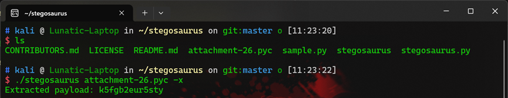


---

> Author: [Lunatic](https://goodlunatic.github.io)  
> URL: https://goodlunatic.github.io/posts/1ad9200/  

