# 2024 CISCN初赛 Misc Writeup

又是一年国赛，这次纯纯是被队友带飞了！！！
&lt;!--more--&gt;
## 题目名称 火锅链观光打卡

浏览器下载一个MetaMask插件，连上题目的容器

然后领取一下空投，回答几道题拿到原料兑换 NFT 即可得到 flag

**flag{y0u_ar3_hotpot_K1ng}**


## 题目名称 Power Trajectory Diagram

题面信息如下

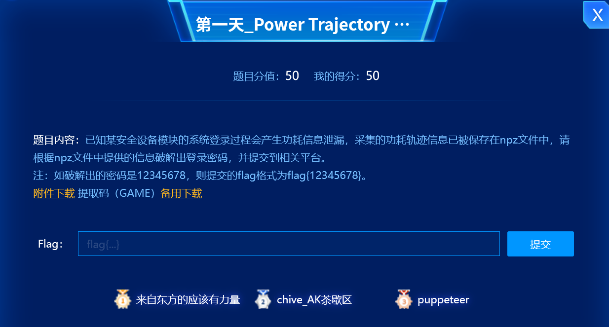

下载附件并解压，得到一个 attachment.npz

发现有四部分的数据，通过查看 input 和 index 后可以知道

题目是一共爆破了13个字符，每个字符爆破了40次，然后每次爆破都会有一条 trace

写一个 python 脚本读取 trace 数据并画折线图，发现每条 trace 都会有一个最小值

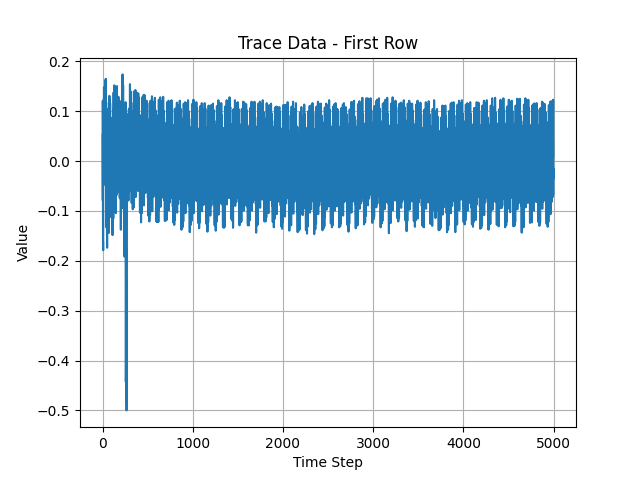

因此我们先记录每条 trace 中的最小值

最后经过尝试，把每40条记录中的最大值连起来就是flag

**flag{\_ciscn_2024\_}**

```python
import numpy as np

data = np.load(&#39;attachment.npz&#39;)
# print(data.files)
# [&#39;index&#39;, &#39;input&#39;, &#39;output&#39;, &#39;trace&#39;]
trace = data[&#39;trace&#39;]
input = data[&#39;input&#39;]
# print(len(input))
index = data[&#39;index&#39;]
# print(trace.shape)  # (520, 5000) 520/40=13
# 一共爆破了13个字符，每个字符爆破了40次，每次爆破都会有一条trace
for i in range(12):
    res = []
    table = input[:40]
    for j in range(40):
        # 记录每条trace中的最小值
        min = np.argmin(trace[i*40&#43;j])
        res.append(min)
    # print(res)
    # 通过提取res列表中的最大值来确定爆破出字符的index
    index = np.argmax(res)
    char = table[index]
    print(char, end=&#34;&#34;)
    # _ciscn_2024_
```

## 题目名称 神秘文件

下载附件并解压，得到一个 attachment.pptm

使用 exiftool 查看 pptm 的元信息，发现有一个 Bifid cipher

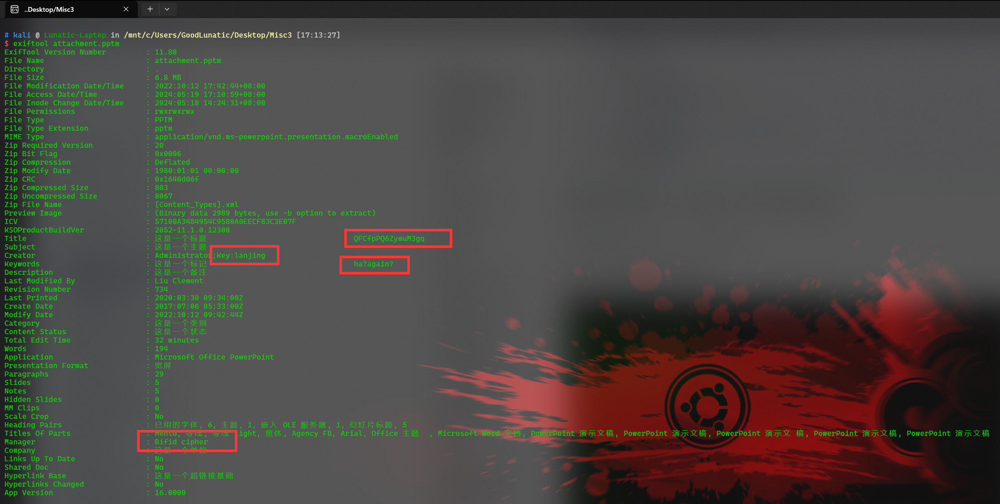

然后使用 CyberChef 解密即可得到：**Part1:flag{e**

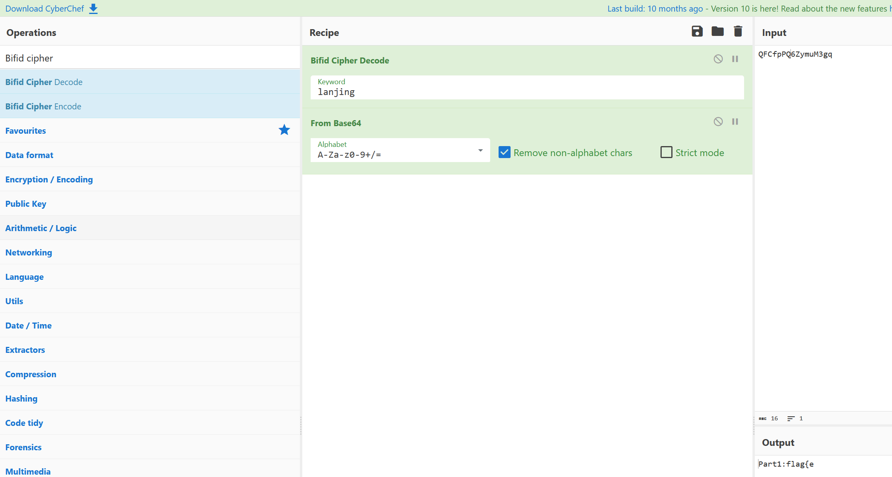

把 .pptm 文件改后缀为 .zip 解压并打开

在 attachment\ppt\embeddings 路劲下发现有个 .docx 文件

改后缀为 .zip 并解压，打开word目录中的 document.xml

得到提示，原来似乎有什么，后来好像被小Caesar抱走了

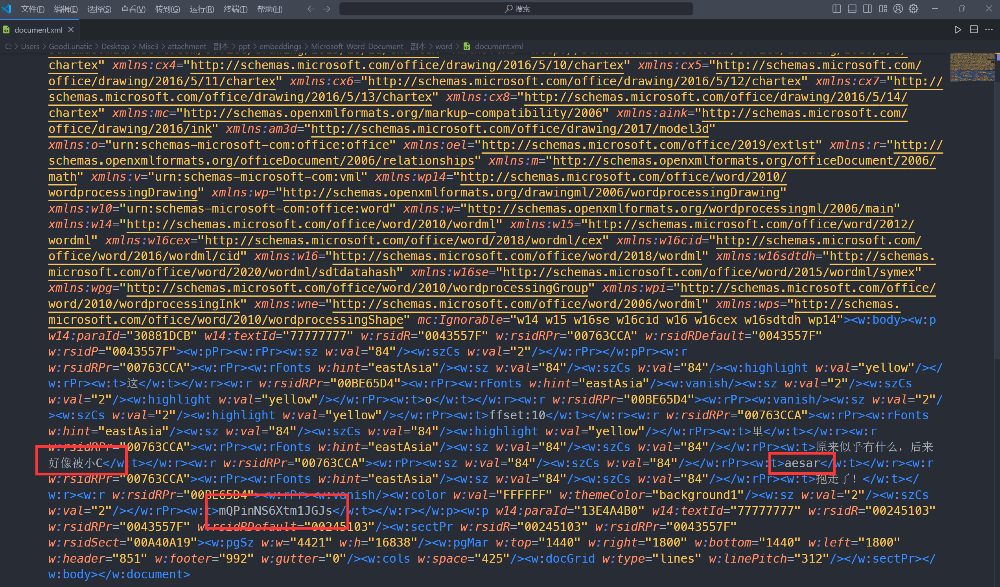

然后直接使用 CyberChef 解密即可得到：**part2:675efb**

Tips：这里在 CyberChef 中使用 ROT13 是因为解密后它会自动 magic 识别 base64，就比较方便

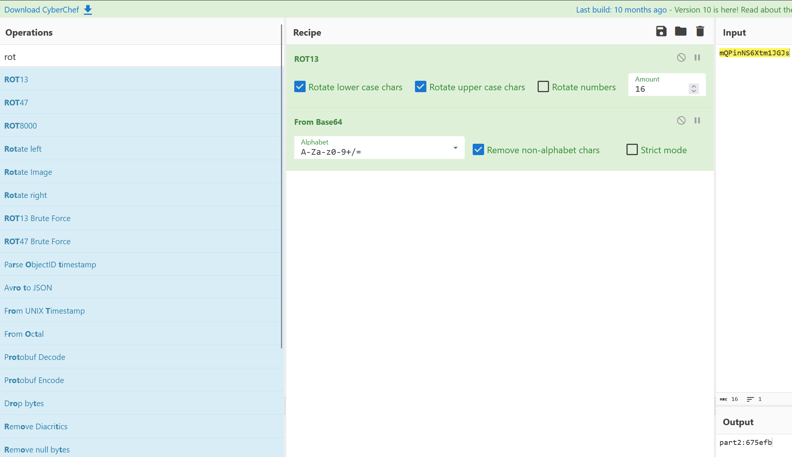

打开 PPT 发现发现有嵌入了 宏代码

直接使用 olevba 提取宏代码，然后问问GPT，发现是个RC4加密

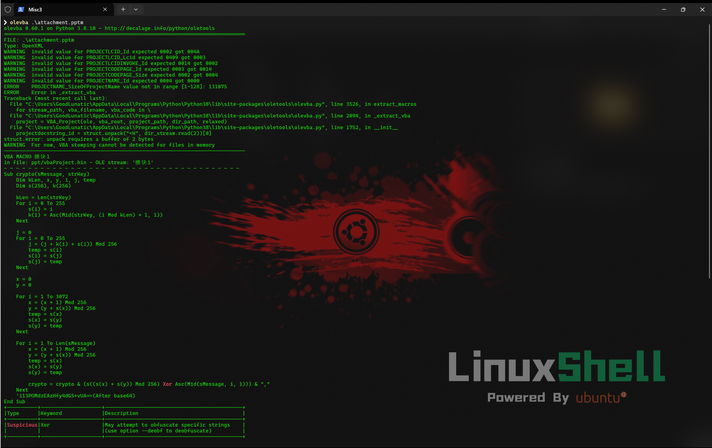

直接使用 CyberChef 解密 RC4 即可得到：**PArt3:3-34**

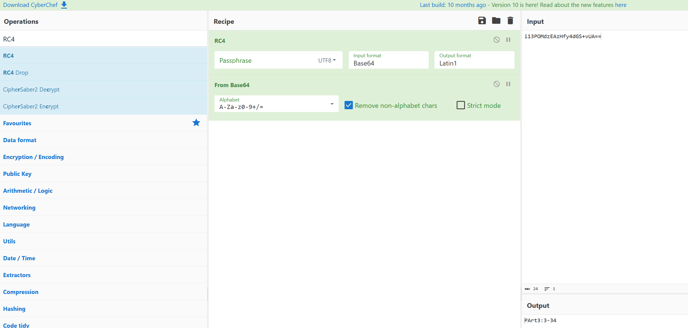

在 PPT 的第三页中发现有 Base64编码后的字符串：UGF5dDQ6NmYtNDA=

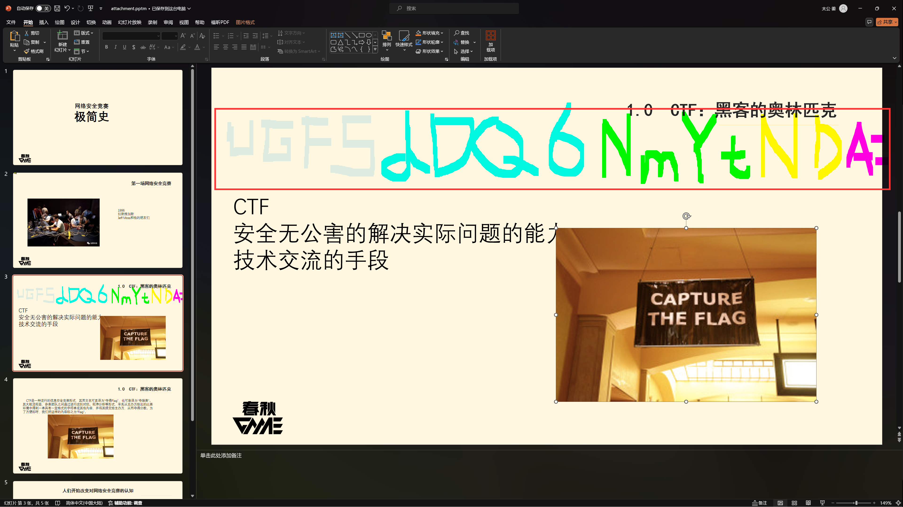

使用 CyberChef 解密即可得到：**Payt4:6f-40**

在 PPT 的最后一页中发现多次 Base64 编码后的字符串

直接使用 BaseCrack 解码即可得到：**pArt5:5f-90d**


在 ppt 的第五页，缩小可以看到一串base64编码的字符串：UGFyVDY6ZC0y

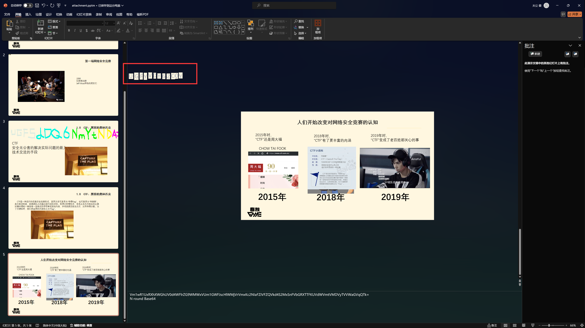

CyberChef解码得到：**part6:d-2**

在PPT的第四章打开选择窗口，可以得到提示：ROT13(All) HRSFIQp9ZwWvZj==

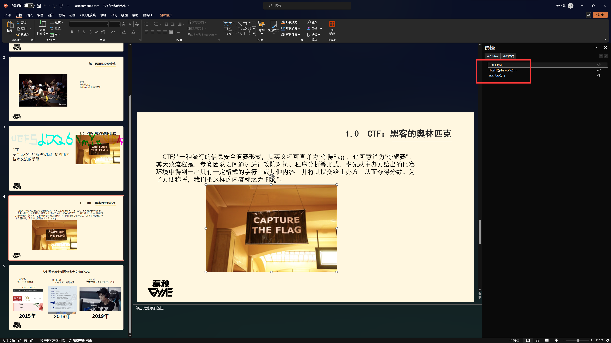

CyberChef 解密即可得到：**PART7=22b3**


在 pptm 解压出来的 ppt\slideLayouts\slideLayout2.xml 中得到如下提示

&gt; c1GFSbd3Dg6BODbdl
&gt; Remove All
&gt; ’B ’/’b’ /’1 ’/’3’&lt;

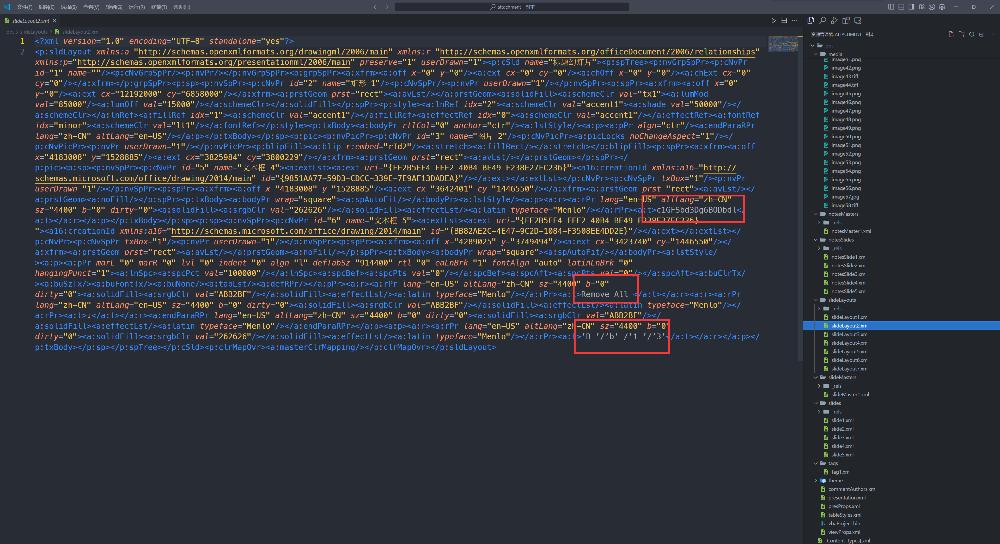

根据提示，去除上面四个字符后得到：cGFSdDg6ODdl

CyberChef解密即可得到：**paRt8:87e**

在 pptm 解压出来的 \ppt\media\image57.jpg 中发现一串base64编码：

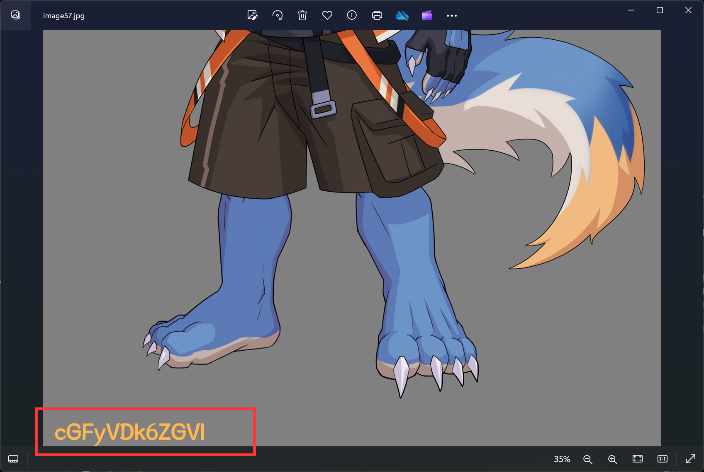

cyberchef解码即可得到：**parT9:dee**

在 pptm 解压出来的 comments/comment1.xml 中发现维吉尼亚密码

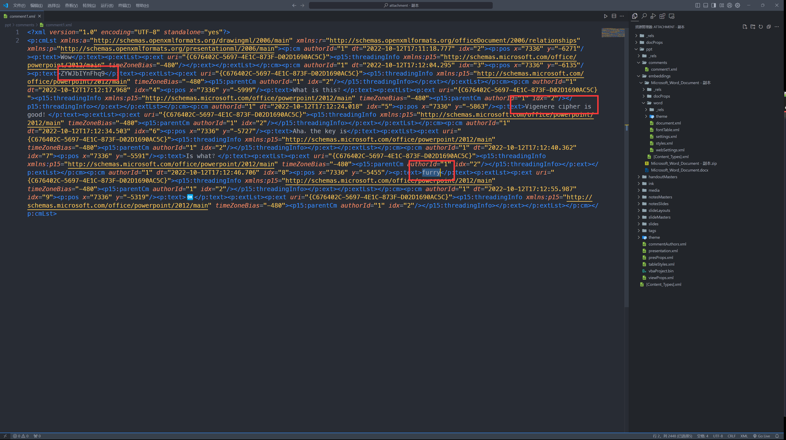

直接使用在线网站解密即可得到：**PARt10:9}**

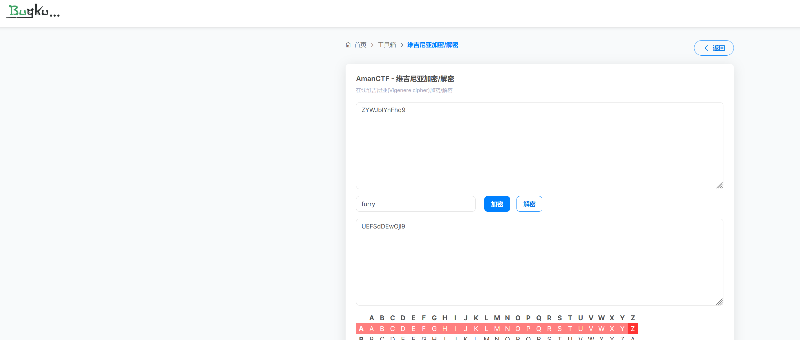

最后，把上面的10段 flag 连起来即可得到最后的flag：**flag{e675efb3-346f-405f-90dd-222b387edee9}**

## 题目名称 盗版软件

下载附件并解压，得到一个 hackexe.exe 和一个 3842.dmp 内存转储文件

运行这个 exe 后可以会在.ss文件夹下生成一个 loader.exe 和一个 output.png

out.png 的上方有一些模糊的小块，感觉是隐写了

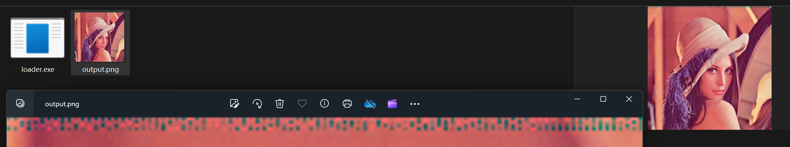

用 stegsolve 打开，发现所有红色通道中都有明显的 LSB 痕迹

Data Extract preview 发现有一个压缩包，只不过每字节后都嵌入了垃圾数据

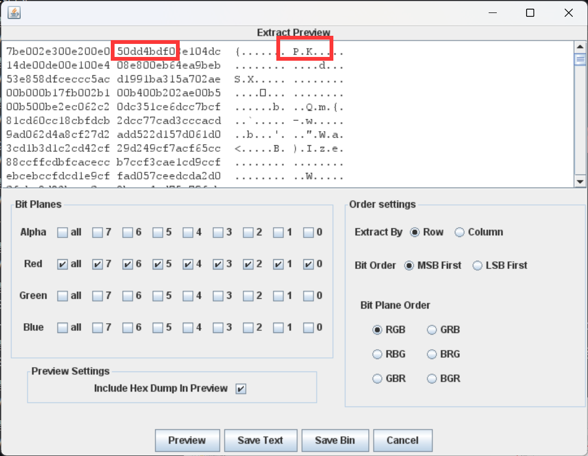

写个Python脚本提取出来即可

```python
with open(&#39;data&#39;, &#39;rb&#39;) as f:
    data = f.read()

res = []
i = 8
while i &lt; len(data):
    res.append(data[i])
    i &#43;= 2
# print(res)

with open(&#39;flag.zip&#39;, &#39;wb&#39;) as f:
    f.write(bytes(res))
```
解压压缩包得到一个.b文件，里面内容如下

```
r()J$nEA&#39;r!!#;^5u:HM1&#34;&#39;W(Mc*q[&lt;_/-H(eBQ_&#43;@m$P8kMf4a[h&gt;1:e3=VX?9p=!\&gt;H[_9!-P!Q!d_;F&#43;/NMc([U69Id&gt;ct7iR(^gBUKlR.n!/lA`!!!!iKtqeC8-.(6Mb&#34;[QMa/CV!RTk-8H6e&#43;1!)_&gt;1l&#43;[&#39;ejqO2X?j\E%7($238erL9ERs6#Xpc$FkBeaMa/OZ!RPFEM[W-EMa/7R!RO,j&#34;Gf?G6!.Ga!ROtQ6!-EU6!?g3ll\Sls57!F=^&#34;@S&#39;&#39;W&#39;hs8Q@r^3=WR?SaG;!&#39;sXWM&lt;7?[m%=@Z!(i%/8\&gt;*)&#43;T!Ns8F&amp;Q@8VuM%M=EmC9Qqfgs4&#39;f&#34;l=^2!!!$.f\g`/F!&lt;:Sa$:.up:e`[d9ejFSs1h0^_FX^B8;Y/K]&#39;9g`i;_=uM8s?B6!-g;i^eq%6&#43;WJ\FCG4&#34;Ktqd;8cR(Yjlhm.!!#QBlju^Ei_;/LC&#39;6h)8;[..\cUR&#43;?iSZ/p],bC8;&#34;i&#39;?A\Aj5XAOd!&#34;],16!-[7njkLW6&#43;U0o;s&#34;&amp;08;Y5UM8r=Fa[q?Y8;Z%kM&gt;9HK!nkY%s4)bs!.?7t6!%3&amp;!&#39;gMa6!.k%&gt;!]_-0&#43;Tc:eQ5m&gt;\ohmb@K4kLs3Bjks8W*i!Q.GW`^kgWFgOI7k?)I!=hET4.LJIugAf\
```
 
 然后 CyberChef base85解码一下

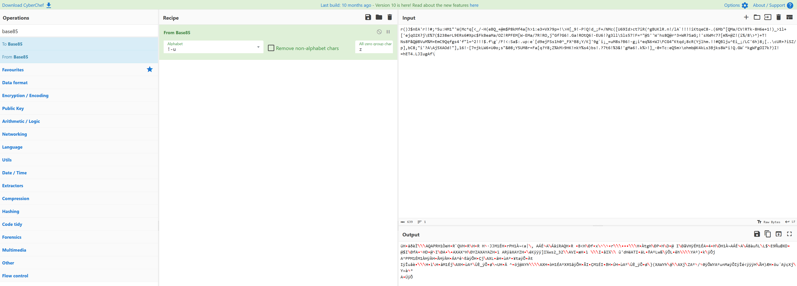

下载解码后的内容，然后丢到微步云沙箱在线运行一下就可以得到题目中的 C2地址：39.100.72.235

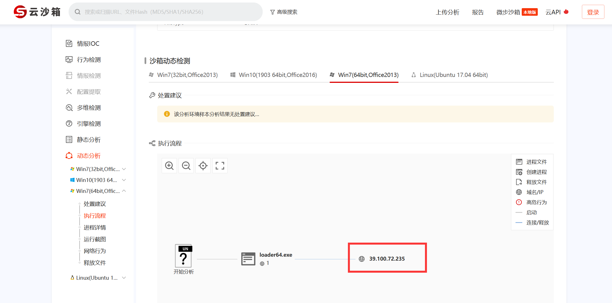

dmp文件用vol好像提取不出来什么，但是R-stdio可以

在ctf用户的 download 文件夹下发现有一个 iFlylME Setup 3.0.1735.exe 安装程序

网上搜索后知道是讯飞输入法的安装程序，但是经过分析，题目中的盗版软件应该指的是 procexe.exe

因为 procexe.exe 和附件中的 hackexe.exe 大小是一样的

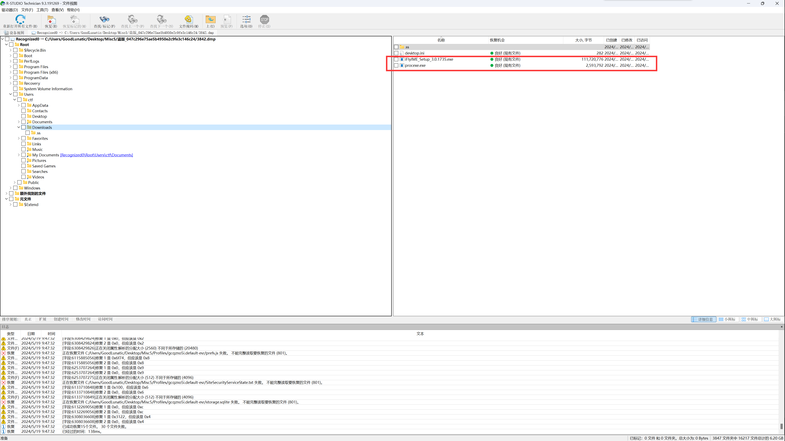

根据题面的内容，猜测是 firefox 浏览器取证，根据网上的参考文章firefox的历史记录会保存在以下路径中

Users\ctf\AppData\Roaming\Mozilla\Firefox\Profiles_gcqzno5i\palce.sqlite

但是这道题好像提取不出来，提示损坏了

因此我们直接在Linux系统中使用 strings 3842.dmp| grep https:// | uniq &gt; http.txt 命令 

查看得到的 txt 文件，发现出题人用百度搜索了很多东西

比如 process ko破解版、process破解版、winhack.exe、讯飞输入法 等等

但是还是无法得到具体下载盗版软件的地址，但是我们可以确定出题人一定访问了百度

因此我们使用 R-stdio 把整个 ctf 文件夹都导出来，然后使用 everything 的高级搜索

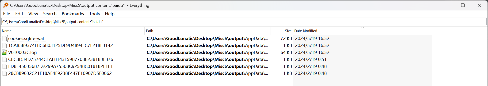

然后在 28CBB9632C21E18AE4E9238F447E10907D5F0062 文件中发现几个可疑地址

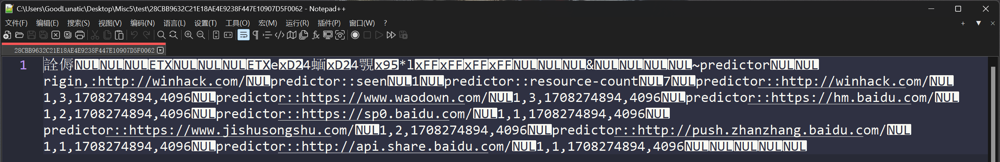

除去和百度以及讯飞有关系的网址后，得到下面两个网址

&gt; [http://winhack.com](http://winhack.com)
&gt; [https://www.waodown.com/](https://www.waodown.com/)

经过尝试，发现 winhack 那个是正确答案

winhack.com39.100.72.235

**flag{096e8b0f9daf10869f013c1b7efda3fd}**

## 题目名称 通风机

去网上下一个 STEP7 MicroWIN V4.0 SP9 软件，然后修复 mwp 的文件头

使用 STEP7 MicroWIN V4.0 SP9 软件打开 mwp 文件

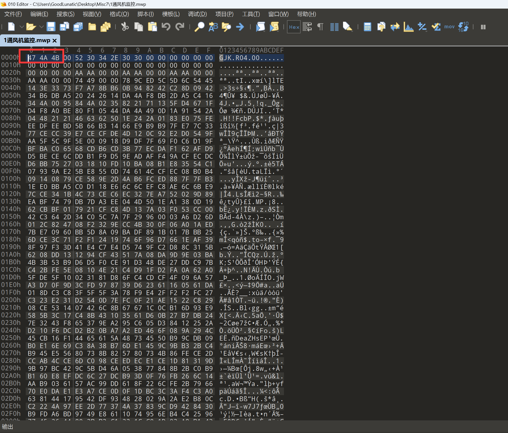

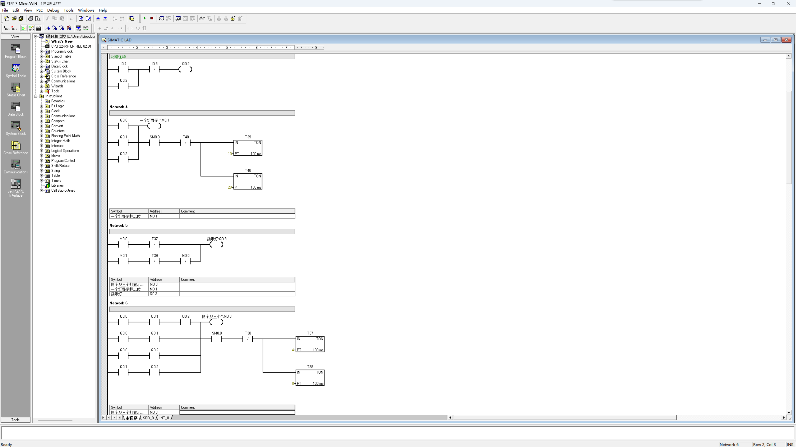

然后在 symbol table 中发现 base64 编码后的 flag，CyberChef 解码即可得到 flag

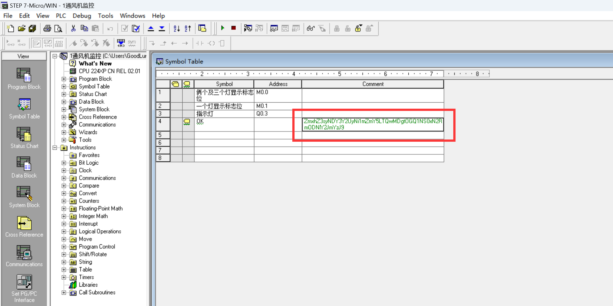

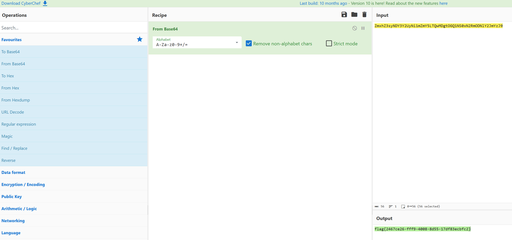

**flag{2467ce26-fff9-4008-8d55-17df83ecbfc2}**

### 题目名称 Tough_DNS


---

> Author: [Lunatic](https://goodlunatic.github.io)  
> URL: http://localhost:1313/posts/1b1f96e/  

