# 2024 全国大学生信息安全竞赛初赛 Misc Writeup

又是一年国赛，这次纯纯是被队友带飞了！！！
<!--more-->
## 题目名称 火锅链观光打卡

浏览器下载一个MetaMask插件，连上题目的容器

然后领取一下空投，回答几道题拿到原料兑换 NFT 即可得到 flag

**flag{y0u_ar3_hotpot_K1ng}**


## 题目名称 Power Trajectory Diagram

题面信息如下

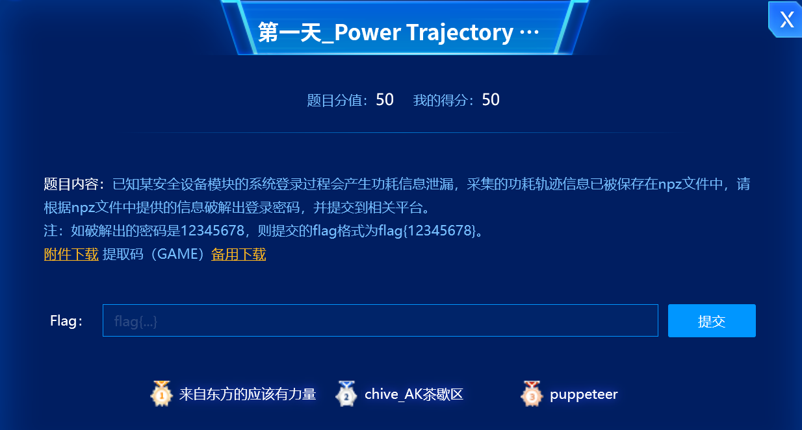

下载附件并解压，得到一个 attachment.npz

发现有四部分的数据，通过查看 input 和 index 后可以知道

题目是一共爆破了13个字符，每个字符爆破了40次，然后每次爆破都会有一条 trace

写一个 python 脚本读取 trace 数据并画折线图，发现每条 trace 都会有一个最小值

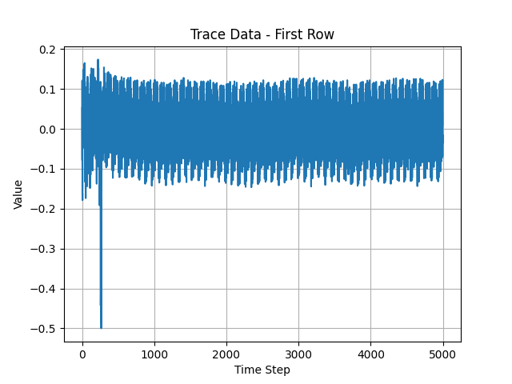

因此我们先记录每条 trace 中的最小值

最后经过尝试，把每40条记录中的最大值连起来就是flag

**flag{\_ciscn_2024\_}**

```python
import numpy as np

data = np.load('attachment.npz')
# print(data.files)
# ['index', 'input', 'output', 'trace']
trace = data['trace']
input = data['input']
# print(len(input))
index = data['index']
# print(trace.shape)  # (520, 5000) 520/40=13
# 一共爆破了13个字符，每个字符爆破了40次，每次爆破都会有一条trace
for i in range(12):
    res = []
    table = input[:40]
    for j in range(40):
        # 记录每条trace中的最小值
        min = np.argmin(trace[i*40+j])
        res.append(min)
    # print(res)
    # 通过提取res列表中的最大值来确定爆破出字符的index
    index = np.argmax(res)
    char = table[index]
    print(char, end="")
    # _ciscn_2024_
```

## 题目名称 神秘文件

下载附件并解压，得到一个 attachment.pptm

使用 exiftool 查看 pptm 的元信息，发现有一个 Bifid cipher

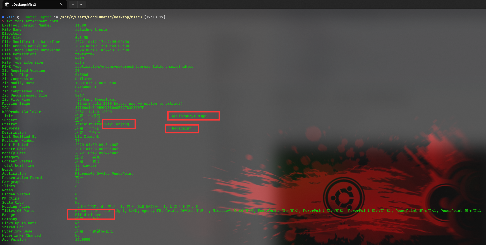

然后使用 CyberChef 解密即可得到：**Part1:flag{e**


把 .pptm 文件改后缀为 .zip 解压并打开

在 attachment\ppt\embeddings 路劲下发现有个 .docx 文件

改后缀为 .zip 并解压，打开word目录中的 document.xml

得到提示，原来似乎有什么，后来好像被小Caesar抱走了


然后直接使用 CyberChef 解密即可得到：**part2:675efb**

Tips：这里在 CyberChef 中使用 ROT13 是因为解密后它会自动 magic 识别 base64，就比较方便


打开 PPT 发现发现有嵌入了 宏代码

直接使用 olevba 提取宏代码，然后问问GPT，发现是个RC4加密

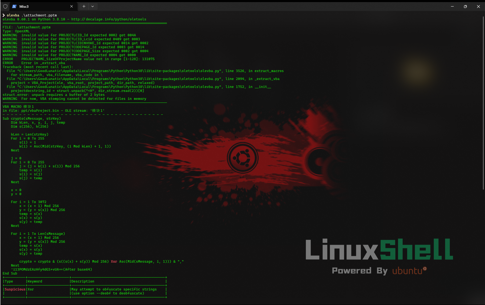

直接使用 CyberChef 解密 RC4 即可得到：**PArt3:3-34**

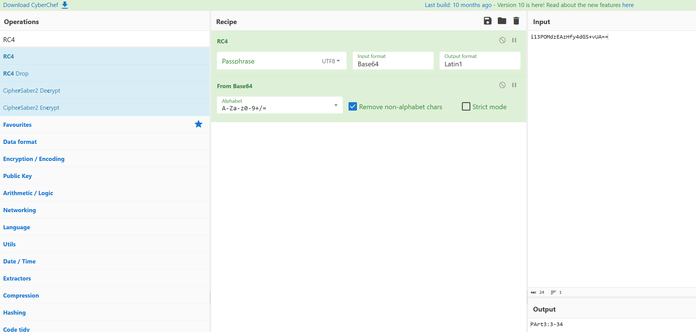

在 PPT 的第三页中发现有 Base64编码后的字符串：UGF5dDQ6NmYtNDA=

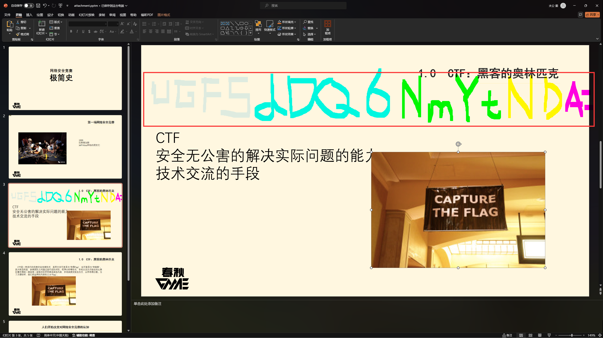

使用 CyberChef 解密即可得到：**Payt4:6f-40**

在 PPT 的最后一页中发现多次 Base64 编码后的字符串

直接使用 BaseCrack 解码即可得到：**pArt5:5f-90d**


在 ppt 的第五页，缩小可以看到一串base64编码的字符串：UGFyVDY6ZC0y

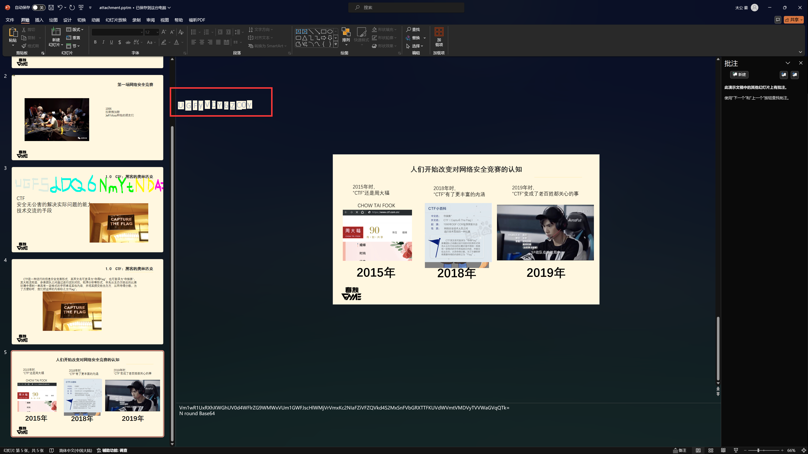

CyberChef解码得到：**part6:d-2**

在PPT的第四章打开选择窗口，可以得到提示：ROT13(All) HRSFIQp9ZwWvZj==

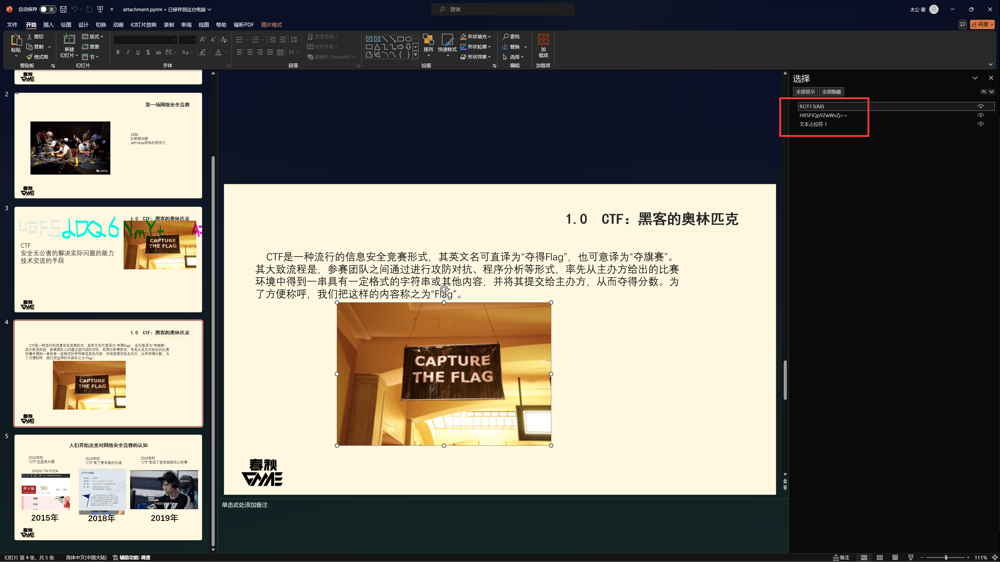

CyberChef 解密即可得到：**PART7=22b3**

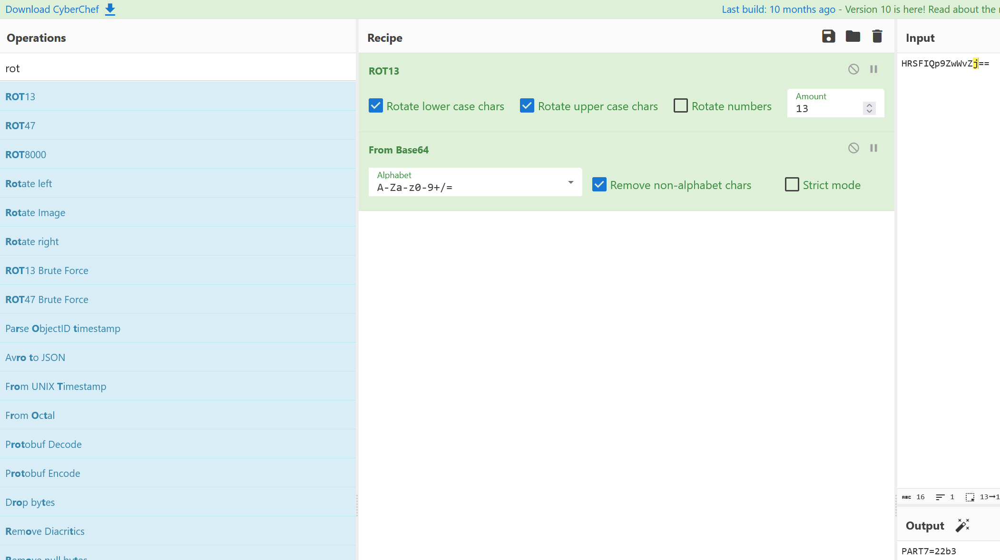

在 pptm 解压出来的 ppt\slideLayouts\slideLayout2.xml 中得到如下提示

> c1GFSbd3Dg6BODbdl
> Remove All
> ’B ’/’b’ /’1 ’/’3’<

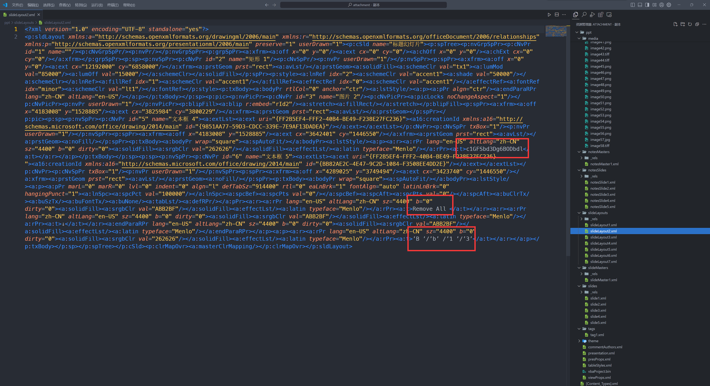

根据提示，去除上面四个字符后得到：cGFSdDg6ODdl

CyberChef解密即可得到：**paRt8:87e**

在 pptm 解压出来的 \ppt\media\image57.jpg 中发现一串base64编码：


cyberchef解码即可得到：**parT9:dee**

在 pptm 解压出来的 comments/comment1.xml 中发现维吉尼亚密码

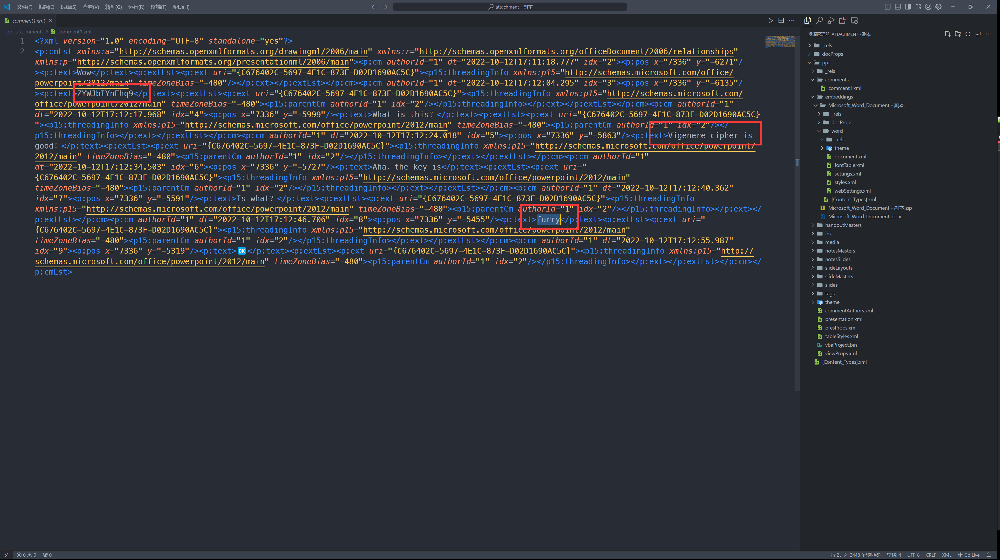

直接使用在线网站解密即可得到：**PARt10:9}**

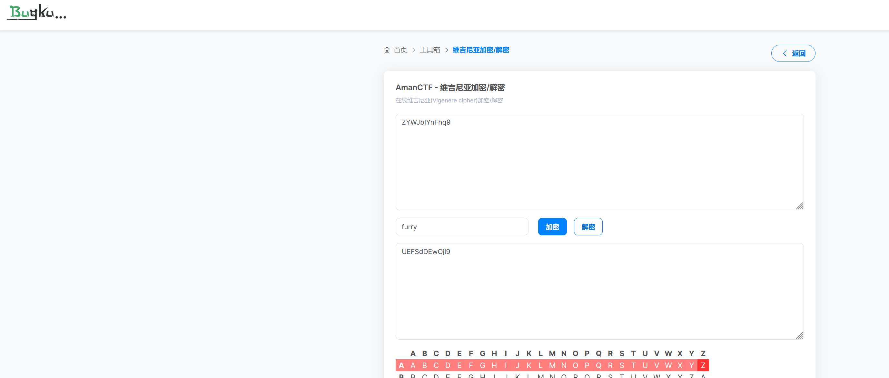

最后，把上面的10段 flag 连起来即可得到最后的flag：**flag{e675efb3-346f-405f-90dd-222b387edee9}**

## 题目名称 盗版软件

下载附件并解压，得到一个 hackexe.exe 和一个 3842.dmp 内存转储文件

运行这个 exe 后可以会在.ss文件夹下生成一个 loader.exe 和一个 output.png

out.png 的上方有一些模糊的小块，感觉是隐写了


用 stegsolve 打开，发现所有红色通道中都有明显的 LSB 痕迹

Data Extract preview 发现有一个压缩包，只不过每字节后都嵌入了垃圾数据

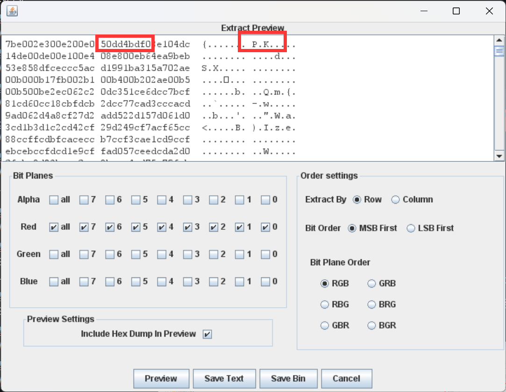

写个Python脚本提取出来即可

```python
with open('data', 'rb') as f:
    data = f.read()

res = []
i = 8
while i < len(data):
    res.append(data[i])
    i += 2
# print(res)

with open('flag.zip', 'wb') as f:
    f.write(bytes(res))
```
解压压缩包得到一个.b文件，里面内容如下

```
r()J$nEA'r!!#;^5u:HM1"'W(Mc*q[<_/-H(eBQ_+@m$P8kMf4a[h>1:e3=VX?9p=!\>H[_9!-P!Q!d_;F+/NMc([U69Id>ct7iR(^gBUKlR.n!/lA`!!!!iKtqeC8-.(6Mb"[QMa/CV!RTk-8H6e+1!)_>1l+['ejqO2X?j\E%7($238erL9ERs6#Xpc$FkBeaMa/OZ!RPFEM[W-EMa/7R!RO,j"Gf?G6!.Ga!ROtQ6!-EU6!?g3ll\Sls57!F=^"@S''W'hs8Q@r^3=WR?SaG;!'sXWM<7?[m%=@Z!(i%/8\>*)+T!Ns8F&Q@8VuM%M=EmC9Qqfgs4'f"l=^2!!!$.f\g`/F!<:Sa$:.up:e`[d9ejFSs1h0^_FX^B8;Y/K]'9g`i;_=uM8s?B6!-g;i^eq%6+WJ\FCG4"Ktqd;8cR(Yjlhm.!!#QBlju^Ei_;/LC'6h)8;[..\cUR+?iSZ/p],bC8;"i'?A\Aj5XAOd!"],16!-[7njkLW6+U0o;s"&08;Y5UM8r=Fa[q?Y8;Z%kM>9HK!nkY%s4)bs!.?7t6!%3&!'gMa6!.k%>!]_-0+Tc:eQ5m>\ohmb@K4kLs3Bjks8W*i!Q.GW`^kgWFgOI7k?)I!=hET4.LJIugAf\
```
 
 然后 CyberChef base85解码一下


下载解码后的内容，然后丢到微步云沙箱在线运行一下就可以得到题目中的 C2地址：39.100.72.235


dmp文件用vol好像提取不出来什么，但是R-stdio可以

在ctf用户的 download 文件夹下发现有一个 iFlylME Setup 3.0.1735.exe 安装程序

网上搜索后知道是讯飞输入法的安装程序，但是经过分析，题目中的盗版软件应该指的是 procexe.exe

因为 procexe.exe 和附件中的 hackexe.exe 大小是一样的


根据题面的内容，猜测是 firefox 浏览器取证，根据网上的参考文章firefox的历史记录会保存在以下路径中

Users\ctf\AppData\Roaming\Mozilla\Firefox\Profiles_gcqzno5i\palce.sqlite

但是这道题好像提取不出来，提示损坏了

因此我们直接在Linux系统中使用 strings 3842.dmp| grep https:// | uniq > http.txt 命令 

查看得到的 txt 文件，发现出题人用百度搜索了很多东西

比如 process ko破解版、process破解版、winhack.exe、讯飞输入法 等等

但是还是无法得到具体下载盗版软件的地址，但是我们可以确定出题人一定访问了百度

因此我们使用 R-stdio 把整个 ctf 文件夹都导出来，然后使用 everything 的高级搜索


然后在 28CBB9632C21E18AE4E9238F447E10907D5F0062 文件中发现几个可疑地址


除去和百度以及讯飞有关系的网址后，得到下面两个网址

> [http://winhack.com](http://winhack.com)
> [https://www.waodown.com/](https://www.waodown.com/)

经过尝试，发现 winhack 那个是正确答案

赛后和别的师傅交流后发现，这里直接把 dmp 文件后缀改成 .data 然后拖入 Gimp 调位移和宽高就能直接得到


winhack.com39.100.72.235

**flag{096e8b0f9daf10869f013c1b7efda3fd}**

## 题目名称 通风机

去网上下一个 STEP7 MicroWIN V4.0 SP9 软件，然后修复 mwp 的文件头

使用 STEP7 MicroWIN V4.0 SP9 软件打开 mwp 文件


然后在 symbol table 中发现 base64 编码后的 flag，CyberChef 解码即可得到 flag


**flag{2467ce26-fff9-4008-8d55-17df83ecbfc2}**

## 题目名称 Tough_DNS

题面信息如下


解压压缩包可以得到一个流量包，发现是都是 DNS 流量

首先我们用 tshark 把 OPT 解析记录中的二进制数据都提取出来
```shell
tshark -r 1.pcapng -T fields -e dns.qry.name | sed '/^\s*$/d' | uniq > 1.txt
```

删除重复的数据，然后转二维码，可以得到如下二维码，扫码后得到：15f9792dba5c


然后查看 TXT 解析记录，发现根据 dns.id 的不同可以分为两类：0x4500 和 0x6421，使用如下命令把其中的数据分别提取出来

```shell
tshark -r 1.pcapng -T fields -e dns.txt -Y "(dns.txt.length == 1) && (dns.id == 0x4500)"|tr -d "\n"
tshark -r 1.pcapng -T fields -e dns.txt -Y "(dns.txt.length == 1) && (dns.id == 0x6421)"|tr -d "\n"
```

查看提取出来的数据，结合文件头发现有一个 zip 压缩包和一段未知数据


用 CyberChef 提取压缩包，打开发现需要密码，使用之前扫码得到的密码解压压缩包，得到一个 secret.gpg

所以猜测另一个未知数据应该就是 gpg 加密的内容，使用 CyberChef from hex 然后下载到本地


解密 gpg 加密文件需要私钥导入口令，因此猜测题面中给我们的那段数据就是私钥导入口令

发现那段数据中有 d2 ，因此猜测是十六进制数据，但是转为 Ascii 后发现不是所有都是可打印字符

但是把十六进制数据先逆置一下，然后十六进制转 Ascii 就可以得到全都是可打印字符的字符串

尝试使用得到的字符串：eab9f5ae-0b9e 解密 GPG，发现就是我们需要的私钥导入口令

```python
from string import printable

# for item in printable:
#     print(ord(item), end=' ')
# 48 49 50 51 52 53 54 55 56 57 97 98 99 100 101 102 103 104 105 106 107 108 109 110 111 112 113 114 115 116 117 118 119 120 121 122 65 66 67 68 69 70 71 72 73 74 75 76 77 78 79 80 81 82 83 84 85 86 87 88 89 90 33 34 35 36 37 38 39 40 41 42 43 44 45 46 47 58 59 60 61 62 63 64 91 92 93 94 95 96 123 124 125 126 32 9 10 13 11 12


def solve():
    passwd = ''
    enc_passwds = ['56', '16', '26', '93', '66', '53',
                   '16', '56', 'd2', '03', '26', '93', '56']
    # for item in enc_passwds:
    #     print(int(item, 16), end=" ")
    # # 86 22 38 147 102 83 22 86 210 3 38 147 86
    for item in enc_passwds:
        item = item[::-1]
        # print(int(item,16),end=" ")
        # 101 97 98 57 102 53 97 101 45 48 98 57 101
        passwd += chr(int(item, 16))
    return passwd


if __name__ == "__main__":
    passwd = solve()
    print(passwd)
# eab9f5ae-0b9e
```

最后在 WSL 中按照以下步骤解密即可得到flag：flag{79830a47-faf7-4067-b585-145776f833cd}


当然，这里也可以在 Windows 下使用 Kleopatra 解密

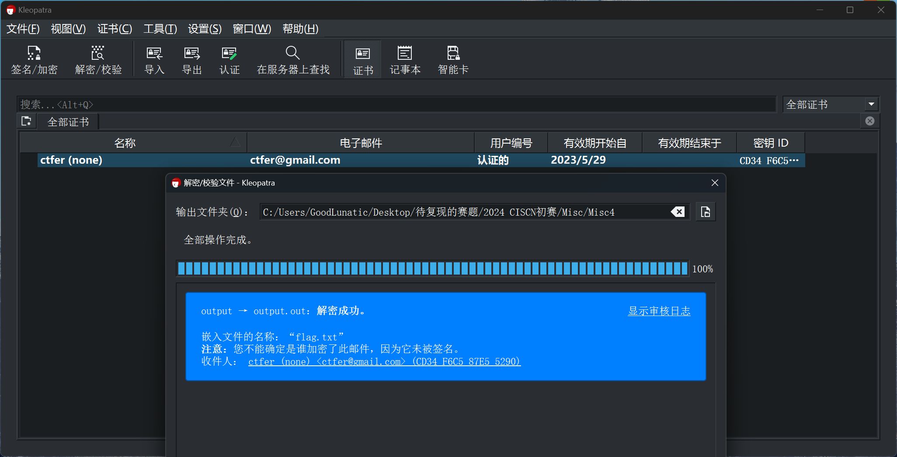


---

> Author: [Lunatic](https://goodlunatic.github.io)  
> URL: https://goodlunatic.github.io/posts/1b1f96e/  

