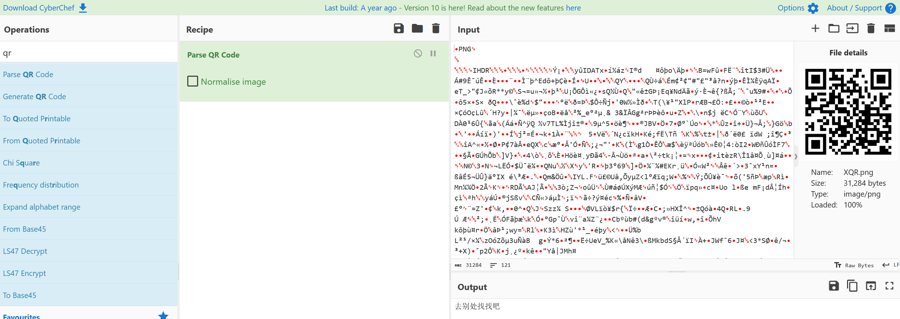
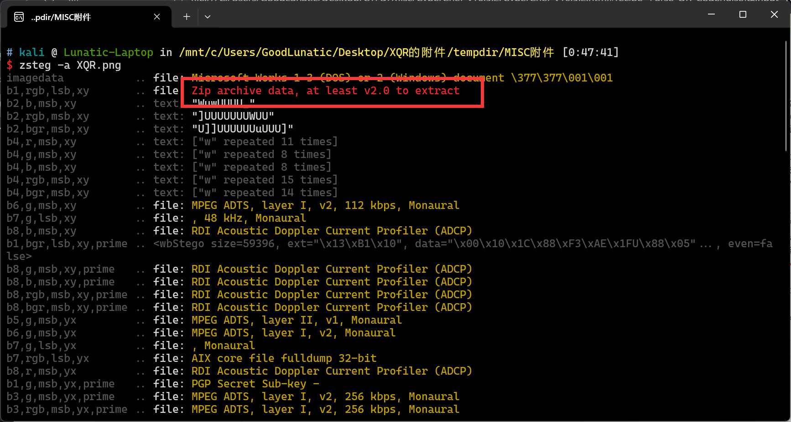
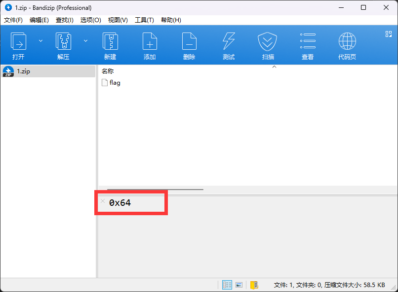
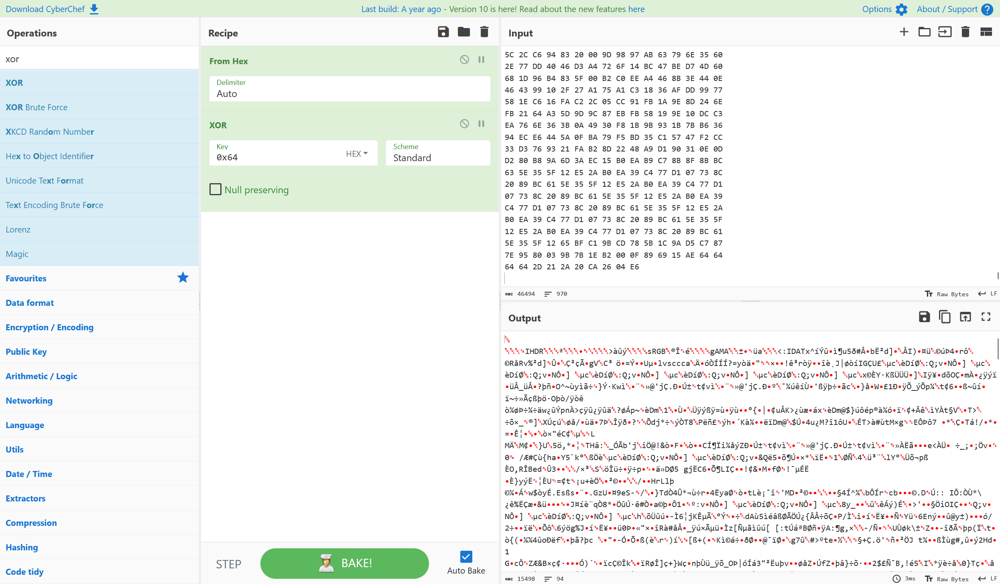
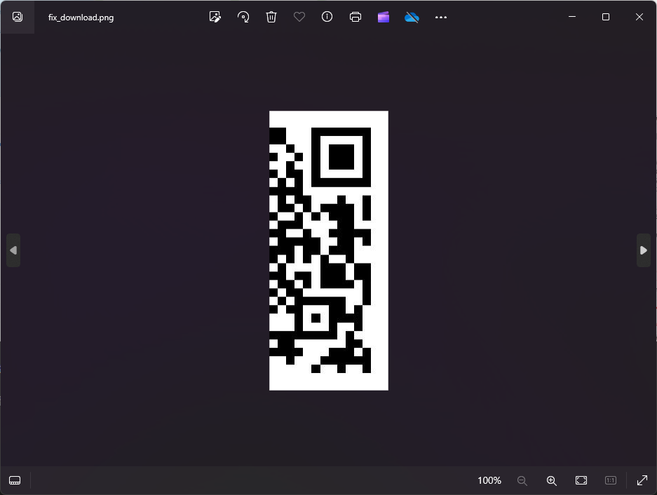
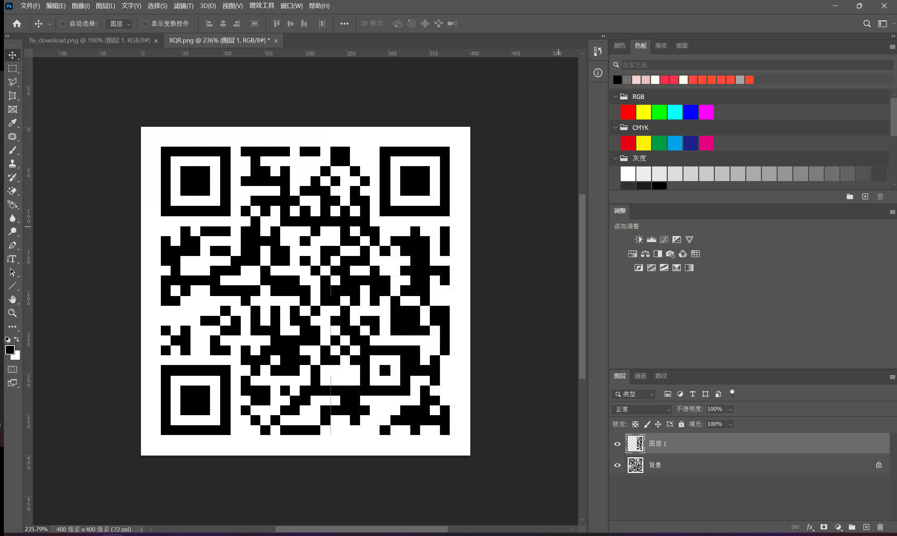
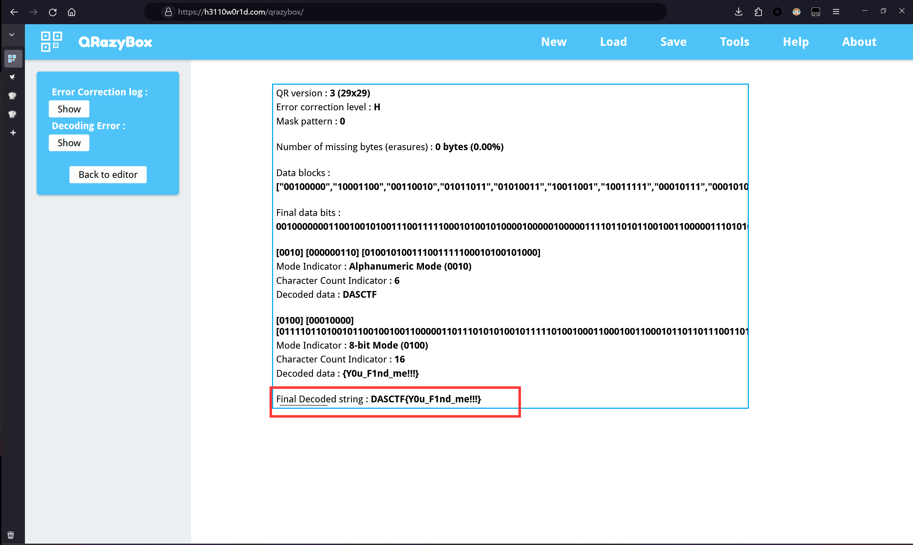

# Misc-QRcode小记

这几天在群里看到一道非常有意思的关于二维码的题目

于是打算稍微深入总结并巩固一下QRcode的知识点
&lt;!--more--&gt;

### 例题1-XQR

题目附件给了一个压缩包，解压得到一张二维码，扫码后提示flag在别的地方



然后直接用zsteg扫一下这张图片，发现LSB隐写了一个zip压缩包



使用以下命令提取压缩包并解压，在压缩包注释中发现提示：0x64
```shell
zsteg -e b1,rgb,lsb,xy XQR.png &gt; 1.zip
```



解压后得到一个名为flag的十六进制数据，根据提示，将这段数据异或0x64



发现是一段缺少PNG文件头的数据，因此我们使用010补上文件头：89504E470D0A

然后还发现图片宽高存在错误，因此我们爆破并修复图片宽高，得到如下半张二维码



这里就是题目的最后一步了，需要我们根据这半张二维码，读取出flag

在和群里的师傅交流了以后，这里有两种解法

#### 解法一：直接贴到原来的XQR.png上

这里我们直接用PS把得到的这半张二维码贴到原来的那张XQR.png上



最后直接使用[这个网站](https://h3110w0r1d.com/qrazybox/)识别即可得到flag：DASCTF{Y0u_F1nd_me!!!}



#### 解法二：手搓得到足够的pattern

TODO

---

> Author: [Lunatic](https://goodlunatic.github.io)  
> URL: http://localhost:1313/posts/1e26f78/  

