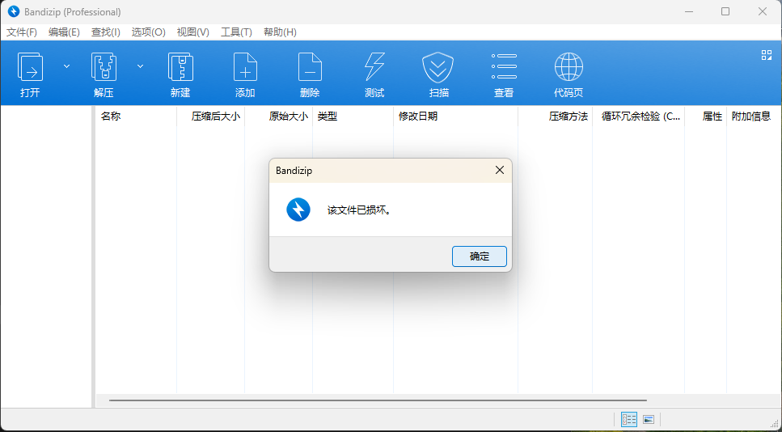

# 2024 睿抗机器人开发者大赛（RAICOM）网络安全赛道初赛 Misc Writeup

**很早之前和队友报的名，结果到现在才打。。**

**这比赛只能说是纯纯手速局。。**
<!--more-->


> 本文中涉及的具体题目附件可以进我的交流群获取，进群详见 [About](https://goodlunatic.github.io/about/)

## 题目名称 你是黑客么 
题目附件给了一个加密的压缩包，经过尝试发现是弱密码：75067


解压后得到一张 1.jpg 图片


010打开，发现图片末尾有多余数据，是base64编码的一张图片


直接将base64编码的数据复制到CyberChef中解码即可得到一张二维码


然后识别二维码即可得到flag：`flag{asdf%^&*ghjkl}`


## 题目名称 循环的压缩包(三血)
解压题目附件给的压缩包，得到一个未知后缀的文件，010打开查看


定位到压缩包的文件头 `504B0304` ，发现是一个前面有512字节多余数据的zip压缩包

尝试手动删除数据，然后解压几个，发现是相同类型的压缩包套娃，因此写个脚本解套即可

```python
import zipfile
import os

cnt = 1
while True:
    with open("tarfile",'rb') as f:
        data = f.read()
        
    zip_data = data[512:]
    with open("new.zip",'wb') as f:
        data = f.write(zip_data)
        
    os.mkdir("tmp")
    archive_file = "new.zip"
    with zipfile.ZipFile(archive_file, 'r') as zip_ref:
        print(f"[+] 第{cnt}层压缩包解压成功！")
        cnt += 1 
        zip_ref.extractall(path="tmp/")
        os.remove("tarfile")
        os.remove("new.zip")
        os.system("mv tmp/* .")
        os.rmdir("tmp")
```


猜测应该是刚好套了1000层，解压完后得到一个flag文件，打开即可得到flag

`flag{01af9cbb-6bf2-4ad8-8ecb-9dcbbc02bf19}`

## 题目名称 GoodTime(二血)
> 唉，手慢了，以为抢到一血了，但是应该差不多是同时交的。

题目附件给了一个加密的压缩包，尝试用字典爆破，发现是弱密码：city


解压后可以得到如下几个 txt 文本文件，打开后发现都是十六进制数据


出题人这里没出好，因此这题这里有两种解法，我都简要介绍一下吧

### 解法一：常规解

仔细观察文件名，然后对应到键盘上的按键，可以发现如下规律：

qwsz四个键包围的字符是a，fthb四个键包围的字符是g

另外几个文件也一一对应，刚好可以得到A B C D E F G 七个字符

因此我们按照顺序把txt中的数据连起来，在010中粘贴为十六进制数据


然后在第一段数据中修复压缩包的文件头 `504B0304` 即可得到一个压缩包


解压后可以得到一张图片，zsteg可以得到一串十六进制的数据


CyberChef解码即可得到flag：`flag{2468__TUvn__qwer}`


### 解法二：非预期

直接一个个查看txt中的数据，在qwsz.txt中发现明显的zip文件头，就是少了`504B`


复制到010中，并修复文件头


打开得到的压缩包，会提示文件已损坏，但是没事，我们直接把里面的图片拖出来



拖出来后可以得到损坏的图片


虽然图片是不完整的，但是我们依旧可以用zsteg分析图片

虽然会报错，但是仍然可以得到这串十六进制数据


## 题目名称 变异凯撒(原题)

> 2024年郑州大学“奇安信杯”网络空间安全竞赛原题
> 
> https://second.certstone.top/2024-nian-zheng-zhou-da-xue-qi-an-xin-bei-wang-luo-kong-jian-an-quan-jing-sai-what-can-i-say-dui-wu-writeup/


---

> Author: [Lunatic](https://goodlunatic.github.io)  
> URL: https://goodlunatic.github.io/posts/1eae35a/  

