# 2024 WKCTF Misc Writeup

忙里偷闲，稍微打了一下 2024WKCTF 练练手
<!--more-->


## Signin

附件就给了一段密文，后面给了提示才知道是 twin hex 编码

直接使用在线网站解密：https://www.dcode.fr/twin-hex-cipher

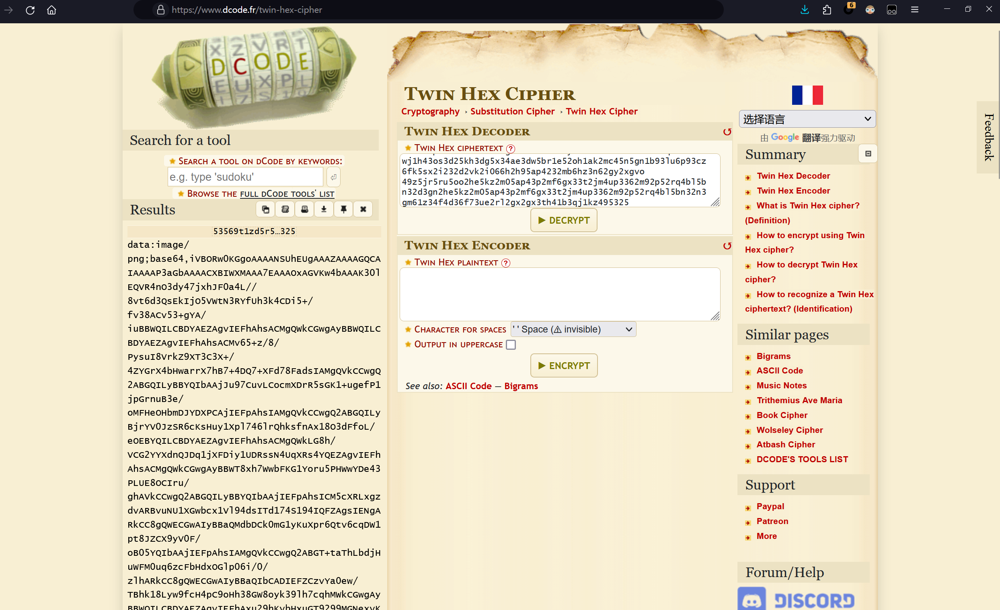

解密后得到一张base64编码后的图片，CyberChef 解码发现是张二维码，识别一下

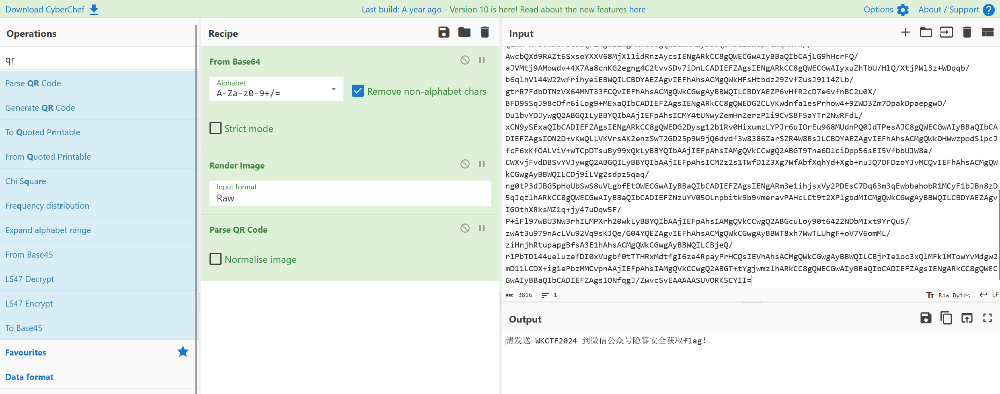

WKCTF{hello_2024}

## 不套是你的谎言

题目附件给了一个 magic.txt，大致内容如下

```
0x450c0d0a
0x480d0d0a
0x90c0d0a
0x300d0d0a
0xe40c0d0a
0xf80c0d0a
0xc20b0d0a
0x600d0d0a
0x420d0d0a
0x4f0c0d0a
```

赛后知道了这个每一行都是不同 Python 版本 pyc 的 magic 头

因此根据网上的magic头与Python版本的对照表，编写以下脚本提取数据即可得到一个压缩包

```python
from Crypto.Util.number import *

def reverse_magic(magic_number):
    tmp = int(magic_number[2:],16)
    # long_to_bytes()默认是大端序
    # 将十进制的长整型转换为 bytes 数据
    tmp = long_to_bytes(tmp)
    # 将 bytes 数据按照小端序转换为int类型
    number = int.from_bytes(tmp[:2],'little')
    return number

PYTHON_MAGIC = {
    # Python 3
    3000: (3, 0),
    3010: (3, 0),
    3020: (3, 0),
    3030: (3, 0),
    3040: (3, 0),
    3050: (3, 0),
    3060: (3, 0),
    3061: (3, 0),
    3071: (3, 0),
    3081: (3, 0),
    3091: (3, 0),
    3101: (3, 0),
    3103: (3, 0),
    3111: (3, 0),  # a4
    3131: (3, 0),  # a5

    # Python 3.1
    3141: (3, 1),  # a0
    3151: (3, 1),  # a0

    # Python 3.2
    3160: (3, 2),  # a0
    3170: (3, 2),  # a1
    3180: (3, 2),  # a2

    # Python 3.3
    3190: (3, 3),  # a0
    3200: (3, 3),  # a0
    3220: (3, 3),  # a1
    3230: (3, 3),  # a4

    # Python 3.4
    3250: (3, 4),  # a1
    3260: (3, 4),  # a1
    3270: (3, 4),  # a1
    3280: (3, 4),  # a1
    3290: (3, 4),  # a4
    3300: (3, 4),  # a4
    3310: (3, 4),  # rc2

    # Python 3.5
    3320: (3, 5),  # a0
    3330: (3, 5),  # b1
    3340: (3, 5),  # b2
    3350: (3, 5),  # b2
    3351: (3, 5),  # 3.5.2

    # Python 3.6
    3360: (3, 6),  # a0
    3361: (3, 6),  # a0
    3370: (3, 6),  # a1
    3371: (3, 6),  # a1
    3372: (3, 6),  # a1
    3373: (3, 6),  # b1
    3375: (3, 6),  # b1
    3376: (3, 6),  # b1
    3377: (3, 6),  # b1
    3378: (3, 6),  # b2
    3379: (3, 6),  # rc1

    # Python 3.7
    3390: (3, 7),  # a1
    3391: (3, 7),  # a2
    3392: (3, 7),  # a4
    3393: (3, 7),  # b1
    3394: (3, 7),  # b5

    # Python 3.8
    3400: (3, 8),  # a1
    3401: (3, 8),  # a1
    3410: (3, 8),  # a1
    3411: (3, 8),  # b2
    3412: (3, 8),  # b2
    3413: (3, 8),  # b4

    # Python 3.9
    3420: (3, 9),  # a0
    3421: (3, 9),  # a0
    3422: (3, 9),  # a0
    3423: (3, 9),  # a2
    3424: (3, 9),  # a2
    3425: (3, 9),  # a2
}

res = ''
with open('magic.txt','r') as f:
    data = f.read().split()
    for magic_number in data:
        number = reverse_magic(magic_number)
        res = res + str(PYTHON_MAGIC[number][1])
# print(res)
zip_data = long_to_bytes(int(res))
with open('flag.zip','wb') as f:
    f.write(zip_data)
print("[+] 转换成功")
```

得到的压缩包发现存在伪加密，解除伪加密后可以得到一个 secret.txt，内容如下：

```
Please decrypt the flask-session, the password is weak.
Data:eyJhbGdvcml0aG0iOiJkZXMiLCJmbGFnIjoiVW5BbVBWWTRhdCt2bkJqellPNytUZEZSMmZEYnhScytqQzdsMWt2b2hUMFp4clBDOEJUTWJBPT0ifQ.ZkyTwA.KPlAnhfBH8qMClLyoP6yboafHyw
```

发现需要爆破 flask-session 的密钥

因此我们基于 [flask-session-cookie-manager](https://github.com/noraj/flask-session-cookie-manager) 写个 bash 爆破脚本，就是爆破的速度有点感人。。

```bash
#!/bin/bash
while read line; do
    output=$(python3 /home/kali/flask-session-cookie-manager/flask_session_cookie_manager3.py decode -s $line -c 'eyJhbGdvcml0aG0iOiJkZXMiLCJmbGFnIjoiVW5BbVBWWTRhdCt2bkJqellPNytUZEZSMmZEYnhScytqQzdsMWt2b2hUMFp4clBDOEJUTWJBPT0ifQ.ZkyTwA.KPlAnhfBH8qMClLyoP6yboafHyw')
    if [[ $output != *"error"* ]]; then
        echo $line
        echo $output
    fi
done </home/kali/wordlists/dic.txt
```

最后爆破出密钥：12312312，然后再用这个密钥去解密DES即可

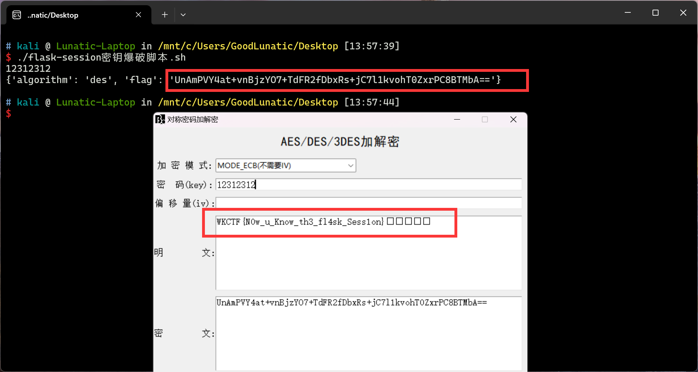

WKCTF{N0w_u_Know_th3_fl4sk_Sess1on}

## ⼩z的社交⽹络

题面信息提示了这是一张由 AES-ECB 算法加密的 ppm 图片：

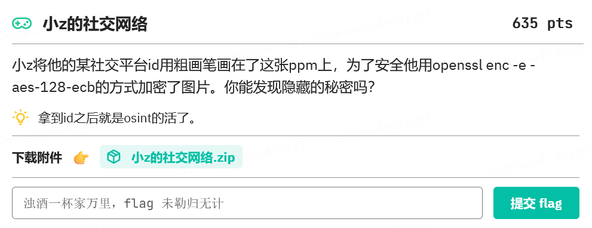

赛后知道了有这个项目：https://doegox.github.io/ElectronicColoringBook/
原理大概就是：相同的明文块被加密成相同的密文块
直接使用这个项目还原一下这张图片，得到id：M3moryyy
```shell
python .\ElectronicColoringBook.py .\id.ppm
```

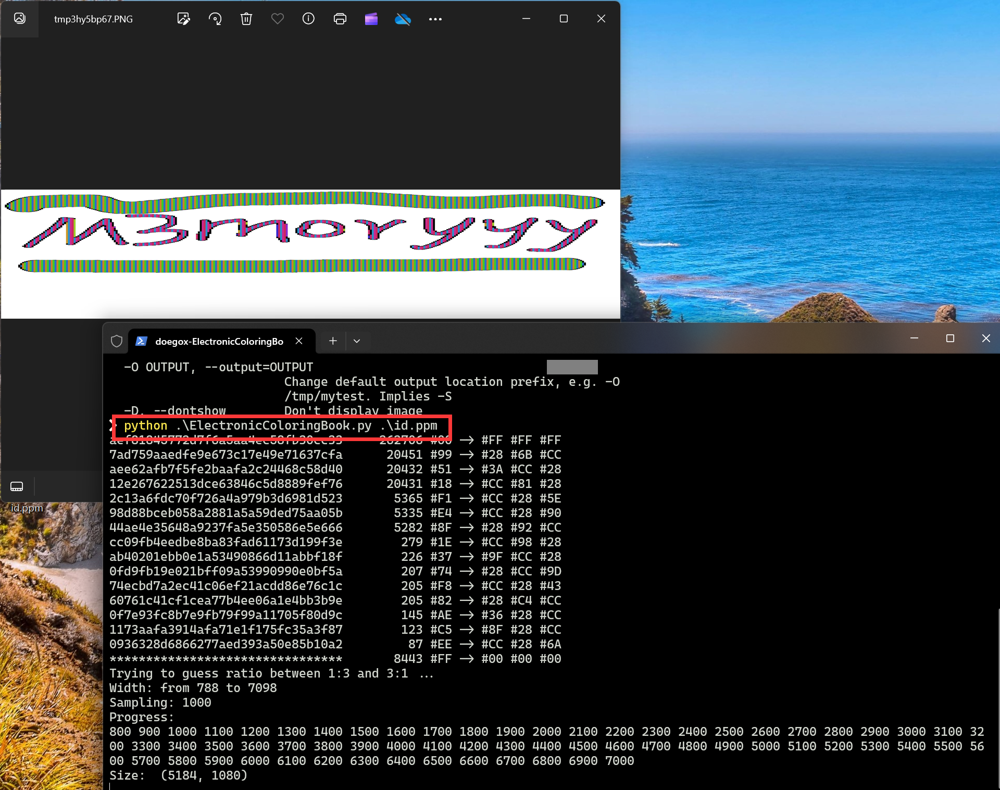

然后去各大社交平台搜索这个id，在微博中可以搜到这个用户

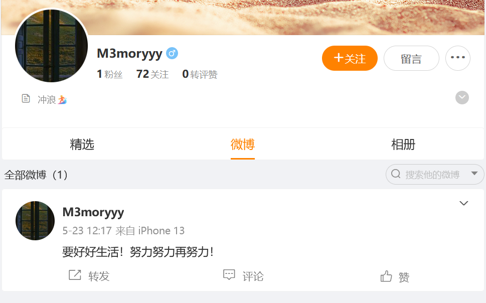

在他的关注列表里可以搜到另一个头像中有 CTF 字样的人

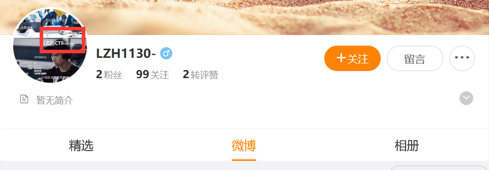

然后发现他的博客地址，base64解码一下得到：www.zimablue.life

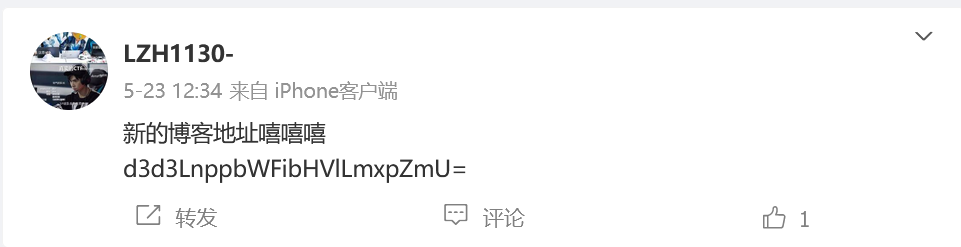

翻阅博客，发现一篇加密的文章

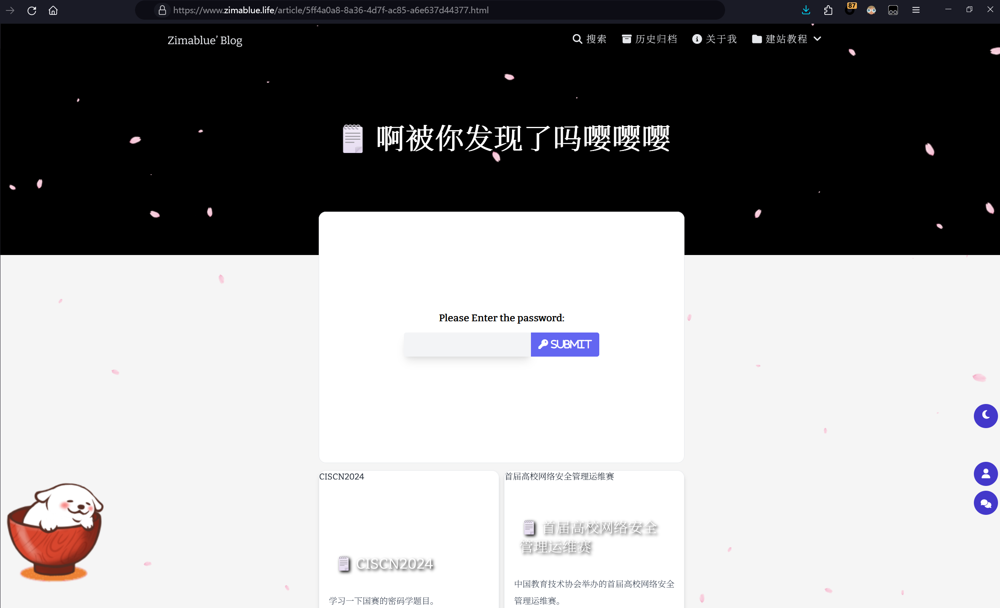

在微博中发现密码的线索：密码是女朋友的生日

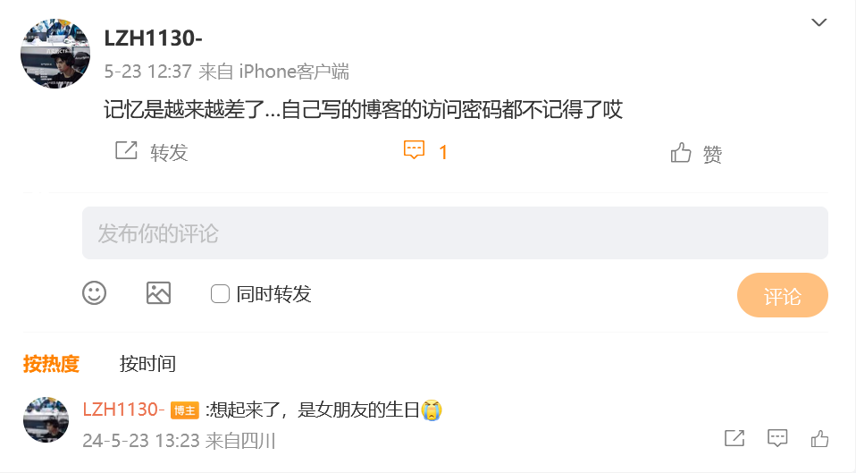

通过上一篇博文中小红书的id去搜索

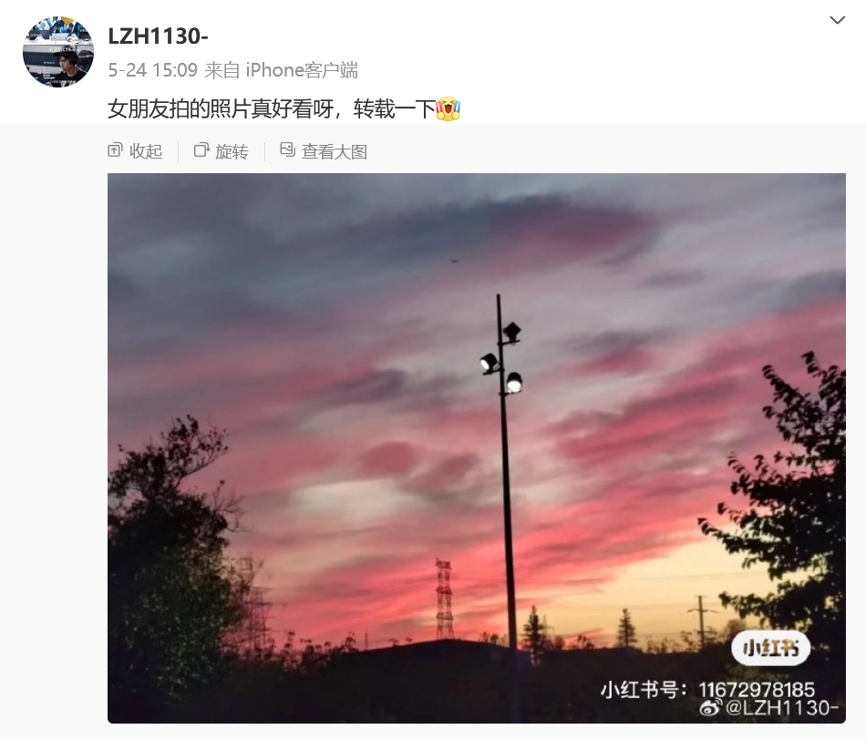

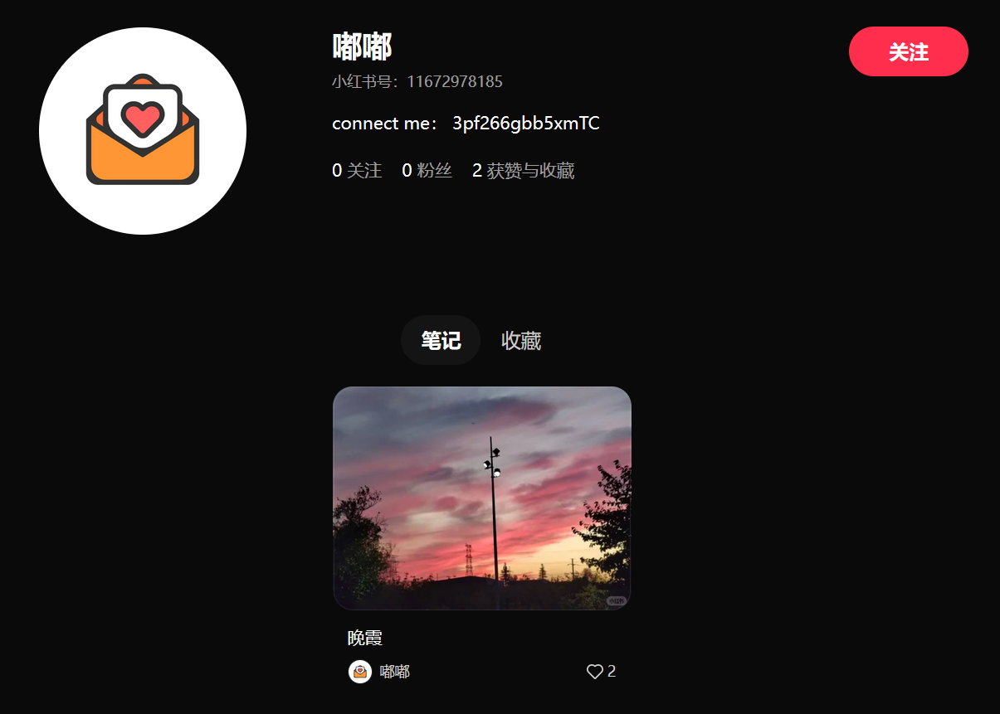

base58解码后可以得到一串数字，猜测是QQ号

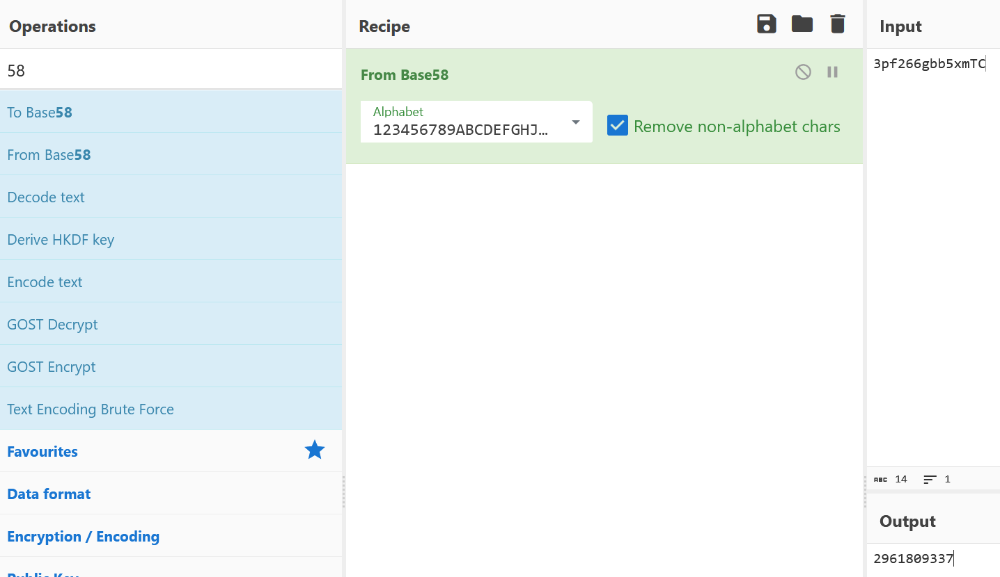

去QQ搜索这个QQ号就可以看到出生日期了，所以密码就是20000917

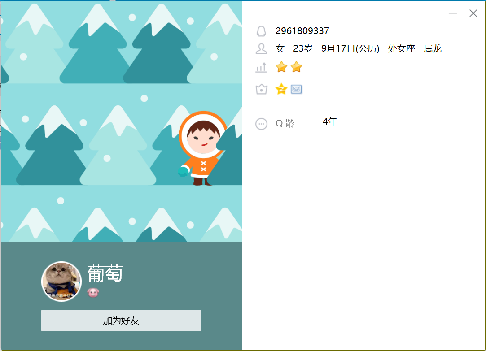

解开那篇文章后发现需要去Github上找

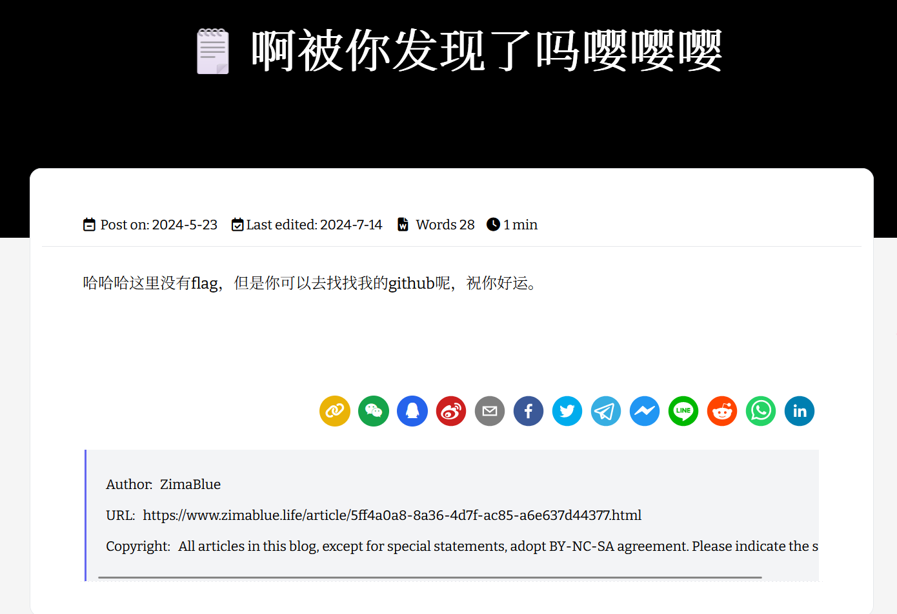

在Github上找到下面这个仓库

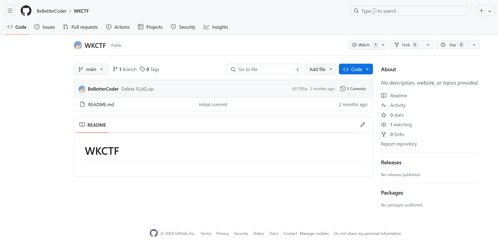

把这个项目 clone 到本地，查看历史版本，发现删除了flag

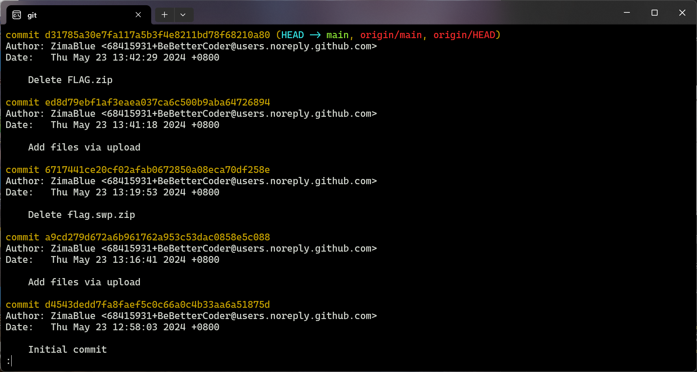

使用以下命令回退到之前的版本，得到FLAG.zip

```
git reset --hard ed8d79ebf1af3eaea037ca6c500b9aba64726894
```

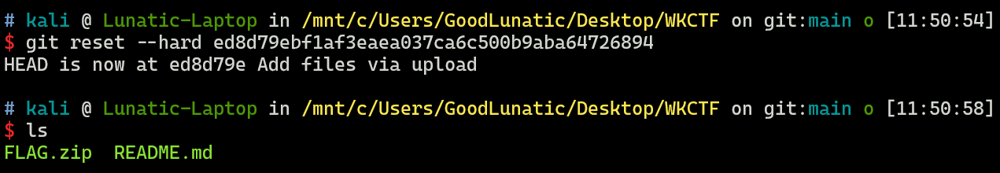

解压压缩包后得到 .FLAG.swp ，在里面找到flag

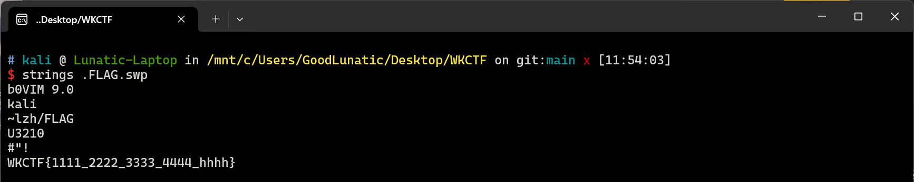

WKCTF{1111_2222_3333_4444_hhhh}

---

> 作者: [Lunatic](https://goodlunatic.github.io)  
> URL: https://goodlunatic.github.io/posts/2125dc5/  

