# 2024 WKCTF Misc Writeup

忙里偷闲，稍微打了一下 2024WKCTF 练练手
&lt;!--more--&gt;
## Signin
附件就给了一段密文，后面给了提示才知道是 twin hex 编码
直接使用在线网站解密：https://www.dcode.fr/twin-hex-cipher

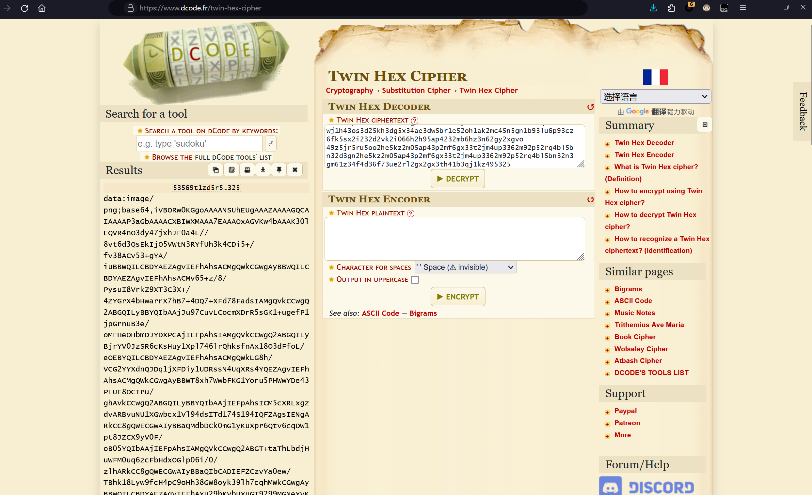

解密后得到一张base64编码后的图片，CyberChef 解码发现是张二维码，识别一下

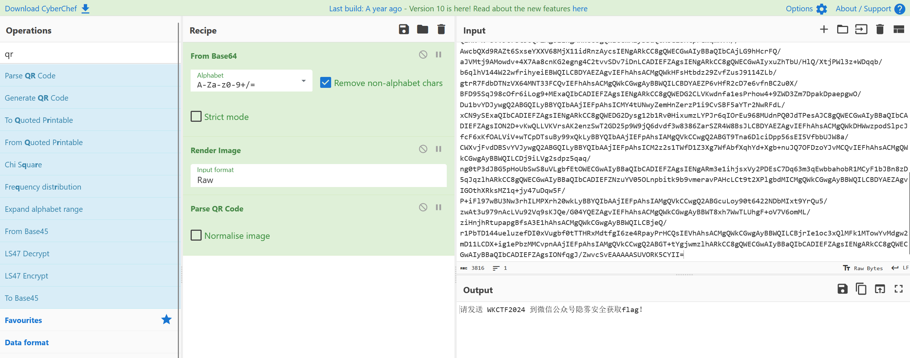

WKCTF{hello_2024}

## 不套是你的谎言


## ⼩z的社交⽹络

题面信息提示了这是一张由 AES-ECB 算法加密的 ppm 图片：
赛后知道了有这个项目：https://doegox.github.io/ElectronicColoringBook/
原理大概就是：相同的明文块被加密成相同的密文块
直接使用这个项目还原一下这张图片，得到id：M3moryyy
```shell
python .\ElectronicColoringBook.py .\id.ppm
```

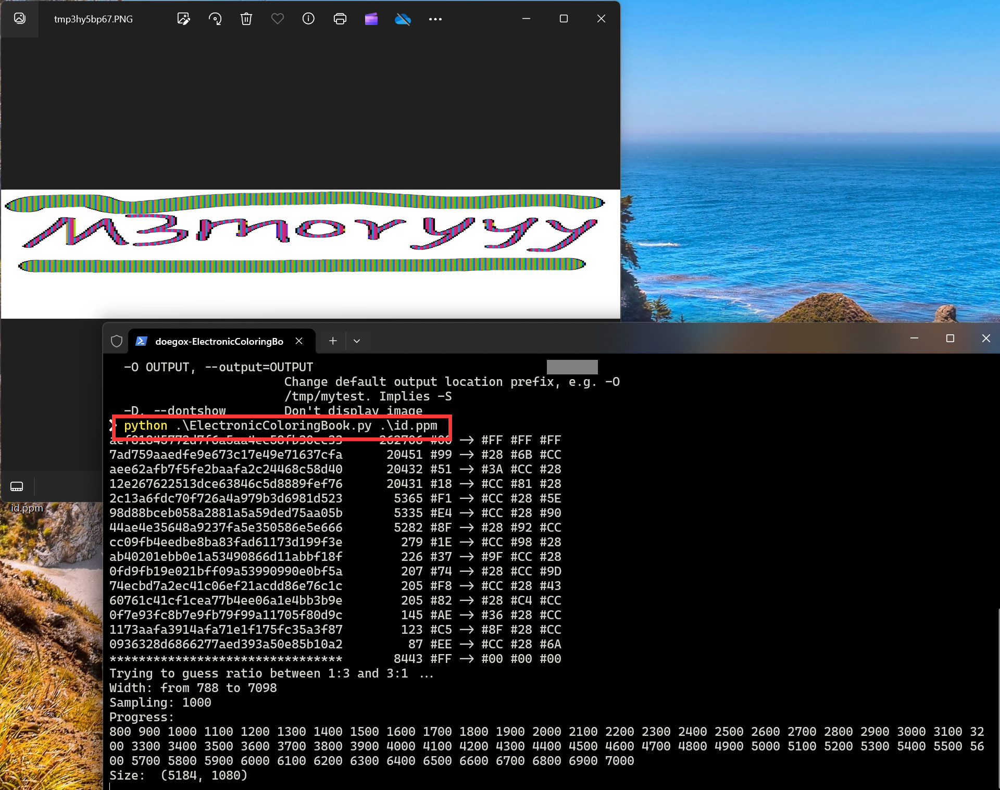

然后去各大社交平台搜索这个id，在微博中可以搜到这个用户
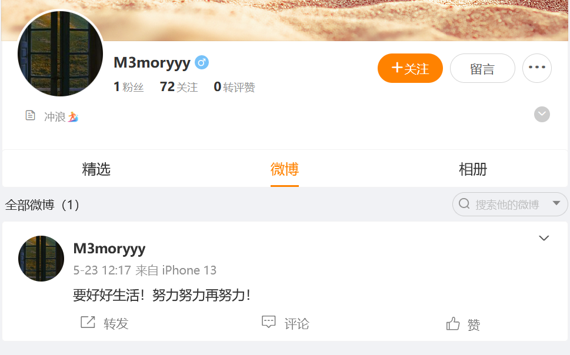

在他的关注列表里可以搜到另一个头像中有 CTF 字样人
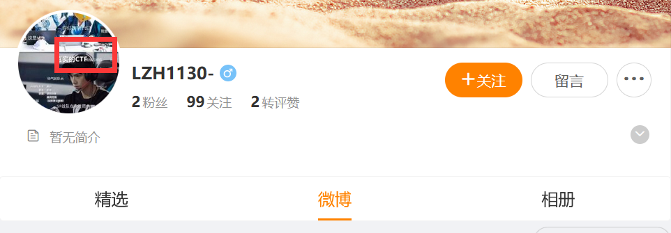

然后发现他的博客地址，base64解码一下得到：www.zimablue.life
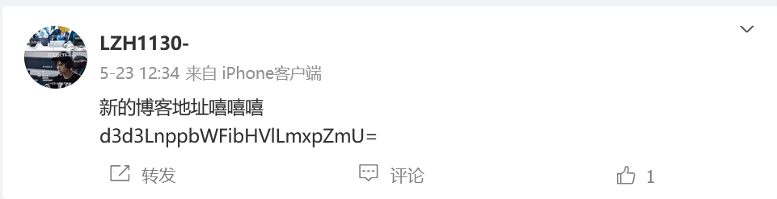

翻阅博客，发现一篇加密的文章

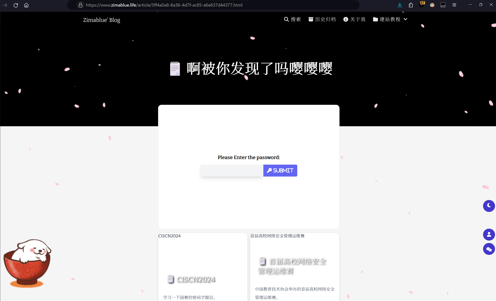

在微博中发现密码的线索：密码是女朋友的生日

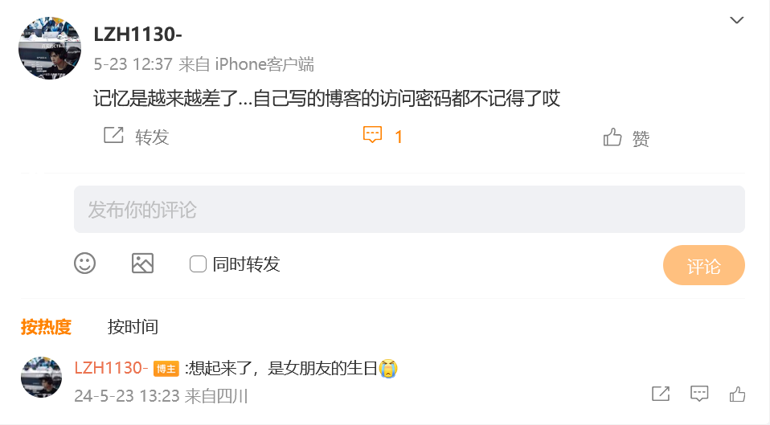

通过上一篇博文中小红书的id去搜索

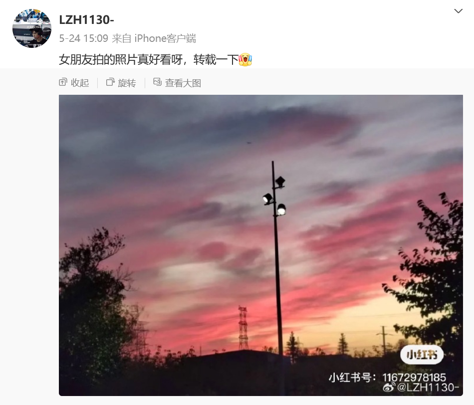

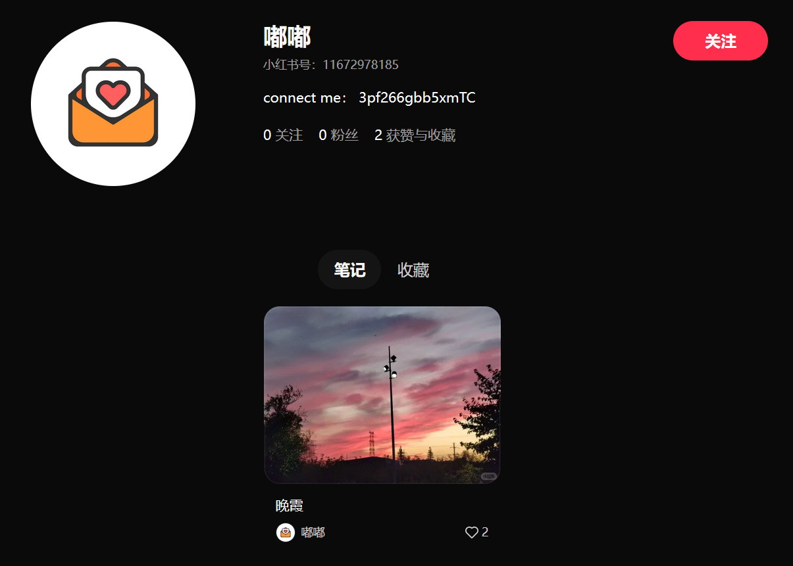

base58解码后可以得到一串数字，猜测是QQ号

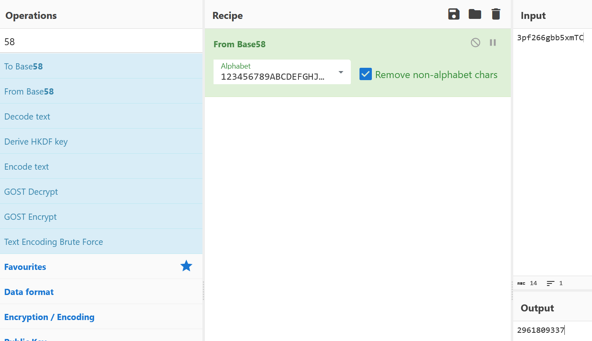

去QQ搜索这个QQ号就可以看到出生日期了，所以密码就是20000917

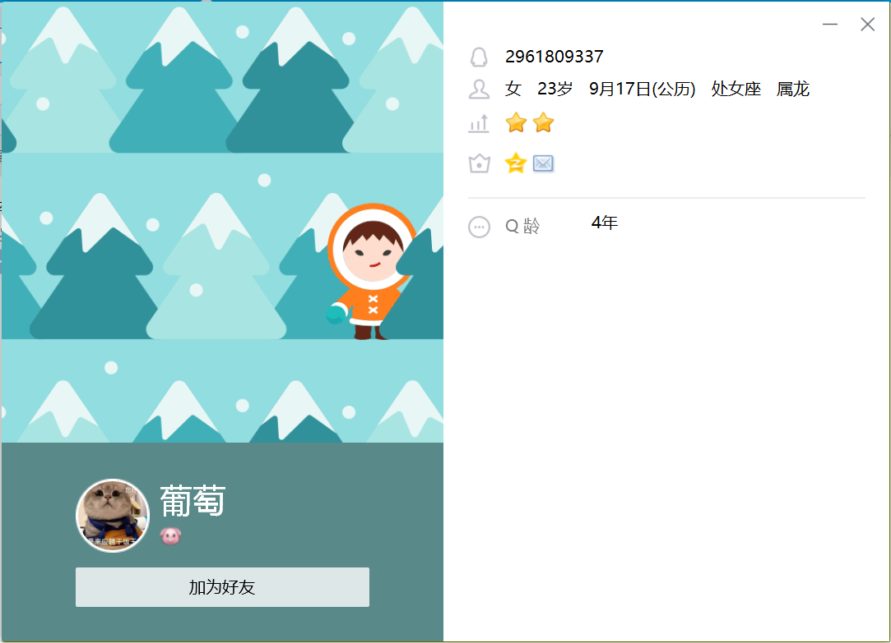

解开那篇文章后发现需要去Github上找

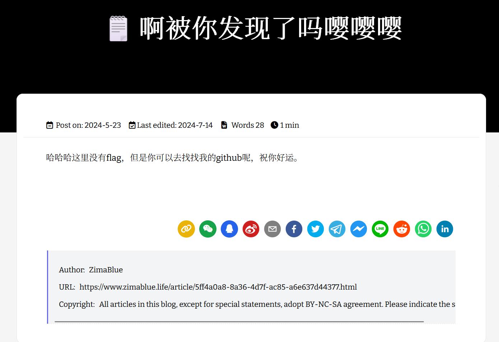

在Github上找到下面这个仓库

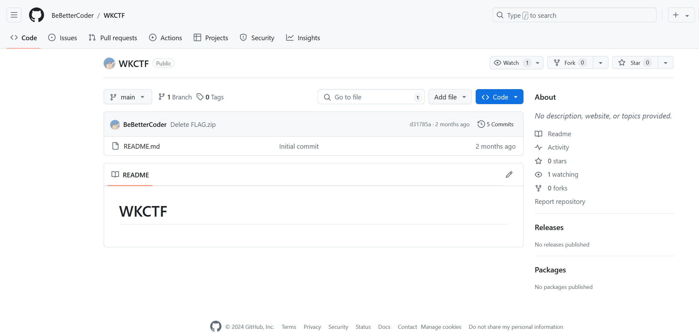

把这个项目 clone 到本地，查看历史版本，发现删除了flag

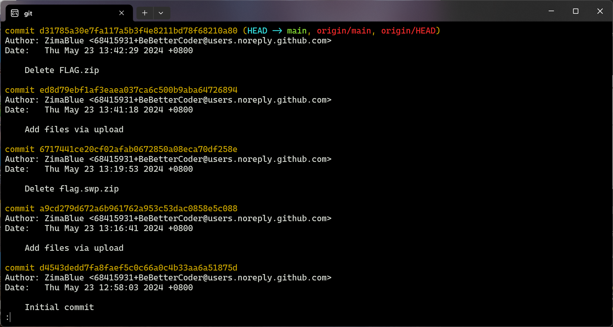

使用以下命令回退到之前的版本，得到FLAG.zip
```
git reset --hard ed8d79ebf1af3eaea037ca6c500b9aba64726894
```

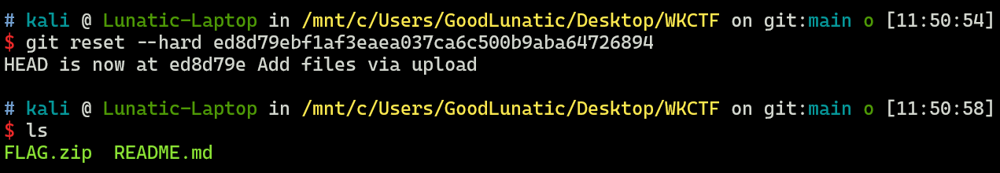

解压压缩包后得到 .FLAG.swp ，在里面找到flag

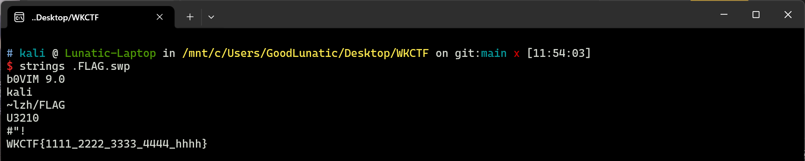

WKCTF{1111_2222_3333_4444_hhhh}

---

> Author: [Lunatic](https://goodlunatic.github.io)  
> URL: http://localhost:1313/posts/2125dc5/  

