# 2025 “天一永安杯”宁波市赛初赛 Misc Writeup

**2025 “天一永安杯”宁波市赛初赛 Misc Writeup**
<!--more-->

> 本文中涉及的具体题目附件可以进我的交流群获取，进群详见 [About](https://goodlunatic.github.io/about/)

## 题目名称 吾的字节

> 啊，吾的字节！呃~我为什么要说吾？

解压附件得到一张里面有等距像素点的二维码 `five.png`

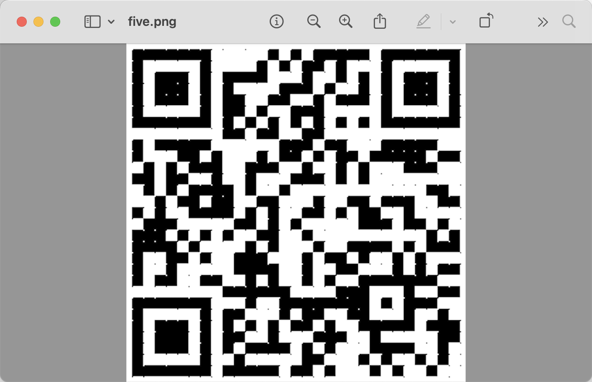

扫码得到：`flag is no here, see the QRcode clearly!`

因此我们尝试提取其中的等距像素点，可以得到下图

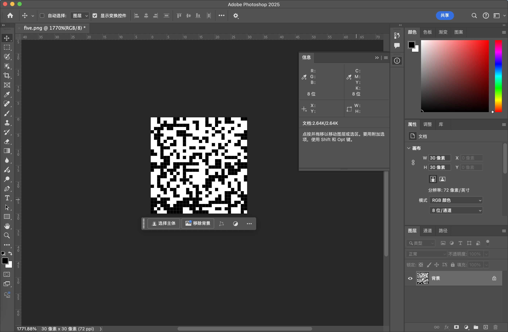

然后写一个脚本将里面的黑白像素转换为1和0

```python
from PIL import Image

def func1():
    img = Image.open("five.png")
    w,h = img.size
    # print(w,h)
    res = ''
    for y in range(h):
        for x in range(w):
            r,g,b = img.getpixel((x,y))
            if r == 0:
                res += '1'
            else:
                res += '0'
    print(res)

if __name__ == "__main__":
    func1()
# 001000011010000001001001100011001010010000011001001101110000000111111111001001101000000100011101100001001000010010010000101000001110000001001100100001011100001111100000010010001111011001100010011011000010000011001010010010000101000000100100001100110010000000010101001100000111000000110110000110000011100100010010000000011001000001110100101000011101101010000100000111001010110101000001111001000011000000100011001100000100110111011111111001001101101111111110011010000000111101110111100101110011111001000010111100000110101010000001001010111000001110010010100000111111000001001000110111000001110110001001001001000010100001100010100100101101001000011011100000100100000110110001001001001000010100000010010001101100100001111010001000011000101001000101100111110111000011111100001101100011111110001111011000111111101101110111011111111111100000111011101011111100110100001101100011110001111100011111000000100010
```

题目一直在提示五位，包括图片的名字也是`five.png`

因此可以联想到博多码，因此用随波逐流解密即可

当然这里就算联想不到，也可以直接用随波逐流一把梭：`DASCTF{JU5T-A-F1VE6IT-9AME}`

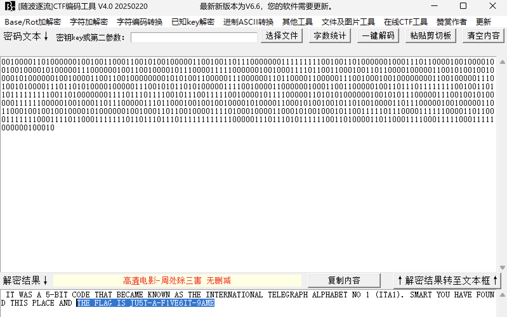

## 题目名称 Infinite_transformation

> 磁盘里蕴含着什么东西呢，也许有一只猫

压缩包注释中提示了解压密码是六位，并且还有别的用处

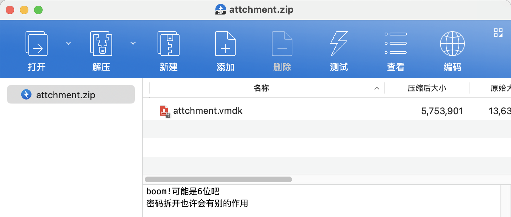

爆破可以得到密码是121144

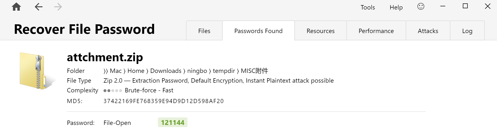

解压后得到一个vmdk虚拟磁盘文件

尝试用DiskGenius恢复删除的文件

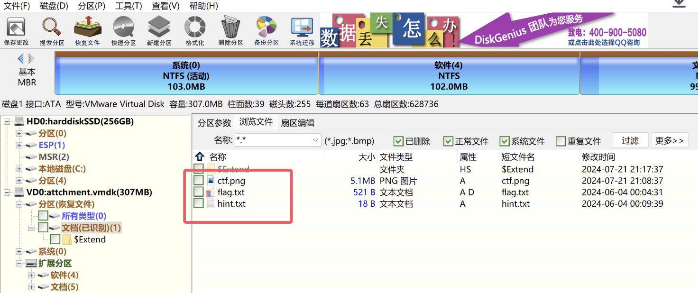

flag.txt中的内容如下：

>64302039943980618121484184873128503074609076299244422107146064367058121738007282650851520841656649070683123403821937513267391370346165645908933956953599129037238861474390287394253991334205788122863003605507035424785292830536282067025856204240859500900770386319047433635878298987553848841486636769829855797015618861382395619672208366605793866695702843978585628878996390708495917362310741277717465790690657480858197797078816624813513712771929056001109014477328987890335180242509040895793315048815591172058129474723554263040

hint.txt中的内容如下：

> 数字映射函数

ctf.png如下所示：

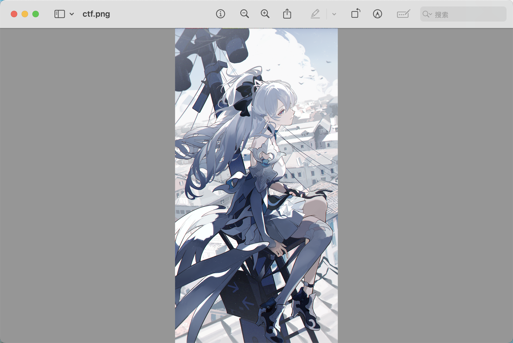

用stegsolve打开，翻看发现RGB通道的第七位隐写了一张PNG图片

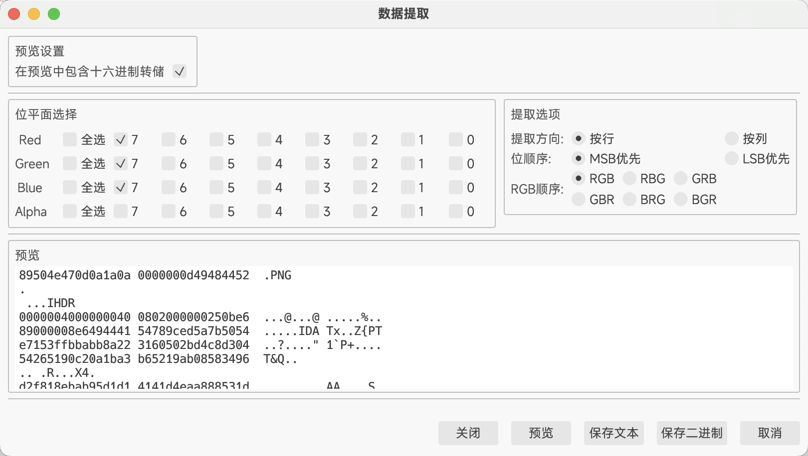

导出后可以得到下图

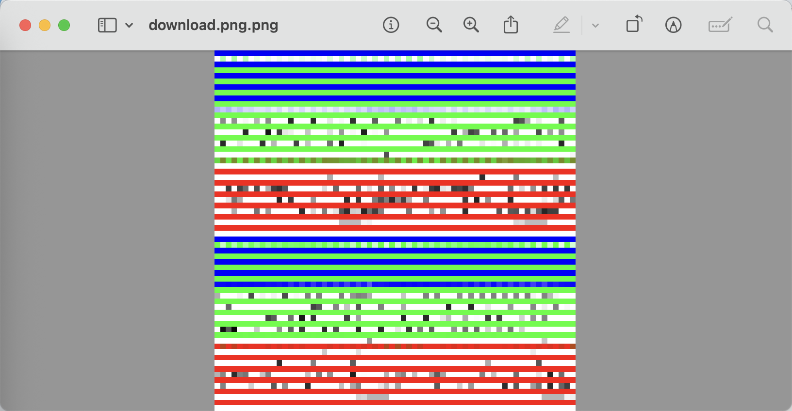

结合题面信息和之前得到的压缩包解压密码，猜测这张图片是经过猫脸变换了

然后去网上搜猫脸变换相关的脚本，发现很多脚本的a是144，b是121（出题人连这个都懒得改。。）

因此尝试解密猫脸变换，但是发现shuffle_times默认为1的时候是解不出来的

因此猜测需要爆破，这里我就直接用[Github上开源的项目](https://github.com/Alexander17-yang/Anrold-break)进行爆破了：

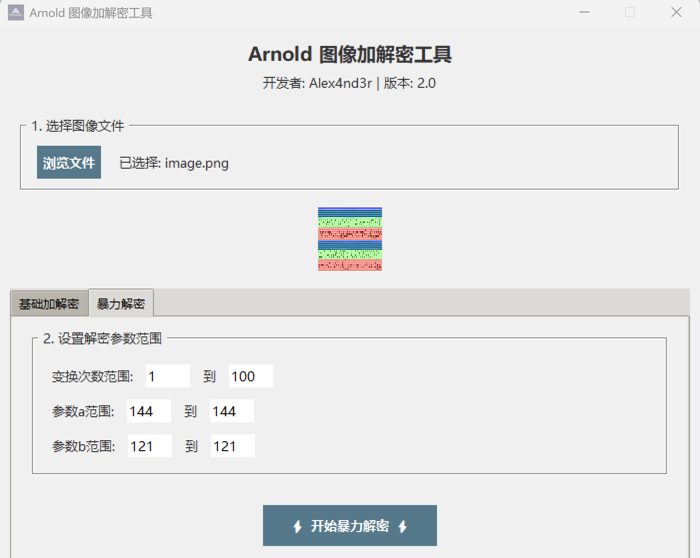

 爆破后即可得到第一段flag

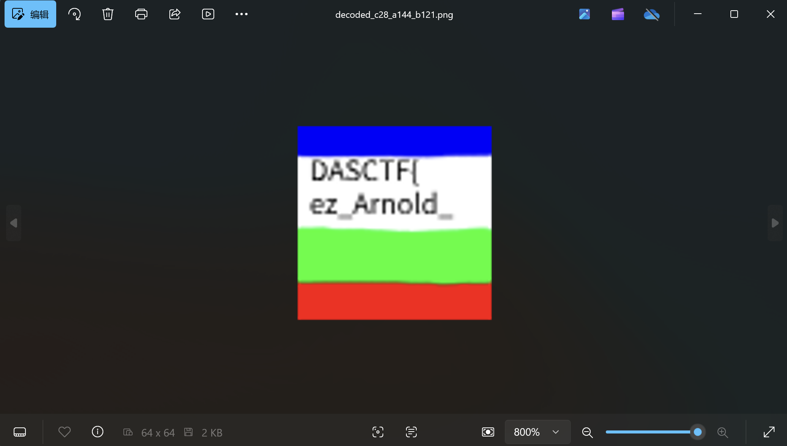

然后再回过头去看那个flag.txt

发现是由0-9的十进制数组成的一个长整数

尝试了各种解码后发现都得不到有用的信息，最后发现其实是Tupper自指公式

因此找个在线网站画个图即可得到第二段的flag：https://tuppers-formula.ovh/

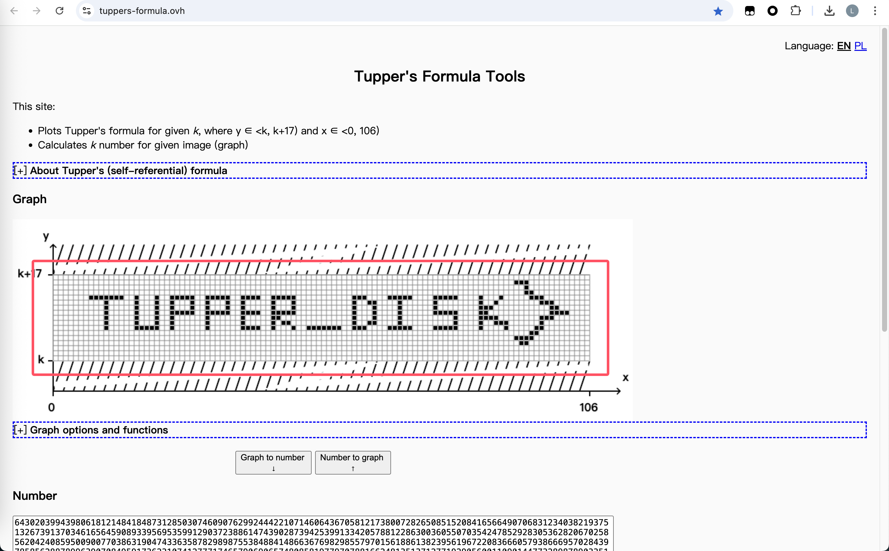

综上，结合上面两段flag即可得到最后的flag：`DASCTF{ez_Arnold_TUPPER_DISK}`


---

> 作者: [Lunatic](https://goodlunatic.github.io)  
> URL: https://goodlunatic.github.io/posts/30d0764/  

