# DASCTF 2024最后一战 Misc Writeup

**有师傅来问这场比赛里的题，然后稍微看了一下，发现Misc题确实出的挺好，于是打算记录一下**
<!--more-->

| <br> |
| :---------------------------------------: |
|  题目附件：https://buuoj.cn/match/matches/213  |

## 题目名称 弹道偏下

解压附件压缩包，得到一个`secret.pcapng`

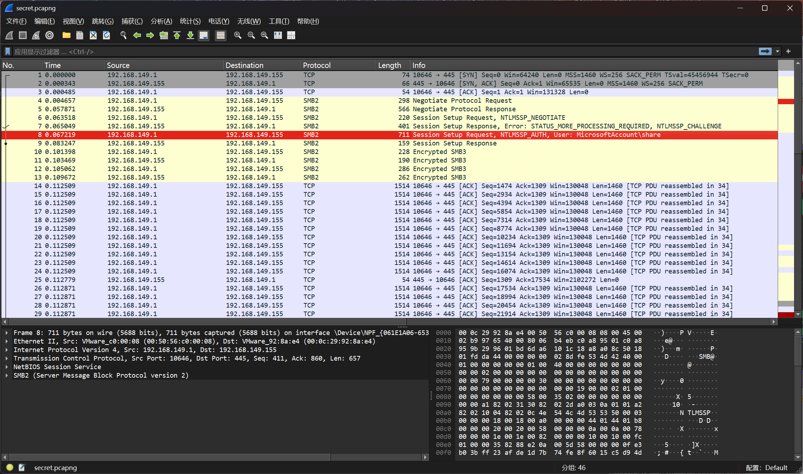

翻看流量，发现主要是加密的SMB2流量，用了`NTLM`身份验证机制

因此我们尝试手动把验证过程中的数据提取出来，然后用`hashcat`爆破

具体原理和提取步骤详见作者的这篇博客：[Misc-Network Traffic Analysis](https://goodlunatic.github.io/posts/5422d65/#ntlm%E6%B5%81%E9%87%8F%E5%88%86%E6%9E%90) 

```
share::MicrosoftAccount:0a08d9f15eb53eea:a20aec951c89961f2e81bf0917d8990a:0101000000000000cfebd19d3636db01022ada3cfbb5b30e0000000002001e004400450053004b0054004f0050002d004800440039004b0051004e00540001001e004400450053004b0054004f0050002d004800440039004b0051004e00540004001e004400450053004b0054004f0050002d004800440039004b0051004e00540003001e004400450053004b0054004f0050002d004800440039004b0051004e00540007000800cfebd19d3636db01060004000200000008003000300000000000000001000000002000004c3c615542417f8e002c772c6064cc84d886fec17c1ed7cceea68daf7f6954fc0a001000000000000000000000000000000000000900280063006900660073002f003100390032002e003100360038002e003100340039002e003100350035000000000000000000
```

```bash
.\hashcat.exe -m 5600 -a 0 hash.txt rockyou.txt --force
```

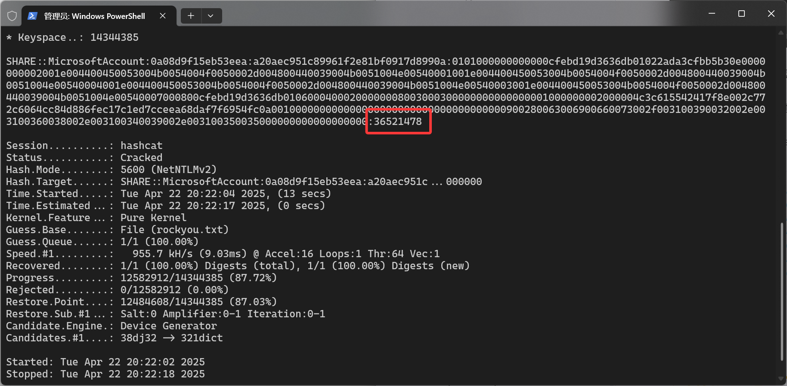

用`rockyou.txt`字典爆破也是一会就出了，得到密码：`36521478`

然后我们到`编辑-首选项-Protocols-NTLM SSP`里输入得到的密码，并点击应用即可解密流量

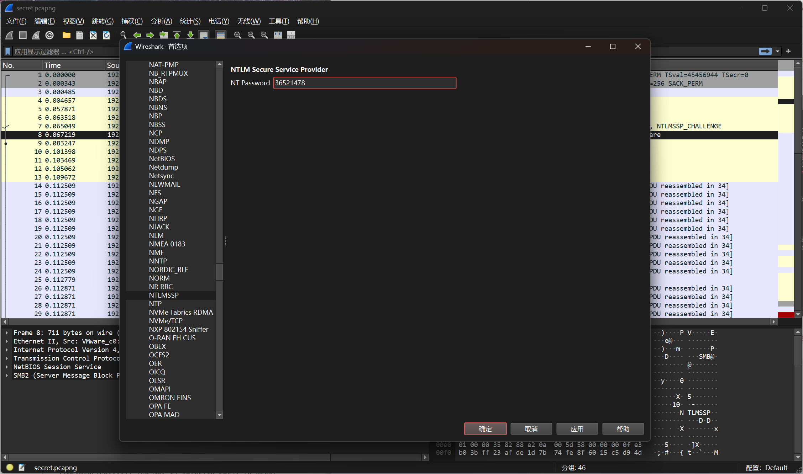

解密完后，我们即可在`文件-导出对象-SMB`中看到传输的文件，流量中传了一个`secret.doc`，我们尝试保存到本地

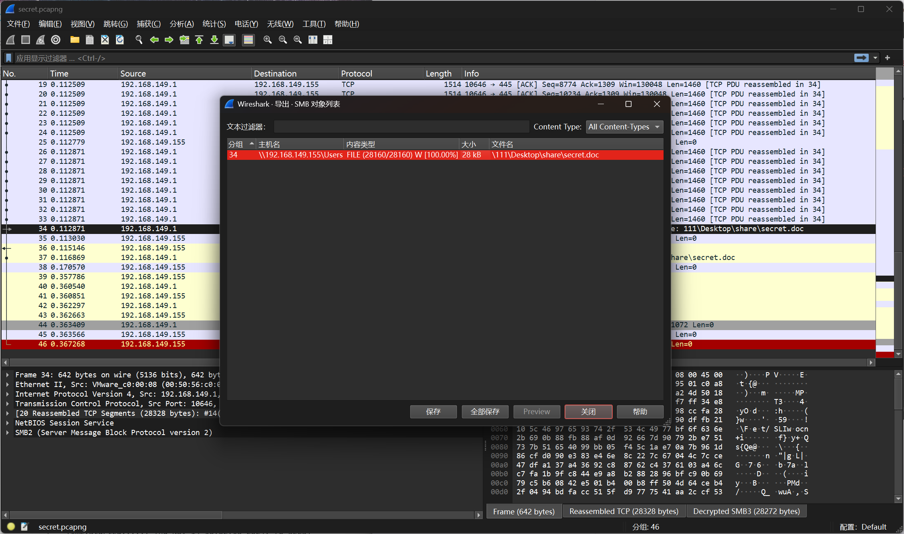

发现直接打开会报错，因此我们用010打开，发现文件数据好像被逆置了

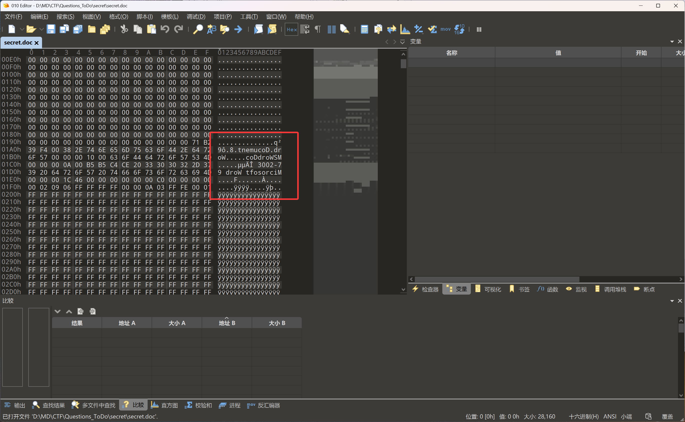

因此我们可以直接用`CyberChef`把数据逆置回来，并保存到本地

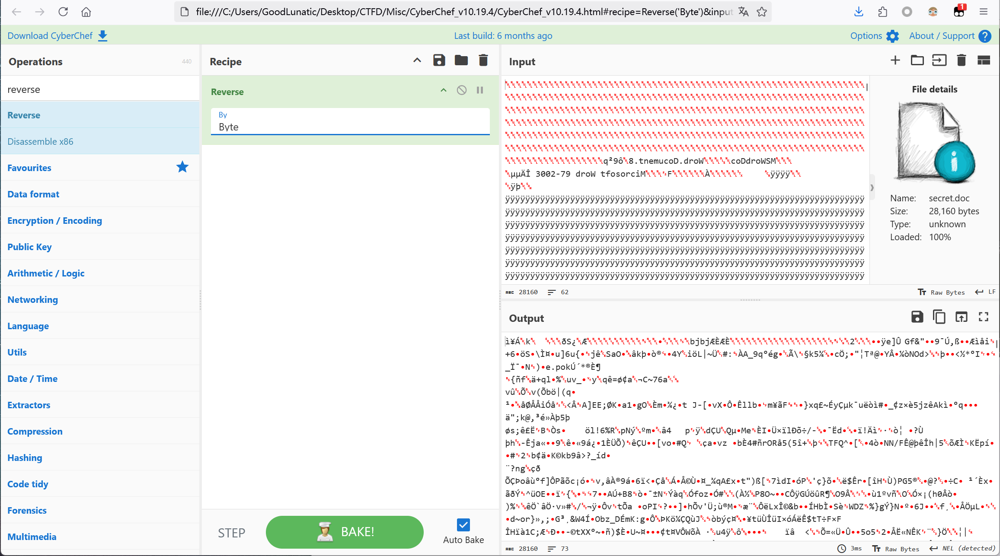

数据逆置后打开，发现文件还是报错，因此我们新建一个`MS97-2003`的doc文件，用010来diff一下

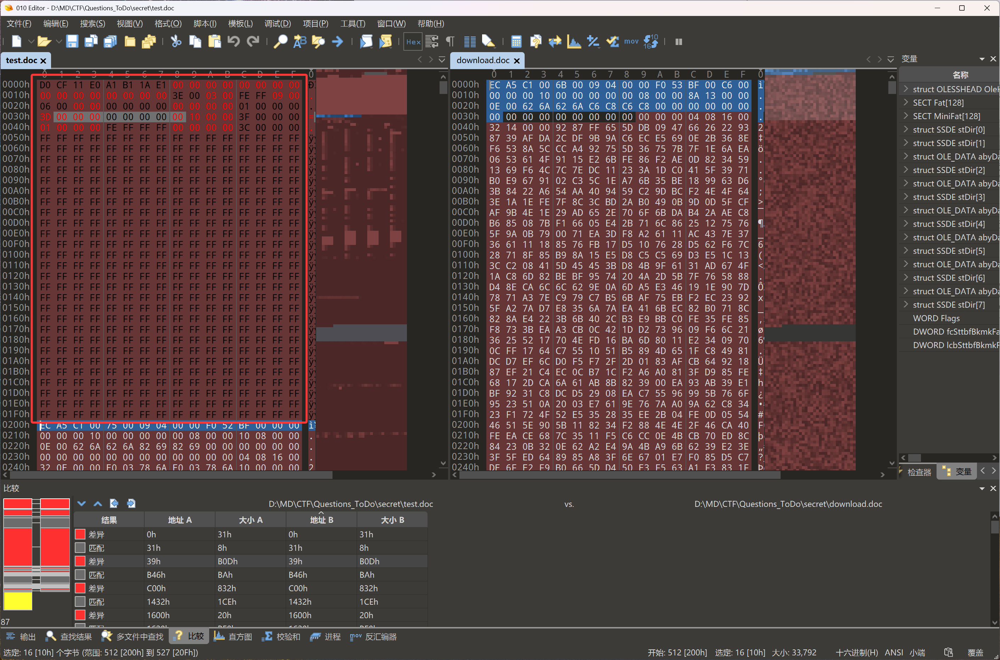

发现是`oleHeader(0x200字节)`被删除了，因此我们接下来要尝试修复这个doc的`oleheader`

这一个考点以前确实没有遇到过，这里参考了[官方的wp](https://www.yuque.com/chuangfeimeiyigeren/eeii37/oxv3gaim7fr89ed2?sessionid=1564360602#djHsp)

> 0-0x7是文件签名是固定的
> 
> 0x8-0x17文件的标识一般全零
> 
> 0x18-0x1B文件格式的修订号和版本号,可以认为是固定的常量
> 
> 0x1C-0x1D:字节序, 一般都用小端序0xFEFF
> 
> 0x1E-0x1F每个扇区的大小,一般来说就是9
> 
> 0x20-0x2Bshort-sector的大小,一般是6
> 
> 0x2C-0x2F表示FAT表中有几个DWORD是有效的
> 
> 0x30-0x33整个复合文档的根目录所在扇区的索引号,找root,entry,找是第几个扇区,注意算的时候需要把第一个扇区排除 0x6800/0x200-1=0x33
> 
> 0x34-0x3B固定值
> 
> 0x3C-0x3F短扇区分配表的扇区位置,一般紧接着root Entry,得看rootEntry占用多少扇区,这里是占用两个扇区,因此这里的值应该填0x35
> 
> 0x40-0x43 短扇区分配表占用的扇区数,可以看到就占一个扇区
> 
> 0x44-0x4B主扇区分配表的扩展部分的索引以及其大小,因为文件比较小没有用到扩展部分,第一个应该是-2即0xFEFFFFFF,大小为0
> 
> 0x4C-后面是主扇区分配表,因为文件不是很大,基本只有前面几个字节是有意义的,后面都是0xFF,取值和Root Entry的扇区号有关,一般就是root扇区倒着写,因为root为33,这里我们填一个0x32000000

最后修复完的`oleheader`如下所示：

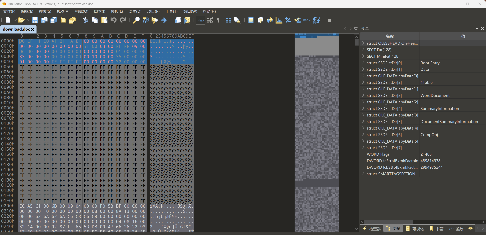

尝试用word打开修复后的doc，发现需要密码，因此直接尝试用`PasswareKit`爆破

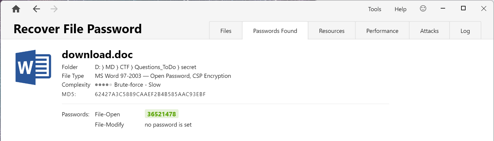

打开并输入爆破得到的密码，把白色的文字标红后即可得到最后的flag：`flag{u_are_a_g00d_OLE_Repairer}`

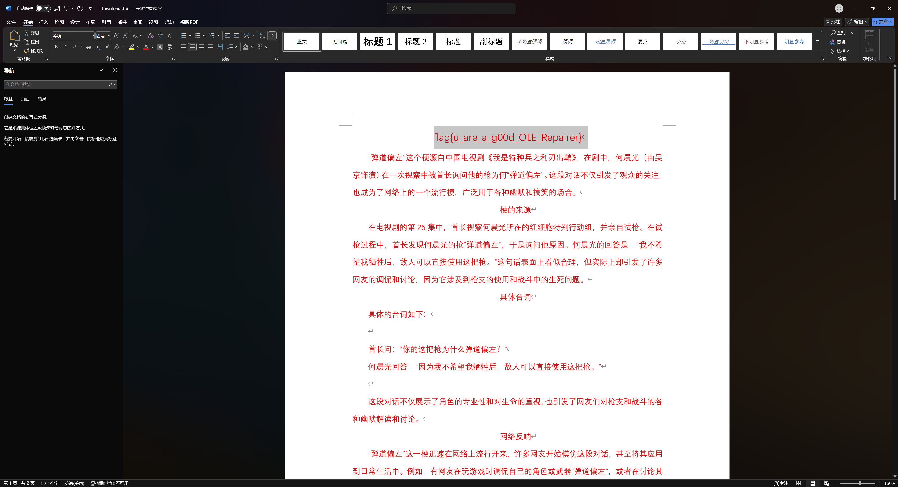

## 题目名称 1z_F0r3ns1cs_1

题目附件给了一个`1z.vmdk`虚拟磁盘文件，因此我们直接用`DiskGenius`打开并恢复被删除的文件

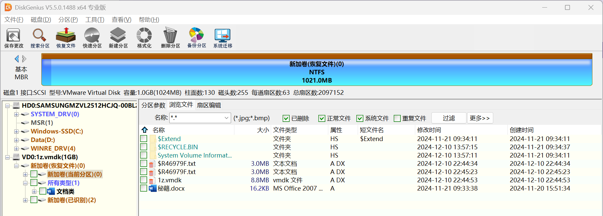

可以得到一个`秘籍.docx`还有一个txt文件

改docx文件后缀为zip并解压，可以在`/word/theme`中得到一个bat文件

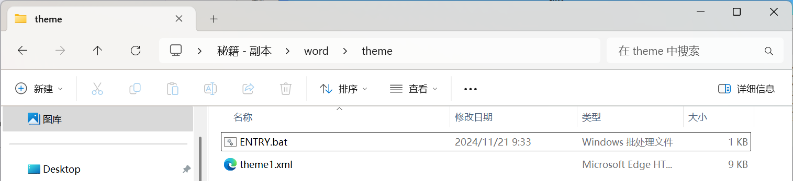

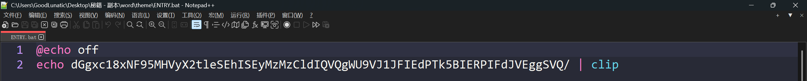

打开后可以得到一串base64编码，解码后可以得到如下内容：

> th1s_14_y0ur_key!!!!2333
> 
> WHAT YOU'RE GONNA DO WITH IT?

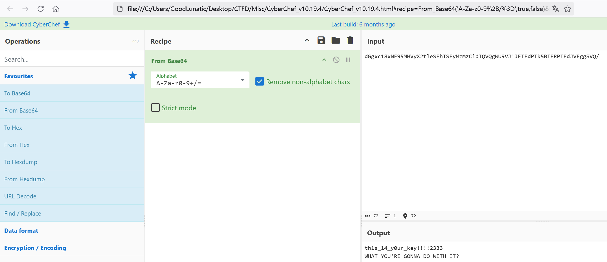

提示了我们一个密钥，然后我们回头去看另一个txt文件，发现文件大小正好是3MB

因此猜测可能是VC加密容器，上面的密钥就是VC的加密密钥

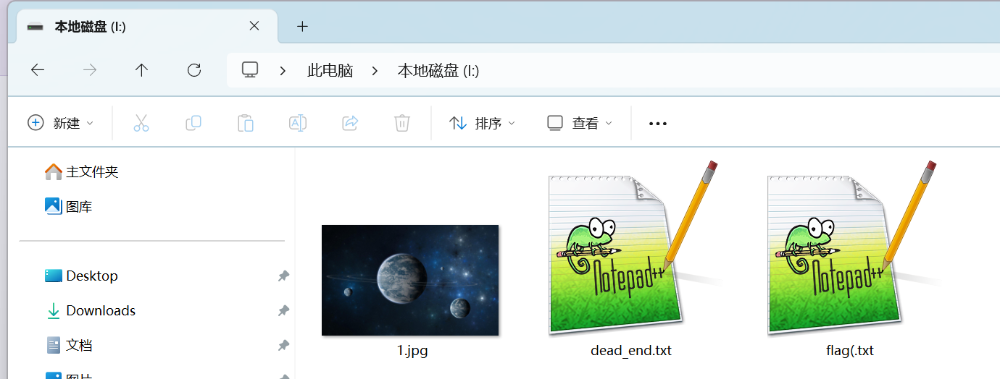

使用VC挂载后可以得到两个txt文件，还有一张jpg图片

`flag(.txt`文件中没有什么关键的信息，因此我们把目光集中到另一个txt上

这里可能需要亿点点脑洞，当我们把`dead_end.txt`作为密钥文件去挂载之前的那个txt的时候

可以得到一个隐藏卷

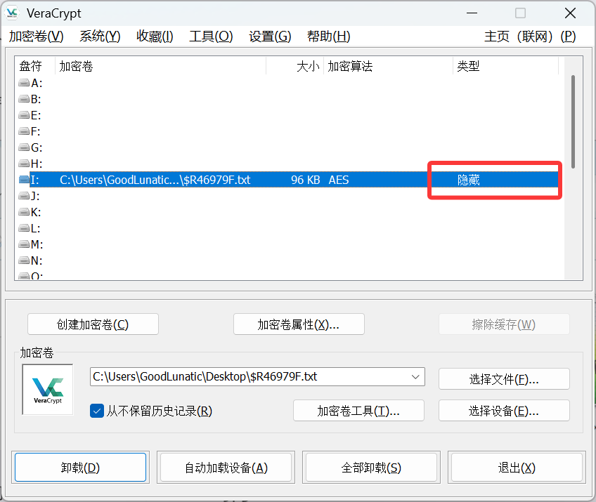

打开后可以得到一个`t0p_s1cr3t.txt`，内容如下：

> YOU ARE AWESOME!!!!BUT NOT ENOUGH,Here is flag1:
> 
> DASCTF{N0w_u_knOw_H1dden_v0lum3_
> 
> AND HERE IS A LITTLE REMINDER,THE MASK IS:
> 
> U????Klsq
> 
> ONLY LOWERCASE AT 1 AND NUMBERS AT 2,3,4

得到了第一段的flag以及一个掩码，联想到之前得到的那张jpg

猜测需要我们通过掩码生成字典，然后去解密`steghide`

因此我们写个脚本按照掩码的格式生成一下字典

```python
from string import digits, ascii_lowercase

mask = "U?u?d?d?dKlsq"
for a in ascii_lowercase:
    for b in digits:
        for c in digits:
            for d in digits:
                passwd = f"U{a}{b}{c}{d}Klsq"
                print(passwd)
```

然后直接用`stegseek`爆破即可得到第二段flag：`Of_v3r@cr1pt&90_0nnnnnnnnnnn!!!a>?#P2}`

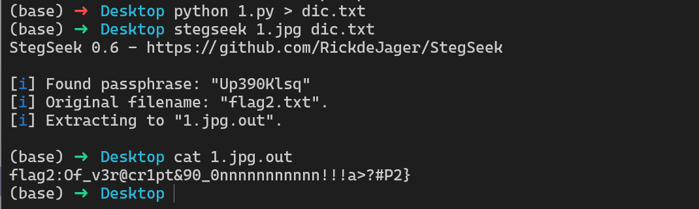

把两段flag合起来即可得到最后的flag：`DASCTF{N0w_u_knOw_H1dden_v0lum3_Of_v3r@cr1pt&90_0nnnnnnnnnnn!!!a>?#P2}`

## 题目名称 手把天尊

> 不说别的了，这样吧你先按住RT+B使出看破斩，随后RT+A特殊纳刀，然后轻触RT使用聚合拔刀气刃斩，最后RT+Y打出气刃突刺，派生气刃兜割。别忘了把flag小写包上DASCTF。

附件给了一个流量包文件，打开发现主要是USB流量

因此首先拿`CTF-NetA`梭一把，发现一共有七个IP

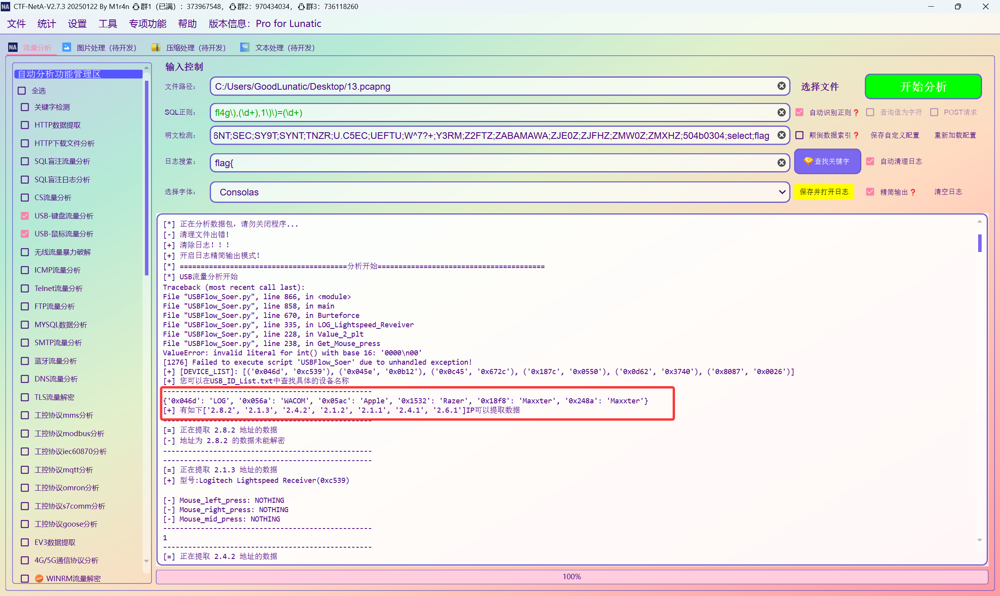

发现解出来的信息里没有什么关键的内容，画出来的鼠标轨迹图也是

然后我们结合题面信息，猜测题面考察的是游戏手柄的流量

然后看CTF-NetA输出的结果，猜测主要是在2.8.2或2.4.2这两个IP传的数据中

然后Wireshark打开，发现2.4.2传的数据不多

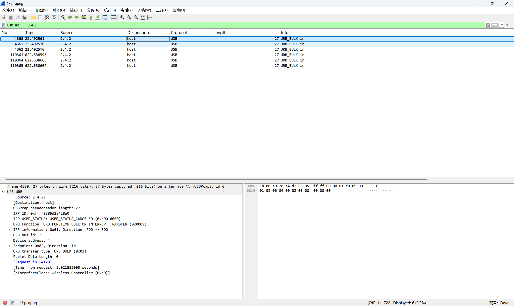

然后查看2.8.2时，发现传输的数据包较多，传输的大部分数据长度都为75

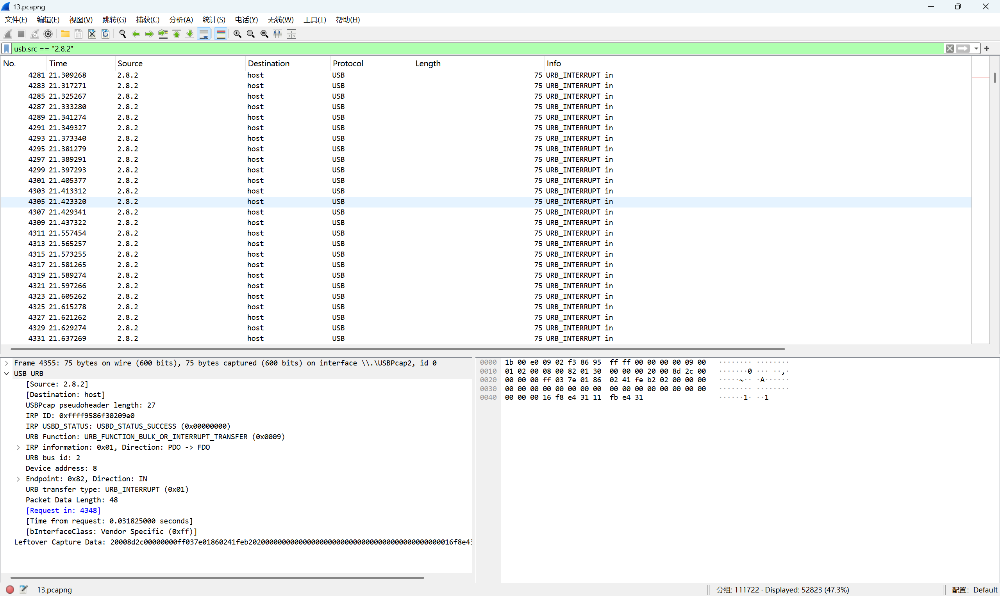

因此这个就是游戏手柄的流量，和平常分析USB流量一样，先用tshark导出传输的数据

```bash
tshark -r 13.pcapng -Y '(usb.src == "2.8.2") && (frame.len == 75)' -T fields -e usb.capdata > data.txt
```

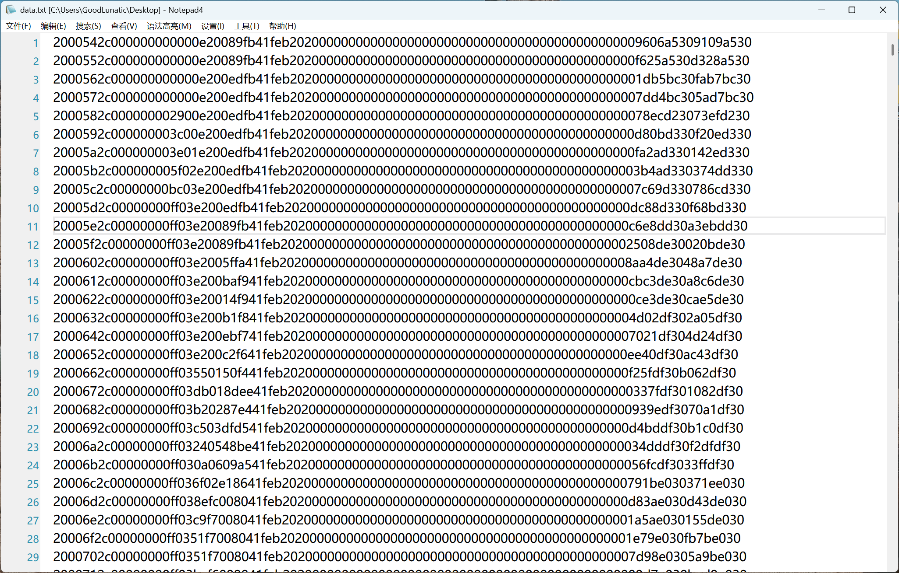

然后我们尝试根据数据的特征，去分析其中的规律

参考链接：https://blog.csdn.net/weixin_51914644/article/details/136098281

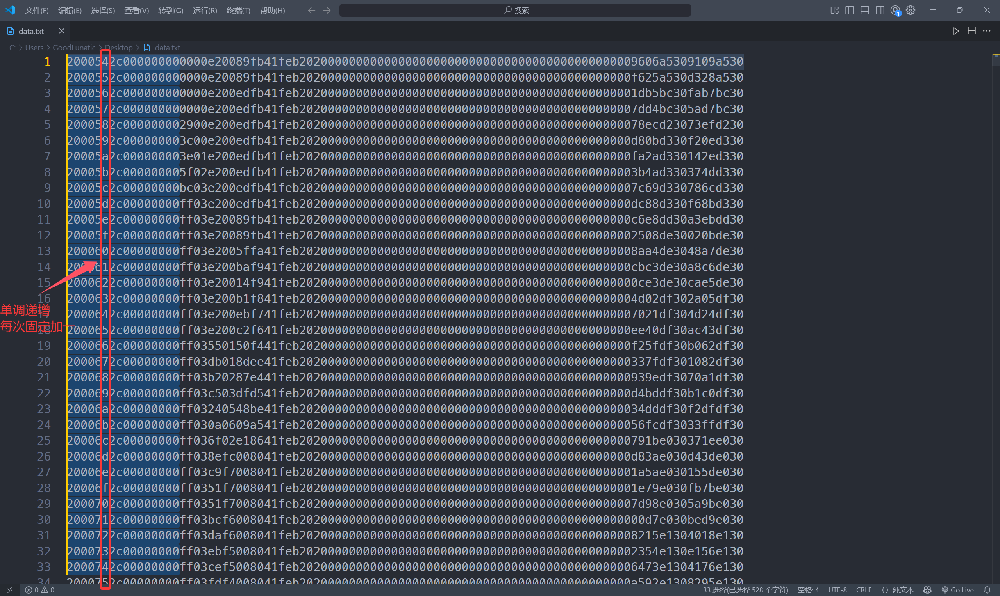

发现前八字节中只有第三字节的数据是单调递增且每次固定加一的，因此不是我们想要的数据

然后发现再变化的数据主要就下图中的这几个位置

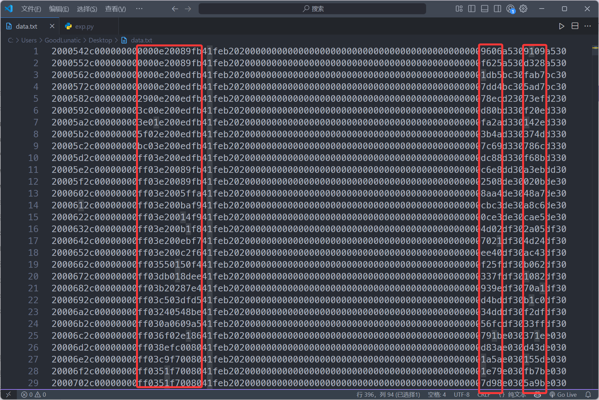


从上面的参考链接中我们知道，手柄的关键数据主要就四个：左扳机、右扳机、左摇杆、右摇杆

看了[赛后官方WP](https://www.yuque.com/chuangfeimeiyigeren/eeii37/oxv3gaim7fr89ed2?sessionid=-1256592792)后知道，第9字节是左扳机的数据（按下去后数值会变大，最大到0xff），第10字节是右扳机的数据

然后第11-14字节是左摇杆的数据，第15-18字节是右摇杆的数据，xy的偏移量分别占其中的两字节

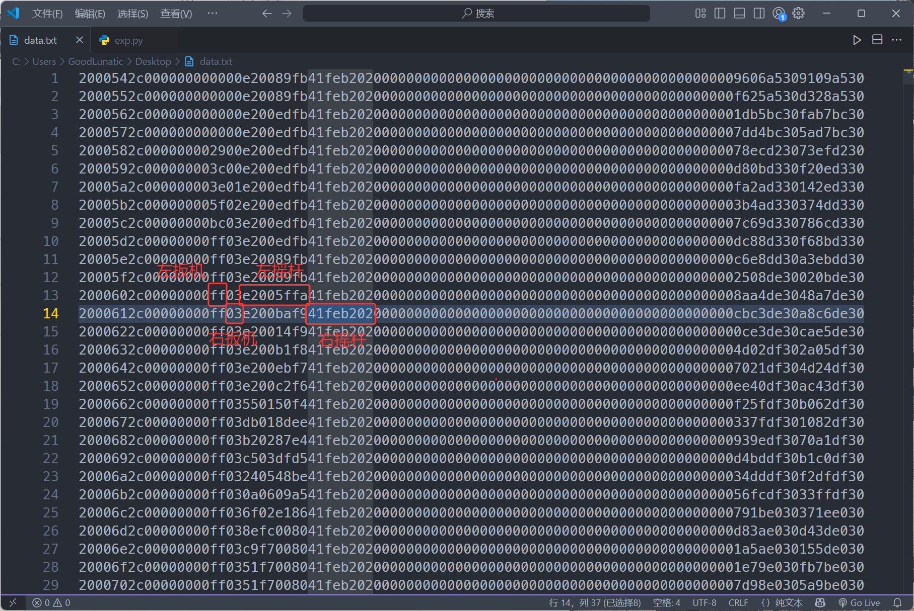

知道了具体数据的位置后，后续的步骤就和鼠标流量分析一样了，通过偏移量计算坐标然后画图

根据数据特征可以看出来这里右摇杆其实是不动的，只有左摇杆在移动

因此我们可以尝试画出所有左扳机按下时，左摇杆的移动轨迹图

```python
from matplotlib import pyplot as plt


def func1():
    mouse_x, mouse_y = 0, 0
    trajectory = []
    plot_count = 0

    with open("data.txt", "r") as f:
        lines = f.read().split()

    for line in lines:
        left_trigger = int(line[16:18], 16)  # 左扳机值
        left_x_offset = int(line[20:24], 16)  # X的偏移量
        left_y_offset = int(line[24:28], 16)  # Y的偏移量
        right_trigger = int(line[18:20], 16) # 右扳机值
        mouse_x += left_x_offset
        mouse_y += left_y_offset
        if left_trigger == 255:
            trajectory.append((mouse_x, mouse_y))
        elif left_trigger == 0 and trajectory:
            plot_trajectory(trajectory, plot_count)
            plot_count += 1
            trajectory = []

def plot_trajectory(trajectory, plot_id):
    x = [point[0] for point in trajectory]
    y = [-point[1] for point in trajectory]

    plt.figure(figsize=(8, 6))
    plt.plot(x, y, 'b-', marker='o', markersize=3)  # 蓝色线条+圆点标记
    plt.title(f"Mouse Trajectory (Trigger Press #{plot_id + 1})")
    plt.xlabel("X Position")
    plt.ylabel("Y Position")
    plt.axis('equal')  # 保持纵横比一致
    plt.savefig(f"trajectory_{plot_id}.png")  # 保存为PNG
    plt.close()  # 关闭当前图形，避免内存泄漏

if __name__ == "__main__":
    func1()
```

> 这里的脚本还有点问题，待改进

运行以上脚本画出轨迹图后即可得到最后的flag：`DASCTF{you_are_shouba_master}`


---

> 作者: [Lunatic](https://goodlunatic.github.io)  
> URL: https://goodlunatic.github.io/posts/32c3b27/  

