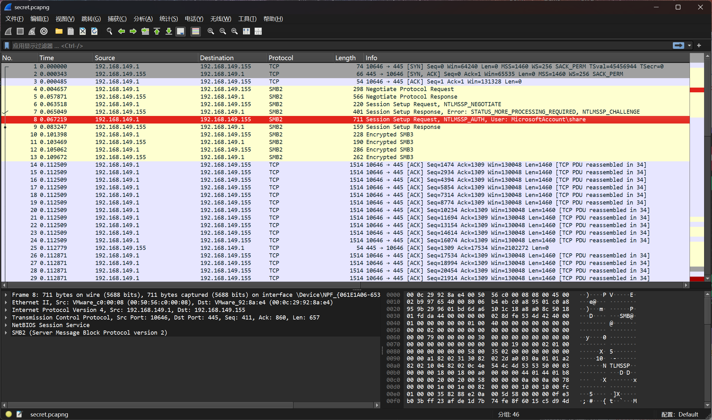
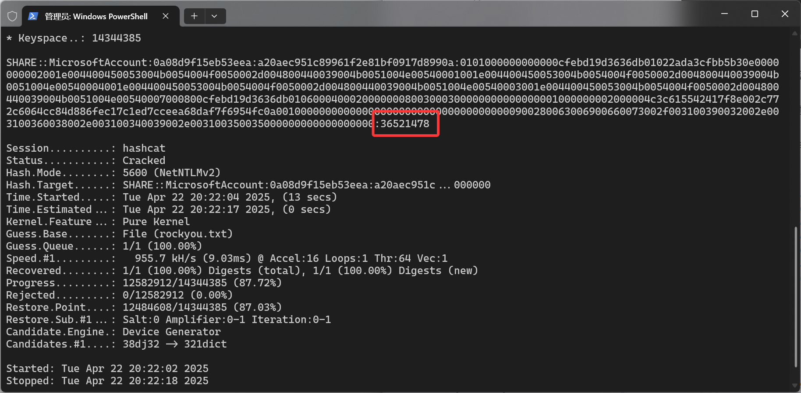
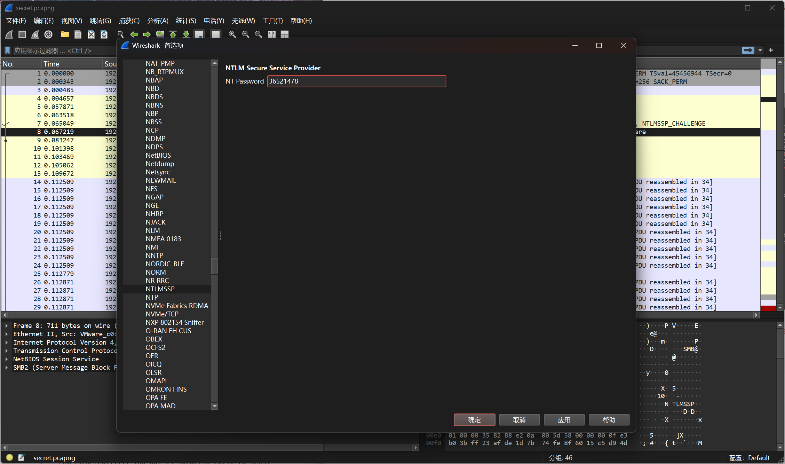
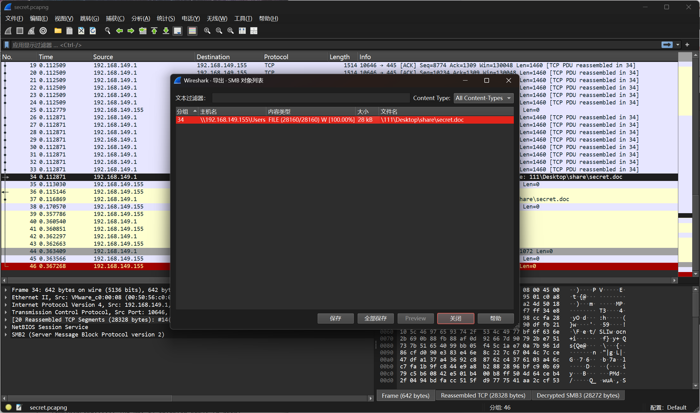
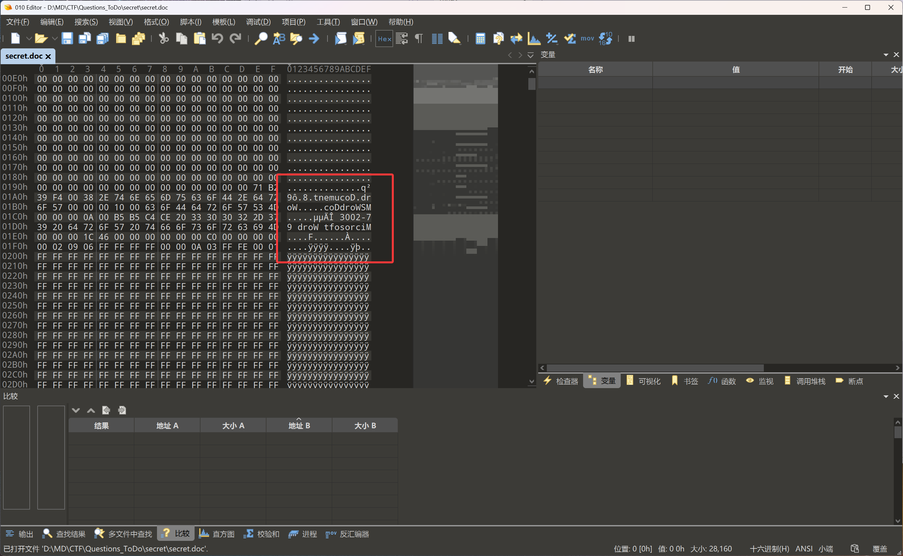
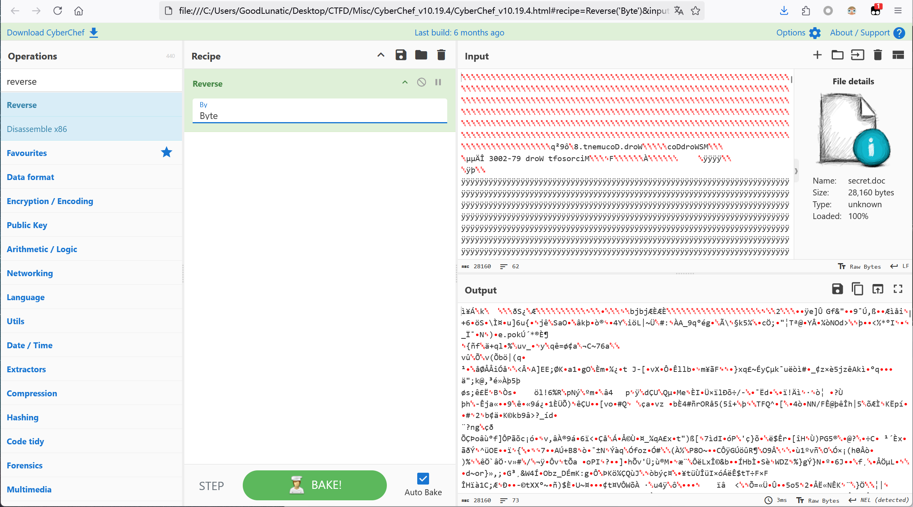
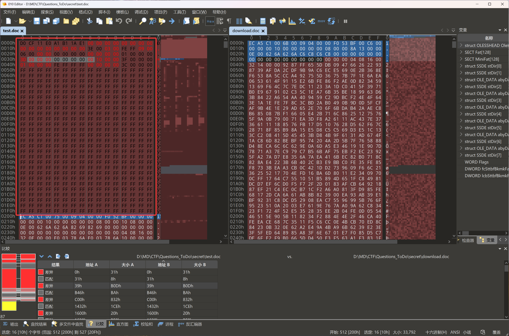
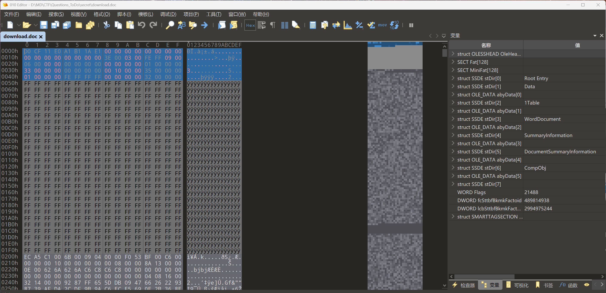
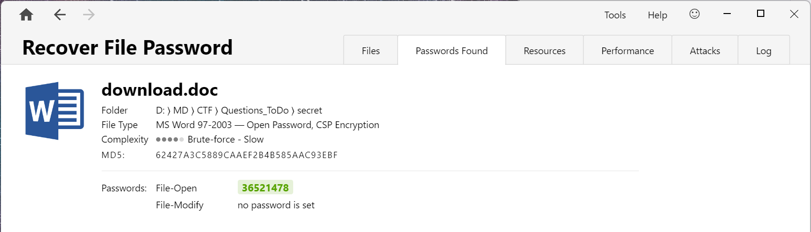
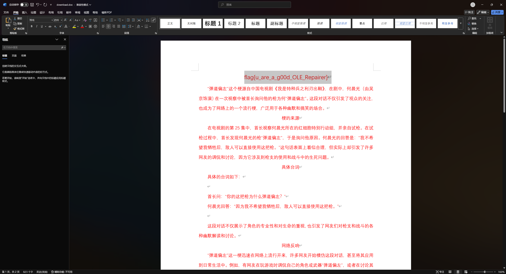

# DASCTF 2024最后一战 Misc Writeup

**有师傅来问这场比赛里的题，然后稍微看了一下，发现Misc题确实出的挺好，于是打算记录一下**
&lt;!--more--&gt;

| &lt;br&gt; |
| :---------------------------------------: |
|  题目附件：https://buuoj.cn/match/matches/213  |

## 题目名称 弹道偏下

解压附件压缩包，得到一个`secret.pcapng`



翻看流量，发现主要是加密的SMB2流量，用了`NTLM`身份验证机制

因此我们尝试手动把验证过程中的数据提取出来，然后用`hashcat`爆破

具体原理和提取步骤详见作者的这篇博客：[Misc-Network Traffic Analysis](https://goodlunatic.github.io/posts/5422d65/#ntlm%E6%B5%81%E9%87%8F%E5%88%86%E6%9E%90) 

```
share::MicrosoftAccount:0a08d9f15eb53eea:a20aec951c89961f2e81bf0917d8990a:0101000000000000cfebd19d3636db01022ada3cfbb5b30e0000000002001e004400450053004b0054004f0050002d004800440039004b0051004e00540001001e004400450053004b0054004f0050002d004800440039004b0051004e00540004001e004400450053004b0054004f0050002d004800440039004b0051004e00540003001e004400450053004b0054004f0050002d004800440039004b0051004e00540007000800cfebd19d3636db01060004000200000008003000300000000000000001000000002000004c3c615542417f8e002c772c6064cc84d886fec17c1ed7cceea68daf7f6954fc0a001000000000000000000000000000000000000900280063006900660073002f003100390032002e003100360038002e003100340039002e003100350035000000000000000000
```

```bash
.\hashcat.exe -m 5600 -a 0 hash.txt rockyou.txt --force
```



用`rockyou.txt`字典爆破也是一会就出了，得到密码：`36521478`

然后我们到`编辑-首选项-Protocols-NTLM SSP`里输入得到的密码，并点击应用即可解密流量



解密完后，我们即可在`文件-导出对象-SMB`中看到传输的文件，流量中传了一个`secret.doc`，我们尝试保存到本地



发现直接打开会报错，因此我们用010打开，发现文件数据好像被逆置了



因此我们可以直接用`CyberChef`把数据逆置回来，并保存到本地



数据逆置后打开，发现文件还是报错，因此我们新建一个`MS97-2003`的doc文件，用010来diff一下



发现是`oleHeader(0x200字节)`被删除了，因此我们接下来要尝试修复这个doc的`oleheader`

这一个考点以前确实没有遇到过，这里参考了[官方的wp](https://www.yuque.com/chuangfeimeiyigeren/eeii37/oxv3gaim7fr89ed2?sessionid=1564360602#djHsp)

&gt; 0-0x7是文件签名是固定的
&gt; 
&gt; 0x8-0x17文件的标识一般全零
&gt; 
&gt; 0x18-0x1B文件格式的修订号和版本号,可以认为是固定的常量
&gt; 
&gt; 0x1C-0x1D:字节序, 一般都用小端序0xFEFF
&gt; 
&gt; 0x1E-0x1F每个扇区的大小,一般来说就是9
&gt; 
&gt; 0x20-0x2Bshort-sector的大小,一般是6
&gt; 
&gt; 0x2C-0x2F表示FAT表中有几个DWORD是有效的
&gt; 
&gt; 0x30-0x33整个复合文档的根目录所在扇区的索引号,找root,entry,找是第几个扇区,注意算的时候需要把第一个扇区排除 0x6800/0x200-1=0x33
&gt; 
&gt; 0x34-0x3B固定值
&gt; 
&gt; 0x3C-0x3F短扇区分配表的扇区位置,一般紧接着root Entry,得看rootEntry占用多少扇区,这里是占用两个扇区,因此这里的值应该填0x35
&gt; 
&gt; 0x40-0x43 短扇区分配表占用的扇区数,可以看到就占一个扇区
&gt; 
&gt; 0x44-0x4B主扇区分配表的扩展部分的索引以及其大小,因为文件比较小没有用到扩展部分,第一个应该是-2即0xFEFFFFFF,大小为0
&gt; 
&gt; 0x4C-后面是主扇区分配表,因为文件不是很大,基本只有前面几个字节是有意义的,后面都是0xFF,取值和Root Entry的扇区号有关,一般就是root扇区倒着写,因为root为33,这里我们填一个0x32000000

最后修复完的`oleheader`如下所示：



尝试用word打开修复后的doc，发现需要密码，因此直接尝试用`PasswareKit`爆破



打开并输入爆破得到的密码，把白色的文字标红后即可得到最后的flag：`flag{u_are_a_g00d_OLE_Repairer}`



## 题目名称 1z_F0r3ns1cs_1

## 题目名称 手把天尊

---

> Author: [Lunatic](https://goodlunatic.github.io)  
> URL: https://goodlunatic.github.io/posts/32c3b27/  

