# DASCTF 2024最后一战 Misc Writeup

**有师傅来问这场比赛里的题，然后稍微看了一下，发现Misc题确实出的挺好，于是打算记录一下**
<!--more-->

| <br> |
| :---------------------------------------: |
|  题目附件：https://buuoj.cn/match/matches/213  |

## 题目名称 弹道偏下

解压附件压缩包，得到一个`secret.pcapng`


翻看流量，发现主要是加密的SMB2流量，用了`NTLM`身份验证机制

因此我们尝试手动把验证过程中的数据提取出来，然后用`hashcat`爆破

具体原理和提取步骤详见作者的这篇博客：[Misc-Network Traffic Analysis](https://goodlunatic.github.io/posts/5422d65/#ntlm%E6%B5%81%E9%87%8F%E5%88%86%E6%9E%90) 

```
share::MicrosoftAccount:0a08d9f15eb53eea:a20aec951c89961f2e81bf0917d8990a:0101000000000000cfebd19d3636db01022ada3cfbb5b30e0000000002001e004400450053004b0054004f0050002d004800440039004b0051004e00540001001e004400450053004b0054004f0050002d004800440039004b0051004e00540004001e004400450053004b0054004f0050002d004800440039004b0051004e00540003001e004400450053004b0054004f0050002d004800440039004b0051004e00540007000800cfebd19d3636db01060004000200000008003000300000000000000001000000002000004c3c615542417f8e002c772c6064cc84d886fec17c1ed7cceea68daf7f6954fc0a001000000000000000000000000000000000000900280063006900660073002f003100390032002e003100360038002e003100340039002e003100350035000000000000000000
```

```bash
.\hashcat.exe -m 5600 -a 0 hash.txt rockyou.txt --force
```


用`rockyou.txt`字典爆破也是一会就出了，得到密码：`36521478`

然后我们到`编辑-首选项-Protocols-NTLM SSP`里输入得到的密码，并点击应用即可解密流量


解密完后，我们即可在`文件-导出对象-SMB`中看到传输的文件，流量中传了一个`secret.doc`，我们尝试保存到本地


发现直接打开会报错，因此我们用010打开，发现文件数据好像被逆置了


因此我们可以直接用`CyberChef`把数据逆置回来，并保存到本地


数据逆置后打开，发现文件还是报错，因此我们新建一个`MS97-2003`的doc文件，用010来diff一下


发现是`oleHeader(0x200字节)`被删除了，因此我们接下来要尝试修复这个doc的`oleheader`

这一个考点以前确实没有遇到过，这里参考了[官方的wp](https://www.yuque.com/chuangfeimeiyigeren/eeii37/oxv3gaim7fr89ed2?sessionid=1564360602#djHsp)

> 0-0x7是文件签名是固定的
> 
> 0x8-0x17文件的标识一般全零
> 
> 0x18-0x1B文件格式的修订号和版本号,可以认为是固定的常量
> 
> 0x1C-0x1D:字节序, 一般都用小端序0xFEFF
> 
> 0x1E-0x1F每个扇区的大小,一般来说就是9
> 
> 0x20-0x2Bshort-sector的大小,一般是6
> 
> 0x2C-0x2F表示FAT表中有几个DWORD是有效的
> 
> 0x30-0x33整个复合文档的根目录所在扇区的索引号,找root,entry,找是第几个扇区,注意算的时候需要把第一个扇区排除 0x6800/0x200-1=0x33
> 
> 0x34-0x3B固定值
> 
> 0x3C-0x3F短扇区分配表的扇区位置,一般紧接着root Entry,得看rootEntry占用多少扇区,这里是占用两个扇区,因此这里的值应该填0x35
> 
> 0x40-0x43 短扇区分配表占用的扇区数,可以看到就占一个扇区
> 
> 0x44-0x4B主扇区分配表的扩展部分的索引以及其大小,因为文件比较小没有用到扩展部分,第一个应该是-2即0xFEFFFFFF,大小为0
> 
> 0x4C-后面是主扇区分配表,因为文件不是很大,基本只有前面几个字节是有意义的,后面都是0xFF,取值和Root Entry的扇区号有关,一般就是root扇区倒着写,因为root为33,这里我们填一个0x32000000

最后修复完的`oleheader`如下所示：


尝试用word打开修复后的doc，发现需要密码，因此直接尝试用`PasswareKit`爆破


打开并输入爆破得到的密码，把白色的文字标红后即可得到最后的flag：`flag{u_are_a_g00d_OLE_Repairer}`


## 题目名称 1z_F0r3ns1cs_1

题目附件给了一个`1z.vmdk`虚拟磁盘文件，因此我们直接用`DiskGenius`打开并恢复被删除的文件

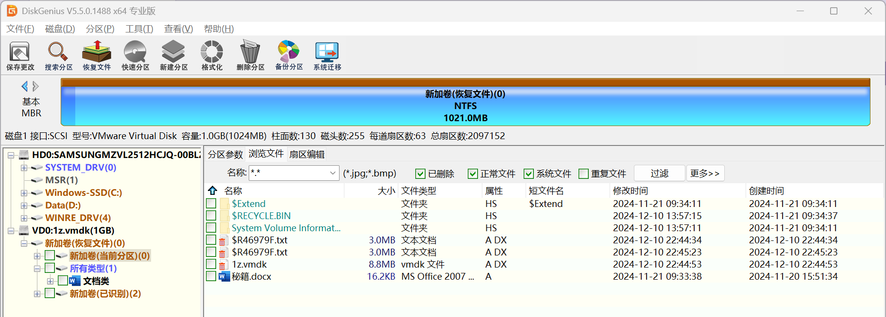

可以得到一个`秘籍.docx`还有一个txt文件

改docx文件后缀为zip并解压，可以在`/word/theme`中得到一个bat文件


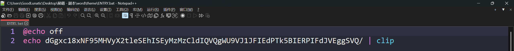

打开后可以得到一串base64编码，解码后可以得到如下内容：

> th1s_14_y0ur_key!!!!2333
> 
> WHAT YOU'RE GONNA DO WITH IT?

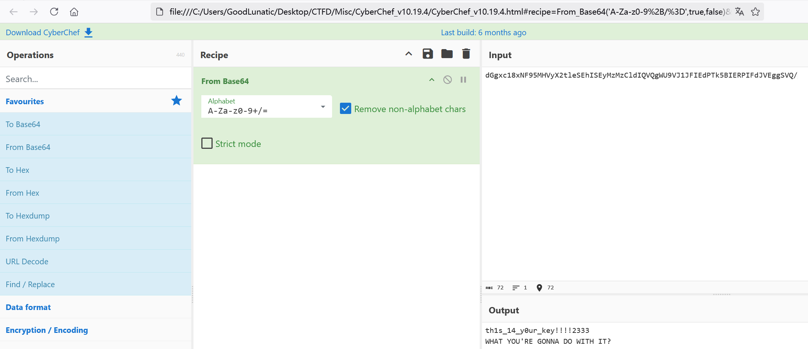

提示了我们一个密钥，然后我们回头去看另一个txt文件，发现文件大小正好是3MB

因此猜测可能是VC加密容器，上面的密钥就是VC的加密密钥

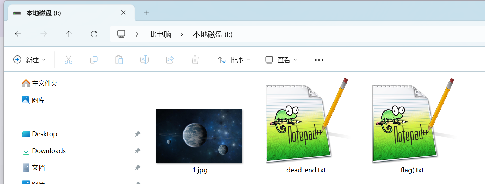

使用VC挂载后可以得到两个txt文件，还有一张jpg图片

`flag(.txt`文件中没有什么关键的信息，因此我们把目光集中到另一个txt上

这里可能需要亿点点脑洞，当我们把`dead_end.txt`作为密钥文件去挂载之前的那个txt的时候

可以得到一个隐藏卷

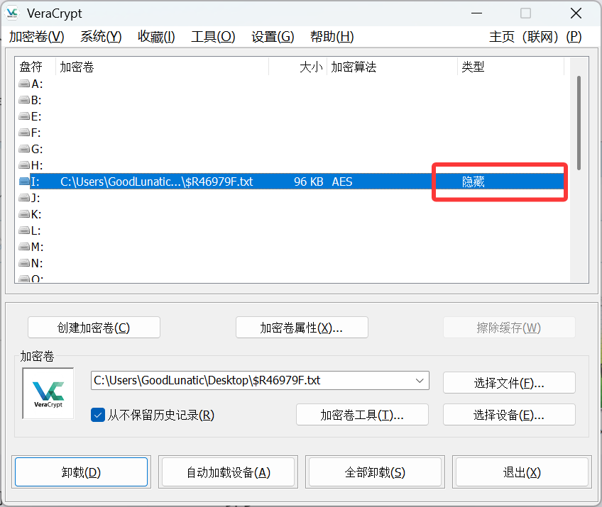

打开后可以得到一个`t0p_s1cr3t.txt`，内容如下：

> YOU ARE AWESOME!!!!BUT NOT ENOUGH,Here is flag1:
> 
> DASCTF{N0w_u_knOw_H1dden_v0lum3_
> 
> AND HERE IS A LITTLE REMINDER,THE MASK IS:
> 
> U????Klsq
> 
> ONLY LOWERCASE AT 1 AND NUMBERS AT 2,3,4

得到了第一段的flag以及一个掩码，联想到之前得到的那张jpg

猜测需要我们通过掩码生成字典，然后去解密`steghide`

因此我们写个脚本按照掩码的格式生成一下字典

```python
from string import digits, ascii_lowercase

mask = "U?u?d?d?dKlsq"
for a in ascii_lowercase:
    for b in digits:
        for c in digits:
            for d in digits:
                passwd = f"U{a}{b}{c}{d}Klsq"
                print(passwd)
```

然后直接用`stegseek`爆破即可得到第二段flag：`Of_v3r@cr1pt&90_0nnnnnnnnnnn!!!a>?#P2}`

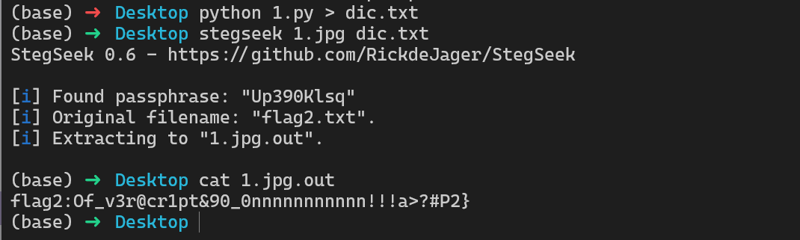

把两段flag合起来即可得到最后的flag：`DASCTF{N0w_u_knOw_H1dden_v0lum3_Of_v3r@cr1pt&90_0nnnnnnnnnnn!!!a>?#P2}`

## 题目名称 手把天尊

> 不说别的了，这样吧你先按住RT+B使出看破斩，随后RT+A特殊纳刀，然后轻触RT使用聚合拔刀气刃斩，最后RT+Y打出气刃突刺，派生气刃兜割。别忘了把flag小写包上DASCTF。

附件给了一个流量包文件，打开发现主要是USB流量

因此首先拿`CTF-NetA`梭一把，发现一共有七个IP

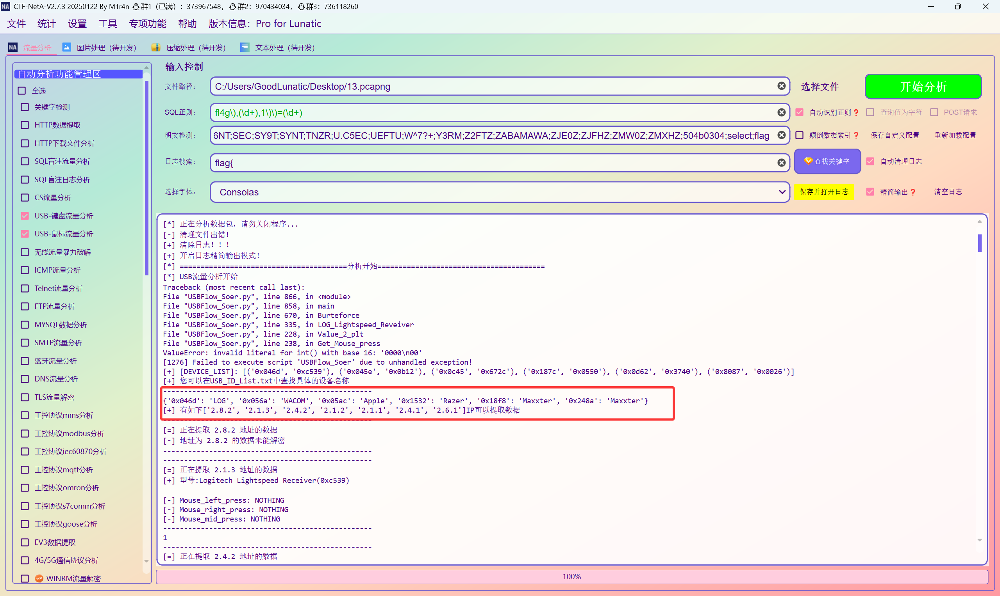

发现解出来的信息里没有什么关键的内容，画出来的鼠标轨迹图也是

然后我们结合题面信息，猜测题面考察的是游戏手柄的流量

然后看CTF-NetA输出的结果，猜测主要是在2.8.2或2.4.2这两个IP传的数据中

然后Wireshark打开，发现2.4.2传的数据不多

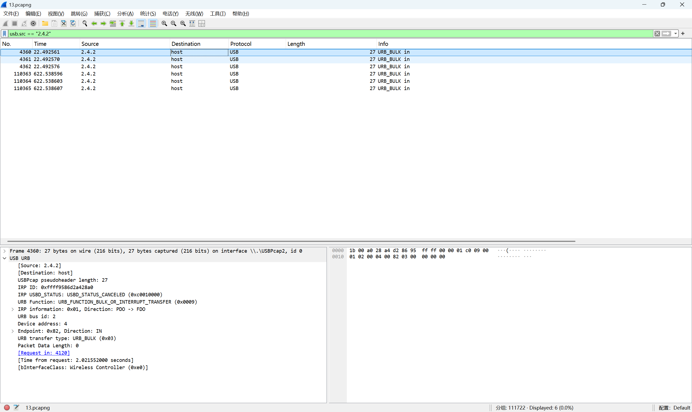

然后查看2.8.2时，发现传输的数据包较多，传输的大部分数据长度都为75

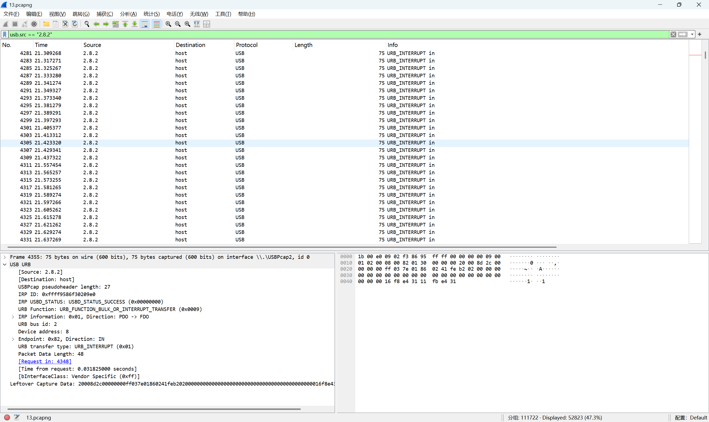

结合题目描述，猜测是XBOX游戏手柄的流量，和平常分析USB流量一样，先用tshark导出传输的数据

```bash
tshark -r 13.pcapng -Y '(usb.src == "2.8.2") && (frame.len == 75)' -T fields -e usb.capdata > data.txt
```

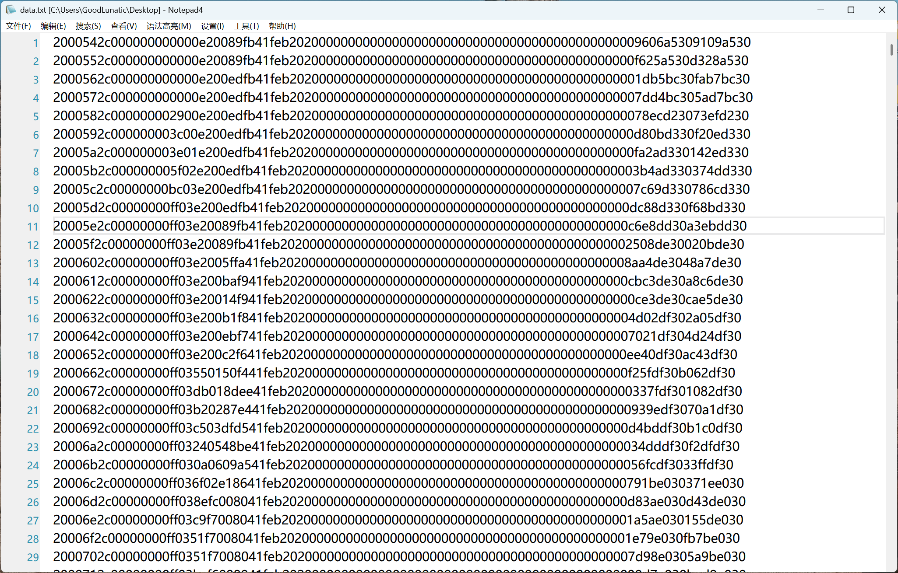

然后我们尝试根据数据的特征，去分析其中的规律，具体可以参考 [赛后官方WP](https://www.yuque.com/chuangfeimeiyigeren/eeii37/oxv3gaim7fr89ed2?sessionid=-1256592792)

参考链接：https://blog.csdn.net/weixin_51914644/article/details/136098281

> 13.txt中的流量分成两种，一种是长的48字节的手柄数据， 一种是小于20字节的其他usb数据，需要先将流量处理一下，针对手柄数据分析。python处理的时候，将字符串格式解析成字节流格式，注意字节流的一个字节，对应字符串四个字节的内容（unicode编码）
> 
> 手柄流量可以参考以下Xbox控制器USB实现与数据格式_stm32 xinput-CSDN博客虽然不是完全相同,但是基本差不多, 特别是trigger和操纵杆的部分基本一致,可以直接判断以后提取出来,基于这些这题就可以解出来了
> 
> 手柄流量的重点基本就是两个trigger,和两个摇杆. trigger分左右，每一个各占一个字节，最大0xff，在分析流量的时候，按照时间维度分析，找变化的部分,看变化规律, 可以看出第九个字节,是间歇性的递增随后递减,最大0xff, 比较符合trigger的按键规律


> 11-14字节一直在变化,判断可能是坐标, 此外一直无规律变化的还有40-41字节和44-45字节, 其他的字节要么不变,要么就是每个包加一,很容易判断和用户的关联性不大.


> 根据上面那篇博客,操纵杆的流量也分左右,各占四个字节,分别是两个字节x轴,两个字节y轴,占4个字节的随机变化的流量也就只有11-14那一部分, 就可以推断出字节9是左扳机流量,字节11-14是左摇杆流量,也可以猜出字节10是右扳机流量,字节15-18是右摇杆流量.
> 
> 根据流量画图即可,注意摇杆流量是摇杆对于中心的偏移,是一个有符号整数,根据这个偏移算坐标然后绘制就行
> 
> 最后画出来的图建议还是根据trigger按住的次数一次一次绘制单个字母

这里贴一份官方的脚本

```python
import os.path
import string
import struct
import math
from matplotlib import pyplot as plt


# 解析手柄数据包
def parse_gamepad_data(data):
    # 获取左右扳机状态（字节4和字节5）
    left_trigger = data[8]
    right_trigger = data[9]

    # 解析左操纵杆位置（字节6到字节9）
    # 左操纵杆 X轴 (字节6, 7) 和 Y轴 (字节8, 9)
    left_stick_x = struct.unpack('<h', bytes(data[10:12]))[0]  # 小端模式
    left_stick_y = struct.unpack('<h', bytes(data[12:14]))[0]  # 小端模式
    print(left_stick_x, left_stick_y)
    # 解析右操纵杆位置（字节10到字节13）
    # 右操纵杆 X轴 (字节10, 11) 和 Y轴 (字节12, 13)
    right_stick_x = struct.unpack('<h', bytes(data[14:16]))[0]  # 小端模式
    right_stick_y = struct.unpack('<h', bytes(data[16:18]))[0]  # 小端模式
    return left_trigger, left_stick_x, left_stick_y, right_stick_x, right_stick_y


def extract_visible_chars(byte_data):
    # 获取所有可打印字符
    printable_chars = string.printable.encode()  # 获取可打印字符的字节形式
    # 从字节数据中筛选出可打印字符
    visible_chars = bytes([byte for byte in byte_data if byte in printable_chars])
    return visible_chars


# 初始化鼠标坐标
mouse_x, mouse_y = 0, 0

# 用于记录鼠标轨迹的坐标
trajectory_x = [mouse_x]
trajectory_y = [mouse_y]
n = 0
s = 0
current_direction = None  # 当前方向
direction_factor = 0  # 当前方向的系数

if not os.path.exists("./1"):
    os.makedirs("./1")

with open("13.txt", 'rb') as txt:
    lines = txt.read().splitlines()
    for line in lines:
        print(len(line))
        if len(line) < 100:
            continue
        line = extract_visible_chars(line)
        line_bytes = bytes.fromhex(str(line)[2:-1])  # 先解码为字符串，再从十六进制转换为字节
        s += 1
        # 解析数据
        left_trigger, left_stick_x, left_stick_y, right_stick_x, right_stick_y = parse_gamepad_data(line_bytes)

        # 更新鼠标坐标
        mouse_x += left_stick_x
        mouse_y +=  left_stick_y

        # 记录当前位置
        if left_trigger >250:
            trajectory_x.append(mouse_x)
            trajectory_y.append(mouse_y)
        elif left_trigger == 0:
            s = 0
            if len(trajectory_x) > 0:
                plt.figure(figsize=(10, 8))
                plt.plot(trajectory_x, trajectory_y, marker='o', color='b', markersize=3)
                plt.title("Mouse Movement Trajectory from Gamepad Right Stick with Nonlinear Mapping")
                plt.xlabel("X Position")
                plt.ylabel("Y Position")
                plt.grid(True)
                plt.axis('equal')
                # plt.show()
                plt.savefig(f"./1/{n}.png")
                plt.close()
                n += 1
            trajectory_x = []
            trajectory_y = []
```

以下是 `@DemonStarAlgol` 师傅提供的脚本

```python
import matplotlib.pyplot as plt
from itertools import groupby
import os, struct, numpy

cmd = 'tshark -r 13.pcapng -Y "usb.src == 2.8.2 and usb.dst == host and frame.len == 75" -T fields -e usb.capdata'
data = os.popen(cmd).readlines()

draw, x, y = [False], [0], [0]
for line in data:
    rt = int.from_bytes(bytes.fromhex(line[16:20]), 'little')
    draw.append(rt > 100)
    rsx, rsy = struct.unpack('<hh', bytes.fromhex(line[20:28]))
    x.append(x[-1] + rsx)
    y.append(y[-1] + rsy)

fig, axes = plt.subplots(3, 7, figsize=(21, 9))
axes = axes.flatten()

segment_idx = 0
for is_true, group in groupby(zip(draw, x, y), key=lambda g: g[0]):
    if is_true:
        points = list(group)
        xs, ys = zip(*[(p[1], p[2]) for p in points])

        min_x, max_x = min(xs), max(xs)
        min_y, max_y = min(ys), max(ys)

        xs_norm = [(x - min_x) / (max_x - min_x) for x in xs]
        ys_norm = [(y - min_y) / (max_y - min_y) for y in ys]

        ax = axes[segment_idx]
        ax.scatter(xs_norm, ys_norm, s=1, alpha=0.7)
        ax.grid(True, alpha=0.3)

        segment_idx += 1
        if segment_idx >= 21:
            break

plt.show()
```

运行以上脚本画出轨迹图后即可得到最后的flag：`DASCTF{you_are_shouba_master}`

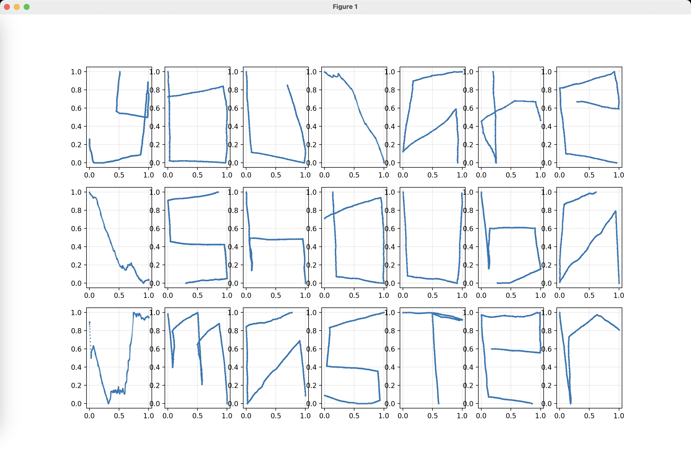

---

> 作者: [Lunatic](https://goodlunatic.github.io)  
> URL: https://goodlunatic.github.io/posts/32c3b27/  

