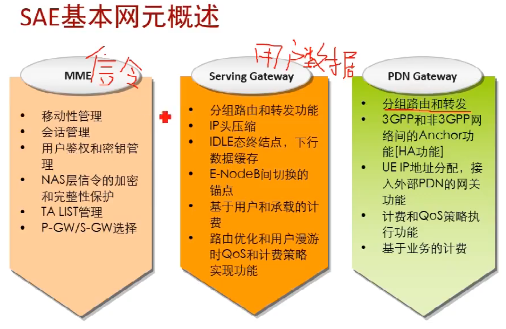
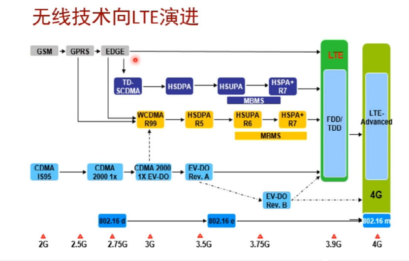

# 4G5G网络安全相关内容的研究

**4G5G网络安全相关内容的研究**
<!--more-->

## 基础概念

| 概念名称  | 描述                                                                                                                                                                                                               |
| ----- | ---------------------------------------------------------------------------------------------------------------------------------------------------------------------------------------------------------------- |
| 信令风暴  | 信令风暴（Signaling Storm）通常指的是在通信网络中，由于大量的控制信令（如呼叫建立、注册、认证等）快速且重复地传递，导致网络负载过重，系统资源耗尽，从而影响正常通信的情况。信令风暴最常见于电信网络中，尤其是在移动通信、VoIP（Voice over IP）系统、以及IMS（IP Multimedia Subsystem）等系统中。                                    |
| SIB   | SIB（System Information Block，系统信息块是移动通信网络中用于传输网络系统配置信息的一种数据结构，主要用于传递一些与网络状态和参数有关的重要信息。SIB通常用于LTE（Long Term Evolution）和5G NR（New Radio）等现代通信网络中。它的作用是帮助终端设备（如手机、物联网设备等）获取网络的基本配置信息，从而能够顺利连接网络并进行通信。               |
| TAC   | TAC（Tracking Area Code）：标识网络中的一个跟踪区域，用来管理和标识用户的位置信息。网络中由多个TAC组成，每个TAC代表一个物理区域，通常是多个基站的覆盖范围。                                                                                                                      |
| TAU   | TAU（Tracking Area Update）：是指UE在移动过程中向网络更新其当前位置的一种过程。当UE移动到新的跟踪区域时，网络会触发TAU过程，以便更新UE的位置和所在的TAC。TAU过程主要用于定位和切换等目的，在一定时间内，UE会周期性地进行TAU过程。                                                                           |
| UE    | UE（User Equipment）：指的是用户的终端设备，如智能手机、物联网设备等，它们与基站进行通信。                                                                                                                                                            |
| IMSI  | IMSI（International Mobile Subscriber Identity）是国际移动用户身份码，用于唯一标识一个移动设备的订阅者（即用户）。它是全球每个移动用户的唯一标识符，通常由移动运营商分配给用户，并保存在SIM卡（Subscriber Identity Module）中。前三位是移动国家代码，再来是移动网络代码（00-中国移动，01-中国联通），最后是移动用户识别码（长度一般为9-10位） |
| IMEI  | IMEI（International Mobile Equipment Identity）是国际移动设备身份码，用于唯一标识一部移动设备。每部手机、平板电脑、物联网设备等无线通信设备都会有一个唯一的IMEI号码，用来区别不同的设备。前八位是设备类型分配代码TAC（前6位是厂商，后2位是设备型号），接着的6位表示设备的唯一序列号，最后1位是校验位，357123047913247                    |
| PDCCH | PDCCH是物理下行控制信道，用于传输下行链路控制信息。这些控制信息是网络发给用户设备（UE）的，用于调度、资源分配、信道状态信息反馈等。                                                                                                                                            |
| PDSCH | PDSCH是物理下行共享信道，用于传输实际的用户数据、控制信息、系统信息等。这些数据可能是来自网络层的应用数据，也可以是一些重要的系统信息。                                                                                                                                           |
|       |                                                                                                                                                                                                                  |






## Ubuntu20.04配置UHD并连接B210

> 参考连接：
> 
> https://kb.ettus.com/Building_and_Installing_the_USRP_Open-Source_Toolchain_(UHD_and_GNU_Radio)_on_Linux

先根据参考链接中的步骤安装好相关依赖

```
sudo apt-get -y install autoconf automake build-essential ccache cmake cpufrequtils doxygen ethtool fort77 g++ gir1.2-gtk-3.0 git gobject-introspection gpsd gpsd-clients inetutils-tools libasound2-dev libboost-all-dev libcomedi-dev libcppunit-dev libfftw3-bin libfftw3-dev libfftw3-doc libfontconfig1-dev libgmp-dev libgps-dev libgsl-dev liblog4cpp5-dev libncurses5 libncurses5-dev libpulse-dev libqt5opengl5-dev libqwt-qt5-dev libsdl1.2-dev libtool libudev-dev libusb-1.0-0 libusb-1.0-0-dev libusb-dev libxi-dev libxrender-dev libzmq3-dev libzmq5 ncurses-bin python3-cheetah python3-click python3-click-plugins python3-click-threading python3-dev python3-docutils python3-gi python3-gi-cairo python3-gps python3-lxml python3-mako python3-numpy python3-numpy-dbg python3-opengl python3-pyqt5 python3-requests python3-scipy python3-setuptools python3-six python3-sphinx python3-yaml python3-zmq python3-ruamel.yaml swig wget
```

然后从源码编译并安装UHD

```bash
git clone https://github.com/EttusResearch/uhd.git
cd uhd/host
mkdir build
cd build
cmake ..
make
sudo make install
sudo ldconfig
```

> Tips：如果发现uhd4.7.0.0无法识别USRP设备，可以把uhd的版本降低为uhd4.6.0.0

编译并安全好后需要把以下环境变量的内容添加到`.zshrc`文件中

```bash
export LD_LIBRARY_PATH=/usr/local/lib
```

UHD安装完成后我们还需要执行下面这个命令去下载`UHD FPGA Images`(可能需要科学上网)

```bash
sudo uhd_images_downloader
```

下载完成后我们需要把以下环境变量的内容添加到`.zshrc`文件中

```bash
export UHD_IMAGES_DIR="/usr/local/share/uhd/images"
```

上述工作完成后，我们将B210用USB连上电脑，然后执行以下命令

```bash
sudo uhd_usrp_probe
sudo uhd_find_devices
```

若输出类似于以下的内容，则说明环境配置成功，B210已经成功连接

```bash
(base) [11ms][~]$ sudo uhd_usrp_probe
[INFO] [UHD] linux; GNU C++ version 9.4.0; Boost_107100; UHD_4.6.0.0-0-unknown
[INFO] [B200] Detected Device: B210
[INFO] [B200] Operating over USB 3.
[INFO] [B200] Initialize CODEC control...
[INFO] [B200] Initialize Radio control...
[INFO] [B200] Performing register loopback test... 
[INFO] [B200] Register loopback test passed
[INFO] [B200] Performing register loopback test... 
[INFO] [B200] Register loopback test passed
[INFO] [B200] Setting master clock rate selection to 'automatic'.
[INFO] [B200] Asking for clock rate 16.000000 MHz... 
[INFO] [B200] Actually got clock rate 16.000000 MHz.
  _____________________________________________________
 /
|       Device: B-Series Device
|     _____________________________________________________
|    /
|   |       Mboard: B210
|   |   serial: 34414E4
|   |   name: MyB210
|   |   product: 2
|   |   revision: 4
|   |   FW Version: 8.0
|   |   FPGA Version: 16.0
|   |   
|   |   Time sources:  none, internal, external, gpsdo
|   |   Clock sources: internal, external, gpsdo
|   |   Sensors: ref_locked
|   |     _____________________________________________________
|   |    /
|   |   |       RX DSP: 0
|   |   |   
|   |   |   Freq range: -8.000 to 8.000 MHz
|   |     _____________________________________________________
|   |    /
|   |   |       RX DSP: 1
|   |   |   
|   |   |   Freq range: -8.000 to 8.000 MHz
|   |     _____________________________________________________
|   |    /
|   |   |       RX Dboard: A
|   |   |     _____________________________________________________
|   |   |    /
|   |   |   |       RX Frontend: A
|   |   |   |   Name: FE-RX2
|   |   |   |   Antennas: TX/RX, RX2
|   |   |   |   Sensors: temp, rssi, lo_locked
|   |   |   |   Freq range: 50.000 to 6000.000 MHz
|   |   |   |   Gain range PGA: 0.0 to 76.0 step 1.0 dB
|   |   |   |   Bandwidth range: 200000.0 to 56000000.0 step 0.0 Hz
|   |   |   |   Connection Type: IQ
|   |   |   |   Uses LO offset: No
|   |   |     _____________________________________________________
|   |   |    /
|   |   |   |       RX Frontend: B
|   |   |   |   Name: FE-RX1
|   |   |   |   Antennas: TX/RX, RX2
|   |   |   |   Sensors: temp, rssi, lo_locked
|   |   |   |   Freq range: 50.000 to 6000.000 MHz
|   |   |   |   Gain range PGA: 0.0 to 76.0 step 1.0 dB
|   |   |   |   Bandwidth range: 200000.0 to 56000000.0 step 0.0 Hz
|   |   |   |   Connection Type: IQ
|   |   |   |   Uses LO offset: No
|   |   |     _____________________________________________________
|   |   |    /
|   |   |   |       RX Codec: A
|   |   |   |   Name: B210 RX dual ADC
|   |   |   |   Gain Elements: None
|   |     _____________________________________________________
|   |    /
|   |   |       TX DSP: 0
|   |   |   
|   |   |   Freq range: -8.000 to 8.000 MHz
|   |     _____________________________________________________
|   |    /
|   |   |       TX DSP: 1
|   |   |   
|   |   |   Freq range: -8.000 to 8.000 MHz
|   |     _____________________________________________________
|   |    /
|   |   |       TX Dboard: A
|   |   |     _____________________________________________________
|   |   |    /
|   |   |   |       TX Frontend: A
|   |   |   |   Name: FE-TX2
|   |   |   |   Antennas: TX/RX
|   |   |   |   Sensors: temp, lo_locked
|   |   |   |   Freq range: 50.000 to 6000.000 MHz
|   |   |   |   Gain range PGA: 0.0 to 89.8 step 0.2 dB
|   |   |   |   Bandwidth range: 200000.0 to 56000000.0 step 0.0 Hz
|   |   |   |   Connection Type: IQ
|   |   |   |   Uses LO offset: No
|   |   |     _____________________________________________________
|   |   |    /
|   |   |   |       TX Frontend: B
|   |   |   |   Name: FE-TX1
|   |   |   |   Antennas: TX/RX
|   |   |   |   Sensors: temp, lo_locked
|   |   |   |   Freq range: 50.000 to 6000.000 MHz
|   |   |   |   Gain range PGA: 0.0 to 89.8 step 0.2 dB
|   |   |   |   Bandwidth range: 200000.0 to 56000000.0 step 0.0 Hz
|   |   |   |   Connection Type: IQ
|   |   |   |   Uses LO offset: No
|   |   |     _____________________________________________________
|   |   |    /
|   |   |   |       TX Codec: A
|   |   |   |   Name: B210 TX dual DAC
|   |   |   |   Gain Elements: None

(base) [4.490s][~]$ sudo uhd_find_devices
[INFO] [UHD] linux; GNU C++ version 9.4.0; Boost_107100; UHD_4.6.0.0-0-unknown
--------------------------------------------------
-- UHD Device 0
--------------------------------------------------
Device Address:
    serial: 34414E4
    name: MyB210
    product: B210
    type: b200
```

## 利用open5gs和srsRAN_Project进行MIB注入

> 参考连接：
> 
> https://github.com/open5gs/open5gs
> 
> https://github.com/srsran/srsRAN_Project
> 
> https://open5gs.org/open5gs/docs/guide/02-building-open5gs-from-sources/
> 
> https://docs.srsran.com/projects/project
> 


首先跟着参考文档中的步骤安装`open5gs`(模拟核心网)

```bash
sudo apt install gnupg

curl -fsSL https://pgp.mongodb.com/server-6.0.asc | sudo gpg -o /usr/share/keyrings/mongodb-server-6.0.gpg --dearmor

echo "deb [ arch=amd64,arm64 ] https://repo.mongodb.org/apt/ubuntu focal/mongodb-org/6.0 multiverse" | sudo tee /etc/apt/sources.list.d/mongodb-org-6.0.list

sudo apt install -y mongodb-org
sudo systemctl start mongod
sudo systemctl enable mongod

sudo ip tuntap add name ogstun mode tun
sudo ip addr add 10.45.0.1/16 dev ogstun
sudo ip addr add 2001:db8:cafe::1/48 dev ogstun
sudo ip link set ogstun up
# 上面四条命令执行完后可能需要重启才会启用

sudo apt install -y python3-pip python3-setuptools python3-wheel ninja-build build-essential flex bison git cmake libsctp-dev libgnutls28-dev libgcrypt-dev libssl-dev libidn11-dev libmongoc-dev libbson-dev libyaml-dev libnghttp2-dev libmicrohttpd-dev libcurl4-gnutls-dev libnghttp2-dev libtins-dev libtalloc-dev meson

git clone https://github.com/open5gs/open5gs.git
cd open5gs
meson build --prefix=`pwd`/install
ninja -C build
cd build
ninja install
```

然后再安装`srsRAN_Project`(模拟基站)

这里编译源码需要`GCC11`以上的版本，然而Ubuntu默认是`GCC9`

因此需要我们手动安装一下

```bash
sudo add-apt-repository ppa:ubuntu-toolchain-r/test
sudo apt-get update
sudo apt remove gcc-9 g++-9
sudo apt autoremove
sudo apt-get install gcc-11 g++-11
sudo ln -s /usr/bin/gcc-11 /usr/bin/gcc
sudo ln -s /usr/bin/g++-11 /usr/bin/g++
```

安装好`GCC11`后就可以继续`srsRAN`项目的编译安装了

```bash
sudo apt-get install cmake make gcc g++ pkg-config libfftw3-dev libmbedtls-dev libsctp-dev libyaml-cpp-dev libgtest-dev
git clone https://github.com/srsran/srsRAN_Project.git
cd srsRAN_Project
mkdir build
cd build
# cmake这里需要带上后面的参数要不然会报错
cmake ../ -DENABLE_EXPORT=ON -DENABLE_ZEROMQ=ON -DAUTO_DETECT_ISA=OFF
make -j $(nproc)
```

上面两个项目都安装好后我们就可以开始模拟了

首先是启动核心网

```bash
cd build
sudo ./tests/app/5gc -c ./configs/sample.yaml
```

然后连上`B210`启动基站模拟，631和736代表的是模拟基站的编号，和所在的小区有关
```bash
cd build
sudo ./apps/gnb/gnb -c ../configs/gnb_pci_631.yml
sudo ./apps/gnb/gnb -c ../configs/gnb_pci_736.yml
```

然后我们可以另起一个终端，把模拟的数据保存下来

```bash
uhd_rx_cfile --freq 3408960000 -r 23040000 --gain 80 -N 10000000 ./340896_632.fc32
uhd_rx_cfile --freq 3509760000 -r 23040000 --gain 80 -N 10000000 ./350976_737.fc32
```

保存的数据可以使用开源工具[inspectrum](https://github.com/miek/inspectrum) 查看

具体安装步骤如下：

```bash
sudo apt-get install qt5-default libfftw3-dev cmake pkg-config libliquid-dev
git clone https://github.com/miek/inspectrum.git
cd inspectrum
mkdir build
cd build
cmake ..
make -j4
sudo make install
```

用`inspectrum`打开之前保存的数据，即可看到实验效果


---

> 作者: [Lunatic](https://goodlunatic.github.io)  
> URL: https://goodlunatic.github.io/posts/342f304/  

