# 2025 强网拟态防御国际精英挑战赛线下总决赛 Misc Writeup

**跟天枢Dubhe一起打了一下，感觉拟态决赛的Misc题还挺有意思的**
<!--more-->

|                     |
| :------------------------------------------------------: |
| 题目附件：本文中涉及的具体题目附件可以进我的[知识星球](https://t.zsxq.com/an6p6)获取 |
## 题目名称 泄漏的时间与电码

> 题目描述：
> 
> 你苦苦寻觅的东西或许就藏在他最显眼的地方
> 
> hint1：ModR/M

附件给了如下几个文件

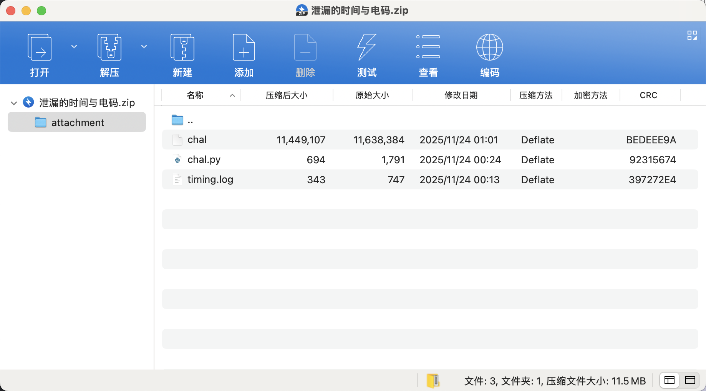

chal 是一个 elf 可执行文件

chal.py 中的内容如下：

```python
import time
import random
import sys

class SecureTypewriter:
    def __init__(self):
        self.lfsr = 0x92 
        self.time_unit = 0.005  
        self.jitter = 0.001
        self.base_overhead = 10
        self.branch_penalty = 30 
    def step_lfsr(self):
        bit = ((self.lfsr >> 0) ^ (self.lfsr >> 2) ^ (self.lfsr >> 3) ^ (self.lfsr >> 4)) & 1
        self.lfsr = (self.lfsr >> 1) | (bit << 7)
        return self.lfsr

    def scramble(self, val):
        return ((val * 0x1F) + 0x55) & 0xFF

    def process_char(self, char):
        c = ord(char)
        
        k = self.step_lfsr()
        
        val = c ^ k
        
        base_ops = self.scramble(val)
        
        current_ops = self.base_overhead + base_ops
        
        if base_ops % 2 != 0:
            current_ops += self.branch_penalty
            
        real_duration = current_ops * self.time_unit
        
        noise = random.uniform(-self.jitter, self.jitter)
        total_time = max(0, real_duration + noise)
        
        return total_time

    def process_text(self, text):
        timings = []
        for char in text:
            elapsed = self.process_char(char)
            timings.append(elapsed)
        return timings

if __name__ == "__main__":
    try:
        with open("flag.txt", "r") as f:
            content = f.read().strip()
    except FileNotFoundError:
        print("Error: flag.txt not found.")
        sys.exit(1)
        
    machine = SecureTypewriter()
    print(f"Processing {len(content)} characters with SecureTypewriter v2.0...")
    
    logs = machine.process_text(content)
    
    with open("timing.log", "w") as f:
        for t in logs:
            f.write(f"{t:.6f}\n")
            
    print("Processing complete. Timing data saved to timing.log")
```

timing.log 中的内容如下：

```
1.110270
0.924169
1.139244
0.670085
0.915054
1.154452
0.224613
0.329060
0.774615
0.279617
0.954166
0.430143
0.414914
1.224826
1.310686
1.265828
0.110950
1.225669
1.404647
0.575287
1.455927
0.975492
0.305642
0.835893
1.245893
0.569651
1.060266
0.149129
0.844243
1.294104
0.079101
0.914897
1.025389
0.270495
0.225577
0.654189
1.385665
0.755860
0.450597
0.950750
0.839268
1.015624
0.895000
0.794687
1.064966
1.200042
0.559413
0.980588
0.525959
0.514992
0.629261
0.489585
1.089786
0.880690
1.374392
0.789075
0.814771
1.455273
1.050996
0.234891
1.074220
0.099300
1.319762
0.935773
0.454985
0.425895
0.704892
1.095786
1.165433
1.295589
0.749113
0.885320
1.244904
0.659642
0.635889
0.435427
0.520476
0.870549
0.890145
1.125522
1.064915
0.399210
0.865873
```

发现是测信道攻击的相关内容

猜测需要根据这个 python 脚本和这个 log 恢复 flag.txt 中的内容

攻击的代码不复杂，直接遛一遛 GPT 就能恢复

```python
TIME_UNIT = 0.005
BASE_OVERHEAD = 10
BRANCH_PENALTY = 30
LFSR_INIT = 0x92


def step_lfsr(lfsr):
    bit = ((lfsr >> 0) ^ (lfsr >> 2) ^ (lfsr >> 3) ^ (lfsr >> 4)) & 1
    lfsr = (lfsr >> 1) | (bit << 7)
    return lfsr


def scramble_inv(base_ops):
    return ((base_ops - 0x55) * 0xDF) & 0xFF


def is_printable_like(ch_val):
    if 32 <= ch_val <= 126:
        return True
    return False


def recover_char_from_time(t, lfsr):
    ops = round(t / TIME_UNIT)
    x = ops - BASE_OVERHEAD

    candidates = []

    base_ops_no_branch = x
    if 0 <= base_ops_no_branch <= 255 and base_ops_no_branch % 2 == 0:
        val = scramble_inv(base_ops_no_branch)
        c_val = val ^ lfsr
        if is_printable_like(c_val):
            candidates.append(chr(c_val))

    base_ops_branch = x - BRANCH_PENALTY
    if 0 <= base_ops_branch <= 255 and base_ops_branch % 2 == 1:
        val = scramble_inv(base_ops_branch)
        c_val = val ^ lfsr
        if is_printable_like(c_val):
            candidates.append(chr(c_val))

    raw_candidates = []
    if 0 <= base_ops_no_branch <= 255 and base_ops_no_branch % 2 == 0:
        val = scramble_inv(base_ops_no_branch)
        raw_candidates.append(chr(val ^ lfsr))
    if 0 <= base_ops_branch <= 255 and base_ops_branch % 2 == 1:
        val = scramble_inv(base_ops_branch)
        raw_candidates.append(chr(val ^ lfsr))

    if raw_candidates:
        return raw_candidates[0]

    return "?"


def recover_flag_from_log(path):
    with open(path, "r") as f:
        timings = [float(line.strip()) for line in f if line.strip()]

    lfsr = LFSR_INIT
    chars = []

    for t in timings:
        lfsr = step_lfsr(lfsr)
        ch = recover_char_from_time(t, lfsr)
        chars.append(ch)

    return "".join(chars)


if __name__ == "__main__":
    flag = recover_flag_from_log("timing.log")
    print(flag)

# h i j k l m n
# 8 9 0 / - _ =
# a b c d e f g
# v w x y z { }
# o p q r s t u
# 1 2 3 4 5 6 7
```

运行以上代码后可以得到下面这个表

```
h i j k l m n
8 9 0 / - _ =
a b c d e f g
v w x y z { }
o p q r s t u
1 2 3 4 5 6 7
```

然后我们去关注那个 elf 可执行文件，发现是python 打包的

尝试解包并反编译后发现和 python 脚本中的代码逻辑是一样的

所以猜测并不是要我们去逆向，结合题目给的提示去 Google

可以搜到下面这个项目：https://github.com/woodruffw/steg86

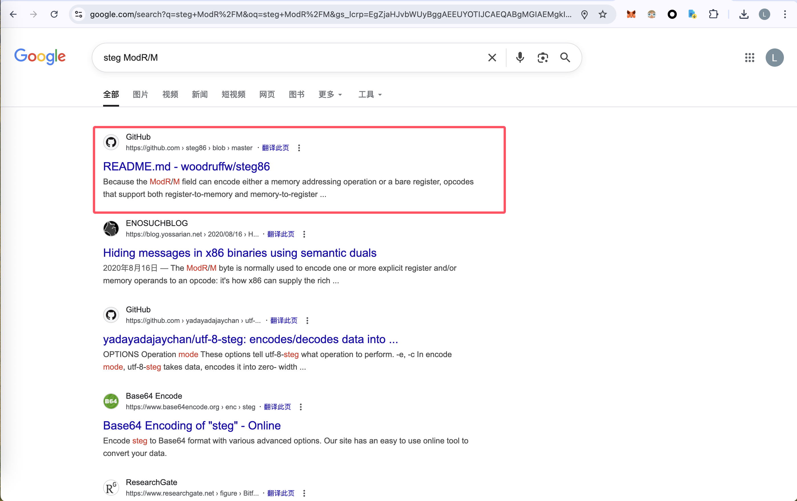

我们安装一下，然后提取一下隐写的信息

```python
cargo install steg86
steg86 extract chal > out.txt
```

提取后可以得到如下内容：

```
326a31306c206b6b6868203a332024206a686820346820326b32682024336a203468336b206a323068206a6a366c206b6b6c6c206c6c6b205e6a206b6b24686820306a6a202f7a203a3620356b24206a6a206a
```

用 CyberChef 解一下 Hex

```
2j10l kkhh :3 $ jhh 4h 2k2h $3j 4h3k j20h jj6l kkll llk ^j kk$hh 0jj /z :6 5k$ jj j
```

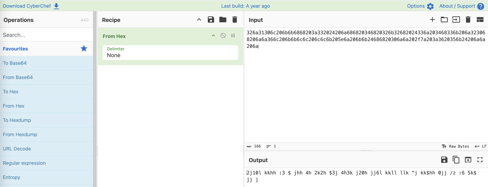

熟悉 vim 编辑器的师傅看到上面的内容应该会很熟悉

尤其是看到 `hjkl` 这四个字母

```bash
python 1.py > table.txt
vim table.txt
```

我们在 vim 编辑器中按顺序输入hex 解码得到的内容即可得到 flag

`flag{y0u-are_amaz1ng}`

## 题目名称 标准的绝密压缩

> 题目描述：
> 
> 近日我司捕获到了一段神秘流量，据分析里面似乎传输了些隐秘数据……

翻看流量追踪TCP流，发现其中传输了一些图片的十六进制数据

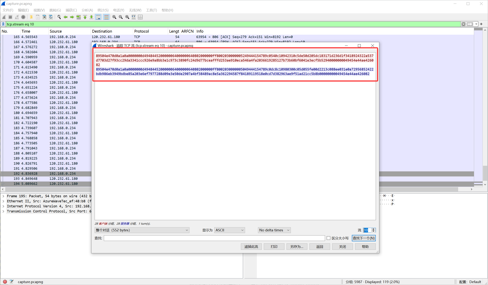

尝试手动提取出来，发现提出来的图片宽高都是 100x100

然后用 pngcheck 检查，发现图片都是是有问题的

```bash
(base) ➜  Downloads pngcheck -v download.png
File: download.png (705 bytes)
  chunk IHDR at offset 0x0000c, length 13
    100 x 100 image, 24-bit RGB, non-interlaced
  chunk IDAT at offset 0x00025, length 648
    zlib: deflated, 32K window, default compression
    invalid row-filter type (85)
ERRORS DETECTED in download.png
```

经过尝试，发现是图片IDAT块隐写

手动提取出IDAT块的数据，然后补上789c即可用CyberChef解压出隐写的数据

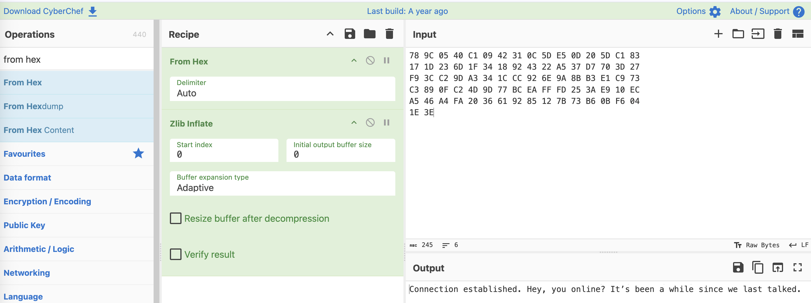

按顺序把所有PNG图片中隐写的数据提取出来，可以得到如下几段对话：

> Connection established. Hey, you online? It’s been a while since we last talked.
> 
> Yeah, I’m here. Busy as always. Feels like the days are getting shorter.


> Tell me about it. I barely have time to sleep lately. Between maintenance logs and incident reports, I’m drowning.
> 
> Sounds rough. I’ve been buried in audits myself. Every time I finish one, another pops up.


> Classic. Sometimes I wonder if the machines are easier to deal with than the people.
> 
> No kidding. At least machines don’t ask pointless questions.


> True. Anyway, before I forget—how’s that side project you were working on? The one you wouldn’t shut up about months ago.
> 
> Still alive… barely. Progress is slow, but steady. You know me—I don’t give up easily.


> Good. I hope it pays off one day.
> 
> Thanks. Alright… I’m guessing you didn’t ping me just to chat?


> Well, half of it was. It’s been a while. But yes—I do have something for you today. Before sending the core cipher, I’ll transmit an encrypted archive first. It contains a sample text and the decryption rules.
> 
> Okay. What’s special about this sample text?


> And… inside the sample text, I used my favorite Herobrine legend—you know the one I always bring up.
> 
> Of course I know. The hidden original text from that weird old site, right?


> What can I say—old habits die hard. Anyway, the important part: the sample packet and the core cipher are encrypted with the same password.
> 
> Got it. So if I can decrypt the sample, the real one should be straightforward.


> Exactly. Send the sample when ready.
> 
> I’m ready. Go ahead.


>UEsDBBQAAQAIABtFeFu1Ii0dcwAAAHwAAAAJAAAAcnVsZXMudHh07XuRBFDbojGKhAz59VaKEpwD6/rKaZnqUxf+NMH0rybWrAMPewZ/yGyLrMKQjNIcEbPAxjmP5oTh8fP77Vi1wnFwzN37BmrQ9SCkC27FC/xeqbgw/HWcDpgzsEoiNpqT9ZThrbAScyg5syfJmNactjelNVBLAwQUAAEACACGOXhbpdvG1ysBAAAVAgAACgAAAHNhbXBsZS50eHTA1fy4cMLZwZkTI1mEk88yOXy9rmbTbCNBQOo9hqKQPK6vjZVo9aCtTVflmkKYGV99+51qXbinmG7WGik5UvLJk9MKRosThBCDMHrmjibOCzjzNELwEgEyX8DjqJkSc8pIFwj+oRM3bb4i0GtRxbwqgsxCtgwiKdCVoXVdetN7RKLIQ7DD+Huv/ZptNdd0yRNHis9LEA3loB+IHZ+dK7IknqPh4lYF8JwAjx5/wwp0YAM6Bcec7uAvk6B5t1pEztm1rLl8TjniVz5/bBUTo1LjUXnar/pnm1NvE9EAuxz/s6b+O8/ew7/A4ItdNJGzDudh6YULfiV3pCTXFIbR4GCe4LwkohWZIlAjysA+zLRrgkTDoB10vWdNGdfoBAlLRoUdZ95mS7X5/bXV41BLAQI/ABQAAQAIABtFeFu1Ii0dcwAAAHwAAAAJACQAAAAAAAAAIAAAAAAAAABydWxlcy50eHQKACAAAAAAAAEAGABIv3f82lzcAQAAAAAAAAAAAAAAAAAAAABQSwECPwAUAAEACACGOXhbpdvG1ysBAAAVAgAACgAkAAAAAAAAACAAAACaAAAAc2FtcGxlLnR4dAoAIAAAAAAAAQAYAFP0sZjOXNwBAAAAAAAAAAAAAAAAAAAAAFBLBQYAAAAAAgACALcAAADtAQAAAAA=
> 
> got it. Decrypting… yeah, it works.


> Good. That means the channel is stable.
> 
> Alright. Whenever you’re ready, send the real thing.


>The core cipher will be transmitted through our secret channel.You remember how to decrypt it, right?
> 
> Of course. I’ve got the procedure ready. Start when you’re ready.


> TCP流32开始分段用 AES-ECB 加密传输zip压缩包
> 
> Done. Core cipher fully received.Integrity verified—no corruption.


> TCP 流34
> 
> Same to you. And hey… nice talking again.


> TCP 流36
> 
> Agreed. Take care.


> TCP 流155：Good. Keep things quiet for the next few days.
> 
> TCP 流156：Yeah. Let’s not wait so long next time.
> 
> TCP 流157：You too.

但是发现从TCP流32开始就是用了另外一种加密的方式传输数据了

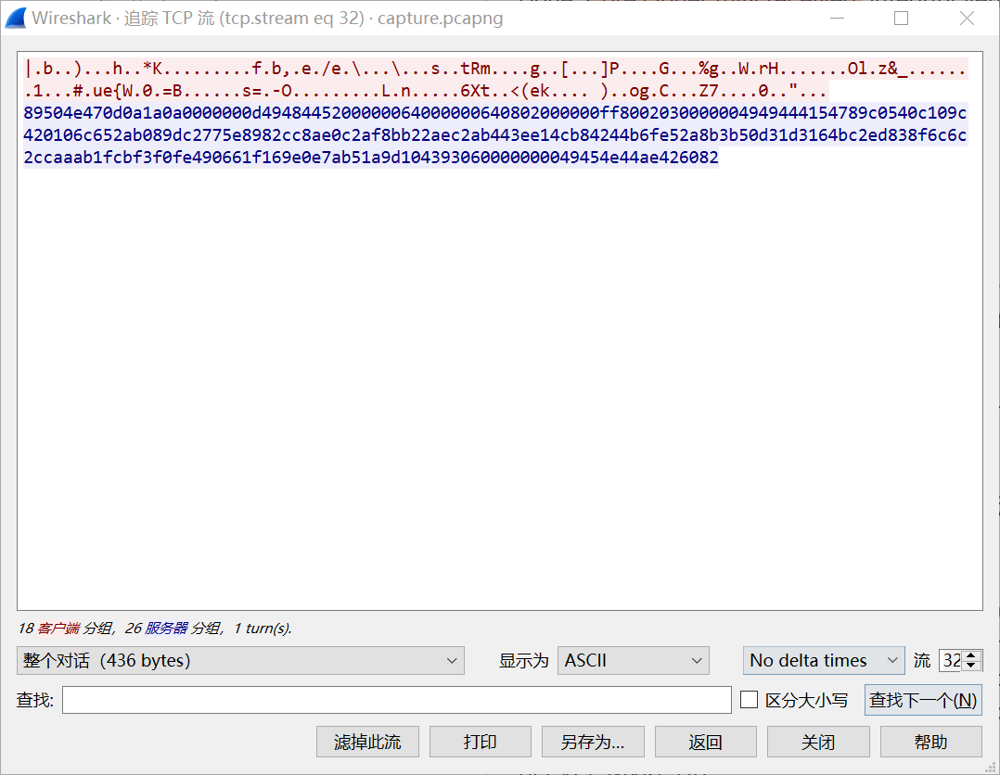

根据对话中的内容，应该是要我们从传输的加密压缩包中获得解密的规则

根据提示，猜测是要我们找到sample.txt，然后去明文攻击

结合对话中提到的`Herobrine legend`和`weird old site`可以在网上找到sample.txt：

> It has been reported that some victims of torture, during the act, would retreat into a fantasy world from which they could not WAKE UP. In this catatonic state, the victim lived in a world just like their normal one, except they weren't being tortured. The only way that they realized they needed to WAKE UP was a note they found in their fantasy world. It would tell them about their condition, and tell them to WAKE UP. Even then, it would often take months until they were ready to discard their fantasy world and PLEASE WAKE UP.

010打开发现加密的标志位为0x3F，猜测是用7z压缩的

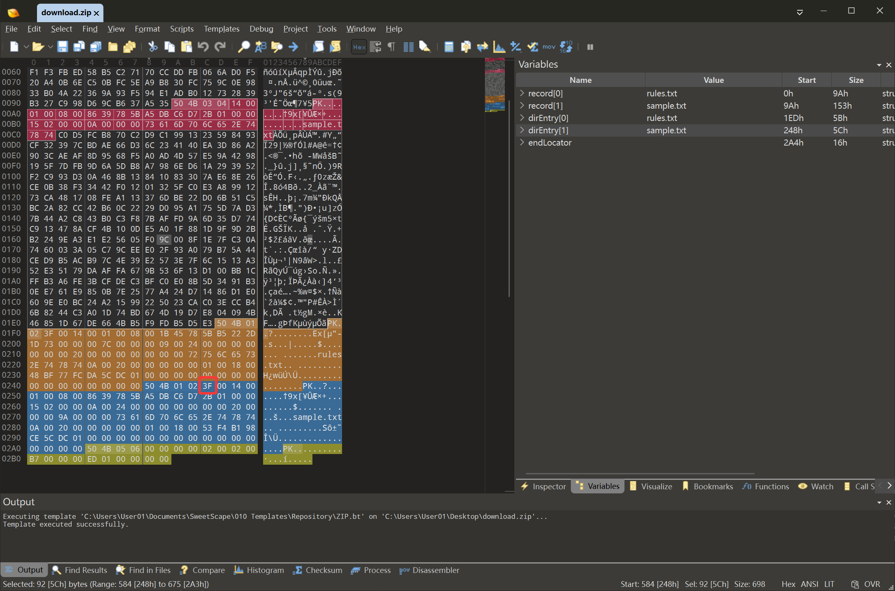

因此我们用7z压缩一下明文，然后开始明文攻击

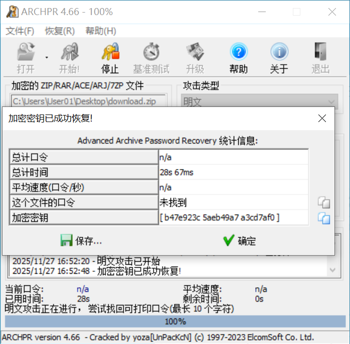

得到三段密钥：b47e923c 5aeb49a7 a3cd7af0

解压后可以得到 rules.txt，内容如下：

> 1.you need to calc the md5 of port to decrypt the core data.
> 
> 2.The cipher I put in the zip, in segments, has been deflated.

然后根据rule.txt中的提示，把端口号MD5一下可以得到AES的密钥

解AES-ECB可以得到一个加密的压缩包

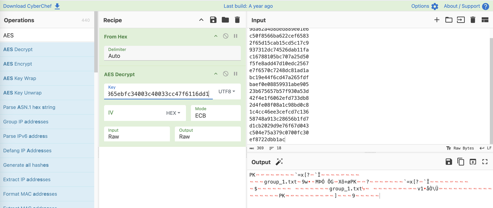

但是压缩包里只有一个4字节的txt，因此我们可以直接CRC爆破得到其中的内容

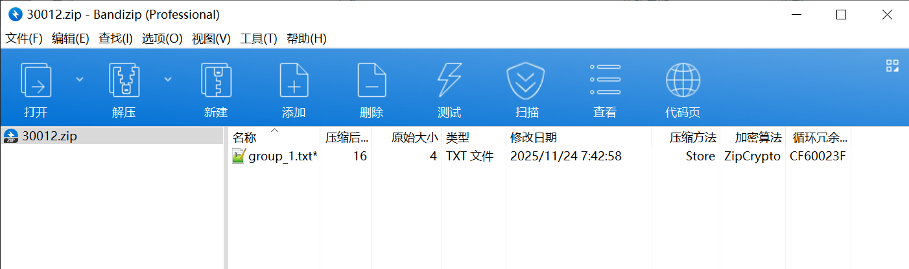

尝试手动解了几个，发现都是一样的规律

```
(base) ➜  crc32 git:(main) python crc32.py reverse 0xCF60023F
4 bytes: {0x53, 0x29, 0x00, 0x00}
(base) ➜  crc32 git:(main) python crc32.py reverse 0x61D8A4F3
4 bytes: {0xcb, 0xae, 0x02, 0x00}
(base) ➜  crc32 git:(main) python crc32.py reverse 0xB15F099F
4 bytes: {0xcb, 0x2c, 0x00, 0x00}
```

rule.txt中提示了分段传输，并且 deflate 压缩了，因此尝试手动补zlib头解了几个

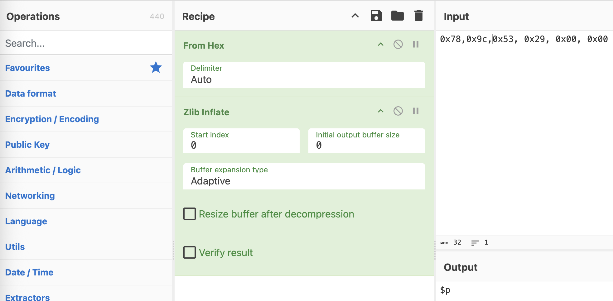

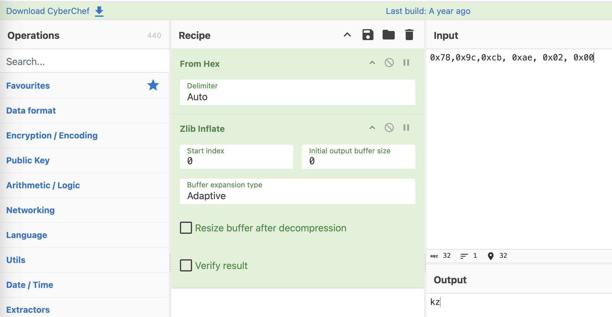

写了个批量提取 CRC 的脚本，运行后发现一共有 80 个压缩包：30012-30091

```python
import subprocess
from Crypto.Cipher import AES
from Crypto.Util.Padding import unpad
import hashlib
import zipfile

def md5(data):
    return hashlib.md5(data).hexdigest()

def aes_ecb_decrypt(ciphertext, key):
    if len(ciphertext) % 16 != 0:
        ciphertext = ciphertext.ljust((len(ciphertext) + 15) // 16 * 16, b'\x00')
    cipher = AES.new(key, AES.MODE_ECB)
    decrypted = cipher.decrypt(ciphertext)
    return decrypted

def main():
    file_path = "capture.pcapng"
    crc_list = []
    
    for src_port in range(30012, 30092):
        print(f"[+] Processing source port: {src_port}")
        aes_key = md5(str(src_port).encode())
        print(f"[+] aes_key: {aes_key}")
        filter_str = f"tcp.srcport == {src_port}"

        command = [
            "tshark",
            '-r', file_path,
            '-T', 'fields',
            '-Y', filter_str,
            '-e', 'tcp.payload'
        ]
        # print(f"[+] cmd: {command}")
        result = subprocess.run(command, stdout=subprocess.PIPE, stderr=subprocess.PIPE, text=True)   
        output = result.stdout.split()
        if not output:
            continue
            
        hex_data = "".join(output)
        # print(f"[+] hex_data: {hex_data}")
        zip_data = aes_ecb_decrypt(bytes.fromhex(hex_data), aes_key.encode())
        # print(zip_data)

        zip_filename = f"{src_port}.zip"
        with open(zip_filename, 'wb') as f:
            f.write(zip_data)
        try:
            with zipfile.ZipFile(zip_filename, 'r') as zf:
                file_list = zf.namelist()
                if file_list:
                    target_file = file_list[0]
                    info = zf.getinfo(target_file)
                    crc_list.append(hex(info.CRC))
        except:
            print(f"\033[1;31m[-] Failed to process zip for port {src_port}\033[0m")
    
    print(f"CRC32 list: {crc_list}")

if __name__ == "__main__":
    main()
```

然后写个脚本批量爆破 CRC 

```python
import binascii

class CRC32Reverse:
    def __init__(self, crc32, length, tbl=bytes(range(256)), poly=0xEDB88320, accum=0):
        self.char_set = set(tbl)  # 支持所有字节
        self.crc32 = crc32
        self.length = length
        self.poly = poly
        self.accum = accum
        self.table = []
        self.table_reverse = []

    def init_tables(self, poly, reverse=True):
        """构建 CRC32 表及其反向查找表"""
        # CRC32 表构建
        for i in range(256):
            for j in range(8):
                if i & 1:
                    i >>= 1
                    i ^= poly
                else:
                    i >>= 1
            self.table.append(i)

        assert len(self.table) == 256, "CRC32 表的大小错误"

        # 构建反向查找表
        if reverse:
            for i in range(256):
                found = [j for j in range(256) if self.table[j] >> 24 == i]
                self.table_reverse.append(tuple(found))
            
            assert len(self.table_reverse) == 256, "反向查找表的大小错误"

    def calc(self, data, accum=0):
        """计算 CRC32 校验值"""
        accum = ~accum
        for b in data:
            accum = self.table[(accum ^ b) & 0xFF] ^ ((accum >> 8) & 0x00FFFFFF)
        accum = ~accum
        return accum & 0xFFFFFFFF

    def find_reverse(self, desired, accum):
        """查找反向字节序列"""
        solutions = set()
        accum = ~accum
        stack = [(~desired,)]
        
        while stack:
            node = stack.pop()
            for j in self.table_reverse[(node[0] >> 24) & 0xFF]:
                if len(node) == 4:
                    a = accum
                    data = []
                    node = node[1:] + (j,)
                    for i in range(3, -1, -1):
                        data.append((a ^ node[i]) & 0xFF)
                        a >>= 8
                        a ^= self.table[node[i]]
                    solutions.add(tuple(data))
                else:
                    stack.append(((node[0] ^ self.table[j]) << 8,) + node[1:] + (j,))
        
        return solutions

    def dfs(self, length, outlist=[b'']):
        """深度优先搜索生成字节序列"""
        if length == 0:
            return outlist
        tmp_list = [item + bytes([x]) for item in outlist for x in self.char_set]
        return self.dfs(length - 1, tmp_list)

    def run_reverse(self):
        """执行 CRC32 反向查找"""
        self.init_tables(self.poly)

        desired = self.crc32
        accum = self.accum
        result_list = []

        # 处理至少为 4 字节的情况
        if self.length >= 4:
            patches = self.find_reverse(desired, accum)
            for patch in patches:
                checksum = self.calc(patch, accum)
                # print(f"verification checksum: 0x{checksum:08x} ({'OK' if checksum == desired else 'ERROR'})")
            for item in self.dfs(self.length - 4):
                patch = list(item)
                patches = self.find_reverse(desired, self.calc(patch, accum))
                for last_4_bytes in patches:
                    patch.extend(last_4_bytes)
                    checksum = self.calc(patch, accum)
                    if checksum == desired:
                        result_list.append(bytes(patch))  # 添加符合条件的字节序列
        else:
            for item in self.dfs(self.length):
                if self.calc(item) == desired:
                    result_list.append(bytes(item))  # 添加符合条件的字节序列
        return result_list

def crc32_reverse(crc32, length, char_set=bytes(range(256)), poly=0xEDB88320, accum=0):
    obj = CRC32Reverse(crc32, length, char_set, poly, accum)
    return obj.run_reverse()  # 返回所有结果

def crc32(s):
    return binascii.crc32(s) & 0xFFFFFFFF

if __name__ == "__main__":
    crc_values  =[0xcf60023f, 0x61d8a4f3, 0xb15f099f, 0xb93935f3, 0x56263d91, 0x7c9a17, 0x324af895, 0x64105f13, 0x7aae1d0a, 0x616c6729, 0x2b51c9d4, 0xb6e26299, 0xdff453c4, 0x9331116d, 0x324af895, 0x7c9a17, 0x7e2361b8, 0x7c65dfe1, 0x9e4be534, 0x324af895, 0x821fc2f0, 0x78e8a353, 0xac828282, 0x9e4be534, 0x6504596, 0xcaa8f9df, 0x64dc7498, 0x779f2fbd, 0x7b27b1d3, 0xcb9596dc, 0xaab6455d, 0xb72008ae, 0xb3ad741c, 0xa10773ef, 0x2b9de25f, 0x9b04f3b1, 0x48f88f87, 0xac828282, 0x821fc2f0, 0x6a2254af, 0xcaa8f9df, 0x3e3e4d70, 0x7b91940, 0x3c78f329, 0xe435b9ad, 0x6847643, 0x2c944a83, 0xc4a9dcdc, 0x9c0d5b6d, 0xa341cdb6, 0x358f7bc2, 0x13f3eab9, 0x6193621d, 0x159ed4a, 0x69a680c1, 0x4fb4a8, 0x70968761, 0x2f60fc5, 0x3937e5ac, 0x9b04f3b1, 0x1d26fc6f, 0x95fad386, 0x3937e5ac, 0x37c9c59b, 0xa341cdb6, 0xeb09f3ad, 0xa448656a, 0xab742f6a, 0x2090af1, 0xe435b9ad, 0xb26f1e2b, 0xecd468a4, 0x26cc20e7, 0x1ea22801, 0x64dc7498, 0x638602f4, 0x26b4c8b6, 0x61d8a4f3, 0xb15f099f, 0x88a078ba]

    # print(len(crc_list))
    res = b""
    for item in crc_values:
        res += crc32_reverse(item, 4)[0]
    print(res)
    with open("res.bin",'wb') as f:
        f.write(res)
```

> 就是这里要注意最后一个压缩包中的 txt 是 3 字节，需要单独处理一下

所有CRC 爆破结果合起来的内容如下

```
53 29 00 00 CB AE 02 00 CB 2C 00 00 53 31 04 00
D3 32 04 00 D3 32 02 00 D3 32 00 00 D3 32 06 00
33 D5 02 00 33 B2 04 00 D3 32 01 00 33 34 06 00
33 4D 04 00 33 4F 03 00 D3 32 00 00 D3 32 02 00
33 D3 02 00 33 D0 02 00 33 36 05 00 D3 32 00 00
33 31 04 00 33 D6 02 00 4B B6 00 00 33 36 05 00
B3 48 06 00 4B B5 04 00 4B 35 03 00 B3 30 05 00
B3 48 03 00 33 34 03 00 33 33 07 00 33 35 06 00
33 33 06 00 33 4F 01 00 4B 35 04 00 33 31 05 00
4B 31 00 00 4B B6 00 00 33 31 04 00 4B 4E 05 00
4B B5 04 00 4B 4D 03 00 4B 31 07 00 4B 4E 03 00
33 32 00 00 33 B0 00 00 4B 31 04 00 33 4E 05 00
33 35 05 00 33 4C 01 00 4B 31 05 00 B3 30 01 00
4B 32 03 00 B3 4C 06 00 4B 4C 05 00 33 B5 00 00
B3 34 05 00 4B 36 07 00 4B 49 03 00 33 31 05 00
4B 33 06 00 33 4A 03 00 4B 49 03 00 4B 32 05 00
33 4C 01 00 33 48 06 00 33 48 01 00 33 32 07 00
33 B6 00 00 33 32 00 00 33 32 06 00 B3 B4 00 00
B3 34 03 00 4B 31 06 00 4B 35 03 00 D3 52 01 00
D3 2F 00 00 CB AE 02 00 CB 2C 00 00 53 01 00
```

把上面的数据按每4字节一组解压，可以得到一个zip的hash

```python
import zlib

hex_data = "53290000CBAE0200CB2C000053310400D3320400D3320200D3320000D332060033D5020033B20400D332010033340600334D0400334F0300D3320000D332020033D3020033D0020033360500D33200003331040033D602004BB6000033360500B34806004BB504004B350300B3300500B348030033340300333307003335060033330600334F01004B350400333105004B3100004BB60000333104004B4E05004BB504004B4D03004B3107004B4E03003332000033B000004B310400334E050033350500334C01004B310500B33001004B320300B34C06004B4C050033B50000B33405004B3607004B490300333105004B330600334A03004B4903004B320500334C010033480600334801003332070033B600003332000033320600B3B40000B33403004B3106004B350300D3520100D32F0000CBAE0200CB2C0000530100"

data = bytes.fromhex(hex_data)

chunks = [data[i:i+4] for i in range(0, len(data), 4)]

out = b""
for c in chunks:
    try:
        out += zlib.decompress(c, -zlib.MAX_WBITS)
    except:
        print("bad chunk:", c.hex())

print(out.decode())
# $pkzip$1*1*2*0*35*29*4135a7f*0*26*0*35*0413*c8358ce9e6858f166753637de145d0c841cee9efd7cf2008d13e551dd584b69cae5895c7df45f32fdfb51d0c0d273820239896d3e6*$/pkzip$
```

尝试用hashcat爆破，发现还真能爆出来密码：&HGTr\'

```bash
hashcat -m 17225 -a 3 hash.txt --increment --increment-min 1 --increment-max 8 '?a?a?a?a?a?a?a?a' --show

$pkzip$1*1*2*0*35*29*4135a7f*0*26*0*35*0413*c8358ce9e6858f166753637de145d0c841cee9efd7cf2008d13e551dd584b69cae5895c7df45f32fdfb51d0c0d273820239896d3e6*$/pkzip$:&HGTr\'
```

the sample packet and the core cipher are encrypted with the same password.

对话中的这句话是最后这一步的突破点

因此我们现在手头有的数据如下：

1、两个压缩包的三段密钥

2、最终那个压缩包的hash值

参考2025 buckeyeCTF-zip2john2zip:

[https://github.com/cscosu/buckeyectf-2025-public/blob/master/forensics/zip2john2zip/solve/solve.py](https://github.com/cscosu/buckeyectf-2025-public/blob/master/forensics/zip2john2zip/solve/solve.py)

直接利用已知的三段密钥和hash里的密文即可恢复出压缩包中原始的明文

具体的原理可以参考zipcrypto算法的实现

```python
# 已知三段密钥
key0 = 0xb47e923c
key1 = 0x5aeb49a7
key2 = 0xa3cd7af0

# 初始化 CRC 表
crc_table = [0] * 256
for i in range(256):
    c = i
    for _ in range(8):
        if c & 1:
            c = (0xEDB88320 ^ (c >> 1)) & 0xFFFFFFFF
        else:
            c = (c >> 1) & 0xFFFFFFFF
    crc_table[i] = c


def crc32(old_crc, c):
    return (crc_table[(old_crc ^ c) & 0xFF] ^ (old_crc >> 8)) & 0xFFFFFFFF


def update_keys(p):
    global key0, key1, key2

    key0 = crc32(key0, p)
    key1 = (key1 + (key0 & 0xFF)) & 0xFFFFFFFF
    key1 = (key1 * 134775813 + 1) & 0xFFFFFFFF
    key2 = crc32(key2, (key1 >> 24) & 0xFF)


def decrypt_byte():
    temp = (key2 | 3) & 0xFFFFFFFF
    return ((temp * (temp ^ 1)) >> 8) & 0xFF


def decrypt(ciphertext):
    plain = bytearray()
    for byte in ciphertext:
        k = decrypt_byte()
        p = byte ^ k
        update_keys(p)
        plain.append(p)
    return plain

encrypted = bytes.fromhex("c8358ce9e6858f166753637de145d0c841cee9efd7cf2008d13e551dd584b69cae5895c7df45f32fdfb51d0c0d273820239896d3e6")  # 示例输入
plaintext = decrypt(encrypted)
print(plaintext)

# bytearray(b'\xcf\xecP\x1f\x89\x9e\x83q1"\xa4\x04flag{W0ww_th3_C@ske7|s_Tre4sur3_unl0cke9}')
```

`flag{W0ww_th3_C@ske7|s_Tre4sur3_unl0cke9}`

## 题目名称 返璞归真

附件给了如下内容，并且压缩包注释中有提示：`hashisk3y`

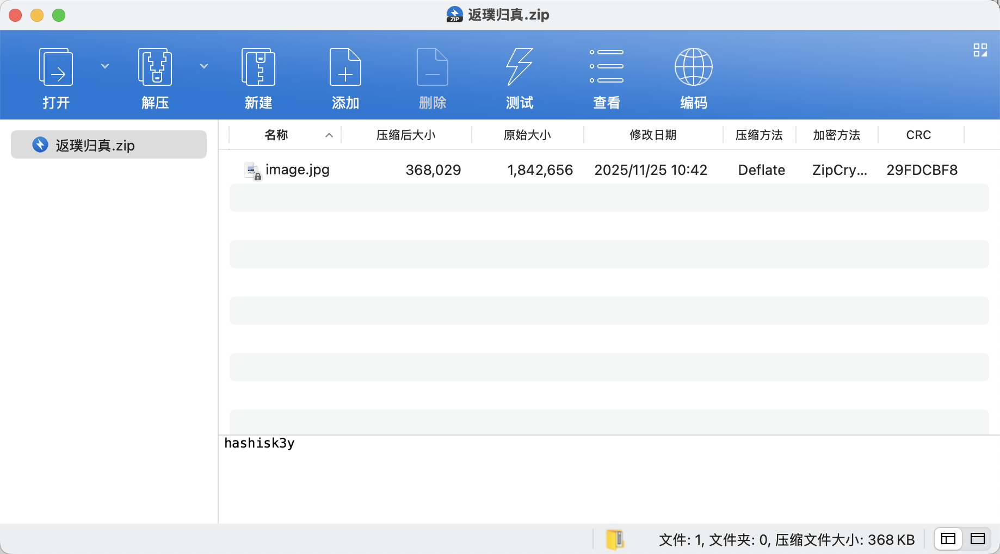

经过尝试，发现这个压缩包是个伪加密，直接用 010 修改加密位后解压即可

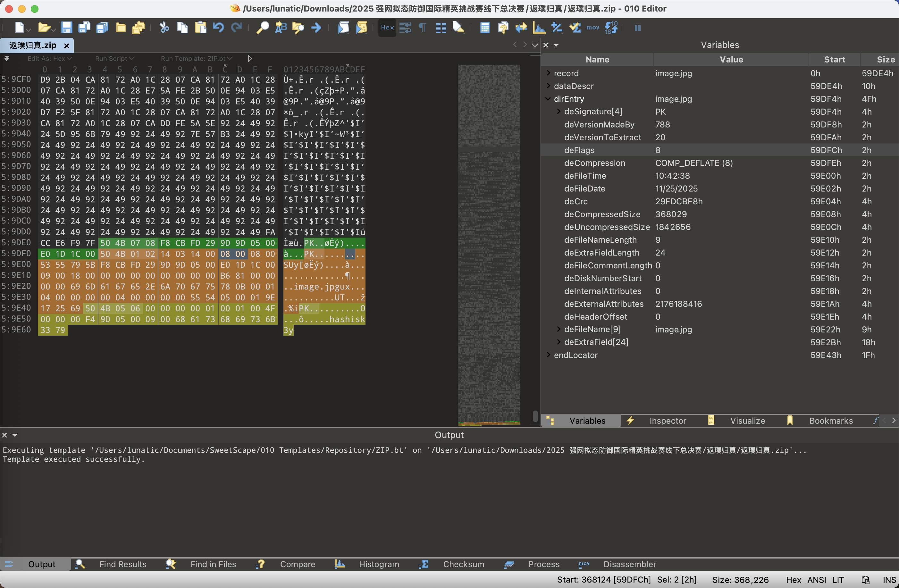

解压后可以得到下面这张 JPG


010 打开，发现末尾有一张 BMP

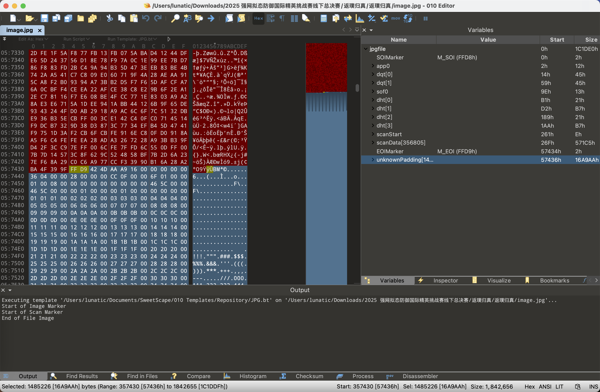

手动提取出来，发现是个 paperback

2025 L3HCTF 出过这个考点，参考链接：

https://mp.weixin.qq.com/s/p-WAzu9XO2vONeDbY5bmLg

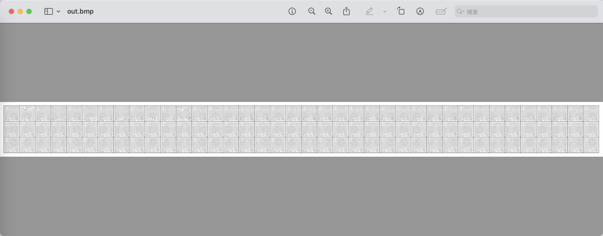

因此我们下载这个软件，然后把其中的信息读取出来即可

paperback：http://www.ollydbg.de/Paperbak/

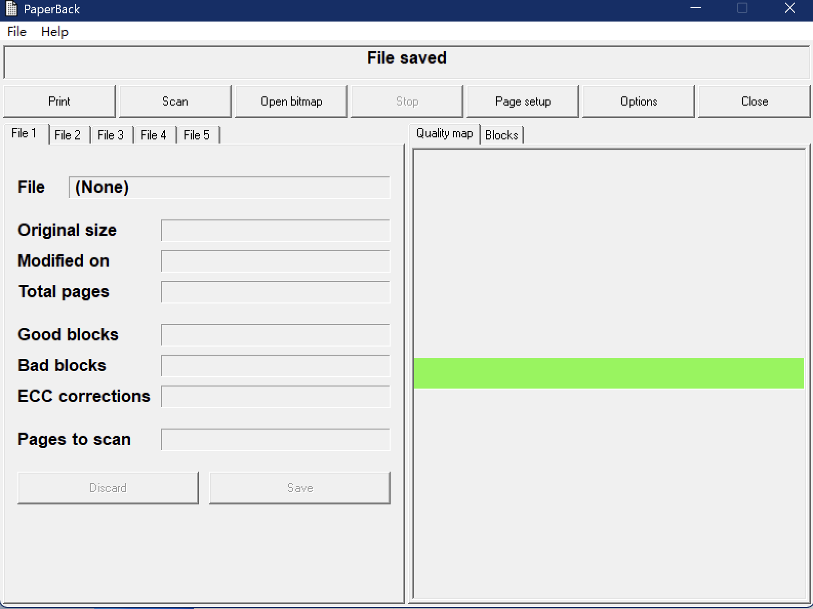

使用这个软件读取那个 bmp 后可以得到一个 wow.txt，内容如下：

```
jNX+xu2QKBm23AUlwClt+3xDkQcJGjM=
```

然后结合之前压缩包注释中的提示：`hashisk3y`

我们把之间的那张JPG删去末尾BMP的数据后 MD5 一下

```bash
$ md5sum image.jpg
001a62ee54d1c28a8b769ab5499011cb  image.jpg
```

然后把这个作为密钥解个 RC4 即可得到 flag：

`flag{examp13_f0r_r3a11}`

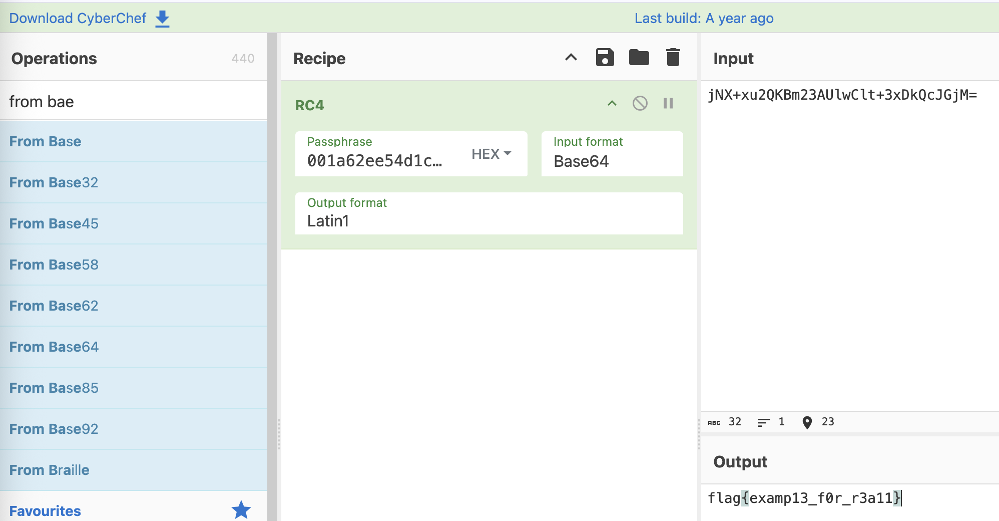

## 题目名称 猫咪电台

> 题目描述：
> 
> Meow~ 欢迎来到猫咪电台！
> 
> 提交时请添加flag{}

附件给了如下内容：

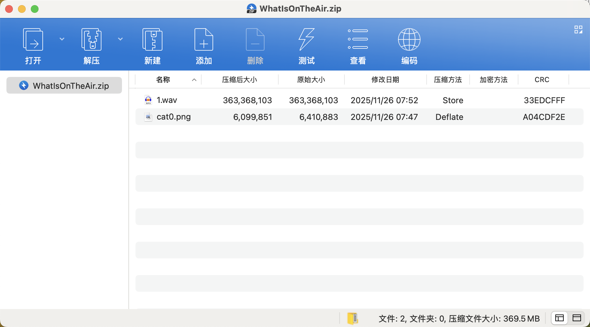

其中PNG 文件存在 LSB 隐写，就是需要把顺序调整为 BRG

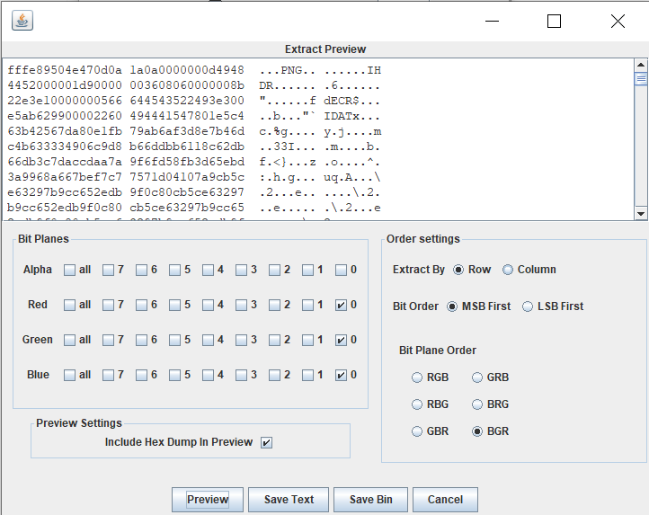

发现是隐写了一张 PNG，提取出来可以得到如下图片


```
flag part0： ==gNWRWTFRjY4IGV4sGczg0QzAFUyQTQ
```

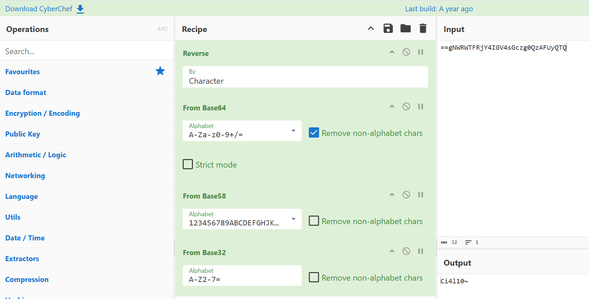

```
Ci4l10~
```

然后去看那个 wav 文件，010打开发现末尾藏了一个 zip


手动提取出来，发现解压需要密码，猜测密码要从 wav 文件中获取

删去末尾的 zip 的数据后，我们 file 看一下 wav 的基本信息

```bash
┌──(kali㉿kali)-[~/Desktop]
└─$ file 11.wav
11.wav: RIFF (little-endian) data, WAVE audio, Microsoft PCM, 16 bit, mono 8000 Hz
```

然后尝试用Audacity导入原始数据

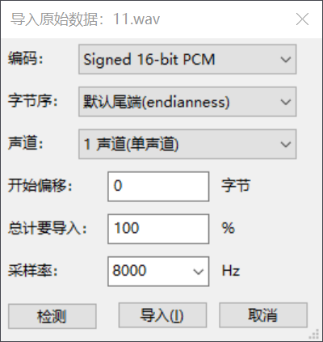

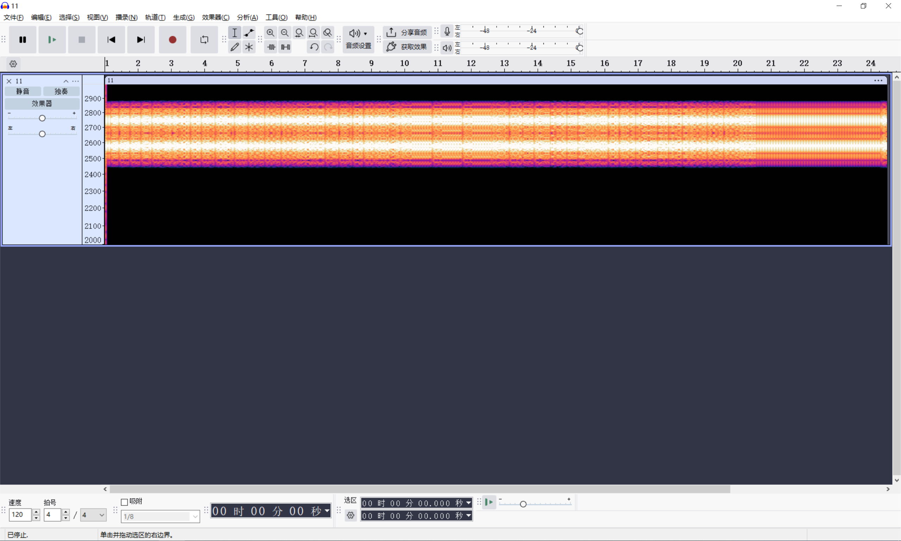

发现有两条很清晰的频率，猜测是RTTY，因此尝试拉到kali中用minimodem解码

> 频率分离（Mark 和 Space）：
> 
> RTTY使用两种频率来代表两种不同的信号状态：Mark 和 Space。
> 
> Mark频率（通常为较低频率）对应“1”。
> 
> Space频率（通常为较高频率）对应“0”。
> 
> 在传输时，信号会在这两种频率之间切换，形成一个类似于“0”和“1”的二进制模式。

```bash
┌──(kali㉿kali)-[~/Desktop]
└─$ minimodem -f out.wav -M 2560 -S 2720 45.45 --baudot

### CARRIER 45.45 @ 2560.0 Hz ###
CQ CQ CQ DE CATHUB
THIS IS CAT RADIO HUB MEOW MEOW MEOW
WHISKERS THE CAT IS BROADCASTING
PURRRRRRR PURRRRRRR PURRRRRRR
FLAG PART1: R77YM30W1SFUN
PASS IS 450KTFQY1D4KX8JB
MEOW MEOW MEOW
SKSK

### NOCARRIER ndata=284 confidence=6.970 ampl=0.431 bps=43.05 (5.3% slow) ###
```

得到 `FLAG PART1: R77YM30W1SFUN`

使用`450KTFQY1D4KX8JB`作为密码解压可以得到一个2.wav

还是一样，我们先 file 看一下音频的基本信息

```bash
$ file 2.wav
2.wav: MBWF/RF64 audio, stereo 2400000 Hz
```

采样率非常高，猜测是 SDR(软件定义无线电) 捕获的无线信号数据

因此我们尝试使用 SDR# (SDRSharp) 进行解析，发现在300kHz处存在SSTV信号

 SDR# (SDRSharp) ：https://airspy.com/download/

我这里也还没调出来，就先放一张别的师傅调出来的图吧

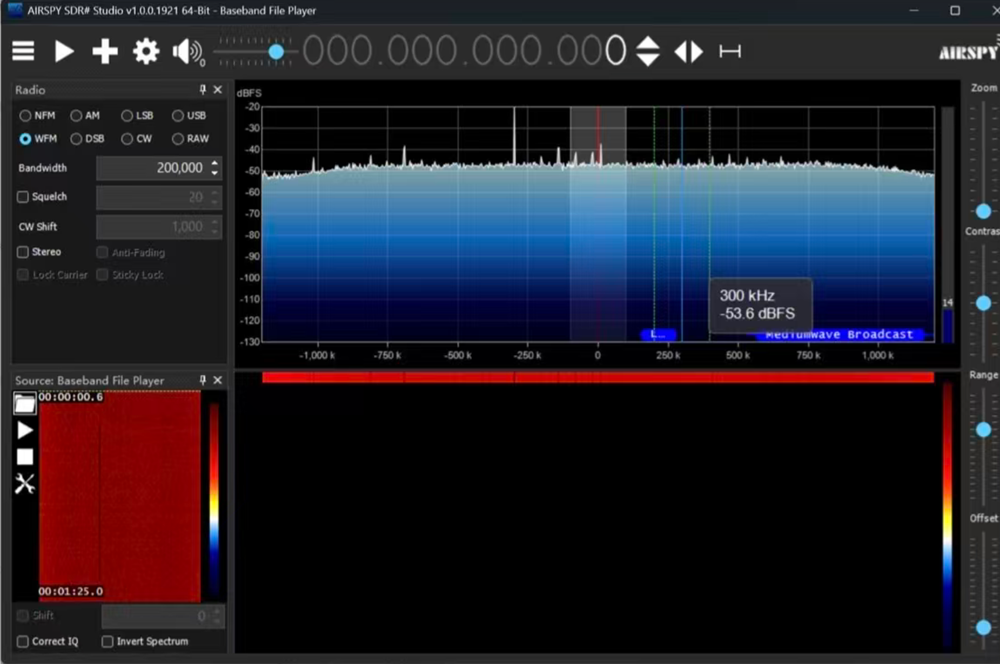


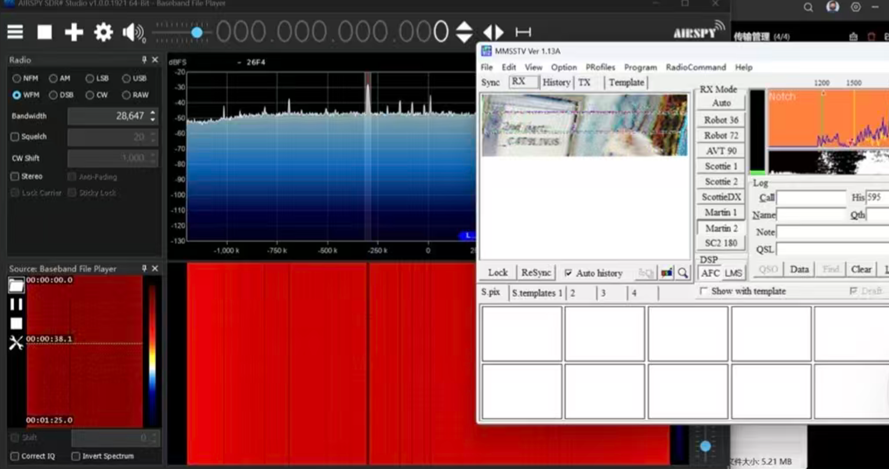


从而得到`2nd part _C4T9L1V3S`

综上，最后的flag：`flag{Ci4l10~R77YM30W1SFUN_C4T9L1V3S}`

当然，这题的最后一步也可以写个脚本处理，详细可以参考下面这篇文章：

https://0ran9e.fun/2025/11/30/qwnt/wp/


---

> 作者: [Lunatic](https://goodlunatic.github.io)  
> URL: https://goodlunatic.github.io/posts/353513a/  

