# 2025 古剑山全国大学生网络攻防大赛 Misc Writeup

**2025 古剑山全国大学生网络攻防大赛 Misc Writeup**
<!--more-->

|         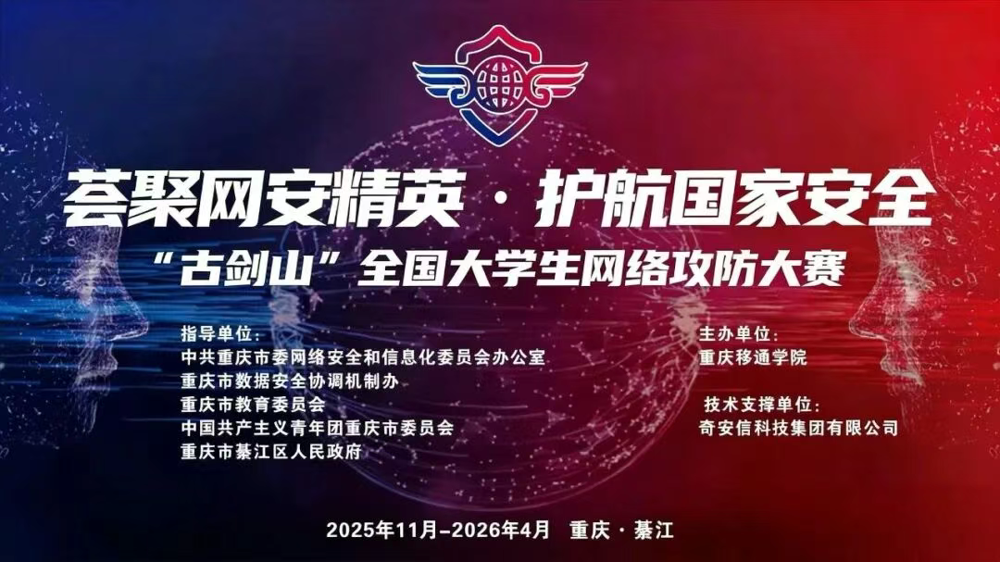         |
| :---------------------------------------------------: |
| 本文中涉及的具体题目附件可以进我的 [知识星球](https://t.zsxq.com/an6p6) 获取 |

## 题目名称 水果

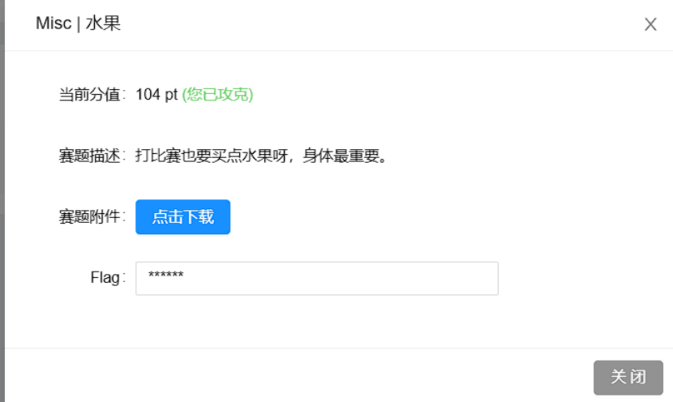

附件给了下面这张 JPG 图片

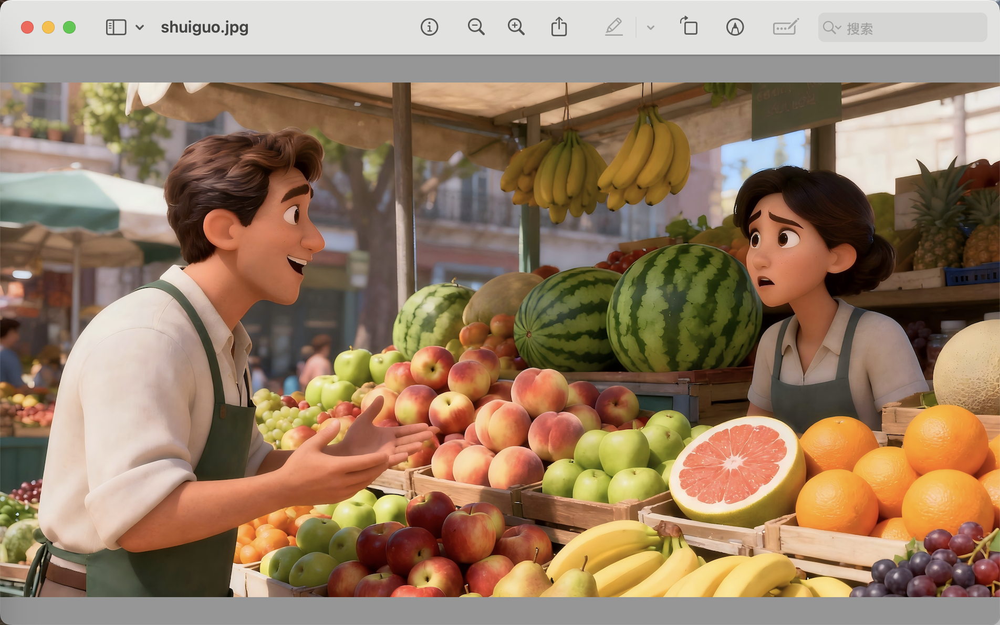

010 打开，发现末尾有个 zip

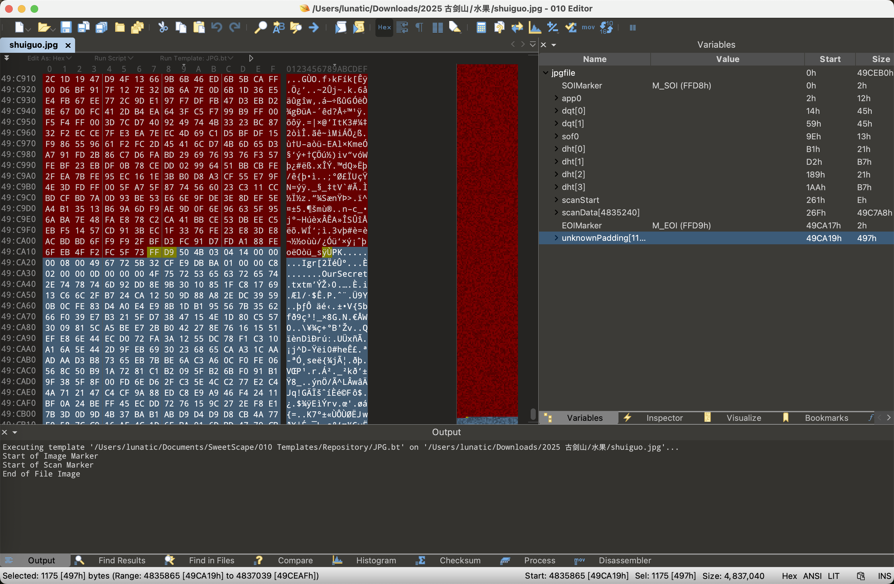

手动提取出来并解压，可以得到一个`oursecret.txt`，内容如下：

```
5L2g6L+Z6Iu55p6c5oCO5LmI6L+Z5LmI5aSnCuWkp+S4quWEv+aJjeWAvOmSseS9oOimgeS4jeimgQrov5nmoYPlrZDmgI7kuYjov5nkuYjnoawK56Gs5piv5Zug5Li65paw6bKc5L2g6KaB6L2v55qE6L+Y5piv57Ov55qECui/meilv+eTnOiDveWQg+WQl+eci+i1t+adpeacieeCueS4jeeGnwrkuI3nhp/nmoTopb/nk5zmgI7kuYjlj6/og73kvaDov5nlsLHmmK/nrYnnnYDlkIPnlJznmoQK5L2g6L+Z5p+a5a2Q6L+Z5LmI5bCPCuWwj+W3p+eahOaJjeWlveWQg+S9oOimgeWkp+S4queahOi/mOaYr+WlveWQg+eahArov5nmqZnlrZDmgI7kuYjov5nkuYjphbgK6YW45omN5piv5q2j5a6X55qE5qmZ5a2Q5L2g6KaB5piv55Sc55qE5Y675Yir5a6255yLCui/memmmeiVieacieeCueW8rwrlvK/nmoTpppnolYnmm7TnlJzkvaDkuI3mh4IK5L2g6L+Z5qKo5a2Q5piv5LiN5piv5pyJ54K556GsCuehrOaYr+WboOS4uuaWsOmynOWQg+edgOacieWPo+aEnwrov5nokaHokITmgI7kuYjov5nkuYjlsI8K5bCP55qE6JGh6JCE5pu05rWT57yp55Sc5ZGz
```

base64解码一下可以得到 16 行不同的字符串

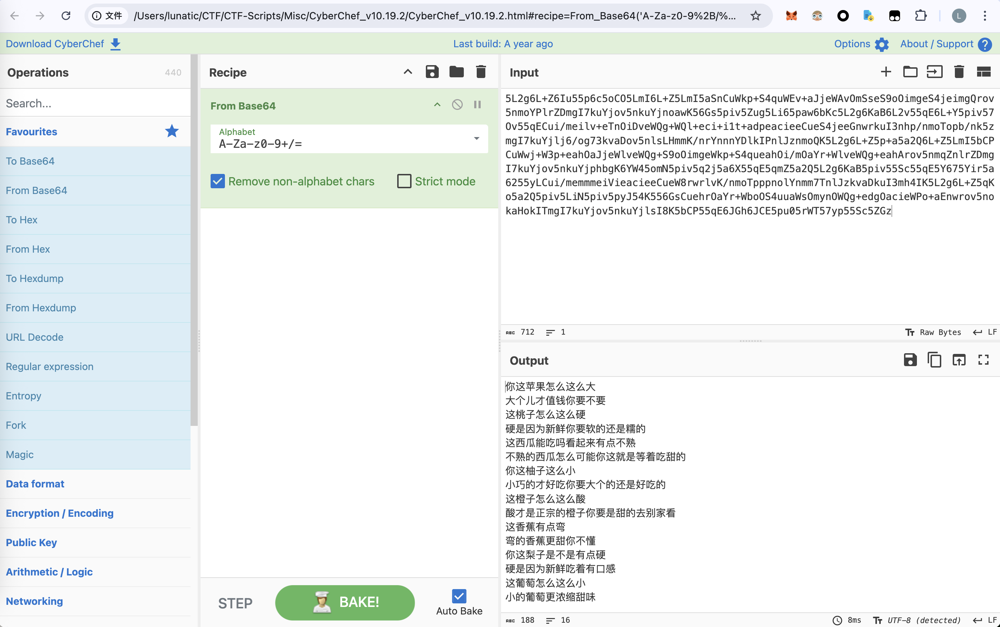

```
你这苹果怎么这么大
大个儿才值钱你要不要
这桃子怎么这么硬
硬是因为新鲜你要软的还是糯的
这西瓜能吃吗看起来有点不熟
不熟的西瓜怎么可能你这就是等着吃甜的
你这柚子这么小
小巧的才好吃你要大个的还是好吃的
这橙子怎么这么酸
酸才是正宗的橙子你要是甜的去别家看
这香蕉有点弯
弯的香蕉更甜你不懂
你这梨子是不是有点硬
硬是因为新鲜吃着有口感
这葡萄怎么这么小
小的葡萄更浓缩甜味
```

然后根据上面文件名的提示，以及压缩包末尾多余数据的特征，应该还有 oursecret 隐写

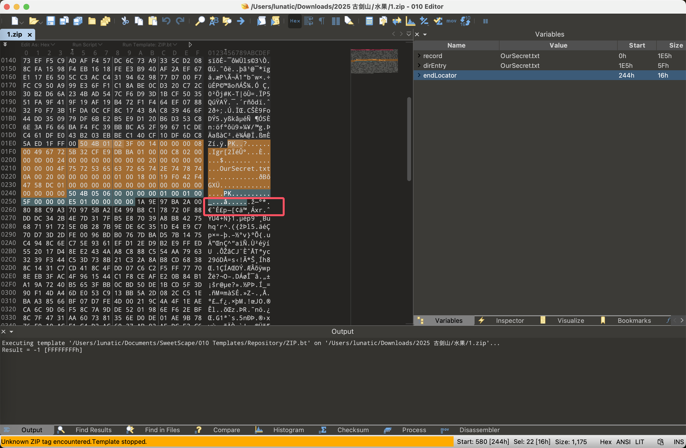

经过尝试发现解密的密钥就是水果的拼音：`shuiguo`

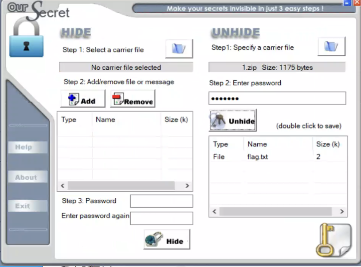

解密后可以得到一个 flag.txt，内容如下：

```
你这柚子这么小
你这柚子这么小
你这柚子这么小
你这梨子是不是有点硬
你这柚子这么小
大个儿才值钱你要不要
你这柚子这么小
小巧的才好吃你要大个的还是好吃的
小巧的才好吃你要大个的还是好吃的
弯的香蕉更甜你不懂
硬是因为新鲜你要软的还是糯的
硬是因为新鲜你要软的还是糯的
你这柚子这么小
不熟的西瓜怎么可能你这就是等着吃甜的
硬是因为新鲜你要软的还是糯的
这桃子怎么这么硬
硬是因为新鲜你要软的还是糯的
不熟的西瓜怎么可能你这就是等着吃甜的
硬是因为新鲜你要软的还是糯的
酸才是正宗的橙子你要是甜的去别家看
硬是因为新鲜你要软的还是糯的
你这柚子这么小
硬是因为新鲜你要软的还是糯的
你这苹果怎么这么大
你这柚子这么小
大个儿才值钱你要不要
硬是因为新鲜你要软的还是糯的
小巧的才好吃你要大个的还是好吃的
硬是因为新鲜你要软的还是糯的
酸才是正宗的橙子你要是甜的去别家看
你这柚子这么小
这西瓜能吃吗看起来有点不熟
你这柚子这么小
这桃子怎么这么硬
你这柚子这么小
硬是因为新鲜你要软的还是糯的
硬是因为新鲜你要软的还是糯的
你这柚子这么小
硬是因为新鲜你要软的还是糯的
酸才是正宗的橙子你要是甜的去别家看
你这柚子这么小
这桃子怎么这么硬
硬是因为新鲜你要软的还是糯的
你这柚子这么小
硬是因为新鲜你要软的还是糯的
小巧的才好吃你要大个的还是好吃的
硬是因为新鲜你要软的还是糯的
这西瓜能吃吗看起来有点不熟
你这柚子这么小
硬是因为新鲜你要软的还是糯的
你这柚子这么小
这西瓜能吃吗看起来有点不熟
硬是因为新鲜你要软的还是糯的
这西瓜能吃吗看起来有点不熟
你这柚子这么小
不熟的西瓜怎么可能你这就是等着吃甜的
你这柚子这么小
硬是因为新鲜你要软的还是糯的
硬是因为新鲜你要软的还是糯的
你这柚子这么小
硬是因为新鲜你要软的还是糯的
小巧的才好吃你要大个的还是好吃的
你这柚子这么小
大个儿才值钱你要不要
硬是因为新鲜你要软的还是糯的
小巧的才好吃你要大个的还是好吃的
硬是因为新鲜你要软的还是糯的
这桃子怎么这么硬
你这柚子这么小
硬是因为新鲜你要软的还是糯的
硬是因为新鲜你要软的还是糯的
你这柚子这么小
硬是因为新鲜你要软的还是糯的
这桃子怎么这么硬
小巧的才好吃你要大个的还是好吃的
硬是因为新鲜吃着有口感
```

根据密文的格式猜测，前面得到的 16 行数据是对应到十六进制的 0-f

因此我们写个脚本解码一下即可得到最后的 flag：

`flag{3e25960a79dbc69b674cd4ec67a72c62}`

```python
table = {
    "你这苹果怎么这么大": '0',
    "大个儿才值钱你要不要": '1',
    "这桃子怎么这么硬": '2',
    "硬是因为新鲜你要软的还是糯的": '3',
    "这西瓜能吃吗看起来有点不熟": '4',
    "不熟的西瓜怎么可能你这就是等着吃甜的": '5',
    "你这柚子这么小": '6',
    "小巧的才好吃你要大个的还是好吃的": '7',
    "这橙子怎么这么酸": '8',
    "酸才是正宗的橙子你要是甜的去别家看": '9',
    "这香蕉有点弯": 'a',
    "弯的香蕉更甜你不懂": 'b',
    "你这梨子是不是有点硬": 'c',
    "硬是因为新鲜吃着有口感": 'd',
    "这葡萄怎么这么小": 'e',
    "小的葡萄更浓缩甜味": 'f'
}

with open('flag.txt','r') as f:
    data = f.read().split()

res = ''
for item in data:
    res += table[item]

print(res)
print(bytes.fromhex(res))

# 666c61677b33653235393630613739646263363962363734636434656336376137326336327d
# b'flag{3e25960a79dbc69b674cd4ec67a72c62}'
```

## 题目名称 sudoku


参考 2023 年古剑山的那道数独：

https://www.cnblogs.com/xiaoqi-ctf/p/17889281.html

出题人竟然连 flag 都不改：`flag{4e4d6c332b6fe62a63afe56171fd3725}`

## 题目名称 hundred

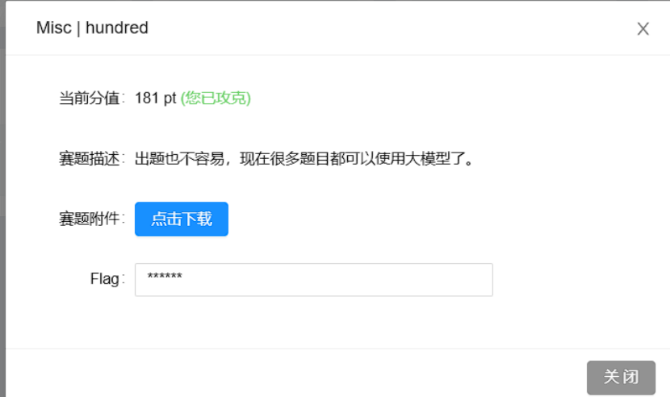

附件给了一个`attachment`，010 打开发现是个数据逆置后的 zip

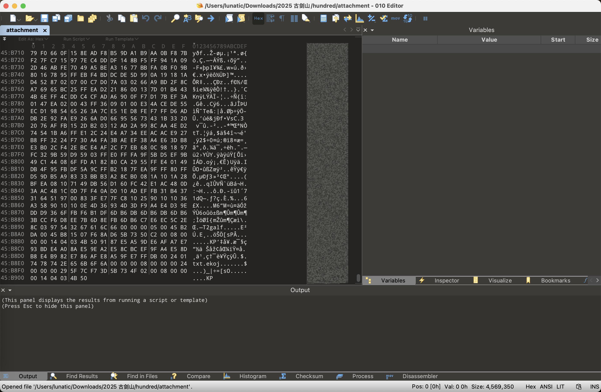

```python
with open('attachment','rb') as f:
    data = f.read()[::-1]

with open('1.zip','wb') as f:
    f.write(data)
```

利用以上脚本还原后解压，可以得到`joke.txt`还有`flag2`

`joke.txt` 中的内容如下：

```
知识点不够，增加体积来凑
```

010 打开 flag2，发现又是个数据逆置后的 zip

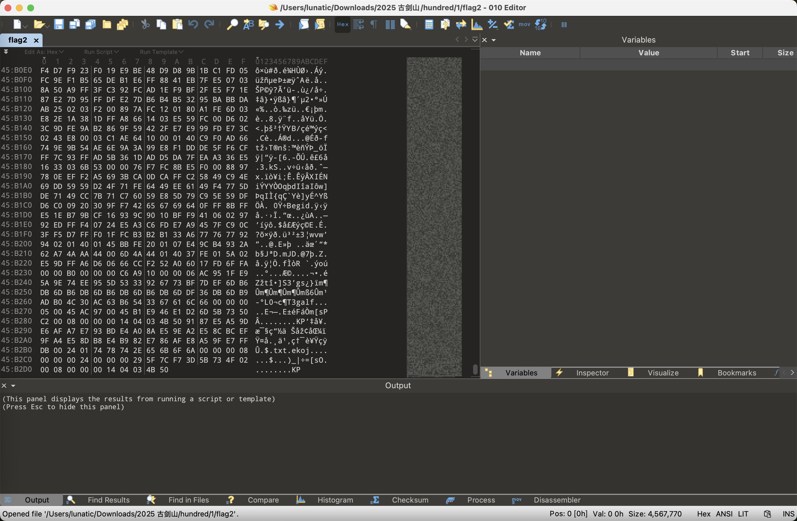

用之前的脚本恢复后发现里面还是个数据逆置的 zip，猜测是套娃

因此我们写个脚本解套即可

```python
import os
import zipfile

def reverse_bytes_file(input_file, output_file):
    with open(input_file, "rb") as f:
        data = f.read()
    reversed_data = data[::-1]
    with open(output_file, "wb") as f:
        f.write(reversed_data)
    print(f"[+] 逆序完成: {output_file}")

def try_unzip(zip_path, extract_dir):
    try:
        with zipfile.ZipFile(zip_path, 'r') as zip_ref:
            zip_ref.extractall(extract_dir)
        print(f"[+] 解压成功: {zip_path}")
        return True
    except Exception:
        print(f"[!] 解压失败: {zip_path}")
        return False

def process_layer(start_file):
    current_file = start_file
    layer = 2

    while True:
        reversed_file = f"layer{layer}_restored.zip"
        extract_dir = f"layer{layer}_unzipped"
        reverse_bytes_file(current_file, reversed_file)
        ok = try_unzip(reversed_file, extract_dir)
        if not ok:
            print("[!] 无法继续解压，可能不是逆序压缩包。")
            break
        next_files = os.listdir(extract_dir)
        print(f"[+] 解压内容: {next_files}")
        next_file = None
        for f in next_files:
            if 'flag' in f:
                next_file = os.path.join(extract_dir, f)
                break

        if not next_file:
            print("[+] 没找到下一级需要逆序的 flag 文件，任务结束。")
            break

        print(f"[+] 下一层文件: {next_file}")
        current_file = next_file
        layer += 1


if __name__ == "__main__":
    process_layer("flag2")
```

发现一共套了 99 层，解套后可以得到`hint.txt`和`enc.txt`

`hint.txt`中的内容如下：

```
digits lowercase lowercase lowercase lowercase lowercase uppercase uppercase !uppercase uppercase I_am_here lowercase digits digits uppercase !digits !digits !digits !digits !digits 
```

`enc.txt`中的内容如下：

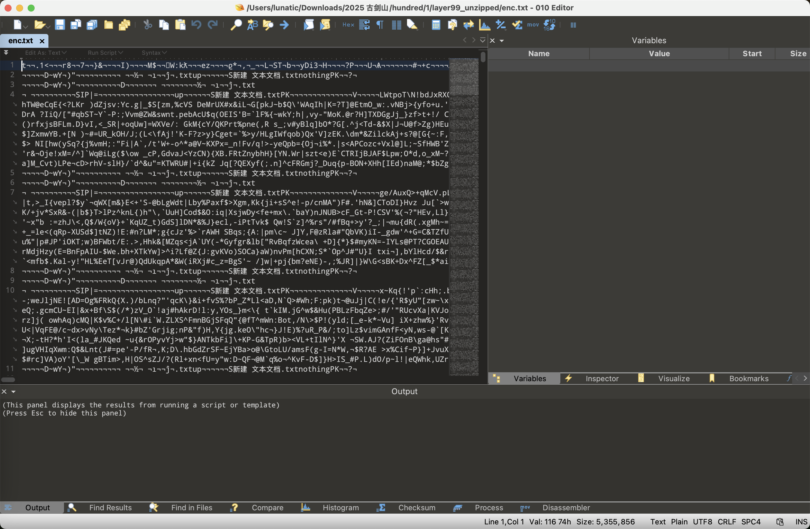

猜测是需要我们根据 `hint.txt` 中规定的格式去 `enc.txt` 中匹配指定的内容

其中 `I_am_here` 代表的应该就是我们要获取的 flag

因此写个脚本匹配一下即可

```python
import re

def extract_matching_strings(filename):
    pattern = (
        r'\d'                    # digits
        r'[a-z]{5}'              # lowercase lowercase lowercase lowercase lowercase
        r'[A-Z]{2}'              # uppercase uppercase
        r'[^A-Z]'                # !uppercase
        r'[A-Z]'                 # uppercase
        r'([a-zA-Z0-9_]+)'       # I_am_here（flag - 任意字母、数字、下划线组成的字符串）
        r'[a-z]'                 # lowercase
        r'\d{2}'                 # digits digits
        r'[A-Z]'                 # uppercase
        r'[^\d]{5}'              # !digits !digits !digits !digits !digits
    )
    
    encodings = ['utf-8', 'latin-1', 'gbk', 'gb2312', 'cp1252']
    content = None
    
    for encoding in encodings:
        try:
            with open(filename, 'r', encoding=encoding) as f:
                content = f.read()
            print(f"使用编码: {encoding}")
            break
        except:
            continue
    
    if content is None:
        print("无法用任何编码方式读取文件")
        return []
    
    # 查找所有匹配
    matches = re.findall(pattern, content)
    print(matches)
    res = ''.join(matches)
    print(res)
        
    return matches

if __name__ == "__main__":
    results = extract_matching_strings('enc.txt')
    # 使用编码: latin-1
    # ['T', 'V', 'p', 'X', 'R', '0', 'N', 'a', 'M', 'z', 'N', 'H', 'N', 'D', 'J', 'H', 'R', '0', '9', 'K', 'V', 'k', 'h', 'F', 'W', 'V', 'R', 'N', 'T', 'l', 'R', 'D', 'T', 'U', '0', 'z', 'V', '0', '1', 'Z', 'V', 'E', 'J', 'N', 'R', 'l', 'J', 'X', 'Q', '1', 'l', 'K', 'V', 'U', '1', 'R', 'M', '1', 'R', 'P', 'W', 'T', 'N', 'H', 'R', '1', 'k', '0', 'V', 'E', 'V', 'Z', 'U', 'l', 'J', 'N', 'T', 'T', 'N', 'Y', 'M', 'j', '0', '9', 'P', 'Q']
    # TVpXR0NaMzNHNDJHR09KVkhFWVRNTlRDTU0zV01ZVEJNRlJXQ1lKVU1RM1RPWTNHR1k0VEVZUlJNTTNYMj09PQ
```

最后将得到的内容用 CyberChef 解码一下即可得到最后的 flag：

`flag{74c959166bc7fbaacaa4d77cf692b1c7}`

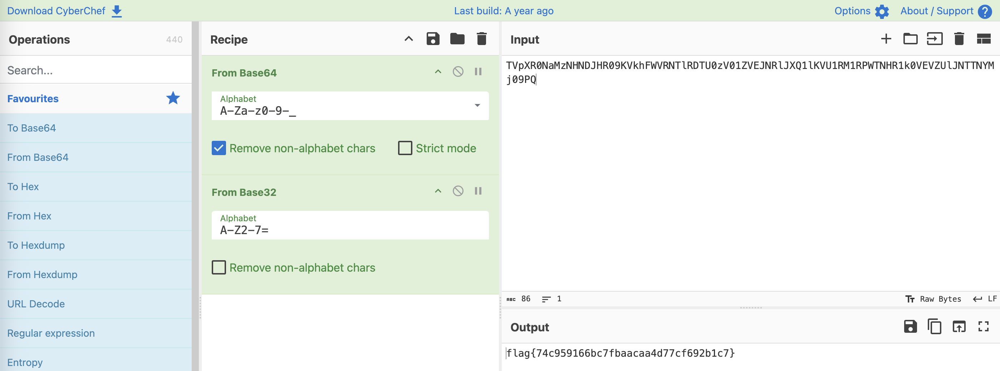

## 题目名称 secret communication

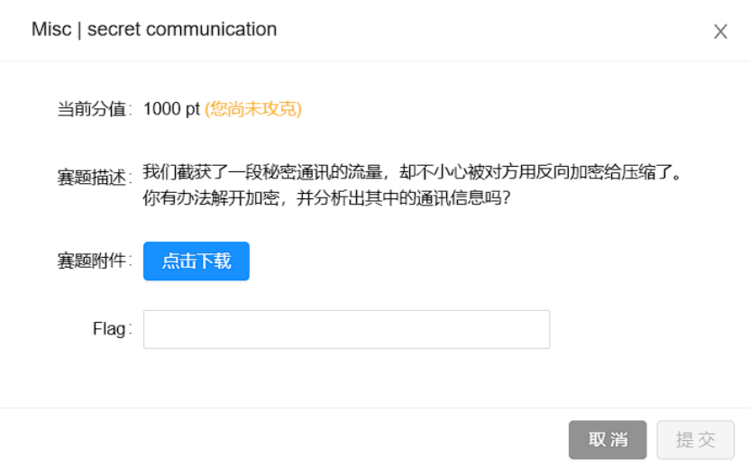


## 题目名称 ezwav

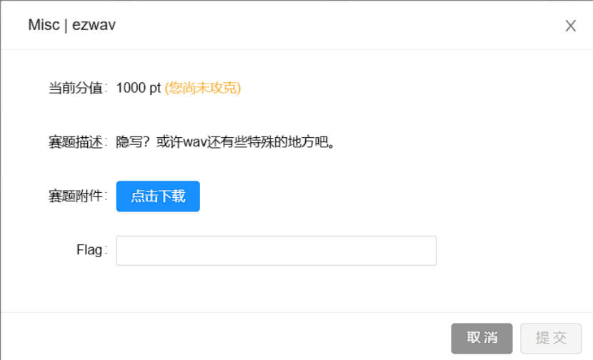

---

> 作者: [Lunatic](https://goodlunatic.github.io)  
> URL: https://goodlunatic.github.io/posts/380aa02/  

