# 2024 吾杯网络安全大赛 Misc Writeup

**2024 吾杯网络安全大赛 Misc Writeup**
<!--more-->

> 本文中涉及的具体题目附件可以进我的交流群获取，进群详见 [About](https://goodlunatic.github.io/about/)

## 题目名称 Sign

附件给了一个TXT，内容如下：

> 57754375707B64663335376434372D333163622D343261382D616130632D3634333036333464646634617D

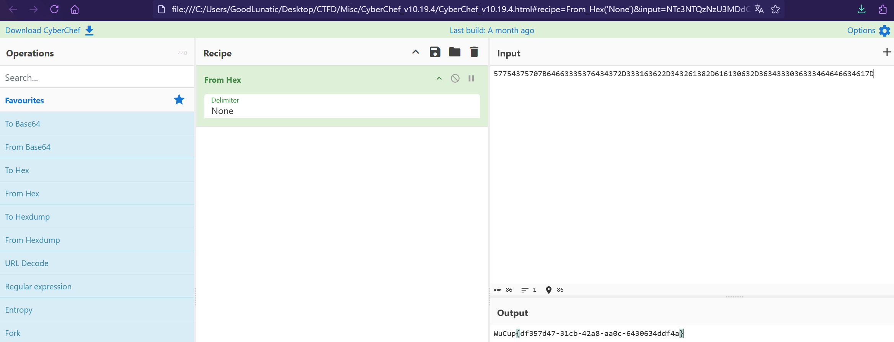

直接CyberChef解hex即可得到flag：`WuCup{df357d47-31cb-42a8-aa0c-6430634ddf4a}`

## 题目名称 原神启动！

解压附件得到一张PNG图片和一个加密的压缩包

PNG图片存在LSB隐写，用StegSolve提取一下可以得到

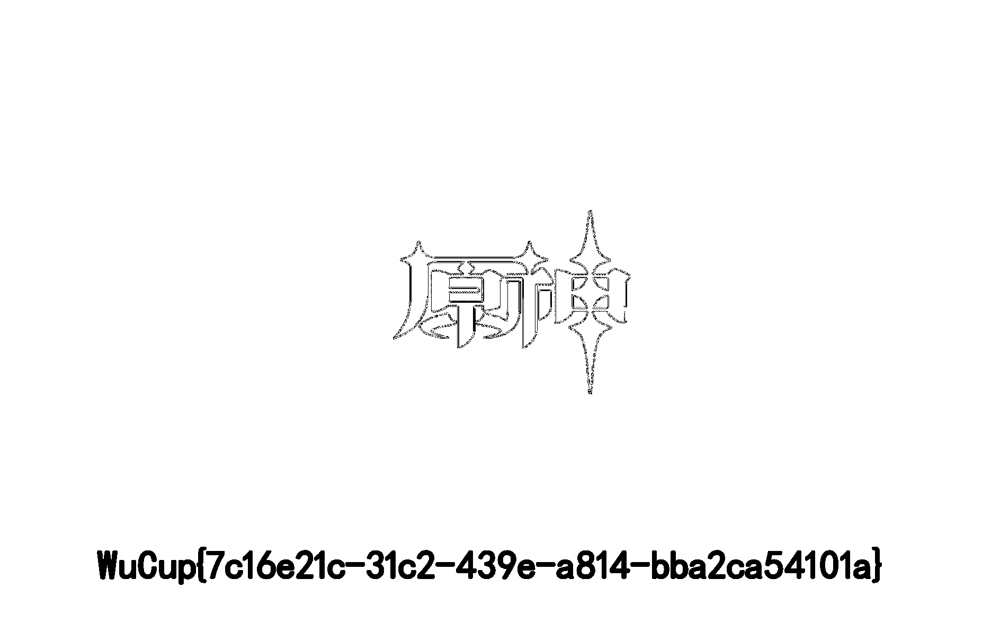

WuCup{7c16e21c-31c2-439e-a814-bba2ca54101a}作为密码解压压缩包可以得到一个docx文件

改后缀为zip然后解压，可以得到一个加密的img.zip压缩包

然后\word\media路径下还是有一张PNG图片，存在LSB隐写，提取一下可以得到

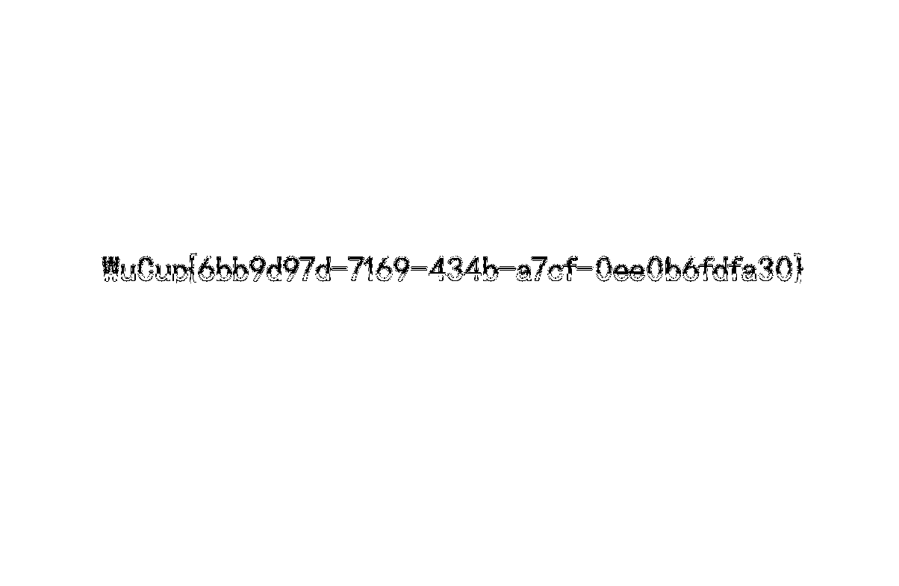

然后可以解压img.zip，得到一个text.zip，这个压缩包的解压密码在word中

需要把上面那张白色图片移开，然后把字体改成红色才能看到

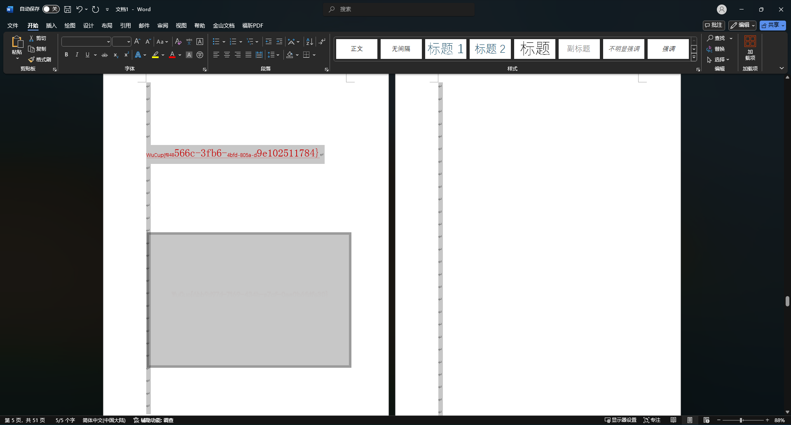

最后使用得到的密码解压text.zip即可得到flag：`WuCup{0e49b776-b732-4242-b91c-8c513a1f12ce}`

## 题目名称 太极

本题的题面如下：

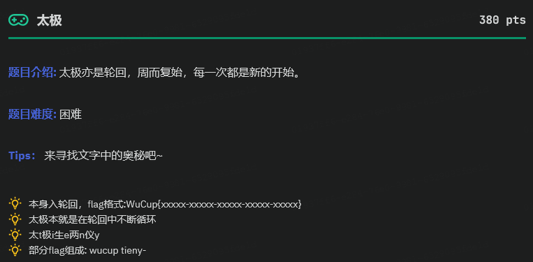

题目附件给了一个TXT文件，内容如下：

> 太极生两仪-两仪生四象-四象生八卦-八卦定吉凶-吉凶生大业

也是看了四个Hint后才理解题目的意思，就是依次取每个汉字的拼音的1-5位，超出就取模一下拼音长度

可以直接写个脚本生成一下flag：`WuCup{tieny-lieig-sieau-bunig-jieay}`
```python
data = "tai ji sheng liang yi liang yi sheng si xiang si xiang sheng ba gua ba gua ding ji xiong ji xiong sheng da ye".split()

cnt = 1
res = []
tmp = ''
for item in data:
    lenth = len(item)
    tmp += item[(cnt-1) % lenth]
    if cnt == 5:
        res.append(tmp)
        tmp = '' 
        cnt = 1
    else:
        cnt += 1

flag = "WuCup{" + "-".join(res) + '}'
print(flag)

```

> 碎碎念：不知道出题人出这种脑洞题的意图在哪，题目描述都不清晰，没有Hint是真的难以理解，有点难评只能说。。

## 题目名称 旋转木马

题目附件给了两个压缩包，解压后得到flag1和flag2两个文件

010打开发现都是一大串base64，结合题目名称，猜测就是base64循环解码

因此，我们写个脚本合并两个文件，然后base64循环解码可以得到一串十六进制

最后十六进制转字符串即可得到最后的flag：`WuCup{1eb900c0-a786-42fa-942c-f9a7c21dfedf}`

完整解题脚本如下：

```python
from base64 import *

def merge_data():
    with open("flag1","r") as f1:
        data1 = f1.read()
    with open("flag2","r") as f2:
        data2 = f2.read()
    res = data1 + data2
    with open("flag","w") as f:
        f.write(res)
    print(f"[+] 文件合并成功")

def solve():
    with open("flag","r") as f:
        data = f.read()
    cnt = 1
    while True:
        if len(data) % 4 !=0 :
            data += "=" * (4 - len(data) % 4)
        try:
            res = b64decode(data).decode()
            print(f"[+] 第{cnt}次base64解码成功 ===>")
            cnt += 1
        except:
            print("[-] base64循环解码结束")
            break
        data = res
        
    return data
            
if __name__ == "__main__":
    merge_data()
    data = solve()
    idx = data.find("=")
    flag = bytes.fromhex(data[:idx])
    print(flag)
    # b'WuCup{1eb900c0-a786-42fa-942c-f9a7c21dfedf}'
```

## 题目名称 音文

下载附件得到一个AT.wav，用010打开发现末尾藏了一个压缩包

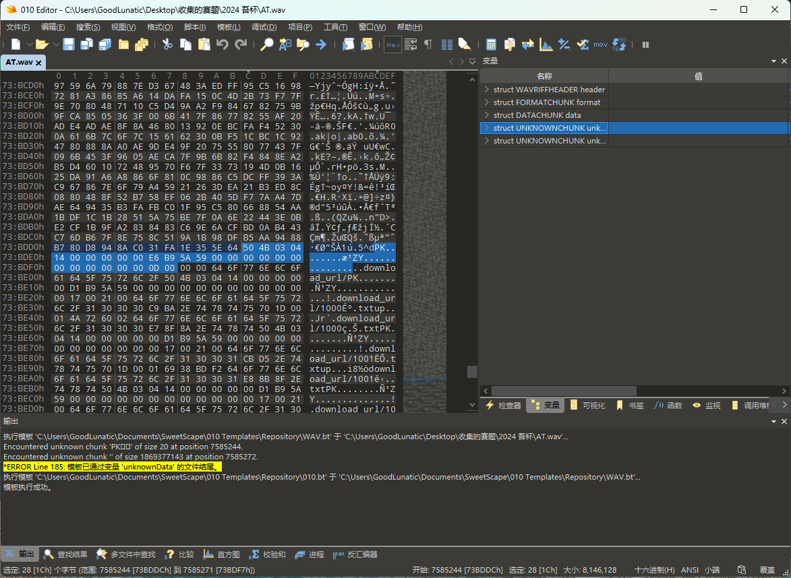

手动给它提取出来然后打开，发现里面有很多数字+汉字的TXT文件，猜测需要根据数字的顺序把汉字提取出来

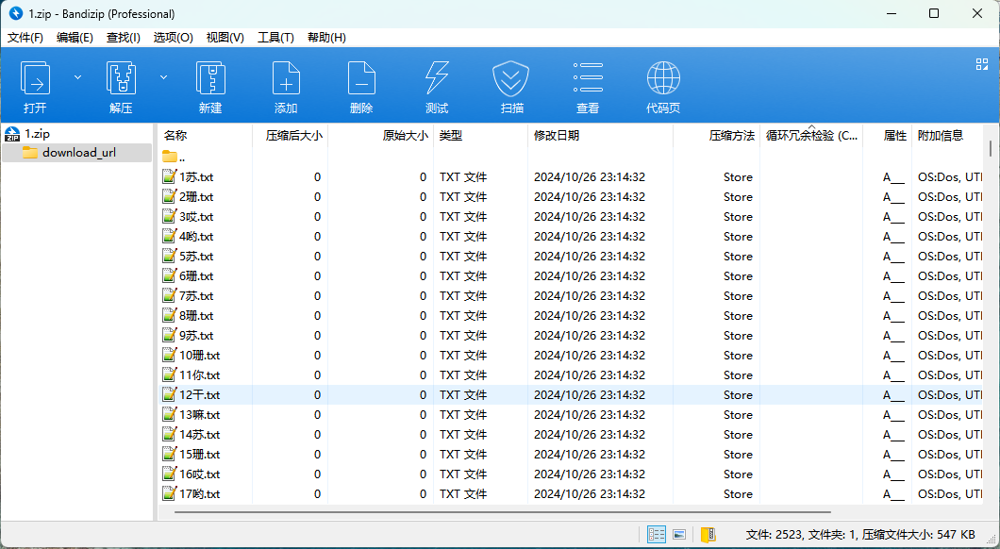

因此编写以下脚本把汉字提取出来

```python
import zipfile 
import re

def extract_num(filename):
    # group(0)表示整个匹配到的字符串，group(1)表示正则表达式中第一个捕获组
    return int(re.search(r'(\d+)', filename).group())


def extract_data():
    res = ''
    filelist = []
    filename = "1.zip"
    with zipfile.ZipFile(filename, 'r') as zip_ref:
        file_list = [name.encode('cp437').decode('gbk') for name in zip_ref.namelist()]
        for item in file_list:
            tmp = re.sub(r"download_url\/","",item)
            tmp = re.sub(r".txt","",tmp)
            if tmp != "":
                filelist.append(tmp)
    sorted_list = sorted(filelist, key=extract_num)
    # print(res)
    for item in sorted_list:
        chars = re.findall(r"[\u4e00-\u9fa5]",item)[0]
        res += chars
    print(res)

if __name__ == "__main__":
    extract_data()
```

运行脚本后，可以得到如下内容

> 苏珊哎哟苏珊苏珊苏珊你干嘛苏珊哎哟哎哟哎哟哎哟你干嘛哎哟哎哟哎哟哎哟哎哟你干嘛苏珊苏珊苏珊苏珊哎哟你干嘛哎哟苏珊哎哟苏珊哎哟苏珊你干嘛苏珊哎哟苏珊苏珊苏珊你干嘛苏珊哎哟哎哟哎哟哎哟你干嘛苏珊哎哟哎哟哎哟哎哟你干嘛哎哟苏珊苏珊苏珊苏珊你干嘛哎哟苏珊哎哟苏珊哎哟苏珊你干嘛苏珊哎哟苏珊苏珊苏珊你干嘛苏珊哎哟哎哟哎哟哎哟你干嘛苏珊哎哟哎哟哎哟哎哟你干嘛哎哟苏珊苏珊苏珊苏珊你干嘛哎哟苏珊哎哟苏珊哎哟苏珊你干嘛苏珊哎哟苏珊苏珊苏珊你干嘛苏珊哎哟哎哟哎哟哎哟你干嘛苏珊哎哟哎哟哎哟哎哟你干嘛苏珊苏珊哎哟哎哟哎哟你干嘛哎哟苏珊哎哟苏珊哎哟苏珊你干嘛苏珊哎哟苏珊苏珊苏珊你干嘛苏珊哎哟哎哟哎哟哎哟你干嘛苏珊哎哟哎哟哎哟哎哟你干嘛苏珊苏珊苏珊苏珊苏珊你干嘛哎哟苏珊哎哟苏珊哎哟苏珊你干嘛苏珊哎哟苏珊苏珊苏珊你干嘛苏珊苏珊苏珊苏珊苏珊你干嘛哎哟哎哟哎哟苏珊苏珊你干嘛哎哟苏珊哎哟苏珊哎哟苏珊你干嘛苏珊哎哟苏珊苏珊苏珊你干嘛苏珊苏珊苏珊苏珊哎哟你干嘛哎哟哎哟苏珊苏珊苏珊你干嘛哎哟苏珊哎哟苏珊哎哟苏珊你干嘛苏珊哎哟苏珊苏珊苏珊你干嘛苏珊苏珊苏珊苏珊哎哟你干嘛哎哟哎哟苏珊苏珊苏珊你干嘛哎哟苏珊哎哟苏珊哎哟苏珊你干嘛苏珊哎哟苏珊苏珊苏珊你干嘛苏珊哎哟哎哟哎哟哎哟你干嘛苏珊哎哟哎哟哎哟哎哟你干嘛苏珊苏珊哎哟哎哟哎哟你干嘛哎哟苏珊哎哟苏珊哎哟苏珊你干嘛苏珊哎哟苏珊苏珊苏珊你干嘛哎哟哎哟哎哟哎哟苏珊你干嘛哎哟哎哟苏珊苏珊苏珊你干嘛哎哟苏珊哎哟苏珊哎哟苏珊你干嘛苏珊哎哟苏珊苏珊苏珊你干嘛苏珊哎哟哎哟哎哟哎哟你干嘛苏珊哎哟哎哟哎哟哎哟你干嘛哎哟哎哟哎哟哎哟哎哟你干嘛哎哟苏珊哎哟苏珊哎哟苏珊你干嘛苏珊哎哟苏珊苏珊苏珊你干嘛苏珊苏珊苏珊苏珊哎哟你干嘛哎哟苏珊苏珊苏珊苏珊你干嘛哎哟苏珊哎哟苏珊哎哟苏珊你干嘛苏珊哎哟苏珊苏珊苏珊你干嘛苏珊哎哟哎哟哎哟哎哟你干嘛苏珊哎哟哎哟哎哟哎哟你干嘛哎哟哎哟哎哟哎哟苏珊你干嘛哎哟苏珊哎哟苏珊哎哟苏珊你干嘛苏珊哎哟苏珊苏珊苏珊你干嘛苏珊哎哟哎哟哎哟哎哟你干嘛苏珊哎哟哎哟哎哟哎哟你干嘛哎哟哎哟苏珊苏珊苏珊你干嘛哎哟苏珊哎哟苏珊哎哟苏珊你干嘛苏珊哎哟苏珊苏珊苏珊你干嘛哎哟哎哟哎哟哎哟苏珊你干嘛哎哟哎哟哎哟哎哟苏珊你干嘛哎哟苏珊哎哟苏珊哎哟苏珊你干嘛苏珊哎哟苏珊苏珊苏珊你干嘛苏珊哎哟哎哟哎哟哎哟你干嘛苏珊哎哟哎哟哎哟哎哟你干嘛哎哟哎哟苏珊苏珊苏珊你干嘛哎哟苏珊哎哟苏珊哎哟苏珊你干嘛苏珊哎哟苏珊苏珊苏珊你干嘛苏珊哎哟哎哟哎哟哎哟你干嘛苏珊哎哟哎哟哎哟哎哟你干嘛苏珊苏珊哎哟哎哟哎哟你干嘛哎哟苏珊哎哟苏珊哎哟苏珊你干嘛苏珊哎哟苏珊苏珊苏珊你干嘛苏珊苏珊苏珊苏珊哎哟你干嘛哎哟苏珊苏珊苏珊苏珊你干嘛哎哟苏珊哎哟苏珊哎哟苏珊你干嘛苏珊哎哟苏珊苏珊苏珊你干嘛哎哟哎哟哎哟哎哟苏珊你干嘛哎哟哎哟哎哟哎哟苏珊你干嘛哎哟苏珊哎哟苏珊哎哟苏珊你干嘛苏珊哎哟苏珊苏珊苏珊你干嘛苏珊哎哟哎哟哎哟哎哟你干嘛苏珊哎哟哎哟哎哟哎哟你干嘛哎哟哎哟哎哟哎哟哎哟你干嘛哎哟苏珊哎哟苏珊哎哟苏珊你干嘛苏珊哎哟苏珊苏珊苏珊你干嘛苏珊苏珊苏珊苏珊哎哟你干嘛哎哟哎哟苏珊苏珊苏珊你干嘛哎哟苏珊哎哟苏珊哎哟苏珊你干嘛苏珊哎哟苏珊苏珊苏珊你干嘛哎哟哎哟哎哟哎哟苏珊你干嘛哎哟哎哟哎哟哎哟苏珊你干嘛哎哟苏珊哎哟苏珊哎哟苏珊你干嘛苏珊哎哟苏珊苏珊苏珊你干嘛苏珊哎哟哎哟哎哟哎哟你干嘛哎哟哎哟哎哟哎哟哎哟你干嘛苏珊苏珊苏珊苏珊哎哟你干嘛哎哟苏珊哎哟苏珊哎哟苏珊你干嘛苏珊哎哟苏珊苏珊苏珊你干嘛哎哟哎哟哎哟哎哟苏珊你干嘛哎哟哎哟苏珊苏珊苏珊你干嘛哎哟苏珊哎哟苏珊哎哟苏珊你干嘛苏珊哎哟苏珊苏珊苏珊你干嘛苏珊哎哟哎哟哎哟哎哟你干嘛哎哟哎哟哎哟哎哟哎哟你干嘛哎哟哎哟哎哟苏珊苏珊你干嘛哎哟苏珊哎哟苏珊哎哟苏珊你干嘛苏珊哎哟苏珊苏珊苏珊你干嘛苏珊哎哟哎哟哎哟哎哟你干嘛哎哟哎哟哎哟哎哟哎哟你干嘛哎哟哎哟哎哟苏珊苏珊你干嘛哎哟苏珊哎哟苏珊哎哟苏珊你干嘛苏珊哎哟苏珊苏珊苏珊你干嘛苏珊哎哟哎哟哎哟哎哟你干嘛哎哟哎哟哎哟哎哟哎哟你干嘛苏珊哎哟哎哟哎哟哎哟你干嘛哎哟苏珊哎哟苏珊哎哟苏珊你干嘛苏珊哎哟苏珊苏珊苏珊你干嘛苏珊哎哟哎哟哎哟哎哟你干嘛苏珊哎哟哎哟哎哟哎哟你干嘛哎哟哎哟哎哟哎哟哎哟你干嘛哎哟苏珊哎哟苏珊哎哟苏珊你干嘛苏珊哎哟苏珊苏珊苏珊你干嘛苏珊哎哟哎哟哎哟哎哟你干嘛哎哟哎哟哎哟哎哟哎哟你干嘛苏珊苏珊苏珊哎哟哎哟你干嘛哎哟苏珊哎哟苏珊哎哟苏珊你干嘛苏珊哎哟苏珊苏珊苏珊你干嘛苏珊哎哟哎哟哎哟哎哟你干嘛哎哟哎哟哎哟哎哟哎哟你干嘛苏珊哎哟哎哟哎哟哎哟你干嘛哎哟苏珊哎哟苏珊哎哟苏珊你干嘛苏珊哎哟苏珊苏珊苏珊你干嘛苏珊苏珊苏珊苏珊哎哟你干嘛哎哟哎哟苏珊苏珊苏珊你干嘛哎哟苏珊哎哟苏珊哎哟苏珊你干嘛苏珊哎哟苏珊苏珊苏珊你干嘛哎哟苏珊苏珊苏珊苏珊你干嘛苏珊苏珊苏珊苏珊苏珊你干嘛哎哟苏珊哎哟苏珊哎哟苏珊你干嘛苏珊哎哟苏珊苏珊苏珊你干嘛哎哟哎哟哎哟苏珊苏珊你干嘛苏珊苏珊苏珊苏珊哎哟你干嘛哎哟苏珊哎哟苏珊哎哟苏珊你干嘛苏珊哎哟苏珊苏珊苏珊你干嘛哎哟哎哟哎哟哎哟苏珊你干嘛苏珊苏珊苏珊苏珊苏珊你干嘛哎哟苏珊哎哟苏珊哎哟苏珊你干嘛苏珊哎哟苏珊苏珊苏珊你干嘛苏珊苏珊苏珊苏珊哎哟你干嘛哎哟哎哟哎哟哎哟苏珊你干嘛哎哟苏珊哎哟苏珊哎哟苏珊你干嘛苏珊哎哟苏珊苏珊苏珊你干嘛苏珊苏珊苏珊苏珊哎哟你干嘛哎哟苏珊苏珊苏珊苏珊你干嘛哎哟苏珊哎哟苏珊哎哟苏珊你干嘛苏珊哎哟苏珊苏珊苏珊你干嘛苏珊苏珊苏珊苏珊哎哟你干嘛哎哟哎哟哎哟苏珊苏珊你干嘛哎哟苏珊哎哟苏珊哎哟苏珊你干嘛苏珊哎哟苏珊苏珊苏珊你干嘛苏珊苏珊苏珊苏珊哎哟你干嘛哎哟苏珊苏珊苏珊苏珊你干嘛哎哟苏珊哎哟苏珊哎哟苏珊你干嘛苏珊哎哟苏珊苏珊苏珊你干嘛哎哟哎哟哎哟哎哟苏珊你干嘛哎哟哎哟苏珊苏珊苏珊你干嘛哎哟苏珊哎哟苏珊哎哟苏珊你干嘛苏珊哎哟苏珊苏珊苏珊你干嘛苏珊哎哟哎哟哎哟哎哟你干嘛苏珊哎哟哎哟哎哟哎哟你干嘛苏珊苏珊哎哟哎哟哎哟你干嘛哎哟苏珊哎哟苏珊哎哟苏珊你干嘛苏珊哎哟苏珊苏珊苏珊你干嘛苏珊哎哟哎哟哎哟哎哟你干嘛哎哟哎哟哎哟哎哟哎哟你干嘛哎哟哎哟苏珊苏珊苏珊你干嘛哎哟苏珊哎哟苏珊哎哟苏珊你干嘛苏珊哎哟苏珊苏珊苏珊你干嘛苏珊哎哟哎哟哎哟哎哟你干嘛哎哟哎哟哎哟哎哟哎哟

一共三种字符，因此猜测是摩斯电码，直接使用CyberChef解码可以得到如下内容

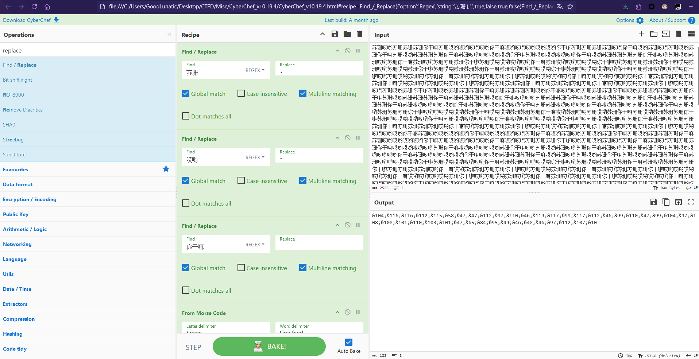

把干扰符号去除，然后转ASCII码可以得到一个下载链接

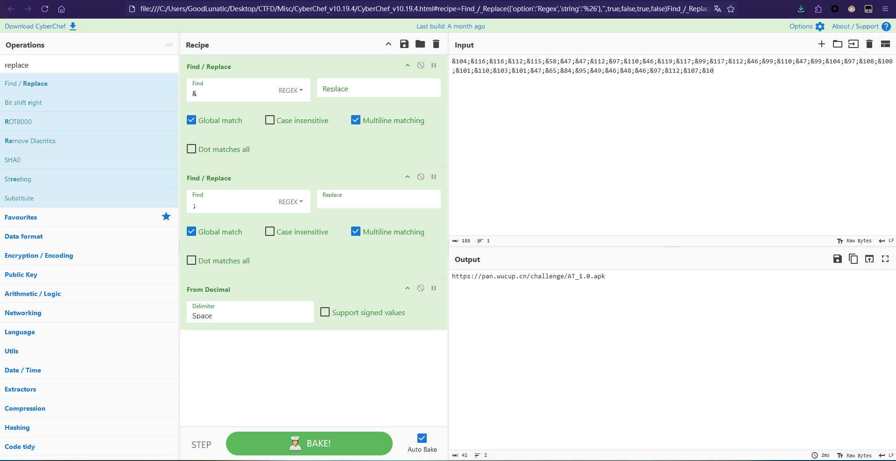

访问下载链接，可以下载得到一个APK文件

用安卓手机安装并打开，可以看到如下界面，提示我们需要输入文件的路径

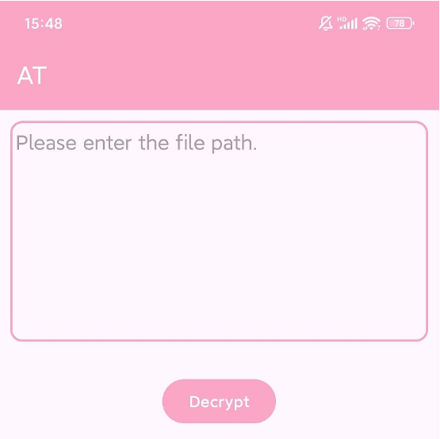

把之前删除了末尾压缩包后的wav文件传到手机上

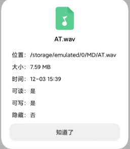

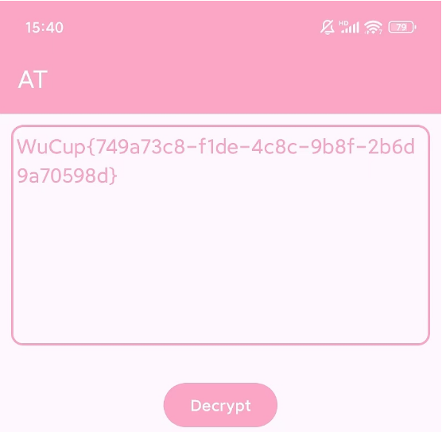

最后输入音频文件的路径，点击解密即可得到flag：`WuCup{749a73c8-f1de-4c8c-9b8f-2b6d9a70598d}`

---

> Author: [Lunatic](https://goodlunatic.github.io)  
> URL: https://goodlunatic.github.io/posts/3ab0c1d/  

