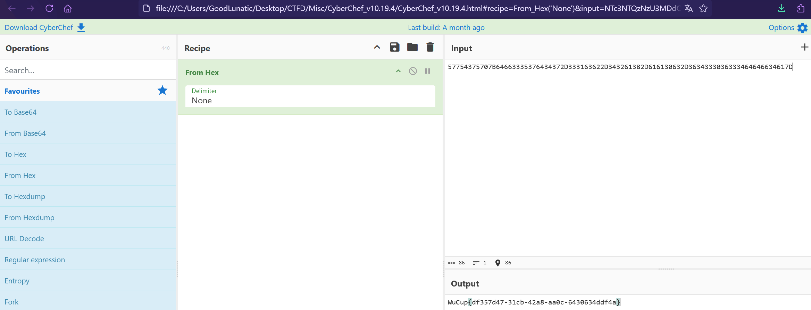
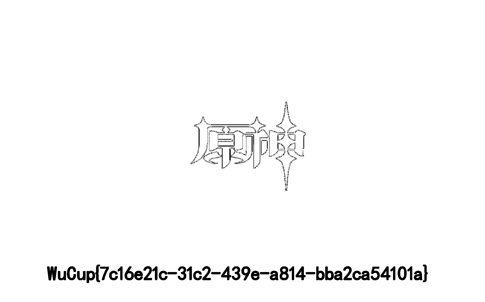
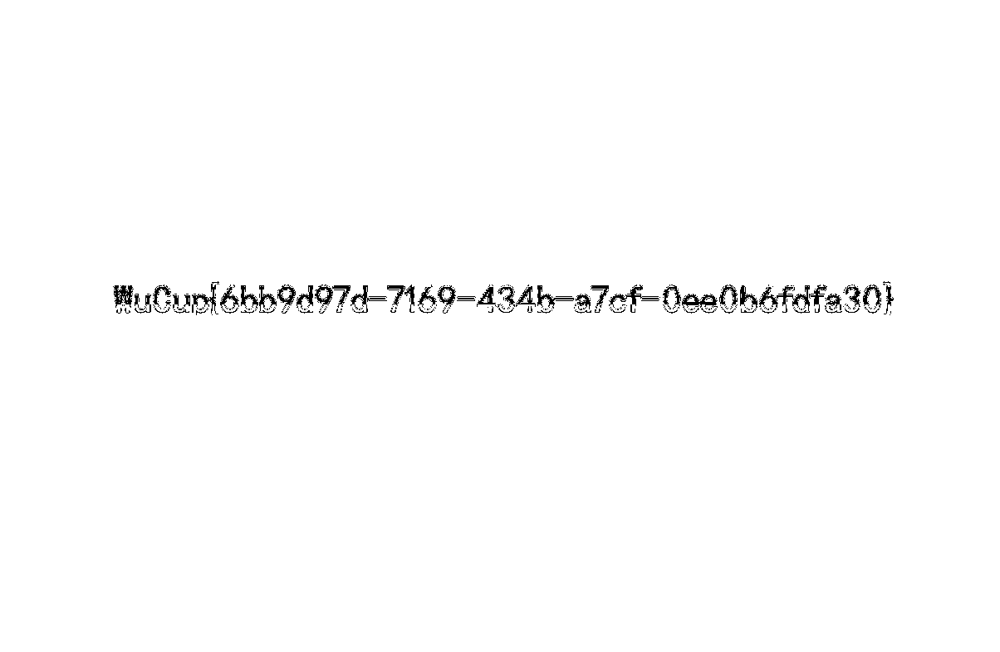
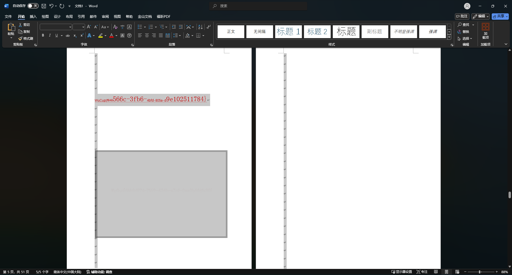

# 2024 吾杯网络安全大赛 Misc Writeup

**2024 吾杯网络安全大赛 Misc Writeup**
&lt;!--more--&gt;
## 题目名称 Sign

附件给了一个TXT，内容如下：

&gt; 57754375707B64663335376434372D333163622D343261382D616130632D3634333036333464646634617D

直接CyberChef解hex即可得到flag：`WuCup{df357d47-31cb-42a8-aa0c-6430634ddf4a}`

## 题目名称 原神启动！

解压附件得到一张PNG图片和一个加密的压缩包

PNG图片存在LSB隐写，用StegSolve提取一下可以得到

WuCup{7c16e21c-31c2-439e-a814-bba2ca54101a}作为密码解压压缩包可以得到一个docx文件

改后缀为zip然后解压，可以得到一个加密的img.zip压缩包

然后\word\media路径下还是有一张PNG图片，存在LSB隐写，提取一下可以得到

然后可以解压img.zip，得到一个text.zip，这个压缩包的解压密码在word中

需要把上面那张白色图片移开，然后把字体改成红色才能看到

最后使用得到的密码解压text.zip即可得到flag：`WuCup{0e49b776-b732-4242-b91c-8c513a1f12ce}`

## 题目名称 太极

## 题目名称 旋转木马

## 题目名称 音文

---

> Author: [Lunatic](https://goodlunatic.github.io)  
> URL: http://localhost:1313/posts/3ab0c1d/  

