# 2022 浙江省大学生网络与信息安全竞赛 Writeup

**菜鸟第一次打省赛，浅浅混了个省三QAQ。。**
&lt;!--more--&gt;
## 初赛
### Misc
#### 题目名称 好怪哦
下载下来得到一个数据逆置的压缩包，直接用逆置脚本
```python
input = open(&#39;fuck.zip&#39;, &#39;rb&#39;)
input_all = input.read()
ss = input_all[::-1]
output = open(&#39;flag.zip&#39;, &#39;wb&#39;)
output.write(ss)
input.close()
output.close()
```

然后解压得到一个缺少png文件头的png文件，补上文件头：89 50 4e 47

打开得到一张CRC有问题的图片，直接上脚本爆破即可拿到flag

```python
import binascii
import struct
import sys

file = input(&#34;图片的地址&#34;)
fr = open(file,&#39;rb&#39;).read()
data = bytearray(fr[0x0c:0x1d])
crc32key = eval(&#39;0x&#39;&#43;str(binascii.b2a_hex(fr[0x1d:0x21]))[2:-1])
#原来的代码: crc32key = eval(str(fr[29:33]).replace(&#39;\\x&#39;,&#39;&#39;).replace(&#34;b&#39;&#34;,&#39;0x&#39;).replace(&#34;&#39;&#34;,&#39;&#39;))
n = 4095
for w in range(n):
    width = bytearray(struct.pack(&#39;&gt;i&#39;, w))
    for h in range(n):
        height = bytearray(struct.pack(&#39;&gt;i&#39;, h))
        for x in range(4):
            data[x&#43;4] = width[x]
            data[x&#43;8] = height[x]
        crc32result = binascii.crc32(data) &amp; 0xffffffff
        if crc32result == crc32key:
            print(width,height)
            newpic = bytearray(fr)
            for x in range(4):
                newpic[x&#43;16] = width[x]
                newpic[x&#43;20] = height[x]
            fw = open(file&#43;&#39;.png&#39;,&#39;wb&#39;)
            fw.write(newpic)
            fw.close
            sys.exit()
```

#### 题目名称 神奇的棋盘
下载解压得到一张棋盘图片和一段棋盘加密后的密码：


这段密码是古典密码中的Polybius密码，直接去除逗号拉入随波逐流解密

得到密文：agaxxdaggvggvdvadavxdgadvgdvaaddddfxafafdgdvxxdggdggdxddfddxvgxadgvdfxvvaaddxdxxaddvgggxgxxxxgxxggxgdvvvgggagaaaagaaggagdddagagggaggagagaaavaaaxgxgggxggxgxgxxxv

然后用zsteg跑那个board的图片，得到一串base32，解密得到位移key：

JRQXG5CLMV4XWWLVONQXS6LEON6Q====

LastKey{Yusayyds}

然后用CaptfEncode解ADFGVX密码：

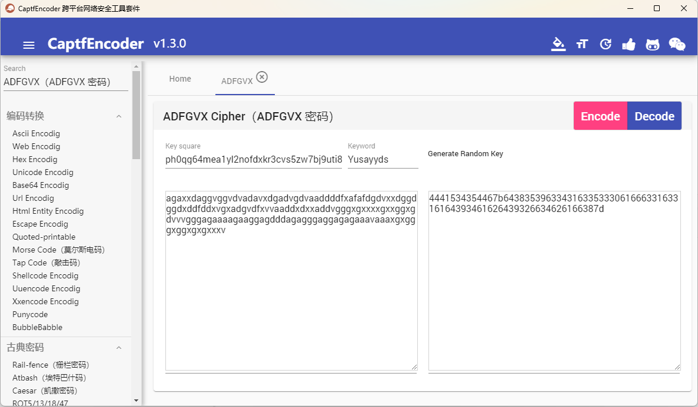

得到一串十六进制字符串 ，最后直接十六进制转字符串得到flag

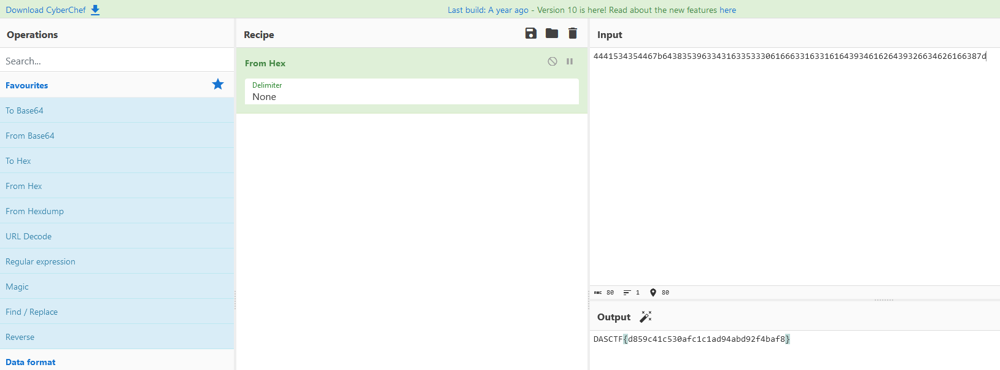

DASCTF{d859c41c530afc1c1ad94abd92f4baf8}

#### 题目名称 segmentFlow

下载后得到一个压缩包，里面有一个流量文件和七个4字节的文本文件

使用Github上的CRC爆破脚本进行爆破每个文本文件的CRC值，得到解压密码

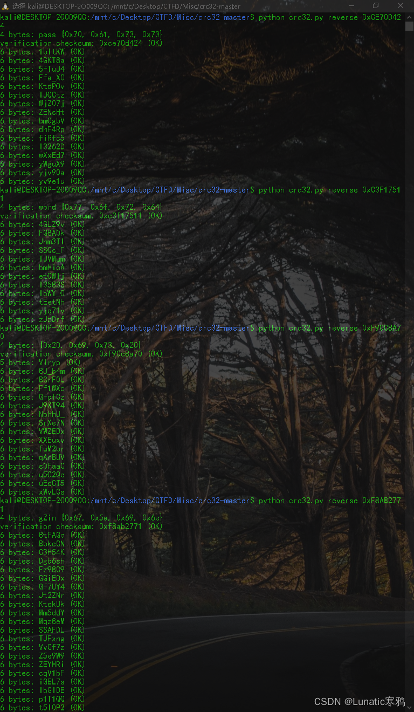

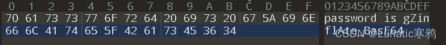

用tshark导出数据

tshark -r segmentFlow.pcapng -Y &#34;http.request&#34; -T fields -e http.file_data &gt; data1.txt

```python
f = open(&#39;data.txt&#39;,&#39;r&#39;)
data=f.read()
data=data.split(&#39;&amp;sa066b32bfb3e7=&#39;)
#print(data.split(&#39;&amp;sa066b32bfb3e7=&#39;))
#以这个字符串为分隔符，后面八位就是我们要的数据
for i in range(1,len(data)):
    #从第一个到最后一个列表
    print(data[i][:8],end=&#39;&#39;)
    #一个列表元素的前八位
```

打开压缩包即可得到flag

### Reverse
#### 题目名称 ManyCheck
三层验证，前两层拉入ida看或者直接用计算器算出结果：77、55、49

第三层根据ida里的算法，直接写个for循环就出来了：1198089844

```python
#include &lt;bits/stdc&#43;&#43;.h&gt;
using namespace std;
​
int main()
{
    for (int v1 = 0; v1 &lt;= 1718896489; v1&#43;&#43;)
    {
        int v2 = 16;
        int v3 = (v1 &gt;&gt; (32 - v2)) | (v1 &lt;&lt; v2);
        if (v3 == 1718896489)
            printf(&#34;%d&#34;, v1);
    }
    return 0;
}
```

### Web
#### 题目名称 nisc_easyweb

扫出 /api/record/文件 里面有个发送get请求功能的php,利用hackbar发送get请求即可得到flag

#### 题目名称 nisc_学校门户网站

不知道是不是非预期，直接注册然后登录即可得到flag

#### 题目名称 吃豆人吃豆魂

进入web开发者工具，找到game的源码，在index.js中有对生命值和分数的定义，修改分数为10000000，再次请求页面，直接弹出flag

## 决赛
### Misc
#### 题目名称 checkin_gift
下载附件压缩包并解压，得到一张jpg图片，在010中打开

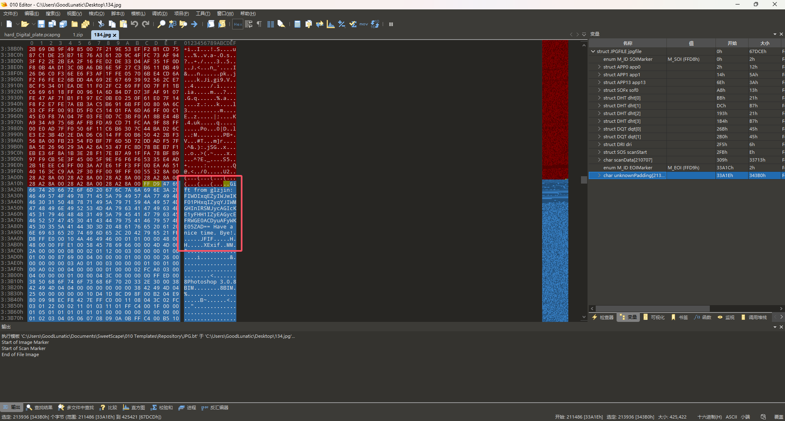

发现图片末尾有一段base64编码，解码即可得到flag：`DASCTF{e0155eb8a30c9c3cb0e56708da87bcc5}`

#### 题目名称 m4a
下载附件压缩包并解压，可以得到一个`m4a.m4a`文件，用VLC打开发现是一个莫斯电码的音频文件

直接使用AU打开，然后手敲出莫斯电码并解码

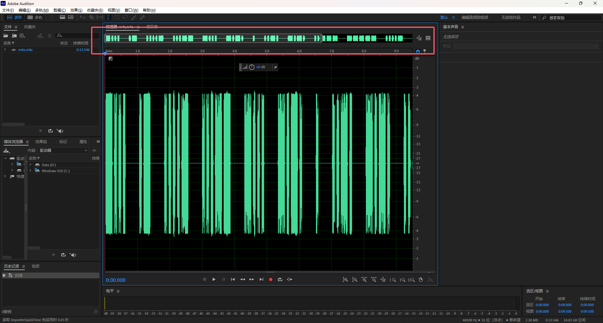

```
-... .- ....- ...-- -... -.-. . ..-. -.-. ..--- ----- ....-
```

解码莫斯可以得到：`BA43BCEFC204`

用010打开m4a文件，根据zip的文件头发现文件末尾藏了一个逆序的zip压缩包
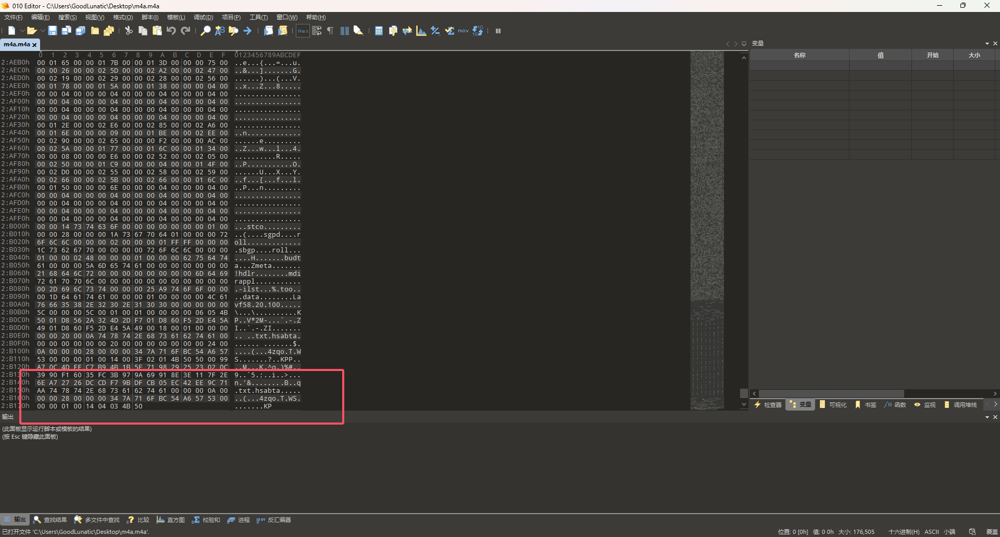

逆序一下文件，把压缩包提取出来，并使用之前得到的密码解压，可以得到`atbash.txt`，内容如下
```
(&#43;w)v&amp;LdG_FhgKhdFfhgahJfKcgcKdc_eeIJ_gFN
```
最后对密文先解码`rot47`，再`atbash`解码即可得到flag：`DASCTF{5e0f98a95f79829b7a484a54066cb08f}`

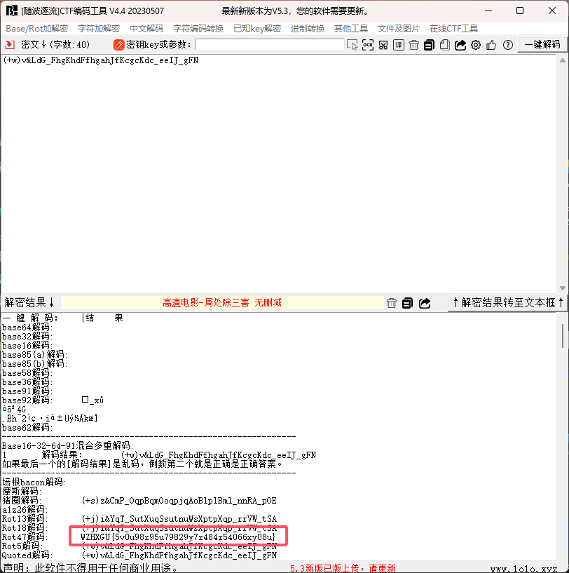

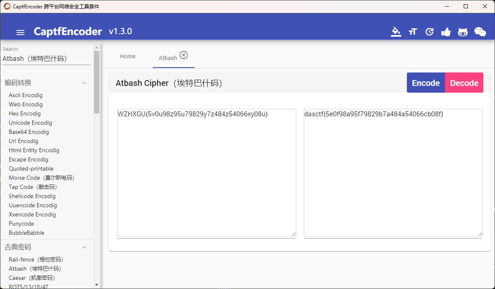


#### 题目名称 Unkn0wnData
解压附件压缩包，得到一张`flag.png`


使用`zsteg`扫一下上面这张图片

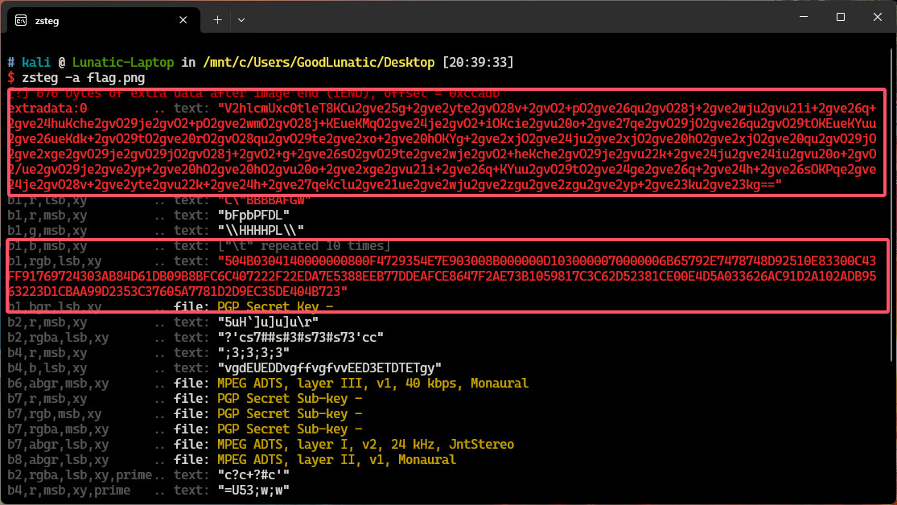

发现图片末尾藏了一段base64编码，然后LSB中也隐写了一个压缩包

解码上面那段base64可以得到一串emoji表情

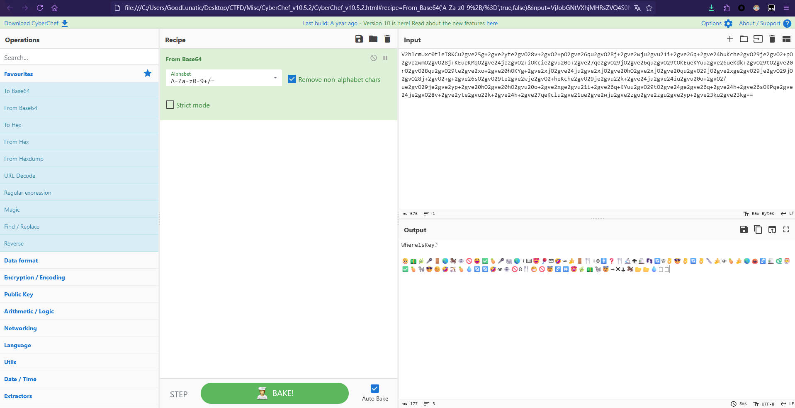

```
Where1sKey?

🙃💵🌿🎤🚪🌏🐎🥋🚫😆✅🍍🎤🐘🌏ℹ⌨😍🎈✉🤣🛩🍌🚪🍴ℹ☺🚹❓🍴🔬🌪🍵👣🔄☃👌😎👌🔄👌🔪🍌👁🍍🍌🌏🎃🚰🍵🐍🎅✅🍍🦓😎😊🤣🏹🍍💧🔄🔄🤣👁🥋🚫☺🍴😁🚫😇🚰⏩😍🌿💵🦓😇🛩✖🕹🐎📂📂💧🗒🗒
```

尝试用`zsteg`提取出隐写的数据，并用010转换为压缩包并解压

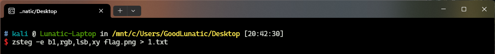

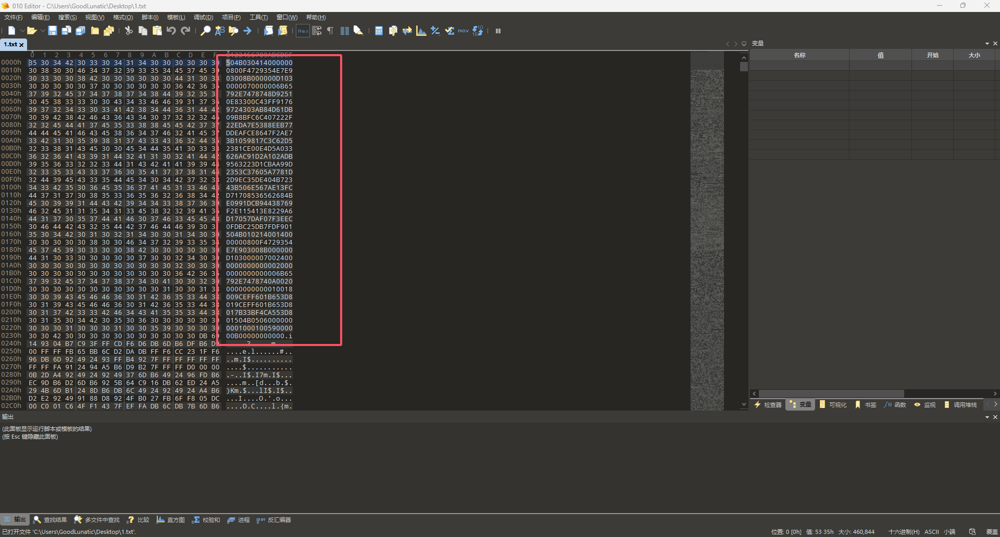

解压后可以得到`1.txt`，内容如下：
```
data:
0000100000000000
00000c0000000000
00000e0000000000
00002a0000000000
0000100000000000
0000040000000000
0000080000000000
00002a0000000000
0000160000000000
00000b0000000000
00000c0000000000
00001c0000000000
00002a0000000000
00002c0000000000
0200340000000000
00002a0000000000
0200090000000000
00000c0000000000
0000110000000000
0000070000000000
0200170000000000
00002a0000000000
0200170000000000
00000b0000000000
0000080000000000
0000120000000000
00002a0000000000
0200150000000000
0000080000000000
0000040000000000
00000f0000000000
00000a0000000000
00002a0000000000
02000e0000000000
0000080000000000
00001c0000000000
00000a0000000000
00002a0000000000
0000040000000000
0000110000000000
0000070000000000
00000f0000000000
00002a0000000000
0200100000000000
0000040000000000
00000e0000000000
0000080000000000
0000080000000000
00002a0000000000
02000c0000000000
0000170000000000
02001e0000000000
0000070000000000
00002a0000000000
```

感觉是键盘的数据，因此使用[USB流量分析](https://goodlunatic.github.io/posts/5422d65/#%E9%94%AE%E7%9B%98%E6%B5%81%E9%87%8F%E5%88%86%E6%9E%90)中的脚本进行提取
```
mik&lt;DEL&gt;mae&lt;DEL&gt;shiy&lt;DEL&gt;&lt;SPACE&gt;:&lt;DEL&gt;FindT&lt;DEL&gt;Theo&lt;DEL&gt;Realg&lt;DEL&gt;Keyg&lt;DEL&gt;andl&lt;DEL&gt;Makee&lt;DEL&gt;It!d&lt;DEL&gt;
mimashi FindTheRealKeyandMakeIt!
密码是找到真正的密钥
```
这里发现真正的key被`&lt;DEL&gt;`字符删去了，因此我们把删去的字符单独提取出来得到：`key:Toggled`

最后使用得到的密钥解一个`emoji-AES`即可得到flag：`DASCTF{ad15eecd2978bc5c70597d14985412c4}`

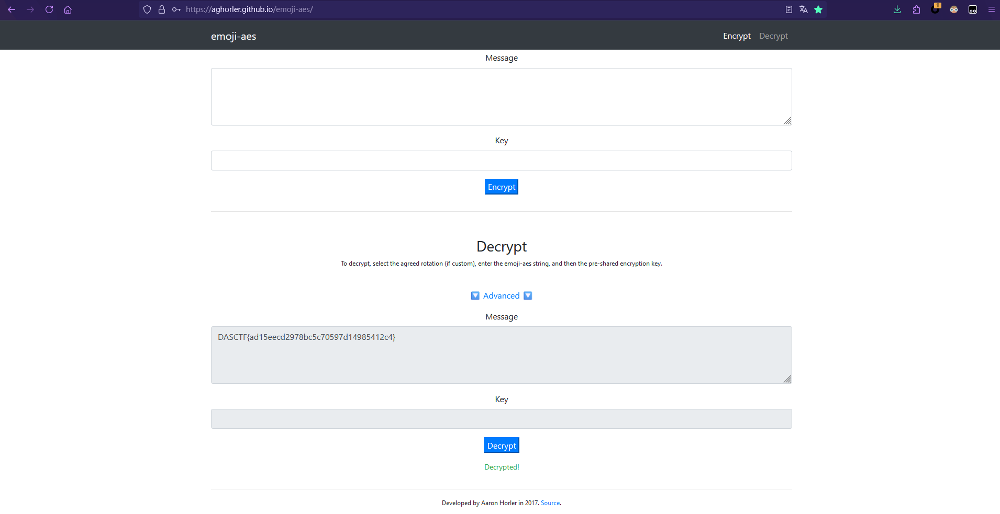

#### 题目名称 hard_Digital_plate

下载附件压缩包并解压，可以得到一个`hard_Digital_plate.pcapng`流量包

用wireshark打开，发现提示流量包损坏，因此我们使用010打开

在流量包末尾发现藏了一个zip压缩包，直接用010手动提取出来

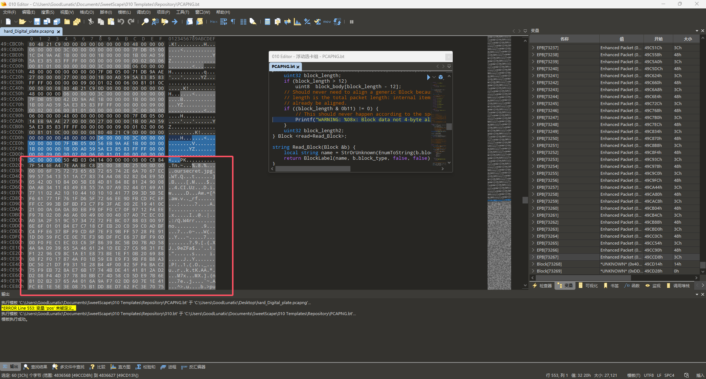

提出来的压缩包解压后可以得到`oursecret.jpg`，文件名提示了oursecret隐写

因此我们需要继续寻找解密的密钥

打开并翻看流量包，发现有USB流量的特征，赛后知道了是数位板的流量

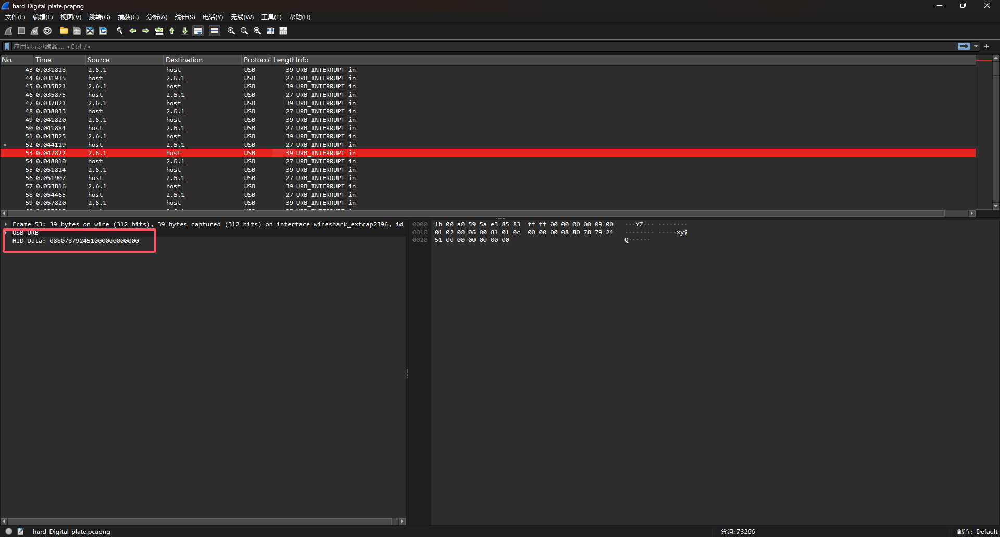

尝试使用 `tshark` 导出这一字段的数据
```bash
tshark -r hard_Digital_plate.pcapng -T fields -e usb.capdata | sed &#39;/^\s*$/d&#39; &gt; out.txt
```
导出的部分数据如下所示:
```
088076259e38000000000000
088074259b38000000000000
088072259838000000000000
088070259438000000000000
08806e259038000000000000
08816c258c38f00000000000
08816a258838d40100000000
088164258038190400000000
088161257d38170500000000
08815d257a380c0600000000
0881592577380e0700000000
088155257438110800000000
```
经过分析，发现前四位的数据`0881`是无效的数据，应该表示的是设备的特征

然后`[4:8]`的数据表示X坐标，`[8:12]`的数据表示的是Y坐标，`[12:16]`的数据则表示压感

这里要注意的一点就是这里坐标的数据是以小端序存储的，所以需要字节交换

我这里就直接高字节的数据乘上 `0xff` 然后加上低字节数据转为十进制坐标了
```python
with open(&#34;out.txt&#34;,&#34;r&#34;) as f:
    lines = f.readlines()

def draw_pic1():
    x = []
    y = []
    for line in lines:
        if(int(line[12:16],16) != 0):
            press_data = int(line[12:16],16)
            x.append(int(line[6:8],16)*0xff&#43;int(line[4:6],16))
            y.append(-1 * (int(line[10:12],16)*0xff&#43;int(line[8:10],16)))
            
    plt.scatter(x,y)
    plt.grid() # 显示网格
    plt.show()
```
根据提取出的数据得到坐标，然后画图可以得到下图

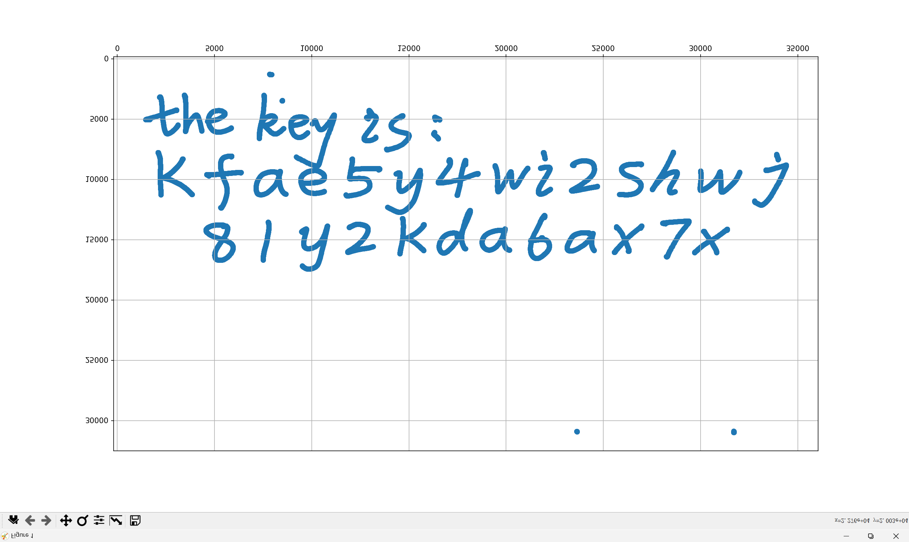

得到密钥：`kfae5y4wi2shwj81y2kda6ax7x`

结合之前得到的`oursecret.jpg`，我们使用oursecret结合上面的密钥进行解密

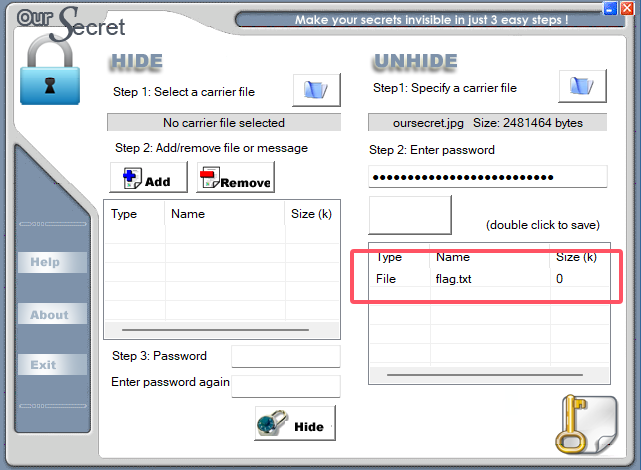

可以得到一个flag.txt，提取出来并打开可以得到如下内容：
```
U2FsdGVkX18jQgWzhln3pPiVK8gaBxIzhY1JWcFlKiRdBkV/jDmEBxJV9PZmwBJ7MU3IdNf4hWryZLYRLuxA4w==
```
感觉是AES解密了，解密需要密钥，因此我们继续寻找解密的密钥

在`oursecret.jpg`的exif信息中发现Hint

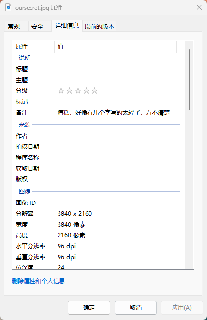

猜测是需要我们根据压感大小提取先前的数位板数据

写一个脚本，查看一下数位板的压感数据

```python
press_lst = []

with open(&#34;out.txt&#34;,&#34;r&#34;) as f:
    lines = f.readlines()
    
def draw_pic2():
    x = []
    y = []
    for line in lines:
        if(int(line[12:16],16) != 0):
            press_data = int(line[12:16],16)
            press_lst.append(press_data)
            if(press_data &lt; 65000):
                x.append(int(line[6:8],16)*0xff&#43;int(line[4:6],16))
                y.append(-1 * (int(line[10:12],16)*0xff&#43;int(line[8:10],16)))
            
    plt.scatter(x,y)
    plt.grid() # 显示网格
    plt.show()
```

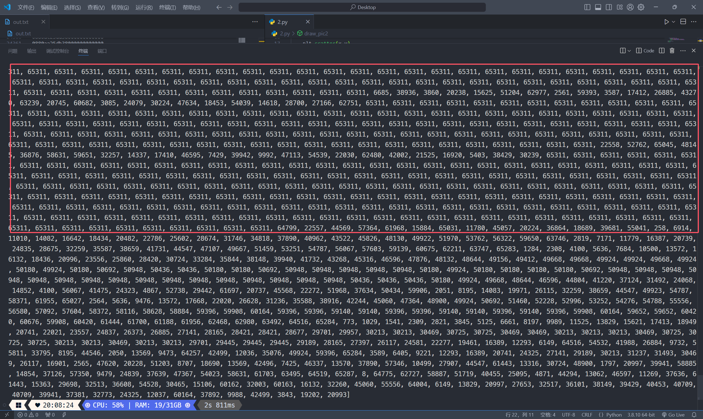

发现有很多`65331`的数据，因此我们尝试把压感数据低于`65000`的坐标都提取出来并画图

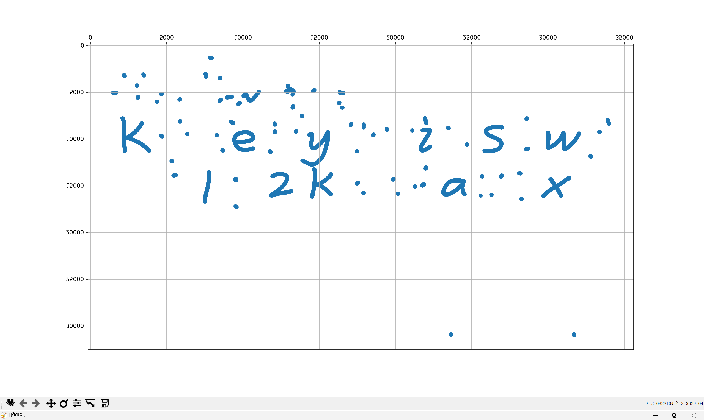

得到AES的密钥：w12kax，最后解密AES即可得到flag：`DASCTF{46f7bd763f4f6ec266ed481bc576f7b0}`

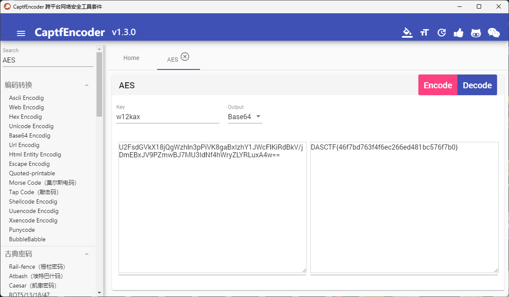

完整数位板流量解题代码如下：
```python
import matplotlib.pyplot as plt


press_lst = []

with open(&#34;out.txt&#34;,&#34;r&#34;) as f:
    lines = f.readlines()

def draw_pic1():
    x = []
    y = []
    for line in lines:
        if(int(line[12:16],16) != 0):
            press_data = int(line[12:16],16)
            x.append(int(line[6:8],16)*0xff&#43;int(line[4:6],16))
            y.append(-1 * (int(line[10:12],16)*0xff&#43;int(line[8:10],16)))
            
    plt.scatter(x,y)
    plt.grid() # 显示网格
    plt.show()

def draw_pic2():
    x = []
    y = []
    for line in lines:
        if(int(line[12:16],16) != 0):
            press_data = int(line[12:16],16)
            press_lst.append(press_data)
            if(press_data &lt; 65000):
                x.append(int(line[6:8],16)*0xff&#43;int(line[4:6],16))
                y.append(-1 * (int(line[10:12],16)*0xff&#43;int(line[8:10],16)))
            
    plt.scatter(x,y)
    plt.grid() # 显示网格
    plt.show()
    
if __name__ == &#34;__main__&#34;:
    draw_pic1()
    draw_pic2()
    print(press_lst)
```


---

> Author: [Lunatic](https://goodlunatic.github.io)  
> URL: https://goodlunatic.github.io/posts/3f7db4e/  

