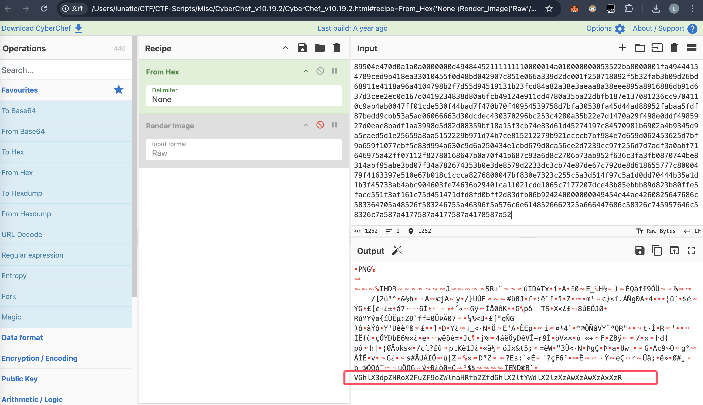
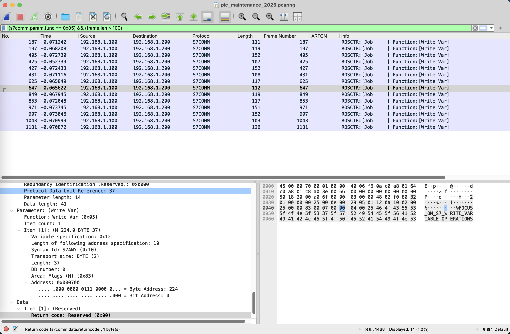

# 2025 第九届工业信息安全技能大赛-典型工业场景锦标赛 Misc Writeup

**2025 第九届工业信息安全技能大赛-典型工业场景锦标赛 Writeup**

**赛后有师傅来问这场比赛里的题，部分题目出的挺好的，有一定的难度，于是打算记录一下**
<!--more-->

> 本文中涉及的具体题目附件可以进我的交流群获取，进群详见 [About](https://goodlunatic.github.io/about/)

## 题目名称 开局一张图

LSB 隐写，提取出来即可：`0fvx2enlh9k6ai4el2g960dd97c2f4805987fl3Aw4bZ0FGKJ2k6EDBqoYCiTWr8RXQdleg`


## 题目名称 设计图之秘

steghide 隐写，直接用 stegseek 爆破密钥即可


打开 .out 文件即可得到：`flk5lsdiaenorfa1yeag7d21c78ad28c3ae25V6swgqhSAc3eyHJoQzMWFr491xktO8dGYRTXmCiPZNufBpl7b2UDK0Larm`

## 题目名称 抓内鬼啦

题目附件给了一个流量包，打开发现 HTTP 流量中上传了几个文件

首先是传了了一张宽高被篡改过的 PNG 图片，并且图片末尾有段 base64，解码后可以得到宽高的提示




010 打开修改好宽高后可以得到一张二维码


扫码即可得到第一段的 flag: `Polis{W0w_Th1s_1s_f1agO1_`

然后流量中还传了一个 zip 压缩包，尝试提取出来，发现是伪加密的

010 打开发现压缩大小和压缩前大小也被篡改了，修改为正确的大小并去除伪加密后打开

即可得到第二段 flag: `Great_G0t_it!}`


综上，最后的 flag 为：`Polis{W0w_Th1s_1s_f1agO1_Great_G0t_it!}`

## 题目名称 固件分析 1

题目附件给了一个 img 文件，尝试直接用 DiskGenius 打开


可以得到上面这几个文件，其中 7z 压缩包是加密的

尝试直接 strings 一下 sh 和 motd 里面的内容，可以得到第一段 flag 和压缩包的解压密码：`Secret_PLC2025`


解压后可以得到一个 flag2.txt，内容如下：

> E4MC01MGE4LTRm

但是发现拼不出完整的 flag，于是尝试直接 strings 整个 img，可以得到另外几段内容


最后尝试在 CyberChef 中组合一下，把三段 base64 调整到相同的长度，然后解码即可得到完整的 flag

`flag{a6300a80-50a8-4f3f-b339-3ac9c76ae902}`


## 题目名称 工控宣传的隐秘信号

附件给了一个 mp3 文件和一个加密的压缩包，直接用 audacity 倒放即可听到压缩包的解压密码：`s0803y0518` 

解压后可以得到一张 GIF，尝试分帧，可在第 156 帧得到一个少了定位块的二维码


补上定位块后扫码即可得到：`GNalVNrhVOLZjRK7pMrJjPn3x`


然后随波逐流解个 XXencode 即可得到最后的 flag: `flag{aiyoubucuoo1}`


## 题目名称 工业日志分析

附件给了一个 log 文件，直接 vscode 打开然后在里面找三段 base64


然后 CyberChef 组合一下解 base64 即可得到最后的 flag：`flag{4e54fa7c-c530-4c5c-985e-2e15871ddf04}`


## 题目名称 工业控制协议流量分析 1

题目附件给了一个流量包，打开发现主要是 TCP 流量，首先尝试用以下命令导出一下传输的数据

```bash
tshark -r 工业控制协议流量分析1.pcap -T fields -Y 'tcp' -e 'tcp.segment_data' > out.txt
```

发现大多数数据的长度都是 13 字节，有少部分不是，因此我们重点关注这些长度不为 13 字节的数据


用以下命令导出一下长度不为 13 字节的数据

```bash
tshark -r 工业控制协议流量分析1.pcap -T fields -Y 'len(tcp.segment_data) != 13' -e 'tcp.segment_data' > out.txt
```

可以得到如下内容：

```
6e310000000901666c0304cdd0141e
0a400000000901030461677b399dde,e50e
187a00000009013437316603045f10,8121
792d000000096433322d010304bc9a,b5b0
224600000009010361353832042917,411e
5da500000009010304a42d3438c4e9,22
7b2800000009013834030445c76c42
5f92000000090103042d6239da0959,97
956500000009010304d82b39302db8,9e
073800000009010304b631306666a5,94
cc6d0000000901030446903963380d,e4
57960000006563090103045d644a1a
3b6c00000009010304d86438300785,87
8f4200000009010304c9307dbeea4f
```

拿 CyberChef 解一下 Hex 已经能看到部分 flag 了


手动把不可打印字符和大写字符删去，即可得到最后的 flag：`flag{9471fd32-a582-4884-b990-10ff9c8dd800}`


## 题目名称 工业控制协议流量分析 2

附件给了一个流量包，打开翻看发现主要是 TPKT 协议

尝试用 tshark 导出 tpkt.continuation_data

```bash
tshark -r 工业控制协议流量分析2.pcap -T fields -Y '_ws.col.protocol == "TPKT"' -e tpkt.continuation_data > out.txt
```


发现用很多数据是相同的，然后其中穿插了几个不同的数据，因此我们可以过滤一下再导出

```bash
tshark -r 工业控制协议流量分析2.pcap -T fields -Y '!(tpkt.continuation_data == 4d:4d:53:5f:50:41:59:4c:4f:41:44:5f:4e:4f:52:4d:41:4c)' -e tpkt.continuation_data > out.txt
```


第一行数据解 Hex 可以得到一串密码


然后我们主要观察剩下数据的倒数第二字节，可以发现有个 zip 压缩包


但是提取出来发现文件是不完整的，于是我们尝试用以下这个命令直接去提取 TCP 中的数据

```bash
tshark -r 工业控制协议流量分析2.pcap -T fields -Y '!(tcp.payload == 4d:4d:53:5f:50:41:59:4c:4f:41:44:5f:4e:4f:52:4d:41:4c)' -e tcp.payload > out.txt
```

这个时候提取出来的 zip 数据就是完整的了，用`MMS12345`作为密码解压即可得到最后的 flag


`flag{6a46756d-df7e-4b66-87e4-1b2661676e40}`

## 题目名称 工业控制协议流量分析 3

附件给了一个流量包，打开发现存在 mqtt 流量，直接用以下命令导出 mqtt.msg

```bash
tshark -r protocal.pcapng -T fields -Y 'mqtt' -e 'mqtt.msg' > out.txt
```

然后 CyberChef 转一下 Hex ，拉倒末尾即可看到 flag：`flag{ruEf6OmqhAlXIYxmnR1XLC6R1]}`


## 题目名称 音频隐写

附件给了一个 字符频率映射表.txt 还有一个 wav 文件，映射表中的内容如下：

```
'a': 440, 'b': 466, 'c': 494, 'd': 523, 'e': 554,
'f': 587, 'g': 622, 'h': 659, 'i': 698, 'j': 740,
'k': 784, 'l': 830, 'm': 880, 'n': 932, 'o': 988,
'p': 1047, 'q': 1109, 'r': 1175, 's': 1245, 't': 1319,
'u': 1397, 'v': 1480, 'w': 1568, 'x': 1661, 'y': 1760, 'z': 1865,
'1': 1000, '2': 2000, '3': 3000, '4': 4000, '5': 5000,
'6': 6000, '7': 7000, '8': 8000, '9': 9000, '0': 10000,
'A': 445, 'B': 471, 'C': 499, 'D': 528, 'E': 559,
'F': 592, 'G': 627, 'H': 664, 'I': 703, 'J': 745,
'K': 789, 'L': 835, 'M': 885, 'N': 937, 'O': 993,
'P': 1052, 'Q': 1114, 'R': 1180, 'S': 1250, 'T': 1324,
'U': 1402, 'V': 1485, 'W': 1573, 'X': 1666, 'Y': 1765, 'Z': 1870,
```

因此我们写个脚本提取一下即可得到 flag: `FvoelrnoBjmFz1aknoF7U24gFe5204521Be19B3voh9BSaqhGRlyXio6m0xtkEZ21nUmhelP`

```python
import numpy as np
from scipy.io import wavfile

# 常量定义
DEFAULT_CHUNK_DURATION_MS = 100  # 默认分析块时长（毫秒）
FREQ_DIFF_THRESHOLD = 30         # 频率差异阈值
LOW_FREQ_THRESHOLD = 100         # 低频噪声阈值

# 频率与字符的对照表
FREQ_MAP = {
    # 小写字母
    'a': 440, 'b': 466, 'c': 494, 'd': 523, 'e': 554,
    'f': 587, 'g': 622, 'h': 659, 'i': 698, 'j': 740,
    'k': 784, 'l': 830, 'm': 880, 'n': 932, 'o': 988,
    'p': 1047, 'q': 1109, 'r': 1175, 's': 1245, 't': 1319,
    'u': 1397, 'v': 1480, 'w': 1568, 'x': 1661, 'y': 1760, 'z': 1865,
    
    # 数字
    '1': 1000, '2': 2000, '3': 3000, '4': 4000, '5': 5000,
    '6': 6000, '7': 7000, '8': 8000, '9': 9000, '0': 10000,
    
    # 大写字母（比对应小写字母稍高频率）
    'A': 445, 'B': 471, 'C': 499, 'D': 528, 'E': 559,
    'F': 592, 'G': 627, 'H': 664, 'I': 703, 'J': 745,
    'K': 789, 'L': 835, 'M': 885, 'N': 937, 'O': 993,
    'P': 1052, 'Q': 1114, 'R': 1180, 'S': 1250, 'T': 1324,
    'U': 1402, 'V': 1485, 'W': 1573, 'X': 1666, 'Y': 1765, 'Z': 1870,
}

def find_closest_char(target_freq):
    if not FREQ_MAP or target_freq < LOW_FREQ_THRESHOLD:
        return None
    
    # 找到最接近的频率对应的字符
    closest_char = min(FREQ_MAP.keys(), 
                      key=lambda char: abs(FREQ_MAP[char] - target_freq))
    
    # 检查频率差异是否在可接受范围内
    if abs(FREQ_MAP[closest_char] - target_freq) > FREQ_DIFF_THRESHOLD:
        return None
    
    return closest_char


def analyze_wav_sequentially(file_path, chunk_duration_ms=DEFAULT_CHUNK_DURATION_MS):
    sample_rate, data = wavfile.read(file_path)
    # 如果是立体声，只使用左声道
    if data.ndim > 1:
        data = data[:, 0]
    
    # 计算每个块的大小（样本数）
    chunk_size = int(sample_rate * chunk_duration_ms / 1000)
    num_chunks = len(data) // chunk_size
    decoded_chars = []
    last_char = None
    
    print(f"[+] 采样率: {sample_rate} Hz, 块时长: {chunk_duration_ms} ms, 总块数: {num_chunks}")
    
    for i in range(num_chunks):
        start = i * chunk_size
        end = start + chunk_size
        chunk = data[start:end]
        
        # 对当前块进行 FFT 分析
        fft_spectrum = np.fft.rfft(chunk)
        fft_freq = np.fft.rfftfreq(len(chunk), 1.0 / sample_rate)
        
        # 找到主频率（忽略直流分量）
        if len(fft_spectrum) > 1:
            peak_index = np.argmax(np.abs(fft_spectrum[1:])) + 1
            dominant_frequency = fft_freq[peak_index]
            
            # 查找对应的字符
            char = find_closest_char(dominant_frequency)
            
            # 为了避免一个长音被重复记录，只有当字符变化时才记录
            if char and char != last_char:
                decoded_chars.append(char)
                last_char = char
    
    final_message = "".join(decoded_chars)
    
    print(f"[+] 解码出的字符序列: {final_message}")
    print(f"[+] 字符数量: {len(decoded_chars)}")
    return final_message


def func():    
    wav_file = "video.wav"
    analyze_wav_sequentially(wav_file)
    

if __name__ == "__main__":
    func()

# [+] 采样率: 44100 Hz, 块时长: 100 ms, 总块数: 73
# [+] 解码出的字符序列: FvoelrnoBjmFz1aknoF7U24gFe5204521Be19B3voh9BSaqhGRlyXio6m0xtkEZ21nUmhelP
# [+] 字符数量: 72
```

## 题目名称 所见即是开始

附件给了一个加密的 zip 压缩包还有下面这张 PNG


 结合图片中的提示，很容易联想到盲文


结合上面这个对照表，得到解压密码：`hanoi floor is 9`

解压后可以得到一个 hint.txt 和一张 PNG 图片


hint.txt 中的内容如下：

> 所解即所得；
> 
> 一组格式为盘+当前柱+去往柱

经典的汉诺塔问题，写个脚本递归一下即可

```python
def hanio(n, a, b, c):
    res = ""
    if n == 1:
        res += f"{n}{a}{c}"
    else:
        # 将n-1个盘从a通过c移动到b
        res += hanio(n-1, a, c, b)
        # 将最大的盘从a移动到c
        res += f"{n}{a}{c}"
        # 将n-1个盘从b通过a移动到c
        res += hanio(n-1, b, a, c)
    return res

if __name__ == '__main__':
    n = 9
    result = hanio(n, 'A', 'B', 'C')
    print(result)

# 1AC2AB1CB3AC1BA2BC1AC4AB1CB2CA1BA3CB1AC2AB1CB5AC1BA2BC1AC3BA1CB2CA1BA4BC1AC2AB1CB3AC1BA2BC1AC6AB1CB2CA1BA3CB1AC2AB1CB4CA1BA2BC1AC3BA1CB2CA1BA5CB1AC2AB1CB3AC1BA2BC1AC4AB1CB2CA1BA3CB1AC2AB1CB7AC1BA2BC1AC3BA1CB2CA1BA4BC1AC2AB1CB3AC1BA2BC1AC5BA1CB2CA1BA3CB1AC2AB1CB4CA1BA2BC1AC3BA1CB2CA1BA6BC1AC2AB1CB3AC1BA2BC1AC4AB1CB2CA1BA3CB1AC2AB1CB5AC1BA2BC1AC3BA1CB2CA1BA4BC1AC2AB1CB3AC1BA2BC1AC8AB1CB2CA1BA3CB1AC2AB1CB4CA1BA2BC1AC3BA1CB2CA1BA5CB1AC2AB1CB3AC1BA2BC1AC4AB1CB2CA1BA3CB1AC2AB1CB6CA1BA2BC1AC3BA1CB2CA1BA4BC1AC2AB1CB3AC1BA2BC1AC5BA1CB2CA1BA3CB1AC2AB1CB4CA1BA2BC1AC3BA1CB2CA1BA7CB1AC2AB1CB3AC1BA2BC1AC4AB1CB2CA1BA3CB1AC2AB1CB5AC1BA2BC1AC3BA1CB2CA1BA4BC1AC2AB1CB3AC1BA2BC1AC6AB1CB2CA1BA3CB1AC2AB1CB4CA1BA2BC1AC3BA1CB2CA1BA5CB1AC2AB1CB3AC1BA2BC1AC4AB1CB2CA1BA3CB1AC2AB1CB9AC1BA2BC1AC3BA1CB2CA1BA4BC1AC2AB1CB3AC1BA2BC1AC5BA1CB2CA1BA3CB1AC2AB1CB4CA1BA2BC1AC3BA1CB2CA1BA6BC1AC2AB1CB3AC1BA2BC1AC4AB1CB2CA1BA3CB1AC2AB1CB5AC1BA2BC1AC3BA1CB2CA1BA4BC1AC2AB1CB3AC1BA2BC1AC7BA1CB2CA1BA3CB1AC2AB1CB4CA1BA2BC1AC3BA1CB2CA1BA5CB1AC2AB1CB3AC1BA2BC1AC4AB1CB2CA1BA3CB1AC2AB1CB6CA1BA2BC1AC3BA1CB2CA1BA4BC1AC2AB1CB3AC1BA2BC1AC5BA1CB2CA1BA3CB1AC2AB1CB4CA1BA2BC1AC3BA1CB2CA1BA8BC1AC2AB1CB3AC1BA2BC1AC4AB1CB2CA1BA3CB1AC2AB1CB5AC1BA2BC1AC3BA1CB2CA1BA4BC1AC2AB1CB3AC1BA2BC1AC6AB1CB2CA1BA3CB1AC2AB1CB4CA1BA2BC1AC3BA1CB2CA1BA5CB1AC2AB1CB3AC1BA2BC1AC4AB1CB2CA1BA3CB1AC2AB1CB7AC1BA2BC1AC3BA1CB2CA1BA4BC1AC2AB1CB3AC1BA2BC1AC5BA1CB2CA1BA3CB1AC2AB1CB4CA1BA2BC1AC3BA1CB2CA1BA6BC1AC2AB1CB3AC1BA2BC1AC4AB1CB2CA1BA3CB1AC2AB1CB5AC1BA2BC1AC3BA1CB2CA1BA4BC1AC2AB1CB3AC1BA2BC1AC
```


## 题目名称 工业流量隐写分析

附件给了一张 `larger_lbCN3pEh1o`，是个二维码，扫码可以得到：`Fake_one`


010 打开，发现末尾也没有多的数据，因此尝试拿 stegsolve 查看一下


然后尝试用 stegseek 爆破一下，发现用无密钥解密 steghide 可以得到一个文件


 
 010 打开查看，发现是个 zip 压缩包


改后缀为 .zip 并解压可以得到一张二维码，和一个加密的压缩包

二维码扫码可以得到：`wo_lei_ge_dou`，用这个作为密码去解压压缩包可以得到一个流量包文件

追踪一下 TCP 流，发现可以得到前半段的 flag：`flag{S7_PLC`


然后再继续翻看一下，可以发现后半段 flag：`-2025_#_ICS}`


综上，最后的flag为：`flag{S7_PLC-2025_#_ICS}`

当然，这里也可以尝试直接 strings 这个流量包，去快速定位关键信息


> 这道题的 TCP 流量好像有部分是损坏的，所以导致追踪流的时候会看不全
> 
> 但是在分组字节流或者直接用 tshark 导出是可以看到的
> 
> tshark -r industrial_traffic_with_flag.pcap -T fields -Y 'tcp' -e 'tcp.segment_data'

## 题目名称 工控协议隐蔽通道分析附件

题目附件给了个流量包，翻看了一下主要是 S7common 和 Modbus 流量

然后发现还传了一个 PNG 和一个 ZIP 压缩包

因为不知道具体的顺序，所以无法完整的提取出来

尝试直接 strings 流量包，可以得到如下内容：

```
ADDRESS_ORDER
$ZIP_FILE_SCATTERED_ACROSS_FOUR_PARTS
WARNING: READ_RESPONSES_CONTAIN_INVALID_DATA
ZIP_PASSWORD_HINT
NOT_THE_DROID
ZIP_HINT_1
CHECK_DB2_AND_M
fl4g_k33p_
flag{zip_ascii_values_of_'flag'}
DATA_BEGIN_AT_ASCII_VALUES_OF_'f'
CAES_l_3:V0F3PP34
K_MAGIC_BYTE
looking_at_M_area}
READ_RESPONSES_ARE_INVALID_CHECK_WRITE_OPS
FOCUS_ON_S7_WRITE_VARIABLE_OPERATIONS
RED_HERRING
JUST_NOISE
HINT: PASSWORD_ENCRYPTED_WITH_CAESAR_SHIFT_3
FOCUS_ON_S7_WRITE_VARIABLE_OPERATIONS_ONLY
OT_IMPORTANT
flag{n0t_
ALL_DATA_FRAGMENTS_IN_M_AREA
PASSWORD_IN_DB_AREA_ADDRESS_0x60_WITH_CAESAR_CIPHER
```

肉眼观察并手动组合一下，可以整理出如下内容

```
ADDRESS_ORDER
WARNING: READ_RESPONSES_CONTAIN_INVALID_DATA
READ_RESPONSES_ARE_INVALID_CHECK_WRITE_OPS
FOCUS_ON_S7_WRITE_VARIABLE_OPERATIONS
FOCUS_ON_S7_WRITE_VARIABLE_OPERATIONS_ONLY

ZIP_HINT_1
ZIP_FILE_SCATTERED_ACROSS_FOUR_PARTS

ZIP_PASSWORD_HINT
PASSWORD_IN_DB_AREA_ADDRESS_0x60_WITH_CAESAR_CIPHER
HINT: PASSWORD_ENCRYPTED_WITH_CAESAR_SHIFT_3

flag{n0t_fl4g_k33p_looking_at_M_area}
flag{zip_ascii_values_of_'flag'}

CAES_l_3:V0F3PP34

DATA_BEGIN_AT_ASCII_VALUES_OF_'f'
RED_HERRING
CHECK_DB2_AND_M
ALL_DATA_FRAGMENTS_IN_M_AREA
JUST_NOISE
OT_IMPORTANT
NOT_THE_DROID
K_MAGIC_BYTE
RED_HERRING
```

`FOCUS_ON_S7_WRITE_VARIABLE_OPERATIONS_ONLY` 和 `READ_RESPONSES_CONTAIN_INVALID_DATA` 提示了我们要主要关注 write 操作

因此我们过滤了一下，并筛去了包长度小于 100 字节的干扰流量



`ZIP_FILE_SCATTERED_ACROSS_FOUR_PARTS` 提示了我们压缩包被拆成了四部分

因此我们去上面过滤出来的几个包里找 zip 压缩包的数据，首先搜索 504B0304 和 504B0506 定位头尾

然后中间两部分组合一下，最后提取出来压缩包的十六进制数据如下：

```
504b03041400010063008b81db5aea95ecdb8d0000007000000017000b00696e647573747269616c5f70726f746f636f6c2e74787401990700010041450308009ed176b901ca032e4951f509d6963e9c6678412c14325ca3d781cd0b63d2f857a53e1a96e550dca69ad0fe56ab00ac1f1326039ab18eee705724d6514ff791ce5e18f1d8b33dbf133b84216737ffd870bdae00e56084fdbd54a2c4c8227df5b4f425fa01090eb4e6c742ebf5bcd38156fd02815df6d8ab97fc5931469fd66034f1bbfc182f55f86693754da5e5504b010214031400010063008b81db5aea95ecdb8d0000007000000017000b000000000000000000ff8100000000696e647573747269616c5f70726f746f636f6c2e7478740199070001004145030800504b0506000000000100010050000000cd0000000000
```

提取出来的压缩包是加密的

结合提示：`PASSWORD_ENCRYPTED_WITH_CAESAR_SHIFT_3`，我们写个脚本解密一下 `V0F3PP34`

因为 `CAES_l_3` 提示的是凯撒密码左减三位

```python
def caesar_decrypt(data, shift=3):
    result = []
    for char in data:
        if char.isdigit():
            decrypted_digit = (int(char) - shift) % 10
            result.append(str(decrypted_digit))
        elif char.isalpha():
            if char.isupper():
                decrypted_char = chr((ord(char) - ord('A') - shift) % 26 + ord('A'))
            else:
                decrypted_char = chr((ord(char) - ord('a') - shift) % 26 + ord('a'))
            result.append(decrypted_char)
        else:
            # 其他字符保持不变
            result.append(char)
    return ''.join(result)

data  = "V0F3PP34"
print(caesar_decrypt(data))
# S7C0MM01
```

用`S7C0MM01`作为解压密码去解压即可得到最后的flag: `flag{S7c0mm_pr0t0col_st3g4n0graphy_mast3r}`

```
恭喜你找到了S7comm协议的秘密通道！
这是真正的flag: flag{S7c0mm_pr0t0col_st3g4n0graphy_mast3r}
```


## 题目名称 异常的数据流量包

附件给了一个流量包，打开发现主要是 Modbus 流量，翻看一下发现传输了一个 PDF 文件


观察可以发现有三个 ip 在传输 PDF，因此我们用以下命令提取一下传输的数据

```bash
tshark -r test.pcap -T fields -Y '(((ip.src == 192.168.1.200) || (ip.src == 192.168.1.201)) || (ip.src == 192.168.1.202)) && (modbus.func_code == 3)' -e 'tcp.payload' > out.txt
```

观察可以发现提取出来数据的前 9 字节是无效数据，因此我们可以写个脚本处理一下

```python
with open('out.txt','r') as f:
    data = f.read().split()
    
# print(data)

res = ""
for item in data:
    if len(item) > 18:
        res += item[18:]
        
print(len(res))
print(bytes.fromhex(res))

with open("out.pdf",'wb') as f:
    f.write(bytes.fromhex(res))
```

运行以上脚本后可以得到一个加密的 PDF 文件

因此我们继续看流量包，在最后一个 TCP 流中发现传了一个网址：`https://wwfu.lanzouo.com/i6D1D2y2vy8h/`


访问并下载可以得到一个 `打开看看.txt` ，里面的内容如下：

> ....- ...-- ...-- ----- ..... .---- ---.. .. ... .- ... - .-. .. -. --. --- ..-. ..- ... . ..-. ..- .-.. -. ..- -- -... . .-. ...

解摩斯可以得到：`4330518ISASTRINGOFUSEFULNUMBERS`


肉眼观察一下，手动拆分可以得到：`4330518 IS A STRING OF USEFUL NUMBERS`

用 `4330518` 作为密码，即可正常打开 PDF（感觉 7 位纯数字的弱密码，好像直接爆破也行

打开 PDF 后移开上面的图片即可得到最后的 flag：`flag{MB03_40001}`


## 题目名称 why_not_substitution

题目附件给了如下内容：

```python
from string import ascii_lowercase, digits
import hashlib
from flag import flag

CHARSET = "!@#¥%" + ascii_lowercase + digits

n = len(CHARSET)
def encrypt(msg, f):
    chiper = ''
    for m in msg:
        chiper += CHARSET[f.substitute(CHARSET.index(m))]
    return chiper

P.<x> = PolynomialRing(GF(n))
f = P.random_element(6)


enc = encrypt(flag, f)
print("flag[0:7]", flag[0:7])
print("enc", enc)
print("hash", hashlib.sha256(flag.encode('utf-8')).hexdigest())


# flag[0:7] flkejiy
# enc quw7f59u51q¥##w¥w6q6s¥¥#w#661d¥
# hash 7d41757168a2199b32cb1744de130fdebda25271116bc64eccf4e397770d73c2
```

简单的密码题，GPT 直接一把梭了：`flkejiyliafg77c3c4f49335c711avg`

```python
from hashlib import sha256
from itertools import product
from multiprocessing import Pool, cpu_count
import math

CHARSET = "!@#¥%" + "abcdefghijklmnopqrstuvwxyz" + "0123456789"
p = len(CHARSET)  # 41

known_prefix = "flkejiy"  # flag[0:7]
enc = "quw7f59u51q¥##w¥w6q6s¥¥#w#661d¥"
target_hash = "7d41757168a2199b32cb1744de130fdebda25271116bc64eccf4e397770d73c2"

def inv_mod(a, p):
    a %= p
    if a == 0:
        raise ZeroDivisionError("no inverse")
    return pow(a, p-2, p)  # p prime

def lagrange_eval(t, xs, ys, p):
    total = 0
    k = len(xs)
    for i in range(k):
        xi, yi = xs[i], ys[i]
        num = 1
        den = 1
        for j in range(k):
            if j == i: continue
            xj = xs[j]
            num = (num * (t - xj)) % p
            den = (den * (xi - xj)) % p
        li = (num * inv_mod(den, p)) % p
        total = (total + yi * li) % p
    return total

def build_f_map(known_prefix, enc_prefix):
    xs = [CHARSET.index(ch) for ch in known_prefix]
    ys = [CHARSET.index(ch) for ch in enc_prefix]
    f_map = [lagrange_eval(i, xs, ys, p) for i in range(p)]
    return f_map

def build_candidates(enc, f_map):
    cand_list = []
    for c in enc:
        if c not in CHARSET:
            raise ValueError(f"cipher char {c!r} not in CHARSET")
        y = CHARSET.index(c)
        cands = [i for i, v in enumerate(f_map) if v == y]
        if len(cands) == 0:
            raise ValueError(f"No candidate for cipher char {c!r}")
        cand_list.append(cands)
    return cand_list

# single-worker search for product of candidates iterables
def search_chunk(prefix_indices, remaining_cands, target_hash):
    # prefix_indices: chosen indices for first k positions (list of ints)
    # remaining_cands: list of candidate-lists for positions k..end
    prefix = ''.join(CHARSET[i] for i in prefix_indices)
    # iterate remaining
    for tail in product(*remaining_cands):
        candidate = prefix + ''.join(CHARSET[i] for i in tail)
        if sha256(candidate.encode("utf-8")).hexdigest() == target_hash:
            return candidate
    return None

# helper for worker map: each worker gets a fixed prefix to extend
def worker_task(args):
    prefix_indices, remaining_cands, target_hash = args
    return search_chunk(prefix_indices, remaining_cands, target_hash)

def main():
    workers = cpu_count()
    print("CHARSET:", CHARSET)
    print("p:", p)
    print("known_prefix:", known_prefix)
    print("enc:", enc)
    print("target_hash:", target_hash)
    # build interpolation using known 7 pairs
    f_map = build_f_map(known_prefix, enc[:len(known_prefix)])
    cand_list = build_candidates(enc, f_map)
    counts = [len(c) for c in cand_list]
    total = 1
    for c in counts: total *= c
    print("candidate counts per position:", counts)
    print("total combinations:", total)

    # if small, brute force single-thread
    if total <= 5_000_000:
        print("Total combinations small: using single-thread brute force...")
        for combo in product(*cand_list):
            text = ''.join(CHARSET[i] for i in combo)
            if sha256(text.encode('utf-8')).hexdigest() == target_hash:
                print("Found flag:", text)
                return
        print("Not found.")
        return

    # otherwise use multiprocessing by splitting on first k positions
    # choose k so that number of prefixes ~= workers * ~2000 (tunable)

    target_prefix_count = workers * 2000
    k = 1
    prefix_space = len(cand_list[0])
    while prefix_space < target_prefix_count and k < len(cand_list):
        k += 1
        prefix_space *= len(cand_list[k-1])
    print(f"Splitting on first {k} positions -> prefix count {prefix_space}, using {workers} workers")

    # generate all prefixes (could be large but manageable for typical sizes)
    from itertools import product
    prefixes = list(product(*cand_list[:k]))
    remaining = cand_list[k:]

    # prepare tasks (each task: a fixed prefix)
    tasks = [(list(pref), remaining, target_hash) for pref in prefixes]

    print("Starting pool...")
    found = None
    with Pool(processes=workers) as pool:
        for res in pool.imap_unordered(worker_task, tasks, chunksize=1):
            if res:
                found = res
                pool.terminate()
                break

    if found:
        print("Found flag:", found)
        print("SHA256:", sha256(found.encode()).hexdigest())
    else:
        print("Not found (tried full parallel search).")

if __name__ == "__main__":
    main()

# CHARSET: !@#¥%abcdefghijklmnopqrstuvwxyz0123456789
# p: 41
# known_prefix: flkejiy
# enc: quw7f59u51q¥##w¥w6q6s¥¥#w#661d¥
# target_hash: 7d41757168a2199b32cb1744de130fdebda25271116bc64eccf4e397770d73c2
# candidate counts per position: [1, 1, 3, 2, 1, 4, 1, 1, 4, 1, 1, 2, 2, 2, 3, 2, 3, 2, 1, 2, 1, 2, 2, 2, 3, 2, 2, 2, 1, 4, 2]
# total combinations: 84934656
# Splitting on first 18 positions -> prefix count 27648, using 8 workers
# Starting pool...
# Found flag: flkejiyliafg77c3c4f49335c711avg
# SHA256: 7d41757168a2199b32cb1744de130fdebda25271116bc64eccf4e397770d73c2
```


## 题目名称 图片的奥秘

附件给了一个加密的压缩包，首先尝试弱密码爆破，得到解压密码：`54450`


解压后得到一张 PNG 图片，010 打开提示报错，发现末尾有一张 base64 编码后的 PNG 图片


提取出来解码后可以得到下图，扫码得到：`flag{asdf%^&*ghjkl}`


但是我们常用 010 打开这张图片，发现末尾还有数据


并且尝试搜索一下 PNG 文件尾，可以发现这里应该存在不止一张 PNG 图片


把后面多余的数据提取出来后，尝试搜索了一下 PNG 文件头


> 赛后据做出来的师傅说，后面是有 9 张 PNG 图片
> 
> 并且这 9 张图片可以按顺序拼成一个新的二维码，扫码即可得到最后的 flag，如下图所示


但是我自己做的时候，这些数据根据 PNG 文件头分段提取可以提出如下几段数据


很明显其中有俩 PNG 文件是能正常显示的，但是另外几个不能，并且根据文件大小来看，应该是有 9 张 PNG 图片

我们用 010 来 diff 一下，发现是有部分段的数据是相同的，猜测这些应该就是变换后的 PNG 文件头


后来发现其实是一开始 base64 解码得到图片那一步弄错了

其实原图后面跟着的不是一段 base64 编码，而是是十段 base64 编码，我们需要分别提取出来

因此我们把原图末尾的 base64 保存到一个 txt 中，然后写个脚本提取一下即可

```python
import base64

with open("base64code.txt",'r') as f:
    data = f.read().split('data:image/png;base64,')
    
# print(len(data)) # 11

for idx,item in enumerate(data):
    png_name = f"{idx}.png"
    png_data = base64.b64decode(item)
    with open(png_name,'wb') as f:
        f.write(png_data)
    print(f"[+] {idx}.png 提取成功")
```


然后我们把那九张二维码碎片拼一下


拼好后扫码即可得到最后的 flag：`fdvbpy4zl9klge9fb7n8caa0vz7g1600e557e2adb0b5eICphorM5FEDVW3LyOisUdX4kv9JtSmP01QxRBl6THjgAcnfYubGZqwKz7asnow`

## 题目名称 多注意观察

附件给了一个 flag.blf，010 打开查看发现其实是个 rar 压缩包


改后缀为 .rar 后打开，发现是加密的，并且注释里有提示：`FFD8FFE000104A46494600`


`FFD8FFE000104A46494600` 解码后发现其实是 JPG 的文件头

后来尝试弱密码爆破，发现 rar 的解压密码是 `123456789`( rar 压缩包的爆破速度可能会有点慢...)


解压后得到一个未知后缀的 flag 文件，010 打开后可以得到如下内容，很明显是文件头被篡改了的 JPG 图片


我们把之前压缩包注释里的文件头给它补上，改后缀为.jpg 即可得到一张二维码


扫码得到：`fxyj760umlfca9xdjl0cye7gde7d00c28da982d9ALW8InzKyYip6JShjP1qBVt9buXRMc4aZdlight`

然后我们在用 010 打开这张 JPG 图片，并加载 JPG 的模板，可以发现末尾有多余数据


我们把字符集改成 UTF-8 就可以看到如下内容


为了方便查看，我直接复制到 CyberChef 里了，CyberChef 右下角改成 UTF-8 即可正常显示

> 车联网的内涵主要指：车辆上的车载设备通过无线通信技术，对信息网络平台中的所有车辆动态信息进行有效利用，在车辆运行中提供不同的功能服务。可以发现，车联网表现出以下几点特征：车联网能够为车与车之间的间距提供保障，降低车辆发生碰撞事故的几率；车联网可以帮助车主实时导航，并通过与其它车辆和网络系统的通信，提高交通运行的效率


在末尾可以得到这样一串字符串：`qwertyuisdfghdfghjasdfghasdfgh-----no`

> 因为比赛已经结束了，也没办法验证这个是不是就是最后的 flag

## [TODO] 题目名称 文件分析

附件给了一个 16个八戒.bin，010 打开查看


strings 一下，根据可打印信息推测

这可能是一个用于特定硬件的 OTA 远程升级固件包。

## [TODO] 题目名称 勒索病毒攻击

附件给了一个 `勒索事件截图.png`，还有一个 `车辆OEM厂商重要数据@Hack`

PNG 图片如下所示：


010 打开另一个文件，发现其实是一个加密的 zip 压缩包


zsteg 扫一下这张 PNG，发现图片 LSB 隐写了一个文件


## [TODO] 题目名称 Autopilot Ghost

附件给了一个流量包，主要是 TCP 和 UDP 流量


结合题目的提示，翻译为中文大致的意思是：自动驾驶的幽灵

发现 UDP 传输的数据都是 1118 字节，然后 010 diff 了一下，发现每段数据的差异还是挺大的


---

> Author: [Lunatic](https://goodlunatic.github.io)  
> URL: https://goodlunatic.github.io/posts/49bdad5/  

