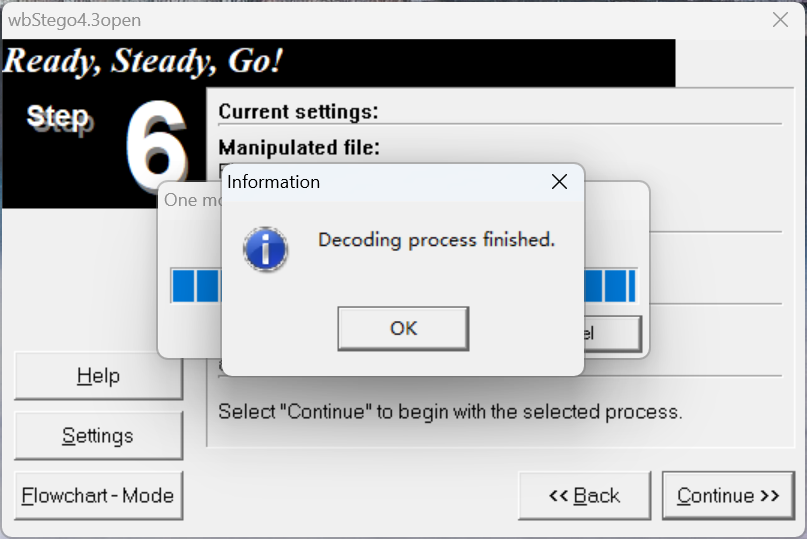

# 2024 羊城杯网络安全大赛 Misc Writeup

有段时间没有做CTF题了，感觉有些生疏了都，很可惜赛中差一题就能AK了

因此这个愿望只能留给学弟去实现了，之后可能真正能好好打CTF的机会也不多了吧
<!--more-->

> 本文中涉及的具体题目附件可以进我的[知识星球](https://t.zsxq.com/an6p6)获取

## 题目名称 Checkin
题目附件给了一个压缩包，里面有一个Flag.txt

压缩包注释里的字符串base58解码后得到:Welcome2GZ


用vscode打开那个FLag.txt，发现有很多NULL字符，把NULL字符删掉然后导入010可以得到一个pacpng流量包文件

翻看流量包，发现里面主要是TLSv1.3和SMB3.1.1的流量

解密TLS需要 RSA私钥文件 或者 log日志文件，因此猜测跟之前txt文件中的那些NULL字符有关

赛后才猛然想起，很早之前自己博客中写过TXT的隐写还可以用wbStego4open这个工具

因此我们把之前得到的Welcome2GZ作为密钥用wbStego4open去解密TXT就能得到log日志文件



得到日志文件后用wireshark导入即可正常解密TLS流量（这里不清楚的话可以看我另一篇流量分析的博客）

然后翻看TLS流量，在流33中发现传输了一个flag.gif


直接手动把这个gif提取出来，然后发现存在时间轴隐写，这里我就直接使用puzzlesolver提取了（感谢B神）


最后CyberChef转二进制然后转字符串即可得到最后的flag：DASCTF{U_0wN_1T}


## 题目名称 hiden
题目附件给了下面这两个文件


txt文件的内容如下
> GK4368 ;?:C
> 
> ;G8F 34C2WVDJ?E]8<8V[ V6@VX ?7 Di
> 
> 8<80B?8? l D]6C?BWX
> 
> DGJC0JC2 l JC2W8<80B?8?X
> 
> 8<80B?8? l DGJC0JC2]830@=8C7Wb[ @=8C36BC6 l VJG88JCVX Z 8<80B?8?
> 
> ;G8F ;?:C]34C2WQ8C78];?:Q[ Q6@QX ?7 Di
> 
> ?886G@ l D]EC84?6?K7WX
> 
> ;?:0B?8? l @=8C?66?=W D]6C?BD6?KC7W\`X X
> 
> D36 G2BC< G2 6?2ECWJC2W8<80B?8?XXi
> 
> ;?:0B?8?,G2BC< Y c. l 8<80B?8?,G2BC<.
> 
> ;G8F ;?:C]34C2WQFGBC2];?:Q[ Q;@QX ?7 Di
> 
> D]7C84?6?K7W?886G@X
> 
> D];6G8CD6?KC7W;?:0B?8?X
> 

随波逐流rot47解密可以得到下面的东西，一眼python脚本


然后再来一次rot13解密，即可得到下面这个加密脚本，刚好对应了文件名的提示：60=47+13


对照上面这个加密脚本，写一个脚本提取即可得到flag:DASCTF{12jkl-456m78-90n1234}
```python
import wave

with wave.open("hiden.wav", "rb") as f:
    wav_data = bytearray(f.readframes(-1))

file_len = int.from_bytes(wav_data[0:3*4:4], byteorder='little')
extracted_data = bytes([wav_data[i*4] for i in range(3, 3 + file_len)])
print(extracted_data.decode('utf-8', errors='ignore'))

# ok，now you find me,so the flag give you
# DASCTF{12jkl-456m78-90n1234}
```

## 题目名称 1z_misc

题目附件给了一个 天机不可泄露.txt 还有一个加密的压缩包

txt的内容如下：

>天地玄黄，宇宙洪荒；日月盈昃，辰宿列张；万物芸芸，息息相关；是以十二岁而行二十八宿，其间奥妙，待探寻，显真章。
 若女可为11，可为1124......觜可为91，亦可为725......如此往复，周而复始。
 祈解其秘：[43,101,55,16,16,1017,28,812,824,43,55,226,101,55,55,415,1017,1027,28,28,617,824,28,812,1027,16,101,16,55,1027,1017,28,16]

比赛中给出了下面这张图片作为hint


根据上面的信息，女可以是坐标(1,1)和坐标(11,24)位置，觜可以是(9,1)和(7,25)位置

根据 是以十二岁 可知十二时辰，每个时辰末尾对应的星宿为坐标开始的字

因此可以得到下面这张表


对照着可以得到以下内容：

> 心胃心奎奎心奎心胃心心心胃心心胃心奎奎奎奎胃奎心奎奎胃奎心奎心奎奎

转莫斯电码解码即可得到压缩包解压密码：E@SI1Y!


解压那个加密的压缩包后可以得到一个flag文件和一个hint.jpg

hint文件中提示了天琴座，天琴座的英文是 lyra

联想到前不久2024ISCC考察的一道题目(有人让我给你带个话)，主要用到了这个开源项目 [https://github.com/google/lyra](https://github.com/google/lyra)

因此按照Github上的步骤安装一下lyra，这个项目需要使用 bazel 进行安装，所以安装lyra之前需要先安装bazel

安装完成后，把之前那段未知数据的后缀改为.lyra，然后使用lyra解码即可得到一个wav文件


打开wav，发现语音播报了社会主义核心价值观编码，因此直接找个在线网站识别然后解密即可


`DASCTF{W0w!_You_d0_4_g00d_j0b!}`

运气很好, 上次ISCC那道题拿了一血, 这次羊城杯的这题也拿了个一血

## 题目名称 不一样的数据库
题目附件给了一个压缩包，解压密码是弱密码直接爆破就行：753951


解压后得到一张定位块丢失的二维码，修复定位块


扫码可以得到以下内容

> NRF@WQUKTQ12345&WWWF@WWWFX#WWQXNWXNU

rot13解密一下得到：AES@JDHXGD12345&JJJS@JJJSK#JJDKAJKAH


> Title:passisDASCTF
> 
> UserName:passisDASCTF
> 
> Password:WBArAG6ku6ALmLGGn3iq
> 
> Notes:给你了可以找到flag吗,真相就在其中

翻看历史记录，在里面找到一段AES加密的密文

> U2FsdGVkX193h7iNsZs3RsLxH+V1zztkdS+fBy2ZQfzH77Uo4l3hSWplMV+GcLpAGflXlQuPTU5qIkOY7xJN9A==


用DASCTF作为密钥解一下这个AES即可得到flag:DASCTF{snsnndjahenanheanjjskk12235}


## 题目名称 miaoro
翻看流量包，发现执行的命令在请求头的 GWHT 字段中

在流10中发现执行了 echo Th15_11111111s_pP@sssssw000rd!!!>pass.txt 命令


在流13中发现下载了一个secret.txt


base64解码响应的数据，发现有一个数据逆序的压缩包


手动提取出压缩包

用之前得到的密码：Th15_11111111s_pP@sssssw000rd!!!

解压压缩包可以得到一张 flag2.jpg 图片

根据题面的提示, 这个流量是某个漏洞利用工具的流量, 一开始不知道是哪个工具

因此我把响应包中的html代码复制出来并渲染,然后用谷歌识图搜索,很容易就搜到了是 shiro-attacker 的流量


对照着这篇 [参考文章](https://xdym11235.com/archives/91.html), 一步步进行解密

发现shiro-attacker内置字典的第十个密钥就是本题的密钥:`MTIzNDU2Nzg5MGFiY2RlZg==`

因此我们可以根据参考文章中的步骤用上面那个密钥进行解密


然后使用 `SerializationDumper` 工具进行反序列化, 这里要注意先把前十六字节(IV)删去


反系列化完后即可得到第一段flag:DASCTF{B916CFEB-C40F-45D6-A7BC-

然后再回头看之前得到的那个flag2.jpg

用010的模板功能调整一下图片的宽, 可以得到下图


上网搜了一下, 发现是猫猫字母


对照着上面的这个表即可得到第二段flag:EBOFDELQDIAA}

DASCTF{B916CFEB-C40F-45D6-A7BC-EBOFDELQDIAA}

## 题目名称 so_much
题目附件给了一个 c2hpZnQh.ad1 文件

使用 FTK image 进行挂载发现需要密码,文件名base64解码后可以得到提示:shift!


010打开, 发现文件末尾还有一段提示


结合之前得到的shift, 猜测挂载密码就是按shift键后的1234567即:!@#$%^&

挂载后得到 0.crypto-343.crypto 这344个文件, 但是仔细查看发现其实一共只有两种文件, 因此猜测是转二进制

编写以下脚本读取二级制数据
```python
import hashlib
import libnum


def get_file_md5(file_path):
    md5_hash = hashlib.md5()
    with open(file_path, "rb") as file:
        for chunk in iter(lambda: file.read(4096), b""):
            md5_hash.update(chunk)
    return md5_hash.hexdigest()


res = ''
if __name__ == "__main__":
    md5_0 = "a07e73084ba2272d40469ef294c45200"
    md5_1 = "8a700277f3452770a74c4a2f7a91bbf9"
    for i in range(2, 344):
        filename = f"{i}.crypto"
        if get_file_md5(filename) == md5_0:
            res += '0'
        else:
            res += '1'
    print(libnum.b2s(res))
    # b'4he_key_is_700229c053b4ebbcf1a3cc37c389c4fa'b'4he_key_is_700229c053b4ebbcf1a3cc37c389c4fa'
```
得到: 4he_key_is_700229c053b4ebbcf1a3cc37c389c4fa

然后在网上搜到后缀为.crypto的文件可以用Encrypto这个工具解密

用上面得到的密钥解密0.crypto和1.crypto即可得到最后的flag:DASCTF{85235bd803c2a0662b771396bce9968f}

---

> 作者: [Lunatic](https://goodlunatic.github.io)  
> URL: https://goodlunatic.github.io/posts/4a27616/  

