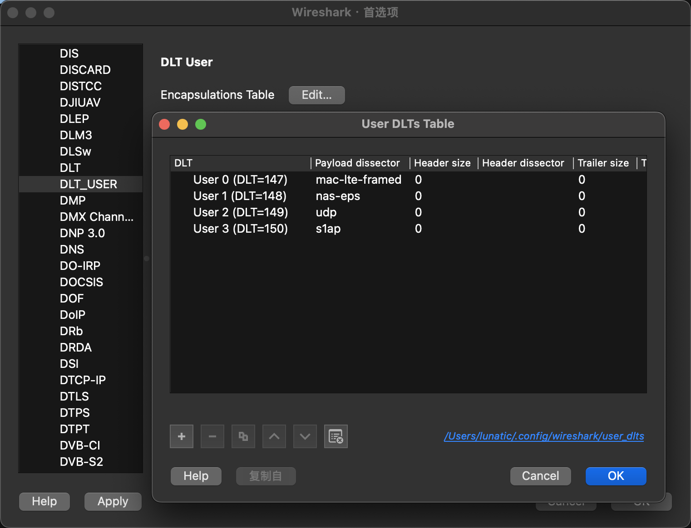
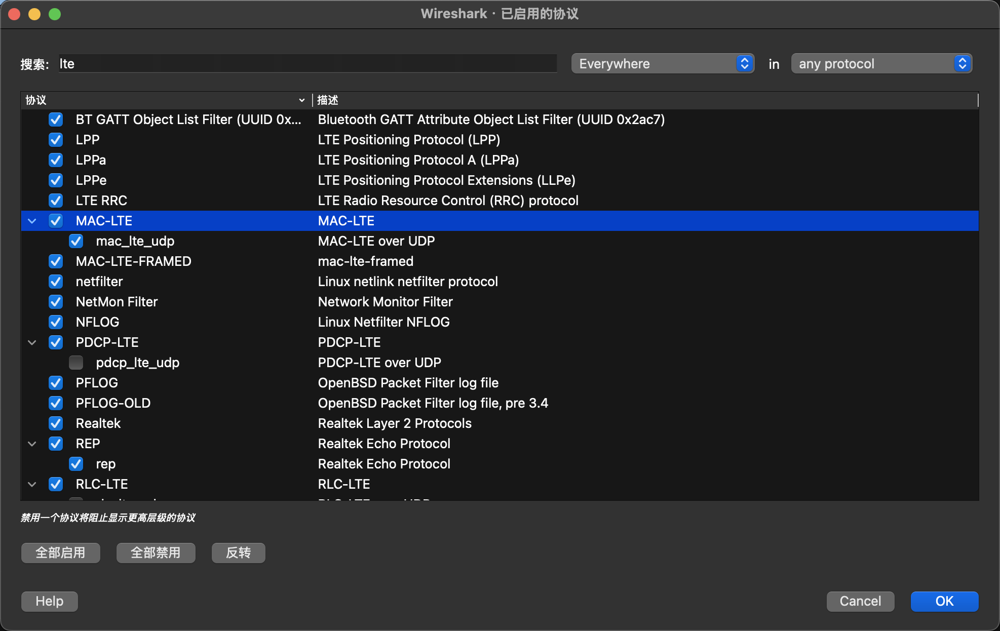
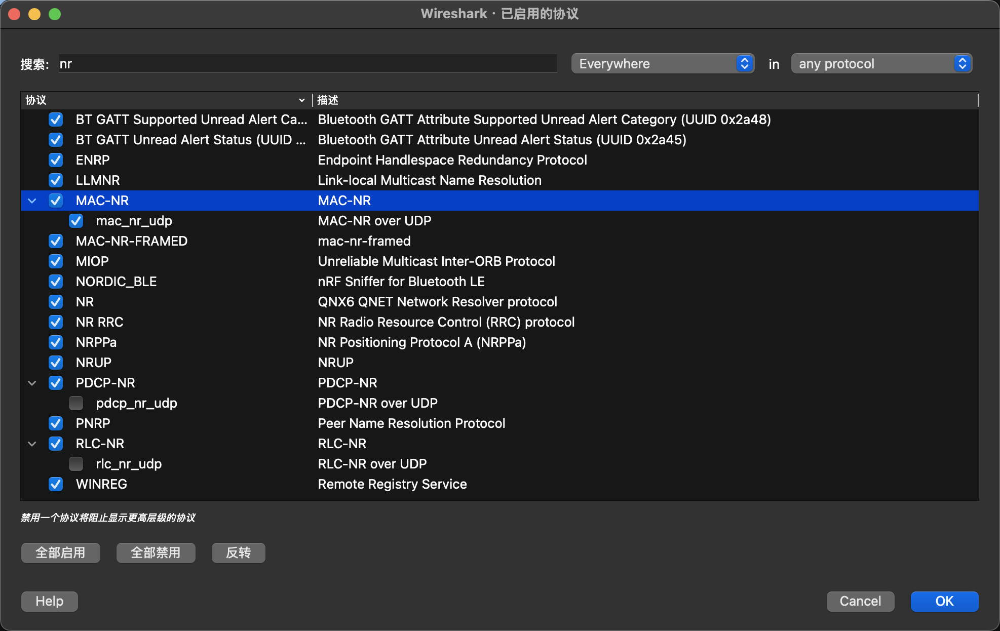
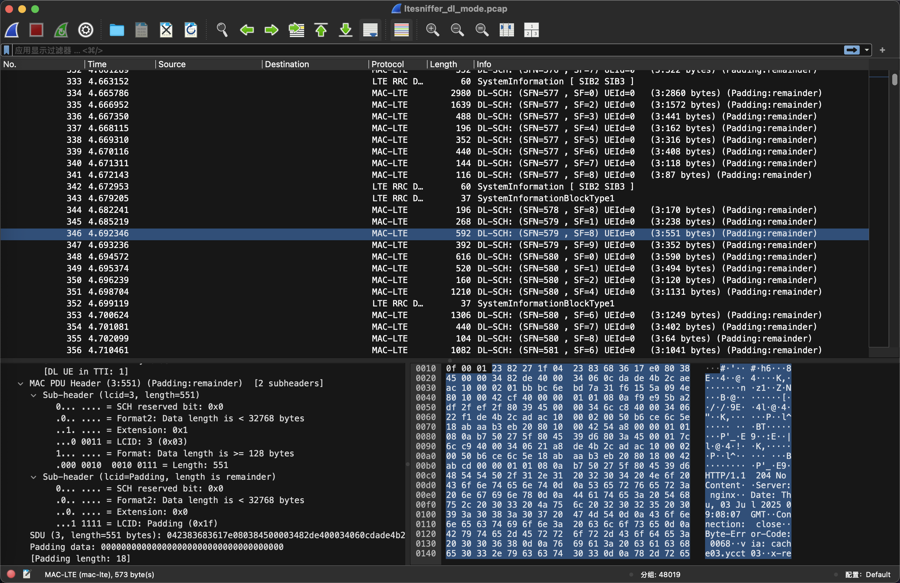

# 如何给Wireshark添加LTE和NR支持

**最近在研究LTE和NR的空口流量分析，发现Wireshark默认是不支持解析这两种协议的**

**因此需要我们手动进行一些操作来支持WIreshark对LTE和NR空口流量的解析**
<!--more-->

首先需要依次点击 首选项(Preference) -> 协议(Protocols) -> DLT User

然后在 User DLTs Table 中添加如下内容

完成以上操作后依次点击 分析 -> 启用的协议

启用 MAC-LTE 和 MAC-NR 条目下的所有协议

完成以上操作后，我们就能用Wireshark解析pcap格式的空口流量包了

参考连接：

https://docs.srsran.com/projects/4g/en/latest/general/source/4_troubleshooting.html#examining-pcaps-with-wireshark

---

> 作者: [Lunatic](https://goodlunatic.github.io)  
> URL: https://goodlunatic.github.io/posts/4c7a04a/  

