# 2023 台州市网络安全大赛 Misc Writeup

**2023 台州市网络安全大赛 Misc Writeup**
<!--more-->

本文中涉及的具体题目附件可以进我的 [知识星球](https://t.zsxq.com/an6p6) 获取

## 题目名称 这是神马

附件给了一个流量包，打开翻看发现是 冰蝎AES-CBC 流量分析，并且告诉了我们密钥：`$key="144a6b2296333602"`

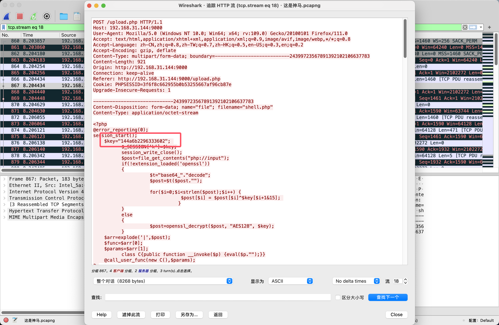

然后发现流量中传输了一个加密后的 flag.tar.gz

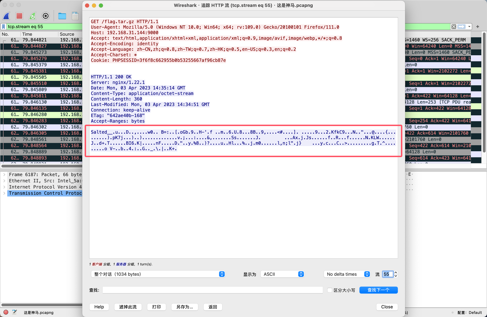

我们直接手动提取出来保存为 flag.tar.gz，然后我们在流量包中解密冰蝎流量，可以得到加密的命令

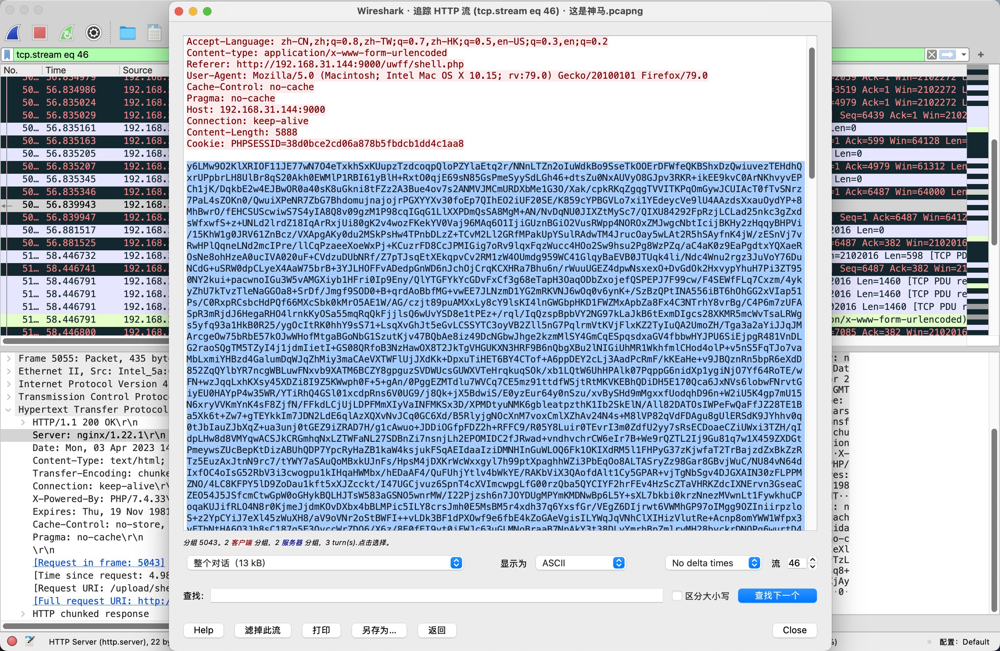

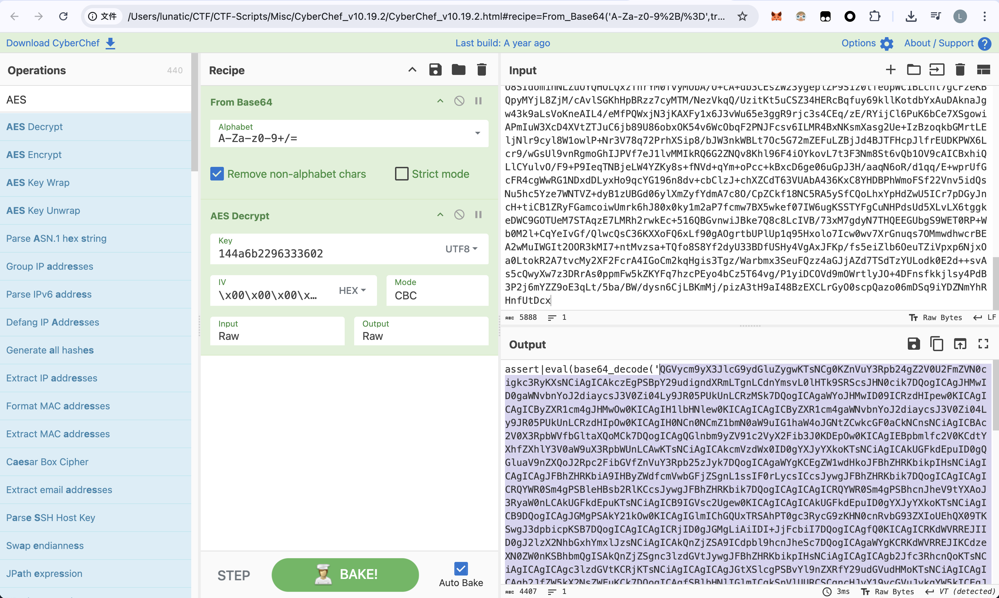

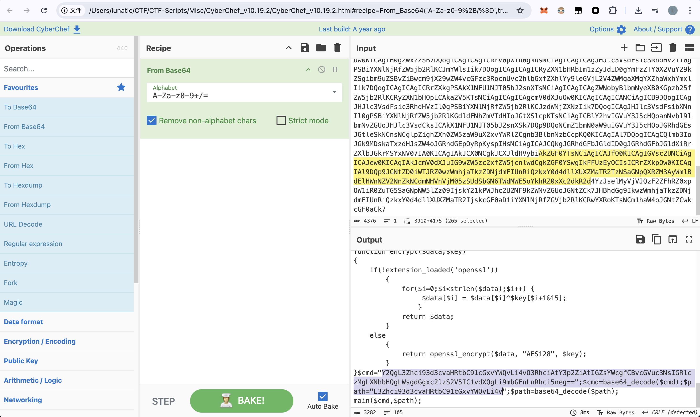

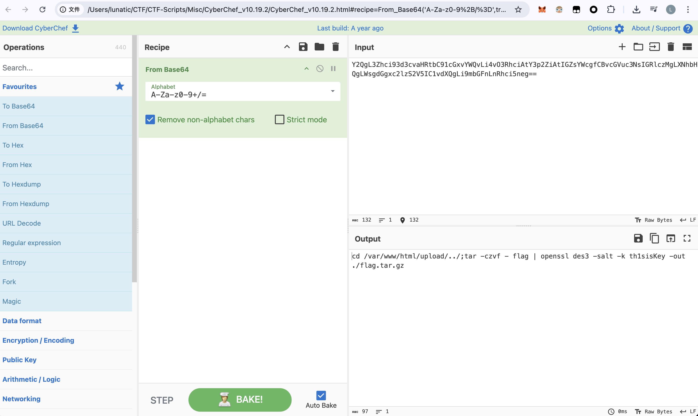

命令中也直接告诉了我们加密的密钥，因此我们直接用以下命令解密还原即可

```bash
openssl des3 -d -salt -k th1sisKey -in flag.tar.gz -out flag_decrypted.tar.gz
```

解密后解压可以得到一个 flag 文件，内容如下：

> 🙃💵🌿🎤🚪🌏🐎🥋🚫😆✅✉🚰🚹🎤💧📂👑🚫ℹ🍴😎ℹ🚨📮🛩🥋🥋🔪☀🌉😡👑😂🌊⌨🚪🚹😎🎈💧🕹💧🏎☃ℹ☃🔪🍌✅😇🍍⌨🌿💧🌊🎅☂⏩🌊🍵📮☀💵⌨☂📮😇☂🐍😆☀🚪🚹🍵💧🌏🚫😆🐘🐅😀🚰🐍🙃💧🗒🗒

最后我们用上面的密钥 `th1sisKey` 再解一次 emoji-aes 即可得到 flag：`DASCTF{342bffc5e8e16f0cc83bbd298efe803e}`

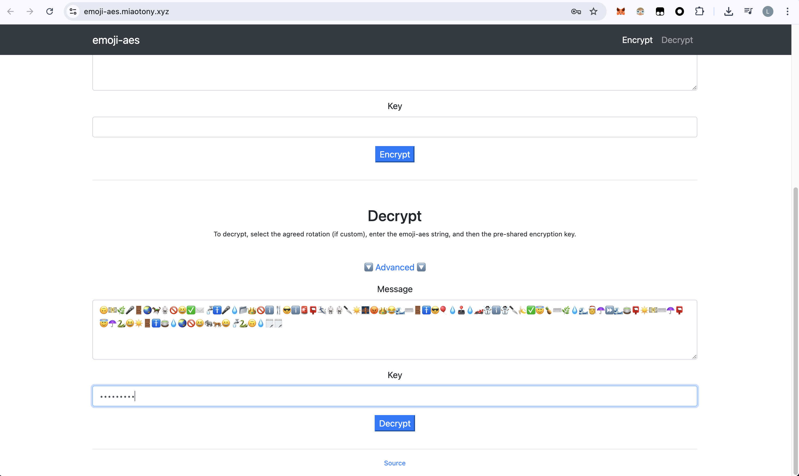

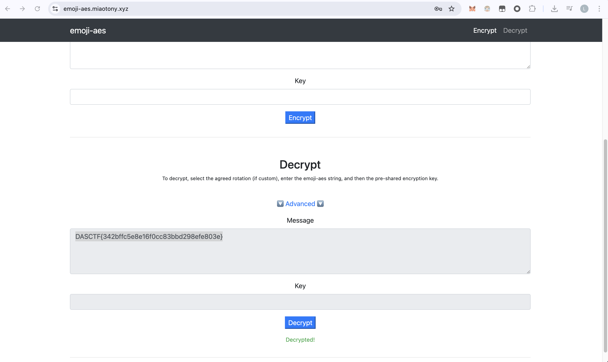

## 题目名称 李先生的计算机

题面信息如下：

> 有一天晚上，李先生毕业多年的"大学同学"找他借钱。你知道对方的银行卡号和李先生借给他多少钱吗？
> 
> flag格式：DASCTF{金额_银行卡号}，如：DASCTF{100_1234567890}

题目附件给了一个 `2.ad1` 文件，我们可以拿 FTK Imager 挂载一下

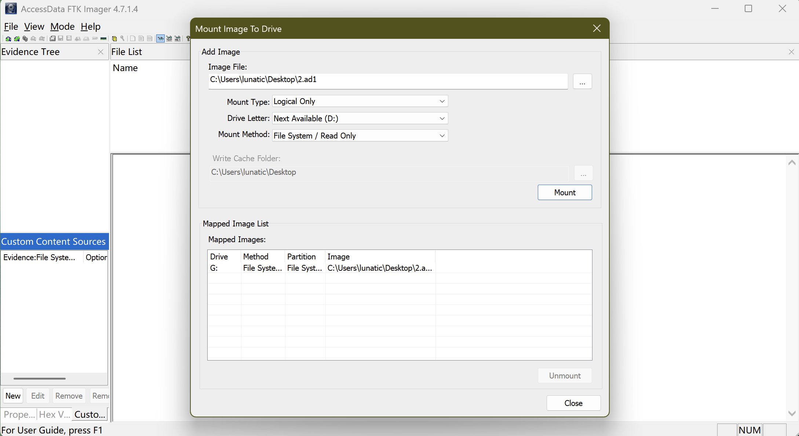

然后发现有网易邮箱大师的数据目录

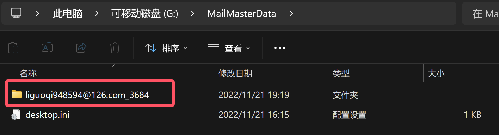

直接导出，发现是 sqlite 数据库，直接在 vscode 中用 SQLite 插件打开，可以得到如下关键信息

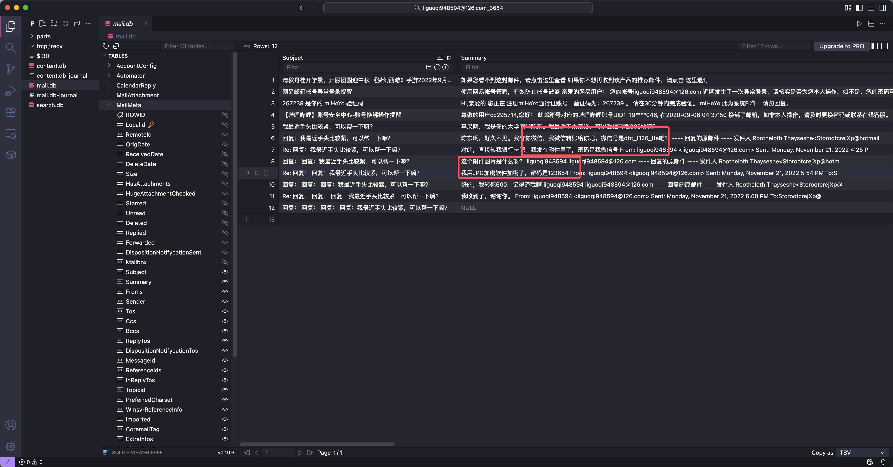

然后在附件中有个 1 文件，010 打开发现是个加密的 7z 压缩包，压缩包密码是上面的：`dbt_1126_tta`

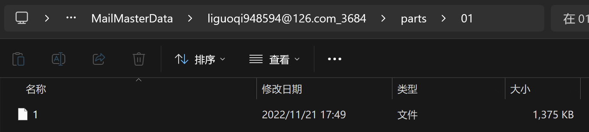

因此我们改后缀为.7z解压，可以得到如下这张 JPG 图片


根据邮件提示，这张图片用 JPG 加密软件加密了，经过尝试发现是 JPHS，并且解密密码也告诉我们了：`123654`

直接用 JPHS 解密即可得到银行卡号：`6222025567723373838`

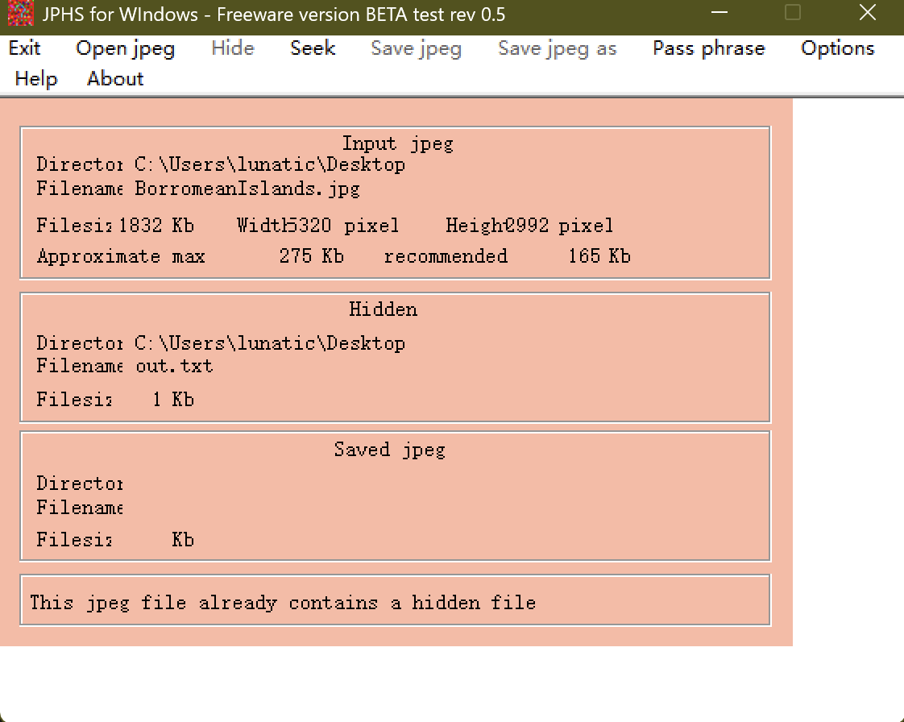

综上，最后的 flag 为：`DASCTF{300_6222025567723373838}`

## 题目名称 Black Mamba

附件给了一张`Black Mamba.jpg`，但是 010 打开发现是 PNG 图片的数据，因此改后缀为 .png 然后再用 010 打开

发现图片末尾有多余数据，我们手动提取出来

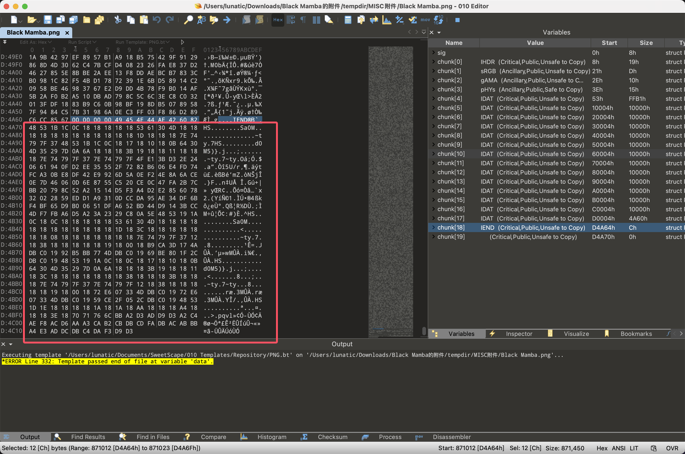

发现异或一个 0x18 可以得到一个加密的压缩包

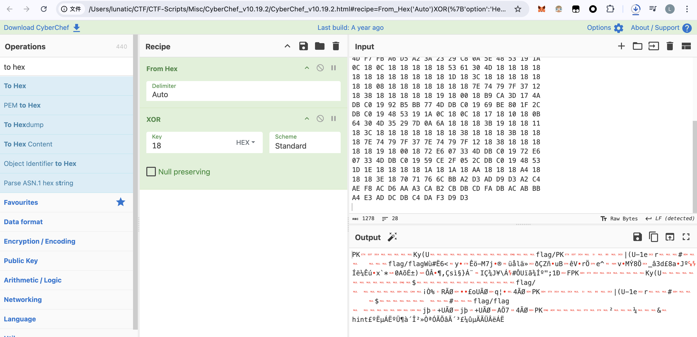

 并且压缩包注释中给了提示，猜测是弱密码
 
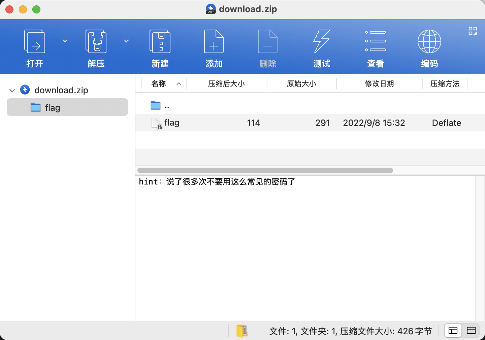

用字典爆破一下即可得到解压密码：`1qaz@WSX`

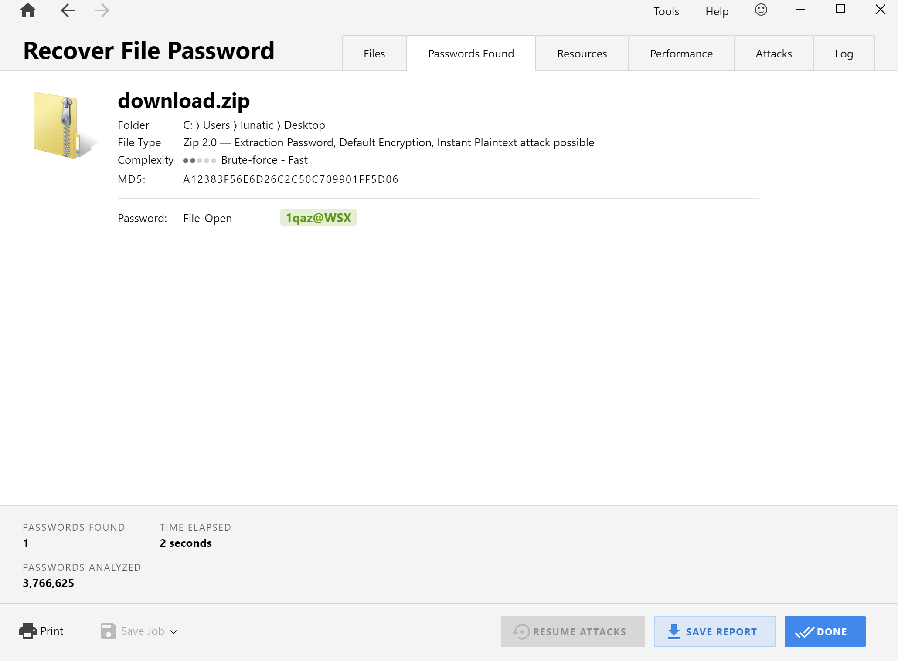

解压后可以得到一个 flag 文件，内容如下：

```
EAOJYU?TRX>{XPFABY{8{24+

有人好像对我键盘做了点手脚，看起来像坏了一样。
```

根据提示，猜测是换了一种键盘布局，经过尝试发现是用了 Dvorak 键盘布局

写个脚本转换一下即可得到最后的 flag：`DASCTF{KOBE_BRYANT_8_24}`

```python
qwerty_lower = r"""qwertyuiop[]{}-=_+\asdfghjkl;'zxcvbnm,./"""
dvorak_lower = r"""',.pyfgcrl/=?+[]{}|aoeuidhtns-;qjkxbmwvz"""

qwerty_upper = r"""QWERTYUIOP[]{}-=_+\ASDFGHJKL;'ZXCVBNM,./"""
dvorak_upper = r""""<>PYFGCRL/=?+[]{}|AOEUIDHTNS_:QJKXBMWVZ"""

# 构建映射字典
d2q = str.maketrans(dvorak_lower + dvorak_upper,qwerty_lower + qwerty_upper)
q2d = str.maketrans(qwerty_lower + qwerty_upper,dvorak_lower + dvorak_upper)

def dvorak_to_qwerty(text: str) -> str:
    return text.translate(d2q)

def qwerty_to_dvorak(text: str) -> str:
    return text.translate(q2d)

if __name__ == "__main__":
    text = "EAOJYU?TRX>{XPFABY{8{24+"
    print(dvorak_to_qwerty(text)) # DASCTF{KOBE_BRYANT_8_24}
    print(qwerty_to_dvorak(text))
```

当然，也可以使用随波逐流解密

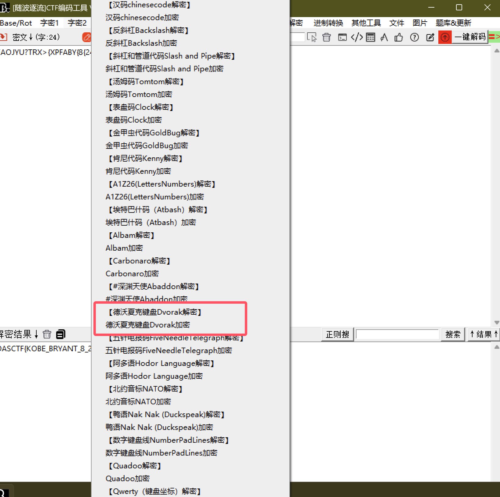


---

> 作者: [Lunatic](https://goodlunatic.github.io)  
> URL: https://goodlunatic.github.io/posts/51c437e/  

