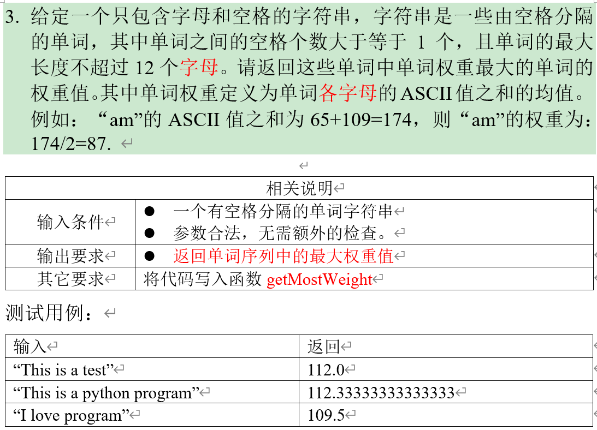

# Preparation for Programming Proficiency Exam

 时间过得真快呀，回想上次做算法题应该是大一的时候了

没想到现在回过头来，依旧需要重新拾起自己的算法功底
<!--more-->

## 输入与输出

| 函数                       | 用法                                                                                   |
| ------------------------ | ------------------------------------------------------------------------------------ |
| `scanf()`                | 默认是以空白字符（空格、制表符、换行符）为分隔，当有多组样例的时候，可以使用`while(scanf("%d",&a)!=EOF)`来进行多组样例的输入         |
| `getchar()`              | 从标准输入流中读取一个字符，常用来处理上一行末尾留下的换行符                                                       |
| `fgets()`                | `fgets(a,MAX_LEN,stdin);`读取一整行的文本，末尾会多一个换行符；可使用`str[strcspn(str, "\n")] = '\0';`进行处理 |
| `cin.getline()`          | `cin.getline(str, MAXN);` 其中 str 是 `char[]`，读取一整行的文本，末尾没有换行符                         |
| `getline()`              | `getline(cin,str)`其中 str 是 `string str`，读取一整行的文本，末尾没有换行符                             |
| `sprintf()`              | `sprintf(s, "Integer: %d, Float: %.2f", num, fnum);`用于将格式化的数据写入到一个字符串中               |
| `istringstream iss(str)` | 流化一个字符串，从一个字符串中读取数据，包含在`#include <sstream>` 文件头中                                     |
|                          |                                                                                      |
|                          |                                                                                      |

## 一些函数

### 字符串相关的一些函数

| 函数                      | 用法                                                                          |
| ----------------------- | --------------------------------------------------------------------------- |
| `substr(pos,len)`       | `s.substr(pos,len)`返回从字符串的 `pos` 位置开始，长度为 `len` 的子字符串                       |
| `sprintf(字符数组,格式串,变量)`  | 将变量按格式字符串的格式写入到字符数组                                                         |
| `sscanf(字符数组,格式串,&变量)`  | 从字符数组中按格式串提取变量，返回成功提取的变量数量                                                  |
| `strcspn(str,"\\n")`    | 返回字符串 str 中第一个出现的字符 \\n 的位置                                                 |
| `strcmp(s1,s2)`         | 比较两个字符串的字典序大小, 如果`s1=s2`返回0, `s1>s2`返回正值, `s1<s2`返回负值                       |
| `strcat(s1,s2)`         | 将字符串`s2`拼接到`s1`后面                                                           |
| `strcpy(s1,s2)`         | 将字符串s2复制到字符串s1中                                                             |
| `string.erase(pos,len)` | `.erase()` 是 `string` 类型的成员函数,用于删除从 `pos` 开始长度为 `len` 的字符串                  |
| `stoi(str)`             | 将 `string` 类型的字符串转换为 `int` 类型，并且`stoi` 会隐式地将 `char` 数组转换为 `string`，然后再转换为整数 |
| `to_string()`           | 用于将各种基本数据类型（如 `int、float、double、long `等）转换为字符串`string`                      |
| `remove()`              | `remove(token.begin(), token.end(), ' ')`将所有空格元素移动到末尾，并返回第一个空格的迭代器          |
| `atoi()`                | 用于将字符串表示的整数转换为实际的整数值`const char *str = "12345"; int num = atoi(str);`       |
| `stoi()`                | 用于将字符串转换为整数`string str = "12345";int num = stoi(str);`                      |
| `stod()`                | 用于将字符串转换为双精度浮点数`string str = "123.456";double num = stod(str);`             |
| `to_string()`           | 用于将数值类型（如整数、浮点数等）转换为 `string` 类型                                            |
### C++的STL中一些常用的库函数
#### vector 数组

| 成员函数                  | 用法                                   |
| --------------------- | ------------------------------------ |
| `size()`              | 返回数组当前包含的元素数量                        |
| `empty()`             | 检查当前的数组是否为空, 是则返回`true`, 否则返回`false` |
| `push_back()`         | 在数组末尾添加一个元素                          |
| `pop_back()`          | 删除数组末尾最后一个元素                         |
| `erase(pos,len)`      | 删除数组从下标`pos`开始长度为`len`的元素            |
| `front()`             | 返回数组第一个元素的引用                         |
| `back()`              | 返回数组最后一个元素的引用                        |
| `begin()`             | 返回数组第一个元素的迭代器                        |
| `end()`               | 返回数组最后一个元素后一个位置的迭代器                  |
| `clear()`             | 清空数组                                 |
| `vector<int> v(10)`   | 初始化一个长度为10,元素默认为0的vector             |
| `vector<int> v(10,5)` | 初始化一个长度为10,元素默认为5的vector             |

#### map 关联容器
> `map`会自动按照键值排序

| 成员函数            | 用法                                   |
| --------------- | ------------------------------------ |
| `size()`        | 返回容器当前包含元素的数量                        |
| `empty()`       | 检查当前的数组是否为空, 是则返回`true`, 否则返回`false` |
| `begin()`       | 返回数组第一个元素的迭代器                        |
| `end()`         | 返回数组最后一个元素后一个位置的迭代器                  |
| `insert()`      | 可以插入一个`pair`                         |
| `find()`        | 若找到该元素则返回指向该元素的迭代器，否侧返回`.end()`      |
| `lower_bound()` | 返回大于等于x的最小的数的迭代器                     |
| `upper_bound()` | 返回大于x的最小的数的迭代器                       |
| `clear()`       | 清空容器                                 |
```c++
map<string, int>mp;
mp["example"] = 1;
```
#### pair 模板类
```c++
using namespace std;
typedef pair<int, int> PII;
vector<PII> v;

cout << v[i].first << " " << v[i].second << '\n';
```

#### queue 队列

| 成员函数      | 用法        |
| --------- | --------- |
| `size()`  | 返回队列长度    |
| `empty()` | 返回队列是否为空  |
| `push()`  | 向队尾插入一个元素 |
| `front()` | 返回队头元素    |
| `back()`  | 返回队尾元素    |
| `pop()`   | 弹出队头元素    |

```c++
queue<int> q;// 循环队列

struct Person {
	int l, r;
	// 结构体rec中必须重载小于号
	bool operator < (const Person &w) const {
		return l * r < w.l * w.r;
	}
};

priority_queue<int> q;// 大根堆
priority_queue<int, vector<int>, greater<int> q;// 小根堆
priority_queue<pair<int, int>>q;
```

#### priority_queue 优先队列
默认定义的话就是大根堆 `priority_queue<int> heap;`

如果需要定义小根堆的话 `priority_queue<int, vector<int>, greater<int >> heap`

| 成员函数     | 用法     |
| -------- | ------ |
| `push()` | 插入一个元素 |
| `top()`  | 返回堆顶元素 |
| `pop()`  | 弹出堆顶元素 |

```c++
priority_queue<int> maxHeap;
int main() {
	maxHeap.push(10);
	maxHeap.push(20);
	maxHeap.push(5);
	maxHeap.push(30);
	while (!maxHeap.empty()) {
		cout << maxHeap.top() << '\n';
		maxHeap.pop();
	}
	return 0;
}
```

```c++
priority_queue<int, vector<int>, greater<int> >minHeap;
int main() {
	minHeap.push(10);
	minHeap.push(20);
	minHeap.push(5);
	minHeap.push(30);
	while (!minHeap.empty()) {
		cout << minHeap.top() << '\n';
		minHeap.pop();
	}
	return 0;
}
```

#### stack 适配器容器
> 栈是一种 $LIFO(后进先出)$ 的数据结构
> 
> `stack<int> stk;`

| 成员函数      | 用法        |
| --------- | --------- |
| `push()`  | 将元素压入栈顶   |
| `pop()`   | 移除栈顶元素    |
| `top()`   | 访问栈顶元素    |
| `empty()` | 判断栈是否为空   |
| `size()`  | 返回栈中的元素数量 |

#### set 关联容器
> 集合的元素具有唯一性
> `set<int> s;`

| 成员函数            | 用法                                                           |
| --------------- | ------------------------------------------------------------ |
| `insert()`      | 将元素插入到集合中                                                    |
| `erase()`       | 删除指定元素, 参数可以是一个元素, 也可以是一个迭代器                                 |
| `find()`        | 查找指定元素, 并返回指向该元素的迭代器, 如果找不到则返回 `set.end()`, 可以通过 `*it` 来访问元素 |
| `size()`        | 返回集合中的元素数量                                                   |
| `count()`       | 判断某个元素是否存在, 返回0或1                                            |
| `clear()`       | 清空集合                                                         |
| `lower_bound()` | 返回大于等于x的最小的数的迭代器                                             |
| `upper_bound()` | 返回大于x的最小的数的迭代器                                               |
set的遍历
```c++
for (set<int>::iterator it = myset.begin();it!=myset.end();it++) {
		printf("%d ", *it);
	}
// 在C++11以上版本可以用auto
for (auto item : myset) {  
        printf("%d ", item);  
    }
```
#### bitset 模板类
定义 `bitset<10000> S`;

| 成员函数       | 用法         |
| ---------- | ---------- |
| `count()`  | 返回有多少个1    |
| `any()`    | 判断是否至少有一个1 |
| `none()`   | 判断是否全为0    |
| `set()`    | 把所有位置置为1   |
| `set(k,v)` | 将第k位置成v    |
| `reset()`  | 把所有位置成0    |
| `flip()`   | 等价于~       |
| `flip(k)`  | 把第k位取反     |

#### 查找相关的函数

| 函数                                                              | 用法                                                                                                     |
| --------------------------------------------------------------- | ------------------------------------------------------------------------------------------------------ |
| `find(iterator first, iterator last, const T& value);`          | 在范围内**线性查找**第一个等于给定值的元素, 并返回迭代器                                                                        |
| `binary_search(iterator first, iterator last, const T& value);` | 检查一个值是否存在于一个已排序的范围中, 并返回 `bool` 类型的结果                                                                  |
| `lower_bound(iterator first, iterator last, const T& value);`   | 用于在有序序列中查找第一个不小于 `value` 的元素, 并返回迭代器, 获取具体下标需要减去 `begin()`                                             |
| `upper_bound(iterator first, iterator last, const T& value);`   | 用于在有序序列中查找第一个严格大于 `value` 的元素, 并返回迭代器, 获取具体下标需要减去 `begin()`                                            |
| `equal_range(iterator first, iterator last, const T& value);`   | 查找范围 `[first, last)` 中所有等于给定值的元素的区间, 返回一个 `pair` , `first` 指向第一个等于值的元素, `second`指向最后一个等于值的元素的**后一个位置** |
|                                                                 |                                                                                                        |


## 常用算法

### 排序算法
#### 冒泡排序

```c++
//冒泡排序的基本思想是，将数组划分为尚未有序的部分（左边）和已经有序的部分（右边），
//每一轮从左到右遍历尚未有序部分的元素，判断相邻两个元素的大小，
//如果左大右小，那么就交换这两个元素，
//这样一直交换，直到把尚未有序部分中的最大元素交换到尚未有序部分的最右边。
#include <bits/stdc++.h>
using namespace std;
#define MAXN 100

int a[MAXN];


int main() {
	freopen("input.txt", "r", stdin);
	int n;
	scanf("%d", &n);
	for (int i = 0; i < n; i++) scanf("%d", &a[i]);
//	变量i这里的作用主要是用来确定需要执行的轮数:n-1
//	变量j表示这一轮需要比较的次数:n-i
	for (int i = 1; i < n; i++) {
		for (int j = 0; j < n - i; j++) {
			if (a[j] > a[j + 1]) swap(a[j], a[j + 1]);
		}
	}
	for (int i = 0; i < n; i++) {
		printf("%d", a[i]);
		if (i < n - 1) printf(" ");
	}
	return 0;
}
```

#### 快速排序

分治思想，时间复杂度为O(nlogn)，不稳定

```c++
void quick_sort(int a[], int l, int r) {
	if (l >= r) return;
	int x = a[l], i = l - 1, j = r + 1;
	while (i < j) {
		while (a[++i] < x);
		while (a[--j] > x);
		if (i < j) swap(a[i], a[j]);
	}
	quick_sort(a, l, j);
	quick_sort(a, j + 1, r);
}
```

#### 归并排序

分治思想，时间复杂度为O(nlogn)，稳定

```c++
const int N = 1e6 + 10;
int a[N], tmp[N];

void merge_sort(int a[], int l, int r) {
	if (l >= r) return ;
	int mid = l + r >> 1;
	merge_sort(a, l, mid);
	merge_sort(a, mid + 1, r);
	int cnt = 0, i = l, j = mid + 1 ;
	while (i <= mid && j <= r) {
		if (a[i] <= a[j]) tmp[cnt++] = a[i++];
		else tmp[cnt++] = a[j++];
	}
	while (i <= mid) tmp[cnt++] = a[i++];
	while (j <= r) tmp[cnt++] = a[j++];
	for (int i = l, j = 0; i <= r; i++, j++) a[i] = tmp[j];
}
```

### 查找

```c++
#include <bits/stdc++.h>
using namespace std;
typedef long long ll;
#define MAXN 100005

int a[MAXN];

// 顺序查找
int linearSearch(int a[], int n, int target) {
	for (int i = 0; i < n; i++) {
		if (a[i] == target) return i;
	}
	return -1;
}

// 二分查找-适用于有序的情况
int binarySearch(int a[], int n, int target) {
	int left = 0, right = n - 1, mid;
	while (left <= right) {
		mid = left + (right - left) / 2;
		printf("%d\n", mid);
		if (a[mid] == target) return mid;
		else if (a[mid] < target) left = mid + 1;
		else right = mid - 1;
	}
	return -1;
}

int main() {
	freopen("input.txt", "r", stdin);
	int n;scanf("%d", &n);
	for (int i = 0; i < n; i++) scanf("%d", &a[i]);
	int target;scanf("%d", &target);
	int pos = linearSearch(a, n, target);
//	int pos = binarySearch(a,n,target);
	if (pos != -1) printf("%d", pos + 1);
	else printf("NO");
	return 0;
}
```

#### 二分查找

**整数查找**

```c++
int bin_searchh(int a[], int len, int x, int &cnt) {
	int l = 0, r = len - 1, mid;
	while (l <= r) {
		cnt++;
		mid = l + r >> 1;
		if (a[mid] < x) l = mid + 1;
		else if (a[mid] > x) r = mid - 1;
		else return mid;
	}
	return -1;
}
```

**整数左右边界二分**

```c++
#include <bits/stdc++.h>
using namespace std;

const int N = 100010;
int a[N];

// 找左边界
int binsearch_left(int l, int r, int x) {
	while (l < r) {
		int mid = l + r >> 1;
		if (a[mid] >= x) r = mid;
		else l = mid + 1;
	}
	return l;
}

// 找右边界
int binsearch_right(int l, int r, int x) {
	while (l < r) {
		int mid = l + r + 1 >> 1;
		if (a[mid] <= x) l = mid;
		else r = mid - 1;
	}
	return l;
}

int main() {
	freopen("input.txt", "r", stdin);
	int n, m, x, mid;
	scanf("%d%d", &n, &m);
	for (int i = 0; i < n; i++) scanf("%d", &a[i]);
	while (m--) {
		scanf("%d", &x);
		int l = 0, r = n - 1;
		l = binsearch_left(l, r, x);
		if (a[l] != x) printf("-1 -1\n");
		else {
			printf("%d ", l);
			l = 0, r = n - 1;
			l = binsearch_right(l, r, x);
			printf("%d\n", l);
		}
	}
	return 0;
}
```

例题1-Acwing789-数的范围

**浮点数二分**

```c++
#include <bits/stdc++.h>
using namespace std;

int main() {
	freopen("input.txt", "r", stdin);
	double x;
	while (scanf("%lf", &x) != EOF) {
		double l = 0, r = x, mid;
		while (r - l > 1e-8) {
			mid = (l + r) / 2;
			if (mid * mid >= x) r = mid;
			else l = mid;
		}
		printf("%lf\n", l);
	}
	return 0;
}
```

### 高精度

#### 高精度比较

```c++
// 高精度比较
vector<int> max_vec(vector<int>A, vector<int>B) {
	if (A.size() > B.size()) return A;
	if (A.size() < B.size()) return B;
	for (int i = A.size() - 1; i >= 0; i++) {
		if (A[i] > B[i]) return A;
		if (A[i] < B[i]) return B;
	}
	return A;
}
```

#### 高精度加法

```c++
vector<int> add(vector<int>&A, vector<int>&B) {  
    vector<int>C;  
    int tmp = 0;  
    for (int i = 0; i < A.size() || i < B.size(); i++) {  
        if (i < A.size()) tmp += A[i];  
        if (i < B.size()) tmp += B[i];  
        C.push_back(tmp % 10);  
        tmp /= 10;  
    }  
    if (tmp != 0) C.push_back(1);  
    return C;  
}
```

#### 高精度减法

```c++
// 判断A >= B ?
bool cmp(vector<int>&A, vector<int>&B) {
	if (A.size() != B.size()) return A.size() > B.size();
	for (int i = A.size() - 1; i >= 0; i--) {
		if (A[i] != B[i]) return A[i] > B[i];
	}
	return true;
}

vector<int> sub(vector<int>&A, vector<int>&B) {
	vector<int>C;
	int tmp = 0;
	for (int i = 0; i < A.size(); i++) {
		tmp = A[i] - tmp;
		if (i < B.size()) tmp -= B[i];
		C.push_back((tmp + 10) % 10);
		if (tmp < 0) tmp = 1;
		else tmp = 0;
	}
//	处理前导零，如果C的长度大于1，并且最后一位是0
	while (C.size() > 1 && C.back() == 0) C.pop_back();
	return C;
}
```

#### 高精度乘法

**A \* b的情况**

```c++
vector<int> mul(vector<int>&A, int b) {
	vector<int>C;
	int tmp = 0;
//	这里要注意，i结束了但是tmp还没处理完的情况
	for (int i = 0; i < A.size() || tmp != 0; i++) {
		if (i < A.size()) tmp += A[i] * b;
		C.push_back(tmp % 10);
		tmp /= 10;
	}
//	处理前导零
	while (C.size() > 1 && C.back() == 0)C.pop_back();
	return C;
}
```

**A \* B 的情况**

```c++
vector<int> mul(vector<int>&A, vector<int>&B) {
	int len = A.size() + B.size();
	vector<int>C(len + 1);
	for (int i = 0; i < A.size(); i++) {
		for (int j = 0; j < B.size(); j++) {
//			注意这里的下标是 i+j , 并且每一位可能由多次结果相加得到
			C[i + j] += A[i] * B[j];
		}
	}
	for (int i = 0; i < len; i++) {
		if (C[i] > 9) {
			C[i + 1] += C[i] / 10;
			C[i] = C[i] % 10;
		}
	}
	while (C.size() > 1 && C.back() == 0) C.pop_back();
	return C;
}
```

#### 高精度除法

**A / b** 商是C, 余数是 tmp 的情况

```c++
vector<int> div(vector<int>&A, int b, int &tmp) {
	tmp = 0;
	vector<int>C;
	for (int i = A.size() - 1; i >= 0; i--) {
		tmp = tmp * 10 + A[i];
		C.push_back(tmp / b);
		tmp %= b;
	}
	reverse(C.begin(), C.end());
	while (C.size() > 1 && C.back() == 0) C.pop_back();
	return C;
}
```

### 前缀和与差分

#### 前缀和

**一维前缀和**

```c++
#include <bits/stdc++.h>
using namespace std;

const int N = 1e5 + 10;
int a[N], s[N];

int main() {
	freopen("input.txt", "r", stdin);
	int n, m, l, r;
	cin >> n >> m;
	memset(a, 0, sizeof(a));
	memset(s, 0, sizeof(s));
	for (int i = 1; i <= n; i++) {
		cin >> a[i];
		s[i] = s[i - 1] + a[i];
	}
	while (m--) {
		scanf("%d%d", &l, &r);
		printf("%d\n", s[r] - s[l - 1]);
	}
	return 0;
}
```

**二维前缀和**

> 二维的情况很容易出错，建议还是画个表格辅助分析
> 
> 这里要特别注意，横轴是 y，竖轴是 x


```c++
#include <bits/stdc++.h>
using namespace std;

const int N = 1010;
int a[N][N], s[N][N];


int main() {
	freopen("input.txt", "r", stdin);
	memset(a, 0, sizeof(a));
	memset(s, 0, sizeof(s));
	int n, m, q, x1, x2, y1, y2, res;
	cin >> n >> m >> q;
	for (int i = 1; i <= n; i++) {
		for (int j = 1; j <= m; j++) {
			scanf("%d", &a[i][j]);
			s[i][j] = s[i - 1][j] + s[i][j - 1] - s[i - 1][j - 1] + a[i][j];
		}
	}
	while (q--) {
		scanf("%d%d%d%d", &x1, &y1, &x2, &y2);
		res = s[x2][y2] - s[x2][y1 - 1] - s[x1 - 1][y2] + s[x1 - 1][y1 - 1];
		printf("%d\n", res);
	}
	return 0;
}
```


#### 差分

> 差分其实就是前缀和的逆运算，比如下面的代码中，b 数组就是差分数组，a 数组是前缀和数组
> 
> 只要修改差分数组中 l 和 r 位置的两个值，就可以很方便的修改前缀和中 l 到 r 区间所有的值
> 
> 差分常用于批量修改某一区间的值的情况，核心就是 `insert()` 函数

**一维差分**

```c++
#include <bits/stdc++.h>
using namespace std;

const int N = 1010;
int a[N], b[N];

void insert(int l, int r, int c) {
	b[l] += c;
	b[r + 1] -= c;
}

int main() {
	freopen("input.txt", "r", stdin);
	memset(a, 0, sizeof(a));
	memset(b, 0, sizeof(b));
	int n, m, l, r, c;
	cin >> n >> m;
	for (int i = 1; i <= n; i++) {
		scanf("%d", &a[i]);
//		差分数组的初始化
		insert(i, i, a[i]);
	}
	while (m--) {
		scanf("%d%d%d", &l, &r, &c);
		insert(l, r, c);
	}
	for (int i = 1; i <= n; i++) {
		a[i] = a[i - 1] + b[i];
		printf("%d ", a[i]);
	}
	return 0;
}
```

**二维差分（差分矩阵）**

```c++
#include <bits/stdc++.h>
using namespace std;

const int N = 1010;
int a[N][N], b[N][N];

void insert(int x1, int y1, int x2, int y2, int c) {
	b[x1][y1] += c;
	b[x2 + 1][y1] -= c;
	b[x1][y2 + 1] -= c;
	b[x2 + 1][y2 + 1] += c;
}

int main() {
	freopen("input.txt", "r", stdin);
	int n, m, q, x1, y1, x2, y2, c;
	cin >> n >> m >> q;
	memset(a, 0, sizeof(a));
	memset(b, 0, sizeof(b));
	for (int i = 1; i <= n; i++) {
		for (int j = 1; j <= m; j++) {
			scanf("%d", &a[i][j]);
			insert(i, j, i, j, a[i][j]);
		}
	}
	while (q--) {
		scanf("%d%d%d%d%d", &x1, &y1, &x2, &y2, &c);
		insert(x1, y1, x2, y2, c);
	}
	for (int i = 1; i <= n; i++) {
		for (int j = 1; j <= m; j++) {
			a[i][j] = a[i][j - 1] + a[i - 1][j] - a[i - 1][j - 1] + b[i][j];
			printf("%d ", a[i][j]);
		}
		printf("\n");
	}
	return 0;
}
```

### 双指针

> 双指针算法可以把时间复杂度为`O(n^2)`的算法优化到`O(n)`

**最简单的分隔字符串的情况**

```c++
#include <bits/stdc++.h>  
using namespace std;  
  
const int MAXN = 100010;  
char s[MAXN];  
  
int main() {  
    freopen("input.txt", "r", stdin);  
    cin.getline(s, MAXN);  
    int len = strlen(s);  
    for (int i = 0; i < len; i++) {  
        int j = i;  
        while (j < len && s[j] != ' ') j++;  
        for (int k = i; k < j; k++) cout << s[k];  
        cout << '\n';  
        i =  j;  
    }  
    return 0;  
}
```

**例题-AcWing-799.最长连续不重复子序列**

```c++
#include <bits/stdc++.h>
using namespace std;

const int N = 1e5 + 10;
int a[N], s[N];

int main() {
	freopen("input.txt", "r", stdin);
	int n, res = 0;
	cin >> n;
	for (int i = 0; i < n; i++) scanf("%d", &a[i]);
	for (int i = 0, j = 0; i < n; i++) {
		s[a[i]]++;
		while (s[a[i]] > 1) {
//			关键部分,这里s[a[j]--的目的是确保i,j区间内每个元素出现的次数都为1
			s[a[j]]--;
			j++;
		}
		res = max(res, i - j + 1);
	}
	cout << res;
	return 0;
}
 ```

### 位运算
**n的二进制表示中第k位是几**

`lowbit(X)` 返回x的最后一位1,相当于 `x&-x` 或者 `x&(~x+1)`

`lowbit(1010)` 返回 `10`

`lowbit(1011000)` 返回 `1000`

例题1-AcWing801.求二进制中1的个数

```c++
#include <bits/stdc++.h>  
using namespace std;  
  
int lowbitt(int x) {  
    return x & -x;  
}  
  
int main() {  
    freopen("input.txt", "r", stdin);  
    int n, x;  
    cin >> n;  
    for (int i = 0; i < n; i++) {  
        scanf("%d", &x);  
        int res = 0;  
        while (x) {  
            x -= lowbitt(x);  
            res++;  
        }  
        printf("%d ", res);  
    }  
    return 0;  
}
```

> 原码、反码、补码之间的关系，假设二进制表示的 `x=1010`
> 
> 原码：0...01010
> 
> 反码：1...10101
> 
> 补码(`~x+1`)：1...10110，计算机中负数是用补码来表示的

```c++
	int n = 10,x = -n;
	for (int i = 31; i >= 0; i--) cout << (n >> i & 1);
//	00000000000000000000000000001010
	for (int i = 31; i >= 0; i--) cout << (x >> i & 1);
//	11111111111111111111111111110110
```

### 离散化(TODO)

> 整个值域的跨度很大, 但是分布很稀疏

#### 整数离散化-数组离散化

```c++
#include <bits/stdc++.h>
using namespace std;

const int N = 1e6 + 10;
int a[N];

int main() {
	freopen("input.txt", "r", stdin);
	int n;
	cin >> n;
	for (int i = 1; i <= n; i++) cin >> a[i];
	sort(a + 1, a + n + 1);
	int len = unique(a + 1, a + n + 1) - (a + 1);
	for (int i = 1; i <= len; i++) cout << a[i] << " " << i << '\n';
	return 0;
}
```

例题1-AcWing802.区间和
```c++
#include <bits/stdc++.h>
using namespace std;
typedef pair<int, int>PII;

const int N = 3e5 + 10;
int a[N], s[N];
vector<int>alls;
vector<PII>add, query;

// 二分查找第一个不小于x的数
int find(int x) {
	int l = 0, r = alls.size();
	while (l < r) {
		int mid = l + r >> 1;
		if (alls[mid] >= x) r = mid;
		else l = mid + 1;
	}
//	这里便于后续的前缀和，映射到下标从1开始的数组
	return r + 1;
}

int main() {
	freopen("input.txt", "r", stdin);
	int n, m, x, c, l, r;
	cin >> n >> m;
	for (int i = 0; i < n; i++) {
		scanf("%d%d", &x, &c);
		add.push_back({x, c});
	}
	for (int i = 0; i < m; i++) {
		scanf("%d%d", &l, &r);
		query.push_back({l, r});
//*******************************************************
		alls.push_back(l);
		alls.push_back(r);
//*******************************************************
	}
//	排序+去重
	sort(alls.begin(), alls.end());
//	把所有不重复元素放到开头，返回第一个重复元素的位置
	alls.erase(unique(alls.begin(), alls.end()), alls.end());
	for (int i = 0; i < add.size(); i++) {
		int x = find(add[i].first);
		a[x] += add[i].second;
	}
//	前缀和
	for (int i = 1; i <= alls.size(); i++) s[i] = s[i - 1] + a[i];
//	处理query
	for (int i = 0; i < query.size(); i++) {
		int l = find(query[i].first), r = find(query[i].second);
		cout << s[r] - s[l - 1] << '\n';
	}
	return 0;
}
```

### 区间合并

> 区间合并算法的基本思路就是：
> 
> 1.先按左端点进行升序排序
> 
> 2.比较下一区间左端点和当前维护区间右端点的大小
> 
> 3.大于则将上一区间加入数组并更新当前区间的右端点，小则更新当前区间右端点为大的值

例题1-AcWing803.区间合并
```c++
#include <iostream>
#include <vector>
#include <algorithm>
using namespace std;
typedef pair<int, int>PII;
int n, l, r;

vector<PII>segs;
vector<PII>res;

void merge(vector<PII>segs) {
	sort(segs.begin(), segs.end());
	int st = segs[0].first, ed = segs[0].second;
	for (int i = 1; i < segs.size(); i++) {
		if (segs[i].first > ed) {
			res.push_back({st, ed});
//			printf("%d %d\n", st, ed);
			st = segs[i].first;
			ed = segs[i].second;
		} else {
			ed = max(ed, segs[i].second);
		}
	}
	res.push_back({st, ed});// 最后一个元素要注意
//	printf("%d %d\n", st, ed);
}

int main() {
	freopen("input.txt", "r", stdin);
	scanf("%d", &n);
	for (int i = 0; i < n; i++) {
		scanf("%d%d", &l, &r);
		segs.push_back({l, r});
	}
	merge(segs);
	printf("%d\n", res.size());
	return 0;
}
```

### 搜索与图论
#### 深度优先搜索(DFS)

**例题1-AcWing 842. 排列数字**

```c++
#include <bits/stdc++.h>
using namespace std;

const int N = 10;
int n, path[N];
bool st[N];

void dfs(int u) {
	if (u == n) {
		for (int i = 0; i < n; i++) printf("%d ", path[i]);
		puts("");
		return;
	}
	for (int i = 1; i <= n; i++) {// 这里的i表示待选数字
		if (!st[i]) {
			path[u] = i;
			st[i] = true;
			dfs(u + 1);
			st[i] = false;
		}
	}
}

int main() {
	freopen("input.txt", "r", stdin);
	cin >> n;
	dfs(0);
	return 0;
}
```

**例题2-AcWing 843. n-皇后问题**

优化后的搜索方法
```c++
#include <iostream>
#include <cstring>
using namespace std;

const int N = 20;
char g[N][N];
int n;
bool col[N], dg[N], udg[N];

void dfs(int u) {
	if (u == n) {
		for (int i = 0; i < n; i++) puts(g[i]);
		puts("");
		return;
	}
	for (int i = 0; i < n; i++) {
		if (!col[i] && !dg[u + i] && !udg[n - u + i]) {
			g[u][i] = 'Q';
//			这里dg和udg下标的确定和直线的截距有关
			col[i] = dg[u + i] = udg[n - u + i] = true;
			dfs(u + 1);
			col[i] = dg[u + i] = udg[n - u + i] = false;
			g[u][i] = '.';
		}
	}
}

int main() {
	freopen("input.txt", "r", stdin);
	cin >> n;
	for (int i = 0; i < n; i++) {
		for (int j = 0; j < n; j++) g[i][j] = '.';
	}
	dfs(0);
	return 0;
}
```

朴素的搜索方法
```c++
#include <iostream>
#include <cstring>
using namespace std;

const int N = 20;
char g[N][N];
int n;
bool row[N], col[N], dg[N], udg[N];

void dfs(int x, int y, int s) {
	if (y == n) y = 0, x++;
	if (x == n) {
		if (s == n) {
			for (int i = 0; i < n; i++) puts(g[i]);
			puts("");
		}
		return;
	}
//	不放皇后
	dfs(x, y + 1, s);
//	放皇后
	if (!row[x] && !col[y] && !dg[x + y] && !udg[x - y + n]) {
		g[x][y] = 'Q';
		row[x] = col[y] = dg[x + y] = udg[x - y + n] = true;
		dfs(x, y + 1, s + 1);
		row[x] = col[y] = dg[x + y] = udg[x - y + n] = false;
		g[x][y] = '.';
	}
}

int main() {
	freopen("input.txt", "r", stdin);
	cin >> n;
	for (int i = 0; i < n; i++) {
		for (int j = 0; j < n; j++) g[i][j] = '.';
	}
	dfs(0, 0, 0);
	return 0;
}
```


#### 宽度优先搜索(BFS)

**例题1-AcWing 844. 走迷宫**

手动模拟队列的方法
```c++
#include <iostream>
#include <cstring>

using namespace std;

typedef pair<int, int>PII;
const int N = 110;
int n, m;
int g[N][N];// 存储图
int d[N][N];// 存储每个点到起点的距离
PII q[N * N];// 手动模拟队列

int bfs() {
	int hh = 0, tt = 0;// 队头和队尾
	q[0] = {0, 0};// 第一个点入队
	memset(d, -1, sizeof(d));// 初始化, -1表示没有遍历到
	d[0][0] = 0;
	int dx[4] = {-1, 0, 1, 0}, dy[4] = {0, 1, 0, -1};// 向量
	while (hh <= tt) {
		PII t = q[hh++];// 取出队头元素
		for (int i = 0; i < 4; i++) {// 向四个方向移动
			int x = t.first + dx[i], y = t.second + dy[i];
			if (x >= 0 && x < n && y >= 0 && y < m && g[x][y] == 0 && d[x][y] == -1) {
				d[x][y] = d[t.first][t.second] + 1;// 更新距离数组
				q[++tt] = {x, y};// 当前遍历到的元素入队
			}
		}
	}
	return d[n - 1][m - 1];// 输出终点的距离
}


int main() {
	freopen("input.txt", "r", stdin);
	cin >> n >> m;
	for (int i = 0; i < n; i++) {
		for (int j = 0; j < m; j++) {
			cin >> g[i][j];
		}
	}
	cout << bfs() << '\n';
	return 0;
}
```

使用STL库中的`queue`实现
```c++
#include <iostream>
#include <cstring>
#include <queue>
using namespace std;

typedef pair<int, int>PII;
const int N = 110;
int n, m, g[N][N], d[N][N];
int dx[] = {-1, 0, 1, 0};
int dy[] = {0, 1, 0, -1};
queue<PII>q;

int bfs() {
	q.push({0, 0});
	memset(d, -1, sizeof(d));
	d[0][0] = 0;
	while (!q.empty()) {
		if (~d[n - 1][m - 1]) break; // 如果已经找到最短路径, 就跳出循环, 剪枝
		auto tmp = q.front();// 取出队头元素
		q.pop();
		for (int i = 0; i < 4; i++) {
			int x = tmp.first + dx[i], y = tmp.second + dy[i];
			if (x >= 0 && x < n && y >= 0 && y < m && g[x][y] == 0 && d[x][y] == -1) {
				d[x][y] = d[tmp.first][tmp.second] + 1;
				q.push({x, y});
			}
		}
	}
	return d[n - 1][m - 1];
}


int main() {
	freopen("input.txt", "r", stdin);
	cin >> n >> m;
	for (int i = 0; i < n; i++) {
		for (int j = 0; j < m; j++) {
			cin >> g[i][j];
		}
	}
	cout << bfs() << '\n';
	return 0;
}
```

### 树与图的存储与遍历

##### 深度优先遍历

**例题1-AcWing 846. 树的重心(TODO)**
```c++
#include <iostream>
#include <cstring>

using namespace std;
const int N = 100010, M = 200010, INF = 0x3f3f3f3f;
int n, a, b, ans = INF;
int h[N], e[M], ne[M], idx;
bool st[N];

void add(int a, int b) {
	e[idx] = b, ne[idx] = h[a], h[a] = idx++;
}

// 以u为根的子树中点的数量
int dfs(int u) {
	st[u] = true;
	int sum = 1, res = 0;
	for (int i = h[u]; i != -1; i = ne[i]) {
		int j = e[i];
		if (!st[j]) {
			int s = dfs(j);
			res = max(res, s);
			sum += s;
		}
	}
	res = max(res, n - sum);
	ans = min(ans, res);
	return sum;
}

int main() {
	freopen("input.txt", "r", stdin);
	cin >> n;
	memset(h, -1, sizeof h);
	for (int i = 0; i < n - 1; i++) { // 有n-1条边
		cin >> a >> b;
		add(a, b);
		add(b, a);
	}
	dfs(1);
	cout << ans << '\n';
	return 0;

}
```

##### 宽度优先遍历

**例题2-AcWing 847. 图中点的层次(TODO)**
```c++
#include <iostream>
#include <cstring>
using namespace std;

const int N = 1e5 + 10, M = 2e5 + 10;
int h[N], e[M], ne[M], idx;
int d[N], q[N];
int n, m;

void add(int a, int b) {
	e[idx] = b, ne[idx] = h[a], h[a] = idx++;
}

int bfs() {
	int hh = 0, tt = 0;
	q[0] = 1;
	memset(d, -1, sizeof d);
	d[1] = 0;
	while (hh <= tt) {
		int t = q[hh++];
		for (int i = h[t]; i != -1; i = ne[i]) {
			int j = e[i];
			if (d[j] == -1) {
				d[j] = d[t] + 1;
				q[++tt] = j;
			}
		}
	}
	return d[n];
}

int main() {
	freopen("input.txt", "r", stdin);
	cin >> n >> m;
	memset(h, -1, sizeof h);
	for (int i = 0; i < m; i++) {
		int a, b;
		cin >> a >> b;
		add(a, b);
	}
	cout << bfs() << '\n';
	return 0;
}
```
#### 拓扑排序

**按照数字大小输出拓扑序列**
```c++
void topsort(int n) {
	priority_queue<int, vector<int>, greater<int> >q;
	for (int i = 1; i <= n; i++) if (!d[i]) q.push(i);
	while (!q.empty()) {
		int tmp = q.top();
		printf("%d ", tmp);
		q.pop();
		for (int i = 0; i < edge[tmp].size(); i++) {
			int to = edge[tmp][i];
			d[to]--;
			if (!d[to]) q.push(to);
		}
	}
}
```

**判断是否存在环**
```c++
void topsort(int n) {
	queue<int>q;
	for (int i = 0; i < n; i++) {
		if (indegree[i] == 0) q.push(i);
	}
	int cnt = 0;
	while (!q.empty()) {
		int tmp = q.front();
		q.pop(), cnt++;
		for (int i = 0; i < edge[tmp].size(); i++) {
			int to = edge[tmp][i];
			indegree[to]--;
			if (indegree[to] == 0) q.push(to);
		}
	}
	if (cnt == n) puts("YES");
	else puts("NO");
}
```

**例题1-AcWing 848. 有向图的拓扑序列**
```c++
void add(int a, int b) {
	e[idx] = b, ne[idx] = h[a], h[a] = idx++;
}

bool topsort() {
	int hh = 0, tt = -1;
	for (int i = 1; i <= n; i++) {
		if (!d[i]) {
			q[++tt] = i;
		}
	}
	while (hh <= tt) {
		int t = q[hh++];
		for (int i = h[t]; i != -1; i = ne[i]) {
			int j = e[i];
			d[j]--;
			if (d[j] == 0) q[++tt] = j;
		}
	}
	return tt == n - 1;
}
```
#### 关键路径
> 这里需要重点区分两种网络：
> 
> AOV网：只区分活动的先后，边上没有权值
> 
> AOE网：用边来表示活动，用点来表示事件，边上有权重

> AOE网中有四个变量需要重点区分：
> ev：事件的最早发生时间：`max()`
> 
> lv：事件的最晚发生时间 `min()`
> 
> ee：活动的最早发生时间 `箭尾事件的最早发生时间`
> 
> le：活动的最晚发生时间 `箭头事件的最晚发生时间-权值`

>AOE网中的两个关键：
>
>关键路径：项目中从开始到结束所需的最长路径
>
>关键活动：关键路径上的活动。它们是项目中最关键的活动，因为它们直接影响到整个项目的完成时间

举个例子，比如下面这个图


| 事件            | v0                   | v1                   | v2                   | v3                    | v4                    | v5  | v6  | v7                    | v8  | v9                    |     |     |     |
| ------------- | -------------------- | -------------------- | -------------------- | --------------------- | --------------------- | --- | --- | --------------------- | --- | --------------------- | --- | --- | --- |
| ev(事件的最早发生时间) | 0                    | 3                    | 4                    | `max(v1+5.v2+8)` = 12 | `max(v1+6,v3+3)` = 15 | 11  | 24  | `max(v4+4,v5+6)` = 19 | 24  | `max(v6+2,v8+3)` = 27 |     |     |     |
| lv(事件的最晚发生时间) | `min(v1-3,v2-4)` = 0 | `min(v4-6,v3-5)` = 7 | `min(v5-7,v3-8)` = 4 | 12                    | `min(v6-9,v7-4)` = 15 | 13  | 25  | 19                    | 24  | 27                    |     |     |     |
|               |                      |                      |                      |                       |                       |     |     |                       |     |                       |     |     |     |
| 活动            | a0                   | a1                   | a2                   | a3                    | a4                    | a5  | a6  | a7                    | a8  | a9                    | a10 | a11 | a12 |
| ee(活动的最早发生时间) | 0                    | 0                    | 3                    | 3                     | 4                     | 4   | 12  | 15                    | 15  | 11                    | 24  | 19  | 24  |
| le(活动的最晚发生时间) | 4                    | 0                    | 7                    | 9                     | 4                     | 6   | 12  | 16                    | 15  | 13                    | 25  | 19  | 24  |
| le-ee         | 4                    | 0                    | 4                    | 6                     | 0                     | 2   | 0   | 1                     | 0   | 2                     | 1   | 0   | 0   |
所以最终的关键路径为: v0->v2->v3->v4->v7->v8->v9 
关键路径上的关键活动为: a1->a4->a6->a8->a11->a12

```c++
#include <iostream>
#include <algorithm>
#include <queue>
#include <vector>
#include <set>
using namespace std;
const int N = 1010, M = 1e4 + 10, INF = 0x3f3f3f3f;
int n, m, a, b, c;
int d[N];// 入度
int ev[N];// 事件最早发生时间
int lv[N];// 事件最晚发生时间

struct Edge {
	int to, weight;
};
vector<Edge>edge[N];

void init() {
	fill(d, d + N, 0);
	fill(ev, ev + N, 0);
	for (int i = 0; i < N; i++) edge[i].clear();
}

int topsort() {
	int total = 0;
	queue<int>q;
	vector<int>topseq;
	for (int i = 0; i < n; i++) {
		if (!d[i]) {
			q.push(i);
			ev[i] = 1;// 第一个活动完成需要1ns
		}
	}
	while (!q.empty()) {
		int tmp = q.front();
		topseq.push_back(tmp);
		q.pop();
		for (int i = 0; i < edge[tmp].size(); i++) {
			int t = edge[tmp][i].to;
			int v = edge[tmp][i].weight;
			ev[t] = max(ev[t], ev[tmp] + v);
			d[t]--;
			if (!d[t]) q.push(t);// 若入度为0, 则入队
			total = max(total, ev[t]);
		}
	}
	for (int i = topseq.size() - 1; i >= 0; i--) {// 逆序求lv数组
		int tmp = topseq[i];
		if (edge[tmp].size() == 0) lv[tmp] = total;// 如果是最后一个节点
		else lv[tmp] = INF;
		for (int j = 0; j < edge[tmp].size(); j++) {
			int t = edge[tmp][j].to;
			int v = edge[tmp][j].weight;
			lv[tmp] = min(lv[tmp], lv[t] - v); // 取最小值
		}
	}
	return total;
}

void criticalActivity() {
	int ee[M], le[M];
	int cnt = 0;
	set<int>criticalPath;
	printf("\nThe Critical Activities are:\n");
	for (int i = 0; i < n; i++) {
		for (int j = 0; j < edge[i].size(); j++) {
			int t = edge[i][j].to;
			int v = edge[i][j].weight;
			ee[cnt] = ev[i], le[cnt] = lv[t] - v;
			if (ee[cnt] == le[cnt]) {
				printf("a%d : v%d -> v%d\n", cnt, i, t);
				criticalPath.insert(i), criticalPath.insert(t);
			}
			cnt++;
		}
	}
	printf("\nThe Critical Path are:\n");
	for (auto item : criticalPath) {
		printf("v%d ", item);
	}
}

int main() {
	freopen("input.txt", "r", stdin);
	while (~scanf("%d%d", &n, &m)) {
		init();
		for (int i = 0; i < m; i++) {
			scanf("%d%d%d", &a, &b, &c);
			edge[a].push_back({b, c});
			d[b]++;// 入度+1
		}
		int res = topsort();
		printf("%d\n", res);
		criticalActivity();
	}
	return 0;
}
```


### 最短路
#### 单源最短路
##### dijkstra算法(正权边)

> 稀疏图和稠密图的区别：
> 
> 稠密图：$边数\ m \approx 点数\ n^2$
> 
> 稀疏图：$边数\ m\ <<\ 点数\ n^2$

朴素Dijkstra算法 $时间复杂度:O(n^2)$, 适合稠密图

**例题1-AcWing 849. Dijkstra求最短路 I**
```c++
#include <iostream>
#include <cstring>
#include <algorithm>
using namespace std;

const int N = 510;
int g[N][N];
int dist[N];// 1号点到i号点的最短距离
bool st[N];// 节点状态-是否已经更新为最短距离节点
int n, m;

int dijkstra() {
	memset(dist, 0x3f, sizeof dist);
	dist[1] = 0;
	for (int i = 0; i < n; i++) {// 遍历所有节点
		int t = -1;
		for (int j = 1; j <= n; j++) {// 找到未处理的最短距离节点
			if (!st[j] && (t == -1 || dist[t] > dist[j])) {
				t = j;
			}
		}
		if (t == -1) break;
		st[t] = true;
		for (int j = 1; j <= n; j++) {// 通过新加入的点更新所有点的距离
			dist[j] = min(dist[j], dist[t] + g[t][j]);
		}
	}
	if (dist[n] == 0x3f3f3f3f) return -1;
	else return dist[n];
}

int main() {
	freopen("input.txt", "r", stdin);
	cin >> n >> m;
	memset(g, 0x3f, sizeof g);
	while (m--) {
		int a, b, c;
		cin >> a >> b >> c;
		g[a][b] = min(g[a][b], c);
	}
	int t = dijkstra();
	cout << t << '\n';
	return 0;
}
```

堆优化版的Dijkstra算法 $时间复杂度:O(mlog_n)$, 适合稀疏图
```c++
struct Edge {
	int to, lenth, price;
	Edge(int b, int d, int p): to(b), lenth(d), price(p) {};
};

vector<Edge> g[M];// 元素为vector<Edge>的数组

PII dijkstra(int s, int t) {
	memset(dist, 0x3f, sizeof dist);
	memset(cost, 0x3f, sizeof cost);
	memset(st, 0, sizeof st);
	dist[s] = 0, cost[s] = 0;
	priority_queue<PII, vector<PII>, greater<PII> >heap;
	heap.push({0, s});
	while (!heap.empty()) {
		PII tmp = heap.top();// 取距离起点最近的点
		heap.pop();
		int elem = tmp.second, dis = tmp.first;
		if (st[elem]) continue;
		st[elem] = true;
		for (int i = 0; i < g[elem].size(); i++) { // 遍历所有邻接点
			int j = g[elem][i].to;
			int w = g[elem][i].lenth;
			int v = g[elem][i].price;
			if ((dist[j] > dis + w) || (dist[j] == dis + w && cost[j] > cost[elem] + v)) {
				dist[j] = dis + w;
				cost[j] = cost[elem] + v;
				heap.push({dist[j], j});
			}
		}
	}
	if (dist[t] == INF) return {INF, INF};
	else return {dist[t], cost[t]};
}
```

```c++
#include <iostream>
#include <cstring>
#include <algorithm>
#include <queue>
using namespace std;
typedef pair<int, int> PII;
const int INF = 0x3f3f3f3f;
const int N  = 2e5 + 10;
int h[N], e[N], ne[N], w[N];
int dist[N];// 1号点到i号点的最短距离
bool st[N];// 节点状态-是否已经更新为最短距离节点
int n, m, idx;

void add(int a, int b, int c) {// 邻接表存储
	e[idx] = b, w[idx] = c, ne[idx] = h[a], h[a] = idx++;
}

int dijkstra() {
	memset(dist, 0x3f, sizeof dist);
	dist[1] = 0;
	priority_queue<PII, vector<PII>, greater<PII> >heap;// 小顶堆
	heap.push({0, 1});
	while (heap.size()) {
		PII t = heap.top();// 取小根堆中离起点最近的元素
		heap.pop();
		int ver = t.second, distance = t.first;
		if (st[ver]) continue;
		st[ver] = true;
		for (int i = h[ver]; i != -1; i = ne[i]) {// 遍历当前节点 ver 的所有邻接边。
			int j = e[i];
			if (dist[j] > distance + w[i]) {
				dist[j] =  distance + w[i];
				heap.push({dist[j], j});
			}
		}
	}
	if (dist[n] == INF) return -1;
	else return dist[n];
}

int main() {
	freopen("input.txt", "r", stdin);
	scanf("%d%d", &n, &m);
	memset(h, -1, sizeof h);
	while (m--) {
		int a, b, c;
		scanf("%d%d%d", &a, &b, &c);
		add(a, b, c);
	}
	int t = dijkstra();
	printf("%d\n", t);
	return 0;
}
```

##### Bellman-Ford+SPFA算法(负权边)

Bellman-Ford算法 $时间复杂度:O(n*m)$

**例题1-AcWing 853. 有边数限制的最短路**
```c++
#include <iostream>
#include <cstring>
#include <algorithm>
using namespace std;

const int N = 510, M = 10010, INF = 0x3f3f3f3f;
int dist[N];// 距离数组
int backup[N];// 备份数组
int n, m, k;

struct Edge {
	int a, b, w;
} edges[M];

int bellman_ford() {
	memset(dist, 0x3f, sizeof dist);
	dist[1] = 0;
	for (int i = 0; i < k; i++) {
		memcpy(backup, dist, sizeof dist);// 使用备份数组，防止串联
		for (int j = 0; j < m; j++) {
			int a = edges[j].a, b = edges[j].b, w = edges[j].w;
			dist[b] = min(dist[b], backup[a] + w);
		}
	}
	if (dist[n] > INF / 2) return -1;
	return dist[n];
}

int main() {
	freopen("input.txt", "r", stdin);
	scanf("%d%d%d", &n, &m, &k);
	for (int i = 0; i < m; i++) {
		int a, b, w;
		scanf("%d%d%d", &a, &b, &w);
		edges[i] = {a, b, w};
	}
	int t = bellman_ford();
	if (t == -1) puts("impossible");
	else printf("%d\n", t);
	return 0;
}
```

##### DFS+剪枝
**PAT-1003 Emergency**
```c++
#include <iostream>
#include <algorithm>
using namespace std;
const int N = 510, INF = 0x3f3f3f3f;
int n, m, c1, c2, x, y, w, path;
int arr[N];
int g[N][N];
bool st[N];
int minn, maxx;// 路径最小值、救援队数量最大值

void dfs(int c1, int len, int rescue) {
	if (len > minn) return;
	if (c1 == c2) {//到达目的地
		if (minn > len) {
			minn = len;
			maxx = rescue;
			path = 1;
		} else if (minn == len) {
			maxx = max(rescue, maxx);
			path++;
		}
		return;
	}
	for (int i = 0; i < n; i++) {
		if (g[c1][i] != INF) {
			if (st[i]) continue;
			st[i] = true;//标记
			dfs(i, len + g[c1][i], rescue + arr[i]);
			st[i] = false;
		}
	}
}

int main() {
	// freopen("input.txt", "r", stdin);
	fill(&g[0][0], &g[0][0] + sizeof(g) / sizeof(g[0][0]), INF);
	fill(st, st + n + 1, false);
	scanf("%d%d%d%d", &n, &m, &c1, &c2);
	for (int i = 0; i < n; i++) scanf("%d", &arr[i]);
	for (int i = 0; i < m; i++) {
		scanf("%d%d%d", &x, &y, &w);
		g[x][y] = g[y][x] = w;
	}
	minn = INF, maxx = -1;
	st[c1] = true;// 标记
	dfs(c1, 0, arr[c1]);
	printf("%d %d\n", path, maxx);
	return 0;
}
```

SPFA算法 $时间复杂度:一般O(n), 最坏O(n*m)$

**例题1-AcWing 851. spfa求最短路**
```c++
#include <iostream>
#include <queue>
#include <cstring>
#include <algorithm>
using namespace std;

const int N = 1e5 + 10, INF = 0x3f3f3f3f;
int n, m;
int h[N], e[N], ne[N], w[N], idx;
int dist[N];
int st[N];// 判断某个节点是否在队列中

void add(int a, int b, int c) {
	e[idx] = b, w[idx] = c, ne[idx] = h[a], h[a] = idx++;
}

int spfa() {
	memset(dist, 0x3f, sizeof dist);
	dist[1] = 0;
	queue<int> q;
	q.push(1);
	st[1] = true;
	while (q.size()) {
		int t = q.front();
		q.pop();
		st[t] = false;
		for (int i = h[t]; i != -1; i = ne[i]) {// 遍历节点的所有邻接边
			int j = e[i];// 获取边的终点
			if (dist[j] > dist[t] + w[i]) {
				dist[j] = dist[t] + w[i];
				if (!st[j]) {
					q.push(j);// 利用队列来进行优化，从而避免对所有边进行松弛操作
					st[j] = true;
				}
			}
		}
	}
	if (dist[n] == 0x3f3f3f3f) return -1;
	return dist[n];
}

int main() {
	freopen("input.txt", "r", stdin);
	scanf("%d%d", &n, &m);
	memset(h, -1, sizeof h);
	while (m--) {
		int a, b, c;
		scanf("%d%d%d", &a, &b, &c);
		add(a, b, c);
	}
	int t = spfa();
	if (t == -1) puts("impossible");
	else printf("%d\n", t);
	return 0;
}
```

**例题2- AcWing 852. spfa判断负环**
```c++
#include <iostream>
#include <queue>
#include <cstring>
#include <algorithm>
using namespace std;

const int N = 1e5 + 10, INF = 0x3f3f3f3f;
int n, m;
int h[N], e[N], ne[N], w[N], idx;
int dist[N], cnt[N];
int st[N];// 判断某个节点是否在队列中

void add(int a, int b, int c) {
	e[idx] = b, w[idx] = c, ne[idx] = h[a], h[a] = idx++;
}

bool spfa() {
	queue<int> q;
	for (int i = 1; i <= n; i++) {
		st[i] = true;
		q.push(i);
	}
	while (q.size()) {
		int t = q.front();
		q.pop();
		st[t] = false;
		for (int i = h[t]; i != -1; i = ne[i]) {// 遍历节点的所有邻接边
			int j = e[i];// 获取边的终点
			if (dist[j] > dist[t] + w[i]) {
				dist[j] = dist[t] + w[i];
				cnt[j] = cnt[t] + 1;
				if (cnt[j] >= n) return true;
				if (!st[j]) {
					q.push(j);// 利用队列来进行优化，从而避免对所有边进行松弛操作
					st[j] = true;
				}
			}
		}
	}
	return false;
}

int main() {
	freopen("input.txt", "r", stdin);
	scanf("%d%d", &n, &m);
	memset(h, -1, sizeof h);
	while (m--) {
		int a, b, c;
		scanf("%d%d%d", &a, &b, &c);
		add(a, b, c);
	}
	if (spfa()) puts("Yes");
	else puts("No");
	return 0;
}
```

#### 多源最短路
##### Floyed算法
Floyed算法 $时间复杂度:O(n^3)$
```c++
#include <iostream>
#include <cstring>
#include <algorithm>
using namespace std;

const int N = 210, INF = 0x3f3f3f3f;
int d[N][N];
int n, m, k;

void floyd() {
	for (int k = 1; k <= n; k++) {
		for (int i = 1; i <= n; i++) {
			for (int j = 1; j <= n; j++) {
				d[i][j] =  min(d[i][j], d[i][k] + d[k][j]);
			}
		}
	}
}

int main() {
	freopen("input.txt", "r", stdin);
	cin >> n >> m >> k;
	memset(d, 0x3f, sizeof d);
	for (int i = 0; i < n; i++) d[i][i] = 0;
	while (m--) {
		int a, b, c;
		cin >> a >> b >> c;
		d[a][b] = min(d[a][b], c);
	}
	floyd();
	while (k--) {
		int a, b;
		cin >> a >> b;
		if (d[a][b] > INF / 2) puts("impossible");
		else cout << d[a][b] << '\n';
	}
	return 0;
}
```
### 最小生成树
#### Prim算法
稠密图用朴素版Prim, $时间复杂度:O(n^2)$
```c++
#include <iostream>
#include <cstring>
#include <algorithm>
using namespace std;

const int N = 510, INF = 0x3f3f3f3f;
int g[N][N];
int dist[N];
bool st[N];
int n, m;

int prim() {
	memset(dist, 0x3f, sizeof dist);
	int res = 0;
	for (int i = 0; i < n; i++) {
		int t = -1;
		for (int j = 1; j <= n; j++) {
			if (!st[j] && (t == -1 || dist[t] > dist[j])) {// 找到距离当前集合最小的点
				t = j;
			}
		}
		if (i && dist[t] == INF) return INF;
		if (i) res += dist[t];// 如果是第一个点，需要通过下面的代码加入到集合中
		for (int j = 1; j <= n; j++) dist[j] = min(dist[j], g[t][j]);
		st[t] = true;
	}
	return res;
}

int main() {
	freopen("input.txt", "r", stdin);
	cin >> n >> m;
	memset(g, 0x3f, sizeof g);
	while (m--) {
		int a, b, c;
		cin >> a >> b >> c;
		g[a][b] = c;
	}
	int t = prim();
	if (t == INF) puts("impossible");
	else cout << t << '\n';
	return 0;
}
```
稀疏图用堆优化版的Prim, $时间复杂度:O(mlog_n)$ `一般不常用`

#### Kruskal算法, $时间复杂度:O(mlog_n)$
```c++
struct Edge {  
    int x, y, v, st;  
    bool operator < (const Edge &w) const {  
        return v < w.v;  
    }  
} edge[5000];  
  
int Find(int x) {  
    if (x != p[x]) p[x] = Find(p[x]);  
    return p[x];  
}  
  
void Union(int x, int y) {  
    x = Find(x), y = Find(y);  
    if (h[x] < h[y]) p[x]  = y;  
    else if (h[y] < h[x]) p[y] = x;  
    else p[y] = x, h[x]++;  
}  
  
int kruskal(int n, int num) {  
    for (int i = 0; i <= n; i++) p[i] = i, h[i] = 0;  
    int cost = 0;  
    for (int i = 0; i < num; i++) {  
        int x = edge[i].x;  
        int y = edge[i].y;  
        if (Find(x) != Find(y)) {  
            Union(x, y);  
            cost += edge[i].v;  
        }  
    }  
    return cost;  
}
```

### 二分图
#### 染色法, $时间复杂度:O(m+n)$
```c++
#include <iostream>
#include <cstring>
using namespace std;

const int N = 1e5 + 10, M = 2e5 + 10;
int h[N], e[N], ne[N], idx;
int color[N];

void add(int a, int b) {
	e[idx] = b, ne[idx] = h[a], h[a] = idx++;
}

bool dfs(int u, int c) {
	color[u] = c;// 进行染色
	for (int i = h[u]; i != -1; i = ne[i]) {
		int v = e[i];
		if (!color[v]) {// 这个邻接点未染色
			if (!dfs(v, 3 - c)) return false;
		} 
		else if (color[v] == c) return false; // 矛盾
	}
	return true;
}

int main() {
	freopen("input.txt", "r", stdin);
	memset(h, -1, sizeof h);
	int n, m;
	cin >> n >> m;
	while (m--) {
		int a, b;
		cin >> a >> b;
		add(a, b), add(b, a);
	}
	bool flag = true;
	for (int i = 1; i <= n; i++) {
		if (!color[i]) {
			if (!dfs(i, 1)) {
				flag = false;
				break;
			}
		}
	}
	if (flag) puts("Yes");
	else puts("No");
	return 0;
}
```
#### 匈牙利算法(月老算法), $时间复杂度:O(m*n)\ 一般远小于这个$
```c++
#include <iostream>
#include <cstring>
using namespace std;

const int N = 510, M = 1e5 + 10;
int h[N], e[M], ne[M], idx;
int n1, n2, m;
int match[N];
bool st[N];

void add(int a, int b) {
	e[idx] = b, ne[idx] = h[a],	h[a] = idx++;
}

int find(int x) {// 遍历所有邻接点
	for (int i = h[x]; i != -1; i = ne[i]) {
		int j = e[i];
		if (!st[j]) { // 如果右半部的j没有被这个点标记，就先标记
			st[j] = true;
			if (match[j] == 0 || find(match[j])) {// 右半部的未匹配或者之前已经匹配
// 若之前已经匹配到的左半部元素无法找到另一个可匹配的对象就返回false
				match[j] = x;
				return true;
			}
		}
	}
	return false;
}

int main() {
	freopen("input.txt", "r", stdin);
	memset(h, -1, sizeof h);
	cin >> n1 >> n2 >> m;
	while (m--) {
		int a, b;
		cin >> a >> b;
		add(a, b);
	}
	int res = 0;
	for (int i = 1; i <= n1; i++) {
		memset(st, false, sizeof st);
		if (find(i)) res++; // 如果能正常匹配
	}
	cout << res << '\n';
	return 0;
}
```


### 数学基础
#### 质数相关
##### 试除法判定质数
```c++
bool is_prime(int n) {
	if (n < 2) return false;
	for (int i = 2; i <= n / i; i++) {
		if (n % i == 0) return false;
	}
	return true;
}
```

##### 试除法分解质因数
```c++
void divide(int n) {
	for (int i = 2; i <= n / i; i++) {
		if (n % i == 0) {
			int s = 0;
			while (n % i == 0) {
				n /= i;
				s++;
			}
			cout << i << " " << s << '\n';
		}
	}
	if (n > 1) cout << n << " " << "1" << '\n';
}
```

##### 埃氏筛($O(nlogn)$)
```c++
void get_primes(int n) {
	for (int i = 2; i <= n; i++) {
		if (!st[i]) {
			primes[cnt++] = i;
			for (int j = i + i; j <= n; j += i) st[j] = true;
		}
	}
}
```

##### 线性筛($O(nloglogn)$)
```c++
void get_primes(int n) {
	for (int i = 2; i <= n; i++) {
		if (!st[i]) primes[cnt++] = i;
		for (int j = 0; primes[j] <= n / i; j++) {
			st[primes[j] * i] = true;
			if (i % primes[j] == 0) break;// primes[j]一定是i的最小质因子
		}
	}
}
```
#### 约数相关
##### 试除法求约数
```c++
vector<int> get_divisors(int n) {
	vector<int> res;
	for (int i = 1; i <= n / i; i++) {
		if (n % i == 0) {
			res.push_back(i);
			if (n / i != i) res.push_back(n / i);
		}
	}
	sort(res.begin(), res.end(),cmp);
	return res;
}
```

##### 求约数个数
暴力枚举法
```c++
int func(ll n) {
    int cnt = 0;
    int i;
    for (i = 1; i * i < n; i++) {// 这里用 i < n / i 会过不了样例
        if (n % i == 0) cnt += 2;
    }
    if (i == n / i) cnt++;
    return cnt;
}
```


```c++
#include <iostream>
#include <map>
using namespace std;
typedef long long ll;
const int MOD = 1e9 + 7;

int main() {
	freopen("input.txt", "r", stdin);
	int n, x;
	cin >> n;
	map<int, int>primes;
	while (n--) {
		cin >> x;
		for (int i = 2; i <= x / i; i++) {
			while (x % i == 0) {
				x /= i;
				primes[i]++;
			}
		}
		if (x > 1) primes[x]++;
	}
	ll res = 1;
	for (auto prime : primes) res = res * (prime.second + 1) % MOD;
	cout << res << '\n';
	return 0;
}
```

##### 求约数之和


```c++
#include <iostream>
#include <map>
using namespace std;
typedef long long ll;
const int MOD = 1e9 + 7;

int main() {
	freopen("input.txt", "r", stdin);
	int n, x;
	cin >> n;
	map<int, int>primes;
	while (n--) {
		cin >> x;
		for (int i = 2; i <= x / i; i++) {
			while (x % i == 0) {
				x /= i;
				primes[i]++;
			}
		}
		if (x > 1) primes[x]++;
	}
	ll res = 1;
	for (auto prime : primes) {
		int a = prime.first, b = prime.second;
		int t = 1;
		while (b--) t = (t * a + 1) % MOD;
		res = res * t % MOD;// 每次累计res
	}
	cout << res << '\n';
	return 0;
}
```

#### 欧几里得算法(辗转相除法)

> GCD(a,b) = GCD(b,a % b)

```c++
int gcd(int a, int b) {
	return b ? gcd(b, a % b) : a;
}
```
> 求最大公约数和最小公倍数
```c++
#include<iostream>
using namespace std;

int a, b;
int GCD(int a, int b) {
	return b==0?a:GCD(b, a%b);
}

int LCM(int a, int b) {
	return a/GCD(a,b)*b;
}

int main() {
	freopen("input.txt","r",stdin);
	while(~scanf("%d%d",&a, &b)) {
		printf("%d\n", LCM(a, b));
	}
	return 0;
}
```

#### 欧拉函数


**例题1-AcWing 873. 欧拉函数**
```c++
#include <iostream>
using namespace std;

int main() {
	freopen("input.txt", "r", stdin);
	int n;
	cin >> n;
	while (n--) {
		int a;
		cin >> a;
		int res = a;
		for (int i = 2; i <= a / i; i++) {
			if (a % i == 0) {
				res = res / i * (i - 1);
				while (a % i == 0) a /= i;
			}
		}
		if (a > 1) res  = res / a * (a - 1);
		cout << res << '\n';
	}
	return 0;
}
```

**例题2-AcWing874. 筛法求欧拉函数**
```c++
#include <iostream>
using namespace std;
typedef long long ll;

const int N = 1e6 + 10;
int cnt, primes[N], phi[N];
bool st[N];

ll get_eulers(int n) {
	phi[1] = 1;
	for (int i = 2; i < n; i++) {
		if (!st[i]) {
			primes[cnt++] = i;
			phi[i] = i - 1;
		}
		for (int j = 0; primes[j] <= n / i; j++) {
			st[primes[j]*i]  = true;
			if (i % primes[j] == 0) {
				phi[primes[j]*i] = phi[i] * primes[j];
				break;
			}
			phi[primes[j]*i] = phi[i] * (primes[j] - 1);
		}
	}
	ll res = 0;
	for (int i = 1; i <= n; i++) res += phi[i];
	return res;
}

int main() {
	freopen("input.txt", "r", stdin);
	int n;
	cin >> n;
	cout << get_eulers(n) << '\n';
	return 0;
}
```

#### 快速幂
##### 简单的快速幂
```c++
int qmi(int a, int k) {
	int res = 1;
	while (k) {
		if (k & 1) res = res * a;
		k >>= 1;
		a = a * a;
	}
	return res;
}
```

##### 带取模的快速幂
```c++
ll qmi(int a, int k, int p) {
	ll res = 1;
	while (k) {
		if (k & 1) res = res * a % p;
		k >>= 1;
		a = (ll)a * a % p;
	}
	return res;
}
```

##### 快速幂求逆元


> 当 $p$ 为质数时, 由费马小定理可得:
$$a^{p-1} \equiv 1 \pmod{p}$$
 当 $p$ 为质数时，可以用费马小定理 + 快速幂求逆元：

$$\because\ a^{p-1} \equiv 1 \pmod{p}$$
$$\therefore\ a \times a^{p-2} \equiv 1 \pmod{p}$$
$$\therefore\ a^{p-2} \text{ 就是 } a \text{ 的逆元。}$$

```c++
#include <iostream>
using namespace std;
typedef long long ll;

ll qmi(int a, int k, int p) {
	ll res = 1;
	while (k) {
		if (k & 1) res = res * a % p;
		k >>= 1;
		a = a * a % p;
	}
	return res;
}

int main() {
	freopen("input.txt", "r", stdin);
	int n;
	cin >> n;
	while (n--) {
		int b, m;
		cin >> b >> m;
		if (b % m != 0) cout << qmi(b, m - 2, m) << '\n';
		else puts("impossible");
	}
	return 0;
}
```

#### 扩展欧几里得算法

> 裴蜀定理：
> 
> 对于任意两个整数 a 和 b，它们的最大公约数 gcd(a, b) 可以表示为 a 和 b 的线性组合，即存在整数 x 和 y，使得：
$$ax + by = \gcd(a, b)$$

```c++
int exgcd(int a, int b, int &x, int &y) {
	if (!b) {
		x = 1, y = 0;
		return a;
	}
	int d = exgcd(b, a % b, y, x);
	y = y - a / b * x;
	return d;
}
```

**例题1-AcWing 878. 线性同余方程**

$$\begin{cases} a \cdot x + m \cdot y = b \\ a \cdot x_0 + m \cdot y_0 = \gcd(a, m) \end{cases}$$
```c++
#include <iostream>
using namespace std;
typedef long long ll;

int exgcd(int a, int b, int &x, int &y) {
	if (!b) {
		x = 1, y = 0;
		return a;
	}
	int d = exgcd(b, a % b, y, x);
	y = y - a / b * x;
	return d;
}

int main() {
	freopen("input.txt", "r", stdin);
	int n, a, b, m, x, y;
	cin >> n;
	while (n--) {
		cin >> a >> b >> m;
		int d = exgcd(a, m, x, y);
		if (b % d == 0) {
			cout << (ll) b / d * x % m << '\n';
		} else {
			puts("impossible");
		}
	}
	return 0;
}
```

#### 中国剩余定理(TODO)

> 设 $n_1, n_2, \dots, n_k$ 是两两互质的正整数，且 $N = n_1​ × n_2 ​× ⋯ × n_k$。如果我们有如下同余方程组：

$$
\begin{cases}
x \equiv a_1 \pmod{n_1} \\
x \equiv a_2 \pmod{n_2} \\
\vdots \\
x \equiv a_k \pmod{n_k}
\end{cases}
$$

那么这个方程组在模 N 下有唯一解 x ：
$$x \equiv \sum_{i=1}^{k} a_i \cdot M_i \cdot y_i \pmod{N}$$

其中，$M_i = \frac{N}{n_i}$，而 $y_i$ 是 $M_i$ 在模 $n_i$ 下的逆元，即：
$$M_i \cdot y_i \equiv 1 \pmod{n_i}$$

> 最终解的表达式可以写为：

$$x = \left(\sum_{i=1}^{k} a_i \cdot M_i \cdot y_i\right) \mod N$$

#### 高斯消元
**例题1-AcWing 883. 高斯消元解线性方程组**
```c++
#include <iostream>
#include <cmath>
using namespace std;

const int N = 110, eps = 1e-8;
int n;
double a[N][N];

void out() {
	for (int i = 1; i <= n; i++) {
		for (int j = 1; j <= n + 1; j++) printf("%10.2lf", a[i][j]);
		puts("");
	}
	puts("");
}


int gauss() {
	int r = 1;
	for (int c = 1; c <= n; c++) { // 枚举每一列
		int t = r;
		for (int i = r; i <= n; i++) {
			if (fabs(a[i][c]) > fabs(a[t][c])) t = i;// 找出该列中绝对值最大的行
		}
		if (fabs(a[t][c]) < eps) continue; // 若该行c列为0, 那么处理下一列
		for (int i = c; i <= n + 1; i++) swap(a[t][i], a[r][i]);// 将绝对值最大的行与当前行互换
		for (int i = n + 1; i >= c; i--) a[r][i] /= a[r][c]; // 将行首系数化为1
		for (int i = r + 1; i <= n; i++) {
			for (int j = n + 1; j >= c; j--) {
				a[i][j] -= a[r][j] * a[i][c];// 将该行行首元素化为0
			}
		}
//		out();
		r++;// 处理下一行
	}
	if (r <= n) { // 在某次执行过程中存在剩下的某列的系数全为0
		for (int i = r; i <= n; i++) {
			if (fabs(a[i][n + 1]) > eps) return 0;// 若方程右边不为0, 则无解
		}
		return 2;// 若方程右边全为0, 则多解
	}
	for (int i = n - 1; i >= 1; i--) { // 末行已处理好, 因此从倒数第二行开始倒着处理每行
		for (int j = i + 1; j <= n; j++) {
			a[i][n + 1] -= a[i][j] * a[j][n + 1];
		}
	}
	return 1;
}

int main() {
	freopen("input.txt", "r", stdin);
	cin >> n;
	for (int i = 1; i <= n; i++) {
		for (int j = 1; j <= n + 1; j++) cin >> a[i][j];
	}
	int t = gauss();
	if (t == 0) puts("No solution");
	else if (t == 2) puts("Infinite group solutions");
	else {
		for (int i = 1; i <= n; i++) printf("%.2lf\n", a[i][n + 1]);
	}
	return 0;
}
```

#### 组合数

##### 排列与组合

排列公式如下
$$
A^n_m = \frac{m!}{(m-n)!} = m\ \cdot\ (m-1)\ \cdot \ ... \ \cdot (\ m-(n-1)\ ) 
$$

```c++
ll Permutation(int m, int n) {
	if (n > m) return 0;
	if (n == 0) return 1;
	ll up = 1, down = 1;
	for (int i = 1; i <= m; i++) up *= i;
	for (int i = 1; i <= (m - n); i++) down *= i;
	return up / down;
}
```

组合公式如下

$$
C^n_m = \frac{m!}{n!\cdot(m-n)!} = \frac{m\cdot(m-1)\cdot\ ...\ \cdot (\ m-(n-1)\ )}{1\ \cdot \ 2\ \cdot\  ...\ \cdot (n-1)\ \cdot n}
$$

```c++
ll combination(int m, int n) {
	if (m == 0) return 1;
	if (n > m) return 0;
	ll up = 1, down = 1, res;
	for (int i = 0; i < n; i++) {
		up *= m - i;
		down *= i + 1;
	}
	return  up / down;
}
```

##### $C_a^b$在多重场景下的求法
**例题1-AcWing885.求组合数1**
这道题因为 $1<=a,b<=2000$, 所以可以使用递推的方法初始化, 递推公式如下
$$
C_a^b\ = \ C_{a-1}^{b-1} \ + \ C_{a-1}^b
$$
```c++
void init() {
	for (int i = 0; i < N; i++) {
		for (int j = 0; j <= i; j++) {
			if (!j) c[i][j] = 1;
			else c[i][j] = (c[i - 1][j - 1] + c[i - 1][j]) % mod;
		}
	}
}
```

**例题2-AcWing886.求组合数2**
这题因为$1<=a,b<=10^5$, 直接递推打表会$MLE$，因此我们可以使用费马小定理+快速幂求逆元的方法来递推求解
```c++
#include <iostream>
using namespace std;
typedef long long ll;
const int N = 1e5 + 10, mod = 1e9 + 7;

int fact[N], infact[N];

ll qmi(int a, int k, int p) {
	ll res = 1;
	while (k) {
		if (k & 1) res = res * a % p;
		k >>= 1;
		a = (ll) a * a % p;
	}
	return res;
}

int main() {
	freopen("input.txt", "r", stdin);
	fact[0] = infact[0] = 1;
	for (int i = 1; i < N; i++) {
		fact[i] = (ll) fact[i - 1] * i % mod;
		infact[i] = (ll) infact[i - 1] * qmi(i, mod - 2, mod) % mod;// 逆元累乘
	}
	int n, a, b;
	cin >> n;
	while (n--) {
		cin >> a >> b;
		cout << (ll) fact[a] * infact[b] % mod * infact[a - b] % mod << '\n';
	}
	return 0;
}
```
**例题3-AcWing887.求组合数3**
因为$1<=a,b<=10^{18}$, 所以这里需要用到下面这个卢卡斯定理
> Lucas定理
$$
C_a^b\ = \ C_{a\%p}^{b\%p}\ *\  C_{a\div p}^{b\div p}\ (mod\ p)
$$
```c++
#include <iostream>
using namespace std;
typedef long long ll;

int qmi(int a, int k, int p) {
	int res = 1;
	while (k) {
		if (k & 1) res = (ll)res * a % p;
		k >>= 1;
		a = (ll)a * a % p;
	}
	return res;
}

int C(int a, int b, int p) {
	int res = 1;
	if (a < b) return 0;
	for (int i = 1, j = a; i <= b; i++, j--) {
		res = (ll) res * j % p;
		res = (ll) res * qmi(i, p - 2, p) % p;
	}
	return res;
}

int lucas(ll a, ll b, int p) {
	if (a < p && b < p) return C(a, b, p);
	return (ll) C(a % p, b % p, p) * lucas(a / p, b / p, p) % p;
}

int main() {
	freopen("input.txt", "r", stdin);
	int n, a, b, c, p;
	cin >> n;
	while (n--) {
		cin >> a >> b >> p;
		cout << lucas(a, b, p) << '\n';
	}
	return 0;
}
```

**例题4-AcWing888.求组合数4**
这道题要求我们计算 $C_a^b$ 的精确数值, 不进行取模, 并且 $1<=a,b<=500$ ,因此我们这里需要用到分解质因数+高精度乘法的方法

这里还需要用到下面这个定理来提高效率


```c++
#include <iostream>
#include <vector>
using namespace std;

const int N = 5010;
int primes[N], sum[N], cnt;
bool st[N];

void get_primes(int n) {
	for (int i = 2; i <= n; i++) {
		if (!st[i]) primes[cnt++] = i;
		for (int j = 0; primes[j] <= n / i; j++) {
			st[primes[j]*i] = true;
			if (i % primes[j] == 0) break;
		}
	}
}

vector<int> mul(vector<int>&A, int b) {
	vector<int>C;
	int t = 0;
	for (int i = 0; i < A.size(); i++) {
		t += A[i] * b;
		C.push_back(t % 10);
		t /= 10;
	}
	while (t) {
		C.push_back(t % 10);
		t /= 10;
	}
	return C;
}

int get(int n, int p) {
	int cnt2 = 0;
	while (n) {
		cnt2 += n / p;
		n /= p;
	}
	return cnt2;
}

int main() {
	freopen("input.txt", "r", stdin);
	int a, b;
	cin >> a >> b;
	get_primes(a);
	for (int i = 0; i < cnt; i++) {
		int p = primes[i];
		sum[i] = get(a, p) - get(b, p) - get(a - b, p);// 根据定理和公式分解质因数
	}
	vector<int>res;
	res.push_back(1);
	for (int i = 0; i < cnt; i++) {
		for (int j = 0; j < sum[i]; j++) {// 根据每个素数出现的次数将素数相乘
			res = mul(res, primes[i]);
		}
	}
	for (int i = res.size() - 1; i >= 0; i--) cout << res[i];
	puts("");
	return 0;
}
```
#### 卡特兰数
$$
C_{2n}^{n}-C_{2n}^{n-1}\ = \ \frac{1}{n+1} \cdot
 C_{2n}^n$$
**例题1-AcWing 889. 满足条件的01序列**
```c++
#include <iostream>
using namespace std;
typedef long long ll;

const int mod = 1e9 + 7;

ll qmi(int a, int k, int p) {
	int res = 1;
	while (k) {
		if (k & 1) res = (ll)res * a % p;
		k >>= 1;
		a = (ll)a * a % p;
	}
	return res;
}

int main() {
	freopen("input.txt", "r", stdin);
	int n;
	cin >> n;
	int res = 1;
	for (int i = 2 * n; i > n; i--) res = (ll)res * i % mod;// 组合数的分子
	for (int i = 1; i <= n; i++) res = (ll)res * qmi(i, mod - 2, mod) % mod;// 组合数的分母的逆元
	res = (ll) res * qmi(n + 1, mod - 2, mod) % mod;
	cout << res << '\n';
	return 0;
}
```

#### 容斥原理(TODO)
**例题1-AcWing 890. 能被整除的数**
```c++
#include <iostream>
using namespace std;
typedef long long ll;

const int N = 20;
int p[N];

int main() {
	freopen("input.txt", "r", stdin);
	int n, m;
	cin >> n >> m;
	for (int i = 0; i < m; i++) cin >> p[i];
	int res = 0;
	for (int i = 1; i < 1 << m; i++) {// 枚举1到2^m-1每个数
		int t = 1, cnt = 0;
		for (int j = 0; j < m; j++) {
			if (i >> j & 1) {
				cnt++;
				if ((ll)t * p[j] > n) {
					t -= 1;
					break;
				}
				t *= p[j];
			}
		}
		if (t != -1) {
			if (cnt & 1) res += n / t;
			else res -= n / t;
		}
	}
	cout << res << '\n';
	return 0;
}
```

#### 博弈论

**例题1-AcWing 891. Nim游戏**
```c++
#include <iostream>
using namespace std;

int main() {
	freopen("input.txt", "r", stdin);
	int n, x, res = 0;
	cin >> n;
	while (n--) {
		cin >> x;
		res ^= x;
	}
	if (res) cout << "Yes" << '\n';
	else cout << "No" << '\n';
	return 0;
}
```

**例题2-AcWing 893. 集合-Nim游戏**


```c++
#include <iostream>
#include <cstring>
#include <set>
using namespace std;

const int N = 110, M = 10010;
int n, m, s[N], f[N];// s表示可选的取法, f表示sg的值

int sg(int x) {
	if (f[x] != -1) return f[x];// 记忆化搜索
	set<int>S;
	for (int i = 0; i < m; i++) {// 遍历所有后继节点
		int sum = s[i];
		if (x >= sum) S.insert(sg(x - sum));// 将所有后继节点的sg值插入集合
	}
	for (int i = 0;; i++) {// mex()函数
		if (!S.count(i)) return f[x] = i;
	}
}

int main() {
	freopen("input.txt", "r", stdin);
	cin >> m;
	for (int i = 0; i < m; i++) cin >> s[i];
	cin >> n;
	memset(f, -1, sizeof f);
	int res = 0;
	for (int i = 0; i < n; i++) {// 将每堆石子的sg值异或在一起
		int x;
		cin >> x;
		res ^= sg(x);
		printf("sg(%d) = %d\n", x, sg(x));
	}
	if (res) puts("Yes");
	else puts("No");
	return 0;
}
```


### 动态规划(Dynamic Programming, dp)

#### 背包问题(TODO)
> Tips: 只有在01背包和分组背包问题中, 降维时需要考虑 j(容量) 的逆序遍历, 因为限制了每个或者每组物品只能用一次
> 
> 逆序遍历是为了确保物品只被使用一次

##### 01背包

> 每件物品最多用一次

**二维数组法**
```c++
#include <bits/stdc++.h>
using namespace std;

const int N = 10010;
int f[N][N];

int main() {
	freopen("input.txt", "r", stdin);
	int n, m, w, v; // n是物品数量, m是背包容量, w是物品的价值, v是物品的体积
	while (cin >> n >> m) {
		for (int i = 1; i <= n; i++) {
			scanf("%d%d", &v, &w);
			for (int j = 1; j <= m; j++) {
				f[i][j] = f[i - 1][j]; // 默认初始化为不选第i个物品
//				将问题转化为不选当前物品和选当前物品两种情况
//				选取当前物品后, 当前物品的价值要加上之前f[i-1][j-v]情况的最优解
				if (j >= v) f[i][j] = max(f[i][j], f[i - 1][j - v] + w);
			}
		}
		cout << f[n][m] << '\n';
	}
	return 0;
}
```

**一维数组法(可以画个图辅助理解)**
```c++
#include <bits/stdc++.h>
using namespace std;

const int N = 10010;
int f[N];

int main() {
	freopen("input.txt", "r", stdin);
	int n, m, w, v;
	while (cin >> n >> m) {
		for (int i = 1; i <= n; i++) {
			scanf("%d%d", &v, &w);
//			这里需要从大到小逆序遍历
//			因为用的是一维数组, 更新当前数据需要用到前面的数据
//			如果逆序遍历, 前面的数据会被我们修改
			for (int j = m; j >= v; j--) {
				f[j] = max(f[j], f[j - v] + w);
			}
		}
		cout << f[m] << '\n';
	}
	return 0;
}
```

##### 完全背包

> 每件物品个数无限

**二维数组法**
```c++
#include <bits/stdc++.h>
using namespace std;

const int N = 10010;
int f[N][N];

int main() {
	freopen("input.txt", "r", stdin);
	int n, m, v, w;
	while (cin >> n >> m) {
		for (int i = 1; i <= n; i++) {
			scanf("%d%d", &v, &w);
			for (int j = 1; j <= m; j++) {
				f[i][j] = f[i - 1][j];
				if (j >= v) f[i][j] = max(f[i][j], f[i][j - v] + w);//状态转移方程
			}
		}
		cout << f[n][m] << '\n';
	}
	return 0;
}
```

**一维数组法**
```c++
#include <bits/stdc++.h>
using namespace std;

const int N = 10010;
int f[N];

int main() {
	freopen("input.txt", "r", stdin);
	int n, m, v, w;
	while (cin >> n >> m) {
		for (int i = 1; i <= n; i++) {
			scanf("%d%d", &v, &w);
//			完全背包问题是在同一行内更新,所以顺序遍历即可
			for (int j = v; j <= m; j++) {
				f[j] = max(f[j], f[j - v] + w);
			}
		}
		cout << f[m] << '\n';
	}
	return 0;
}
```

##### 多重背包

> 每件物品的个数有限

**暴力解法**

首先列出状态转移方程 `f[i][j] = max(f[i - 1][j - v * k] + w * k)`

**二维朴素做法**
```c++
#include <bits/stdc++.h>
using namespace std;

const int N = 1010;
int f[N][N];
int main() {
	freopen("input.txt", "r", stdin);
	int n, m, v, w, s;
	while (cin >> n >> m) {
		for (int i = 1; i <= n; i++) {
			scanf("%d%d%d", &v, &w, &s);
			for (int j = 1; j <= m; j++) {
				for (int k = 0; k <= s && v * k <= j; k++) {
//					这里要注意的是, 当前的f[i][j]取得是与状态转移方程结果的最大值
					f[i][j] = max(f[i][j], f[i - 1][j - k * v] + k * w);
				}
			}
		}
		cout << f[n][m] << '\n';
	}
	return 0;
}
```

**一维朴素做法**
```c++
#include <bits/stdc++.h>
using namespace std;

const int N = 1010;
int f[N];
int main() {
	freopen("input.txt", "r", stdin);
	int n, m, v, w, s;
	while (cin >> n >> m) {
		for (int i = 1; i <= n; i++) {
			scanf("%d%d%d", &v, &w, &s);
			for (int j = 1; j <= m; j++) {
				for (int k = 0; k <= s && v * k <= j; k++) {
					f[j] = max(f[j], f[j - k * v] + k * w);
				}
			}
		}
		cout << f[m] << '\n';
	}
	return 0;
}
```

**二进制优化**

**二维版本**
```c++
#include <bits/stdc++.h>

using namespace std;
const int N = 12010, M = 2010;

int n, m;
int v[N], w[N];
int f[N][M]; //二维数组版本，AcWing 5. 多重背包问题 II 内存限制是64MB
//只能通过滚动数组或者变形版本的一维数组，直接二维数组版本MLE

//多重背包的二进制优化
int main() {
    scanf("%d %d", &n, &m);

    int idx = 0;
    for (int i = 1; i <= n; i++) {
        int a, b, s;
        scanf("%d %d %d", &a, &b, &s);
        //二进制优化,能打包则打包之，1,2,4,8,16,...
        int k = 1;
        while (k <= s) {
            idx++;
            v[idx] = a * k;
            w[idx] = b * k;
            s -= k;
            k *= 2;
        }
        //剩下的
        if (s > 0) {
            idx++;
            v[idx] = a * s;
            w[idx] = b * s;
        }
    }
    n = idx; //数量减少啦
    // 01背包
    for (int i = 1; i <= n; i++)
        for (int j = 1; j <= m; j++) {
            f[i][j] = f[i - 1][j];
            if (j >= v[i]) f[i][j] = max(f[i][j], f[i - 1][j - v[i]] + w[i]);
        }

    printf("%d\n", f[n][m]);
    return 0;
}

```

**一维版本**
```c++
#include <bits/stdc++.h>

using namespace std;
const int N = 12010, M = 2010;

int n, m;
int v[N], w[N];
int f[M];

//多重背包的二进制优化
int main() {
    scanf("%d %d", &n, &m);

    int cnt = 0;
    for (int i = 1; i <= n; i++) {
        int a, b, s;
        scanf("%d %d %d", &a, &b, &s);
        //二进制优化,能打包则打包之，1,2,4,8,16,...
        int k = 1;
        while (k <= s) {
            cnt++;
            v[cnt] = a * k;
            w[cnt] = b * k;
            s -= k;
            k *= 2;
        }
        //剩下的
        if (s > 0) {
            cnt++;
            v[cnt] = a * s;
            w[cnt] = b * s;
        }
    }
    n = cnt; //数量减少啦
    // 01背包
    for (int i = 1; i <= n; i++)
        for (int j = m; j >= v[i]; j--)
            f[j] = max(f[j], f[j - v[i]] + w[i]);

    printf("%d\n", f[m]);
    return 0;
}

```

##### 分组背包

**二维数组做法**
```c++
#include <bits/stdc++.h>

using namespace std;

const int N = 110;
int n, m;
int f[N][N], v[N][N], w[N][N], s[N];

int main() {
    cin >> n >> m;
    for (int i = 1; i <= n; i++) {
        cin >> s[i]; // 第i个分组中物品个数
        for (int j = 1; j <= s[i]; j++)
            cin >> v[i][j] >> w[i][j]; // 第i个分组中物品的体积和价值
    }

    for (int i = 1; i <= n; i++)
        for (int j = 0; j <= m; j++) {
            for (int k = 0; k <= s[i]; k++)
                if (j >= v[i][k])
                    f[i][j] = max(f[i][j], f[i - 1][j - v[i][k]] + w[i][k]); // 枚举每一个PK一下大小
        }
    // 输出打表结果
    printf("%d", f[n][m]);
    return 0;
}

```

**一维数组做法**
```c++
#include <bits/stdc++.h>

using namespace std;
const int N = 110;

int n, m;
int v[N][N], w[N][N], s[N];
int f[N];

int main() {
    cin >> n >> m;

    for (int i = 1; i <= n; i++) {
        cin >> s[i];
        for (int j = 1; j <= s[i]; j++)
            cin >> v[i][j] >> w[i][j];
    }

    for (int i = 1; i <= n; i++)
        for (int j = m; j >= 0; j--)
            for (int k = 1; k <= s[i]; k++)
                if (j >= v[i][k])
                    f[j] = max(f[j], f[j - v[i][k]] + w[i][k]);

    printf("%d\n", f[m]);
    return 0;
}
```

#### 线性dp
**例题1-AcWing898. 数字三角形**
```c++
#include <bits/stdc++.h>
using namespace std;

const int N = 510, INF = 1e9;
int a[N][N], f[N][N];


int main() {
	freopen("input.txt", "r", stdin);
	int n;
	cin >> n;;
	for (int i = 1; i <= n; i++) {
		for (int j = 1; j <= i; j++) {
			scanf("%d", &a[i][j]);
		}
	}
	for (int i = 0; i <= n; i++) {
		for (int j = 0; j <= i + 1; j++) {
			f[i][j] = -INF;
		}
	}
	f[1][1] = a[1][1];// f[1][1]需要手动初始化
	for (int i = 2; i <= n; i++) {
		for (int j = 1; j <= i; j++) {
			f[i][j] = max(f[i - 1][j - 1], f[i - 1][j]) + a[i][j];
		}
	}
	int res = -INF;
	for (int i = 1; i <= n; i++) res = max(res, f[n][i]);
	cout << res << '\n';
	return 0;
}
```

**例题2-AcWing895. 最长上升子序列** 
```c++
#include <bits/stdc++.h>
using namespace std;

const int N = 1010;
int a[N], f[N];

int main() {
	freopen("input.txt", "r", stdin);
	int n, res = 0;
	cin >> n;
	for (int i = 1; i <= n; i++) scanf("%d", &a[i]);
	for (int i = 1; i <= n; i++) {
		f[i] = 1;
		for (int j = 1; j < i; j++) {
			if (a[j] < a[i]) {
				f[i] = max(f[i], f[j] + 1);
			}
			res = max(res, f[i]);
		}
	}
	cout << res << '\n';
	return 0;
}
```

可以使用下面的代码, 记录并输出状态转移路径
```c++
#include <bits/stdc++.h>
using namespace std;

const int N = 1010;
int a[N], f[N], g[N];

int main() {
	freopen("input.txt", "r", stdin);
	int n, res = 0;
	cin >> n;
	for (int i = 1; i <= n; i++) scanf("%d", &a[i]);
	for (int i = 1; i <= n; i++) {
		f[i] = 1;
		g[i] = 0;
		for (int j = 1; j < i; j++) {
			if (a[j] < a[i]) {
				if (f[i] < f[j] + 1) {
					f[i] = f[j] + 1;
					g[i] = j;
				}
			}
		}
	}
	int k = 1;
	for (int i = 1; i <= n; i++) {
		if (f[k] < f[i]) k = i;
	}
	cout << f[k] << '\n';
	int len = f[k];
	for (int i = 1; i <= len; i++) {
		cout << a[k] << ' ';
		k = g[k];
	}
	return 0;
}
```

**例题3-AcWing897. 最长公共子序列**
```c++
#include <bits/stdc++.h>
using namespace std;

const int N = 1010;
int f[N][N];
char a[N], b[N];

int main() {
	freopen("input.txt", "r", stdin);
	int n, m;
	cin >> n >> m;
	scanf("%s%s", a + 1, b + 1);
	for (int i = 1; i <= n; i++) {
		for (int j = 1; j <= m; j++) {
			f[i][j] = max(f[i - 1][j], f[i][j - 1]);
			if (a[i] == b[j]) f[i][j] = max(f[i][j], f[i - 1][j - 1] + 1);
//			cout << i << " " << j << " " << f[i][j] << '\n';
		}
	}
	cout << f[n][m] << '\n';
	return 0;
}
```

#### 区间dp
**例题1-AcWing282. 石子合并**

```c++
#include <bits/stdc++.h>
using namespace std;

const int N = 1010;
int f[N][N], s[N];
int main() {
	freopen("input.txt", "r", stdin);
	int n; cin >> n;
	memset(f, 0x3f, sizeof(f));
	for (int i = 1; i <= n; i++) scanf("%d", s + i);
	for (int i = 1; i <= n; i++) s[i] += s[i - 1];
	for (int i = 1; i <= n; i++) f[i][i] = 0;// 自己和自己合并不需要代价
	for (int len = 2; len <= n; len++) {// 从2开始枚举长度
		for (int i = 1; i + len - 1 <= n; i++) {// 枚举起点
			int l = i, r = i + len - 1;
			for (int k = l; k < r; k++) {// 枚举分隔点
				f[l][r] = min(f[l][r], f[l][k] + f[k + 1][r] + s[r] - s[l - 1]);
			}
		}
	}
	cout << f[1][n] << '\n';
	return 0;
}
```

#### 计数类dp


#### 数位统计dp

#### 状态压缩dp

#### 树形dp

#### 记忆化搜索


### 贪心算法

#### 区间贪心

> 区间贪心的算法可以尝试按照区间的某个端点进行排序

**例题1-AcWing905.区间选点**

**例题2-AcWing908.最大不相交区间数量**

这两道题方法和代码是一模一样的，可能会有一点不好理解，可以参考一下[这篇文章](https://www.cnblogs.com/littlehb/p/15469211.html)

```c++
#include <bits/stdc++.h>
using namespace std;
typedef pair<int, int>PII;

const int N = 1e5 + 10;
vector<PII>a;

int main() {
	freopen("input.txt", "r", stdin);
	int n, l, r, res = 1;
	cin >> n;
	for (int i = 0; i < n; i++) {
		scanf("%d%d", &l, &r);
		a.push_back({r, l});
	}
	sort(a.begin(), a.end());
	int ed = a[0].first;
	for (int i = 1; i < n; i++) {
		if (a[i].second > ed) {
			res++;
			ed = a[i].first;
		}
	}
	cout << res << '\n';
	return 0;
}
```

**例题3-AcWing906.区间分组**

解法一

> Dilworth 定理：最小不相交分组数等于最大相交组的元素个数

因此求区间分组的问题就可以与下面的问题进行类比

> 有若干个活动，第i个活动开始时间和结束时间是 `[Si,Ei]` ，同一个教室安排的活动之间不能交叠，求要安排所有活动，至少需要几个教室？

```c++
#include <bits/stdc++.h>
using namespace std;

const int N = 1e5 + 10;
vector<int>v;

int main() {
	freopen("input.txt", "r", stdin);
	int n, l, r, res = 1, cnt = 0;
	cin >> n;
	for (int i = 0; i < n; i++) {
		scanf("%d%d", &l, &r);
//		通过奇偶性来标记左右端点
		v.push_back(l * 2);
		v.push_back(r * 2 + 1);
	}
	sort(v.begin(), v.end());
	for (int i = 0; i < v.size(); i++) {
		if (v[i] % 2 == 0) cnt++;
		else cnt--;
//		记录冲突最大的时刻
		res = max(res, cnt);
	}
	cout << res << '\n';
	return 0;
}
```

解法二(使用小根堆的做法) TODO

[参考文章](https://www.cnblogs.com/littlehb/p/15470606.html)

```c++
#include <bits/stdc++.h>
using namespace std;

const int N = 1e5 + 10;

struct Node {
	int l, r;
//	重载运算符
	const bool operator< (const Node &b) const {
		return l < b.l;
	}
} range[N];

int main() {
	freopen("input.txt", "r", stdin);
	int n;
	cin >> n;
	for (int i = 0; i < n; i++ ) cin >> range[i].l >> range[i].r;
	sort(range, range + n);
//	创建小根堆
	priority_queue<int, vector<int>, greater<int> >heap;
	for (int i = 0; i < n; i++) {
		Node t = range[i];
// 	如果当前队列为空，或者区间的端点小于小根堆的根（当前组的最小右端点）
//	新建一个组
		if (heap.empty() || heap.top() >= t.l) heap.push(t.r);
//	加入当前的组中
		else heap.pop(), heap.push(t.r);
	}
	cout << heap.size() << '\n';
	return 0;
}
```

**例题3-AcWing907.区间覆盖**

```c++
#include <bits/stdc++.h>
using namespace std;

const int N = 1e5 + 10;
struct Node {
	int l, r;
	const bool operator< (const Node &b) const {
		return l < b.l;
	}
} range[N];

int main() {
	freopen("input.txt", "r", stdin);
	int n, l, r, st, ed, res = 0;
	bool flag = false;
	cin >> st >> ed >> n;
	for (int i = 0; i < n; i++) {
		scanf("%d%d", &l, &r);
		range[i] = {l, r};
	}
	sort(range, range + n);
	for (int i = 0; i < n;) {
		int j = i, r = -2e9;
		while (j < n && range[j].l <= st) {
			r = max(r, range[j].r);
			j++;
		}
		if (r < st) {//找不到能覆盖st的区间
			cout << "-1" << '\n';
			break;
		}
		res++;
		if (r >= ed) {//已经完全覆盖目标区间
			flag = true;
			cout << res << '\n';
			break;
		}
		st = r;
		i = j;
	}
	if (!flag) cout << "-1" << '\n';
	return 0;
}
```

#### 哈夫曼树

**例题1-AcWing148.合并果子**

```c++
#include <bits/stdc++.h>
using namespace std;

//升序队列、小顶堆
priority_queue<int, vector<int>, greater<int> > q;

int main() {
	freopen("input.txt", "r", stdin);
	int n, x, a, b, res = 0;
	cin >> n;
	for (int i = 0; i < n; i++) {
		scanf("%d", &x);
		q.push(x);
	}
	while (q.size() > 1) {
		a = q.top();
		q.pop();
		b = q.top();
		q.pop();
		res += a + b;
		q.push(a + b);
	}
	cout << res << '\n';
	return 0;
}
```


## 数据结构
### 链表与邻接表
#### 单链表
```c++
#include <iostream>
using namespace std;
const int N = 1e5 + 10;

int e[N], ne[N], idx, head;

void init() {// 初始化
	head = -1;
	idx = 0;
}

void add_to_head(int x) {// 在头节点后插入元素
	e[idx] = x, ne[idx] = head, head = idx ++;
}

void add(int k, int x) {// 在下标为k的元素后插入一个元素
	e[idx] = x, ne[idx] = ne[k], ne[k] = idx++;
}

void remove(int k) {// 删除下标为k的元素
	ne[k] = ne[ne[k]];
}

int main() {
	freopen("input.txt", "r", stdin);
	init();
	int m, k, x;
	char op;
	cin >> m;
	while (m--) {
		cin >> op;
		if (op == 'H') {
			cin >> x;
			add_to_head(x);
		} else if (op == 'I') {
			cin >> k >> x;
			add(k - 1, x);
		} else {
			cin >> k;
			if (k == 0) head = ne[head];// 删除头节点
			else remove(k - 1);
		}
	}
	for (int i = head; i != -1; i = ne[i]) cout << e[i] << ' ';
	return 0;
}
```
#### 双链表
```c++
#include <iostream>
using namespace std;

const int N = 1e5 + 10;
int e[N], l[N], r[N], idx;

void init() {
	r[0] = 1, l[1] = 0, idx = 2;
}

void add(int k, int x) {
	e[idx] = x, r[idx] = r[k], l[idx] = k;
	l[r[k]] = idx, r[k] = idx++;
}

void remove(int k) {
	r[l[k]] = r[k], l[r[k]] = l[k];
}

int main() {
	freopen("input.txt", "r", stdin);
	init();
	int m, k, x;
	string op;
	cin >> m;
	while (m--) {
		cin >> op;
		if (op == "L") {
			cin >> x;
			add(0, x);// 0号点右边就是链表的最左边
		} else if (op == "R") {
			cin >> x;
			add(l[1], x);// 1号点左边就是链表的最右边
		} else if (op == "D") {
			cin >> k;
			remove(k + 1);// 第一个插入元素的下标是2
		} else if (op == "IL") {
			cin >> k >> x;
			add(l[k + 1], x);
		} else if (op == "IR") {
			cin >> k >> x;
			add(k + 1, x);
		}
	}
	for (int i = r[0]; i != 1; i = r[i]) cout << e[i] << ' ';
	// 当前节点的下标等于 1 时，退出循环
	return 0;
}
```

### 栈与队列
#### 模拟栈
```c++
#include <iostream>
using namespace std;

const int N = 1e5 + 10;
int stk[N], tt;

int main() {
	freopen("input.txt", "r", stdin);
	string cmd;
	int n, x;
	cin >> n;
	while (n--) {
		cin >> cmd;
		if (cmd == "push") {
			cin >> x;
			stk[++tt] = x;
		} else if (cmd == "pop") {
			tt--;
		} else if (cmd == "query") {
			cout << stk[tt] << '\n';
		} else if (cmd == "empty") {
			if (tt == 0) puts("YES");
			else puts("NO");
		}
	}
	return 0;
}
```
#### 模拟队列
**普通队列**
```c++
#include <iostream>
using namespace std;

const int N = 1e5 + 10;
int q[N], hh, tt = -1;

int main() {
	freopen("input.txt", "r", stdin);
	string op;
	int n;
	cin >> n;
	while (n--) {
		cin >> op;
		if (op == "push") {
			cin >> q[++tt];
		} else if (op == "pop") {
			hh++;
		} else if (op == "empty") {
			hh > tt ? puts("YES") : puts("NO");
		} else if (op == "query") {
			cout << q[hh] << '\n';
		}
	}
	return 0;
}
```

#### 单调栈
```c++
#include <iostream>
using namespace std;

const int N = 1e5 + 10;
int stk[N], tt;

int main() {
	freopen("input.txt", "r", stdin);
	int n, x;
	cin >> n;
	for (int i = 1; i <= n; i++) {
		int x;
		cin >> x;
		while (tt && stk[tt] > x) tt--;// 找第一个小于x的元素
		if (tt == 0) cout << "-1 ";
		else cout << stk[tt] << " ";
		stk[++tt] = x;
	}
	return 0;
}
```

#### 单调队列
**例题1-AcWing 154. 滑动窗口**
```c++
#include <iostream>  
using namespace std;  
  
const int N = 1e6 + 10;  
int a[N], q[N];  
  
int main() {  
    freopen("input.txt", "r", stdin);  
    int n, k;  
    cin >> n >> k;  
    for (int i = 0; i < n; i++) cin >> a[i];  
    int hh = 0, tt = -1;  
    for (int i = 0; i < n; i++) {  
        if (hh <= tt && i - k + 1 > q[hh]) hh++; // 若超出窗口大小, 弹出队头元素  
        while (hh <= tt && a[q[tt]] >= a[i]) tt--; // 弹出队内所有不小于a[i]的数, 并让更小的数字入队  
        q[++tt] = i;  
//        printf("--%d-%d--\n ", tt, i);  
        if (i >= k - 1) printf("%d ", a[q[hh]]);// 从窗口完全进入开始输出  
    }  
    puts("");  
    hh = 0, tt = -1;  
    for (int i = 0; i < n; i++) {  
        if (hh <= tt && i + 1 - k > q[hh]) hh++;  
        while (hh <= tt && a[q[tt]] <= a[i]) tt--;  
        q[++tt] = i;  
        if (i >= k - 1) printf("%d ", a[q[hh]]);  
    }  
    return 0;  
}
```

#### 表达式求值
中缀转后缀+求值(支持浮点数)
```c++
#include <iostream>
#include <stack>
#include <string>
using namespace std;

stack<double> num;
stack<char> op;
string post;

void init() {
	while (!op.empty()) op.pop();
	while (!num.empty()) num.pop();
	post.clear();
}

int pre(char op) {
	if (op == '+' || op == '-') return 1;
	if (op == '*' || op == '/') return 2;
	return 0;
}

void eval() {
	double r = num.top();
	num.pop();
	double l = num.top();
	num.pop();
	char opcode = op.top();
	op.pop();
	post += opcode;
	if (opcode == '+') num.push(l + r);
	if (opcode == '-') num.push(l - r);
	if (opcode == '*') num.push(l * r);
	if (opcode == '/') num.push(l / r);
}

int main() {
	freopen("input.txt", "r", stdin);
	string s;
	while (getline(cin, s)) {
		if (s == "0") break;
		init();
		for (int i = 0; i < s.size(); i++) {
			if (isspace(s[i])) continue;
			if (isdigit(s[i])) {
				double t = 0;
				while (i < s.size() && isdigit(s[i])) {
					post += s[i];
					t = t * 10 + s[i++] - '0';
				}
				i--;
				num.push(t);
			} else if (s[i] == '(') op.push(s[i]);
			else if (s[i] == ')') {
				while (!op.empty() && op.top() != '(') {
					eval();
				}
				op.pop();
			} else {
				while (!op.empty() && pre(op.top()) >= pre(s[i])) {
					eval();
				}
				op.push(s[i]);
			}
		}
		while (!op.empty()) {
			eval();
		}

		printf("%c", post[0]);
		for (int i = 1; i < post.size(); i++) {
			printf(" %c", post[i]);
		}
		puts("");
		printf("%.2lf\n", num.top());
	}
	return 0;
}

```


### kmp
```c++
#include <iostream>
using namespace std;

const int N = 10010, M = 100010;
char p[N], s[M];
int ne[N];
int main() {
	freopen("input.txt", "r", stdin);
	int n, m;
	cin >> n >> p + 1 >> m >> s + 1;
	// 求next数组
	for (int i = 2, j = 0; i <= n; i++) {
		while (j && p[i] != p[j + 1]) j = ne[j];
		if (p[i] == p[j + 1]) j++;
		ne[i] = j;
	}
//	for(int i=1;i<=n;i++) cout << ne[i] << ' ';
//	puts("");
	// kmp进行匹配
	for (int i = 1, j = 0; i <= m; i++) {
		while (j && s[i] != p[j + 1]) j = ne[j];
		if (s[i] == p[j + 1]) j++;
		if (j == n) {// 字串匹配成功
			cout << i - n << ' ';
			j = ne[j];// 尝试匹配下一次字串出现的位置
		}
	}
	return 0;
}
```

### Trie树
> 用来高效存储和查找字符串集合的数据结构

**例题1-AcWing 835. Trie字符串统计**
```c++
#include <iostream>
using namespace std;

const int N = 100010;
int son[N][26];// Trie树, 第一维表示串长度, 第二维表示a-z这26种可能
int cnt[N];// 表示以这个字符结尾的字符串有多少个
int idx;// 给每一个字符结点分配一个唯一的标识符
char str [N];

void insert(char str[]) {
	int p = 0;
	for (int i = 0; str[i]; i++) {
		int u = str[i] - 'a';
		if (!son[p][u]) son[p][u] = ++idx;
		p = son[p][u];
	}
	cnt[p]++;
}

int query(char str[]) {
	int p = 0;
	for (int i = 0; str[i]; i++) {
		int u = str[i] - 'a';
		if (!son[p][u]) return 0;
		p = son[p][u];
	}
	return cnt[p];
}

int main() {
	freopen("input.txt", "r", stdin);
	int n;
	char op;
	scanf("%d", &n);
	getchar();
	while (n--) {
		scanf("%c %s", &op, &str);
		getchar();
		if (op == 'I') {
			insert(str);
		} else {
			printf("%d\n", query(str));
		}
	}
	return 0;
}
```

### 并查集
> 基本原理: 每个集合用一棵树来表示, 树根的编号就是集合的编号

**例题1-AcWing 836. 合并集合**
```c++
#include <iostream>
using namespace std;

const int N = 100010;
int p[N];// 父节点数组

int find(int x) {// 返回x的祖宗节点 + 路径压缩
	if (p[x] != x) p[x] = find(p[x]);
	return p[x];
}

int main() {
	freopen("input.txt", "r", stdin);
	int n, m, a, b;
	char op;
	scanf("%d%d", &n, &m);
	getchar();
	for (int i = 1; i <= n; i++) p[i] = i;
	while (m--) {
		scanf("%c %d %d", &op, &a, &b);
		getchar();
		if (op == 'M') p[find(a)] = find(b);
		else {
			if (find(a) == find(b)) printf("YES\n");
			else printf("NO\n");
		}
	}
	return 0;
}
```
**例题2-AcWing 837. 连通块中点的数量**
```c++
#include <iostream>
using namespace std;

const int N = 100010;
int p[N];// 父节点数组
int s[N];// 所属集合中元素的个数

int find(int x) {// 返回x的祖宗节点 + 路径压缩
	if (p[x] != x) p[x] = find(p[x]);
	return p[x];
}

int main() {
	freopen("input.txt", "r", stdin);
	int n, m, a, b;
	char op[5];
	scanf("%d%d", &n, &m);
	for (int i = 1; i <= n; i++) p[i] = i, s[i] = 1;
	while (m--) {
		scanf("%s", op);
		if (op[0] == 'C') {
			scanf("%d%d", &a, &b);
			if (find(a) == find(b)) continue;
			s[find(b)] += s[find(a)];// 这两个步骤的顺序不能错
			p[find(a)] = find(b);
		} else if (op[0] == 'Q' && op[1] == '1') {
			scanf("%d%d", &a, &b);
			if (find(a) == find(b)) printf("YES\n");
			else printf("NO\n");
		} else {
			scanf("%d", &a);
			printf("%d\n", s[find(a)]);
		}
	}
	return 0;
}
```

例题1-ZJNUOJ-亲戚——高级

### 堆
#### 堆排序
**例题1-AcWing 838. 堆排序**
```c++
#include <iostream>
using namespace std;

const int N = 1e5 + 10;
int h[N], n, m, sz;

void down(int u) {
	int t = u;
	if (u * 2 <= sz && h[u * 2] < h[t]) t = u * 2;
	if (u * 2 + 1 <= sz && h[u * 2 + 1] < h[t]) t = u * 2 + 1;
	if (u != t) {
		swap(h[t], h[u]);
		down(t);
	}
}

void up(int u) {
	while (u / 2 && h[u / 2] > h[u]) {
		swap(h[u / 2], h[u]);
		u /= 2;
	}
}

int main() {
	freopen("input.txt", "r", stdin);
	cin >> n >> m;
	for (int i = 1; i <= n; i++) cin >> h[i];
	sz = n;
	for (int i = n / 2; i; i--) down(i);
	while (m--) {
		cout << h[1] << ' ';
		h[1] = h[sz--];
		down(1);
	}
	return 0;
}
```

#### 模拟堆
**例题2-AcWing 839. 模拟堆**
```c++
#include <iostream>
#include <string.h>
using namespace std;

const int N = 1e5 + 10;
int k, x, sz;
int h[N];// 堆
int ph[N];// 输入序号 与 堆中序号映射关系, 第k个插入的元素在堆中的位置
int hp[N];// 堆中序号 与 输入序号映射关系

void heap_swap(int a, int b) {
	swap(ph[hp[a]], ph[hp[b]]);
	swap(hp[a], hp[b]);
	swap(h[a], h[b]);
}

void down(int u) {
	int t = u;
	if (u * 2 <= sz && h[u * 2] < h[t]) t = u * 2;
	if (u * 2 + 1 <= sz && h[u * 2 + 1] < h[t]) t = u * 2 + 1;
	if (u != t) {
		heap_swap(h[t], h[u]);
		down(t);
	}
}

void up(int u) {
	while (u / 2 && h[u / 2] > h[u]) {
		swap(h[u / 2], h[u]);
		u /= 2;
	}
}

int main() {
	freopen("input.txt", "r", stdin);
	int n, m = 0;
	cin >> n;
	while (n--) {
		char op[10];
		scanf("%s", op);
		if (!strcmp(op, "I")) {
			scanf("%d", &x);
			sz++;
			m++;
			ph[m] = sz, hp[sz] = m;
			h[sz] = x;
			up(sz);
		} 
		else if (!strcmp(op, "PM")) printf("%d\n", h[1]);
		else if (!strcmp(op, "DM")) {
			heap_swap(1, sz);
			sz--;
			down(1);
		} else if (!strcmp(op, "D")) {
			scanf("%d", &k);
			k = ph[k];// 获取第k个插入的元素在堆中的位置
			heap_swap(k, sz);
			sz--;
			down(k), up(k);
		} else {
			scanf("%d%d", &k, &x);
			k = ph[k];
			h[k] = x;
			down(k), up(k);
		}
	}
	return 0;
}
```

### 哈希表
**拉链法**
```c++
#include <iostream>
#include <cstring>
using namespace std;

const int N = 1e5 + 3;
int h[N];
int e[N], ne[N], idx;

void insert(int x) {// 单链表的插入
	int k = (x % N + N) % N;
	e[idx] = x, ne[idx] = h[k], h[k] = idx++;
}

bool find(int x) {
	int k = (x % N + N) % N;
	for (int i = h[k]; i != -1; i = ne[i]) {
		if (e[i] == x) return true;
	}
	return false;
}

int main() {
	freopen("input.txt", "r", stdin);
	int n, x;
	scanf("%d", &n);
	memset(h, -1, sizeof h);
	while (n--) {
		char op[2];
		scanf("%s%d", op, &x);
		if (*op == 'I') {
			insert(x);
		} else {
			if (find(x)) printf("Yes\n");
			else printf("No\n");
		}
	}
	return 0;
}
```
**开放地址法**
```c++
#include <iostream>
#include <cstring>
using namespace std;

const int N = 200003, null = 0x3f3f3f3f;
int h[N];

int find(int x) {
	int k = (x % N + N) % N;
	while (h[k] != null && h[k] != x) {
		k++;
		if (k == N) k = 0;
	}
	return k;
}

int main() {
	freopen("input.txt", "r", stdin);
	int n, x;
	scanf("%d", &n);
	memset(h, 0x3f, sizeof h);
	while (n--) {
		char op[2];
		scanf("%s%d", op, &x);
		int k = find(x);
		if (*op == 'I') h[k] = x;
		else {
			if (h[k] != null) puts("Yes");
			else puts("No");
		}
	}
	return 0;
}
```

#### 字符串哈希
##### 字符串前缀哈希法

**例题1-AcWing 841. 字符串哈希**

```c++
#include <iostream>
using namespace std;
typedef unsigned long long ULL;
const int N = 1e5 + 10, P = 131;

int n, m;
char str[N];
ULL h[N], p[N];

ULL get(int l, int r) {
	return h[r] - h[l - 1] * p[r - l + 1];
}

int main() {
	freopen("input.txt", "r", stdin);
	scanf("%d%d%s", &n, &m, str + 1);
	p[0] = 1;
	for (int i = 1; i <= n; i++) {
		p[i] = p[i - 1] * P;
		h[i] = h[i - 1] * P + str[i];
	}
	while (m--) {
		int l1, l2, r1, r2;
		scanf("%d%d%d%d", &l1, &r1, &l2, &r2);
		if (get(l1, r1) == get(l2, r2)) puts("Yes");
		else puts("No");
	}
	return 0;
}
```

### 树

#### 二叉查找树（BST）

```c++
#include <iostream>
using namespace std;

struct Node {
	Node *left, *right;
	char data;
	Node(char data): data(data), left(NULL), right(NULL) {};
};

Node *Insert(Node *root, char data) {
	if (root == NULL) return new Node(data);
	else if (root->data < data) root->right = Insert(root->right, data);
	else root->left = Insert(root->left, data);
	return root;
}

void preOrder(Node *root) {
	if (root != NULL) {
		printf("%c ", root->data);
		preOrder(root->left);
		preOrder(root->right);
	}
}

bool cmp(Node *root1, Node *root2) {
	if (root1 == NULL && root2 == NULL) return true;
	else if ((root1 == NULL && root2 != NULL) || (root1 != NULL && root2 == NULL) || (root1->data != root2->data)) {
		return false;
	}
	return cmp(root1->left, root2->left) && cmp(root1->right, root2->right);
}

int main() {
	freopen("input.txt", "r", stdin);
	int n;
	string s, t;
	Node *root1 = NULL;
	while (cin >> n) {
		if (n == 0) break;
		cin >> s;
		for (int i = 0; i < s.size(); i++) root1 = Insert(root1, s[i]);
		for (int i = 0; i < n; i++) {
			Node *root2 = NULL;
			cin >> t;
			for (int j = 0; j < t.size(); j++) root2 = Insert(root2, t[j]);
			if (cmp(root1, root2)) puts("YES");
			else puts("NO");
		}
	}
	return 0;
}
```

## 遇到的一些问题

### 获取C++中动态数组的长度

> 可以使用 `.size()` 这个成员函数来获取 `vector` 或者 `map` 等的长度

### 获取C++中 `string` 类型的长度

> 可以使用 `.length()` 或者 `.size()` 成员函数来获取 `string` 的长度

### 字符串输入问题

> C++中可能无法使用C语言的字符数组，如 `char str[1005]` 这种
> 因此我们可以使用读取 `string str` 来替代，需要使用 `getline(cin,str)` 或者 `cin >> str` 来读取输入

## 刷题记录

### AcWing算法基础课-课后习题

#### 快速排序

**789.快速排序**
```c++
#include <bits/stdc++.h>
using namespace std;

const int N = 100010;
int a[N];

void quick_sort(int a[], int l, int r) {
	if (l >= r) return;
	int x = a[l], i = l - 1, j = r + 1;
	while (i < j) {
		while (a[++i] < x);
		while (a[--j] > x);
		if (i < j) swap(a[i], a[j]);
	}
	quick_sort(a, l, j);
	quick_sort(a, j + 1, r);
}

int main() {
	freopen("input.txt", "r", stdin);
	int n;
	scanf("%d", &n);
	for (int i = 0; i < n; i++) scanf("%d", &a[i]);
	quick_sort(a, 0, n - 1);
	for (int i = 0; i < n; i++) printf("%d ", a[i]);
	return 0;
}
```

**786.第k个数**
```c++
#include <bits/stdc++.h>
using namespace std;

const int N = 100010;
int a[N];

int  quick_select(int a[], int l, int r, int k) {
	if (l >= r) return a[l] ;
	int x = a[l], i = l - 1, j = r + 1;
	while (i < j) {
		while (a[++i] < x);
		while (a[--j] > x);
		if (i < j) swap(a[i], a[j]);
	}
	int sl = j - l + 1;
	if (k <= sl) return quick_select(a, l, j, k);
	else return quick_select(a, j + 1, r, k - sl);
}

int main() {
	freopen("input.txt", "r", stdin);
	int n, k, res;
	scanf("%d%d", &n, &k);
	for (int i = 0; i < n; i++) scanf("%d", &a[i]);
	res = quick_select(a, 0, n - 1, k);
	printf("%d\n", res);
	return 0;
}
```

#### 归并排序

**787.归并排序**
```c++
#include <bits/stdc++.h>
using namespace std;

const int N = 100010;
int a[N], tmp[N];

void merge_sort(int a[], int l, int r) {
	if (l >= r) return;
	int mid = l + r >> 1;
	merge_sort(a, l, mid);
	merge_sort(a, mid + 1, r);
	int cnt = 0, i = l, j = mid + 1;
	while (i <= mid && j <= r) {
		if (a[i] < a[j]) tmp[cnt++] = a[i++];
		else tmp[cnt++] = a[j++];
	}
	while (i <= mid) tmp[cnt++] = a[i++];
	while (j <= r) tmp[cnt++] = a[j++];
	for (int i = l, j = 0; i <= r; i++, j++) a[i] = tmp[j];
}

int main() {
	freopen("input.txt", "r", stdin);
	int n; scanf("%d", &n);
	for (int i = 0; i < n; i++) scanf("%d", &a[i]);
	merge_sort(a, 0, n - 1);
	for (int i = 0; i < n; i++) printf("%d ", a[i]);
	return 0;
}
```

**788.逆序对的数量**

暴力的做法（只能过部分样例）

```c++
#include <bits/stdc++.h>
using namespace std;
typedef long long ll;

const int N = 1e6 + 10;
int a[N];


int main() {
	freopen("input.txt", "r", stdin);
	int n;
	scanf("%d", &n);
	ll cnt = 0;
	for (int i = 0; i < n; i++) scanf("%d", &a[i]);
	for (int i = 0; i < n; i++) {
		for (int j = i + 1 ; j < n; j++) {
			if (a[j] < a[i]) cnt++;
		}
	}
	printf("%lld\n", cnt);
	return 0;
}
```

使用归并排序的做法

> 这个方法可能稍微有点不太好理解，可以对着样例模拟一下
> 
> 就是利用分治思想，把每次递归中的结果加起来
> 
> 考虑的其实只有一种情况，就是逆序对的两个元素分布在mid两边的情况

```c++
#include <bits/stdc++.h>
using namespace std;
typedef long long ll;

const int N = 5e5 + 10;
int a[N], tmp[N];

ll merge_sort(int l, int r) {
	if (l >= r) return 0;
	int mid = l + r >> 1;
	ll res = merge_sort(l, mid) + merge_sort(mid + 1, r);
	int cnt = 0, i = l, j = mid + 1;
	while (i <= mid && j <= r) {
		if (a[i] <= a[j]) tmp[cnt++] = a[i++];
		else {
			tmp[cnt++] = a[j++];
//			**算法的关键点**
			res += mid - i + 1;
		}
	}
	while (i <= mid) tmp[cnt++] = a[i++];
	while (j <= r) tmp[cnt++] = a[j++];
	for (int i = l, j = 0; i <= r; i++, j++) a[i] = tmp[j];
	return res;
}

int main() {
	freopen("input.txt", "r", stdin);
	int n;scanf("%d", &n);
	for (int i = 0; i < n; i++) scanf("%d", &a[i]);
	ll res = merge_sort(0, n - 1);
	printf("%lld", res);
	return 0;
}
```

####  二分

**ZJNUOJ-二分查找**

```c++
#include <bits/stdc++.h>
using namespace std;

const int N = 1e3 + 10;
int a[N];

int bin_searchh(int a[], int len, int x, int &cnt) {
	int l = 0, r = len - 1, mid;
	while (l <= r) {
		cnt++;
		mid = l + r >> 1;
		if (a[mid] < x) l = mid + 1;
		else if (a[mid] > x) r = mid - 1;
		else return mid;
	}
	return -1;
}

int main() {
	freopen("input.txt", "r", stdin);
	int n, x, res, cnt = 0;
	cin >> n;
	for (int i = 0; i < n; i++) cin >> a[i];
	cin >> x;
	res =  bin_searchh(a, n, x, cnt);
	cout << res << '\n' << cnt;
	return 0;
}
```

**AcWing-789.数的范围**
```c++
#include <bits/stdc++.h>
using namespace std;

const int N = 1e5 + 10;
int a[N];

int binsearch_left(int l, int r, int x) {
	while (l < r) {
		int mid = l + r >> 1;
		if (a[mid] >= x) r = mid;
		else l = mid + 1;
	}
	return l;
}


int binsearch_right(int l, int r, int x) {
	while (l < r) {
		int mid = l + r + 1 >> 1 ;
		if (a[mid] <= x) l = mid;
		else r  = mid - 1;
	}
	return l;
}

int main() {
	freopen("input.txt", "r", stdin);
	int n, m, k, res;scanf("%d%d", &n, &m);
	for (int i = 0; i < n; i++) scanf("%d", &a[i]);
	while (m--) {
		scanf("%d", &k);
		res = binsearch_left(0, n - 1, k);
		if (a[res] != k) printf("-1 -1\n");
		else {
			printf("%d ", res);
			res = binsearch_right(0, n - 1, k);
			printf("%d\n", res);
		}
	}
	return 0;
}
```

**AcWing-790.数的三次方根**
```c++
#include<bits/stdc++.h>
using namespace std;

const double eps = 1e-8;

int main(){
	freopen("input.txt","r",stdin);
	double n,mid;scanf("%lf",&n);
	double l=-100000,r=100000;
	while(r-l>eps){
		mid = (l+r)/2;
		if(mid*mid*mid>n) r = mid;
		else l = mid;
	}
	printf("%.6lf\n",l);
	return 0;
}
```

#### 高精度

##### 高精度比较

例题1-ZJNUOJ1125-A == B ?——中级

> 这道题主要考察了高精度的比较,以及 前导零 后导零 小数 负数 的判断及处理

```c++
#include <bits/stdc++.h>
using namespace std;

bool process(string &s) {
	bool is_negative = false;
	int cnt1, cnt2, len;
//	判断是否是负数
	if (s[0] == '-') is_negative = true, s.erase(0, 1);
//	去除后导零和小数点
	int dot_pos = s.find('.');
	if (dot_pos != string::npos) {
		int k;
		for (k = s.size() - 1; k > dot_pos && s[k] == '0'; k--) s.erase(k, 1);
		if (s[k] == '.') s.erase(k, 1);
	}
//	去除前导零
	cnt2 = 0, len = s.size();
	while (s[cnt2] == '0') cnt2++;
	s.erase(0, cnt2);
	if (s.empty()) s = "0";
	return is_negative;
}

void compare(string a, string b, bool a_flag, bool b_flag) {
	if (a == b) {
		if (a == "0") cout << "YES" << '\n';
		else if (a_flag == b_flag) cout << "YES" << '\n';
		else cout << "NO" << '\n';
	} else cout << "NO" << '\n';
}

int main() {
	freopen("input.txt", "r", stdin);
	string a, b;
	bool a_flag, b_flag;
	while (cin >> a >> b) {
		a_flag = process(a);
		b_flag = process(b);
		compare(a, b, a_flag, b_flag);
	}
	return 0;
}
```

##### 高精度加法

```c++
#include <bits/stdc++.h>
using namespace std;

vector<int>A, B, res;

// 高精度加法
vector<int> add(vector<int>&A, vector<int>&B) {
	vector<int>C;
	int tmp = 0;
	for (int i = 0; i < A.size() || i < B.size(); i++) {
		if (i < A.size()) tmp += A[i];
		if (i < B.size()) tmp += B[i];
		C.push_back(tmp % 10);
		tmp /= 10;
	}
	if (tmp != 0) C.push_back(1);
	return C;
}

// 处理前导零
vector<int> clean_Leadingzero(vector<int>&res) {
	vector<int>tmp;
	int start = res.size() - 1;
	while (start > 0 && res[start] == 0) start--;
	for (int i = start; i >= 0; i--) tmp.push_back(res[i]);
	return tmp;
}

int main() {
	freopen("input.txt", "r", stdin);
	string a, b;cin >> a >> b;
	for (int i = a.size() - 1; i >= 0; i--) A.push_back(a[i] - '0');
	for (int i = b.size() - 1; i >= 0; i--) B.push_back(b[i] - '0');
	res = add(A, B);
	res = clean_Leadingzero(res);
	for (int i = 0; i < res.size(); i++) printf("%d", res[i]);
	return 0;
}
```

##### 高精度减法
```c++
#include <bits/stdc++.h>  
using namespace std;  
  
vector<int>A, B, res;  
  
// 判断A >= B ?  
bool cmp(vector<int>&A, vector<int>&B) {  
    if (A.size() != B.size()) return A.size() > B.size();  
    for (int i = A.size() - 1; i >= 0; i--) {  
        if (A[i] != B[i]) return A[i] > B[i];  
    }  
    return true;  
}  
  
vector<int> sub(vector<int>&A, vector<int>&B) {  
    vector<int>C;  
    int tmp = 0;  
    for (int i = 0; i < A.size(); i++) {  
        tmp = A[i] - tmp;  
        if (i < B.size()) tmp -= B[i];  
        C.push_back((tmp + 10) % 10);  
        if (tmp < 0) tmp = 1;  
        else tmp = 0;  
    }  
//    处理前导零,如果C的长度大于1，并且最后一位是0  
    while (C.size() > 1 && C.back() == 0) C.pop_back();  
    return C;  
}  
  
int main() {  
    freopen("input.txt", "r", stdin);  
    string a, b;  
    cin >> a >> b;  
//    这里要特别注意，string输入的是字符格式，需要先转换为int  
    for (int i = a.size() - 1; i >= 0; i--) A.push_back(a[i] - '0');  
    for (int i = b.size() - 1; i >= 0; i--) B.push_back(b[i] - '0');  
    if (cmp(A, B)) {  
        res = sub(A, B);  
        for (int i = res.size() - 1; i >= 0; i--) cout << res[i];  
    } else {  
        res = sub(B, A);  
        cout << "-";  
        for (int i = res.size() - 1; i >= 0; i--) cout << res[i];  
    }  
    return 0;  
}
```

##### 高精度乘法

**A \* b 的情况**
```c++
#include <bits/stdc++.h>
using namespace std;

vector<int>A, res;

vector<int> mul(vector<int>&A, int b) {
	vector<int>C;
	int tmp = 0;
//	这里要注意，i结束了但是tmp还没处理完的情况
	for (int i = 0; i < A.size() || tmp != 0; i++) {
		if (i < A.size()) tmp += A[i] * b;
		C.push_back(tmp % 10);
		tmp /= 10;
	}
//	处理前导零
	while (C.size() > 1 && C.back() == 0)C.pop_back();
	return C;
}


int main() {
	freopen("input.txt", "r", stdin);
	string a;
	int b;
	cin >> a >> b;
	for (int i = a.size() - 1; i >= 0; i--) A.push_back(a[i] - '0');
	res = mul(A, b);
	for (int i = res.size() - 1; i >= 0; i--) cout << res[i];
	return 0;
}
```

**A \* B 的情况**

例题1-ZJNUOJ-1174：大整数乘法
```c++
#include <bits/stdc++.h>
using namespace std;

vector<int>A, B, res;

vector<int> mul(vector<int>&A, vector<int>&B) {
	int len = A.size() + B.size();
	vector<int>C(len + 1);
	for (int i = 0; i < A.size(); i++) {
		for (int j = 0; j < B.size(); j++) {
//			注意这里的下标是 i+j , 并且每一位可能由多次结果相加得到
			C[i + j] += A[i] * B[j];
		}
	}
	for (int i = 0; i < len; i++) {
		if (C[i] > 9) {
			C[i + 1] += C[i] / 10;
			C[i] = C[i] % 10;
		}
	}
	while (C.size() > 1 && C.back() == 0) C.pop_back();
	return C;
}

int main() {
	freopen("input.txt", "r", stdin);
	string a, b;
	cin >> a >> b;
	for (int i = a.size() - 1; i >= 0; i--) A.push_back(a[i] - '0');
	for (int i = b.size() - 1; i >= 0; i--) B.push_back(b[i] - '0');
	res = mul(A, B);
	for (int i = res.size() - 1; i >= 0; i--) cout << res[i];
	return 0;
}
```

##### 高精度除法

**A / b** 商是C, 余数是 tmp 的情况

```c++
#include <bits/stdc++.h>
using namespace std;

vector<int>A, res;

vector<int> div(vector<int>&A, int b, int &tmp) {
	tmp = 0;
	vector<int>C;
	for (int i = A.size() - 1; i >= 0; i--) {
		tmp = tmp * 10 + A[i];
		C.push_back(tmp / b);
		tmp %= b;
	}
	// 因为除法情况下的前导零在前面，所以这里需要reverse一下便于去除前导零
	reverse(C.begin(), C.end());
	while (C.size() > 1 && C.back() == 0) C.pop_back();
	return C;
}

int main() {
	freopen("input.txt", "r", stdin);
	string a;
	int b, tmp;
	cin >> a >> b;
	for (int i = a.size() - 1; i >= 0; i--) A.push_back(a[i] - '0');
	res = div(A, b, tmp);
	for (int i = res.size() - 1; i >= 0; i--) cout << res[i];
	cout << '\n' << tmp;
	return 0;
}
```

#### 前缀和与差分

#### 最小生成树

##### Kruskal算法
**例题1-AcWing 859. Kruskal算法求最小生成树**
```c++
#include <iostream>
#include <algorithm>
using namespace std;

const int N = 200010;
int n, m;
int p[N];

struct Edge {
	int a, b, w;
	bool operator < (const Edge &W) const {
		return w < W.w;
	}
} edges[N];

int find(int x) {
	if (p[x] != x) p[x] = find(p[x]);
	return p[x];
}

int main() {
	freopen("input.txt", "r", stdin);
	cin >> n >> m;
	for (int i = 0; i < m; i++) cin >> edges[i].a >> edges[i].b >> edges[i].w;
	sort(edges, edges + m);
	for (int i = 1; i <= n; i++) p[i] = i;
	int res = 0, cnt = 0;
	for (int i = 0; i < m; i++) {
		int a = edges[i].a, b = edges[i].b, w = edges[i].w;
		a = find(a), b = find(b);
		if (a != b) {
			p[a] = b;
			res += w;
			cnt ++;
		}
	}
	if (cnt < n - 1) puts("impossible");
	else cout << res << '\n';
	return 0;
}
```

#### 数学基础

##### 排列与组合

**例题1-ZJNUOJ-RPG的错排（组合数+错排）**
```c++
#include <bits/stdc++.h>
using namespace std;
typedef long long ll;

const int N = 25;
// 这里把a[0]设为1,是为了应对i=1的情况, 即全部猜对的情况
ll a[30] = {1, 0, 1};

//	错排公式：D(n) = (n-1) * ( D(n-1) + D(n-2) )
void derange(ll a[]) {
	for (int i = 3; i <= N; i++) {
		a[i] = (i - 1) * (a[i - 1] + a[i - 2]);
	}
}

// 求组合数
ll combination(int m, int n) {
	if (m == 0) return 1;
	ll up = 1, down = 1, res;
	for (int i = 0; i < n; i++) {
		up *= m - i;
		down *= i + 1;
	}
	res = up / down;
	return res;
}

int main() {
	freopen("input.txt", "r", stdin);
	derange(a);
	int n;
	while (cin >> n && n) {
		ll sum = 0;
		for (int i = 0; i <= (n >> 1); i++) {
			sum += combination(n, i) * a[i];
		}
		cout << sum << '\n';
	}
	return 0;
}
```

#### 动态规划
例题1-ZJNUOJ-1270：【例9.14】混合背包
```c++
#include <bits/stdc++.h>
using namespace std;

const int N = 205;
int f[N][N];

int main() {
	freopen("input.txt", "r", stdin);
	int m, n, v, w, s;
	while (cin >> m >> n) {
		for (int i = 1; i <= n; i++) {
			scanf("%d%d%d", &v, &w, &s);
			for (int j = 1; j <= m; j++) {
				for (int k = 0; k <= j / v && (k <= s || s == 0); k++) {
					f[i][j] = max(f[i][j], f[i - 1][j - k * v] + k * w);
				}
			}
		}
		cout << f[n][m] << '\n';
	}
	return 0;
}
```


#### 贪心

**AcWing 913.排队打水**

```c++
#include <bits/stdc++.h>
using namespace std;
typedef long long ll;

const int N = 1e5 + 10;
int a[N];

int main() {
	freopen("input.txt", "r", stdin);
	int n ;
	cin >> n;
	ll res = 0;
	for (int i = 0; i < n; i++) scanf("%d", &a[i]);
	sort(a, a + n);
	for (int i = 0; i < n; i++) res += a[i] * (n - i - 1);
	cout << res << '\n';
	return 0;
}
```

**AcWing 104.货仓选址**

```c++
#include <bits/stdc++.h>
using namespace std;

const int N = 1e5 + 10;
int a[N];

int main() {
	freopen("input.txt", "r", stdin);
	int n, res = 0;
	cin >> n;
	for (int i = 0; i < n; i++) scanf("%d", &a[i]);
	sort(a, a + n);
//	仓库选址在中位数或者中间两个数之间即可
	for (int i = 0; i < n; i++) res += abs(a[i] - a[n / 2]);
	cout << res << '\n';
	return 0;
}
```

**AcWing 125.耍杂技的牛**

```c++
#include <bits/stdc++.h>
using namespace std;

const int N = 5e4 + 10;
typedef pair<int, int>PII;
PII cow[N];

int main() {
	freopen("input.txt", "r", stdin);
	int n, w, s, res, sum;
	cin >> n;
	for (int i = 0; i < n; i++) {
		scanf("%d%d", &w, &s);
		cow[i] = {w + s, w};
	}
	sort(cow, cow + n);
	res = -2e9, sum = 0; // sum 表示这头牛需要承受的重量总和
	for (int i = 0; i < n; i++) {
		int w = cow[i].second, s = cow[i].first - w;
		res = max(res, sum - s);
		sum += w;
	}
	cout << res << '\n';
	return 0;
}
```

**洛谷P1080-国王游戏（贪心+高精度）**

```c++
#include <bits/stdc++.h>
using namespace std;

vector<int>mul_res, res;
const int N = 1010;

struct Person {
	int l, r;
// 重载运算符
	bool operator < (const Person &w) const {
		return l * r < w.l * w.r;
	}
} person[N];

// 高精度乘法
vector<int> mul(vector<int>&A, int &b) {
	vector<int>C;
	int tmp = 0;
	for (int i = 0; i < A.size() || tmp != 0; i++) {
		if (i < A.size()) tmp += A[i] * b;
		C.push_back(tmp % 10);
		tmp /= 10;
	}
	while (C.size() > 1 && C.back() == 0) C.pop_back();
	return C;
}

// 高精度除法
vector<int> div(vector<int>&A, int b, int &tmp) {
	vector<int>C;
	tmp = 0;
	for (int i = A.size() - 1; i >= 0; i--) {
		tmp = 10 * tmp + A[i];
		C.push_back(tmp / b);
		tmp %= b;
	}
	reverse(C.begin(), C.end());
	while (C.size() > 1 && C.back() == 0) C.pop_back();
	return C;
}

// 高精度比较
vector<int> max_vec(vector<int>A, vector<int>B) {
	if (A.size() > B.size()) return A;
	if (A.size() < B.size()) return B;
	for (int i = A.size() - 1; i >= 0; i++) {
		if (A[i] > B[i]) return A;
		if (A[i] < B[i]) return B;
	}
	return A;
}

int main() {
	freopen("input.txt", "r", stdin);
	int n, tmp;
	cin >> n;
	for (int i = 0; i <= n; i++) scanf("%d%d", &person[i].l, &person[i].r);
	sort(person + 1, person + n + 1);
	mul_res.push_back(person[0].l);
	res.push_back(0);
	for (int i = 1; i <= n; i++) {
		res = max_vec(res, div(mul_res, person[i].r, tmp));
		mul_res = mul(mul_res, person[i].l);
	}
	for (int i = res.size() - 1; i >= 0; i--) cout << res[i];
	return 0;
}
```

### 晴问-2022浙大考研机试模拟（1）

#### 库洛值

```c++
#include<bits/stdc++.h>
using namespace std;
#define MAXN 1005

char s[MAXN];
bool isExist[128];
int main(){
	// freopen("input.txt","r",stdin);
	int n,len,sum=0;scanf("%d",&n);
	while(n--){
		memset(isExist,false,sizeof(isExist));
		scanf("%s",&s);
		len = strlen(s);
		 // 存储时会自动转换为Ascii值作为下标来进行存储
		for(int i=0;i<len;i++) isExist[s[i]] = true;
		for(char c = 'A';c<='Z';c++) sum+=isExist[c];
		for(char c = 'a';c<='z';c++) sum+=isExist[c];
	}
	printf("%d",sum);
	return 0;
}
```

#### 平衡素数
```c++
#include <bits/stdc++.h>
using namespace std;
#define MAXN 11000000
typedef long long ll;

int nextbalance_prime[MAXN];
vector<ll>prime;
bool* isPrime = new bool[MAXN];

// 使用欧拉筛打出素数表
void findPrime(ll n) {
	memset(isPrime, true, sizeof(bool)*n);
	for (ll i = 2; i <= n; i++) {
		if (isPrime[i]) prime.push_back(i);
		for (ll prime_j : prime) {
			if (i * prime_j > n) break;
			isPrime[i * prime_j] = false;
			if (i % prime_j == 0) break;
		}
	}
}

void find_nextbalance_prime() {
	int lastbalance_prime = 0;
//	2 没有上一个素数，所以它不可能是平衡素数
	for (int i = 1; i < prime.size() - 1; i++) {
		if (prime[i] * 2 == prime[i - 1] + prime[i + 1]) {
//			从上一个平衡素数的下一个开始，全部置为当前的平衡素数
			for (int j = lastbalance_prime + 1; j <= prime[i]; j++) {
				nextbalance_prime[j] = prime[i];
			}
			lastbalance_prime = prime[i];
		}
	}
}

int main() {
	findPrime(MAXN);
	find_nextbalance_prime();
	freopen("input.txt", "r", stdin);
	int n, num;
	scanf("%d", &n);
	while (n--) {
		scanf("%d", &num);
		if (num == nextbalance_prime[num]) printf("Yes\n");
		else printf("No %d\n", nextbalance_prime[num]);
	}
	return 0;
}
```

#### 进击的二叉查找树

```c++
#include <bits/stdc++.h>
using namespace std;
typedef int elemType;
#define MAXN 100005

vector<int>pre1, pre2, post, layer;

// BitTree 相当于 BitNode*
typedef struct BitNode {
	elemType data;
	BitNode* lchild;
	BitNode* rchild;
} BitNode, *BitTree;

// pos用来确定插入结点的位置
// 如果遍历到的结点没有孩子，就返回双亲的位置
bool BST_Search(BitTree T, elemType key, BitTree parent, BitTree &pos) {
	if (!T) {
		pos = parent;
		return false;
	} else if (T->data == key) {
		pos = T;
		return true;
	} else if (T->data < key) {
		return BST_Search(T->rchild, key, T, pos);
	} else {
		return BST_Search(T->lchild, key, T, pos);
	}
}

bool BST_Inseart(BitTree &T, elemType data) {
	BitTree pos = NULL;
	if (!BST_Search(T, data, NULL, pos)) {
		BitNode* s = new BitNode;
		s->data = data;
		s->lchild = s->rchild = NULL;
		if (!pos) {
			T = s;
		} else if (data < pos->data) {
			pos->lchild = s;
		} else {
			pos->rchild = s;
		}
		return true;
	} else {
		return false;
	}
}

void PreOrder(vector<int>&pre, BitTree T) {
	if (T) {
		pre.push_back(T->data);
		PreOrder(pre, T->lchild);
		PreOrder(pre, T->rchild);
	}
}

void PostOrder(vector<int>&post, BitTree T) {
	if (T) {
		PostOrder(post, T->lchild);
		PostOrder(post, T->rchild);
		post.push_back(T->data);
	}
}

// 使用队列来实现二叉树的层序遍历
void LayerOrder(vector<int>&layer, BitTree T) {
	if (T) {
		queue<BitTree>q;
		q.push(T);
		while (!q.empty()) {
			BitTree current = q.front();
			q.pop();
			layer.push_back(current->data);
			if (current->lchild) q.push(current->lchild);
			if (current->rchild) q.push(current->rchild);
		}
	}
}

int main() {
	freopen("input.txt", "r", stdin);
	int n;scanf("%d", &n);
	bool flag = true;
	BitTree T1 = NULL;
	BitTree T2 = NULL;
	elemType e;
	for (int i = 0; i < n; i++) {
		scanf("%d", &e);
		BST_Inseart(T1, e);
	}
	for (int i = 0; i < n; i++) {
		scanf("%d", &e);
		BST_Inseart(T2, e);
	}
	PreOrder(pre1, T1);
	PreOrder(pre2, T2);
	for (int i = 0; i < n; i++) {
		if (pre1[i] != pre2[i]) {
			flag = false;
			break;
		}
	}
	if (flag) printf("YES\n");
	else printf("NO\n");
	PostOrder(post, T1);
	for (int i = 0; i < n; i++) {
		printf("%d", post[i]);
		if (i < n - 1) printf(" ");
	}
	printf("\n");
	LayerOrder(layer, T1);
	for (int i = 0; i < n; i++) {
		printf("%d", layer[i]);
		if (i < n - 1) printf(" ");
	}
	return 0;
}
```

### 牛客-浙大考研复试上机题

#### 火星A+B

```c++
#include <bits/stdc++.h>
using namespace std;

int arr[30];

//获得每一位对应的进制数组
void getScale(int arr[]) {
	int i, j, cnt = 0;
	for (i = 1; cnt < 25; i++) {
		for (j = 2; j <= sqrt(i); j++) {
			if (i % j == 0) break;
		}
		if (j > sqrt(i)) {
			arr[cnt] = i;
			cnt++;
		}
	}
}

//获取火星数每一位对应的乘数
int getMultip(int arr[], int pos) {
	int res = 1 ;
	for (int i = 0; i < pos; i++) {
		res *= arr[i];
	}
	return res;
}

//把火星数转换为对应的十进制数
int calc(char str[], int len, int arr[]) {
	int pos = 1, sum = 0, m = 0;
//	i-=2是为了跳过逗号
	for (int i = len - 1; i >= 0; i -= 2) {
		m = str[i] - '0';
//	因为题目中明确说明了火星数不会超过25位，第25位的素数刚好是89
//	因此下面这里可以只考虑大于0小于9的两位数的情况
//	增加了对i-1的判断防止数组越界
		if ((i - 1) >= 0 && str[i - 1] > '0' && str[i - 1] < '9')  {
			m += (str[--i] - '0') * 10;
		}
		sum += m * getMultip(arr, pos);
		pos++;
	}
	return sum;
}

//将得到的十进制结果转换为火星数
void trans(int sum, int arr[]) {
	int pos1 = 0, i = 0, trans_num[100];
	while (sum) {
		trans_num[i] = sum % arr[i + 1];
		sum /= arr[i + 1];
		i++;
	}
	for (int j = i - 1; j >= 0; j--) {
		printf("%d", trans_num[j]);
		if (j > 0) printf(",");
	}
}

int main() {
	getScale(arr);
	int a_len, b_len, sum = 0;
	char a[100], b[100];
	freopen("input.txt", "r", stdin);
	scanf("%s%s", &a, &b);
	a_len = strlen(a);
	b_len = strlen(b);
	sum = calc(a, a_len, arr) + calc(b, b_len, arr);
//	printf("\n%d\n",sum);
	trans(sum, arr);
	return 0;
}
```

#### 统计同成绩学生人数

```c++
#include <bits/stdc++.h>
using namespace std;
#define MAXN 1100

int a[MAXN];
int main() {
	freopen("input.txt", "r", stdin);
	memset(a, 0, sizeof(a));
	int n, tmp, target;
	while (scanf("%d", &n) != EOF) {
		if (n == 0) break;
		while (n--) {
			scanf("%d", &tmp);
			a[tmp]++;
		}
		scanf("%d", &target);
		printf("%d\n", a[target]);
	}
	return 0;
}
```

**使用 `map` 的做法**

```c++
#include <bits/stdc++.h>
using namespace std;

map<int, int>stu;
int main() {
	freopen("input.txt", "r", stdin);
	int n, tmp, target;
	while (scanf("%d", &n) != EOF) {
		if (n == 0) break;
		while (n--) {
			scanf("%d", &tmp);
			stu[tmp]++;
		}
		scanf("%d", &target);
//		使用count()方法检查map中是否存在target键，返回值是0或1
		if (stu.count(target))printf("%d\n", stu[target]);
		else printf("0\n");
	}
	return 0;
}
```

#### xxx定律
```c++
#include <bits/stdc++.h>  
using namespace std;  
  
int main() {  
    freopen("input.txt", "r", stdin);  
    int n;  
    while (scanf("%d", &n) != EOF) {  
        int cnt = 0;  
        while (n != 1) {  
            if (n & 1) {  
                n = (3 * n + 1) / 2;  
                cnt++;  
            } else {  
                n /= 2;  
                cnt++;  
            }  
        }  
        printf("%d\n", cnt);  
    }  
    return 0;  
}
```

#### A+B for Matrices

```c++
#include <bits/stdc++.h>
using namespace std;

int a[100][100], b[100][100];
int main() {
	freopen("input.txt", "r", stdin);
	memset(a, 0, sizeof(a));
	int m, n;
	while (scanf("%d", &m) != EOF) {
		scanf("%d", &n);
		if (m == 0) break;
		int cnt = 0;
		for (int i = 0; i < m; i++) for (int j = 0; j < n; j++) scanf("%d", &a[i][j]);
		for (int i = 0; i < m; i++) for (int j = 0; j < n; j++) scanf("%d", &b[i][j]);
		for (int i = 0; i < m; i++) for (int j = 0; j < n; j++) a[i][j] += b[i][j];
		for (int i = 0; i < m; i++) {
			bool flag = true;
			for (int j = 0; j < n; j++) {
				if (a[i][j] != 0) {
					flag = false;
					break;
				}
			}
			if (flag) cnt++;
		}
		for (int j = 0; j < n; j++) {
			bool flag = true;
			for (int i = 0; i < m; i++) {
				if (a[i][j] != 0) {
					flag = false;
					break;
				}
			}
			if (flag) cnt++;
		}
		printf("%d\n", cnt);
	}
	return 0;
}
```

#### ZOJ

```c++
#include <bits/stdc++.h>
using namespace std;

map<char, int> m ;
int main() {
	freopen("input.txt", "r", stdin);
	string s;
	cin >> s;
	int len = s.length();
	for (int i = 0; i < len; ++i) m[s[i]]++;
	while (m['Z'] > 0 || m['O'] > 0 || m['J'] > 0) {
		if (m['Z'] > 0){
			printf("Z");
			m['Z']--;
		}
		if (m['O'] > 0){
			printf("O");
			m['O']--;
		}
		if (m['J'] > 0){
			printf("J");
			m['J']--;
		}
	}
	return 0;
}
```

#### 开门人和关门人

```c++
#include <bits/stdc++.h>
using namespace std;

int main() {
	freopen("input.txt", "r", stdin);
	int n;scanf("%d", &n);
	string id, sign_time, signout_time, open_id, close_id;
	string opentime = "24:00:00";
	string closetime = "00:00:00";
	while (n--) {
		cin >> id >> sign_time >> signout_time;
		if (sign_time < opentime) {
			opentime = sign_time;
			open_id = id;
		}
		if (signout_time > closetime) {
			closetime = signout_time;
			close_id = id;
		}
	}
	cout << open_id << " " << close_id ;
	return 0;
}
```

**使用 `map` 的做法**

>  `std::map` 是一个有序的关联容器，它会根据键自动进行排序。`std::map` 的迭代器可以用来遍历容器中的元素
>  `.begin()` 成员函数返回容器中的第一个元素，`--map.end()` 返回容器中的最后一个元素
>   在 `std::map` 中，`first` 和 `second` 是 `std::pair` 类型的成员，分别用来访问键和值

```c++
#include <bits/stdc++.h>
using namespace std;


map<string, string>signin;
map<string, string>signout;
int main() {
	freopen("input.txt", "r", stdin);
	int n;scanf("%d", &n);
	string id, signin_time, signout_time;
	while (n--) {
		cin >> id >> signin_time >> signout_time;
		signin[signin_time] = id ;
		signout[signout_time] = id;
	}
	//	迭代器可以++、--，但不支持+1
	cout << (signin.begin()->second) << " " << ((--signout.end())->second);
	return 0;
}
```


#### 最小长方形

**使用 `vector` + `sort()` 的做法**

```c++
#include <bits/stdc++.h>
using namespace std;


vector<int> x, y;
int main() {
	freopen("input.txt", "r", stdin);
	int a, b;
	while (scanf("%d%d", &a, &b) != EOF) {
		if (a == 0 && b == 0) {
			if (x.size() == 0) continue;
			sort(x.begin(), x.end());
			sort(y.begin(), y.end());
//			在 C++ 中，* 符号是解引用运算符，用于访问指针或迭代器指向的对象或元素的值。
			cout << x[0] << " " << y[0] << " " << *(x.end() - 1) << " " << *(y.end() - 1) << "\n";
//			清空动态数组
			x.clear();
			y.clear();
		} else {
			x.push_back(a);
			y.push_back(b);
		}

	}
	return 0;
}
```

**直接记录最大值和最小值的做法，这里break不会导致多组样例出错**

```c++
#include <bits/stdc++.h>
using namespace std;
typedef long long ll;
#define MAXN 1e18

int main() {
	freopen("input.txt", "r", stdin);
	ll x, y, x_min, y_min, x_max, y_max;
	x_min = y_min = MAXN;
	x_max = y_max = 0;
	while (scanf("%lld%lld", &x, &y) != EOF) {
		if (x == 0 && y == 0) break;
		if (x < x_min) x_min = x;
		if (x > x_max) x_max = x;
		if (y < y_min) y_min = y;
		if (y > y_max) y_max = y;
	}
	printf("%lld %lld %lld %lld\n", x_min, y_min, x_max, y_max);
	return 0;
}
```

#### 畅通工程

```c++
#include <bits/stdc++.h>
using namespace std;

const int MAXN = 1100;

int main() {
    int n, m, t;
    while (scanf("%d", &amp;n) != EOF) {
        if (n == 0) break;
        scanf("%d", &amp;m);
        t = n - 1;
        vector&lt;int&gt;v(MAXN, -1);
        while (m--) {
            int a, b;
            scanf("%d%d", &amp;a, &amp;b);
            while (v[a] != -1)a = v[a];
            while (v[b] != -1)b = v[b];
            if (a == b)continue;
            else v[b] = a, t -= 1;
        }
        v.clear();
        printf("%d\n", t);
    }
    return 0;
}
```

#### A+B

```c++
#include <bits/stdc++.h>
using namespace std;
typedef long long ll;

string dot_clear(string &s) {
	string tmp;
	for (int i = 0; i < s.size(); i++) {
		if (s[i] != ',') tmp += s[i];
	}
	return tmp;
}

int main() {
	freopen("input.txt", "r", stdin);
	string a, b;cin >> a >> b;
	ll A, B;
	A = stoi(dot_clear(a));
	B = stoi(dot_clear(b));
	cout << A + B << '\n';
	return 0;
}
```

#### 还是A+B
```c++
#include <bits/stdc++.h>
using namespace std;

bool check(int a, int b, int k) {
	int num1, num2;
	while (k--) {
		num1 = a % 10, a /= 10;
		num2 = b % 10, b /= 10;
		if (num1 != num2) return false;
	}
	return true;
}


int main() {
	freopen("input.txt", "r", stdin);
	int a, b, k;
	while (cin >> a >> b >> k) {
		if (a == 0 && b == 0)break;
		if (check(a, b, k)) cout << "-1" << '\n';
		else cout << a + b << '\n';
	}
	return 0;
}
```

#### 统计字符

```c++
#include <bits/stdc++.h>
using namespace std;

map<char, int>m;
int main() {
	freopen("input.txt", "r", stdin);
	string s1, s2;
	while (getline(cin, s1)) {
		if (s1[0] == '#') break;
		getline(cin, s2);
		for (int i = 0; i < s2.size(); i++) m[s2[i]]++;
		for (int i = 0; i < s1.size(); i++) cout << s1[i] << " " << m[s1[i]] << '\n';
		m.clear();
	}
	return 0;
}
```
#### A+B

> 这道题明确说了A和B是小于100的正整数，所以一共就两种情况，A和B是一位数或者两位数
> 
> 所以这道题直接判断一下位数，然后把运算符读掉再判断一下A+B的结果是否为0，然后输出A+B的结果即可

```c++
#include <bits/stdc++.h>
using namespace std;

int str2num(string s) {
	if (s == "zero") return 0;
	else if (s == "one") return 1;
	else if (s == "two") return 2;
	else if (s == "three") return 3;
	else if (s == "four") return 4;
	else if (s == "five") return 5;
	else if (s == "six") return 6;
	else if (s == "seven") return 7;
	else if (s == "eight") return 8;
	else return 9;
}

int main() {
	freopen("input.txt", "r", stdin);
	int a, b, res;
	string str;
	while (cin >> str) {
		a = str2num(str);
		cin >> str;
		if (str != "+") {
			a *= 10;
			a += str2num(str);
			cin >> str;
		}
		cin >> str;
		b = str2num(str);
		cin >> str;
		if (str != "=") {
			b *= 10;
			b += str2num(str);
			cin >> str;
		}
		res = a + b;
		if (res != 0) cout << a + b << '\n';
	}
	return 0;
}
```

#### Median

```c++
#include <bits/stdc++.h>
using namespace std;
typedef long long ll;

vector<ll>v1, v2;
int main() {
	freopen("input.txt", "r", stdin);
	int n, m, tmp, target;
	ll ans;
	while (cin >> n) {
		for (int i = 0; i < n; i++) cin >> tmp, v1.push_back(tmp);
		cin >> m;
		for (int i = 0; i < m; i++) cin >> tmp, v2.push_back(tmp);
		target = n + m + 1 >> 1;
		int i = 0, j = 0;
		for (int k = 0; k != target; k++) {
			if (v1[i] <= v2[j]) ans = v1[i++];
			else ans = v2[j++];
		}
		cout << ans << '\n';
	}
	return 0;
}
```

#### Sharing
```c++
#include<bits/stdc++.h>
using namespace std;

const int N = 1e6 + 10;
int hashh[N];
int main() {
    int s1, s2, n, start, next;
    char c;
    while (scanf("%d%d%d", &s1, &s2, &n) != EOF) {
        memset(hashh, 0, sizeof(hashh));
        int flag = 0;
        for (int i = 0; i < n; i++) {
            scanf("%d %c %d", &start, &c, &next);
            if (next != -1) hashh[next]++;
        }
        for (int i = 0; i < N; i++) {
            if (hashh[i] > 1) {
                printf("%05d\n", i);
                flag = 1;
                break;
            }
        }
        if (!flag)printf("-1\n");
    }
    return 0;
}
```

#### 最大连续子序列(dp)
```c++
#include <bits/stdc++.h>
using namespace std;

int main() {
	freopen("input.txt", "r", stdin);
	int k;
	while (cin >> k && k) {
		vector<int>arr(k, 0), f(k, 0);
		int maxx = -1e9, head = 0, tail = -1;
		for (int i = 0; i < k; i++) {
			cin >> arr[i];
			if (i > 0) f[i] = max(arr[i], f[i - 1] + arr[i]);
			else f[i] = arr[i];
			if (f[i] > maxx) maxx = f[i], tail = i;
		}
		if (tail == -1) cout << "0" << arr[0] << " " << arr[k - 1] << '\n';
		else {
			for (int i = tail; i >= 0; i--) {
				if (f[i] < 0) {
					head = i + 1;
					break;
				}
			}
		}
		cout << maxx << " " << arr[head] << " " << arr[tail] << '\n';
	}
	return 0;
}
```

#### 排名
```c++
#include <bits/stdc++.h>
using namespace std;

struct Student {
	string id;
	int m, sum = 0;
	bool operator <(const Student &w) const {
		if (sum != w.sum) return sum > w.sum; // 降序排序
		else return id < w.id;
	}
} stu[1010];

int score[20];

int main() {
	freopen("input.txt", "r", stdin);
	int n, m, g, tmp;
	while (cin >> n >> m >> g && n) {
		int cnt = 0;
		for (int i = 1; i <= m; i++) cin >> score[i];
		for (int i = 0; i < n; i++) {
			cin >> stu[i].id >> stu[i].m;
			stu[i].sum = 0;
			for (int j = 0; j < stu[i].m; j++) {
				cin >> tmp;
				stu[i].sum += score[tmp];
			}
		}
		sort(stu, stu + n);
		for (int i = 0; i < n; i++) {
			if (stu[i].sum >= g ) cnt ++ ;
		}
		cout << cnt << '\n';
		if (cnt > 0) {
			for (int i = 0; i < cnt; i++) {
				cout << stu[i].id << " " << stu[i].sum << '\n';
			}
		}
	}
	return 0;
}
```

#### Grading
```c++
#include <bits/stdc++.h>
using namespace std;

int max_func(int a, int b, int c) {
	int tmp = max(a, b);
	return max(tmp, c);
}

int main() {
	freopen("input.txt", "r", stdin);
	int p, t, g1, g2, g3, gj, tmp, tmp1, tmp2;
	double res;
	cin >> p >> t >> g1 >> g2 >> g3 >> gj;
	tmp = abs(g1 - g2);
	if (tmp <= t) res = ((g1 * 1.0) + g2) / 2;
	else {
		tmp1 = abs(g3 - g1);
		tmp2 = abs(g3 - g2);
		if ( tmp1 <= t && tmp2 <= t) res = max_func(g1, g2, g3) * 1.0;
		else if (tmp1 > t && tmp > t) res = gj * 0.1;
		if (tmp1 <= t) res = ((0.1 * g1) + g3) / 2;
		if (tmp2 <= t ) res = ((0.1 * g1) + g3) / 2;
	}
	printf("%.1lf\n", res);
	return 0;
}
```

#### ZOJ问题
```c++
#include <bits/stdc++.h>
using namespace std;

int main() {
	freopen("input.txt", "r", stdin);
	string s;
	while (cin >> s) {
		int left = 0, middle = 0, right = 0;
		int len = s.size();
		int pos_z = s.find('z');
		int pos_j = s.find('j');
		left = pos_z;
		middle = pos_j - pos_z - 1;
		right = len - pos_j - 1;
		if (left == right && middle >= 1) cout << "Accepted" << '\n';
		else if (left > 0 && right > 0 && left * middle == right) cout << "Accepted" << '\n';
		else cout << "Wrong Answer" << '\n';
	}
	return 0;
}
```

#### 游船出租
```c++
#include <bits/stdc++.h>
using namespace std;

const int N = 1010;
struct ship {
	int time;
	bool condition = false;
};

int main() {
	freopen("input.txt", "r", stdin);
	int a, c, d, time, cnt = 0, sum = 0;
	char b;
	vector<ship>s(110);
	while (scanf("%d %c %d:%d", &a, &b, &c, &d) != EOF) {
		if (a == 0) {
			if (cnt == 0) {
				cout << 0 << " " << 0 << '\n';
			} else {
//				强制类型转换向上取整
				cout << cnt << " " << int(double(sum) / double (cnt) + 0.5) << '\n';
			}
			cnt = 0, sum = 0;
			s.clear();
		} else {
			time = 60 * c + d;
			if (b == 'S') {
				s[a].time = time;
				s[a].condition = true;
			} else if (s[a].condition == true) {
				cnt ++;
				sum += time - s[a].time;
//				s[a].time = 0;
//				s[a].condition = false;
			}
		}
	}
	return 0;
}
```

#### 寻找大富翁 
```c++
#include <bits/stdc++.h>
using namespace std;

const int N = 1e5 + 10;
int a[N];

bool cmp(int a, int b) {
	return a > b;
}

int main() {
	freopen("input.txt", "r", stdin);
	int n, m;
	while (cin >> n >> m && n) {
		for (int i = 0; i < n; i++) scanf("%d", &a[i]);
		sort(a, a + n, cmp);
		if (n >= m) {
			for (int i = 0; i < m; i++) printf("%d ", a[i]);
		} else {
			for (int i = 0; i < n; i++) printf("%d ", a[i]);
		}
		printf("\n");
	}
	return 0;
}
```

#### 毕业bg(dp)
```c++
#include <bits/stdc++.h>
using namespace std;

const int N = 50;
int f[N];

struct BG {
	int h, l, t;
	bool operator < (const BG &w) const {
		return t < w.t;
	}
} bg[50];

int main() {
	freopen("input.txt", "r", stdin);
	int n;
	while (cin >> n && n != -1) {
		for (int i = 0; i < n; i++) scanf("%d%d%d", &bg[i].h, &bg[i].l, &bg[i].t);
		sort(bg, bg + n);
		int max_happy = 0;
		for (int i = 0; i < n; i++) {
			for (int j = bg[i].t; j >= bg[i].l; j--) {
				f[j] = max(f[j], f[j - bg[i].l] + bg[i].h);
				if (f[j] > max_happy) max_happy = f[j];
			}
		}
		printf("%d\n", max_happy);
	}
	return 0;
}
```

#### 又一版 A+B 
```c++
#include <bits/stdc++.h>
using namespace std;
typedef long long ll;
int res[1010];

int main() {
	freopen("input.txt", "r", stdin);
	int m, a, b;
	ll tmp;
	while (cin >> m >> a >> b && m ) {
		memset(res, 0, sizeof(res));
		int top = 0;
		tmp = a + b;
		if (tmp == 0) res[top++] = 0;
		while (tmp != 0) {
			res[top++] = tmp % m;
			tmp /= m;
		}
		for (int i = top - 1; i >= 0; i--) cout << res[i];
		cout << '\n';
	}
	return 0;
}
```

####  Hello World for U 
```c++
#include <bits/stdc++.h>
using namespace std;

const int N = 80;

char arr[N][N];

int main() {
	freopen("input.txt", "r", stdin);
	int len, pos, n1, n2, n3;
	string s;
	while (cin >> s) {
//		初始化数组
		for (int i = 0; i < N; i++) {
			for (int j = 0; j < N; j++) {
				arr[i][j] = ' ';
			}
		}
		len = s.size();
		n1  = n3 = (len + 2) / 3;
		n2 = len - n1 * 2;
//		cout << len << '\n';
//		cout << n1 << " " << n2 << " " << n3 << '\n';
		pos = 0;
		for (int i = 0; i < n1; i++) arr[i][0] = s[pos++];
		for (int j = 1; j < n2 + 1; j++) arr[n1 - 1][j] = s[pos++];
		for (int k = n1 - 1; k >= 0; k--) arr[k][n2 + 1] = s[pos++];
		for (int i = 0; i < n1; i++) {
			for (int j = 0; j < n2 + 2; j++) {
				cout << arr[i][j];
			}
			cout << '\n';
		}
		cout << '\n';
	}
	return 0;
}
```

#### 继续xxx定律
```c++
#include <bits/stdc++.h>
using namespace std;

int main() {
	freopen("input.txt", "r", stdin);
	int n, num;
	while (cin >> n && n) {
		set<int>coverr;
		stack<int>keyy;
		for (int i = 0; i < n; i++) {
			cin >> num;
			if (coverr.count(num)) continue;
			keyy.push(num);
			while (num != 1) {
				if (num & 1) num = 3 * num + 1 >> 1;
				else num >>= 1;
				coverr.insert(num);
			}
		}
		while (keyy.size()) {
			if (!coverr.count(keyy.top())) cout << keyy.top() << " ";
			keyy.pop();
		}
		puts("");
	}
	return 0;
}
```

#### 魔咒词典
```c++
#include <bits/stdc++.h>
using namespace std;

map<string, string> m;

int main() {
	freopen("input.txt", "r", stdin);
	string s, ans;
	int pos, n;
	while (1) {
		getline(cin, s);
		if (s == "@END@") break;
		pos = s.find(']');
		m[s.substr(0, pos + 1)] = s.substr(pos + 2);
		m[s.substr(pos + 2)] = s.substr(0, pos + 1);
	}
	cin >> n;
	getchar();
	for (int i = 0; i < n; i++) {
		getline(cin, s);
		ans = m[s];
		if (ans == "") cout << "what?" << '\n';
		else if (ans[0] == '[') cout << ans.substr(1, ans.size() - 2) << '\n';
		else cout << ans << '\n';
	}
	return 0;
}
```

#### Graduate Admission
```c++
#include <bits/stdc++.h>
using namespace std;

priority_queue<int, vector<int>, greater<int> > output;
const int N = 40010;
int quota[110];

struct Applicant {
	int id, Ge, Gi, rank, select[10];
	double final; // 这里要注意把final定义为double类型，要不然会出错
	bool operator <(const Applicant &w) const {
		if (final != w.final) return final > w.final;
		else if (Ge != w.Ge) return Ge > w.Ge;
		else return Gi > w.Gi;
	}
} app[N];

struct RES {
	vector<int>applicant;
} res[110];

int main() {
	freopen("input.txt", "r", stdin);
	int n, m, k;
	cin >> n >> m >> k;
	for (int i = 0; i < m; i++) scanf("%d", &quota[i]);
	for (int i = 0; i < n; i++) {
		scanf("%d %d", &app[i].Ge, &app[i].Gi);
		app[i].final = (app[i].Ge + app[i].Gi) * 0.1 / 2;
		app[i].id = i;
		for (int j = 0; j < k; j++) scanf("%d", &app[i].select[j]);
	}
	sort(app, app + n);
	app[0].rank = 1;
	int cnt = 1;
	for (int i = 1; i < n; i++) {
		cnt++;
		if (app[i].final < app[i - 1].final) {
			app[i].rank = cnt;
		} else {
			if (app[i].Ge < app[i - 1].Ge) {
				app[i].rank = cnt;
			} else {
				if (app[i].Gi < app[i - 1].Gi) {
					app[i].rank = cnt;
				} else {
					app[i].rank = app[i - 1].rank;
				}
			}
		}
	}

	for (int i = 0; i < n; i++) {
		for (int j = 0; j < k; j++) {
			int choice = app[i].select[j]; // choice表示选择学校的编号
			if (quota[choice] > 0) {
				quota[choice]--;
				res[choice].applicant.push_back(i);
				break;
			} else {
				int target_rank = app[res[choice].applicant.back()].rank;
				if (app[i].rank == target_rank) {
					res[choice].applicant.push_back(i);
					break;
				}
			}
		}
	}

	for (int i = 0; i < m; i++) {
		for (auto x : res[i].applicant) {
			output.push(app[x].id);
		}
		while (!output.empty()) {
			cout << output.top() << " ";
			output.pop();
		}
		puts("");
	}
	return 0;
}
```

#### EXCEL排序
```c++
#include <bits/stdc++.h>
using namespace std;

const int N = 1e5 + 10;

struct Student {
	int id, score;
	string name;
} stu[N];

bool cmp1(Student s1, Student s2) {
	return s1.id < s2.id;
}

bool cmp2(Student s1, Student s2) {
	if (s1.name == s2.name) {
		return s1.id < s2.id;
	}
	return s1.name < s2.name;
}

bool cmp3(Student s1, Student s2) {
	if (s1.score == s2.score) {
		return s1.id < s2.id;
	}
	return  s1.score < s2.score;
}

int main() {
	freopen("input.txt", "r", stdin);
	int n, c ;
	while (cin >> n >> c && n) {
		for (int i = 0; i < n; i++) {
			cin >> stu[i].id >> stu[i].name >> stu[i].score;
		}
		if (c == 1) sort(stu, stu + n, cmp1);
		else if (c == 2) sort(stu, stu + n, cmp2);
		else sort(stu, stu + n, cmp3);
		cout << "Case:" << '\n';
		for (int i = 0; i < n; i++) {
			printf("%06d ", stu[i].id);
			cout << stu[i].name << " " << stu[i].score << '\n';
		}
	}
	return 0;
}
```

#### 奥运排序问题
```c++
#include <bits/stdc++.h>
using namespace std;

const int N = 10;
int tmp [N][3]; // 金牌数 奖牌数 人口/百万
float res[N][4]; // 金牌数 奖牌数 金牌人口比例 奖牌人口比例
int rankk[N][4]; // 四种比较方法对应的排名

int main() {
	freopen("input.txt", "r", stdin);
	int n, m, id;
	while (cin >> n >> m && n) {
		memset(rankk, 0, sizeof(rankk));
		for (int i = 0; i < n; i++) cin >> tmp[i][0] >> tmp[i][1] >> tmp[i][2];
		for (int i = 0; i < m; i++) {
			cin >> id;
			res[i][0] = tmp[id][0];
			res[i][1] = tmp[id][1];
			res[i][2] = tmp[id][0] ? tmp[id][0] * 1.0 / tmp[id][2] : 0;
			res[i][3] = tmp[id][1] ? tmp[id][1] * 1.0 / tmp[id][2] : 0;
		}
		for (int i = 0; i < m; i++) { // m表示需要比较的国家数
			for (int j = 0; j < m; j++) {
				for (int k = 0; k < 4; k++) {
					if (res[j][k] > res[i][k]) { //就是判断有多少个j在i的前面
						rankk[i][k]++;
					}
				}
			}
		}
		for (int i = 0; i < m; i++) {
			int minn = 0;
			for (int j = 1; j < 4; j++) {
				if (rankk[i][j] < rankk[i][minn]) {
					minn = j;
				}
			}
			cout << rankk[i][minn] + 1 << ":" << minn + 1 << '\n';
		}
		puts("");
	}
	return 0;
}
```

#### 还是畅通工程(Kruskal算法求最小生成树)
```c++
#include <iostream>
#include <algorithm>
using namespace std;

const int N = 110;
int p[N], h[N];

struct Edge {
	int x, y, v;
	bool operator<(const Edge &w) const {
		return v < w.v;
	}
} edge[5000];

int Find(int x) {
	if (x != p[x]) p[x] = Find(p[x]);
	return p[x];
}

void Union(int x, int y) {
	x = Find(x), y = Find(y);
	if (h[x] < h[y])p[x] = y;
	else if (h[y] < h[x]) p[y] = x;
	else p[y] = x, h[x]++;
}

int kruskal(int n, int num) {
	int cost = 0;
	for (int i = 0; i <= n; i++) p[i] = i, h[i] = 0;
	for (int i = 0; i < num; i++) {
		int x = edge[i].x;
		int y = edge[i].y;
		if (Find(x) != Find(y)) {
			Union(x, y);
			cost += edge[i].v;
		}
	}
	return cost;
}

int main() {
	freopen("input.txt", "r", stdin);
	int n;
	while (scanf("%d", &n) != EOF) {
		if (n == 0) break;
		int num = n * (n - 1) / 2;
		for (int i = 0; i < num; i++) {
			scanf("%d%d%d", &edge[i].x, &edge[i].y, &edge[i].v);
		}
		sort(edge, edge + num);
		int cost = kruskal(n, num);
		printf("%d\n", cost);
	}
	return 0;
}
```

#### 继续畅通工程(Kruskal算法求最小生成树)
```c++
#include <iostream>
#include <algorithm>
using namespace std;

const int N = 110;
int p[N], h[N];

struct Edge {
	int x, y, v, st;
	bool operator < (const Edge &w) const {
		return v < w.v;
	}
} edge[5000];

int Find(int x) {
	if (x != p[x]) p[x] = Find(p[x]);
	return p[x];
}

void Union(int x, int y) {
	x = Find(x), y = Find(y);
	if (h[x] < h[y]) p[x]  = y;
	else if (h[y] < h[x]) p[y] = x;
	else p[y] = x, h[x]++;
}

int kruskal(int n, int num) {
	for (int i = 0; i <= n; i++) p[i] = i, h[i] = 0;
	int cost = 0;
	for (int i = 0; i < num; i++) {
		int x = edge[i].x;
		int y = edge[i].y;
		if (Find(x) != Find(y)) {
			Union(x, y);
			cost += edge[i].v;
		}
	}
	return cost;
}

int main() {
	freopen("input.txt", "r", stdin);
	int n;
	while (scanf("%d", &n) != EOF) {
		if (n == 0) break;
		int num = n * (n - 1) / 2;
		for (int i = 0; i < num; i++) {
			scanf("%d%d%d%d", &edge[i].x, &edge[i].y, &edge[i].v, &edge[i].st);
			if (edge[i].st == 1) edge[i].v = 0;
		}
		sort(edge, edge + num);
//		for (int i = 0; i < num; i++) {
//			printf("%d %d %d %d\n", edge[i].x, edge[i].y, edge[i].v, edge[i].st);
//		}
		int cost = kruskal(n, num);
		printf("%d\n", cost);
	}
	return 0;
}
```

#### 畅通工程
```c++
#include <iostream>
#include <algorithm>
using namespace std;

const int N = 110;
int p[N], h[N];

struct Edge {
	int x, y, v;
	bool operator<(const Edge &w) const {
		return v < w.v;
	}
} edge[5000];

int Find(int x) {
	if (x != p[x]) p[x] = Find(p[x]);
	return p[x];
}

void Union(int x, int y) {
	x = Find(x), y = Find(y);
	if (h[x] < h[y]) p[x] = y;
	else if (h[y] < h[x]) p[y] = x;
	else p[y] = x, h[x]++;
}

int kruskal(int m, int n) {
	int cost = 0;
	for (int i = 0; i <= m; i++) p[i] = i, h[i] = 0;
	for (int i = 0; i < n; i++) {
		int x = edge[i].x;
		int y = edge[i].y;
		if (Find(x) != Find(y)) {
			Union(x, y);
			cost += edge[i].v;
		}
	}
	return cost;
}

int main() {
	freopen("input.txt", "r", stdin);
	int n, m;
	while (scanf("%d", &n) != EOF) {
		if (n == 0) break;
		scanf("%d", &m);
		for (int i = 0; i < n; i++) {
			scanf("%d%d%d", &edge[i].x, &edge[i].y, &edge[i].v);
		}
		sort(edge, edge + n);
		int cost = kruskal(m, n);
		int cnt = 0;
		for (int i = 1; i <= m; i++) {
			if (p[i] == i) cnt++;
		}
		if (cnt == 1 && n >= m - 1) printf("%d\n", cost);
		else printf("?\n");
	}
	return 0;
}
```

#### 二叉搜索树
```c++
#include <iostream>
using namespace std;

struct Node {
	Node *left, *right;
	char data;
	Node(char data): data(data), left(NULL), right(NULL) {};
};

Node *Insert(Node *root, char data) {
	if (root == NULL) return new Node(data);
	else if (root->data < data) root->right = Insert(root->right, data);
	else root->left = Insert(root->left, data);
	return root;
}

void preOrder(Node *root) {
	if (root != NULL) {
		printf("%c ", root->data);
		preOrder(root->left);
		preOrder(root->right);
	}
}

bool cmp(Node *root1, Node *root2) {
	if (root1 == NULL && root2 == NULL) return true;
	else if ((root1 == NULL && root2 != NULL) || (root1 != NULL && root2 == NULL) || (root1->data != root2->data)) {
		return false;
	}
	return cmp(root1->left, root2->left) && cmp(root1->right, root2->right);
}

int main() {
	freopen("input.txt", "r", stdin);
	int n;
	string s, t;
	Node *root1 = NULL;
	while (cin >> n) {
		if (n == 0) break;
		cin >> s;
		for (int i = 0; i < s.size(); i++) root1 = Insert(root1, s[i]);
		for (int i = 0; i < n; i++) {
			Node *root2 = NULL;
			cin >> t;
			for (int j = 0; j < t.size(); j++) root2 = Insert(root2, t[j]);
			if (cmp(root1, root2)) puts("YES");
			else puts("NO");
		}
	}
	return 0;
}
```

#### Head of a Gang

解法一
```c++
#include <iostream>  
#include <cstring>  
#include <algorithm>  
using namespace std;  
  
const int N = 26;  
int sum[N], weight;  
  
struct person { // 成员  
    string name;  
    int parents;// 根节点  
    int weight;  
} p[N];  
  
struct gang { // 帮派  
    string head;  
    int number;// 成员数量  
    bool operator < (const gang &w) const {  
        return head < w.head;  
    }  
} g[10];  
  
int findRoot(int x) {  
    if (p[x].parents < 0) return x; // 根节点  
    else {  
        p[x].parents = findRoot(p[x].parents);  
        return p[x].parents;  
    }  
}  
  
int main() {  
    freopen("input.txt", "r", stdin);  
    int n, k, no1, no2, weight, sum[N];  
    string name1, name2;  
    while (cin >> n >> k) {  
        for (int i = 0; i < N; i++) {// 初始化  
            p[i].parents = -1;  
            p[i].weight = 0;  
            sum[i] = 0;//帮派中交流的总权重  
        }  
        for (int i = 0; i < n; i++) {  
            cin >> name1 >> name2 >> weight;  
            no1 = name1[0] - 'A';  
            no2 = name2[0] - 'A';  
            p[no1].name = name1;  
            p[no1].weight += weight;  
            p[no2].name = name2;  
            p[no2].weight += weight;  
            int p1 = findRoot(no1);  
            int p2 = findRoot(no2);  
            if (p1 != p2) {  
                p[p1].parents += p[p2].parents;  
                p[p2].parents = p1;  
                sum[p1] += sum[p2] + weight;// 两个集合的总权重合并  
            } else sum[p1] += weight;  
        }  
        int ans = 0;// 帮派数量  
        for (int i = 0; i < N; i++) {  
            if (p[i].parents < -2 && sum[i] > k) {  
                g[ans].number = -p[i].parents;  
                int maxx = i;  
                for (int j = 0; j < N; j++) {  
                    if (findRoot(j) == i && p[j].weight > p[maxx].weight) {  
                        maxx = j;// 选择权值最大的作为头目  
                    }  
                }  
                g[ans].head = p[maxx].name;  
                ans++;  
            }  
        }  
        cout << ans << '\n';  
        sort(g, g + ans);  
        for (int i = 0; i < ans; i++) {  
            cout << g[i].head << " " << g[i].number << '\n';  
        }  
    }  
    return 0;  
}
```

解法二(TODO)
```

```

#### 简单计算器
```c++
#include <iostream>
#include <stack>
#include <string>
using namespace std;

stack<double> num;
stack<char> op;

void init() {
	while (!op.empty()) op.pop();
	while (!num.empty()) num.pop();
}

int pre(char op) {
	if (op == '+' || op == '-') return 1;
	if (op == '*' || op == '/') return 2;
	return 0;
}

void eval() {
	double r = num.top();
	num.pop();
	double l = num.top();
	num.pop();
	char opcode = op.top();
	op.pop();
	if (opcode == '+') num.push(l + r);
	if (opcode == '-') num.push(l - r);
	if (opcode == '*') num.push(l * r);
	if (opcode == '/') num.push(l / r);
}

int main() {
	freopen("input.txt", "r", stdin);
	string s;
	while (getline(cin, s)) {
		if (s == "0") break;
		init();
		for (int i = 0; i < s.size(); i++) {
			if (isspace(s[i])) continue;
			if (isdigit(s[i])) {
				double t = 0;
				while (i < s.size() && isdigit(s[i])) {
					t = t * 10 + s[i++] - '0';
				}
				i--;
				num.push(t);
			} else if (s[i] == '(') op.push(s[i]);
			else if (s[i] == ')') {
				while (!op.empty() && op.top() != '(') {
					eval();
				}
				op.pop();
			} else {
				while (!op.empty() && pre(op.top()) >= pre(s[i])) {
					eval();
				}
				op.push(s[i]);
			}
		}
		while (!op.empty()) {
			eval();
		}
		printf("%.2lf\n", num.top());
	}
	return 0;
}
```

#### 欧拉回路
> 欧拉回路是指不令笔离开纸面，可画过图中每条边仅一次，且可以回到起点的一条回路

判断欧拉回路的条件：
1. 除了孤立节点外，其它节点满足连通并且度为偶数
2. 图中只允许有一个连通分量

解法一：并查集
```c++
#include <iostream>
using namespace std;
typedef long long ll;

const int N = 1010;
ll p[N], d[N], h[N], g[N];

ll Find(ll k) {
	if (p[k] != k) p[k] = Find(p[k]);
	return p[k];
}

void Union(ll a, ll b) {
	a = Find(a), b = Find(b);
	if (h[a] < h[b]) p[a] = b;
	else if (h[b] < h[a]) p[b] = a;
	else p[b] = a, h[a]++;
}

int main() {
	freopen("input.txt", "r", stdin);
	int n, m, a, b, t;
	while (cin >> n && n) {
		cin >> m;
		for (int i = 0; i <= n; i++) p[i] = i, d[i] = 0;
		for (int i = 1; i <= m; i++) {
			cin >> a >> b;
			d[a]++, d[b]++;
			Union(a, b);
			t = a;// 记录其中一个连通图的点
		}
		int res = 0;
		bool flag = true;
		for (int i = 1; i <= n; i++) {
			if (Find(i) != Find(t) && d[i] != 0) {// 存在多个连通分量
				flag = false;
				break;
			} else if (d[i] & 1) {// 存在度不为偶数的点
				flag = false;
				break;
			}
		}
		if (flag) puts("1");
		else puts("0");
	}
	return 0;
}

```
解法二(dfs+剪枝)
```c++
#include <iostream>
#include <cstring>
using namespace std;

const int N = 1010;
int n, m, x, y, g[N][N];

bool dfs(int st, int k, int cnt) {// 深搜+剪枝
	if (st == k && cnt == m) return true;// 回到起点并且经过m条边
	bool ret = false;
	for (int j = 1; j <= n && !ret; j++) {
		if (g[k][j]) {
			g[k][j] = g[j][k] = 0;// 剪枝标记, 防止重复使用
			ret |= dfs(st, j, cnt + 1);
			g[k][j] = g[j][k] = 1;// 恢复
		}
	}
	return ret;
}

int main() {
	freopen("input.txt", "r", stdin);
	while (cin >> n && n) {
		cin >> m;
		memset(g, 0, sizeof g);
		for (int i = 0; i < m; i++) {
			cin >> x >> y;
			g[x][y] = g[y][x] = 1;
		}
		bool res = false;
		for (int i = 1; i <= n && !res; i++) {
			res |= dfs(i, i, 0);// 只要有一条可行路径就行
		}
		if (res) puts("1");
		else puts("0");
	}
	return 0;
}
```

#### 找出直系亲属 

```c++
#include <iostream>
#include <vector>
using namespace std;

const int N = 26;
vector<int>g[N];
int n, m, depth;
string s;

void print(int depth, int flag) {// 用flag来区分parent和child的关系
	if (depth == 1) {
		if (flag == 1) puts("parent");
		else puts("child");
	} else if (depth == 2) {
		if (flag == 1) puts("grandparent");
		else puts("grandchild");
	} else {
		for (int i = 0; i < depth - 2; i++) {
			printf("great-");
		}
		if (flag == 1) puts("grandparent");
		else puts("grandchild");
	}
}

void dfs(int a, int b, int d) {
	if (a == b) {
		depth = d;
		return ;
	}
	for (int i = 0; i < g[a].size(); i++) {
		dfs(g[a][i], b, d + 1);
	}
}

int main() {
	freopen("input.txt", "r", stdin);
	cin >> n >> m;
	for (int i = 0; i < n; i++) {
		cin >> s;
		if (s[1] != '-') g[s[0] - 'A'].push_back(s[1] - 'A');
		if (s[2] != '-') g[s[0] - 'A'].push_back(s[2] - 'A');
	}
	for (int i = 0; i < m; i++) {
		depth = -1;
		cin >> s;
		int a = s[0] - 'A', b = s[1] - 'A';
		dfs(a, b, 0);
		if (depth == -1) {
			dfs(b, a, 0);
			if (depth == -1)puts("-");
			else print(depth, 1);
		} else print(depth, 2);

	}
	return 0;
}
```

#### To Fill or Not to Fill(贪心)
```c++
#include <iostream>
#include <algorithm>
using namespace std;

const int N = 510;
int cmax, d, davg, n; // 容量、目的地距离、每单位汽油能行驶的距离，加油站数量

struct Station {
	double price;
	int dist;
	bool operator < (const Station &w) const {
		return price < w.price;
	}
} s[N];

int main() {
	freopen("input.txt", "r", stdin);
	while (cin >> cmax >> d >> davg >> n) {
		double cost = 0, per[d];
		for (int i = 0; i < d; i++) per[i] = -1;
		for (int i = 0; i < n; i++) {
			cin >> s[i].price >> s[i].dist;
		}
		sort(s, s + n);
		for (int i = 0; i < n; i++) {
			for (int j = s[i].dist; j < s[i].dist + cmax * davg && j < d; j++) {
				if (per[j] < 0) per[j] = s[i].price / davg;// 贪心
			}
		}
		int i = 0;
		for (i = 0; i < d; i++) {
			if (per[i] < 0) {
				printf("The maximum travel distance = %.2f\n", double(i));
				break;
			}
			cost += per[i];
		}
		if (i == d) printf("%.2lf\n", cost);
	}
	return 0;
}
```

#### 最短路径问题(堆优化版的dijkstra算法+vector数组存储图)
```c++
#include <iostream>
#include <vector>
#include <queue>
#include <algorithm>
#include <functional>
using namespace std;
typedef pair<int, int> PII;
const int N = 1010, M = 1e5 + 10, INF = 0x3f3f3f3f;
int n, m, a, b, c, d, st, ed;
int dist[N];
int cost[N];
bool visit[N];

struct Edge {
	int to, weight, val;
};

vector<Edge>g[N];

PII dijkstra(int st, int ed) {
	fill(dist, dist + N, INF);
	fill(visit, visit + N, false);
	fill(cost, cost + N, INF);
	priority_queue<PII, vector<PII>, greater<PII> >heap;
	dist[st] = 0, cost[st] = 0;
	heap.push({0, st});
	while (!heap.empty()) {
		PII tmp = heap.top();
		heap.pop();
		int elem = tmp.second, dis = tmp.first;
		if (visit[elem]) continue;
		visit[elem] = true;
		for (int i = 0; i < g[elem].size(); i++) {
			int j = g[elem][i].to;
			int w = g[elem][i].weight;
			int v = g[elem][i].val;
			if ((dist[j] > dis + w) || (dist[j] == dis + w && cost[j] > cost[elem] + v)) {
				dist[j] = dis + w;
				cost[j] = cost[elem] + v;
				heap.push({dist[j], j});
			}
		}
	}
	if (dist[ed] == INF) return {INF, INF};
	return {dist[ed], cost[ed]};
}

int main() {
	freopen("input.txt", "r", stdin);
	while (scanf("%d%d", &n, &m) != EOF) {
		if (n == 0 && m == 0) break;
		for (int i = 0; i < N; i++) g[i].clear();// 初始化
		for (int i = 0; i < m; i++) {
			scanf("%d%d%d%d", &a, &b, &c, &d);
			g[a].push_back({b, c, d});
			g[b].push_back({a, c, d});
		}
		scanf("%d%d", &st, &ed);
		PII res = dijkstra(st, ed);
		printf("%d %d\n", res.first, res.second);
	}
	return 0;
}
```

#### 最大报销额(DFS暴搜)
```c++
#include <iostream>
#include <queue>
#include <algorithm>
using namespace std;

int n, m;
double q, p, res;
char a, b;
priority_queue<double>heap;

bool check(char a, double p) {
	if (a == 'A' || a == 'B' || a == 'C') return p <= 600.00;
	else return false;
}

void dfs(double sum, double q) {
	if (sum > q) return;
	else res = max(res, sum);
	if (!heap.empty()) {
		double t = heap.top();
		heap.pop();
		dfs(sum, q), dfs(sum + t, q);//暴搜:这张发票选或不选
		heap.push(t);//恢复状态
	}
}

int main() {
	freopen("input.txt", "r", stdin);
	while (cin >> q >> n && n) {
		heap = priority_queue<double>();// 初始化大顶堆
		for (int i = 0; i < n; i++) {// 遍历每张发票
			bool flag = true;
			double sum = 0.0;
			cin >> m;
			for (int i = 0; i < m; i++) {// 遍历每个物品
				cin >> a >> b >> p;
				flag &= check(a, p);
				sum += p;
			}
			if (sum > max(1000.0, q)) flag = false;
			if (flag) heap.push(sum);// 发票符合要求就入堆
		}
		res = 0;
		dfs(0.0, q);
		printf("%.2lf\n", res);
	}
	return 0;
}
```

### 苏州大学2022年机试真题
#### 编程题1


**解法一**
```c++
#include <iostream>
#include <algorithm>
#include <iomanip>
#include <string>
#include <vector>
#include <set>
using namespace std;

string getMostFrequent(const string& numStr) {
	string resultStr = "";
	set<int> numset;// 定义一个集合来去重
	vector<int> res;
	int maxx = 0;
	int n = numStr.size();
	int a = numStr[n - 1] - '0';// 取出最后一位数
	for (int i = 0; i < n - 1; i++) {
		int cnt = 0;
		int tmp = 0;
		while (i < n - 1 && !isdigit(numStr[i])) i++;// 找到第一个数字
		if (i >= n - 1) break;
		int j = i;
		while (numStr[j] != ',') {
			if (numStr[j] - '0' == a) cnt++;
			tmp = tmp * 10 + numStr[j] - '0';
			j++;
		}
		i = j;
		if (numset.count(tmp)) continue;// 如果这个数已经统计过，就处理下一个
		else if (cnt > maxx) {
			maxx = cnt;
			res.clear();// 找到更大的情况就清空数组
			res.push_back(tmp);
		} else if (cnt == maxx) {
			res.push_back(tmp);
		}
		numset.insert(tmp);
	}
	if (maxx == 0) resultStr = "-1";
	else {
		resultStr += to_string(res[0]);
		for (int i = 1; i < res.size(); i++) {
			resultStr += "," + to_string(res[i]);
		}
	}
	return resultStr;
}
```

**解法二**
```c++
string getMostFrequent(const string& numStr) {
	string resultStr = "";
	string tmp;
	vector<string> res;
	vector<string> tmpstr;
	set<string> st;
	int len = numStr.size();
	int a = numStr[len - 1] - '0';
	istringstream iss(numStr);
	int maxx = 0;
	while (getline(iss, tmp, ',')) {
		tmp.erase(remove(tmp.begin(), tmp.end(), ' '), tmp.end());// 删除空格
		tmpstr.push_back(tmp);
	}
	for (int i = 0; i < tmpstr.size() - 1; i++) { // 遍历每个字符串
		tmp = tmpstr[i];
		if (st.count(tmp)) continue;
		int cnt = 0;
		for (int i = 0; i < tmp.size(); i++) {
			if (tmp[i] - '0' == a) cnt++;
		}
		if (cnt > maxx) {
			maxx = cnt;
			res.clear();
			res.push_back(tmp);
		} else if (cnt == maxx) {
			res.push_back(tmp);
		}
		st.insert(tmp);
	}
	if (maxx == 0) return "-1";
	resultStr = res[0];
	for (int i = 1; i < res.size(); i++) resultStr += ',' + res[i];
	return resultStr;
}
```

#### 编程题2


```c++
#include <iostream>
#include <iomanip>
#include <string>
#include <vector>
#include <algorithm>
using namespace std;

unsigned int getTrgNum(const vector<unsigned int>& vec_uint) {
	unsigned int item = 0;   // 缺少的整数
	vector<unsigned int> a  = vec_uint;
	int n = a.size();
	sort(a.begin(), a.end());
	vector<unsigned int> diffs(n + 10);
	for (int i = 1; i < n; i++) diffs[i - 1] = a[i] - a[i - 1];
	int pos = -1;
	int d;// 公差
	int dd;// 差分数组中的缺失值
	for (int i = 1; i < n - 1; i++) {
		if (diffs[i] == diffs[i - 1] + diffs[i + 1]) {// 差分数组缺失值在中间的情况
			if (i - 2 >= 0) d = diffs[i - 1] - diffs[i - 2];
			else if (i + 2 <= n - 2) d = diffs[i + 2] - diffs[i + 1];
			dd = diffs[i - 1] + d;
			item = a[i] + dd;
		}
	}
	if ((diffs[1] - diffs[0] != diffs[2] - diffs[1]) && (diffs[3] - diffs[2] == diffs[2] - diffs[1])) {// 差分数组缺失值在左侧
		d = diffs[2] - diffs[1];
		dd = diffs[1] - d;
		item = a[1] - dd;
	} else if ((diffs[n - 2] - diffs[n - 3] != diffs[n - 3] - diffs[n - 4]) && (diffs[n - 3] - diffs[n - 4] == diffs[n - 4] - diffs[n - 5])) {
		// 差分数组缺失值在右侧
		d = diffs[n - 3] - diffs[n - 4];;
		dd = diffs[n - 3] + d;
		item = a[n - 2] + dd;
	}
	cout << item << '\n';
	return item;
}

int main() {
	getTrgNum({1, 3, 6, 15, 21});
	getTrgNum({1, 4, 7, 11, 16});
	getTrgNum({1, 2, 4, 7, 11, 22});
	return 0;
}
```

#### 编程题3



解法一
```c++
float getMostWeight(const string& wordStr) {
	float value = 0;
	float maxx = 0;
	string tmp;
	istringstream iss(wordStr);
	while (getline(iss, tmp, ' ')) {
		value = 0;
		for (int i = 0; i < tmp.size(); i++) {
			value += tmp[i];
		}
		value /= tmp.size();
		if (value > maxx) maxx = value;
	}
	value = maxx;
	return value;
}
```

解法二
```c++
float getMostWeight(const string& wordStr) {
	float value = 0;
	int len = wordStr.size();
	for (int i = 0; i < len; i++) {
		int cnt = 0;
		float sum = 0;
		while (i < len && isalpha(wordStr[i])) {
			cnt++;
			sum += wordStr[i];
			i++;
		}
		if (sum != 0) {
			sum /= cnt;
			if (sum > value) value = sum;
		}
	}
	cout << value << '\n';
	return value;
}
```

#### 编程题4


```c++
bool isSameCage(unsigned int heads, unsigned int feet) {
	bool flag = true;
	if (feet & 1) return false;
	int y = feet / 2 - heads;
	int x = 2 * heads - feet / 2;
	if (x < 0 || y < 0) return false;
	else return true;
	return  flag;
}
```
#### 编程题5(TODO)


#### 编程题6


```c++
struct BinaryNode {
	char data;
	BinaryNode* left, *right;
	BinaryNode(char entry) {
		data = entry;
		left = NULL;
		right = NULL;
	}
};

class BinaryTree {
	private:
		BinaryNode* root;
	public:
		BinaryTree() {  // 构造函数
			root = NULL;
		}
		~BinaryTree() {  // 析构函数
			release(root);
		}
		void release(BinaryNode*& bt) {// 是否二叉树的递归成员函数
			if (bt) {
				release(bt->left);
				release(bt->right);
				delete bt;
				bt = NULL;
			}
		}
		BinaryNode* recursive_create(string& preorder) { // 根据先序字符串创建二叉树的递归成员函数
			if (preorder.empty())
				return NULL;
			char data = preorder[0];
			preorder.erase(0, 1);
			if (data == '#')
				return NULL;
			else {
				BinaryNode* new_root = new BinaryNode(data);
				new_root->left = recursive_create(preorder);
				new_root->right = recursive_create(preorder);
				return new_root;
			}
		}
		void create(string preorder) {  // 创建二叉树的成员函数
			root = recursive_create(preorder);
		}
		map<char, BinaryNode*> mcb; // 通过字符快速找到节点
		map<BinaryNode*, int> mbi; // 通过节点快速获取到最近子节点的距离
		int dfs(BinaryNode* root) {
			if (root == NULL) return 0;
			mcb[root->data] = root;
			int l = dfs(root->left);
			int r = dfs(root->right);
			mbi[root] = min(l, r);
			return mbi[root] + 1;
		}
		int closestleaf(char x) {
			mcb.clear(), mbi.clear();
			dfs(root);
			return mbi[mcb[x]];
		}
};

int main() {
	string preorder = "AaB##EF###bG##h##";
	BinaryTree bt;
	bt.create(preorder);
	cout << bt.closestleaf('a') << '\n';
	cout << bt.closestleaf('A') << '\n';
	return 0;
}
```

#### 编程题7(TODO)


```

```
#### 编程题8


DP做法(TODO)
```c++
unsigned long getNumOfBallCombinations(unsigned int scores) {
	int N = 50;
	long long f[N][N] = {0};// 表示只允许使用前j种球，且第j种球至少出现一次的方案
	f[0][1] = 1;
	f[1][1] = 1;
	f[2][1] = 1;
	f[2][2] = 1;
	for (int i = 3; i <= scores; i++) {
		f[i][1] = 1;
		f[i][2] = f[i - 2][1] + f[i - 2][2];
		f[i][3] = f[i - 3][1] + f[i - 3][2] + f[i - 3][3];
		f[i][4] = f[i][1] + f[i][2] + f[i][3];
	}
	return f[scores][4];
}
```
暴力枚举法
```c++
unsigned long getNumOfBallCombinations(unsigned int scores) {
	int i = 0;
	if (scores == 0) return 0;
	long long count = 0;
	while (i * 3 <= scores) {
// 遍历三分球的情况, 二分球有0~ (scores - 3 * i) / 2这几种取值
		count += (scores - 3 * i) / 2 + 1;
		i++;
	}
	return count;
}
```
### 王道考研机试指南

#### 数据结构
##### 完数VS盈数 
```c++
#include<iostream>
#include<vector>
using namespace std;

vector<int>E,G;

int check(int n) {
	int sum = 0;
	for(int i=1; i<n; i++) {
		if(n%i==0) sum += i;
	}
	if(sum == n) return 1;
	else if(sum > n) return 2;
	return 0;
}

int main() {
	// freopen("input.txt","r",stdin);
	for(int i=2; i<=60; i++) {
		if(check(i) == 1) E.push_back(i);
		else if(check(i) == 2) G.push_back(i);
	}
	printf("E: ");
	for(int i=0; i<E.size(); i++) {
		printf("%d", E[i]);
		if(i < E.size()-1) printf(" ");
	}
	printf("\nG: ");
	for(int i=0; i<G.size(); i++) {
		printf("%d", G[i]);
		if(i < G.size()-1) printf(" ");
	}
	return 0;
}
```

##### 约瑟夫问题NO.2
```c++
#include<iostream>
#include<queue>
using namespace std;

int n, p, m;
queue<int>q;
int main() {
//	freopen("input.txt","r",stdin);
	while(~scanf("%d%d%d",&n, &p, &m)) {
		if(n == 0 && p == 0 && m == 0) break;
		for(int i=1; i<=n; i++) q.push(i);
		for(int i=1; i<p; i++) q.push(q.front()), q.pop();
		while(!q.empty()) {
			for(int i=1; i<m; i++) q.push(q.front()), q.pop();
			if(q.size() == 1) printf("%d\n",q.front());
			else printf("%d,",q.front());
			q.pop();
		}
	}
	return 0;
}
```
##### POJ1012 Joseph
```c++
#include<iostream>
using namespace std;

const int N = 15;
int res[16] = {0,2,7,5,30,169,441,1872,7632,1740,93313,459901,1358657,2504881,13482720,25779600};

void createTable() {// 打表
	for(int k=1; k<=N; k++) {// 遍历所有人数
		int n = 2*k;
		for(int m=k+1;; m++) {// 这里的m表示每次数到m的人就删除
			int j, s=0;// 数组下标从0开始
			for(j=0; j<k; j++) { // 需要删除k个元素
				s = (s+m-1) % (n-j);// 这里的s表示待删除的人在修改后数组中的位置
				if(s<k) break;
			}
			if(j == k) {
				res[k] = m;
				break;
			}
		}
	}
}

int main() {
//	freopen("input.txt","r",stdin);
//	createTable();
//	for(int i=0; i<=N; i++) printf("%d,", res[i]);
	int q;
	while(~scanf("%d", &q)) {
		if(q == 0) break;
		printf("%d\n", res[q]);
	}
	return 0;
}
```
##### 括号匹配问题
```c++
#include<iostream>
#include<stack>
#include<string>
using namespace std;
string s;

int main() {
	freopen("input.txt","r",stdin);
	stack<char>stk;
	while(getline(cin, s)) {
		int len = s.size();
		char mark[len+1];
		for(int i=0; i < s.size(); i++) {
			if(s[i] == '(') {
				stk.push(i);
				mark[i] = '$';
			} else if(s[i] == ')') {
				if(!stk.empty()) {
					mark[stk.top()] = ' ';
					mark[i] = ' ';
					stk.pop();
				} else mark[i] = '?';
			} else mark[i] = ' ';
		}
		while(!stk.empty()) {
			mark[stk.top()] = '$';
			stk.pop();
		}
		for(int i=0; i<len; i++) printf("%c",mark[i]);
		puts("");
	}
	return 0;
}
```
##### 简单计算器
```c++
#include <iostream>
#include <stack>
#include <string>
using namespace std;

stack<double> num;
stack<char> op;
string post;

void init() {
	while (!op.empty()) op.pop();
	while (!num.empty()) num.pop();
	post.clear();
}

int pre(char op) {
	if (op == '+' || op == '-') return 1;
	if (op == '*' || op == '/') return 2;
	return 0;
}

void eval() {
	double r = num.top();
	num.pop();
	double l = num.top();
	num.pop();
	char opcode = op.top();
	op.pop();
	post += opcode;
	if (opcode == '+') num.push(l + r);
	if (opcode == '-') num.push(l - r);
	if (opcode == '*') num.push(l * r);
	if (opcode == '/') num.push(l / r);
}

int main() {
	// freopen("input.txt", "r", stdin);
	string s;
	while (getline(cin, s)) {
		if (s == "0") break;
		init();
		for (int i = 0; i < s.size(); i++) {
			if (isspace(s[i])) continue;
			if (isdigit(s[i])) {
				double t = 0;
				while (i < s.size() && isdigit(s[i])) {
					post += s[i];
					t = t * 10 + s[i++] - '0';
				}
				i--;
				num.push(t);
			} else if (s[i] == '(') op.push(s[i]);
			else if (s[i] == ')') {
				while (!op.empty() && op.top() != '(') {
					eval();
				}
				op.pop();
			} else {
				while (!op.empty() && pre(op.top()) >= pre(s[i])) {
					eval();
				}
				op.push(s[i]);
			}
		}
		while (!op.empty()) {
			eval();
		}

//		printf("%c", post[0]);
//		for (int i = 1; i < post.size(); i++) {
//			printf(" %c", post[i]);
//		}
//		puts("");
		printf("%.2lf\n", num.top());
	}
	return 0;
}

```


#### 搜索
##### 宽度优先搜索
###### Catch That Cow
```c++
#include<iostream>
#include<queue>
using namespace std;
const int N = 1e5+5,INF = 0x3f3f3f3f;
queue<int>q;
int dist[N];
int x,y;

void init() {
	fill(dist,dist+N,INF);
}

void extend(int from , int to) {
	if(to >= 0 && to < N && dist[to] == INF) {
		dist[to] = dist[from] + 1;
		q.push(to);
	}
}

void bfs(int st, int ed) {
	dist[st] = 0;
	q.push(st);
	while(!q.empty()) {// 利用队列，第一次更新的一定是最短距离
		int t = q.front();
		q.pop();
		if(t == ed) return;
		extend(t,t+1);
		extend(t,t-1);
		extend(t,2*t);
	}
}

int main() {
//	freopen("input.txt","r",stdin);
	while(~scanf("%d%d",&x,&y)) {
		init();
		bfs(x,y);
		printf("%d\n",dist[y]);
	}
	return 0;
}
```

###### 玛雅人的密码 
```c++
#include<iostream>
#include<queue>
#include<map>
#include<string>
using namespace std;

int n;
string s;
map<string, bool> visit;

struct Newstr {
	int step;
	string s;
	Newstr(int i,string str):step(i),s(str) {}
};

void dfs(string s) {
	queue<Newstr>q;
	q.push(Newstr(0,s));
	visit[s] = true;
	while(!q.empty()) {
		Newstr tmp = q.front();
		q.pop();
		string nowstr = tmp.s;
		int nowstep = tmp.step;
		if(nowstr.find("2012")!=string::npos) {
			cout << nowstep << '\n';
			return;
		}
		for(int i=0; i<nowstr.size()-1; i++) {
			swap(nowstr[i],nowstr[i+1]);
			if(!visit[nowstr]) {
				q.push(Newstr(nowstep+1,nowstr));
				visit[nowstr] = true;
			}
			swap(nowstr[i],nowstr[i+1]);// 恢复现场
		}
	}
}

int main() {
	freopen("input.txt","r",stdin);
	while(cin >> n >> s) {
		visit.clear();
		dfs(s);
	}
	return 0;
}
```


##### 深度优先搜索

###### Find The Multiple
```c++
#include<iostream>
using namespace std;
typedef long long ll;

int n;
bool flag;

void dfs(int len,ll num) {
	if(len>18 || flag) return;
	if(num % n == 0) {
		flag = true;
		printf("%lld\n",num);
		return;
	}
	dfs(len+1,10*num);
	dfs(len+1,10*num+1);
}

int main() {
//	freopen("input.txt","r",stdin);
	while(~scanf("%d",&n) && n) {
		flag = false;
		dfs(0,1);
	}
	return 0;
}
```

###### A Knights's Journey
这道题是经典的骑士旅行问题，即通过DFS找出一条能够遍历所有节点的路径
```c++
#include<iostream>
using namespace std;
const int N = 27;
int n,p,q;
bool flag;
bool vis[N][N];

int dx[8] = {-1,1,-2,2,-2,2,-1,1};// 行数
int dy[8] = {-2,-2,-1,-1,1,1,2,2};// 列数

struct Path {
	int x,y;
} path[N*N];

void init() {
	flag = false;
	for(int i=1; i<=p; i++) {
		for(int j=1; j<=q; j++) {
			vis[i][j] = false;
		}
	}
}

void dfs(int x,int y,int num) {
	path[num].x = x;// 加入当前节点
	path[num].y = y;
	if(num == p*q-1) {// 所有节点都遍历到了
		flag = true;
		return;
	}
	for(int i=0; i<8; i++) {
		int nx = x+dx[i];
		int ny = y+dy[i];
		if(flag) break;
		if(nx >= 1 && nx <= p && ny >= 1 && ny <=q && !vis[nx][ny]) {
			vis[nx][ny] = true;
			dfs(nx,ny,num+1);
			vis[nx][ny] = false;// 恢复
		}
	}
}

int main() {
//	freopen("input.txt","r",stdin);
	scanf("%d",&n);
	for(int k=1; k<=n; k++) {
		scanf("%d%d",&p,&q);
//		printf("%d %d\n",p,q);
		init();
		vis[1][1] = true;
		dfs(1,1,0);
		printf("Scenario #%d:\n",k);
		if(!flag) printf("impossible\n");
		else {
			for(int i=0; i<p*q; i++) {// 遍历输出经过的每个点 
				printf("%c%d",path[i].y+'A'-1,path[i].x);
			}
			puts("");
		}
		puts("");
	}
	return 0;
}
```

###### Square
```c++
#include<iostream>
#include<algorithm>
#include<cstring>
using namespace std;
const int M = 30;
int arr[M];
bool vis[M];
int n,m;
int len;

void init() {
	memset(arr,0,sizeof arr);
	memset(vis,false,sizeof vis);
}

bool dfs(int l,int x,int idx) {
	// l:已经拼好的边数
	// x:当前已经拼出的长度
	// idx:上一次选择的位置的前一位置 
	if(l == 4) return true;// 成功拼出正方形
	if(x == len) {
		l++;
		x = 0;
		idx = m-1;
	}
	for(int i=idx; i>=0; i--) {// 剪枝：从上次选择的位置的前一个位置开始选 
		if(!vis[i] && x+arr[i] <= len) {
			vis[i] = true;
			if(dfs(l,x+arr[i],i-1)) return true;
			vis[i] = false;// 恢复 
		}
	}
	return false;
}

int main() {
	freopen("input.txt","r",stdin);
	scanf("%d",&n);
	while(n--) {
		init();
		scanf("%d",&m);
		int sum = 0;
		for(int i=0; i<m; i++) {
			scanf("%d",&arr[i]);
			sum += arr[i];
		}
		sort(arr,arr+m);
		len = sum / 4;
		if(m < 4 || sum % 4 || arr[m-1] > len) {
			puts("no");
			continue;
		}
		if(dfs(0,arr[m-1],m-1)) puts("yes");
		else puts("no");
	}
	return 0;
}
```

###### 神奇的口袋
```c++
#include<iostream>
#include<cstring>
#include<algorithm>
using namespace std;
const int N = 25;
int a[N];
int n,res;

void init() {
	res = 0;
	memset(a,0,sizeof a);
}

void dfs(int sum,int idx) {
	if(sum == 40) {
		res++;
		return;
	}
	for(int i=idx; i<n; i++) {
		if(sum+a[i] > 40) break;
		dfs(sum+a[i],i+1);
	}
}

int main() {
	freopen("input.txt","r",stdin);
	while(~scanf("%d",&n)) {
		init();
		for(int i=0; i<n; i++) scanf("%d",&a[i]);
	}
	sort(a,a+n);
	dfs(0,0);
	printf("%d\n",res);
	return 0;
}
```
###### 八皇后
```c++
#include<iostream>
#include<vector>
using namespace std;
const int N = 20;
int b;
bool col[N],dg[N],udg[N];
vector<int>res;

void dfs(int n,int u,int s) {
	if(u==n) {
		res.push_back(s);
		return;
	}
	for(int i=0; i<n; i++) {
		if(!col[i] && !dg[u+i] && !udg[n-i+u]) {
			col[i] = dg[u+i] = udg[n-i+u] = true;
			dfs(n,u+1,i+1+10*s);
			col[i] = dg[u+i] = udg[n-i+u] = false;
		}
	}
}

int main() {
	freopen("input.txt","r",stdin);
	dfs(8,0,0);
	while(~scanf("%d",&b)) {
		printf("%d\n",res[b-1]);
	}
	return 0;
}
```


#### 图论
##### 并查集
###### Is It A Tree?
```c++
#include <iostream>
#include <cstring>
using namespace std;

const int N = 1e4 + 10;
int a, b;
int p[N], h[N];
int inDegree[N];
bool st[N];

void init() {
	for (int i = 0; i < N; i++) {
		p[i] = i;
		h[i] = 0;
		st[i] = false;
		inDegree[i] = 0;
	}
}

int Find(int x) {
	if (x != p[x]) p[x] = Find(p[x]);
	return p[x];
}

void Union(int x, int y) {
	x = Find(x), y = Find(y);
	if (h[x] < h[y]) p[x] = y;
	else if (h[y] < h[x]) p[y] = x;
	else p[y] = x, h[x] ++;
}
/*
判断一个图是否是树：
1. 只有一个根节点并且只有一个连通分量
2. 空树也是树
*/

bool is_tree() {
	int part = 0, root = 0, flag = true;
	for (int i = 0; i < N; i++) {
		if (!st[i]) continue;
		if (inDegree[i] == 0) root++; // 统计入度为0的节点/根节点
		if (p[i] == i) part++; // 统计连通分量的个数
		if (inDegree[i] > 1) return false;
	}
	if (root != 1 || part > 1) flag = false;
	if (root == 0 && part == 0) flag = true;
	return flag;
}

int main() {
	// freopen("input.txt", "r", stdin);
	init();
	int cnt = 0;
	while (scanf("%d%d", &a, &b) != EOF) {
		if (a == -1 && b == -1) break;
		else if (a == 0 && b == 0) {
			if (is_tree()) printf("Case %d is a tree.\n", ++cnt);
			else printf("Case %d is not a tree.\n", ++cnt);
			init();
		} else {
			if (Find(a) != Find(b)) Union(a, b);
			st[a] = true, st[b] = true;
			inDegree[b]++;
		}
	}
	return 0;
}
```
###### 第一题(使用map映射来完成并查集)
```c++
#include <iostream>
#include <map>
using namespace std;

map<int, int>p, h;
int a, b;

int Find(int x) {
	if (p.find(x) != p.end()) {
		if (x != p[x]) p[x] = Find(p[x]);
	} else {
		p[x] = x, h[x] = 0;
	}
	return p[x];
}

void Union(int a, int b) {
	a = Find(a), b = Find(b);
	if (a != b) {
		if (h[a] < h[b]) p[a] = b;
		else if (h[b] < h[a]) p[b] = a;
		else p[b] = a, h[a]++;
	}
}

int main() {
	freopen("input.txt", "r", stdin);
	int cnt = 0;
	while (scanf("%d%d", &a, &b) != EOF) {
		Union(a, b);
	}
	for (auto item : p) {
		if (item.first == item.second) cnt++;
	}
	printf("%d\n", cnt);
	return 0;
}
```
##### 最小生成树
###### Freckles
```c++
#include <iostream>
#include <algorithm>
#include <cmath>
#include <map>
using namespace std;
const int N = 110, M = 5000;
int n, cnt;
map<int, int>h, p;

struct Node {
	double x, y;
} node[N];

struct Edge {
	int x, y;
	double w;
	bool operator < (const Edge &e) const {
		return w < e.w;
	}
} edge[5000];

double getDis(Node a, Node b) {
	return sqrt((a.x - b.x) * (a.x - b.x) + (a.y - b.y) * (a.y - b.y));
}

int Find(int x) {
	if (p.find(x) == p.end()) p[x] = x, h[x] = 0;
	if (x != p[x]) p[x] = Find(p[x]);
	return p[x];
}

void Union(int x, int y) {
	x = Find(x), y = Find(y);
	if (h[x] < h[y]) p[x] = y;
	else if (h[y] < h[x]) p[y] = x;
	else p[y] = x, h[x]++;
}

double kruskal() {
	double cost = 0;
	for (int i = 0; i < cnt; i++) {
		int x = edge[i].x, y = edge[i].y;
		if (Find(x) != Find(y)) {
			Union(x, y);
			cost += edge[i].w;
		}
	}
	return cost;
}

int main() {
	freopen("input.txt", "r", stdin);
	scanf("%d", &n);
	for (int i = 0; i < n; i++) {
		scanf("%lf%lf", &node[i].x, &node[i].y);
	}
	cnt = 0;
	for (int i = 0; i < n; i++) {
		for (int j = i + 1; j < n; j++) {
			double dist = getDis(node[i], node[j]);
			edge[cnt].x = i, edge[cnt].y = j, edge[cnt].w = dist;
			cnt++;
		}
	}
	sort(edge, edge + cnt);
	double res = kruskal();
	printf("%.2lf\n", res);
	return 0;
}
```
###### Jungle Roads
```c++
#include <iostream>
#include <algorithm>
#include <map>
using namespace std;

const int N = 30, M = 100;
int n, cnt, num, weight;
map<int, int>h, p;

struct Edge {
	int x, y, v;
	bool operator < (const Edge &w) const {
		return v < w.v;
	}
} edge[M];

int Find(int x) {
	if (p.find(x) == p.end()) p[x] = x, h[x] = 0;
	if (x != p[x]) p[x] = Find(p[x]);
	return p[x];
}

void Union(int x, int y) {
	x = Find(x), y = Find(y);
	if (h[x] < h[y]) p[x] = y;
	else if (h[y] < h[x]) p[y] = x;
	else p[y] = x, h[x]++;
}

int kruskal() {
	int cost = 0;
	for (int i = 0; i < num; i++) {
		int x = edge[i].x;
		int y = edge[i].y;
		if (Find(x) != Find(y)) {
			Union(x, y);
			cost += edge[i].v;
		}
	}
	return cost;
}

int main() {
	freopen("input.txt", "r", stdin);
	while (scanf("%d", &n) != EOF) {
		if (n == 0) break;
		char from[2], to[2];
		num = 0;
		for (int i = 0; i < n - 1; i++) {
			scanf("%s%d", from, &cnt);
			for (int i = 0; i < cnt; i++) {
				scanf("%s%d", to, &weight);
				edge[num].x = from[0] - 'A';
				edge[num].y = to[0] - 'A';
				edge[num].v = weight;
				num ++;
			}
		}
		sort(edge, edge + num);
		int res = kruskal();
		printf("%d\n", res);
		p.clear(), h.clear();
	}
	return 0;
}
```

##### 最短路
###### 畅通工程续
**朴素的dijkstra**
```c++
#include <iostream>
#include <algorithm>
#include <vector>
using namespace std;
typedef pair<int, int> PII;
const int N = 210, M = 1010, INF = 0x3f3f3f3f;
int dist[N];
bool visit[N];
int n, m, a, b, c, st, ed;

struct Edge {
	int to, weight;
};
vector<Edge>g[N];
Edge tmp;

int dijkstra(int st, int ed) {
	fill(dist, dist + n, INF);
	fill(visit, visit + n, false);
	dist[st] = 0;
	for (int i = 0; i < n; i++) {
		int t = -1;
		for (int j = 0; j < n; j++) {
			if (!visit[j] && (t == -1 || dist[t] > dist[j])) {
				t = j;
			}
		}
		if (t == -1) break;
		visit[t] = true;
		for (int j = 0; j < g[t].size(); j++) {
			int y = g[t][j].to, w = g[t][j].weight;
			dist[y] = min(dist[y], dist[t] + w);
		}
	}
	return (dist[ed] == INF) ? -1 : dist[ed];
}

int main() {
	freopen("input.txt", "r", stdin);
	while (scanf("%d%d", &n, &m) != EOF) {
		for (int i = 0; i < n; i++) g[i].clear();//初始化图
		for (int i = 0; i < m; i++) {
			scanf("%d%d%d", &a, &b, &c);
			tmp.to = b, tmp.weight = c;
			g[a].push_back(tmp);
			tmp.to = a;
			g[b].push_back(tmp);
		}
		scanf("%d%d", &st, &ed);
		int res = dijkstra(st, ed);
		printf("%d\n", res);
	}
	return 0;
}
```
**堆优化的dijkstra**
```c++
#include <iostream>
#include <vector>
#include <queue>
#include <algorithm>
#include <functional>
using namespace std;
typedef pair<int, int>PII;
const int N = 210, M = 1010, INF = 0x3f3f3f3f;
int n, m, a, b, c, st, ed;
bool visit[N];
int dist[N];

struct Edge {
	int to, weight;
};

vector<Edge>g[N];

int dijkstra(int st, int ed) {
	fill(dist, dist + n, INF);
	fill(visit, visit + n, false);
	priority_queue<PII, vector<PII>, greater<PII> >heap;
	heap.push({0, st});
	dist[st] = 0;// 初始化起点的距离为0
	while (!heap.empty()) {
		PII tmp = heap.top();
		heap.pop();
		int from = tmp.second, dis = tmp.first;
		if (visit[from]) continue;
		visit[from] = true;
		for (int i = 0; i < g[from].size(); i++) {
			int t = g[from][i].to;
			int w = g[from][i].weight;
			if (dist[t] > dis + w) {
				dist[t] = dis + w;
				heap.push({dist[t], t});
			}
		}
	}
	return (dist[ed] == INF) ? -1 : dist[ed];
}

int main() {
	freopen("input.txt", "r", stdin);
	while (scanf("%d%d", &n, &m) != EOF) {
		for (int i = 0; i < n; i++) g[i].clear();//初始化图
		for (int i = 0; i < m; i++) {
			scanf("%d%d%d", &a, &b, &c);
			g[a].push_back({b, c});
			g[b].push_back({a, c});
		}
		scanf("%d%d", &st, &ed);
		int res = dijkstra(st, ed);
		printf("%d\n", res);
	}
	return 0;
}
```

###### 最短路径
```c++
#include <iostream>
#include <algorithm>
#include <map>
#include <queue>
using namespace std;
typedef long long ll;
typedef pair<int, int>PII;
const int N = 110, M = 510, MOD = 100000, INF = 0x3f3f3f3f;
int n, m, a, b;
bool vis[N];
ll dist[N];
map<int, int> h, p;

struct Edge {
	int to;
	ll weight;
};
vector<Edge>g[N];

ll qmi(int a, int k, int mod) {
	ll res = 1;
	while (k) {
		if (k & 1) res = res * a % mod;
		k >>= 1;
		a = (ll)a * a % mod;
	}
	return res;
}

int Find(int x) {
	if (p.find(x) == p.end()) p[x] = x, h[x] = 0;
	if (x != p[x]) p[x] = Find(p[x]);
	return p[x];
}

void Union(int x, int y) {
	x = Find(x), y = Find(y);
	if (h[x] < h[y]) p[x] = y;
	else if (h[y] < h[x]) p[y] = x;
	else p[y] = x, h[x]++;
}

void dijkstra() {
	fill(dist, dist + N, INF);
	fill(vis, vis + N, false);
	priority_queue<PII, vector<PII>, greater<PII> >heap;
	heap.push({0, 0});
	dist[0] = 0;
	while (!heap.empty()) {// 堆优化版的dijkstra
		PII tmp = heap.top();// 选出距离最小的元素
		heap.pop();
		int elem = tmp.second, dis = tmp.first;
		if (vis[elem]) continue;// 如果已经使用过, 就尝试下一个
		vis[elem] = true;
		for (int i = 0; i < g[elem].size(); i++) {// 遍历所有边
			int t = g[elem][i].to;
			int w = g[elem][i].weight;
			if (dist[t] > dis + w) {
				dist[t] = dis + w;
				heap.push({dist[t], t});
			}
		}
	}
}

int main() {
	freopen("input.txt", "r", stdin);
	scanf("%d%d", &n, &m);
	for (int i = 0; i < n; i++) g[i].clear();// 初始化图
	for (int i = 0; i < m; i++) {
		scanf("%d%d", &a, &b);
		if (Find(a) != Find(b)) {
			ll len =  qmi(2, i, MOD);
			Union(a, b);
			g[a].push_back({b, len});
			g[b].push_back({a, len});
		}
	}
	dijkstra();
	for (int i = 1; i < n; i++) {
		if (dist[i] == INF) printf("-1\n");
		else printf("%lld\n", dist[i] % MOD);
	}
	return 0;
}
```

##### 拓扑排序
###### Legal or Not
```c++
#include <iostream>
#include <vector>
#include <queue>
using namespace std;
const int N = 110;
int n, m, x, y;
int indegree[N];
vector<int> edge[N];

void init() {
	for (int i = 0; i < N; i++) edge[i].clear();
	fill(indegree, indegree + N, 0);
}

void topsort(int n) {
	queue<int>q;
	for (int i = 0; i < n; i++) {
		if (indegree[i] == 0) q.push(i);
	}
	int cnt = 0;
	while (!q.empty()) {
		int tmp = q.front();
		q.pop(), cnt++;
		for (int i = 0; i < edge[tmp].size(); i++) {
			int to = edge[tmp][i];
			indegree[to]--;
			if (indegree[to] == 0) q.push(to);
		}
	}
	if (cnt == n) puts("YES");
	else puts("NO");
}

int main() {
	freopen("input.txt", "r", stdin);
	while (scanf("%d%d", &n, &m) != EOF) {
		if (n == 0 && m == 0) break;
		init();
		for (int i = 0; i < m; i++) {
			scanf("%d%d", &x, &y);
			edge[x].push_back(y);
			indegree[y]++;
		}
		topsort(n);
	}
	return 0;
}
```
###### 确定比赛名次
```c++
#include <iostream>
#include <functional>
#include <vector>
#include <queue>
using namespace std;

const int N = 510;
int n, m, x, y;
vector<int>edge[N];
int d[N];// 入度

void init() {
	for (int i = 0; i < N; i++) edge[i].clear();
	fill(d, d + N, 0);
}

void topsort(int n) {
	priority_queue<int, vector<int>, greater<int> >q;
	for (int i = 1; i <= n; i++) if (!d[i]) q.push(i);
	while (!q.empty()) {
		int tmp = q.top();
		printf("%d ", tmp);
		q.pop();
		for (int i = 0; i < edge[tmp].size(); i++) {
			int to = edge[tmp][i];
			d[to]--;
			if (!d[to]) q.push(to);
		}
	}
}

int main() {
	//freopen("input.txt", "r", stdin);
	while (scanf("%d%d", &n, &m) != EOF) {
		init();
		for (int i = 0; i < m; i++) {
			scanf("%d%d", &x, &y);
			edge[x].push_back(y);
			d[y]++;
		}
		topsort(n);
	}
	return 0;
}
```

###### Instructions Arrangement
这道题其实没那么复杂，只要利用拓扑排序求出每个事件的最早发生时间，返回最大值即可
```c++
#include <iostream>
#include <algorithm>
#include <queue>
#include <vector>
using namespace std;
const int N = 1010, M = 1e4 + 10;
int n, m, a, b, c;
int d[N];// 入度
int ev[N];// 事件最早发生时间

struct Edge {
	int to, weight;
};
vector<Edge>edge[M];

void init() {
	fill(d, d + N, 0);
	fill(ev, ev + N, 0);
	for (int i = 0; i < N; i++) edge[i].clear();
}

int topsort() {
	int total = 0;
	queue<int>q;
	for (int i = 0; i < n; i++) {
		if (!d[i]) {
			q.push(i);
			ev[i] = 1;// 第一个活动完成需要1ns
		}
	}
	while (!q.empty()) {
		int tmp = q.front();
		q.pop();
		for (int i = 0; i < edge[tmp].size(); i++) {
			int t = edge[tmp][i].to;
			int v = edge[tmp][i].weight;
			ev[t] = max(ev[t], ev[tmp] + v);
			d[t]--;
			if (!d[t]) q.push(t);// 若入队为0, 则入队
			total = max(total, ev[t]);
		}
	}
	return total;
}

int main() {
//	freopen("input.txt", "r", stdin);
	while (~scanf("%d%d", &n, &m)) {
		init();
		for (int i = 0; i < m; i++) {
			scanf("%d%d%d", &a, &b, &c);
			edge[a].push_back({b, c});
			d[b]++;// 入度+1
		}
		int res = topsort();
		printf("%d\n", res);
	}
	return 0;
}
```

### PAT甲级
#### 1012 The Best Rank
```c++
#include<iostream>
#include<algorithm>
#include<map>
using namespace std;
typedef pair<int,char> PII;
const int N = 2010;

struct Student {
	int id,A,C,M,E;
	int bestrk;
	int tmprk;
	char bestobj;
	Student():bestrk(101) {}
} stu[N];

bool cmpA(Student a, Student b) {
	return a.A > b.A;
}

bool cmpC(Student a, Student b) {
	return a.C > b.C;
}

bool cmpM(Student a, Student b) {
	return a.M > b.M;
}

bool cmpE(Student a, Student b) {
	return a.E > b.E;
}

void print(int num) {
	for(int i=0; i<num; i++) {
		printf("%d %d %d %d %d %d %c\n", stu[i].id, stu[i].A, stu[i].C, stu[i].M, stu[i].E, stu[i].bestrk, stu[i].bestobj);
	}
}

int n,m,query;
int main() {
	freopen("input.txt","r",stdin);
	scanf("%d%d",&n,&m);
	for(int i=0; i<n; i++) {
		scanf("%d%d%d%d", &stu[i].id, &stu[i].C, &stu[i].M, &stu[i].E);
		stu[i].A = stu[i].C + stu[i].M + stu[i].E;
	}
	sort(stu,stu+n,cmpA);
	for(int i=0; i<n; i++) {
		if(i>0 && stu[i].A == stu[i-1].A) {
			stu[i].tmprk = stu[i-1].tmprk;
		} else stu[i].tmprk = i+1;
	}
	for(int i=0; i<n; i++) {
		if(stu[i].tmprk < stu[i].bestrk) {
			stu[i].bestrk = stu[i].tmprk;
			stu[i].bestobj = 'A';
		}
	}
	sort(stu,stu+n,cmpC);
	for(int i=0; i<n; i++) {
		if(i>0 && stu[i].C == stu[i-1].C) {
			stu[i].tmprk = stu[i-1].tmprk;
		} else stu[i].tmprk = i+1;
	}
	for(int i=0; i<n; i++) {
		if(stu[i].tmprk < stu[i].bestrk) {
			stu[i].bestrk = stu[i].tmprk;
			stu[i].bestobj = 'C';
		}
	}
	sort(stu,stu+n,cmpM);
	for(int i=0; i<n; i++) {
		if(i>0 && stu[i].M == stu[i-1].M) {
			stu[i].tmprk = stu[i-1].tmprk;
		} else stu[i].tmprk = i+1;
	}
	for(int i=0; i<n; i++) {
		if(stu[i].tmprk < stu[i].bestrk) {
			stu[i].bestrk = stu[i].tmprk;
			stu[i].bestobj = 'M';
		}
	}
	sort(stu,stu+n,cmpE);
	for(int i=0; i<n; i++) {
		if(i>0 && stu[i].E == stu[i-1].E) {
			stu[i].tmprk = stu[i-1].tmprk;
		} else stu[i].tmprk = i+1;
	}
	for(int i=0; i<n; i++) {
		if(stu[i].tmprk < stu[i].bestrk) {
			stu[i].bestrk = stu[i].tmprk;
			stu[i].bestobj = 'E';
		}
	}

	map<int,PII> mp;
	for(int i=0; i<n; i++) {
		mp[stu[i].id]  = PII(stu[i].bestrk,stu[i].bestobj);
	}
	for(int i=0; i<m; i++) {
		scanf("%d",&query);
		if(mp.find(query) != mp.end()) {
			printf("%d %c\n",mp[query].first,mp[query].second);
		} else printf("N/A\n");
	}
	return 0;
}
```

#### 1014 Waiting in Line
这题需要注意，17:00前无法入队的客户都需要输出Sorry

而17:00前能入队，就算结束时间在17:00之后，也要正常输出离开时间
```c++
#include<iostream>
#include<queue>
using namespace std;
const int N = 1010;
int n,m,k,Q,query;

struct customer {
	int process_t,leave_t;
	customer():leave_t(0) {}
} c[N];

int main() {
	freopen("input.txt","r",stdin);
	scanf("%d%d%d%d",&n,&m,&k,&Q);
	for(int i=1; i<=k; i++) scanf("%d",&c[i].process_t);
	queue<int>q[N];
	int cur = 1;// 客户入队的编号
	for(int t = 480; t<1020; t++) {// 按照离开->入队->计算时间的顺序，防止延迟
		for(int i=1; i<=n; i++) { // 遍历每个窗口，查看是否有客户离开
			if(q[i].size()) {
				int tmp = q[i].front();
				if(c[tmp].leave_t == t) q[i].pop();
			}
		}
		for(int i = 1; i<=m; i++) { // 遍历前i个容量
			for(int j=1; j<=n; j++) { // 入队，遍历每个窗口
				if(q[j].size() < i && cur <=k) {
					q[j].push(cur++);
				}
			}
		}
		for(int i=1; i<=n; i++) { // 遍历每个窗口，计算客户的离开时间
			if(q[i].size()) {
				int tmp = q[i].front();
				if(c[tmp].leave_t == 0) {
					c[tmp].leave_t = c[tmp].process_t+t;
				}
			}
		}
	}
	for(int i=0; i<Q; i++) {
		scanf("%d",&query);
		// 如果到结束都没有入队或者超过17:00，就输出Sorry
		if(c[query].leave_t == 0) puts("Sorry");
		else {
			int hh = c[query].leave_t / 60;
			int mm = c[query].leave_t % 60;
			printf("%02d:%02d\n",hh,mm);
		}
	}
	return 0;
}
```
#### 1043 Is It a Binary Search Tree
```c++
#include<iostream>
#include<vector>
using namespace std;
vector<int>pre1, pre2, vec, post;

struct Node {
	int data;
	Node *left, *right;
	Node(int data):data(data), left(NULL), right(NULL) {}
};

Node *Insert(Node *root, int data) {
	if(root == NULL) return new Node(data);
	else if(data >= root->data) root->right = Insert(root->right,data);
	else root->left = Insert(root->left,data);
	return root;
}

void preOrder1(Node *root) { // 先序遍历
	if(root!=NULL) {
		pre1.push_back(root->data);
		preOrder1(root->left);
		preOrder1(root->right);
	}
}

void preOrder2(Node *root) { // 镜像先序遍历
	if(root!=NULL) {
		pre2.push_back(root->data);
		preOrder2(root->right);
		preOrder2(root->left);
	}
}

void postOrder(Node *root, bool mirror) {
	if(root!=NULL) {
		if(mirror) {
			postOrder(root->right,mirror);
			postOrder(root->left,mirror);
		} else {
			postOrder(root->left,mirror);
			postOrder(root->right,mirror);
		}
		post.push_back(root->data);
	}

}

int n,tmp;
int main() {
	// freopen("input.txt","r",stdin);
	Node *root = NULL;
	scanf("%d",&n);
	for(int i=0; i<n; i++) {
		scanf("%d",&tmp);
		vec.push_back(tmp);
		root = Insert(root,tmp);
	}
	preOrder1(root);
	preOrder2(root);
	bool flag = false, mirror = false;
	if(vec == pre1) flag = true;
	if(vec == pre2) flag = true, mirror = true;
	if(flag) {
		puts("YES");
		postOrder(root,mirror);
		for(int i=0; i<n; i++) {
			printf("%d",post[i]);
			if(i<n-1) printf(" ");
		}
	} else puts("NO");
	return 0;
}
```
#### 1104 Sum of Number Segments
> 计算元素 a[i] 出现的次数
> 
> 起点:元素 a[i] 作为子序列中的某个元素，它的子序列可以从任意位置 0 到 i 开始。也就是说，a[i] 可以是所有从 0 到 i 之间任意起点的子序列中的一部分。a[i] 可以作为这些子序列中的一个元素。可以选择的起点有 i + 1 个（包括 i 本身）。
> 
> 终点:元素 a[i] 也可以作为所有从 i 到 N-1 之间的任意终点的子序列的一部分。即，子序列可以以 i 为起点，延续到任意位置 i 到 N-1。可以选择的终点数有 N - i 个（包括 i 本身）。
> 
> 因此，元素 a[i] 将会出现在 (i + 1) * (N - i) 个子序列中。其中 (i + 1) 是起点的数量，(N - i) 是终点的数量。每个子序列都包含 a[i]，所以它在这些子序列中出现的次数是这两者的乘积。

这题要特别注意的是，`double`类型在多次累计的过程中会出现误差，因此可以使用`long long`来存储
```c++
#include<iostream>
using namespace std;
typedef long long ll;

int n;
double tmp;
int main() {
	// freopen("input.txt","r",stdin);
	scanf("%d",&n);
	ll sum = 0;
	for(int i = 1; i <= n; i++) {
		scanf("%lf",&tmp);
		ll num = tmp * 10000 / 10;
		sum += num * (n - i + 1) * i;
	}
	printf("%.2lf\n",sum / 1000.0);
	return 0;
}
```

---

> 作者: [Lunatic](https://goodlunatic.github.io)  
> URL: https://goodlunatic.github.io/posts/552060f/  

