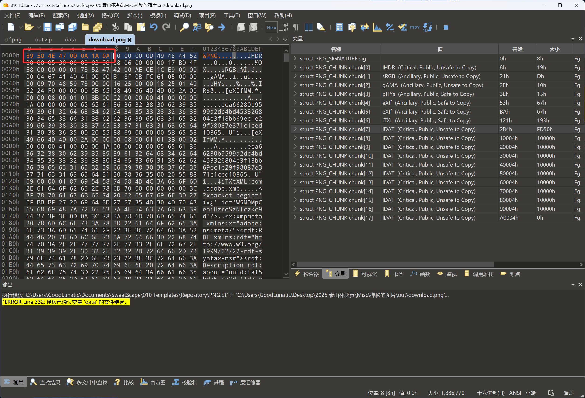

# 2025 泰山杯线下决赛 Misc Writeup

**群里有很多师傅在问这个比赛的Misc题，就打算专门写一篇博客记录一下**

**个人感觉这场比赛的Misc题出的还是可以的，出题人水平也在线，然后Misc附件还是动态的**

<!--more-->

> 本文中涉及的具体题目附件可以进我的交流群获取，进群详见 [About](https://goodlunatic.github.io/about/)

## 题目名称 神秘的图片

题目附件给了一张 ctf.png，010打开发现图片末尾有一个文件头被篡改了的ZIP压缩包


补上文件头后打开，发现需要crc32爆破，猜测爆破出来的值就是压缩包的解压密码


用`hel1o_vigEneRe_here2`作为解压密码去解压可以得到那个data文件，010打开查看发现是一堆十六进制数据


看前几个十六进制，发现是逆序的PNG的文件尾，因此我们拿CyberChef转一下


发现PNG的文件头被篡改了，问题不大，我们下载下来用010手动修复一下



修复文件头后发现图片还是没法正常显示，010的模板也有显示报错


仔细观察发现部分IDAT块的长度被篡改了，并且结合U2Fs这几个字符，猜测还藏了加密后的密文

因此我们写个脚本提取一下IDAT长度，并解码一下十六进制

```python
import re

with open("data",'r') as f:
    data = f.read()[::-1]

# print(data[:100])

find_list = re.findall(r"(.{8})49444154",data)

for item in find_list:
    print(item)
```

删除干扰的数据后得到的密文为：`U2FsdGVkX1+hrSabjmOfsFMTX/rQUZjwT6p6N+yHV4acgx+utA3D22I3s/Mg6BrgNOhR6s/7`

然后我们参考010模板中正常的IDAT块长度，逐个修改一下错误的IDAT块

这里要注意开头和末尾的IDAT块的长度不一定是 65524


修复完后即可得到下图，发现有密钥 `W87aETbAN`，并且图片的内容提示了rabbit加密


rabbit解密后即可得到：`fheg{2b5je1145x3218j6b8y4i4dah9c655xi}`


结合之前得到到内容，猜测还有一层维吉尼亚加密，可以结合我博客里的维吉尼亚对照表和flag开头的`flag{`

逆推一下密钥即可得到最后的flag: `flag{2f5fe1145b3218f6b8c4e4ded9c655be}`


当然线下赛如果断网，CyberChef也能解


## 题目名称 war

题目附件给了一张war.png，010打开发现末尾有个被篡改了的ZIP压缩包


提取出来手动修复一下文件头和文件尾，并修改一下目录区的长度


修复好后010的模板就不报错了，但是发现压缩包是加密的，因此我们需要去寻找解压密码

stegsolve打开发现图片 `plane 7` 存在隐写


提取后可以得到：`autokey  RPYJVMJQ`


发现是autokey加密，我们拿到了密钥，但是没有密文，因此我们需要去寻找密文

用PS打开这张PNG，发现除了第一行的隐写以外，第二行的白色像素也很可疑


后来和别的师傅交流了一下，知道了隐写的具体思路，我个人感觉挺难想到的，横坐标逐位做差，然后再逐位异或

```python
from PIL import Image

img = Image.open("war.png")
w,h = img.size

res = []
for y in range(1,2):
    for x in range(w):
        pixel = img.getpixel((x,y))
        if pixel == (255,255,255,255):
            res.append(x)

print(res)
tmp = []
for i in range(1,len(res)):
    tmp.append(res[i]-res[i-1])
print(tmp)

for i in range(1,len(tmp)):
    print(chr(tmp[i] ^ tmp[i-1]),end="")
    # KWCYVEBMHYHXSOYCAWSCTBEFTOKVW
```

得到密文后用之前的密钥解个autokey即可得到压缩包的解压密码：`WGGMFPUBFYZHJVBV`


用 `WGGMFPUBFYZHJVBV` 作为解压密码解压即可得到最后的flag: `flag{rPF5n4nRy7q43hf5RApe34UqWnq2hSAK}`

## 题目名称 动听的音乐

题目附件给了一个`challenge.wav`还有一张`hint.bmp`

先用zsteg扫一下bmp图片，可以看到隐写了一个ZIP压缩包的十六进制数据


用以下命令提取一下十六进制值，然后再转一下即可得到一个压缩包

```bash
zsteg -e b1,rgb,lsb,xy hint.bmp > out.bin
```

解压压缩包可以得到一个`hint.txt`，内容如下：

> 既然你能注意到这里，那我就给你点提示吧。
> 
> 1.音频LSB隐写
> 
> 2.左右声道单独分析
> 
> 3.AES-ECB解密

因此我们先用`Audacity`分离一下两个声道到单个wav文件，然后再写个脚本提取一下隐写的数据

```python
import wave
import libnum


def extract_wav_lsb(wav_file):
    wav = wave.open(wav_file, 'r')

    # 读取前1000帧的音频数据并将其转换为十六进制字符串
    # readframes()返回的是字节数据，.hex()将其转换为十六进制表示
    frames_data = wav.readframes(1000).hex()
    res = ''

    # 遍历十六进制数据，每次处理4个字符(2字节)
    # 因为WAV文件通常使用16位(2字节)采样
    for i in range(0, len(frames_data), 4):
        data = frames_data[i:i+4]
        # 将数据从小端序转换为大端序，因为WAV文件使用小端序存储数据
        data_rev = int(data[2:] + data[:2], 16)
        # 使用位与运算(&)获取最低有效位(LSB)
        res += str(data_rev & 1)
        
    print(libnum.b2s(res))

if __name__ == "__main__":
    extract_wav_lsb('1.wav')
    extract_wav_lsb('2.wav')
    # b'MySuperSecretKey!\r]o^\x9e\xbd\x8a\x080\x83J\xcb\xcd.\xb0\xb9\x8fn\x87\xe3\x1f\xfb\xa5.\x0e\xfe\xd45\x1d\xf7\xe7}\xc2\x8cU\xa1O\xbeS,\xf6\xf1\x1a\x14!\x08C\x0e2\x1aR\x94\x86\x1a[R\xe7\xb9H!J\xd4\xe7\xf5\xff\r\xbc\xa1)\x84$7\x1a\x88\xc9\xbeFS\xac\x00\x89j\x84\xa5\x04\x15\x08\xde?\xf7h\x00\x862\xb8\xef\xfe\x00\x858\xd2G\xa8B\xa0\x84@%'
    # b'q8TTfmlBwyT1QPLiZS9ixWKzS5h7aYgOUlaxNMJmE763AIoZ66FRHXFeYYWZBbLn\xces\x9a\xf6:P3\xdc\xea\xe28\xb8\x86\xe0Z\xc7\x19\x12\x93\x15K\x1c\xe2\x94=B\x1f\xa4\x13\x158j9Ot\xa0:_?\xbf\xad\xb3\\z\xb5\xac\xb7\x88[\x1a\xe7\xfd]\r\xf7\xad(\xd4\x95\x10J'
```

得到密文：`q8TTfmlBwyT1QPLiZS9ixWKzS5h7aYgOUlaxNMJmE763AIoZ66FRHXFeYYWZBbLn` 和密钥：`MySuperSecretKey!`

最后将密钥转为 hex，并在后面 Padding \x00 到 32 字节：`4d7953757065725365637265744b657921000000000000000000000000000000`

最后解个 AES-ECB 即可得到最后的 flag：`flag{e394ed9b9c4b24e0fc0f1e6897bdf938}`


除此之外，用随波逐流把 AES 密钥的长度改为 256（32x8）位一样可以解出来


> 其实之前也有遇到过这种在末尾 padding \x00 的情况，然后有在线网站和工具可以自动完成这个操作
> 
> 但是为啥在线网站和工具遇到这题就解不出来了呢？
> 
> 因为密钥长度是 17 字节，网站和工具可能默认 padding 到 24 字节(192 位)了，而不是 32 字节
> 
> 所以我个人感觉出题人这里没出好，要么密钥长度就给刚刚好（16/24/32 字节），要么就让密钥长度超过 24 字节

## 题目名称 Scrambled_Base

题目附件给了一个 txt 文件，内容如下：

```
CLJZMY3TCLJVMEYDMM,MZWGCZ33GA3WENRSGI,RQGE3DONDFG56Q====,3TCLJVGMYDILJUMEZD
```

看到连续的四个=，猜测可能是 base32，直接写个脚本爆破一下排列顺序，然后解 Base32 即可

```python
import base64
import itertools

base_part = "CLJZMY3TCLJVMEYDMM,MZWGCZ33GA3WENRSGI,RQGE3DONDFG56Q====,3TCLJVGMYDILJUMEZD".split(',')
# print(base_part)
res_list = list(itertools.permutations(base_part))
for item in res_list:
    try:
        res = base64.b32decode(''.join(item))
        if b'flag' in res:
            print(res)
    except:
        pass
# b'flag{07b62271-5304-4a21-9f71-5a06201674e7}'
```

`flag{07b62271-5304-4a21-9f71-5a06201674e7}`

## 题目名称 ezpdf

题目附件给了一个 pdf 文件，直接打开会提示文件已损坏

尝试用 foremost 分类一下，可以得到一个新的 pdf 文件，这个是可以正常打开的


我们把上面的文字移开可以得到如下内容：

> A4k9icgydtiz3HvFSuNxr67fvWWHS6aGW

解 base64 和 ROT13可以得到：`pass:Venus_G0oD_daY_????`


然后我们可以发现 foremost 分离出来的 PDF 明显比原 PDF 小，因此我们拿 010 diff 一下


结合 PDF 文件尾部的数据，我们很容易可以想到末尾还有一个压缩包，只不过文件头被篡改了


我们手动提取出来并修复文件头，发现是加密的

用我们之前得到的掩码爆破一下可以得到解压密码：`Venus_G0oD_daY_2895`


解压后得到一个 zero 文件，010 打开，猜测是文件头被篡改了的 GIF 文件


补上文件头后改后缀为.gif，发现可以正常打开


然后提取帧间隔，转二进制后再转 ASCII 即可得到 flag: `flag{5dca56a63c65beb79a2e6a86843b7a9}`


> Tips: 这里要注意到 259 / 7 = 37 ，因此我们要每 7 位二进制转 ASCII 才能得到正确的 flag

## 题目名称 流量分析

题面信息如下：

> 在某次攻防演练行动中集团系统被攻破，系统里面被植入后门账号。应急人员在溯源的时候发现是因为系统运维人员安全意识不足，使用姓名+出生年月日设置密码（例如：zhangsan19900421），集团通讯录被泄露导致攻击者利用通讯录构造社工字典获取到了smb服务的密码，然后利用smb服务上传webshell，之后利用webshell植入后门账号。技术人员在安全设备上将流量下载下来了，请你分析，泄露的smb服务账号及密码以及植入的后门账号及密码。flag格式：flag{md5(泄露的smb服务账号_泄露的smb服务账号的密码_后门账号_后门账号的密码)}
> 
> 例如：
> 
> 泄露的smb服务账号：zhangsan
> 
> 泄露的smb服务密码：zhangsan19900421
> 
> 后门账号:hack
> 
> 后门账号密码:hack@123
> 
> md5(zhangsan_zhangsan19900421_hack_hack@123)=1f91fcaedeee961c094aa6dd6a71a7ad
> 
> flag为：flag{1f91fcaedeee961c094aa6dd6a71a7ad}

打开流量包查看，发现 FTP 传了一个 xlsx 文件


提取出来，WPS 打开会提示报错，但是可以用 EXCEL 修复后打开


打开后即可得到姓名拼音列表，直接复制出来删去空格做成一个字典

然后用 NTLMRawUnHide.py 提取 NTLMv2 的哈希

```bash
python3 NTLMRawUnHide.py -i 流量分析.pcapng -o hash.txt
```


然后用 hashcat 爆破即可得到 SMB 服务账号的密码：`guyongyan19901221`


用 wireshark 输入这个密码解密 ntlmssp 后导出解密后的流量包

最后直接用 CTF-NetA 一把梭解密哥斯拉流量即可


综上，我们总结如下：

> 泄露的smb服务账号: administrator
> 
> 泄露的smb服务密码: guyongyan19901221
> 
> 后门账号: adm1n1strator
> 
> 后门账号密码: Admin@123$

最后的 flag 为：`flag{54b9afb4d6a16be08ef1e62aabcf739d}`


---

> Author: [Lunatic](https://goodlunatic.github.io)  
> URL: https://goodlunatic.github.io/posts/58b2135/  

