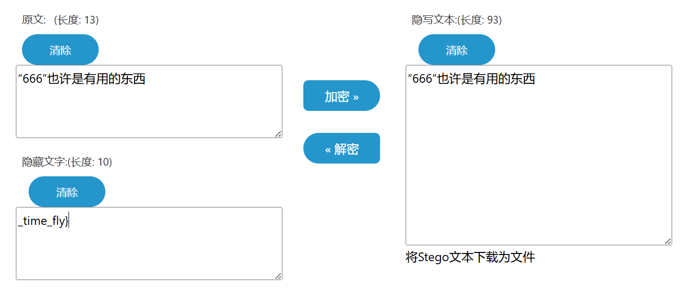
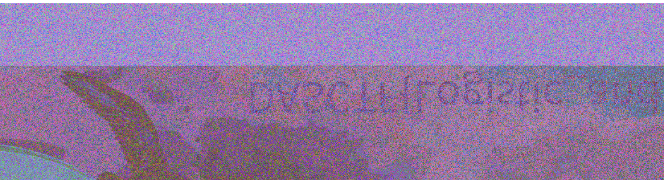
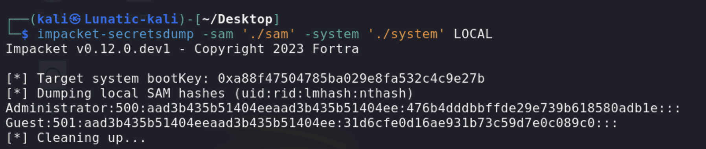
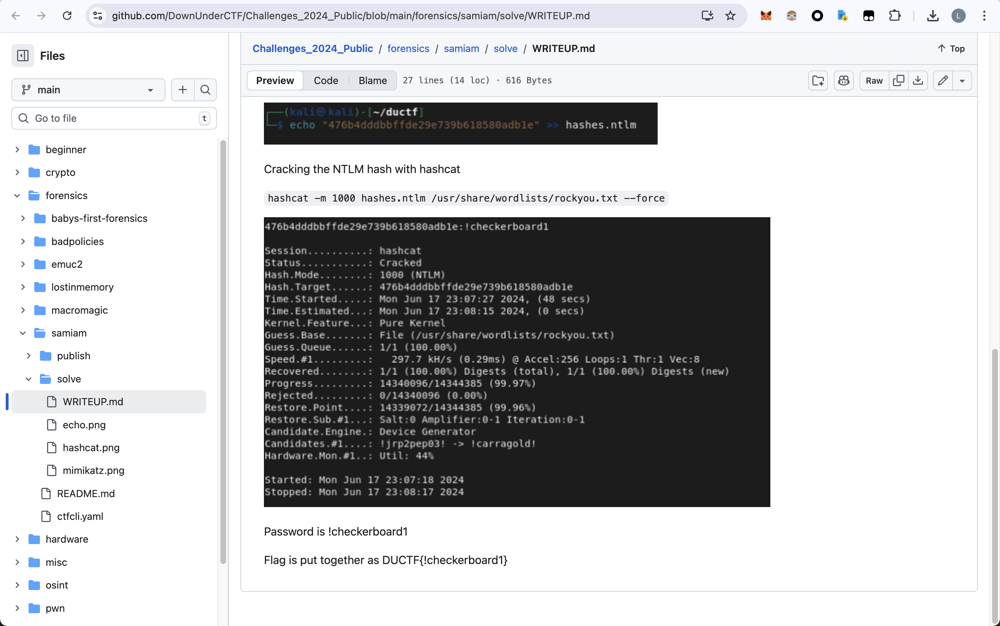
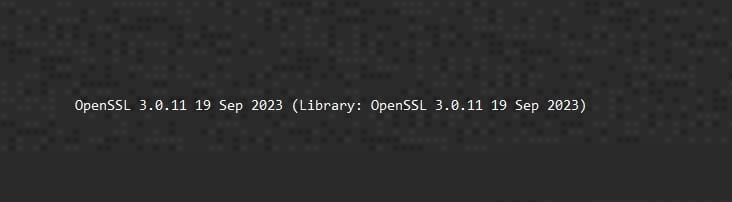
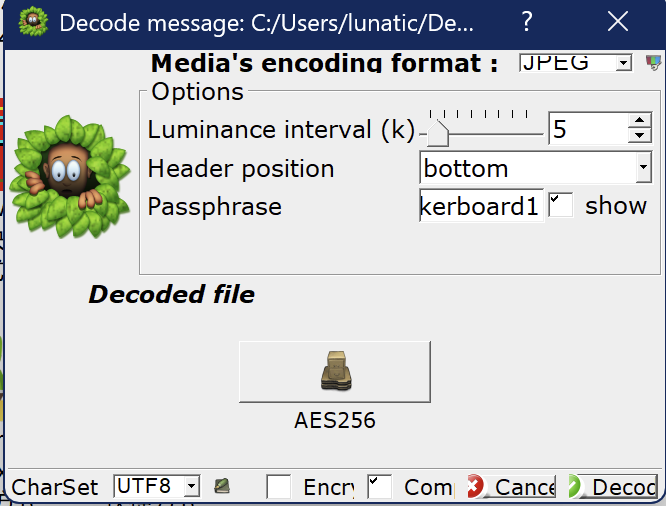
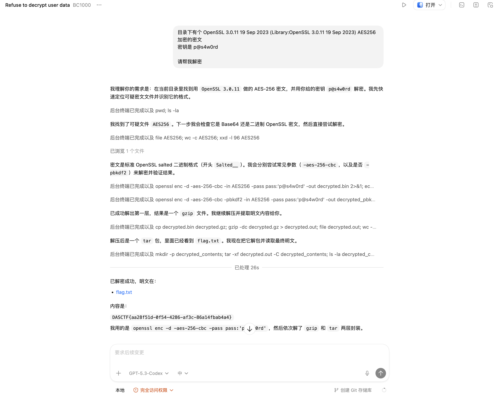
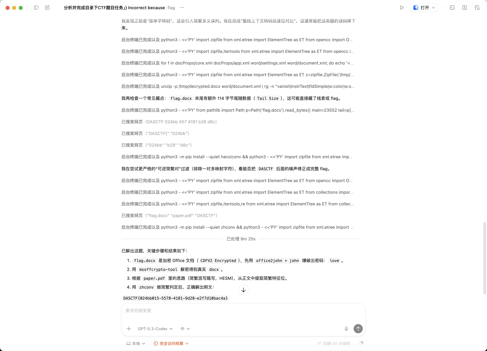
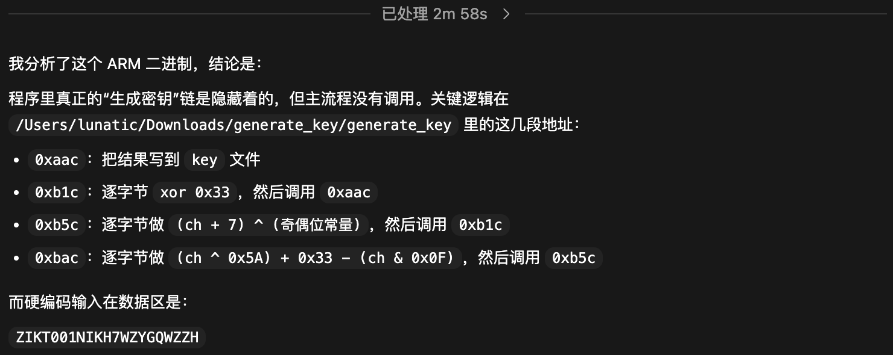
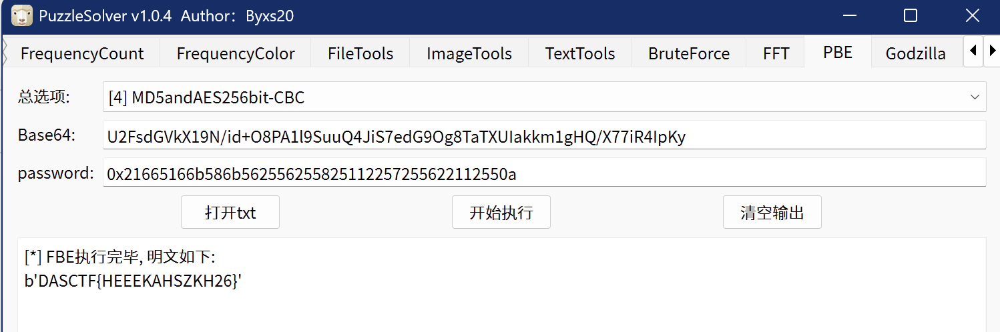

# 2026 楚慧杯湖北省网络与数据安全实践能力竞赛 Misc Writeup

**与时俱进，本场比赛继续尝试了用AI辅助解题，发现AI的解题能力确实是强**

**感觉以后的题，只要有思路并且思路正确，AI分分钟就能搓完脚本**

<!--more-->

|                  |
| :---------------------------------------------------: |
| 本文中涉及的具体题目附件可以进我的 [知识星球](https://t.zsxq.com/an6p6) 获取 |

## 题目名称 game_go

> 题目提示：原始两段边界处都有 `-`，拼接上，flag不是标准UUID格式。

Weapons.rvdata2 中得到第一段flag：`DASCTF{1168cb17-31ff-43b7-`

Scripts.rvdata2，flag.rb 中得到第二段的flag：`-b586-8414d383afce}`

最后的flag为：`DASCTF{1168cb17-31ff-43b7--b586-8414d383afce}`

## 题目名称 Time and Chaos

> 混沌初开，时间流逝

附件给了一个flag.txt，内容如下：

> ‌‌‌‌‍‍‌‌‌‌‍‍‌‌‌‌‌‍‬‬‍“‌‌‌‌‍‬‍666‌‌‌‌‍‬‍‍‌‌‌‌‍‍”‌‌‌‌‍‬‍‬‌‌‌‌‍‬‌‌‌‌‌‍‬‍‌‌‌‌‍‍也许是有用的东西

还有1.png-8.png以及flag.png

flag.txt中存在零宽字符隐写，得到第二段flag：`_time_fly}`


第一段flag在图片的右上角，仔细看能直接看出来：`DASCTF{Logistic_and`



综上，最后的flag为：`DASCTF{Logistic_and_time_fly}`

## 题目名称 SAM_and_Steg

> where is my password? where is my flag?

附件给了 sam 和 system 文件



用 impacket-secretsdump 解析，可以得到

> [] Target system bootKey: 0xa88f47504785ba029e8fa532c4c9e27b [] Dumping local SAM hashes (uid:rid:lmhash:nthash) Administrator:500:aad3b435b51404eeaad3b435b51404ee:476b4dddbbffde29e739b618580adb1e::: Guest:501:aad3b435b51404eeaad3b435b51404ee:31d6cfe0d16ae931b73c59d7e0c089c0::: [*] Cleaning up...

NTLM哈希如下

> 476b4dddbbffde29e739b618580adb1e:21636865636b6572626f61726431:NTLM

这个哈希还是复用[2024DUCTF](https://github.com/DownUnderCTF/Challenges_2024_Public/blob/main/forensics/samiam/solve/WRITEUP.md)的



`476b4dddbbffde29e739b618580adb1e` 这个哈希爆破出来是 `!checkerboard1`

Linux 下直接 `strings sam` 可以得到 `p@s4w0rd`

`binwalk -e system` 可以提取出下面这张JPG




图片中有黑白灰斑点的特征，感觉是silenteye的痕迹

把 `!checkerboard1` 作为silenteye的密钥解密可以得到openssl-AES256加密的密文



```
53 61 6C 74 65 64 5F 5F 1A BF 49 27 B3 F3 DA 89
FB F8 A7 FE F0 1A 56 08 17 17 E9 9A BE 41 9E 17
66 4B 72 88 8B 6A 30 84 0D 56 48 22 BA 54 F7 43
FC 74 0F B9 A6 58 E8 89 CD 63 5E F1 1C A1 1E 7B
55 02 2F F4 8D 2A F3 EB 9D 63 E8 24 DD FD 63 8C
08 07 50 34 55 DE 13 32 6C 55 DE F6 29 97 15 D8
F0 FD D9 F8 51 8B 11 AD D2 48 BA 87 A3 10 70 E3
50 42 E3 DC BF E8 29 04 4B D1 4B 46 FF 43 A0 04
E5 16 07 39 FA C3 43 E8 69 54 2A 33 90 E9 80 33
D1 F7 EB 15 AE A4 F6 6F 7E 30 C4 77 57 40 D0 F6
4E E9 1C 33 68 3F 03 77 9B 71 6B 55 EB 49 08 6D
B5 35 16 D8 EF 57 3F 70 01 20 4F 0B E2 B0 AB 33
```

JPG里还提示了openssl的版本，直接codex一把梭了就行



`DASCTF{aa28f51d-0f54-4286-af3c-86a14fbab4a4}`

## 题目名称 老妈的故事

> 爱你老妈，明天见。

题目给了一个PDF和一个加密docx

经过尝试发现 flag.docx 的密码就是love，foremost PDF 可以得到一张PNG

发现其实发给codex就直接一把梭了



把flag.docx密码删除另存为 decrypted.docx，然后运行以下脚本即可得到flag

`DASCTF{024bb015-5578-4181-9d28-e2f7d10bac4a}`

```python
import zipfile
from xml.etree import ElementTree as ET
import zhconv

z = zipfile.ZipFile('decrypted.docx')
root = ET.fromstring(z.read('word/document.xml'))
ns = {'w': 'http://schemas.openxmlformats.org/wordprocessingml/2006/main'}

text = ''.join((t.text or '') for t in root.findall('.//w:t', ns))

items = []
for ch in text:
    s = zhconv.convert(ch, 'zh-hans')
    t = zhconv.convert(ch, 'zh-hant')
    if len(s) == 1 and len(t) == 1 and s != t:
        if ch == s: 
            items.append('S')
        elif ch == t: 
            items.append('T')

segs = []
d = -1
for k in items:
    d += 1
    if k == 'T':
        segs.append(d)
        d = -1

print('items', len(items), 'T', items.count('T'), 'segs', len(segs), 'max', max(segs) if segs else None)

if segs and all(x < 16 for x in segs):
    bits = ''.join(format(x, '04b') for x in segs)
    by = bytes(int(bits[i:i+8], 2) for i in range(0, (len(bits) // 8) * 8, 8))
    print('decoded', ''.join(chr(x) if 32 <= x < 127 else '.' for x in by))

# DASCTF{024bb015-5578-4181-9d28-e2f7d10bac4a}
```


## 题目名称 generate_key

> 小明进行的生成的key好像有点意思，你可以进行恢复得到你想要的结果吗（最后的key：0x???????）

windows内存取证，镜像版本是Win7SP1x64

用vol扫一下，发现桌面上有个key.zip，直接 `dumpfiles` 导出

解压后得到16个加密的zip，发现每个zip中被压缩的内容大小都是4字节

这里考察的就是4字节的CRC爆破，对每个zip都4字节CRC爆破过去后，可以得到如下内容

> U2FsdGVkX19N/id+O8PA1l9SuuQ4JiS7edG9Og8TaTXUIakkm1gHQ/X77iR4IpKy

Desktop和Download目录下有个generate_key

> 0x000000007e0bbdd0     17      0 R--rw- \Device\HarddiskVolume1\Users\5678\Desktop\generate_key
> 
> python2 ~/CTF/volatility2-enhanced/vol.py -f key.raw --profile=Win7SP1x64 dumpfiles -Q 0x000000007e0bbdd0 --dump-dir=./

generate_key是一个 store+zipcrypto 加密的zip

尝试用vol扫一下剪切板的内容

```
(python2.7) ➜ python2 ~/CTF/volatility2-enhanced/vol.py -f key.raw --profile=Win7SP1x64 clipboard -v
Volatility Foundation Volatility Framework 2.6.1
Session    WindowStation Format                         Handle Object             Data
---------- ------------- ------------------ ------------------ ------------------ --------------------------------------------------
         1 WinSta0       0xc009L                       0x2016b 0xfffff900c07ace10
0xfffff900c07ace24  24 02 05 00 00 00 00 00                           $.......
         1 WinSta0       CF_TEXT                           0xd ------------------
         1 WinSta0       0xa0279L               0x200000000001 ------------------
         1 WinSta0       0xc013L                       0x5012f 0xfffff900c00d5d60
0xfffff900c00d5d74  00 00 00 00 a8 00 00 00 01 00 00 00 01 00 00 00   ................
0xfffff900c00d5d84  00 00 00 00 01 00 00 00 0d 00 d6 f6 fe 07 00 00   ................
0xfffff900c00d5d94  00 00 00 00 00 00 00 00 01 00 00 00 ff ff ff ff   ................
0xfffff900c00d5da4  01 00 00 00 00 00 00 00 01 00 00 00 00 00 00 00   ................
0xfffff900c00d5db4  00 00 00 00 00 00 00 00 00 00 00 00 00 00 00 00   ................
0xfffff900c00d5dc4  00 00 00 00 00 00 00 00 00 00 00 00 00 00 00 00   ................
0xfffff900c00d5dd4  00 00 00 00 00 00 00 00 00 00 00 00 00 00 00 00   ................
0xfffff900c00d5de4  00 00 00 00 00 00 00 00 00 00 00 00 00 00 00 00   ................
0xfffff900c00d5df4  00 00 00 00 00 00 00 00 00 00 00 00 00 00 00 00   ................
0xfffff900c00d5e04  00 00 00 00 00 00 00 00 00 00 00 00 00 00 00 00   ................
0xfffff900c00d5e14  00 00 00 00 00 00 00 00                           ........
         1 WinSta0       CF_TEXT                  0x1d00000010 ------------------
         1 WinSta0       0x30089L               0x200000000000 ------------------
         1 ------------- ------------------            0x30089 0xfffff900c2ac42c0
0xfffff900c2ac42d4  04 08 00 00                                       ....
         1 ------------- ------------------            0xa0279 0xfffff900c077e400
0xfffff900c077e414  41 00 53 00 48 00 46 00 4b 00 34 00 35 00 36 00   A.S.H.F.K.4.5.6.
0xfffff900c077e424  37 00 33 00 31 00 35 00 00 00                     7.3.1.5...
```


发现上面的 `ASHFK4567315` 就是 generate_key.zip 的解压密码

解压后得到的generate_key是个elf，尝试用codex去逆向分析这个elf



结合题目提示，对照着加密逻辑写个脚本即可得到最后的密钥

`0x21665166b586b562556255825112257255622112550a`

```python
INPUT_TEXT = b"ZIKT001NIKH7WZYGQWZZH"

def generate_key(data: bytes) -> bytes:
    out = bytearray()
    for i, b in enumerate(data):
        x = ((b ^ 0x5A) + 0x33 - (b & 0x0F)) & 0xFF
        x = (((x + 7) & 0xFF) ^ (0x22 if i % 2 == 0 else 0x11)) & 0xFF
        x ^= 0x33
        out.append(x)
    out.append(0x0A)
    return bytes(out)


key = generate_key(INPUT_TEXT)
print("0x" + key.hex())
# 0x21665166b586b562556255825112257255622112550a
```



有了密文和密钥，解个PBE即可得到最后的flag：`DASCTF{HEEEKAHSZKH26}`


---

> 作者: [Lunatic](https://goodlunatic.github.io)  
> URL: https://goodlunatic.github.io/posts/59dcb62/  

