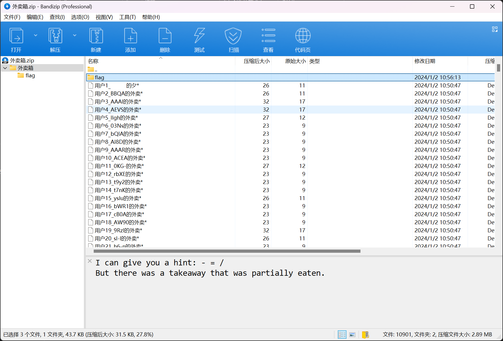
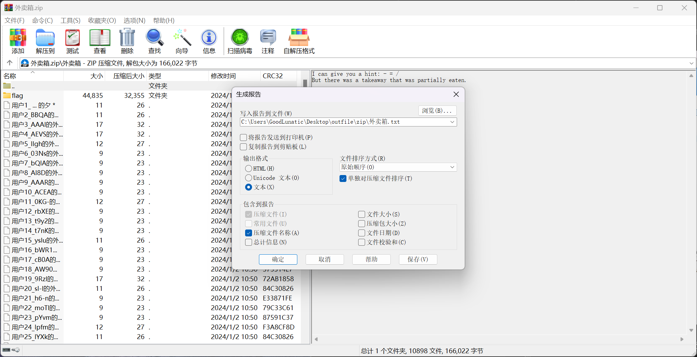
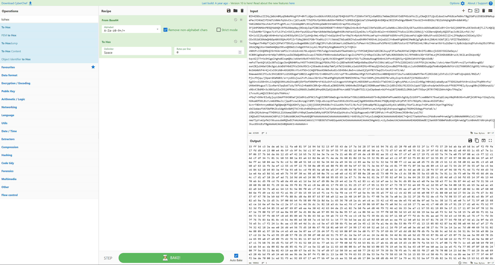
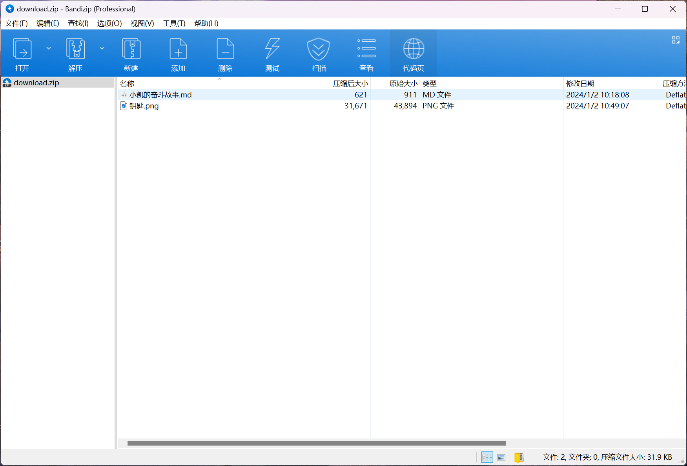
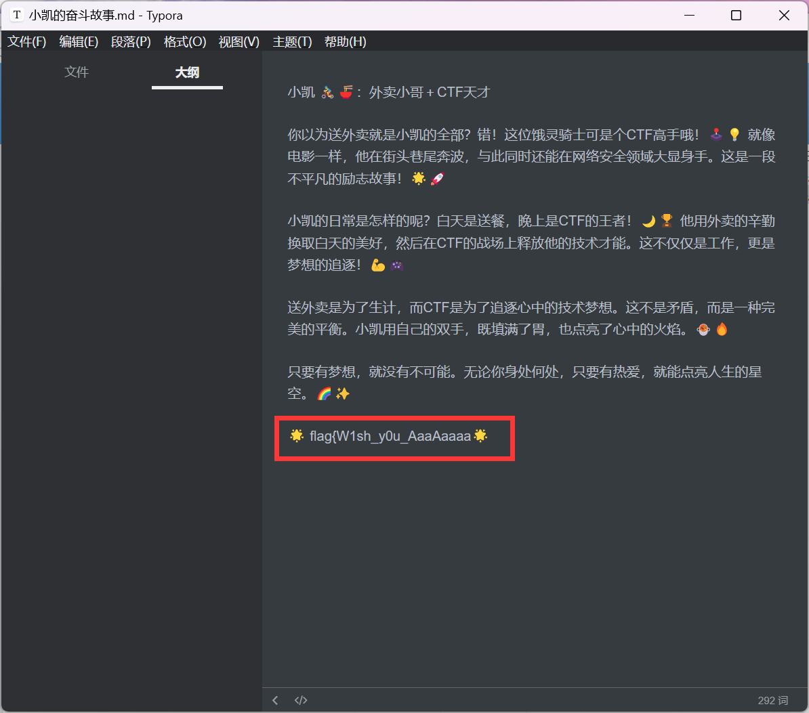
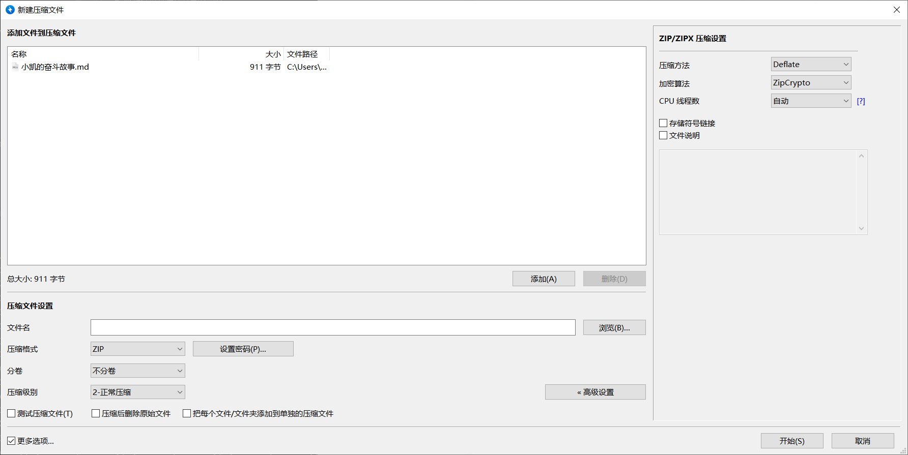
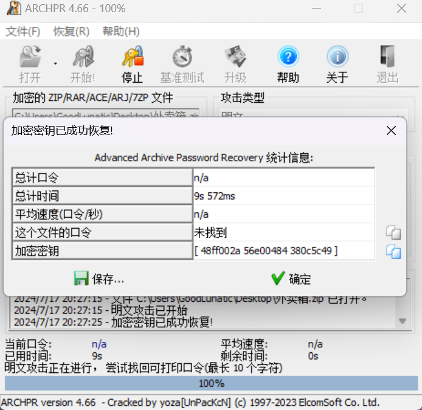
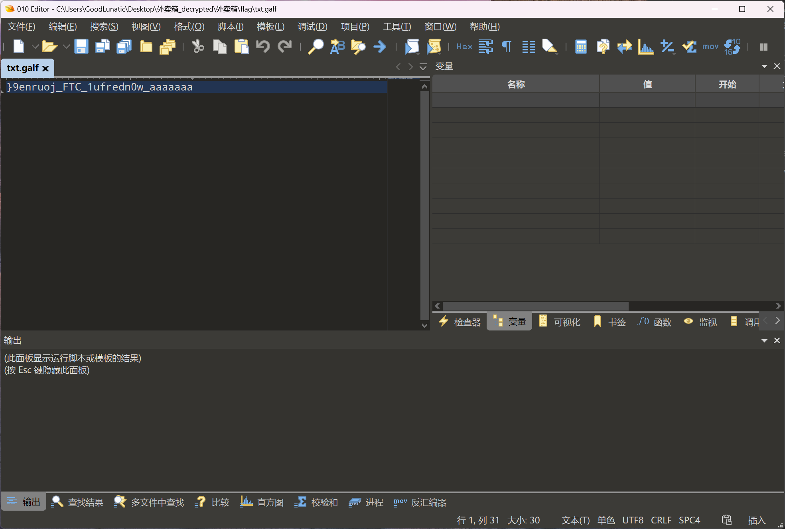
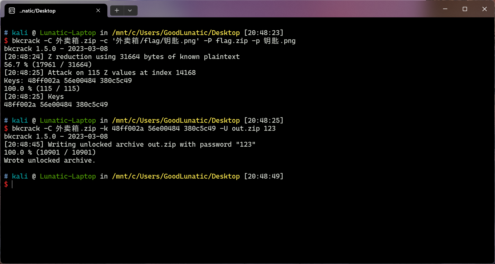

# 2023 春秋杯冬季赛 Misc Writeup

后来再回头看自己当初没做出来的题，也是感触颇深
&lt;!--more--&gt;

## 谁偷吃的了我的外卖

附件给了一张 jpg 图片，foremost 一下可以得到一个压缩包，解压得到另一个加密的压缩包



看到里面有很多标好序号的文件，然后后面还跟有一串字符串

根据压缩包注释中的提示：- 要用 / 替换，基本可以猜测就是 base64 编码了

使用 Winrar 的生成报告功能提取所有文件的文件名



但是提取出来的文件名是乱序的，因此我写一个脚本排序并提取，然后把 - 用 / 替换

```python
with open(&#39;1.txt&#39;, &#34;r&#34;) as f:
    data = f.read().split()

# 将数据按 &#34;_&#34; 前面的数字排序
sorted_data = sorted(data, key=lambda x: int(x.split(&#39;_&#39;)[0]))
# print(sorted_data[:20])
# 连接排序后的字符串部分
result = &#39;&#39;.join([item.split(&#39;_&#39;)[1] for item in sorted_data])
result = result.replace(&#34;-&#34;, &#34;/&#34;)
print(result)
```

将提取出来的数据 base64 解码后发现少了 zip 的文件头，之前压缩包中的注释也提示了这个



加上文件头后 From Hex 解码即可得到一个压缩包



在那个 md 文件中得到 flag 的第一部分



然后回头看之前那个压缩包，发现里面的两个文件和这个压缩包中的一样

因此猜测需要明文攻击，钥匙.png 也提示了我们需要用的压缩软件和压缩格式



方法一：Advanced Archive Password Recovery



爆破完后即可得到解密后的压缩包，在 txt.galf 中得到 reverse 的第二段 flag



方法二：bkcrack

把 钥匙.png 用 bandzip 的 正常压缩格式 压缩为 flag.zip，然后爆破密钥即可



CyberChef 中 reverse 一下即可得到最后的 flag：flag{W1sh_y0u_AaaAaaaaaaaaaaa_w0nderfu1_CTF_journe9}

---

> Author: [Lunatic](https://goodlunatic.github.io)  
> URL: http://localhost:1313/posts/5de0d7e/  

