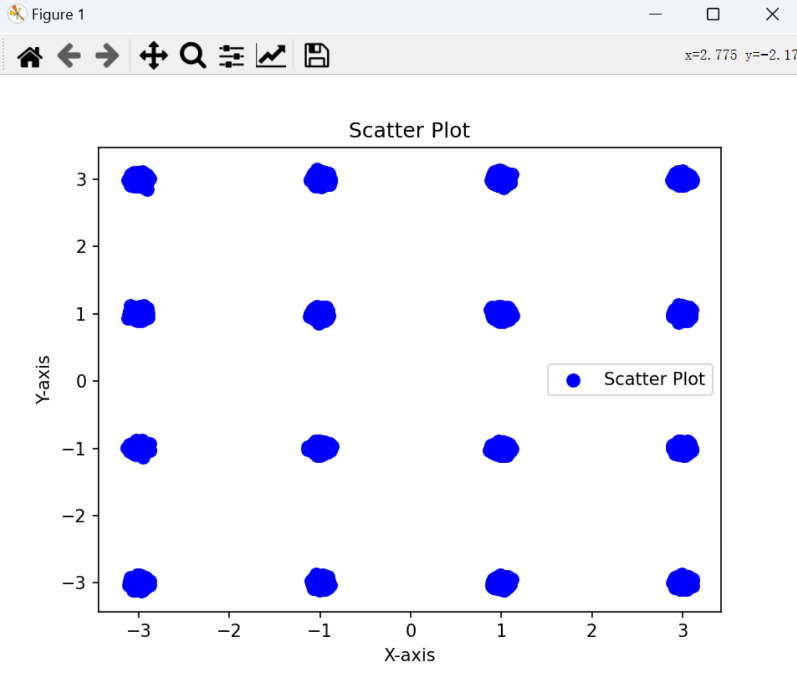
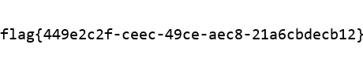
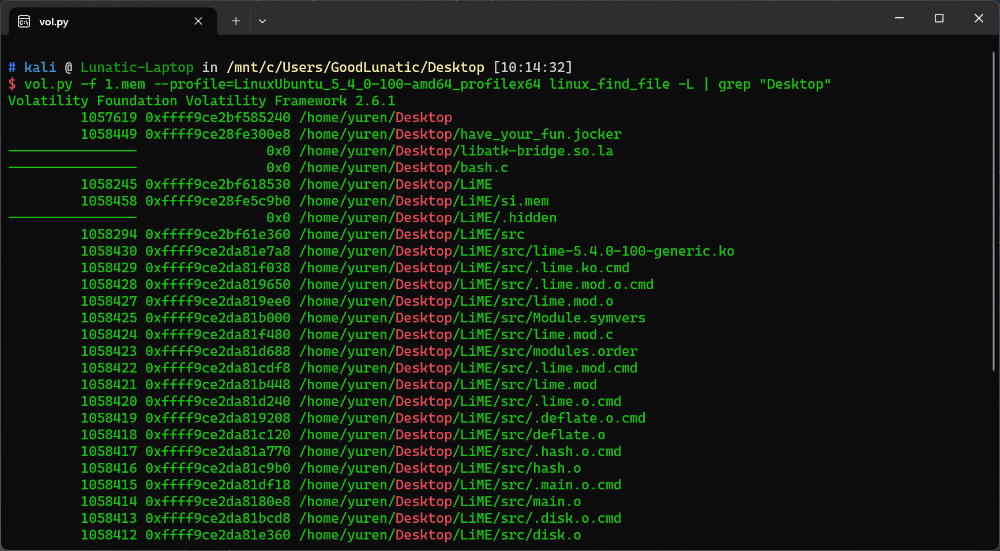
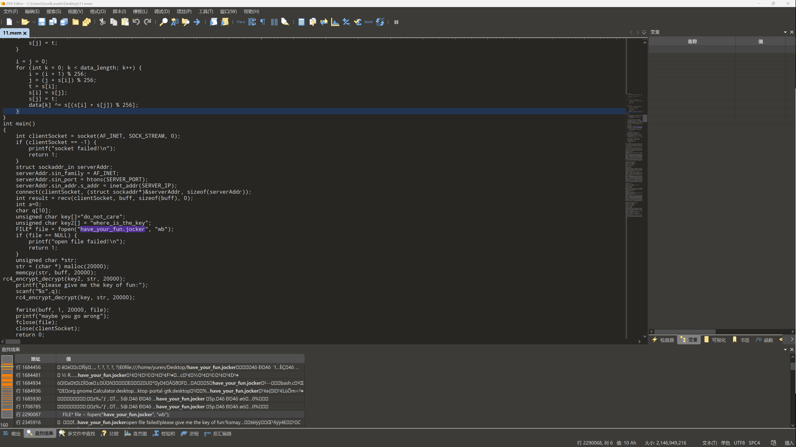
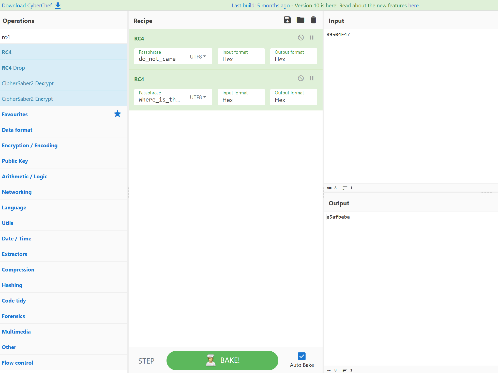
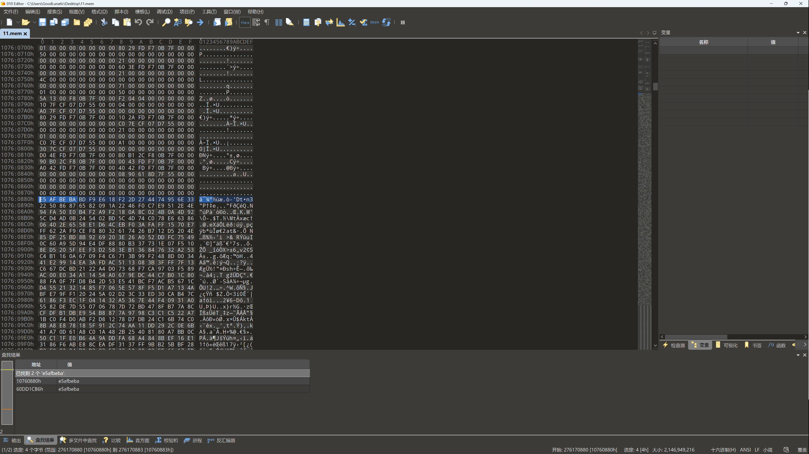
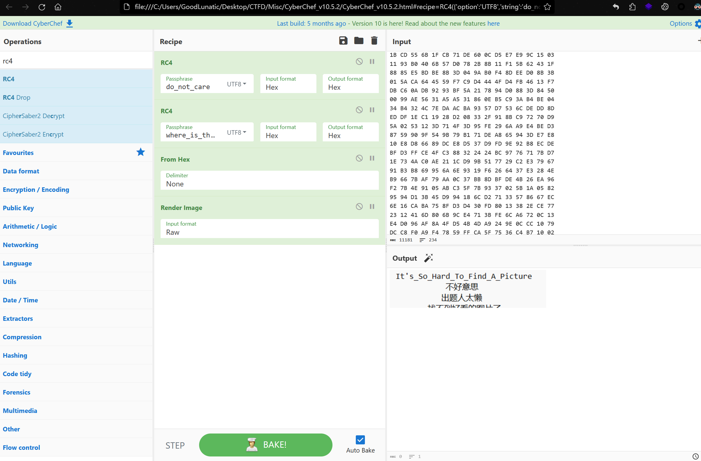

# 2023 强网杯全国网络安全挑战赛 Misc Writeup

**只能说有点可惜吧，本来Misc还能再多出几道题的，无奈比赛时脑子秀逗了**

<!--more-->

## 题目名称 碟影重重2.0

下载附件得到一个只有TCP流量的流量包

题目需要我们分析流量包找到飞机的飞机速度和飞机的 ICAO CODE

问了GPT得知飞机常见的协议中有ADS-B，然后在网上找到pyModeS这个模块

在 [参考链接](https://gitee.com/wangmin-gf/ads-b) 看到了与tcp.payload中相似的数据

使用 tshark 提取出流量包中的数据，然后使用这个脚本批量解密找speed最快的即可

tshark -r attach.pcapng -T fields -e "tcp.payload" | sed '/^\s*$/d' > tshark.txt

```python
import pyModeS
with open("tshark.txt") as f:
    data = f.readlines()
    for item in data:
        # print(item.strip())
        if len(item.strip()) != 46:
            continue
        res = pyModeS.tell(item.strip()[18:46])
        print("===========================================================================")
```

Tips：这里的 ICAO CODE 需要大写：79A05E
然后MD5加密一下即可得到：flag{4cf6729b9bc05686a79c1620b0b1967b}

## 题目名称 Wabby Wabbo Radio

题目给的容器是一个网页版的播放器，通过抓包，得到了以下几个wav文件

xh1.wav、xh2.wav、xh3.wav、xh4.wav、xh5.wav、hint1.wav、hin2.wav、flag.wav

除了flag.wav以外，别的几个wav的左声道都是有摩斯电码的

**第一段：**

```
- .... . .-- . .- - .... . .-. .. ... .-. . .- .-.. .-.. -.-- -. .. -.-. . - --- -.. .- -.-- .-.-.- .. - .----. ... .- --. .-. . .- - -.. .- -.-- - --- .-.. .. ... - . -. - --- - .... . .-- .- -... -... -.-- .-- .- -... -... --- .-. .- -.. .. ---
```

THE WEATHER IS REALLY NICE TODAY. IT'S A GREAT DAY TO LISTEN TO THE WABBY WABBO RADIO

**第二段**

```
--. . -. ... .... .. -. .. -- .--. .- -.-. - ... - .- .-. - ...
```

GENSHIN IMPACT STARTS

**第三段**

```
-.. --- -.-- --- ..- .-- .- -. - .- ..-. .-.. .- --. ..--.. .-.. . - .----. ... .-.. .. ... - . -. .- .-.. .. - - .-..  . .-.. --- -. --. . .-.
```

DO YOU WANT A FLAG ?LET'S LISTEN A LITTLE LONGER

**第四段**

```
-.. --- -.-- --- ..- .-- .- -. - .- .... .. -. - ..--.. .-.. . - .----. ... .-.. .. ... - . -. .- .-.. .. - - .-.. . .-.. --- -. --. . .-.
```

DO YOU WANT A HINT?LET'S LISTEN A LITTLE LONGER

**第五段**

```
.. ..-. -.-- --- ..- -.. --- -. .----. - -.- -. --- .-- .... --- .-- - --- -.. --- .. - --..-- -.-- --- ..- -.-. .- -. --. --- .- .... . .- -.. .- -. -.. -.. --- ... --- -- . - .... .. -. --. . .-.. ... . ..-. .. .-. ... -
```

IF YOU DON'T KNOW HOW TO DO IT,YOU CAN GO AHEAD AND DO SOME THING ELSE FIRST

**Hint1**

```
-.. --- -.-- --- ..- -.- -. --- .-- --.- .- -- ..--..
```

DO YOU KNOW QAM(正交振幅调制)?

**Hint2**

```
-- .- -.-- -... . ..-. .-.. .- --. .. ... .--. -. --. .--. .. -.-. - ..- .-. .
```

MAYBE FLAG IS PNG PICTURE

**flag.wav**

读取wav的数据用plot画个图，发现数据的分布其实是十分规则的，明显就是16QAM



根据PNG的文件头89504E47找到16QAM的对应关系，然后写脚本读取数据转换就行

```python
import scipy.io.wavfile as wav
from Crypto.Util.number import *


def read_wav_file(file_path):
    sample_rate, data = wav.read(file_path)
    return sample_rate, data


dic = {
    1: '10',
    -1: '01',
    3: '11',
    -3: '00'
}

if __name__ == "__main__":
    res = ''
    wav_file_path = "flag.wav"
    sample_rate, data = read_wav_file(wav_file_path)
    for item in data:
        x = round(item[0])
        y = round(item[1])
        res += dic[x]+dic[y]
    # print(res)
    data = long_to_bytes(int(res, 2))
    with open('flag.png', 'wb') as f:
        f.write(data)
```



## 题目名称 找到PNG了吗

Linux内存取证，内核版本如下：

Linux version 5.4.0-100-generic (buildd@lcy02-amd64-002) (gcc version 9.3.0 (Ubuntu 9.3.0-17ubuntu1~20.04)) \#113-Ubuntu SMP Thu Feb 3 18:43:29 UTC 2022 (Ubuntu 5.4.0-100.113-generic 5.4.166)

根据我博客里 LInux内存取证 的那篇文章制作vol2的Profile即可

查看桌面，发现有 have_your_fun.jocker 这个文件



然后在010中搜索这个文件名，得到一串RC4加密的代码


用那两个KEY去加密PNG头，然后用010去找


定位到文件，往下随便复制一大段十六进制值，CyberChef一把梭即可得到flag






---

> 作者: [Lunatic](https://goodlunatic.github.io)  
> URL: https://goodlunatic.github.io/posts/5f3fb7a/  

