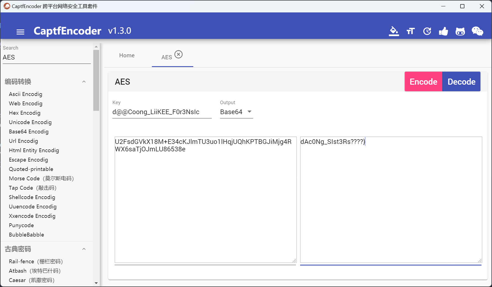

# 2023 安洵杯网络安全挑战赛 Misc Writeup

**本周六和队友一起打了一下安洵杯，这里对比赛中的Misc题做一个简单的复盘**
<!--more-->
## 题目名称 Nahida!
题目附件给了一个 Nahida! 文件，010打开，一眼JPG逆序

逆序后得到一张草神的图片，图片末尾用UTF-8编码查看可以得到一串提示


提示给的很明显了，必须是silenteye了

用silenteye解密图片，密钥是Nahida，解密即可得到flag：d0g3{Nahida_is_the_best_in_the_world!}


## 题目名称 misc-dacongのWindows
附件给了一个windows10的内存转储raw文件


经过判断 profile=Win10x64  ，用户名是 miku

然后从filescan中得知桌面上有这几个可疑的文件，但是用vol2无法直接dumpfiles

后来换成vol3，成功dumpfiles

file.rar 里面有个file.txt 尝试提取但是内容是空的

secret.rar 里面有个flag2.txt，SNOW解密即可得到flag2

flag3.txt 里面是一段加密的密文

桌面上dacong_like_listen 文件夹中有dacong1-50.wav，一眼SSTV，flag1在39.wav中

提取文件需要用到的偏移量如下所示

```shell
0xe0007922c890  \Users\miku\Music\do_you_want_listen.txt        216
0xe0007a09d470  \Users\miku\Desktop\flag3.txt   216
0x0000e00079b15f20      2      0 RWD--- \Device\HarddiskVolume3\Users\miku\Documents\secret.rar
0x0000e00078a086a0     16      0 RWD--- \Device\HarddiskVolume3\Users\miku\Music\dacong_like_listen\dacong13.wav
0x0000e00078a3c4a0     16      0 RWD--- \Device\HarddiskVolume3\Users\miku\Music\dacong_like_listen\dacong3.wav
0x0000e00078e21090     16      0 RWD--- \Device\HarddiskVolume3\Users\miku\Music\dacong_like_listen\dacong24.wav
0x0000e00079200090     16      0 RWD--- \Device\HarddiskVolume3\Users\miku\Music\dacong_like_listen\dacong17.wav
0x0000e00079262f20     16      0 RWD--- \Device\HarddiskVolume3\Users\miku\Music\dacong_like_listen\dacong15.wav
0x0000e00079266090     16      0 RWD--- \Device\HarddiskVolume3\Users\miku\Music\dacong_like_listen\dacong36.wav
0x0000e000794a79b0     16      0 RWD--- \Device\HarddiskVolume3\Users\miku\Music\dacong_like_listen\dacong38.wav
0x0000e000794d9170     16      0 RWD--- \Device\HarddiskVolume3\Users\miku\Music\dacong_like_listen\dacong27.wav
0x0000e00079590090     16      0 RWD--- \Device\HarddiskVolume3\Users\miku\Music\dacong_like_listen\dacong23.wav
0x0000e000796a5090     16      0 RWD--- \Device\HarddiskVolume3\Users\miku\Music\dacong_like_listen\dacong28.wav
0x0000e00079a8ddb0     16      0 RWD--- \Device\HarddiskVolume3\Users\miku\Music\dacong_like_listen\dacong33.wav
0x0000e00079ada090     16      0 RWD--- \Device\HarddiskVolume3\Users\miku\Music\dacong_like_listen\dacong42.wav
0x0000e00079b03200     16      0 RWD--- \Device\HarddiskVolume3\Users\miku\Music\dacong_like_listen\dacong10.wav
0x0000e00079c58090     16      0 RWD--- \Device\HarddiskVolume3\Users\miku\Music\dacong_like_listen\dacong12.wav
0x0000e00079c65770     16      0 RWD--- \Device\HarddiskVolume3\Users\miku\Music\dacong_like_listen\dacong7.wav
0x0000e00079d7ff20     16      0 RWD--- \Device\HarddiskVolume3\Users\miku\Music\dacong_like_listen\dacong9.wav
0x0000e00079e84090     16      0 RWD--- \Device\HarddiskVolume3\Users\miku\Music\dacong_like_listen\dacong26.wav
0x0000e00079f64660     16      0 RWD--- \Device\HarddiskVolume3\Users\miku\Music\dacong_like_listen\dacong50.wav
0x0000e0007a0a9480     16      0 RWD--- \Device\HarddiskVolume3\Users\miku\Music\dacong_like_listen\dacong43.wav
0x0000e0007a175420     16      0 RWD--- \Device\HarddiskVolume3\Users\miku\Music\dacong_like_listen\dacong39.wav
0x0000e0007a1ffc40     16      0 RWD--- \Device\HarddiskVolume3\Users\miku\Music\dacong_like_listen\dacong16.wav
0x0000e0007a203530     16      0 RWD--- \Device\HarddiskVolume3\Users\miku\Music\dacong_like_listen\dacong49.wav
0x0000e0007a25c310     16      0 RWD--- \Device\HarddiskVolume3\Users\miku\Music\dacong_like_listen\dacong46.wav
0x0000e0007a2da640     16      0 RWD--- \Device\HarddiskVolume3\Users\miku\Music\dacong_like_listen\dacong20.wav
0x0000e0007a302930     16      0 RWD--- \Device\HarddiskVolume3\Users\miku\Music\dacong_like_listen\dacong47.wav
0x0000e0007a33f090     16      0 RWD--- \Device\HarddiskVolume3\Users\miku\Music\dacong_like_listen\dacong34.wav
0x0000e0007a343410     16      0 RWD--- \Device\HarddiskVolume3\Users\miku\Music\dacong_like_listen\dacong5.wav
0x0000e0007a34a090     16      0 RWD--- \Device\HarddiskVolume3\Users\miku\Music\dacong_like_listen\dacong37.wav
0x0000e0007a422c50     16      0 RWD--- \Device\HarddiskVolume3\Users\miku\Music\dacong_like_listen\dacong6.wav
0x0000e0007a432770     16      0 RWD--- \Device\HarddiskVolume3\Users\miku\Music\dacong_like_listen\dacong41.wav
0x0000e0007a4d5e80     16      0 RWD--- \Device\HarddiskVolume3\Users\miku\Music\dacong_like_listen\dacong29.wav
0x0000e0007a615dc0     16      0 RWD--- \Device\HarddiskVolume3\Users\miku\Music\dacong_like_listen\dacong4.wav
0x0000e0007a65af20     16      0 RWD--- \Device\HarddiskVolume3\Users\miku\Music\dacong_like_listen\dacong48.wav
0x0000e0007a66f090     16      0 RWD--- \Device\HarddiskVolume3\Users\miku\Music\dacong_like_listen\dacong18.wav
0x0000e0007a6daa40     16      0 RWD--- \Device\HarddiskVolume3\Users\miku\Music\dacong_like_listen\dacong22.wav
0x0000e0007a6dad00     16      0 RWD--- \Device\HarddiskVolume3\Users\miku\Music\dacong_like_listen\dacong1.wav
0x0000e0007a78b4f0     16      0 RWD--- \Device\HarddiskVolume3\Users\miku\Music\dacong_like_listen\dacong40.wav
0x0000e0007a871f20     16      0 RWD--- \Device\HarddiskVolume3\Users\miku\Music\dacong_like_listen\dacong11.wav
0x0000e0007a89a090     16      0 RWD--- \Device\HarddiskVolume3\Users\miku\Music\dacong_like_listen\dacong25.wav
0x0000e0007a8fa290     16      0 RWD--- \Device\HarddiskVolume3\Users\miku\Music\dacong_like_listen\dacong35.wav
0x0000e0007a96e090     16      0 RWD--- \Device\HarddiskVolume3\Users\miku\Music\dacong_like_listen\dacong8.wav
0x0000e0007a9dec70     16      0 RWD--- \Device\HarddiskVolume3\Users\miku\Music\dacong_like_listen\dacong31.wav
0x0000e0007aa0ff20     16      0 RWD--- \Device\HarddiskVolume3\Users\miku\Music\dacong_like_listen\dacong32.wav
0x0000e0007aaa8090     16      0 RWD--- \Device\HarddiskVolume3\Users\miku\Music\dacong_like_listen\dacong14.wav
0x0000e0007aaad170     16      0 RWD--- \Device\HarddiskVolume3\Users\miku\Music\dacong_like_listen\dacong44.wav
0x0000e0007ab2f430     16      0 RWD--- \Device\HarddiskVolume3\Users\miku\Music\dacong_like_listen\dacong21.wav
0x0000e0007abee090     16      0 RWD--- \Device\HarddiskVolume3\Users\miku\Music\dacong_like_listen\dacong19.wav
0x0000e0007ac22300     16      0 RWD--- \Device\HarddiskVolume3\Users\miku\Music\dacong_like_listen\dacong30.wav
0x0000e0007ad02b50     16      0 RWD--- \Device\HarddiskVolume3\Users\miku\Music\dacong_like_listen\dacong2.wav
0x0000e0007ad17f20     16      0 RWD--- \Device\HarddiskVolume3\Users\miku\Music\dacong_like_listen\dacong45.wav
```


do_you_want_listen.txt

> I remember miku had a song which called '???music!'

flag1：39.wav SSTV解密即可得到


flag2：在secret.rar中，解压然后SNOW解密即可


flag3：密文在桌面上flag3.txt中，key在注册表中，用printkey命令即可得到

密文：U2FsdGVkX18M+E34cKJlmTU3uo1lHqjUQhKPTBGJiMjg4RWX6saTjOJmLU86538e

Key：d@@Coong_LiiKEE_F0r3NsIc




flag{Ar3_Th3Y_tHE_DdddAc0Ng_SIst3Rs????}

## 题目名称 疯狂的麦克斯
打开麦克斯的称号文件，发现有零宽，零宽解密即可得到：mks007

然而题目告知了这个称号本题用不到


之后把那个 嗨.docx 后缀改为zip，解压可以得到一个文本文件，里面有一个列表和一串未知的编码


末尾的那串：XLMWMWQOWHSCSYORSAALSEQM，编码凯撒解密后可以得到如下内容：

THISISMKSDOYOUKNOWWHOAMI

THIS IS MKS DO YOU KNOW WHOAMI

比赛的时候一直卡在MKS和麦克斯是什么东西，就在找题目和《疯狂的麦克斯》之间的关系

然后这个数据又十分的有特征，都是数字+字母（最后一位是字母），以为是什么特殊的编码

赛后看了别的师傅的WP才知道，这个列表其实就相当于一个字典，把列表里面的元素凯撒解密+Base64编码即可

然后用这个列表里的元素生成一个字典，直接爆破压缩包密码即可得到flag


D0g3{Th1s_REA11Y_MAX_F1A4_GGB0ND}

总结就是这道题目感觉和《疯狂的麦克斯》一点关系都没有 -_-||

## 题目名称 misc-dacongのsecret
用隐形水印工具提取dacong1hao.png中的水印，得到第一个压缩包密码：d@C0ng 1s cUt3!!!


解压压缩包得到第二张图片：dacong2hao.jpg

发现图片末尾有逆序后的压缩包数据，用cyberchef提取出来，发现需要密码

赛后看了WP知道了是IDAT块隐写

查看图片1的IDAT块，很明显问题就出在chunk19和chunk20上


尝试把这两块数据提取出来，然后加上文件头，经过尝试发现chunk20是我们需要的


然后爆破一下图片的CRC，得到正确的宽高即可得到压缩包密码


解压压缩包得到一个xiaohongmao.txt，一眼base64隐写

用脚本解密即可得到 pass{m1ku_1s_sha_fufu123}

然后用JPHS解密jpg图片即可得到flag：flag{d@C0ng_1s_r3@lIy_Re@iLY_Cute}


---

> Author: [Lunatic](https://goodlunatic.github.io)  
> URL: https://goodlunatic.github.io/posts/66357b4/  

