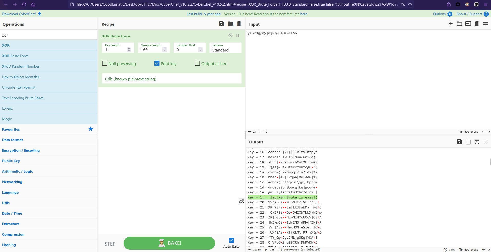
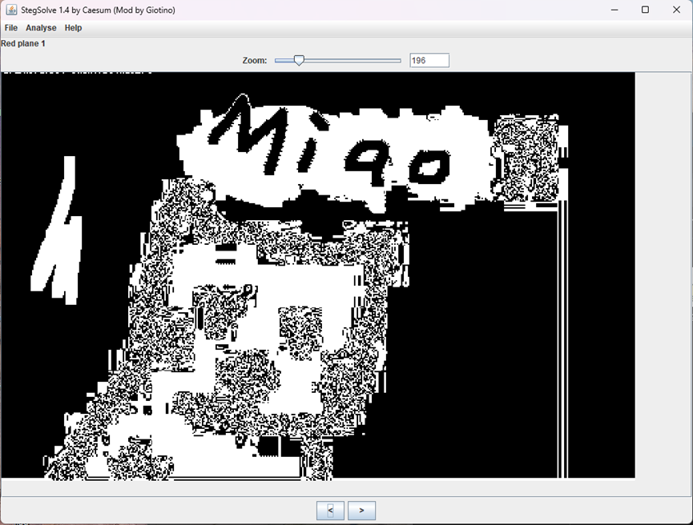
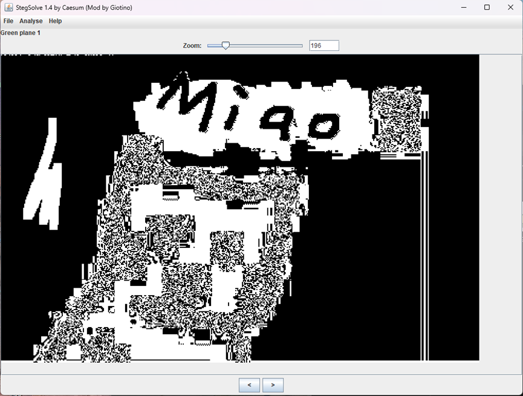
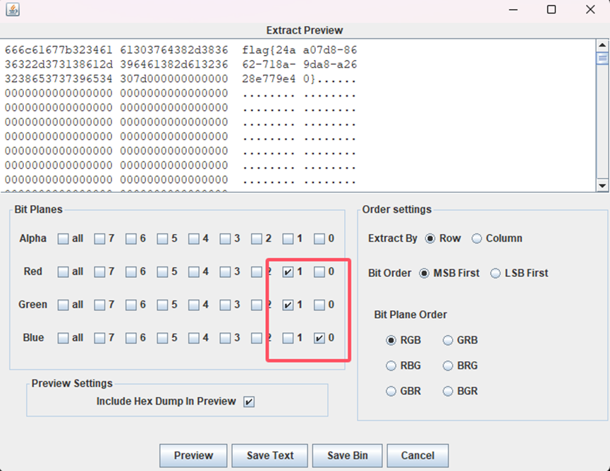
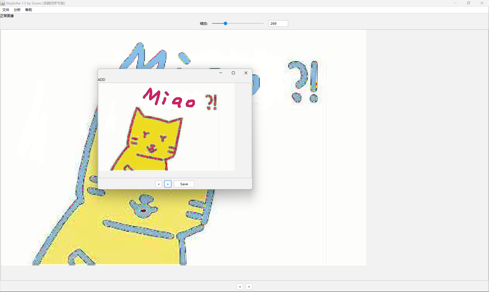
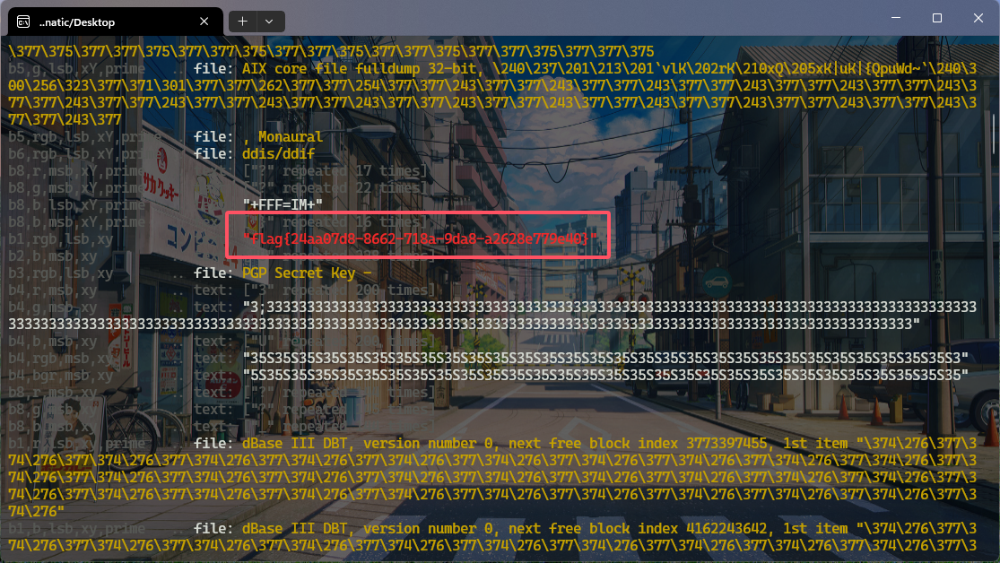
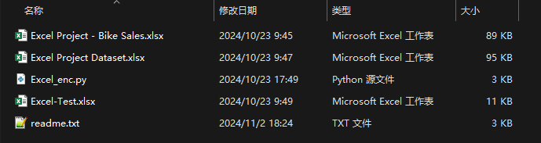
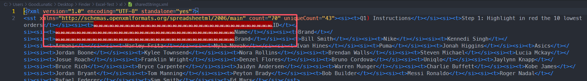
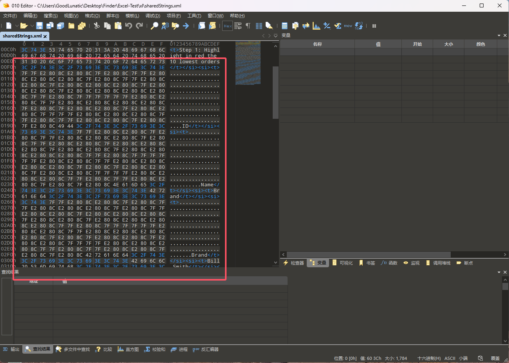
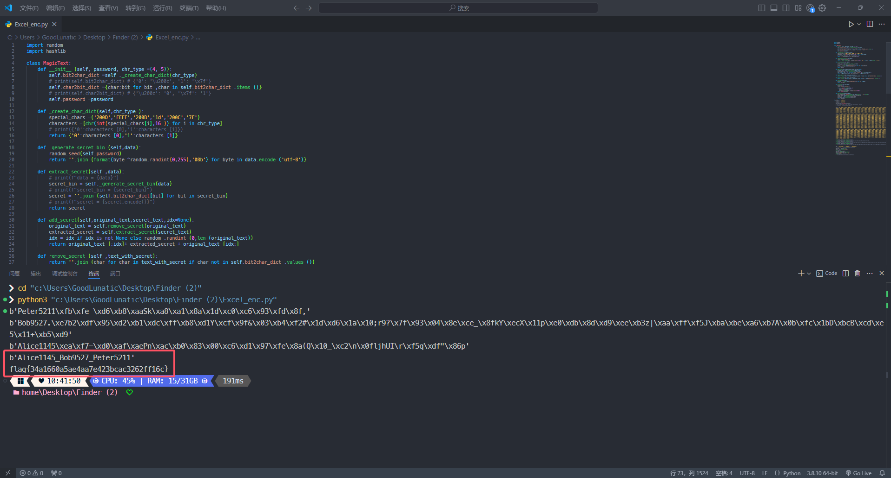

# 2024 某金融系统内部赛 Misc Writeup

**不知道具体是什么比赛，但是赛题还是有一定的强度的**
<!--more-->

> 本文中涉及的具体题目附件可以进我的交流群获取，进群详见 [About](https://goodlunatic.github.io/about/)

## 题目名称 X0r

> X0r is just a commonly used simple encryption

题目附件给了一个 enc.txt，内容如下：

```
ys~xdg/m@]mjkz@vl@z~lf>b
```

直接拉进CyberChef用 XOR Brute Force 一把梭就行



`flag{x0r_Brute_is_easy!}`

## 题目名称 add

解压附件压缩包，得到以下两张图片


根据第二章图片的名字`noflag`提示了flag可能不在这张图片里，因此我们把注意力集中到第一张图片上

用stegsolve打开add.png，发现有好几个通道存在LSB隐写的痕迹，然后观察到不同的通道背景不同







我们在stegsolve中使用 data extract 把黑色背景并且带有LSB隐写的通道勾选上即可得到flag



`flag{24aa07d8-8662-718a-9da8-a2628e779e40}`

其实这里也算是非预期了吧，预期解应该是根据图片的文件名add想到使用 Image Conbiner 把两张图片和一起



合成后导出为bmp，然后再用zsteg扫描得到flag



## 题目名称 Finder
解压附件压缩包，得到如下几个文件



`readme.txt`中的内容如下
```
某大型企业为了保护其内部数据安全，已经实施了严格的访问控制措施，并且在每位员工的电脑上安装了数字水印软件。这个软件会在员工处理的所有文档中嵌入一个独特的标识符，该标识符由员工的名字和手机号码后四位组成，用以追踪任何可能的数据泄露事件。

最近，这家企业发现了一些包含敏感信息的文件被非法传播到了外部。基于此情况，怀疑是某些内部员工违反规定将这些文档外泄。为了解决这个问题并找出责任人，企业现在提供了一个用于生成这些数字水印的具体算法。

接下来，请你协助该企业安全部门提取文档中嵌入的员工信息，任务如下：

1. 对泄漏的三个文档进行分析，提取出每个文档中嵌入的员工信息。
2. 找出所有泄漏文档中的员工信息，请将这些信息按首字母顺序依次排列，形如“Albert1234_Bili5678”的字符串。
3. 对改字符串进行MD5计算，并将生成的32位小写MD5值包裹上flag{}提交至平台即可。


A large enterprise has implemented strict access control measures to protect its internal data security and has installed digital watermarking software on every employee's computer. This software embeds a unique identifier in all documents processed by employees, consisting of the employee's name and the last four digits of their mobile phone number, to track any potential data leakage incidents.

Recently, the enterprise discovered that some files containing sensitive information had been illegally disseminated externally. Based on this situation, there are suspicions that some internal employees violated regulations and leaked these documents. To address this issue and identify the responsible parties, the enterprise is now providing a specific algorithm to generate these digital watermarks.

Next, please assist the enterprise's security department in extracting the embedded employee information from the documents. The tasks are as follows:

1. Analyze the three leaked documents to extract the embedded employee information from each document.
2. Identify all employee information from the leaked documents and arrange this information in alphabetical order, formatted as strings like “Albert1234_Bili5678”
3. Perform an MD5 hash calculation on the resulting string and submit the generated 32-character lowercase MD5 value wrapped in flag{} to the platform.
```
所以题目的意思大概就是让我们提取嵌在三个`xlsx`文件中的水印

`Excel_enc.py` 中的内容如下
```python
# -*- coding: utf-8 -*-

import random 
class MagicText:
    def __init__ (O0O00OO00O0OO0OOO ,OO0O00OOO00OOOO00 ,chr_type =(4 ,5 )):
        O0O00OO00O0OO0OOO .bit2char_dict =O0O00OO00O0OO0OOO ._create_char_dict (chr_type )
        O0O00OO00O0OO0OOO .char2bit_dict ={O0O0OO00000O0OOOO :O0OOOO0O0O00OO00O for O0OOOO0O0O00OO00O ,O0O0OO00000O0OOOO in O0O00OO00O0OO0OOO .bit2char_dict .items ()}
        O0O00OO00O0OO0OOO .password =OO0O00OOO00OOOO00 
    def _create_char_dict (OO00OO00OO0OO0O00 ,OOOOOO0O000O000O0 ):
        OOOOOO000O0O0OO00 =('200D','FEFF','200B','1d','200C','7F')
        OO00OO0O0O0O00O00 =[chr (int (OOOOOO000O0O0OO00 [O0O0000O0O0000O00 ],16 ))for O0O0000O0O0000O00 in OOOOOO0O000O000O0 ]
        return {'0':OO00OO0O0O0O00O00 [0 ],'1':OO00OO0O0O0O00O00 [1 ]}
    def _generate_secret_bin (O0OOO00OO0O0O0OOO ,OOOOOOO0000O00000 ):
        random .seed (O0OOO00OO0O0O0OOO .password )
        return ''.join (format (O0OOOO0OOOOOOOO0O ^random .randint (0 ,255 ),'08b')for O0OOOO0OOOOOOOO0O in OOOOOOO0000O00000 .encode ('utf-8'))
    def extract_secret (OOOO000OO00OOO000 ,O000O0OOO00OOOOOO ):
        O0000OO0O00O0O00O =OOOO000OO00OOO000 ._generate_secret_bin (O000O0OOO00OOOOOO )
        return ''.join (OOOO000OO00OOO000 .bit2char_dict [O0O00O00O00OO0O00 ]for O0O00O00O00OO0O00 in O0000OO0O00O0O00O )
    def add_secret (O000O00O0O0O00O0O ,OOOOOOOO000000O00 ,O00OO0O0OO0OO0OO0 ,idx =None ):
        OOOOOOOO000000O00 =O000O00O0O0O00O0O .remove_secret (OOOOOOOO000000O00 )
        O0000O00OO0OO0OO0 =O000O00O0O0O00O0O .extract_secret (O00OO0O0OO0OO0OO0 )
        idx =idx if idx is not None else random .randint (0 ,len (OOOOOOOO000000O00 ))
        return OOOOOOOO000000O00 [:idx ]+O0000O00OO0OO0OO0 +OOOOOOOO000000O00 [idx :]
    def remove_secret (O0OOO0OOOO000O0O0 ,O0OOO000O0OOO0O00 ):
        return ''.join (O00O0O0OO000000O0 for O00O0O0OO000000O0 in O0OOO000O0OOO0O00 if O00O0O0OO000000O0 not in O0OOO0OOOO000O0O0 .bit2char_dict .values ())

text =''
password ='20241024'
secret =''
text_secret =MagicText (password )
text_with_secret =text_secret .add_secret (text ,secret )
print (text_with_secret )
```

发现对Python代码使用了`oxyxy`混淆，代码不是很长，因此可以尝试手动替换去混淆

我们尝试把xlsx文件的后缀改为zip并解压，然后在`sharedString.xml`文件中发现奇怪的字符



我们使用010打开这个文件



经过尝试，我们发现这一段由`\x7f`和`\xe2808c`组成的字符，刚刚好对应之前加密代码中的`\u200c`和`\x7f`

因此可以确定，这一段数据就是出题人添加的水印，然后我们简单逆向一下上面的加密代码

将`sharedString.xml`文件里的水印数据的`Hex`数据复制出来，提取水印即可得到员工信息

然后将员工信息按照字母顺序用`_`连接起来，MD5加密一下即可得到flag：`flag{34a1660a5ae4aa7e423bcac3262ff16c}`



完整解题代码如下：

```python
import random 
import hashlib

class MagicText:
    def __init__ (self, password, chr_type =(4, 5)):
        self.bit2char_dict =self ._create_char_dict(chr_type)
        # print(self.bit2char_dict) # {'0': '\u200c', '1': '\x7f'}
        self.char2bit_dict ={char:bit for bit ,char in self.bit2char_dict .items ()}
        # print(self.char2bit_dict) # {'\u200c': '0', '\x7f': '1'}
        self.password =password 
        
    def _create_char_dict(self,chr_type ):
        special_chars =('200D','FEFF','200B','1d','200C','7F')
        characters =[chr(int(special_chars[i],16 )) for i in chr_type]
        # print({'0':characters [0],'1':characters [1]})
        return {'0':characters [0],'1':characters [1]}
    
    def _generate_secret_bin (self,data):
        random.seed(self.password)
        return ''.join (format(byte ^random.randint(0,255),'08b') for byte in data.encode ('utf-8'))
    
    def extract_secret(self ,data):
        # print(f"data = {data}")
        secret_bin = self._generate_secret_bin(data)
        # print(f"secret_bin = {secret_bin}")
        secret = ''.join (self.bit2char_dict[bit] for bit in secret_bin)
        # print(f"secret = {secret.encode()}")
        return secret
        
    def add_secret(self,original_text,secret_text,idx=None):
        original_text = self.remove_secret(original_text)
        extracted_secret = self.extract_secret(secret_text)
        idx = idx if idx is not None else random .randint (0,len (original_text))
        return original_text [:idx]+ extracted_secret + original_text [idx:]
    
    def remove_secret (self ,text_with_secret):
        return ''.join (char for char in text_with_secret if char not in self.bit2char_dict .values ())
    
    def get_bin_secret(self ,text_with_secret):
        return ''.join (char for char in text_with_secret if char in self.bit2char_dict .values ())
    
    def trans2bin(self,data):
        bin_data = ''.join (self.char2bit_dict[bit] for bit in data)
        return bin_data
        
    def bin2secret(self,bin_data):
        dec_bytes = []
        random.seed(self.password)
        
        for i in range(0,len(bin_data),8):
            bin_byte = bin_data[i:i+8]
            byte = int(bin_byte,2)
            dec_bytes.append(byte ^random.randint(0,255))
        return bytes(dec_bytes)
    
    def get_watermark(self,enc_data):
        text_with_secret = bytes.fromhex(enc_data.replace(" ", "")).decode()
        secret_data = self.get_bin_secret(text_with_secret)
        secret_bin = self.trans2bin(secret_data)
        watermark = self.bin2secret(secret_bin)
        return watermark

if __name__ == "__main__":
    # text = ''
    password = '20241024'
    # secret = ''
    text_secret =MagicText(password)
    # text_with_secret = text_secret.add_secret(text, secret)
    # print(text_with_secret.encode())
    
    enc1 = "3c 74 3e 7f 7f e2 80 8c e2 80 8c 7f e2 80 8c 7f 7f e2 80 8c e2 80 8c e2 80 8c 7f e2 80 8c 7f 7f e2 80 8c e2 80 8c 7f e2 80 8c e2 80 8c e2 80 8c 7f e2 80 8c e2 80 8c 7f e2 80 8c e2 80 8c e2 80 8c e2 80 8c 7f 7f e2 80 8c 7f 7f 7f 7f 7f 7f e2 80 8c e2 80 8c 7f 7f e2 80 8c e2 80 8c e2 80 8c e2 80 8c 7f e2 80 8c 7f e2 80 8c e2 80 8c 7f e2 80 8c e2 80 8c 7f 7f 7f 7f e2 80 8c e2 80 8c e2 80 8c 7f 7f e2 80 8c 7f 7f e2 80 8c e2 80 8c 7f e2 80 8c 7f e2 80 8c 49 44 3c 2f 74 3e 3c 2f 73 69 3e 3c 73 69 3e 3c 74 3e 7f 7f e2 80 8c e2 80 8c 7f e2 80 8c 7f 7f e2 80 8c e2 80 8c e2 80 8c 7f e2 80 8c 7f 7f e2 80 8c e2 80 8c 7f e2 80 8c e2 80 8c e2 80 8c 7f e2 80 8c e2 80 8c 7f e2 80 8c e2 80 8c e2 80 8c e2 80 8c 7f 7f e2 80 8c 7f 7f 7f 7f 7f 7f e2 80 8c e2 80 8c 7f 7f e2 80 8c e2 80 8c e2 80 8c e2 80 8c 7f e2 80 8c 7f e2 80 8c e2 80 8c 7f e2 80 8c e2 80 8c 7f 7f 7f 7f e2 80 8c e2 80 8c e2 80 8c 7f 7f e2 80 8c 7f 7f e2 80 8c e2 80 8c 7f e2 80 8c 7f e2 80 8c 4e 61 6d 65 3c 2f 74 3e 3c 2f 73 69 3e 3c 73 69 3e 3c 74 3e 42 72 61 6e 64 3c 2f 74 3e 3c 2f 73 69 3e 3c 73 69 3e 3c 74 3e 7f 7f e2 80 8c e2 80 8c 7f e2 80 8c 7f 7f e2 80 8c e2 80 8c e2 80 8c 7f e2 80 8c 7f 7f e2 80 8c e2 80 8c 7f e2 80 8c e2 80 8c e2 80 8c 7f e2 80 8c e2 80 8c 7f e2 80 8c e2 80 8c e2 80 8c e2 80 8c 7f 7f e2 80 8c 7f 7f 7f 7f 7f 7f e2 80 8c e2 80 8c 7f 7f e2 80 8c e2 80 8c e2 80 8c e2 80 8c 7f e2 80 8c 7f e2 80 8c e2 80 8c 7f e2 80 8c e2 80 8c 7f 7f 7f 7f e2 80 8c e2 80 8c e2 80 8c 7f 7f e2 80 8c 7f 7f e2 80 8c e2 80 8c 7f e2 80 8c 7f e2 80 8c 42 72 61 6e 64 3c 2f 74 3e"
    
    enc2 = "3c 74 3e 49 44 7f 7f e2 80 8c 7f 7f e2 80 8c e2 80 8c 7f e2 80 8c e2 80 8c e2 80 8c 7f 7f 7f e2 80 8c e2 80 8c e2 80 8c 7f e2 80 8c 7f e2 80 8c e2 80 8c 7f e2 80 8c 7f 7f e2 80 8c 7f 7f e2 80 8c 7f e2 80 8c 7f e2 80 8c 7f 7f 7f e2 80 8c 7f 7f 7f 7f e2 80 8c e2 80 8c e2 80 8c 7f e2 80 8c 7f 7f e2 80 8c e2 80 8c 7f e2 80 8c 7f 7f e2 80 8c 3c 2f 74 3e 3c 2f 73 69 3e 3c 73 69 3e 3c 74 3e 4d 61 72 69 74 61 6c 20 53 74 61 74 75 73 7f 7f e2 80 8c 7f 7f e2 80 8c e2 80 8c 7f e2 80 8c e2 80 8c e2 80 8c 7f 7f 7f e2 80 8c e2 80 8c e2 80 8c 7f e2 80 8c 7f e2 80 8c e2 80 8c 7f e2 80 8c 7f 7f e2 80 8c 7f 7f e2 80 8c 7f e2 80 8c 7f e2 80 8c 7f 7f 7f e2 80 8c 7f 7f 7f 7f e2 80 8c e2 80 8c e2 80 8c 7f e2 80 8c 7f 7f e2 80 8c e2 80 8c 7f e2 80 8c 7f 7f e2 80 8c 3c 2f 74 3e 3c 2f 73 69 3e 3c 73 69 3e 3c 74 3e 47 65 6e 64 65 7f 7f e2 80 8c 7f 7f e2 80 8c e2 80 8c 7f e2 80 8c e2 80 8c e2 80 8c 7f 7f 7f e2 80 8c e2 80 8c e2 80 8c 7f e2 80 8c 7f e2 80 8c e2 80 8c 7f e2 80 8c 7f 7f e2 80 8c 7f 7f e2 80 8c 7f e2 80 8c 7f e2 80 8c 7f 7f 7f e2 80 8c 7f 7f 7f 7f e2 80 8c e2 80 8c e2 80 8c 7f e2 80 8c 7f 7f e2 80 8c e2 80 8c 7f e2 80 8c 7f 7f e2 80 8c 72 3c 2f 74 3e 3c 2f 73 69 3e 3c 73 69 3e 3c 74 3e 43 68 69 6c 64 72 65 7f 7f e2 80 8c 7f 7f e2 80 8c e2 80 8c 7f e2 80 8c e2 80 8c e2 80 8c 7f 7f 7f e2 80 8c e2 80 8c e2 80 8c 7f e2 80 8c 7f e2 80 8c e2 80 8c 7f e2 80 8c 7f 7f e2 80 8c 7f 7f e2 80 8c 7f e2 80 8c 7f e2 80 8c 7f 7f 7f e2 80 8c 7f 7f 7f 7f e2 80 8c e2 80 8c e2 80 8c 7f e2 80 8c 7f 7f e2 80 8c e2 80 8c 7f e2 80 8c 7f 7f e2 80 8c 6e 3c 2f 74 3e 3c 2f 73 69 3e 3c 73 69 3e 3c 74 3e 45 64 75 63 61 74 69 7f 7f e2 80 8c 7f 7f e2 80 8c e2 80 8c 7f e2 80 8c e2 80 8c e2 80 8c 7f 7f 7f e2 80 8c e2 80 8c e2 80 8c 7f e2 80 8c 7f e2 80 8c e2 80 8c 7f e2 80 8c 7f 7f e2 80 8c 7f 7f e2 80 8c 7f e2 80 8c 7f e2 80 8c 7f 7f 7f e2 80 8c 7f 7f 7f 7f e2 80 8c e2 80 8c e2 80 8c 7f e2 80 8c 7f 7f e2 80 8c e2 80 8c 7f e2 80 8c 7f 7f e2 80 8c 6f 6e 3c 2f 74 3e 3c 2f 73 69 3e 3c 73 69 3e 3c 74 3e 4f 63 63 75 70 61 74 7f 7f e2 80 8c 7f 7f e2 80 8c e2 80 8c 7f e2 80 8c e2 80 8c e2 80 8c 7f 7f 7f e2 80 8c e2 80 8c e2 80 8c 7f e2 80 8c 7f e2 80 8c e2 80 8c 7f e2 80 8c 7f 7f e2 80 8c 7f 7f e2 80 8c 7f e2 80 8c 7f e2 80 8c 7f 7f 7f e2 80 8c 7f 7f 7f 7f e2 80 8c e2 80 8c e2 80 8c 7f e2 80 8c 7f 7f e2 80 8c e2 80 8c 7f e2 80 8c 7f 7f e2 80 8c 69 6f 6e 3c 2f 74 3e 3c 2f 73 69 3e 3c 73 69 3e 3c 74 3e 48 6f 6d 65 20 4f 77 7f 7f e2 80 8c 7f 7f e2 80 8c e2 80 8c 7f e2 80 8c e2 80 8c e2 80 8c 7f 7f 7f e2 80 8c e2 80 8c e2 80 8c 7f e2 80 8c 7f e2 80 8c e2 80 8c 7f e2 80 8c 7f 7f e2 80 8c 7f 7f e2 80 8c 7f e2 80 8c 7f e2 80 8c 7f 7f 7f e2 80 8c 7f 7f 7f 7f e2 80 8c e2 80 8c e2 80 8c 7f e2 80 8c 7f 7f e2 80 8c e2 80 8c 7f e2 80 8c 7f 7f e2 80 8c 6e 65 72 3c 2f 74 3e 3c 2f 73 69 3e 3c 73 69 3e 3c 74 3e 43 61 72 7f 7f e2 80 8c 7f 7f e2 80 8c e2 80 8c 7f e2 80 8c e2 80 8c e2 80 8c 7f 7f 7f e2 80 8c e2 80 8c e2 80 8c 7f e2 80 8c 7f e2 80 8c e2 80 8c 7f e2 80 8c 7f 7f e2 80 8c 7f 7f e2 80 8c 7f e2 80 8c 7f e2 80 8c 7f 7f 7f e2 80 8c 7f 7f 7f 7f e2 80 8c e2 80 8c e2 80 8c 7f e2 80 8c 7f 7f e2 80 8c e2 80 8c 7f e2 80 8c 7f 7f e2 80 8c 73 3c 2f 74 3e 3c 2f 73 69 3e 3c 73 69 3e 3c 74 3e 43 6f 6d 6d 75 74 65 20 44 69 73 74 61 6e 63 7f 7f e2 80 8c 7f 7f e2 80 8c e2 80 8c 7f e2 80 8c e2 80 8c e2 80 8c 7f 7f 7f e2 80 8c e2 80 8c e2 80 8c 7f e2 80 8c 7f e2 80 8c e2 80 8c 7f e2 80 8c 7f 7f e2 80 8c 7f 7f e2 80 8c 7f e2 80 8c 7f e2 80 8c 7f 7f 7f e2 80 8c 7f 7f 7f 7f e2 80 8c e2 80 8c e2 80 8c 7f e2 80 8c 7f 7f e2 80 8c e2 80 8c 7f e2 80 8c 7f 7f e2 80 8c 65 3c 2f 74 3e 3c 2f 73 69 3e 3c 73 69 3e 3c 74 3e 52 65 67 69 6f 7f 7f e2 80 8c 7f 7f e2 80 8c e2 80 8c 7f e2 80 8c e2 80 8c e2 80 8c 7f 7f 7f e2 80 8c e2 80 8c e2 80 8c 7f e2 80 8c 7f e2 80 8c e2 80 8c 7f e2 80 8c 7f 7f e2 80 8c 7f 7f e2 80 8c 7f e2 80 8c 7f e2 80 8c 7f 7f 7f e2 80 8c 7f 7f 7f 7f e2 80 8c e2 80 8c e2 80 8c 7f e2 80 8c 7f 7f e2 80 8c e2 80 8c 7f e2 80 8c 7f 7f e2 80 8c 6e 3c 2f 74 3e 3c 2f 73 69 3e 3c 73 69 3e 3c 74 3e 41 67 65 7f 7f e2 80 8c 7f 7f e2 80 8c e2 80 8c 7f e2 80 8c e2 80 8c e2 80 8c 7f 7f 7f e2 80 8c e2 80 8c e2 80 8c 7f e2 80 8c 7f e2 80 8c e2 80 8c 7f e2 80 8c 7f 7f e2 80 8c 7f 7f e2 80 8c 7f e2 80 8c 7f e2 80 8c 7f 7f 7f e2 80 8c 7f 7f 7f 7f e2 80 8c e2 80 8c e2 80 8c 7f e2 80 8c 7f 7f e2 80 8c e2 80 8c 7f e2 80 8c 7f 7f e2 80 8c 3c 2f 74 3e"
    
    enc3 = "3c 74 3e 7f 7f e2 80 8c 7f 7f e2 80 8c 7f e2 80 8c e2 80 8c e2 80 8c e2 80 8c 7f 7f 7f 7f 7f e2 80 8c 7f e2 80 8c 7f 7f e2 80 8c e2 80 8c 7f 7f e2 80 8c e2 80 8c e2 80 8c e2 80 8c e2 80 8c e2 80 8c e2 80 8c 7f 7f 7f e2 80 8c 7f e2 80 8c 7f 7f 7f 7f e2 80 8c e2 80 8c e2 80 8c 7f 7f e2 80 8c 7f e2 80 8c e2 80 8c 7f e2 80 8c e2 80 8c e2 80 8c e2 80 8c 7f 7f e2 80 8c e2 80 8c e2 80 8c e2 80 8c 7f 7f 7f 7f e2 80 8c e2 80 8c 7f 7f 7f e2 80 8c 49 44 3c 2f 74 3e 3c 2f 73 69 3e 3c 73 69 3e 3c 74 3e 4d 61 72 7f 7f e2 80 8c 7f 7f e2 80 8c 7f e2 80 8c e2 80 8c e2 80 8c e2 80 8c 7f 7f 7f 7f 7f e2 80 8c 7f e2 80 8c 7f 7f e2 80 8c e2 80 8c 7f 7f e2 80 8c e2 80 8c e2 80 8c e2 80 8c e2 80 8c e2 80 8c e2 80 8c 7f 7f 7f e2 80 8c 7f e2 80 8c 7f 7f 7f 7f e2 80 8c e2 80 8c e2 80 8c 7f 7f e2 80 8c 7f e2 80 8c e2 80 8c 7f e2 80 8c e2 80 8c e2 80 8c e2 80 8c 7f 7f e2 80 8c e2 80 8c e2 80 8c e2 80 8c 7f 7f 7f 7f e2 80 8c e2 80 8c 7f 7f 7f e2 80 8c 69 74 69 61 6c 20 53 74 61 74 75 73 3c 2f 74 3e 3c 2f 73 69 3e 3c 73 69 3e 3c 74 3e 47 65 6e 64 65 72 3c 2f 74 3e 3c 2f 73 69 3e 3c 73 69 3e 3c 74 3e 7f 7f e2 80 8c 7f 7f e2 80 8c 7f e2 80 8c e2 80 8c e2 80 8c e2 80 8c 7f 7f 7f 7f 7f e2 80 8c 7f e2 80 8c 7f 7f e2 80 8c e2 80 8c 7f 7f e2 80 8c e2 80 8c e2 80 8c e2 80 8c e2 80 8c e2 80 8c e2 80 8c 7f 7f 7f e2 80 8c 7f e2 80 8c 7f 7f 7f 7f e2 80 8c e2 80 8c e2 80 8c 7f 7f e2 80 8c 7f e2 80 8c e2 80 8c 7f e2 80 8c e2 80 8c e2 80 8c e2 80 8c 7f 7f e2 80 8c e2 80 8c e2 80 8c e2 80 8c 7f 7f 7f 7f e2 80 8c e2 80 8c 7f 7f 7f e2 80 8c 49 6e 63 6f 6d 65 3c 2f 74 3e 3c 2f 73 69 3e 3c 73 69 3e 3c 74 3e 43 7f 7f e2 80 8c 7f 7f e2 80 8c 7f e2 80 8c e2 80 8c e2 80 8c e2 80 8c 7f 7f 7f 7f 7f e2 80 8c 7f e2 80 8c 7f 7f e2 80 8c e2 80 8c 7f 7f e2 80 8c e2 80 8c e2 80 8c e2 80 8c e2 80 8c e2 80 8c e2 80 8c 7f 7f 7f e2 80 8c 7f e2 80 8c 7f 7f 7f 7f e2 80 8c e2 80 8c e2 80 8c 7f 7f e2 80 8c 7f e2 80 8c e2 80 8c 7f e2 80 8c e2 80 8c e2 80 8c e2 80 8c 7f 7f e2 80 8c e2 80 8c e2 80 8c e2 80 8c 7f 7f 7f 7f e2 80 8c e2 80 8c 7f 7f 7f e2 80 8c 68 69 6c 64 72 65 6e 3c 2f 74 3e 3c 2f 73 69 3e 3c 73 69 3e 3c 74 3e 45 7f 7f e2 80 8c 7f 7f e2 80 8c 7f e2 80 8c e2 80 8c e2 80 8c e2 80 8c 7f 7f 7f 7f 7f e2 80 8c 7f e2 80 8c 7f 7f e2 80 8c e2 80 8c 7f 7f e2 80 8c e2 80 8c e2 80 8c e2 80 8c e2 80 8c e2 80 8c e2 80 8c 7f 7f 7f e2 80 8c 7f e2 80 8c 7f 7f 7f 7f e2 80 8c e2 80 8c e2 80 8c 7f 7f e2 80 8c 7f e2 80 8c e2 80 8c 7f e2 80 8c e2 80 8c e2 80 8c e2 80 8c 7f 7f e2 80 8c e2 80 8c e2 80 8c e2 80 8c 7f 7f 7f 7f e2 80 8c e2 80 8c 7f 7f 7f e2 80 8c 64 75 63 61 74 69 6f 6e 3c 2f 74 3e"
    
    print(text_secret.get_watermark(enc1)) 
    # b'Peter5211\xfb\xfe \xd6\xb8\xaaSk\xa8\xa1\x8a\x1d\xc0\xc6\x93\xfd\x8f,'
    print(text_secret.get_watermark(enc2)) 
    # b'Bob9527.\xe7b2\xdf\x95\xd2\xb1\xdc\xff\xb8\xd1Y\xcf\x9f&\x03\xb4\xf2#\x1d\xd6\x1a\x10;r9?\x7f\x93\x04\x8e\xce_\x8fkY\xecX\x11p\xe0\xdb\x8d\xd9\xee\xb3z|\xaa\xff\xf5J\xba\xbe\xa6\xb7A\x0b\xfc\x1bD\xbcB\xcd\xe5\x11+\xb5\xd9'
    print(text_secret.get_watermark(enc3)) 
    # b'Alice1145\xea\xf7=\xd0\xaf\xaePn\xac\xb0\x83\x00\xc6\xd1\x97\xfe\x8a(Q\x10_\xc2\n\x0fljhUI\r\xf5q\xdf"\x86p'
    
    res = "Alice1145_" + "Bob9527_" + "Peter5211"
    # print(res) # Alice1145_Bob9527_Peter5211
    md5_hash = hashlib.md5()
    data = res.encode('utf-8')
    print(data)
    md5_hash.update(data)
    md5_hex = md5_hash.hexdigest()
    flag = "flag{"+ md5_hex + "}"
    print(flag) 
    # flag{34a1660a5ae4aa7e423bcac3262ff16c}
```

---

> 作者: [Lunatic](https://goodlunatic.github.io)  
> URL: https://goodlunatic.github.io/posts/69280be/  

