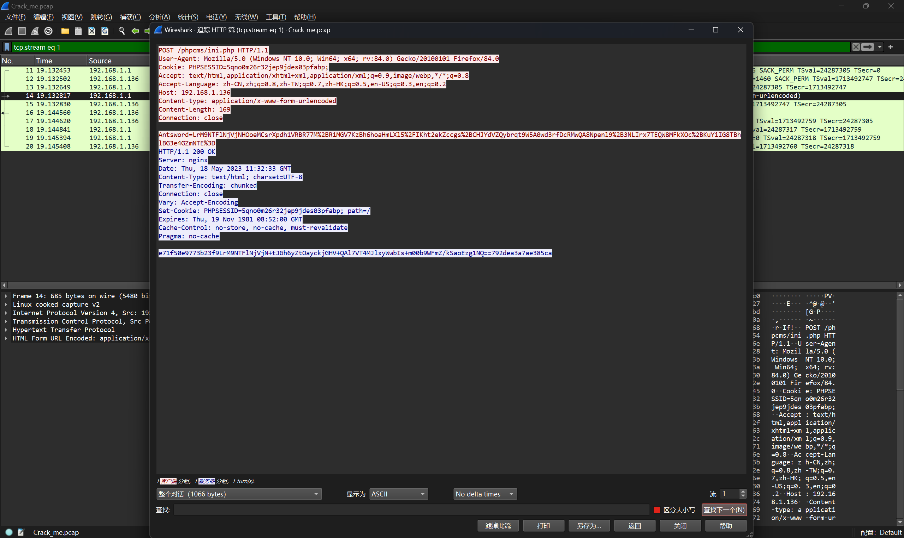

# 2024 楚慧杯网络与数据安全实践能力竞赛 Misc Writeup

**这比赛本身没啥好说的，竟然出现了这么多的原题，非常的难评只能说**

**但是如果就涉及到的题目本身而言，还是可以稍微记录一下的**
&lt;!--more--&gt;

&gt; 题目附件：https://pan.baidu.com/s/1SEs1_aHqH1Rsvd7R1WhL-g?pwd=tiui 提取码: tiui

## 题目名称 不良劫

附件给了一张PNG图片，但是010打开发现是JPG的文件头，因此我们需要改后缀为.jpg

然后再010打开，发现文件末尾藏了一张PNG图片

我们手动提取出来可以得到下图

发现是一张被污染的二维码，我们直接尝试提取红色通道中的图像，然后用PPT补上定位块

扫码得到前半段的flag：`DASCTF{014c6e74-0c4a-48fa`

然后我们再回头看那张jpg图片，经过尝试发现是单图盲水印

因此得到后半段flag：`-8b33-ced06f847e39}`

综上，最后的flag为：`DASCTF{014c6e74-0c4a-48fa-8b33-ced06f847e39}`

## 题目名称 gza_Cracker

附件给了一个流量包，翻看过后发现是蚁剑流量

然后其中一个流还传了一个字典，猜测需要用到这个字典中的一个密码去解密流量数据

## 题目名称 特殊流量2

## 题目名称 PixMatrix

---

> Author: [Lunatic](https://goodlunatic.github.io)  
> URL: http://localhost:1313/posts/69e332a/  

